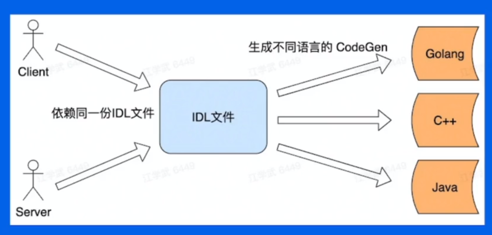
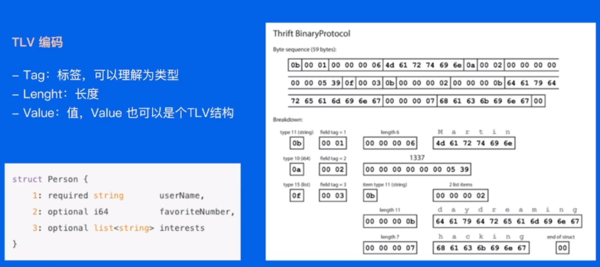
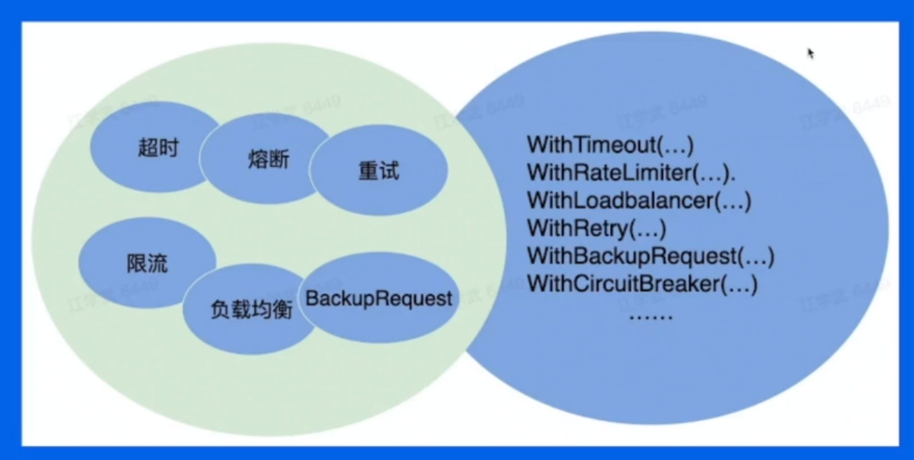
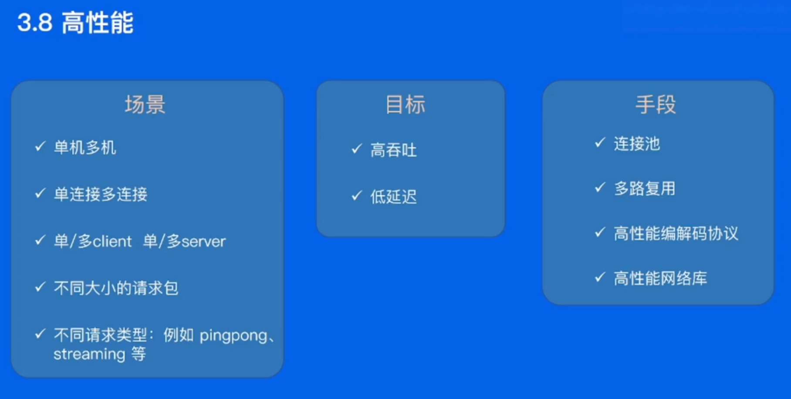

什么是 RPC、gRPC？

RPC 需要解决什么问题？

### RPC 调用过程

#### IDL

#### 生成代码

#### 编解码

#### 通信协议

#### 网络传输

### RPC 的优缺点

### 小结

- 本地函数调用和 RPC 调用的区别：函数映射、数据转换成字节流、网络传输
- RPC 的概念模型：User、User-Sub、RPC-Runtime、Server-Stub、Server
- 一次 RPC 的完整过程，以及 RPC 的基本概念定义

RPC 的分层设计

- 用户代码层：用户自己编写的业务逻辑代码
- 编解码层：通过代码生成工具把 IDL 文件转换成不同语言对应的 lib diamond，里面封装了编解码逻辑
- 协议层
- 网络通信层

### gRPC 框架（自顶向下）

编解码层

- 生成代码

- 数据格式

  - 语言特定的格式
  - 文本格式（JSON、CSV）
  - 二进制编码（具备跨语言和高性能等优点）

  

- 选择什么数据格式
  - 兼容性
  - 通用性：跨平台、跨语言
  - 性能：从空间和时间两个维度来考虑

### 协议层

- 边界
  - 特殊定位符
  - 变长

### 稳定性

##### 保障策略

- 熔断
- 限流
- 超时控制

##### 请求成功率

- 负载均衡
- 重试

#### 易用性

