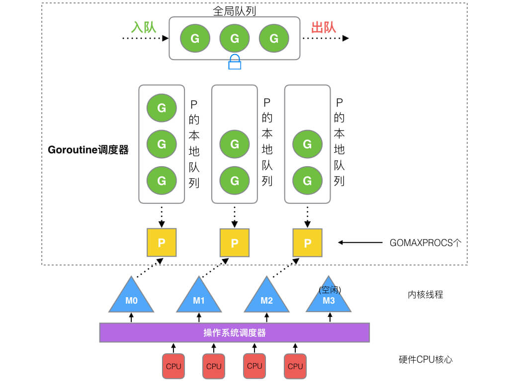

# Go与其他语言


## 什么是面向对象（OOP）

根据 Wikipedia 的定义，我们梳理出 OOP 的几个基本认知：

- 面向对象编程（OOP）是一种基于 “对象” 概念的编程范式，它可以包含数据和代码：数据以字段的形式存在（通常称为属性），代码以程序的形式存在（通常称为方法）。
- 对象自己的程序可以访问并经常修改自己的数据字段。
- 对象经常被定义为类的一个实例。
- 对象利用属性和方法的私有/受保护/公共可见性，对象的内部状态受到保护，不受外界影响（被封装）。

基于这几个基本认知进行一步延伸出，**面向对象的三大基本特性**：

- 封装
- 继承
- 多态：多态就是一个接口，使用不同的实例实现不同的功能。如F1键在windows和linux的功能不同。


## Go语言和Java有什么区别?

1、函数重载

**go不允许函数重载**，必须具有方法和函数的唯一名称，而java支持重载。

2、在速度方面，go要比java快

3、 多态

java默认允许多态，而go没有，但是go可以通过接口和方法实现类似的功能。

4、路由配置

Go语言使用HTTP协议进行路由配置；而java使用Akka.routing.ConsistentHashingRouter和Akka.routing.ScatterGatherFirstCompletedRouter进行路由配置。

5、 可拓展性

go代码可以自动拓展到多个核心，而java并不总是具有足够的可拓展性

6、 对象传递

java中对象的方法会有隐藏的this指针传递，而go语言中对象传递没有隐藏的this指针，即go中方法的对象是显式传递的，并且传递的不一定是指针，也有可能是值传递。

7、 继承

Java中的继承使用extends关键字来完成，不支持多继承。而Go的继承可以通过匿名组合来完成，即基类以struct关键字定义，子类只需要把基类作为成员放在子类的定义中，同时，go支持多继承。

8、接口：

java中的接口作为不同组件中的契约存在，是强制的，类必须声明实现了某接口，需要从该接口继承。哪怕是两个一模一样的接口但只有名字不一样，也只能根据类所声明的实现接口是否包括该接口来决定该类是否实现该接口，叫做“侵入式”的接口。

而GO语言中采用的是非侵入式接口，一个类只需要实现接口要求的所有函数，那我们就说该类实现了该接口。GO语言可以通过接口进行接口查询（接口指向的对象是否实现了另外的接口），类型查询等。


## Go 是面向对象的语言吗？

是也不是。原因是：

1. Go 有类型和方法，并且允许面向对象的编程风格，但没有类型层次。
2. Go 中的 "接口 "概念提供了一种不同的方法，我们认为这种方法易于使用，而且在某些方面更加通用。还有一些方法可以将类型嵌入到其他类型中，以提供类似的东西，但不等同于子类。
3. Go 中的方法比 C++ 或 Java 中的方法更通用：它们可以为任何类型的数据定义，甚至是内置类型，如普通的、"未装箱的 "整数。它们并不局限于结构（类）。
4. Go 由于缺乏类型层次，Go 中的 "对象 "比 C++ 或 Java 等语言更轻巧。


## Go 实现面向对象编程

### 封装

面向对象中的“封装”指的是可以隐藏对象的内部属性和实现细节，仅对外提供公开接口的使用，而用户无需关注内部是如何实现的。

在c++和java中，使用关键字来设置属性的访问权限，而在go中，实行访问权限可以通过设置首字母大小写来控制：

- 首字母大写，代表是公共的、可被外部访问的。
- 首字母小写，代表是私有的，不可以被外部访问。

Go 语言的例子如下：

```
type Animal struct {
	name string
}

func NewAnimal() *Animal {
 	return &Animal{}
}

func (p *Animal) SetName(name string) {
 	p.name = name
}

func (p *Animal) GetName() string {
 	return p.name
}
```

在上述例子中，我们声明了一个结构体 Animal，其属性 name 为小写。没法通过外部方法，**在配套上存在 Setter 和 Getter 的方法，用于统一的访问和设置控制。**

以此实现在 Go 语言中的基本封装。


### 继承

面向对象中的 “继承” 指的是子类继承父类的特征和行为，使得子类对象（实例）具有父类的实例域和方法，或子类从父类继承方法，使得子类具有父类相同的行为。

从实际的例子来看，就是动物是一个大父类，下面又能细分为 “食草动物”、“食肉动物”，这两者会包含 “动物” 这个父类的基本定义。

**在 Go 语言中，是没有类似** **extends** **关键字的这种继承的方式，在语言设计上采取的是组合的方式**，从而达到了更好的低耦合：

> 高内聚：尽可能类的每个成员方法只完成一件事（最大限度的聚合）； 低耦合：减少类内部，一个成员方法调用另一个成员方法。

```
type Animal struct {
 	Name string
}

type Cat struct {
 	Animal
 	FeatureA string
}

type Dog struct {
 	Animal
 	FeatureB string
}
```

在上述例子中，我们声明了 Cat 和 Dog 结构体，其在内部匿名组合了 Animal 结构体。因此 Cat 和 Dog 的实例都可以调用 Animal 结构体的方法：

```
func main() {
 	p := NewAnimal()
 	p.SetName("我是搬运工，去给煎鱼点赞~")

 	dog := Dog{Animal: *p}
 	fmt.Println(dog.GetName())
}
```

同时 Cat 和 Dog 的实例可以拥有自己的方法：

```
func (dog *Dog) HelloWorld() {
 	fmt.Println("脑子进煎鱼了")
}

func (cat *Cat) HelloWorld() {
 	fmt.Println("煎鱼进脑子了")
}
```

上述例子能够正常包含调用 Animal 的相关属性和方法，也能够拥有自己的独立属性和方法，在 Go 语言中达到了类似继承的效果。


### 多态

面向对象中的 “多态” 指的同一个行为具有多种不同表现形式或形态的能力，具体是指一个类实例（对象）的相同方法在不同情形有不同表现形式。

多态也使得不同内部结构的对象可以共享相同的外部接口，也就是都是一套外部模板，内部实际是什么，只要符合规格就可以。

**在 Go 语言中，多态是通过接口来实现的：**

```go
type AnimalSounder interface {
 	MakeDNA()
}

func MakeSomeDNA(animalSounder AnimalSounder) {		// 参数是AnimalSounder接口类型
 	animalSounder.MakeDNA()
}
```

在上述例子中，我们声明了一个接口类型 AnimalSounder，配套一个 MakeSomeDNA 方法，其接受 AnimalSounder 接口类型作为入参。

因此在 Go 语言中。只要配套的 Cat 和 Dog 的实例也实现了 MakeSomeDNA 方法，那么我们就可以认为他是 AnimalSounder 接口类型：

```
type AnimalSounder interface {
 	MakeDNA()
}

func MakeSomeDNA(animalSounder AnimalSounder) {
 	animalSounder.MakeDNA()
}

func (c *Cat) MakeDNA() {
 	fmt.Println("煎鱼是煎鱼")
}

func (c *Dog) MakeDNA() {
 	fmt.Println("煎鱼其实不是煎鱼")
}

func main() {
 	MakeSomeDNA(&Cat{})
 	MakeSomeDNA(&Dog{})
}
```

**当 Cat 和 Dog 的实例实现了 AnimalSounder 接口类型的约束后，就意味着满足了条件，他们在 Go 语言中就是一个东西**。能够作为入参传入 MakeSomeDNA 方法中，**再根据不同的实例实现多态行为。**


------

在日常工作中，基本了解这些概念就可以了。若是面试，可以针对三大特性：“封装、继承、多态” 和 五大原则 “单一职责原则（SRP）、开放封闭原则（OCP）、里氏替换原则（LSP）、依赖倒置原则（DIP）、接口隔离原则（ISP）” 进行深入理解和说明。

### [面向对象的五大基本原则](https://blog.csdn.net/xiaowanzi_zj/article/details/126914321)

**1. 单一职责原则（Single Responsibility Principle）**

每一个类应该专注于做一件事情。

**2. 里氏替换原则（Liskov Substitution Principle）**

超类（父类）存在的地方，子类是可以替换的。

**3. 依赖倒置原则（Dependence Inversion Principle）**

实现尽量依赖抽象，不依赖具体实现。

**4. 接口隔离原则（Interface Segregation Principle）**

应当为客户端提供尽可能小的单独的接口，而不是提供大的总的接口。

**5. 迪米特法则（Law Of Demeter）**

又叫最少知识原则，一个软件实体应当尽可能少的与其他实体发生相互作用。

**6. 开闭原则（Open Close Principle）**

面向扩展开放，面向修改关闭。

**7. 组合/聚合复用原则（Composite/Aggregate Reuse Principle CARP）**

尽量使用合成/聚合达到复用，尽量少用继承。原则： 一个类中有另一个类的对象。


## go语言和python的区别

1、范例

Python是一种基于面向对象编程的多范式，命令式和函数式编程语言。它坚持这样一种观点，即如果一种语言在某些情境中表现出某种特定的方式，理想情况下它应该在所有情境中都有相似的作用。但是，**它又不是纯粹的OOP语言，它不支持强封装**，这是OOP的主要原则之一。

Go是一种基于并发编程范式的过程编程语言，它与C具有表面相似性。实际上，Go更像是C的更新版本。

2、类型化

**Python是动态类型语言，而Go是一种静态类型语言**，它实际上==有助于在编译时捕获错误==，这可以进一步减少生产后期的严重错误。

3、并发

Python没有提供内置的并发机制，而Go有内置的并发机制。

4、安全性

**Python是一种强类型语言**，它是经过编译的，因此增加了一层安全性。**Go具有分配给每个变量的类型**，因此，它提供了安全性。但是，如果发生任何错误，用户需要自己运行整个代码。

5、管理内存

Go允许程序员在很大程度上管理内存。而Python中的内存管理完全自动化并由Python VM管理；它不允许程序员对内存管理负责。

6、库

与Go相比，Python提供的库数量要大得多。然而，Go仍然是新的，并且还没有取得很大进展。

7、语法

Python的语法使用缩进来指示代码块。Go的语法基于打开和关闭括号。

8、详细程度

为了获得相同的功能，Golang代码通常需要编写比Python代码更多的字符。


# 基础部分


## 为什么选择golang

### golang 优点

1、 **高性能-协程** 

golang 源码级别支持协程，实现简单；对比进程和线程，协程占用资源少，能够简洁高效地处理高并发问题。

2、学习曲线容易

Go语言语法简单，包含了类C语法。因为Go语言容易学习，所以一个普通的大学生花几个星期就能写出来可以上手的、高性能的应用。在国内大家都追求快，这也是为什么国内Go流行的原因之一。

Go 语言的语法特性简直是太简单了，简单到你几乎玩不出什么花招，直来直去的，学习曲线很低，上手非常快。

**3、效率：快速的编译时间，开发效率和运行效率高**

开发过程中相较于 Java 和 C++呆滞的编译速度，Go 的快速编译时间是一个主要的效率优势。Go拥有接近C的运行效率和接近PHP的开发效率。

C 语言的理念是信任程序员，保持语言的小巧，不屏蔽底层且底层友好，关注语言的执行效率和性能。而 Python 的姿态是用尽量少的代码完成尽量多的事。于是我能够感觉到，Go 语言想要把 C 和 Python 统一起来，这是多棒的一件事啊。

4、**出身名门、血统纯正**

之所以说Go出身名门，从Go语言的创造者就可见端倪，Go语言绝对血统纯正。其次Go语言出自Google公司，Google在业界的知名度和实力自然不用多说。Google公司聚集了一批牛人，在各种编程语言称雄争霸的局面下推出新的编程语言，自然有它的战略考虑。而且从Go语言的发展态势来看，Google对它这个新的宠儿还是很看重的，Go自然有一个良好的发展前途。

5、**自由高效：组合的思想、无侵入式的接口**

Go语言可以说是开发效率和运行效率二者的完美融合，天生的并发编程支持。Go语言支持当前所有的编程范式，包括过程式编程、面向对象编程、面向接口编程、函数式编程。程序员们可以各取所需、自由组合、想怎么玩就怎么玩。

6、强大的标准库 - 生态

背靠谷歌，生态丰富，轻松 go get 获取各种高质量轮子。用户可以专注于业务逻辑，避免重复造轮子。

这包括互联网应用、系统编程和网络编程。Go里面的标准库基本上已经是非常稳定了，特别是我这里提到的三个，网络层、系统层的库非常实用。Go 语言的 lib 库麻雀虽小五脏俱全。Go 语言的 lib 库中基本上有绝大多数常用的库，虽然有些库还不是很好，但我觉得不是问题，因为我相信在未来的发展中会把这些问题解决掉。

**7、部署方便：二进制文件，Copy部署**

部署简单，源码编译成执行文件后，可以直接运行，减少了对其它插件依赖。不像其它语言，执行文件依赖各种插件，各种库，研发机器运行正常，部署到生产环境，死活跑不起来 。

8**、简单的并发**

并行和异步编程几乎无痛点。Go 语言的 Goroutine 和 Channel 这两个神器简直就是并发和异步编程的巨大福音。像 C、C++、Java、Python 和 JavaScript 这些语言的并发和异步方式太控制就比较复杂了，而且容易出错，而 Go 解决这个问题非常地优雅和流畅。这对于编程多年受尽并发和异步折磨的编程者来说，完全就是让人眼前一亮的感觉。Go 是一种非常高效的语言，高度支持并发性。Go是为大数据、微服务、并发而生的一种编程语言。

Go 作为一门语言致力于使事情简单化。它并未引入很多新概念，而是聚焦于打造一门简单的语言，它使用起来异常快速并且简单。其唯一的创新之处是 goroutines 和通道。Goroutines 是 Go 面向线程的轻量级方法，而通道是 goroutines 之间通信的优先方式。

创建 Goroutines 的成本很低，只需几千个字节的额外内存，正由于此，才使得同时运行数百个甚至数千个 goroutines 成为可能。可以借助通道实现 goroutines 之间的通信。Goroutines 以及基于通道的并发性方法使其非常容易使用所有可用的 CPU 内核，并处理并发的 IO。相较于 Python/Java，在一个 goroutine 上运行一个函数需要最小的代码。

**9、稳定性**

Go拥有强大的编译检查、严格的编码规范和完整的软件生命周期工具，具有很强的稳定性，稳定压倒一切。那么为什么Go相比于其他程序会更稳定呢？这是因为Go提供了软件生命周期（开发、测试、部署、维护等等）的各个环节的工具，如go tool、gofmt、go test。

10**、跨平台** 很多语言都支持跨平台，把这个优点单独拿出来，貌似没有什么值得称道的，但是结合上述优点，它的综合能力就非常强了。


### golang 缺点

①右大括号不允许换行，否则编译报错

**②不允许有未使用的包或变量**

**③错误处理原始，虽然引入了defer、panic、recover处理出错后的逻辑，函数可以返回多个值，但基本依靠返回错误是否为空来判断函数是否执行成功，if err != nil语句较多，比较繁琐，程序没有java美观。**(官方解释：提供了多个返回值，处理错误方便，如加入异常机制会要求记住一些常见异常，例如IOException，go的错误Error类型较统一方便) 

**④[]interface{}不支持下标操作**

**⑤struct没有构造和析构，一些资源申请和释放动作不太方便**

**⑥仍然保留C/C++的指针操作，取地址&，取值\***


## 1、golang 中 make 和 new 的区别？

**共同点：**

- 给变量分配内存
- 堆空间分配

**不同点：**

- 作用变量类型不同：new根据传入的类型分配一块内存空间，并返回指向这块内存空间的指针，而make只能初始化slice、map和channel这几个内置的数据结构；
- 返回的类型不同，new返回的是指向变量的指针*type，而make返回的是变量本身
- new分配的空间被清零，make分配空间后还会进行初始化
- make和new内存分配是在堆上还是栈上？

[Golang中make与new有何区别](https://www.topgoer.cn/docs/golangxiuyang/golangxiuyang-1cmedvtt2smg9)


## 2、[IO多路复用](https://zhuanlan.zhihu.com/p/115220699)

### 流？I/O操作? 阻塞？

#### (1) 流

- 可以进行I/O操作的内核对象
- 文件、管道、套接字……
- 流的入口：文件描述符(fd)

#### (2) I/O操作

所有对流的读写操作，我们都可以称之为IO操作。

当一个流中， 在没有数据read的时候，或者说在流中已经写满了数据，再write，我们的IO操作就会出现一种现象，就是阻塞现象，如下图。

#### (3) 阻塞

 **阻塞场景**: 你有一份快递，家里有个座机，快递到了主动给你打电话，期间你可以休息。

**非阻塞，忙轮询场景**: 你性子比较急躁， 每分钟就要打电话询问快递小哥一次， 到底有没有到，快递员接你电话要停止运输，这样很耽误快递小哥的运输速度。

- 阻塞等待

空出大脑可以安心睡觉, 不影响快递员工作（不占用CPU宝贵的时间片）。

- 非阻塞，忙轮询

浪费时间，浪费电话费，占用快递员时间（占用CPU，系统资源）。

很明显，**阻塞等待这种方式，对于通信上是有明显优势的， 那么它有哪些弊端呢？**


 也就是同一时刻，你只能被动的处理一个快递员的签收业务，其他快递员打电话打不进来，只能干瞪眼等待。那么解决这个问题，家里多买N个座机， 但是依然是你一个人接，也处理不过来，需要用影分身术创建都个自己来接电话(采用多线程或者多进程）来处理。

**那么如果我们不借助影分身的方式(多线程/多进程)，该如何解决阻塞死等待的方法呢？**

##### 办法一：非阻塞、忙轮询

非阻塞忙轮询的方式，可以让用户分别与每个快递员取得联系，宏观上来看，是同时可以与多个快递员沟通(并发效果)、 但是快递员在于用户沟通时耽误前进的速度(浪费CPU)。

##### 办法二：select

我们可以开设一个代收网点，让快递员全部送到代收点。这个网店管理员叫select。这样我们就可以在家休息了，麻烦的事交给select就好了。当有快递的时候，select负责给我们打电话，期间在家休息睡觉就好了。

但select 代收员比较懒，她记不住快递员的单号，还有快递货物的数量。她只会告诉你快递到了，但是是谁到的，你需要挨个快递员问一遍。

```
while true {
    select(流[]); //阻塞

  //有消息抵达
    for i in 流[] {
        if i has 数据 {
            读 或者 其他处理
        }
    }
}
```

##### 办法三：epoll

epoll的服务态度要比select好很多，在通知我们的时候，不仅告诉我们有几个快递到了，还分别告诉我们是谁谁谁。我们只需要按照epoll给的答复，来询问快递员取快递即可。

```
while true {
    可处理的流[] = epoll_wait(epoll_fd); //阻塞

  //有消息抵达，全部放在 “可处理的流[]”中
    for i in 可处理的流[] {
        读 或者 其他处理
    }
}
```

显然，select和epoll的区别就是epoll会进行处理，而select直接将原数据提供给用户


## 3、for range 的时候它的地址会发生变化么？

```go
for a, b := range c {
    
}
```

在上面的代码中，**a、b只会在内存中存在一份**，即每次循环遍历都是使用值覆盖给a和b，a和b的内存地址保存不变。因此，在for循环里面开启goroutine，不可以直接把a、b的地址直接传给协程，而是每次遍历都新建一个临时变量。


## 4、go defer，多个 defer 的顺序，defer 在什么时机会修改返回值？

1、在go语言中，可以使用defer关键字来延迟调用，即当目前的函数调用结束时，在返回前会调用defer关键字修饰的函数。

2、多个defer的顺序使用的是`FILO`（先进后出）的压栈顺序来顺序执行的

3、defer会在当前函数块运行结束时


## 5、 Goroutine调度器的GMP模型的设计思想


**Processor，它包含了运行goroutine的资源**，如果线程想运行goroutine，必须先获取P，P中还包含了可运行的G队列。

### (1)GMP模型

在Go中，**线程是运行goroutine的实体，调度器的功能是把可运行的goroutine分配到工作线程上**。



1. **全局队列**（Global Queue）：存放等待运行的G。
2. **P的本地队列**：同全局队列类似，存放的也是等待运行的G，存的数量有限，不超过256个。新建G’时，G’优先加入到P的本地队列，如果队列满了，则会把本地队列中一半的G移动到全局队列。
3. **P列表**：所有的P都在程序启动时创建，并保存在数组中，最多有`GOMAXPROCS`(可配置)个。
4. **M**：线程想运行任务就得获取P，从P的本地队列获取G，<u>P队列为空时，M也会尝试从全局队列**拿**一批G放到P的本地队列，或从其他P的本地队列**偷**一半放到自己P的本地队列。M运行G，G执行之后，M会从P获取下一个G，不断重复下去。</u>

**Goroutine调度器和OS调度器是通过M结合起来的，每个M都代表了1个内核线程，OS调度器负责把内核线程分配到CPU的核上执行**。

> #### 有关P和M的个数问题

1、P的数量：

- 由启动时环境变量`$GOMAXPROCS`或者是由`runtime`的方法`GOMAXPROCS()`决定。这意味着在程序执行的任意时刻都只有`$GOMAXPROCS`个goroutine在同时运行。

2、M的数量:

- go语言本身的限制：go程序启动时，会设置M的最大数量，默认10000.但是内核很难支持这么多的线程数，所以这个限制可以忽略。
- runtime/debug中的SetMaxThreads函数，设置M的最大数量
- 一个M阻塞了，会创建新的M。

M与P的数量没有绝对关系，一个M阻塞，P就会去创建或者切换另一个M，所以，即使P的默认数量是1，也有可能会创建很多个M出来。

> #### P和M何时会被创建

1、P何时创建：在确定了P的最大数量n后，运行时系统会根据这个数量创建n个P。

2、M何时创建：没有足够的M来关联P并运行其中的可运行的G。比如所有的M此时都阻塞住了，而P中还有很多就绪任务，就会去寻找空闲的M，而没有空闲的，就会去创建新的M。

### (2)调度器的设计策略

**复用线程**：避免频繁的创建、销毁线程，而是对线程的复用。

1）work stealing机制

 当本线程无可运行的G时，尝试从其他线程绑定的P偷取G，而不是销毁线程。

2）hand off机制

 当本线程因为G进行系统调用阻塞时，线程释放绑定的P，把P转移给其他空闲的线程执行。

**利用并行**：`GOMAXPROCS`设置P的数量，最多有`GOMAXPROCS`个线程分布在多个CPU上同时运行。`GOMAXPROCS`也限制了并发的程度，比如`GOMAXPROCS = 核数/2`，则最多利用了一半的CPU核进行并行。

**抢占**：在coroutine中要等待一个协程主动让出CPU才执行下一个协程，在Go中，一个goroutine最多占用CPU 10ms，防止其他goroutine被饿死，这就是goroutine不同于coroutine的一个地方。

**全局G队列**：在新的调度器中依然有全局G队列，但功能已经被弱化了，当M执行work stealing从其他P偷不到G时，它可以从全局G队列获取G。

### (3) go func() 调度流程


从上图我们可以分析出几个结论：

 1、我们通过 go func()来创建一个goroutine；

 2、有两个存储G的队列，一个是局部调度器P的本地队列、一个是全局G队列。新创建的G会先保存在P的本地队列中，如果P的本地队列已经满了就会保存在全局的队列中；

 3、**G只能运行在M中，一个M必须持有一个P，M与P是1：1的关系。**M会从P的本地队列弹出一个可执行状态的G来执行，如果P的本地队列为空，就会想其他的MP组合偷取一个可执行的G来执行；

 4、一个M调度G执行的过程是一个循环机制；

 5、当M执行某一个G时候如果发生了syscall或则其余阻塞操作，M会阻塞，如果当前有一些G在执行，runtime会把这个线程M从P中摘除(detach)，然后再创建一个新的操作系统的线程(如果有空闲的线程可用就复用空闲线程)来服务于这个P；

 6、当M系统调用结束时候，这个G会尝试获取一个空闲的P执行，并放入到这个P的本地队列。如果获取不到P，那么这个线程M变成休眠状态， 加入到空闲线程中，然后这个G会被放入全局队列中。

### (4)调度器的生命周期


具体看：[Golang的协程调度器原理及GMP设计思想-地鼠文档 (topgoer.cn)](https://www.topgoer.cn/docs/golangxiuyang/golangxiuyang-1cmeduvk27bo0)


## 6、 Golang编译器得逃逸分析

 go语言编译器会自动决定把一个变量放在栈还是放在堆，编译器会做**逃逸分析(escape analysis)**，**当发现变量的作用域没有跑出函数范围，就可以在栈上，反之则必须分配在堆**。
go语言声称这样可以释放程序员关于内存的使用限制，更多的让程序员关注于程序功能逻辑本身。

Golang中一个函数内局部变量，不管是不是动态new出来的，它会被分配在堆还是栈，是由编译器做逃逸分析之后做出的决定。


## 7、 [Golang三色标记+混合写屏障GC模式全分析](https://www.topgoer.cn/docs/golangxiuyang/golangxiuyang-1cmee076rjgk7)


## 8、 interface接口

1. interface 是方法声明的集合
2. 任何类型的对象实现了在interface 接口中声明的全部方法，则表明该类型实现了该接口。
3. interface 可以作为一种数据类型，实现了该接口的任何对象都可以给对应的接口类型变量赋值。

注意：
　　a. interface 可以被任意对象实现，一个类型/对象也可以实现多个 interface
　　b. 方法不能重载，如 `eat(), eat(s string)` 不能同时存在


# 相关链接

[1、Golang修养之路](https://www.topgoer.cn/docs/golangxiuyang/golangxiuyang-1cmedc59gtgpi)

