# 硬件结构


## CPU 是如何执行程序的？

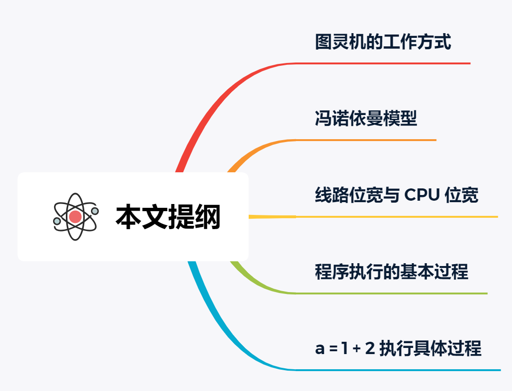


### 图灵机的工作方式

要想知道程序执行的原理，我们可以先从「图灵机」说起，图灵的基本思想是用机器来模拟人们用纸笔进行数学运算的过程，而且还定义了计算机由哪些部分组成，程序又是如何执行的。

图灵机长什么样子呢？你从下图可以看到图灵机的实际样子：


图灵机的基本组成如下：

- 有一条「纸带」，纸带由一个个连续的格子组成，每个格子可以写入字符，纸带就好比内存，而纸带上的格子的字符就好比内存中的数据或程序；
- 有一个「读写头」，读写头可以读取纸带上任意格子的字符，也可以把字符写入到纸带的格子；
- 读写头上有一些部件，比如存储单元、控制单元以及运算单元： 1、存储单元用于存放数据； 2、控制单元用于识别字符是数据还是指令，以及控制程序的流程等； 3、运算单元用于执行运算指令；

知道了图灵机的组成后，我们以简单数学运算的 `1 + 2` 作为例子，来看看它是怎么执行这行代码的。

- 首先，用读写头把 「1、2、+」这 3 个字符分别写入到纸带上的 3 个格子，然后读写头先停在 1 字符对应的格子上；


- 接着，读写头读入 1 到存储设备中，这个存储设备称为图灵机的状态；

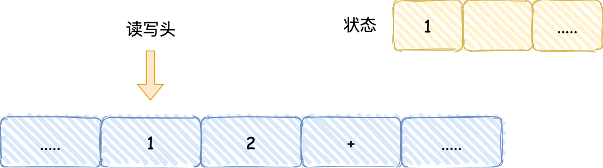

- 然后读写头向右移动一个格，用同样的方式把 2 读入到图灵机的状态，于是现在图灵机的状态中存储着两个连续的数字， 1 和 2；


- 读写头再往右移动一个格，就会碰到 + 号，读写头读到 + 号后，将 + 号传输给「控制单元」，控制单元发现是一个 + 号而不是数字，所以没有存入到状态中，因为 `+` 号是运算符指令，作用是加和目前的状态，于是通知「运算单元」工作。运算单元收到要加和状态中的值的通知后，就会把状态中的 1 和 2 读入并计算，再将计算的结果 3 存放到状态中；


- 最后，运算单元将结果返回给控制单元，控制单元将结果传输给读写头，读写头向右移动，把结果 3 写入到纸带的格子中；

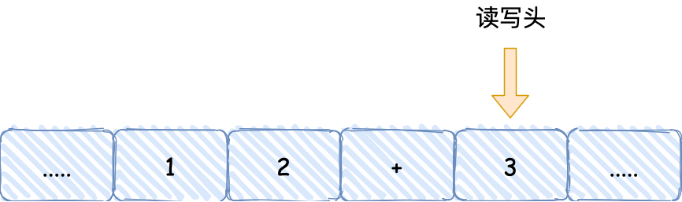

通过上面的图灵机计算 `1 + 2` 的过程，可以发现图灵机主要功能就是读取纸带格子中的内容，然后交给控制单元识别字符是数字还是运算符指令，如果是数字则存入到图灵机状态中，如果是运算符，则通知运算符单元读取状态中的数值进行计算，计算结果最终返回给读写头，读写头把结果写入到纸带的格子中。

事实上，图灵机这个看起来很简单的工作方式，和我们今天的计算机是基本一样的。接下来，我们一同再看看当今计算机的组成以及工作方式。


### 冯诺依曼模型

在 1945 年冯诺依曼和其他计算机科学家们提出了计算机具体实现的报告，其遵循了图灵机的设计，而且还提出用电子元件构造计算机，并约定了用二进制进行计算和存储。

最重要的是定义计算机基本结构为 5 个部分，分别是**运算器、控制器、存储器、输入设备、输出设备**，这 5 个部分也被称为**冯诺依曼模型**。

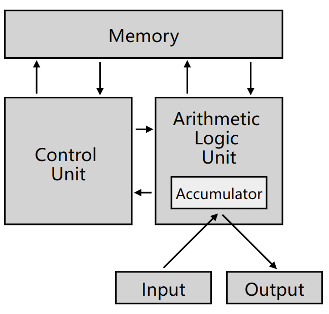

运算器、控制器是在中央处理器里的，存储器就我们常见的内存，输入输出设备则是计算机外接的设备，比如键盘就是输入设备，显示器就是输出设备。

存储单元和输入输出设备要与中央处理器打交道的话，离不开总线。所以，它们之间的关系如下图：

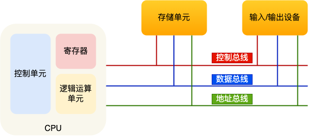

接下来，分别介绍内存、中央处理器、总线、输入输出设备。


#### 内存

我们的程序和数据都是存储在内存，存储的区域是线性的。

在计算机数据存储中，存储数据的基本单位是**字节（byte）**，1 字节等于 8 位（8 bit）。每一个字节都对应一个内存地址。

内存的地址是从 0 开始编号的，然后自增排列，最后一个地址为内存总字节数 - 1，这种结构好似我们程序里的数组，所以内存的读写任何一个数据的速度都是一样的。


#### 中央处理器

中央处理器也就是我们常说的 CPU，32 位和 64 位 CPU 最主要区别在于**一次能计算多少字节数据**：

- 32 位 CPU 一次可以计算 4 个字节；
- 64 位 CPU 一次可以计算 8 个字节；

这里的 32 位和 64 位，通常称为 CPU 的位宽，代表的是 CPU 一次可以计算（运算）的数据量。

之所以 CPU 要这样设计，是为了能计算更大的数值，如果是 8 位的 CPU，那么一次只能计算 1 个字节 `0~255` 范围内的数值，这样就无法一次完成计算 `10000 * 500` ，于是为了能一次计算大数的运算，CPU 需要支持多个 byte 一起计算，所以 CPU 位宽越大，可以计算的数值就越大，比如说 32 位 CPU 能计算的最大整数是 `4294967295`。

CPU 内部还有一些组件，常见的有**寄存器、控制单元和逻辑运算单元**等。其中，控制单元负责控制 CPU 工作，逻辑运算单元负责计算，而寄存器可以分为多种类，每种寄存器的功能又不尽相同。

**CPU 中的寄存器主要作用是存储<u>计算时</u>的数据**，你可能好奇为什么有了内存还需要寄存器？原因很简单，因为内存离 CPU 太远了，而寄存器就在 CPU 里，还紧挨着控制单元和逻辑运算单元，自然计算时速度会很快。

常见的寄存器种类：

- *通用寄存器*，用来存放需要进行运算的数据，比如需要进行加和运算的两个数据。
- *程序计数器*，用来存储 CPU 要**执行下一条指令「所在的内存地址」**，注意不是存储了下一条要执行的指令，此时指令还在内存中，程序计数器只是存储了下一条指令「的地址」。
- *指令寄存器*，用来存放当前正在执行的指令，也就是指令本身，指令被执行完成之前，指令都存储在这里。


#### 总线

总线是用于 CPU 和内存以及其他设备之间的通信，总线可分为 3 种：

- *地址总线*，用于指定 CPU 将要操作的内存地址；
- *数据总线*，用于读写内存的数据；
- *控制总线*，用于发送和接收信号，比如中断、设备复位等信号，CPU 收到信号后自然进行响应，这时也需要控制总线；

当 CPU 要读写内存数据的时候，一般需要通过下面这三个总线：

- 首先要通过「地址总线」来指定内存的地址；
- 然后通过「控制总线」控制是读或写命令；
- 最后通过「数据总线」来传输数据；


#### 输入、输出设备

输入设备向计算机输入数据，计算机经过计算后，把数据输出给输出设备。期间，如果输入设备是键盘，按下按键时是需要和 CPU 进行交互的，这时就需要用到控制总线了。


### 线路位宽与 CPU 位宽

数据是如何通过线路传输的呢？其实是通过操作电压，低电压表示 0，高压电压则表示 1。

如果构造了高低高这样的信号，其实就是 101 二进制数据，十进制则表示 5，如果只有一条线路，就意味着每次只能传递 1 bit 的数据，即 0 或 1，那么传输 101 这个数据，就需要 3 次才能传输完成，这样的效率非常低。

这样一位一位传输的方式，称为串行，下一个 bit 必须等待上一个 bit 传输完成才能进行传输。当然，想一次多传一些数据，增加线路即可，这时数据就可以并行传输。

为了避免低效率的串行传输的方式，线路的位宽最好一次就能访问到所有的内存地址。

CPU 想要操作「内存地址」就需要「地址总线」：

- 如果地址总线只有 1 条，那每次只能表示 「0 或 1」这两种地址，所以 CPU 能操作的内存地址最大数量为 2（2^1）个（注意，不要理解成同时能操作 2 个内存地址）；
- 如果地址总线有 2 条，那么能表示 00、01、10、11 这四种地址，所以 CPU 能操作的内存地址最大数量为 4（2^2）个。

那么，想要 CPU 操作 4G 大的内存，那么就需要 32 条地址总线，因为 `2 ^ 32 = 4G`。

知道了线路位宽的意义后，我们再来看看 CPU 位宽。

CPU 的位宽最好不要小于线路位宽，比如 32 位 CPU 控制 40 位宽的地址总线和数据总线的话，工作起来就会非常复杂且麻烦，所以 32 位的 CPU 最好和 32 位宽的线路搭配，因为 32 位 CPU 一次最多只能操作 32 位宽的地址总线和数据总线。

如果用 32 位 CPU 去加和两个 64 位大小的数字，就需要把这 2 个 64 位的数字分成 2 个低位 32 位数字和 2 个高位 32 位数字来计算，先加个两个低位的 32 位数字，算出进位，然后加和两个高位的 32 位数字，最后再加上进位，就能算出结果了，可以发现 32 位 CPU 并不能一次性计算出加和两个 64 位数字的结果。

对于 64 位 CPU 就可以一次性算出加和两个 64 位数字的结果，因为 64 位 CPU 可以一次读入 64 位的数字，并且 64 位 CPU 内部的逻辑运算单元也支持 64 位数字的计算。

但是并不代表 64 位 CPU 性能比 32 位 CPU 高很多，很少应用需要算超过 32 位的数字，所以**如果计算的数额不超过 32 位数字的情况下，32 位和 64 位 CPU 之间没什么区别的，只有当计算超过 32 位数字的情况下，64 位的优势才能体现出来**。

另外，32 位 CPU 最大只能操作 4GB 内存，就算你装了 8 GB 内存条，也没用。而 64 位 CPU 寻址范围则很大，理论最大的寻址空间为 `2^64`


### 程序执行的基本过程

在前面，我们知道了程序在图灵机的执行过程，接下来我们来看看程序在冯诺依曼模型上是怎么执行的。

程序实际上是一条一条指令，所以程序的运行过程就是把每一条指令一步一步的执行起来，负责执行指令的就是 CPU 了。


那 CPU 执行程序的过程如下：

- 第一步，CPU 读取「程序计数器」的值，这个值是指令的内存地址，然后 CPU 的「控制单元」操作「地址总线」指定需要访问的内存地址，接着通知内存设备准备数据，数据准备好后通过「数据总线」将指令数据传给 CPU，CPU 收到内存传来的数据后，将这个指令数据存入到「指令寄存器」。
- 第二步，「程序计数器」的值自增，表示指向下一条指令。这个自增的大小，由 CPU 的位宽决定，比如 32 位的 CPU，指令是 4 个字节，需要 4 个内存地址存放，因此「程序计数器」的值会自增 4；
- 第三步，CPU 分析「指令寄存器」中的指令，确定指令的类型和参数，如果是计算类型的指令，就把指令交给「逻辑运算单元」运算；如果是存储类型的指令，则交由「控制单元」执行；

简单总结一下就是，一个程序执行的时候，CPU 会根据程序计数器里的内存地址，从内存里面把需要执行的指令读取到指令寄存器里面执行，然后根据指令长度自增，开始顺序读取下一条指令。

CPU 从程序计数器读取指令、到执行、再到下一条指令，这个过程会不断循环，直到程序执行结束，这个不断循环的过程被称为 **CPU 的指令周期**。


### a = 1 + 2 执行具体过程

知道了基本的程序执行过程后，接下来用 `a = 1 + 2` 的作为例子，进一步分析该程序在冯诺伊曼模型的执行过程。

CPU 是不认识 `a = 1 + 2` 这个字符串，这些字符串只是方便我们程序员认识，要想这段程序能跑起来，还需要把整个程序翻译成**汇编语言**的程序，这个过程称为编译成汇编代码。

针对汇编代码，我们还需要用汇编器翻译成机器码，这些机器码由 0 和 1 组成的机器语言，这一条条机器码，就是一条条的**计算机指令**，这个才是 CPU 能够真正认识的东西。

下面来看看 `a = 1 + 2` 在 32 位 CPU 的执行过程。

程序编译过程中，编译器通过分析代码，发现 1 和 2 是数据，于是程序运行时，内存会有个专门的区域来存放这些数据，这个区域就是「数据段」。如下图，数据 1 和 2 的区域位置：

- 数据 1 被存放到 0x200 位置；
- 数据 2 被存放到 0x204 位置；

注意，数据和指令是分开区域存放的，存放指令区域的地方称为「正文段」。


编译器会把 `a = 1 + 2` 翻译成 4 条指令（32位为4个字节，因此一条指令要占4个内存空间），存放到正文段中。如图，这 4 条指令被存放到了 0x100 ~ 0x10c 的区域中：

- 0x100 的内容是 `load` 指令将 0x200 地址中的数据 1 装入到寄存器 `R0`；
- 0x104 的内容是 `load` 指令将 0x204 地址中的数据 2 装入到寄存器 `R1`；
- 0x108 的内容是 `add` 指令将寄存器 `R0` 和 `R1` 的数据相加，并把结果存放到寄存器 `R2`；
- 0x10c 的内容是 `store` 指令将寄存器 `R2` 中的数据存回数据段中的 0x208 地址中，这个地址也就是变量 `a` 内存中的地址；

编译完成后，具体执行程序的时候，程序计数器会被设置为 0x100 地址，然后依次执行这 4 条指令。

上面的例子中，由于是在 32 位 CPU 执行的，因此一条指令是占 32 位大小，所以你会发现每条指令间隔 4 个字节。

而数据的大小是根据你在程序中指定的变量类型，比如 `int` 类型的数据则占 4 个字节，`char` 类型的数据则占 1 个字节。


#### 指令

上面的例子中，图中指令的内容我写的是简易的汇编代码，目的是为了方便理解指令的具体内容，事实上指令的内容是一串二进制数字的机器码，每条指令都有对应的机器码，CPU 通过解析机器码来知道指令的内容。

不同的 CPU 有不同的指令集，也就是对应着不同的汇编语言和不同的机器码，接下来选用最简单的 MIPS 指集，来看看机器码是如何生成的，这样也能明白二进制的机器码的具体含义。

MIPS 的指令是一个 32 位的整数，高 6 位代表着操作码，表示这条指令是一条什么样的指令，剩下的 26 位不同指令类型所表示的内容也就不相同，主要有三种类型R、I 和 J。


一起具体看看这三种类型的含义：

- *R 指令*，用在算术和逻辑操作，里面有读取和写入数据的寄存器地址。如果是逻辑位移操作，后面还有位移操作的「位移量」，而最后的「功能码」则是再前面的操作码不够的时候，扩展操作码来表示对应的具体指令的；
- *I 指令*，用在数据传输、条件分支等。这个类型的指令，就没有了位移量和功能码，也没有了第三个寄存器，而是把这三部分直接合并成了一个地址值或一个常数；
- *J 指令*，用在跳转，高 6 位之外的 26 位都是一个跳转后的地址；

接下来，我们把前面例子的这条指令：「`add` 指令将寄存器 `R0` 和 `R1` 的数据相加，并把结果放入到 `R2`」，翻译成机器码。

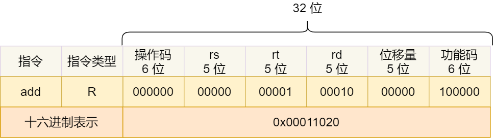

加和运算 add 指令是属于 R 指令类型：

- add 对应的 MIPS 指令里操作码是 `000000`，以及最末尾的功能码是 `100000`，这些数值都是固定的，查一下 MIPS 指令集的手册就能知道的；
- rs 代表第一个寄存器 R0 的编号，即 `00000`；
- rt 代表第二个寄存器 R1 的编号，即 `00001`；
- rd 代表目标的临时寄存器 R2 的编号，即 `00010`；
- 因为不是位移操作，所以位移量是 `00000`

把上面这些数字拼在一起就是一条 32 位的 MIPS 加法指令了，那么用 16 进制表示的机器码则是 `0x00011020`。

编译器在编译程序的时候，会构造指令，这个过程叫做指令的编码。CPU 执行程序的时候，就会解析指令，这个过程叫作指令的解码。

现代大多数 CPU 都使用来流水线的方式来执行指令，所谓的流水线就是把一个任务拆分成多个小任务，于是一条指令通常分为 4 个阶段，称为 4 级流水线，如下图：


四个阶段的具体含义：

1. CPU 通过程序计数器读取对应内存地址的指令，这个部分称为 **Fetch（取得指令）**；
2. CPU 对指令进行解码，这个部分称为 **Decode（指令译码）**；
3. CPU 执行指令，这个部分称为 **Execution（执行指令）**；
4. CPU 将计算结果存回寄存器或者将寄存器的值存入内存，这个部分称为 **Store（数据回写）**；

上面这 4 个阶段，我们称为**指令周期（Instrution Cycle）**，CPU 的工作就是一个周期接着一个周期，周而复始。

事实上，不同的阶段其实是由计算机中的不同组件完成的：


- 取指令的阶段，我们的指令是存放在**存储器**里的，实际上，通过程序计数器和指令寄存器取出指令的过程，是由**控制器**操作的；
- 指令的译码过程，也是由**控制器**进行的；
- 指令执行的过程，无论是进行算术操作、逻辑操作，还是进行数据传输、条件分支操作，都是由**算术逻辑单元**操作的，也就是由**运算器**处理的。但是如果是一个简单的无条件地址跳转，则是直接在**控制器**里面完成的，不需要用到运算器。


#### 指令的类型

指令从功能角度划分，可以分为 5 大类：

- *数据传输类型的指令*，比如 `store/load` 是寄存器与内存间数据传输的指令，`mov` 是将一个内存地址的数据移动到另一个内存地址的指令；
- *运算类型的指令*，比如加减乘除、位运算、比较大小等等，它们最多只能处理两个寄存器中的数据；
- *跳转类型的指令*，通过修改程序计数器的值来达到跳转执行指令的过程，比如编程中常见的 `if-else`、`switch-case`、函数调用等。
- *信号类型的指令*，比如发生中断的指令 `trap`；
- *闲置类型的指令*，比如指令 `nop`，执行后 CPU 会空转一个周期；


#### 指令的执行速度

CPU 的硬件参数都会有 `GHz` 这个参数，比如一个 1 GHz 的 CPU，指的是时钟频率是 1 G，代表着 1 秒会产生 1G 次数的脉冲信号，每一次脉冲信号高低电平的转换就是一个周期，称为时钟周期。

对于 CPU 来说，在一个时钟周期内，CPU 仅能完成一个最基本的动作，时钟频率越高，时钟周期就越短，工作速度也就越快。

一个时钟周期一定能执行完一条指令吗？答案是不一定的，大多数指令不能在一个时钟周期完成，通常需要若干个时钟周期。不同的指令需要的时钟周期是不同的，加法和乘法都对应着一条 CPU 指令，但是乘法需要的时钟周期就要比加法多。

> 如何让程序跑的更快？

程序执行的时候，耗费的 CPU 时间少就说明程序是快的，对于程序的 CPU 执行时间，我们可以拆解成 **CPU 时钟周期数（CPU Cycles）和时钟周期时间（Clock Cycle Time）的乘积**。


时钟周期时间就是我们前面提及的 CPU 主频，主频越高说明 CPU 的工作速度就越快，比如我手头上的电脑的 CPU 是 2.4 GHz 四核 Intel Core i5，这里的 2.4 GHz 就是电脑的主频，时钟周期时间就是 1/2.4G。

要想 CPU 跑的更快，自然缩短时钟周期时间，也就是提升 CPU 主频，但是今非彼日，摩尔定律早已失效，当今的 CPU 主频已经很难再做到翻倍的效果了。

另外，换一个更好的 CPU，这个也是我们软件工程师控制不了的事情，我们应该把目光放到另外一个乘法因子 —— CPU 时钟周期数，如果能减少程序所需的 CPU 时钟周期数量，一样也是能提升程序的性能的。

对于 CPU 时钟周期数我们可以进一步拆解成：「**指令数 x 每条指令的平均时钟周期数（Cycles Per Instruction，简称 `CPI`）**」，于是程序的 CPU 执行时间的公式可变成如下：


因此，要想程序跑的更快，优化这三者即可：

- *指令数*，表示执行程序所需要多少条指令，以及哪些指令。这个层面是基本靠编译器来优化，毕竟同样的代码，在不同的编译器，编译出来的计算机指令会有各种不同的表示方式。
- *每条指令的平均时钟周期数 CPI*，表示一条指令需要多少个时钟周期数，现代大多数 CPU 通过流水线技术（Pipeline），让一条指令需要的 CPU 时钟周期数尽可能的少；
- *时钟周期时间*，表示计算机主频，取决于计算机硬件。有的 CPU 支持超频技术，打开了超频意味着把 CPU 内部的时钟给调快了，于是 CPU 工作速度就变快了，但是也是有代价的，CPU 跑的越快，散热的压力就会越大，CPU 会很容易奔溃。

很多厂商为了跑分而跑分，基本都是在这三个方面入手的哦，特别是超频这一块。


### 总结

最后我们再来回答开头的问题。

> 64 位相比 32 位 CPU 的优势在哪吗？64 位 CPU 的计算性能一定比 32 位 CPU 高很多吗？

64 位相比 32 位 CPU 的优势主要体现在两个方面：

- 64 位 CPU 可以一次计算超过 32 位的数字，而 32 位 CPU 如果要计算超过 32 位的数字，要分多步骤进行计算，效率就没那么高，但是大部分应用程序很少会计算那么大的数字，所以**只有运算大数字的时候，64 位 CPU 的优势才能体现出来，否则和 32 位 CPU 的计算性能相差不大**。
- 通常来说 64 位 CPU 的地址总线是 48 位，而 32 位 CPU 的地址总线是 32 位，所以 64 位 CPU 可以**寻址更大的物理内存空间**。如果一个 32 位 CPU 的地址总线是 32 位，那么该 CPU 最大寻址能力是 4G，即使你加了 8G 大小的物理内存，也还是只能寻址到 4G 大小的地址，而如果一个 64 位 CPU 的地址总线是 48 位，那么该 CPU 最大寻址能力是 `2^48`，远超于 32 位 CPU 最大寻址能力。

> 你知道软件的 32 位和 64 位之间的区别吗？再来 32 位的操作系统可以运行在 64 位的电脑上吗？64 位的操作系统可以运行在 32 位的电脑上吗？如果不行，原因是什么？

64 位和 32 位软件，实际上代表指令是 64 位还是 32 位的：

- 如果 32 位指令在 64 位机器上执行，需要一套兼容机制，就可以做到兼容运行了。但是**如果 64 位指令在 32 位机器上执行，就比较困难了，因为 32 位的寄存器存不下 64 位的指令**；
- 操作系统其实也是一种程序，我们也会看到操作系统会分成 32 位操作系统、64 位操作系统，其代表意义就是操作系统中程序的指令是多少位，比如 64 位操作系统，指令也就是 64 位，因此不能装在 32 位机器上。

总之，硬件的 64 位和 32 位指的是 CPU 的位宽，软件的 64 位和 32 位指的是指令的位宽。


## 磁盘比内存慢几万倍？

相信大家都知道内存和硬盘都属于计算机的存储设备，断电后内存的数据是会丢失的，而硬盘则不会，因为硬盘是持久化存储设备，同时也是一个 I/O 设备。

但其实 CPU 内部也有存储数据的组件，这个应该比较少人注意到，比如**寄存器、CPU L1/L2/L3 Cache** 也都是属于存储设备，只不过它们能存储的数据非常小，但是它们因为靠近 CPU 核心，所以访问速度都非常快，快过硬盘好几个数量级别。

问题来了，**那机械硬盘、固态硬盘、内存这三个存储器，到底和 CPU L1 Cache 相比速度差多少倍呢？**

在回答这个问题之前，我们先来看看「**存储器的层次结构**」，好让我们对存储器设备有一个整体的认识。

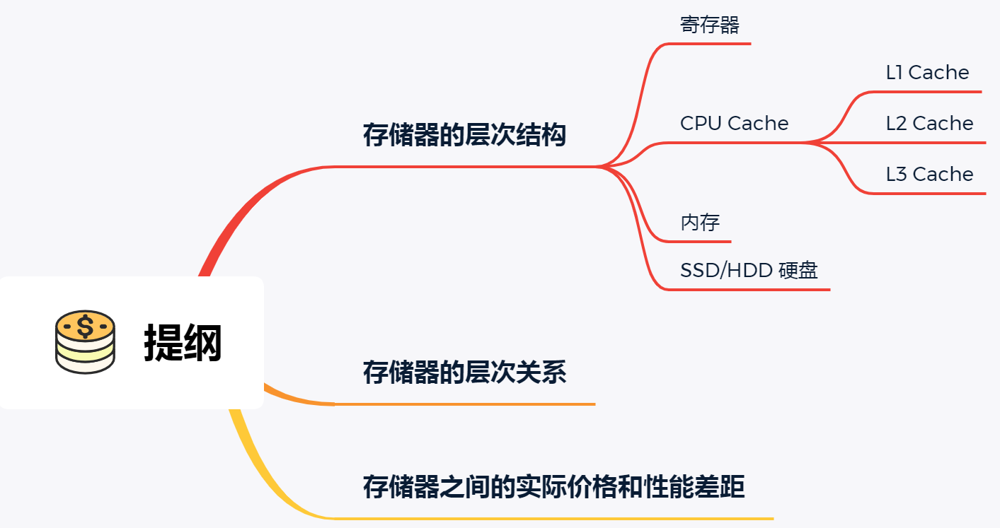


### 存储器的层次结构

我们想象中一个场景，大学期末准备考试了，你前去图书馆临时抱佛脚。那么，在看书的时候，我们的大脑会思考问题，也会记忆知识点，另外我们通常也会把常用的书放在自己的桌子上，当我们要找一本不常用的书，则会去图书馆的书架找。

就是这么一个小小的场景，已经把计算机的存储结构基本都涵盖了。

我们可以把 CPU 比喻成我们的大脑，大脑正在思考的东西，就好比 CPU 中的**寄存器**，处理速度是最快的，但是能存储的数据也是最少的，毕竟我们也不能一下同时思考太多的事情，除非你练过。

我们大脑中的记忆，就好比 **CPU Cache**，中文称为 CPU 高速缓存，处理速度相比寄存器慢了一点，但是能存储的数据也稍微多了一些。

CPU Cache 通常会分为 **L1、L2、L3 三层**，其中 L1 Cache 通常分成「数据缓存」和「指令缓存」，L1 是距离 CPU 最近的，因此它比 L2、L3 的读写速度都快、存储空间都小。我们大脑中短期记忆，就好比 L1 Cache，而长期记忆就好比 L2/L3 Cache。

寄存器和 CPU Cache 都是在 CPU 内部，跟 CPU 挨着很近，因此它们的读写速度都相当的快，但是能存储的数据很少，毕竟 CPU 就这么丁点大。

知道 CPU 内部的存储器的层次分布，我们放眼看看 CPU 外部的存储器。

当我们大脑记忆中没有资料的时候，可以从书桌或书架上拿书来阅读，那我们桌子上的书，就好比**内存**，我们虽然可以一伸手就可以拿到，但读写速度肯定远慢于寄存器，那图书馆书架上的书，就好比**硬盘**，能存储的数据非常大，但是读写速度相比内存差好几个数量级，更别说跟寄存器的差距了。

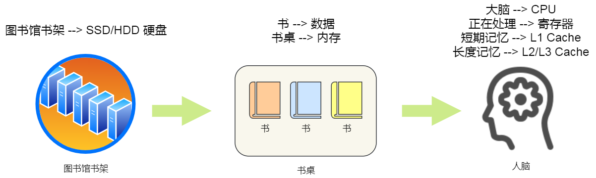

我们从图书馆书架取书，把书放到桌子上，再阅读书，我们大脑就会记忆知识点，然后再经过大脑思考，这一系列过程相当于，数据从硬盘加载到内存，再从内存加载到 CPU 的寄存器和 Cache 中，然后再通过 CPU 进行处理和计算。

**对于存储器，它的速度越快、能耗会越高、而且材料的成本也是越贵的，以至于速度快的存储器的容量都比较小。**

CPU 里的寄存器和 Cache，是整个计算机存储器中价格最贵的，虽然存储空间很小，但是读写速度是极快的，而相对比较便宜的内存和硬盘，速度肯定比不上 CPU 内部的存储器，但是能弥补存储空间的不足。

存储器通常可以分为这么几个级别：

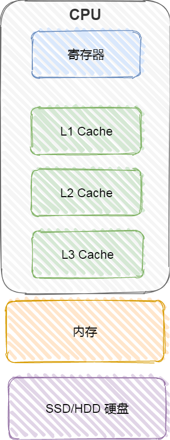


#### 寄存器

最靠近 CPU 的控制单元和逻辑计算单元的存储器，就是寄存器了，它使用的材料速度也是最快的，因此价格也是最贵的，那么数量不能很多。

寄存器的数量通常在几十到几百之间，每个寄存器可以用来存储一定的字节（byte）的数据。比如：

- 32 位 CPU 中大多数寄存器可以存储 `4` 个字节；
- 64 位 CPU 中大多数寄存器可以存储 `8` 个字节。

寄存器的访问速度非常快，一般要求在半个 CPU 时钟周期内完成读写，CPU 时钟周期跟 CPU 主频息息相关，比如 2 GHz 主频的 CPU，那么它的时钟周期就是 1/2G，也就是 0.5ns（纳秒）。

CPU 处理一条指令的时候，除了读写寄存器，还需要解码指令、控制指令执行和计算。如果寄存器的速度太慢，则会拉长指令的处理周期，从而给用户的感觉，就是电脑「很慢」。


#### CPU Cache

CPU Cache 用的是一种叫 **SRAM（Static Random-Access Memory，静态随机存储器）** 的芯片。

SRAM 之所以叫「静态」存储器，是因为只要有电，数据就可以保持存在，而一旦断电，数据就会丢失了。

在 SRAM 里面，一个 bit 的数据，通常需要 6 个晶体管，所以 SRAM 的存储密度不高，同样的物理空间下，能存储的数据是有限的，不过也因为 SRAM 的电路简单，所以访问速度非常快。

CPU 的高速缓存，通常可以分为 L1、L2、L3 这样的三层高速缓存，也称为一级缓存、二级缓存、三级缓存。


#### L1 高速缓存

L1 高速缓存的访问速度几乎和寄存器一样快，通常只需要 `2~4` 个时钟周期，而大小在几十 KB 到几百 KB 不等。

每个 CPU 核心都有一块属于自己的 L1 高速缓存，指令和数据在 L1 是分开存放的，所以 L1 高速缓存通常分成**指令缓存**和**数据缓存**。

在 Linux 系统，我们可以通过这条命令，查看 CPU 里的 L1 Cache 「数据」缓存的容量大小：

```bash
$ cat /sys/devices/system/cpu/cpu0/cache/index0/size
32K
```

而查看 L1 Cache 「指令」缓存的容量大小，则是：

```bash
$ cat /sys/devices/system/cpu/cpu0/cache/index1/size
32K
```


#### L2 高速缓存

L2 高速缓存同样每个 CPU 核心都有，但是 L2 高速缓存位置比 L1 高速缓存距离 CPU 核心 更远，它大小比 L1 高速缓存更大，CPU 型号不同大小也就不同，通常大小在几百 KB 到几 MB 不等，访问速度则更慢，速度在 `10~20` 个时钟周期。

在 Linux 系统，我们可以通过这条命令，查看 CPU 里的 L2 Cache 的容量大小：

```bash
$ cat /sys/devices/system/cpu/cpu0/cache/index2/size
256K
```


#### L3 高速缓存

L3 高速缓存通常是多个 CPU 核心共用的，位置比 L2 高速缓存距离 CPU 核心 更远，大小也会更大些，通常大小在几 MB 到几十 MB 不等，具体值根据 CPU 型号而定。

访问速度相对也比较慢一些，访问速度在 `20~60`个时钟周期。

在 Linux 系统，我们可以通过这条命令，查看 CPU 里的 L3 Cache 的容量大小：

```bash
$ cat /sys/devices/system/cpu/cpu0/cache/index3/size 
3072K
```


#### 内存

内存用的芯片和 CPU Cache 有所不同，它使用的是一种叫作 **DRAM （Dynamic Random Access Memory，动态随机存取存储器）** 的芯片。

相比 SRAM，DRAM 的密度更高，功耗更低，有更大的容量，而且造价比 SRAM 芯片便宜很多。

DRAM 存储一个 bit 数据，只需要一个晶体管和一个电容就能存储，但是因为数据会被存储在电容里，电容会不断漏电，所以需要「定时刷新」电容，才能保证数据不会被丢失，这就是 DRAM 之所以被称为「动态」存储器的原因，只有不断刷新，数据才能被存储起来。

DRAM 的数据访问电路和刷新电路都比 SRAM 更复杂，所以访问的速度会更慢，内存速度大概在 `200~300` 个 时钟周期之间。


#### SSD/HDD 硬盘

SSD（*Solid-state disk*） 就是我们常说的固体硬盘，结构和内存类似，但是它相比内存的优点是断电后数据还是存在的，而内存、寄存器、高速缓存断电后数据都会丢失。内存的读写速度比 SSD 大概快 `10~1000` 倍。

当然，还有一款传统的硬盘，也就是机械硬盘（*Hard Disk Drive, HDD*），它是通过物理读写的方式来访问数据的，因此它访问速度是非常慢的，它的速度比内存慢 `10W` 倍左右。

由于 SSD 的价格快接近机械硬盘了，因此机械硬盘已经逐渐被 SSD 替代了。


### 存储器的层次关系

**金字塔型，不能越级打交道。**

其中，存储空间越大的存储器设备，其访问速度越慢，所需成本也相对越少。

CPU 并不会直接和每一种存储器设备直接打交道，而是每一种存储器设备只和它相邻的存储器设备打交道。

比如，CPU Cache 的数据是从内存加载过来的，写回数据的时候也只写回到内存，CPU Cache 不会直接把数据写到硬盘，也不会直接从硬盘加载数据，而是先加载到内存，再从内存加载到 CPU Cache 中。

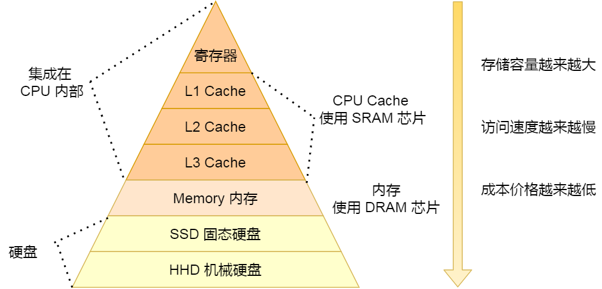

所以，**每个存储器只和相邻的一层存储器设备打交道，并且存储设备为了追求更快的速度，所需的材料成本必然也是更高，也正因为成本太高，所以 CPU 内部的寄存器、L1\L2\L3 Cache 只好用较小的容量，相反内存、硬盘则可用更大的容量，这就我们今天所说的存储器层次结构**。

另外，当 CPU 需要访问内存中某个数据的时候，如果寄存器有这个数据，CPU 就直接从寄存器取数据即可，如果寄存器没有这个数据，CPU 就会查询 L1 高速缓存，如果 L1 没有，则查询 L2 高速缓存，L2 还是没有的话就查询 L3 高速缓存，L3 依然没有的话，才去内存中取数据。

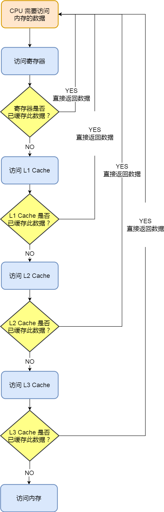

所以，存储层次结构也形成了**缓存**的体系。


### 存储器之间的实际价格和性能差距

前面我们知道了，速度越快的存储器，造价成本往往也越高，那我们就以实际的数据来看看，不同层级的存储器之间的性能和价格差异。

下面这张表格是不同层级的存储器之间的成本对比图：


你可以看到 L1 Cache 的访问延时是 1 纳秒，而内存已经是 100 纳秒了，相比 L1 Cache 速度慢了 `100` 倍。另外，机械硬盘的访问延时更是高达 10 毫秒，相比 L1 Cache 速度慢了 `10000000` 倍，差了好几个数量级别。

在价格上，每生成 MB 大小的 L1 Cache 相比内存贵了 `466` 倍，相比机械硬盘那更是贵了 `175000` 倍。

我在某东逛了下各个存储器设备的零售价，8G 内存 + 1T 机械硬盘 + 256G 固态硬盘的总价格，都不及一块 Intle i5-10400 的 CPU 的价格，这款 CPU 的高速缓存的总大小也就十多 MB。


### 总结

各种存储器之间的关系，可以用我们在图书馆学习这个场景来理解。

CPU 可以比喻成我们的大脑，我们当前正在思考和处理的知识的过程，就好比 CPU 中的**寄存器**处理数据的过程，速度极快，但是容量很小。而 CPU 中的 **L1-L3 Cache** 好比我们大脑中的短期记忆和长期记忆，需要小小花费点时间来调取数据并处理。

我们面前的桌子就相当于**内存**，能放下更多的书（数据），但是找起来和看起来就要花费一些时间，相比 CPU Cache 慢不少。而图书馆的书架相当于**硬盘**，能放下比内存更多的数据，但找起来就更费时间了，可以说是最慢的存储器设备了。

从 寄存器、CPU Cache，到内存、硬盘，这样一层层下来的存储器，访问速度越来越慢，存储容量越来越大，价格也越来越便宜，而且每个存储器只和相邻的一层存储器设备打交道，于是这样就形成了存储器的层次结构。

再来回答，开头的问题：那机械硬盘、固态硬盘、内存这三个存储器，到底和 `CPU L1 Cache` 相比速度差多少倍呢？

CPU L1 Cache 随机访问延时是 1 纳秒，内存则是 100 纳秒，所以 **CPU L1 Cache 比内存快 `100` 倍左右**。

SSD 随机访问延时是 150 微秒，所以 **CPU L1 Cache 比 SSD 快 `150000` 倍左右**。

最慢的机械硬盘随机访问延时已经高达 10 毫秒，我们来看看机械硬盘到底有多「龟速」：

- **SSD 比机械硬盘快 70 倍左右；**
- **内存比机械硬盘快 100000 倍左右；**
- **CPU L1 Cache 比机械硬盘快 10000000 倍左右；**

我们把上述的时间比例差异放大后，就能非常直观感受到它们的性能差异了。如果 CPU 访问 L1 Cache 的缓存时间是 1 秒，那访问内存则需要大约 2 分钟，随机访问 SSD 里的数据则需要 1.7 天，访问机械硬盘那更久，长达近 4 个月。

可以发现，不同的存储器之间性能差距很大，构造存储器分级很有意义，分级的目的是要构造**缓存**体系。


## 如何写出让 CPU 跑得更快的代码？

代码都是由 CPU 跑起来的，我们代码写的好与坏就决定了 CPU 的执行效率，特别是在编写计算密集型的程序，更要注重 CPU 的执行效率，否则将会大大影响系统性能。

CPU 内部嵌入了 CPU Cache（高速缓存），它的存储容量很小，但是离 CPU 核心很近，所以缓存的读写速度是极快的，那么如果 CPU 运算时，直接从 CPU Cache 读取数据，而不是从内存的话，运算速度就会很快。

但是，大多数人不知道 CPU Cache 的运行机制，以至于不知道如何才能够写出能够配合 CPU Cache 工作机制的代码，一旦你掌握了它，你写代码的时候，就有新的优化思路了。

那么，接下来我们就来看看，CPU Cache 到底是什么样的，是如何工作的呢，又该如何写出让 CPU 执行更快的代码呢？


### CPU Cache 有多快？

你可能会好奇为什么有了内存，还需要 CPU Cache？根据摩尔定律，CPU 的访问速度每 18 个月就会翻倍，相当于每年增长 60% 左右，内存的速度当然也会不断增长，但是增长的速度远小于 CPU，平均每年只增长 7% 左右。于是，CPU 与内存的访问性能的差距不断拉大。

到现在，一次内存访问所需时间是 `200~300` 多个时钟周期，这意味着 CPU 和内存的访问速度已经相差 `200~300` 多倍了。

为了弥补 CPU 与内存两者之间的性能差异，就在 CPU 内部引入了 CPU Cache，也称高速缓存。

CPU Cache 通常分为大小不等的三级缓存，分别是 **L1 Cache、L2 Cache 和 L3 Cache**。

由于 CPU Cache 所使用的材料是 SRAM，价格比内存使用的 DRAM 高出很多，在当今每生产 1 MB 大小的 CPU Cache 需要 7 美金的成本，而内存只需要 0.015 美金的成本，成本方面相差了 466 倍，所以 CPU Cache 不像内存那样动辄以 GB 计算，它的大小是以 KB 或 MB 来计算的。

在 Linux 系统中，我们可以使用下图的方式来查看各级 CPU Cache 的大小，比如我这手上这台服务器，离 CPU 核心最近的 L1 Cache 是 32KB，其次是 L2 Cache 是 256KB，最大的 L3 Cache 则是 3MB。

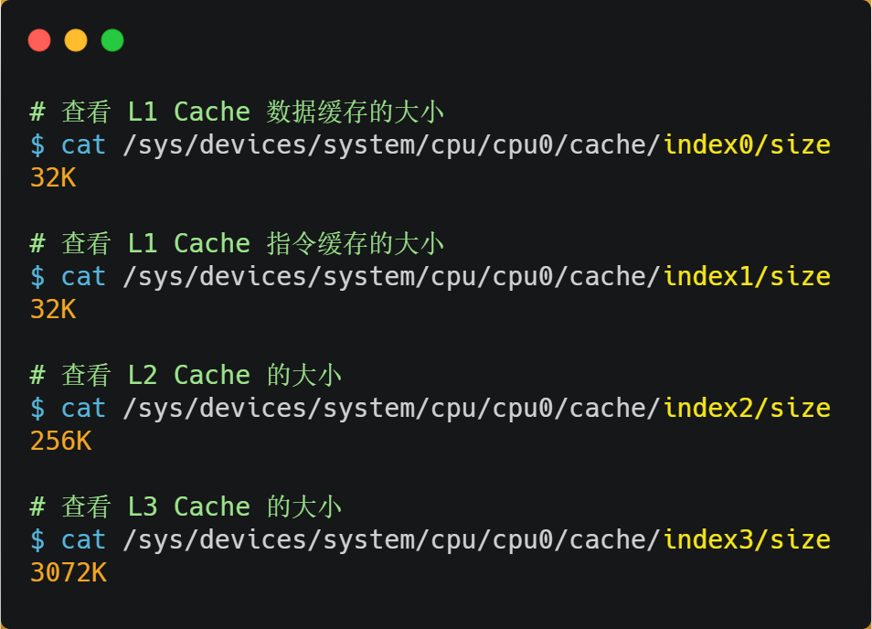

其中，**L1 Cache 通常会分为「数据缓存」和「指令缓存」**，这意味着数据和指令在 L1 Cache 这一层是分开缓存的，上图中的 `index0` 也就是数据缓存，而 `index1` 则是指令缓存，它两的大小通常是一样的。

另外，你也会注意到，L3 Cache 比 L1 Cache 和 L2 Cache 大很多，这是因为 **L1 Cache 和 L2 Cache 都是每个 CPU 核心独有的，而 L3 Cache 是多个 CPU 核心共享的。**

程序执行时，会先将内存中的数据加载到共享的 L3 Cache 中，再加载到每个核心独有的 L2 Cache，最后进入到最快的 L1 Cache，之后才会被 CPU 读取。它们之间的层级关系，如下图：

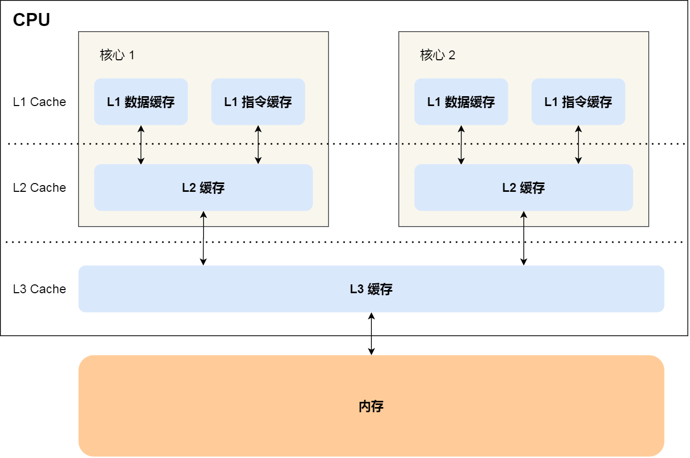

越靠近 CPU 核心的缓存其访问速度越快，CPU 访问 L1 Cache 只需要 `2~4` 个时钟周期，访问 L2 Cache 大约 `10~20` 个时钟周期，访问 L3 Cache 大约 `20~60` 个时钟周期，而访问内存速度大概在 `200~300` 个 时钟周期之间。如下表格：

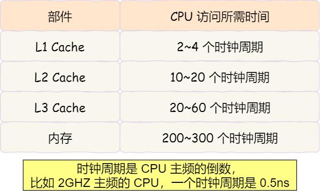

**所以，CPU 从 L1 Cache 读取数据的速度，相比从内存读取的速度，会快 `100` 多倍。**


### CPU Cache 的数据结构和读取过程是什么样的？

我们先简单了解下 CPU Cache 的结构，CPU Cache 是由很多个 Cache Line 组成的，**Cache Line 是 CPU 从内存读取数据的基本单位，**而 Cache Line 是由各种标志（Tag）+ 数据块（Data Block）组成，你可以在下图清晰的看到：


CPU Cache 的数据是从内存中读取过来的，它是以一小块一小块读取数据的，而不是按照单个数组元素来读取数据的，在 CPU Cache 中的，这样一小块一小块的数据，称为 **Cache Line（缓存块）**。

你可以在你的 Linux 系统，用下面这种方式来查看 CPU 的 Cache Line，你可以看我服务器的 L1 Cache Line 大小是 64 字节，也就意味着 **L1 Cache 一次载入数据的大小是 64 字节**。

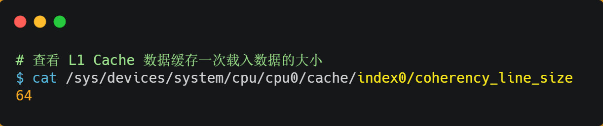

比如，有一个 `int array[100]` 的数组，当载入 `array[0]` 时，由于这个数组元素的大小在内存只占 4 字节，不足 64 字节，CPU 就会**顺序加载**数组元素到 `array[15]`，意味着 `array[0]~array[15]` 数组元素都会被缓存在 CPU Cache 中了，因此当下次访问这些数组元素时，会直接从 CPU Cache 读取，而不用再从内存中读取，大大提高了 CPU 读取数据的性能。

事实上，CPU 读取数据的时候，无论数据是否存放到 Cache 中，CPU 都是先访问 Cache，只有当 Cache 中找不到数据时，才会去访问内存，并把内存中的数据读入到 Cache 中，CPU 再从 CPU Cache 读取数据。


这样的访问机制，跟我们使用「内存作为硬盘的缓存」的逻辑是一样的，如果内存有缓存的数据，则直接返回，否则要访问龟速一般的硬盘。

那 CPU 怎么知道要访问的内存数据，是否在 Cache 里？如果在的话，如何找到 Cache 对应的数据呢？我们从最简单、基础的**直接映射 Cache（Direct Mapped Cache）** 说起，来看看整个 CPU Cache 的数据结构和访问逻辑。

前面，我们提到 CPU 访问内存数据时，是一小块一小块数据读取的，具体这一小块数据的大小，取决于 `coherency_line_size` 的值，一般 64 字节。在内存中，这一块的数据我们称为**内存块（Block）**，读取的时候我们要拿到数据所在内存块的地址。

对于直接映射 Cache 采用的策略，就是把内存块的地址始终「映射」在一个 CPU Cache Line（缓存块） 的地址，至于映射关系实现方式，则是使用「取模运算」，取模运算的结果就是内存块地址对应的 CPU Cache Line（缓存块） 的地址。

举个例子，内存共被划分为 32 个内存块，CPU Cache 共有 8 个 CPU Cache Line，假设 CPU 想要访问第 15 号内存块，如果 15 号内存块中的数据已经缓存在 CPU Cache Line 中的话，则是一定映射在 7 号 CPU Cache Line 中，因为 `15 % 8` 的值是 7。

机智的你肯定发现了，使用取模方式映射的话，就会出现多个内存块对应同一个 CPU Cache Line，比如上面的例子，除了 15 号内存块是映射在 7 号 CPU Cache Line 中，还有 7 号、23 号、31 号内存块都是映射到 7 号 CPU Cache Line 中。


因此，为了区别不同的内存块，在对应的 CPU Cache Line 中我们还会存储一个**组标记（Tag）**。这个组标记会记录当前 CPU Cache Line 中存储的数据对应的内存块（即主存字块标记是用来匹配找到的Cache Line（两者标记相同）是不是想要的，，如下图），我们可以用这个组标记来区分不同的内存块。


除了组标记信息外，CPU Cache Line 还有两个信息：

- 一个是，从内存加载过来的实际存放**数据（Data）**。
- 另一个是，**有效位（\*Valid bit\*）**，它是用来标记对应的 CPU Cache Line 中的数据是否是有效的，如果有效位是 0，无论 CPU Cache Line 中是否有数据，CPU 都会直接访问内存，重新加载数据。

CPU 在从 CPU Cache 读取数据的时候，并不是读取 CPU Cache Line 中的整个数据块，而是读取 CPU 所需要的一个数据片段，这样的数据统称为一个**字（Word）**。那怎么在对应的 CPU Cache Line 中数据块中找到所需的字呢？答案是，需要一个**偏移量（Offset）**。

因此，一个内存的访问地址，包括**组标记、CPU Cache Line 索引、偏移量**这三种信息，于是 CPU 就能通过这些信息，在 CPU Cache 中找到缓存的数据。而对于 CPU Cache 里的数据结构，则是由**索引 + 有效位 + 组标记 + 数据块**组成。


如果内存中的数据已经在 CPU Cache 中了，那 CPU 访问一个内存地址的时候，会经历这 4 个步骤：

1. 根据内存地址中索引信息，计算在 CPU Cache 中的索引，也就是找出对应的 CPU Cache Line 的地址；
2. 找到对应 CPU Cache Line 后，判断 CPU Cache Line 中的有效位，确认 CPU Cache Line 中数据是否是有效的，如果是无效的，CPU 就会直接访问内存，并重新加载数据，如果数据有效，则往下执行；
3. 对比内存地址中组标记和 CPU Cache Line 中的组标记，确认 CPU Cache Line 中的数据是我们要访问的内存数据，如果不是的话，CPU 就会直接访问内存，并重新加载数据，如果是的话，则往下执行；
4. 根据内存地址中偏移量信息，从 CPU Cache Line 的数据块中，读取对应的字。

到这里，相信你对直接映射 Cache 有了一定认识，但其实除了直接映射 Cache 之外，还有其他通过内存地址找到 CPU Cache 中的数据的策略，比如全相连 Cache （*Fully Associative Cache*）、组相连 Cache （*Set Associative Cache*）等，这几种策策略的数据结构都比较相似，我们理解了直接映射 Cache 的工作方式，其他的策略如果你有兴趣去看，相信很快就能理解的了。


### 如何写出让 CPU 跑得更快的代码？

我们知道 CPU 访问内存的速度，比访问 CPU Cache 的速度慢了 100 多倍，所以如果 CPU 所要操作的数据在 CPU Cache 中的话，这样将会带来很大的性能提升。访问的数据在 CPU Cache 中的话，意味着**缓存命中**，缓存命中率越高的话，代码的性能就会越好，CPU 也就跑的越快。

于是，**「如何写出让 CPU 跑得更快的代码？」这个问题，可以改成「如何写出 CPU 缓存命中率高的代码？」。**

在前面我也提到， L1 Cache 通常分为「数据缓存」和「指令缓存」，这是因为 CPU 会分别处理数据和指令，比如 `1+1=2` 这个运算，`+` 就是指令，会被放在「指令缓存」中，而输入数字 `1` 则会被放在「数据缓存」里。

因此，**我们要分开来看「数据缓存」和「指令缓存」的缓存命中率**。


#### 如何提升数据缓存的命中率？

假设要遍历二维数组，有以下两种形式，虽然代码执行结果是一样，但你觉得哪种形式效率最高呢？为什么高呢？

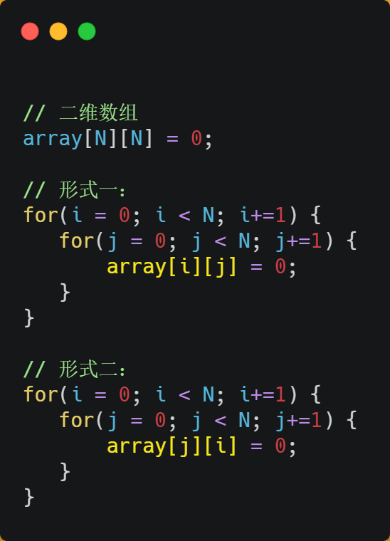

经过测试，形式一 `array[i][j]` 执行时间比形式二 `array[j][i]` 快好几倍。

之所以有这么大的差距，是因为二维数组 `array` 所占用的内存是连续的，比如长度 `N` 的值是 `2` 的话，那么内存中的数组元素的布局顺序是这样的：


形式一用 `array[i][j]` 访问数组元素的顺序，正是和内存中数组元素存放的顺序一致。当 CPU 访问 `array[0][0]` 时，由于该数据不在 Cache 中，于是会「顺序」把跟随其后的 3 个元素从内存中加载到 CPU Cache，这样当 CPU 访问后面的 3 个数组元素时，就能在 CPU Cache 中成功地找到数据，这意味着缓存命中率很高，缓存命中的数据不需要访问内存，这便大大提高了代码的性能。

而如果用形式二的 `array[j][i]` 来访问，则访问的顺序就是：

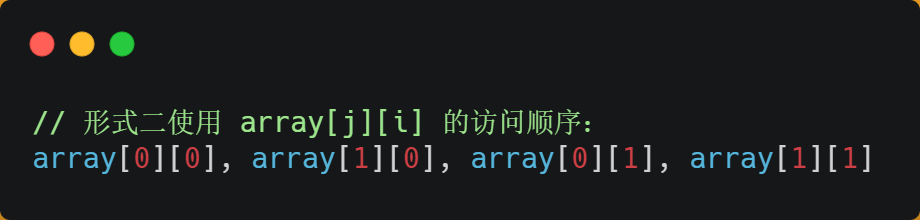

你可以看到，访问的方式跳跃式的，而不是顺序的，那么如果 N 的数值很大，那么操作 `array[j][i]` 时，是没办法把 `array[j+1][i]` 也读入到 CPU Cache 中的，既然 `array[j+1][i]` 没有读取到 CPU Cache，那么就需要从内存读取该数据元素了。很明显，这种不连续性、跳跃式访问数据元素的方式，可能不能充分利用到了 CPU Cache 的特性，从而代码的性能不高。

那访问 `array[0][0]` 元素时，CPU 具体会一次从内存中加载多少元素到 CPU Cache 呢？这个问题，在前面我们也提到过，这跟 CPU Cache Line 有关，它表示 **CPU Cache 一次性能加载数据的大小**，可以在 Linux 里通过 `coherency_line_size` 配置查看 它的大小，通常是 64 个字节。


也就是说，当 CPU 访问内存数据时，如果数据不在 CPU Cache 中，则会一次性会连续加载 64 字节大小的数据到 CPU Cache，那么当访问 `array[0][0]` 时，由于该元素不足 64 字节，于是就会往后**顺序**读取 `array[0][0]~array[0][15]` 到 CPU Cache 中。顺序访问的 `array[i][j]` 因为利用了这一特点，所以就会比跳跃式访问的 `array[j][i]` 要快。

**因此，遇到这种遍历数组的情况时，按照内存布局顺序访问，将可以有效的利用 CPU Cache 带来的好处，这样我们代码的性能就会得到很大的提升，**


#### 如何提升指令缓存的命中率？

提升数据的缓存命中率的方式，是按照内存布局顺序访问，那针对指令的缓存该如何提升呢？

我们以一个例子来看看，有一个元素为 0 到 100 之间随机数字组成的一维数组：

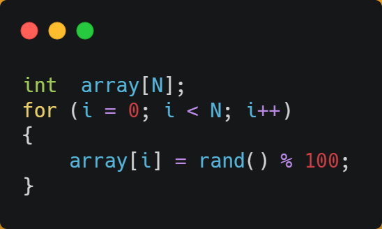

接下来，对这个数组做两个操作：

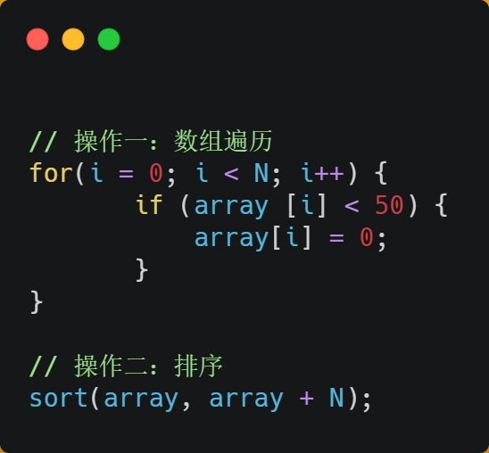

- 第一个操作，循环遍历数组，把小于 50 的数组元素置为 0；
- 第二个操作，将数组排序；

那么问题来了，你觉得先遍历再排序速度快，还是先排序再遍历速度快呢？

在回答这个问题之前，我们先了解 CPU 的**分支预测器**。对于 if 条件语句，意味着此时至少可以选择跳转到两段不同的指令执行，也就是 if 还是 else 中的指令。那么，**如果分支预测可以预测到接下来要执行 if 里的指令，还是 else 指令的话，就可以「提前」把这些指令放在指令缓存中，这样 CPU 可以直接从 Cache 读取到指令，于是执行速度就会很快**。

当数组中的元素是随机的，分支预测就无法有效工作，而当数组元素都是是顺序的，分支预测器会动态地根据历史命中数据对未来进行预测，这样命中率就会很高。

因此，先排序再遍历速度会更快，这是因为排序之后，数字是从小到大的，那么前几次循环命中 `if < 50` 的次数会比较多，于是分支预测就会缓存 `if` 里的 `array[i] = 0` 指令到 Cache 中，后续 CPU 执行该指令就只需要从 Cache 读取就好了。

如果你肯定代码中的 `if` 中的表达式判断为 `true` 的概率比较高，我们可以使用显示分支预测工具，比如在 C/C++ 语言中编译器提供了 `likely` 和 `unlikely` 这两种宏，如果 `if` 条件为 `ture` 的概率大，则可以用 `likely` 宏把 `if` 里的表达式包裹起来，反之用 `unlikely` 宏。

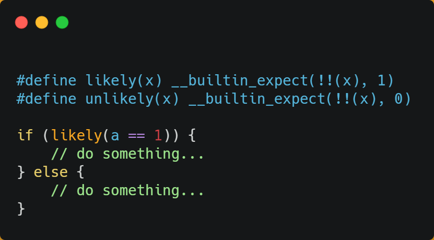

实际上，CPU 自身的动态分支预测已经是比较准的了，所以只有当非常确信 CPU 预测的不准，且能够知道实际的概率情况时，才建议使用这两种宏。


### 如何提升多核 CPU 的缓存命中率？

在单核 CPU，虽然只能执行一个线程，但是操作系统给每个线程分配了一个时间片，时间片用完了，就调度下一个线程，于是各个线程就按时间片交替地占用 CPU，从宏观上看起来各个线程同时在执行。

而现代 CPU 都是多核心的，线程可能在不同 CPU 核心来回切换执行，这对 CPU Cache 不是有利的，虽然 L3 Cache 是多核心之间共享的，但是 L1 和 L2 Cache 都是每个核心独有的，**如果一个线程在不同核心来回切换，各个核心的缓存命中率就会受到影响**，相反如果线程都在同一个核心上执行，那么其数据的 L1 和 L2 Cache 的缓存命中率可以得到有效提高，缓存命中率高就意味着 CPU 可以减少访问 内存的频率。

当有多个同时执行「计算密集型」的线程，为了防止因为切换到不同的核心，而导致缓存命中率下降的问题，我们可以把**线程绑定在某一个 CPU 核心上**，这样性能可以得到非常可观的提升。

在 Linux 上提供了 `sched_setaffinity` 方法，来实现将线程绑定到某个 CPU 核心这一功能。

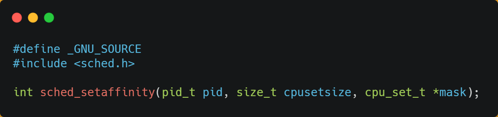


### 总结

由于随着计算机技术的发展，CPU 与 内存的访问速度相差越来越多，如今差距已经高达好几百倍了，所以 CPU 内部嵌入了 CPU Cache 组件，作为内存与 CPU 之间的缓存层，CPU Cache 由于离 CPU 核心很近，所以访问速度也是非常快的，但由于所需材料成本比较高，它不像内存动辄几个 GB 大小，而是仅有几十 KB 到 MB 大小。

当 CPU 访问数据的时候，先是访问 CPU Cache，如果缓存命中的话，则直接返回数据，就不用每次都从内存读取数据了。因**此，缓存命中率越高，代码的性能越好。**

但需要注意的是，当 CPU 访问数据时，如果 CPU Cache 没有缓存该数据，则会从内存读取数据，但是并不是只读一个数据，而是一次性读取一块一块的数据存放到 CPU Cache 中，之后才会被 CPU 读取。

内存地址映射到 CPU Cache 地址里的策略有很多种，其中比较简单是直接映射 Cache，它巧妙的把内存地址拆分成「索引 + 组标记 + 偏移量」的方式，使得我们可以将很大的内存地址，映射到很小的 CPU Cache 地址里。

要想写出让 CPU 跑得更快的代码，就需要写出缓存命中率高的代码，CPU L1 Cache 分为数据缓存和指令缓存，因而需要分别提高它们的缓存命中率：

- 对于数据缓存，我们在遍历数据的时候，应该按照内存布局的顺序操作，这是因为 CPU Cache 是根据 CPU Cache Line 批量操作数据的，所以顺序地操作连续内存数据时，性能能得到有效的提升；（访问连续的地址）
- 对于指令缓存，有规律的条件分支语句能够让 CPU 的分支预测器发挥作用，进一步提高执行的效率；（前后两次使用重复的语句）

另外，对于多核 CPU 系统，线程可能在不同 CPU 核心来回切换，这样各个核心的缓存命中率就会受到影响，于是要想提高线程的缓存命中率，可以考虑把线程绑定 CPU 到某一个 CPU 核心。


## CPU 缓存一致性


### CPU Cache 的数据写入

随着时间的推移，CPU 和内存的访问性能相差越来越大，于是就在 CPU 内部嵌入了 CPU Cache（高速缓存），CPU Cache 离 CPU 核心相当近，因此它的访问速度是很快的，于是它充当了 CPU 与内存之间的缓存角色。

CPU Cache 通常分为三级缓存：L1 Cache、L2 Cache、L3 Cache，级别越低的离 CPU 核心越近，访问速度也快，但是存储容量相对就会越小。其中，在多核心的 CPU 里，每个核心都有各自的 L1/L2 Cache，而 **L3 Cache 是所有核心共享使用的**。


我们先简单了解下 CPU Cache 的结构，CPU Cache 是由很多个 Cache Line 组成的，CPU Line 是 CPU 从内存读取数据的基本单位，而 CPU Line 是由各种标志（Tag）+ 数据块（Data Block）组成，你可以在下图清晰的看到：

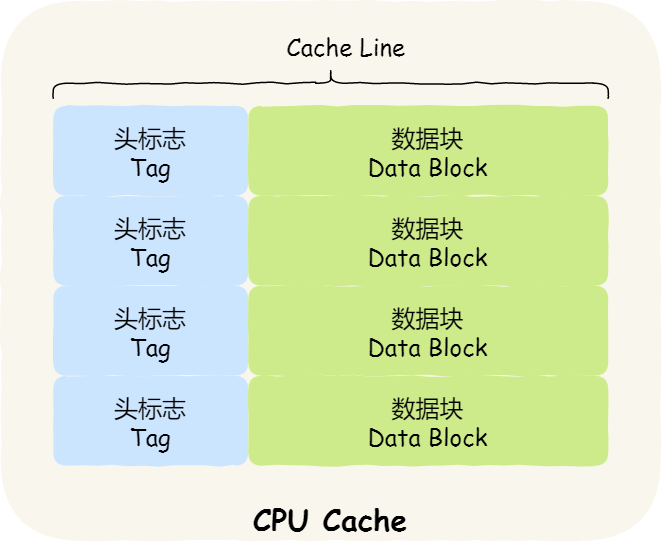

我们当然期望 CPU 读取数据的时候，都是尽可能地从 CPU Cache 中读取，而不是每一次都要从内存中获取数据。所以，身为程序员，我们要尽可能写出缓存命中率高的代码，这样就有效提高程序的性能，具体的做法，你可以参考我上一篇文章[「如何写出让 CPU 跑得更快的代码？」(opens new window)](https://mp.weixin.qq.com/s/-uhAhBD2zGl_h19E4fNJzQ)

事实上，数据不光是只有读操作，还有写操作，那么如果数据写入 Cache 之后，内存与 Cache 相对应的数据将会不同，这种情况下 Cache 和内存数据都不一致了，于是我们肯定是要把 Cache 中的数据同步到内存里的。

问题来了，那在什么时机才把 Cache 中的数据写回到内存呢？为了应对这个问题，下面介绍两种针对写入数据的方法：

- 写直达（*Write Through*）
- 写回（*Write Back*）


#### 写直达

保持内存与 Cache 一致性最简单的方式是，**把数据同时写入内存和 Cache 中**，这种方法称为**写直达（Write Through）**。

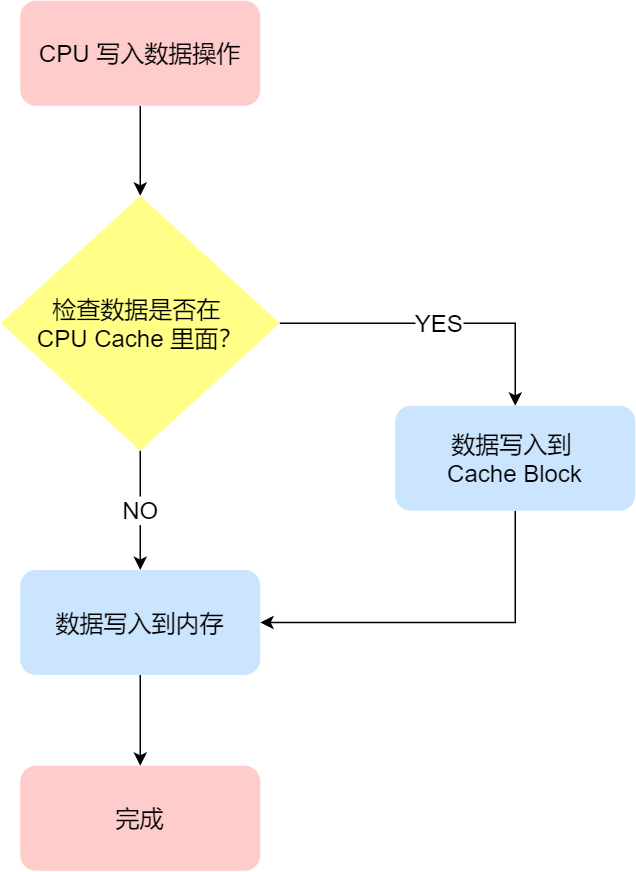

在这个方法里，写入前会先判断数据是否已经在 CPU Cache 里面了：

- 如果数据已经在 Cache 里面，先将数据更新到 Cache 里面，再写入到内存里面；
- 如果数据没有在 Cache 里面，就直接把数据更新到内存里面。

写直达法很直观，也很简单，但是问题明显，**无论数据在不在 Cache 里面，每次写操作都会写回到内存**，这样写操作将会花费大量的时间，无疑性能会受到很大的影响。


#### 写回

既然写直达由于每次写操作都会把数据写回到内存，而导致影响性能，于是为了要减少数据写回内存的频率，就出现了**写回（Write Back）的方法**。

在写回机制中，**当发生写操作时，新的数据仅仅被写入 Cache Block 里，只有当修改过的 Cache Block「被替换」时才需要写到内存中**，减少了数据写回内存的频率，这样便可以提高系统的性能。

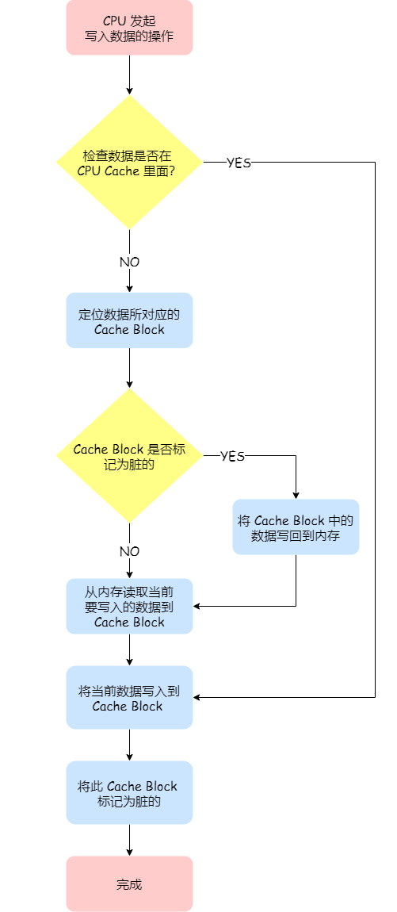

那具体如何做到的呢？下面来详细说一下：

- 如果当发生写操作时，数据已经在 CPU Cache 里的话，则把数据更新到 CPU Cache 里，同时标记 CPU Cache 里的这个 Cache Block 为脏（Dirty）的，**这个脏的标记代表这个时候，我们 CPU Cache 里面的这个 Cache Block 的数据和内存是不一致的**，这种情况是不用把数据写到内存里的；
- 如果当发生写操作时，数据所对应的 Cache Block 里存放的是「别的内存地址的数据」的话，就要检查这个 Cache Block 里的数据有没有被标记为脏的：
  - 如果是脏的话，我们就要把这个 Cache Block 里的数据写回到内存，然后再把当前要写入的数据，先从内存读入到 Cache Block 里，然后再把当前要写入的数据写入到 Cache Block，最后也把它标记为脏的；
  - 如果不是脏的话，把当前要写入的数据先从内存读入到 Cache Block 里（主要是在多核情况下，使用MESI协议来保证数据的一致性，让其他核可以把已修改的数据放入内存），接着将数据写入到这个 Cache Block 里，然后再把这个 Cache Block 标记为脏的就好了。

可以发现写回这个方法，在把数据写入到 Cache 的时候，只有在缓存不命中，同时数据对应的 Cache 中的 Cache Block 为脏标记的情况下，才会将数据写到内存中，而在缓存命中的情况下，则在写入后 Cache 后，只需把该数据对应的 Cache Block 标记为脏即可，而不用写到内存里。

这样的好处是，如果我们大量的操作都能够命中缓存，那么大部分时间里 CPU 都不需要读写内存，自然性能相比写直达会高很多。

为什么缓存没命中时，还要定位 Cache Block？这是因为此时是要判断数据即将写入到 cache block 里的位置，是否被「其他数据」占用了此位置，如果这个「其他数据」是脏数据，那么就要帮忙把它写回到内存。

CPU 缓存与内存使用「写回」机制的流程图如下，左半部分就是读操作的流程，右半部分就是写操作的流程，也就是我们上面讲的内容。

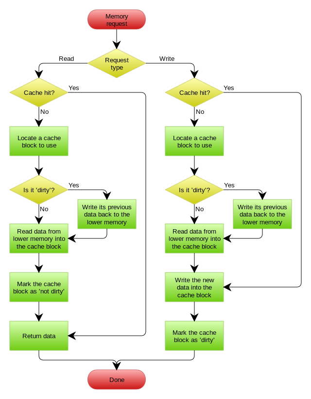


### 缓存一致性问题

现在 CPU 都是多核的，由于 L1/L2 Cache 是多个核心各自独有的，那么会带来多核心的**缓存一致性（Cache Coherence）** 的问题，如果不能保证缓存一致性的问题，就可能造成结果错误。

那缓存一致性的问题具体是怎么发生的呢？我们以一个含有两个核心的 CPU 作为例子看一看。

假设 A 号核心和 B 号核心同时运行两个线程，都操作共同的变量 i（初始值为 0 ）。

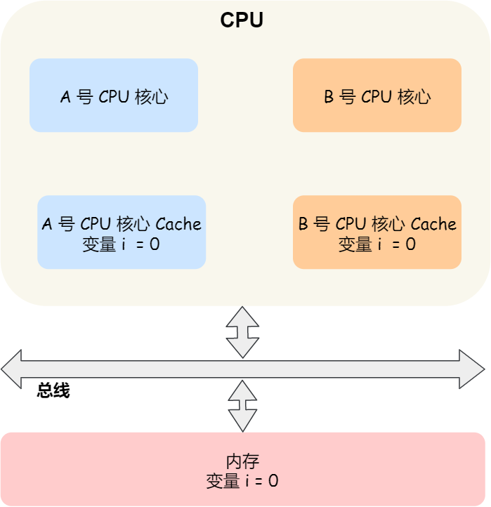

这时如果 A 号核心执行了 `i++` 语句的时候，为了考虑性能，使用了我们前面所说的写回策略，先把值为 `1` 的执行结果写入到 L1/L2 Cache 中，然后把 L1/L2 Cache 中对应的 Block 标记为脏的，这个时候数据其实没有被同步到内存中的，因为写回策略，只有在 A 号核心中的这个 Cache Block 要被替换的时候，数据才会写入到内存里。

如果这时旁边的 B 号核心尝试从内存读取 i 变量的值，则读到的将会是错误的值，因为刚才 A 号核心更新 i 值还没写入到内存中，内存中的值还依然是 0。**这个就是所谓的缓存一致性问题，A 号核心和 B 号核心的缓存，在这个时候是不一致，从而会导致执行结果的错误。**

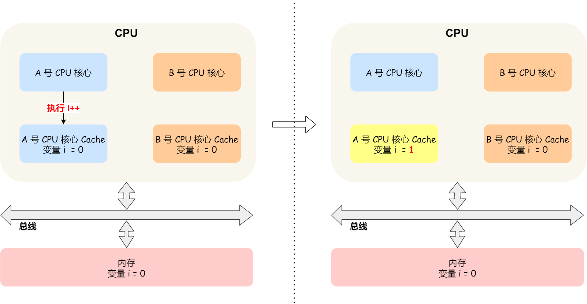

那么，要解决这一问题，就需要一种机制，来同步两个不同核心里面的缓存数据。要实现的这个机制的话，要保证做到下面这 2 点：

- 第一点，某个 CPU 核心里的 Cache 数据更新时，必须要传播到其他核心的 Cache，这个称为**写传播（Write Propagation）**；
- 第二点，某个 CPU 核心里对数据的操作顺序，必须在其他核心看起来顺序是一样的，这个称为**事务的串行化（Transaction Serialization）**。

第一点写传播很容易就理解，当某个核心在 Cache 更新了数据，就需要同步到其他核心的 Cache 里。而对于第二点事务的串行化，我们举个例子来理解它。

假设我们有一个含有 4 个核心的 CPU，这 4 个核心都操作共同的变量 i（初始值为 0 ）。A 号核心先把 i 值变为 100，而此时同一时间，B 号核心先把 i 值变为 200，这里两个修改，都会「传播」到 C 和 D 号核心。


那么问题就来了，C 号核心先收到了 A 号核心更新数据的事件，再收到 B 号核心更新数据的事件，因此 C 号核心看到的变量 i 是先变成 100，后变成 200。

而如果 D 号核心收到的事件是反过来的，则 D 号核心看到的是变量 i 先变成 200，再变成 100，虽然是做到了写传播，但是各个 Cache 里面的数据还是不一致的。

所以，我们要保证 C 号核心和 D 号核心都能看到**相同顺序的数据变化**，比如变量 i 都是先变成 100，再变成 200，这样的过程就是事务的串行化。

要实现事务串行化，要做到 2 点：

- CPU 核心对于 Cache 中数据的操作，需要同步给其他 CPU 核心；
- 要引入「锁」的概念，如果两个 CPU 核心里有相同数据的 Cache，那么对于这个 Cache 数据的更新，只有拿到了「锁」，才能进行对应的数据更新。


### 总线嗅探

写传播的原则就是当某个 CPU 核心更新了 Cache 中的数据，要把该事件广播通知到其他核心。最常见实现的方式是**总线嗅探（Bus Snooping）**。

我还是以前面的 i 变量例子来说明总线嗅探的工作机制，当 A 号 CPU 核心修改了 L1 Cache 中 i 变量的值，通过总线把这个事件广播通知给其他所有的核心，然后每个 CPU 核心都会监听总线上的广播事件，并检查是否有相同的数据在自己的 L1 Cache 里面，如果 B 号 CPU 核心的 L1 Cache 中有该数据，那么也需要把该数据更新到自己的 L1 Cache。

可以发现，总线嗅探方法很简单， CPU 需要每时每刻监听总线上的一切活动，但是不管别的核心的 Cache 是否缓存相同的数据，都需要发出一个广播事件，这无疑会加重总线的负载。

另外，总线嗅探只是保证了某个 CPU 核心的 Cache 更新数据这个事件能被其他 CPU 核心知道，但是并不能保证事务串行化。

于是，有一个协议基于总线嗅探机制实现了事务串行化，也用状态机机制降低了总线带宽压力，这个协议就是 MESI 协议，这个协议就做到了 CPU 缓存一致性。


### MESI 协议

MESI 协议其实是 4 个状态单词的开头字母缩写，分别是：

- *Modified*，已修改
- *Exclusive*，独占
- *Shared*，共享
- *Invalidated*，已失效

这四个状态来标记 Cache Line 四个不同的状态。

「已修改」状态就是我们前面提到的脏标记，代表该 Cache Block 上的数据已经被更新过，但是还没有写到内存里。而「已失效」状态，表示的是这个 Cache Block 里的数据已经失效了，不可以读取该状态的数据。

「独占」和「共享」状态都代表 Cache Block 里的数据是干净的，也就是说，这个时候 Cache Block 里的数据和内存里面的数据是一致性的。

「独占」和「共享」的差别在于，**独占状态的时候，数据只存储在一个 CPU 核心的 Cache 里，而其他 CPU 核心的 Cache 没有该数据。**这个时候，如果要向独占的 Cache 写数据，就可以直接自由地写入，而不需要通知其他 CPU 核心，因为只有你这有这个数据，就不存在缓存一致性的问题了，于是就可以随便操作该数据。

另外，在「独占」状态下的数据，如果有其他核心从内存读取了相同的数据到各自的 Cache ，那么这个时候，独占状态下的数据就会变成共享状态。

那么，「共享」状态代表着相同的数据在多个 CPU 核心的 Cache 里都有，所以当我们要更新 Cache 里面的数据的时候，不能直接修改，而是要先向所有的其他 CPU 核心广播一个请求，要求先把其他核心的 Cache 中对应的 Cache Line 标记为「无效」状态，然后再更新当前 Cache 里面的数据。

我们举个具体的例子来看看这四个状态的转换：

1. 当 A 号 CPU 核心从内存读取变量 i 的值，数据被缓存在 A 号 CPU 核心自己的 Cache 里面，此时其他 CPU 核心的 Cache 没有缓存该数据，于是标记 Cache Line 状态为「独占」，此时其 Cache 中的数据与内存是一致的；
2. 然后 B 号 CPU 核心也从内存读取了变量 i 的值，此时会发送消息给其他 CPU 核心，由于 A 号 CPU 核心已经缓存了该数据，所以会把数据返回给 B 号 CPU 核心。在这个时候， A 和 B 核心缓存了相同的数据，Cache Line 的状态就会变成「共享」，并且其 Cache 中的数据与内存也是一致的；
3. 当 A 号 CPU 核心要修改 Cache 中 i 变量的值，发现数据对应的 Cache Line 的状态是共享状态，则要向所有的其他 CPU 核心广播一个请求，要求先把其他核心的 Cache 中对应的 Cache Line 标记为「无效」状态，然后 A 号 CPU 核心才更新 Cache 里面的数据，同时标记 Cache Line 为「已修改」状态，此时 Cache 中的数据就与内存不一致了。
4. 如果 A 号 CPU 核心「继续」修改 Cache 中 i 变量的值，由于此时的 Cache Line 是「已修改」状态，因此不需要给其他 CPU 核心发送消息，直接更新数据即可。
5. 如果 A 号 CPU 核心的 Cache 里的 i 变量对应的 Cache Line 要被「替换」，发现 Cache Line 状态是「已修改」状态，就会在替换前先把数据同步到内存。

所以，可以发现当 Cache Line 状态是「已修改」或者「独占」状态时，修改更新其数据不需要发送广播给其他 CPU 核心，这在一定程度上减少了总线带宽压力。

事实上，整个 MESI 的状态可以用一个有限状态机来表示它的状态流转。还有一点，对于不同状态触发的事件操作，可能是来自本地 CPU 核心发出的广播事件，也可以是来自其他 CPU 核心通过总线发出的广播事件。下图即是 MESI 协议的状态图：


MESI 协议的四种状态之间的流转过程，我汇总成了下面的表格，你可以更详细的看到每个状态转换的原因：


### 总结

CPU 在读写数据的时候，都是在 CPU Cache 读写数据的，原因是 Cache 离 CPU 很近，读写性能相比内存高出很多。对于 Cache 里没有缓存 CPU 所需要读取的数据的这种情况，CPU 则会从内存读取数据，并将数据缓存到 Cache 里面，最后 CPU 再从 Cache 读取数据。

而对于数据的写入，CPU 都会先写入到 Cache 里面，然后再在找个合适的时机写入到内存，那就有「写直达」和「写回」这两种策略来保证 Cache 与内存的数据一致性：

- 写直达，只要有数据写入，都会直接把数据写入到内存里面，这种方式简单直观，但是性能就会受限于内存的访问速度；
- 写回，对于已经缓存在 Cache 的数据的写入，只需要更新其数据就可以，不用写入到内存，只有在需要把缓存里面的脏数据交换出去的时候，才把数据同步到内存里，这种方式在缓存命中率高的情况，性能会更好；

当今 CPU 都是多核的，每个核心都有各自独立的 L1/L2 Cache，只有 L3 Cache 是多个核心之间共享的。所以，我们要确保多核缓存是一致性的，否则会出现错误的结果。

要想实现缓存一致性，关键是要满足 2 点：

- 第一点是写传播，也就是当某个 CPU 核心发生写入操作时，需要把该事件广播通知给其他核心；
- 第二点是事物的串行化，这个很重要，只有保证了这个，才能保障我们的数据是真正一致的，我们的程序在各个不同的核心上运行的结果也是一致的；

基于总线嗅探机制的 MESI 协议，就满足上面了这两点，因此它是保障缓存一致性的协议。

MESI 协议，是已修改、独占、共享、已失效这四个状态的英文缩写的组合。整个 MSI 状态的变更，则是根据来自本地 CPU 核心的请求，或者来自其他 CPU 核心通过总线传输过来的请求，从而构成一个流动的状态机。另外，对于在「已修改」或者「独占」状态的 Cache Line，修改更新其数据不需要发送广播给其他 CPU 核心。


## CPU 是如何执行任务的？

你清楚下面这几个问题吗？

- 有了内存，为什么还需要 CPU Cache？
- CPU 是怎么读写数据的？
- 如何让 CPU 能读取数据更快一些？
- CPU 伪共享是如何发生的？又该如何避免？
- CPU 是如何调度任务的？如果你的任务对响应要求很高，你希望它总是能被先调度，这该怎么办？
- ...

这篇，我们就来回答这些问题。

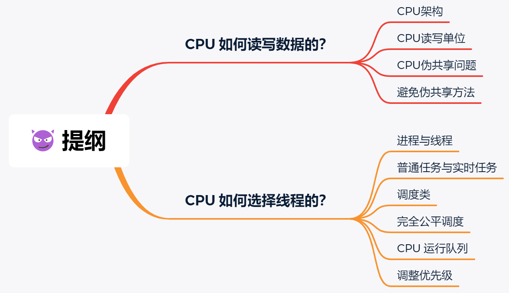


### CPU 如何读写数据的？

先来认识 CPU 的架构，只有理解了 CPU 的 架构，才能更好地理解 CPU 是如何读写数据的，对于现代 CPU 的架构图如下：


可以看到，一个 CPU 里通常会有多个 CPU 核心，比如上图中的 1 号和 2 号 CPU 核心，并且每个 CPU 核心都有自己的 L1 Cache 和 L2 Cache，而 L1 Cache 通常分为 dCache（数据缓存） 和 iCache（指令缓存），L3 Cache 则是多个核心共享的，这就是 CPU 典型的缓存层次。

上面提到的都是 CPU 内部的 Cache，放眼外部的话，还会有内存和硬盘，这些存储设备共同构成了金字塔存储层次。如下图所示：


从上图也可以看到，从上往下，存储设备的容量会越大，而访问速度会越慢。至于每个存储设备的访问延时，你可以看下图的表格：


你可以看到， CPU 访问 L1 Cache 速度比访问内存快 100 倍，这就是为什么 CPU 里会有 L1~L3 Cache 的原因，目的就是把 Cache 作为 CPU 与内存之间的缓存层，以减少对内存的访问频率。

CPU 从内存中读取数据到 Cache 的时候，并不是一个字节一个字节读取，而是一块一块的方式来读取数据的，这一块一块的数据被称为 CPU Cache Line（缓存块），所以 **CPU Cache Line 是 CPU 从内存读取数据到 Cache 的单位**。

但是，在我们不使用数组，而是使用单独的变量的时候，则会有 Cache 伪共享的问题，Cache 伪共享问题上是一个性能杀手，我们应该要规避它。

接下来，就来看看 Cache 伪共享是什么？又如何避免这个问题？

现在假设有一个双核心的 CPU，这两个 CPU 核心并行运行着两个不同的线程，它们同时从内存中读取两个不同的数据，分别是类型为 `long` 的变量 A 和 B，这个两个数据的地址在物理内存上是**连续**的，如果 Cahce Line 的大小是 64 字节，并且变量 A 在 Cahce Line 的开头位置，那么这两个数据是位于**同一个 Cache Line 中**，又因为 CPU Cache Line 是 CPU 从内存读取数据到 Cache 的单位，所以这两个数据会被同时读入到了两个 CPU 核心中各自 Cache 中。

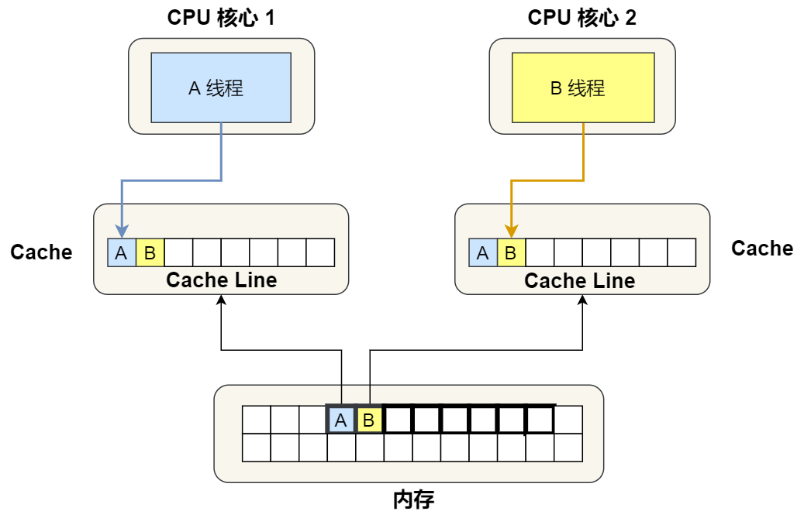

我们来思考一个问题，如果这两个不同核心的线程分别修改不同的数据，比如 1 号 CPU 核心的线程只修改了 变量 A，或 2 号 CPU 核心的线程的线程只修改了变量 B，会发生什么呢？


#### 分析伪共享的问题

现在我们结合保证多核缓存一致的 MESI 协议，来说明这一整个的过程

① 最开始变量 A 和 B 都还不在 Cache 里面，假设 1 号核心绑定了线程 A，2 号核心绑定了线程 B，线程 A 只会读写变量 A，线程 B 只会读写变量 B。

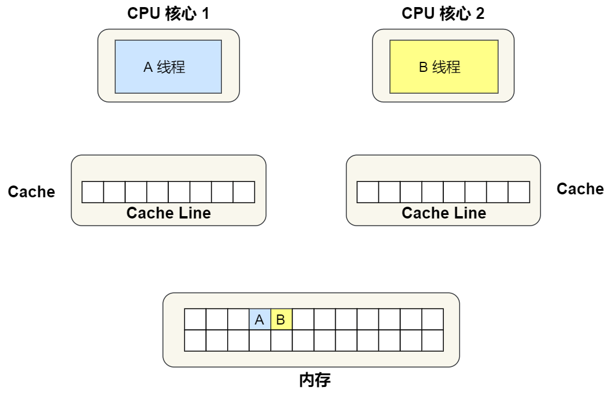

②1 号核心读取变量 A，由于 CPU 从内存读取数据到 Cache 的单位是 Cache Line，也正好变量 A 和 变量 B 的数据归属于同一个 Cache Line，所以 A 和 B 的数据都会被加载到 Cache，并将此 Cache Line 标记为「独占」状态。


③接着，2 号核心开始从内存里读取变量 B，同样的也是读取 Cache Line 大小的数据到 Cache 中，此 Cache Line 中的数据也包含了变量 A 和 变量 B，此时 1 号和 2 号核心的 Cache Line 状态变为「共享」状态。


④1 号核心需要修改变量 A，发现此 Cache Line 的状态是「共享」状态，所以先需要通过总线发送消息给 2 号核心，通知 2 号核心把 Cache 中对应的 Cache Line 标记为「已失效」状态，然后 1 号核心对应的 Cache Line 状态变成「已修改」状态，并且修改变量 A。

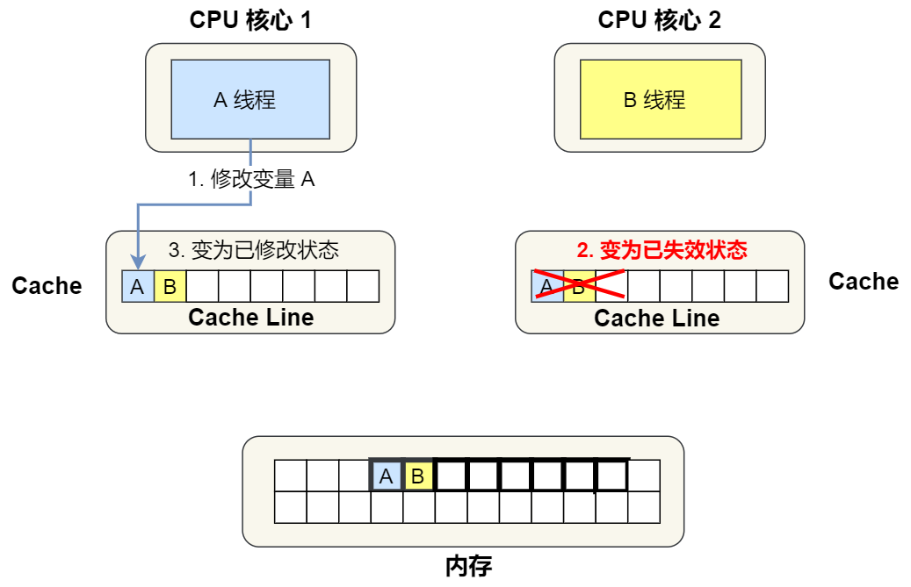

⑤之后，2 号核心需要修改变量 B，此时 2 号核心的 Cache 中对应的 Cache Line 是已失效状态，另外由于 1 号核心的 Cache 也有此相同的数据，且状态为「已修改」状态，所以要先把 1 号核心的 Cache 对应的 Cache Line 写回到内存，然后 2 号核心再从内存读取 Cache Line 大小的数据到 Cache 中，最后把变量 B 修改到 2 号核心的 Cache 中，并将状态标记为「已修改」状态。


所以，可以发现如果 1 号和 2 号 CPU 核心这样持续交替的分别修改变量 A 和 B，就会重复 ④ 和 ⑤ 这两个步骤，Cache 并没有起到缓存的效果，虽然变量 A 和 B 之间其实并没有任何的关系，但是因为同时归属于一个 Cache Line ，这个 Cache Line 中的任意数据被修改后，都会相互影响，从而出现 ④ 和 ⑤ 这两个步骤。

因此，这种因为多个线程同时读写同一个 Cache Line 的不同变量时，而导致 CPU Cache 失效的现象称为**伪共享（False Sharing）**。


#### 避免伪共享的方法

因此，对于多个线程共享的热点数据，即经常会修改的数据，应该避免这些数据刚好在同一个 Cache Line 中，否则就会出现为伪共享的问题。

接下来，看看在实际项目中是用什么方式来避免伪共享的问题的。

在 Linux 内核中存在 `__cacheline_aligned_in_smp` 宏定义，是用于解决伪共享的问题。

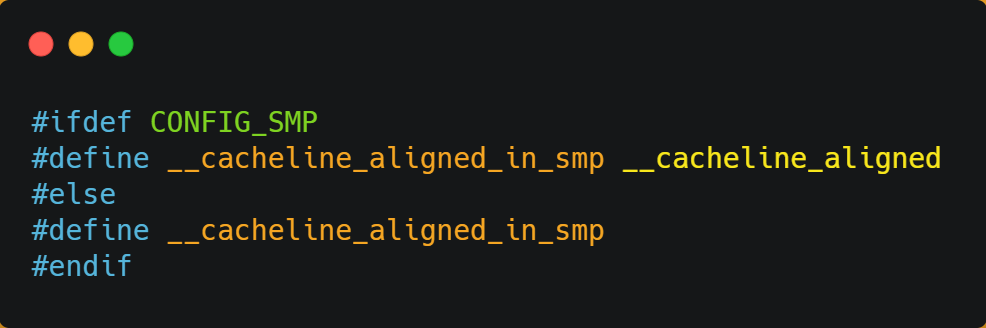

从上面的宏定义，我们可以看到：

- 如果在多核（MP）系统里，该宏定义是 `__cacheline_aligned`，也就是 Cache Line 的大小；
- 而如果在单核系统里，该宏定义是空的；

因此，针对在同一个 Cache Line 中的共享的数据，如果在多核之间竞争比较严重，为了防止伪共享现象的发生，**可以采用上面的宏定义使得变量在 Cache Line 里是对齐的。**

举个例子，有下面这个结构体：


结构体里的两个成员变量 a 和 b 在物理内存地址上是连续的，于是它们可能会位于同一个 Cache Line 中，如下图：

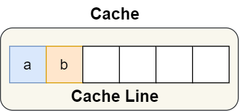

所以，为了防止前面提到的 Cache 伪共享问题，我们可以使用上面介绍的宏定义，将 b 的地址设置为 Cache Line 对齐地址，如下：


这样 a 和 b 变量就不会在同一个 Cache Line 中了，如下图：

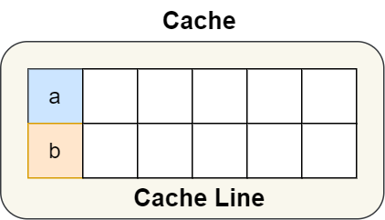

所以，避免 Cache 伪共享实际上是用空间换时间的思想，浪费一部分 Cache 空间，从而换来性能的提升。

我们再来看一个应用层面的规避方案，有一个 Java 并发框架 Disruptor 使用「字节填充 + 继承」的方式，来避免伪共享的问题。

Disruptor 中有一个 RingBuffer 类会经常被多个线程使用，代码如下：

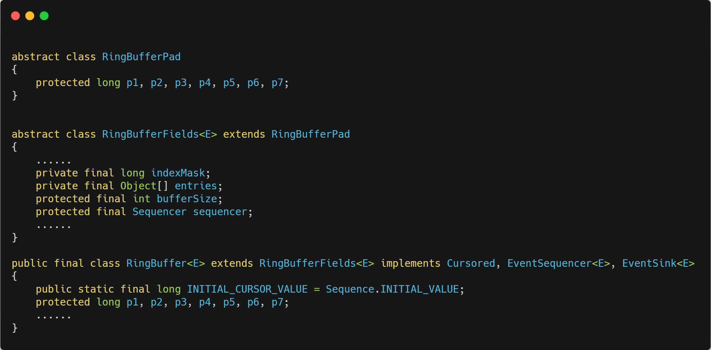

你可能会觉得 RingBufferPad 类里 7 个 long 类型的名字很奇怪，但事实上，它们虽然看起来毫无作用，但却对性能的提升起到了至关重要的作用。

我们都知道，CPU Cache 从内存读取数据的单位是 CPU Cache Line，一般 64 位 CPU 的 CPU Cache Line 的大小是 64 个字节，一个 long 类型的数据是 8 个字节，所以 CPU 一下会加载 8 个 long 类型的数据。

根据 JVM 对象继承关系中父类成员和子类成员，内存地址是连续排列布局的，因此 RingBufferPad 中的 7 个 long 类型数据作为 Cache Line **前置填充**，而 RingBuffer 中的 7 个 long 类型数据则作为 Cache Line **后置填充**，这 14 个 long 变量没有任何实际用途，更不会对它们进行读写操作。


另外，RingBufferFelds 里面定义的这些变量都是 `final` 修饰的，意味着第一次加载之后不会再修改， 又**由于「前后」各填充了 7 个不会被读写的 long 类型变量，所以无论怎么加载 Cache Line，这整个 Cache Line 里都没有会发生更新操作的数据，于是只要数据被频繁地读取访问，就自然没有数据被换出 Cache 的可能，也因此不会产生伪共享的问题**。


### CPU 如何选择线程的？

了解完 CPU 读取数据的过程后，我们再来看看 CPU 是根据什么来选择当前要执行的线程。

在 Linux 内核中，进程和线程都是用 `task_struct` 结构体表示的，区别在于线程的 task_struct 结构体里部分资源是共享了进程已创建的资源，比如内存地址空间、代码段、文件描述符等，所以 Linux 中的线程也被称为轻量级进程，因为线程的 task_struct 相比进程的 task_struct 承载的 资源比较少，因此以「轻」得名。

一般来说，没有创建线程的进程，是只有单个执行流，它被称为是主线程。如果想让进程处理更多的事情，可以创建多个线程分别去处理，但不管怎么样，它们对应到内核里都是 `task_struct`。

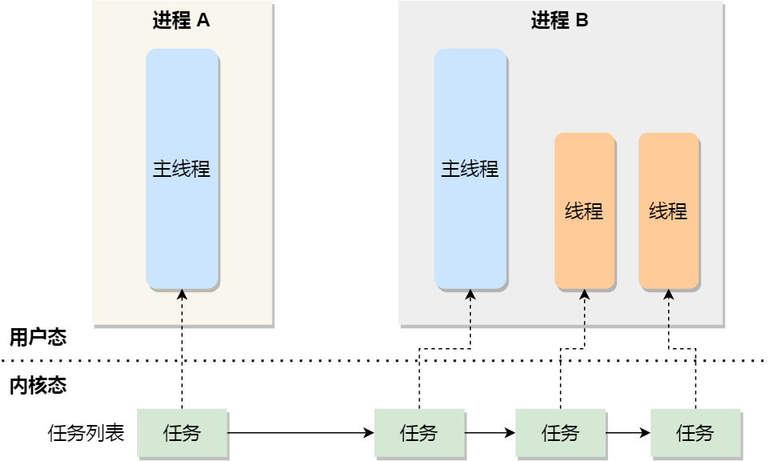

所以，Linux 内核里的调度器，调度的对象就是 `task_struct`，接下来我们就把这个数据结构统称为**任务**。

在 Linux 系统中，根据任务的优先级以及响应要求，主要分为两种，其中优先级的数值越小，优先级越高：

- 实时任务，对系统的响应时间要求很高，也就是要尽可能快的执行实时任务，优先级在 `0~99` 范围内的就算实时任务；
- 普通任务，响应时间没有很高的要求，优先级在 `100~139` 范围内都是普通任务级别；


#### 调度类

由于任务有优先级之分，Linux 系统为了保障高优先级的任务能够尽可能早的被执行，于是分为了这几种调度类，如下图：

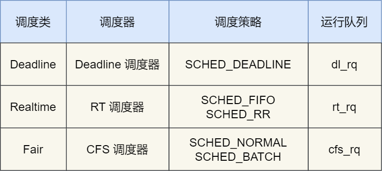

Deadline 和 Realtime 这两个调度类，都是应用于实时任务的，这两个调度类的调度策略合起来共有这三种，它们的作用如下：

- *SCHED_DEADLINE*：是按照 deadline 进行调度的，距离当前时间点最近的 deadline 的任务会被优先调度（最急任务优先）；
- *SCHED_FIFO*：对于相同优先级的任务，按先来先服务的原则，但是优先级更高的任务，可以抢占低优先级的任务，也就是优先级高的可以「插队」；
- *SCHED_RR*：对于相同优先级的任务，轮流着运行，每个任务都有一定的时间片，当用完时间片的任务会被放到队列尾部，以保证相同优先级任务的公平性，但是高优先级的任务依然可以抢占低优先级的任务；

而 Fair 调度类是应用于普通任务，都是由 CFS 调度器管理的，分为两种调度策略：

- *SCHED_NORMAL*：普通任务使用的调度策略；

- *SCHED_BATCH*：后台任务的调度策略，不和终端进行交互，因此在不影响其他需要交互的任务，可以适当降低它的优先级。

  

#### 完全公平调度

我们平日里遇到的基本都是普通任务，对于普通任务来说，公平性最重要，在 Linux 里面，实现了一个基于 CFS 的调度算法，也就是**完全公平调度（Completely Fair Scheduling）**。

这个算法的理念是想让分配给每个任务的 CPU 时间是一样，于是它为每个任务安排一个虚拟运行时间 vruntime，如果一个任务在运行，其运行的越久，该任务的 vruntime 自然就会越大，而没有被运行的任务，vruntime 是不会变化的。

那么，**在 CFS 算法调度的时候，会优先选择 vruntime 少的任务**，以保证每个任务的公平性。

这就好比，让你把一桶的奶茶平均分到 10 杯奶茶杯里，你看着哪杯奶茶少，就多倒一些；哪个多了，就先不倒，这样经过多轮操作，虽然不能保证每杯奶茶完全一样多，但至少是公平的。

当然，上面提到的例子没有考虑到优先级的问题，虽然是普通任务，但是普通任务之间还是有优先级区分的，所以在计算虚拟运行时间 vruntime 还要考虑普通任务的**权重值**，注意权重值并不是优先级的值，内核中会有一个 nice 级别与权重值的转换表，nice 级别越低的权重值就越大，至于 nice 值是什么，我们后面会提到。 于是就有了以下这个公式：


你可以不用管 NICE_0_LOAD 是什么，你就认为它是一个常量，那么在「同样的实际运行时间」里，高权重任务的 vruntime 比低权重任务的 vruntime **少**，你可能会奇怪为什么是少的？你还记得 CFS 调度吗，它是会优先选择 vruntime 少的任务进行调度，所以高权重的任务就会被优先调度了，于是高权重的获得的实际运行时间自然就多了。


#### CPU 运行队列

一个系统通常都会运行着很多任务，多任务的数量基本都是远超 CPU 核心数量，因此这时候就需要**排队**。

事实上，每个 CPU 都有自己的**运行队列（\*Run Queue, rq\*）**，用于描述在此 CPU 上所运行的所有进程，其队列包含三个运行队列，Deadline 运行队列 dl_rq、实时任务运行队列 rt_rq 和 CFS 运行队列 cfs_rq，其中 cfs_rq 是用红黑树来描述的，按 vruntime 大小来排序的，最左侧的叶子节点，就是下次会被调度的任务。

PS：下图中的 csf_rq 应该是 `cfs_rq`，由于找不到原图了，我偷个懒，我就不重新画了，嘻嘻。


这几种调度类是有优先级的，优先级如下：Deadline > Realtime > Fair，这意味着 Linux 选择下一个任务执行的时候，会按照此优先级顺序进行选择，也就是说先从 `dl_rq` 里选择任务，然后从 `rt_rq` 里选择任务，最后从 `cfs_rq` 里选择任务。因此，**实时任务总是会比普通任务优先被执行**。


#### 调整优先级

如果我们启动任务的时候，没有特意去指定优先级的话，默认情况下都是普通任务，普通任务的调度类是 Fair，由 CFS 调度器来进行管理。CFS 调度器的目的是实现任务运行的公平性，也就是保障每个任务的运行的时间是差不多的。

如果你想让某个普通任务有更多的执行时间，可以调整任务的 `nice` 值，从而让优先级高一些的任务执行更多时间。nice 的值能设置的范围是 `-20～19`， 值越低，表明优先级越高，因此 -20 是最高优先级，19 则是最低优先级，默认优先级是 0。

是不是觉得 nice 值的范围很诡异？事实上，nice 值并不是表示优先级，而是表示优先级的修正数值，它与优先级（priority）的关系是这样的：priority(new) = priority(old) + nice。内核中，priority 的范围是 0~139，值越低，优先级越高，其中前面的 0~99 范围是提供给实时任务使用的，而 nice 值是映射到 100~139，这个范围是提供给普通任务用的，因此 nice 值调整的是普通任务的优先级。

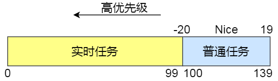

在前面我们提到了，权重值与 nice 值的关系的，nice 值越低，权重值就越大，计算出来的 vruntime 就会越少，由于 CFS 算法调度的时候，就会优先选择 vruntime 少的任务进行执行，所以 nice 值越低，任务的优先级就越高。

我们可以在启动任务的时候，可以指定 nice 的值，比如将 mysqld 以 -3 优先级：

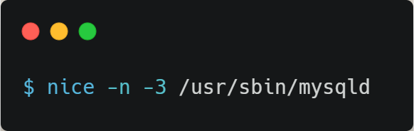

如果想修改已经运行中的任务的优先级，则可以使用 `renice` 来调整 nice 值：


nice 调整的是普通任务的优先级，所以不管怎么缩小 nice 值，任务永远都是普通任务，如果某些任务要求实时性比较高，那么你可以考虑改变任务的优先级以及调度策略，使得它变成实时任务，比如：


### 总结

理解 CPU 是如何读写数据的前提，是要理解 CPU 的架构，CPU 内部的多个 Cache + 外部的内存和磁盘都就构成了金字塔的存储器结构，在这个金字塔中，越往下，存储器的容量就越大，但访问速度就会小。

CPU 读写数据的时候，并不是按一个一个字节为单位来进行读写，而是以 CPU Cache Line 大小为单位，CPU Cache Line 大小一般是 64 个字节，也就意味着 CPU 读写数据的时候，每一次都是以 64 字节大小为一块进行操作。

因此，如果我们操作的数据是数组，那么访问数组元素的时候，按内存分布的地址顺序进行访问，这样能充分利用到 Cache，程序的性能得到提升。但如果操作的数据不是数组，而是普通的变量，并在多核 CPU 的情况下，我们还需要避免 Cache Line 伪共享的问题。

所谓的 Cache Line 伪共享问题就是，多个线程同时读写同一个 Cache Line 的不同变量时，而导致 CPU Cache 失效的现象。那么对于多个线程共享的热点数据，即经常会修改的数据，应该避免这些数据刚好在同一个 Cache Line 中，避免的方式一般有 Cache Line 大小字节对齐，以及字节填充等方法。

系统中需要运行的多线程数一般都会大于 CPU 核心，这样就会导致线程排队等待 CPU，这可能会产生一定的延时，如果我们的任务对延时容忍度很低，则可以通过一些人为手段干预 Linux 的默认调度策略和优先级。


## 什么是软中断？


### 中断是什么？

先来看看什么是中断？在计算机中，**中断是系统用来响应硬件设备请求的一种机制，操作系统收到硬件的中断请求，会打断正在执行的进程，然后调用内核中的中断处理程序来响应请求。**

这样的解释可能过于学术了，容易云里雾里，我就举个生活中取外卖的例子。

小林中午搬完砖，肚子饿了，点了份白切鸡外卖，这次我带闪了，没有被某团大数据杀熟。虽然平台上会显示配送进度，但是我也不能一直傻傻地盯着呀，时间很宝贵，当然得去干别的事情，等外卖到了配送员会通过「电话」通知我，电话响了，我就会停下手中地事情，去拿外卖。

这里的打电话，其实就是对应计算机里的中断，没接到电话的时候，我可以做其他的事情，只有接到了电话，也就是发生中断，我才会停下当前的事情，去进行另一个事情，也就是拿外卖。

从这个例子，我们可以知道，**中断是一种异步的事件处理机制，可以提高系统的并发处理能力。**

操作系统收到了中断请求，会打断其他进程的运行，所以**中断请求的响应程序，也就是中断处理程序，要尽可能快的执行完，这样可以减少对正常进程运行调度地影响。**

而且，中断处理程序在响应中断时，可能还会「临时关闭中断」，这意味着，如果当前中断处理程序没有执行完之前，系统中其他的中断请求都无法被响应，也就说中断有可能会丢失，所以中断处理程序要短且快。

还是回到外卖的例子，小林到了晚上又点起了外卖，这次为了犒劳自己，共点了两份外卖，一份小龙虾和一份奶茶，并且是由不同地配送员来配送，那么问题来了，当第一份外卖送到时，配送员给我打了长长的电话，说了一些杂七杂八的事情，比如给个好评等等，但如果这时另一位配送员也想给我打电话。

很明显，这时第二位配送员因为我在通话中（相当于关闭了中断响应），自然就无法打通我的电话，他可能尝试了几次后就走掉了（相当于丢失了一次中断）。


### 什么是软中断？

前面我们也提到了，中断请求的处理程序应该要短且快，这样才能减少对正常进程运行调度地影响，而且中断处理程序可能会暂时关闭中断，这时如果中断处理程序执行时间过长，可能在还未执行完中断处理程序前，会丢失当前其他设备的中断请求。

那 Linux 系统**为了解决中断处理程序执行过长和中断丢失的问题，将中断过程分成了两个阶段，分别是「上半部和下半部分」**。

- **上半部用来快速处理中断**，一般会暂时关闭中断请求，主要负责处理跟硬件紧密相关或者时间敏感的事情。
- **下半部用来延迟处理上半部未完成的工作**，一般以「内核线程」的方式运行。

前面的外卖例子，由于第一个配送员长时间跟我通话，则导致第二位配送员无法拨通我的电话，其实当我接到第一位配送员的电话，可以告诉配送员说我现在下楼，剩下的事情，等我们见面再说（上半部），然后就可以挂断电话，到楼下后，在拿外卖，以及跟配送员说其他的事情（下半部）。

这样，第一位配送员就不会占用我手机太多时间，当第二位配送员正好过来时，会有很大几率拨通我的电话。

再举一个计算机中的例子，常见的网卡接收网络包的例子。

网卡收到网络包后，通过 DMA 方式将接收到的数据写入内存，接着会通过**硬件中断**通知内核有新的数据到了，于是内核就会调用对应的中断处理程序来处理该事件，这个事件的处理也是会分成上半部和下半部。

上部分要做的事情很少，会先禁止网卡中断，避免频繁硬中断，而降低内核的工作效率。接着，内核会触发一个**软中断**，把一些处理比较耗时且复杂的事情，交给「软中断处理程序」去做，也就是中断的下半部，其主要是需要从内存中找到网络数据，再按照网络协议栈，对网络数据进行逐层解析和处理，最后把数据送给应用程序。

所以，中断处理程序的上部分和下半部可以理解为：

- **上半部直接处理硬件请求，也就是硬中断**，主要是负责耗时短的工作，特点是快速执行；
- **下半部是由内核触发，也就说软中断**，主要是负责上半部未完成的工作，通常都是耗时比较长的事情，特点是延迟执行；

还有一个区别，**硬中断（上半部）是会打断 CPU 正在执行的任务，然后立即执行中断处理程序，而软中断（下半部）是以内核线程的方式执行，并且每一个 CPU 都对应一个软中断内核线程**，名字通常为「ksoftirqd/CPU 编号」，比如 0 号 CPU 对应的软中断内核线程的名字是 `ksoftirqd/0`

不过，软中断不只是包括硬件设备中断处理程序的下半部，一些内核自定义事件也属于软中断，比如内核调度等、RCU 锁（内核里常用的一种锁）等。


#### 系统里有哪些软中断？

在 Linux 系统里，我们可以通过查看 `/proc/softirqs` 的 内容来知晓「软中断」的运行情况，以及 `/proc/interrupts` 的 内容来知晓「硬中断」的运行情况。

接下来，就来简单的解析下 `/proc/softirqs` 文件的内容，在我服务器上查看到的文件内容如下：


你可以看到，每一个 CPU 都有自己对应的不同类型软中断的**累计运行次数**，有 3 点需要注意下。

第一点，要注意第一列的内容，它是代表着软中断的类型，在我的系统里，软中断包括了 10 个类型，分别对应不同的工作类型，比如 `NET_RX` 表示网络接收中断，`NET_TX` 表示网络发送中断、`TIMER` 表示定时中断、`RCU` 表示 RCU 锁中断、`SCHED` 表示内核调度中断。

第二点，要注意同一种类型的软中断在不同 CPU 的分布情况，正常情况下，同一种中断在不同 CPU 上的累计次数相差不多，比如我的系统里，`NET_RX` 在 CPU0 、CPU1、CPU2、CPU3 上的中断次数基本是同一个数量级，相差不多。

第三点，这些数值是系统运行以来的累计中断次数，数值的大小没什么参考意义，但是系统的**中断次数的变化速率**才是我们要关注的，我们可以使用 `watch -d cat /proc/softirqs` 命令查看中断次数的变化速率。

前面提到过，软中断是以内核线程的方式执行的，我们可以用 `ps` 命令可以查看到，下面这个就是在我的服务器上查到软中断内核线程的结果：

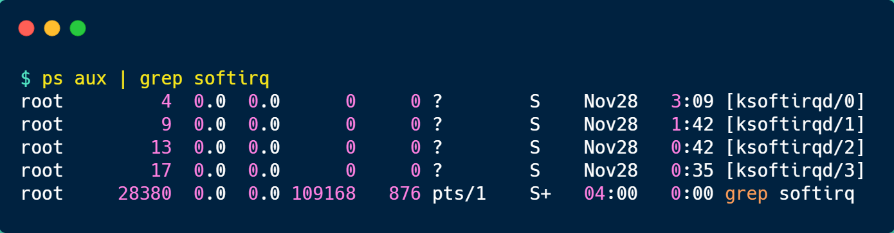

可以发现，内核线程的名字外面都有有中括号，这说明 ps 无法获取它们的命令行参数，所以一般来说，名字在中括号里的都可以认为是内核线程。

而且，你可以看到有 4 个 `ksoftirqd` 内核线程，这是因为我这台服务器的 CPU 是 4 核心的，每个 CPU 核心都对应着一个内核线程。


#### 如何定位软中断 CPU 使用率过高的问题？

要想知道当前的系统的软中断情况，我们可以使用 `top` 命令查看，下面是一台服务器上的 top 的数据：


上图中的黄色部分 `si`，就是 CPU 在软中断上的使用率，而且可以发现，每个 CPU 使用率都不高，两个 CPU 的使用率虽然只有 3% 和 4% 左右，但是都是用在软中断上了。

另外，也可以看到 CPU 使用率最高的进程也是软中断 `ksoftirqd`，因此可以认为此时系统的开销主要来源于软中断。

如果要知道是哪种软中断类型导致的，我们可以使用 `watch -d cat /proc/softirqs` 命令查看每个软中断类型的中断次数的变化速率。


一般对于网络 I/O 比较高的 Web 服务器，`NET_RX` 网络接收中断的变化速率相比其他中断类型快很多。

如果发现 `NET_RX` 网络接收中断次数的变化速率过快，接下来就可以使用 `sar -n DEV` 查看网卡的网络包接收速率情况，然后分析是哪个网卡有大量的网络包进来。

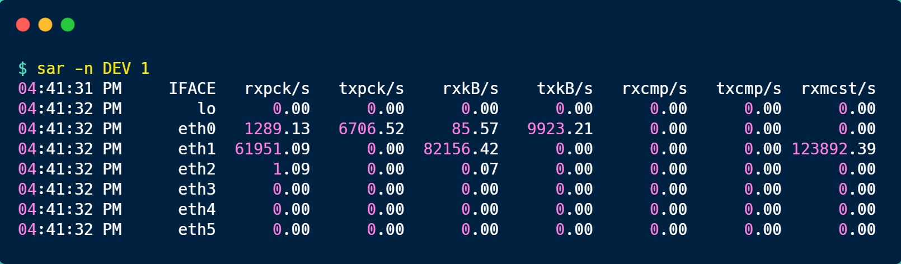

接着，在通过 `tcpdump` 抓包，分析这些包的来源，如果是非法的地址，可以考虑加防火墙，如果是正常流量，则要考虑硬件升级等。


### 总结

为了避免由于中断处理程序执行时间过长，而影响正常进程的调度，Linux 将中断处理程序分为上半部和下半部：

- 上半部，对应硬中断，由硬件触发中断，用来快速处理中断；
- 下半部，对应软中断，由内核触发中断，用来异步处理上半部未完成的工作；

Linux 中的软中断包括网络收发、定时、调度、RCU 锁等各种类型，可以通过查看 /proc/softirqs 来观察软中断的累计中断次数情况，如果要实时查看中断次数的变化率，可以使用 watch -d cat /proc/softirqs 命令。

每一个 CPU 都有各自的软中断内核线程，我们还可以用 ps 命令来查看内核线程，一般名字在中括号里面到，都认为是内核线程。

如果在 top 命令发现，CPU 在软中断上的使用率比较高，而且 CPU 使用率最高的进程也是软中断 ksoftirqd 的时候，这种一般可以认为系统的开销被软中断占据了。

这时我们就可以分析是哪种软中断类型导致的，一般来说都是因为网络接收软中断导致的，如果是的话，可以用 sar 命令查看是哪个网卡的有大量的网络包接收，再用 tcpdump 抓网络包，做进一步分析该网络包的源头是不是非法地址，如果是就需要考虑防火墙增加规则，如果不是，则考虑硬件升级等。


## 为什么 0.1 + 0.2 不等于 0.3 ？

我们来思考几个问题：

- 为什么负数要用补码表示？
- 十进制小数怎么转成二进制？
- 计算机是怎么存小数的？
- 0.1 + 0.2 == 0.3 吗？
- ...

别看这些问题都看似简单，但是其实还是有点东西的这些问题。


### 为什么负数要用补码表示？

十进制转换二进制的方法相信大家都熟能生巧了，如果你说你还不知道，我觉得你还是太谦虚，可能你只是忘记了，即使你真的忘记了，不怕，贴心的小林在和你一起回忆一下。

十进制数转二进制采用的是**除 2 取余法**，比如数字 8 转二进制的过程如下图：

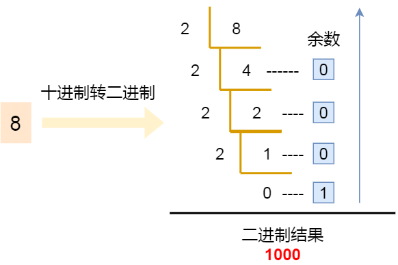

接着，我们看看「整数类型」的数字在计算机的存储方式，这其实很简单，也很直观，就是将十进制的数字转换成二进制即可。

我们以 `int` 类型的数字作为例子，int 类型是 `32` 位的，其中**最高位是作为「符号标志位」**，正数的符号位是 `0`，负数的符号位是 `1`，**剩余的 31 位则表示二进制数据**。

那么，对于 int 类型的数字 1 的二进制数表示如下：


而负数就比较特殊了点，负数在计算机中是以「补码」表示的，**所谓的补码就是把正数的二进制全部取反再加 1**，比如 -1 的二进制是把数字 1 的二进制取反后再加 1，如下图：


不知道你有没有想过，为什么计算机要用补码的方式来表示负数？在回答这个问题前，我们假设不用补码的方式来表示负数，而只是把最高位的符号标志位变为 1 表示负数，如下图过程：


如果采用这种方式来表示负数的二进制的话，试想一下 `-2 + 1` 的运算过程，如下图：


按道理，`-2 + 1 = -1`，但是上面的运算过程中得到结果却是 `-3`，所可以发现，这种负数的表示方式是不能用常规的加法来计算了，就需要特殊处理，要先判断数字是否为负数，如果是负数就要把加法操作变成减法操作才可以得到正确对结果。

到这里，我们就可以回答前面提到的「负数为什么要用补码方式来表示」的问题了。

如果负数不是使用补码的方式表示，则在做基本对加减法运算的时候，**还需要多一步操作来判断是否为负数，如果为负数，还得把加法反转成减法，或者把减法反转成加法**，这就非常不好了，毕竟加减法运算在计算机里是很常使用的，所以为了性能考虑，应该要尽量简化这个运算过程。

**而用了补码的表示方式，对于负数的加减法操作，实际上是和正数加减法操作一样的**。你可以看到下图，用补码表示的负数在运算 `-2 + 1` 过程的时候，其结果是正确的：

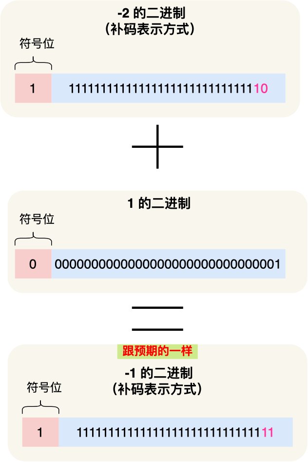


### 十进制小数与二进制的转换

好了，整数十进制转二进制我们知道了，接下来看看小数是怎么转二进制的，小数部分的转换不同于整数部分，它采用的是**乘 2 取整法**，将十进制中的小数部分乘以 2 作为二进制的一位，然后继续取小数部分乘以 2 作为下一位，直到不存在小数为止。

话不多说，我们就以 `8.625` 转二进制作为例子，直接上图：

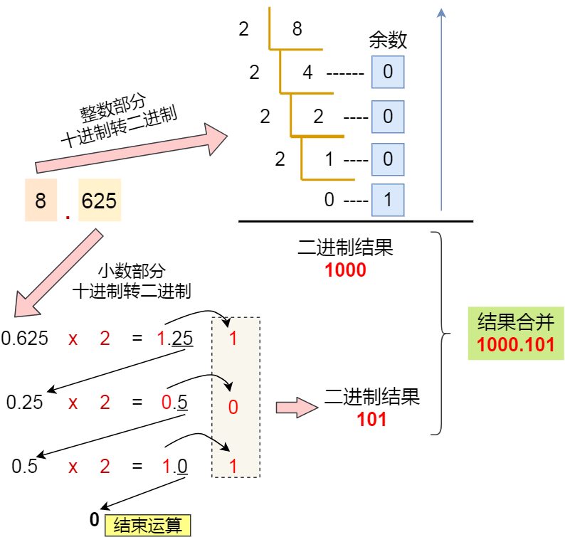

最后把「整数部分 + 小数部分」结合在一起后，其结果就是 `1000.101`。

但是，并不是所有小数都可以用二进制表示，前面提到的 0.625 小数是一个特例，刚好通过乘 2 取整法的方式完整的转换成二进制。

如果我们用相同的方式，来把 `0.1` 转换成二进制，过程如下：


可以发现，`0.1` 的二进制表示是无限循环的。

**由于计算机的资源是有限的，所以是没办法用二进制精确的表示 0.1，只能用「近似值」来表示，就是在有限的精度情况下，最大化接近 0.1 的二进制数，于是就会造成精度缺失的情况**。

对于二进制小数转十进制时，需要注意一点，小数点后面的指数幂是**负数**。

比如，二进制 `0.1` 转成十进制就是 `2^(-1)`，也就是十进制 `0.5`，二进制 `0.01` 转成十进制就是 `2^-2`，也就是十进制 `0.25`，以此类推。

举个例子，二进制 `1010.101` 转十进制的过程，如下图：


### 计算机是怎么存小数的？

`1000.101` 这种二进制小数是「定点数」形式，代表着小数点是定死的，不能移动，如果你移动了它的小数点，这个数就变了， 就不再是它原来的值了。

然而，计算机并不是这样存储的小数的，计算机存储小数的采用的是**浮点数**，名字里的「浮点」表示小数点是可以浮动的。

比如 `1000.101` 这个二进制数，可以表示成 `1.000101 x 2^3`，类似于数学上的科学记数法。

既然提到了科学计数法，我再帮大家复习一下。

比如有个很大的十进制数 1230000，我们可以也可以表示成 `1.23 x 10^6`，这种方式就称为科学记数法。

该方法在小数点左边只有一个数字，而且把这种整数部分没有前导 0 的数字称为**规格化**，比如 `1.0 x 10^(-9)` 是规格化的科学记数法，而 `0.1 x 10^(-9)` 和 `10.0 x 10^(-9)` 就不是了。

因此，如果二进制要用到科学记数法，同时要规范化，那么不仅要保证基数为 2，还要保证小数点左侧只有 1 位，而且必须为 1。

所以通常将 `1000.101` 这种二进制数，规格化表示成 `1.000101 x 2^3`，其中，最为关键的是 000101 和 3 这两个东西，它就可以包含了这个二进制小数的所有信息：

- `000101` 称为**尾数**，即小数点后面的数字；
- `3` 称为**指数**，指定了小数点在数据中的位置；

现在绝大多数计算机使用的浮点数，一般采用的是 IEEE 制定的国际标准，这种标准形式如下图：


这三个重要部分的意义如下：

- *符号位*：表示数字是正数还是负数，为 0 表示正数，为 1 表示负数；
- *指数位*：指定了小数点在数据中的位置，指数可以是负数，也可以是正数，**指数位的长度越长则数值的表达范围就越大**；
- *尾数位*：小数点右侧的数字，也就是小数部分，比如二进制 1.0011 x 2^(-2)，尾数部分就是 0011，而且**尾数的长度决定了这个数的精度**，因此如果要表示精度更高的小数，则就要提高尾数位的长度；

用 `32` 位来表示的浮点数，则称为**单精度浮点数**，也就是我们编程语言中的 `float` 变量，而用 `64` 位来表示的浮点数，称为**双精度浮点数**，也就是 `double` 变量，它们的结构如下：

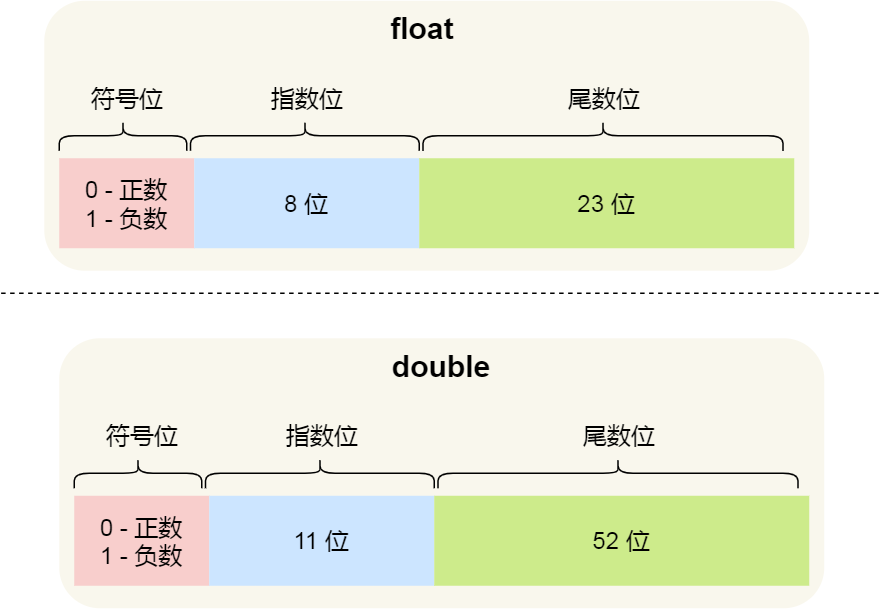

可以看到：

- double 的尾数部分是 52 位，float 的尾数部分是 23 位，由于同时都带有一个固定隐含位（这个后面会说），所以 double 有 53 个二进制有效位，float 有 24 个二进制有效位，所以所以它们的精度在十进制中分别是 `log10(2^53)` 约等于 `15.95` 和 `log10(2^24)` 约等于 `7.22` 位，因此 double 的有效数字是 `15~16` 位，float 的有效数字是 `7~8` 位，这些有效位是包含整数部分和小数部分；
- double 的指数部分是 11 位，而 float 的指数位是 8 位，意味着 double 相比 float 能表示更大的数值范围；

那二进制小数，是如何转换成二进制浮点数的呢？

我们就以 `10.625` 作为例子，看看这个数字在 float 里是如何存储的。


首先，我们计算出 10.625 的二进制小数为 1010.101。

然后**把小数点，移动到第一个有效数字后面**，即将 1010.101 右移 `3` 位成 `1.010101`，右移 3 位就代表 +3，左移 3 位就是 -3。

**float 中的「指数位」就跟这里移动的位数有关系，把移动的位数再加上「偏移量」，float 的话偏移量是 127，相加后就是指数位的值了**，即指数位这 8 位存的是 `10000010`（十进制 130），因此你可以认为「指数位」相当于指明了小数点在数据中的位置。

`1.010101` 这个数的**小数点右侧的数字就是 float 里的「尾数位」**，由于尾数位是 23 位，则后面要补充 0，所以最终尾数位存储的数字是 `01010100000000000000000`。

在算指数的时候，你可能会有疑问为什么要加上偏移量呢？

前面也提到，指数可能是正数，也可能是负数，即指数是有符号的整数，而有符号整数的计算是比无符号整数麻烦的，所以为了减少不必要的麻烦，在实际存储指数的时候，需要把指数转换成**无符号整数**。

float 的指数部分是 8 位，IEEE 标准规定单精度浮点的指数取值范围是 `-126 ~ +127`，于是为了把指数转换成无符号整数，就要加个**偏移量**，比如 float 的指数偏移量是 `127`，这样指数就不会出现负数了。

比如，指数如果是 8，则实际存储的指数是 8 + 127（偏移量）= 135，即把 135 转换为二进制之后再存储，而当我们需要计算实际的十进制数的时候，再把指数减去「偏移量」即可。

细心的朋友肯定发现，移动后的小数点左侧的有效位（即 1）消失了，它并没有存储到 float 里。

这是因为 IEEE 标准规定，二进制浮点数的小数点左侧只能有 1 位，并且还只能是 1，**既然这一位永远都是 1，那就可以不用存起来了**。

于是就让 23 位尾数只存储小数部分，然后在计算时会**自动把这个 1 加上，这样就可以节约 1 位的空间，尾数就能多存一位小数，相应的精度就更高了一点**。

那么，对于我们在从 float 的二进制浮点数转换成十进制时，要考虑到这个隐含的 1，转换公式如下：


举个例子，我们把下图这个 float 的数据转换成十进制，过程如下：


### 0.1 + 0.2 == 0.3 ?

前面提到过，并不是所有小数都可以用「完整」的二进制来表示的，比如十进制 0.1 在转换成二进制小数的时候，是一串无限循环的二进制数，计算机是无法表达无限循环的二进制数的，毕竟计算机的资源是有限。

因此，计算机只能用「近似值」来表示该二进制，那么意味着计算机存放的小数可能不是一个真实值。

现在基本都是用 IEEE 754 规范的「单精度浮点类型」或「双精度浮点类型」来存储小数的，根据精度的不同，近似值也会不同。

那计算机是存储 0.1 是一个怎么样的二进制浮点数呢？

偷个懒，我就不自己手动算了，可以使用 binaryconvert 这个工具，将十进制 0.1 小数转换成 float 浮点数：


可以看到，8 位指数部分是 `01111011`，23 位的尾数部分是 `10011001100110011001101`，可以看到尾数部分是 `0011` 是一直循环的，只不过尾数是有长度限制的，所以只会显示一部分，所以是一个近似值，精度十分有限。

接下来，我们看看 0.2 的 float 浮点数：

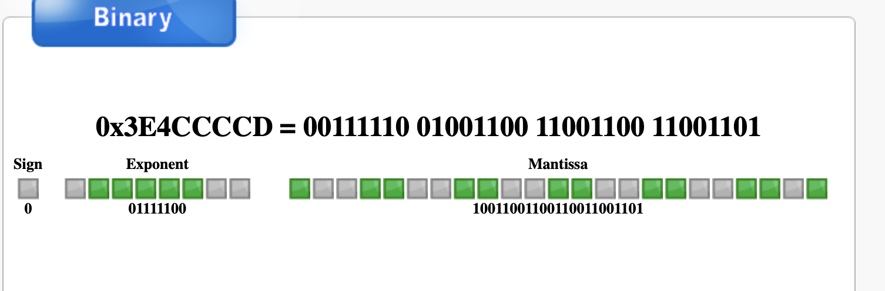

可以看到，8 位指数部分是 `01111100`，稍微和 0.1 的指数不同，23 位的尾数部分是 `10011001100110011001101` 和 0.1 的尾数部分是相同的，也是一个近似值。

0.1 的二进制浮点数转换成十进制的结果是 `0.100000001490116119384765625`：


0.2 的二进制浮点数转换成十进制的结果是 `0.20000000298023223876953125`：


这两个结果相加就是 `0.300000004470348358154296875`：


所以，你会看到**在计算机中 0.1 + 0.2 并不等于完整的 0.3**。

这主要是**因为有的小数无法可以用「完整」的二进制来表示，所以计算机里只能采用近似数的方式来保存，那两个近似数相加，得到的必然也是一个近似数**。

我们在 JavaScript 里执行 0.1 + 0.2，你会得到下面这个结果：


结果和我们前面推到的类似，因为 JavaScript 对于数字都是使用 IEEE 754 标准下的双精度浮点类型来存储的。

而我们二进制只能精准表达 2 除尽的数字 1/2, 1/4, 1/8，但是对于 0.1(1/10) 和 0.2(1/5)，在二进制中都无法精准表示时，需要根据精度舍入。

我们人类熟悉的十进制运算系统，可以精准表达 2 和 5 除尽的数字，例如 1/2, 1/4, 1/5(0.2), 1/8, 1/10(0.1)。

当然，十进制也有无法除尽的地方，例如 1/3, 1/7，也需要根据精度舍入。


### 总结

最后，再来回答开头的问题。

> 为什么负数要用补码表示？

负数之所以用补码的方式来表示，主要是为了统一和正数的加减法操作一样，毕竟数字的加减法是很常用的一个操作，就不要搞特殊化，尽量以统一的方式来运算。

> 十进制小数怎么转成二进制？

十进制整数转二进制使用的是「除 2 取余法」，十进制小数使用的是「乘 2 取整法」。

> 计算机是怎么存小数的？

计算机是以浮点数的形式存储小数的，大多数计算机都是 IEEE 754 标准定义的浮点数格式，包含三个部分：

- 符号位：表示数字是正数还是负数，为 0 表示正数，为 1 表示负数；
- 指数位：指定了小数点在数据中的位置，指数可以是负数，也可以是正数，指数位的长度越长则数值的表达范围就越大；
- 尾数位：小数点右侧的数字，也就是小数部分，比如二进制 1.0011 x 2^(-2)，尾数部分就是 0011，而且尾数的长度决定了这个数的精度，因此如果要表示精度更高的小数，则就要提高尾数位的长度；

用 32 位来表示的浮点数，则称为单精度浮点数，也就是我们编程语言中的 float 变量，而用 64 位来表示的浮点数，称为双精度浮点数，也就是 double 变量。

> 0.1 + 0.2 == 0.3 吗？

不是的，0.1 和 0.2 这两个数字用二进制表达会是一个一直循环的二进制数，比如 0.1 的二进制表示为 0.0 0011 0011 0011… （0011 无限循环)，对于计算机而言，0.1 无法精确表达，这是浮点数计算造成精度损失的根源。

因此，IEEE 754 标准定义的浮点数只能根据精度舍入，然后用「近似值」来表示该二进制，那么意味着计算机存放的小数可能不是一个真实值。

0.1 + 0.2 并不等于完整的 0.3，这主要是因为这两个小数无法用「完整」的二进制来表示，只能根据精度舍入，所以计算机里只能采用近似数的方式来保存，那两个近似数相加，得到的必然也是一个近似数。


-

# 操作系统结构


## Linux 内核 vs Windows 内核

Windows 和 Linux 可以说是我们比较常见的两款操作系统的。

Windows 基本占领了电脑时代的市场，商业上取得了很大成就，但是它并不开源，所以要想接触源码得加入 Windows 的开发团队中。

对于服务器使用的操作系统基本上都是 Linux，而且内核源码也是开源的，任何人都可以下载，并增加自己的改动或功能，Linux 最大的魅力在于，全世界有非常多的技术大佬为它贡献代码。

这两个操作系统各有千秋，不分伯仲。

操作系统核心的东西就是内核，这次我们就来看看，**Linux 内核和 Windows 内核有什么区别？**


### 内核

什么是内核呢？

计算机是由各种外部硬件设备组成的，比如内存、cpu、硬盘等，如果每个应用都要和这些硬件设备对接通信协议，那这样太累了，所以这个中间人就由内核来负责，**让内核作为应用连接硬件设备的桥梁**，应用程序只需关心与内核交互，不用关心硬件的细节。


内核有哪些能力呢？

现代操作系统，内核一般会提供 4 个基本能力：

- 管理进程、线程，决定哪个进程、线程使用 CPU，也就是进程调度的能力；
- 管理内存，决定内存的分配和回收，也就是内存管理的能力；
- 管理硬件设备，为进程与硬件设备之间提供通信能力，也就是硬件通信能力；
- 提供系统调用，如果应用程序要运行更高权限运行的服务，那么就需要有系统调用，它是用户程序与操作系统之间的接口。

内核是怎么工作的？

内核具有很高的权限，可以控制 cpu、内存、硬盘等硬件，而应用程序具有的权限很小，因此大多数操作系统，把内存分成了两个区域：

- 内核空间，这个内存空间只有内核程序可以访问；
- 用户空间，这个内存空间专门给应用程序使用；

用户空间的代码只能访问一个局部的内存空间，而内核空间的代码可以访问所有内存空间。因此，当程序使用用户空间时，我们常说该程序在**用户态**执行，而当程序使用内核空间时，程序则在**内核态**执行。

应用程序如果需要进入内核空间，就需要通过系统调用，下面来看看系统调用的过程：

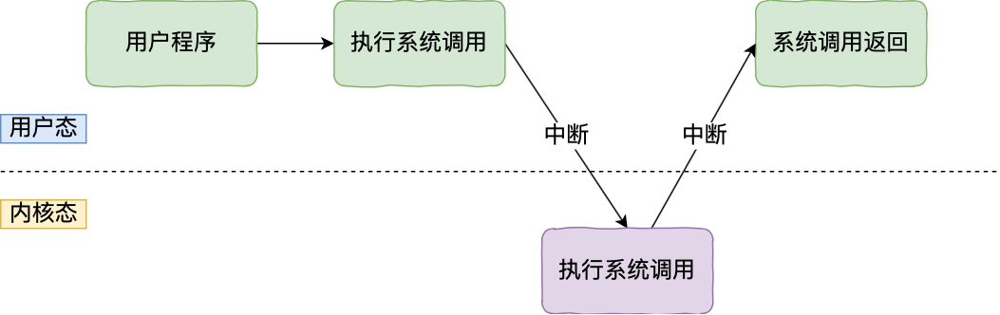

内核程序执行在内核态，用户程序执行在用户态。当应用程序使用系统调用时，会产生一个中断。发生中断后， CPU 会中断当前在执行的用户程序，转而跳转到中断处理程序，也就是开始执行内核程序。内核处理完后，主动触发中断，把 CPU 执行权限交回给用户程序，回到用户态继续工作。


### Linux 的设计

Linux 的开山始祖是来自一位名叫 Linus Torvalds 的芬兰小伙子，他在 1991 年用 C 语言写出了第一版的 Linux 操作系统，那年他 22 岁。

完成第一版 Linux 后，Linus Torvalds 就在网络上发布了 Linux 内核的源代码，每个人都可以免费下载和使用。

Linux 内核设计的理念主要有这几个点：

- *MultiTask*，多任务
- *SMP*，对称多处理
- *ELF*，可执行文件链接格式
- *Monolithic Kernel*，宏内核


#### MultiTask

MultiTask 的意思是**多任务**，代表着 Linux 是一个多任务的操作系统。

多任务意味着可以有多个任务同时执行，这里的「同时」可以是并发或并行：

- 对于单核 CPU 时，可以让每个任务执行一小段时间，时间到就切换另外一个任务，从宏观角度看，一段时间内执行了多个任务，这被称为并发。
- 对于多核 CPU 时，多个任务可以同时被不同核心的 CPU 同时执行，这被称为并行。

#### SMP

SMP 的意思是**对称多处理**，代表着每个 CPU 的地位是相等的，对资源的使用权限也是相同的，多个 CPU 共享同一个内存，每个 CPU 都可以访问完整的内存和硬件资源。

这个特点决定了 Linux 操作系统不会有某个 CPU 单独服务应用程序或内核程序，而是每个程序都可以被分配到任意一个 CPU 上被执行。

#### ELF

ELF 的意思是**可执行文件链接格式**，它是 Linux 操作系统中可执行文件的存储格式，你可以从下图看到它的结构：

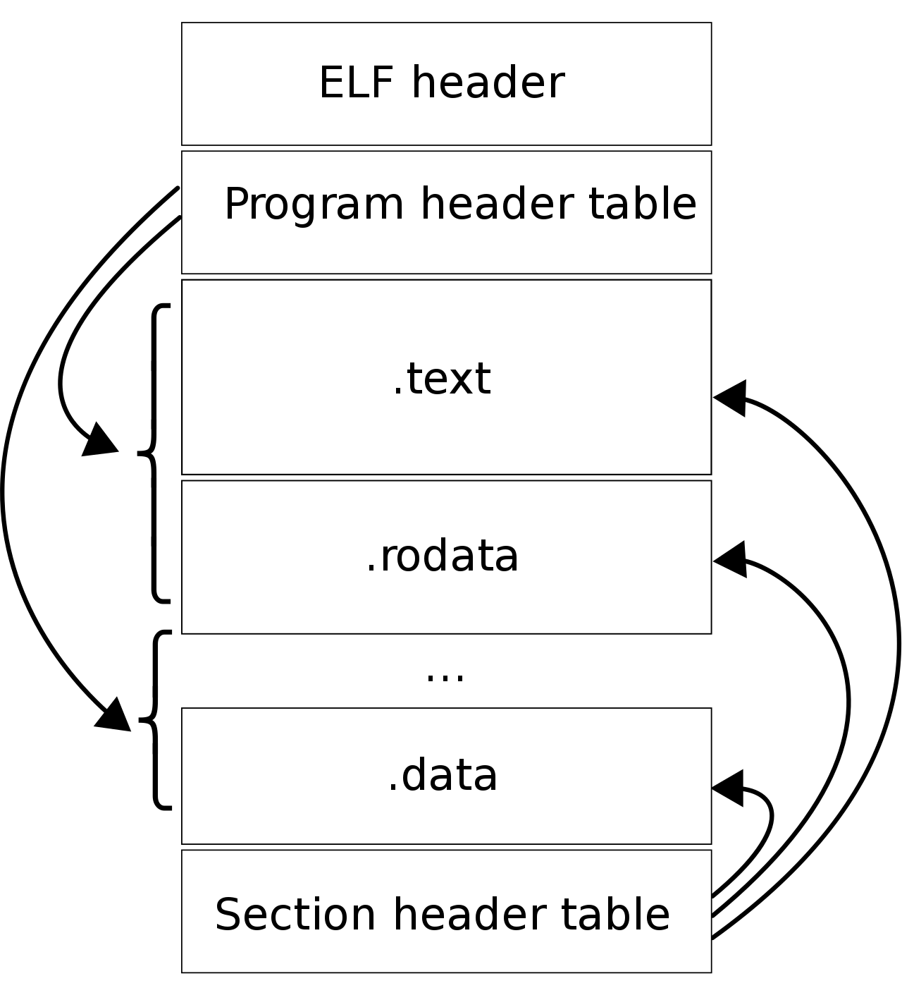

ELF 把文件分成了一个个分段，每一个段都有自己的作用，具体每个段的作用这里我就不详细说明了，感兴趣的同学可以去看《程序员的自我修养——链接、装载和库》这本书。

另外，ELF 文件有两种索引，Program header table 中记录了「运行时」所需的段，而 Section header table 记录了二进制文件中各个「段的首地址」。

那 ELF 文件怎么生成的呢？

我们编写的代码，首先通过「编译器」编译成汇编代码，接着通过「汇编器」变成目标代码，也就是目标文件，最后通过「链接器」把多个目标文件以及调用的各种函数库链接起来，形成一个可执行文件，也就是 ELF 文件。

那 ELF 文件是怎么被执行的呢？

执行 ELF 文件的时候，会通过「装载器」把 ELF 文件装载到内存里，CPU 读取内存中的指令和数据，于是程序就被执行起来了。

#### Monolithic Kernel

Monolithic Kernel 的意思是**宏内核**，Linux 内核架构就是宏内核，意味着 Linux 的内核是一个完整的可执行程序，且拥有最高的权限。

宏内核的特征是系统内核的所有模块，比如进程调度、内存管理、文件系统、设备驱动等，都运行在内核态。

不过，Linux 也实现了动态加载内核模块的功能，例如大部分设备驱动是以可加载模块的形式存在的，与内核其他模块解藕，让驱动开发和驱动加载更为方便、灵活。


与宏内核相反的是**微内核**，微内核架构的内核只保留最基本的能力，比如进程调度、虚拟机内存、中断等，把一些应用放到了用户空间，比如驱动程序、文件系统等。这样服务与服务之间是隔离的，单个服务出现故障或者完全攻击，也不会导致整个操作系统挂掉，提高了操作系统的稳定性和可靠性。

微内核内核功能少，可移植性高，相比宏内核有一点不好的地方在于，由于驱动程序不在内核中，而且驱动程序一般会频繁调用底层能力的，于是驱动和硬件设备交互就需要频繁切换到内核态，这样会带来性能损耗。华为的鸿蒙操作系统的内核架构就是微内核。

还有一种内核叫**混合类型内核**，它的架构有点像微内核，内核里面会有一个最小版本的内核，然后其他模块会在这个基础上搭建，然后实现的时候会跟宏内核类似，也就是把整个内核做成一个完整的程序，大部分服务都在内核中，这就像是宏内核的方式包裹着一个微内核。


### Windows 设计

当今 Windows 7、Windows 10 使用的内核叫 Windows NT，NT 全称叫 New Technology。

下图是 Windows NT 的结构图片：


Windows 和 Linux 一样，同样支持 MultiTask 和 SMP，但不同的是，**Window 的内核设计是混合型内核**，在上图你可以看到内核中有一个 *MicroKernel* 模块，这个就是最小版本的内核，而整个内核实现是一个完整的程序，含有非常多模块。

Windows 的可执行文件的格式与 Linux 也不同，所以这两个系统的可执行文件是不可以在对方上运行的。

Windows 的可执行文件格式叫 PE，称为**可移植执行文件**，扩展名通常是`.exe`、`.dll`、`.sys`等。

PE 的结构你可以从下图中看到，它与 ELF 结构有一点相似。


### 总结

对于内核的架构一般有这三种类型：

- 宏内核，包含多个模块，整个内核像一个完整的程序；
- 微内核，有一个最小版本的内核，一些模块和服务则由用户态管理；
- 混合内核，是宏内核和微内核的结合体，内核中抽象出了微内核的概念，也就是内核中会有一个小型的内核，其他模块就在这个基础上搭建，整个内核是个完整的程序；

Linux 的内核设计是采用了宏内核，Window 的内核设计则是采用了混合内核。

这两个操作系统的可执行文件格式也不一样， Linux 可执行文件格式叫作 ELF，Windows 可执行文件格式叫作 PE。


# 内存管理


## 虚拟内存

**单片机的 CPU 是直接操作内存的「物理地址」**。


在这种情况下，要想在内存中同时运行两个程序是不可能的。如果第一个程序在 2000 的位置写入一个新的值，将会擦掉第二个程序存放在相同位置上的所有内容，所以同时运行两个程序是根本行不通的，这两个程序会立刻崩溃。

> 操作系统是如何解决这个问题呢？

这里关键的问题是这两个程序都引用了绝对物理地址，而这正是我们最需要避免的。

我们可以把进程所使用的地址「隔离」开来，即让操作系统为每个进程分配独立的一套「**虚拟地址**」，人人都有，大家自己玩自己的地址就行，互不干涉。但是有个前提每个进程都不能访问物理地址，至于虚拟地址最终怎么落到物理内存里，对进程来说是透明的，操作系统已经把这些都安排的明明白白了。


**操作系统会提供一种机制，将不同进程的虚拟地址和不同内存的物理地址映射起来。**

如果程序要访问虚拟地址的时候，由操作系统转换成不同的物理地址，这样不同的进程运行的时候，写入的是不同的物理地址，这样就不会冲突了。

于是，这里就引出了两种地址的概念：

- 我们程序所使用的内存地址叫做**虚拟内存地址**（*Virtual Memory Address*）
- 实际存在硬件里面的空间地址叫**物理内存地址**（*Physical Memory Address*）。

操作系统引入了虚拟内存，进程持有的虚拟地址会通过 CPU 芯片中的内存管理单元（MMU）的映射关系，来转换变成物理地址，然后再通过物理地址访问内存，如下图所示：


> 操作系统是如何管理虚拟地址与物理地址之间的关系？

主要有两种方式，分别是**内存分段和内存分页**，分段是比较早提出的，我们先来看看内存分段。


### 内存分段

程序是由若干个逻辑分段组成的，如可由代码分段、数据分段、栈段、堆段组成。**不同的段是有不同的属性的，所以就用分段（Segmentation）的形式把这些段分离出来。**

> 分段机制下，虚拟地址和物理地址是如何映射的？

分段机制下的虚拟地址由两部分组成，**段选择因子**和**段内偏移量**。


段选择因子和段内偏移量：

- **段选择子**就保存在段寄存器里面。段选择子里面最重要的是**段号**，用作段表的索引。**段表**里面保存的是这个**段的基地址、段的界限和特权等级**等。
- 虚拟地址中的**段内偏移量**应该位于 0 和段界限之间，如果段内偏移量是合法的，就将段基地址加上段内偏移量得到物理内存地址。

在上面，知道了虚拟地址是通过**段表**与物理地址进行映射的，分段机制会把程序的虚拟地址分成 4 个段，每个段在段表中有一个项，在这一项找到段的基地址，再加上偏移量，于是就能找到物理内存中的地址，如下图：


如果要访问段 3 中偏移量 500 的虚拟地址，我们可以计算出物理地址为，段 3 基地址 7000 + 偏移量 500 = 7500。

分段的办法很好，解决了程序本身不需要关心具体的物理内存地址的问题，但它也有一些不足之处：

- 第一个就是**内存碎片**的问题。
- 第二个就是**内存交换的效率低**的问题。

接下来，说说为什么会有这两个问题。

> 我们先来看看，分段为什么会产生内存碎片的问题？

我们来看看这样一个例子。假设有 1G 的物理内存，用户执行了多个程序，其中：

- 游戏占用了 512MB 内存
- 浏览器占用了 128MB 内存
- 音乐占用了 256 MB 内存。

这个时候，如果我们关闭了浏览器，则空闲内存还有 1024 - 512 - 256 = 256MB。

如果这个 256MB 不是连续的，被分成了两段 128 MB 内存，这就会导致没有空间再打开一个 200MB 的程序。


> 内存分段会出现内存碎片吗？

内存碎片主要分为，内部内存碎片和外部内存碎片。

内存分段管理可以做到段根据实际需求分配内存，所以有多少需求就分配多大的段，所以**不会出现内部内存碎片**。

但是由于每个段的长度不固定，所以多个段未必能恰好使用所有的内存空间，会产生了多个不连续的小物理内存，导致新的程序无法被装载，所以**会出现外部内存碎片**的问题。

解决「外部内存碎片」的问题就是**内存交换**。

可以把音乐程序占用的那 256MB 内存写到硬盘上，然后再从硬盘上读回来到内存里。不过再读回的时候，我们不能装载回原来的位置，而是紧紧跟着那已经被占用了的 512MB 内存后面。这样就能空缺出连续的 256MB 空间，于是新的 200MB 程序就可以装载进来。

这个内存交换空间，在 Linux 系统里，也就是我们常看到的 Swap 空间，这块空间是从硬盘划分出来的，用于内存与硬盘的空间交换。

> 再来看看，分段为什么会导致内存交换效率低的问题？

对于多进程的系统来说，用分段的方式，外部内存碎片是很容易产生的，产生了外部内存碎片，那不得不重新 `Swap` 内存区域，这个过程会产生性能瓶颈。

因为硬盘的访问速度要比内存慢太多了，每一次内存交换，我们都需要把一大段连续的内存数据写到硬盘上。

所以，**如果内存交换的时候，交换的是一个占内存空间很大的程序，这样整个机器都会显得卡顿。**

为了解决内存分段的「外部内存碎片和内存交换效率低」的问题，就出现了内存分页。


### 内存分页

分段的好处就是能产生连续的内存空间，但是会出现「外部内存碎片和内存交换的空间太大」的问题。

要解决这些问题，那么就要想出能少出现一些内存碎片的办法。另外，当需要进行内存交换的时候，让需要交换写入或者从磁盘装载的数据更少一点，这样就可以解决问题了。这个办法，也就是**内存分页**（*Paging*）。

**分页是把整个虚拟和物理内存空间切成一段段固定尺寸的大小**。这样一个连续并且尺寸固定的内存空间，我们叫**页**（*Page*）。在 Linux 下，每一页的大小为 `4KB`。

虚拟地址与物理地址之间通过**页表**来映射，如下图：


页表是存储在内存里的，**内存管理单元** （*MMU*）就做将虚拟内存地址转换成物理地址的工作。

而当进程访问的虚拟地址在页表中查不到时，系统会产生一个**缺页异常**，进入系统内核空间分配物理内存、更新进程页表，最后再返回用户空间，恢复进程的运行。

> 分页是怎么解决分段的「外部内存碎片和内存交换效率低」的问题？

内存分页由于内存空间都是预先划分好的，也就不会像内存分段一样，在段与段之间会产生间隙非常小的内存，这正是分段会产生外部内存碎片的原因。而**采用了分页，页与页之间是紧密排列的，所以不会有外部碎片。**

但是，因为内存分页机制分配内存的最小单位是一页，即使程序不足一页大小，我们最少只能分配一个页，所以页内会出现内存浪费，所以针对**内存分页机制会有内部内存碎片**的现象。

如果内存空间不够，操作系统会把其他正在运行的进程中的「最近没被使用」的内存页面给释放掉，也就是暂时写在硬盘上，称为**换出**（*Swap Out*）。一旦需要的时候，再加载进来，称为**换入**（*Swap In*）。所以，一次性写入磁盘的也只有少数的一个页或者几个页，不会花太多时间，**内存交换的效率就相对比较高。**


更进一步地，分页的方式使得我们在加载程序的时候，不再需要一次性都把程序加载到物理内存中。我们完全可以在进行虚拟内存和物理内存的页之间的映射之后，并不真的把页加载到物理内存里，而是**只有在程序运行中，需要用到对应虚拟内存页里面的指令和数据时，再加载到物理内存里面去。**

> 分页机制下，虚拟地址和物理地址是如何映射的？

在分页机制下，虚拟地址分为两部分，**页号**和**页内偏移**。页号作为页表的索引，**页表**包含物理页每页所在**物理内存的基地址**，这个基地址与页内偏移的组合就形成了物理内存地址，见下图。


总结一下，对于一个内存地址转换，其实就是这样三个步骤：

- 把虚拟内存地址，切分成页号和偏移量；
- 根据页号，从页表里面，查询对应的物理页号；
- 直接拿物理页号，加上前面的偏移量，就得到了物理内存地址。

下面举个例子，虚拟内存中的页通过页表映射为了物理内存中的页，如下图：

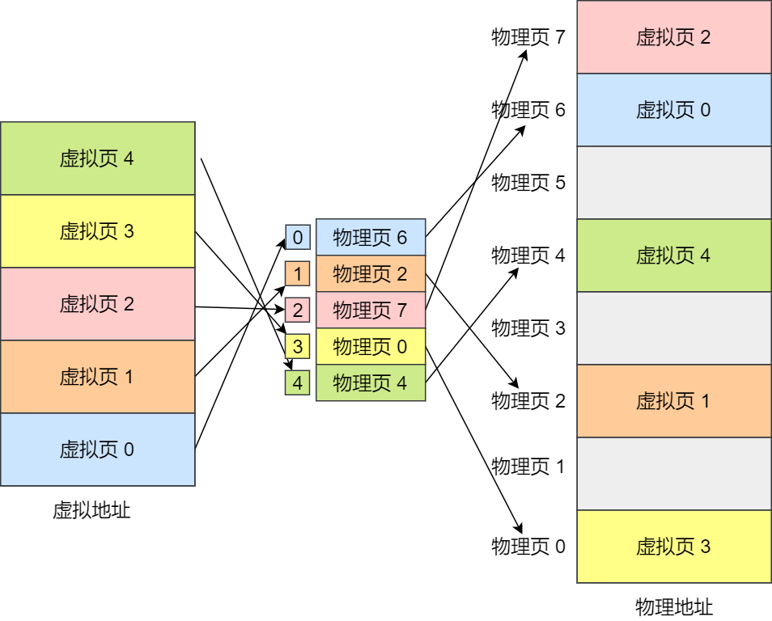

这看起来似乎没什么毛病，但是放到实际中操作系统，这种简单的分页是肯定是会有问题的。

> 简单的分页有什么缺陷吗？

有空间上的缺陷。

因为操作系统是可以同时运行非常多的进程的，那这不就意味着页表会非常的庞大。

在 32 位的环境下，虚拟地址空间共有 4GB，假设一个页的大小是 4KB（2^12），那么就需要大约 100 万 （2^20） 个页，每个「页表项」需要 4 个字节大小来存储（虽然3个字节即可，但是为了方便操作，往往要求每个页面恰好可以装下整数个页表项），那么整个 4GB 空间的映射就需要有 `4MB` 的内存来存储页表。

这 4MB 大小的页表，看起来也不是很大。但是要知道每个进程都是有自己的虚拟地址空间的，也就说都有自己的页表。

那么，`100` 个进程的话，就需要 `400MB` 的内存来存储页表，这是非常大的内存了，更别说 64 位的环境了。


#### 多级页表

要解决上面的问题，就需要采用一种叫作**多级页表**（*Multi-Level Page Table*）的解决方案。

在前面我们知道了，对于单页表的实现方式，在 32 位和页大小 `4KB` 的环境下，一个进程的页表需要装下 100 多万个「页表项」，并且每个页表项是占用 4 字节大小的，于是相当于每个页表需占用 4MB 大小的空间。

我们把这个 100 多万个「页表项」的单级页表再分页，将页表（一级页表）分为 `1024` 个页表（二级页表），每个表（二级页表）中包含 `1024` 个「页表项」，形成**二级分页**。如下图所示：


> 你可能会问，分了二级表，映射 4GB 地址空间就需要 4KB（一级页表）+ 4MB（二级页表）的内存，这样占用空间不是更大了吗？

当然如果 4GB 的虚拟地址全部都映射到了物理内存上的话，二级分页占用空间确实是更大了，但是，我们往往不会为一个进程分配那么多内存。

其实我们应该换个角度来看问题，还记得计算机组成原理里面无处不在的**局部性原理**么？

每个进程都有 4GB 的虚拟地址空间，而显然对于大多数程序来说，其使用到的空间远未达到 4GB，因为会存在部分对应的页表项都是空的，根本没有分配，对于已分配的页表项，如果存在最近一定时间未访问的页表，在物理内存紧张的情况下，操作系统会将页面换出到硬盘，也就是说不会占用物理内存。

如果使用了二级分页，一级页表就可以覆盖整个 4GB 虚拟地址空间，但**如果某个一级页表的页表项没有被用到，也就不需要创建这个页表项对应的二级页表了，即可以在需要时才创建二级页表**。做个简单的计算，假设只有 20% 的一级页表项被用到了，那么页表占用的内存空间就只有 4KB（一级页表） + 20% * 4MB（二级页表）= `0.804MB`，这对比单级页表的 `4MB` 是不是一个巨大的节约？

那么为什么不分级的页表就做不到这样节约内存呢？

我们从页表的性质来看，保存在内存中的页表承担的职责是将虚拟地址翻译成物理地址。假如虚拟地址在页表中找不到对应的页表项，计算机系统就不能工作了。所以**页表一定要覆盖全部虚拟地址空间，不分级的页表就需要有 100 多万个页表项来映射，而二级分页则只需要 1024 个页表项**（此时一级页表覆盖到了全部虚拟地址空间，二级页表在需要时创建）。

我们把二级分页再推广到多级页表，就会发现页表占用的内存空间更少了，这一切都要归功于对局部性原理的充分应用。

对于 64 位的系统，两级分页肯定不够了，就变成了四级目录，分别是：

- 全局页目录项 PGD（*Page Global Directory*）；
- 上层页目录项 PUD（*Page Upper Directory*）；
- 中间页目录项 PMD（*Page Middle Directory*）；
- 页表项 PTE（*Page Table Entry*）；

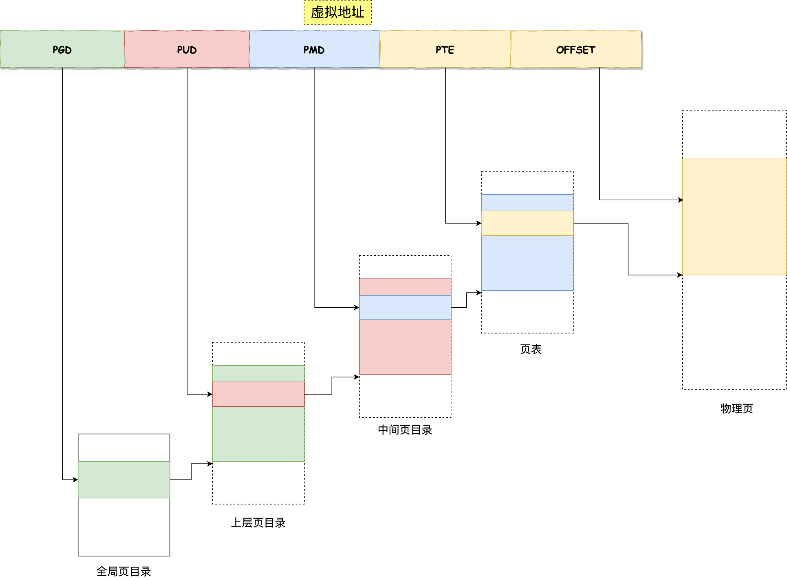


#### TLB

多级页表虽然解决了空间上的问题，但是虚拟地址到物理地址的转换就多了几道转换的工序，这显然就降低了这俩地址转换的速度，也就是带来了时间上的开销。

程序是有局部性的，即在一段时间内，整个程序的执行仅限于程序中的某一部分。相应地，执行所访问的存储空间也局限于某个内存区域。


我们就可以利用这一特性，把最常访问的几个页表项存储到访问速度更快的硬件，于是计算机科学家们，就在 CPU 芯片中，**加入了一个专门存放程序最常访问的页表项的 Cache，这个 Cache 就是 TLB（*Translation Lookaside Buffer*） ，通常称为页表缓存、转址旁路缓存、快表等。**


在 CPU 芯片里面，封装了内存管理单元（*Memory Management Unit*）芯片，它用来完成地址转换和 TLB 的访问与交互。

有了 TLB 后，那么 CPU 在寻址时，会先查 TLB，如果没找到，才会继续查常规的页表。

TLB 的命中率其实是很高的，因为程序最常访问的页就那么几个。


### 段页式内存管理

内存分段和内存分页并不是对立的，它们是可以组合起来在同一个系统中使用的，那么组合起来后，通常称为**段页式内存管理**。


段页式内存管理实现的方式：

- 先将程序划分为多个有逻辑意义的段，也就是前面提到的分段机制；
- 接着再把每个段划分为多个页，也就是对分段划分出来的连续空间，再划分固定大小的页；

这样，地址结构就由**段号、段内页号和页内位移**三部分组成。

用于段页式地址变换的数据结构是每一个程序一张段表，每个段又建立一张页表，段表中的地址是页表的起始地址，而页表中的地址则为某页的物理页号，如图所示：


段页式地址变换中要得到物理地址须经过三次内存访问：

- 第一次访问段表，得到页表起始地址；
- 第二次访问页表，得到物理页号；
- 第三次将物理页号与页内位移组合，得到物理地址。

可用软、硬件相结合的方法实现段页式地址变换，这样虽然增加了硬件成本和系统开销，但提高了内存的利用率。


### Linux 内存布局

那么，Linux 操作系统采用了哪种方式来管理内存呢？

> 在回答这个问题前，我们得先看看 Intel 处理器的发展历史。

早期 Intel 的处理器从 80286 开始使用的是段式内存管理。但是很快发现，光有段式内存管理而没有页式内存管理是不够的，这会使它的 X86 系列会失去市场的竞争力。因此，在不久以后的 80386 中就实现了页式内存管理。也就是说，80386 除了完成并完善从 80286 开始的段式内存管理的同时还实现了页式内存管理。

但是这个 80386 的页式内存管理设计时，没有绕开段式内存管理，而是建立在段式内存管理的基础上，这就意味着，**页式内存管理的作用是在由段式内存管理所映射而成的地址上再加上一层地址映射。**

由于此时由段式内存管理映射而成的地址不再是“物理地址”了，Intel 就称之为“线性地址”（也称虚拟地址）。于是，段式内存管理先将逻辑地址映射成线性地址，然后再由页式内存管理将线性地址映射成物理地址。


这里说明下逻辑地址和线性地址：

- 程序所使用的地址，通常是没被段式内存管理映射的地址，称为逻辑地址；
- 通过段式内存管理映射的地址，称为线性地址，也叫虚拟地址；

逻辑地址是「段式内存管理」转换前的地址，线性地址则是「页式内存管理」转换前的地址。

> 了解完 Intel 处理器的发展历史后，我们再来说说 Linux 采用了什么方式管理内存？

**Linux 内存主要采用的是页式内存管理，但同时也不可避免地涉及了段机制**。

这主要是上面 Intel 处理器发展历史导致的，因为 Intel X86 CPU 一律对程序中使用的地址先进行段式映射，然后才能进行页式映射。既然 CPU 的硬件结构是这样，Linux 内核也只好服从 Intel 的选择。

但是事实上，Linux 内核所采取的办法是使段式映射的过程实际上不起什么作用。也就是说，“上有政策，下有对策”，若惹不起就躲着走。

**Linux 系统中的每个段都是从 0 地址开始的整个 4GB 虚拟空间（32 位环境下），也就是所有的段的起始地址都是一样的。这意味着，Linux 系统中的代码，包括操作系统本身的代码和应用程序代码，所面对的地址空间都是线性地址空间（虚拟地址），这种做法相当于屏蔽了处理器中的逻辑地址概念，段只被用于访问控制和内存保护。**

> 我们再来瞧一瞧，Linux 的虚拟地址空间是如何分布的？

在 Linux 操作系统中，虚拟地址空间的内部又被分为**内核空间和用户空间**两部分，不同位数的系统，地址空间的范围也不同。比如最常见的 32 位和 64 位系统，如下所示：


通过这里可以看出：

- `32` 位系统的内核空间占用 `1G`，位于最高处，剩下的 `3G` 是用户空间；
- `64` 位系统的内核空间和用户空间都是 `128T`，分别占据整个内存空间的最高和最低处，剩下的中间部分是未定义的。

再来说说，内核空间与用户空间的区别：

- 进程在用户态时，只能访问用户空间内存；
- 只有进入内核态后，才可以访问内核空间的内存；

虽然每个进程都各自有独立的虚拟内存，但是**每个虚拟内存中的内核地址，其实关联的都是相同的物理内存**。这样，进程切换到内核态后，就可以很方便地访问内核空间内存。

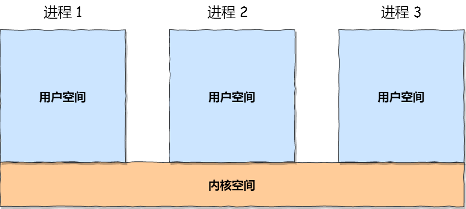

接下来，进一步了解虚拟空间的划分情况，用户空间和内核空间划分的方式是不同的，内核空间的分布情况就不多说了。

我们看看用户空间分布的情况，以 32 位系统为例，我画了一张图来表示它们的关系：


通过这张图你可以看到，用户空间内存，从**低到高**分别是 6 种不同的内存段：

- 代码段，包括二进制可执行代码；
- 数据段，包括已初始化的静态常量和全局变量；
- BSS 段，包括未初始化的静态变量和全局变量；
- 堆段，包括动态分配的内存，从低地址开始向上增长；
- 文件映射段，包括动态库、共享内存等，从低地址开始向上增长（[跟硬件和内核版本有关 (opens new window)](http://lishiwen4.github.io/linux/linux-process-memory-location)）；
- 栈段，包括局部变量和函数调用的上下文等。栈的大小是固定的，一般是 `8 MB`。当然系统也提供了参数，以便我们自定义大小；

上图中的内存布局可以看到，代码段下面还有一段内存空间的（灰色部分），这一块区域是「保留区」，之所以要有保留区这是因为在大多数的系统里，我们认为比较小数值的地址不是一个合法地址，例如，我们通常在 C 的代码里会将无效的指针赋值为 NULL。因此，这里会出现一段不可访问的内存保留区，防止程序因为出现 bug，导致读或写了一些小内存地址的数据，而使得程序跑飞。

在这 7 个内存段中，堆和文件映射段的内存是动态分配的。比如说，使用 C 标准库的 `malloc()` 或者 `mmap()` ，就可以分别在堆和文件映射段动态分配内存。


### 总结

为了在多进程环境下，使得进程之间的内存地址不受影响，相互隔离，于是操作系统就为每个进程独立分配一套**虚拟地址空间**，每个程序只关心自己的虚拟地址就可以，实际上大家的虚拟地址都是一样的，但分布到物理地址内存是不一样的。作为程序，也不用关心物理地址的事情。

每个进程都有自己的虚拟空间，而物理内存只有一个，所以当启用了大量的进程，物理内存必然会很紧张，于是操作系统会通过**内存交换**技术，把不常使用的内存暂时存放到硬盘（换出），在需要的时候再装载回物理内存（换入）。

那既然有了虚拟地址空间，那必然要把虚拟地址「映射」到物理地址，这个事情通常由操作系统来维护。

那么对于虚拟地址与物理地址的映射关系，可以有**分段**和**分页**的方式，同时两者结合都是可以的。

内存分段是根据程序的逻辑角度，分成了栈段、堆段、数据段、代码段等，这样可以分离出不同属性的段，同时是一块连续的空间。但是每个段的大小都不是统一的，这就会导致外部内存碎片和内存交换效率低的问题。

于是，就出现了内存分页，把虚拟空间和物理空间分成大小固定的页，如在 Linux 系统中，每一页的大小为 `4KB`。由于分了页后，就不会产生细小的内存碎片，解决了内存分段的外部内存碎片问题。同时在内存交换的时候，写入硬盘也就一个页或几个页，这就大大提高了内存交换的效率。

再来，为了解决简单分页产生的页表过大的问题，就有了**多级页表**，它解决了空间上的问题，但这就会导致 CPU 在寻址的过程中，需要有很多层表参与，加大了时间上的开销。于是根据程序的**局部性原理**，在 CPU 芯片中加入了 **TLB**，负责缓存最近常被访问的页表项，大大提高了地址的转换速度。

**Linux 系统主要采用了分页管理，但是由于 Intel 处理器的发展史，Linux 系统无法避免分段管理**。于是 Linux 就把所有段的基地址设为 `0`，也就意味着所有程序的地址空间都是线性地址空间（虚拟地址），相当于屏蔽了 CPU 逻辑地址的概念，所以段只被用于访问控制和内存保护。

另外，Linux 系统中虚拟空间分布可分为**用户态**和**内核态**两部分，其中用户态的分布：代码段、全局变量、BSS、函数栈、堆内存、映射区。

> 最后，说下虚拟内存有什么作用？

- 第一，**虚拟内存可以使得进程对运行内存超过物理内存大小**，因为程序运行符合局部性原理，CPU 访问内存会有很明显的重复访问的倾向性，对于那些没有被经常使用到的内存，我们可以把它换出到物理内存之外，比如硬盘上的 swap 区域。
- 第二，由于每个进程都有自己的页表，所以每个进程的虚拟内存空间就是相互独立的。进程也没有办法访问其他进程的页表，所以这些页表是私有的，**这就解决了多进程之间地址冲突的问题。**
- 第三，页表里的页表项中除了物理地址之外，还有一些标记属性的比特，比如控制一个页的读写权限，标记该页是否存在等。**在内存访问方面，操作系统提供了更好的安全性。**


## malloc 是如何分配内存的？

- malloc 是如何分配内存的？
- malloc 分配的是物理内存吗？
- malloc(1) 会分配多大的内存？
- free 释放内存，会归还给操作系统吗？
- free() 函数只传入一个内存地址，为什么能知道要释放多大的内存？


### Linux 进程的内存分布长什么样？

在 Linux 操作系统中，虚拟地址空间的内部又被分为**内核空间和用户空间**两部分，不同位数的系统，地址空间的范围也不同。比如最常见的 32 位和 64 位系统，如下所示：

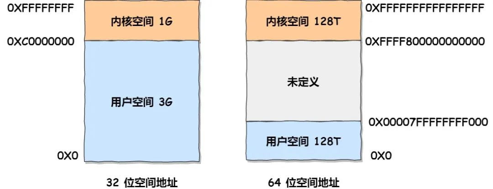

通过这里可以看出：

- `32` 位系统的内核空间占用 `1G`，位于最高处，剩下的 `3G` 是用户空间；
- `64` 位系统的内核空间和用户空间都是 `128T`，分别占据整个内存空间的最高和最低处，剩下的中间部分是未定义的。

再来说说，内核空间与用户空间的区别：

- 进程在用户态时，只能访问用户空间内存；
- 只有进入内核态后，才可以访问内核空间的内存；

虽然每个进程都各自有独立的虚拟内存，但是**每个虚拟内存中的内核地址，其实关联的都是相同的物理内存**。这样，进程切换到内核态后，就可以很方便地访问内核空间内存。

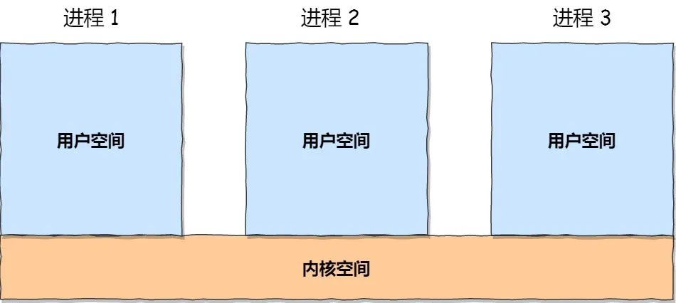

接下来，进一步了解虚拟空间的划分情况，用户空间和内核空间划分的方式是不同的，内核空间的分布情况就不多说了。

我们看看用户空间分布的情况，以 32 位系统为例，我画了一张图来表示它们的关系：

通过这张图你可以看到，用户空间内存从**低到高**分别是 6 种不同的内存段：

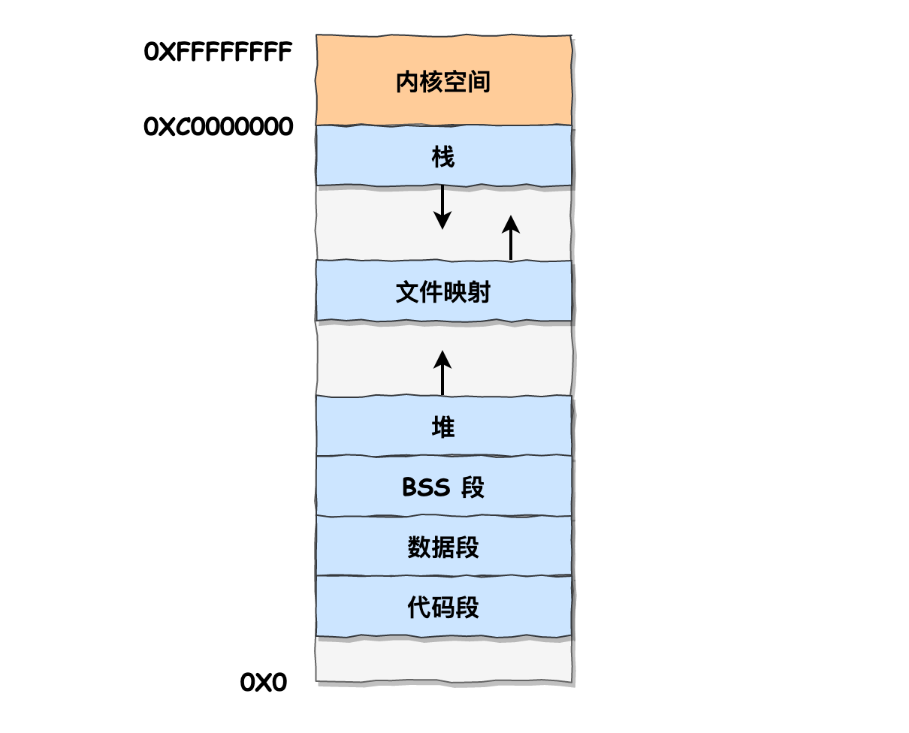

- 代码段，包括二进制可执行代码；
- 数据段，包括已初始化的静态常量和全局变量；
- BSS 段，包括未初始化的静态变量和全局变量；
- 堆段，包括动态分配的内存，从低地址开始向上增长；
- 文件映射段，包括动态库、共享内存等，从低地址开始向上增长（[跟硬件和内核版本有关 (opens new window)](http://lishiwen4.github.io/linux/linux-process-memory-location)）；
- 栈段，包括局部变量和函数调用的上下文等。栈的大小是固定的，一般是 `8 MB`。当然系统也提供了参数，以便我们自定义大小；

在这 6 个内存段中，堆和文件映射段的内存是动态分配的。比如说，使用 C 标准库的 `malloc()` 或者 `mmap()` ，就可以分别在堆和文件映射段动态分配内存。


### malloc 是如何分配内存的？

实际上，malloc() 并不是系统调用，而是 C 库里的函数，用于动态分配内存。

malloc 申请内存的时候，会有两种方式向操作系统申请堆内存。

- 方式一：通过 brk() 系统调用从堆分配内存
- 方式二：通过 mmap() 系统调用在文件映射区域分配内存；

方式一实现的方式很简单，就是通过 brk() 函数将「堆顶」指针向高地址移动，获得新的内存空间。如下图：


方式二通过 mmap() 系统调用中「私有匿名映射」的方式，在文件映射区分配一块内存，也就是从文件映射区“偷”了一块内存。如下图：


> 什么场景下 malloc() 会通过 brk() 分配内存？又是什么场景下通过 mmap() 分配内存？

malloc() 源码里默认定义了一个阈值：

- 如果用户分配的内存小于 128 KB，则通过 brk() 申请内存；
- 如果用户分配的内存大于 128 KB，则通过 mmap() 申请内存；

注意，不同的 glibc 版本定义的阈值也是不同的。


### malloc() 分配的是物理内存吗？

不是的，**malloc() 分配的是虚拟内存**。

如果分配后的虚拟内存没有被访问的话，虚拟内存是不会映射到物理内存的，这样就不会占用物理内存了。

**只有在访问已分配的虚拟地址空间的时候，操作系统通过查找页表，发现虚拟内存对应的页没有在物理内存中，就会触发缺页中断，然后操作系统会建立虚拟内存和物理内存之间的映射关系。**


### malloc(1) 会分配多大的虚拟内存？

malloc() 在分配内存的时候，并不是老老实实按用户预期申请的字节数来分配内存空间大小，而是**会预分配更大的空间作为内存池**。

具体会预分配多大的空间，跟 malloc 使用的内存管理器有关系，我们就以 malloc 默认的内存管理器（Ptmalloc2）来分析。

接下里，我们做个实验，用下面这个代码，通过 malloc 申请 1 字节的内存时，看看操作系统实际分配了多大的内存空间。

```c
#include <stdio.h>
#include <malloc.h>

int main() {
  printf("使用cat /proc/%d/maps查看内存分配\n",getpid());
  
  //申请1字节的内存
  void *addr = malloc(1);
  printf("此1字节的内存起始地址：%x\n", addr);
  printf("使用cat /proc/%d/maps查看内存分配\n",getpid());
 
  //将程序阻塞，当输入任意字符时才往下执行
  getchar();

  //释放内存
  free(addr);
  printf("释放了1字节的内存，但heap堆并不会释放\n");
  
  getchar();
  return 0;
}
```

执行代码（**先提前说明，我使用的 glibc 库的版本是 2.17**）：


我们可以通过 /proc//maps 文件查看进程的内存分布情况。我在 maps 文件通过此 1 字节的内存起始地址过滤出了内存地址的范围。

```shell
[root@xiaolin ~]# cat /proc/3191/maps | grep d730
00d73000-00d94000 rw-p 00000000 00:00 0                                  [heap]
```

这个例子分配的内存小于 128 KB，所以是通过 brk() 系统调用向堆空间申请的内存，因此可以看到最右边有 [heap] 的标识。

可以看到，堆空间的内存地址范围是 00d73000-00d94000，这个范围大小是 132KB，也就说明了 **malloc(1) 实际上预分配 132K 字节的内存**。

可能有的同学注意到了，程序里打印的内存起始地址是 `d73010`，而 maps 文件显示堆内存空间的起始地址是 `d73000`，为什么会多出来 `0x10` （16字节）呢？这个问题，我们先放着，后面会说。


### free 释放内存，会归还给操作系统吗？

我们在上面的进程往下执行，看看通过 free() 函数释放内存后，堆内存还在吗？


从下图可以看到，通过 free 释放内存后，堆内存还是存在的，并没有归还给操作系统。


这是因为与其把这 1 字节释放给操作系统，不如先缓存着放进 malloc 的内存池里，当进程再次申请 1 字节的内存时就可以直接复用，这样速度快了很多。

当然，当进程退出后，操作系统就会回收进程的所有资源。

上面说的 free 内存后堆内存还存在，是针对 malloc 通过 brk() 方式申请的内存的情况。

如果 malloc 通过 mmap 方式申请的内存，free 释放内存后就会归归还给操作系统。

我们做个实验验证下， 通过 malloc 申请 128 KB 字节的内存，来使得 malloc 通过 mmap 方式来分配内存。

```c
#include <stdio.h>
#include <malloc.h>

int main() {
  //申请1字节的内存
  void *addr = malloc(128*1024);
  printf("此128KB字节的内存起始地址：%x\n", addr);
  printf("使用cat /proc/%d/maps查看内存分配\n",getpid());

  //将程序阻塞，当输入任意字符时才往下执行
  getchar();

  //释放内存
  free(addr);
  printf("释放了128KB字节的内存，内存也归还给了操作系统\n");

  getchar();
  return 0;
}
```

执行代码：


查看进程的内存的分布情况，可以发现最右边没有 [heap] 标志，说明是通过 mmap 以匿名映射的方式从文件映射区分配的匿名内存。


然后我们释放掉这个内存看看：


再次查看该 128 KB 内存的起始地址，可以发现已经不存在了，说明归还给了操作系统。


对于 「malloc 申请的内存，free 释放内存会归还给操作系统吗？」这个问题，我们可以做个总结了：

- malloc 通过 **brk()** 方式申请的内存，free 释放内存的时候，**并不会把内存归还给操作系统，而是缓存在 malloc 的内存池中，待下次使用**；
- malloc 通过 **mmap()** 方式申请的内存，free 释放内存的时候，**会把内存归还给操作系统，内存得到真正的释放**。


### 为什么不全部使用 mmap 来分配内存？

因为向操作系统申请内存，是要通过系统调用的，执行系统调用是要进入内核态的，然后在回到用户态，运行态的切换会耗费不少时间。

所以，申请内存的操作应该避免频繁的系统调用，如果都用 mmap 来分配内存，等于每次都要执行系统调用。

另外，因为 mmap 分配的内存每次释放的时候，都会归还给操作系统，于是每次 mmap 分配的虚拟地址都是缺页状态的，然后在第一次访问该虚拟地址的时候，就会触发缺页中断。

也就是说，**频繁通过 mmap 分配的内存话，不仅每次都会发生运行态的切换，还会发生缺页中断（在第一次访问虚拟地址后），这样会导致 CPU 消耗较大**。

为了改进这两个问题，malloc 通过 brk() 系统调用在堆空间申请内存的时候，由于堆空间是连续的，所以直接预分配更大的内存来作为内存池，当内存释放的时候，就缓存在内存池中。

**等下次在申请内存的时候，就直接从内存池取出对应的内存块就行了，而且可能这个内存块的虚拟地址与物理地址的映射关系还存在，这样不仅减少了系统调用的次数，也减少了缺页中断的次数，这将大大降低 CPU 的消耗**。


### 既然 brk 那么牛逼，为什么不全部使用 brk 来分配？

前面我们提到通过 brk 从堆空间分配的内存，并不会归还给操作系统，那么我们那考虑这样一个场景。

如果我们连续申请了 10k，20k，30k 这三片内存，如果 10k 和 20k 这两片释放了，变为了空闲内存空间，如果下次申请的内存小于 30k，那么就可以重用这个空闲内存空间。


但是如果下次申请的内存大于 30k，没有可用的空闲内存空间，必须向 OS 申请，实际使用内存继续增大。

因此，随着系统频繁地 malloc 和 free ，尤其对于小块内存，堆内将产生越来越多不可用的碎片，导致“内存泄露”。而这种“泄露”现象使用 valgrind 是无法检测出来的。

所以，**malloc 实现中，充分考虑了 brk 和 mmap 行为上的差异及优缺点，默认分配大块内存 (128KB) 才使用 mmap 分配内存空间。**


### free() 函数只传入一个内存地址，为什么能知道要释放多大的内存？

还记得，我前面提到， malloc 返回给用户态的内存起始地址比进程的堆空间起始地址多了 16 字节吗？

这个多出来的 16 字节就是保存了该内存块的描述信息，比如有该内存块的大小。


这样当执行 free() 函数时，free 会对传入进来的内存地址向左偏移 16 字节，然后从这个 16 字节的分析出当前的内存块的大小，自然就知道要释放多大的内存了。


## 在 4GB 物理内存的机器上，申请 8G 内存会怎么样？

这个问题在没有前置条件下，就说出答案就是耍流氓。这个问题要考虑三个前置条件：

- 操作系统是 32 位的，还是 64 位的？
- 申请完 8G 内存后会不会被使用？
- 操作系统有没有使用 Swap 机制？


### 操作系统虚拟内存大小

应用程序通过 malloc 函数申请内存的时候，**实际上申请的是虚拟内存，此时并不会分配物理内存。**

当应用程序读写了这块虚拟内存，CPU 就会去访问这个虚拟内存， 这时会发现这个虚拟内存没有映射到物理内存， CPU 就会产生**缺页中断**，进程会从用户态切换到内核态，并将缺页中断交给内核的 Page Fault Handler （缺页中断函数）处理。

缺页中断处理函数会看是否有空闲的物理内存：

- 如果有，就直接分配物理内存，并建立虚拟内存与物理内存之间的映射关系。
- 如果没有空闲的物理内存，那么内核就会开始进行[回收内存 (opens new window)](https://xiaolincoding.com/os/3_memory/mem_reclaim.html)的工作，如果回收内存工作结束后，空闲的物理内存仍然无法满足此次物理内存的申请，那么内核就会放最后的大招了触发 OOM （Out of Memory）机制。

32 位操作系统和 64 位操作系统的虚拟地址空间大小是不同的，在 Linux 操作系统中，虚拟地址空间的内部又被分为**内核空间和用户空间**两部分，如下所示：


通过这里可以看出：

- `32` 位系统的内核空间占用 `1G`，位于最高处，剩下的 `3G` 是用户空间；
- `64` 位系统的内核空间和用户空间都是 `128T`，分别占据整个内存空间的最高和最低处，剩下的中间部分是未定义的。


#### 32 位系统的场景

> 现在可以回答这个问题了：在 32 位操作系统、4GB 物理内存的机器上，申请 8GB 内存，会怎么样？

因为 32 位操作系统，进程最多只能申请 3 GB 大小的虚拟内存空间，所以进程申请 8GB 内存的话，在申请虚拟内存阶段就会失败（我手上没有 32 位操作系统测试，我估计失败的错误是 cannot allocate memory，也就是无法申请内存失败）。


#### 64 位系统的场景

> 在 64 位操作系统、4GB 物理内存的机器上，申请 8G 内存，会怎么样？

64 位操作系统，进程可以使用 128 TB 大小的虚拟内存空间，所以进程申请 8GB 内存是没问题的，因为进程申请内存是申请虚拟内存，只要不读写这个虚拟内存，操作系统就不会分配物理内存。

我们可以简单做个测试，我的服务器是 64 位操作系统，但是物理内存只有 2 GB：

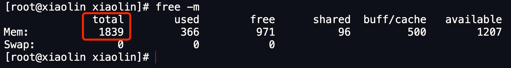

现在，我在机器上，连续申请 4 次 1 GB 内存，也就是一共申请了 4 GB 内存，注意下面代码只是单纯分配了虚拟内存，并没有使用该虚拟内存：

```c
#include <stdio.h>
#include <stdlib.h>
#include <string.h>
#include <errno.h>

#define MEM_SIZE 1024 * 1024 * 1024

int main() {
    char* addr[4];
    int i = 0;
    for(i = 0; i < 4; ++i) {
        addr[i] = (char*) malloc(MEM_SIZE);
        if(!addr[i]) {
            printf("执行 malloc 失败, 错误：%s\n",strerror(errno));
		        return -1;
        }
        printf("主线程调用malloc后，申请1gb大小得内存，此内存起始地址：0X%p\n", addr[i]);
    }
    
    //输入任意字符后，才结束
    getchar();
    return 0;
}
```

然后运行这个代码，可以看到，我的物理内存虽然只有 2GB，但是程序正常分配了 4GB 大小的虚拟内存：


我们可以通过下面这条命令查看进程（test）的虚拟内存大小：

```shell
# ps aux | grep test
USER       PID %CPU %MEM    VSZ   RSS TTY      STAT START   TIME COMMAND
root      7797  0.0  0.0 4198540  352 pts/1    S+   16:58   0:00 ./test
```

其中，VSZ 就代表进程使用的虚拟内存大小，RSS 代表进程使用的物理内存大小。可以看到，VSZ 大小为 4198540，也就是 4GB 的虚拟内存。

> 之前有读者跟我反馈，说他自己也做了这个实验，然后发现 64 位操作系统，在申请 4GB 虚拟内存的时候失败了，这是为什么呢？

失败的错误：


我当时帮他排查了下，发现跟 Linux 中的 [overcommit_memory (opens new window)](http://linuxperf.com/?p=102)参数有关，可以使用 `cat /proc/sys/vm/overcommit_memory` 来查看这个参数，这个参数接受三个值：

- 如果值为 0（默认值），代表：Heuristic overcommit handling，它允许overcommit，但过于明目张胆的overcommit会被拒绝，比如malloc一次性申请的内存大小就超过了系统总内存。Heuristic的意思是“试探式的”，内核利用某种算法猜测你的内存申请是否合理，大概可以理解为单次申请不能超过free memory + free swap + pagecache的大小 + SLAB中可回收的部分 ，超过了就会拒绝overcommit。
- 如果值为 1，代表：Always overcommit. 允许overcommit，对内存申请来者不拒。
- 如果值为 2，代表：Don’t overcommit. 禁止overcommit。

当时那位读者的 overcommit_memory 参数是默认值 0 ，所以申请失败的原因可能是内核认为我们申请的内存太大了，它认为不合理，所以 malloc() 返回了 Cannot allocate memory 错误，这里申请 4GB 虚拟内存失败的同学可以将这个 overcommit_memory 设置为1，就可以 overcommit 了。

```shell
echo 1 > /proc/sys/vm/overcommit_memory 
```

设置完为 1 后，读者的机子就可以正常申请 4GB 虚拟内存了。


**不过我的环境 overcommit_memory 是 0，在 64 系统、2 G 物理内存场景下，也是可以成功申请 4 G 内存的，我怀疑可能是不同版本的内核在 overcommit_memory 为 0 时，检测内存申请是否合理的算法可能是不同的。**

**总之，如果你申请大内存的时候，不想被内核检测内存申请是否合理的算法干扰的话，将 overcommit_memory 设置为 1 就行。**

> 那么将这个 overcommit_memory 设置为 1 之后，64 位的主机就可以申请接近 128T 虚拟内存了吗？

不一定，还得看你服务器的物理内存大小。

读者的服务器物理内存是 2 GB，实验后发现，进程还没有申请到 128T 虚拟内存的时候就被杀死了。

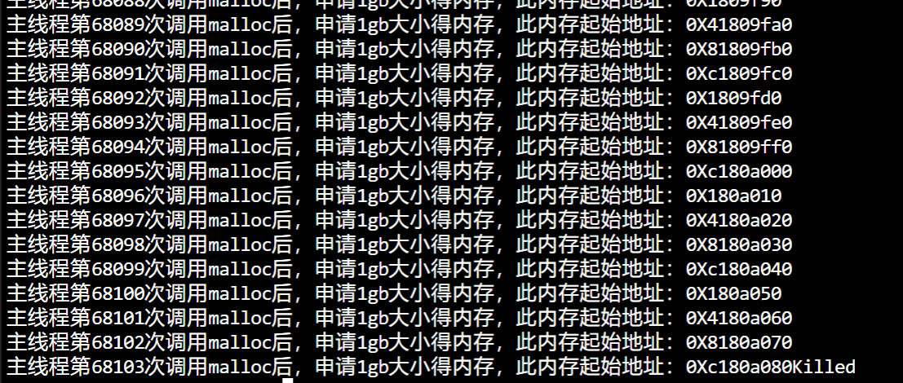

注意，这次是 killed，而不是 Cannot Allocate Memory，说明并不是内存申请有问题，而是触发 OOM 了。

但是为什么会触发 OOM 呢？

那得看你的主机的「物理内存」够不够大了，即使 malloc 申请的是虚拟内存，只要不去访问就不会映射到物理内存，但是申请虚拟内存的过程中，还是使用到了物理内存（比如内核保存虚拟内存的数据结构，也是占用物理内存的），如果你的主机是只有 2GB 的物理内存的话，大概率会触发 OOM。

可以使用 top 命令，点击两下 m，通过进度条观察物理内存使用情况。


可以看到申请虚拟内存的过程中**物理内存使用量一直在增长**。


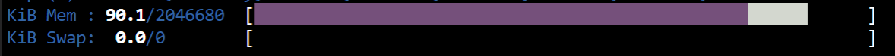

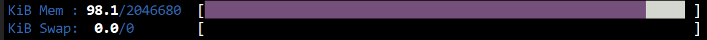

直到直接内存回收之后，也无法回收出一块空间供这个进程使用，这个时候就会触发 OOM，给所有能杀死的进程打分，分数越高的进程越容易被杀死。

在这里当然是这个进程得分最高，那么操作系统就会将这个进程杀死，所以最后会出现 killed，而不是Cannot allocate memory。

> 那么 2GB 的物理内存的 64 位操作系统，就不能申请128T的虚拟内存了吗？

其实可以，上面的情况是还没开启 swap 的情况。

使用 swapfile 的方式开启了 1GB 的 swap 空间之后再做实验：


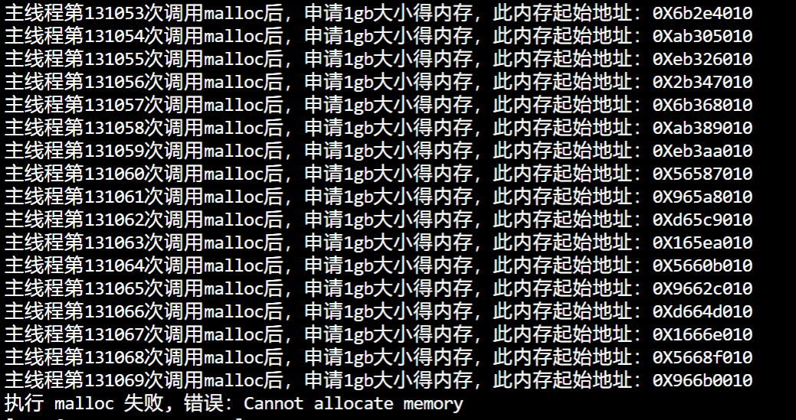

发现出现了 Cannot allocate memory，但是其实到这里已经成功了，

打开计算器计算一下，发现已经申请了 127.998T 虚拟内存了。

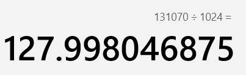

实际上我们是不可能申请完整个 128T 的用户空间的，因为程序运行本身也需要申请虚拟空间

申请 127T 虚拟内存试试：

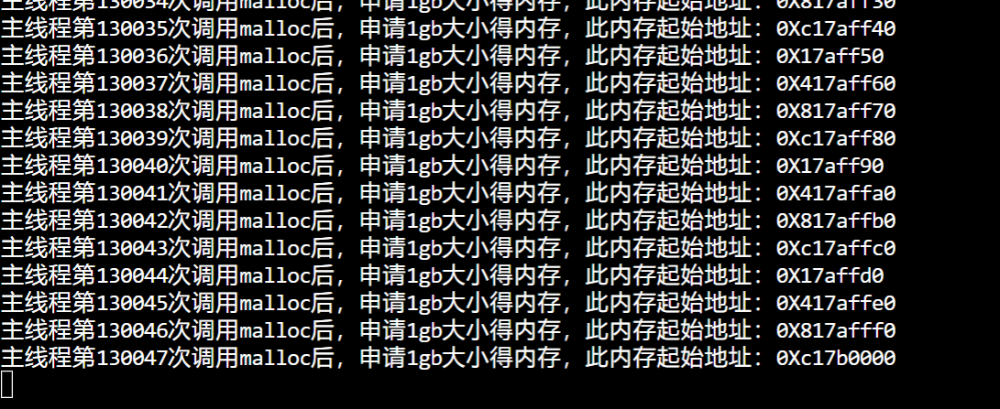

发现进程没有被杀死，也没有 Cannot allocate memory，也正好是 127T 虚拟内存空间。

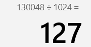

在 top 中我们可以看到这个申请了127T虚拟内存的进程。

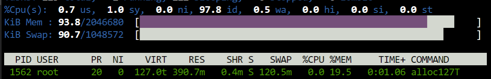


### Swap 机制的作用

前面讨论在 32 位/64 位操作系统环境下，申请的虚拟内存超过物理内存后会怎么样？

- 在 32 位操作系统，因为进程最大只能申请 3 GB 大小的虚拟内存，所以直接申请 8G 内存，会申请失败。
- 在 64 位操作系统，因为进程最大只能申请 128 TB 大小的虚拟内存，即使物理内存只有 4GB，申请 8G 内存也是没问题，因为申请的内存是虚拟内存。

程序申请的虚拟内存，如果没有被使用，它是不会占用物理空间的。当访问这块虚拟内存后，操作系统才会进行物理内存分配。

如果申请物理内存大小超过了空闲物理内存大小，就要看操作系统有没有开启 Swap 机制：

- 如果没有开启 Swap 机制，程序就会直接 OOM；
- 如果有开启 Swap 机制，程序可以正常运行。

> 什么是 Swap 机制？

当系统的物理内存不够用的时候，就需要将物理内存中的一部分空间释放出来，以供当前运行的程序使用。那些被释放的空间可能来自一些很长时间没有什么操作的程序，这些被释放的空间会被临时保存到磁盘，等到那些程序要运行时，再从磁盘中恢复保存的数据到内存中。

另外，当内存使用存在压力的时候，会开始触发内存回收行为，会把这些不常访问的内存先写到磁盘中，然后释放这些内存，给其他更需要的进程使用。再次访问这些内存时，重新从磁盘读入内存就可以了。

这种，将内存数据换出磁盘，又从磁盘中恢复数据到内存的过程，就是 Swap 机制负责的。

Swap 就是把一块磁盘空间或者本地文件，当成内存来使用，它包含换出和换入两个过程：

- **换出（Swap Out）** ，是把进程暂时不用的内存数据存储到磁盘中，并释放这些数据占用的内存；
- **换入（Swap In）**，是在进程再次访问这些内存的时候，把它们从磁盘读到内存中来；

Swap 换入换出的过程如下图：

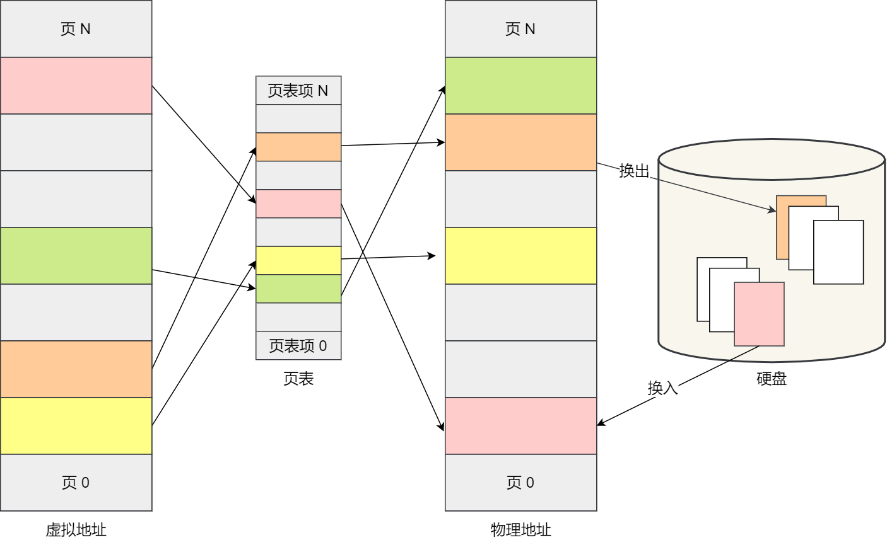

使用 Swap 机制优点是，应用程序实际可以使用的内存空间将远远超过系统的物理内存。由于硬盘空间的价格远比内存要低，因此这种方式无疑是经济实惠的。当然，频繁地读写硬盘，会显著降低操作系统的运行速率，这也是 Swap 的弊端。

Linux 中的 Swap 机制会在内存不足和内存闲置的场景下触发：

- **内存不足**：当系统需要的内存超过了可用的物理内存时，内核会将内存中不常使用的内存页交换到磁盘上为当前进程让出内存，保证正在执行的进程的可用性，这个内存回收的过程是强制的直接内存回收（Direct Page Reclaim）。**直接内存回收是同步的过程，会阻塞当前申请内存的进程。**
- **内存闲置**：应用程序在启动阶段使用的大量内存在启动后往往都不会使用，通过后台运行的守护进程（kSwapd），我们可以将这部分只使用一次的内存交换到磁盘上为其他内存的申请预留空间。kSwapd 是 Linux 负责页面置换（Page replacement）的守护进程，它也是负责交换闲置内存的主要进程，它会在[空闲内存低于一定水位 (opens new window)](https://xiaolincoding.com/os/3_memory/mem_reclaim.html#尽早触发-kSwapd-内核线程异步回收内存)时，回收内存页中的空闲内存保证系统中的其他进程可以尽快获得申请的内存。**kSwapd 是后台进程，所以回收内存的过程是异步的，不会阻塞当前申请内存的进程。**

Linux 提供了两种不同的方法启用 Swap，分别是 Swap 分区（Swap Partition）和 Swap 文件（Swapfile），开启方法可以看[这个资料 (opens new window)](https://support.huaweicloud.com/trouble-ecs/ecs_trouble_0322.html)：

- Swap 分区是硬盘上的独立区域，该区域只会用于交换分区，其他的文件不能存储在该区域上，我们可以使用 `swapon -s` 命令查看当前系统上的交换分区；
- Swap 文件是文件系统中的特殊文件，它与文件系统中的其他文件也没有太多的区别；

> Swap 换入换出的是什么类型的内存？

内核缓存的文件数据，因为都有对应的磁盘文件，所以在回收文件数据的时候， 直接写回到对应的文件就可以了。

但是像进程的堆、栈数据等，它们是没有实际载体，**这部分内存被称为匿名页。**而且这部分内存很可能还要再次被访问，所以不能直接释放内存，**于是就需要有一个能保存匿名页的磁盘载体，这个载体就是 Swap 分区。**

匿名页回收的方式是通过 Linux 的 Swap 机制，Swap 会把不常访问的内存先写到磁盘中，然后释放这些内存，给其他更需要的进程使用。再次访问这些内存时，重新从磁盘读入内存就可以了。

接下来，通过两个实验，看看申请的物理内存超过物理内存会怎样？

- 实验一：没有开启 Swap 机制
- 实验二：有开启 Swap 机制


#### 实验一：没有开启 Swap 机制

我的服务器是 64 位操作系统，但是物理内存只有 2 GB，而且没有 Swap 分区：


我们改一下前面的代码，使得在申请完 4GB 虚拟内存后，通过 memset 函数访问这个虚拟内存，看看在没有 Swap 分区的情况下，会发生什么？

```c
#include <stdio.h>
#include <stdlib.h>
#include <string.h>
#include <errno.h>

#define MEM_SIZE 1024 * 1024 * 1024

int main() {
    char* addr[4];
    int i = 0;
    for(i = 0; i < 4; ++i) {
        addr[i] = (char*) malloc(MEM_SIZE);
        if(!addr[i]) {
            printf("执行 malloc 失败, 错误：%s\n",strerror(errno));
            return -1;
        }
        printf("主线程调用malloc后，申请1gb大小得内存，此内存起始地址：0X%p\n", addr[i]);
    }

    for(i = 0; i < 4; ++i) {
        printf("开始访问第 %d 块虚拟内存(每一块虚拟内存为 1 GB)\n", i + 1);
        memset(addr[i], 0, MEM_SIZE);
    }
    
    //输入任意字符后，才结束
    getchar();
    return 0;
}
```

运行结果：

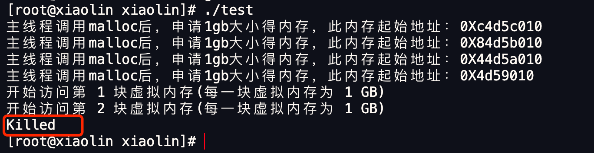

可以看到，在访问第 2 块虚拟内存（每一块虚拟内存是 1 GB）的时候，因为超过了机器的物理内存（2GB），进程（test）被操作系统杀掉了。

通过查看 message 系统日志，可以发现该进程是被操作系统 OOM killer 机制杀掉了，日志里报错了 Out of memory，也就是发生 OOM（内存溢出错误）。


> 什么是 OOM?

内存溢出(Out Of Memory，简称OOM)是指应用系统中存在无法回收的内存或使用的内存过多，最终使得程序运行要用到的内存大于能提供的最大内存。此时程序就运行不了，系统会提示内存溢出。


#### 实验二：有开启 Swap 机制

我用我的 mac book pro 笔记本做测试，我的笔记本是 64 位操作系统，物理内存是 8 GB， 目前 Swap 分区大小为 1 GB（注意这个大小不是固定不变的，Swap 分区总大小是会动态变化的，当没有使用 Swap 分区时，Swap 分区总大小是 0；当使用了 Swap 分区，Swap 分区总大小会增加至 1 GB；当 Swap 分区已使用的大小超过 1 GB 时；Swap 分区总大小就会增加到至 2 GB；当 Swap 分区已使用的大小超过 2 GB 时；Swap 分区总大小就增加至 3GB，如此往复。这个估计是 macos 自己实现的，Linux 的分区则是固定大小的，Swap 分区不会根据使用情况而自动增长）。


为了方便观察磁盘 I/O 情况，我们改进一下前面的代码，分配完 32 GB虚拟内存后（笔记本物理内存是 8 GB），通过一个 while 循环频繁访问虚拟内存，代码如下：

```c
#include <stdio.h>
#include <stdlib.h>
#include <string.h>

#define MEM_SIZE 32 * 1024 * 1024 * 1024

int main() {
    char* addr = (char*) malloc((long)MEM_SIZE);
    printf("主线程调用malloc后，目前共申请了 32gb 的虚拟内存\n");
    
    //循环频繁访问虚拟内存
    while(1) {
          printf("开始访问 32gb 大小的虚拟内存...\n");
          memset(addr, 0, (long)MEM_SIZE);
    }
    return 0;
}
```

运行结果如下：

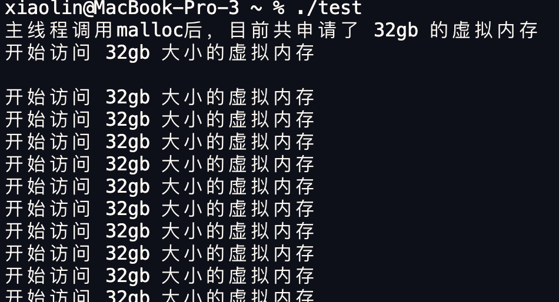

可以看到，在有 Swap 分区的情况下，即使笔记本物理内存是 8 GB，申请**并使用** 32 GB 内存是没问题，程序正常运行了，并没有发生 OOM。

从下图可以看到，进程的内存显示 32 GB（这个不要理解为占用的物理内存，理解为已被访问的虚拟内存大小，也就是在物理内存呆过的内存大小），系统已使用的 Swap 分区达到 2.3 GB。

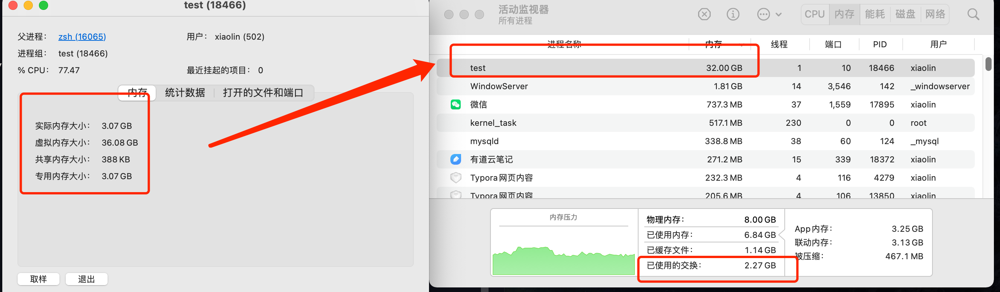

此时我的笔记本电脑的磁盘开始出现“沙沙”的声音，通过查看磁盘的 I/O 情况，可以看到磁盘 I/O 达到了一个峰值，非常高：


> 有了 Swap 分区，是不是意味着进程可以使用的内存是无上限的？

当然不是，我把上面的代码改成了申请 64GB 内存后，当进程申请完 64GB 虚拟内存后，**使用到 56 GB** （这个不要理解为占用的物理内存，理解为已被访问的虚拟内存大小，也就是在物理内存呆过的内存大小）的时候，进程就被系统 kill 掉了，如下图：


当系统多次尝试回收内存，还是无法满足所需使用的内存大小，进程就会被系统 kill 掉了，意味着发生了 OOM （*PS：我没有在 macos 系统找到像 linux 系统里的 /var/log/message 系统日志文件，所以无法通过查看日志确认是否发生了 OOM*）。


### 总结

至此， 验证完成了。简单总结下：

- 在 32 位操作系统，因为进程理论上最大能申请 3 GB 大小的虚拟内存，所以直接申请 8G 内存，会申请失败。
- 在 64位 位操作系统，因为进程理论上最大能申请 128 TB 大小的虚拟内存，即使物理内存只有 4GB，申请 8G 内存也是没问题，因为申请的内存是虚拟内存。如果这块虚拟内存被访问了，要看系统有没有 Swap 分区：
  - 如果没有 Swap 分区，因为物理空间不够，进程会被操作系统杀掉，原因是 OOM（内存溢出）；
  - 如果有 Swap 分区，即使物理内存只有 4GB，程序也能正常使用 8GB 的内存，进程可以正常运行；


## 如何避免预读失效和缓存污染的问题？


咋一看，以为是在问操作系统的问题，其实这两个题目都是在问**如何改进 LRU 算法**。

因为传统的 LRU 算法存在这两个问题：

- **「预读失效」导致缓存命中率下降（对应第一个题目）**
- **「缓存污染」导致缓存命中率下降（对应第二个题目）**

Redis 的缓存淘汰算法则是通过**实现 LFU 算法**来避免「缓存污染」而导致缓存命中率下降的问题（Redis 没有预读机制）。

MySQL 和 Linux 操作系统是通过**改进 LRU 算法**来避免「预读失效和缓存污染」而导致缓存命中率下降的问题。

这次，就重点讲讲 **MySQL 和 Linux 操作系统是如何改进 LRU 算法的？**


### Linux 和 MySQL 的缓存

#### Linux 操作系统的缓存

在应用程序读取文件的数据的时候，Linux 操作系统是会对读取的文件数据进行缓存的，会缓存在文件系统中的 **Page Cache**（如下图中的页缓存）。

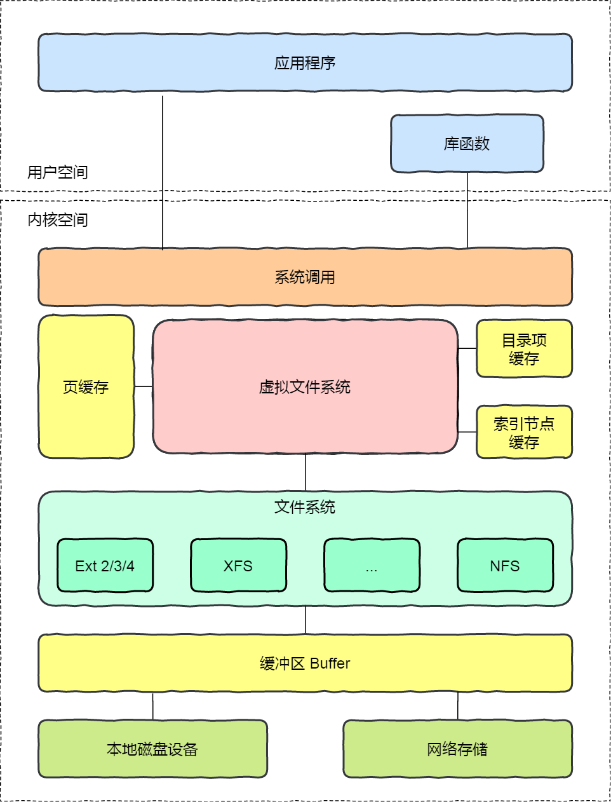

Page Cache 属于内存空间里的数据，由于内存访问比磁盘访问快很多，在下一次访问相同的数据就不需要通过磁盘 I/O 了，命中缓存就直接返回数据即可。

因此，Page Cache 起到了加速访问数据的作用。


#### MySQL 的缓存

MySQL 的数据是存储在磁盘里的，为了提升数据库的读写性能，Innodb 存储引擎设计了一个**缓冲池**（Buffer Pool），Buffer Pool 属于内存空间里的数据。

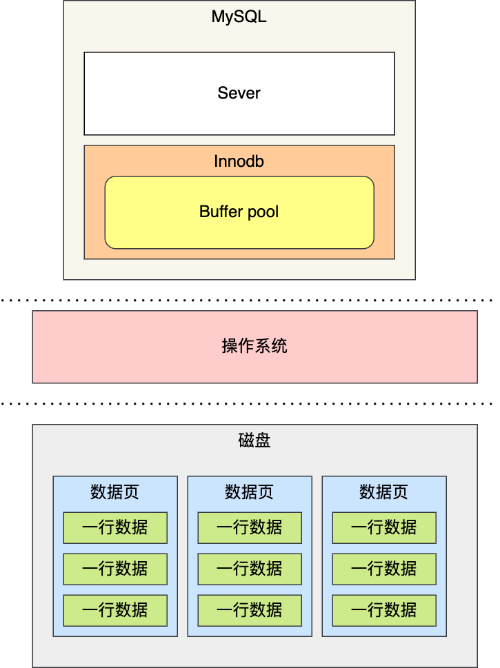

有了缓冲池后：

- 当读取数据时，如果数据存在于 Buffer Pool 中，客户端就会直接读取 Buffer Pool 中的数据，否则再去磁盘中读取。
- 当修改数据时，首先是修改 Buffer Pool 中数据所在的页，然后将其页设置为脏页，最后由后台线程将脏页写入到磁盘。


### 传统 LRU 是如何管理内存数据的？

Linux 的 Page Cache 和 MySQL 的 Buffer Pool 的大小是有限的，并不能无限的缓存数据，对于一些频繁访问的数据我们希望可以一直留在内存中，而一些很少访问的数据希望可以在某些时机可以淘汰掉，从而保证内存不会因为满了而导致无法再缓存新的数据，同时还能保证常用数据留在内存中。

要实现这个，最容易想到的就是 **LRU（Least recently used）算法**。

LRU 算法一般是用「链表」作为数据结构来实现的，链表头部的数据是最近使用的，而链表末尾的数据是最久没被使用的。那么，当空间不够了，就淘汰最久没被使用的节点，也就是链表末尾的数据，从而腾出内存空间。

因为 Linux 的 Page Cache 和 MySQL 的 Buffer Pool 缓存的**基本数据单位都是页（Page）单位**，所以**后续以「页」名称代替「数据」**。

传统的 LRU 算法的实现思路是这样的：

- 当访问的页在内存里，就直接把该页对应的 LRU 链表节点移动到链表的头部。
- 当访问的页不在内存里，除了要把该页放入到 LRU 链表的头部，还要淘汰 LRU 链表末尾的页。

比如下图，假设 LRU 链表长度为 5，LRU 链表从左到右有编号为 1，2，3，4，5 的页。


如果访问了 3 号页，因为 3 号页已经在内存了，所以把 3 号页移动到链表头部即可，表示最近被访问了。

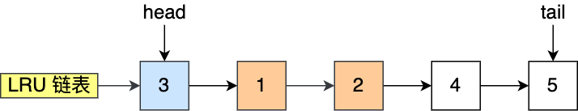

而如果接下来，访问了 8 号页，因为 8 号页不在内存里，且 LRU 链表长度为 5，所以必须要淘汰数据，以腾出内存空间来缓存 8 号页，于是就会淘汰末尾的 5 号页，然后再将 8 号页加入到头部。

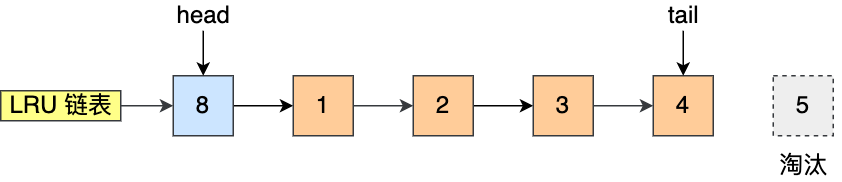

传统的 LRU 算法并没有被 Linux 和 MySQL 使用，因为传统的 LRU 算法无法避免下面这两个问题：

- 预读失效导致缓存命中率下降；
- 缓存污染导致缓存命中率下降；


### 预读失效，怎么办？

#### 什么是预读机制？

Linux 操作系统为基于 Page Cache 的读缓存机制提供**预读机制**，一个例子是：

- 应用程序只想读取磁盘上文件 A 的 offset 为 0-3KB 范围内的数据，由于磁盘的基本读写单位为 block（4KB），于是操作系统至少会读 0-4KB 的内容，这恰好可以在一个 page 中装下。
- 但是操作系统出于空间局部性原理（靠近当前被访问数据的数据，在未来很大概率会被访问到），会选择将磁盘块 offset [4KB,8KB)、[8KB,12KB) 以及 [12KB,16KB) 都加载到内存，于是额外在内存中申请了 3 个 page；

下图代表了操作系统的预读机制：

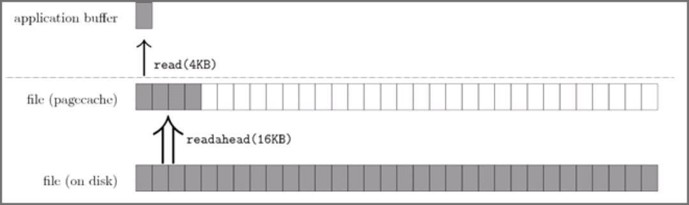

上图中，应用程序利用 read 系统调动读取 4KB 数据，实际上内核使用预读机制（ReadaHead） 机制完成了 16KB 数据的读取，也就是通过一次磁盘顺序读将多个 Page 数据装入 Page Cache。

这样下次读取 4KB 数据后面的数据的时候，就不用从磁盘读取了，直接在 Page Cache 即可命中数据。因此，预读机制带来的好处就是**减少了 磁盘 I/O 次数，提高系统磁盘 I/O 吞吐量**。

MySQL Innodb 存储引擎的 Buffer Pool 也有类似的预读机制，MySQL 从磁盘加载页时，会提前把它相邻的页一并加载进来，目的是为了减少磁盘 IO。


#### 预读失效会带来什么问题？

如果**这些被提前加载进来的页，并没有被访问**，相当于这个预读工作是白做了，这个就是**预读失效**。

如果使用传统的 LRU 算法，就会把「预读页」放到 LRU 链表头部，而当内存空间不够的时候，还需要把末尾的页淘汰掉。

如果这些「预读页」如果一直不会被访问到，就会出现一个很奇怪的问题，**不会被访问的预读页却占用了 LRU 链表前排的位置，而末尾淘汰的页，可能是热点数据，这样就大大降低了缓存命中率** 。


#### 如何避免预读失效造成的影响？

我们不能因为害怕预读失效，而将预读机制去掉，大部分情况下，空间局部性原理还是成立的。

要避免预读失效带来影响，最好就是**让预读页停留在内存里的时间要尽可能的短，让真正被访问的页才移动到 LRU 链表的头部，从而保证真正被读取的热数据留在内存里的时间尽可能长**。

那到底怎么才能避免呢？

Linux 操作系统和 MySQL Innodb 通过改进传统 LRU 链表来避免预读失效带来的影响，具体的改进分别如下：

- Linux 操作系统实现两个了 LRU 链表：**活跃 LRU 链表（active_list）和非活跃 LRU 链表（inactive_list）**；
- MySQL 的 Innodb 存储引擎是在一个 LRU 链表上划分来 2 个区域：**young 区域 和 old 区域**。

这两个改进方式，设计思想都是类似的，**都是将数据分为了冷数据和热数据，然后分别进行 LRU 算法**。不再像传统的 LRU 算法那样，所有数据都只用一个 LRU 算法管理。

接下来，具体聊聊 Linux 和 MySQL 是如何避免预读失效带来的影响？

> Linux 是如何避免预读失效带来的影响？

Linux 操作系统实现两个了 LRU 链表：**活跃 LRU 链表（active_list）和非活跃 LRU 链表（inactive_list）**。

- **active list** 活跃内存页链表，这里存放的是最近被访问过（活跃）的内存页；
- **inactive list** 不活跃内存页链表，这里存放的是很少被访问（非活跃）的内存页；

有了这两个 LRU 链表后，**预读页就只需要加入到 inactive list 区域的头部，当页被真正访问的时候，才将页插入 active list 的头部**。如果预读的页一直没有被访问，就会从 inactive list 移除，这样就不会影响 active list 中的热点数据。

接下来，给大家举个例子。

假设 active list 和 inactive list 的长度为 5，目前内存中已经有如下 10 个页：

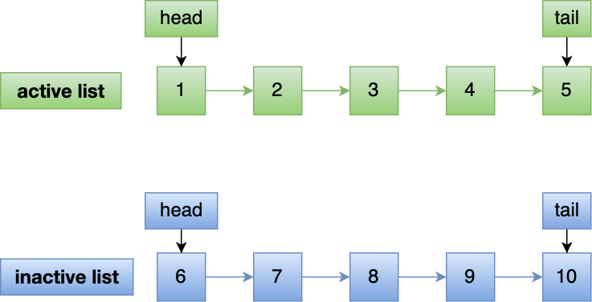

现在有个编号为 20 的页被预读了，这个页只会被插入到 inactive list 的头部，而 inactive list 末尾的页（10号）会被淘汰掉。


**即使编号为 20 的预读页一直不会被访问，它也没有占用到 active list 的位置**，而且还会比 active list 中的页更早被淘汰出去。

如果 20 号页被预读后，立刻被访问了，那么就会将它插入到 active list 的头部， active list 末尾的页（5号），会被**降级**到 inactive list ，作为 inactive list 的头部，这个过程并不会有数据被淘汰。

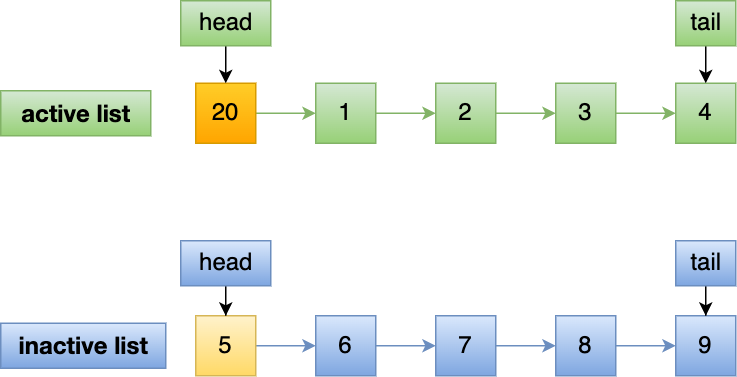

> MySQL 是如何避免预读失效带来的影响？

MySQL 的 Innodb 存储引擎是在一个 LRU 链表上划分来 2 个区域，**young 区域 和 old 区域**。

young 区域在 LRU 链表的前半部分，old 区域则是在后半部分，这两个区域都有各自的头和尾节点，如下图：


young 区域与 old 区域在 LRU 链表中的占比关系并不是一比一的关系，而是 63:37（默认比例）的关系。

**划分这两个区域后，预读的页就只需要加入到 old 区域的头部，当页被真正访问的时候，才将页插入 young 区域的头部**。如果预读的页一直没有被访问，就会从 old 区域移除，这样就不会影响 young 区域中的热点数据。

接下来，给大家举个例子。

假设有一个长度为 10 的 LRU 链表，其中 young 区域占比 70 %，old 区域占比 30 %。


现在有个编号为 20 的页被预读了，这个页只会被插入到 old 区域头部，而 old 区域末尾的页（10号）会被淘汰掉。

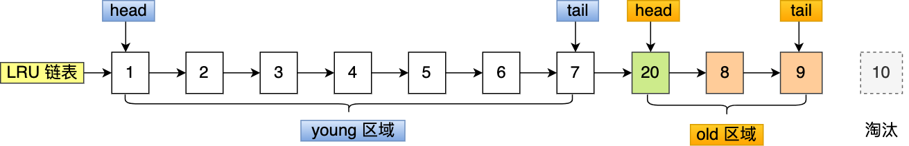

如果 20 号页一直不会被访问，它也没有占用到 young 区域的位置，而且还会比 young 区域的数据更早被淘汰出去。

如果 20 号页被预读后，立刻被访问了，那么就会将它插入到 young 区域的头部，young 区域末尾的页（7号），会被挤到 old 区域，作为 old 区域的头部，这个过程并不会有页被淘汰。


### 缓存污染，怎么办？

#### 什么是缓存污染？

虽然 Linux （实现两个 LRU 链表）和 MySQL （划分两个区域）通过改进传统的 LRU 数据结构，避免了预读失效带来的影响。

但是如果还是使用「只要数据被访问一次，就将数据加入到活跃 LRU 链表头部（或者 young 区域）」这种方式的话，那么**还存在缓存污染的问题**。

当我们在批量读取数据的时候，由于数据被访问了一次，这些大量数据（例如突发的热帖）都会被加入到「活跃 LRU 链表」里，然后之前缓存在活跃 LRU 链表（或者 young 区域）里的热点数据全部都被淘汰了，**如果这些大量的数据在很长一段时间都不会被访问的话，那么整个活跃 LRU 链表（或者 young 区域）就被污染了**。


#### 缓存污染会带来什么问题？

缓存污染带来的影响就是很致命的，等这些热数据又被再次访问的时候，由于缓存未命中，就会产生大量的磁盘 I/O，系统性能就会急剧下降。

我以 MySQL 举例子，Linux 发生缓存污染的现象也是类似。

当某一个 SQL 语句**扫描了大量的数据**时，在 Buffer Pool 空间比较有限的情况下，可能会将 **Buffer Pool 里的所有页都替换出去，导致大量热数据被淘汰了**，等这些热数据又被再次访问的时候，由于缓存未命中，就会产生大量的磁盘 I/O，MySQL 性能就会急剧下降。

注意， 缓存污染并不只是查询语句查询出了大量的数据才出现的问题，即使查询出来的结果集很小，也会造成缓存污染。

比如，在一个数据量非常大的表，执行了这条语句：

```sql
select * from t_user where name like "%xiaolin%";
```

可能这个查询出来的结果就几条记录，但是由于这条语句会发生索引失效，所以这个查询过程是全表扫描的，接着会发生如下的过程：

- 从磁盘读到的页加入到 LRU 链表的 old 区域头部；
- 当从页里读取行记录时，也就是**页被访问的时候，就要将该页放到 young 区域头部**；
- 接下来拿行记录的 name 字段和字符串 xiaolin 进行模糊匹配，如果符合条件，就加入到结果集里；
- 如此往复，直到扫描完表中的所有记录。

经过这一番折腾，由于这条 SQL 语句访问的页非常多，每访问一个页，都会将其加入 young 区域头部，那么**原本 young 区域的热点数据都会被替换掉，导致缓存命中率下降**。那些在批量扫描时，而被加入到 young 区域的页，如果在很长一段时间都不会再被访问的话，那么就污染了 young 区域。

举个例子，假设需要批量扫描：21，22，23，24，25 这五个页，这些页都会被逐一访问（读取页里的记录）。


在批量访问这些页的时候，会被逐一插入到 young 区域头部。

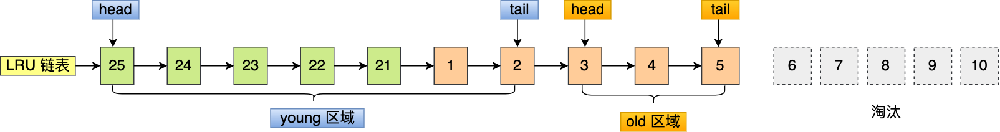

可以看到，原本在 young 区域的 6 和 7 号页都被淘汰了，而批量扫描的页基本占满了 young 区域，如果这些页在很长一段时间都不会被访问，那么就对 young 区域造成了污染。

如果 6 和 7 号页是热点数据，那么在被淘汰后，后续有 SQL 再次读取 6 和 7 号页时，由于缓存未命中，就要从磁盘中读取了，降低了 MySQL 的性能，这就是缓存污染带来的影响。


#### 怎么避免缓存污染造成的影响？

前面的 LRU 算法只要数据被访问一次，就将数据加入活跃 LRU 链表（或者 young 区域），**这种 LRU 算法进入活跃 LRU 链表的门槛太低了**！正式因为门槛太低，才导致在发生缓存污染的时候，很容就将原本在活跃 LRU 链表里的热点数据淘汰了。

所以，**只要我们提高进入到活跃 LRU 链表（或者 young 区域）的门槛，就能有效地保证活跃 LRU 链表（或者 young 区域）里的热点数据不会被轻易替换掉**。

Linux 操作系统和 MySQL Innodb 存储引擎分别是这样提高门槛的：

- **Linux 操作系统**：在内存页被访问**第二次**的时候，才将页从 inactive list 升级到 active list 里。
- MySQL Innodb：在内存页被访问**第二次**的时候，并不会马上将该页从 old 区域升级到 young 区域，因为还要进行停留在 old 区域的时间判断：
  - 如果第二次的访问时间与第一次访问的时间**在 1 秒内**（默认值），那么该页就**不会**被从 old 区域升级到 young 区域；
  - 如果第二次的访问时间与第一次访问的时间**超过 1 秒**，那么该页就**会**从 old 区域升级到 young 区域；

提高了进入活跃 LRU 链表（或者 young 区域）的门槛后，就很好了避免缓存污染带来的影响。

在批量读取数据时候，**如果这些大量数据只会被访问一次，那么它们就不会进入到活跃 LRU 链表（或者 young 区域）**，也就不会把热点数据淘汰，只会待在非活跃 LRU 链表（或者 old 区域）中，后续很快也会被淘汰。


### 总结

传统的 LRU 算法法无法避免下面这两个问题：

- 预读失效导致缓存命中率下降；
- 缓存污染导致缓存命中率下降；

为了避免「预读失效」造成的影响，Linux 和 MySQL 对传统的 LRU 链表做了改进：

- Linux 操作系统实现两个了 LRU 链表：**活跃 LRU 链表（active list）和非活跃 LRU 链表（inactive list）**。
- MySQL Innodb 存储引擎是在一个 LRU 链表上划分来 2 个区域：**young 区域 和 old 区域**。

但是如果还是使用「只要数据被访问一次，就将数据加入到活跃 LRU 链表头部（或者 young 区域）」这种方式的话，那么**还存在缓存污染的问题**。

为了避免「缓存污染」造成的影响，Linux 操作系统和 MySQL Innodb 存储引擎分别提高了升级为热点数据的门槛：

- Linux 操作系统：在内存页被访问**第二次**的时候，才将页从 inactive list 升级到 active list 里。

- MySQL Innodb：在内存页被访问

  第二次

  的时候，并不会马上将该页从 old 区域升级到 young 区域，因为还要进行停留在 old 区域的时间判断

  - 如果第二次的访问时间与第一次访问的时间**在 1 秒内**（默认值），那么该页就**不会**被从 old 区域升级到 young 区域；
  - 如果第二次的访问时间与第一次访问的时间**超过 1 秒**，那么该页就**会**从 old 区域升级到 young 区域；

通过提高了进入 active list （或者 young 区域）的门槛后，就很好了避免缓存污染带来的影响。

> 为什么第二次访问和第一次访问之间的间隔短却不会从 old 上升到 young？访问的频率高不应该上升到 young 吗？这里有点迷惑

因为数据是以页为单位的，大量数据扫描的时候有相当一部分数据并不是热点数据，仅仅是在被扫描的过程中被访问了，在相当短的时间被访问过，如果加入到youg区域会导致大量的有效缓存数据被污染，所以加了一个时间间隔的限制，来保证数据是被正常访问的


