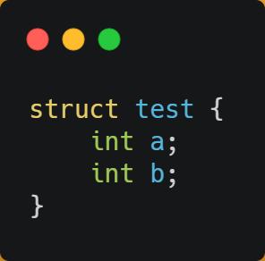
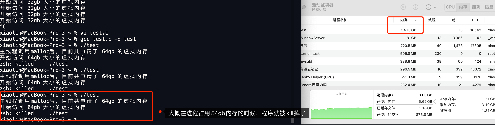

# 硬件结构


## CPU 是如何执行程序的？


### 图灵机的工作方式

要想知道程序执行的原理，我们可以先从「图灵机」说起，图灵的基本思想是用机器来模拟人们用纸笔进行数学运算的过程，而且还定义了计算机由哪些部分组成，程序又是如何执行的。

图灵机长什么样子呢？你从下图可以看到图灵机的实际样子：


图灵机的基本组成如下：

- 有一条「纸带」，纸带由一个个连续的格子组成，每个格子可以写入字符，纸带就好比内存，而纸带上的格子的字符就好比内存中的数据或程序；
- 有一个「读写头」，读写头可以读取纸带上任意格子的字符，也可以把字符写入到纸带的格子；
- 读写头上有一些部件，比如存储单元、控制单元以及运算单元： 1、存储单元用于存放数据； 2、控制单元用于识别字符是数据还是指令，以及控制程序的流程等； 3、运算单元用于执行运算指令；

知道了图灵机的组成后，我们以简单数学运算的 `1 + 2` 作为例子，来看看它是怎么执行这行代码的。

- 首先，用读写头把 「1、2、+」这 3 个字符分别写入到纸带上的 3 个格子，然后读写头先停在 1 字符对应的格子上；


- 接着，读写头读入 1 到存储设备中，这个存储设备称为图灵机的状态；


- 然后读写头向右移动一个格，用同样的方式把 2 读入到图灵机的状态，于是现在图灵机的状态中存储着两个连续的数字， 1 和 2；


- 读写头再往右移动一个格，就会碰到 + 号，读写头读到 + 号后，将 + 号传输给「控制单元」，控制单元发现是一个 + 号而不是数字，所以没有存入到状态中，因为 `+` 号是运算符指令，作用是加和目前的状态，于是通知「运算单元」工作。运算单元收到要加和状态中的值的通知后，就会把状态中的 1 和 2 读入并计算，再将计算的结果 3 存放到状态中；


- 最后，运算单元将结果返回给控制单元，控制单元将结果传输给读写头，读写头向右移动，把结果 3 写入到纸带的格子中；


通过上面的图灵机计算 `1 + 2` 的过程，可以发现图灵机主要功能就是读取纸带格子中的内容，然后交给控制单元识别字符是数字还是运算符指令，如果是数字则存入到图灵机状态中，如果是运算符，则通知运算符单元读取状态中的数值进行计算，计算结果最终返回给读写头，读写头把结果写入到纸带的格子中。

事实上，图灵机这个看起来很简单的工作方式，和我们今天的计算机是基本一样的。接下来，我们一同再看看当今计算机的组成以及工作方式。


### 冯诺依曼模型

在 1945 年冯诺依曼和其他计算机科学家们提出了计算机具体实现的报告，其遵循了图灵机的设计，而且还提出用电子元件构造计算机，并约定了用二进制进行计算和存储。

最重要的是定义计算机基本结构为 5 个部分，分别是**运算器、控制器、存储器、输入设备、输出设备**，这 5 个部分也被称为**冯诺依曼模型**。


运算器、控制器是在中央处理器里的，存储器就我们常见的内存，输入输出设备则是计算机外接的设备，比如键盘就是输入设备，显示器就是输出设备。

存储单元和输入输出设备要与中央处理器打交道的话，离不开总线。所以，它们之间的关系如下图：


接下来，分别介绍内存、中央处理器、总线、输入输出设备。


#### 内存

我们的程序和数据都是存储在内存，存储的区域是线性的。

在计算机数据存储中，存储数据的基本单位是**字节（byte）**，1 字节等于 8 位（8 bit）。每一个字节都对应一个内存地址。

内存的地址是从 0 开始编号的，然后自增排列，最后一个地址为内存总字节数 - 1，这种结构好似我们程序里的数组，所以内存的读写任何一个数据的速度都是一样的。


#### 中央处理器

中央处理器也就是我们常说的 CPU，32 位和 64 位 CPU 最主要区别在于**一次能计算多少字节数据**：

- 32 位 CPU 一次可以计算 4 个字节；
- 64 位 CPU 一次可以计算 8 个字节；

这里的 32 位和 64 位，通常称为 CPU 的位宽，代表的是 CPU 一次可以计算（运算）的数据量。

之所以 CPU 要这样设计，是为了能计算更大的数值，如果是 8 位的 CPU，那么一次只能计算 1 个字节 `0~255` 范围内的数值，这样就无法一次完成计算 `10000 * 500` ，于是为了能一次计算大数的运算，CPU 需要支持多个 byte 一起计算，所以 CPU 位宽越大，可以计算的数值就越大，比如说 32 位 CPU 能计算的最大整数是 `4294967295`。

CPU 内部还有一些组件，常见的有**寄存器、控制单元和逻辑运算单元**等。其中，控制单元负责控制 CPU 工作，逻辑运算单元负责计算，而寄存器可以分为多种类，每种寄存器的功能又不尽相同。

**CPU 中的寄存器主要作用是存储<u>计算时</u>的数据**，你可能好奇为什么有了内存还需要寄存器？原因很简单，因为内存离 CPU 太远了，而寄存器就在 CPU 里，还紧挨着控制单元和逻辑运算单元，自然计算时速度会很快。

常见的寄存器种类：

- *通用寄存器*，用来存放需要进行运算的数据，比如需要进行加和运算的两个数据。
- *程序计数器*，用来存储 CPU 要**执行下一条指令「所在的内存地址」**，注意不是存储了下一条要执行的指令，此时指令还在内存中，程序计数器只是存储了下一条指令「的地址」。
- *指令寄存器*，用来存放当前正在执行的指令，也就是指令本身，指令被执行完成之前，指令都存储在这里。


#### 总线

总线是用于 CPU 和内存以及其他设备之间的通信，总线可分为 3 种：

- *地址总线*，用于指定 CPU 将要操作的内存地址；
- *数据总线*，用于读写内存的数据；
- *控制总线*，用于发送和接收信号，比如中断、设备复位等信号，CPU 收到信号后自然进行响应，这时也需要控制总线；

当 CPU 要读写内存数据的时候，一般需要通过下面这三个总线：

- 首先要通过「地址总线」来指定内存的地址；
- 然后通过「控制总线」控制是读或写命令；
- 最后通过「数据总线」来传输数据；


#### 输入、输出设备

输入设备向计算机输入数据，计算机经过计算后，把数据输出给输出设备。期间，如果输入设备是键盘，按下按键时是需要和 CPU 进行交互的，这时就需要用到控制总线了。


### 线路位宽与 CPU 位宽

数据是如何通过线路传输的呢？其实是通过操作电压，低电压表示 0，高压电压则表示 1。

如果构造了高低高这样的信号，其实就是 101 二进制数据，十进制则表示 5，如果只有一条线路，就意味着每次只能传递 1 bit 的数据，即 0 或 1，那么传输 101 这个数据，就需要 3 次才能传输完成，这样的效率非常低。

这样一位一位传输的方式，称为串行，下一个 bit 必须等待上一个 bit 传输完成才能进行传输。当然，想一次多传一些数据，增加线路即可，这时数据就可以并行传输。

为了避免低效率的串行传输的方式，线路的位宽最好一次就能访问到所有的内存地址。

CPU 想要操作「内存地址」就需要「地址总线」：

- 如果地址总线只有 1 条，那每次只能表示 「0 或 1」这两种地址，所以 CPU 能操作的内存地址最大数量为 2（2^1）个（注意，不要理解成同时能操作 2 个内存地址）；
- 如果地址总线有 2 条，那么能表示 00、01、10、11 这四种地址，所以 CPU 能操作的内存地址最大数量为 4（2^2）个。

那么，想要 CPU 操作 4G 大的内存，那么就需要 32 条地址总线，因为 `2 ^ 32 = 4G`。

知道了线路位宽的意义后，我们再来看看 CPU 位宽。

CPU 的位宽最好不要小于线路位宽，比如 32 位 CPU 控制 40 位宽的地址总线和数据总线的话，工作起来就会非常复杂且麻烦，所以 32 位的 CPU 最好和 32 位宽的线路搭配，因为 32 位 CPU 一次最多只能操作 32 位宽的地址总线和数据总线。

如果用 32 位 CPU 去加和两个 64 位大小的数字，就需要把这 2 个 64 位的数字分成 2 个低位 32 位数字和 2 个高位 32 位数字来计算，先加个两个低位的 32 位数字，算出进位，然后加和两个高位的 32 位数字，最后再加上进位，就能算出结果了，可以发现 32 位 CPU 并不能一次性计算出加和两个 64 位数字的结果。

对于 64 位 CPU 就可以一次性算出加和两个 64 位数字的结果，因为 64 位 CPU 可以一次读入 64 位的数字，并且 64 位 CPU 内部的逻辑运算单元也支持 64 位数字的计算。

但是并不代表 64 位 CPU 性能比 32 位 CPU 高很多，很少应用需要算超过 32 位的数字，所以**如果计算的数额不超过 32 位数字的情况下，32 位和 64 位 CPU 之间没什么区别的，只有当计算超过 32 位数字的情况下，64 位的优势才能体现出来**。

另外，32 位 CPU 最大只能操作 4GB 内存，就算你装了 8 GB 内存条，也没用。而 64 位 CPU 寻址范围则很大，理论最大的寻址空间为 `2^64`


### 程序执行的基本过程

在前面，我们知道了程序在图灵机的执行过程，接下来我们来看看程序在冯诺依曼模型上是怎么执行的。

程序实际上是一条一条指令，所以程序的运行过程就是把每一条指令一步一步的执行起来，负责执行指令的就是 CPU 了。


那 CPU 执行程序的过程如下：

- 第一步，CPU 读取「程序计数器」的值，这个值是指令的内存地址，然后 CPU 的「控制单元」操作「地址总线」指定需要访问的内存地址，接着通知内存设备准备数据，数据准备好后通过「数据总线」将指令数据传给 CPU，CPU 收到内存传来的数据后，将这个指令数据存入到「指令寄存器」。
- 第二步，「程序计数器」的值自增，表示指向下一条指令。这个自增的大小，由 CPU 的位宽决定，比如 32 位的 CPU，指令是 4 个字节，需要 4 个内存地址存放，因此「程序计数器」的值会自增 4；
- 第三步，CPU 分析「指令寄存器」中的指令，确定指令的类型和参数，如果是计算类型的指令，就把指令交给「逻辑运算单元」运算；如果是存储类型的指令，则交由「控制单元」执行；

简单总结一下就是，一个程序执行的时候，CPU 会根据程序计数器里的内存地址，从内存里面把需要执行的指令读取到指令寄存器里面执行，然后根据指令长度自增，开始顺序读取下一条指令。

CPU 从程序计数器读取指令、到执行、再到下一条指令，这个过程会不断循环，直到程序执行结束，这个不断循环的过程被称为 **CPU 的指令周期**。


### a = 1 + 2 执行具体过程

知道了基本的程序执行过程后，接下来用 `a = 1 + 2` 的作为例子，进一步分析该程序在冯诺伊曼模型的执行过程。

CPU 是不认识 `a = 1 + 2` 这个字符串，这些字符串只是方便我们程序员认识，要想这段程序能跑起来，还需要把整个程序翻译成**汇编语言**的程序，这个过程称为编译成汇编代码。

针对汇编代码，我们还需要用汇编器翻译成机器码，这些机器码由 0 和 1 组成的机器语言，这一条条机器码，就是一条条的**计算机指令**，这个才是 CPU 能够真正认识的东西。

下面来看看 `a = 1 + 2` 在 32 位 CPU 的执行过程。

程序编译过程中，编译器通过分析代码，发现 1 和 2 是数据，于是程序运行时，内存会有个专门的区域来存放这些数据，这个区域就是「数据段」。如下图，数据 1 和 2 的区域位置：

- 数据 1 被存放到 0x200 位置；
- 数据 2 被存放到 0x204 位置；

注意，数据和指令是分开区域存放的，存放指令区域的地方称为「正文段」。


编译器会把 `a = 1 + 2` 翻译成 4 条指令（32位为4个字节，因此一条指令要占4个内存空间），存放到正文段中。如图，这 4 条指令被存放到了 0x100 ~ 0x10c 的区域中：

- 0x100 的内容是 `load` 指令将 0x200 地址中的数据 1 装入到寄存器 `R0`；
- 0x104 的内容是 `load` 指令将 0x204 地址中的数据 2 装入到寄存器 `R1`；
- 0x108 的内容是 `add` 指令将寄存器 `R0` 和 `R1` 的数据相加，并把结果存放到寄存器 `R2`；
- 0x10c 的内容是 `store` 指令将寄存器 `R2` 中的数据存回数据段中的 0x208 地址中，这个地址也就是变量 `a` 内存中的地址；

编译完成后，具体执行程序的时候，程序计数器会被设置为 0x100 地址，然后依次执行这 4 条指令。

上面的例子中，由于是在 32 位 CPU 执行的，因此一条指令是占 32 位大小，所以你会发现每条指令间隔 4 个字节。

而数据的大小是根据你在程序中指定的变量类型，比如 `int` 类型的数据则占 4 个字节，`char` 类型的数据则占 1 个字节。


#### 指令

上面的例子中，图中指令的内容我写的是简易的汇编代码，目的是为了方便理解指令的具体内容，事实上指令的内容是一串二进制数字的机器码，每条指令都有对应的机器码，CPU 通过解析机器码来知道指令的内容。

不同的 CPU 有不同的指令集，也就是对应着不同的汇编语言和不同的机器码，接下来选用最简单的 MIPS 指集，来看看机器码是如何生成的，这样也能明白二进制的机器码的具体含义。

MIPS 的指令是一个 32 位的整数，高 6 位代表着操作码，表示这条指令是一条什么样的指令，剩下的 26 位不同指令类型所表示的内容也就不相同，主要有三种类型R、I 和 J。


一起具体看看这三种类型的含义：

- *R 指令*，用在算术和逻辑操作，里面有读取和写入数据的寄存器地址。如果是逻辑位移操作，后面还有位移操作的「位移量」，而最后的「功能码」则是再前面的操作码不够的时候，扩展操作码来表示对应的具体指令的；
- *I 指令*，用在数据传输、条件分支等。这个类型的指令，就没有了位移量和功能码，也没有了第三个寄存器，而是把这三部分直接合并成了一个地址值或一个常数；
- *J 指令*，用在跳转，高 6 位之外的 26 位都是一个跳转后的地址；

接下来，我们把前面例子的这条指令：「`add` 指令将寄存器 `R0` 和 `R1` 的数据相加，并把结果放入到 `R2`」，翻译成机器码。


加和运算 add 指令是属于 R 指令类型：

- add 对应的 MIPS 指令里操作码是 `000000`，以及最末尾的功能码是 `100000`，这些数值都是固定的，查一下 MIPS 指令集的手册就能知道的；
- rs 代表第一个寄存器 R0 的编号，即 `00000`；
- rt 代表第二个寄存器 R1 的编号，即 `00001`；
- rd 代表目标的临时寄存器 R2 的编号，即 `00010`；
- 因为不是位移操作，所以位移量是 `00000`

把上面这些数字拼在一起就是一条 32 位的 MIPS 加法指令了，那么用 16 进制表示的机器码则是 `0x00011020`。

编译器在编译程序的时候，会构造指令，这个过程叫做指令的编码。CPU 执行程序的时候，就会解析指令，这个过程叫作指令的解码。

现代大多数 CPU 都使用来流水线的方式来执行指令，所谓的流水线就是把一个任务拆分成多个小任务，于是一条指令通常分为 4 个阶段，称为 4 级流水线，如下图：


四个阶段的具体含义：

1. CPU 通过程序计数器读取对应内存地址的指令，这个部分称为 **Fetch（取得指令）**；
2. CPU 对指令进行解码，这个部分称为 **Decode（指令译码）**；
3. CPU 执行指令，这个部分称为 **Execution（执行指令）**；
4. CPU 将计算结果存回寄存器或者将寄存器的值存入内存，这个部分称为 **Store（数据回写）**；

上面这 4 个阶段，我们称为**指令周期（Instrution Cycle）**，CPU 的工作就是一个周期接着一个周期，周而复始。

事实上，不同的阶段其实是由计算机中的不同组件完成的：


- 取指令的阶段，我们的指令是存放在**存储器**里的，实际上，通过程序计数器和指令寄存器取出指令的过程，是由**控制器**操作的；
- 指令的译码过程，也是由**控制器**进行的；
- 指令执行的过程，无论是进行算术操作、逻辑操作，还是进行数据传输、条件分支操作，都是由**算术逻辑单元**操作的，也就是由**运算器**处理的。但是如果是一个简单的无条件地址跳转，则是直接在**控制器**里面完成的，不需要用到运算器。


#### 指令的类型

指令从功能角度划分，可以分为 5 大类：

- *数据传输类型的指令*，比如 `store/load` 是寄存器与内存间数据传输的指令，`mov` 是将一个内存地址的数据移动到另一个内存地址的指令；
- *运算类型的指令*，比如加减乘除、位运算、比较大小等等，它们最多只能处理两个寄存器中的数据；
- *跳转类型的指令*，通过修改程序计数器的值来达到跳转执行指令的过程，比如编程中常见的 `if-else`、`switch-case`、函数调用等。
- *信号类型的指令*，比如发生中断的指令 `trap`；
- *闲置类型的指令*，比如指令 `nop`，执行后 CPU 会空转一个周期；


#### 指令的执行速度

CPU 的硬件参数都会有 `GHz` 这个参数，比如一个 1 GHz 的 CPU，指的是时钟频率是 1 G，代表着 1 秒会产生 1G 次数的脉冲信号，每一次脉冲信号高低电平的转换就是一个周期，称为时钟周期。

对于 CPU 来说，在一个时钟周期内，CPU 仅能完成一个最基本的动作，时钟频率越高，时钟周期就越短，工作速度也就越快。

一个时钟周期一定能执行完一条指令吗？答案是不一定的，大多数指令不能在一个时钟周期完成，通常需要若干个时钟周期。不同的指令需要的时钟周期是不同的，加法和乘法都对应着一条 CPU 指令，但是乘法需要的时钟周期就要比加法多。

> 如何让程序跑的更快？

程序执行的时候，耗费的 CPU 时间少就说明程序是快的，对于程序的 CPU 执行时间，我们可以拆解成 **CPU 时钟周期数（CPU Cycles）和时钟周期时间（Clock Cycle Time）的乘积**。


时钟周期时间就是我们前面提及的 CPU 主频，主频越高说明 CPU 的工作速度就越快，比如我手头上的电脑的 CPU 是 2.4 GHz 四核 Intel Core i5，这里的 2.4 GHz 就是电脑的主频，时钟周期时间就是 1/2.4G。

要想 CPU 跑的更快，自然缩短时钟周期时间，也就是提升 CPU 主频，但是今非彼日，摩尔定律早已失效，当今的 CPU 主频已经很难再做到翻倍的效果了。

另外，换一个更好的 CPU，这个也是我们软件工程师控制不了的事情，我们应该把目光放到另外一个乘法因子 —— CPU 时钟周期数，如果能减少程序所需的 CPU 时钟周期数量，一样也是能提升程序的性能的。

对于 CPU 时钟周期数我们可以进一步拆解成：「**指令数 x 每条指令的平均时钟周期数（Cycles Per Instruction，简称 `CPI`）**」，于是程序的 CPU 执行时间的公式可变成如下：


因此，要想程序跑的更快，优化这三者即可：

- *指令数*，表示执行程序所需要多少条指令，以及哪些指令。这个层面是基本靠编译器来优化，毕竟同样的代码，在不同的编译器，编译出来的计算机指令会有各种不同的表示方式。
- *每条指令的平均时钟周期数 CPI*，表示一条指令需要多少个时钟周期数，现代大多数 CPU 通过流水线技术（Pipeline），让一条指令需要的 CPU 时钟周期数尽可能的少；
- *时钟周期时间*，表示计算机主频，取决于计算机硬件。有的 CPU 支持超频技术，打开了超频意味着把 CPU 内部的时钟给调快了，于是 CPU 工作速度就变快了，但是也是有代价的，CPU 跑的越快，散热的压力就会越大，CPU 会很容易奔溃。

很多厂商为了跑分而跑分，基本都是在这三个方面入手的哦，特别是超频这一块。


### 总结

最后我们再来回答开头的问题。

> 64 位相比 32 位 CPU 的优势在哪吗？64 位 CPU 的计算性能一定比 32 位 CPU 高很多吗？

64 位相比 32 位 CPU 的优势主要体现在两个方面：

- 64 位 CPU 可以一次计算超过 32 位的数字，而 32 位 CPU 如果要计算超过 32 位的数字，要分多步骤进行计算，效率就没那么高，但是大部分应用程序很少会计算那么大的数字，所以**只有运算大数字的时候，64 位 CPU 的优势才能体现出来，否则和 32 位 CPU 的计算性能相差不大**。
- 通常来说 64 位 CPU 的地址总线是 48 位，而 32 位 CPU 的地址总线是 32 位，所以 64 位 CPU 可以**寻址更大的物理内存空间**。如果一个 32 位 CPU 的地址总线是 32 位，那么该 CPU 最大寻址能力是 4G，即使你加了 8G 大小的物理内存，也还是只能寻址到 4G 大小的地址，而如果一个 64 位 CPU 的地址总线是 48 位，那么该 CPU 最大寻址能力是 `2^48`，远超于 32 位 CPU 最大寻址能力。

> 你知道软件的 32 位和 64 位之间的区别吗？再来 32 位的操作系统可以运行在 64 位的电脑上吗？64 位的操作系统可以运行在 32 位的电脑上吗？如果不行，原因是什么？

64 位和 32 位软件，实际上代表指令是 64 位还是 32 位的：

- 如果 32 位指令在 64 位机器上执行，需要一套兼容机制，就可以做到兼容运行了。但是**如果 64 位指令在 32 位机器上执行，就比较困难了，因为 32 位的寄存器存不下 64 位的指令**；
- 操作系统其实也是一种程序，我们也会看到操作系统会分成 32 位操作系统、64 位操作系统，其代表意义就是操作系统中程序的指令是多少位，比如 64 位操作系统，指令也就是 64 位，因此不能装在 32 位机器上。

总之，硬件的 64 位和 32 位指的是 CPU 的位宽，软件的 64 位和 32 位指的是指令的位宽。


## 磁盘比内存慢几万倍？

相信大家都知道内存和硬盘都属于计算机的存储设备，断电后内存的数据是会丢失的，而硬盘则不会，因为硬盘是持久化存储设备，同时也是一个 I/O 设备。

但其实 CPU 内部也有存储数据的组件，这个应该比较少人注意到，比如**寄存器、CPU L1/L2/L3 Cache** 也都是属于存储设备，只不过它们能存储的数据非常小，但是它们因为靠近 CPU 核心，所以访问速度都非常快，快过硬盘好几个数量级别。

问题来了，**那机械硬盘、固态硬盘、内存这三个存储器，到底和 CPU L1 Cache 相比速度差多少倍呢？**

在回答这个问题之前，我们先来看看「**存储器的层次结构**」，好让我们对存储器设备有一个整体的认识。


### 存储器的层次结构

我们想象中一个场景，大学期末准备考试了，你前去图书馆临时抱佛脚。那么，在看书的时候，我们的大脑会思考问题，也会记忆知识点，另外我们通常也会把常用的书放在自己的桌子上，当我们要找一本不常用的书，则会去图书馆的书架找。

就是这么一个小小的场景，已经把计算机的存储结构基本都涵盖了。

我们可以把 CPU 比喻成我们的大脑，大脑正在思考的东西，就好比 CPU 中的**寄存器**，处理速度是最快的，但是能存储的数据也是最少的，毕竟我们也不能一下同时思考太多的事情，除非你练过。

我们大脑中的记忆，就好比 **CPU Cache**，中文称为 CPU 高速缓存，处理速度相比寄存器慢了一点，但是能存储的数据也稍微多了一些。

CPU Cache 通常会分为 **L1、L2、L3 三层**，其中 L1 Cache 通常分成「数据缓存」和「指令缓存」，L1 是距离 CPU 最近的，因此它比 L2、L3 的读写速度都快、存储空间都小。我们大脑中短期记忆，就好比 L1 Cache，而长期记忆就好比 L2/L3 Cache。

寄存器和 CPU Cache 都是在 CPU 内部，跟 CPU 挨着很近，因此它们的读写速度都相当的快，但是能存储的数据很少，毕竟 CPU 就这么丁点大。

知道 CPU 内部的存储器的层次分布，我们放眼看看 CPU 外部的存储器。

当我们大脑记忆中没有资料的时候，可以从书桌或书架上拿书来阅读，那我们桌子上的书，就好比**内存**，我们虽然可以一伸手就可以拿到，但读写速度肯定远慢于寄存器，那图书馆书架上的书，就好比**硬盘**，能存储的数据非常大，但是读写速度相比内存差好几个数量级，更别说跟寄存器的差距了。


我们从图书馆书架取书，把书放到桌子上，再阅读书，我们大脑就会记忆知识点，然后再经过大脑思考，这一系列过程相当于，数据从硬盘加载到内存，再从内存加载到 CPU 的寄存器和 Cache 中，然后再通过 CPU 进行处理和计算。

**对于存储器，它的速度越快、能耗会越高、而且材料的成本也是越贵的，以至于速度快的存储器的容量都比较小。**

CPU 里的寄存器和 Cache，是整个计算机存储器中价格最贵的，虽然存储空间很小，但是读写速度是极快的，而相对比较便宜的内存和硬盘，速度肯定比不上 CPU 内部的存储器，但是能弥补存储空间的不足。

存储器通常可以分为这么几个级别：


#### 寄存器

最靠近 CPU 的控制单元和逻辑计算单元的存储器，就是寄存器了，它使用的材料速度也是最快的，因此价格也是最贵的，那么数量不能很多。

寄存器的数量通常在几十到几百之间，每个寄存器可以用来存储一定的字节（byte）的数据。比如：

- 32 位 CPU 中大多数寄存器可以存储 `4` 个字节；
- 64 位 CPU 中大多数寄存器可以存储 `8` 个字节。

寄存器的访问速度非常快，一般要求在半个 CPU 时钟周期内完成读写，CPU 时钟周期跟 CPU 主频息息相关，比如 2 GHz 主频的 CPU，那么它的时钟周期就是 1/2G，也就是 0.5ns（纳秒）。

CPU 处理一条指令的时候，除了读写寄存器，还需要解码指令、控制指令执行和计算。如果寄存器的速度太慢，则会拉长指令的处理周期，从而给用户的感觉，就是电脑「很慢」。


#### CPU Cache

CPU Cache 用的是一种叫 **SRAM（Static Random-Access Memory，静态随机存储器）** 的芯片。

SRAM 之所以叫「静态」存储器，是因为只要有电，数据就可以保持存在，而一旦断电，数据就会丢失了。

在 SRAM 里面，一个 bit 的数据，通常需要 6 个晶体管，所以 SRAM 的存储密度不高，同样的物理空间下，能存储的数据是有限的，不过也因为 SRAM 的电路简单，所以访问速度非常快。

CPU 的高速缓存，通常可以分为 L1、L2、L3 这样的三层高速缓存，也称为一级缓存、二级缓存、三级缓存。


#### L1 高速缓存

L1 高速缓存的访问速度几乎和寄存器一样快，通常只需要 `2~4` 个时钟周期，而大小在几十 KB 到几百 KB 不等。

每个 CPU 核心都有一块属于自己的 L1 高速缓存，指令和数据在 L1 是分开存放的，所以 L1 高速缓存通常分成**指令缓存**和**数据缓存**。

在 Linux 系统，我们可以通过这条命令，查看 CPU 里的 L1 Cache 「数据」缓存的容量大小：

```bash
$ cat /sys/devices/system/cpu/cpu0/cache/index0/size
32K
```

而查看 L1 Cache 「指令」缓存的容量大小，则是：

```bash
$ cat /sys/devices/system/cpu/cpu0/cache/index1/size
32K
```


#### L2 高速缓存

L2 高速缓存同样每个 CPU 核心都有，但是 L2 高速缓存位置比 L1 高速缓存距离 CPU 核心 更远，它大小比 L1 高速缓存更大，CPU 型号不同大小也就不同，通常大小在几百 KB 到几 MB 不等，访问速度则更慢，速度在 `10~20` 个时钟周期。

在 Linux 系统，我们可以通过这条命令，查看 CPU 里的 L2 Cache 的容量大小：

```bash
$ cat /sys/devices/system/cpu/cpu0/cache/index2/size
256K
```


#### L3 高速缓存

L3 高速缓存通常是多个 CPU 核心共用的，位置比 L2 高速缓存距离 CPU 核心 更远，大小也会更大些，通常大小在几 MB 到几十 MB 不等，具体值根据 CPU 型号而定。

访问速度相对也比较慢一些，访问速度在 `20~60`个时钟周期。

在 Linux 系统，我们可以通过这条命令，查看 CPU 里的 L3 Cache 的容量大小：

```bash
$ cat /sys/devices/system/cpu/cpu0/cache/index3/size 
3072K
```


#### 内存

内存用的芯片和 CPU Cache 有所不同，它使用的是一种叫作 **DRAM （Dynamic Random Access Memory，动态随机存取存储器）** 的芯片。

相比 SRAM，DRAM 的密度更高，功耗更低，有更大的容量，而且造价比 SRAM 芯片便宜很多。

DRAM 存储一个 bit 数据，只需要一个晶体管和一个电容就能存储，但是因为数据会被存储在电容里，电容会不断漏电，所以需要「定时刷新」电容，才能保证数据不会被丢失，这就是 DRAM 之所以被称为「动态」存储器的原因，只有不断刷新，数据才能被存储起来。

DRAM 的数据访问电路和刷新电路都比 SRAM 更复杂，所以访问的速度会更慢，内存速度大概在 `200~300` 个 时钟周期之间。


#### SSD/HDD 硬盘

SSD（*Solid-state disk*） 就是我们常说的固体硬盘，结构和内存类似，但是它相比内存的优点是断电后数据还是存在的，而内存、寄存器、高速缓存断电后数据都会丢失。内存的读写速度比 SSD 大概快 `10~1000` 倍。

当然，还有一款传统的硬盘，也就是机械硬盘（*Hard Disk Drive, HDD*），它是通过物理读写的方式来访问数据的，因此它访问速度是非常慢的，它的速度比内存慢 `10W` 倍左右。

由于 SSD 的价格快接近机械硬盘了，因此机械硬盘已经逐渐被 SSD 替代了。


### 存储器的层次关系

**金字塔型，不能越级打交道。**

其中，存储空间越大的存储器设备，其访问速度越慢，所需成本也相对越少。

CPU 并不会直接和每一种存储器设备直接打交道，而是每一种存储器设备只和它相邻的存储器设备打交道。

比如，CPU Cache 的数据是从内存加载过来的，写回数据的时候也只写回到内存，CPU Cache 不会直接把数据写到硬盘，也不会直接从硬盘加载数据，而是先加载到内存，再从内存加载到 CPU Cache 中。


所以，**每个存储器只和相邻的一层存储器设备打交道，并且存储设备为了追求更快的速度，所需的材料成本必然也是更高，也正因为成本太高，所以 CPU 内部的寄存器、L1\L2\L3 Cache 只好用较小的容量，相反内存、硬盘则可用更大的容量，这就我们今天所说的存储器层次结构**。

另外，当 CPU 需要访问内存中某个数据的时候，如果寄存器有这个数据，CPU 就直接从寄存器取数据即可，如果寄存器没有这个数据，CPU 就会查询 L1 高速缓存，如果 L1 没有，则查询 L2 高速缓存，L2 还是没有的话就查询 L3 高速缓存，L3 依然没有的话，才去内存中取数据。


所以，存储层次结构也形成了**缓存**的体系。


### 存储器之间的实际价格和性能差距

前面我们知道了，速度越快的存储器，造价成本往往也越高，那我们就以实际的数据来看看，不同层级的存储器之间的性能和价格差异。

下面这张表格是不同层级的存储器之间的成本对比图：


你可以看到 L1 Cache 的访问延时是 1 纳秒，而内存已经是 100 纳秒了，相比 L1 Cache 速度慢了 `100` 倍。另外，机械硬盘的访问延时更是高达 10 毫秒，相比 L1 Cache 速度慢了 `10000000` 倍，差了好几个数量级别。

在价格上，每生成 MB 大小的 L1 Cache 相比内存贵了 `466` 倍，相比机械硬盘那更是贵了 `175000` 倍。

我在某东逛了下各个存储器设备的零售价，8G 内存 + 1T 机械硬盘 + 256G 固态硬盘的总价格，都不及一块 Intle i5-10400 的 CPU 的价格，这款 CPU 的高速缓存的总大小也就十多 MB。


### 总结

各种存储器之间的关系，可以用我们在图书馆学习这个场景来理解。

CPU 可以比喻成我们的大脑，我们当前正在思考和处理的知识的过程，就好比 CPU 中的**寄存器**处理数据的过程，速度极快，但是容量很小。而 CPU 中的 **L1-L3 Cache** 好比我们大脑中的短期记忆和长期记忆，需要小小花费点时间来调取数据并处理。

我们面前的桌子就相当于**内存**，能放下更多的书（数据），但是找起来和看起来就要花费一些时间，相比 CPU Cache 慢不少。而图书馆的书架相当于**硬盘**，能放下比内存更多的数据，但找起来就更费时间了，可以说是最慢的存储器设备了。

从 寄存器、CPU Cache，到内存、硬盘，这样一层层下来的存储器，访问速度越来越慢，存储容量越来越大，价格也越来越便宜，而且每个存储器只和相邻的一层存储器设备打交道，于是这样就形成了存储器的层次结构。

再来回答，开头的问题：那机械硬盘、固态硬盘、内存这三个存储器，到底和 `CPU L1 Cache` 相比速度差多少倍呢？

CPU L1 Cache 随机访问延时是 1 纳秒，内存则是 100 纳秒，所以 **CPU L1 Cache 比内存快 `100` 倍左右**。

SSD 随机访问延时是 150 微秒，所以 **CPU L1 Cache 比 SSD 快 `150000` 倍左右**。

最慢的机械硬盘随机访问延时已经高达 10 毫秒，我们来看看机械硬盘到底有多「龟速」：

- **SSD 比机械硬盘快 70 倍左右；**
- **内存比机械硬盘快 100000 倍左右；**
- **CPU L1 Cache 比机械硬盘快 10000000 倍左右；**

我们把上述的时间比例差异放大后，就能非常直观感受到它们的性能差异了。如果 CPU 访问 L1 Cache 的缓存时间是 1 秒，那访问内存则需要大约 2 分钟，随机访问 SSD 里的数据则需要 1.7 天，访问机械硬盘那更久，长达近 4 个月。

可以发现，不同的存储器之间性能差距很大，构造存储器分级很有意义，分级的目的是要构造**缓存**体系。


## 如何写出让 CPU 跑得更快的代码？

代码都是由 CPU 跑起来的，我们代码写的好与坏就决定了 CPU 的执行效率，特别是在编写计算密集型的程序，更要注重 CPU 的执行效率，否则将会大大影响系统性能。

CPU 内部嵌入了 CPU Cache（高速缓存），它的存储容量很小，但是离 CPU 核心很近，所以缓存的读写速度是极快的，那么如果 CPU 运算时，直接从 CPU Cache 读取数据，而不是从内存的话，运算速度就会很快。

但是，大多数人不知道 CPU Cache 的运行机制，以至于不知道如何才能够写出能够配合 CPU Cache 工作机制的代码，一旦你掌握了它，你写代码的时候，就有新的优化思路了。

那么，接下来我们就来看看，CPU Cache 到底是什么样的，是如何工作的呢，又该如何写出让 CPU 执行更快的代码呢？


### CPU Cache 有多快？

你可能会好奇为什么有了内存，还需要 CPU Cache？根据摩尔定律，CPU 的访问速度每 18 个月就会翻倍，相当于每年增长 60% 左右，内存的速度当然也会不断增长，但是增长的速度远小于 CPU，平均每年只增长 7% 左右。于是，CPU 与内存的访问性能的差距不断拉大。

到现在，一次内存访问所需时间是 `200~300` 多个时钟周期，这意味着 CPU 和内存的访问速度已经相差 `200~300` 多倍了。

为了弥补 CPU 与内存两者之间的性能差异，就在 CPU 内部引入了 CPU Cache，也称高速缓存。

CPU Cache 通常分为大小不等的三级缓存，分别是 **L1 Cache、L2 Cache 和 L3 Cache**。

由于 CPU Cache 所使用的材料是 SRAM，价格比内存使用的 DRAM 高出很多，在当今每生产 1 MB 大小的 CPU Cache 需要 7 美金的成本，而内存只需要 0.015 美金的成本，成本方面相差了 466 倍，所以 CPU Cache 不像内存那样动辄以 GB 计算，它的大小是以 KB 或 MB 来计算的。

在 Linux 系统中，我们可以使用下图的方式来查看各级 CPU Cache 的大小，比如我这手上这台服务器，离 CPU 核心最近的 L1 Cache 是 32KB，其次是 L2 Cache 是 256KB，最大的 L3 Cache 则是 3MB。


其中，**L1 Cache 通常会分为「数据缓存」和「指令缓存」**，这意味着数据和指令在 L1 Cache 这一层是分开缓存的，上图中的 `index0` 也就是数据缓存，而 `index1` 则是指令缓存，它两的大小通常是一样的。

另外，你也会注意到，L3 Cache 比 L1 Cache 和 L2 Cache 大很多，这是因为 **L1 Cache 和 L2 Cache 都是每个 CPU 核心独有的，而 L3 Cache 是多个 CPU 核心共享的。**

程序执行时，会先将内存中的数据加载到共享的 L3 Cache 中，再加载到每个核心独有的 L2 Cache，最后进入到最快的 L1 Cache，之后才会被 CPU 读取。它们之间的层级关系，如下图：


越靠近 CPU 核心的缓存其访问速度越快，CPU 访问 L1 Cache 只需要 `2~4` 个时钟周期，访问 L2 Cache 大约 `10~20` 个时钟周期，访问 L3 Cache 大约 `20~60` 个时钟周期，而访问内存速度大概在 `200~300` 个 时钟周期之间。如下表格：


**所以，CPU 从 L1 Cache 读取数据的速度，相比从内存读取的速度，会快 `100` 多倍。**


### CPU Cache 的数据结构和读取过程是什么样的？

我们先简单了解下 CPU Cache 的结构，CPU Cache 是由很多个 Cache Line 组成的，**Cache Line 是 CPU 从内存读取数据的基本单位，**而 Cache Line 是由各种标志（Tag）+ 数据块（Data Block）组成，你可以在下图清晰的看到：


CPU Cache 的数据是从内存中读取过来的，它是以一小块一小块读取数据的，而不是按照单个数组元素来读取数据的，在 CPU Cache 中的，这样一小块一小块的数据，称为 **Cache Line（缓存块）**。

你可以在你的 Linux 系统，用下面这种方式来查看 CPU 的 Cache Line，你可以看我服务器的 L1 Cache Line 大小是 64 字节，也就意味着 **L1 Cache 一次载入数据的大小是 64 字节**。


比如，有一个 `int array[100]` 的数组，当载入 `array[0]` 时，由于这个数组元素的大小在内存只占 4 字节，不足 64 字节，CPU 就会**顺序加载**数组元素到 `array[15]`，意味着 `array[0]~array[15]` 数组元素都会被缓存在 CPU Cache 中了，因此当下次访问这些数组元素时，会直接从 CPU Cache 读取，而不用再从内存中读取，大大提高了 CPU 读取数据的性能。

事实上，CPU 读取数据的时候，无论数据是否存放到 Cache 中，CPU 都是先访问 Cache，只有当 Cache 中找不到数据时，才会去访问内存，并把内存中的数据读入到 Cache 中，CPU 再从 CPU Cache 读取数据。


这样的访问机制，跟我们使用「内存作为硬盘的缓存」的逻辑是一样的，如果内存有缓存的数据，则直接返回，否则要访问龟速一般的硬盘。

那 CPU 怎么知道要访问的内存数据，是否在 Cache 里？如果在的话，如何找到 Cache 对应的数据呢？我们从最简单、基础的**直接映射 Cache（Direct Mapped Cache）** 说起，来看看整个 CPU Cache 的数据结构和访问逻辑。

前面，我们提到 CPU 访问内存数据时，是一小块一小块数据读取的，具体这一小块数据的大小，取决于 `coherency_line_size` 的值，一般 64 字节。在内存中，这一块的数据我们称为**内存块（Block）**，读取的时候我们要拿到数据所在内存块的地址。

对于直接映射 Cache 采用的策略，就是把内存块的地址始终「映射」在一个 CPU Cache Line（缓存块） 的地址，至于映射关系实现方式，则是使用「取模运算」，取模运算的结果就是内存块地址对应的 CPU Cache Line（缓存块） 的地址。

举个例子，内存共被划分为 32 个内存块，CPU Cache 共有 8 个 CPU Cache Line，假设 CPU 想要访问第 15 号内存块，如果 15 号内存块中的数据已经缓存在 CPU Cache Line 中的话，则是一定映射在 7 号 CPU Cache Line 中，因为 `15 % 8` 的值是 7。

机智的你肯定发现了，使用取模方式映射的话，就会出现多个内存块对应同一个 CPU Cache Line，比如上面的例子，除了 15 号内存块是映射在 7 号 CPU Cache Line 中，还有 7 号、23 号、31 号内存块都是映射到 7 号 CPU Cache Line 中。


因此，为了区别不同的内存块，在对应的 CPU Cache Line 中我们还会存储一个**组标记（Tag）**。这个组标记会记录当前 CPU Cache Line 中存储的数据对应的内存块（即主存字块标记是用来匹配找到的Cache Line（两者标记相同）是不是想要的，，如下图），我们可以用这个组标记来区分不同的内存块。


除了组标记信息外，CPU Cache Line 还有两个信息：

- 一个是，从内存加载过来的实际存放**数据（Data）**。
- 另一个是，**有效位（\*Valid bit\*）**，它是用来标记对应的 CPU Cache Line 中的数据是否是有效的，如果有效位是 0，无论 CPU Cache Line 中是否有数据，CPU 都会直接访问内存，重新加载数据。

CPU 在从 CPU Cache 读取数据的时候，并不是读取 CPU Cache Line 中的整个数据块，而是读取 CPU 所需要的一个数据片段，这样的数据统称为一个**字（Word）**。那怎么在对应的 CPU Cache Line 中数据块中找到所需的字呢？答案是，需要一个**偏移量（Offset）**。

因此，一个内存的访问地址，包括**组标记、CPU Cache Line 索引、偏移量**这三种信息，于是 CPU 就能通过这些信息，在 CPU Cache 中找到缓存的数据。而对于 CPU Cache 里的数据结构，则是由**索引 + 有效位 + 组标记 + 数据块**组成。


如果内存中的数据已经在 CPU Cache 中了，那 CPU 访问一个内存地址的时候，会经历这 4 个步骤：

1. 根据内存地址中索引信息，计算在 CPU Cache 中的索引，也就是找出对应的 CPU Cache Line 的地址；
2. 找到对应 CPU Cache Line 后，判断 CPU Cache Line 中的有效位，确认 CPU Cache Line 中数据是否是有效的，如果是无效的，CPU 就会直接访问内存，并重新加载数据，如果数据有效，则往下执行；
3. 对比内存地址中组标记和 CPU Cache Line 中的组标记，确认 CPU Cache Line 中的数据是我们要访问的内存数据，如果不是的话，CPU 就会直接访问内存，并重新加载数据，如果是的话，则往下执行；
4. 根据内存地址中偏移量信息，从 CPU Cache Line 的数据块中，读取对应的字。

到这里，相信你对直接映射 Cache 有了一定认识，但其实除了直接映射 Cache 之外，还有其他通过内存地址找到 CPU Cache 中的数据的策略，比如全相连 Cache （*Fully Associative Cache*）、组相连 Cache （*Set Associative Cache*）等，这几种策策略的数据结构都比较相似，我们理解了直接映射 Cache 的工作方式，其他的策略如果你有兴趣去看，相信很快就能理解的了。


### 如何写出让 CPU 跑得更快的代码？

我们知道 CPU 访问内存的速度，比访问 CPU Cache 的速度慢了 100 多倍，所以如果 CPU 所要操作的数据在 CPU Cache 中的话，这样将会带来很大的性能提升。访问的数据在 CPU Cache 中的话，意味着**缓存命中**，缓存命中率越高的话，代码的性能就会越好，CPU 也就跑的越快。

于是，**「如何写出让 CPU 跑得更快的代码？」这个问题，可以改成「如何写出 CPU 缓存命中率高的代码？」。**

在前面我也提到， L1 Cache 通常分为「数据缓存」和「指令缓存」，这是因为 CPU 会分别处理数据和指令，比如 `1+1=2` 这个运算，`+` 就是指令，会被放在「指令缓存」中，而输入数字 `1` 则会被放在「数据缓存」里。

因此，**我们要分开来看「数据缓存」和「指令缓存」的缓存命中率**。


#### 如何提升数据缓存的命中率？

假设要遍历二维数组，有以下两种形式，虽然代码执行结果是一样，但你觉得哪种形式效率最高呢？为什么高呢？


经过测试，形式一 `array[i][j]` 执行时间比形式二 `array[j][i]` 快好几倍。

之所以有这么大的差距，是因为二维数组 `array` 所占用的内存是连续的，比如长度 `N` 的值是 `2` 的话，那么内存中的数组元素的布局顺序是这样的：


形式一用 `array[i][j]` 访问数组元素的顺序，正是和内存中数组元素存放的顺序一致。当 CPU 访问 `array[0][0]` 时，由于该数据不在 Cache 中，于是会「顺序」把跟随其后的 3 个元素从内存中加载到 CPU Cache，这样当 CPU 访问后面的 3 个数组元素时，就能在 CPU Cache 中成功地找到数据，这意味着缓存命中率很高，缓存命中的数据不需要访问内存，这便大大提高了代码的性能。

而如果用形式二的 `array[j][i]` 来访问，则访问的顺序就是：


你可以看到，访问的方式跳跃式的，而不是顺序的，那么如果 N 的数值很大，那么操作 `array[j][i]` 时，是没办法把 `array[j+1][i]` 也读入到 CPU Cache 中的，既然 `array[j+1][i]` 没有读取到 CPU Cache，那么就需要从内存读取该数据元素了。很明显，这种不连续性、跳跃式访问数据元素的方式，可能不能充分利用到了 CPU Cache 的特性，从而代码的性能不高。

那访问 `array[0][0]` 元素时，CPU 具体会一次从内存中加载多少元素到 CPU Cache 呢？这个问题，在前面我们也提到过，这跟 CPU Cache Line 有关，它表示 **CPU Cache 一次性能加载数据的大小**，可以在 Linux 里通过 `coherency_line_size` 配置查看 它的大小，通常是 64 个字节。


也就是说，当 CPU 访问内存数据时，如果数据不在 CPU Cache 中，则会一次性会连续加载 64 字节大小的数据到 CPU Cache，那么当访问 `array[0][0]` 时，由于该元素不足 64 字节，于是就会往后**顺序**读取 `array[0][0]~array[0][15]` 到 CPU Cache 中。顺序访问的 `array[i][j]` 因为利用了这一特点，所以就会比跳跃式访问的 `array[j][i]` 要快。

**因此，遇到这种遍历数组的情况时，按照内存布局顺序访问，将可以有效的利用 CPU Cache 带来的好处，这样我们代码的性能就会得到很大的提升，**


#### 如何提升指令缓存的命中率？

提升数据的缓存命中率的方式，是按照内存布局顺序访问，那针对指令的缓存该如何提升呢？

我们以一个例子来看看，有一个元素为 0 到 100 之间随机数字组成的一维数组：


接下来，对这个数组做两个操作：


- 第一个操作，循环遍历数组，把小于 50 的数组元素置为 0；
- 第二个操作，将数组排序；

那么问题来了，你觉得先遍历再排序速度快，还是先排序再遍历速度快呢？

在回答这个问题之前，我们先了解 CPU 的**分支预测器**。对于 if 条件语句，意味着此时至少可以选择跳转到两段不同的指令执行，也就是 if 还是 else 中的指令。那么，**如果分支预测可以预测到接下来要执行 if 里的指令，还是 else 指令的话，就可以「提前」把这些指令放在指令缓存中，这样 CPU 可以直接从 Cache 读取到指令，于是执行速度就会很快**。

当数组中的元素是随机的，分支预测就无法有效工作，而当数组元素都是是顺序的，分支预测器会动态地根据历史命中数据对未来进行预测，这样命中率就会很高。

因此，先排序再遍历速度会更快，这是因为排序之后，数字是从小到大的，那么前几次循环命中 `if < 50` 的次数会比较多，于是分支预测就会缓存 `if` 里的 `array[i] = 0` 指令到 Cache 中，后续 CPU 执行该指令就只需要从 Cache 读取就好了。

如果你肯定代码中的 `if` 中的表达式判断为 `true` 的概率比较高，我们可以使用显示分支预测工具，比如在 C/C++ 语言中编译器提供了 `likely` 和 `unlikely` 这两种宏，如果 `if` 条件为 `ture` 的概率大，则可以用 `likely` 宏把 `if` 里的表达式包裹起来，反之用 `unlikely` 宏。


实际上，CPU 自身的动态分支预测已经是比较准的了，所以只有当非常确信 CPU 预测的不准，且能够知道实际的概率情况时，才建议使用这两种宏。


### 如何提升多核 CPU 的缓存命中率？

在单核 CPU，虽然只能执行一个线程，但是操作系统给每个线程分配了一个时间片，时间片用完了，就调度下一个线程，于是各个线程就按时间片交替地占用 CPU，从宏观上看起来各个线程同时在执行。

而现代 CPU 都是多核心的，线程可能在不同 CPU 核心来回切换执行，这对 CPU Cache 不是有利的，虽然 L3 Cache 是多核心之间共享的，但是 L1 和 L2 Cache 都是每个核心独有的，**如果一个线程在不同核心来回切换，各个核心的缓存命中率就会受到影响**，相反如果线程都在同一个核心上执行，那么其数据的 L1 和 L2 Cache 的缓存命中率可以得到有效提高，缓存命中率高就意味着 CPU 可以减少访问 内存的频率。

当有多个同时执行「计算密集型」的线程，为了防止因为切换到不同的核心，而导致缓存命中率下降的问题，我们可以把**线程绑定在某一个 CPU 核心上**，这样性能可以得到非常可观的提升。

在 Linux 上提供了 `sched_setaffinity` 方法，来实现将线程绑定到某个 CPU 核心这一功能。


### 总结

由于随着计算机技术的发展，CPU 与 内存的访问速度相差越来越多，如今差距已经高达好几百倍了，所以 CPU 内部嵌入了 CPU Cache 组件，作为内存与 CPU 之间的缓存层，CPU Cache 由于离 CPU 核心很近，所以访问速度也是非常快的，但由于所需材料成本比较高，它不像内存动辄几个 GB 大小，而是仅有几十 KB 到 MB 大小。

当 CPU 访问数据的时候，先是访问 CPU Cache，如果缓存命中的话，则直接返回数据，就不用每次都从内存读取数据了。因**此，缓存命中率越高，代码的性能越好。**

但需要注意的是，当 CPU 访问数据时，如果 CPU Cache 没有缓存该数据，则会从内存读取数据，但是并不是只读一个数据，而是一次性读取一块一块的数据存放到 CPU Cache 中，之后才会被 CPU 读取。

内存地址映射到 CPU Cache 地址里的策略有很多种，其中比较简单是直接映射 Cache，它巧妙的把内存地址拆分成「索引 + 组标记 + 偏移量」的方式，使得我们可以将很大的内存地址，映射到很小的 CPU Cache 地址里。

要想写出让 CPU 跑得更快的代码，就需要写出缓存命中率高的代码，CPU L1 Cache 分为数据缓存和指令缓存，因而需要分别提高它们的缓存命中率：

- 对于数据缓存，我们在遍历数据的时候，应该按照内存布局的顺序操作，这是因为 CPU Cache 是根据 CPU Cache Line 批量操作数据的，所以顺序地操作连续内存数据时，性能能得到有效的提升；（访问连续的地址）
- 对于指令缓存，有规律的条件分支语句能够让 CPU 的分支预测器发挥作用，进一步提高执行的效率；（前后两次使用重复的语句）

另外，对于多核 CPU 系统，线程可能在不同 CPU 核心来回切换，这样各个核心的缓存命中率就会受到影响，于是要想提高线程的缓存命中率，可以考虑把线程绑定 CPU 到某一个 CPU 核心。


## CPU 缓存一致性


### CPU Cache 的数据写入

随着时间的推移，CPU 和内存的访问性能相差越来越大，于是就在 CPU 内部嵌入了 CPU Cache（高速缓存），CPU Cache 离 CPU 核心相当近，因此它的访问速度是很快的，于是它充当了 CPU 与内存之间的缓存角色。

CPU Cache 通常分为三级缓存：L1 Cache、L2 Cache、L3 Cache，级别越低的离 CPU 核心越近，访问速度也快，但是存储容量相对就会越小。其中，在多核心的 CPU 里，每个核心都有各自的 L1/L2 Cache，而 **L3 Cache 是所有核心共享使用的**。


我们先简单了解下 CPU Cache 的结构，CPU Cache 是由很多个 Cache Line 组成的，CPU Line 是 CPU 从内存读取数据的基本单位，而 CPU Line 是由各种标志（Tag）+ 数据块（Data Block）组成，你可以在下图清晰的看到：


我们当然期望 CPU 读取数据的时候，都是尽可能地从 CPU Cache 中读取，而不是每一次都要从内存中获取数据。所以，身为程序员，我们要尽可能写出缓存命中率高的代码，这样就有效提高程序的性能，具体的做法，你可以参考我上一篇文章[「如何写出让 CPU 跑得更快的代码？」(opens new window)](https://mp.weixin.qq.com/s/-uhAhBD2zGl_h19E4fNJzQ)

事实上，数据不光是只有读操作，还有写操作，那么如果数据写入 Cache 之后，内存与 Cache 相对应的数据将会不同，这种情况下 Cache 和内存数据都不一致了，于是我们肯定是要把 Cache 中的数据同步到内存里的。

问题来了，那在什么时机才把 Cache 中的数据写回到内存呢？为了应对这个问题，下面介绍两种针对写入数据的方法：

- 写直达（*Write Through*）
- 写回（*Write Back*）


#### 写直达

保持内存与 Cache 一致性最简单的方式是，**把数据同时写入内存和 Cache 中**，这种方法称为**写直达（Write Through）**。


在这个方法里，写入前会先判断数据是否已经在 CPU Cache 里面了：

- 如果数据已经在 Cache 里面，先将数据更新到 Cache 里面，再写入到内存里面；
- 如果数据没有在 Cache 里面，就直接把数据更新到内存里面。

写直达法很直观，也很简单，但是问题明显，**无论数据在不在 Cache 里面，每次写操作都会写回到内存**，这样写操作将会花费大量的时间，无疑性能会受到很大的影响。


#### 写回

既然写直达由于每次写操作都会把数据写回到内存，而导致影响性能，于是为了要减少数据写回内存的频率，就出现了**写回（Write Back）的方法**。

在写回机制中，**当发生写操作时，新的数据仅仅被写入 Cache Block 里，只有当修改过的 Cache Block「被替换」时才需要写到内存中**，减少了数据写回内存的频率，这样便可以提高系统的性能。


那具体如何做到的呢？下面来详细说一下：

- 如果当发生写操作时，数据已经在 CPU Cache 里的话，则把数据更新到 CPU Cache 里，同时标记 CPU Cache 里的这个 Cache Block 为脏（Dirty）的，**这个脏的标记代表这个时候，我们 CPU Cache 里面的这个 Cache Block 的数据和内存是不一致的**，这种情况是不用把数据写到内存里的；
- 如果当发生写操作时，数据所对应的 Cache Block 里存放的是「别的内存地址的数据」的话，就要检查这个 Cache Block 里的数据有没有被标记为脏的：
  - 如果是脏的话，我们就要把这个 Cache Block 里的数据写回到内存，然后再把当前要写入的数据，先从内存读入到 Cache Block 里，然后再把当前要写入的数据写入到 Cache Block，最后也把它标记为脏的；
  - 如果不是脏的话，把当前要写入的数据先从内存读入到 Cache Block 里（主要是在多核情况下，使用MESI协议来保证数据的一致性，让其他核可以把已修改的数据放入内存），接着将数据写入到这个 Cache Block 里，然后再把这个 Cache Block 标记为脏的就好了。

可以发现写回这个方法，在把数据写入到 Cache 的时候，只有在缓存不命中，同时数据对应的 Cache 中的 Cache Block 为脏标记的情况下，才会将数据写到内存中，而在缓存命中的情况下，则在写入后 Cache 后，只需把该数据对应的 Cache Block 标记为脏即可，而不用写到内存里。

这样的好处是，如果我们大量的操作都能够命中缓存，那么大部分时间里 CPU 都不需要读写内存，自然性能相比写直达会高很多。

为什么缓存没命中时，还要定位 Cache Block？这是因为此时是要判断数据即将写入到 cache block 里的位置，是否被「其他数据」占用了此位置，如果这个「其他数据」是脏数据，那么就要帮忙把它写回到内存。

CPU 缓存与内存使用「写回」机制的流程图如下，左半部分就是读操作的流程，右半部分就是写操作的流程，也就是我们上面讲的内容。


### 缓存一致性问题

现在 CPU 都是多核的，由于 L1/L2 Cache 是多个核心各自独有的，那么会带来多核心的**缓存一致性（Cache Coherence）** 的问题，如果不能保证缓存一致性的问题，就可能造成结果错误。

那缓存一致性的问题具体是怎么发生的呢？我们以一个含有两个核心的 CPU 作为例子看一看。

假设 A 号核心和 B 号核心同时运行两个线程，都操作共同的变量 i（初始值为 0 ）。


这时如果 A 号核心执行了 `i++` 语句的时候，为了考虑性能，使用了我们前面所说的写回策略，先把值为 `1` 的执行结果写入到 L1/L2 Cache 中，然后把 L1/L2 Cache 中对应的 Block 标记为脏的，这个时候数据其实没有被同步到内存中的，因为写回策略，只有在 A 号核心中的这个 Cache Block 要被替换的时候，数据才会写入到内存里。

如果这时旁边的 B 号核心尝试从内存读取 i 变量的值，则读到的将会是错误的值，因为刚才 A 号核心更新 i 值还没写入到内存中，内存中的值还依然是 0。**这个就是所谓的缓存一致性问题，A 号核心和 B 号核心的缓存，在这个时候是不一致，从而会导致执行结果的错误。**


那么，要解决这一问题，就需要一种机制，来同步两个不同核心里面的缓存数据。要实现的这个机制的话，要保证做到下面这 2 点：

- 第一点，某个 CPU 核心里的 Cache 数据更新时，必须要传播到其他核心的 Cache，这个称为**写传播（Write Propagation）**；
- 第二点，某个 CPU 核心里对数据的操作顺序，必须在其他核心看起来顺序是一样的，这个称为**事务的串行化（Transaction Serialization）**。

第一点写传播很容易就理解，当某个核心在 Cache 更新了数据，就需要同步到其他核心的 Cache 里。而对于第二点事务的串行化，我们举个例子来理解它。

假设我们有一个含有 4 个核心的 CPU，这 4 个核心都操作共同的变量 i（初始值为 0 ）。A 号核心先把 i 值变为 100，而此时同一时间，B 号核心先把 i 值变为 200，这里两个修改，都会「传播」到 C 和 D 号核心。


那么问题就来了，C 号核心先收到了 A 号核心更新数据的事件，再收到 B 号核心更新数据的事件，因此 C 号核心看到的变量 i 是先变成 100，后变成 200。

而如果 D 号核心收到的事件是反过来的，则 D 号核心看到的是变量 i 先变成 200，再变成 100，虽然是做到了写传播，但是各个 Cache 里面的数据还是不一致的。

所以，我们要保证 C 号核心和 D 号核心都能看到**相同顺序的数据变化**，比如变量 i 都是先变成 100，再变成 200，这样的过程就是事务的串行化。

要实现事务串行化，要做到 2 点：

- CPU 核心对于 Cache 中数据的操作，需要同步给其他 CPU 核心；
- 要引入「锁」的概念，如果两个 CPU 核心里有相同数据的 Cache，那么对于这个 Cache 数据的更新，只有拿到了「锁」，才能进行对应的数据更新。


### 总线嗅探

写传播的原则就是当某个 CPU 核心更新了 Cache 中的数据，要把该事件广播通知到其他核心。最常见实现的方式是**总线嗅探（Bus Snooping）**。

我还是以前面的 i 变量例子来说明总线嗅探的工作机制，当 A 号 CPU 核心修改了 L1 Cache 中 i 变量的值，通过总线把这个事件广播通知给其他所有的核心，然后每个 CPU 核心都会监听总线上的广播事件，并检查是否有相同的数据在自己的 L1 Cache 里面，如果 B 号 CPU 核心的 L1 Cache 中有该数据，那么也需要把该数据更新到自己的 L1 Cache。

可以发现，总线嗅探方法很简单， CPU 需要每时每刻监听总线上的一切活动，但是不管别的核心的 Cache 是否缓存相同的数据，都需要发出一个广播事件，这无疑会加重总线的负载。

另外，总线嗅探只是保证了某个 CPU 核心的 Cache 更新数据这个事件能被其他 CPU 核心知道，但是并不能保证事务串行化。

于是，有一个协议基于总线嗅探机制实现了事务串行化，也用状态机机制降低了总线带宽压力，这个协议就是 MESI 协议，这个协议就做到了 CPU 缓存一致性。


### MESI 协议

MESI 协议其实是 4 个状态单词的开头字母缩写，分别是：

- *Modified*，已修改
- *Exclusive*，独占
- *Shared*，共享
- *Invalidated*，已失效

这四个状态来标记 Cache Line 四个不同的状态。

「已修改」状态就是我们前面提到的脏标记，代表该 Cache Block 上的数据已经被更新过，但是还没有写到内存里。而「已失效」状态，表示的是这个 Cache Block 里的数据已经失效了，不可以读取该状态的数据。

「独占」和「共享」状态都代表 Cache Block 里的数据是干净的，也就是说，这个时候 Cache Block 里的数据和内存里面的数据是一致性的。

「独占」和「共享」的差别在于，**独占状态的时候，数据只存储在一个 CPU 核心的 Cache 里，而其他 CPU 核心的 Cache 没有该数据。**这个时候，如果要向独占的 Cache 写数据，就可以直接自由地写入，而不需要通知其他 CPU 核心，因为只有你这有这个数据，就不存在缓存一致性的问题了，于是就可以随便操作该数据。

另外，在「独占」状态下的数据，如果有其他核心从内存读取了相同的数据到各自的 Cache ，那么这个时候，独占状态下的数据就会变成共享状态。

那么，「共享」状态代表着相同的数据在多个 CPU 核心的 Cache 里都有，所以当我们要更新 Cache 里面的数据的时候，不能直接修改，而是要先向所有的其他 CPU 核心广播一个请求，要求先把其他核心的 Cache 中对应的 Cache Line 标记为「无效」状态，然后再更新当前 Cache 里面的数据。

我们举个具体的例子来看看这四个状态的转换：

1. 当 A 号 CPU 核心从内存读取变量 i 的值，数据被缓存在 A 号 CPU 核心自己的 Cache 里面，此时其他 CPU 核心的 Cache 没有缓存该数据，于是标记 Cache Line 状态为「独占」，此时其 Cache 中的数据与内存是一致的；
2. 然后 B 号 CPU 核心也从内存读取了变量 i 的值，此时会发送消息给其他 CPU 核心，由于 A 号 CPU 核心已经缓存了该数据，所以会把数据返回给 B 号 CPU 核心。在这个时候， A 和 B 核心缓存了相同的数据，Cache Line 的状态就会变成「共享」，并且其 Cache 中的数据与内存也是一致的；
3. 当 A 号 CPU 核心要修改 Cache 中 i 变量的值，发现数据对应的 Cache Line 的状态是共享状态，则要向所有的其他 CPU 核心广播一个请求，要求先把其他核心的 Cache 中对应的 Cache Line 标记为「无效」状态，然后 A 号 CPU 核心才更新 Cache 里面的数据，同时标记 Cache Line 为「已修改」状态，此时 Cache 中的数据就与内存不一致了。
4. 如果 A 号 CPU 核心「继续」修改 Cache 中 i 变量的值，由于此时的 Cache Line 是「已修改」状态，因此不需要给其他 CPU 核心发送消息，直接更新数据即可。
5. 如果 A 号 CPU 核心的 Cache 里的 i 变量对应的 Cache Line 要被「替换」，发现 Cache Line 状态是「已修改」状态，就会在替换前先把数据同步到内存。

所以，可以发现当 Cache Line 状态是「已修改」或者「独占」状态时，修改更新其数据不需要发送广播给其他 CPU 核心，这在一定程度上减少了总线带宽压力。

事实上，整个 MESI 的状态可以用一个有限状态机来表示它的状态流转。还有一点，对于不同状态触发的事件操作，可能是来自本地 CPU 核心发出的广播事件，也可以是来自其他 CPU 核心通过总线发出的广播事件。下图即是 MESI 协议的状态图：


MESI 协议的四种状态之间的流转过程，我汇总成了下面的表格，你可以更详细的看到每个状态转换的原因：


### 总结

CPU 在读写数据的时候，都是在 CPU Cache 读写数据的，原因是 Cache 离 CPU 很近，读写性能相比内存高出很多。对于 Cache 里没有缓存 CPU 所需要读取的数据的这种情况，CPU 则会从内存读取数据，并将数据缓存到 Cache 里面，最后 CPU 再从 Cache 读取数据。

而对于数据的写入，CPU 都会先写入到 Cache 里面，然后再在找个合适的时机写入到内存，那就有「写直达」和「写回」这两种策略来保证 Cache 与内存的数据一致性：

- 写直达，只要有数据写入，都会直接把数据写入到内存里面，这种方式简单直观，但是性能就会受限于内存的访问速度；
- 写回，对于已经缓存在 Cache 的数据的写入，只需要更新其数据就可以，不用写入到内存，只有在需要把缓存里面的脏数据交换出去的时候，才把数据同步到内存里，这种方式在缓存命中率高的情况，性能会更好；

当今 CPU 都是多核的，每个核心都有各自独立的 L1/L2 Cache，只有 L3 Cache 是多个核心之间共享的。所以，我们要确保多核缓存是一致性的，否则会出现错误的结果。

要想实现缓存一致性，关键是要满足 2 点：

- 第一点是写传播，也就是当某个 CPU 核心发生写入操作时，需要把该事件广播通知给其他核心；
- 第二点是事物的串行化，这个很重要，只有保证了这个，才能保障我们的数据是真正一致的，我们的程序在各个不同的核心上运行的结果也是一致的；

基于总线嗅探机制的 MESI 协议，就满足上面了这两点，因此它是保障缓存一致性的协议。

MESI 协议，是已修改、独占、共享、已失效这四个状态的英文缩写的组合。整个 MSI 状态的变更，则是根据来自本地 CPU 核心的请求，或者来自其他 CPU 核心通过总线传输过来的请求，从而构成一个流动的状态机。另外，对于在「已修改」或者「独占」状态的 Cache Line，修改更新其数据不需要发送广播给其他 CPU 核心。


## CPU 是如何执行任务的？

你清楚下面这几个问题吗？

- 有了内存，为什么还需要 CPU Cache？
- CPU 是怎么读写数据的？
- 如何让 CPU 能读取数据更快一些？
- CPU 伪共享是如何发生的？又该如何避免？
- CPU 是如何调度任务的？如果你的任务对响应要求很高，你希望它总是能被先调度，这该怎么办？
- ...

这篇，我们就来回答这些问题。


### CPU 如何读写数据的？

先来认识 CPU 的架构，只有理解了 CPU 的 架构，才能更好地理解 CPU 是如何读写数据的，对于现代 CPU 的架构图如下：


可以看到，一个 CPU 里通常会有多个 CPU 核心，比如上图中的 1 号和 2 号 CPU 核心，并且每个 CPU 核心都有自己的 L1 Cache 和 L2 Cache，而 L1 Cache 通常分为 dCache（数据缓存） 和 iCache（指令缓存），L3 Cache 则是多个核心共享的，这就是 CPU 典型的缓存层次。

上面提到的都是 CPU 内部的 Cache，放眼外部的话，还会有内存和硬盘，这些存储设备共同构成了金字塔存储层次。如下图所示：


从上图也可以看到，从上往下，存储设备的容量会越大，而访问速度会越慢。至于每个存储设备的访问延时，你可以看下图的表格：


你可以看到， CPU 访问 L1 Cache 速度比访问内存快 100 倍，这就是为什么 CPU 里会有 L1~L3 Cache 的原因，目的就是把 Cache 作为 CPU 与内存之间的缓存层，以减少对内存的访问频率。

CPU 从内存中读取数据到 Cache 的时候，并不是一个字节一个字节读取，而是一块一块的方式来读取数据的，这一块一块的数据被称为 CPU Cache Line（缓存块），所以 **CPU Cache Line 是 CPU 从内存读取数据到 Cache 的单位**。

但是，在我们不使用数组，而是使用单独的变量的时候，则会有 Cache 伪共享的问题，Cache 伪共享问题上是一个性能杀手，我们应该要规避它。

接下来，就来看看 Cache 伪共享是什么？又如何避免这个问题？

现在假设有一个双核心的 CPU，这两个 CPU 核心并行运行着两个不同的线程，它们同时从内存中读取两个不同的数据，分别是类型为 `long` 的变量 A 和 B，这个两个数据的地址在物理内存上是**连续**的，如果 Cahce Line 的大小是 64 字节，并且变量 A 在 Cahce Line 的开头位置，那么这两个数据是位于**同一个 Cache Line 中**，又因为 CPU Cache Line 是 CPU 从内存读取数据到 Cache 的单位，所以这两个数据会被同时读入到了两个 CPU 核心中各自 Cache 中。


我们来思考一个问题，如果这两个不同核心的线程分别修改不同的数据，比如 1 号 CPU 核心的线程只修改了 变量 A，或 2 号 CPU 核心的线程的线程只修改了变量 B，会发生什么呢？


#### 分析伪共享的问题

现在我们结合保证多核缓存一致的 MESI 协议，来说明这一整个的过程

① 最开始变量 A 和 B 都还不在 Cache 里面，假设 1 号核心绑定了线程 A，2 号核心绑定了线程 B，线程 A 只会读写变量 A，线程 B 只会读写变量 B。


②1 号核心读取变量 A，由于 CPU 从内存读取数据到 Cache 的单位是 Cache Line，也正好变量 A 和 变量 B 的数据归属于同一个 Cache Line，所以 A 和 B 的数据都会被加载到 Cache，并将此 Cache Line 标记为「独占」状态。


③接着，2 号核心开始从内存里读取变量 B，同样的也是读取 Cache Line 大小的数据到 Cache 中，此 Cache Line 中的数据也包含了变量 A 和 变量 B，此时 1 号和 2 号核心的 Cache Line 状态变为「共享」状态。


④1 号核心需要修改变量 A，发现此 Cache Line 的状态是「共享」状态，所以先需要通过总线发送消息给 2 号核心，通知 2 号核心把 Cache 中对应的 Cache Line 标记为「已失效」状态，然后 1 号核心对应的 Cache Line 状态变成「已修改」状态，并且修改变量 A。


⑤之后，2 号核心需要修改变量 B，此时 2 号核心的 Cache 中对应的 Cache Line 是已失效状态，另外由于 1 号核心的 Cache 也有此相同的数据，且状态为「已修改」状态，所以要先把 1 号核心的 Cache 对应的 Cache Line 写回到内存，然后 2 号核心再从内存读取 Cache Line 大小的数据到 Cache 中，最后把变量 B 修改到 2 号核心的 Cache 中，并将状态标记为「已修改」状态。


所以，可以发现如果 1 号和 2 号 CPU 核心这样持续交替的分别修改变量 A 和 B，就会重复 ④ 和 ⑤ 这两个步骤，Cache 并没有起到缓存的效果，虽然变量 A 和 B 之间其实并没有任何的关系，但是因为同时归属于一个 Cache Line ，这个 Cache Line 中的任意数据被修改后，都会相互影响，从而出现 ④ 和 ⑤ 这两个步骤。

因此，这种因为多个线程同时读写同一个 Cache Line 的不同变量时，而导致 CPU Cache 失效的现象称为**伪共享（False Sharing）**。


#### 避免伪共享的方法

因此，对于多个线程共享的热点数据，即经常会修改的数据，应该避免这些数据刚好在同一个 Cache Line 中，否则就会出现为伪共享的问题。

接下来，看看在实际项目中是用什么方式来避免伪共享的问题的。

在 Linux 内核中存在 `__cacheline_aligned_in_smp` 宏定义，是用于解决伪共享的问题。


从上面的宏定义，我们可以看到：

- 如果在多核（MP）系统里，该宏定义是 `__cacheline_aligned`，也就是 Cache Line 的大小；
- 而如果在单核系统里，该宏定义是空的；

因此，针对在同一个 Cache Line 中的共享的数据，如果在多核之间竞争比较严重，为了防止伪共享现象的发生，**可以采用上面的宏定义使得变量在 Cache Line 里是对齐的。**

举个例子，有下面这个结构体：



结构体里的两个成员变量 a 和 b 在物理内存地址上是连续的，于是它们可能会位于同一个 Cache Line 中，如下图：


所以，为了防止前面提到的 Cache 伪共享问题，我们可以使用上面介绍的宏定义，将 b 的地址设置为 Cache Line 对齐地址，如下：


这样 a 和 b 变量就不会在同一个 Cache Line 中了，如下图：


所以，避免 Cache 伪共享实际上是用空间换时间的思想，浪费一部分 Cache 空间，从而换来性能的提升。

我们再来看一个应用层面的规避方案，有一个 Java 并发框架 Disruptor 使用「字节填充 + 继承」的方式，来避免伪共享的问题。

Disruptor 中有一个 RingBuffer 类会经常被多个线程使用，代码如下：


你可能会觉得 RingBufferPad 类里 7 个 long 类型的名字很奇怪，但事实上，它们虽然看起来毫无作用，但却对性能的提升起到了至关重要的作用。

我们都知道，CPU Cache 从内存读取数据的单位是 CPU Cache Line，一般 64 位 CPU 的 CPU Cache Line 的大小是 64 个字节，一个 long 类型的数据是 8 个字节，所以 CPU 一下会加载 8 个 long 类型的数据。

根据 JVM 对象继承关系中父类成员和子类成员，内存地址是连续排列布局的，因此 RingBufferPad 中的 7 个 long 类型数据作为 Cache Line **前置填充**，而 RingBuffer 中的 7 个 long 类型数据则作为 Cache Line **后置填充**，这 14 个 long 变量没有任何实际用途，更不会对它们进行读写操作。


另外，RingBufferFelds 里面定义的这些变量都是 `final` 修饰的，意味着第一次加载之后不会再修改， 又**由于「前后」各填充了 7 个不会被读写的 long 类型变量，所以无论怎么加载 Cache Line，这整个 Cache Line 里都没有会发生更新操作的数据，于是只要数据被频繁地读取访问，就自然没有数据被换出 Cache 的可能，也因此不会产生伪共享的问题**。


### CPU 如何选择线程的？

了解完 CPU 读取数据的过程后，我们再来看看 CPU 是根据什么来选择当前要执行的线程。

在 Linux 内核中，进程和线程都是用 `task_struct` 结构体表示的，区别在于线程的 task_struct 结构体里部分资源是共享了进程已创建的资源，比如内存地址空间、代码段、文件描述符等，所以 Linux 中的线程也被称为轻量级进程，因为线程的 task_struct 相比进程的 task_struct 承载的 资源比较少，因此以「轻」得名。

一般来说，没有创建线程的进程，是只有单个执行流，它被称为是主线程。如果想让进程处理更多的事情，可以创建多个线程分别去处理，但不管怎么样，它们对应到内核里都是 `task_struct`。


所以，Linux 内核里的调度器，调度的对象就是 `task_struct`，接下来我们就把这个数据结构统称为**任务**。

在 Linux 系统中，根据任务的优先级以及响应要求，主要分为两种，其中优先级的数值越小，优先级越高：

- 实时任务，对系统的响应时间要求很高，也就是要尽可能快的执行实时任务，优先级在 `0~99` 范围内的就算实时任务；
- 普通任务，响应时间没有很高的要求，优先级在 `100~139` 范围内都是普通任务级别；


#### 调度类

由于任务有优先级之分，Linux 系统为了保障高优先级的任务能够尽可能早的被执行，于是分为了这几种调度类，如下图：


Deadline 和 Realtime 这两个调度类，都是应用于实时任务的，这两个调度类的调度策略合起来共有这三种，它们的作用如下：

- *SCHED_DEADLINE*：是按照 deadline 进行调度的，距离当前时间点最近的 deadline 的任务会被优先调度（最急任务优先）；
- *SCHED_FIFO*：对于相同优先级的任务，按先来先服务的原则，但是优先级更高的任务，可以抢占低优先级的任务，也就是优先级高的可以「插队」；
- *SCHED_RR*：对于相同优先级的任务，轮流着运行，每个任务都有一定的时间片，当用完时间片的任务会被放到队列尾部，以保证相同优先级任务的公平性，但是高优先级的任务依然可以抢占低优先级的任务；

而 Fair 调度类是应用于普通任务，都是由 CFS 调度器管理的，分为两种调度策略：

- *SCHED_NORMAL*：普通任务使用的调度策略；

- *SCHED_BATCH*：后台任务的调度策略，不和终端进行交互，因此在不影响其他需要交互的任务，可以适当降低它的优先级。

  

#### 完全公平调度

我们平日里遇到的基本都是普通任务，对于普通任务来说，公平性最重要，在 Linux 里面，实现了一个基于 CFS 的调度算法，也就是**完全公平调度（Completely Fair Scheduling）**。

这个算法的理念是想让分配给每个任务的 CPU 时间是一样，于是它为每个任务安排一个虚拟运行时间 vruntime，如果一个任务在运行，其运行的越久，该任务的 vruntime 自然就会越大，而没有被运行的任务，vruntime 是不会变化的。

那么，**在 CFS 算法调度的时候，会优先选择 vruntime 少的任务**，以保证每个任务的公平性。

这就好比，让你把一桶的奶茶平均分到 10 杯奶茶杯里，你看着哪杯奶茶少，就多倒一些；哪个多了，就先不倒，这样经过多轮操作，虽然不能保证每杯奶茶完全一样多，但至少是公平的。

当然，上面提到的例子没有考虑到优先级的问题，虽然是普通任务，但是普通任务之间还是有优先级区分的，所以在计算虚拟运行时间 vruntime 还要考虑普通任务的**权重值**，注意权重值并不是优先级的值，内核中会有一个 nice 级别与权重值的转换表，nice 级别越低的权重值就越大，至于 nice 值是什么，我们后面会提到。 于是就有了以下这个公式：


你可以不用管 NICE_0_LOAD 是什么，你就认为它是一个常量，那么在「同样的实际运行时间」里，高权重任务的 vruntime 比低权重任务的 vruntime **少**，你可能会奇怪为什么是少的？你还记得 CFS 调度吗，它是会优先选择 vruntime 少的任务进行调度，所以高权重的任务就会被优先调度了，于是高权重的获得的实际运行时间自然就多了。


#### CPU 运行队列

一个系统通常都会运行着很多任务，多任务的数量基本都是远超 CPU 核心数量，因此这时候就需要**排队**。

事实上，每个 CPU 都有自己的**运行队列（\*Run Queue, rq\*）**，用于描述在此 CPU 上所运行的所有进程，其队列包含三个运行队列，Deadline 运行队列 dl_rq、实时任务运行队列 rt_rq 和 CFS 运行队列 cfs_rq，其中 cfs_rq 是用红黑树来描述的，按 vruntime 大小来排序的，最左侧的叶子节点，就是下次会被调度的任务。

PS：下图中的 csf_rq 应该是 `cfs_rq`，由于找不到原图了，我偷个懒，我就不重新画了，嘻嘻。


这几种调度类是有优先级的，优先级如下：Deadline > Realtime > Fair，这意味着 Linux 选择下一个任务执行的时候，会按照此优先级顺序进行选择，也就是说先从 `dl_rq` 里选择任务，然后从 `rt_rq` 里选择任务，最后从 `cfs_rq` 里选择任务。因此，**实时任务总是会比普通任务优先被执行**。


#### 调整优先级

如果我们启动任务的时候，没有特意去指定优先级的话，默认情况下都是普通任务，普通任务的调度类是 Fair，由 CFS 调度器来进行管理。CFS 调度器的目的是实现任务运行的公平性，也就是保障每个任务的运行的时间是差不多的。

如果你想让某个普通任务有更多的执行时间，可以调整任务的 `nice` 值，从而让优先级高一些的任务执行更多时间。nice 的值能设置的范围是 `-20～19`， 值越低，表明优先级越高，因此 -20 是最高优先级，19 则是最低优先级，默认优先级是 0。

是不是觉得 nice 值的范围很诡异？事实上，nice 值并不是表示优先级，而是表示优先级的修正数值，它与优先级（priority）的关系是这样的：priority(new) = priority(old) + nice。内核中，priority 的范围是 0~139，值越低，优先级越高，其中前面的 0~99 范围是提供给实时任务使用的，而 nice 值是映射到 100~139，这个范围是提供给普通任务用的，因此 nice 值调整的是普通任务的优先级。


在前面我们提到了，权重值与 nice 值的关系的，nice 值越低，权重值就越大，计算出来的 vruntime 就会越少，由于 CFS 算法调度的时候，就会优先选择 vruntime 少的任务进行执行，所以 nice 值越低，任务的优先级就越高。

我们可以在启动任务的时候，可以指定 nice 的值，比如将 mysqld 以 -3 优先级：


如果想修改已经运行中的任务的优先级，则可以使用 `renice` 来调整 nice 值：


nice 调整的是普通任务的优先级，所以不管怎么缩小 nice 值，任务永远都是普通任务，如果某些任务要求实时性比较高，那么你可以考虑改变任务的优先级以及调度策略，使得它变成实时任务，比如：


### 总结

理解 CPU 是如何读写数据的前提，是要理解 CPU 的架构，CPU 内部的多个 Cache + 外部的内存和磁盘都就构成了金字塔的存储器结构，在这个金字塔中，越往下，存储器的容量就越大，但访问速度就会小。

CPU 读写数据的时候，并不是按一个一个字节为单位来进行读写，而是以 CPU Cache Line 大小为单位，CPU Cache Line 大小一般是 64 个字节，也就意味着 CPU 读写数据的时候，每一次都是以 64 字节大小为一块进行操作。

因此，如果我们操作的数据是数组，那么访问数组元素的时候，按内存分布的地址顺序进行访问，这样能充分利用到 Cache，程序的性能得到提升。但如果操作的数据不是数组，而是普通的变量，并在多核 CPU 的情况下，我们还需要避免 Cache Line 伪共享的问题。

所谓的 Cache Line 伪共享问题就是，多个线程同时读写同一个 Cache Line 的不同变量时，而导致 CPU Cache 失效的现象。那么对于多个线程共享的热点数据，即经常会修改的数据，应该避免这些数据刚好在同一个 Cache Line 中，避免的方式一般有 Cache Line 大小字节对齐，以及字节填充等方法。

系统中需要运行的多线程数一般都会大于 CPU 核心，这样就会导致线程排队等待 CPU，这可能会产生一定的延时，如果我们的任务对延时容忍度很低，则可以通过一些人为手段干预 Linux 的默认调度策略和优先级。


## 什么是软中断？


### 中断是什么？

先来看看什么是中断？在计算机中，**中断是系统用来响应硬件设备请求的一种机制，操作系统收到硬件的中断请求，会打断正在执行的进程，然后调用内核中的中断处理程序来响应请求。**

这样的解释可能过于学术了，容易云里雾里，我就举个生活中取外卖的例子。

小林中午搬完砖，肚子饿了，点了份白切鸡外卖，这次我带闪了，没有被某团大数据杀熟。虽然平台上会显示配送进度，但是我也不能一直傻傻地盯着呀，时间很宝贵，当然得去干别的事情，等外卖到了配送员会通过「电话」通知我，电话响了，我就会停下手中地事情，去拿外卖。

这里的打电话，其实就是对应计算机里的中断，没接到电话的时候，我可以做其他的事情，只有接到了电话，也就是发生中断，我才会停下当前的事情，去进行另一个事情，也就是拿外卖。

从这个例子，我们可以知道，**中断是一种异步的事件处理机制，可以提高系统的并发处理能力。**

操作系统收到了中断请求，会打断其他进程的运行，所以**中断请求的响应程序，也就是中断处理程序，要尽可能快的执行完，这样可以减少对正常进程运行调度地影响。**

而且，中断处理程序在响应中断时，可能还会「临时关闭中断」，这意味着，如果当前中断处理程序没有执行完之前，系统中其他的中断请求都无法被响应，也就说中断有可能会丢失，所以中断处理程序要短且快。

还是回到外卖的例子，小林到了晚上又点起了外卖，这次为了犒劳自己，共点了两份外卖，一份小龙虾和一份奶茶，并且是由不同地配送员来配送，那么问题来了，当第一份外卖送到时，配送员给我打了长长的电话，说了一些杂七杂八的事情，比如给个好评等等，但如果这时另一位配送员也想给我打电话。

很明显，这时第二位配送员因为我在通话中（相当于关闭了中断响应），自然就无法打通我的电话，他可能尝试了几次后就走掉了（相当于丢失了一次中断）。


### 什么是软中断？

前面我们也提到了，中断请求的处理程序应该要短且快，这样才能减少对正常进程运行调度地影响，而且中断处理程序可能会暂时关闭中断，这时如果中断处理程序执行时间过长，可能在还未执行完中断处理程序前，会丢失当前其他设备的中断请求。

那 Linux 系统**为了解决中断处理程序执行过长和中断丢失的问题，将中断过程分成了两个阶段，分别是「上半部和下半部分」**。

- **上半部用来快速处理中断**，一般会暂时关闭中断请求，主要负责处理跟硬件紧密相关或者时间敏感的事情。
- **下半部用来延迟处理上半部未完成的工作**，一般以「内核线程」的方式运行。

前面的外卖例子，由于第一个配送员长时间跟我通话，则导致第二位配送员无法拨通我的电话，其实当我接到第一位配送员的电话，可以告诉配送员说我现在下楼，剩下的事情，等我们见面再说（上半部），然后就可以挂断电话，到楼下后，在拿外卖，以及跟配送员说其他的事情（下半部）。

这样，第一位配送员就不会占用我手机太多时间，当第二位配送员正好过来时，会有很大几率拨通我的电话。

再举一个计算机中的例子，常见的网卡接收网络包的例子。

网卡收到网络包后，通过 DMA 方式将接收到的数据写入内存，接着会通过**硬件中断**通知内核有新的数据到了，于是内核就会调用对应的中断处理程序来处理该事件，这个事件的处理也是会分成上半部和下半部。

上部分要做的事情很少，会先禁止网卡中断，避免频繁硬中断，而降低内核的工作效率。接着，内核会触发一个**软中断**，把一些处理比较耗时且复杂的事情，交给「软中断处理程序」去做，也就是中断的下半部，其主要是需要从内存中找到网络数据，再按照网络协议栈，对网络数据进行逐层解析和处理，最后把数据送给应用程序。

所以，中断处理程序的上部分和下半部可以理解为：

- **上半部直接处理硬件请求，也就是硬中断**，主要是负责耗时短的工作，特点是快速执行；
- **下半部是由内核触发，也就说软中断**，主要是负责上半部未完成的工作，通常都是耗时比较长的事情，特点是延迟执行；

还有一个区别，**硬中断（上半部）是会打断 CPU 正在执行的任务，然后立即执行中断处理程序，而软中断（下半部）是以内核线程的方式执行，并且每一个 CPU 都对应一个软中断内核线程**，名字通常为「ksoftirqd/CPU 编号」，比如 0 号 CPU 对应的软中断内核线程的名字是 `ksoftirqd/0`

不过，软中断不只是包括硬件设备中断处理程序的下半部，一些内核自定义事件也属于软中断，比如内核调度等、RCU 锁（内核里常用的一种锁）等。


#### 系统里有哪些软中断？

在 Linux 系统里，我们可以通过查看 `/proc/softirqs` 的 内容来知晓「软中断」的运行情况，以及 `/proc/interrupts` 的 内容来知晓「硬中断」的运行情况。

接下来，就来简单的解析下 `/proc/softirqs` 文件的内容，在我服务器上查看到的文件内容如下：


你可以看到，每一个 CPU 都有自己对应的不同类型软中断的**累计运行次数**，有 3 点需要注意下。

第一点，要注意第一列的内容，它是代表着软中断的类型，在我的系统里，软中断包括了 10 个类型，分别对应不同的工作类型，比如 `NET_RX` 表示网络接收中断，`NET_TX` 表示网络发送中断、`TIMER` 表示定时中断、`RCU` 表示 RCU 锁中断、`SCHED` 表示内核调度中断。

第二点，要注意同一种类型的软中断在不同 CPU 的分布情况，正常情况下，同一种中断在不同 CPU 上的累计次数相差不多，比如我的系统里，`NET_RX` 在 CPU0 、CPU1、CPU2、CPU3 上的中断次数基本是同一个数量级，相差不多。

第三点，这些数值是系统运行以来的累计中断次数，数值的大小没什么参考意义，但是系统的**中断次数的变化速率**才是我们要关注的，我们可以使用 `watch -d cat /proc/softirqs` 命令查看中断次数的变化速率。

前面提到过，软中断是以内核线程的方式执行的，我们可以用 `ps` 命令可以查看到，下面这个就是在我的服务器上查到软中断内核线程的结果：


可以发现，内核线程的名字外面都有有中括号，这说明 ps 无法获取它们的命令行参数，所以一般来说，名字在中括号里的都可以认为是内核线程。

而且，你可以看到有 4 个 `ksoftirqd` 内核线程，这是因为我这台服务器的 CPU 是 4 核心的，每个 CPU 核心都对应着一个内核线程。


#### 如何定位软中断 CPU 使用率过高的问题？

要想知道当前的系统的软中断情况，我们可以使用 `top` 命令查看，下面是一台服务器上的 top 的数据：


上图中的黄色部分 `si`，就是 CPU 在软中断上的使用率，而且可以发现，每个 CPU 使用率都不高，两个 CPU 的使用率虽然只有 3% 和 4% 左右，但是都是用在软中断上了。

另外，也可以看到 CPU 使用率最高的进程也是软中断 `ksoftirqd`，因此可以认为此时系统的开销主要来源于软中断。

如果要知道是哪种软中断类型导致的，我们可以使用 `watch -d cat /proc/softirqs` 命令查看每个软中断类型的中断次数的变化速率。


一般对于网络 I/O 比较高的 Web 服务器，`NET_RX` 网络接收中断的变化速率相比其他中断类型快很多。

如果发现 `NET_RX` 网络接收中断次数的变化速率过快，接下来就可以使用 `sar -n DEV` 查看网卡的网络包接收速率情况，然后分析是哪个网卡有大量的网络包进来。


接着，在通过 `tcpdump` 抓包，分析这些包的来源，如果是非法的地址，可以考虑加防火墙，如果是正常流量，则要考虑硬件升级等。


### 总结

为了避免由于中断处理程序执行时间过长，而影响正常进程的调度，Linux 将中断处理程序分为上半部和下半部：

- 上半部，对应硬中断，由硬件触发中断，用来快速处理中断；
- 下半部，对应软中断，由内核触发中断，用来异步处理上半部未完成的工作；

Linux 中的软中断包括网络收发、定时、调度、RCU 锁等各种类型，可以通过查看 /proc/softirqs 来观察软中断的累计中断次数情况，如果要实时查看中断次数的变化率，可以使用 watch -d cat /proc/softirqs 命令。

每一个 CPU 都有各自的软中断内核线程，我们还可以用 ps 命令来查看内核线程，一般名字在中括号里面到，都认为是内核线程。

如果在 top 命令发现，CPU 在软中断上的使用率比较高，而且 CPU 使用率最高的进程也是软中断 ksoftirqd 的时候，这种一般可以认为系统的开销被软中断占据了。

这时我们就可以分析是哪种软中断类型导致的，一般来说都是因为网络接收软中断导致的，如果是的话，可以用 sar 命令查看是哪个网卡的有大量的网络包接收，再用 tcpdump 抓网络包，做进一步分析该网络包的源头是不是非法地址，如果是就需要考虑防火墙增加规则，如果不是，则考虑硬件升级等。


## 为什么 0.1 + 0.2 不等于 0.3 ？

我们来思考几个问题：

- 为什么负数要用补码表示？
- 十进制小数怎么转成二进制？
- 计算机是怎么存小数的？
- 0.1 + 0.2 == 0.3 吗？
- ...

别看这些问题都看似简单，但是其实还是有点东西的这些问题。


### 为什么负数要用补码表示？

十进制转换二进制的方法相信大家都熟能生巧了，如果你说你还不知道，我觉得你还是太谦虚，可能你只是忘记了，即使你真的忘记了，不怕，贴心的小林在和你一起回忆一下。

十进制数转二进制采用的是**除 2 取余法**，比如数字 8 转二进制的过程如下图：


接着，我们看看「整数类型」的数字在计算机的存储方式，这其实很简单，也很直观，就是将十进制的数字转换成二进制即可。

我们以 `int` 类型的数字作为例子，int 类型是 `32` 位的，其中**最高位是作为「符号标志位」**，正数的符号位是 `0`，负数的符号位是 `1`，**剩余的 31 位则表示二进制数据**。

那么，对于 int 类型的数字 1 的二进制数表示如下：


而负数就比较特殊了点，负数在计算机中是以「补码」表示的，**所谓的补码就是把正数的二进制全部取反再加 1**，比如 -1 的二进制是把数字 1 的二进制取反后再加 1，如下图：


不知道你有没有想过，为什么计算机要用补码的方式来表示负数？在回答这个问题前，我们假设不用补码的方式来表示负数，而只是把最高位的符号标志位变为 1 表示负数，如下图过程：


如果采用这种方式来表示负数的二进制的话，试想一下 `-2 + 1` 的运算过程，如下图：


按道理，`-2 + 1 = -1`，但是上面的运算过程中得到结果却是 `-3`，所可以发现，这种负数的表示方式是不能用常规的加法来计算了，就需要特殊处理，要先判断数字是否为负数，如果是负数就要把加法操作变成减法操作才可以得到正确对结果。

到这里，我们就可以回答前面提到的「负数为什么要用补码方式来表示」的问题了。

如果负数不是使用补码的方式表示，则在做基本对加减法运算的时候，**还需要多一步操作来判断是否为负数，如果为负数，还得把加法反转成减法，或者把减法反转成加法**，这就非常不好了，毕竟加减法运算在计算机里是很常使用的，所以为了性能考虑，应该要尽量简化这个运算过程。

**而用了补码的表示方式，对于负数的加减法操作，实际上是和正数加减法操作一样的**。你可以看到下图，用补码表示的负数在运算 `-2 + 1` 过程的时候，其结果是正确的：


### 十进制小数与二进制的转换

好了，整数十进制转二进制我们知道了，接下来看看小数是怎么转二进制的，小数部分的转换不同于整数部分，它采用的是**乘 2 取整法**，将十进制中的小数部分乘以 2 作为二进制的一位，然后继续取小数部分乘以 2 作为下一位，直到不存在小数为止。

话不多说，我们就以 `8.625` 转二进制作为例子，直接上图：


最后把「整数部分 + 小数部分」结合在一起后，其结果就是 `1000.101`。

但是，并不是所有小数都可以用二进制表示，前面提到的 0.625 小数是一个特例，刚好通过乘 2 取整法的方式完整的转换成二进制。

如果我们用相同的方式，来把 `0.1` 转换成二进制，过程如下：


可以发现，`0.1` 的二进制表示是无限循环的。

**由于计算机的资源是有限的，所以是没办法用二进制精确的表示 0.1，只能用「近似值」来表示，就是在有限的精度情况下，最大化接近 0.1 的二进制数，于是就会造成精度缺失的情况**。

对于二进制小数转十进制时，需要注意一点，小数点后面的指数幂是**负数**。

比如，二进制 `0.1` 转成十进制就是 `2^(-1)`，也就是十进制 `0.5`，二进制 `0.01` 转成十进制就是 `2^-2`，也就是十进制 `0.25`，以此类推。

举个例子，二进制 `1010.101` 转十进制的过程，如下图：


### 计算机是怎么存小数的？

`1000.101` 这种二进制小数是「定点数」形式，代表着小数点是定死的，不能移动，如果你移动了它的小数点，这个数就变了， 就不再是它原来的值了。

然而，计算机并不是这样存储的小数的，计算机存储小数的采用的是**浮点数**，名字里的「浮点」表示小数点是可以浮动的。

比如 `1000.101` 这个二进制数，可以表示成 `1.000101 x 2^3`，类似于数学上的科学记数法。

既然提到了科学计数法，我再帮大家复习一下。

比如有个很大的十进制数 1230000，我们可以也可以表示成 `1.23 x 10^6`，这种方式就称为科学记数法。

该方法在小数点左边只有一个数字，而且把这种整数部分没有前导 0 的数字称为**规格化**，比如 `1.0 x 10^(-9)` 是规格化的科学记数法，而 `0.1 x 10^(-9)` 和 `10.0 x 10^(-9)` 就不是了。

因此，如果二进制要用到科学记数法，同时要规范化，那么不仅要保证基数为 2，还要保证小数点左侧只有 1 位，而且必须为 1。

所以通常将 `1000.101` 这种二进制数，规格化表示成 `1.000101 x 2^3`，其中，最为关键的是 000101 和 3 这两个东西，它就可以包含了这个二进制小数的所有信息：

- `000101` 称为**尾数**，即小数点后面的数字；
- `3` 称为**指数**，指定了小数点在数据中的位置；

现在绝大多数计算机使用的浮点数，一般采用的是 IEEE 制定的国际标准，这种标准形式如下图：


这三个重要部分的意义如下：

- *符号位*：表示数字是正数还是负数，为 0 表示正数，为 1 表示负数；
- *指数位*：指定了小数点在数据中的位置，指数可以是负数，也可以是正数，**指数位的长度越长则数值的表达范围就越大**；
- *尾数位*：小数点右侧的数字，也就是小数部分，比如二进制 1.0011 x 2^(-2)，尾数部分就是 0011，而且**尾数的长度决定了这个数的精度**，因此如果要表示精度更高的小数，则就要提高尾数位的长度；

用 `32` 位来表示的浮点数，则称为**单精度浮点数**，也就是我们编程语言中的 `float` 变量，而用 `64` 位来表示的浮点数，称为**双精度浮点数**，也就是 `double` 变量，它们的结构如下：


可以看到：

- double 的尾数部分是 52 位，float 的尾数部分是 23 位，由于同时都带有一个固定隐含位（这个后面会说），所以 double 有 53 个二进制有效位，float 有 24 个二进制有效位，所以所以它们的精度在十进制中分别是 `log10(2^53)` 约等于 `15.95` 和 `log10(2^24)` 约等于 `7.22` 位，因此 double 的有效数字是 `15~16` 位，float 的有效数字是 `7~8` 位，这些有效位是包含整数部分和小数部分；
- double 的指数部分是 11 位，而 float 的指数位是 8 位，意味着 double 相比 float 能表示更大的数值范围；

那二进制小数，是如何转换成二进制浮点数的呢？

我们就以 `10.625` 作为例子，看看这个数字在 float 里是如何存储的。


首先，我们计算出 10.625 的二进制小数为 1010.101。

然后**把小数点，移动到第一个有效数字后面**，即将 1010.101 右移 `3` 位成 `1.010101`，右移 3 位就代表 +3，左移 3 位就是 -3。

**float 中的「指数位」就跟这里移动的位数有关系，把移动的位数再加上「偏移量」，float 的话偏移量是 127，相加后就是指数位的值了**，即指数位这 8 位存的是 `10000010`（十进制 130），因此你可以认为「指数位」相当于指明了小数点在数据中的位置。

`1.010101` 这个数的**小数点右侧的数字就是 float 里的「尾数位」**，由于尾数位是 23 位，则后面要补充 0，所以最终尾数位存储的数字是 `01010100000000000000000`。

在算指数的时候，你可能会有疑问为什么要加上偏移量呢？

前面也提到，指数可能是正数，也可能是负数，即指数是有符号的整数，而有符号整数的计算是比无符号整数麻烦的，所以为了减少不必要的麻烦，在实际存储指数的时候，需要把指数转换成**无符号整数**。

float 的指数部分是 8 位，IEEE 标准规定单精度浮点的指数取值范围是 `-126 ~ +127`，于是为了把指数转换成无符号整数，就要加个**偏移量**，比如 float 的指数偏移量是 `127`，这样指数就不会出现负数了。

比如，指数如果是 8，则实际存储的指数是 8 + 127（偏移量）= 135，即把 135 转换为二进制之后再存储，而当我们需要计算实际的十进制数的时候，再把指数减去「偏移量」即可。

细心的朋友肯定发现，移动后的小数点左侧的有效位（即 1）消失了，它并没有存储到 float 里。

这是因为 IEEE 标准规定，二进制浮点数的小数点左侧只能有 1 位，并且还只能是 1，**既然这一位永远都是 1，那就可以不用存起来了**。

于是就让 23 位尾数只存储小数部分，然后在计算时会**自动把这个 1 加上，这样就可以节约 1 位的空间，尾数就能多存一位小数，相应的精度就更高了一点**。

那么，对于我们在从 float 的二进制浮点数转换成十进制时，要考虑到这个隐含的 1，转换公式如下：


举个例子，我们把下图这个 float 的数据转换成十进制，过程如下：


### 0.1 + 0.2 == 0.3 ?

前面提到过，并不是所有小数都可以用「完整」的二进制来表示的，比如十进制 0.1 在转换成二进制小数的时候，是一串无限循环的二进制数，计算机是无法表达无限循环的二进制数的，毕竟计算机的资源是有限。

因此，计算机只能用「近似值」来表示该二进制，那么意味着计算机存放的小数可能不是一个真实值。

现在基本都是用 IEEE 754 规范的「单精度浮点类型」或「双精度浮点类型」来存储小数的，根据精度的不同，近似值也会不同。

那计算机是存储 0.1 是一个怎么样的二进制浮点数呢？

偷个懒，我就不自己手动算了，可以使用 binaryconvert 这个工具，将十进制 0.1 小数转换成 float 浮点数：


可以看到，8 位指数部分是 `01111011`，23 位的尾数部分是 `10011001100110011001101`，可以看到尾数部分是 `0011` 是一直循环的，只不过尾数是有长度限制的，所以只会显示一部分，所以是一个近似值，精度十分有限。

接下来，我们看看 0.2 的 float 浮点数：


可以看到，8 位指数部分是 `01111100`，稍微和 0.1 的指数不同，23 位的尾数部分是 `10011001100110011001101` 和 0.1 的尾数部分是相同的，也是一个近似值。

0.1 的二进制浮点数转换成十进制的结果是 `0.100000001490116119384765625`：


0.2 的二进制浮点数转换成十进制的结果是 `0.20000000298023223876953125`：


这两个结果相加就是 `0.300000004470348358154296875`：


所以，你会看到**在计算机中 0.1 + 0.2 并不等于完整的 0.3**。

这主要是**因为有的小数无法可以用「完整」的二进制来表示，所以计算机里只能采用近似数的方式来保存，那两个近似数相加，得到的必然也是一个近似数**。

我们在 JavaScript 里执行 0.1 + 0.2，你会得到下面这个结果：


结果和我们前面推到的类似，因为 JavaScript 对于数字都是使用 IEEE 754 标准下的双精度浮点类型来存储的。

而我们二进制只能精准表达 2 除尽的数字 1/2, 1/4, 1/8，但是对于 0.1(1/10) 和 0.2(1/5)，在二进制中都无法精准表示时，需要根据精度舍入。

我们人类熟悉的十进制运算系统，可以精准表达 2 和 5 除尽的数字，例如 1/2, 1/4, 1/5(0.2), 1/8, 1/10(0.1)。

当然，十进制也有无法除尽的地方，例如 1/3, 1/7，也需要根据精度舍入。


### 总结

最后，再来回答开头的问题。

> 为什么负数要用补码表示？

负数之所以用补码的方式来表示，主要是为了统一和正数的加减法操作一样，毕竟数字的加减法是很常用的一个操作，就不要搞特殊化，尽量以统一的方式来运算。

> 十进制小数怎么转成二进制？

十进制整数转二进制使用的是「除 2 取余法」，十进制小数使用的是「乘 2 取整法」。

> 计算机是怎么存小数的？

计算机是以浮点数的形式存储小数的，大多数计算机都是 IEEE 754 标准定义的浮点数格式，包含三个部分：

- 符号位：表示数字是正数还是负数，为 0 表示正数，为 1 表示负数；
- 指数位：指定了小数点在数据中的位置，指数可以是负数，也可以是正数，指数位的长度越长则数值的表达范围就越大；
- 尾数位：小数点右侧的数字，也就是小数部分，比如二进制 1.0011 x 2^(-2)，尾数部分就是 0011，而且尾数的长度决定了这个数的精度，因此如果要表示精度更高的小数，则就要提高尾数位的长度；

用 32 位来表示的浮点数，则称为单精度浮点数，也就是我们编程语言中的 float 变量，而用 64 位来表示的浮点数，称为双精度浮点数，也就是 double 变量。

> 0.1 + 0.2 == 0.3 吗？

不是的，0.1 和 0.2 这两个数字用二进制表达会是一个一直循环的二进制数，比如 0.1 的二进制表示为 0.0 0011 0011 0011… （0011 无限循环)，对于计算机而言，0.1 无法精确表达，这是浮点数计算造成精度损失的根源。

因此，IEEE 754 标准定义的浮点数只能根据精度舍入，然后用「近似值」来表示该二进制，那么意味着计算机存放的小数可能不是一个真实值。

0.1 + 0.2 并不等于完整的 0.3，这主要是因为这两个小数无法用「完整」的二进制来表示，只能根据精度舍入，所以计算机里只能采用近似数的方式来保存，那两个近似数相加，得到的必然也是一个近似数。


-

# 操作系统结构


## Linux 内核 vs Windows 内核

Windows 和 Linux 可以说是我们比较常见的两款操作系统的。

Windows 基本占领了电脑时代的市场，商业上取得了很大成就，但是它并不开源，所以要想接触源码得加入 Windows 的开发团队中。

对于服务器使用的操作系统基本上都是 Linux，而且内核源码也是开源的，任何人都可以下载，并增加自己的改动或功能，Linux 最大的魅力在于，全世界有非常多的技术大佬为它贡献代码。

这两个操作系统各有千秋，不分伯仲。

操作系统核心的东西就是内核，这次我们就来看看，**Linux 内核和 Windows 内核有什么区别？**


### 内核

什么是内核呢？

计算机是由各种外部硬件设备组成的，比如内存、cpu、硬盘等，如果每个应用都要和这些硬件设备对接通信协议，那这样太累了，所以这个中间人就由内核来负责，**让内核作为应用连接硬件设备的桥梁**，应用程序只需关心与内核交互，不用关心硬件的细节。


内核有哪些能力呢？

现代操作系统，内核一般会提供 4 个基本能力：

- 管理进程、线程，决定哪个进程、线程使用 CPU，也就是进程调度的能力；
- 管理内存，决定内存的分配和回收，也就是内存管理的能力；
- 管理硬件设备，为进程与硬件设备之间提供通信能力，也就是硬件通信能力；
- 提供系统调用，如果应用程序要运行更高权限运行的服务，那么就需要有系统调用，它是用户程序与操作系统之间的接口。

内核是怎么工作的？

内核具有很高的权限，可以控制 cpu、内存、硬盘等硬件，而应用程序具有的权限很小，因此大多数操作系统，把内存分成了两个区域：

- 内核空间，这个内存空间只有内核程序可以访问；
- 用户空间，这个内存空间专门给应用程序使用；

用户空间的代码只能访问一个局部的内存空间，而内核空间的代码可以访问所有内存空间。因此，当程序使用用户空间时，我们常说该程序在**用户态**执行，而当程序使用内核空间时，程序则在**内核态**执行。

应用程序如果需要进入内核空间，就需要通过系统调用，下面来看看系统调用的过程：


内核程序执行在内核态，用户程序执行在用户态。当应用程序使用系统调用时，会产生一个中断。发生中断后， CPU 会中断当前在执行的用户程序，转而跳转到中断处理程序，也就是开始执行内核程序。内核处理完后，主动触发中断，把 CPU 执行权限交回给用户程序，回到用户态继续工作。


### Linux 的设计

Linux 的开山始祖是来自一位名叫 Linus Torvalds 的芬兰小伙子，他在 1991 年用 C 语言写出了第一版的 Linux 操作系统，那年他 22 岁。

完成第一版 Linux 后，Linus Torvalds 就在网络上发布了 Linux 内核的源代码，每个人都可以免费下载和使用。

Linux 内核设计的理念主要有这几个点：

- *MultiTask*，多任务
- *SMP*，对称多处理
- *ELF*，可执行文件链接格式
- *Monolithic Kernel*，宏内核


#### MultiTask

MultiTask 的意思是**多任务**，代表着 Linux 是一个多任务的操作系统。

多任务意味着可以有多个任务同时执行，这里的「同时」可以是并发或并行：

- 对于单核 CPU 时，可以让每个任务执行一小段时间，时间到就切换另外一个任务，从宏观角度看，一段时间内执行了多个任务，这被称为并发。
- 对于多核 CPU 时，多个任务可以同时被不同核心的 CPU 同时执行，这被称为并行。

#### SMP

SMP 的意思是**对称多处理**，代表着每个 CPU 的地位是相等的，对资源的使用权限也是相同的，多个 CPU 共享同一个内存，每个 CPU 都可以访问完整的内存和硬件资源。

这个特点决定了 Linux 操作系统不会有某个 CPU 单独服务应用程序或内核程序，而是每个程序都可以被分配到任意一个 CPU 上被执行。

#### ELF

ELF 的意思是**可执行文件链接格式**，它是 Linux 操作系统中可执行文件的存储格式，你可以从下图看到它的结构：


ELF 把文件分成了一个个分段，每一个段都有自己的作用，具体每个段的作用这里我就不详细说明了，感兴趣的同学可以去看《程序员的自我修养——链接、装载和库》这本书。

另外，ELF 文件有两种索引，Program header table 中记录了「运行时」所需的段，而 Section header table 记录了二进制文件中各个「段的首地址」。

那 ELF 文件怎么生成的呢？

我们编写的代码，首先通过「编译器」编译成汇编代码，接着通过「汇编器」变成目标代码，也就是目标文件，最后通过「链接器」把多个目标文件以及调用的各种函数库链接起来，形成一个可执行文件，也就是 ELF 文件。

那 ELF 文件是怎么被执行的呢？

执行 ELF 文件的时候，会通过「装载器」把 ELF 文件装载到内存里，CPU 读取内存中的指令和数据，于是程序就被执行起来了。

#### Monolithic Kernel

Monolithic Kernel 的意思是**宏内核**，Linux 内核架构就是宏内核，意味着 Linux 的内核是一个完整的可执行程序，且拥有最高的权限。

宏内核的特征是系统内核的所有模块，比如进程调度、内存管理、文件系统、设备驱动等，都运行在内核态。

不过，Linux 也实现了动态加载内核模块的功能，例如大部分设备驱动是以可加载模块的形式存在的，与内核其他模块解藕，让驱动开发和驱动加载更为方便、灵活。


与宏内核相反的是**微内核**，微内核架构的内核只保留最基本的能力，比如进程调度、虚拟机内存、中断等，把一些应用放到了用户空间，比如驱动程序、文件系统等。这样服务与服务之间是隔离的，单个服务出现故障或者完全攻击，也不会导致整个操作系统挂掉，提高了操作系统的稳定性和可靠性。

微内核内核功能少，可移植性高，相比宏内核有一点不好的地方在于，由于驱动程序不在内核中，而且驱动程序一般会频繁调用底层能力的，于是驱动和硬件设备交互就需要频繁切换到内核态，这样会带来性能损耗。华为的鸿蒙操作系统的内核架构就是微内核。

还有一种内核叫**混合类型内核**，它的架构有点像微内核，内核里面会有一个最小版本的内核，然后其他模块会在这个基础上搭建，然后实现的时候会跟宏内核类似，也就是把整个内核做成一个完整的程序，大部分服务都在内核中，这就像是宏内核的方式包裹着一个微内核。


### Windows 设计

当今 Windows 7、Windows 10 使用的内核叫 Windows NT，NT 全称叫 New Technology。

下图是 Windows NT 的结构图片：


Windows 和 Linux 一样，同样支持 MultiTask 和 SMP，但不同的是，**Window 的内核设计是混合型内核**，在上图你可以看到内核中有一个 *MicroKernel* 模块，这个就是最小版本的内核，而整个内核实现是一个完整的程序，含有非常多模块。

Windows 的可执行文件的格式与 Linux 也不同，所以这两个系统的可执行文件是不可以在对方上运行的。

Windows 的可执行文件格式叫 PE，称为**可移植执行文件**，扩展名通常是`.exe`、`.dll`、`.sys`等。

PE 的结构你可以从下图中看到，它与 ELF 结构有一点相似。


### 总结

对于内核的架构一般有这三种类型：

- 宏内核，包含多个模块，整个内核像一个完整的程序；
- 微内核，有一个最小版本的内核，一些模块和服务则由用户态管理；
- 混合内核，是宏内核和微内核的结合体，内核中抽象出了微内核的概念，也就是内核中会有一个小型的内核，其他模块就在这个基础上搭建，整个内核是个完整的程序；

Linux 的内核设计是采用了宏内核，Window 的内核设计则是采用了混合内核。

这两个操作系统的可执行文件格式也不一样， Linux 可执行文件格式叫作 ELF，Windows 可执行文件格式叫作 PE。


# 内存管理


## 虚拟内存

**单片机的 CPU 是直接操作内存的「物理地址」**。


在这种情况下，要想在内存中同时运行两个程序是不可能的。如果第一个程序在 2000 的位置写入一个新的值，将会擦掉第二个程序存放在相同位置上的所有内容，所以同时运行两个程序是根本行不通的，这两个程序会立刻崩溃。

> 操作系统是如何解决这个问题呢？

这里关键的问题是这两个程序都引用了绝对物理地址，而这正是我们最需要避免的。

我们可以把进程所使用的地址「隔离」开来，即让操作系统为每个进程分配独立的一套「**虚拟地址**」，人人都有，大家自己玩自己的地址就行，互不干涉。但是有个前提每个进程都不能访问物理地址，至于虚拟地址最终怎么落到物理内存里，对进程来说是透明的，操作系统已经把这些都安排的明明白白了。


**操作系统会提供一种机制，将不同进程的虚拟地址和不同内存的物理地址映射起来。**

如果程序要访问虚拟地址的时候，由操作系统转换成不同的物理地址，这样不同的进程运行的时候，写入的是不同的物理地址，这样就不会冲突了。

于是，这里就引出了两种地址的概念：

- 我们程序所使用的内存地址叫做**虚拟内存地址**（*Virtual Memory Address*）
- 实际存在硬件里面的空间地址叫**物理内存地址**（*Physical Memory Address*）。

操作系统引入了虚拟内存，进程持有的虚拟地址会通过 CPU 芯片中的内存管理单元（MMU）的映射关系，来转换变成物理地址，然后再通过物理地址访问内存，如下图所示：


> 操作系统是如何管理虚拟地址与物理地址之间的关系？

主要有两种方式，分别是**内存分段和内存分页**，分段是比较早提出的，我们先来看看内存分段。


### 内存分段

程序是由若干个逻辑分段组成的，如可由代码分段、数据分段、栈段、堆段组成。**不同的段是有不同的属性的，所以就用分段（Segmentation）的形式把这些段分离出来。**

> 分段机制下，虚拟地址和物理地址是如何映射的？

分段机制下的虚拟地址由两部分组成，**段选择因子**和**段内偏移量**。


段选择因子和段内偏移量：

- **段选择子**就保存在段寄存器里面。段选择子里面最重要的是**段号**，用作段表的索引。**段表**里面保存的是这个**段的基地址、段的界限和特权等级**等。
- 虚拟地址中的**段内偏移量**应该位于 0 和段界限之间，如果段内偏移量是合法的，就将段基地址加上段内偏移量得到物理内存地址。

在上面，知道了虚拟地址是通过**段表**与物理地址进行映射的，分段机制会把程序的虚拟地址分成 4 个段，每个段在段表中有一个项，在这一项找到段的基地址，再加上偏移量，于是就能找到物理内存中的地址，如下图：


如果要访问段 3 中偏移量 500 的虚拟地址，我们可以计算出物理地址为，段 3 基地址 7000 + 偏移量 500 = 7500。

分段的办法很好，解决了程序本身不需要关心具体的物理内存地址的问题，但它也有一些不足之处：

- 第一个就是**内存碎片**的问题。
- 第二个就是**内存交换的效率低**的问题。

接下来，说说为什么会有这两个问题。

> 我们先来看看，分段为什么会产生内存碎片的问题？

我们来看看这样一个例子。假设有 1G 的物理内存，用户执行了多个程序，其中：

- 游戏占用了 512MB 内存
- 浏览器占用了 128MB 内存
- 音乐占用了 256 MB 内存。

这个时候，如果我们关闭了浏览器，则空闲内存还有 1024 - 512 - 256 = 256MB。

如果这个 256MB 不是连续的，被分成了两段 128 MB 内存，这就会导致没有空间再打开一个 200MB 的程序。


> 内存分段会出现内存碎片吗？

内存碎片主要分为，内部内存碎片和外部内存碎片。

内存分段管理可以做到段根据实际需求分配内存，所以有多少需求就分配多大的段，所以**不会出现内部内存碎片**。

但是由于每个段的长度不固定，所以多个段未必能恰好使用所有的内存空间，会产生了多个不连续的小物理内存，导致新的程序无法被装载，所以**会出现外部内存碎片**的问题。

解决「外部内存碎片」的问题就是**内存交换**。

可以把音乐程序占用的那 256MB 内存写到硬盘上，然后再从硬盘上读回来到内存里。不过再读回的时候，我们不能装载回原来的位置，而是紧紧跟着那已经被占用了的 512MB 内存后面。这样就能空缺出连续的 256MB 空间，于是新的 200MB 程序就可以装载进来。

这个内存交换空间，在 Linux 系统里，也就是我们常看到的 Swap 空间，这块空间是从硬盘划分出来的，用于内存与硬盘的空间交换。

> 再来看看，分段为什么会导致内存交换效率低的问题？

对于多进程的系统来说，用分段的方式，外部内存碎片是很容易产生的，产生了外部内存碎片，那不得不重新 `Swap` 内存区域，这个过程会产生性能瓶颈。

因为硬盘的访问速度要比内存慢太多了，每一次内存交换，我们都需要把一大段连续的内存数据写到硬盘上。

所以，**如果内存交换的时候，交换的是一个占内存空间很大的程序，这样整个机器都会显得卡顿。**

为了解决内存分段的「外部内存碎片和内存交换效率低」的问题，就出现了内存分页。


### 内存分页

分段的好处就是能产生连续的内存空间，但是会出现「外部内存碎片和内存交换的空间太大」的问题。

要解决这些问题，那么就要想出能少出现一些内存碎片的办法。另外，当需要进行内存交换的时候，让需要交换写入或者从磁盘装载的数据更少一点，这样就可以解决问题了。这个办法，也就是**内存分页**（*Paging*）。

**分页是把整个虚拟和物理内存空间切成一段段固定尺寸的大小**。这样一个连续并且尺寸固定的内存空间，我们叫**页**（*Page*）。在 Linux 下，每一页的大小为 `4KB`。

虚拟地址与物理地址之间通过**页表**来映射，如下图：


页表是存储在内存里的，**内存管理单元** （*MMU*）就做将虚拟内存地址转换成物理地址的工作。

而当进程访问的虚拟地址在页表中查不到时，系统会产生一个**缺页异常**，进入系统内核空间分配物理内存、更新进程页表，最后再返回用户空间，恢复进程的运行。

> 分页是怎么解决分段的「外部内存碎片和内存交换效率低」的问题？

内存分页由于内存空间都是预先划分好的，也就不会像内存分段一样，在段与段之间会产生间隙非常小的内存，这正是分段会产生外部内存碎片的原因。而**采用了分页，页与页之间是紧密排列的，所以不会有外部碎片。**

但是，因为内存分页机制分配内存的最小单位是一页，即使程序不足一页大小，我们最少只能分配一个页，所以页内会出现内存浪费，所以针对**内存分页机制会有内部内存碎片**的现象。

如果内存空间不够，操作系统会把其他正在运行的进程中的「最近没被使用」的内存页面给释放掉，也就是暂时写在硬盘上，称为**换出**（*Swap Out*）。一旦需要的时候，再加载进来，称为**换入**（*Swap In*）。所以，一次性写入磁盘的也只有少数的一个页或者几个页，不会花太多时间，**内存交换的效率就相对比较高。**


更进一步地，分页的方式使得我们在加载程序的时候，不再需要一次性都把程序加载到物理内存中。我们完全可以在进行虚拟内存和物理内存的页之间的映射之后，并不真的把页加载到物理内存里，而是**只有在程序运行中，需要用到对应虚拟内存页里面的指令和数据时，再加载到物理内存里面去。**

> 分页机制下，虚拟地址和物理地址是如何映射的？

在分页机制下，虚拟地址分为两部分，**页号**和**页内偏移**。页号作为页表的索引，**页表**包含物理页每页所在**物理内存的基地址**，这个基地址与页内偏移的组合就形成了物理内存地址，见下图。


总结一下，对于一个内存地址转换，其实就是这样三个步骤：

- 把虚拟内存地址，切分成页号和偏移量；
- 根据页号，从页表里面，查询对应的物理页号；
- 直接拿物理页号，加上前面的偏移量，就得到了物理内存地址。

下面举个例子，虚拟内存中的页通过页表映射为了物理内存中的页，如下图：


这看起来似乎没什么毛病，但是放到实际中操作系统，这种简单的分页是肯定是会有问题的。

> 简单的分页有什么缺陷吗？

有空间上的缺陷。

因为操作系统是可以同时运行非常多的进程的，那这不就意味着页表会非常的庞大。

在 32 位的环境下，虚拟地址空间共有 4GB，假设一个页的大小是 4KB（2^12），那么就需要大约 100 万 （2^20） 个页，每个「页表项」需要 4 个字节大小来存储（虽然3个字节即可，但是为了方便操作，往往要求每个页面恰好可以装下整数个页表项），那么整个 4GB 空间的映射就需要有 `4MB` 的内存来存储页表。

这 4MB 大小的页表，看起来也不是很大。但是要知道每个进程都是有自己的虚拟地址空间的，也就说都有自己的页表。

那么，`100` 个进程的话，就需要 `400MB` 的内存来存储页表，这是非常大的内存了，更别说 64 位的环境了。


#### 多级页表

要解决上面的问题，就需要采用一种叫作**多级页表**（*Multi-Level Page Table*）的解决方案。

在前面我们知道了，对于单页表的实现方式，在 32 位和页大小 `4KB` 的环境下，一个进程的页表需要装下 100 多万个「页表项」，并且每个页表项是占用 4 字节大小的，于是相当于每个页表需占用 4MB 大小的空间。

我们把这个 100 多万个「页表项」的单级页表再分页，将页表（一级页表）分为 `1024` 个页表（二级页表），每个表（二级页表）中包含 `1024` 个「页表项」，形成**二级分页**。如下图所示：


> 你可能会问，分了二级表，映射 4GB 地址空间就需要 4KB（一级页表）+ 4MB（二级页表）的内存，这样占用空间不是更大了吗？

当然如果 4GB 的虚拟地址全部都映射到了物理内存上的话，二级分页占用空间确实是更大了，但是，我们往往不会为一个进程分配那么多内存。

其实我们应该换个角度来看问题，还记得计算机组成原理里面无处不在的**局部性原理**么？

每个进程都有 4GB 的虚拟地址空间，而显然对于大多数程序来说，其使用到的空间远未达到 4GB，因为会存在部分对应的页表项都是空的，根本没有分配，对于已分配的页表项，如果存在最近一定时间未访问的页表，在物理内存紧张的情况下，操作系统会将页面换出到硬盘，也就是说不会占用物理内存。

如果使用了二级分页，一级页表就可以覆盖整个 4GB 虚拟地址空间，但**如果某个一级页表的页表项没有被用到，也就不需要创建这个页表项对应的二级页表了，即可以在需要时才创建二级页表**。做个简单的计算，假设只有 20% 的一级页表项被用到了，那么页表占用的内存空间就只有 4KB（一级页表） + 20% * 4MB（二级页表）= `0.804MB`，这对比单级页表的 `4MB` 是不是一个巨大的节约？

那么为什么不分级的页表就做不到这样节约内存呢？

我们从页表的性质来看，保存在内存中的页表承担的职责是将虚拟地址翻译成物理地址。假如虚拟地址在页表中找不到对应的页表项，计算机系统就不能工作了。所以**页表一定要覆盖全部虚拟地址空间，不分级的页表就需要有 100 多万个页表项来映射，而二级分页则只需要 1024 个页表项**（此时一级页表覆盖到了全部虚拟地址空间，二级页表在需要时创建）。

我们把二级分页再推广到多级页表，就会发现页表占用的内存空间更少了，这一切都要归功于对局部性原理的充分应用。

对于 64 位的系统，两级分页肯定不够了，就变成了四级目录，分别是：

- 全局页目录项 PGD（*Page Global Directory*）；
- 上层页目录项 PUD（*Page Upper Directory*）；
- 中间页目录项 PMD（*Page Middle Directory*）；
- 页表项 PTE（*Page Table Entry*）；


#### TLB

多级页表虽然解决了空间上的问题，但是虚拟地址到物理地址的转换就多了几道转换的工序，这显然就降低了这俩地址转换的速度，也就是带来了时间上的开销。

程序是有局部性的，即在一段时间内，整个程序的执行仅限于程序中的某一部分。相应地，执行所访问的存储空间也局限于某个内存区域。


我们就可以利用这一特性，把最常访问的几个页表项存储到访问速度更快的硬件，于是计算机科学家们，就在 CPU 芯片中，**加入了一个专门存放程序最常访问的页表项的 Cache，这个 Cache 就是 TLB（*Translation Lookaside Buffer*） ，通常称为页表缓存、转址旁路缓存、快表等。**


在 CPU 芯片里面，封装了内存管理单元（*Memory Management Unit*）芯片，它用来完成地址转换和 TLB 的访问与交互。

有了 TLB 后，那么 CPU 在寻址时，会先查 TLB，如果没找到，才会继续查常规的页表。

TLB 的命中率其实是很高的，因为程序最常访问的页就那么几个。


### 段页式内存管理

内存分段和内存分页并不是对立的，它们是可以组合起来在同一个系统中使用的，那么组合起来后，通常称为**段页式内存管理**。


段页式内存管理实现的方式：

- 先将程序划分为多个有逻辑意义的段，也就是前面提到的分段机制；
- 接着再把每个段划分为多个页，也就是对分段划分出来的连续空间，再划分固定大小的页；

这样，地址结构就由**段号、段内页号和页内位移**三部分组成。

用于段页式地址变换的数据结构是每一个程序一张段表，每个段又建立一张页表，段表中的地址是页表的起始地址，而页表中的地址则为某页的物理页号，如图所示：


段页式地址变换中要得到物理地址须经过三次内存访问：

- 第一次访问段表，得到页表起始地址；
- 第二次访问页表，得到物理页号；
- 第三次将物理页号与页内位移组合，得到物理地址。

可用软、硬件相结合的方法实现段页式地址变换，这样虽然增加了硬件成本和系统开销，但提高了内存的利用率。


### Linux 内存布局

那么，Linux 操作系统采用了哪种方式来管理内存呢？

> 在回答这个问题前，我们得先看看 Intel 处理器的发展历史。

早期 Intel 的处理器从 80286 开始使用的是段式内存管理。但是很快发现，光有段式内存管理而没有页式内存管理是不够的，这会使它的 X86 系列会失去市场的竞争力。因此，在不久以后的 80386 中就实现了页式内存管理。也就是说，80386 除了完成并完善从 80286 开始的段式内存管理的同时还实现了页式内存管理。

但是这个 80386 的页式内存管理设计时，没有绕开段式内存管理，而是建立在段式内存管理的基础上，这就意味着，**页式内存管理的作用是在由段式内存管理所映射而成的地址上再加上一层地址映射。**

由于此时由段式内存管理映射而成的地址不再是“物理地址”了，Intel 就称之为“线性地址”（也称虚拟地址）。于是，段式内存管理先将逻辑地址映射成线性地址，然后再由页式内存管理将线性地址映射成物理地址。


这里说明下逻辑地址和线性地址：

- 程序所使用的地址，通常是没被段式内存管理映射的地址，称为逻辑地址；
- 通过段式内存管理映射的地址，称为线性地址，也叫虚拟地址；

逻辑地址是「段式内存管理」转换前的地址，线性地址则是「页式内存管理」转换前的地址。

> 了解完 Intel 处理器的发展历史后，我们再来说说 Linux 采用了什么方式管理内存？

**Linux 内存主要采用的是页式内存管理，但同时也不可避免地涉及了段机制**。

这主要是上面 Intel 处理器发展历史导致的，因为 Intel X86 CPU 一律对程序中使用的地址先进行段式映射，然后才能进行页式映射。既然 CPU 的硬件结构是这样，Linux 内核也只好服从 Intel 的选择。

但是事实上，Linux 内核所采取的办法是使段式映射的过程实际上不起什么作用。也就是说，“上有政策，下有对策”，若惹不起就躲着走。

**Linux 系统中的每个段都是从 0 地址开始的整个 4GB 虚拟空间（32 位环境下），也就是所有的段的起始地址都是一样的。这意味着，Linux 系统中的代码，包括操作系统本身的代码和应用程序代码，所面对的地址空间都是线性地址空间（虚拟地址），这种做法相当于屏蔽了处理器中的逻辑地址概念，段只被用于访问控制和内存保护。**

> 我们再来瞧一瞧，Linux 的虚拟地址空间是如何分布的？

在 Linux 操作系统中，虚拟地址空间的内部又被分为**内核空间和用户空间**两部分，不同位数的系统，地址空间的范围也不同。比如最常见的 32 位和 64 位系统，如下所示：


通过这里可以看出：

- `32` 位系统的内核空间占用 `1G`，位于最高处，剩下的 `3G` 是用户空间；
- `64` 位系统的内核空间和用户空间都是 `128T`，分别占据整个内存空间的最高和最低处，剩下的中间部分是未定义的。

再来说说，内核空间与用户空间的区别：

- 进程在用户态时，只能访问用户空间内存；
- 只有进入内核态后，才可以访问内核空间的内存；

虽然每个进程都各自有独立的虚拟内存，但是**每个虚拟内存中的内核地址，其实关联的都是相同的物理内存**。这样，进程切换到内核态后，就可以很方便地访问内核空间内存。


接下来，进一步了解虚拟空间的划分情况，用户空间和内核空间划分的方式是不同的，内核空间的分布情况就不多说了。

我们看看用户空间分布的情况，以 32 位系统为例，我画了一张图来表示它们的关系：


通过这张图你可以看到，用户空间内存，从**低到高**分别是 6 种不同的内存段：

- 代码段，包括二进制可执行代码；
- 数据段，包括已初始化的静态常量和全局变量；
- BSS 段，包括未初始化的静态变量和全局变量；
- 堆段，包括动态分配的内存，从低地址开始向上增长；
- 文件映射段，包括动态库、共享内存等，从低地址开始向上增长（[跟硬件和内核版本有关 (opens new window)](http://lishiwen4.github.io/linux/linux-process-memory-location)）；
- 栈段，包括局部变量和函数调用的上下文等。栈的大小是固定的，一般是 `8 MB`。当然系统也提供了参数，以便我们自定义大小；

上图中的内存布局可以看到，代码段下面还有一段内存空间的（灰色部分），这一块区域是「保留区」，之所以要有保留区这是因为在大多数的系统里，我们认为比较小数值的地址不是一个合法地址，例如，我们通常在 C 的代码里会将无效的指针赋值为 NULL。因此，这里会出现一段不可访问的内存保留区，防止程序因为出现 bug，导致读或写了一些小内存地址的数据，而使得程序跑飞。

在这 7 个内存段中，堆和文件映射段的内存是动态分配的。比如说，使用 C 标准库的 `malloc()` 或者 `mmap()` ，就可以分别在堆和文件映射段动态分配内存。


### 总结

为了在多进程环境下，使得进程之间的内存地址不受影响，相互隔离，于是操作系统就为每个进程独立分配一套**虚拟地址空间**，每个程序只关心自己的虚拟地址就可以，实际上大家的虚拟地址都是一样的，但分布到物理地址内存是不一样的。作为程序，也不用关心物理地址的事情。

每个进程都有自己的虚拟空间，而物理内存只有一个，所以当启用了大量的进程，物理内存必然会很紧张，于是操作系统会通过**内存交换**技术，把不常使用的内存暂时存放到硬盘（换出），在需要的时候再装载回物理内存（换入）。

那既然有了虚拟地址空间，那必然要把虚拟地址「映射」到物理地址，这个事情通常由操作系统来维护。

那么对于虚拟地址与物理地址的映射关系，可以有**分段**和**分页**的方式，同时两者结合都是可以的。

内存分段是根据程序的逻辑角度，分成了栈段、堆段、数据段、代码段等，这样可以分离出不同属性的段，同时是一块连续的空间。但是每个段的大小都不是统一的，这就会导致外部内存碎片和内存交换效率低的问题。

于是，就出现了内存分页，把虚拟空间和物理空间分成大小固定的页，如在 Linux 系统中，每一页的大小为 `4KB`。由于分了页后，就不会产生细小的内存碎片，解决了内存分段的外部内存碎片问题。同时在内存交换的时候，写入硬盘也就一个页或几个页，这就大大提高了内存交换的效率。

再来，为了解决简单分页产生的页表过大的问题，就有了**多级页表**，它解决了空间上的问题，但这就会导致 CPU 在寻址的过程中，需要有很多层表参与，加大了时间上的开销。于是根据程序的**局部性原理**，在 CPU 芯片中加入了 **TLB**，负责缓存最近常被访问的页表项，大大提高了地址的转换速度。

**Linux 系统主要采用了分页管理，但是由于 Intel 处理器的发展史，Linux 系统无法避免分段管理**。于是 Linux 就把所有段的基地址设为 `0`，也就意味着所有程序的地址空间都是线性地址空间（虚拟地址），相当于屏蔽了 CPU 逻辑地址的概念，所以段只被用于访问控制和内存保护。

另外，Linux 系统中虚拟空间分布可分为**用户态**和**内核态**两部分，其中用户态的分布：代码段、全局变量、BSS、函数栈、堆内存、映射区。

> 最后，说下虚拟内存有什么作用？

- 第一，**虚拟内存可以使得进程对运行内存超过物理内存大小**，因为程序运行符合局部性原理，CPU 访问内存会有很明显的重复访问的倾向性，对于那些没有被经常使用到的内存，我们可以把它换出到物理内存之外，比如硬盘上的 swap 区域。
- 第二，由于每个进程都有自己的页表，所以每个进程的虚拟内存空间就是相互独立的。进程也没有办法访问其他进程的页表，所以这些页表是私有的，**这就解决了多进程之间地址冲突的问题。**
- 第三，页表里的页表项中除了物理地址之外，还有一些标记属性的比特，比如控制一个页的读写权限，标记该页是否存在等。**在内存访问方面，操作系统提供了更好的安全性。**


## malloc 是如何分配内存的？

- malloc 是如何分配内存的？
- malloc 分配的是物理内存吗？
- malloc(1) 会分配多大的内存？
- free 释放内存，会归还给操作系统吗？
- free() 函数只传入一个内存地址，为什么能知道要释放多大的内存？


### Linux 进程的内存分布长什么样？

在 Linux 操作系统中，虚拟地址空间的内部又被分为**内核空间和用户空间**两部分，不同位数的系统，地址空间的范围也不同。比如最常见的 32 位和 64 位系统，如下所示：


通过这里可以看出：

- `32` 位系统的内核空间占用 `1G`，位于最高处，剩下的 `3G` 是用户空间；
- `64` 位系统的内核空间和用户空间都是 `128T`，分别占据整个内存空间的最高和最低处，剩下的中间部分是未定义的。

再来说说，内核空间与用户空间的区别：

- 进程在用户态时，只能访问用户空间内存；
- 只有进入内核态后，才可以访问内核空间的内存；

虽然每个进程都各自有独立的虚拟内存，但是**每个虚拟内存中的内核地址，其实关联的都是相同的物理内存**。这样，进程切换到内核态后，就可以很方便地访问内核空间内存。


接下来，进一步了解虚拟空间的划分情况，用户空间和内核空间划分的方式是不同的，内核空间的分布情况就不多说了。

我们看看用户空间分布的情况，以 32 位系统为例，我画了一张图来表示它们的关系：

通过这张图你可以看到，用户空间内存从**低到高**分别是 6 种不同的内存段：


- 代码段，包括二进制可执行代码；
- 数据段，包括已初始化的静态常量和全局变量；
- BSS 段，包括未初始化的静态变量和全局变量；
- 堆段，包括动态分配的内存，从低地址开始向上增长；
- 文件映射段，包括动态库、共享内存等，从低地址开始向上增长（[跟硬件和内核版本有关 (opens new window)](http://lishiwen4.github.io/linux/linux-process-memory-location)）；
- 栈段，包括局部变量和函数调用的上下文等。栈的大小是固定的，一般是 `8 MB`。当然系统也提供了参数，以便我们自定义大小；

在这 6 个内存段中，堆和文件映射段的内存是动态分配的。比如说，使用 C 标准库的 `malloc()` 或者 `mmap()` ，就可以分别在堆和文件映射段动态分配内存。


### malloc 是如何分配内存的？

实际上，malloc() 并不是系统调用，而是 C 库里的函数，用于动态分配内存。

malloc 申请内存的时候，会有两种方式向操作系统申请堆内存。

- 方式一：通过 brk() 系统调用从堆分配内存
- 方式二：通过 mmap() 系统调用在文件映射区域分配内存；

方式一实现的方式很简单，就是通过 brk() 函数将「堆顶」指针向高地址移动，获得新的内存空间。如下图：


方式二通过 mmap() 系统调用中「私有匿名映射」的方式，在文件映射区分配一块内存，也就是从文件映射区“偷”了一块内存。如下图：


> 什么场景下 malloc() 会通过 brk() 分配内存？又是什么场景下通过 mmap() 分配内存？

malloc() 源码里默认定义了一个阈值：

- 如果用户分配的内存小于 128 KB，则通过 brk() 申请内存；
- 如果用户分配的内存大于 128 KB，则通过 mmap() 申请内存；

注意，不同的 glibc 版本定义的阈值也是不同的。


### malloc() 分配的是物理内存吗？

不是的，**malloc() 分配的是虚拟内存**。

如果分配后的虚拟内存没有被访问的话，虚拟内存是不会映射到物理内存的，这样就不会占用物理内存了。

**只有在访问已分配的虚拟地址空间的时候，操作系统通过查找页表，发现虚拟内存对应的页没有在物理内存中，就会触发缺页中断，然后操作系统会建立虚拟内存和物理内存之间的映射关系。**


### malloc(1) 会分配多大的虚拟内存？

malloc() 在分配内存的时候，并不是老老实实按用户预期申请的字节数来分配内存空间大小，而是**会预分配更大的空间作为内存池**。

具体会预分配多大的空间，跟 malloc 使用的内存管理器有关系，我们就以 malloc 默认的内存管理器（Ptmalloc2）来分析。

接下里，我们做个实验，用下面这个代码，通过 malloc 申请 1 字节的内存时，看看操作系统实际分配了多大的内存空间。

```c
#include <stdio.h>
#include <malloc.h>

int main() {
  printf("使用cat /proc/%d/maps查看内存分配\n",getpid());
  
  //申请1字节的内存
  void *addr = malloc(1);
  printf("此1字节的内存起始地址：%x\n", addr);
  printf("使用cat /proc/%d/maps查看内存分配\n",getpid());
 
  //将程序阻塞，当输入任意字符时才往下执行
  getchar();

  //释放内存
  free(addr);
  printf("释放了1字节的内存，但heap堆并不会释放\n");
  
  getchar();
  return 0;
}
```

执行代码（**先提前说明，我使用的 glibc 库的版本是 2.17**）：


我们可以通过 /proc//maps 文件查看进程的内存分布情况。我在 maps 文件通过此 1 字节的内存起始地址过滤出了内存地址的范围。

```shell
[root@xiaolin ~]# cat /proc/3191/maps | grep d730
00d73000-00d94000 rw-p 00000000 00:00 0                                  [heap]
```

这个例子分配的内存小于 128 KB，所以是通过 brk() 系统调用向堆空间申请的内存，因此可以看到最右边有 [heap] 的标识。

可以看到，堆空间的内存地址范围是 00d73000-00d94000，这个范围大小是 132KB，也就说明了 **malloc(1) 实际上预分配 132K 字节的内存**。

可能有的同学注意到了，程序里打印的内存起始地址是 `d73010`，而 maps 文件显示堆内存空间的起始地址是 `d73000`，为什么会多出来 `0x10` （16字节）呢？这个问题，我们先放着，后面会说。


### free 释放内存，会归还给操作系统吗？

我们在上面的进程往下执行，看看通过 free() 函数释放内存后，堆内存还在吗？


从下图可以看到，通过 free 释放内存后，堆内存还是存在的，并没有归还给操作系统。


这是因为与其把这 1 字节释放给操作系统，不如先缓存着放进 malloc 的内存池里，当进程再次申请 1 字节的内存时就可以直接复用，这样速度快了很多。

当然，当进程退出后，操作系统就会回收进程的所有资源。

上面说的 free 内存后堆内存还存在，是针对 malloc 通过 brk() 方式申请的内存的情况。

如果 malloc 通过 mmap 方式申请的内存，free 释放内存后就会归归还给操作系统。

我们做个实验验证下， 通过 malloc 申请 128 KB 字节的内存，来使得 malloc 通过 mmap 方式来分配内存。

```c
#include <stdio.h>
#include <malloc.h>

int main() {
  //申请1字节的内存
  void *addr = malloc(128*1024);
  printf("此128KB字节的内存起始地址：%x\n", addr);
  printf("使用cat /proc/%d/maps查看内存分配\n",getpid());

  //将程序阻塞，当输入任意字符时才往下执行
  getchar();

  //释放内存
  free(addr);
  printf("释放了128KB字节的内存，内存也归还给了操作系统\n");

  getchar();
  return 0;
}
```

执行代码：


查看进程的内存的分布情况，可以发现最右边没有 [heap] 标志，说明是通过 mmap 以匿名映射的方式从文件映射区分配的匿名内存。


然后我们释放掉这个内存看看：


再次查看该 128 KB 内存的起始地址，可以发现已经不存在了，说明归还给了操作系统。


对于 「malloc 申请的内存，free 释放内存会归还给操作系统吗？」这个问题，我们可以做个总结了：

- malloc 通过 **brk()** 方式申请的内存，free 释放内存的时候，**并不会把内存归还给操作系统，而是缓存在 malloc 的内存池中，待下次使用**；
- malloc 通过 **mmap()** 方式申请的内存，free 释放内存的时候，**会把内存归还给操作系统，内存得到真正的释放**。


### 为什么不全部使用 mmap 来分配内存？

因为向操作系统申请内存，是要通过系统调用的，执行系统调用是要进入内核态的，然后在回到用户态，运行态的切换会耗费不少时间。

所以，申请内存的操作应该避免频繁的系统调用，如果都用 mmap 来分配内存，等于每次都要执行系统调用。

另外，因为 mmap 分配的内存每次释放的时候，都会归还给操作系统，于是每次 mmap 分配的虚拟地址都是缺页状态的，然后在第一次访问该虚拟地址的时候，就会触发缺页中断。

也就是说，**频繁通过 mmap 分配的内存话，不仅每次都会发生运行态的切换，还会发生缺页中断（在第一次访问虚拟地址后），这样会导致 CPU 消耗较大**。

为了改进这两个问题，malloc 通过 brk() 系统调用在堆空间申请内存的时候，由于堆空间是连续的，所以直接预分配更大的内存来作为内存池，当内存释放的时候，就缓存在内存池中。

**等下次在申请内存的时候，就直接从内存池取出对应的内存块就行了，而且可能这个内存块的虚拟地址与物理地址的映射关系还存在，这样不仅减少了系统调用的次数，也减少了缺页中断的次数，这将大大降低 CPU 的消耗**。


### 既然 brk 那么牛逼，为什么不全部使用 brk 来分配？

前面我们提到通过 brk 从堆空间分配的内存，并不会归还给操作系统，那么我们那考虑这样一个场景。

如果我们连续申请了 10k，20k，30k 这三片内存，如果 10k 和 20k 这两片释放了，变为了空闲内存空间，如果下次申请的内存小于 30k，那么就可以重用这个空闲内存空间。


但是如果下次申请的内存大于 30k，没有可用的空闲内存空间，必须向 OS 申请，实际使用内存继续增大。

因此，随着系统频繁地 malloc 和 free ，尤其对于小块内存，堆内将产生越来越多不可用的碎片，导致“内存泄露”。而这种“泄露”现象使用 valgrind 是无法检测出来的。

所以，**malloc 实现中，充分考虑了 brk 和 mmap 行为上的差异及优缺点，默认分配大块内存 (128KB) 才使用 mmap 分配内存空间。**


### free() 函数只传入一个内存地址，为什么能知道要释放多大的内存？

还记得，我前面提到， malloc 返回给用户态的内存起始地址比进程的堆空间起始地址多了 16 字节吗？

这个多出来的 16 字节就是保存了该内存块的描述信息，比如有该内存块的大小。


这样当执行 free() 函数时，free 会对传入进来的内存地址向左偏移 16 字节，然后从这个 16 字节的分析出当前的内存块的大小，自然就知道要释放多大的内存了。


## 在 4GB 物理内存的机器上，申请 8G 内存会怎么样？

这个问题在没有前置条件下，就说出答案就是耍流氓。这个问题要考虑三个前置条件：

- 操作系统是 32 位的，还是 64 位的？
- 申请完 8G 内存后会不会被使用？
- 操作系统有没有使用 Swap 机制？


### 操作系统虚拟内存大小

应用程序通过 malloc 函数申请内存的时候，**实际上申请的是虚拟内存，此时并不会分配物理内存。**

当应用程序读写了这块虚拟内存，CPU 就会去访问这个虚拟内存， 这时会发现这个虚拟内存没有映射到物理内存， CPU 就会产生**缺页中断**，进程会从用户态切换到内核态，并将缺页中断交给内核的 Page Fault Handler （缺页中断函数）处理。

缺页中断处理函数会看是否有空闲的物理内存：

- 如果有，就直接分配物理内存，并建立虚拟内存与物理内存之间的映射关系。
- 如果没有空闲的物理内存，那么内核就会开始进行[回收内存 (opens new window)](https://xiaolincoding.com/os/3_memory/mem_reclaim.html)的工作，如果回收内存工作结束后，空闲的物理内存仍然无法满足此次物理内存的申请，那么内核就会放最后的大招了触发 OOM （Out of Memory）机制。

32 位操作系统和 64 位操作系统的虚拟地址空间大小是不同的，在 Linux 操作系统中，虚拟地址空间的内部又被分为**内核空间和用户空间**两部分，如下所示：


通过这里可以看出：

- `32` 位系统的内核空间占用 `1G`，位于最高处，剩下的 `3G` 是用户空间；
- `64` 位系统的内核空间和用户空间都是 `128T`，分别占据整个内存空间的最高和最低处，剩下的中间部分是未定义的。


#### 32 位系统的场景

> 现在可以回答这个问题了：在 32 位操作系统、4GB 物理内存的机器上，申请 8GB 内存，会怎么样？

因为 32 位操作系统，进程最多只能申请 3 GB 大小的虚拟内存空间，所以进程申请 8GB 内存的话，在申请虚拟内存阶段就会失败（我手上没有 32 位操作系统测试，我估计失败的错误是 cannot allocate memory，也就是无法申请内存失败）。


#### 64 位系统的场景

> 在 64 位操作系统、4GB 物理内存的机器上，申请 8G 内存，会怎么样？

64 位操作系统，进程可以使用 128 TB 大小的虚拟内存空间，所以进程申请 8GB 内存是没问题的，因为进程申请内存是申请虚拟内存，只要不读写这个虚拟内存，操作系统就不会分配物理内存。

我们可以简单做个测试，我的服务器是 64 位操作系统，但是物理内存只有 2 GB：


现在，我在机器上，连续申请 4 次 1 GB 内存，也就是一共申请了 4 GB 内存，注意下面代码只是单纯分配了虚拟内存，并没有使用该虚拟内存：

```c
#include <stdio.h>
#include <stdlib.h>
#include <string.h>
#include <errno.h>

#define MEM_SIZE 1024 * 1024 * 1024

int main() {
    char* addr[4];
    int i = 0;
    for(i = 0; i < 4; ++i) {
        addr[i] = (char*) malloc(MEM_SIZE);
        if(!addr[i]) {
            printf("执行 malloc 失败, 错误：%s\n",strerror(errno));
		        return -1;
        }
        printf("主线程调用malloc后，申请1gb大小得内存，此内存起始地址：0X%p\n", addr[i]);
    }
    
    //输入任意字符后，才结束
    getchar();
    return 0;
}
```

然后运行这个代码，可以看到，我的物理内存虽然只有 2GB，但是程序正常分配了 4GB 大小的虚拟内存：


我们可以通过下面这条命令查看进程（test）的虚拟内存大小：

```shell
# ps aux | grep test
USER       PID %CPU %MEM    VSZ   RSS TTY      STAT START   TIME COMMAND
root      7797  0.0  0.0 4198540  352 pts/1    S+   16:58   0:00 ./test
```

其中，VSZ 就代表进程使用的虚拟内存大小，RSS 代表进程使用的物理内存大小。可以看到，VSZ 大小为 4198540，也就是 4GB 的虚拟内存。

> 之前有读者跟我反馈，说他自己也做了这个实验，然后发现 64 位操作系统，在申请 4GB 虚拟内存的时候失败了，这是为什么呢？

失败的错误：


我当时帮他排查了下，发现跟 Linux 中的 [overcommit_memory (opens new window)](http://linuxperf.com/?p=102)参数有关，可以使用 `cat /proc/sys/vm/overcommit_memory` 来查看这个参数，这个参数接受三个值：

- 如果值为 0（默认值），代表：Heuristic overcommit handling，它允许overcommit，但过于明目张胆的overcommit会被拒绝，比如malloc一次性申请的内存大小就超过了系统总内存。Heuristic的意思是“试探式的”，内核利用某种算法猜测你的内存申请是否合理，大概可以理解为单次申请不能超过free memory + free swap + pagecache的大小 + SLAB中可回收的部分 ，超过了就会拒绝overcommit。
- 如果值为 1，代表：Always overcommit. 允许overcommit，对内存申请来者不拒。
- 如果值为 2，代表：Don’t overcommit. 禁止overcommit。

当时那位读者的 overcommit_memory 参数是默认值 0 ，所以申请失败的原因可能是内核认为我们申请的内存太大了，它认为不合理，所以 malloc() 返回了 Cannot allocate memory 错误，这里申请 4GB 虚拟内存失败的同学可以将这个 overcommit_memory 设置为1，就可以 overcommit 了。

```shell
echo 1 > /proc/sys/vm/overcommit_memory 
```

设置完为 1 后，读者的机子就可以正常申请 4GB 虚拟内存了。


**不过我的环境 overcommit_memory 是 0，在 64 系统、2 G 物理内存场景下，也是可以成功申请 4 G 内存的，我怀疑可能是不同版本的内核在 overcommit_memory 为 0 时，检测内存申请是否合理的算法可能是不同的。**

**总之，如果你申请大内存的时候，不想被内核检测内存申请是否合理的算法干扰的话，将 overcommit_memory 设置为 1 就行。**

> 那么将这个 overcommit_memory 设置为 1 之后，64 位的主机就可以申请接近 128T 虚拟内存了吗？

不一定，还得看你服务器的物理内存大小。

读者的服务器物理内存是 2 GB，实验后发现，进程还没有申请到 128T 虚拟内存的时候就被杀死了。


注意，这次是 killed，而不是 Cannot Allocate Memory，说明并不是内存申请有问题，而是触发 OOM 了。

但是为什么会触发 OOM 呢？

那得看你的主机的「物理内存」够不够大了，即使 malloc 申请的是虚拟内存，只要不去访问就不会映射到物理内存，但是申请虚拟内存的过程中，还是使用到了物理内存（比如内核保存虚拟内存的数据结构，也是占用物理内存的），如果你的主机是只有 2GB 的物理内存的话，大概率会触发 OOM。

可以使用 top 命令，点击两下 m，通过进度条观察物理内存使用情况。


可以看到申请虚拟内存的过程中**物理内存使用量一直在增长**。


直到直接内存回收之后，也无法回收出一块空间供这个进程使用，这个时候就会触发 OOM，给所有能杀死的进程打分，分数越高的进程越容易被杀死。

在这里当然是这个进程得分最高，那么操作系统就会将这个进程杀死，所以最后会出现 killed，而不是Cannot allocate memory。

> 那么 2GB 的物理内存的 64 位操作系统，就不能申请128T的虚拟内存了吗？

其实可以，上面的情况是还没开启 swap 的情况。

使用 swapfile 的方式开启了 1GB 的 swap 空间之后再做实验：


发现出现了 Cannot allocate memory，但是其实到这里已经成功了，

打开计算器计算一下，发现已经申请了 127.998T 虚拟内存了。


实际上我们是不可能申请完整个 128T 的用户空间的，因为程序运行本身也需要申请虚拟空间

申请 127T 虚拟内存试试：


发现进程没有被杀死，也没有 Cannot allocate memory，也正好是 127T 虚拟内存空间。


在 top 中我们可以看到这个申请了127T虚拟内存的进程。


### Swap 机制的作用

前面讨论在 32 位/64 位操作系统环境下，申请的虚拟内存超过物理内存后会怎么样？

- 在 32 位操作系统，因为进程最大只能申请 3 GB 大小的虚拟内存，所以直接申请 8G 内存，会申请失败。
- 在 64 位操作系统，因为进程最大只能申请 128 TB 大小的虚拟内存，即使物理内存只有 4GB，申请 8G 内存也是没问题，因为申请的内存是虚拟内存。

程序申请的虚拟内存，如果没有被使用，它是不会占用物理空间的。当访问这块虚拟内存后，操作系统才会进行物理内存分配。

如果申请物理内存大小超过了空闲物理内存大小，就要看操作系统有没有开启 Swap 机制：

- 如果没有开启 Swap 机制，程序就会直接 OOM；
- 如果有开启 Swap 机制，程序可以正常运行。

> 什么是 Swap 机制？

当系统的物理内存不够用的时候，就需要将物理内存中的一部分空间释放出来，以供当前运行的程序使用。那些被释放的空间可能来自一些很长时间没有什么操作的程序，这些被释放的空间会被临时保存到磁盘，等到那些程序要运行时，再从磁盘中恢复保存的数据到内存中。

另外，当内存使用存在压力的时候，会开始触发内存回收行为，会把这些不常访问的内存先写到磁盘中，然后释放这些内存，给其他更需要的进程使用。再次访问这些内存时，重新从磁盘读入内存就可以了。

这种，将内存数据换出磁盘，又从磁盘中恢复数据到内存的过程，就是 Swap 机制负责的。

Swap 就是把一块磁盘空间或者本地文件，当成内存来使用，它包含换出和换入两个过程：

- **换出（Swap Out）** ，是把进程暂时不用的内存数据存储到磁盘中，并释放这些数据占用的内存；
- **换入（Swap In）**，是在进程再次访问这些内存的时候，把它们从磁盘读到内存中来；

Swap 换入换出的过程如下图：


使用 Swap 机制优点是，应用程序实际可以使用的内存空间将远远超过系统的物理内存。由于硬盘空间的价格远比内存要低，因此这种方式无疑是经济实惠的。当然，频繁地读写硬盘，会显著降低操作系统的运行速率，这也是 Swap 的弊端。

Linux 中的 Swap 机制会在内存不足和内存闲置的场景下触发：

- **内存不足**：当系统需要的内存超过了可用的物理内存时，内核会将内存中不常使用的内存页交换到磁盘上为当前进程让出内存，保证正在执行的进程的可用性，这个内存回收的过程是强制的直接内存回收（Direct Page Reclaim）。**直接内存回收是同步的过程，会阻塞当前申请内存的进程。**
- **内存闲置**：应用程序在启动阶段使用的大量内存在启动后往往都不会使用，通过后台运行的守护进程（kSwapd），我们可以将这部分只使用一次的内存交换到磁盘上为其他内存的申请预留空间。kSwapd 是 Linux 负责页面置换（Page replacement）的守护进程，它也是负责交换闲置内存的主要进程，它会在[空闲内存低于一定水位 (opens new window)](https://xiaolincoding.com/os/3_memory/mem_reclaim.html#尽早触发-kSwapd-内核线程异步回收内存)时，回收内存页中的空闲内存保证系统中的其他进程可以尽快获得申请的内存。**kSwapd 是后台进程，所以回收内存的过程是异步的，不会阻塞当前申请内存的进程。**

Linux 提供了两种不同的方法启用 Swap，分别是 Swap 分区（Swap Partition）和 Swap 文件（Swapfile），开启方法可以看[这个资料 (opens new window)](https://support.huaweicloud.com/trouble-ecs/ecs_trouble_0322.html)：

- Swap 分区是硬盘上的独立区域，该区域只会用于交换分区，其他的文件不能存储在该区域上，我们可以使用 `swapon -s` 命令查看当前系统上的交换分区；
- Swap 文件是文件系统中的特殊文件，它与文件系统中的其他文件也没有太多的区别；

> Swap 换入换出的是什么类型的内存？

内核缓存的文件数据，因为都有对应的磁盘文件，所以在回收文件数据的时候， 直接写回到对应的文件就可以了。

但是像进程的堆、栈数据等，它们是没有实际载体，**这部分内存被称为匿名页。**而且这部分内存很可能还要再次被访问，所以不能直接释放内存，**于是就需要有一个能保存匿名页的磁盘载体，这个载体就是 Swap 分区。**

匿名页回收的方式是通过 Linux 的 Swap 机制，Swap 会把不常访问的内存先写到磁盘中，然后释放这些内存，给其他更需要的进程使用。再次访问这些内存时，重新从磁盘读入内存就可以了。

接下来，通过两个实验，看看申请的物理内存超过物理内存会怎样？

- 实验一：没有开启 Swap 机制
- 实验二：有开启 Swap 机制


#### 实验一：没有开启 Swap 机制

我的服务器是 64 位操作系统，但是物理内存只有 2 GB，而且没有 Swap 分区：


我们改一下前面的代码，使得在申请完 4GB 虚拟内存后，通过 memset 函数访问这个虚拟内存，看看在没有 Swap 分区的情况下，会发生什么？

```c
#include <stdio.h>
#include <stdlib.h>
#include <string.h>
#include <errno.h>

#define MEM_SIZE 1024 * 1024 * 1024

int main() {
    char* addr[4];
    int i = 0;
    for(i = 0; i < 4; ++i) {
        addr[i] = (char*) malloc(MEM_SIZE);
        if(!addr[i]) {
            printf("执行 malloc 失败, 错误：%s\n",strerror(errno));
            return -1;
        }
        printf("主线程调用malloc后，申请1gb大小得内存，此内存起始地址：0X%p\n", addr[i]);
    }

    for(i = 0; i < 4; ++i) {
        printf("开始访问第 %d 块虚拟内存(每一块虚拟内存为 1 GB)\n", i + 1);
        memset(addr[i], 0, MEM_SIZE);
    }
    
    //输入任意字符后，才结束
    getchar();
    return 0;
}
```

运行结果：


可以看到，在访问第 2 块虚拟内存（每一块虚拟内存是 1 GB）的时候，因为超过了机器的物理内存（2GB），进程（test）被操作系统杀掉了。

通过查看 message 系统日志，可以发现该进程是被操作系统 OOM killer 机制杀掉了，日志里报错了 Out of memory，也就是发生 OOM（内存溢出错误）。


> 什么是 OOM?

内存溢出(Out Of Memory，简称OOM)是指应用系统中存在无法回收的内存或使用的内存过多，最终使得程序运行要用到的内存大于能提供的最大内存。此时程序就运行不了，系统会提示内存溢出。


#### 实验二：有开启 Swap 机制

我用我的 mac book pro 笔记本做测试，我的笔记本是 64 位操作系统，物理内存是 8 GB， 目前 Swap 分区大小为 1 GB（注意这个大小不是固定不变的，Swap 分区总大小是会动态变化的，当没有使用 Swap 分区时，Swap 分区总大小是 0；当使用了 Swap 分区，Swap 分区总大小会增加至 1 GB；当 Swap 分区已使用的大小超过 1 GB 时；Swap 分区总大小就会增加到至 2 GB；当 Swap 分区已使用的大小超过 2 GB 时；Swap 分区总大小就增加至 3GB，如此往复。这个估计是 macos 自己实现的，Linux 的分区则是固定大小的，Swap 分区不会根据使用情况而自动增长）。


为了方便观察磁盘 I/O 情况，我们改进一下前面的代码，分配完 32 GB虚拟内存后（笔记本物理内存是 8 GB），通过一个 while 循环频繁访问虚拟内存，代码如下：

```c
#include <stdio.h>
#include <stdlib.h>
#include <string.h>

#define MEM_SIZE 32 * 1024 * 1024 * 1024

int main() {
    char* addr = (char*) malloc((long)MEM_SIZE);
    printf("主线程调用malloc后，目前共申请了 32gb 的虚拟内存\n");
    
    //循环频繁访问虚拟内存
    while(1) {
          printf("开始访问 32gb 大小的虚拟内存...\n");
          memset(addr, 0, (long)MEM_SIZE);
    }
    return 0;
}
```

运行结果如下：


可以看到，在有 Swap 分区的情况下，即使笔记本物理内存是 8 GB，申请**并使用** 32 GB 内存是没问题，程序正常运行了，并没有发生 OOM。

从下图可以看到，进程的内存显示 32 GB（这个不要理解为占用的物理内存，理解为已被访问的虚拟内存大小，也就是在物理内存呆过的内存大小），系统已使用的 Swap 分区达到 2.3 GB。


此时我的笔记本电脑的磁盘开始出现“沙沙”的声音，通过查看磁盘的 I/O 情况，可以看到磁盘 I/O 达到了一个峰值，非常高：


> 有了 Swap 分区，是不是意味着进程可以使用的内存是无上限的？

当然不是，我把上面的代码改成了申请 64GB 内存后，当进程申请完 64GB 虚拟内存后，**使用到 56 GB** （这个不要理解为占用的物理内存，理解为已被访问的虚拟内存大小，也就是在物理内存呆过的内存大小）的时候，进程就被系统 kill 掉了，如下图：



当系统多次尝试回收内存，还是无法满足所需使用的内存大小，进程就会被系统 kill 掉了，意味着发生了 OOM （*PS：我没有在 macos 系统找到像 linux 系统里的 /var/log/message 系统日志文件，所以无法通过查看日志确认是否发生了 OOM*）。


### 总结

至此， 验证完成了。简单总结下：

- 在 32 位操作系统，因为进程理论上最大能申请 3 GB 大小的虚拟内存，所以直接申请 8G 内存，会申请失败。
- 在 64位 位操作系统，因为进程理论上最大能申请 128 TB 大小的虚拟内存，即使物理内存只有 4GB，申请 8G 内存也是没问题，因为申请的内存是虚拟内存。如果这块虚拟内存被访问了，要看系统有没有 Swap 分区：
  - 如果没有 Swap 分区，因为物理空间不够，进程会被操作系统杀掉，原因是 OOM（内存溢出）；
  - 如果有 Swap 分区，即使物理内存只有 4GB，程序也能正常使用 8GB 的内存，进程可以正常运行；


## 如何避免预读失效和缓存污染的问题？


咋一看，以为是在问操作系统的问题，其实这两个题目都是在问**如何改进 LRU 算法**。

因为传统的 LRU 算法存在这两个问题：

- **「预读失效」导致缓存命中率下降（对应第一个题目）**
- **「缓存污染」导致缓存命中率下降（对应第二个题目）**

Redis 的缓存淘汰算法则是通过**实现 LFU 算法**来避免「缓存污染」而导致缓存命中率下降的问题（Redis 没有预读机制）。

MySQL 和 Linux 操作系统是通过**改进 LRU 算法**来避免「预读失效和缓存污染」而导致缓存命中率下降的问题。

这次，就重点讲讲 **MySQL 和 Linux 操作系统是如何改进 LRU 算法的？**


### Linux 和 MySQL 的缓存

#### Linux 操作系统的缓存

在应用程序读取文件的数据的时候，Linux 操作系统是会对读取的文件数据进行缓存的，会缓存在文件系统中的 **Page Cache**（如下图中的页缓存）。


Page Cache 属于内存空间里的数据，由于内存访问比磁盘访问快很多，在下一次访问相同的数据就不需要通过磁盘 I/O 了，命中缓存就直接返回数据即可。

因此，Page Cache 起到了加速访问数据的作用。


#### MySQL 的缓存

MySQL 的数据是存储在磁盘里的，为了提升数据库的读写性能，Innodb 存储引擎设计了一个**缓冲池**（Buffer Pool），Buffer Pool 属于内存空间里的数据。


有了缓冲池后：

- 当读取数据时，如果数据存在于 Buffer Pool 中，客户端就会直接读取 Buffer Pool 中的数据，否则再去磁盘中读取。
- 当修改数据时，首先是修改 Buffer Pool 中数据所在的页，然后将其页设置为脏页，最后由后台线程将脏页写入到磁盘。


### 传统 LRU 是如何管理内存数据的？

Linux 的 Page Cache 和 MySQL 的 Buffer Pool 的大小是有限的，并不能无限的缓存数据，对于一些频繁访问的数据我们希望可以一直留在内存中，而一些很少访问的数据希望可以在某些时机可以淘汰掉，从而保证内存不会因为满了而导致无法再缓存新的数据，同时还能保证常用数据留在内存中。

要实现这个，最容易想到的就是 **LRU（Least recently used）算法**。

LRU 算法一般是用「链表」作为数据结构来实现的，链表头部的数据是最近使用的，而链表末尾的数据是最久没被使用的。那么，当空间不够了，就淘汰最久没被使用的节点，也就是链表末尾的数据，从而腾出内存空间。

因为 Linux 的 Page Cache 和 MySQL 的 Buffer Pool 缓存的**基本数据单位都是页（Page）单位**，所以**后续以「页」名称代替「数据」**。

传统的 LRU 算法的实现思路是这样的：

- 当访问的页在内存里，就直接把该页对应的 LRU 链表节点移动到链表的头部。
- 当访问的页不在内存里，除了要把该页放入到 LRU 链表的头部，还要淘汰 LRU 链表末尾的页。

比如下图，假设 LRU 链表长度为 5，LRU 链表从左到右有编号为 1，2，3，4，5 的页。


如果访问了 3 号页，因为 3 号页已经在内存了，所以把 3 号页移动到链表头部即可，表示最近被访问了。


而如果接下来，访问了 8 号页，因为 8 号页不在内存里，且 LRU 链表长度为 5，所以必须要淘汰数据，以腾出内存空间来缓存 8 号页，于是就会淘汰末尾的 5 号页，然后再将 8 号页加入到头部。


传统的 LRU 算法并没有被 Linux 和 MySQL 使用，因为传统的 LRU 算法无法避免下面这两个问题：

- 预读失效导致缓存命中率下降；
- 缓存污染导致缓存命中率下降；


### 预读失效，怎么办？

#### 什么是预读机制？

Linux 操作系统为基于 Page Cache 的读缓存机制提供**预读机制**，一个例子是：

- 应用程序只想读取磁盘上文件 A 的 offset 为 0-3KB 范围内的数据，由于磁盘的基本读写单位为 block（4KB），于是操作系统至少会读 0-4KB 的内容，这恰好可以在一个 page 中装下。
- 但是操作系统出于空间局部性原理（靠近当前被访问数据的数据，在未来很大概率会被访问到），会选择将磁盘块 offset [4KB,8KB)、[8KB,12KB) 以及 [12KB,16KB) 都加载到内存，于是额外在内存中申请了 3 个 page；

下图代表了操作系统的预读机制：


上图中，应用程序利用 read 系统调动读取 4KB 数据，实际上内核使用预读机制（ReadaHead） 机制完成了 16KB 数据的读取，也就是通过一次磁盘顺序读将多个 Page 数据装入 Page Cache。

这样下次读取 4KB 数据后面的数据的时候，就不用从磁盘读取了，直接在 Page Cache 即可命中数据。因此，预读机制带来的好处就是**减少了 磁盘 I/O 次数，提高系统磁盘 I/O 吞吐量**。

MySQL Innodb 存储引擎的 Buffer Pool 也有类似的预读机制，MySQL 从磁盘加载页时，会提前把它相邻的页一并加载进来，目的是为了减少磁盘 IO。


#### 预读失效会带来什么问题？

如果**这些被提前加载进来的页，并没有被访问**，相当于这个预读工作是白做了，这个就是**预读失效**。

如果使用传统的 LRU 算法，就会把「预读页」放到 LRU 链表头部，而当内存空间不够的时候，还需要把末尾的页淘汰掉。

如果这些「预读页」如果一直不会被访问到，就会出现一个很奇怪的问题，**不会被访问的预读页却占用了 LRU 链表前排的位置，而末尾淘汰的页，可能是热点数据，这样就大大降低了缓存命中率** 。


#### 如何避免预读失效造成的影响？

我们不能因为害怕预读失效，而将预读机制去掉，大部分情况下，空间局部性原理还是成立的。

要避免预读失效带来影响，最好就是**让预读页停留在内存里的时间要尽可能的短，让真正被访问的页才移动到 LRU 链表的头部，从而保证真正被读取的热数据留在内存里的时间尽可能长**。

那到底怎么才能避免呢？

Linux 操作系统和 MySQL Innodb 通过改进传统 LRU 链表来避免预读失效带来的影响，具体的改进分别如下：

- Linux 操作系统实现两个了 LRU 链表：**活跃 LRU 链表（active_list）和非活跃 LRU 链表（inactive_list）**；
- MySQL 的 Innodb 存储引擎是在一个 LRU 链表上划分来 2 个区域：**young 区域 和 old 区域**。

这两个改进方式，设计思想都是类似的，**都是将数据分为了冷数据和热数据，然后分别进行 LRU 算法**。不再像传统的 LRU 算法那样，所有数据都只用一个 LRU 算法管理。

接下来，具体聊聊 Linux 和 MySQL 是如何避免预读失效带来的影响？

> Linux 是如何避免预读失效带来的影响？

Linux 操作系统实现两个了 LRU 链表：**活跃 LRU 链表（active_list）和非活跃 LRU 链表（inactive_list）**。

- **active list** 活跃内存页链表，这里存放的是最近被访问过（活跃）的内存页；
- **inactive list** 不活跃内存页链表，这里存放的是很少被访问（非活跃）的内存页；

有了这两个 LRU 链表后，**预读页就只需要加入到 inactive list 区域的头部，当页被真正访问的时候，才将页插入 active list 的头部**。如果预读的页一直没有被访问，就会从 inactive list 移除，这样就不会影响 active list 中的热点数据。

接下来，给大家举个例子。

假设 active list 和 inactive list 的长度为 5，目前内存中已经有如下 10 个页：


现在有个编号为 20 的页被预读了，这个页只会被插入到 inactive list 的头部，而 inactive list 末尾的页（10号）会被淘汰掉。


**即使编号为 20 的预读页一直不会被访问，它也没有占用到 active list 的位置**，而且还会比 active list 中的页更早被淘汰出去。

如果 20 号页被预读后，立刻被访问了，那么就会将它插入到 active list 的头部， active list 末尾的页（5号），会被**降级**到 inactive list ，作为 inactive list 的头部，这个过程并不会有数据被淘汰。


> MySQL 是如何避免预读失效带来的影响？

MySQL 的 Innodb 存储引擎是在一个 LRU 链表上划分来 2 个区域，**young 区域 和 old 区域**。

young 区域在 LRU 链表的前半部分，old 区域则是在后半部分，这两个区域都有各自的头和尾节点，如下图：


young 区域与 old 区域在 LRU 链表中的占比关系并不是一比一的关系，而是 63:37（默认比例）的关系。

**划分这两个区域后，预读的页就只需要加入到 old 区域的头部，当页被真正访问的时候，才将页插入 young 区域的头部**。如果预读的页一直没有被访问，就会从 old 区域移除，这样就不会影响 young 区域中的热点数据。

接下来，给大家举个例子。

假设有一个长度为 10 的 LRU 链表，其中 young 区域占比 70 %，old 区域占比 30 %。


现在有个编号为 20 的页被预读了，这个页只会被插入到 old 区域头部，而 old 区域末尾的页（10号）会被淘汰掉。


如果 20 号页一直不会被访问，它也没有占用到 young 区域的位置，而且还会比 young 区域的数据更早被淘汰出去。

如果 20 号页被预读后，立刻被访问了，那么就会将它插入到 young 区域的头部，young 区域末尾的页（7号），会被挤到 old 区域，作为 old 区域的头部，这个过程并不会有页被淘汰。


### 缓存污染，怎么办？

#### 什么是缓存污染？

虽然 Linux （实现两个 LRU 链表）和 MySQL （划分两个区域）通过改进传统的 LRU 数据结构，避免了预读失效带来的影响。

但是如果还是使用「只要数据被访问一次，就将数据加入到活跃 LRU 链表头部（或者 young 区域）」这种方式的话，那么**还存在缓存污染的问题**。

当我们在批量读取数据的时候，由于数据被访问了一次，这些大量数据（例如突发的热帖）都会被加入到「活跃 LRU 链表」里，然后之前缓存在活跃 LRU 链表（或者 young 区域）里的热点数据全部都被淘汰了，**如果这些大量的数据在很长一段时间都不会被访问的话，那么整个活跃 LRU 链表（或者 young 区域）就被污染了**。


#### 缓存污染会带来什么问题？

缓存污染带来的影响就是很致命的，等这些热数据又被再次访问的时候，由于缓存未命中，就会产生大量的磁盘 I/O，系统性能就会急剧下降。

我以 MySQL 举例子，Linux 发生缓存污染的现象也是类似。

当某一个 SQL 语句**扫描了大量的数据**时，在 Buffer Pool 空间比较有限的情况下，可能会将 **Buffer Pool 里的所有页都替换出去，导致大量热数据被淘汰了**，等这些热数据又被再次访问的时候，由于缓存未命中，就会产生大量的磁盘 I/O，MySQL 性能就会急剧下降。

注意， 缓存污染并不只是查询语句查询出了大量的数据才出现的问题，即使查询出来的结果集很小，也会造成缓存污染。

比如，在一个数据量非常大的表，执行了这条语句：

```sql
select * from t_user where name like "%xiaolin%";
```

可能这个查询出来的结果就几条记录，但是由于这条语句会发生索引失效，所以这个查询过程是全表扫描的，接着会发生如下的过程：

- 从磁盘读到的页加入到 LRU 链表的 old 区域头部；
- 当从页里读取行记录时，也就是**页被访问的时候，就要将该页放到 young 区域头部**；
- 接下来拿行记录的 name 字段和字符串 xiaolin 进行模糊匹配，如果符合条件，就加入到结果集里；
- 如此往复，直到扫描完表中的所有记录。

经过这一番折腾，由于这条 SQL 语句访问的页非常多，每访问一个页，都会将其加入 young 区域头部，那么**原本 young 区域的热点数据都会被替换掉，导致缓存命中率下降**。那些在批量扫描时，而被加入到 young 区域的页，如果在很长一段时间都不会再被访问的话，那么就污染了 young 区域。

举个例子，假设需要批量扫描：21，22，23，24，25 这五个页，这些页都会被逐一访问（读取页里的记录）。


在批量访问这些页的时候，会被逐一插入到 young 区域头部。


可以看到，原本在 young 区域的 6 和 7 号页都被淘汰了，而批量扫描的页基本占满了 young 区域，如果这些页在很长一段时间都不会被访问，那么就对 young 区域造成了污染。

如果 6 和 7 号页是热点数据，那么在被淘汰后，后续有 SQL 再次读取 6 和 7 号页时，由于缓存未命中，就要从磁盘中读取了，降低了 MySQL 的性能，这就是缓存污染带来的影响。


#### 怎么避免缓存污染造成的影响？

前面的 LRU 算法只要数据被访问一次，就将数据加入活跃 LRU 链表（或者 young 区域），**这种 LRU 算法进入活跃 LRU 链表的门槛太低了**！正式因为门槛太低，才导致在发生缓存污染的时候，很容就将原本在活跃 LRU 链表里的热点数据淘汰了。

所以，**只要我们提高进入到活跃 LRU 链表（或者 young 区域）的门槛，就能有效地保证活跃 LRU 链表（或者 young 区域）里的热点数据不会被轻易替换掉**。

Linux 操作系统和 MySQL Innodb 存储引擎分别是这样提高门槛的：

- **Linux 操作系统**：在内存页被访问**第二次**的时候，才将页从 inactive list 升级到 active list 里。
- MySQL Innodb：在内存页被访问**第二次**的时候，并不会马上将该页从 old 区域升级到 young 区域，因为还要进行停留在 old 区域的时间判断：
  - 如果第二次的访问时间与第一次访问的时间**在 1 秒内**（默认值），那么该页就**不会**被从 old 区域升级到 young 区域；
  - 如果第二次的访问时间与第一次访问的时间**超过 1 秒**，那么该页就**会**从 old 区域升级到 young 区域；

提高了进入活跃 LRU 链表（或者 young 区域）的门槛后，就很好了避免缓存污染带来的影响。

在批量读取数据时候，**如果这些大量数据只会被访问一次，那么它们就不会进入到活跃 LRU 链表（或者 young 区域）**，也就不会把热点数据淘汰，只会待在非活跃 LRU 链表（或者 old 区域）中，后续很快也会被淘汰。


### 总结

传统的 LRU 算法法无法避免下面这两个问题：

- 预读失效导致缓存命中率下降；
- 缓存污染导致缓存命中率下降；

为了避免「预读失效」造成的影响，Linux 和 MySQL 对传统的 LRU 链表做了改进：

- Linux 操作系统实现两个了 LRU 链表：**活跃 LRU 链表（active list）和非活跃 LRU 链表（inactive list）**。
- MySQL Innodb 存储引擎是在一个 LRU 链表上划分来 2 个区域：**young 区域 和 old 区域**。

但是如果还是使用「只要数据被访问一次，就将数据加入到活跃 LRU 链表头部（或者 young 区域）」这种方式的话，那么**还存在缓存污染的问题**。

为了避免「缓存污染」造成的影响，Linux 操作系统和 MySQL Innodb 存储引擎分别提高了升级为热点数据的门槛：

- Linux 操作系统：在内存页被访问**第二次**的时候，才将页从 inactive list 升级到 active list 里。

- MySQL Innodb：在内存页被访问

  第二次

  的时候，并不会马上将该页从 old 区域升级到 young 区域，因为还要进行停留在 old 区域的时间判断

  - 如果第二次的访问时间与第一次访问的时间**在 1 秒内**（默认值），那么该页就**不会**被从 old 区域升级到 young 区域；
  - 如果第二次的访问时间与第一次访问的时间**超过 1 秒**，那么该页就**会**从 old 区域升级到 young 区域；

通过提高了进入 active list （或者 young 区域）的门槛后，就很好了避免缓存污染带来的影响。

> 为什么第二次访问和第一次访问之间的间隔短却不会从 old 上升到 young？访问的频率高不应该上升到 young 吗？这里有点迷惑

因为数据是以页为单位的，大量数据扫描的时候有相当一部分数据并不是热点数据，仅仅是在被扫描的过程中被访问了，在相当短的时间被访问过，如果加入到youg区域会导致大量的有效缓存数据被污染，所以加了一个时间间隔的限制，来保证数据是被正常访问的


## 深入理解 Linux 虚拟内存管理

内存管理子系统可谓是 Linux 内核众多子系统中最为复杂最为庞大的一个，其中包含了众多繁杂的概念和原理，通过内存管理这条主线我们把可以把操作系统的众多核心系统给拎出来，比如：进程管理子系统，网络子系统，文件子系统等。

由于内存管理子系统过于复杂庞大，其中涉及到的众多繁杂的概念又是一环套一环，层层递进。如何把这些繁杂的概念具有层次感地，并且清晰地，给大家梳理呈现出来真是一件比较有难度的事情，因此关于这个问题，我在动笔写这个内存管理源码解析系列之前也是思考了很久。

万事开头难，那么到底什么内容适合作为这个系列的开篇呢 ？我还是觉得从大家日常开发工作中接触最多最为熟悉的部分开始比较好，比如：在我们日常开发中创建的类，调用的函数，在函数中定义的局部变量以及 new 出来的数据容器（Map，List，Set .....等）都需要存储在物理内存中的某个角落。

而我们在程序中编写业务逻辑代码的时候，往往需要引用这些创建出来的数据结构，并通过这些引用对相关数据结构进行业务处理。

当程序运行起来之后就变成了进程，而这些业务数据结构的引用在进程的视角里全都都是虚拟内存地址，因为进程无论是在用户态还是在内核态能够看到的都是虚拟内存空间，物理内存空间被操作系统所屏蔽进程是看不到的。

进程通过虚拟内存地址访问这些数据结构的时候，虚拟内存地址会在内存管理子系统中被转换成物理内存地址，通过物理内存地址就可以访问到真正存储这些数据结构的物理内存了。随后就可以对这块物理内存进行各种业务操作，从而完成业务逻辑。

- 那么到底什么是虚拟内存地址 ？
- Linux 内核为啥要引入虚拟内存而不直接使用物理内存 ？
- 虚拟内存空间到底长啥样？
- 内核如何管理虚拟内存？
- 什么又是物理内存地址 ？如何访问物理内存？

本文我就来为大家详细一一解答上述几个问题，让我们马上开始吧~~~~


### 1. 到底什么是虚拟内存地址

首先人们提出地址这个概念的目的就是用来方便定位现实世界中某一个具体事物的真实地理位置，它是一种用于定位的概念模型。

举一个生活中的例子，比如大家在日常生活中给亲朋好友邮寄一些本地特产时，都会填写收件人地址以及寄件人地址。以及在日常网上购物时，都会在相应电商 APP 中填写自己的收货地址。


随后快递小哥就会根据我们填写的收货地址找到我们的真实住所，将我们网购的商品送达到我们的手里。

收货地址是用来定位我们在现实世界中真实住所地理位置的，而现实世界中我们所在的城市，街道，小区，房屋都是一砖一瓦，一草一木真实存在的。但收货地址这个概念模型在现实世界中并不真实存在，它只是人们提出的一个虚拟概念，通过收货地址这个虚拟概念将它和现实世界真实存在的城市，小区，街道的地理位置一一映射起来，这样我们就可以通过这个虚拟概念来找到现实世界中的具体地理位置。

综上所述，收货地址是一个虚拟地址，它是人为定义的，而我们的城市，小区，街道是真实存在的，他们的地理位置就是物理地址。


比如现在的广东省深圳市在过去叫宝安县，河北省的石家庄过去叫常山，安徽省的合肥过去叫泸州。不管是常山也好，石家庄也好，又或是合肥也好，泸州也罢，这些都是人为定义的名字而已，但是地方还是那个地方，它所在的地理位置是不变的。**也就说虚拟地址可以人为的变来变去，但是物理地址永远是不变的。**

现在让我们把视角在切换到计算机的世界，**在计算机的世界里内存地址用来定义数据在内存中的存储位置的，内存地址也分为虚拟地址和物理地址。**而虚拟地址也是人为设计的一个概念，类比我们现实世界中的收货地址，而物理地址则是数据在物理内存中的真实存储位置，类比现实世界中的城市，街道，小区的真实地理位置。

说了这么多，那么到底虚拟内存地址长什么样子呢？

我们还是以日常生活中的收货地址为例做出类比，我们都很熟悉收货地址的格式：xx省xx市xx区xx街道xx小区xx室，它是按照地区层次递进的。同样，在计算机世界中的虚拟内存地址也有这样的递进关系。

这里我们以 Intel Core i7 处理器为例，64 位虚拟地址的格式为：全局页目录项（9位）+ 上层页目录项（9位）+ 中间页目录项（9位）+ 页表项（9位）+ 页内偏移（12位）。共 48 位组成的虚拟内存地址。


虚拟内存地址中的全局页目录项就类比我们日常生活中收获地址里的省，上层页目录项就类比市，中间层页目录项类比区县，页表项类比街道小区，页内偏移类比我们所在的楼栋和几层几号。

> 这里大家只需要大体明白虚拟内存地址到底长什么样子，它的格式是什么，能够和日常生活中的收货地址对比理解起来就可以了，至于页目录项，页表项以及页内偏移这些计算机世界中的概念，大家暂时先不用管，后续文章中我会慢慢给大家解释清楚。

32 位虚拟地址的格式为：页目录项（10位）+ 页表项（10位） + 页内偏移（12位）。共 32 位组成的虚拟内存地址。


> 进程虚拟内存空间中的每一个字节都有与其对应的虚拟内存地址，一个虚拟内存地址表示进程虚拟内存空间中的一个特定的字节。


### 2. 为什么要使用虚拟地址访问内存

经过第一小节的介绍，我们现在明白了计算机世界中的虚拟内存地址的含义及其展现形式。那么大家可能会问了，既然物理内存地址可以直接定位到数据在内存中的存储位置，那为什么我们不直接使用物理内存地址去访问内存而是选择用虚拟内存地址去访问内存呢？

在回答大家的这个疑问之前，让我们先来看下，如果在程序中直接使用物理内存地址会发生什么情况？

假设现在没有虚拟内存地址，我们在程序中对内存的操作全都都是使用物理内存地址，在这种情况下，程序员就需要精确的知道每一个变量在内存中的具体位置，我们需要手动对物理内存进行布局，明确哪些数据存储在内存的哪些位置，除此之外我们还需要考虑为每个进程究竟要分配多少内存？内存紧张的时候该怎么办？如何避免进程与进程之间的地址冲突？等等一系列复杂且琐碎的细节。

如果我们在单进程系统中比如嵌入式设备上开发应用程序，系统中只有一个进程，这单个进程独享所有的物理资源包括内存资源。在这种情况下，上述提到的这些直接使用物理内存的问题可能还好处理一些，但是仍然具有很高的开发门槛。

然而在现代操作系统中往往支持多个进程，需要处理多进程之间的协同问题，在多进程系统中直接使用物理内存地址操作内存所带来的上述问题就变得非常复杂了。

这里我为大家举一个简单的例子来说明在多进程系统中直接使用物理内存地址的复杂性。

比如我们现在有这样一个简单的 Java 程序。

```java
    public static void main(String[] args) throws Exception {
        
        string i = args[0];
        ..........
    }
```

在程序代码相同的情况下，我们用这份代码同时启动三个 JVM 进程，我们暂时将进程依次命名为 a , b , c 。

这三个进程用到的代码是一样的，都是我们提前写好的，可以被多次运行。由于我们是直接操作物理内存地址，假设变量 i 保存在 0x354 这个物理地址上。这三个进程运行起来之后，同时操作这个 0x354 物理地址，这样这个变量 i 的值不就混乱了吗？ 三个进程就会出现变量的地址冲突。


所以在直接操作物理内存的情况下，我们需要知道每一个变量的位置都被安排在了哪里，而且还要注意和多个进程同时运行的时候，不能共用同一个地址，否则就会造成地址冲突。

现实中一个程序会有很多的变量和函数，这样一来我们给它们都需要计算一个合理的位置，还不能与其他进程冲突，这就很复杂了。

那么我们该如何解决这个问题呢？程序的局部性原理再一次救了我们~~

> 程序局部性原理表现为：时间局部性和空间局部性。时间局部性是指如果程序中的某条指令一旦执行，则不久之后该指令可能再次被执行；如果某块数据被访问，则不久之后该数据可能再次被访问。空间局部性是指一旦程序访问了某个存储单元，则不久之后，其附近的存储单元也将被访问。

从程序局部性原理的描述中我们可以得出这样一个结论：进程在运行之后，对于内存的访问不会一下子就要访问全部的内存，相反进程对于内存的访问会表现出明显的倾向性，更加倾向于访问最近访问过的数据以及热点数据附近的数据。

根据这个结论我们就清楚了，**无论一个进程实际可以占用的内存资源有多大，根据程序局部性原理，在某一段时间内，进程真正需要的物理内存其实是很少的一部分，我们只需要为每个进程分配很少的物理内存就可以保证进程的正常执行运转。**

而虚拟内存的引入正是要解决上述的问题，虚拟内存引入之后，进程的视角就会变得非常开阔，每**个进程都拥有自己独立的虚拟地址空间，进程与进程之间的虚拟内存地址空间是相互隔离，互不干扰的。每个进程都认为自己独占所有内存空间**，自己想干什么就干什么。


系统上还运行了哪些进程和我没有任何关系。这样一来我们就可以将多进程之间协同的相关复杂细节统统交给内核中的内存管理模块来处理，极大地解放了程序员的心智负担。这一切都是因为虚拟内存能够提供内存地址空间的隔离，极大地扩展了可用空间。


这样进程就以为自己独占了整个内存空间资源，给进程产生了所有内存资源都属于它自己的幻觉，这其实是 CPU 和操作系统使用的一个障眼法罢了，任何一个虚拟内存里所存储的数据，本质上还是保存在真实的物理内存里的。只不过内核帮我们做了虚拟内存到物理内存的这一层映射，将不同进程的虚拟地址和不同内存的物理地址映射起来。

当 CPU 访问进程的虚拟地址时，经过地址翻译硬件将虚拟地址转换成不同的物理地址，这样不同的进程运行的时候，虽然操作的是同一虚拟地址，但其实背后写入的是不同的物理地址，这样就不会冲突了。


### 3. 进程虚拟内存空间

上小节中，我们介绍了为了防止多进程运行时造成的内存地址冲突，内核引入了虚拟内存地址，为每个进程提供了一个独立的虚拟内存空间，使得进程以为自己独占全部内存资源。

那么这个进程独占的虚拟内存空间到底是什么样子呢？在本小节中，我就为大家揭开这层神秘的面纱~~~

在本小节内容开始之前，我们先想象一下，如果我们是内核的设计人员，我们该从哪些方面来规划进程的虚拟内存空间呢？

> 本小节我们只讨论进程用户态虚拟内存空间的布局，我们先把内核态的虚拟内存空间当做一个黑盒来看待，在后面的小节中我再来详细介绍内核态相关内容。

首先我们会想到的是一个进程运行起来是为了执行我们交代给进程的工作，执行这些工作的步骤我们通过程序代码事先编写好，然后编译成二进制文件存放在磁盘中，CPU 会执行二进制文件中的机器码来驱动进程的运行。所以在进程运行之前，这些存放在二进制文件中的机器码需要被加载进内存中，而用于存放这些机器码的虚拟内存空间叫做代码段。


在程序运行起来之后，总要操作变量吧，在程序代码中我们通常会定义大量的全局变量和静态变量，这些全局变量在程序编译之后也会存储在二进制文件中，在程序运行之前，这些全局变量也需要被加载进内存中供程序访问。所以在虚拟内存空间中也需要一段区域来存储这些全局变量。

- 那些在代码中被我们指定了初始值的全局变量和静态变量在虚拟内存空间中的存储区域我们叫做**数据段**。
- 那些没有指定初始值的全局变量和静态变量在虚拟内存空间中的存储区域我们叫做 **BSS 段**。这些未初始化的全局变量被加载进内存之后会被初始化为 0 值。


上面介绍的这些全局变量和静态变量都是在编译期间就确定的，**但是我们程序在运行期间往往需要动态的申请内存，所以在虚拟内存空间中也需要一块区域来存放这些动态申请的内存，这块区域就叫做堆**。注意这里的堆指的是 OS 堆并不是 JVM 中的堆。


除此之外，我们的程序在运行过程中还需要依赖动态链接库，这些动态链接库以 .so 文件的形式存放在磁盘中，比如 C 程序中的 glibc，里边对系统调用进行了封装。glibc 库里提供的用于动态申请堆内存的 malloc 函数就是对系统调用 sbrk 和 mmap 的封装。这些动态链接库也有自己的对应的代码段，数据段，BSS 段，也需要一起被加载进内存中。

还有用于内存文件映射的系统调用 mmap，会将文件与内存进行映射，那么映射的这块内存（虚拟内存）也需要在虚拟地址空间中有一块区域存储。

这些动态链接库中的代码段，数据段，BSS 段，以及通过 mmap 系统调用映射的共享内存区，在虚拟内存空间的存储区域叫做文件映射与匿名映射区。


最后我们在程序运行的时候总该要调用各种函数吧，那么调用函数过程中使用到的局部变量和函数参数也需要一块内存区域来保存。这一块区域在虚拟内存空间中叫做**栈**。


现在进程的虚拟内存空间所包含的主要区域，我就为大家介绍完了，我们看到内核根据进程运行的过程中所需要不同种类的数据而为其开辟了对应的地址空间。分别为：

- 用于存放进程程序二进制文件中的机器指令的**代码段**
- 用于存放程序二进制文件中定义的**全局变量和静态变量的数据段和 BSS 段。**
- 用于在程序运行过程中动态申请内存的**堆。**
- 用于存放动态链接库以及内存映射区域的**文件映射与匿名映射区**。
- 用于存放函数调用过程中的局部变量和函数参数的**栈**。

以上就是我们通过一个程序在运行过程中所需要的数据所规划出的虚拟内存空间的分布，这些只是一个大概的规划，那么在真实的 Linux 系统中，进程的虚拟内存空间的具体规划又是如何的呢？我们接着往下看~~


### 4. Linux 进程虚拟内存空间

在上小节中我们介绍了进程虚拟内存空间中各个内存区域的一个大概分布，在此基础之上，本小节我就带大家分别从 32 位 和 64 位机器上看下在 Linux 系统中进程虚拟内存空间的真实分布情况。


#### 4.1 32 位机器上进程虚拟内存空间分布

在 32 位机器上，指针的寻址范围为 2^32，所能表达的虚拟内存空间为 4 GB。所以在 32 位机器上进程的虚拟内存地址范围为：0x0000 0000 - 0xFFFF FFFF。

其中用户态虚拟内存空间为 3 GB，虚拟内存地址范围为：0x0000 0000 - 0xC000 000 。

内核态虚拟内存空间为 1 GB，虚拟内存地址范围为：0xC000 000 - 0xFFFF FFFF。


但是用户态虚拟内存空间中的代码段并不是从 0x0000 0000 地址开始的，而是从 0x0804 8000 地址开始。

0x0000 0000 到 0x0804 8000 这段虚拟内存地址是一段不可访问的保留区，因为在大多数操作系统中，数值比较小的地址通常被认为不是一个合法的地址，这块小地址是不允许访问的。比如在 C 语言中我们通常会将一些无效的指针设置为 NULL，指向这块不允许访问的地址。

保留区的上边就是代码段和数据段，它们是从程序的二进制文件中直接加载进内存中的，BSS 段中的数据也存在于二进制文件中，因为内核知道这些数据是没有初值的，所以在二进制文件中只会记录 BSS 段的大小，在加载进内存时会生成一段 0 填充的内存空间。

紧挨着 BSS 段的上边就是我们经常使用到的堆空间，从图中的红色箭头我们可以知道在**堆空间中地址的增长方向是从低地址到高地址增长。**

**内核中使用 start_brk 标识堆的起始位置，brk 标识堆当前的结束位置。**当堆申请新的内存空间时，只需要将 brk 指针增加对应的大小，回收地址时减少对应的大小即可。比如当我们通过 malloc 向内核申请很小的一块内存时（128K 之内），就是通过改变 brk 位置实现的。

堆空间的上边是一段待分配区域，用于扩展堆空间的使用。接下来就来到了文件映射与匿名映射区域。进程运行时所依赖的动态链接库中的代码段，数据段，BSS 段就加载在这里。还有我们调用 mmap 映射出来的一段虚拟内存空间也保存在这个区域。**注意：在文件映射与匿名映射区的地址增长方向是从高地址向低地址增长**。

接下来用户态虚拟内存空间的最后一块区域就是栈空间了，在这里会保存函数运行过程所需要的局部变量以及函数参数等函数调用信息。**栈空间中的地址增长方向是从高地址向低地址增长**。每次进程申请新的栈地址时，其地址值是在减少的。

在内核中使用 start_stack 标识栈的起始位置，RSP 寄存器中保存栈顶指针 stack pointer，RBP 寄存器中保存的是栈基地址。

在栈空间的下边也有一段待分配区域用于扩展栈空间，在栈空间的上边就是内核空间了，进程虽然可以看到这段内核空间地址，但是就是不能访问。这就好比我们在饭店里虽然可以看到厨房在哪里，但是厨房门上写着 “厨房重地，闲人免进” ，我们就是进不去。


#### 4.2 64 位机器上进程虚拟内存空间分布

上小节中介绍的 32 位虚拟内存空间布局和本小节即将要介绍的 64 位虚拟内存空间布局都可以通过 `cat /proc/pid/maps` 或者 `pmap pid` 来查看某个进程的实际虚拟内存布局。

我们知道在 32 位机器上，指针的寻址范围为 2^32，所能表达的虚拟内存空间为 4 GB。

那么我们理所应当的会认为在 64 位机器上，指针的寻址范围为 2^64，所能表达的虚拟内存空间为 16 EB 。虚拟内存地址范围为：0x0000 0000 0000 0000 0000 - 0xFFFF FFFF FFFF FFFF 。

好家伙 !!! 16 EB 的内存空间，我都没见过这么大的磁盘，在现实情况中根本不会用到这么大范围的内存空间，

事实上在目前的 64 位系统下只使用了 48 位来描述虚拟内存空间，寻址范围为 2^48 ，所能表达的虚拟内存空间为 256TB。

其中低 128 T 表示用户态虚拟内存空间，虚拟内存地址范围为：0x0000 0000 0000 0000 - 0x0000 7FFF FFFF F000 。

高 128 T 表示内核态虚拟内存空间，虚拟内存地址范围为：0xFFFF 8000 0000 0000 - 0xFFFF FFFF FFFF FFFF 。

这样一来就在用户态虚拟内存空间与内核态虚拟内存空间之间形成了一段 0x0000 7FFF FFFF F000 - 0xFFFF 8000 0000 0000 的地址空洞，我们把这个空洞叫做 canonical address 空洞。


那么这个 canonical address 空洞是如何形成的呢？

我们都知道在 64 位机器上的指针寻址范围为 2^64，但是在实际使用中我们只使用了其中的低 48 位来表示虚拟内存地址，那么这多出的高 16 位就形成了这个地址空洞。

大家注意到在低 128T 的用户态地址空间：0x0000 0000 0000 0000 - 0x0000 7FFF FFFF F000 范围中，所以虚拟内存地址的高 16 位全部为 0 。

如果一个虚拟内存地址的高 16 位全部为 0 ，那么我们就可以直接判断出这是一个用户空间的虚拟内存地址。

同样的道理，在高 128T 的内核态虚拟内存空间：0xFFFF 8000 0000 0000 - 0xFFFF FFFF FFFF FFFF 范围中，所以虚拟内存地址的高 16 位全部为 1 。

也就是说内核态的虚拟内存地址的高 16 位全部为 1 ，如果一个试图访问内核的虚拟地址的高 16 位不全为 1 ，则可以快速判断这个访问是非法的。

这个高 16 位的空闲地址被称为 canonical 。如果虚拟内存地址中的高 16 位全部为 0 （表示用户空间虚拟内存地址）或者全部为 1 （表示内核空间虚拟内存地址），这种地址的形式我们叫做 canonical form，对应的地址我们称作 canonical address 。

那么处于 canonical address 空洞 ：0x0000 7FFF FFFF F000 - 0xFFFF 8000 0000 0000 范围内的地址的高 16 位 不全为 0 也不全为 1 。如果某个虚拟地址落在这段 canonical address 空洞区域中，那就是既不在用户空间，也不在内核空间，肯定是非法访问了。

未来我们也可以利用这块 canonical address 空洞，来扩展虚拟内存地址的范围，比如扩展到 56 位。

在我们理解了 canonical address 这个概念之后，我们再来看下 64 位 Linux 系统下的真实虚拟内存空间布局情况：


从上图中我们可以看出 64 位系统中的虚拟内存布局和 32 位系统中的虚拟内存布局大体上是差不多的。主要不同的地方有三点：

1. 就是前边提到的由高 16 位空闲地址造成的 canonical address 空洞。在这段范围内的虚拟内存地址是不合法的，因为它的高 16 位既不全为 0 也不全为 1，不是一个 canonical address，所以称之为 canonical address 空洞。
2. 在代码段跟数据段的中间还有一段不可以读写的保护段，它的作用是防止程序在读写数据段的时候越界访问到代码段，这个保护段可以让越界访问行为直接崩溃，防止它继续往下运行。
3. 用户态虚拟内存空间与内核态虚拟内存空间分别占用 128T，其中低128T 分配给用户态虚拟内存空间，高 128T 分配给内核态虚拟内存空间。


### 5. 进程虚拟内存空间的管理

在上一小节中，我为大家介绍了 Linux 操作系统在 32 位机器上和 64 位机器上进程虚拟内存空间的布局分布，我们发现无论是在 32 位机器上还是在 64 位机器上，进程虚拟内存空间的核心区域分布的相对位置是不变的，它们都包含下图所示的这几个核心内存区域。


唯一不同的是这些核心内存区域在 32 位机器和 64 位机器上的绝对位置分布会有所不同。

那么在此基础之上，内核如何为进程管理这些虚拟内存区域呢？这将是本小节重点为大家介绍的内容~~

既然我们要介绍进程的虚拟内存空间管理，那就离不开进程在内核中的描述符 task_struct 结构。

```c
struct task_struct {
        // 进程id
	    pid_t				pid;
        // 用于标识线程所属的进程 pid
	    pid_t				tgid;
        // 进程打开的文件信息
        struct files_struct		*files;
        // 内存描述符表示进程虚拟地址空间
        struct mm_struct		*mm;

        .......... 省略 .......
}
```

在进程描述符 task_struct 结构中，有一个专门描述进程虚拟地址空间的内存描述符 mm_struct 结构，这个结构体中包含了前边几个小节中介绍的进程虚拟内存空间的全部信息。

每个进程都有唯一的 mm_struct 结构体，也就是前边提到的每个进程的虚拟地址空间都是独立，互不干扰的。

当我们调用 fork() 函数创建进程的时候，表示进程地址空间的 mm_struct 结构会随着进程描述符 task_struct 的创建而创建。

```c
long _do_fork(unsigned long clone_flags,
	      unsigned long stack_start,
	      unsigned long stack_size,
	      int __user *parent_tidptr,
	      int __user *child_tidptr,
	      unsigned long tls)
{
        ......... 省略 ..........
	struct pid *pid;
	struct task_struct *p;

        ......... 省略 ..........
    // 为进程创建 task_struct 结构，用父进程的资源填充 task_struct 信息
	p = copy_process(clone_flags, stack_start, stack_size,
			 child_tidptr, NULL, trace, tls, NUMA_NO_NODE);

         ......... 省略 ..........
}
```

随后会在 copy_process 函数中创建 task_struct 结构，并拷贝父进程的相关资源到新进程的 task_struct 结构里，其中就包括拷贝父进程的虚拟内存空间 mm_struct 结构。**这里可以看出子进程在新创建出来之后它的虚拟内存空间是和父进程的虚拟内存空间一模一样的，直接拷贝过来**。

```c
static __latent_entropy struct task_struct *copy_process(
					unsigned long clone_flags,
					unsigned long stack_start,
					unsigned long stack_size,
					int __user *child_tidptr,
					struct pid *pid,
					int trace,
					unsigned long tls,
					int node)
{

    struct task_struct *p;
    // 创建 task_struct 结构
    p = dup_task_struct(current, node);

        ....... 初始化子进程 ...........

        ....... 开始继承拷贝父进程资源  .......      
    // 继承父进程打开的文件描述符
	retval = copy_files(clone_flags, p);
    // 继承父进程所属的文件系统
	retval = copy_fs(clone_flags, p);
    // 继承父进程注册的信号以及信号处理函数
	retval = copy_sighand(clone_flags, p);
	retval = copy_signal(clone_flags, p);
    // 继承父进程的虚拟内存空间
	retval = copy_mm(clone_flags, p);
    // 继承父进程的 namespaces
	retval = copy_namespaces(clone_flags, p);
    // 继承父进程的 IO 信息
	retval = copy_io(clone_flags, p);

      ...........省略.........
    // 分配 CPU
    retval = sched_fork(clone_flags, p);
    // 分配 pid
    pid = alloc_pid(p->nsproxy->pid_ns_for_children);

.     ..........省略.........
}
```

这里我们重点关注 copy_mm 函数，正是在这里完成了子进程虚拟内存空间 mm_struct 结构的的创建以及初始化。

```c
static int copy_mm(unsigned long clone_flags, struct task_struct *tsk)
{
    // 子进程虚拟内存空间，父进程虚拟内存空间
	struct mm_struct *mm, *oldmm;
	int retval;

        ...... 省略 ......

	tsk->mm = NULL;
	tsk->active_mm = NULL;
    // 获取父进程虚拟内存空间
	oldmm = current->mm;
	if (!oldmm)
		return 0;

        ...... 省略 ......
    // 通过 vfork 或者 clone 系统调用创建出的子进程（线程）和父进程共享虚拟内存空间
	if (clone_flags & CLONE_VM) {
        // 增加父进程虚拟地址空间的引用计数
		mmget(oldmm);
        // 直接将父进程的虚拟内存空间赋值给子进程（线程）
        // 线程共享其所属进程的虚拟内存空间
		mm = oldmm;
		goto good_mm;
	}

	retval = -ENOMEM;
    // 如果是 fork 系统调用创建出的子进程，则将父进程的虚拟内存空间以及相关页表拷贝到子进程中的 mm_struct 结构中。
	mm = dup_mm(tsk);
	if (!mm)
		goto fail_nomem;

good_mm:
    // 将拷贝出来的父进程虚拟内存空间 mm_struct 赋值给子进程
	tsk->mm = mm;
	tsk->active_mm = mm;
	return 0;

        ...... 省略 ......
```

由于本小节中我们举的示例是通过 fork() 函数创建子进程的情形，所以这里大家先占时忽略 `if (clone_flags & CLONE_VM)` 这个条件判断逻辑，我们先跳过往后看~~

copy_mm 函数首先会将父进程的虚拟内存空间 current->mm 赋值给指针 oldmm。然后通过 dup_mm 函数将父进程的虚拟内存空间以及**相关页表**拷贝到子进程的 mm_struct 结构中。最后将拷贝出来的 mm_struct 赋值给子进程的 task_struct 结构。

> 通过 fork() 函数创建出的子进程，它的虚拟内存空间以及相关页表相当于父进程虚拟内存空间的一份拷贝，直接从父进程中拷贝到子进程中。

而当我们通过 vfork 或者 clone 系统调用创建出的子进程，首先会设置 CLONE_VM 标识，这样来到 copy_mm 函数中就会进入 `if (clone_flags & CLONE_VM)` 条件中，在这个分支中会将父进程的虚拟内存空间以及相关页表直接赋值给子进程。这样一来父进程和子进程的虚拟内存空间就变成共享的了。也就是说父子进程之间使用的虚拟内存空间是一样的，并不是一份拷贝。

子进程共享了父进程的虚拟内存空间，这样子进程就变成了我们熟悉的线程，**是否共享地址空间几乎是进程和线程之间的本质区别。Linux 内核并不区别对待它们，线程对于内核来说仅仅是一个共享特定资源的进程而已**。

**内核线程和用户态线程的区别就是内核线程没有相关的内存描述符 mm_struct ，内核线程对应的 task_struct 结构中的 mm 域指向 Null，所以内核线程之间调度是不涉及地址空间切换的。**

当一个内核线程被调度时，它会发现自己的虚拟地址空间为 Null，虽然它不会访问用户态的内存，但是它会访问内核内存，聪明的内核会将调度之前的上一个用户态进程的虚拟内存空间 mm_struct 直接赋值给内核线程，因为内核线程不会访问用户空间的内存，它仅仅只会访问内核空间的内存，所以直接复用上一个用户态进程的虚拟地址空间就可以避免为内核线程分配 mm_struct 和相关页表的开销，以及避免内核线程之间调度时地址空间的切换开销。

> 父进程与子进程的区别，进程与线程的区别，以及内核线程与用户态线程的区别其实都是围绕着这个 mm_struct 展开的。

现在我们知道了表示进程虚拟内存空间的 mm_struct 结构是如何被创建出来的相关背景，那么接下来我就带大家深入 mm_struct 结构内部，来看一下内核如何通过这么一个 mm_struct 结构体来管理进程的虚拟内存空间的。


#### 5.1 内核如何划分用户态和内核态虚拟内存空间

通过 《3. 进程虚拟内存空间》小节的介绍我们知道，进程的虚拟内存空间分为两个部分：一部分是用户态虚拟内存空间，另一部分是内核态虚拟内存空间。


那么用户态的地址空间和内核态的地址空间在内核中是如何被划分的呢？

这就用到了进程的内存描述符 mm_struct 结构体中的 task_size 变量，task_size 定义了用户态地址空间与内核态地址空间之间的分界线。

```c
struct mm_struct {
    unsigned long task_size;	/* size of task vm space */
}
```

通过前边小节的内容介绍，我们知道在 32 位系统中用户态虚拟内存空间为 3 GB，虚拟内存地址范围为：0x0000 0000 - 0xC000 000 。

内核态虚拟内存空间为 1 GB，虚拟内存地址范围为：0xC000 000 - 0xFFFF FFFF。


32 位系统中用户地址空间和内核地址空间的分界线在 0xC000 000 地址处，那么自然进程的 mm_struct 结构中的 task_size 为 0xC000 000。

我们来看下内核在 `/arch/x86/include/asm/page_32_types.h` 文件中关于 TASK_SIZE 的定义。

```c
/*
 * User space process size: 3GB (default).
 */
#define TASK_SIZE		__PAGE_OFFSET
```

如下图所示：__PAGE_OFFSET 的值在 32 位系统下为 0xC000 000。


而在 64 位系统中，只使用了其中的低 48 位来表示虚拟内存地址。其中用户态虚拟内存空间为低 128 T，虚拟内存地址范围为：0x0000 0000 0000 0000 - 0x0000 7FFF FFFF F000 。

内核态虚拟内存空间为高 128 T，虚拟内存地址范围为：0xFFFF 8000 0000 0000 - 0xFFFF FFFF FFFF FFFF 。


64 位系统中用户地址空间和内核地址空间的分界线在 0x0000 7FFF FFFF F000 地址处，那么自然进程的 mm_struct 结构中的 task_size 为 0x0000 7FFF FFFF F000 。

我们来看下内核在 `/arch/x86/include/asm/page_64_types.h` 文件中关于 TASK_SIZE 的定义。

```c
#define TASK_SIZE		(test_thread_flag(TIF_ADDR32) ? \
					IA32_PAGE_OFFSET : TASK_SIZE_MAX)

#define TASK_SIZE_MAX		task_size_max()

#define task_size_max()		((_AC(1,UL) << __VIRTUAL_MASK_SHIFT) - PAGE_SIZE)

#define __VIRTUAL_MASK_SHIFT	47
```

我们来看下在 64 位系统中内核如何来计算 TASK_SIZE，在 task_size_max() 的计算逻辑中 1 左移 47 位得到的地址是 0x0000800000000000，然后减去一个 PAGE_SIZE （默认为 4K），就是 0x00007FFFFFFFF000，共 128T。所以在 64 位系统中的 TASK_SIZE 为 0x00007FFFFFFFF000 。

> 这里我们可以看出，64 位虚拟内存空间的布局是和物理内存页 page 的大小有关的，物理内存页 page 默认大小 PAGE_SIZE 为 4K。

PAGE_SIZE 定义在 `/arch/x86/include/asm/page_types.h`文件中：

```c
/* PAGE_SHIFT determines the page size */
#define PAGE_SHIFT		12
#define PAGE_SIZE		(_AC(1,UL) << PAGE_SHIFT)
```

而内核空间的起始地址是 0xFFFF 8000 0000 0000 。在 0x00007FFFFFFFF000 - 0xFFFF 8000 0000 0000 之间的内存区域就是我们在 《4.2 64 位机器上进程虚拟内存空间分布》小节中介绍的 canonical address 空洞。


#### 5.2 内核如何布局进程虚拟内存空间

在我们理解了内核是如何划分进程虚拟内存空间和内核虚拟内存空间之后，那么在 《3. 进程虚拟内存空间》小节中介绍的那些虚拟内存区域在内核中又是如何划分的呢？

接下来我就为大家介绍下内核是如何划分进程虚拟内存空间中的这些内存区域的，本小节的示例图中，我只保留了进程虚拟内存空间中的核心区域，方便大家理解。


前边我们提到，内核中采用了一个叫做内存描述符的 mm_struct 结构体来表示进程虚拟内存空间的全部信息。在本小节中我就带大家到 mm_struct 结构体内部去寻找下相关的线索。

```c
struct mm_struct {
    unsigned long task_size;    /* size of task vm space */
    unsigned long start_code, end_code, start_data, end_data;
    unsigned long start_brk, brk, start_stack;
    unsigned long arg_start, arg_end, env_start, env_end;
    unsigned long mmap_base;  /* base of mmap area */
    unsigned long total_vm;    /* Total pages mapped */
    unsigned long locked_vm;  /* Pages that have PG_mlocked set */
    unsigned long pinned_vm;  /* Refcount permanently increased */
    unsigned long data_vm;    /* VM_WRITE & ~VM_SHARED & ~VM_STACK */
    unsigned long exec_vm;    /* VM_EXEC & ~VM_WRITE & ~VM_STACK */
    unsigned long stack_vm;    /* VM_STACK */

       ...... 省略 ........
}
```

内核中用 mm_struct 结构体中的上述属性来定义上图中虚拟内存空间里的不同内存区域。

start_code 和 end_code 定义代码段的起始和结束位置，程序编译后的二进制文件中的机器码被加载进内存之后就存放在这里。

start_data 和 end_data 定义数据段的起始和结束位置，二进制文件中存放的全局变量和静态变量被加载进内存中就存放在这里。

后面紧挨着的是 BSS 段，用于存放未被初始化的全局变量和静态变量，这些变量在加载进内存时会生成一段 0 填充的内存区域 （BSS 段）， BSS 段的大小是固定的，

下面就是 OS 堆了，在堆中内存地址的增长方向是由低地址向高地址增长， start_brk 定义堆的起始位置，brk 定义堆当前的结束位置。

> 我们使用 malloc 申请小块内存时（低于 128K），就是通过改变 brk 位置调整堆大小实现的。

接下来就是内存映射区，在内存映射区内存地址的增长方向是由高地址向低地址增长，mmap_base 定义内存映射区的起始地址。进程运行时所依赖的动态链接库中的代码段，数据段，BSS 段以及我们调用 mmap 映射出来的一段虚拟内存空间就保存在这个区域。

start_stack 是栈的起始位置在 RBP 寄存器中存储，栈的结束位置也就是栈顶指针 stack pointer 在 RSP 寄存器中存储。在栈中内存地址的增长方向也是由高地址向低地址增长。

arg_start 和 arg_end 是参数列表的位置， env_start 和 env_end 是环境变量的位置。它们都位于栈中的最高地址处。


在 mm_struct 结构体中除了上述用于划分虚拟内存区域的变量之外，还定义了一些虚拟内存与物理内存映射内容相关的统计变量，操作系统会把物理内存划分成一页一页的区域来进行管理，所以物理内存到虚拟内存之间的映射也是按照页为单位进行的。这部分内容我会在后续的文章中详细介绍，大家这里只需要有个概念就行。

mm_struct 结构体中的 total_vm 表示在进程虚拟内存空间中总共与物理内存映射的页的总数。

> 注意映射这个概念，它表示只是将虚拟内存与物理内存建立关联关系，并不代表真正的分配物理内存。

当内存吃紧的时候，有些页可以换出到硬盘上，而有些页因为比较重要，不能换出。locked_vm 就是被锁定不能换出的内存页总数，pinned_vm 表示既不能换出，也不能移动的内存页总数。

data_vm 表示数据段中映射的内存页数目，exec_vm 是代码段中存放可执行文件的内存页数目，stack_vm 是栈中所映射的内存页数目，这些变量均是表示进程虚拟内存空间中的虚拟内存使用情况。

现在关于内核如何对进程虚拟内存空间进行布局的内容我们已经清楚了，那么布局之后划分出的这些虚拟内存区域在内核中又是如何被管理的呢？我们接着往下看~~~


#### 5.3 内核如何管理虚拟内存区域

在上小节的介绍中，我们知道内核是通过一个 mm_struct 结构的内存描述符来表示进程的虚拟内存空间的，并通过 task_size 域来划分用户态虚拟内存空间和内核态虚拟内存空间。


而在划分出的这些虚拟内存空间中如上图所示，里边又包含了许多特定的虚拟内存区域，比如：代码段，数据段，堆，内存映射区，栈。那么这些虚拟内存区域在内核中又是如何表示的呢？

本小节中，我将为大家介绍一个新的结构体 vm_area_struct，正是这个结构体描述了这些虚拟内存区域 VMA（virtual memory area）。

```c
struct vm_area_struct {

	unsigned long vm_start;		/* Our start address within vm_mm. */
	unsigned long vm_end;		/* The first byte after our end address
					   within vm_mm. */
	/*
	 * Access permissions of this VMA.
	 */
	pgprot_t vm_page_prot;
	unsigned long vm_flags;	

	struct anon_vma *anon_vma;	/* Serialized by page_table_lock */
    struct file * vm_file;		/* File we map to (can be NULL). */
	unsigned long vm_pgoff;		/* Offset (within vm_file) in PAGE_SIZE
					   units */	
	void * vm_private_data;		/* was vm_pte (shared mem) */
	/* Function pointers to deal with this struct. */
	const struct vm_operations_struct *vm_ops;
}
```

每个 vm_area_struct 结构对应于虚拟内存空间中的唯一虚拟内存区域 VMA，vm_start 指向了这块虚拟内存区域的起始地址（最低地址），vm_start 本身包含在这块虚拟内存区域内。vm_end 指向了这块虚拟内存区域的结束地址（最高地址），而 vm_end 本身包含在这块虚拟内存区域之外，所以 vm_area_struct 结构描述的是 [vm_start，vm_end) 这样一段左闭右开的虚拟内存区域。


#### 5.4 定义虚拟内存区域的访问权限和行为规范

vm_page_prot 和 vm_flags 都是用来标记 vm_area_struct 结构表示的这块虚拟内存区域的访问权限和行为规范。

上边小节中我们也提到，内核会将整块物理内存划分为一页一页大小的区域，以页为单位来管理这些物理内存，每页大小默认 4K 。而虚拟内存最终也是要和物理内存一一映射起来的，所以在虚拟内存空间中也有虚拟页的概念与之对应，虚拟内存中的虚拟页映射到物理内存中的物理页。无论是在虚拟内存空间中还是在物理内存中，内核管理内存的最小单位都是页。

vm_page_prot 偏向于定义底层内存管理架构中页这一级别的访问控制权限，它可以直接应用在底层页表中，它是一个具体的概念。

> 页表用于管理虚拟内存到物理内存之间的映射关系，这部分内容我后续会详细讲解，这里大家有个初步的概念就行。

虚拟内存区域 VMA 由许多的虚拟页 (page) 组成，每个虚拟页需要经过页表的转换才能找到对应的物理页面。页表中关于内存页的访问权限就是由 vm_page_prot 决定的。

vm_flags 则偏向于定于整个虚拟内存区域的访问权限以及行为规范。描述的是虚拟内存区域中的整体信息，而不是虚拟内存区域中具体的某个独立页面。它是一个抽象的概念。可以通过 `vma->vm_page_prot = vm_get_page_prot(vma->vm_flags)` 实现到具体页面访问权限 vm_page_prot 的转换。

下面我列举一些常用到的 vm_flags 方便大家有一个直观的感受：

|   vm_flags   |        访问权限        |
| :----------: | :--------------------: |
|   VM_READ    |          可读          |
|   VM_WRITE   |          可写          |
|   VM_EXEC    |         可执行         |
|   VM_SHARD   |    可多进程之间共享    |
|    VM_IO     |  可映射至设备 IO 空间  |
| VM_RESERVED  |   内存区域不可被换出   |
| VM_SEQ_READ  | 内存区域可能被顺序访问 |
| VM_RAND_READ | 内存区域可能被随机访问 |

VM_READ，VM_WRITE，VM_EXEC 定义了虚拟内存区域是否可以被读取，写入，执行等权限。

比如代码段这块内存区域的权限是可读，可执行，但是不可写。数据段具有可读可写的权限但是不可执行。堆则具有可读可写，可执行的权限（Java 中的字节码存储在堆中，所以需要可执行权限），栈一般是可读可写的权限，一般很少有可执行权限。而文件映射与匿名映射区存放了共享链接库，所以也需要可执行的权限。


VM_SHARD 用于指定这块虚拟内存区域映射的物理内存是否可以在多进程之间共享，以便完成进程间通讯。

> 设置这个值即为 mmap 的共享映射，不设置的话则为私有映射。这个等后面我们讲到 mmap 的相关实现时还会再次提起。

VM_IO 的设置表示这块虚拟内存区域可以映射至设备 IO 空间中。通常在设备驱动程序执行 mmap 进行 IO 空间映射时才会被设置。

VM_RESERVED 的设置表示在内存紧张的时候，这块虚拟内存区域非常重要，不能被换出到磁盘中。

VM_SEQ_READ 的设置用来暗示内核，应用程序对这块虚拟内存区域的读取是会采用顺序读的方式进行，内核会根据实际情况决定预读后续的内存页数，以便加快下次顺序访问速度。

VM_RAND_READ 的设置会暗示内核，应用程序会对这块虚拟内存区域进行随机读取，内核则会根据实际情况减少预读的内存页数甚至停止预读。

我们可以通过 posix_fadvise，madvise 系统调用来暗示内核是否对相关内存区域进行顺序读取或者随机读取。相关的详细内容，大家可以看下我上篇文章 [《从 Linux 内核角度探秘 JDK NIO 文件读写本质》 (opens new window)](https://mp.weixin.qq.com/s?__biz=Mzg2MzU3Mjc3Ng==&mid=2247486623&idx=1&sn=0cafed9e89b60d678d8c88dc7689abda&chksm=ce77cad8f90043ceaaca732aaaa7cb692c1d23eeb6c07de84f0ad690ab92d758945807239cee&token=1276722624&lang=zh_CN#rd)中的第 9 小节文件页预读部分。

通过这一系列的介绍，我们可以看到 vm_flags 就是定义整个虚拟内存区域的访问权限以及行为规范，而内存区域中内存的最小单位为页（4K），虚拟内存区域中包含了很多这样的虚拟页，对于虚拟内存区域 VMA 设置的访问权限也会全部复制到区域中包含的内存页中。


#### 5.5 关联内存映射中的映射关系

接下来的三个属性 anon_vma，vm_file，vm_pgoff 分别和虚拟内存映射相关，虚拟内存区域可以映射到物理内存上，也可以映射到文件中，映射到物理内存上我们称之为匿名映射，映射到文件中我们称之为文件映射。

那么这个映射关系在内核中该如何表示呢？这就用到了 vm_area_struct 结构体中的上述三个属性。


当我们调用 malloc 申请内存时，如果申请的是小块内存（低于 128K）则会使用 do_brk() 系统调用通过调整堆中的 brk 指针大小来增加或者回收堆内存。

如果申请的是比较大块的内存（超过 128K）时，则会调用 mmap 在上图虚拟内存空间中的文件映射与匿名映射区创建出一块 VMA 内存区域（这里是匿名映射）。这块匿名映射区域就用 struct anon_vma 结构表示。

当调用 mmap 进行文件映射时，vm_file 属性就用来关联被映射的文件。这样一来虚拟内存区域就与映射文件关联了起来。vm_pgoff 则表示映射进虚拟内存中的文件内容，在文件中的偏移。

> 当然在匿名映射中，vm_area_struct 结构中的 vm_file 就为 null，vm_pgoff 也就没有了意义。

vm_private_data 则用于存储 VMA 中的私有数据。具体的存储内容和内存映射的类型有关，我们暂不展开论述。


#### 5.6 针对虚拟内存区域的相关操作

struct vm_area_struct 结构中还有一个 vm_ops 用来指向针对虚拟内存区域 VMA 的相关操作的函数指针。

```c
struct vm_operations_struct {
	void (*open)(struct vm_area_struct * area);
	void (*close)(struct vm_area_struct * area);
    vm_fault_t (*fault)(struct vm_fault *vmf);
    vm_fault_t (*page_mkwrite)(struct vm_fault *vmf);

    ..... 省略 .......
}
```

- 当指定的虚拟内存区域被加入到进程虚拟内存空间中时，open 函数会被调用
- 当虚拟内存区域 VMA 从进程虚拟内存空间中被删除时，close 函数会被调用
- 当进程访问虚拟内存时，访问的页面不在物理内存中，可能是未分配物理内存也可能是被置换到磁盘中，这时就会产生缺页异常，fault 函数就会被调用。
- 当一个只读的页面将要变为可写时，page_mkwrite 函数会被调用。

struct vm_operations_struct 结构中定义的都是对虚拟内存区域 VMA 的相关操作函数指针。

内核中这种类似的用法其实有很多，在内核中每个特定领域的描述符都会定义相关的操作。比如在前边的文章 [《从 Linux 内核角度探秘 JDK NIO 文件读写本质》 (opens new window)](https://mp.weixin.qq.com/s?__biz=Mzg2MzU3Mjc3Ng==&mid=2247486623&idx=1&sn=0cafed9e89b60d678d8c88dc7689abda&chksm=ce77cad8f90043ceaaca732aaaa7cb692c1d23eeb6c07de84f0ad690ab92d758945807239cee&token=1276722624&lang=zh_CN#rd)中我们介绍到内核中的文件描述符 struct file 中定义的 struct file_operations *f_op。里面定义了内核针对文件操作的函数指针，具体的实现根据不同的文件类型有所不同。

针对 Socket 文件类型，这里的 file_operations 指向的是 socket_file_ops。


在 ext4 文件系统中管理的文件对应的 file_operations 指向 ext4_file_operations，专门用于操作 ext4 文件系统中的文件。还有针对 page cache 页高速缓存相关操作定义的 address_space_operations 。


还有我们在 [《从 Linux 内核角度看 IO 模型的演变》 (opens new window)](https://mp.weixin.qq.com/s?__biz=Mzg2MzU3Mjc3Ng==&mid=2247483737&idx=1&sn=7ef3afbb54289c6e839eed724bb8a9d6&chksm=ce77c71ef9004e08e3d164561e3a2708fc210c05408fa41f7fe338d8e85f39c1ad57519b614e&scene=21#wechat_redirect)一文中介绍到，socket 相关的操作接口定义在 inet_stream_ops 函数集合中，负责对上给用户提供接口。而 socket 与内核协议栈之间的操作接口定义在 struct sock 中的 sk_prot 指针上，这里指向 tcp_prot 协议操作函数集合。


对 socket 发起的系统 IO 调用时，在内核中首先会调用 socket 的文件结构 struct file 中的 file_operations 文件操作集合，然后调用 struct socket 中的 ops 指向的 inet_stream_opssocket 操作函数，最终调用到 struct sock 中 sk_prot 指针指向的 tcp_prot 内核协议栈操作函数接口集合。


#### 5.7 虚拟内存区域在内核中是如何被组织的

在上一小节中，我们介绍了内核中用来表示虚拟内存区域 VMA 的结构体 struct vm_area_struct ，并详细为大家剖析了 struct vm_area_struct 中的一些重要的关键属性。

现在我们已经熟悉了这些虚拟内存区域，那么接下来的问题就是在内核中这些虚拟内存区域是如何被组织的呢？


我们继续来到 struct vm_area_struct 结构中，来看一下与组织结构相关的一些属性：

```c
struct vm_area_struct {

	struct vm_area_struct *vm_next, *vm_prev;
	struct rb_node vm_rb;
    struct list_head anon_vma_chain; 
	struct mm_struct *vm_mm;	/* The address space we belong to. */
	
    unsigned long vm_start;     /* Our start address within vm_mm. */
    unsigned long vm_end;       /* The first byte after our end address
                       within vm_mm. */
    /*
     * Access permissions of this VMA.
     */
    pgprot_t vm_page_prot;
    unsigned long vm_flags; 

    struct anon_vma *anon_vma;  /* Serialized by page_table_lock */
    struct file * vm_file;      /* File we map to (can be NULL). */
    unsigned long vm_pgoff;     /* Offset (within vm_file) in PAGE_SIZE
                       units */ 
    void * vm_private_data;     /* was vm_pte (shared mem) */
    /* Function pointers to deal with this struct. */
    const struct vm_operations_struct *vm_ops;
}
```

在内核中其实是通过一个 struct vm_area_struct 结构的双向链表将虚拟内存空间中的这些虚拟内存区域 VMA 串联起来的。

vm_area_struct 结构中的 vm_next ，vm_prev 指针分别指向 VMA 节点所在双向链表中的后继节点和前驱节点，内核中的这个 VMA 双向链表是有顺序的，所有 VMA 节点按照低地址到高地址的增长方向排序。

双向链表中的最后一个 VMA 节点的 vm_next 指针指向 NULL，双向链表的头指针存储在内存描述符 struct mm_struct 结构中的 mmap 中，正是这个 mmap 串联起了整个虚拟内存空间中的虚拟内存区域。

```c
struct mm_struct {
    struct vm_area_struct *mmap;		/* list of VMAs */
}
```

在每个虚拟内存区域 VMA 中又通过 struct vm_area_struct 中的 vm_mm 指针指向了所属的虚拟内存空间 mm_struct。


我们可以通过 `cat /proc/pid/maps` 或者 `pmap pid` 查看进程的虚拟内存空间布局以及其中包含的所有内存区域。这两个命令背后的实现原理就是通过遍历内核中的这个 vm_area_struct 双向链表获取的。

内核中关于这些虚拟内存区域的操作除了遍历之外还有许多需要根据特定虚拟内存地址在虚拟内存空间中查找特定的虚拟内存区域。

尤其在进程虚拟内存空间中包含的内存区域 VMA 比较多的情况下，使用红黑树查找特定虚拟内存区域的时间复杂度是 O( logN ) ，可以显著减少查找所需的时间。

所以在内核中，同样的内存区域 vm_area_struct 会有两种组织形式，一种是双向链表用于高效的遍历，另一种就是红黑树用于高效的查找。

每个 VMA 区域都是红黑树中的一个节点，通过 struct vm_area_struct 结构中的 vm_rb 将自己连接到红黑树中。

而红黑树中的根节点存储在内存描述符 struct mm_struct 中的 mm_rb 中：

```c
struct mm_struct {
     struct rb_root mm_rb;
}
```


### 6. 程序编译后的二进制文件如何映射到虚拟内存空间中

经过前边这么多小节的内容介绍，现在我们已经熟悉了进程虚拟内存空间的布局，以及内核如何管理这些虚拟内存区域，并对进程的虚拟内存空间有了一个完整全面的认识。

现在我们再来回到最初的起点，进程的虚拟内存空间 mm_struct 以及这些虚拟内存区域 vm_area_struct 是如何被创建并初始化的呢？


在 《3. 进程虚拟内存空间》小节中，我们介绍进程的虚拟内存空间时提到，我们写的程序代码编译之后会生成一个 ELF 格式的二进制文件，这个二进制文件中包含了程序运行时所需要的元信息，比如程序的机器码，程序中的全局变量以及静态变量等。

这个 ELF 格式的二进制文件中的布局和我们前边讲的虚拟内存空间中的布局类似，也是一段一段的，每一段包含了不同的元数据。

> 磁盘文件中的段我们叫做 Section，内存中的段我们叫做 Segment，也就是内存区域。

磁盘文件中的这些 Section 会在进程运行之前加载到内存中并映射到内存中的 Segment。通常是多个 Section 映射到一个 Segment。

比如磁盘文件中的 .text，.rodata 等一些只读的 Section，会被映射到内存的一个只读可执行的 Segment 里（代码段）。而 .data，.bss 等一些可读写的 Section，则会被映射到内存的一个具有读写权限的 Segment 里（数据段，BSS 段）。

那么这些 ELF 格式的二进制文件中的 Section 是如何加载并映射进虚拟内存空间的呢？

内核中完成这个映射过程的函数是 load_elf_binary ，这个函数的作用很大，加载内核的是它，启动第一个用户态进程 init 的是它，fork 完了以后，调用 exec 运行一个二进制程序的也是它。当 exec 运行一个二进制程序的时候，除了解析 ELF 的格式之外，另外一个重要的事情就是建立上述提到的内存映射。

```c
static int load_elf_binary(struct linux_binprm *bprm)
{
      ...... 省略 ........
  // 设置虚拟内存空间中的内存映射区域起始地址 mmap_base
  setup_new_exec(bprm);

     ...... 省略 ........
  // 创建并初始化栈对应的 vm_area_struct 结构。
  // 设置 mm->start_stack 就是栈的起始地址也就是栈底，并将 mm->arg_start 是指向栈底的。
  retval = setup_arg_pages(bprm, randomize_stack_top(STACK_TOP),
         executable_stack);

     ...... 省略 ........
  // 将二进制文件中的代码部分映射到虚拟内存空间中
  error = elf_map(bprm->file, load_bias + vaddr, elf_ppnt,
        elf_prot, elf_flags, total_size);

     ...... 省略 ........
 // 创建并初始化堆对应的的 vm_area_struct 结构
 // 设置 current->mm->start_brk = current->mm->brk，设置堆的起始地址 start_brk，结束地址 brk。 起初两者相等表示堆是空的
  retval = set_brk(elf_bss, elf_brk, bss_prot);

     ...... 省略 ........
  // 将进程依赖的动态链接库 .so 文件映射到虚拟内存空间中的内存映射区域
  elf_entry = load_elf_interp(&loc->interp_elf_ex,
              interpreter,
              &interp_map_addr,
              load_bias, interp_elf_phdata);

     ...... 省略 ........
  // 初始化内存描述符 mm_struct
  current->mm->end_code = end_code;
  current->mm->start_code = start_code;
  current->mm->start_data = start_data;
  current->mm->end_data = end_data;
  current->mm->start_stack = bprm->p;

     ...... 省略 ........
}
```

- setup_new_exec 设置虚拟内存空间中的内存映射区域起始地址 mmap_base
- setup_arg_pages 创建并初始化栈对应的 vm_area_struct 结构。置 mm->start_stack 就是栈的起始地址也就是栈底，并将 mm->arg_start 是指向栈底的。
- elf_map 将 ELF 格式的二进制文件中.text ，.data，.bss 部分映射到虚拟内存空间中的代码段，数据段，BSS 段中。
- set_brk 创建并初始化堆对应的的 vm_area_struct 结构，设置 `current->mm->start_brk = current->mm->brk`，设置堆的起始地址 start_brk，结束地址 brk。 起初两者相等表示堆是空的。
- load_elf_interp 将进程依赖的动态链接库 .so 文件映射到虚拟内存空间中的内存映射区域
- 初始化内存描述符 mm_struct


### 7. 内核虚拟内存空间

现在我们已经知道了进程虚拟内存空间在内核中的布局以及管理，那么内核态的虚拟内存空间又是什么样子的呢？本小节我就带大家来一层一层地拆开这个黑盒子。

之前在介绍进程虚拟内存空间的时候，我提到不同进程之间的虚拟内存空间是相互隔离的，彼此之间相互独立，相互感知不到其他进程的存在。使得进程以为自己拥有所有的内存资源。


而内核态虚拟内存空间是所有进程共享的，不同进程进入内核态之后看到的虚拟内存空间全部是一样的。

什么意思呢？比如上图中的进程 a，进程 b，进程 c 分别在各自的用户态虚拟内存空间中访问虚拟地址 x 。由于进程之间的用户态虚拟内存空间是相互隔离相互独立的，虽然在进程a，进程b，进程c 访问的都是虚拟地址 x 但是看到的内容却是不一样的（背后可能映射到不同的物理内存中）。

**但是当进程 a，进程 b，进程 c 进入到内核态之后情况就不一样了，由于内核虚拟内存空间是各个进程共享的，所以它们在内核空间中看到的内容全部是一样的，比如进程 a，进程 b，进程 c 在内核态都去访问虚拟地址 y。这时它们看到的内容就是一样的了。**

> 这里我和大家澄清一个经常被误解的概念：由于内核会涉及到物理内存的管理，所以很多人会想当然地认为只要进入了内核态就开始使用物理地址了，这就大错特错了，千万不要这样理解，进程进入内核态之后使用的仍然是虚拟内存地址，只不过在内核中使用的虚拟内存地址被限制在了内核态虚拟内存空间范围中，这也是本小节我要为大家介绍的主题。

在清楚了这个基本概念之后，下面我分别从 32 位体系 和 64 位体系下为大家介绍内核态虚拟内存空间的布局。


#### 7.1 32 位体系内核虚拟内存空间布局

在前边《5.1 内核如何划分用户态和内核态虚拟内存空间》小节中我们提到，内核在 `/arch/x86/include/asm/page_32_types.h` 文件中通过 TASK_SIZE 将进程虚拟内存空间和内核虚拟内存空间分割开来。

```c
/*
 * User space process size: 3GB (default).
 */
#define TASK_SIZE       __PAGE_OFFSET
```

> __PAGE_OFFSET 的值在 32 位系统下为 0xC000 000


在 32 位体系结构下进程用户态虚拟内存空间为 3 GB，虚拟内存地址范围为：0x0000 0000 - 0xC000 000 。内核态虚拟内存空间为 1 GB，虚拟内存地址范围为：0xC000 000 - 0xFFFF FFFF。

本小节我们主要关注 0xC000 000 - 0xFFFF FFFF 这段虚拟内存地址区域也就是内核虚拟内存空间的布局情况。


#### 7.1.1 直接映射区

在总共大小 1G 的内核虚拟内存空间中，位于最前边有一块 896M 大小的区域，**我们称之为直接映射区或者线性映射区**，地址范围为 3G -- 3G + 896m 。

之所以这块 896M 大小的区域称为直接映射区或者线性映射区，是因为这块连续的虚拟内存地址会映射到 0 - 896M 这块连续的物理内存上。

也就是说 3G -- 3G + 896m 这块 896M 大小的虚拟内存会直接映射到 0 - 896M 这块 896M 大小的物理内存上，**这块区域中的虚拟内存地址直接减去 0xC000 0000 (3G) 就得到了物理内存地址**。所以我们称这块区域为直接映射区。

> 为了方便为大家解释，我们假设现在机器上的物理内存为 4G 大小


> 虽然这块区域中的虚拟地址是直接映射到物理地址上，但是内核在访问这段区域的时候还是走的虚拟内存地址，内核也会为这块空间建立映射页表。关于页表的概念我后续会为大家详细讲解，这里大家只需要简单理解为页表保存了虚拟地址到物理地址的映射关系即可。

**大家这里只需要记得内核态虚拟内存空间的前 896M 区域是直接映射到物理内存中的前 896M 区域中的，直接映射区中的映射关系是一比一映射。映射关系是固定的不会改变**。

明白了这个关系之后，我们接下来就看一下这块直接映射区域在物理内存中究竟存的是什么内容~~~

在这段 896M 大小的物理内存中，前 1M 已经在系统启动的时候被系统占用，1M 之后的物理内存存放的是内核代码段，数据段，BSS 段（这些信息起初存放在 ELF格式的二进制文件中，在系统启动的时候被加载进内存）。

> 我们可以通过 `cat /proc/iomem` 命令查看具体物理内存布局情况。

当我们使用 fork 系统调用创建进程的时候，内核会创建一系列进程相关的描述符，比如之前提到的进程的核心数据结构 task_struct，进程的内存空间描述符 mm_struct，以及虚拟内存区域描述符 vm_area_struct 等。

这些进程相关的数据结构也会存放在物理内存前 896M 的这段区域中，当然也会被直接映射至内核态虚拟内存空间中的 3G -- 3G + 896m 这段直接映射区域中。


当进程被创建完毕之后，在内核运行的过程中，会涉及内核栈的分配，内核会为每个进程分配一个固定大小的内核栈（一般是两个页大小，依赖具体的体系结构），每个进程的整个调用链必须放在自己的内核栈中，内核栈也是分配在直接映射区。

与进程用户空间中的栈不同的是，内核栈容量小而且是固定的，用户空间中的栈容量大而且可以动态扩展。内核栈的溢出危害非常巨大，它会直接悄无声息的覆盖相邻内存区域中的数据，破坏数据。

通过以上内容的介绍我们了解到内核虚拟内存空间最前边的这段 896M 大小的直接映射区如何与物理内存进行映射关联，并且清楚了直接映射区主要用来存放哪些内容。

写到这里，我觉得还是有必要再次从功能划分的角度为大家介绍下这块直接映射区域。

我们都知道内核对物理内存的管理都是以页为最小单位来管理的，每页默认 4K 大小，理想状况下任何种类的数据页都可以存放在任何页框中，没有什么限制。比如：存放内核数据，用户数据，缓冲磁盘数据等。

但是实际的计算机体系结构受到硬件方面的限制制约，间接导致限制了页框的使用方式。

比如在 X86 体系结构下，ISA 总线的 DMA （直接内存存取）控制器，只能对内存的前16M 进行寻址，这就导致了 ISA 设备不能在整个 32 位地址空间中执行 DMA，只能使用物理内存的前 16M 进行 DMA 操作。

因此直接映射区的前 16M 专门让内核用来为 DMA 分配内存，这块 16M 大小的内存区域我们称之为 ZONE_DMA。

> 用于 DMA 的内存必须从 ZONE_DMA 区域中分配。

而直接映射区中剩下的部分也就是从 16M 到 896M（不包含 896M）这段区域，我们称之为 ZONE_NORMAL。从字面意义上我们可以了解到，这块区域包含的就是正常的页框（使用没有任何限制）。

ZONE_NORMAL 由于也是属于直接映射区的一部分，对应的物理内存 16M 到 896M 这段区域也是被直接映射至内核态虚拟内存空间中的 3G + 16M 到 3G + 896M 这段虚拟内存上。


> 注意这里的 ZONE_DMA 和 ZONE_NORMAL 是内核针对物理内存区域的划分。

现在物理内存中的前 896M 的区域也就是前边介绍的 ZONE_DMA 和 ZONE_NORMAL 区域到内核虚拟内存空间的映射我就为大家介绍完了，它们都是采用直接映射的方式，一比一就行映射。


#### 7.1.2 ZONE_HIGHMEM 高端内存

而物理内存 896M 以上的区域被内核划分为 ZONE_HIGHMEM 区域，我们称之为高端内存。

本例中我们的物理内存假设为 4G，高端内存区域为 4G - 896M = 3200M，那么这块 3200M 大小的 ZONE_HIGHMEM 区域该如何映射到内核虚拟内存空间中呢？

由于内核虚拟内存空间中的前 896M 虚拟内存已经被直接映射区所占用，而在 32 体系结构下内核虚拟内存空间总共也就 1G 的大小，这样一来内核剩余可用的虚拟内存空间就变为了 1G - 896M = 128M。

显然物理内存中 3200M 大小的 ZONE_HIGHMEM 区域无法继续通过直接映射的方式映射到这 128M 大小的虚拟内存空间中。

这样一来物理内存中的 ZONE_HIGHMEM 区域就只能采用动态映射的方式映射到 128M 大小的内核虚拟内存空间中，也就是说只能动态的一部分一部分的分批映射，先映射正在使用的这部分，使用完毕解除映射，接着映射其他部分。

知道了 ZONE_HIGHMEM 区域的映射原理，我们接着往下看这 128M 大小的内核虚拟内存空间究竟是如何布局的？


内核虚拟内存空间中的 3G + 896M 这块地址在内核中定义为 high_memory，high_memory 往上有一段 8M 大小的内存空洞。空洞范围为：high_memory 到 VMALLOC_START 。

VMALLOC_START 定义在内核源码 `/arch/x86/include/asm/pgtable_32_areas.h` 文件中：

```c
#define VMALLOC_OFFSET	(8 * 1024 * 1024)

#define VMALLOC_START	((unsigned long)high_memory + VMALLOC_OFFSET)
```


#### 7.1.3 vmalloc 动态映射区

接下来 **VMALLOC_START 到 VMALLOC_END 之间的这块区域成为动态映射区**。采用动态映射的方式映射物理内存中的高端内存。

```c
#ifdef CONFIG_HIGHMEM
# define VMALLOC_END	(PKMAP_BASE - 2 * PAGE_SIZE)
#else
# define VMALLOC_END	(LDT_BASE_ADDR - 2 * PAGE_SIZE)
#endif
```


和用户态进程使用 malloc 申请内存一样，在这块动态映射区内核是使用 vmalloc 进行内存分配。由于之前介绍的动态映射的原因，vmalloc 分配的内存在虚拟内存上是连续的，但是物理内存是不连续的。通过页表来建立物理内存与虚拟内存之间的映射关系，从而可以将不连续的物理内存映射到连续的虚拟内存上。

> 由于 vmalloc 获得的物理内存页是不连续的，因此它只能将这些物理内存页一个一个地进行映射，在性能开销上会比直接映射大得多。

关于 vmalloc 分配内存的相关实现原理，我会在后面的文章中为大家讲解，这里大家只需要明白它在哪块虚拟内存区域中活动即可。


#### 7.1.4 永久映射区


**而在 PKMAP_BASE 到 FIXADDR_START 之间的这段空间称为永久映射区。**在内核的这段虚拟地址空间中允许建立与物理高端内存的长期映射关系。比如内核通过 alloc_pages() 函数在物理内存的高端内存中申请获取到的物理内存页，这些物理内存页可以通过调用 kmap 映射到永久映射区中。

> LAST_PKMAP 表示永久映射区可以映射的页数限制。

```c
#define PKMAP_BASE		\
	((LDT_BASE_ADDR - PAGE_SIZE) & PMD_MASK)

#define LAST_PKMAP 1024
```


#### 7.1.5 固定映射区


内核虚拟内存空间中的下一个区域为固定映射区，区域范围为：FIXADDR_START 到 FIXADDR_TOP。

FIXADDR_START 和 FIXADDR_TOP 定义在内核源码 `/arch/x86/include/asm/fixmap.h` 文件中：

```c
#define FIXADDR_START		(FIXADDR_TOP - FIXADDR_SIZE)

extern unsigned long __FIXADDR_TOP; // 0xFFFF F000
#define FIXADDR_TOP	((unsigned long)__FIXADDR_TOP)
```

在内核虚拟内存空间**的直接映射区中**，直接映射区中的虚拟内存地址与物理内存前 896M 的空间的映射关系都是预设好的，**一比一映射**。

**在固定映射区中**的虚拟内存地址可以**自由映射到物理内存的高端地址上**，但是与动态映射区以及永久映射区不同的是，在固定映射区中虚拟地址是固定的，而被映射的物理地址是可以改变的。也就是说，有些虚拟地址在编译的时候就固定下来了，是在内核启动过程中被确定的，而这些虚拟地址对应的物理地址不是固定的。采用固定虚拟地址的好处是它相当于一个指针常量（常量的值在编译时确定），指向物理地址，如果虚拟地址不固定，则相当于一个指针变量。

那为什么会有固定映射这个概念呢 ? 比如：在内核的启动过程中，有些模块需要使用虚拟内存并映射到指定的物理地址上，而且这些模块也没有办法等待完整的内存管理模块初始化之后再进行地址映射。因此，内核固定分配了一些虚拟地址，这些地址有固定的用途，使用该地址的模块在初始化的时候，将这些固定分配的虚拟地址映射到指定的物理地址上去。


#### 7.1.6 临时映射区

在内核虚拟内存空间中的最后一块区域为临时映射区，那么这块临时映射区是用来干什么的呢？


我在之前文章 [《从 Linux 内核角度探秘 JDK NIO 文件读写本质》 (opens new window)](https://mp.weixin.qq.com/s?__biz=Mzg2MzU3Mjc3Ng==&mid=2247486623&idx=1&sn=0cafed9e89b60d678d8c88dc7689abda&chksm=ce77cad8f90043ceaaca732aaaa7cb692c1d23eeb6c07de84f0ad690ab92d758945807239cee&token=1276722624&lang=zh_CN#rd)的 “ 12.3 iov_iter_copy_from_user_atomic ” 小节中介绍在 Buffered IO 模式下进行文件写入的时候，在下图中的第四步，内核会调用 iov_iter_copy_from_user_atomic 函数将用户空间缓冲区 DirectByteBuffer 中的待写入数据拷贝到 page cache 中。


但是内核又不能直接进行拷贝，因为此时从 page cache 中取出的缓存页 page 是物理地址，而在内核中是不能够直接操作物理地址的，只能操作虚拟地址。

那怎么办呢？所以就需要使用 kmap_atomic 将缓存页临时映射到内核空间的一段虚拟地址上，这段虚拟地址就位于内核虚拟内存空间中的临时映射区上，然后将用户空间缓存区 DirectByteBuffer 中的待写入数据通过这段映射的虚拟地址拷贝到 page cache 中的相应缓存页中。这时文件的写入操作就已经完成了。

由于是临时映射，所以在拷贝完成之后，调用 kunmap_atomic 将这段映射再解除掉。

```c
size_t iov_iter_copy_from_user_atomic(struct page *page,
    struct iov_iter *i, unsigned long offset, size_t bytes)
{
  // 将缓存页临时映射到内核虚拟地址空间的临时映射区中
  char *kaddr = kmap_atomic(page), 
  *p = kaddr + offset;
  // 将用户缓存区 DirectByteBuffer 中的待写入数据拷贝到文件缓存页中
  iterate_all_kinds(i, bytes, v,
    copyin((p += v.iov_len) - v.iov_len, v.iov_base, v.iov_len),
    memcpy_from_page((p += v.bv_len) - v.bv_len, v.bv_page,
         v.bv_offset, v.bv_len),
    memcpy((p += v.iov_len) - v.iov_len, v.iov_base, v.iov_len)
  )
  // 解除内核虚拟地址空间与缓存页之间的临时映射，这里映射只是为了临时拷贝数据用
  kunmap_atomic(kaddr);
  return bytes;
}
```


#### 7.1.7 32位体系结构下 Linux 虚拟内存空间整体布局

到现在为止，整个内核虚拟内存空间在 32 位体系下的布局，我就为大家详细介绍完毕了，我们再次结合前边《4.1 32 位机器上进程虚拟内存空间分布》小节中介绍的进程虚拟内存空间和本小节介绍的内核虚拟内存空间来整体回顾下 32 位体系结构 Linux 的整个虚拟内存空间的布局：


#### 7.2 64 位体系内核虚拟内存空间布局

内核虚拟内存空间在 32 位体系下只有 1G 大小，实在太小了，因此需要精细化的管理，于是按照功能分类划分除了很多内核虚拟内存区域，这样就显得非常复杂。

到了 64 位体系下，内核虚拟内存空间的布局和管理就变得容易多了，因为进程虚拟内存空间和内核虚拟内存空间各自占用 128T 的虚拟内存，实在是太大了，我们可以在这里边随意翱翔，随意挥霍。

因此在 64 位体系下的内核虚拟内存空间与物理内存的映射就变得非常简单，由于虚拟内存空间足够的大，即便是内核要访问全部的物理内存，直接映射就可以了，不在需要用到《7.1.2 ZONE_HIGHMEM 高端内存》小节中介绍的高端内存那种动态映射方式。

在前边《5.1 内核如何划分用户态和内核态虚拟内存空间》小节中我们提到，内核在 `/arch/x86/include/asm/page_64_types.h` 文件中通过 TASK_SIZE 将进程虚拟内存空间和内核虚拟内存空间分割开来。

```c
#define TASK_SIZE		(test_thread_flag(TIF_ADDR32) ? \
					IA32_PAGE_OFFSET : TASK_SIZE_MAX)

#define TASK_SIZE_MAX		task_size_max()

#define task_size_max()		((_AC(1,UL) << __VIRTUAL_MASK_SHIFT) - PAGE_SIZE)

#define __VIRTUAL_MASK_SHIFT	47
```

> 64 位系统中的 TASK_SIZE 为 0x00007FFFFFFFF000


在 64 位系统中，只使用了其中的低 48 位来表示虚拟内存地址。其中用户态虚拟内存空间为低 128 T，虚拟内存地址范围为：0x0000 0000 0000 0000 - 0x0000 7FFF FFFF F000 。

内核态虚拟内存空间为高 128 T，虚拟内存地址范围为：0xFFFF 8000 0000 0000 - 0xFFFF FFFF FFFF FFFF 。

本小节我们主要关注 0xFFFF 8000 0000 0000 - 0xFFFF FFFF FFFF FFFF 这段内核虚拟内存空间的布局情况。


64 位内核虚拟内存空间从 0xFFFF 8000 0000 0000 开始到 0xFFFF 8800 0000 0000 这段地址空间是一个 8T 大小的内存空洞区域。

紧着着 8T 大小的内存空洞下一个区域就是 64T 大小的直接映射区。这个区域中的虚拟内存地址减去 PAGE_OFFSET 就直接得到了物理内存地址。

PAGE_OFFSET 变量定义在 `/arch/x86/include/asm/page_64_types.h` 文件中：

```c
#define __PAGE_OFFSET_BASE      _AC(0xffff880000000000, UL)
#define __PAGE_OFFSET           __PAGE_OFFSET_BASE
```

从图中 VMALLOC_START 到 VMALLOC_END 的这段区域是 32T 大小的 vmalloc 映射区，这里类似用户空间中的堆，内核在这里使用 vmalloc 系统调用申请内存。

VMALLOC_START 和 VMALLOC_END 变量定义在 `/arch/x86/include/asm/pgtable_64_types.h` 文件中：

```c
#define __VMALLOC_BASE_L4	0xffffc90000000000UL

#define VMEMMAP_START		__VMEMMAP_BASE_L4

#define VMALLOC_END		(VMALLOC_START + (VMALLOC_SIZE_TB << 40) - 1)
```

从 VMEMMAP_START 开始是 1T 大小的虚拟内存映射区，用于存放物理页面的描述符 struct page 结构用来表示物理内存页。

VMEMMAP_START 变量定义在 `/arch/x86/include/asm/pgtable_64_types.h` 文件中：

```c
#define __VMEMMAP_BASE_L4	0xffffea0000000000UL

# define VMEMMAP_START		__VMEMMAP_BASE_L4
```

从 __START_KERNEL_map 开始是大小为 512M 的区域用于存放内核代码段、全局变量、BSS 等。这里对应到物理内存开始的位置，减去 __START_KERNEL_map 就能得到物理内存的地址。这里和直接映射区有点像，但是不矛盾，因为直接映射区之前有 8T 的空洞区域，早就过了内核代码在物理内存中加载的位置。

__START_KERNEL_map 变量定义在 `/arch/x86/include/asm/page_64_types.h` 文件中：

```c
#define __START_KERNEL_map  _AC(0xffffffff80000000, UL)
```


#### 7.2.1 64位体系结构下 Linux 虚拟内存空间整体布局

到现在为止，整个内核虚拟内存空间在 64 位体系下的布局我就为大家详细介绍完毕了，我们再次结合前边《4.2 64 位机器上进程虚拟内存空间分布》小节介绍的进程虚拟内存空间和本小节介绍的内核虚拟内存空间来整体回顾下 64 位体系结构 Linux 的整个虚拟内存空间的布局：


### 8. 到底什么是物理内存地址

聊完了虚拟内存，我们接着聊一下物理内存，我们平时所称的内存也叫随机访问存储器（ random-access memory ）也叫 RAM 。而 RAM 分为两类：

- 一类是静态 RAM（ `SRAM` ），这类 SRAM 用于 CPU 高速缓存 L1Cache，L2Cache，L3Cache。其特点是访问速度快，访问速度为 1 - 30 个时钟周期，但是容量小，造价高。


- 另一类则是动态 RAM ( `DRAM` )，这类 DRAM 用于我们常说的主存上，其特点的是访问速度慢（相对高速缓存），访问速度为 50 - 200 个时钟周期，但是容量大，造价便宜些（相对高速缓存）。

内存由一个一个的存储器模块（memory module）组成，它们插在主板的扩展槽上。常见的存储器模块通常以 64 位为单位（ 8 个字节）传输数据到存储控制器上或者从存储控制器传出数据。


如图所示内存条上黑色的元器件就是存储器模块（memory module）。多个存储器模块连接到存储控制器上，就聚合成了主存。


而 DRAM 芯片就包装在存储器模块中，每个存储器模块中包含 8 个 DRAM 芯片，依次编号为 0 - 7 。


而每一个 DRAM 芯片的存储结构是一个二维矩阵，二维矩阵中存储的元素我们称为超单元（supercell），每个 supercell 大小为一个字节（8 bit）。每个 supercell 都由一个坐标地址（i，j）。

> i 表示二维矩阵中的行地址，在计算机中行地址称为 RAS (row access strobe，行访问选通脉冲)。 j 表示二维矩阵中的列地址，在计算机中列地址称为 CAS (column access strobe,列访问选通脉冲)。

下图中的 supercell 的 RAS = 2，CAS = 2。


DRAM 芯片中的信息通过引脚流入流出 DRAM 芯片。每个引脚携带 1 bit的信号。

图中 DRAM 芯片包含了两个地址引脚( `addr` )，因为我们要通过 RAS，CAS 来定位要获取的 supercell 。还有 8 个数据引脚（`data`），因为 DRAM 芯片的 IO 单位为一个字节（8 bit），所以需要 8 个 data 引脚从 DRAM 芯片传入传出数据。

> 注意这里只是为了解释地址引脚和数据引脚的概念，实际硬件中的引脚数量是不一定的。


#### 8.1 DRAM 芯片的访问

我们现在就以读取上图中坐标地址为（2，2）的 supercell 为例，来说明访问 DRAM 芯片的过程。


1. 首先存储控制器将行地址 RAS = 2 通过地址引脚发送给 DRAM 芯片。
2. DRAM 芯片根据 RAS = 2 将二维矩阵中的第二行的全部内容拷贝到内部行缓冲区中。
3. 接下来存储控制器会通过地址引脚发送 CAS = 2 到 DRAM 芯片中。
4. DRAM芯片从内部行缓冲区中根据 CAS = 2 拷贝出第二列的 **supercell 并通过数据引脚发送给存储控制器。**

> DRAM 芯片的 IO 单位为一个 supercell ，也就是一个字节(8 bit)。


#### 8.2 CPU 如何读写主存

前边我们介绍了内存的物理结构，以及如何访问内存中的 DRAM 芯片获取 supercell 中存储的数据（一个字节）。本小节我们来介绍下 CPU 是如何访问内存的：


CPU 与内存之间的数据交互是通过总线（bus）完成的，而数据在总线上的传送是通过一系列的步骤完成的，这些步骤称为**总线事务（bus transaction）。**

其中数据从内存传送到 CPU 称之为**读事务（read transaction）**，数据从 CPU 传送到内存称之为写事务（write transaction）。

总线上传输的信号包括：地址信号，数据信号，控制信号。其中控制总线上传输的控制信号可以同步事务，并能够标识出当前正在被执行的事务信息：

- 当前这个事务是到内存的？还是到磁盘的？或者是到其他 IO 设备的？
- 这个事务是读还是写？
- 总线上传输的地址信号（物理内存地址），还是数据信号（数据）？。

> **这里大家需要注意总线上传输的地址均为物理内存地址**。比如：在 MESI 缓存一致性协议中当 CPU core0 修改字段 a 的值时，其他 CPU 核心会在总线上嗅探字段 a 的**物理内存地址**，如果嗅探到总线上出现字段 a 的**物理内存地址**，说明有人在修改字段 a，这样其他 CPU 核心就会失效字段 a 所在的 cache line 。

如上图所示，其中系统总线是连接 CPU 与 IO bridge 的，存储总线是来连接 IO bridge 和主存的。

IO bridge 负责将系统总线上的电子信号转换成存储总线上的电子信号。IO bridge 也会将系统总线和存储总线连接到IO总线（磁盘等IO设备）上。这里我们看到 IO bridge 其实起的作用就是转换不同总线上的电子信号。


#### 8.3 CPU 从内存读取数据过程

假设 CPU 现在需要将物理内存地址为 A 的内容加载到寄存器中进行运算。

> 大家需要注意的是 CPU 只会访问虚拟内存，在操作总线之前，需要把虚拟内存地址转换为物理内存地址，总线上传输的都是物理内存地址，这里省略了虚拟内存地址到物理内存地址的转换过程，这部分内容我会在后续文章的相关章节详细为大家讲解，这里我们聚焦如何通过物理内存地址读取内存数据。


首先 CPU 芯片中的总线接口会在总线上发起读事务（read transaction）。 该读事务分为以下步骤进行：

1. CPU 将物理内存地址 A 放到系统总线上。随后 IO bridge 将信号传递到存储总线上。
2. 主存感受到存储总线上的地址信号并通过存储控制器将存储总线上的物理内存地址 A 读取出来。
3. 存储控制器通过物理内存地址 A 定位到具体的存储器模块，从 DRAM 芯片中取出物理内存地址 A 对应的数据 X。
4. 存储控制器将读取到的数据 X 放到存储总线上，随后 IO bridge 将存储总线上的数据信号转换为系统总线上的数据信号，然后继续沿着系统总线传递。
5. CPU 芯片感受到系统总线上的数据信号，将数据从系统总线上读取出来并拷贝到寄存器中。

以上就是 CPU 读取内存数据到寄存器中的完整过程。

但是其中还涉及到一个重要的过程，这里我们还是需要摊开来介绍一下，那就是存储控制器如何通过物理内存地址 A 从主存中读取出对应的数据 X 的？

接下来我们结合前边介绍的内存结构以及从 DRAM 芯片读取数据的过程，来总体介绍下如何从主存中读取数据。


#### 8.4 如何根据物理内存地址从主存中读取数据

前边介绍到，当主存中的存储控制器感受到了存储总线上的地址信号时，会将内存地址从存储总线上读取出来。

随后会通过内存地址定位到具体的存储器模块。还记得内存结构中的存储器模块吗 ？


而每个存储器模块中包含了 8 个 DRAM 芯片，编号从 0 - 7 。


存储控制器会将**物理内存地址**转换为 DRAM 芯片中 supercell 在二维矩阵中的坐标地址(RAS，CAS)。并将这个坐标地址发送给对应的存储器模块。随后存储器模块会将 RAS 和 CAS 广播到存储器模块中的所有 DRAM 芯片。依次通过 (RAS，CAS) 从 DRAM0 到 DRAM7 读取到相应的 supercell 。


我们知道一个 supercell 存储了一个字节（ 8 bit ） 数据，这里我们从 DRAM0 到 DRAM7 依次读取到了 8 个 supercell 也就是 8 个字节，然后将这 8 个字节返回给存储控制器，由存储控制器将数据放到存储总线上。

**CPU 总是以 word size 为单位从内存中读取数据，在 64 位处理器中的 word size 为 8 个字节。64 位的内存每次只能吞吐 8 个字节。**

> CPU 每次会向内存读写一个 cache line 大小的数据（ 64 个字节），但是内存一次只能吞吐 8 个字节。

所以在物理内存地址对应的存储器模块中，DRAM0 芯片存储第一个低位字节（ supercell ），DRAM1 芯片存储第二个字节，......依次类推 DRAM7 芯片存储最后一个高位字节。


由于存储器模块中这种由 8 个 DRAM 芯片组成的物理存储结构的限制，内存读取数据只能是按照物理内存地址，8 个字节 8 个字节地顺序读取数据。所以说内存一次读取和写入的单位是 8 个字节。


而且在程序员眼里连续的物理内存地址实际上在物理上是不连续的。因为这连续的 8 个字节其实是存储于不同的 DRAM 芯片上的。每个 DRAM 芯片存储一个字节（supercell）


#### 8.5 CPU 向内存写入数据过程

我们现在假设 CPU 要将寄存器中的数据 X 写到物理内存地址 A 中。同样的道理，CPU 芯片中的总线接口会向总线发起写事务（write transaction）。写事务步骤如下：

1. CPU 将要写入的物理内存地址 A 放入系统总线上。
2. 通过 IO bridge 的信号转换，将物理内存地址 A 传递到存储总线上。
3. 存储控制器感受到存储总线上的地址信号，将物理内存地址 A 从存储总线上读取出来，并等待数据的到达。
4. CPU 将寄存器中的数据拷贝到系统总线上，通过 IO bridge 的信号转换，将数据传递到存储总线上。
5. 存储控制器感受到存储总线上的数据信号，将数据从存储总线上读取出来。
6. 存储控制器通过内存地址 A 定位到具体的存储器模块，最后将数据写入存储器模块中的 8 个 DRAM 芯片中。


### 总结

本文我们从虚拟内存地址开始聊起，一直到物理内存地址结束，包含的信息量还是比较大的。首先我通过一个进程的运行实例为大家引出了内核引入虚拟内存空间的目的及其需要解决的问题。

在我们有了虚拟内存空间的概念之后，我又近一步为大家介绍了内核如何划分用户态虚拟内存空间和内核态虚拟内存空间，并在次基础之上分别从 32 位体系结构和 64 位体系结构的角度详细阐述了 Linux 虚拟内存空间的整体布局分布。

- 我们可以通过 `cat /proc/pid/maps` 或者 `pmap pid` 命令来查看进程用户态虚拟内存空间的实际分布。
- 还可以通过 `cat /proc/iomem` 命令来查看进程内核态虚拟内存空间的的实际分布。

在我们清楚了 Linux 虚拟内存空间的整体布局分布之后，我又介绍了 Linux 内核如何对分布在虚拟内存空间中的各个虚拟内存区域进行管理，以及每个虚拟内存区域的作用。在这个过程中还介绍了相关的内核数据结构，近一步从内核源码实现角度加深大家对虚拟内存空间的理解。

最后我介绍了物理内存的结构，以及 CPU 如何通过物理内存地址来读写内存中的数据。这里我需要特地再次强调的是 CPU 只会访问虚拟内存地址，只不过在操作总线之前，通过一个地址转换硬件将虚拟内存地址转换为物理内存地址，然后将物理内存地址作为地址信号放在总线上传输，由于地址转换的内容和本文主旨无关，考虑到文章的篇幅以及复杂性，我就没有过多的介绍。


## 深入理解 Linux 物理内存管理


### 1. 前文回顾

在上篇文章 [《深入理解 Linux 虚拟内存管理》 (opens new window)](https://xiaolincoding.com/os/3_memory/linux_mem.html)中，我分别从进程用户态和内核态的角度详细深入地为大家介绍了 Linux 内核如何对进程虚拟内存空间进行布局以及管理的相关实现。在我们深入理解了虚拟内存之后，那么何不顺带着也探秘一下物理内存的管理呢？

所以本文的目的是在深入理解虚拟内存管理的基础之上继续带大家向前奋进，一举击破物理内存管理的知识盲区，使大家能够俯瞰整个 Linux 内存管理子系统的整体全貌。

而在正式开始物理内存管理的主题之前，我觉得有必须在带大家回顾下上篇文章中介绍的虚拟内存管理的相关知识，方便大家来回对比虚拟内存和物理内存，从而可以全面整体地掌握 Linux 内存管理子系统。

在上篇文章的一开始，我首先为大家展现了我们应用程序频繁接触到的虚拟内存地址，清晰地为大家介绍了到底什么是虚拟内存地址，以及虚拟内存地址分别在 32 位系统和 64 位系统中的具体表现形式：


在我们清楚了虚拟内存地址这个基本概念之后，随后我又抛出了一个问题：为什么我们要通过虚拟内存地址访问内存而不是直接通过物理地址访问？

原来是在多进程系统中直接操作物理内存地址的话，我们需要精确地知道每一个变量的位置都被安排在了哪里，而且还要注意当前进程在和多个进程同时运行的时候，不能共用同一个地址，否则就会造成地址冲突。


而虚拟内存空间的引入正是为了解决多进程地址冲突的问题，使得进程与进程之间的虚拟内存地址空间相互隔离，互不干扰。每个进程都认为自己独占所有内存空间，将多进程之间的协同相关细节统统交给内核中的内存管理模块来处理，极大地解放了程序员的心智负担。这一切都是因为虚拟内存能够为进程提供内存地址空间隔离的功劳。


在我们清楚了虚拟内存空间引入的意义之后，我紧接着为大家介绍了**进程用户态**虚拟内存空间分别在 32 位机器和 64 位机器上的布局情况：


在了解了用户态虚拟内存空间的布局之后，紧接着我们又介绍了 Linux 内核如何对用户态虚拟内存空间进行管理以及相应的管理数据结构：


在介绍完用户态虚拟内存空间的布局以及管理之后，我们随后又介绍了**内核态**虚拟内存空间的布局情况，并结合之前介绍的**用户态**虚拟内存空间，得到了 Linux 虚拟内存空间分别在 32 位和 64 位系统中的整体布局情况：


在虚拟内存全部介绍完毕之后，为了能够承上启下，于是我继续在上篇文章的最后一个小节从计算机组成原理的角度介绍了物理内存的物理组织结构，方便让大家理解到底什么是真正的物理内存 ？物理内存地址到底是什么 ？由此为本文的主题 —— 物理内存的管理 ，埋下伏笔~~~


最后我介绍了 CPU 如何通过物理内存地址向物理内存读写数据的完整过程：


在我们回顾完上篇文章介绍的用户态和内核态虚拟内存空间的管理，以及物理内存在计算机中的真实组成结构之后，下面我就来正式地为大家介绍本文的主题 —— Linux 内核如何对物理内存进行管理


### 2. 从 CPU 角度看物理内存模型

在前边的文章中，我曾多次提到内核是以页为基本单位对物理内存进行管理的，通过将物理内存划分为一页一页的内存块，每页大小为 4K。一页大小的内存块在内核中用 struct page 结构体来进行管理，struct page 中封装了每页内存块的状态信息，比如：组织结构，使用信息，统计信息，以及与其他结构的关联映射信息等。

而为了快速索引到具体的物理内存页，内核为每个物理页 struct page 结构体定义了一个索引编号：PFN（Page Frame Number）。PFN 与 struct page 是一一对应的关系。

内核提供了两个宏来完成 PFN 与 物理页结构体 struct page 之间的相互转换。它们分别是 page_to_pfn 与 pfn_to_page。

内核中如何组织管理这些物理内存页 struct page 的方式我们称之为做物理内存模型，不同的物理内存模型，应对的场景以及 page_to_pfn 与 pfn_to_page 的计算逻辑都是不一样的。


#### 2.1 FLATMEM 平坦内存模型

我们先把物理内存想象成一片地址连续的存储空间，在这一大片地址连续的内存空间中，内核将这块内存空间分为一页一页的内存块 struct page 。

由于这块物理内存是连续的，物理地址也是连续的，划分出来的这一页一页的物理页必然也是连续的，并且每页的大小都是固定的，所以我们很容易想到用一个数组来组织这些连续的物理内存页 struct page 结构，其在数组中对应的下标即为 PFN 。这种内存模型就叫做平坦内存模型 FLATMEM 。


内核中使用了一个 mem_map 的全局数组用来组织所有划分出来的物理内存页。mem_map 全局数组的下标就是相应物理页对应的 PFN 。

在平坦内存模型下 ，page_to_pfn 与 pfn_to_page 的计算逻辑就非常简单，本质就是基于 mem_map 数组进行偏移操作。

```c
#if defined(CONFIG_FLATMEM)
#define __pfn_to_page(pfn) (mem_map + ((pfn)-ARCH_PFN_OFFSET))
#define __page_to_pfn(page) ((unsigned long)((page)-mem_map) + ARCH_PFN_OFFSET)
#endif
```

> ARCH_PFN_OFFSET 是 PFN 的起始偏移量。

Linux 早期使用的就是这种内存模型，因为在 Linux 发展的早期所需要管理的物理内存通常不大（比如几十 MB），那时的 Linux 使用平坦内存模型 FLATMEM 来管理物理内存就足够高效了。

> 内核中的默认配置是使用 FLATMEM 平坦内存模型。


#### 2.2 DISCONTIGMEM 非连续内存模型

FLATMEM 平坦内存模型只适合管理一整块连续的物理内存，而对于多块非连续的物理内存来说使用 FLATMEM 平坦内存模型进行管理则会造成很大的内存空间浪费。

因为 FLATMEM 平坦内存模型是利用 mem_map 这样一个全局数组来组织这些被划分出来的物理页 page 的，而对于物理内存存在大量不连续的内存地址区间这种情况时，这些不连续的内存地址区间就形成了内存空洞。

由于用于组织物理页的底层数据结构是 mem_map 数组，数组的特性又要求这些物理页是连续的，所以只能为这些内存地址空洞也分配 struct page 结构用来填充数组使其连续。

而每个 struct page 结构大部分情况下需要占用 40 字节（struct page 结构在不同场景下内存占用会有所不同，这一点我们后面再说），如果物理内存中存在的大块的地址空洞，那么为这些空洞而分配的 struct page 将会占用大量的内存空间，导致巨大的浪费。


为了组织和管理这些不连续的物理内存，内核于是引入了 DISCONTIGMEM 非连续内存模型，用来消除这些不连续的内存地址空洞对 mem_map 的空间浪费。

在 DISCONTIGMEM 非连续内存模型中，内核将物理内存从宏观上划分成了一个一个的节点 node （微观上还是一页一页的物理页），每个 node 节点管理一块连续的物理内存。这样一来这些连续的物理内存页均被划归到了对应的 node 节点中管理，就避免了内存空洞造成的空间浪费。


内核中使用 struct pglist_data 表示用于管理连续物理内存的 node 节点（内核假设 node 中的物理内存是连续的），既然每个 node 节点中的物理内存是连续的，于是在每个 node 节点中还是采用 FLATMEM 平坦内存模型的方式来组织管理物理内存页。每个 node 节点中包含一个 `struct page *node_mem_map` 数组，用来组织管理 node 中的连续物理内存页。

```c
typedef struct pglist_data {
   #ifdef CONFIG_FLATMEM
	  struct page *node_mem_map;
   #endif
}
```

我们可以看出 DISCONTIGMEM 非连续内存模型其实就是 FLATMEM 平坦内存模型的一种扩展，在面对大块不连续的物理内存管理时，通过将每段连续的物理内存区间划归到 node 节点中进行管理，避免了为内存地址空洞分配 struct page 结构，从而节省了内存资源的开销。

由于引入了 node 节点这个概念，所以在 DISCONTIGMEM 非连续内存模型下 page_to_pfn 与 pfn_to_page 的计算逻辑就比 FLATMEM 内存模型下的计算逻辑多了一步定位 page 所在 node 的操作。

- 通过 arch_pfn_to_nid 可以根据物理页的 PFN 定位到物理页所在 node。
- 通过 page_to_nid 可以根据物理页结构 struct page 定义到 page 所在 node。

当定位到物理页 struct page 所在 node 之后，剩下的逻辑就和 FLATMEM 内存模型一模一样了。

```c
#if defined(CONFIG_DISCONTIGMEM)

#define __pfn_to_page(pfn)			\
({	unsigned long __pfn = (pfn);		\
	unsigned long __nid = arch_pfn_to_nid(__pfn);  \
	NODE_DATA(__nid)->node_mem_map + arch_local_page_offset(__pfn, __nid);\
})

#define __page_to_pfn(pg)						\
({	const struct page *__pg = (pg);					\
	struct pglist_data *__pgdat = NODE_DATA(page_to_nid(__pg));	\
	(unsigned long)(__pg - __pgdat->node_mem_map) +			\
	 __pgdat->node_start_pfn;					\
})
```


#### 2.3 SPARSEMEM 稀疏内存模型

随着内存技术的发展，内核可以支持物理内存的热插拔了（后面我会介绍），这样一来物理内存的不连续就变为常态了，在上小节介绍的 DISCONTIGMEM 内存模型中，其实每个 node 中的物理内存也不一定都是连续的。


而且每个 node 中都有一套完整的内存管理系统，如果 node 数目多的话，那这个开销就大了，于是就有了对连续物理内存更细粒度的管理需求，为了能够更灵活地管理粒度更小的连续物理内存，SPARSEMEM 稀疏内存模型就此登场了。

SPARSEMEM 稀疏内存模型的核心思想就是对粒度更小的连续内存块进行精细的管理，用于管理连续内存块的单元被称作 section 。物理页大小为 4k 的情况下， section 的大小为 128M ，物理页大小为 16k 的情况下， section 的大小为 512M。

在内核中用 struct mem_section 结构体表示 SPARSEMEM 模型中的 section。

```c
struct mem_section {
	unsigned long section_mem_map;
        ...
}
```

由于 section 被用作管理小粒度的连续内存块，这些小的连续物理内存在 section 中也是通过数组的方式被组织管理，每个 struct mem_section 结构体中有一个 section_mem_map 指针用于指向 section 中管理连续内存的 page 数组。

SPARSEMEM 内存模型中的这些所有的 mem_section 会被存放在一个全局的数组中，并且每个 mem_section 都可以在系统运行时改变 offline / online （下线 / 上线）状态，以便支持内存的热插拔（hotplug）功能。

```c
#ifdef CONFIG_SPARSEMEM_EXTREME
extern struct mem_section *mem_section[NR_SECTION_ROOTS];
```


在 SPARSEMEM 稀疏内存模型下 page_to_pfn 与 pfn_to_page 的计算逻辑又发生了变化。

- 在 page_to_pfn 的转换中，首先需要通过 page_to_section 根据 struct page 结构定位到 mem_section 数组中具体的 section 结构。然后在通过 section_mem_map 定位到具体的 PFN。

> 在 struct page 结构中有一个 `unsigned long flags` 属性，在 flag 的高位 bit 中存储着 page 所在 mem_section 数组中的索引，从而可以定位到所属 section。

- 在 pfn_to_page 的转换中，首先需要通过 __pfn_to_section 根据 PFN 定位到 mem_section 数组中具体的 section 结构。然后在通过 PFN 在 section_mem_map 数组中定位到具体的物理页 Page 。

> PFN 的高位 bit 存储的是全局数组 mem_section 中的 section 索引，PFN 的低位 bit 存储的是 section_mem_map 数组中具体物理页 page 的索引。

```c
#if defined(CONFIG_SPARSEMEM)
/*
 * Note: section's mem_map is encoded to reflect its start_pfn.
 * section[i].section_mem_map == mem_map's address - start_pfn;
 */
#define __page_to_pfn(pg)					\
({	const struct page *__pg = (pg);				\
	int __sec = page_to_section(__pg);			\
	(unsigned long)(__pg - __section_mem_map_addr(__nr_to_section(__sec)));	\
})

#define __pfn_to_page(pfn)				\
({	unsigned long __pfn = (pfn);			\
	struct mem_section *__sec = __pfn_to_section(__pfn);	\
	__section_mem_map_addr(__sec) + __pfn;		\
})
#endif
```

从以上的内容介绍中，我们可以看出 SPARSEMEM 稀疏内存模型已经完全覆盖了前两个内存模型的所有功能，因此稀疏内存模型可被用于所有内存布局的情况。


#### 2.3.1 物理内存热插拔

前面提到随着内存技术的发展，物理内存的热插拔 hotplug 在内核中得到了支持，由于物理内存可以动态的从主板中插入以及拔出，所以导致了物理内存的不连续已经成为常态，因此内核引入了 SPARSEMEM 稀疏内存模型以便应对这种情况，提供对更小粒度的连续物理内存的灵活管理能力。

本小节我就为大家介绍一下物理内存热插拔 hotplug 功能在内核中的实现原理，作为 SPARSEMEM 稀疏内存模型的扩展内容补充。

在大规模的集群中，尤其是现在我们处于云原生的时代，为了实现集群资源的动态均衡，可以通过物理内存热插拔的功能实现集群机器物理内存容量的动态增减。

集群的规模一大，那么物理内存出故障的几率也会大大增加，物理内存的热插拔对提供集群高可用性也是至关重要的。

从总体上来讲，内存的热插拔分为两个阶段：

- 物理热插拔阶段：这个阶段主要是从物理上将内存硬件插入（hot-add），拔出（hot-remove）主板的过程，其中涉及到硬件和内核的支持。
- 逻辑热插拔阶段：这一阶段主要是由内核中的内存管理子系统来负责，涉及到的主要工作为：如何动态的上线启用（online）刚刚 hot-add 的内存，如何动态下线（offline）刚刚 hot-remove 的内存。

物理内存拔出的过程需要关注的事情比插入的过程要多的多，实现起来也更加的困难, 这就好比在[《Java 技术栈中间件优雅停机方案设计与实现全景图》 (opens new window)](https://mp.weixin.qq.com/s?__biz=Mzg2MzU3Mjc3Ng==&mid=2247485290&idx=1&sn=58d7eb2c25c2e51b41e35a4ce4dab517&chksm=ce77c12df900483bf5a0edc6b31e710d6e3019deeeb788ed89faa69f9055872e85d518ee52f6&token=65686925&lang=zh_CN#rd)一文中我们讨论服务优雅启动，停机时提到的：优雅停机永远比优雅启动要考虑的场景要复杂的多，因为停机的时候，线上的服务正在承载着生产的流量需要确保做到业务无损。

同样的道理，物理内存插入比较好说，困难的是物理内存的动态拔出，因为此时即将要被拔出的物理内存中可能已经为进程分配了物理页，如何妥善安置这些已经被分配的物理页是一个棘手的问题。

前边我们介绍 SPARSEMEM 内存模型的时候提到，每个 mem_section 都可以在系统运行时改变 offline ，online 状态，以便支持内存的热插拔（hotplug）功能。 当 mem_section offline 时, 内核会把这部分内存隔离开, 使得该部分内存不可再被使用, 然后再把 mem_section 中已经分配的内存页迁移到其他 mem_section 的内存上. 。


但是这里会有一个问题，就是并非所有的物理页都可以迁移，因为迁移意味着物理内存地址的变化，而内存的热插拔应该对进程来说是透明的，所以这些迁移后的物理页映射的虚拟内存地址是不能变化的。

这一点在进程的用户空间是没有问题的，因为进程在用户空间访问内存都是根据虚拟内存地址通过页表找到对应的物理内存地址，这些迁移之后的物理页，虽然物理内存地址发生变化，但是内核通过修改相应页表中虚拟内存地址与物理内存地址之间的映射关系，可以保证虚拟内存地址不会改变。


但是在内核态的虚拟地址空间中，有一段直接映射区，在这段虚拟内存区域中虚拟地址与物理地址是直接映射的关系，虚拟内存地址直接减去一个固定的偏移量（0xC000 0000 ） 就得到了物理内存地址。

直接映射区中的物理页的虚拟地址会随着物理内存地址变动而变动, 因此这部分物理页是无法轻易迁移的，然而不可迁移的页会导致内存无法被拔除，因为无法妥善安置被拔出内存中已经为进程分配的物理页。那么内核是如何解决这个头疼的问题呢？

既然是这些不可迁移的物理页导致内存无法拔出，那么我们可以把内存分一下类，将内存按照物理页是否可迁移，划分为不可迁移页，可回收页，可迁移页。

> 大家这里需要记住一点，内核会将物理内存按照页面是否可迁移的特性进行分类，我后面在介绍内核如何避免内存碎片的时候还会在提到

然后在这些可能会被拔出的内存中只分配那些可迁移的内存页，这些信息会在内存初始化的时候被设置，这样一来那些不可迁移的页就不会包含在可能会拔出的内存中，当我们需要将这块内存热拔出时, 因为里边的内存页全部是可迁移的, 从而使内存可以被拔除。


### 3. 从 CPU 角度看物理内存架构

在上小节中我为大家介绍了三种物理内存模型，这三种物理内存模型是从 CPU 的视角来看待物理内存内部是如何布局，组织以及管理的，主角是物理内存。

在本小节中我为大家提供一个新的视角，这一次我们把物理内存看成一个整体，从 CPU 访问物理内存的角度来看一下物理内存的架构，并从 CPU 与物理内存的相对位置变化来看一下不同物理内存架构下对性能的影响。


#### 3.1 一致性内存访问 UMA 架构

我们在上篇文章 [《深入理解 Linux 虚拟内存管理》 (opens new window)](https://mp.weixin.qq.com/s?__biz=Mzg2MzU3Mjc3Ng==&mid=2247486732&idx=1&sn=435d5e834e9751036c96384f6965b328&chksm=ce77cb4bf900425d33d2adfa632a4684cf7a63beece166c1ffedc4fdacb807c9413e8c73f298&token=1468822011&lang=zh_CN#rd)的 “ 8.2 CPU 如何读写主存” 小节中提到 CPU 与内存之间的交互是通过总线完成的。


- 首先 CPU 将物理内存地址作为地址信号放到系统总线上传输。随后 IO bridge 将系统总线上的地址信号转换为存储总线上的电子信号。
- 主存感受到存储总线上的地址信号并通过存储控制器将存储总线上的物理内存地址 A 读取出来。
- 存储控制器通过物理内存地址定位到具体的存储器模块，从 DRAM 芯片中取出物理内存地址对应的数据。
- 存储控制器将读取到的数据放到存储总线上，随后 IO bridge 将存储总线上的数据信号转换为系统总线上的数据信号，然后继续沿着系统总线传递。
- CPU 芯片感受到系统总线上的数据信号，将数据从系统总线上读取出来并拷贝到寄存器中。

上图展示的是单核 CPU 访问内存的架构图，那么在多核服务器中多个 CPU 与内存之间的架构关系又是什么样子的呢？


在 UMA 架构下，多核服务器中的多个 CPU 位于总线的一侧，所有的内存条组成一大片内存位于总线的另一侧，所有的 CPU 访问内存都要过总线，而且距离都是一样的，由于所有 CPU 对内存的访问距离都是一样的，所以在 UMA 架构下所有 CPU 访问内存的速度都是一样的。这种访问模式称为 SMP（Symmetric multiprocessing），即对称多处理器。

> 这里的一致性是指同一个 CPU 对所有内存的访问的速度是一样的。即一致性内存访问 UMA（Uniform Memory Access）。

但是随着多核技术的发展，服务器上的 CPU 个数会越来越多，而 UMA 架构下所有 CPU 都是需要通过总线来访问内存的，这样总线很快就会成为性能瓶颈，主要体现在以下两个方面：

1. 总线的带宽压力会越来越大，随着 CPU 个数的增多导致每个 CPU 可用带宽会减少
2. 总线的长度也会因此而增加，进而增加访问延迟

UMA 架构的优点很明显就是结构简单，所有的 CPU 访问内存速度都是一致的，都必须经过总线。然而它的缺点我刚刚也提到了，就是随着处理器核数的增多，总线的带宽压力会越来越大。解决办法就只能扩宽总线，然而成本十分高昂，未来可能仍然面临带宽压力。

为了解决以上问题，提高 CPU 访问内存的性能和扩展性，于是引入了一种新的架构：非一致性内存访问 NUMA（Non-uniform memory access）。


#### 3.2 非一致性内存访问 NUMA 架构

在 NUMA 架构下，内存就不是一整片的了，而是被划分成了一个一个的内存节点 （NUMA 节点），每个 CPU 都有属于自己的本地内存节点，CPU 访问自己的本地内存不需要经过总线，因此访问速度是最快的。当 CPU 自己的本地内存不足时，CPU 就需要跨节点去访问其他内存节点，这种情况下 CPU 访问内存就会慢很多。

在 NUMA 架构下，任意一个 CPU 都可以访问全部的内存节点，访问自己的本地内存节点是最快的，但访问其他内存节点就会慢很多，这就导致了 CPU 访问内存的速度不一致，所以叫做非一致性内存访问架构。


如上图所示，CPU 和它的本地内存组成了 NUMA 节点，CPU 与 CPU 之间通过 QPI（Intel QuickPath Interconnect）点对点完成互联，在 CPU 的本地内存不足的情况下，CPU 需要通过 QPI 访问远程 NUMA 节点上的内存控制器从而在远程内存节点上分配内存，这就导致了远程访问比本地访问多了额外的延迟开销（需要通过 QPI 遍历远程 NUMA 节点）。

> 在 NUMA 架构下，只有 DISCONTIGMEM 非连续内存模型和 SPARSEMEM 稀疏内存模型是可用的。而 UMA 架构下，前面介绍的三种内存模型都可以配置使用。


##### 3.2.1 NUMA 的内存分配策略

NUMA 的内存分配策略是指在 NUMA 架构下 CPU 如何请求内存分配的相关策略，比如：是优先请求本地内存节点分配内存呢 ？还是优先请求指定的 NUMA 节点分配内存 ？是只能在本地内存节点分配呢 ？还是允许当本地内存不足的情况下可以请求远程 NUMA 节点分配内存 ？

|   内存分配策略    |                           策略描述                           |
| :---------------: | :----------------------------------------------------------: |
|     MPOL_BIND     |   必须在绑定的节点进行内存分配，如果内存不足，则进行 swap    |
|  MPOL_INTERLEAVE  |              本地节点和远程节点均可允许分配内存              |
|  MPOL_PREFERRED   | 优先在指定节点分配内存，当指定节点内存不足时，选择离指定节点最近的节点分配内存 |
| MPOL_LOCAL (默认) | 优先在本地节点分配，当本地节点内存不足时，可以在远程节点分配内存 |

我们可以在应用程序中通过 libnuma 共享库中的 API 调用 set_mempolicy 接口设置进程的内存分配策略。

```c
#include <numaif.h>

long set_mempolicy(int mode, const unsigned long *nodemask,
                          unsigned long maxnode);
```

- mode : 指定 NUMA 内存分配策略。
- nodemask：指定 NUMA 节点 Id。
- maxnode：指定最大 NUMA 节点 Id，用于遍历远程节点，实现跨 NUMA 节点分配内存。

> libnuma 共享库 API 文档：https://man7.org/linux/man-pages/man3/numa.3.html#top_of_page

> set_mempolicy 接口文档：https://man7.org/linux/man-pages/man2/set_mempolicy.2.html


##### 3.2.2 NUMA 的使用简介

在我们理解了物理内存的 NUMA 架构，以及在 NUMA 架构下的内存分配策略之后，本小节我来为大家介绍下如何正确的利用 NUMA 提升我们应用程序的性能。

前边我们介绍了这么多的理论知识，但是理论的东西总是很虚，正所谓眼见为实，大家一定想亲眼看一下 NUMA 架构在计算机中的具体表现形式，比如：在支持 NUMA 架构的机器上到底有多少个 NUMA 节点？每个 NUMA 节点包含哪些 CPU 核，具体是怎样的一个分布情况？

前面也提到 CPU 在访问本地 NUMA 节点中的内存时，速度是最快的。但是当访问远程 NUMA 节点，速度就会相对很慢，那么到底有多慢？本地节点与远程节点之间的访问速度差异具体是多少 ？


###### 3.2.2.1 查看 NUMA 相关信息

> numactl 文档：https://man7.org/linux/man-pages/man8/numactl.8.html

针对以上具体问题，`numactl -H` 命令可以给出我们想要的答案：

```vim
available: 4 nodes (0-3)
node 0 cpus: 0 1 2 3 4 5 6 7 8 9 10 11 12 13 14 15 
node 0 size: 64794 MB
node 0 free: 55404 MB

node 1 cpus: 16 17 18 19 20 21 22 23 24 25 26 27 28 29 30 31
node 1 size: 65404 MB
node 1 free: 58642 MB

node 2 cpus: 32 33 34 35 36 37 38 39 40 41 42 43 44 45 46 47
node 2 size: 65404 MB
node 2 free: 61181 MB

node 3 cpus:  48 49 50 51 52 53 54 55 56 57 58 59 60 61 62 63
node 3 size: 65402 MB
node 3 free: 55592 MB

node distances:
node   0   1   2   3
  0:  10  16  32  33
  1:  16  10  25  32
  2:  32  25  10  16
  3:  33  32  16  10
```

`numactl -H` 命令可以查看服务器的 NUMA 配置，上图中的服务器配置共包含 4 个 NUMA 节点（0 - 3），每个 NUMA 节点中包含 16个 CPU 核心，本地内存大小约为 64G。

大家可以关注下最后 `node distances:` 这一栏，node distances 给出了不同 NUMA 节点之间的访问距离，对角线上的值均为本地节点的访问距离 10 。比如 [0,0] 表示 NUMA 节点 0 的本地内存访问距离。

我们可以很明显的看到当出现跨 NUMA 节点访问的时候，访问距离就会明显增加，比如节点 0 访问节点 1 的距离 [0,1] 是16，节点 0 访问节点 3 的距离 [0,3] 是 33。距离越远，跨 NUMA 节点内存访问的延时越大。应用程序运行时应减少跨 NUMA 节点访问内存。

此外我们还可以通过 `numactl -s` 来查看 NUMA 的内存分配策略设置：

```vim
policy: default
preferred node: current
```

通过 `numastat` 还可以查看各个 NUMA 节点的内存访问命中率：

```bash
                           node0           node1            node2           node3
numa_hit              1296554257       918018444         1296574252       828018454
numa_miss                8541758        40297198           7544751        41267108
numa_foreign            40288595         8550361          41488585         8450375
interleave_hit             45651           45918            46654           49718
local_node            1231897031       835344122         1141898045       915354158
other_node              64657226        82674322           594657725       82675425 
```

- numa_hit ：内存分配在该节点中成功的次数。
- numa_miss : 内存分配在该节点中失败的次数。
- numa_foreign：表示其他 NUMA 节点本地内存分配失败，跨节点（numa_miss）来到本节点分配内存的次数。
- interleave_hit : 在 MPOL_INTERLEAVE 策略下，在本地节点分配内存的次数。
- local_node：进程在本地节点分配内存成功的次数。
- other_node：运行在本节点的进程跨节点在其他节点上分配内存的次数。

> numastat 文档：https://man7.org/linux/man-pages/man8/numastat.8.html


###### 3.2.2.2 绑定 NUMA 节点

numactl 工具可以让我们应用程序指定运行在哪些 CPU 核心上，同时也可以指定我们的应用程序可以在哪些 NUMA 节点上分配内存。通过将应用程序与具体的 CPU 核心和 NUMA 节点绑定，从而可以提升程序的性能。

```vim
numactl --membind=nodes  --cpunodebind=nodes  command
```

- 通过 `--membind` 可以指定我们的应用程序只能在哪些具体的 NUMA 节点上分配内存，如果这些节点内存不足，则分配失败。
- 通过 `--cpunodebind` 可以指定我们的应用程序只能运行在哪些 NUMA 节点上。

```vim
numactl --physcpubind=cpus  command
```

另外我们还可以通过 `--physcpubind` 将我们的应用程序绑定到具体的物理 CPU 上。这个选项后边指定的参数我们可以通过 `cat /proc/cpuinfo` 输出信息中的 processor 这一栏查看。例如：通过 `numactl --physcpubind= 0-15 ./numatest.out` 命令将进程 numatest 绑定到 0~15 CPU 上执行。

我们可以通过 numactl 命令将 numatest 进程分别绑定在相同的 NUMA 节点上和不同的 NUMA 节点上，运行观察。

```vim
numactl --membind=0 --cpunodebind=0 ./numatest.out
numactl --membind=0 --cpunodebind=1 ./numatest.out
```

大家肯定一眼就能看出绑定在相同 NUMA 节点的进程运行会更快，因为通过前边对 NUMA 架构的介绍，我们知道 CPU 访问本地 NUMA 节点的内存是最快的。

> 除了 numactl 这个工具外，我们还可以通过共享库 libnuma 在程序中进行 NUMA 相关的操作。这里我就不演示了，感兴趣可以查看下 libnuma 的 API 文档：https://man7.org/linux/man-pages/man3/numa.3.html#top_of_page


### 4. 内核如何管理 NUMA 节点

在前边我们介绍物理内存模型和物理内存架构的时候提到过：在 NUMA 架构下，只有 DISCONTIGMEM 非连续内存模型和 SPARSEMEM 稀疏内存模型是可用的。而 UMA 架构下，前面介绍的三种内存模型均可以配置使用。

无论是 NUMA 架构还是 UMA 架构在内核中都是使用相同的数据结构来组织管理的，在内核的内存管理模块中会把 UMA 架构当做只有一个 NUMA 节点的伪 NUMA 架构。这样一来这两种架构模式就在内核中被统一管理起来。

下面我先从最顶层的设计开始为大家介绍一下内核是如何管理这些 NUMA 节点的~~


> NUMA 节点中可能会包含多个 CPU，这些 CPU 均是物理 CPU，这点大家需要注意一下。


#### 4.1 内核如何统一组织 NUMA 节点

首先我们来看第一个问题，在内核中是如何将这些 NUMA 节点统一管理起来的？

内核中使用了 struct pglist_data 这样的一个数据结构来描述 NUMA 节点，**在内核 2.4 版本之前**，内核是使用一个 pgdat_list 单链表将这些 NUMA 节点串联起来的，单链表定义在 `/include/linux/mmzone.h` 文件中：

```c
extern pg_data_t *pgdat_list;
```

每个 NUMA 节点的数据结构 struct pglist_data 中有一个 next 指针，用于将这些 NUMA 节点串联起来形成 pgdat_list 单链表，链表的末尾节点 next 指针指向 NULL。

```c
typedef struct pglist_data {
    struct pglist_data *pgdat_next;
}
```

**在内核 2.4 之后的版本中**，内核移除了 struct pglist_data 结构中的 pgdat_next 之指针, 同时也删除了 pgdat_list 单链表。取而代之的是，内核使用了一个大小为 MAX_NUMNODES ，类型为 struct pglist_data 的全局数组 node_data[] 来管理所有的 NUMA 节点。


全局数组 node_data[] 定义在文件 `/arch/arm64/include/asm/mmzone.h`中：

```c
#ifdef CONFIG_NUMA
extern struct pglist_data *node_data[];
#define NODE_DATA(nid)		(node_data[(nid)])
```

> NODE_DATA(nid) 宏可以通过 NUMA 节点的 nodeId，找到对应的 struct pglist_data 结构。

node_data[] 数组大小 MAX_NUMNODES 定义在 `/include/linux/numa.h`文件中：

```c
#ifdef CONFIG_NODES_SHIFT
#define NODES_SHIFT     CONFIG_NODES_SHIFT
#else
#define NODES_SHIFT     0
#endif
#define MAX_NUMNODES    (1 << NODES_SHIFT)
```

> UMA 架构下 NODES_SHIFT 为 0 ，所以内核中只用一个 NUMA 节点来管理所有物理内存。


#### 4.2 NUMA 节点描述符 pglist_data 结构

```c
typedef struct pglist_data {
    // NUMA 节点id
    int node_id;
    // 指向 NUMA 节点内管理所有物理页 page 的数组
    struct page *node_mem_map;
    // NUMA 节点内第一个物理页的 pfn
    unsigned long node_start_pfn;
    // NUMA 节点内所有可用的物理页个数（不包含内存空洞）
    unsigned long node_present_pages;
    // NUMA 节点内所有的物理页个数（包含内存空洞）
    unsigned long node_spanned_pages; 
    // 保证多进程可以并发安全的访问 NUMA 节点
    spinlock_t node_size_lock;
        .............
}
```

node_id 表示 NUMA 节点的 id，我们可以通过 numactl -H 命令的输出结果查看节点 id。从 0 开始依次对 NUMA 节点进行编号。

struct page 类型的数组 node_mem_map 中包含了 NUMA节点内的所有的物理内存页。


node_start_pfn 指向 NUMA 节点内第一个物理页的 PFN，系统中所有 NUMA 节点中的物理页都是依次编号的，每个物理页的 PFN 都是**全局唯一的**（不只是其所在 NUMA 节点内唯一）


node_present_pages 用于统计 NUMA 节点内所有真正可用的物理页面数量（不包含内存空洞）。

由于 NUMA 节点内包含的物理内存并不总是连续的，可能会包含一些内存空洞，node_spanned_pages 则是用于统计 NUMA 节点内所有的内存页，包含不连续的物理内存地址（内存空洞）的页面数。


以上内容是我从整体上为大家介绍的 NUMA 节点如何管理节点内部的本地内存。事实上内核还会将 NUMA 节点中的本地内存做近一步的划分。那么为什么要近一步划分呢？


#### 4.3 NUMA 节点物理内存区域的划分

我们都知道内核对物理内存的管理都是以页为最小单位来管理的，每页默认 4K 大小，理想状况下任何种类的数据都可以存放在任何页框中，没有什么限制。比如：存放内核数据，用户数据，磁盘缓冲数据等。

但是实际的计算机体系结构受到硬件方面的制约，间接导致限制了页框的使用方式。

比如在 X86 体系结构下，ISA 总线的 DMA （直接内存存取）控制器，只能对内存的前16M 进行寻址，这就导致了 ISA 设备不能在整个 32 位地址空间中执行 DMA，只能使用物理内存的前 16M 进行 DMA 操作。

因此直接映射区的前 16M 专门让内核用来为 DMA 分配内存，这块 16M 大小的内存区域我们称之为 ZONE_DMA。

> 用于 DMA 的内存必须从 ZONE_DMA 区域中分配。


而直接映射区中剩下的部分也就是从 16M 到 896M（不包含 896M）这段区域，我们称之为 ZONE_NORMAL。从字面意义上我们可以了解到，这块区域包含的就是正常的页框（没有任何使用限制）。

ZONE_NORMAL 由于也是属于直接映射区的一部分，对应的物理内存 16M 到 896M 这段区域也是被直接映射至内核态虚拟内存空间中的 3G + 16M 到 3G + 896M 这段虚拟内存上。

而物理内存 896M 以上的区域被内核划分为 ZONE_HIGHMEM 区域，我们称之为高端内存。

由于内核虚拟内存空间中的前 896M 虚拟内存已经被直接映射区所占用，而在 32 体系结构下内核虚拟内存空间总共也就 1G 的大小，这样一来内核剩余可用的虚拟内存空间就变为了 1G - 896M = 128M。

显然物理内存中剩下的这 3200M 大小的 ZONE_HIGHMEM 区域无法继续通过直接映射的方式映射到这 128M 大小的虚拟内存空间中。

这样一来物理内存中的 ZONE_HIGHMEM 区域就只能采用动态映射的方式映射到 128M 大小的内核虚拟内存空间中，也就是说只能动态的一部分一部分的分批映射，先映射正在使用的这部分，使用完毕解除映射，接着映射其他部分。

所以内核会根据各个物理内存区域的功能不同，将 NUMA 节点内的物理内存主要划分为以下四个物理内存区域：

1. ZONE_DMA：用于那些无法对全部物理内存进行寻址的硬件设备，进行 DMA 时的内存分配。例如前边介绍的 ISA 设备只能对物理内存的前 16M 进行寻址。该区域的长度依赖于具体的处理器类型。
2. ZONE_DMA32：与 ZONE_DMA 区域类似，该区域内的物理页面可用于执行 DMA 操作，不同之处在于该区域是提供给 32 位设备（只能寻址 4G 物理内存）执行 DMA 操作时使用的。该区域只在 64 位系统中起作用，因为只有在 64 位系统中才会专门为 32 位设备提供专门的 DMA 区域。
3. ZONE_NORMAL：这个区域的物理页都可以直接映射到内核中的虚拟内存，由于是线性映射，内核可以直接进行访问。
4. ZONE_HIGHMEM：这个区域包含的物理页就是我们说的高端内存，内核不能直接访问这些物理页，这些物理页需要动态映射进内核虚拟内存空间中（非线性映射）。该区域只在 32 位系统中才会存在，因为 64 位系统中的内核虚拟内存空间太大了（128T），都可以进行直接映射。

以上这些物理内存区域的划分定义在 `/include/linux/mmzone.h` 文件中：

```c
enum zone_type {
#ifdef CONFIG_ZONE_DMA
	ZONE_DMA,
#endif
#ifdef CONFIG_ZONE_DMA32
	ZONE_DMA32,
#endif
	ZONE_NORMAL,
#ifdef CONFIG_HIGHMEM
	ZONE_HIGHMEM,
#endif
	ZONE_MOVABLE,
#ifdef CONFIG_ZONE_DEVICE
	ZONE_DEVICE,
#endif
    // 充当结束标记, 在内核中想要迭代系统中所有内存域时, 会用到该常量
	__MAX_NR_ZONES

};
```

大家可能注意到内核中定义的 zone_type 除了上边为大家介绍的四个物理内存区域，又多出了两个区域：ZONE_MOVABLE 和 ZONE_DEVICE。

ZONE_DEVICE 是为支持热插拔设备而分配的非易失性内存（ Non Volatile Memory ），也可用于内核崩溃时保存相关的调试信息。

ZONE_MOVABLE 是内核定义的一个**虚拟内存区域**，该区域中的物理页可以来自于上边介绍的几种真实的物理区域。该区域中的页全部都是可以迁移的，主要是为了防止内存碎片和支持内存的热插拔。

**既然有了这些实际的物理内存区域，那么内核为什么又要划分出一个 ZONE_MOVABLE 这样的虚拟内存区域呢** ？

因为随着系统的运行会伴随着不同大小的物理内存页的分配和释放，这种内存不规则的分配释放随着系统的长时间运行就会导致内存碎片，内存碎片会使得系统在明明有足够内存的情况下，依然无法为进程分配合适的内存。


如上图所示，假如现在系统一共有 16 个物理内存页，当前系统只是分配了 3 个物理页，那么在当前系统中还剩余 13 个物理内存页的情况下，如果内核想要分配 8 个连续的物理页的话，就会由于内存碎片的存在导致分配失败。（只能分配最多 4 个连续的物理页）

> 内核中请求分配的物理页面数只能是 2 的次幂！！

如果这些物理页处于 ZONE_MOVABLE 区域，它们就可以被迁移，内核可以通过迁移页面来避免内存碎片的问题：


内核通过迁移页面来规整内存，这样就可以避免内存碎片，从而得到一大片连续的物理内存，以满足内核对大块连续内存分配的请求。**所以这就是内核需要根据物理页面是否能够迁移的特性，而划分出 ZONE_MOVABLE 区域的目的**。

到这里，我们已经清楚了 NUMA 节点中物理内存区域的划分，下面我们继续回到 struct pglist_data 结构中看下内核如何在 NUMA 节点中组织这些划分出来的内存区域：

```c
typedef struct pglist_data {
  // NUMA 节点中的物理内存区域个数
	int nr_zones; 
  // NUMA 节点中的物理内存区域
	struct zone node_zones[MAX_NR_ZONES];
  // NUMA 节点的备用列表
	struct zonelist node_zonelists[MAX_ZONELISTS];
} pg_data_t;
```

nr_zones 用于统计 NUMA 节点内包含的物理内存区域个数，**不是每个 NUMA 节点都会包含以上介绍的所有物理内存区域，NUMA 节点之间所包含的物理内存区域个数是不一样的**。

事实上只有第一个 NUMA 节点可以包含所有的物理内存区域，其它的节点并不能包含所有的区域类型，因为有些内存区域比如：ZONE_DMA，ZONE_DMA32 必须从物理内存的起点开始。这些在物理内存开始的区域可能已经被划分到第一个 NUMA 节点了，后面的物理内存才会被依次划分给接下来的 NUMA 节点。因此后面的 NUMA 节点并不会包含 ZONE_DMA，ZONE_DMA32 区域。


ZONE_NORMAL、ZONE_HIGHMEM 和 ZONE_MOVABLE 是可以出现在所有 NUMA 节点上的。


node_zones[MAX_NR_ZONES] 数组包含了 NUMA 节点中的所有物理内存区域，物理内存区域在内核中的数据结构是 struct zone 。

node_zonelists[MAX_ZONELISTS] 是 struct zonelist 类型的数组，它包含了备用 NUMA 节点和这些备用节点中的物理内存区域。备用节点是按照访问距离的远近，依次排列在 node_zonelists 数组中，数组第一个备用节点是访问距离最近的，这样当本节点内存不足时，可以从备用 NUMA 节点中分配内存。

> 各个 NUMA 节点之间的内存分配情况我们可以通过前边介绍的 `numastat` 命令查看。


#### 4.4 NUMA 节点中的内存规整与回收

内存可以说是计算机系统中最为宝贵的资源了，再怎么多也不够用，当系统运行时间长了之后，难免会遇到内存紧张的时候，这时候就需要内核将那些不经常使用的内存页面回收起来，或者将那些可以迁移的页面进行内存规整，从而可以腾出连续的物理内存页面供内核分配。

内核会为每个 NUMA 节点分配一个 kswapd 进程用于回收不经常使用的页面，还会为每个 NUMA 节点分配一个 kcompactd 进程用于内存的规整避免内存碎片。

```c
typedef struct pglist_data {
        .........
    // 页面回收进程
    struct task_struct *kswapd;
    wait_queue_head_t kswapd_wait;
    // 内存规整进程
    struct task_struct *kcompactd;
    wait_queue_head_t kcompactd_wait;

        ..........
} pg_data_t;
```

NUMA 节点描述符 struct pglist_data 结构中的 struct task_struct *kswapd 属性用于指向内核为 NUMA 节点分配的 kswapd 进程。

kswapd_wait 用于 kswapd 进程周期性回收页面时使用到的等待队列。

同理 struct task_struct *kcompactd 用于指向内核为 NUMA 节点分配的 kcompactd 进程。

kcompactd_wait 用于 kcompactd 进程周期性规整内存时使用到的等待队列。

> 本小节我主要为大家介绍 NUMA 节点的数据结构 struct pglist_data。详细的内存回收会在本文后面的章节单独介绍。


#### 4.5 NUMA 节点的状态 node_states

如果系统中的 NUMA 节点多于一个，内核会维护一个位图 node_states，用于维护各个 NUMA 节点的状态信息。

> 如果系统中只有一个 NUMA 节点，则没有节点位图。

节点位图以及节点的状态掩码值定义在 `/include/linux/nodemask.h` 文件中：

```c
typedef struct { DECLARE_BITMAP(bits, MAX_NUMNODES); } nodemask_t;
extern nodemask_t node_states[NR_NODE_STATES];
```

节点的状态可通过以下掩码表示：

```c
enum node_states {
	N_POSSIBLE,		/* The node could become online at some point */
	N_ONLINE,		/* The node is online */
	N_NORMAL_MEMORY,	/* The node has regular memory */
#ifdef CONFIG_HIGHMEM
	N_HIGH_MEMORY,		/* The node has regular or high memory */
#else
	N_HIGH_MEMORY = N_NORMAL_MEMORY,
#endif
#ifdef CONFIG_MOVABLE_NODE
	N_MEMORY,		/* The node has memory(regular, high, movable) */
#else
	N_MEMORY = N_HIGH_MEMORY,
#endif
	N_CPU,		/* The node has one or more cpus */
	NR_NODE_STATES
};
```

N_POSSIBLE 表示 NUMA 节点在某个时刻可以变为 online 状态，N_ONLINE 表示 NUMA 节点当前的状态为 online 状态。

我们在本文《2.3.1 物理内存热插拔》小节中提到，在稀疏内存模型中，NUMA 节点的状态可以在系统运行的过程中随时切换 online ，offline 的状态，用来支持内存的热插拔。


N_NORMAL_MEMORY 表示节点没有高端内存，只有 ZONE_NORMAL 内存区域。

N_HIGH_MEMORY 表示节点有 ZONE_NORMAL 内存区域或者有 ZONE_HIGHMEM 内存区域。

N_MEMORY 表示节点有 ZONE_NORMAL，ZONE_HIGHMEM，ZONE_MOVABLE 内存区域。

N_CPU 表示节点包含一个或多个 CPU。

此外内核还提供了两个辅助函数用于设置或者清除指定节点的特定状态：

```c
static inline void node_set_state(int node, enum node_states state)
static inline void node_clear_state(int node, enum node_states state)
```

内核提供了 for_each_node_state 宏用于迭代处于特定状态的所有 NUMA 节点。

```c
#define for_each_node_state(__node, __state) \
	for_each_node_mask((__node), node_states[__state])
```

比如：for_each_online_node 用于迭代所有 online 的 NUMA 节点：

```c
#define for_each_online_node(node) for_each_node_state(node, N_ONLINE)
```


### 5. 内核如何管理 NUMA 节点中的物理内存区域


在前边《4.3 NUMA 节点物理内存区域的划分》小节的介绍中，由于实际的计算机体系结构受到硬件方面的制约，间接限制了页框的使用方式。于是内核会根据各个物理内存区域的功能不同，将 NUMA 节点内的物理内存划分为：ZONE_DMA，ZONE_DMA32，ZONE_NORMAL，ZONE_HIGHMEM 这几个物理内存区域。

> ZONE_MOVABLE 区域是内核从逻辑上的划分，区域中的物理页面来自于上述几个内存区域，目的是避免内存碎片和支持内存热插拔（前边我已经介绍过了）。

我们可以通过 `cat /proc/zoneinfo | grep Node` 命令来查看 NUMA 节点中内存区域的分布情况：


> 我使用的服务器是 64 位，所以不包含 ZONE_HIGHMEM 区域。

通过 `cat /proc/zoneinfo` 命令来查看系统中各个 NUMA 节点中的各个内存区域的内存使用情况：

> 下图中我们以 NUMA Node 0 中的 ZONE_NORMAL 区域为例说明，大家只需要浏览一个大概，图中每个字段的含义我会在本小节的后面一一为大家介绍~~~


内核中用于描述和管理 NUMA 节点中的物理内存区域的结构体是 struct zone，上图中显示的 ZONE_NORMAL 区域中，物理内存使用统计的相关数据均来自于 struct zone 结构体，我们先来看一下内核对 struct zone 结构体的整体布局情况：

```c
struct zone {

    .............省略..............

    ZONE_PADDING(_pad1_)

    .............省略..............

    ZONE_PADDING(_pad2_)

    .............省略..............

    ZONE_PADDING(_pad3_)

    .............省略..............

} ____cacheline_internodealigned_in_smp;
```

由于 struct zone 结构体在内核中是一个访问非常频繁的结构体，在多处理器系统中，会有不同的 CPU 同时大量频繁的访问 struct zone 结构体中的不同字段。

因此内核对 struct zone 结构体的设计是相当考究的，将这些频繁访问的字段信息归类为 4 个部分，并通过 ZONE_PADDING 来分割。

目的是通过 ZONE_PADDING 来填充字节，将这四个部分，分别填充到不同的 CPU 高速缓存行（cache line）中，使得它们各自独占 cache line，提高访问性能。

根据前边物理内存区域划分的相关内容介绍，我们知道内核会把 NUMA 节点中的物理内存区域顶多划分为 ZONE_DMA，ZONE_DMA32，ZONE_NORMAL，ZONE_HIGHMEM 这几个物理内存区域。因此 struct zone 的实例在内核中会相对比较少，通过 ZONE_PADDING 填充字节，带来的 struct zone 结构体实例内存占用增加是可以忽略不计的。

在结构体的最后内核还是用了 `____cacheline_internodealigned_in_smp` 编译器关键字来实现最优的高速缓存行对齐方式。

> 关于 CPU 高速缓存行对齐的详细内容，感兴趣的同学可以回看下我之前的文章 [《一文聊透对象在JVM中的内存布局，以及内存对齐和压缩指针的原理及应用》 (opens new window)](https://mp.weixin.qq.com/s?__biz=Mzg2MzU3Mjc3Ng==&mid=2247484304&idx=1&sn=54bf0d07e69c5621c145afaece8f50d6&chksm=ce77c5d7f9004cc1249a03dfd0fb12b7d75171f1b87acea1fa44bbb11ca374b6f42a66fa274d&token=174519396&lang=zh_CN#rd)。

我为了使大家能够更好地理解内核如何使用 struct zone 结构体来描述内存区域，从而把结构体中的字段按照一定的层次结构重新排列介绍，这并不是原生的字段对齐方式，这一点需要大家注意！！！

```c
struct zone {
    // 防止并发访问该内存区域
    spinlock_t      lock;
    // 内存区域名称：Normal ，DMA，HighMem
    const char      *name;
    // 指向该内存区域所属的 NUMA 节点
    struct pglist_data  *zone_pgdat;
    // 属于该内存区域中的第一个物理页 PFN
    unsigned long       zone_start_pfn;
    // 该内存区域中所有的物理页个数（包含内存空洞）
    unsigned long       spanned_pages;
    // 该内存区域所有可用的物理页个数（不包含内存空洞）
    unsigned long       present_pages;
    // 被伙伴系统所管理的物理页数
    atomic_long_t       managed_pages;
    // 伙伴系统的核心数据结构
    struct free_area    free_area[MAX_ORDER];
    // 该内存区域内存使用的统计信息
    atomic_long_t       vm_stat[NR_VM_ZONE_STAT_ITEMS];
} ____cacheline_internodealigned_in_smp;
```

struct zone 是会被内核频繁访问的一个结构体，在多核处理器中，多个 CPU 会并发访问 struct zone，为了防止并发访问，内核使用了一把 spinlock_t lock 自旋锁来防止并发错误以及不一致。

name 属性会根据该内存区域的类型不同保存内存区域的名称，比如：Normal ，DMA，HighMem 等。

前边我们介绍 NUMA 节点的描述符 struct pglist_data 的时候提到，pglist_data 通过 struct zone 类型的数组 node_zones 将 NUMA 节点中划分的物理内存区域连接起来。

```c
typedef struct pglist_data {
    // NUMA 节点中的物理内存区域个数
    int nr_zones; 
    // NUMA 节点中的物理内存区域
    struct zone node_zones[MAX_NR_ZONES];
}
```

这些物理内存区域也会通过 struct zone 中的 zone_pgdat 指向自己所属的 NUMA 节点。


NUMA 节点 struct pglist_data 结构中的 node_start_pfn 指向 NUMA 节点内第一个物理页的 PFN。同理物理内存区域 struct zone 结构中的 zone_start_pfn 指向的是该内存区域内所管理的第一个物理页面 PFN 。

后面的属性也和 NUMA 节点对应的字段含义一样，比如：spanned_pages 表示该内存区域内所有的物理页总数（包含内存空洞），通过 `spanned_pages = zone_end_pfn - zone_start_pfn` 计算得到。

present_pages 则表示该内存区域内所有实际可用的物理页面总数（不包含内存空洞），通过 `present_pages = spanned_pages - absent_pages(pages in holes)` 计算得到。

在 NUMA 架构下，物理内存被划分成了一个一个的内存节点（NUMA 节点），在每个 NUMA 节点内部又将其所管理的物理内存按照功能不同划分成了不同的内存区域，每个内存区域管理一片用于具体功能的物理内存，而内核会为每一个内存区域分配一个伙伴系统用于管理该内存区域下物理内存的分配和释放。

> 物理内存在内核中管理的层级关系为：`None -> Zone -> page`


struct zone 结构中的 managed_pages 用于表示该内存区域内被伙伴系统所管理的物理页数量。

数组 free_area[MAX_ORDER] 是伙伴系统的核心数据结构，我会在后面的系列文章中详细为大家介绍伙伴系统的实现。

vm_stat 维护了该内存区域物理内存的使用统计信息，前边介绍的 `cat /proc/zoneinfo`命令的输出数据就来源于这个 vm_stat。


#### 5.1 物理内存区域中的预留内存

除了前边介绍的关于物理内存区域的这些基本信息之外，每个物理内存区域 struct zone 还为操作系统预留了一部分内存，这部分预留的物理内存用于内核的一些核心操作，这些操作无论如何是不允许内存分配失败的。

什么意思呢？内核中关于内存分配的场景无外乎有两种方式：

1. 当进程请求内核分配内存时，如果此时内存比较充裕，那么进程的请求会被立刻满足，如果此时内存已经比较紧张，内核就需要将一部分不经常使用的内存进行回收，从而腾出一部分内存满足进程的内存分配的请求，在这个回收内存的过程中，进程会一直阻塞等待。
2. 另一种内存分配场景，进程是不允许阻塞的，内存分配的请求必须马上得到满足，比如执行中断处理程序或者执行持有自旋锁等临界区内的代码时，进程就不允许睡眠，因为中断程序无法被重新调度。这时就需要内核提前为这些核心操作预留一部分内存，当内存紧张时，可以使用这部分预留的内存给这些操作分配。

```c
struct zone {
             ...........

    unsigned long nr_reserved_highatomic;
    long lowmem_reserve[MAX_NR_ZONES];
            
             ...........
}
```

nr_reserved_highatomic 表示的是该内存区域内预留内存的大小，范围为 128 到 65536 KB 之间。

lowmem_reserve 数组则是用于规定每个内存区域必须为自己保留的物理页数量，防止更高位的内存区域对自己的内存空间进行过多的侵占挤压。

那么什么是高位内存区域 ？什么是低位内存区域 ？ 高位内存区域为什么会对低位内存区域进行侵占挤压呢 ？

因为物理内存区域比如前边介绍的 ZONE_DMA，ZONE_DMA32，ZONE_NORMAL，ZONE_HIGHMEM 这些都是针对物理内存进行的划分，所谓的低位内存区域和高位内存区域其实还是按照物理内存地址从低到高进行排列布局：


根据物理内存地址的高低，低位内存区域到高位内存区域的顺序依次是：ZONE_DMA，ZONE_DMA32，ZONE_NORMAL，ZONE_HIGHMEM。

**高位内存区域为什么会对低位内存区域进行挤压呢** ？

一些用于特定功能的物理内存必须从特定的内存区域中进行分配，比如外设的 DMA 控制器就必须从 ZONE_DMA 或者 ZONE_DMA32 中分配内存。

但是一些用于常规用途的物理内存则可以从多个物理内存区域中进行分配，当 ZONE_HIGHMEM 区域中的内存不足时，内核可以从 ZONE_NORMAL 进行内存分配，ZONE_NORMAL 区域内存不足时可以进一步降级到 ZONE_DMA 区域进行分配。

而低位内存区域中的内存总是宝贵的，内核肯定希望这些用于常规用途的物理内存从常规内存区域中进行分配，这样能够节省 ZONE_DMA 区域中的物理内存保证 DMA 操作的内存使用需求，但是如果内存很紧张了，高位内存区域中的物理内存不够用了，那么内核就会去占用挤压其他内存区域中的物理内存从而满足内存分配的需求。

但是内核又不会允许高位内存区域对低位内存区域的无限制挤压占用，因为毕竟低位内存区域有它特定的用途，所以每个内存区域会给自己预留一定的内存，防止被高位内存区域挤压占用。而每个内存区域为自己预留的这部分内存就存储在 lowmem_reserve 数组中。

每个内存区域是按照一定的比例来计算自己的预留内存的，这个比例我们可以通过 `cat /proc/sys/vm/lowmem_reserve_ratio` 命令查看：


从左到右分别代表了 ZONE_DMA，ZONE_DMA32，ZONE_NORMAL，ZONE_MOVABLE，ZONE_DEVICE 物理内存区域的预留内存比例。

> 我使用的服务器是 64 位，所以没有 ZONE_HIGHMEM 区域。

**那么每个内存区域如何根据各自的 lowmem_reserve_ratio 来计算各自区域中的预留内存大小呢**？

为了让大家更好的理解，下面我们以 ZONE_DMA，ZONE_NORMAL，ZONE_HIGHMEM 这三个物理内存区域举例，它们的 lowmem_reserve_ratio 分别为 256，32，0。它们的大小分别是：8M，64M，256M，按照每页大小 4K 计算它们区域里包含的物理页个数分别为：2048, 16384, 65536。

|              | lowmem_reserve_ratio | 内存区域大小 | 物理内存页个数 |
| :----------: | :------------------: | :----------: | :------------: |
|   ZONE_DMA   |         256          |      8M      |      2048      |
| ZONE_NORMAL  |          32          |     64M      |     16384      |
| ZONE_HIGHMEM |          0           |     256M     |     65536      |

- ZONE_DMA 为防止被 ZONE_NORMAL 挤压侵占，而为自己预留的物理内存页为：`16384 / 256 = 64`。
- ZONE_DMA 为防止被 ZONE_HIGHMEM 挤压侵占而为自己预留的物理内存页为：`(65536 + 16384) / 256 = 320`。
- ZONE_NORMAL 为防止被 ZONE_HIGHMEM 挤压侵占而为自己预留的物理内存页为：`65536 / 32 = 2048`。

各个内存区域为防止被高位内存区域过度挤压占用，而为自己预留的内存大小，我们可以通过前边 `cat /proc/zoneinfo` 命令来查看，输出信息的 `protection：`则表示各个内存区域预留内存大小。


此外我们还可以通过 `sysctl`对内核参数 `lowmem_reserve_ratio` 进行动态调整，这样内核会根据新的 lowmem_reserve_ratio 动态重新计算各个内存区域的预留内存大小。

前面介绍的物理内存区域内被伙伴系统所管理的物理页数量 managed_pages 的计算方式就通过 present_pages 减去这些预留的物理内存页 reserved_pages 得到的。

> 调整内核参数的多种方法，我在[《从 Linux 内核角度探秘 JDK NIO 文件读写本质》 (opens new window)](https://mp.weixin.qq.com/s?__biz=Mzg2MzU3Mjc3Ng==&mid=2247486623&idx=1&sn=0cafed9e89b60d678d8c88dc7689abda&chksm=ce77cad8f90043ceaaca732aaaa7cb692c1d23eeb6c07de84f0ad690ab92d758945807239cee&token=1468822011&lang=zh_CN#rd)一文中的 "13.6 脏页回写参数的相关配置方式" 小节中已经详细介绍过了，感兴趣的同学可以在回看下。


#### 5.2 物理内存区域中的水位线

内存资源是系统中最宝贵的系统资源，是有限的。当内存资源紧张的时候，系统的应对方法无非就是三种：

1. 产生 OOM，内核直接将系统中占用大量内存的进程，将 OOM 优先级最高的进程干掉，释放出这个进程占用的内存供其他更需要的进程分配使用。
2. 内存回收，将不经常使用到的内存回收，腾挪出来的内存供更需要的进程分配使用。
3. 内存规整，将可迁移的物理页面进行迁移规整，消除内存碎片。从而获得更大的一片连续物理内存空间供进程分配。

我们都知道，内核将物理内存划分成一页一页的单位进行管理（每页 4K 大小）。内存回收的单位也是按页来的。在内核中，物理内存页有两种类型，针对这两种类型的物理内存页，内核会有不同的回收机制。

**第一种就是文件页**，所谓文件页就是其物理内存页中的数据来自于磁盘中的文件，当我们进行文件读取的时候，内核会根据局部性原理将读取的磁盘数据缓存在 page cache 中，page cache 里存放的就是文件页。当进程再次读取读文件页中的数据时，内核直接会从 page cache 中获取并拷贝给进程，省去了读取磁盘的开销。

对于文件页的回收通常会比较简单，因为文件页中的数据来自于磁盘，所以当回收文件页的时候直接回收就可以了，当进程再次读取文件页时，大不了再从磁盘中重新读取就是了。

但是当进程已经对文件页进行修改过但还没来得及同步回磁盘，此时文件页就是脏页，不能直接进行回收，需要先将脏页回写到磁盘中才能进行回收。

我们可以在进程中通过 fsync() 系统调用将指定文件的所有脏页同步回写到磁盘，同时内核也会根据一定的条件唤醒专门用于回写脏页的 pflush 内核线程。

> 关于文件页相关的详细内容，感兴趣的同学可以回看下我的这篇文章 [《从 Linux 内核角度探秘 JDK NIO 文件读写本质》 (opens new window)](https://mp.weixin.qq.com/s?__biz=Mzg2MzU3Mjc3Ng==&mid=2247486623&idx=1&sn=0cafed9e89b60d678d8c88dc7689abda&chksm=ce77cad8f90043ceaaca732aaaa7cb692c1d23eeb6c07de84f0ad690ab92d758945807239cee&token=1468822011&lang=zh_CN#rd)。

而另外一种物理页类型是匿名页，**所谓匿名页就是它背后并没有一个磁盘中的文件作为数据来源，**匿名页中的数据都是通过进程运行过程中产生的，比如我们应用程序中动态分配的堆内存。

当内存资源紧张需要对不经常使用的那些匿名页进行回收时，因为匿名页的背后没有一个磁盘中的文件做依托，所以匿名页不能像文件页那样直接回收，无论匿名页是不是脏页，都需要先将匿名页中的数据先保存在磁盘空间中，然后在对匿名页进行回收。

并把释放出来的这部分内存分配给更需要的进程使用，当进程再次访问这块内存时，在重新把之前匿名页中的数据从磁盘空间中读取到内存就可以了，而这块磁盘空间可以是单独的一片磁盘分区（Swap 分区）或者是一个特殊的文件（Swap 文件）。匿名页的回收机制就是我们经常看到的 Swap 机制。

所谓的页面换出就是在 Swap 机制下，当内存资源紧张时，内核就会把不经常使用的这些匿名页中的数据写入到 Swap 分区或者 Swap 文件中。从而释放这些数据所占用的内存空间。

所谓的页面换入就是当进程再次访问那些被换出的数据时，内核会重新将这些数据从 Swap 分区或者 Swap 文件中读取到内存中来。

综上所述，**物理内存区域中的内存回收分为文件页回收（通过 pflush 内核线程）和匿名页回收（通过 kswapd 内核进程）**。Swap 机制主要针对的是匿名页回收。

**那么当内存紧张的时候，内核到底是该回收文件页呢？还是该回收匿名页呢**？

事实上 Linux 提供了一个 swappiness 的内核选项，我们可以通过 `cat /proc/sys/vm/swappiness` 命令查看，swappiness 选项的取值范围为 0 到 100，默认为 60。

swappiness 用于表示 Swap 机制的积极程度，数值越大，Swap 的积极程度越高，内核越倾向于回收匿名页。数值越小，Swap 的积极程度越低。内核就越倾向于回收文件页。

> 注意： swappiness 只是表示 Swap 积极的程度，当内存非常紧张的时候，即使将 swappiness 设置为 0 ，也还是会发生 Swap 的。

那么到底什么时候内存才算是紧张的？紧张到什么程度才开始 Swap 呢？这一切都需要一个量化的标准，于是就有了本小节的主题 —— 物理内存区域中的水位线。

内核会为每个 NUMA 节点中的每个物理内存区域定制三条用于指示内存容量的水位线，分别是：WMARK_MIN（页最小阈值）， WMARK_LOW （页低阈值），WMARK_HIGH（页高阈值）。


这三条水位线定义在 `/include/linux/mmzone.h` 文件中：

```c
enum zone_watermarks {
	WMARK_MIN,
	WMARK_LOW,
	WMARK_HIGH,
	NR_WMARK
};

#define min_wmark_pages(z) (z->_watermark[WMARK_MIN] + z->watermark_boost)
#define low_wmark_pages(z) (z->_watermark[WMARK_LOW] + z->watermark_boost)
#define high_wmark_pages(z) (z->_watermark[WMARK_HIGH] + z->watermark_boost)
```

这三条水位线对应的 watermark 数值存储在每个物理内存区域 struct zone 结构中的 _watermark[NR_WMARK] 数组中。

```c
struct zone {
    // 物理内存区域中的水位线
    unsigned long _watermark[NR_WMARK];
    // 优化内存碎片对内存分配的影响，可以动态改变内存区域的基准水位线。
    unsigned long watermark_boost;

} ____cacheline_internodealigned_in_smp;
```

> 注意：下面提到的物理内存区域的剩余内存是需要刨去上小节介绍的 lowmem_reserve 预留内存大小。


- 当该物理内存区域的剩余内存容量高于 _watermark[WMARK_HIGH] 时，说明此时该物理内存区域中的内存容量非常充足，内存分配完全没有压力。
- 当剩余内存容量在 _watermark[WMARK_LOW] 与_watermark[WMARK_HIGH] 之间时，说明此时内存有一定的消耗但是还可以接受，能够继续满足进程的内存分配需求。
- 当剩余内容容量在 _watermark[WMARK_MIN] 与 _watermark[WMARK_LOW] 之间时，说明此时内存容量已经有点危险了，内存分配面临一定的压力，但是还可以满足进程的内存分配要求，当给进程分配完内存之后，就会唤醒 kswapd 进程开始内存回收，直到剩余内存高于 _watermark[WMARK_HIGH] 为止。

> 在这种情况下，进程的内存分配会触发内存回收，但请求进程本身不会被阻塞，由内核的 kswapd 进程异步回收内存。

- 当剩余内容容量低于 _watermark[WMARK_MIN] 时，说明此时的内容容量已经非常危险了，如果进程在这时请求内存分配，内核就会进行**直接内存回收**，这时请求进程会同步阻塞等待，直到内存回收完毕。

> 位于 _watermark[WMARK_MIN] 以下的内存容量是预留给内核在紧急情况下使用的，这部分内存就是我们在 《5.1 物理内存区域中的预留内存》小节中介绍的预留内存 nr_reserved_highatomic。

我们可以通过 `cat /proc/zoneinfo` 命令来查看不同 NUMA 节点中不同内存区域中的水位线：


其中大部分字段的含义我已经在前面的章节中为大家介绍过了，下面我们只介绍和本小节内容相关的字段含义：

- free 就是该物理内存区域内剩余的内存页数，它的值和后面的 nr_free_pages 相同。
- min、low、high 就是上面提到的三条内存水位线：_watermark[WMARK_MIN]，_watermark[WMARK_LOW] ，_watermark[WMARK_HIGH]。
- nr_zone_active_anon 和 nr_zone_inactive_anon 分别是该内存区域内活跃和非活跃的匿名页数量。
- nr_zone_active_file 和 nr_zone_inactive_file 分别是该内存区域内活跃和非活跃的文件页数量。


#### 5.3 水位线的计算

在上小节中我们介绍了内核通过对物理内存区域设置内存水位线来决定内存回收的时机，那么这三条内存水位线的值具体是多少，内核中是根据什么计算出来的呢？

事实上 WMARK_MIN，WMARK_LOW ，WMARK_HIGH 这三个水位线的数值是通过内核参数 `/proc/sys/vm/min_free_kbytes` 为基准分别计算出来的，用户也可以通过 `sysctl` 来动态设置这个内核参数。

> 内核参数 min_free_kbytes 的单位为 KB 。


通常情况下 WMARK_LOW 的值是 WMARK_MIN 的 1.25 倍，WMARK_HIGH 的值是 WMARK_LOW 的 1.5 倍。而 WMARK_MIN 的数值就是由这个内核参数 min_free_kbytes 来决定的。

下面我们就来看下内核中关于 min_free_kbytes 的计算方式：


#### 5.4 min_free_kbytes 的计算逻辑

> 以下计算逻辑是针对 64 位系统中内存区域水位线的计算，在 64 位系统中没有高端内存 ZONE_HIGHMEM 区域。

min_free_kbytes 的计算逻辑定义在内核文件 `/mm/page_alloc.c` 的 `init_per_zone_wmark_min` 方法中，用于计算最小水位线 WMARK_MIN 的数值也就是这里的 min_free_kbytes （单位为 KB）。 水位线的单位是物理内存页的数量。

```c
int __meminit init_per_zone_wmark_min(void)
{
  // 低位内存区域（除高端内存之外）的总和
	unsigned long lowmem_kbytes;
  // 待计算的 min_free_kbytes
	int new_min_free_kbytes;

  // 将低位内存区域内存容量总的页数转换为 KB
	lowmem_kbytes = nr_free_buffer_pages() * (PAGE_SIZE >> 10);
  // min_free_kbytes 计算逻辑：对 lowmem_kbytes * 16 进行开平方
	new_min_free_kbytes = int_sqrt(lowmem_kbytes * 16);
  // min_free_kbytes 的范围为 128 到 65536 KB 之间
	if (new_min_free_kbytes > user_min_free_kbytes) {
		min_free_kbytes = new_min_free_kbytes;
		if (min_free_kbytes < 128)
			min_free_kbytes = 128;
		if (min_free_kbytes > 65536)
			min_free_kbytes = 65536;
	} else {
		pr_warn("min_free_kbytes is not updated to %d because user defined value %d is preferred\n",
				new_min_free_kbytes, user_min_free_kbytes);
	}
  // 计算内存区域内的三条水位线
	setup_per_zone_wmarks();
  // 计算内存区域的预留内存大小，防止被高位内存区域过度挤压占用
	setup_per_zone_lowmem_reserve();
        .............省略................
	return 0;
}
core_initcall(init_per_zone_wmark_min)
```

首先我们需要先计算出当前 NUMA 节点中所有低位内存区域（除高端内存之外）中内存总容量之和。也即是说 lowmem_kbytes 的值为： ZONE_DMA 区域中 managed_pages + ZONE_DMA32 区域中 managed_pages + ZONE_NORMAL 区域中 managed_pages 。

lowmem_kbytes 的计算逻辑在 `nr_free_zone_pages` 方法中：

```c
/**
 * nr_free_zone_pages - count number of pages beyond high watermark
 * @offset: The zone index of the highest zone
 *
 * nr_free_zone_pages() counts the number of counts pages which are beyond the
 * high watermark within all zones at or below a given zone index.  For each
 * zone, the number of pages is calculated as:
 *     managed_pages - high_pages
 */
static unsigned long nr_free_zone_pages(int offset)
{
	struct zoneref *z;
	struct zone *zone;

	unsigned long sum = 0;
    // 获取当前 NUMA 节点中的所有物理内存区域 zone
	struct zonelist *zonelist = node_zonelist(numa_node_id(), GFP_KERNEL);
    // 计算所有物理内存区域内 managed_pages - high_pages 的总和
	for_each_zone_zonelist(zone, z, zonelist, offset) {
		unsigned long size = zone->managed_pages;
		unsigned long high = high_wmark_pages(zone);
		if (size > high)
			sum += size - high;
	}
    // lowmem_kbytes 的值
	return sum;
}
```

nr_free_zone_pages 方法上面的注释大家可能看的有点蒙，这里需要为大家解释一下，nr_free_zone_pages 方法的计算逻辑本意是给定一个 zone index （方法参数 offset），计算范围为：这个给定 zone 下面的所有低位内存区域。

nr_free_zone_pages 方法会计算这些低位内存区域内在 high watermark 水位线之上的内存容量（ managed_pages - high_pages ）之和。作为该方法的返回值。

但此时我们正准备计算这些水位线，水位线还没有值，所以此时这个方法的语义就是计算低位内存区域内被伙伴系统所管理的内存容量（ managed_pages ）之和。也就是我们想要的 lowmem_kbytes。

接下来在 init_per_zone_wmark_min 方法中会对 lowmem_kbytes * 16 进行开平方得到 new_min_free_kbytes。


如果计算出的 new_min_free_kbytes 大于用户设置的内核参数值 `/proc/sys/vm/min_free_kbytes` ，那么最终 min_free_kbytes 就是 new_min_free_kbytes。如果小于用户设定的值，那么就采用用户指定的 min_free_kbytes 。

> min_free_kbytes 的取值范围限定在 128 到 65536 KB 之间。

随后内核会根据这个 min_free_kbytes 在 setup_per_zone_wmarks() 方法中计算出该物理内存区域的三条水位线。

最后在 setup_per_zone_lowmem_reserve() 方法中计算内存区域的预留内存大小，防止被高位内存区域过度挤压占用。该方法的逻辑就是我们在《5.1 物理内存区域中的预留内存》小节中提到的内容。


#### 5.5 setup_per_zone_wmarks 计算水位线

> 这里我们依然不会考虑高端内存区域 ZONE_HIGHMEM。

物理内存区域内的三条水位线：WMARK_MIN，WMARK_LOW，WMARK_HIGH 的最终计算逻辑是在 `__setup_per_zone_wmarks` 方法中完成的：

```c
static void __setup_per_zone_wmarks(void)
{
  // 将 min_free_kbytes 转换为页
	unsigned long pages_min = min_free_kbytes >> (PAGE_SHIFT - 10);
  // 所有低位内存区域 managed_pages 之和
	unsigned long lowmem_pages = 0;
	struct zone *zone;
	unsigned long flags;

	/* Calculate total number of !ZONE_HIGHMEM pages */
	for_each_zone(zone) {
		if (!is_highmem(zone))
			lowmem_pages += zone->managed_pages;
	}

  // 循环计算各个内存区域中的水位线
	for_each_zone(zone) {
		u64 tmp;
		tmp = (u64)pages_min * zone->managed_pages;
  // 计算 WMARK_MIN 水位线的核心方法
		do_div(tmp, lowmem_pages);
		if (is_highmem(zone)) {
            ...........省略高端内存区域............
		} else {
    // WMARK_MIN水位线
			zone->watermark[WMARK_MIN] = tmp;
		}
  // 这里可暂时忽略
		tmp = max_t(u64, tmp >> 2,
			    mult_frac(zone->managed_pages,
				      watermark_scale_factor, 10000));

		zone->watermark[WMARK_LOW]  = min_wmark_pages(zone) + tmp;
		zone->watermark[WMARK_HIGH] = min_wmark_pages(zone) + tmp * 2;
	}
}
```

在 for_each_zone 循环内依次遍历 NUMA 节点中的所有内存区域 zone，计算每个内存区域 zone 里的内存水位线。其中计算 WMARK_MIN 水位线的核心逻辑封装在 do_div 方法中，在 do_div 方法中会先计算每个 zone 内存容量之间的比例，然后根据这个比例去从 min_free_kbytes 中划分出对应 zone 的 WMARK_MIN 水位线来。

比如：当前 NUMA 节点中有两个 zone ：ZONE_DMA 和 ZONE_NORMAL，内存容量大小分别是：100 M 和 800 M。那么 ZONE_DMA 与 ZONE_NORMAL 之间的比例就是 1 ：8。

根据这个比例，ZONE_DMA 区域里的 WMARK_MIN 水位线就是：min_free_kbytes * `1 / 8` 。ZONE_NORMAL 区域里的 WMARK_MIN 水位线就是：min_free_kbytes * `7 / 8`。

计算出了 WMARK_MIN 的值，那么接下来 WMARK_LOW， WMARK_HIGH 的值也就好办了，它们都是基于 WMARK_MIN 计算出来的。

WMARK_LOW 的值是 WMARK_MIN 的 1.25 倍，WMARK_HIGH 的值是 WMARK_LOW 的 1.5 倍。

此外，大家可能对下面这段代码比较有疑问?

```c
      /*
         * Set the kswapd watermarks distance according to the
         * scale factor in proportion to available memory, but
         * ensure a minimum size on small systems.
         */
        tmp = max_t(u64, tmp >> 2,
                mult_frac(zone->managed_pages,
                      watermark_scale_factor, 10000));
```

这段代码主要是通过内核参数 watermark_scale_factor 来调节水位线：WMARK_MIN，WMARK_LOW，WMARK_HIGH 之间的间距，那么为什么要调整水位线之间的间距大小呢？


#### 5.6 watermark_scale_factor 调整水位线的间距


为了避免内核的直接内存回收 direct reclaim 阻塞进程影响系统的性能，所以我们需要尽量保持内存区域中的剩余内存容量尽量在 WMARK_MIN 水位线之上，但是有一些极端情况，比如突然遇到网络流量增大，需要短时间内申请大量的内存来存放网络请求数据，此时 kswapd 回收内存的速度可能赶不上内存分配的速度，从而造成直接内存回收 direct reclaim，影响系统性能。

在内存分配过程中，剩余内存容量处于 WMARK_MIN 与 WMARK_LOW 水位线之间会唤醒 kswapd 进程来回收内存，直到内存容量恢复到 WMARK_HIGH 水位线之上。

剩余内存容量低于 WMARK_MIN 水位线时就会触发直接内存回收 direct reclaim。

而剩余内存容量高于 WMARK_LOW 水位线又不会唤醒 kswapd 进程，因此 kswapd 进程活动的关键范围在 WMARK_MIN 与 WMARK_LOW 之间，而为了应对这种突发的网络流量暴增，我们需要保证 kswapd 进程活动的范围大一些，这样内核就能够时刻进行内存回收使得剩余内存容量较长时间的保持在 WMARK_HIGH 水位线之上。

这样一来就要求 WMARK_MIN 与 WMARK_LOW 水位线之间的间距不能太小，因为 WMARK_LOW 水位线之上就不会唤醒 kswapd 进程了。

因此内核引入了 `/proc/sys/vm/watermark_scale_factor` 参数来调节水位线之间的间距。该内核参数默认值为 10，最大值为 3000。


那么如何使用 watermark_scale_factor 参数调整水位线之间的间距呢？

水位线间距计算公式：(watermark_scale_factor / 10000) * managed_pages 。

```c
        zone->watermark[WMARK_MIN] = tmp;
        // 水位线间距的计算逻辑
        tmp = max_t(u64, tmp >> 2,
                mult_frac(zone->managed_pages,
                      watermark_scale_factor, 10000));

        zone->watermark[WMARK_LOW]  = min_wmark_pages(zone) + tmp;
        zone->watermark[WMARK_HIGH] = min_wmark_pages(zone) + tmp * 2;
```

在内核中水位线间距计算逻辑是：(WMARK_MIN / 4) 与 (zone_managed_pages * watermark_scale_factor / 10000) 之间较大的那个值。

用户可以通过 `sysctl` 来动态调整 watermark_scale_factor 参数，内核会动态重新计算水位线之间的间距，使得 WMARK_MIN 与 WMARK_LOW 之间留有足够的缓冲余地，使得 kswapd 能够有时间回收足够的内存，**从而解决直接内存回收导致的性能抖动问题**。


#### 5.7 物理内存区域中的冷热页

之前我在[《一文聊透对象在JVM中的内存布局，以及内存对齐和压缩指针的原理及应用》 (opens new window)](https://mp.weixin.qq.com/s?__biz=Mzg2MzU3Mjc3Ng==&mid=2247484304&idx=1&sn=54bf0d07e69c5621c145afaece8f50d6&chksm=ce77c5d7f9004cc1249a03dfd0fb12b7d75171f1b87acea1fa44bbb11ca374b6f42a66fa274d#rd)一文中为大家介绍 CPU 的高速缓存时曾提到过，根据摩尔定律：芯片中的晶体管数量每隔 18 个月就会翻一番。导致 CPU 的性能和处理速度变得越来越快，而提升 CPU 的运行速度比提升内存的运行速度要容易和便宜的多，所以就导致了 CPU 与内存之间的速度差距越来越大。

CPU 与 内存之间的速度差异到底有多大呢？ 我们知道寄存器是离 CPU 最近的，CPU 在访问寄存器的时候速度近乎于 0 个时钟周期，访问速度最快，基本没有时延。而访问内存则需要 50 - 200 个时钟周期。

所以为了弥补 CPU 与内存之间巨大的速度差异，提高CPU的处理效率和吞吐，于是我们引入了 L1 , L2 , L3 高速缓存集成到 CPU 中。CPU 访问高速缓存仅需要用到 1 - 30 个时钟周期，CPU 中的高速缓存是对内存热点数据的一个缓存。


CPU 访问高速缓存的速度比访问内存的速度快大约10倍，引入高速缓存的目的在于消除CPU与内存之间的速度差距，CPU 用高速缓存来用来存放内存中的热点数据。

另外我们根据程序的时间局部性原理可以知道，内存的数据一旦被访问，那么它很有可能在短期内被再次访问，如果我们把经常访问的物理内存页缓存在 CPU 的高速缓存中，那么当进程再次访问的时候就会直接命中 CPU 的高速缓存，避免了进一步对内存的访问，极大提升了应用程序的性能。

> 程序局部性原理表现为：时间局部性和空间局部性。时间局部性是指如果程序中的某条指令一旦执行，则不久之后该指令可能再次被执行；如果某块数据被访问，则不久之后该数据可能再次被访问。空间局部性是指一旦程序访问了某个存储单元，则不久之后，其附近的存储单元也将被访问。

本文我们的主题是 Linux 物理内存的管理，那么在 NUMA 内存架构下，这些 NUMA 节点中的物理内存区域 zone 管理的这些物理内存页，哪些是在 CPU 的高速缓存中？哪些又不在 CPU 的高速缓存中呢？内核如何来管理这些加载进 CPU 高速缓存中的物理内存页呢？


> 本小节标题中所谓的热页就是已经加载进 CPU 高速缓存中的物理内存页，所谓的冷页就是还未加载进 CPU 高速缓存中的物理内存页，冷页是热页的后备选项。

我先以内核版本 2.6.25 之前的冷热页相关的管理逻辑为大家讲解，因为这个版本的逻辑比较直观，大家更容易理解。在这个基础之上，我会在介绍内核 5.0 版本对于冷热页管理的逻辑，差别不是很大。

```c
struct zone {
    struct per_cpu_pageset	pageset[NR_CPUS];
}
```

在 2.6.25 版本之前的内核源码中，物理内存区域 struct zone 包含了一个 struct per_cpu_pageset 类型的数组 pageset。其中内核关于冷热页的管理全部封装在 struct per_cpu_pageset 结构中。

因为每个 CPU 都有自己独立的高速缓存，所以每个 CPU 对应一个 per_cpu_pageset 结构，pageset 数组容量 NR_CPUS 是一个可以在编译期间配置的宏常数，表示内核可以支持的最大 CPU个数，注意该值并不是系统实际存在的 CPU 数量。

在 NUMA 内存架构下，每个物理内存区域都是属于一个特定的 NUMA 节点，NUMA 节点中包含了一个或者多个 CPU，NUMA 节点中的每个内存区域会关联到一个特定的 CPU 上，但 struct zone 结构中的 pageset 数组包含的是系统中所有 CPU 的高速缓存页。

因为虽然一个内存区域关联到了 NUMA 节点中的一个特定 CPU 上，但是其他CPU 依然可以访问该内存区域中的物理内存页，因此其他 CPU 上的高速缓存仍然可以包含该内存区域中的物理内存页。

每个 CPU 都可以访问系统中的所有物理内存页，尽管访问速度不同（这在前边我们介绍 NUMA 架构的时候已经介绍过），因此特定的物理内存区域 struct zone 不仅要考虑到所属 NUMA 节点中相关的 CPU，还需要照顾到系统中的其他 CPU。

在表示每个 CPU 高速缓存结构 struct per_cpu_pageset 中有一个 struct per_cpu_pages 类型的数组 pcp，容量为 2。 数组 pcp 索引 0 表示该内存区域加载进 CPU 高速缓存的热页集合，索引 1 表示该内存区域中还未加载进 CPU 高速缓存的冷页集合。

```c
struct per_cpu_pageset {
	struct per_cpu_pages pcp[2];	/* 0: hot.  1: cold */
}
```

struct per_cpu_pages 结构则是最终用于管理 CPU 高速缓存中的热页，冷页集合的数据结构：

```c
struct per_cpu_pages {
	int count;		/* number of pages in the list */
	int high;		/* high watermark, emptying needed */
	int batch;		/* chunk size for buddy add/remove */
	struct list_head list;	/* the list of pages */
};
```

- int count ：表示集合中包含的物理页数量，如果该结构是热页集合，则表示加载进 CPU 高速缓存中的物理页面个数。
- struct list_head list ：该 list 是一个双向链表，保存了当前 CPU 的热页或者冷页。
- int batch：每次批量向 CPU 高速缓存填充或者释放的物理页面个数。
- int high：如果集合中页面的数量 count 值超过了 high 的值，那么表示 list 中的页面太多了，内核会从高速缓存中释放 batch 个页面到物理内存区域中的伙伴系统中。
- int low : 在之前更老的版本中，per_cpu_pages 结构还定义了一个 low 下限值，如果 count 低于 low 的值，那么内核会从伙伴系统中申请 batch 个页面填充至当前 CPU 的高速缓存中。之后的版本中取消了 low ，内核对容量过低的页面集合并没有显示的使用水位值 low，当列表中没有其他成员时，内核会重新填充高速缓存。

以上则是内核版本 2.6.25 之前管理 CPU 高速缓存冷热页的相关数据结构，我们看到在 2.6.25 之前，内核是使用两个 per_cpu_pages 结构来分别管理冷页和热页集合的

后来内核开发人员通过测试发现，用两个列表来管理冷热页，并不会比用一个列表集中管理冷热页带来任何的实质性好处，因此在内核版本 2.6.25 之后，将冷页和热页的管理合并在了一个列表中，热页放在列表的头部，冷页放在列表的尾部。

在内核 5.0 的版本中， struct zone 结构中去掉了原来使用 struct per_cpu_pageset 数，因为 struct per_cpu_pageset 结构中分别管理了冷页和热页。

```c
struct zone {
	struct per_cpu_pages	__percpu *per_cpu_pageset;

	int pageset_high;
	int pageset_batch;

} ____cacheline_internodealigned_in_smp;
```

直接使用 struct per_cpu_pages 结构的链表来集中管理系统中所有 CPU 高速缓存冷热页。

```c
struct per_cpu_pages {
	int count;		/* number of pages in the list */
	int high;		/* high watermark, emptying needed */
	int batch;		/* chunk size for buddy add/remove */
        
        .............省略............

	/* Lists of pages, one per migrate type stored on the pcp-lists */
	struct list_head lists[NR_PCP_LISTS];
};
```

前面我们提到，内核为了最大程度的防止内存碎片，将物理内存页面按照是否可迁移的特性分为了多种迁移类型：可迁移，可回收，不可迁移。在 struct per_cpu_pages 结构中，每一种迁移类型都会对应一个冷热页链表。


### 6. 内核如何描述物理内存页


经过前边几个小节的介绍，我想大家现在应该对 Linux 内核整个内存管理框架有了一个总体上的认识。

如上图所示，在 NUMA 架构下内存被划分成了一个一个的内存节点（NUMA Node），在每个 NUMA 节点中，内核又根据节点内物理内存的功能用途不同，将 NUMA 节点内的物理内存划分为四个物理内存区域分别是：ZONE_DMA，ZONE_DMA32，ZONE_NORMAL，ZONE_HIGHMEM。其中 ZONE_MOVABLE 区域是逻辑上的划分，主要是为了防止内存碎片和支持内存的热插拔。

物理内存区域中管理的就是物理内存页（ Linux 内存管理的最小单位），前面我们介绍的内核对物理内存的换入，换出，回收，内存映射等操作的单位就是页。内核为每一个物理内存区域分配了一个伙伴系统，用于管理该物理内存区域下所有物理内存页面的分配和释放。

Linux 默认支持的物理内存页大小为 4KB，在 64 位体系结构中还可以支持 8KB，有的处理器还可以支持 4MB，支持物理地址扩展 PAE 机制的处理器上还可以支持 2MB。

**那么 Linux 为什么会默认采用 4KB 作为标准物理内存页的大小呢** ？

首先关于物理页面的大小，Linux 规定必须是 2 的整数次幂，因为 2 的整数次幂可以将一些数学运算转换为移位操作，比如乘除运算可以通过移位操作来实现，这样效率更高。

那么系统支持 4KB，8KB，2MB，4MB 等大小的物理页面，它们都是 2 的整数次幂，为啥偏偏要选 4KB 呢？

因为前面提到，在内存紧张的时候，内核会将不经常使用到的物理页面进行换入换出等操作，还有在内存与文件映射的场景下，都会涉及到与磁盘的交互，数据在磁盘中组织形式也是根据一个磁盘块一个磁盘块来管理的，4kB 和 4MB 都是磁盘块大小的整数倍，但在大多数情况下，内存与磁盘之间传输小块数据时会更加的高效，所以综上所述内核会采用 4KB 作为默认物理内存页大小。

------

假设我们有 4G 大小的物理内存，每个物理内存页大小为 4K，那么这 4G 的物理内存会被内核划分为 1M 个物理内存页，内核使用一个 struct page 的结构体来描述物理内存页，而每个 struct page 结构体占用内存大小为 40 字节，那么内核就需要用额外的 40 * 1M = 40M 的内存大小来描述物理内存页。

对于 4G 物理内存而言，这额外的 40M 内存占比相对较小，这个代价勉强可以接受，但是对内存锱铢必较的内核来说，还是会尽最大努力想尽一切办法来控制 struct page 结构体的大小。

因为对于 4G 的物理内存来说，内核就需要使用 1M 个物理页面来管理，1M 个物理页的数量已经是非常庞大的了，因此在后续的内核迭代中，对于 struct page 结构的任何微小改动，都可能导致用于管理物理内存页的 struct page 实例所需要的内存暴涨。

回想一下我们经历过的很多复杂业务系统，由于业务逻辑已经非常复杂，在加上业务版本日积月累的迭代，整个业务系统已经变得异常复杂，在这种类型的业务系统中，我们经常会使用一个非常庞大的类来包装全量的业务响应信息用以应对各种复杂的场景，但是这个类已经包含了太多太多的业务字段了，而且这些业务字段在有的场景中会用到，在有的场景中又不会用到，后面还可能继续临时增加很多字段。系统的维护就这样变得越来越困难。

相比上面业务系统开发中随意地增加改动类中的字段，在内核中肯定是不会允许这样的行为发生的。struct page 结构是内核中访问最为频繁的一个结构体，就好比是 Linux 世界里最繁华的地段，在这个最繁华的地段租间房子，那租金可谓是相当的高，同样的道理，内核在 struct page 结构体中增加一个字段的代价也是非常之大，该结构体中每个字段中的每个比特，内核用的都是淋漓尽致。

但是 struct page 结构同样会面临很多复杂的场景，结构体中的某些字段在某些场景下有用，而在另外的场景下却没有用，而内核又不可能像业务系统开发那样随意地为 struct page 结构增加字段，那么内核该如何应对这种情况呢？

下面我们即将会看到 struct page 结构体里包含了大量的 union 结构，而 union 结构在 C 语言中被用于同一块内存根据不同场景保存不同类型数据的一种方式。内核之所以在 struct page 结构中使用 union，是因为一个物理内存页面在内核中的使用场景和使用方式是多种多样的。在这多种场景下，利用 union 尽最大可能使 struct page 的内存占用保持在一个较低的水平。

struct page 结构可谓是内核中最为繁杂的一个结构体，应用在内核中的各种功能场景下，在本小节中一一解释清楚各个字段的含义是不现实的，下面我只会列举 struct page 中最为常用的几个字段，剩下的字段我会在后续相关文章中专门介绍。

```c
struct page {
    // 存储 page 的定位信息以及相关标志位
    unsigned long flags;        

    union {
        struct {    /* Page cache and anonymous pages */
            // 用来指向物理页 page 被放置在了哪个 lru 链表上
            struct list_head lru;
            // 如果 page 为文件页的话，低位为0，指向 page 所在的 page cache
            // 如果 page 为匿名页的话，低位为1，指向其对应虚拟地址空间的匿名映射区 anon_vma
            struct address_space *mapping;
            // 如果 page 为文件页的话，index 为 page 在 page cache 中的索引
            // 如果 page 为匿名页的话，表示匿名页在对应进程虚拟内存区域 VMA 中的偏移
            pgoff_t index;
            // 在不同场景下，private 指向的场景信息不同
            unsigned long private;
        };
        
        struct {    /* slab, slob and slub */
            union {
                // 用于指定当前 page 位于 slab 中的哪个具体管理链表上。
                struct list_head slab_list;
                struct {
                    // 当 page 位于 slab 结构中的某个管理链表上时，next 指针用于指向链表中的下一个 page
                    struct page *next;
#ifdef CONFIG_64BIT
                    // 表示 slab 中总共拥有的 page 个数
                    int pages;  
                    // 表示 slab 中拥有的特定类型的对象个数
                    int pobjects;   
#else
                    short int pages;
                    short int pobjects;
#endif
                };
            };
            // 用于指向当前 page 所属的 slab 管理结构
            struct kmem_cache *slab_cache; 
        
            // 指向 page 中的第一个未分配出去的空闲对象
            void *freelist;     
            union {
                // 指向 page 中的第一个对象
                void *s_mem;    
                struct {            /* SLUB */
                    // 表示 slab 中已经被分配出去的对象个数
                    unsigned inuse:16;
                    // slab 中所有的对象个数
                    unsigned objects:15;
                    // 当前内存页 page 被 slab 放置在 CPU 本地缓存列表中，frozen = 1，否则 frozen = 0
                    unsigned frozen:1;
                };
            };
        };
        struct {    /* 复合页 compound page 相关*/
            // 复合页的尾页指向首页
            unsigned long compound_head;    
            // 用于释放复合页的析构函数，保存在首页中
            unsigned char compound_dtor;
            // 该复合页有多少个 page 组成
            unsigned char compound_order;
            // 该复合页被多少个进程使用，内存页反向映射的概念，首页中保存
            atomic_t compound_mapcount;
        };

        // 表示 slab 中需要释放回收的对象链表
        struct rcu_head rcu_head;
    };

    union {     /* This union is 4 bytes in size. */
        // 表示该 page 映射了多少个进程的虚拟内存空间，一个 page 可以被多个进程映射
        atomic_t _mapcount;

    };

    // 内核中引用该物理页的次数，表示该物理页的活跃程度。
    atomic_t _refcount;

#if defined(WANT_PAGE_VIRTUAL)
    void *virtual;  // 内存页对应的虚拟内存地址
#endif /* WANT_PAGE_VIRTUAL */

} _struct_page_alignment;
```

下面我就来为大家介绍下 struct page 结构在不同场景下的使用方式：

第一种使用方式是内核直接分配使用一整页的物理内存，在《5.2 物理内存区域中的水位线》小节中我们提到，内核中的物理内存页有两种类型，分别用于不同的场景：

1. 一种是匿名页，匿名页背后并没有一个磁盘中的文件作为数据来源，匿名页中的数据都是通过进程运行过程中产生的，匿名页直接和进程虚拟地址空间建立映射供进程使用。
2. 另外一种是文件页，文件页中的数据来自于磁盘中的文件，文件页需要先关联一个磁盘中的文件，然后再和进程虚拟地址空间建立映射供进程使用，使得进程可以通过操作虚拟内存实现对文件的操作，这就是我们常说的内存文件映射。

```c
struct page {
    // 如果 page 为文件页的话，低位为0，指向 page 所在的 page cache
    // 如果 page 为匿名页的话，低位为1，指向其对应虚拟地址空间的匿名映射区 anon_vma
    struct address_space *mapping;
    // 如果 page 为文件页的话，index 为 page 在 page cache 中的索引
    // 如果 page 为匿名页的话，表示匿名页在对应进程虚拟内存区域 VMA 中的偏移
    pgoff_t index; 
}
```

我们首先来介绍下 struct page 结构中的 struct address_space *mapping 字段。提到 struct address_space 结构，如果大家之前看过我 [《从 Linux 内核角度探秘 JDK NIO 文件读写本质》 (opens new window)](https://mp.weixin.qq.com/s?__biz=Mzg2MzU3Mjc3Ng==&mid=2247486623&idx=1&sn=0cafed9e89b60d678d8c88dc7689abda&chksm=ce77cad8f90043ceaaca732aaaa7cb692c1d23eeb6c07de84f0ad690ab92d758945807239cee&token=1468822011&lang=zh_CN#rd)这篇文章的话，一定不会对 struct address_space 感到陌生。


在内核中每个文件都会有一个属于自己的 page cache（页高速缓存），页高速缓存在内核中的结构体就是这个 struct address_space。它被文件的 inode 所持有。

如果当前物理内存页 struct page 是一个文件页的话，那么 mapping 指针的最低位会被设置为 0 ，指向该内存页关联文件的 struct address_space（页高速缓存），pgoff_t index 字段表示该内存页 page 在页高速缓存 page cache 中的 index 索引。内核会利用这个 index 字段从 page cache 中查找该物理内存页，


同时该 pgoff_t index 字段也表示该内存页中的文件数据在文件内部的偏移 offset。偏移单位为 page size。

> 对相关查找细节感兴趣的同学可以在回看下我 [《从 Linux 内核角度探秘 JDK NIO 文件读写本质》 (opens new window)](https://mp.weixin.qq.com/s?__biz=Mzg2MzU3Mjc3Ng==&mid=2247486623&idx=1&sn=0cafed9e89b60d678d8c88dc7689abda&chksm=ce77cad8f90043ceaaca732aaaa7cb692c1d23eeb6c07de84f0ad690ab92d758945807239cee&token=1468822011&lang=zh_CN#rd)文章中的《8. page cache 中查找缓存页》小节。

如果当前物理内存页 struct page 是一个匿名页的话，那么 mapping 指针的最低位会被设置为 1 ， 指向该匿名页在进程虚拟内存空间中的匿名映射区域 struct anon_vma 结构（每个匿名页对应唯一的 anon_vma 结构），用于物理内存到虚拟内存的反向映射。


#### 6.1 匿名页的反向映射

我们通常所说的内存映射是正向映射，即从虚拟内存到物理内存的映射。而反向映射则是从物理内存到虚拟内存的映射，用于当某个物理内存页需要进行回收或迁移时，此时需要去找到这个物理页被映射到了哪些进程的虚拟地址空间中，并断开它们之间的映射。

在没有反向映射的机制前，需要去遍历所有进程的虚拟地址空间中的映射页表，这个效率显然是很低下的。有了反向映射机制之后内核就可以直接找到该物理内存页到所有进程映射的虚拟地址空间 VMA ，并从 VMA 使用的进程页表中取消映射，

谈到 VMA 大家一定不会感到陌生，VMA 相关的内容我在 [《深入理解 Linux 虚拟内存管理》 (opens new window)](https://mp.weixin.qq.com/s?__biz=Mzg2MzU3Mjc3Ng==&mid=2247486732&idx=1&sn=435d5e834e9751036c96384f6965b328&chksm=ce77cb4bf900425d33d2adfa632a4684cf7a63beece166c1ffedc4fdacb807c9413e8c73f298&token=1468822011&lang=zh_CN#rd)这篇文章中详细的介绍过。

如下图所示，进程的虚拟内存空间在内核中使用 struct mm_struct 结构表示，进程的虚拟内存空间包含了一段一段的虚拟内存区域 VMA，比如我们经常接触到的堆，栈。内核中使用 struct vm_area_struct 结构来描述这些虚拟内存区域。


这里我只列举出 struct vm_area_struct 结构中与匿名页反向映射相关的字段属性：

```c
struct vm_area_struct {  

    struct list_head anon_vma_chain;
    struct anon_vma *anon_vma;   
}
```

这里大家可能会感到好奇，既然内核中有了 struct vm_area_struct 结构来描述虚拟内存区域，那不管是文件页也好，还是匿名页也好，都可以使用 struct vm_area_struct 结构体来进行描述，这里为什么有会出现 struct anon_vma 结构和 struct anon_vma_chain 结构？这两个结构到底是干嘛的？如何利用它俩来完成匿名内存页的反向映射呢？

根据前几篇文章的内容我们知道，进程利用 fork 系统调用创建子进程的时候，内核会将父进程的虚拟内存空间相关的内容拷贝到子进程的虚拟内存空间中，此时子进程的虚拟内存空间和父进程的虚拟内存空间是一模一样的，其中虚拟内存空间中映射的物理内存页也是一样的，在内核中都是同一份，在父进程和子进程之间共享（包括 anon_vma 和 anon_vma_chain）。

当进程在向内核申请内存的时候，内核首先会为进程申请的这块内存创建初始化一段虚拟内存区域 struct vm_area_struct 结构，但是并不会为其分配真正的物理内存。

当进程开始访问这段虚拟内存时，内核会产生缺页中断，在缺页中断处理函数中才会去真正的分配物理内存（这时才会为子进程创建自己的 anon_vma 和 anon_vma_chain），并建立虚拟内存与物理内存之间的映射关系（正向映射）。

```c
static vm_fault_t handle_pte_fault(struct vm_fault *vmf)
{
        .............

	if (!vmf->pte) {
		if (vma_is_anonymous(vmf->vma))
            // 处理匿名页缺页
			return do_anonymous_page(vmf);
		else
            // 处理文件页缺页
			return do_fault(vmf);
	}

        .............

	if (vmf->flags & (FAULT_FLAG_WRITE|FAULT_FLAG_UNSHARE)) {
		if (!pte_write(entry))
            // 子进程缺页处理
			return do_wp_page(vmf);
	}
```

这里我们主要关注 do_anonymous_page 函数，正是在这里内核完成了 struct anon_vma 结构和 struct anon_vma_chain 结构的创建以及相关匿名页反向映射数据结构的相互关联。

```c
static vm_fault_t do_anonymous_page(struct vm_fault *vmf)
{
	struct vm_area_struct *vma = vmf->vma;
	struct page *page;	

        ........省略虚拟内存到物理内存正向映射相关逻辑.........

	if (unlikely(anon_vma_prepare(vma)))
		goto oom;

	page = alloc_zeroed_user_highpage_movable(vma, vmf->address);

	if (!page)
		goto oom;
  // 建立反向映射关系
	page_add_new_anon_rmap(page, vma, vmf->address);

        ........省略虚拟内存到物理内存正向映射相关逻辑.........
}
```

在 do_anonymous_page 匿名页缺页处理函数中会为 struct vm_area_struct 结构创建匿名页相关的 struct anon_vma 结构和 struct anon_vma_chain 结构。

并在 anon_vma_prepare 函数中实现 anon_vma 和 anon_vma_chain 之间的关联 ，随后调用 alloc_zeroed_user_highpage_movable 从伙伴系统中获取物理内存页 struct page，并在 page_add_new_anon_rmap 函数中完成 struct page 与 anon_vma 的关联（这里正是反向映射关系建立的关键）

在介绍匿名页反向映射源码实现之前，我先来为大家介绍一下相关的两个重要数据结构 struct anon_vma 和 struct anon_vma_chain，方便大家理解为何 struct page 与 anon_vma 关联起来就能实现反向映射？

前面我们提到，匿名页的反向映射关键就是建立物理内存页 struct page 与进程虚拟内存空间 VMA 之间的映射关系。

匿名页的 struct page 中的 mapping 指针指向的是 struct anon_vma 结构。

```c
struct page {
    struct address_space *mapping; 
    pgoff_t index;  
}
```

只要我们实现了 anon_vma 与 vm_area_struct 之间的关联，那么 page 到 vm_area_struct 之间的映射就建立起来了，struct anon_vma_chain 结构做的事情就是建立 anon_vma 与 vm_area_struct 之间的关联关系。

```c
struct anon_vma_chain {
    // 匿名页关联的进程虚拟内存空间（vma属于一个特定的进程，多个进程多个vma）
    struct vm_area_struct *vma;
    // 匿名页 page 指向的 anon_vma
    struct anon_vma *anon_vma;
    struct list_head same_vma;   
    struct rb_node rb;         
    unsigned long rb_subtree_last;
#ifdef CONFIG_DEBUG_VM_RB
    unsigned long cached_vma_start, cached_vma_last;
#endif
};
```

struct anon_vma_chain 结构通过其中的 vma 指针和 anon_vma 指针将相关的匿名页与其映射的进程虚拟内存空间关联了起来。


从目前来看匿名页 struct page 算是与 anon_vma 建立了关系，又通过 anon_vma_chain 将 anon_vma 与 vm_area_struct 建立了关系。那么就剩下最后一道关系需要打通了，就是如何通过 anon_vma 找到 anon_vma_chain 进而找到 vm_area_struct 呢？这就需要我们将 anon_vma 与 anon_vma_chain 之间的关系也打通。

我们知道每个匿名页对应唯一的 anon_vma 结构，但是一个匿名物理页可以映射到不同进程的虚拟内存空间中，每个进程的虚拟内存空间都是独立的，也就是说不同的进程就会有不同的 VMA。


不同的 VMA 意味着同一个匿名页 anon_vma 就会对应多个 anon_vma_chain。那么如何通过一个 anon_vma 找到和他关联的所有 anon_vma_chain 呢？找到了这些 anon_vma_chain 也就意味着 struct page 找到了与它关联的所有进程虚拟内存空间 VMA。

我们看看能不能从 struct anon_vma 结构中寻找一下线索：

```c
struct anon_vma {
    struct anon_vma *root;      /* Root of this anon_vma tree */
    struct rw_semaphore rwsem; 
    atomic_t refcount;
    unsigned degree;
    struct anon_vma *parent;    /* Parent of this anon_vma */
    struct rb_root rb_root; /* Interval tree of private "related" vmas */
};
```

我们重点来看 struct anon_vma 结构中的 rb_root 字段，struct anon_vma 结构中管理了一颗红黑树，这颗红黑树上管理的全部都是与该 anon_vma 关联的 anon_vma_chain。我们可以通过 struct page 中的 mapping 指针找到 anon_vma，然后遍历 anon_vma 中的这颗红黑树 rb_root ，从而找到与其关联的所有 anon_vma_chain。

```c
struct anon_vma_chain {
    // 匿名页关联的进程虚拟内存空间（vma属于一个特定的进程，多个进程多个vma）
    struct vm_area_struct *vma;
    // 匿名页 page 指向的 anon_vma
    struct anon_vma *anon_vma;
    // 指向 vm_area_struct 中的 anon_vma_chain 列表
    struct list_head same_vma;   
    // anon_vma 管理的红黑树中该 anon_vma_chain 对应的红黑树节点
    struct rb_node rb;         
};
```

struct anon_vma_chain 结构中的 rb 字段表示其在对应 anon_vma 管理的红黑树中的节点。


到目前为止，物理内存页 page 到与其映射的进程虚拟内存空间 VMA，这样一种一对多的映射关系现在就算建立起来了。

而 vm_area_struct 表示的只是进程虚拟内存空间中的一段虚拟内存区域，这块虚拟内存区域中可能会包含多个匿名页，所以 VMA 与物理内存页 page 也是有一对多的映射关系存在。而这个映射关系在哪里保存呢？

大家注意 struct anon_vma_chain 结构中还有一个列表结构 same_vma，从这个名字上我们很容易就能猜到这个列表 same_vma 中存储的 anon_vma_chain 对应的 VMA 全都是一样的，而列表元素 anon_vma_chain 中的 anon_vma 却是不一样的。内核用这样一个链表结构 same_vma 存储了进程相应虚拟内存区域 VMA 中所包含的所有匿名页。

struct vm_area_struct 结构中的 `struct list_head anon_vma_chain` 指向的也是这个列表 same_vma。

```c
struct vm_area_struct {  
    // 存储该 VMA 中所包含的所有匿名页 anon_vma
    struct list_head anon_vma_chain;
    // 用于快速判断 VMA 有没有对应的匿名 page
    // 一个 VMA 可以包含多个 page，但是该区域内的所有 page 只需要一个 anon_vma 来反向映射即可。
    struct anon_vma *anon_vma;   
}
```


现在整个匿名页到进程虚拟内存空间的反向映射链路关系，我就为大家梳理清楚了，下面我们接着回到 do_anonymous_page 函数中，来一一验证上述映射逻辑：

```c
static vm_fault_t do_anonymous_page(struct vm_fault *vmf)
{
	struct vm_area_struct *vma = vmf->vma;
	struct page *page;	

        ........省略虚拟内存到物理内存正向映射相关逻辑.........

	if (unlikely(anon_vma_prepare(vma)))
		goto oom;

	page = alloc_zeroed_user_highpage_movable(vma, vmf->address);

	if (!page)
		goto oom;

	page_add_new_anon_rmap(page, vma, vmf->address);

        ........省略虚拟内存到物理内存正向映射相关逻辑.........
}
```

在 do_anonymous_page 中首先会调用 anon_vma_prepare 方法来为匿名页创建 anon_vma 实例和 anon_vma_chain 实例，并建立它们之间的关联关系。

```c
int __anon_vma_prepare(struct vm_area_struct *vma)
{
    // 获取进程虚拟内存空间
	struct mm_struct *mm = vma->vm_mm;
    // 准备为匿名页分配 anon_vma 以及 anon_vma_chain
	struct anon_vma *anon_vma, *allocated;
	struct anon_vma_chain *avc;
    // 分配 anon_vma_chain 实例
	avc = anon_vma_chain_alloc(GFP_KERNEL);
	if (!avc)
		goto out_enomem;
    // 在相邻的虚拟内存区域 VMA 中查找可复用的 anon_vma
	anon_vma = find_mergeable_anon_vma(vma);
	allocated = NULL;
	if (!anon_vma) {
        // 没有可复用的 anon_vma 则创建一个新的实例
		anon_vma = anon_vma_alloc();
		if (unlikely(!anon_vma))
			goto out_enomem_free_avc;
		allocated = anon_vma;
	}

	anon_vma_lock_write(anon_vma);
	/* page_table_lock to protect against threads */
	spin_lock(&mm->page_table_lock);
	if (likely(!vma->anon_vma)) {
        // VMA 中的 anon_vma 属性就是在这里赋值的
		vma->anon_vma = anon_vma;
        // 建立反向映射关联
		anon_vma_chain_link(vma, avc, anon_vma);
		/* vma reference or self-parent link for new root */
		anon_vma->degree++;
		allocated = NULL;
		avc = NULL;
	}
        .................
}
```

anon_vma_prepare 方法中调用 anon_vma_chain_link 方法来建立 anon_vma，anon_vma_chain，vm_area_struct 三者之间的关联关系：

```c
static void anon_vma_chain_link(struct vm_area_struct *vma,
				struct anon_vma_chain *avc,
				struct anon_vma *anon_vma)
{
    // 通过 anon_vma_chain 关联 anon_vma 和对应的 vm_area_struct
	avc->vma = vma;
	avc->anon_vma = anon_vma;
    // 将 vm_area_struct 中的 anon_vma_chain 链表加入到 anon_vma_chain 中的 same_vma 链表中
	list_add(&avc->same_vma, &vma->anon_vma_chain);
    // 将初始化好的 anon_vma_chain 加入到 anon_vma 管理的红黑树 rb_root 中
	anon_vma_interval_tree_insert(avc, &anon_vma->rb_root);
}
```


到现在为止还缺关键的最后一步，就是打通匿名内存页 page 到 vm_area_struct 之间的关系，首先我们就需要调用 alloc_zeroed_user_highpage_movable 方法从伙伴系统中申请一个匿名页。当获取到 page 实例之后，通过 page_add_new_anon_rmap 最终建立起 page 到 vm_area_struct 的整条反向映射链路。

```c
static void __page_set_anon_rmap(struct page *page,
    struct vm_area_struct *vma, unsigned long address, int exclusive)
{
    struct anon_vma *anon_vma = vma->anon_vma;
           .........省略..............
    // 低位置 1
    anon_vma = (void *) anon_vma + PAGE_MAPPING_ANON;
    // 转换为 address_space 指针赋值给 page 结构中的 mapping 字段
    page->mapping = (struct address_space *) anon_vma;
    // page 结构中的 index 表示该匿名页在虚拟内存区域 vma 中的偏移
    page->index = linear_page_index(vma, address);
}
```

现在让我们再次回到本小节 《6.1 匿名页的反向映射》的开始，再来看这段话，是不是感到非常清晰了呢~~

> 如果当前物理内存页 struct page 是一个匿名页的话，那么 mapping 指针的最低位会被设置为 `1` ， 指向该匿名页在进程虚拟内存空间中的匿名映射区域 struct anon_vma 结构（每个匿名页对应唯一的 anon_vma 结构），用于物理内存到虚拟内存的反向映射。

> 如果当前物理内存页 struct page 是一个文件页的话，那么 mapping 指针的最低位会被设置为 `0` ，指向该内存页关联文件的 struct address_space（页高速缓存）。pgoff_t index 字段表示该内存页 page 在页高速缓存中的 index 索引，也表示该内存页中的文件数据在文件内部的偏移 offset。偏移单位为 page size。

struct page 结构中的 `struct address_space *mapping` 指针的最低位如何置 1 ，又如何置 0 呢？关键在下面这条语句：

```c
    struct anon_vma *anon_vma = vma->anon_vma;
    // 低位置 1
    anon_vma = (void *) anon_vma + PAGE_MAPPING_ANON;
```

anon_vma 指针加上 PAGE_MAPPING_ANON ，并转换为 address_space 指针，这样可确保 address_space 指针的低位为 1 表示匿名页。

address_space 指针在转换为 anon_vma 指针的时候可通过如下语句实现：

```c
anon_vma = (struct anon_vma *) (mapping - PAGE_MAPPING_ANON)
```

PAGE_MAPPING_ANON 常量定义在内核 `/include/linux/page-flags.h` 文件中：

```c
#define PAGE_MAPPING_ANON	0x1
```

而对于文件页来说，page 结构的 mapping 指针最低位本来就是 0 ，因为 address_space 类型的指针实现总是对齐至 `sizeof(long)`，因此在 Linux 支持的所有计算机上，指向 address_space 实例的指针最低位总是为 0 。

**内核可以通过这个技巧直接检查 page 结构中的 mapping 指针的最低位来判断该物理内存页到底是匿名页还是文件页**。

前面说了文件页的 page 结构的 index 属性表示该内存页 page 在磁盘文件中的偏移 offset ，偏移单位为 page size 。

那匿名页的 page 结构中的 index 属性表示什么呢？我们接着来看 linear_page_index 函数：

```c
static inline pgoff_t linear_page_index(struct vm_area_struct *vma,
                    unsigned long address)
{
    pgoff_t pgoff;
    if (unlikely(is_vm_hugetlb_page(vma)))
        return linear_hugepage_index(vma, address);
    pgoff = (address - vma->vm_start) >> PAGE_SHIFT;
    pgoff += vma->vm_pgoff;
    return pgoff;
}
```

逻辑很简单，就是表示匿名页在对应进程虚拟内存区域 VMA 中的偏移。

在本小节最后，还有一个与反向映射相关的重要属性就是 page 结构中的 _mapcount。

```c
struct page {
    struct address_space *mapping; 
    pgoff_t index;  
    // 表示该 page 映射了多少个进程的虚拟内存空间，一个 page 可以被多个进程映射
    atomic_t _mapcount
}
```

经过本小节详细的介绍，我想大家现在已经猜到 _mapcount 字段的含义了，我们知道一个物理内存页可以映射到多个进程的虚拟内存空间中，比如：共享内存映射，父子进程的创建等。page 与 VMA 是一对多的关系，这里的 _mapcount 就表示该物理页映射到了多少个进程的虚拟内存空间中。


#### 6.2 内存页回收相关属性

我们接着来看 struct page 中剩下的其他属性，我们知道物理内存页在内核中分为匿名页和文件页，在《5.2 物理内存区域中的水位线》小节中，我还提到过两个重要的链表分别为：active 链表和 inactive 链表。

其中 active 链表用来存放访问非常频繁的内存页（热页）， inactive 链表用来存放访问不怎么频繁的内存页（冷页），当内存紧张的时候，内核就会优先将 inactive 链表中的内存页置换出去。

内核在回收内存的时候，这两个列表中的回收优先级为：inactive 链表尾部 > inactive 链表头部 > active 链表尾部 > active 链表头部。

我们可以通过 `cat /proc/zoneinfo` 命令来查看不同 NUMA 节点中不同内存区域中的 active 链表和 inactive 链表中物理内存页的个数：


- nr_zone_active_anon 和 nr_zone_inactive_anon 分别是该内存区域内活跃和非活跃的匿名页数量。
- nr_zone_active_file 和 nr_zone_inactive_file 分别是该内存区域内活跃和非活跃的文件页数量。

**为什么会有 active 链表和 inactive 链表**？

内存回收的关键是如何实现一个高效的页面替换算法 PFRA (Page Frame Replacement Algorithm) ，提到页面替换算法大家可能立马会想到 LRU (Least-Recently-Used) 算法。LRU 算法的核心思想就是那些最近最少使用的页面，在未来的一段时间内可能也不会再次被使用，所以在内存紧张的时候，会优先将这些最近最少使用的页面置换出去。在这种情况下其实一个 active 链表就可以满足我们的需求。

但是这里会有一个严重的问题，LRU 算法更多的是在时间维度上的考量，突出最近最少使用，但是它并没有考量到使用频率的影响，假设有这样一种状况，就是一个页面被疯狂频繁的使用，毫无疑问它肯定是一个热页，但是这个页面最近的一次访问时间离现在稍微久了一点点，此时进来大量的页面，这些页面的特点是只会使用一两次，以后将再也不会用到。

在这种情况下，根据 LRU 的语义这个之前频繁地被疯狂访问的页面就会被置换出去了（本来应该将这些大量一次性访问的页面置换出去的），当这个页面在不久之后要被访问时，此时已经不在内存中了，还需要在重新置换进来，造成性能的损耗。这种现象也叫 Page Thrashing（页面颠簸）。

因此，内核为了将页面使用频率这个重要的考量因素加入进来，于是就引入了 active 链表和 inactive 链表。工作原理如下：

1. 首先 inactive 链表的尾部存放的是访问频率最低并且最少访问的页面，在内存紧张的时候，这些页面被置换出去的优先级是最大的。
2. 对于文件页来说，当它被第一次读取的时候，内核会将它放置在 inactive 链表的头部，如果它继续被访问，则会提升至 active 链表的尾部。如果它没有继续被访问，则会随着新文件页的进入，内核会将它慢慢的推到 inactive 链表的尾部，如果此时再次被访问则会直接被提升到 active 链表的头部。大家可以看出此时页面的使用频率这个因素已经被考量了进来。
3. 对于匿名页来说，当它被第一次读取的时候，内核会直接将它放置在 active 链表的尾部，注意不是 inactive 链表的头部，这里和文件页不同。因为匿名页的换出 Swap Out 成本会更大，内核会对匿名页更加优待。当匿名页再次被访问的时候就会被被提升到 active 链表的头部。
4. 当遇到内存紧张的情况需要换页时，内核会从 active 链表的尾部开始扫描，将一定量的页面降级到 inactive 链表头部，这样一来原来位于 inactive 链表尾部的页面就会被置换出去。

> 内核在回收内存的时候，这两个列表中的回收优先级为：inactive 链表尾部 > inactive 链表头部 > active 链表尾部 > active 链表头部。

**为什么会把 active 链表和 inactive 链表分成两类，一类是匿名页，一类是文件页**？

在本文 《5.2 物理内存区域中的水位线》小节中，我为大家介绍了一个叫做 swappiness 的内核参数， 我们可以通过 `cat /proc/sys/vm/swappiness` 命令查看，swappiness 选项的取值范围为 0 到 100，默认为 60。

swappiness 用于表示 Swap 机制的积极程度，数值越大，Swap 的积极程度，越高越倾向于**回收匿名页**。数值越小，Swap 的积极程度越低，越倾向于**回收文件页**。

因为回收匿名页和回收文件页的代价是不一样的，回收匿名页代价会更高一点，所以引入 swappiness 来控制内核回收的倾向。

> 注意： swappiness 只是表示 Swap 积极的程度，当内存非常紧张的时候，即使将 swappiness 设置为 0 ，也还是会发生 Swap 的。

假设我们现在只有 active 链表和 inactive 链表，不对这两个链表进行匿名页和文件页的归类，在需要页面置换的时候，内核会先从 active 链表尾部开始扫描，当 swappiness 被设置为 0 时，内核只会置换文件页，不会置换匿名页。

由于 active 链表和 inactive 链表没有进行物理页面类型的归类，所以链表中既会有匿名页也会有文件页，如果链表中有大量的匿名页的话，内核就会不断的跳过这些匿名页去寻找文件页，并将文件页替换出去，这样从性能上来说肯定是低效的。

因此内核将 active 链表和 inactive 链表按照匿名页和文件页进行了归类，当 swappiness 被设置为 0 时，内核只需要去 nr_zone_active_file 和 nr_zone_inactive_file 链表中扫描即可，提升了性能。

其实除了以上我介绍的四种 LRU 链表（匿名页的 active 链表，inactive 链表和文件页的active 链表， inactive 链表）之外，内核还有一种链表，比如进程可以通过 mlock() 等系统调用把内存页锁定在内存里，保证该内存页无论如何不会被置换出去，比如出于安全或者性能的考虑，页面中可能会包含一些敏感的信息不想被 swap 到磁盘上导致泄密，或者一些频繁访问的内存页必须一直贮存在内存中。

当这些被锁定在内存中的页面很多时，内核在扫描 active 链表的时候也不得不跳过这些页面，所以内核又将这些被锁定的页面单独拎出来放在一个独立的链表中。

现在我为大家介绍五种用于存放 page 的链表，内核会根据不同的情况将一个物理页放置在这五种链表其中一个上。那么对于物理页的 struct page 结构中就需要有一个属性用来标识该物理页究竟被内核放置在哪个链表上。

```c
struct page {
   struct list_head lru;
   atomic_t _refcount;
}
```

struct list_head lru 属性就是用来指向物理页被放置在了哪个链表上。

atomic_t _refcount 属性用来记录内核中引用该物理页的次数，表示该物理页的活跃程度。


#### 6.3 物理内存页属性和状态的标志位 flag

```c
struct page {
    unsigned long flags;
} 
```

在本文 《2.3 SPARSEMEM 稀疏内存模型》小节中，我们提到，内核为了能够更灵活地管理粒度更小的连续物理内存，于是就此引入了 SPARSEMEM 稀疏内存模型。


SPARSEMEM 稀疏内存模型的核心思想就是提供对粒度更小的连续内存块进行精细的管理，用于管理连续内存块的单元被称作 section 。内核中用于描述 section 的数据结构是 struct mem_section。

由于 section 被用作管理小粒度的连续内存块，这些小的连续物理内存在 section 中也是通过数组的方式被组织管理（图中 struct page 类型的数组）。

每个 struct mem_section 结构体中有一个 section_mem_map 指针用于指向连续内存的 page 数组。而所有的 mem_section 也会被存放在一个全局的数组 mem_section 中。

**那么给定一个具体的 struct page，在稀疏内存模型中内核如何定位到这个物理内存页到底属于哪个 mem_section 呢** ？这是第一个问题~~

我在《5. 内核如何管理 NUMA 节点中的物理内存区域》小节中讲到了内存的架构，在 NUMA 架构下，物理内存被划分成了一个一个的内存节点（NUMA 节点），在每个 NUMA 节点内部又将其所管理的物理内存按照功能不同划分成了不同的内存区域 zone，每个内存区域管理一片用于特定具体功能的物理内存 page。

> 物理内存在内核中管理的层级关系为：None -> Zone -> page


**那么在 NUMA 架构下，给定一个具体的 struct page，内核又该如何确定该物理内存页究竟属于哪个 NUMA 节点，属于哪块内存区域 zone 呢**？ 这是第二个问题。

关于以上我提出的两个问题所需要的定位信息全部存储在 struct page 结构中的 flags 字段中。前边我们提到，struct page 是 Linux 世界里最繁华的地段，这里的地价非常昂贵，所以 page 结构中这些字段里的每一个比特内核都会物尽其用。

```c
struct page {
    unsigned long flags;
} 
```

因此这个 unsigned long 类型的 flags 字段中不仅包含上面提到的定位信息还会包括物理内存页的一些属性和标志位。flags 字段的高 8 位用来表示 struct page 的定位信息，剩余低位表示特定的标志位。


struct page 与其所属上层结构转换的相应函数定义在 `/include/linux/mm.h` 文件中：

```c
static inline unsigned long page_to_section(const struct page *page)
{
	return (page->flags >> SECTIONS_PGSHIFT) & SECTIONS_MASK;
}

static inline pg_data_t *page_pgdat(const struct page *page)
{
	return NODE_DATA(page_to_nid(page));
}

static inline struct zone *page_zone(const struct page *page)
{
	return &NODE_DATA(page_to_nid(page))->node_zones[page_zonenum(page)];
}
```

在我们介绍完了 flags 字段中高位存储的位置定位信息之后，接下来就该来介绍下在低位比特中表示的物理内存页的那些标志位~~

物理内存页的这些标志位定义在内核 `/include/linux/page-flags.h`文件中：

```c
enum pageflags {
	PG_locked,		/* Page is locked. Don't touch. */
	PG_referenced,
	PG_uptodate,
	PG_dirty,
	PG_lru,
	PG_active,
	PG_slab,
	PG_reserved,
    PG_compound,
	PG_private,		
	PG_writeback,		
	PG_reclaim,		
#ifdef CONFIG_MMU
	PG_mlocked,		/* Page is vma mlocked */
	PG_swapcache = PG_owner_priv_1,	

        ................
};
```

- PG_locked 表示该物理页面已经被锁定，如果该标志位置位，说明有使用者正在操作该 page , 则内核的其他部分不允许访问该页， 这可以防止内存管理出现竞态条件，例如：在从硬盘读取数据到 page 时。
- PG_mlocked 表示该物理内存页被进程通过 mlock 系统调用锁定常驻在内存中，不会被置换出去。
- PG_referenced 表示该物理页面刚刚被访问过。
- PG_active 表示该物理页位于 active list 链表中。PG_referenced 和 PG_active 共同控制了系统使用该内存页的活跃程度，在内存回收的时候这两个信息非常重要。
- PG_uptodate 表示该物理页的数据已经从块设备中读取到内存中，并且期间没有出错。
- PG_readahead 当进程在顺序访问文件的时候，内核会预读若干相邻的文件页数据到 page 中，物理页 page 结构设置了该标志位，表示它是一个正在被内核预读的页。相关详细内容可回看我之前的这篇文章 [《从 Linux 内核角度探秘 JDK NIO 文件读写本质》(opens new window)](https://mp.weixin.qq.com/s?__biz=Mzg2MzU3Mjc3Ng==&mid=2247486623&idx=1&sn=0cafed9e89b60d678d8c88dc7689abda&chksm=ce77cad8f90043ceaaca732aaaa7cb692c1d23eeb6c07de84f0ad690ab92d758945807239cee&token=1468822011&lang=zh_CN#rd)
- PG_dirty 物理内存页的脏页标识，表示该物理内存页中的数据已经被进程修改，但还没有同步会磁盘中。我在 [《从 Linux 内核角度探秘 JDK NIO 文件读写本质》 (opens new window)](https://mp.weixin.qq.com/s?__biz=Mzg2MzU3Mjc3Ng==&mid=2247486623&idx=1&sn=0cafed9e89b60d678d8c88dc7689abda&chksm=ce77cad8f90043ceaaca732aaaa7cb692c1d23eeb6c07de84f0ad690ab92d758945807239cee&token=1468822011&lang=zh_CN#rd)一文中也详细介绍过。
- PG_lru 表示该物理内存页现在被放置在哪个 lru 链表上，比如：是在 active list 链表中 ？ 还是在 inactive list 链表中 ？
- PG_highmem 表示该物理内存页是在高端内存中。
- PG_writeback 表示该物理内存页正在被内核的 pdflush 线程回写到磁盘中。详情可回看文章[《从 Linux 内核角度探秘 JDK NIO 文件读写本质》 (opens new window)](https://mp.weixin.qq.com/s?__biz=Mzg2MzU3Mjc3Ng==&mid=2247486623&idx=1&sn=0cafed9e89b60d678d8c88dc7689abda&chksm=ce77cad8f90043ceaaca732aaaa7cb692c1d23eeb6c07de84f0ad690ab92d758945807239cee&token=1468822011&lang=zh_CN#rd)。
- PG_slab 表示该物理内存页属于 slab 分配器所管理的一部分。
- PG_swapcache 表示该物理内存页处于 swap cache 中。 struct page 中的 private 指针这时指向 swap_entry_t 。
- PG_reclaim 表示该物理内存页已经被内核选中即将要进行回收。
- PG_buddy 表示该物理内存页是空闲的并且被伙伴系统所管理。
- PG_compound 表示物理内存页属于复合页的其中一部分。
- PG_private 标志被置位的时候表示该 struct page 结构中的 private 指针指向了具体的对象。不同场景指向的对象不同。

除此之外内核还定义了一些标准宏，用来检查某个物理内存页 page 是否设置了特定的标志位，以及对这些标志位的操作，这些宏在内核中的实现都是原子的，命名格式如下：

- PageXXX(page)：检查 page 是否设置了 PG_XXX 标志位
- SetPageXXX(page)：设置 page 的 PG_XXX 标志位
- ClearPageXXX(page)：清除 page 的 PG_XXX 标志位
- TestSetPageXXX(page)：设置 page 的 PG_XXX 标志位，并返回原值

另外在很多情况下，内核通常需要等待物理页 page 的某个状态改变，才能继续恢复工作，内核提供了如下两个辅助函数，来实现在特定状态的阻塞等待：

```c
static inline void wait_on_page_locked(struct page *page)
static inline void wait_on_page_writeback(struct page *page)
```

当物理页面在锁定的状态下，进程调用了 wait_on_page_locked 函数，那么进程就会阻塞等待知道页面解锁。

当物理页面正在被内核回写到磁盘的过程中，进程调用了 wait_on_page_writeback 函数就会进入阻塞状态直到脏页数据被回写到磁盘之后被唤醒。


#### 6.4 复合页 compound_page 相关属性

我们都知道 Linux 管理内存的最小单位是 page，每个 page 描述 4K 大小的物理内存，但在一些对于内存敏感的使用场景中，用户往往期望使用一些巨型大页。

> 巨型大页就是通过两个或者多个物理上连续的内存页 page 组装成的一个比普通内存页 page 更大的页，

因为这些巨型页要比普通的 4K 内存页要大很多，所以遇到缺页中断的情况就会相对减少，由于减少了缺页中断所以性能会更高。

另外，由于巨型页比普通页要大，所以巨型页需要的页表项要比普通页要少，页表项里保存了虚拟内存地址与物理内存地址的映射关系，当 CPU 访问内存的时候需要频繁通过 MMU 访问页表项获取物理内存地址，由于要频繁访问，所以页表项一般会缓存在 TLB 中，因为巨型页需要的页表项较少，所以节约了 TLB 的空间同时降低了 TLB 缓存 MISS 的概率，从而加速了内存访问。

还有一个使用巨型页受益场景就是，当一个内存占用很大的进程（比如 Redis）通过 fork 系统调用创建子进程的时候，会拷贝父进程的相关资源，其中就包括父进程的页表，由于巨型页使用的页表项少，所以拷贝的时候性能会提升不少。

以上就是巨型页存在的原因以及使用的场景，但是在 Linux 内存管理架构中都是统一通过 struct page 来管理内存，而巨型大页却是通过两个或者多个物理上连续的内存页 page 组装成的一个比普通内存页 page 更大的页，那么巨型页的管理与普通页的管理如何统一呢？

这就引出了本小节的主题-----复合页 compound_page，下面我们就来看下 Linux 如果通过统一的 struct page 结构来描述这些巨型页（compound_page）：

虽然巨型页（compound_page）是由多个物理上连续的普通 page 组成的，但是在内核的视角里它还是被当做一个特殊内存页来看待。

下图所示，是由 4 个连续的普通内存页 page 组成的一个 compound_page：


组成复合页的第一个 page 我们称之为首页（Head Page），其余的均称之为尾页（Tail Page）。

我们来看一下 struct page 中关于描述 compound_page 的相关字段：

```c
      struct page {      
            // 首页 page 中的 flags 会被设置为 PG_head 表示复合页的第一页
            unsigned long flags;	
            // 其余尾页会通过该字段指向首页
            unsigned long compound_head;   
            // 用于释放复合页的析构函数，保存在首页中
            unsigned char compound_dtor;
            // 该复合页有多少个 page 组成，order 还是分配阶的概念，首页中保存
            // 本例中的 order = 2 表示由 4 个普通页组成
            unsigned char compound_order;
            // 该复合页被多少个进程使用，内存页反向映射的概念，首页中保存
            atomic_t compound_mapcount;
            // 复合页使用计数，首页中保存
            atomic_t compound_pincount;
      }
```

首页对应的 struct page 结构里的 flags 会被设置为 PG_head，表示这是复合页的第一页。

另外首页中还保存关于复合页的一些额外信息，比如用于释放复合页的析构函数会保存在首页 struct page 结构里的 compound_dtor 字段中，复合页的分配阶 order 会保存在首页中的 compound_order 中，以及用于指示复合页的引用计数 compound_pincount，以及复合页的反向映射个数（该复合页被多少个进程的页表所映射）compound_mapcount 均在首页中保存。

复合页中的所有尾页都会通过其对应的 struct page 结构中的 compound_head 指向首页，这样通过首页和尾页就组装成了一个完整的复合页 compound_page 。


#### 6.5 Slab 对象池相关属性

> 本小节只是对 slab 的一个简单介绍，大家有个大概的印象就可以了，后面我会有一篇专门的文章为大家详细介绍 slab 的相关实现细节，到时候还会在重新详细介绍 struct page 中的相关属性。

内核中对内存页的分配使用有两种方式，一种是一页一页的分配使用，这种以页为单位的分配方式内核会向相应内存区域 zone 里的伙伴系统申请以及释放。

另一种方式就是只分配小块的内存，不需要一下分配一页的内存，比如前边章节中提到的 struct page ，anon_vma_chain ，anon_vma ，vm_area_struct 结构实例的分配，这些结构通常就是几十个字节大小，并不需要按页来分配。

为了满足类似这种小内存分配的需要，Linux 内核使用 slab allocator 分配器来分配，slab 就好比一个对象池，内核中的数据结构对象都对应于一个 slab 对象池，用于分配这些固定类型对象所需要的内存。

它的基本原理是从伙伴系统中申请一整页内存，然后划分成多个大小相等的小块内存被 slab 所管理。这样一来 slab 就和物理内存页 page 发生了关联，由于 slab 管理的单元是物理内存页 page 内进一步划分出来的小块内存，所以当 page 被分配给相应 slab 结构之后，struct page 里也会存放 slab 相关的一些管理数据。

```c
struct page {

        struct {    /* slab, slob and slub */
            union {
                struct list_head slab_list;
                struct {    /* Partial pages */
                    struct page *next;
#ifdef CONFIG_64BIT
                    int pages;  /* Nr of pages left */
                    int pobjects;   /* Approximate count */
#else
                    short int pages;
                    short int pobjects;
#endif
                };
            };
            struct kmem_cache *slab_cache; /* not slob */
            /* Double-word boundary */
            void *freelist;     /* first free object */
            union {
                void *s_mem;    /* slab: first object */
                struct {            /* SLUB */
                    unsigned inuse:16;
                    unsigned objects:15;
                    unsigned frozen:1;
                };
            };
        };

}
```

- struct list_head slab_list ：slab 的管理结构中有众多用于管理 page 的链表，比如：完全空闲的 page 链表，完全分配的 page 链表，部分分配的 page 链表，slab_list 用于指定当前 page 位于 slab 中的哪个具体链表上。
- struct page *next ： 当 page 位于 slab 结构中的某个管理链表上时，next 指针用于指向链表中的下一个 page。
- int pages : 表示 slab 中总共拥有的 page 个数。
- int pobjects ： 表示 slab 中拥有的特定类型的对象个数。
- struct kmem_cache *slab_cache ： 用于指向当前 page 所属的 slab 管理结构，通过 slab_cache 将 page 和 slab 关联起来。
- void *freelist ： 指向 page 中的第一个未分配出去的空闲对象，前面介绍过，slab 向伙伴系统申请一个或者多个 page，并将一整页 page 划分出多个大小相等的内存块，用于存储特定类型的对象。
- void *s_mem ： 指向 page 中的第一个对象。
- unsigned inuse ： 表示 slab 中已经被分配出去的对象个数，当该值为 0 时，表示 slab 中所管理的对象全都是空闲的，当所有的空闲对象达到一定数目，该 slab 就会被伙伴系统回收掉。
- unsigned objects ： slab 中所有的对象个数。
- unsigned frozen : 当前内存页 page 被 slab 放置在 CPU 本地缓存列表中，frozen = 1，否则 frozen = 0 。


### 总结

到这里，关于 Linux 物理内存管理的相关内容我就为大家介绍完了，本文的内容比较多，尤其是物理内存页反向映射相关的内容比较复杂，涉及到的关联关系比较多，现在我在带大家总结一下本文的主要内容，方便大家复习回顾：

在本文的开始，我首先从 CPU 角度为大家介绍了三种物理内存模型：FLATMEM 平坦内存模型，DISCONTIGMEM 非连续内存模型，SPARSEMEM 稀疏内存模型。

随后我又接着介绍了两种物理内存架构：一致性内存访问 UMA 架构，非一致性内存访问 NUMA 架构。

在这个基础之上，又按照内核对物理内存的组织管理层次，分别介绍了 Node 节点，物理内存区域 zone 等相关内核结构。它们的层次如下图所示：


在把握了物理内存的总体架构之后，又引出了众多细节性的内容，比如：物理内存区域的管理与划分，物理内存区域中的预留内存，物理内存区域中的水位线及其计算方式，物理内存区域中的冷热页。

最后，我详细介绍了内核如何通过 struct page 结构来描述物理内存页，其中匿名页反向映射的内容比较复杂，需要大家多多梳理回顾一下。

好了，本文的内容到这里就全部结束了，感谢大家的耐心观看。
