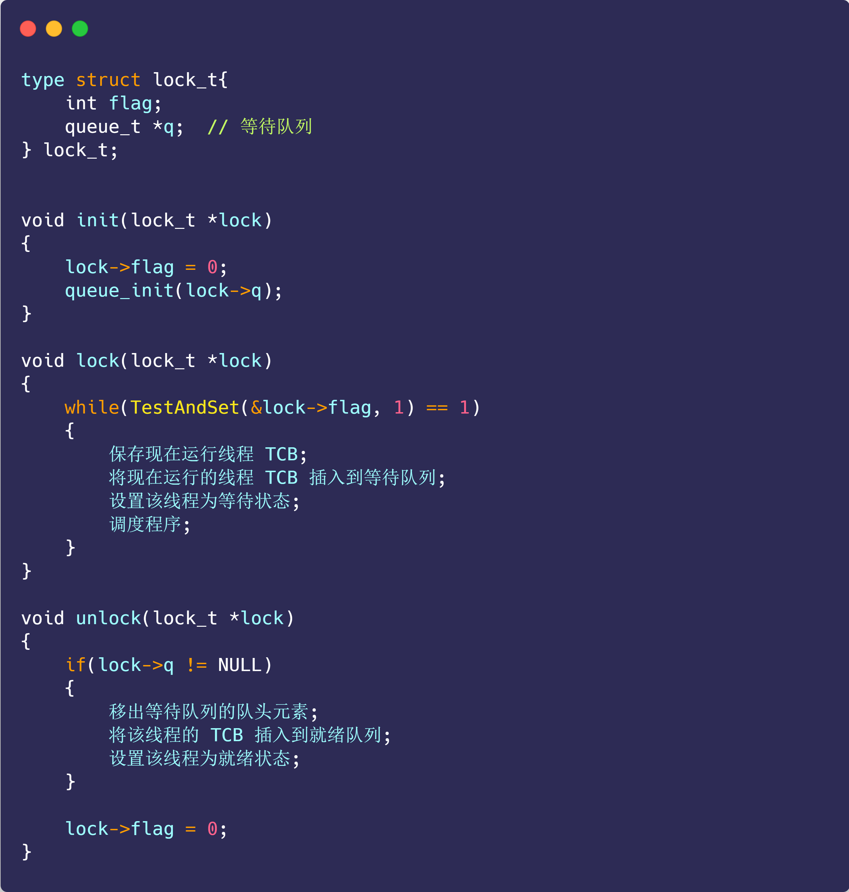
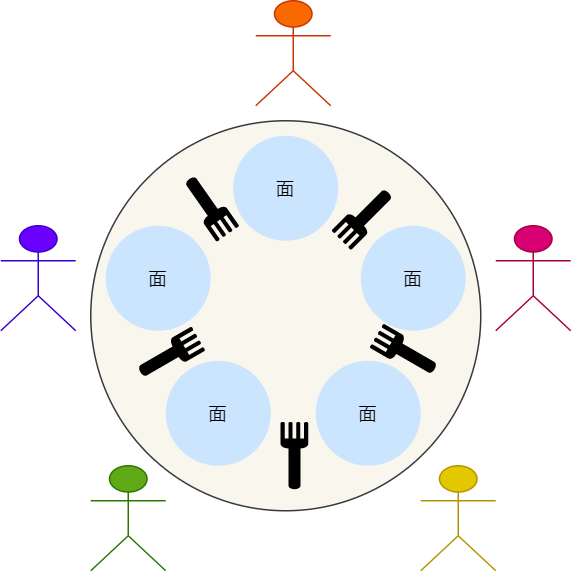
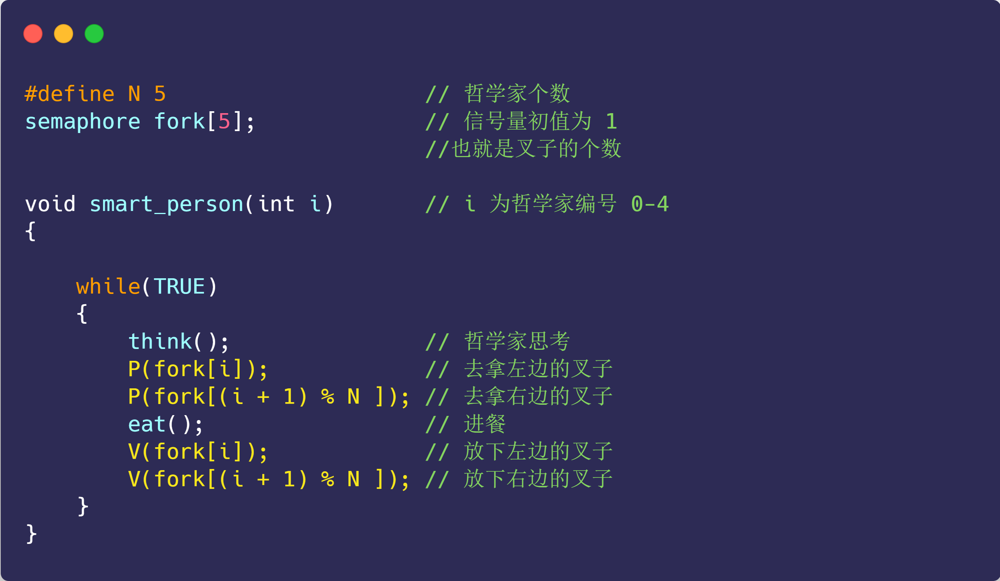

# 进程管理


## 进程、线程基础知识

> 先来看看一则小故事

我们写好的一行行代码，为了让其工作起来，我们还得把它送进城（**进程**）里，那既然进了城里，那肯定不能胡作非为了。

城里人有城里人的规矩，城中有个专门管辖你们的城管（**操作系统**），人家让你休息就休息，让你工作就工作，毕竟摊位不多，每个人都要占这个摊位来工作，城里要工作的人多着去了。

所以城管为了公平起见，它使用一种策略（**调度**）方式，给每个人一个固定的工作时间（**时间片**），时间到了就会通知你去休息而换另外一个人上场工作。

另外，在休息时候你也不能偷懒，要记住工作到哪了，不然下次到你工作了，你忘记工作到哪了，那还怎么继续？

有的人，可能还进入了县城（**线程**）工作，这里相对轻松一些，在休息的时候，要记住的东西相对较少，而且还能共享城里的资源。


### 进程

我们编写的代码只是一个存储在硬盘的静态文件，通过编译后就会生成二进制可执行文件，当我们运行这个可执行文件后，它会被装载到内存中，接着 CPU 会执行程序中的每一条指令，那么这个**运行中的程序，就被称为「进程」（Process）**。

现在我们考虑有一个会读取硬盘文件数据的程序被执行了，那么当运行到读取文件的指令时，就会去从硬盘读取数据，但是硬盘的读写速度是非常慢的，那么在这个时候，如果 CPU 傻傻的等硬盘返回数据的话，那 CPU 的利用率是非常低的。

做个类比，你去煮开水时，你会傻傻的等水壶烧开吗？很明显，小孩也不会傻等。我们可以在水壶烧开之前去做其他事情。当水壶烧开了，我们自然就会听到“嘀嘀嘀”的声音，于是再把烧开的水倒入到水杯里就好了。

所以，当进程要从硬盘读取数据时，CPU 不需要阻塞等待数据的返回，而是去执行另外的进程。当硬盘数据返回时，CPU 会收到个**中断**，于是 CPU 再继续运行这个进程。


这种**多个程序、交替执行**的思想，就有 CPU 管理多个进程的初步想法。

对于一个支持多进程的系统，CPU 会从一个进程快速切换至另一个进程，其间每个进程各运行几十或几百个毫秒。

虽然单核的 CPU 在某一个瞬间，只能运行一个进程。但在 1 秒钟期间，它可能会运行多个进程，这样就产生**并行的错觉**（**同一时间**运行多个进程），实际上这是**并发**（**一个时间段内**运行多个进程）。

> 并发和并行有什么区别？

一图胜千言。


> 进程与程序的关系的类比

到了晚饭时间，一对小情侣肚子都咕咕叫了，于是男生见机行事，就想给女生做晚饭，所以他就在网上找了辣子鸡的菜谱，接着买了一些鸡肉、辣椒、香料等材料，然后边看边学边做这道菜。


突然，女生说她想喝可乐，那么男生只好把做菜的事情暂停一下，并在手机菜谱标记做到哪一个步骤，把状态信息记录了下来。

然后男生听从女生的指令，跑去下楼买了一瓶冰可乐后，又回到厨房继续做菜。

**这体现了，CPU 可以从一个进程（做菜）切换到另外一个进程（买可乐），在切换前必须要记录当前进程中运行的状态信息，以备下次切换回来的时候可以恢复执行。**

所以，可以发现进程有着「**运行 - 暂停 - 运行**」的活动规律。


#### 进程的状态

在上面，我们知道了进程有着「运行 - 暂停 - 运行」的活动规律。一般说来，一个进程并不是自始至终连续不停地运行的，它与并发执行中的其他进程的执行是相互制约的。

它有时处于运行状态，有时又由于某种原因而暂停运行处于等待状态，当使它暂停的原因消失后，它又进入准备运行状态。

所以，**在一个进程的活动期间至少具备三种基本状态，即运行状态、就绪状态、阻塞状态。**


上图中各个状态的意义：

- 运行状态（*Running*）：该时刻进程占用 CPU；
- 就绪状态（*Ready*）：可运行，由于其他进程处于运行状态而暂时停止运行，等待获取CPU；
- 阻塞状态（*Blocked*）：该进程正在等待某一事件发生（如等待输入/输出操作的完成）而暂时停止运行，这时，即使给它CPU控制权，它也无法运行；

当然，进程还有另外两个基本状态：

- 创建状态（*new*）：进程正在被创建时的状态；
- 结束状态（*Exit*）：进程正在从系统中消失时的状态；

于是，一个完整的进程状态的变迁如下图：


再来详细说明一下进程的状态变迁：

- *NULL -> 创建状态*：一个新进程被创建时的第一个状态；
- *创建状态 -> 就绪状态*：当进程被创建完成并初始化后，一切就绪准备运行时，变为就绪状态，这个过程是很快的；
- *就绪态 -> 运行状态*：处于就绪状态的进程被操作系统的进程调度器选中后，就分配给 CPU 正式运行该进程；
- *运行状态 -> 结束状态*：当进程已经运行完成或出错时，会被操作系统作结束状态处理；
- *运行状态 -> 就绪状态*：处于运行状态的进程在运行过程中，由于分配给它的运行时间片用完，操作系统会把该进程变为就绪态，接着从就绪态选中另外一个进程运行；
- *运行状态 -> 阻塞状态*：当进程请求某个事件且必须等待时，例如请求 I/O 事件；
- *阻塞状态 -> 就绪状态*：当进程要等待的事件完成时，它从阻塞状态变到就绪状态；

如果有大量处于阻塞状态的进程，进程可能会占用着物理内存空间，显然不是我们所希望的，毕竟物理内存空间是有限的，被阻塞状态的进程占用着物理内存就一种浪费物理内存的行为。

所以，在虚拟内存管理的操作系统中，通常会把阻塞状态的进程的物理内存空间换出到硬盘，等需要再次运行的时候，再从硬盘换入到物理内存。


那么，就需要一个新的状态，来**描述进程没有占用实际的物理内存空间的情况，这个状态就是挂起状态**。这跟阻塞状态是不一样，阻塞状态是等待某个事件的返回。

另外，挂起状态可以分为两种：

- 阻塞挂起状态：进程在外存（硬盘）并等待某个事件的出现；
- 就绪挂起状态：进程在外存（硬盘），但只要进入内存，即刻立刻运行；

这两种挂起状态加上前面的五种状态，就变成了七种状态变迁（留给我的颜色不多了），见如下图：


导致进程挂起的原因不只是因为进程所使用的内存空间不在物理内存，还包括如下情况：

- 通过 sleep 让进程间歇性挂起，其工作原理是设置一个定时器，到期后唤醒进程。
- 用户希望挂起一个程序的执行，比如在 Linux 中用 `Ctrl+Z` 挂起进程；


#### 进程的控制结构

在操作系统中，是用**进程控制块**（*process control block，PCB*）数据结构来描述进程的。

那 PCB 是什么呢？打开知乎搜索你就会发现这个东西并不是那么简单。


打住打住，我们是个正经的人，怎么会去看那些问题呢？是吧，回来回来。

**PCB 是进程存在的唯一标识**，这意味着一个进程的存在，必然会有一个 PCB，如果进程消失了，那么 PCB 也会随之消失。

> PCB 具体包含什么信息呢？

**进程描述信息：**

- 进程标识符：标识各个进程，每个进程都有一个并且唯一的标识符；
- 用户标识符：进程归属的用户，用户标识符主要为共享和保护服务；

**进程控制和管理信息：**

- 进程当前状态，如 new、ready、running、waiting 或 blocked 等；
- 进程优先级：进程抢占 CPU 时的优先级；

**资源分配清单：**

- 有关内存地址空间或虚拟地址空间的信息，所打开文件的列表和所使用的 I/O 设备信息。

**CPU 相关信息：**

- CPU 中各个寄存器的值，当进程被切换时，CPU 的状态信息都会被保存在相应的 PCB 中，以便进程重新执行时，能从断点处继续执行。

可见，PCB 包含信息还是比较多的。

> 每个 PCB 是如何组织的呢？

通常是通过**链表**的方式进行组织，把具有**相同状态的进程链在一起，组成各种队列**。比如：

- 将所有处于就绪状态的进程链在一起，称为**就绪队列**；
- 把所有因等待某事件而处于等待状态的进程链在一起就组成各种**阻塞队列**；
- 另外，对于运行队列在单核 CPU 系统中则只有一个运行指针了，因为单核 CPU 在某个时间，只能运行一个程序。

那么，就绪队列和阻塞队列链表的组织形式如下图：


除了链接的组织方式，还有索引方式，它的工作原理：将同一状态的进程组织在一个索引表中，索引表项指向相应的 PCB，不同状态对应不同的索引表。

一般会选择链表，因为可能面临进程创建，销毁等调度导致进程状态发生变化，所以链表能够更加灵活的插入和删除。


#### 进程的控制

我们熟知了进程的状态变迁和进程的数据结构 PCB 后，再来看看进程的**创建、终止、阻塞、唤醒**的过程，这些过程也就是进程的控制。

**01 创建进程**

操作系统允许一个进程创建另一个进程，而且允许子进程继承父进程所拥有的资源。

创建进程的过程如下：

- 申请一个空白的 PCB，并向 PCB 中填写一些控制和管理进程的信息，比如进程的唯一标识等；
- 为该进程分配运行时所必需的资源，比如内存资源；
- 将 PCB 插入到就绪队列，等待被调度运行；

**02 终止进程**

进程可以有 3 种终止方式：正常结束、异常结束以及外界干预（信号 `kill` 掉）。

当子进程被终止时，其在父进程处继承的资源应当还给父进程。而当父进程被终止时，该父进程的子进程就变为孤儿进程，会被 1 号进程收养，并由 1 号进程对它们完成状态收集工作。

终止进程的过程如下：

- 查找需要终止的进程的 PCB；
- 如果处于执行状态，则立即终止该进程的执行，然后将 CPU 资源分配给其他进程；
- 如果其还有子进程，则应将该进程的子进程交给 1 号进程接管；
- 将该进程所拥有的全部资源都归还给操作系统；
- 将其从 PCB 所在队列中删除；

**03 阻塞进程**

当进程需要等待某一事件完成时，它可以调用阻塞语句把自己阻塞等待。而一旦被阻塞等待，它只能由另一个进程唤醒。

阻塞进程的过程如下：

- 找到将要被阻塞进程标识号对应的 PCB；
- 如果该进程为运行状态，则保护其现场，将其状态转为阻塞状态，停止运行；
- 将该 PCB 插入到阻塞队列中去；

**04 唤醒进程**

进程由「运行」转变为「阻塞」状态是由于进程必须等待某一事件的完成，**所以处于阻塞状态的进程是绝对不可能叫醒自己的。**

如果某进程正在等待 I/O 事件，需由别的进程发消息给它，则只有当该进程所期待的事件出现时，才由发现者进程用唤醒语句叫醒它。

唤醒进程的过程如下：

- 在该事件的阻塞队列中找到相应进程的 PCB；
- 将其从阻塞队列中移出，并置其状态为就绪状态；
- 把该 PCB 插入到就绪队列中，等待调度程序调度；

进程的阻塞和唤醒是一对功能相反的语句，如果某个进程调用了阻塞语句，则必有一个与之对应的唤醒语句。


#### 进程的上下文切换

各个进程之间是共享 CPU 资源的，在不同的时候进程之间需要切换，让不同的进程可以在 CPU 执行，那么这个**一个进程切换到另一个进程运行，称为进程的上下文切换**。

> 在详细说进程上下文切换前，我们先来看看 CPU 上下文切换

大多数操作系统都是多任务，通常支持大于 CPU 数量的任务同时运行。实际上，这些任务并不是同时运行的，只是因为系统在很短的时间内，让各个任务分别在 CPU 运行，于是就造成同时运行的错觉。

任务是交给 CPU 运行的，那么在每个任务运行前，CPU 需要知道任务从哪里加载，又从哪里开始运行。

所以，操作系统需要事先帮 CPU 设置好 **CPU 寄存器和程序计数器**。

CPU 寄存器是 CPU 内部一个容量小，但是速度极快的内存（缓存）。我举个例子，寄存器像是你的口袋，内存像你的书包，硬盘则是你家里的柜子，如果你的东西存放到口袋，那肯定是比你从书包或家里柜子取出来要快的多。

再来，程序计数器则是用来存储 CPU 正在执行的指令位置、或者即将执行的下一条指令位置。

<u>所以说，CPU 寄存器和程序计数是 CPU 在运行任何任务前，所必须依赖的环境，这些环境就叫做 **CPU 上下文**。</u>

既然知道了什么是 CPU 上下文，那理解 CPU 上下文切换就不难了。

CPU 上下文切换就是先把前一个任务的 CPU 上下文（CPU 寄存器和程序计数器）保存起来，然后加载新任务的上下文到这些寄存器和程序计数器，最后再跳转到程序计数器所指的新位置，运行新任务。

系统内核会存储保持下来的上下文信息，当此任务再次被分配给 CPU 运行时，CPU 会重新加载这些上下文，这样就能保证任务原来的状态不受影响，让任务看起来还是连续运行。

上面说到所谓的「任务」，主要包含进程、线程和中断。所以，可以根据任务的不同，把 CPU 上下文切换分成：**进程上下文切换、线程上下文切换和中断上下文切换**。

> 进程的上下文切换到底是切换什么呢？

进程是由内核管理和调度的，所以进程的切换只能发生在内核态。

所以，**进程的上下文切换不仅包含了虚拟内存、栈、全局变量等用户空间的资源，还包括了内核堆栈、寄存器等内核空间的资源。**

通常，会把交换的信息保存在进程的 PCB，当要运行另外一个进程的时候，我们需要从这个进程的 PCB 取出上下文，然后恢复到 CPU 中，这使得这个进程可以继续执行，如下图所示：


大家需要注意，进程的上下文开销是很关键的，我们希望它的开销越小越好，这样可以使得进程可以把更多时间花费在执行程序上，而不是耗费在上下文切换。

> 发生进程上下文切换有哪些场景？

- 为了保证所有进程可以得到公平调度，CPU 时间被划分为一段段的时间片，这些时间片再被轮流分配给各个进程。这样，当某个进程的时间片耗尽了，进程就从运行状态变为就绪状态，系统从就绪队列选择另外一个进程运行；
- 进程在系统资源不足（比如内存不足）时，要等到资源满足后才可以运行，这个时候进程也会被挂起，并由系统调度其他进程运行；
- 当进程通过睡眠函数 sleep 这样的方法将自己主动挂起时，自然也会重新调度；
- 当有优先级更高的进程运行时，为了保证高优先级进程的运行，当前进程会被挂起，由高优先级进程来运行；
- 发生硬件中断时，CPU 上的进程会被中断挂起，转而执行内核中的中断服务程序；

以上，就是发生进程上下文切换的常见场景了。


### 线程

在早期的操作系统中都是以进程作为独立运行的基本单位，直到后面，计算机科学家们又提出了更小的能独立运行的基本单位，也就是**线程。**


#### 为什么使用线程？

我们举个例子，假设你要编写一个视频播放器软件，那么该软件功能的核心模块有三个：

- 从视频文件当中读取数据；
- 对读取的数据进行解压缩；
- 把解压缩后的视频数据播放出来；

对于单进程的实现方式，我想大家都会是以下这个方式：


对于单进程的这种方式，存在以下问题：

- 播放出来的画面和声音会不连贯，因为当 CPU 能力不够强的时候，`Read` 的时候可能进程就等在这了，这样就会导致等半天才进行数据解压和播放；
- 各个函数之间不是并发执行，影响资源的使用效率；

那改进成多进程的方式：


对于多进程的这种方式，依然会存在问题：

- 进程之间如何通信，共享数据？
- 维护进程的系统开销较大，如创建进程时，分配资源、建立 PCB；终止进程时，回收资源、撤销 PCB；进程切换时，保存当前进程的状态信息；

那到底如何解决呢？需要有一种新的实体，满足以下特性：

- 实体之间可以并发运行；
- 实体之间共享相同的地址空间；

这个新的实体，就是**线程( Thread )**，线程之间可以并发运行且共享相同的地址空间。


#### 什么是线程？

**线程是进程当中的一条执行流程。**

同一个进程内多个线程之间可以共享代码段、数据段、打开的文件等资源，但每个线程各自都有一套独立的寄存器和栈，这样可以确保线程的控制流是相对独立的。


> 线程的优缺点？

线程的优点：

- 一个进程中可以同时存在多个线程；
- 各个线程之间可以并发执行；
- 各个线程之间可以共享地址空间和文件等资源；

线程的缺点：

- 当进程中的一个线程崩溃时，会导致其所属进程的所有线程崩溃（这里是针对 C/C++ 语言，Java语言中的线程奔溃不会造成进程崩溃，具体分析原因可以看这篇：[线程崩溃了，进程也会崩溃吗？ (opens new window)](https://xiaolincoding.com/os/4_process/thread_crash.html)）。

举个例子，对于游戏的用户设计，则不应该使用多线程的方式，否则一个用户挂了，会影响其他同个进程的线程。


#### 线程与进程的比较

线程与进程的比较如下：

- 进程是**资源（包括内存、打开的文件等）分配的单位**，**线程是 CPU 调度的单位；**
- 进程拥有一个完整的资源平台，而线程只独享必不可少的资源，如寄存器和栈；
- 线程同样具有就绪、阻塞、执行三种基本状态，同样具有状态之间的转换关系；
- 线程能减少并发执行的时间和空间开销；

对于，线程相比进程能减少开销，体现在：

- 线程的创建时间比进程快，因为进程在创建的过程中，还需要资源管理信息，比如内存管理信息、文件管理信息，而线程在创建的过程中，不会涉及这些资源管理信息，而是共享它们；
- 线程的终止时间比进程快，因为线程释放的资源相比进程少很多；
- 同一个进程内的线程切换比进程切换快，因为线程具有相同的地址空间（虚拟内存共享），这意味着同一个进程的线程都具有同一个页表，那么在切换的时候不需要切换页表。而对于进程之间的切换，切换的时候要把页表给切换掉，而页表的切换过程开销是比较大的；
- 由于同一进程的各线程间共享内存和文件资源，那么在线程之间数据传递的时候，就不需要经过内核了，这就使得线程之间的数据交互效率更高了；

所以，不管是时间效率，还是空间效率线程比进程都要高。


#### 线程的上下文切换

在前面我们知道了，线程与进程最大的区别在于：**线程是调度的基本单位，而进程则是资源拥有的基本单位**。

所以，所谓操作系统的任务调度，实际上的调度对象是线程，而进程只是给线程提供了虚拟内存、全局变量等资源。

对于线程和进程，我们可以这么理解：

- 当进程只有一个线程时，可以认为进程就等于线程；
- 当进程拥有多个线程时，这些线程会共享相同的虚拟内存和全局变量等资源，这些资源在上下文切换时是不需要修改的；

另外，线程也有自己的私有数据，比如栈和寄存器等，这些在上下文切换时也是需要保存的。

> 线程上下文切换的是什么？

这还得看线程是不是属于同一个进程：

- 当两个线程不是属于同一个进程，则切换的过程就跟进程上下文切换一样；
- **当两个线程是属于同一个进程，因为虚拟内存是共享的，所以在切换时，虚拟内存这些资源就保持不动，只需要切换线程的私有数据、寄存器等不共享的数据**；

所以，线程的上下文切换相比进程，开销要小很多。


#### 线程的实现

主要有三种线程的实现方式：

- **用户线程（User Thread）**：在用户空间实现的线程，不是由内核管理的线程，是由用户态的线程库来完成线程的管理；
- **内核线程（Kernel Thread）**：在内核中实现的线程，是由内核管理的线程；
- **轻量级进程（LightWeight Process）**：在内核中来支持用户线程；

那么，这还需要考虑一个问题，用户线程和内核线程的对应关系。

首先，第一种关系是**多对一**的关系，也就是多个用户线程对应同一个内核线程：


第二种是**一对一**的关系，也就是一个用户线程对应一个内核线程：


第三种是**多对多**的关系，也就是多个用户线程对应到多个内核线程：


> 用户线程如何理解？存在什么优势和缺陷？

用户线程是基于用户态的线程管理库来实现的，那么**线程控制块（Thread Control Block, TCB）** 也是在库里面来实现的，对于操作系统而言是看不到这个 TCB 的，它只能看到整个进程的 PCB。

所以，**用户线程的整个线程管理和调度，操作系统是不直接参与的，而是由用户级线程库函数来完成线程的管理，包括线程的创建、终止、同步和调度等。**

用户级线程的模型，也就类似前面提到的**多对一**的关系，即多个用户线程对应同一个内核线程，如下图所示：


用户线程的**优点**：

- 每个进程都需要有它私有的线程控制块（TCB）列表，用来跟踪记录它各个线程状态信息（PC、栈指针、寄存器），TCB 由用户级线程库函数来维护，可用于不支持线程技术的操作系统；
- 用户线程的切换也是由线程库函数来完成的，无需用户态与内核态的切换，所以速度特别快；

用户线程的**缺点**：

- 由于操作系统不参与线程的调度，如果一个线程发起了系统调用而阻塞，那进程所包含的用户线程都不能执行了。
- 当一个线程开始运行后，除非它主动地交出 CPU 的使用权，否则它所在的进程当中的其他线程无法运行，因为用户态的线程没法打断当前运行中的线程，它没有这个特权，只有操作系统才有，但是用户线程不是由操作系统管理的。
- 由于时间片分配给进程，故与其他进程比，在多线程执行时，每个线程得到的时间片较少，执行会比较慢；

以上，就是用户线程的优缺点了。

> 那内核线程如何理解？存在什么优势和缺陷？

**内核线程是由操作系统管理的，线程对应的 TCB 自然是放在操作系统里的，这样线程的创建、终止和管理都是由操作系统负责。**

内核线程的模型，也就类似前面提到的**一对一**的关系，即一个用户线程对应一个内核线程，如下图所示：


内核线程的**优点**：

- 在一个进程当中，如果某个内核线程发起系统调用而被阻塞，并不会影响其他内核线程的运行；
- 分配给线程，多线程的进程获得更多的 CPU 运行时间；

内核线程的**缺点**：

- 在支持内核线程的操作系统中，由内核来维护进程和线程的上下文信息，如 PCB 和 TCB；
- 线程的创建、终止和切换都是通过系统调用的方式来进行，因此对于系统来说，系统开销比较大；

以上，就是内核线程的优缺点了。

> 最后的轻量级进程如何理解？

**轻量级进程（Light-weight process，LWP）是内核支持的用户线程，一个进程可有一个或多个 LWP，每个 LWP 是跟内核线程一对一映射的，也就是 LWP 都是由一个内核线程支持，而且 LWP 是由内核管理并像普通进程一样被调度**。

在大多数系统中，**LWP与普通进程的区别也在于它只有一个最小的执行上下文和调度程序所需的统计信息**。一般来说，一个进程代表程序的一个实例，而 LWP 代表程序的执行线程，因为一个执行线程不像进程那样需要那么多状态信息，所以 LWP 也不带有这样的信息。

在 LWP 之上也是可以使用用户线程的，那么 LWP 与用户线程的对应关系就有三种：

- `1 : 1`，即一个 LWP 对应 一个用户线程；
- `N : 1`，即一个 LWP 对应多个用户线程；
- `M : N`，即多个 LWP 对应多个用户线程；

接下来针对上面这三种对应关系说明它们优缺点。先看下图的 LWP 模型：


**1 : 1 模式**

一个线程对应到一个 LWP 再对应到一个内核线程，如上图的进程 4，属于此模型。

- 优点：实现并行，当一个 LWP 阻塞，不会影响其他 LWP；
- 缺点：每一个用户线程，就产生一个内核线程，创建线程的开销较大。

**N : 1 模式**

多个用户线程对应一个 LWP 再对应一个内核线程，如上图的进程 2，线程管理是在用户空间完成的，此模式中用户的线程对操作系统不可见。

- 优点：用户线程要开几个都没问题，且上下文切换发生用户空间，切换的效率较高；
- 缺点：一个用户线程如果阻塞了，则整个进程都将会阻塞，另外在多核 CPU 中，是没办法充分利用 CPU 的。

**M : N 模式**

根据前面的两个模型混搭一起，就形成 `M:N` 模型，该模型提供了两级控制，首先多个用户线程对应到多个 LWP，LWP 再一一对应到内核线程，如上图的进程 3。

- 优点：综合了前两种优点，大部分的线程上下文发生在用户空间，且多个线程又可以充分利用多核 CPU 的资源。

**组合模式**

如上图的进程 5，此进程结合 `1:1` 模型和 `M:N` 模型。开发人员可以针对不同的应用特点调节内核线程的数目来达到物理并行性和逻辑并行性的最佳方案。


### 调度

进程都希望自己能够占用 CPU 进行工作，那么这涉及到前面说过的进程上下文切换。

一旦操作系统把进程切换到运行状态，也就意味着该进程占用着 CPU 在执行，但是当操作系统把进程切换到其他状态时，那就不能在 CPU 中执行了，于是操作系统会选择下一个要运行的进程。

选择一个进程运行这一功能是在操作系统中完成的，通常称为**调度程序**（*scheduler*）。

那到底什么时候调度进程，或以什么原则来调度进程呢？

**TIP**

我知道很多人会问，线程不是操作系统的调度单位吗？为什么这里参与调度的是进程？

先提前说明，这里的进程指只有主线程的进程，所以调度主线程就等于调度了整个进程。

那为什么干脆不直接取名线程调度？主要是操作系统相关书籍，都是用进程调度这个名字，所以我也沿用了这个名字。


#### 调度时机

在进程的生命周期中，当进程从一个运行状态到另外一状态变化的时候，其实会触发一次调度。

比如，以下状态的变化都会触发操作系统的调度：

- *从就绪态 -> 运行态*：当进程被创建时，会进入到就绪队列，操作系统会从就绪队列选择一个进程运行；
- *从运行态 -> 阻塞态*：当进程发生 I/O 事件而阻塞时，操作系统必须选择另外一个进程运行；
- *从运行态 -> 结束态*：当进程退出结束后，操作系统得从就绪队列选择另外一个进程运行；

因为，这些状态变化的时候，操作系统需要考虑是否要让新的进程给 CPU 运行，或者是否让当前进程从 CPU 上退出来而换另一个进程运行。

另外，如果硬件时钟提供某个频率的周期性中断，那么可以根据如何处理时钟中断 ，把调度算法分为两类：

- **非抢占式调度算法**挑选一个进程，然后让该进程运行直到被阻塞，或者直到该进程退出，才会调用另外一个进程，也就是说不会理时钟中断这个事情。
- **抢占式调度算法**挑选一个进程，然后让该进程只运行某段时间，如果在该时段结束时，该进程仍然在运行时，则会把它挂起，接着调度程序从就绪队列挑选另外一个进程。这种抢占式调度处理，需要在时间间隔的末端发生**时钟中断**，以便把 CPU 控制返回给调度程序进行调度，也就是常说的**时间片机制**。


#### 调度原则

*原则一*：如果运行的程序，发生了 **I/O 事件的请求**，那 CPU 使用率必然会很低，因为此时进程在阻塞等待硬盘的数据返回。这样的过程，势必会造成 CPU 突然的空闲。所以，**为了提高 CPU 利用率，在这种发送 I/O 事件致使 CPU 空闲的情况下，调度程序需要从就绪队列中选择一个进程来运行。**

*原则二*：有的程序执行某个任务花费的时间会比较长，如果这个程序一直占用着 CPU，会造成系统吞吐量（CPU 在单位时间内完成的进程数量）的降低。所以，**要提高系统的吞吐率，调度程序要权衡长任务和短任务进程的运行完成数量。**

*原则三*：从进程开始到结束的过程中，实际上是包含两个时间，分别是进程运行时间和进程等待时间，这两个时间总和就称为周转时间。进程的周转时间越小越好，**如果进程的等待时间很长而运行时间很短，那周转时间就很长，这不是我们所期望的，调度程序应该避免这种情况发生。**

*原则四*：处于就绪队列的进程，也不能等太久，当然希望这个等待的时间越短越好，这样可以使得进程更快的在 CPU 中执行。所以，**就绪队列中进程的等待时间也是调度程序所需要考虑的原则。**

*原则五*：对于鼠标、键盘这种交互式比较强的应用，我们当然希望它的响应时间越快越好，否则就会影响用户体验了。所以，**对于交互式比较强的应用，响应时间也是调度程序需要考虑的原则。**


针对上面的五种调度原则，总结成如下：

- **CPU 利用率**：调度程序应确保 CPU 是始终匆忙的状态，这可提高 CPU 的利用率；
- **系统吞吐量**：吞吐量表示的是单位时间内 CPU 完成进程的数量，长作业的进程会占用较长的 CPU 资源，因此会降低吞吐量，相反，短作业的进程会提升系统吞吐量；
- **周转时间**：周转时间是进程运行+阻塞时间+等待时间的总和，一个进程的周转时间越小越好；
- **等待时间**：这个等待时间不是阻塞状态的时间，而是进程处于就绪队列的时间，等待的时间越长，用户越不满意；
- **响应时间**：用户提交请求到系统第一次产生响应所花费的时间，在交互式系统中，响应时间是衡量调度算法好坏的主要标准。

说白了，这么多调度原则，目的就是要使得进程要「快」。


#### 调度算法

不同的调度算法适用的场景也是不同的。

接下来，说说在**单核 CPU 系统**中常见的调度算法。

> 01 先来先服务调度算法

最简单的一个调度算法，就是非抢占式的**先来先服务（First Come First Serve, FCFS）算法**了。


顾名思义，先来后到，**每次从就绪队列选择最先进入队列的进程，然后一直运行，直到进程退出或被阻塞，才会继续从队列中选择第一个进程接着运行。**

这似乎很公平，但是当一个长作业先运行了，那么后面的短作业等待的时间就会很长，不利于短作业。

**FCFS 对长作业有利，适用于 CPU 繁忙型作业的系统，而不适用于 I/O 繁忙型作业的系统。**


> 02 最短作业优先调度算法

**最短作业优先（Shortest Job First, SJF）调度算法**同样也是顾名思义，它会**优先选择运行时间最短的进程来运行**，这有助于提高系统的吞吐量。


这显然对长作业不利，很容易造成一种极端现象。

比如，一个长作业在就绪队列等待运行，而这个就绪队列有非常多的短作业，那么就会使得长作业不断的往后推，周转时间变长，致使长作业长期不会被运行。


> 03 高响应比优先调度算法

前面的「先来先服务调度算法」和「最短作业优先调度算法」都没有很好的权衡短作业和长作业。

那么，**高响应比优先 （Highest Response Ratio Next, HRRN）调度算法**主要是权衡了短作业和长作业。

**每次进行进程调度时，先计算「响应比优先级」，然后把「响应比优先级」最高的进程投入运行**，「响应比优先级」的计算公式：


从上面的公式，可以发现：

- 如果两个进程的「等待时间」相同时，「要求的服务时间」越短，「响应比」就越高，这样短作业的进程容易被选中运行；
- 如果两个进程「要求的服务时间」相同时，「等待时间」越长，「响应比」就越高，这就兼顾到了长作业进程，因为进程的响应比可以随时间等待的增加而提高，当其等待时间足够长时，其响应比便可以升到很高，从而获得运行的机会；

TIP

很多人问怎么才能知道一个进程要求服务的时间？这不是不可预知的吗？

对的，这是不可预估的。所以，高响应比优先调度算法是「理想型」的调度算法，现实中是实现不了的。


> 04 时间片轮转调度算法

最古老、最简单、最公平且使用最广的算法就是**时间片轮转（Round Robin, RR）调度算法**。


**每个进程被分配一个时间段，称为时间片（\*Quantum\*），即允许该进程在该时间段中运行。**

- 如果时间片用完，进程还在运行，那么将会把此进程从 CPU 释放出来，并把 CPU 分配给另外一个进程；
- 如果该进程在时间片结束前阻塞或结束，则 CPU 立即进行切换；

另外，时间片的长度就是一个很关键的点：

- 如果时间片设得太短会导致过多的进程上下文切换，降低了 CPU 效率；
- 如果设得太长又可能引起对短作业进程的响应时间变长。

一般来说，时间片设为 `20ms~50ms` 通常是一个比较合理的折中值。


> 05 最高优先级调度算法

前面的「时间片轮转算法」做了个假设，即让所有的进程同等重要，也不偏袒谁，大家的运行时间都一样。

但是，对于多用户计算机系统就有不同的看法了，它们希望调度是有优先级的，即希望调度程序能**从就绪队列中选择最高优先级的进程进行运行，这称为最高优先级（\*Highest Priority First，HPF\*）调度算法**。

进程的优先级可以分为，静态优先级和动态优先级：

- 静态优先级：创建进程时候，就已经确定了优先级了，然后整个运行时间优先级都不会变化；
- 动态优先级：根据进程的动态变化调整优先级，比如如果进程运行时间增加，则降低其优先级，如果进程等待时间（就绪队列的等待时间）增加，则升高其优先级，也就是**随着时间的推移增加等待进程的优先级**。

该算法也有两种处理优先级高的方法，非抢占式和抢占式：

- 非抢占式：当就绪队列中出现优先级高的进程，运行完当前进程，再选择优先级高的进程。
- 抢占式：当就绪队列中出现优先级高的进程，当前进程挂起，调度优先级高的进程运行。

但是依然有缺点，可能会导致低优先级的进程永远不会运行。


> 06 多级反馈队列调度算法

**多级反馈队列（\*Multilevel Feedback Queue\*）调度算法**是「时间片轮转算法」和「最高优先级算法」的综合和发展。

顾名思义：

- 「多级」表示有多个队列，每个队列优先级从高到低，同时优先级越高时间片越短。
- 「反馈」表示如果有新的进程加入优先级高的队列时，立刻停止当前正在运行的进程，转而去运行优先级高的队列；


来看看，它是如何工作的：

- 设置了多个队列，赋予每个队列不同的优先级，每个**队列优先级从高到低**，同时**优先级越高时间片越短**；
- 新的进程会被放入到第一级队列的末尾，按先来先服务的原则排队等待被调度，如果在第一级队列规定的时间片没运行完成，则将其转入到第二级队列的末尾，以此类推，直至完成；
- 当较高优先级的队列为空，才调度较低优先级的队列中的进程运行。如果进程运行时，有新进程进入较高优先级的队列，则停止当前运行的进程并将其移入到原队列末尾，接着让较高优先级的进程运行；

可以发现，对于短作业可能可以在第一级队列很快被处理完。对于长作业，如果在第一级队列处理不完，可以移入下次队列等待被执行，虽然等待的时间变长了，但是运行时间也变更长了，所以该算法很好的**兼顾了长短作业，同时有较好的响应时间。**

> 看的迷迷糊糊？那我拿去银行办业务的例子，把上面的调度算法串起来，你还不懂，你锤我！


**办理业务的客户相当于进程，银行窗口工作人员相当于 CPU。**

现在，假设这个银行只有一个窗口（单核 CPU ），那么工作人员一次只能处理一个业务。


那么最简单的处理方式，就是先来的先处理，后面来的就乖乖排队，这就是**先来先服务（\*FCFS\*）调度算法**。但是万一先来的这位老哥是来贷款的，这一谈就好几个小时，一直占用着窗口，这样后面的人只能干等，或许后面的人只是想简单的取个钱，几分钟就能搞定，却因为前面老哥办长业务而要等几个小时，你说气不气人？


有客户抱怨了，那我们就要改进，我们干脆优先给那些几分钟就能搞定的人办理业务，这就是**短作业优先（\*SJF\*）调度算法**。听起来不错，但是依然还是有个极端情况，万一办理短业务的人非常的多，这会导致长业务的人一直得不到服务，万一这个长业务是个大客户，那不就捡了芝麻丢了西瓜


那就公平起见，现在窗口工作人员规定，每个人我只处理 10 分钟。如果 10 分钟之内处理完，就马上换下一个人。如果没处理完，依然换下一个人，但是客户自己得记住办理到哪个步骤了。这个也就是**时间片轮转（\*RR\*）调度算法**。但是如果时间片设置过短，那么就会造成大量的上下文切换，增大了系统开销。如果时间片过长，相当于退化成 FCFS 算法了。


既然公平也可能存在问题，那银行就对客户分等级，分为普通客户、VIP 客户、SVIP 客户。只要高优先级的客户一来，就第一时间处理这个客户，这就是**最高优先级（\*HPF\*）调度算法**。但依然也会有极端的问题，万一当天来的全是高级客户，那普通客户不是没有被服务的机会，不把普通客户当人是吗？那我们把优先级改成动态的，如果客户办理业务时间增加，则降低其优先级，如果客户等待时间增加，则升高其优先级。


那有没有兼顾到公平和效率的方式呢？这里介绍一种算法，考虑的还算充分的，**多级反馈队列（\*MFQ\*）调度算法**，它是时间片轮转算法和优先级算法的综合和发展。它的工作方式：


- 银行设置了多个排队（就绪）队列，每个队列都有不同的优先级，**各个队列优先级从高到低**，同时每个队列执行时间片的长度也不同，**优先级越高的时间片越短**。
- 新客户（进程）来了，先进入第一级队列的末尾，按先来先服务原则排队等待被叫号（运行）。如果时间片用完客户的业务还没办理完成，则让客户进入到下一级队列的末尾，以此类推，直至客户业务办理完成。
- 当第一级队列没人排队时，就会叫号二级队列的客户。如果客户办理业务过程中，有新的客户加入到较高优先级的队列，那么此时办理中的客户需要停止办理，回到原队列的末尾等待再次叫号，因为要把窗口让给刚进入较高优先级队列的客户。

可以发现，对于要办理短业务的客户来说，可以很快的轮到并解决。对于要办理长业务的客户，一下子解决不了，就可以放到下一个队列，虽然等待的时间稍微变长了，但是轮到自己的办理时间也变长了，也可以接受，不会造成极端的现象，可以说是综合上面几种算法的优点


## 进程间有哪些通信方式？


每个进程的用户地址空间都是独立的，一般而言是不能互相访问的，但内核空间是每个进程都共享的，所以进程之间要通信必须通过内核。


Linux 内核提供了不少进程间通信的机制，我们来一起瞧瞧有哪些？


### 管道

如果你学过 Linux 命令，那你肯定很熟悉「`|`」这个竖线。

```bash
$ ps auxf | grep mysql
```

上面命令行里的「`|`」竖线就是一个**管道**，它的功能是将前一个命令（`ps auxf`）的输出，作为后一个命令（`grep mysql`）的输入，从这功能描述，可以看出**管道传输数据是单向的**，如果想相互通信，我们需要创建两个管道才行。

同时，我们得知上面这种管道是没有名字，所以「`|`」表示的管道称为**匿名管道**，用完了就销毁。

管道还有另外一个类型是**命名管道**，也被叫做 `FIFO`，因为数据是先进先出的传输方式。

在使用命名管道前，先需要通过 `mkfifo` 命令来创建，并且指定管道名字：

```bash
$ mkfifo myPipe
```

myPipe 就是这个管道的名称，基于 Linux 一切皆文件的理念，所以管道也是以文件的方式存在，我们可以用 ls 看一下，这个文件的类型是 p，也就是 pipe（管道） 的意思：

```bash
$ ls -l
prw-r--r--. 1 root    root         0 Jul 17 02:45 myPipe
```

接下来，我们往 myPipe 这个管道写入数据：

```bash
$ echo "hello" > myPipe  // 将数据写进管道
                         // 停住了 ...
```

你操作了后，你会发现命令执行后就停在这了，这是因为管道里的内容没有被读取，只有当管道里的数据被读完后，命令才可以正常退出。

于是，我们执行另外一个命令来读取这个管道里的数据：

```bash
$ cat < myPipe  // 读取管道里的数据
hello
```

可以看到，管道里的内容被读取出来了，并打印在了终端上，另外一方面，echo 那个命令也正常退出了。

我们可以看出，**管道这种通信方式效率低，不适合进程间频繁地交换数据**（会阻塞）。当然，它的好处，自然就是简单，同时也我们很容易得知管道里的数据已经被另一个进程读取了。

> 那管道如何创建呢，背后原理是什么？

匿名管道的创建，需要通过下面这个系统调用：

```c
int pipe(int fd[2])
```

这里表示创建一个匿名管道，并返回了两个描述符，一个是管道的读取端描述符 `fd[0]`，另一个是管道的写入端描述符 `fd[1]`。注意，这个匿名管道是特殊的文件，只存在于内存，不存于文件系统中。


其实，**所谓的管道，就是内核里面的一串缓存**。从管道的一段写入的数据，实际上是缓存在内核中的，另一端读取，也就是从内核中读取这段数据。另外，管道传输的数据是无格式的流且大小受限。

看到这，你可能会有疑问了，这两个描述符都是在一个进程里面，并没有起到进程间通信的作用，怎么样才能使得管道是跨过两个进程的呢？

我们可以使用 `fork` 创建子进程，**创建的子进程会复制父进程的文件描述符**，这样就做到了两个进程各有两个「 `fd[0]` 与 `fd[1]`」，两个进程就可以通过各自的 fd 写入和读取同一个管道文件实现跨进程通信了。


管道只能一端写入，另一端读出，所以上面这种模式容易造成混乱，因为父进程和子进程都可以同时写入，也都可以读出。那么，为了避免这种情况，通常的做法是：

- 父进程关闭读取的 fd[0]，只保留写入的 fd[1]；
- 子进程关闭写入的 fd[1]，只保留读取的 fd[0]；


所以说如果需要双向通信，则应该创建两个管道。

到这里，我们仅仅解析了使用管道进行父进程与子进程之间的通信，但是在我们 shell 里面并不是这样的。

在 shell 里面执行 `A | B`命令的时候，A 进程和 B 进程都是 shell 创建出来的子进程，A 和 B 之间不存在父子关系，它俩的父进程都是 shell。


所以说，在 shell 里通过「`|`」匿名管道将多个命令连接在一起，实际上也就是创建了多个子进程，那么在我们编写 shell 脚本时，能使用一个管道搞定的事情，就不要多用一个管道，这样可以减少创建子进程的系统开销。

我们可以得知，**对于匿名管道，它的通信范围是存在父子关系的进程**。因为管道没有实体，也就是没有管道文件，只能通过 fork 来复制父进程 fd 文件描述符，来达到通信的目的。

另外，**对于命名管道，它可以在不相关的进程间也能相互通信**。因为命令管道，提前创建了一个类型为管道的设备文件，在进程里只要使用这个设备文件，就可以相互通信。

不管是匿名管道还是命名管道，进程写入的数据都是缓存在内核中，另一个进程读取数据时候自然也是从内核中获取，同时通信数据都遵循**先进先出**原则，不支持 lseek 之类的文件定位操作。


### 消息队列

前面说到管道的通信方式是效率低的，因此管道不适合进程间频繁地交换数据。

对于这个问题，**消息队列**的通信模式就可以解决。比如，A 进程要给 B 进程发送消息，A 进程把数据放在对应的消息队列后就可以正常返回了，B 进程需要的时候再去读取数据就可以了。同理，B 进程要给 A 进程发送消息也是如此。

再来，**消息队列是保存在内核中的消息链表**，在发送数据时，会分成一个一个独立的数据单元，也就是消息体（数据块），消息体是用户自定义的数据类型，消息的发送方和接收方要约定好消息体的数据类型，所以每个消息体都是固定大小的存储块，不像管道是无格式的字节流数据。如果进程从消息队列中读取了消息体，内核就会把这个消息体删除。

**消息队列生命周期随内核**，如果没有释放消息队列或者没有关闭操作系统，消息队列会一直存在，**而前面提到的匿名管道的生命周期，是随进程的创建而建立**，随进程的结束而销毁。

消息这种模型，两个进程之间的通信就像平时发邮件一样，你来一封，我回一封，可以频繁沟通了。

但邮件的通信方式存在不足的地方有两点，**一是通信不及时，二是附件也有大小限制**，这同样也是消息队列通信不足的点。

**消息队列不适合比较大数据的传输**，因为在内核中每个消息体都有一个最大长度的限制，同时所有队列所包含的全部消息体的总长度也是有上限。在 Linux 内核中，会有两个宏定义 `MSGMAX` 和 `MSGMNB`，它们以字节为单位，分别定义了一条消息的最大长度和一个队列的最大长度。

**消息队列通信过程中，存在用户态与内核态之间的数据拷贝开销**，因为进程写入数据到内核中的消息队列时，会发生从用户态拷贝数据到内核态的过程，同理另一进程读取内核中的消息数据时，会发生从内核态拷贝数据到用户态的过程。


### 共享内存

消息队列的读取和写入的过程，都会有发生用户态与内核态之间的消息拷贝过程。那**共享内存**的方式，就很好的解决了这一问题。

现代操作系统，对于内存管理，采用的是虚拟内存技术，也就是每个进程都有自己独立的虚拟内存空间，不同进程的虚拟内存映射到不同的物理内存中。所以，即使进程 A 和 进程 B 的虚拟地址是一样的，其实访问的是不同的物理内存地址，对于数据的增删查改互不影响。

**共享内存的机制，就是拿出一块虚拟地址空间来，映射到相同的物理内存中**。这样这个进程写入的东西，另外一个进程马上就能看到了，都不需要拷贝来拷贝去，传来传去，大大提高了进程间通信的速度。


### 信号量

用了共享内存通信方式，带来新的问题，那就是如果多个进程同时修改同一个共享内存，很有可能就冲突了。例如两个进程都同时写一个地址，那先写的那个进程会发现内容被别人覆盖了。

为了防止多进程竞争共享资源，而造成的数据错乱，所以需要保护机制，使得共享的资源，在任意时刻只能被一个进程访问。正好，**信号量**就实现了这一保护机制。

**信号量其实是一个整型的计数器，主要用于实现进程间的互斥与同步，而不是用于缓存进程间通信的数据**。

信号量表示资源的数量，控制信号量的方式有两种原子操作：

- 一个是 **P 操作**，这个操作会把信号量减去 1，相减后如果信号量 < 0，则表明资源已被占用，进程需阻塞等待；相减后如果信号量 >= 0，则表明还有资源可使用，进程可正常继续执行。
- 另一个是 **V 操作**，这个操作会把信号量加上 1，相加后如果信号量 <= 0，则表明当前有阻塞中的进程，于是会将该进程唤醒运行；相加后如果信号量 > 0，则表明当前没有阻塞中的进程；

P 操作是用在进入共享资源之前，V 操作是用在离开共享资源之后，这两个操作是必须成对出现的。

接下来，举个例子，如果要使得两个进程互斥访问共享内存，我们可以初始化信号量为 `1`。


具体的过程如下：

- 进程 A 在访问共享内存前，先执行了 P 操作，由于信号量的初始值为 1，故在进程 A 执行 P 操作后信号量变为 0，表示共享资源可用，于是进程 A 就可以访问共享内存。
- 若此时，进程 B 也想访问共享内存，执行了 P 操作，结果信号量变为了 -1，这就意味着临界资源已被占用，因此进程 B 被阻塞。
- 直到进程 A 访问完共享内存，才会执行 V 操作，使得信号量恢复为 0，接着就会唤醒阻塞中的线程 B，使得进程 B 可以访问共享内存，最后完成共享内存的访问后，执行 V 操作，使信号量恢复到初始值 1。

可以发现，信号初始化为 `1`，就代表着是**互斥信号量**，它可以保证共享内存在任何时刻只有一个进程在访问，这就很好的保护了共享内存。

另外，在多进程里，每个进程并不一定是顺序执行的，它们基本是以各自独立的、不可预知的速度向前推进，但有时候我们又希望多个进程能密切合作，以实现一个共同的任务。

例如，进程 A 是负责生产数据，而进程 B 是负责读取数据，这两个进程是相互合作、相互依赖的，进程 A 必须先生产了数据，进程 B 才能读取到数据，所以执行是有前后顺序的。

那么这时候，就可以用信号量来实现多进程同步的方式，我们可以初始化信号量为 `0`。


具体过程：

- 如果进程 B 比进程 A 先执行了，那么执行到 P 操作时，由于信号量初始值为 0，故信号量会变为 -1，表示进程 A 还没生产数据，于是进程 B 就阻塞等待；
- 接着，当进程 A 生产完数据后，执行了 V 操作，就会使得信号量变为 0，于是就会唤醒阻塞在 P 操作的进程 B；
- 最后，进程 B 被唤醒后，意味着进程 A 已经生产了数据，于是进程 B 就可以正常读取数据了。

可以发现，信号初始化为 `0`，就代表着是**同步信号量**，它可以保证进程 A 应在进程 B 之前执行。


### 信号

上面说的进程间通信，都是常规状态下的工作模式。**对于异常情况下的工作模式，就需要用「信号」的方式来通知进程。**

信号跟信号量虽然名字相似度 66.66%，但两者用途完全不一样，就好像 Java 和 JavaScript 的区别。

在 Linux 操作系统中， 为了响应各种各样的事件，提供了几十种信号，分别代表不同的意义。我们可以通过 `kill -l` 命令，查看所有的信号：

```shell
$ kill -l
 1) SIGHUP       2) SIGINT       3) SIGQUIT      4) SIGILL       5) SIGTRAP
 6) SIGABRT      7) SIGBUS       8) SIGFPE       9) SIGKILL     10) SIGUSR1
11) SIGSEGV     12) SIGUSR2     13) SIGPIPE     14) SIGALRM     15) SIGTERM
16) SIGSTKFLT   17) SIGCHLD     18) SIGCONT     19) SIGSTOP     20) SIGTSTP
21) SIGTTIN     22) SIGTTOU     23) SIGURG      24) SIGXCPU     25) SIGXFSZ
26) SIGVTALRM   27) SIGPROF     28) SIGWINCH    29) SIGIO       30) SIGPWR
31) SIGSYS      34) SIGRTMIN    35) SIGRTMIN+1  36) SIGRTMIN+2  37) SIGRTMIN+3
38) SIGRTMIN+4  39) SIGRTMIN+5  40) SIGRTMIN+6  41) SIGRTMIN+7  42) SIGRTMIN+8
43) SIGRTMIN+9  44) SIGRTMIN+10 45) SIGRTMIN+11 46) SIGRTMIN+12 47) SIGRTMIN+13
48) SIGRTMIN+14 49) SIGRTMIN+15 50) SIGRTMAX-14 51) SIGRTMAX-13 52) SIGRTMAX-12
53) SIGRTMAX-11 54) SIGRTMAX-10 55) SIGRTMAX-9  56) SIGRTMAX-8  57) SIGRTMAX-7
58) SIGRTMAX-6  59) SIGRTMAX-5  60) SIGRTMAX-4  61) SIGRTMAX-3  62) SIGRTMAX-2
63) SIGRTMAX-1  64) SIGRTMAX
```

运行在 shell 终端的进程，我们可以通过键盘输入某些组合键的时候，给进程发送信号。例如

- Ctrl+C 产生 `SIGINT` 信号，表示终止该进程；
- Ctrl+Z 产生 `SIGTSTP` 信号，表示停止该进程，但还未结束；

如果进程在后台运行，可以通过 `kill` 命令的方式给进程发送信号，但前提需要知道运行中的进程 PID 号，例如：

- kill -9 1050 ，表示给 PID 为 1050 的进程发送 `SIGKILL` 信号，用来立即结束该进程；

所以，信号事件的来源主要有硬件来源（如键盘 Cltr+C ）和软件来源（如 kill 命令）。

信号是进程间通信机制中**唯一的异步通信机制**，因为可以在任何时候发送信号给某一进程，一旦有信号产生，我们就有下面这几种，用户进程对信号的处理方式。

**1.执行默认操作**。Linux 对每种信号都规定了默认操作，例如，上面列表中的 SIGTERM 信号，就是终止进程的意思。

**2.捕捉信号**。我们可以为信号定义一个信号处理函数。当信号发生时，我们就执行相应的信号处理函数。

**3.忽略信号**。当我们不希望处理某些信号的时候，就可以忽略该信号，不做任何处理。有两个信号是应用进程无法捕捉和忽略的，即 `SIGKILL` 和 `SEGSTOP`，它们用于在任何时候中断或结束某一进程。


### Socket

前面提到的管道、消息队列、共享内存、信号量和信号都是在同一台主机上进行进程间通信，那要想**跨网络与不同主机上的进程之间通信，就需要 Socket 通信了。**

实际上，Socket 通信不仅可以跨网络与不同主机的进程间通信，还可以在同主机上进程间通信。

我们来看看创建 socket 的系统调用：

```c
int socket(int domain, int type, int protocal)
```

三个参数分别代表：

- domain 参数用来指定协议族，比如 AF_INET 用于 IPV4、AF_INET6 用于 IPV6、AF_LOCAL/AF_UNIX 用于本机；
- type 参数用来指定通信特性，比如 SOCK_STREAM 表示的是字节流，对应 TCP、SOCK_DGRAM 表示的是数据报，对应 UDP、SOCK_RAW 表示的是原始套接字；
- protocal 参数原本是用来指定通信协议的，但现在基本废弃。因为协议已经通过前面两个参数指定完成，protocol 目前一般写成 0 即可；

根据创建 socket 类型的不同，通信的方式也就不同：

- 实现 TCP 字节流通信： socket 类型是 AF_INET 和 SOCK_STREAM；
- 实现 UDP 数据报通信：socket 类型是 AF_INET 和 SOCK_DGRAM；
- 实现本地进程间通信： 「本地字节流 socket 」类型是 AF_LOCAL 和 SOCK_STREAM，「本地数据报 socket 」类型是 AF_LOCAL 和 SOCK_DGRAM。另外，AF_UNIX 和 AF_LOCAL 是等价的，所以 AF_UNIX 也属于本地 socket；

接下来，简单说一下这三种通信的编程模式。

> 针对 TCP 协议通信的 socket 编程模型


- 服务端和客户端初始化 `socket`，得到文件描述符；
- 服务端调用 `bind`，将绑定在 IP 地址和端口;
- 服务端调用 `listen`，进行监听；
- 服务端调用 `accept`，等待客户端连接；
- 客户端调用 `connect`，向服务器端的地址和端口发起连接请求；
- 服务端 `accept` 返回用于传输的 `socket` 的文件描述符；
- 客户端调用 `write` 写入数据；服务端调用 `read` 读取数据；
- 客户端断开连接时，会调用 `close`，那么服务端 `read` 读取数据的时候，就会读取到了 `EOF`，待处理完数据后，服务端调用 `close`，表示连接关闭。

这里需要注意的是，服务端调用 `accept` 时，**连接成功了会返回一个已完成连接的 socket，后续用来传输数据。**

所以，监听的 socket 和真正用来传送数据的 socket，是「**两个**」 socket，一个叫作**监听 socket**，一个叫作**已完成连接 socket**。

成功连接建立之后，双方开始通过 read 和 write 函数来读写数据，就像往一个文件流里面写东西一样。

> 针对 UDP 协议通信的 socket 编程模型


UDP 是没有连接的，所以不需要三次握手，也就不需要像 TCP 调用 listen 和 connect，但是 UDP 的交互仍然需要 IP 地址和端口号，因此也需要 bind。

对于 UDP 来说，不需要要维护连接，那么也就没有所谓的发送方和接收方，甚至都不存在客户端和服务端的概念，只要有一个 socket 多台机器就可以任意通信，因此每一个 UDP 的 socket 都需要 bind。

另外，每次通信时，调用 sendto 和 recvfrom，都要传入目标主机的 IP 地址和端口。

> 针对本地进程间通信的 socket 编程模型

本地 socket 被用于在**同一台主机上进程间通信**的场景：

- 本地 socket 的编程接口和 IPv4 、IPv6 套接字编程接口是一致的，可以支持「字节流」和「数据报」两种协议；
- 本地 socket 的实现效率大大高于 IPv4 和 IPv6 的字节流、数据报 socket 实现；

对于本地字节流 socket，其 socket 类型是 AF_LOCAL 和 SOCK_STREAM。

对于本地数据报 socket，其 socket 类型是 AF_LOCAL 和 SOCK_DGRAM。

本地字节流 socket 和 本地数据报 socket 在 bind 的时候，不像 TCP 和 UDP 要绑定 IP 地址和端口，而是**绑定一个本地文件**，这也就是它们之间的最大区别。


### 总结

由于每个进程的用户空间都是独立的，不能相互访问，这时就需要借助内核空间来实现进程间通信，原因很简单，每个进程都是共享一个内核空间。

Linux 内核提供了不少进程间通信的方式，其中最简单的方式就是管道，管道分为「匿名管道」和「命名管道」。

**匿名管道**顾名思义，它没有名字标识，匿名管道是特殊文件只存在于内存，没有存在于文件系统中，shell 命令中的「`|`」竖线就是匿名管道，通信的数据是**无格式的流并且大小受限**，通信的方式是**单向**的，数据只能在一个方向上流动，如果要双向通信，需要创建两个管道，再来**匿名管道是只能用于存在父子关系的进程间通信**，匿名管道的生命周期随着进程创建而建立，随着进程终止而消失。

**命名管道**突破了匿名管道只能在亲缘关系进程间的通信限制，因为使用命名管道的前提，需要在文件系统创建一个类型为 p 的设备文件，那么毫无关系的进程就可以通过这个设备文件进行通信。另外，不管是匿名管道还是命名管道，进程写入的数据都是**缓存在内核**中，另一个进程读取数据时候自然也是从内核中获取，同时通信数据都遵循**先进先出**原则，不支持 lseek 之类的文件定位操作。

**消息队列**克服了管道通信的数据是无格式的字节流的问题，消息队列实际上是保存在内核的「消息链表」，消息队列的消息体是可以用户自定义的数据类型，发送数据时，会被分成一个一个独立的消息体，当然接收数据时，也要与发送方发送的消息体的数据类型保持一致，这样才能保证读取的数据是正确的。消息队列通信的速度不是最及时的，毕竟**每次数据的写入和读取都需要经过用户态与内核态之间的拷贝过程。**

**共享内存**可以解决消息队列通信中用户态与内核态之间数据拷贝过程带来的开销，**它直接分配一个共享空间，每个进程都可以直接访问**，就像访问进程自己的空间一样快捷方便，不需要陷入内核态或者系统调用，大大提高了通信的速度，享有**最快**的进程间通信方式之名。但是便捷高效的共享内存通信，**带来新的问题，多进程竞争同个共享资源会造成数据的错乱。**

那么，就需要**信号量**来保护共享资源，以确保任何时刻只能有一个进程访问共享资源，这种方式就是互斥访问。**信号量不仅可以实现访问的互斥性，还可以实现进程间的同步**，信号量其实是一个计数器，表示的是资源个数，其值可以通过两个原子操作来控制，分别是 **P 操作和 V 操作**。

与信号量名字很相似的叫**信号**，它俩名字虽然相似，但功能一点儿都不一样。信号是**异步通信机制**，信号可以在应用进程和内核之间直接交互，内核也可以利用信号来通知用户空间的进程发生了哪些系统事件，信号事件的来源主要有硬件来源（如键盘 Cltr+C ）和软件来源（如 kill 命令），一旦有信号发生，**进程有三种方式响应信号 1. 执行默认操作、2. 捕捉信号、3. 忽略信号**。有两个信号是应用进程无法捕捉和忽略的，即 `SIGKILL` 和 `SIGSTOP`，这是为了方便我们能在任何时候结束或停止某个进程。

前面说到的通信机制，都是工作于同一台主机，如果**要与不同主机的进程间通信，那么就需要 Socket 通信了**。Socket 实际上不仅用于不同的主机进程间通信，还可以用于本地主机进程间通信，可根据创建 Socket 的类型不同，分为三种常见的通信方式，一个是基于 TCP 协议的通信方式，一个是基于 UDP 协议的通信方式，一个是本地进程间通信方式。

以上，就是进程间通信的主要机制了。你可能会问了，那线程通信间的方式呢？

同个进程下的线程之间都是共享进程的资源，只要是共享变量都可以做到线程间通信，比如全局变量，所以对于线程间关注的不是通信方式，而是关注多线程竞争共享资源的问题，信号量也同样可以在线程间实现互斥与同步：

- 互斥的方式，可保证任意时刻只有一个线程访问共享资源；
- 同步的方式，可保证线程 A 应在线程 B 之前执行；


## 多线程冲突了怎么办？

到了厕所（**共享资源**），由于实在太急，小明直接冲入了厕所里，用手摸索着刚好第一个门没锁门，便夺门而入。

这就荒唐了，这个门里面正好小红在上着厕所，正好这个厕所门是坏了的，没办法锁门。

黑暗中，小红虽然看不见，但靠着声音，发现自己面前的这扇门有动静，觉得不对劲，于是铆足了力气，用她穿着高跟鞋脚，用力地一脚踢了过去。

小明很幸运，被踢中了「命根子」，撕心裂肺地喊出了一个字「痛」！

故事说完了，扯了那么多，实际上是为了说明，**对于共享资源，如果没有上锁，在多线程的环境里，那么就可能会发生翻车现场。**

接下来，用 `30+` 张图，带大家走进操作系统中避免多线程资源竞争的**互斥、同步**的方法。


### 竞争与协作

在单核 CPU 系统里，为了实现多个程序同时运行的假象，操作系统通常以时间片调度的方式，让每个进程执行每次执行一个时间片，时间片用完了，就切换下一个进程运行，由于这个时间片的时间很短，于是就造成了「并发」的现象。


另外，操作系统也为每个进程创建巨大、私有的虚拟内存的假象，这种地址空间的抽象让每个程序好像拥有自己的内存，而实际上操作系统在背后秘密地让多个地址空间「复用」物理内存或者磁盘。


如果一个程序只有一个执行流程，也代表它是单线程的。当然一个程序可以有多个执行流程，也就是所谓的多线程程序，**线程是调度的基本单位，进程则是资源分配的基本单位。**

所以，线程之间是可以共享进程的资源，比如代码段、堆空间、数据段、打开的文件等资源，但每个线程都有自己独立的栈空间。


那么问题就来了，多个线程如果竞争共享资源，如果不采取有效的措施，则会造成共享数据的混乱。

我们做个小实验，创建两个线程，它们分别对共享变量 `i` 自增 `1` 执行 `10000` 次，如下代码（虽然说是 C++ 代码，但是没学过 C++ 的同学也是看到懂的）：


按理来说，`i` 变量最后的值应该是 `20000`，但很不幸，并不是如此。我们对上面的程序执行一下：


运行了两次，发现出现了 `i` 值的结果是 `15173`，也会出现 `20000` 的 i 值结果。

每次运行不但会产生错误，而且得到不同的结果。在计算机里是不能容忍的，虽然是小概率出现的错误，但是小概率事件它一定是会发生的，「墨菲定律」大家都懂吧。

> 为什么会发生这种情况？

为了理解为什么会发生这种情况，我们必须了解编译器为更新计数器 `i` 变量生成的代码序列，也就是要了解汇编指令的执行顺序。

在这个例子中，我们只是想给 `i` 加上数字 1，那么它对应的汇编指令执行过程是这样的：


可以发现，只是单纯给 `i` 加上数字 1，在 CPU 运行的时候，实际上要执行 `3` 条指令。

设想我们的线程 1 进入这个代码区域，它将 i 的值（假设此时是 50 ）从内存加载到它的寄存器中，然后它向寄存器加 1，此时在寄存器中的 i 值是 51。

现在，一件不幸的事情发生了：**时钟中断发生**。因此，操作系统将当前正在运行的线程的状态保存到线程的线程控制块 TCB。

现在更糟的事情发生了，线程 2 被调度运行，并进入同一段代码。它也执行了第一条指令，从内存获取 i 值并将其放入到寄存器中，此时内存中 i 的值仍为 50，因此线程 2 寄存器中的 i 值也是 50。假设线程 2 执行接下来的两条指令，将寄存器中的 i 值 + 1，然后将寄存器中的 i 值保存到内存中，于是此时全局变量 i 值是 51。

最后，又发生一次上下文切换，线程 1 恢复执行。还记得它已经执行了两条汇编指令，现在准备执行最后一条指令。回忆一下， 线程 1 寄存器中的 i 值是51，因此，执行最后一条指令后，将值保存到内存，全局变量 i 的值再次被设置为 51。

简单来说，增加 i （值为 50 ）的代码被运行两次，按理来说，最后的 i 值应该是 52，但是由于**不可控的调度**，导致最后 i 值却是 51。

针对上面线程 1 和线程 2 的执行过程，我画了一张流程图，会更明确一些：


#### 互斥的概念

上面展示的情况称为**竞争条件（\*race condition\*）**，当多线程相互竞争操作共享变量时，由于运气不好，即在执行过程中发生了上下文切换，我们得到了错误的结果，事实上，每次运行都可能得到不同的结果，因此输出的结果存在**不确定性（\*indeterminate\*）**。

由于多线程执行操作共享变量的这段代码可能会导致竞争状态，因此我们将此段代码称为**临界区（\*critical section\*），它是访问共享资源的代码片段，一定不能给多线程同时执行。**

我们希望这段代码是**互斥（\*mutualexclusion\*）的，也就说保证一个线程在临界区执行时，其他线程应该被阻止进入临界区**，说白了，就是这段代码执行过程中，最多只能出现一个线程。


另外，说一下互斥也并不是只针对多线程。在多进程竞争共享资源的时候，也同样是可以使用互斥的方式来避免资源竞争造成的资源混乱。


#### 同步的概念

互斥解决了并发进程/线程对临界区的使用问题。这种基于临界区控制的交互作用是比较简单的，只要一个进程/线程进入了临界区，其他试图想进入临界区的进程/线程都会被阻塞着，直到第一个进程/线程离开了临界区。

我们都知道在多线程里，每个线程并不一定是顺序执行的，它们基本是以各自独立的、不可预知的速度向前推进，但有时候我们又希望多个线程能密切合作，以实现一个共同的任务。

例子，线程 1 是负责读入数据的，而线程 2 是负责处理数据的，这两个线程是相互合作、相互依赖的。线程 2 在没有收到线程 1 的唤醒通知时，就会一直阻塞等待，当线程 1 读完数据需要把数据传给线程 2 时，线程 1 会唤醒线程 2，并把数据交给线程 2 处理。

**所谓同步，就是并发进程/线程在一些关键点上可能需要互相等待与互通消息，这种相互制约的等待与互通信息称为进程/线程同步**。

举个生活的同步例子，你肚子饿了想要吃饭，你叫妈妈早点做菜，妈妈听到后就开始做菜，但是在妈妈没有做完饭之前，你必须阻塞等待，等妈妈做完饭后，自然会通知你，接着你吃饭的事情就可以进行了。


注意，同步与互斥是两种不同的概念：

- 同步就好比：「操作 A 应在操作 B 之前执行」，「操作 C 必须在操作 A 和操作 B 都完成之后才能执行」等；
- 互斥就好比：「操作 A 和操作 B 不能在同一时刻执行」；


### 互斥与同步的实现和使用

在进程/线程并发执行的过程中，进程/线程之间存在协作的关系，例如有互斥、同步的关系。

为了实现进程/线程间正确的协作，操作系统必须提供实现进程协作的措施和方法，主要的方法有两种：

- *锁*：加锁、解锁操作；
- *信号量*：P、V 操作；

这两个都可以方便地实现进程/线程互斥，而信号量比锁的功能更强一些，它还可以方便地实现进程/线程同步。


#### 锁

使用加锁操作和解锁操作可以解决并发线程/进程的互斥问题。

任何想进入临界区的线程，必须先执行加锁操作。若加锁操作顺利通过，则线程可进入临界区；在完成对临界资源的访问后再执行解锁操作，以释放该临界资源。


根据锁的实现不同，可以分为「忙等待锁」和「无忙等待锁」。

> 我们先来看看「忙等待锁」的实现

在说明「忙等待锁」的实现之前，先介绍现代 CPU 体系结构提供的特殊**原子操作指令 —— 测试和置位（\*Test-and-Set\*）指令**。

如果用 C 代码表示 Test-and-Set 指令，形式如下：


测试并设置指令做了下述事情:

- 把 `old_ptr` 更新为 `new` 的新值
- 返回 `old_ptr` 的旧值；

当然，**关键是这些代码是原子执行**。因为既可以测试旧值，又可以设置新值，所以我们把这条指令叫作「测试并设置」。

那什么是原子操作呢？**原子操作就是要么全部执行，要么都不执行，不能出现执行到一半的中间状态**

我们可以运用 Test-and-Set 指令来实现「忙等待锁」，代码如下：


我们来确保理解为什么这个锁能工作：

- 第一个场景是，首先假设一个线程在运行，调用 `lock()`，没有其他线程持有锁，所以 `flag` 是 0。当调用 `TestAndSet(flag, 1)` 方法，返回 0，线程会跳出 while 循环，获取锁。同时也会原子的设置 flag 为1，标志锁已经被持有。当线程离开临界区，调用 `unlock()` 将 `flag` 清理为 0。
- 第二种场景是，当某一个线程已经持有锁（即 `flag` 为1）。本线程调用 `lock()`，然后调用 `TestAndSet(flag, 1)`，这一次返回 1。只要另一个线程一直持有锁，`TestAndSet()` 会重复返回 1，本线程会一直**忙等**。当 `flag` 终于被改为 0，本线程会调用 `TestAndSet()`，返回 0 并且原子地设置为 1，从而获得锁，进入临界区。

很明显，当获取不到锁时，线程就会一直 while 循环，不做任何事情，所以就被称为「忙等待锁」，也被称为**自旋锁（\*spin lock\*）**。

这是最简单的一种锁，一直自旋，利用 CPU 周期，直到锁可用。在单处理器上，需要抢占式的调度器（即不断通过时钟中断一个线程，运行其他线程）。否则，自旋锁在单 CPU 上无法使用，因为一个自旋的线程永远不会放弃 CPU。

> 再来看看「无等待锁」的实现

无等待锁顾明思议就是获取不到锁的时候，不用自旋。

既然不想自旋，那当没获取到锁的时候，就把当前线程放入到锁的等待队列，然后执行调度程序，把 CPU 让给其他线程执行。



本次只是提出了两种简单锁的实现方式。当然，在具体操作系统实现中，会更复杂，但也离不开本例子两个基本元素。

如果你想要对锁的更进一步理解，推荐大家可以看《操作系统导论》第 28 章锁的内容，这本书在「微信读书」就可以免费看。


#### 信号量

信号量是操作系统提供的一种协调共享资源访问的方法。

通常**信号量表示资源的数量**，对应的变量是一个整型（`sem`）变量。

另外，还有**两个原子操作的系统调用函数来控制信号量的**，分别是：

- *P 操作*：将 `sem` 减 `1`，相减后，如果 `sem < 0`(等于0代表可获取到资源)，则进程/线程进入阻塞等待，否则继续，表明 P 操作可能会阻塞；
- *V 操作*：将 `sem` 加 `1`，相加后，如果 `sem <= 0`(代表存在阻塞的线程)，唤醒一个等待中的进程/线程，表明 V 操作不会阻塞；

> TIP

很多人问，V 操作 中 sem <= 0 的判断是不是写反了？

没写反，我举个例子，如果 sem = 1，有三个线程进行了 P 操作：

- 第一个线程 P 操作后，sem = 0；
- 第二个线程 P 操作后，sem = -1；
- 第三个线程 P 操作后，sem = -2；

这时，第一个线程执行 V 操作后， sem 是 -1，因为 sem <= 0，所以要唤醒第二或第三个线程。

P 操作是用在进入临界区之前，V 操作是用在离开临界区之后，这两个操作是必须成对出现的。

举个类比，2 个资源的信号量，相当于 2 条火车轨道，PV 操作如下图过程：


> 操作系统是如何实现 PV 操作的呢？

信号量数据结构与 PV 操作的算法描述如下图：


PV 操作的函数是由操作系统管理和实现的，所以操作系统已经使得执行 PV 函数时是具有原子性的。

> PV 操作如何使用的呢？

信号量不仅可以实现临界区的互斥访问控制，还可以线程间的事件同步。

我们先来说说如何使用**信号量实现临界区的互斥访问**。

为每类共享资源设置一个信号量 `s`，其初值为 `1`，表示该临界资源未被占用。

只要把进入临界区的操作置于 `P(s)` 和 `V(s)` 之间，即可实现进程/线程互斥：


此时，任何想进入临界区的线程，必先在互斥信号量上执行 P 操作，在完成对临界资源的访问后再执行 V 操作。由于互斥信号量的初始值为 1，故在第一个线程执行 P 操作后 s 值变为 0，表示临界资源为空闲，可分配给该线程，使之进入临界区。

若此时又有第二个线程想进入临界区，也应先执行 P 操作，结果使 s 变为负值，这就意味着临界资源已被占用，因此，第二个线程被阻塞。

并且，直到第一个线程执行 V 操作，释放临界资源而恢复 s 值为 0 后，才唤醒第二个线程，使之进入临界区，待它完成临界资源的访问后，又执行 V 操作，使 s 恢复到初始值 1。

对于两个并发线程，互斥信号量的值仅取 1、0 和 -1 三个值，分别表示：

- 如果互斥信号量为 1，表示没有线程进入临界区；
- 如果互斥信号量为 0，表示有一个线程进入临界区；
- 如果互斥信号量为 -1，表示一个线程进入临界区，另一个线程等待进入。

通过互斥信号量的方式，就能保证临界区任何时刻只有一个线程在执行，就达到了互斥的效果。

再来，我们说说如何使用**信号量实现事件同步**。

同步的方式是设置一个信号量，其初值为 `0`。

我们把前面的「吃饭-做饭」同步的例子，用代码的方式实现一下：


妈妈一开始询问儿子要不要做饭时，执行的是 `P(s1)` ，相当于询问儿子需不需要吃饭，由于 `s1` 初始值为 0，此时 `s1` 变成 -1，表明儿子不需要吃饭，所以妈妈线程就进入等待状态。

当儿子肚子饿时，执行了 `V(s1)`，使得 `s1` 信号量从 -1 变成 0，表明此时儿子需要吃饭了，于是就唤醒了阻塞中的妈妈线程，妈妈线程就开始做饭。

接着，儿子线程执行了 `P(s2)`，相当于询问妈妈饭做完了吗，由于 `s2` 初始值是 0，则此时 `s2` 变成 -1，说明妈妈还没做完饭，儿子线程就等待状态。

最后，妈妈终于做完饭了，于是执行 `V(s2)`，`s2` 信号量从 -1 变回了 0，于是就唤醒等待中的儿子线程，唤醒后，儿子线程就可以进行吃饭了。


#### 生产者-消费者问题


生产者-消费者问题描述：

- **生产者**在生成数据后，放在一个缓冲区中；
- **消费者**从缓冲区取出数据处理；
- 任何时刻，**只能有一个**生产者或消费者可以访问缓冲区；

我们对问题分析可以得出：

- 任何时刻只能有一个线程操作缓冲区，说明操作缓冲区是临界代码，**需要互斥**；
- 缓冲区空时，消费者必须等待生产者生成数据；缓冲区满时，生产者必须等待消费者取出数据。说明生产者和消费者**需要同步**。

那么我们需要三个信号量，分别是：

- 互斥信号量 `mutex`：用于互斥访问缓冲区，初始化值为 1；
- 资源信号量 `fullBuffers`：用于消费者询问缓冲区是否有数据，有数据则读取数据，初始化值为 0（表明缓冲区一开始为空）；
- 资源信号量 `emptyBuffers`：用于生产者询问缓冲区是否有空位，有空位则生成数据，初始化值为 n （缓冲区大小）；

具体的实现代码：


如果消费者线程一开始执行 `P(fullBuffers)`，由于信号量 `fullBuffers` 初始值为 0，则此时 `fullBuffers` 的值从 0 变为 -1，说明缓冲区里没有数据，消费者只能等待。

接着，轮到生产者执行 `P(emptyBuffers)`，表示减少 1 个空槽，如果当前没有其他生产者线程在临界区执行代码，那么该生产者线程就可以把数据放到缓冲区，放完后，执行 `V(fullBuffers)` ，信号量 `fullBuffers` 从 -1 变成 0，表明有「消费者」线程正在阻塞等待数据，于是阻塞等待的消费者线程会被唤醒。

消费者线程被唤醒后，如果此时没有其他消费者线程在读数据，那么就可以直接进入临界区，从缓冲区读取数据。最后，离开临界区后，把空槽的个数 + 1。


### 经典同步问题


#### 哲学家就餐问题

当初我在校招的时候，面试官也问过「哲学家就餐」这道题目，我当时听的一脸懵逼，无论面试官怎么讲述这个问题，我也始终没听懂，就莫名其妙的说这个问题会「死锁」。

当然，我这回答槽透了，所以当场 game over，残酷又悲惨故事，就不多说了，反正当时菜就是菜。


时至今日，看我来图解这道题。



先来看看哲学家就餐的问题描述：

- `5` 个老大哥哲学家，闲着没事做，围绕着一张圆桌吃面；
- 巧就巧在，这个桌子只有 `5` 支叉子，每两个哲学家之间放一支叉子；
- 哲学家围在一起先思考，思考中途饿了就会想进餐；
- **奇葩的是，这些哲学家要两支叉子才愿意吃面，也就是需要拿到左右两边的叉子才进餐**；
- **吃完后，会把两支叉子放回原处，继续思考**；

那么问题来了，如何保证哲学家们的动作有序进行，而不会出现有人永远拿不到叉子呢？

> 方案一

我们用信号量的方式，也就是 PV 操作来尝试解决它，代码如下：



上面的程序，好似很自然。拿起叉子用 P 操作，代表有叉子就直接用，没有叉子时就等待其他哲学家放回叉子。


不过，这种解法存在一个极端的问题：**假设五位哲学家同时拿起左边的叉子，桌面上就没有叉子了， 这样就没有人能够拿到他们右边的叉子，也就说每一位哲学家都会在 `P(fork[(i + 1) % N ])` 这条语句阻塞了，很明显这发生了死锁的现象**。

> 方案二

既然「方案一」会发生同时竞争左边叉子导致死锁的现象，那么我们就在拿叉子前，加个互斥信号量，代码如下：


上面程序中的互斥信号量的作用就在于，**只要有一个哲学家进入了「临界区」，也就是准备要拿叉子时，其他哲学家都不能动，只有这位哲学家用完叉子了，才能轮到下一个哲学家进餐。**


方案二虽然能让哲学家们按顺序吃饭，但是每次进餐只能有一位哲学家，而桌面上是有 5 把叉子，按道理是能可以有两个哲学家同时进餐的，所以从效率角度上，这不是最好的解决方案。

> 方案三

那既然方案二使用互斥信号量，会导致只能允许一个哲学家就餐，那么我们就不用它。

另外，方案一的问题在于，会出现所有哲学家同时拿左边刀叉的可能性，那我们就避免哲学家可以同时拿左边的刀叉，采用分支结构，根据哲学家的编号的不同，而采取不同的动作。

**即让偶数编号的哲学家「先拿左边的叉子后拿右边的叉子」，奇数编号的哲学家「先拿右边的叉子后拿左边的叉子」。**


上面的程序，在 P 操作时，根据哲学家的编号不同，拿起左右两边叉子的顺序不同。另外，V 操作是不需要分支的，因为 V 操作是不会阻塞的。


方案三即不会出现死锁，也可以两人同时进餐。

> 方案四

在这里再提出另外一种可行的解决方案，我们**用一个数组 state 来记录每一位哲学家的三个状态，分别是在进餐状态、思考状态、饥饿状态（正在试图拿叉子）。**

那么，**一个哲学家只有在两个邻居都没有进餐时，才可以进入进餐状态。**

第 `i` 个哲学家的左邻右舍，则由宏 `LEFT` 和 `RIGHT` 定义：

- *LEFT* : ( i + 5 - 1 ) % 5
- *RIGHT* : ( i + 1 ) % 5

比如 i 为 2，则 `LEFT` 为 1，`RIGHT` 为 3。

具体代码实现如下：


上面的程序使用了一个信号量数组，每个信号量对应一位哲学家，这样在所需的叉子被占用时，想进餐的哲学家就被阻塞。

注意，每个进程/线程将 `smart_person` 函数作为主代码运行，而其他 `take_forks`、`put_forks` 和 `test` 只是普通的函数，而非单独的进程/线程。


方案四同样不会出现死锁，也可以两人同时进餐。


#### 读者-写者问题

前面的「哲学家进餐问题」对于互斥访问有限的竞争问题（如 I/O 设备）一类的建模过程十分有用。

另外，还有个著名的问题是「读者-写者」，它为数据库访问建立了一个模型。

读者只会读取数据，不会修改数据，而写者即可以读也可以修改数据。

读者-写者的问题描述：

- 「读-读」允许：同一时刻，允许多个读者同时读
- 「读-写」互斥：没有写者时读者才能读，没有读者时写者才能写
- 「写-写」互斥：没有其他写者时，写者才能写

接下来，提出几个解决方案来分析分析。

> 方案一

使用信号量的方式来尝试解决：

- 信号量 `wMutex`：控制写操作的互斥信号量，初始值为 1 ；
- 读者计数 `rCount`：正在进行读操作的读者个数，初始化为 0；
- 信号量 `rCountMutex`：控制对 rCount 读者计数器的互斥修改，初始值为 1；

接下来看看代码的实现：


上面的这种实现，是读者优先的策略，因为只要有读者正在读的状态，后来的读者都可以直接进入，如果读者持续不断进入，则写者会处于饥饿状态。

> 方案二

那既然有读者优先策略，自然也有写者优先策略：

- 只要有写者准备要写入，写者应尽快执行写操作，后来的读者就必须阻塞；
- 如果有写者持续不断写入，则读者就处于饥饿；

在方案一的基础上新增如下变量：

- 信号量 `rMutex`：控制读者进入的互斥信号量，初始值为 1；
- 信号量 `wDataMutex`：控制写者写操作的互斥信号量，初始值为 1；
- 写者计数 `wCount`：记录写者数量，初始值为 0；
- 信号量 `wCountMutex`：控制 wCount 互斥修改，初始值为 1；

具体实现如下代码：


注意，这里 `rMutex` 的作用，开始有多个读者读数据，它们全部进入读者队列，此时来了一个写者，执行了 `P(rMutex)` 之后，后续的读者由于阻塞在 `rMutex` 上，都不能再进入读者队列，而写者到来，则可以全部进入写者队列，因此保证了写者优先。

同时，第一个写者执行了 `P(rMutex)` 之后，也不能马上开始写，必须等到所有进入读者队列的读者都执行完读操作，通过 `V(wDataMutex)` 唤醒写者的写操作。

> 方案三

既然读者优先策略和写者优先策略都会造成饥饿的现象，那么我们就来实现一下公平策略。

公平策略：

- 优先级相同；
- 写者、读者互斥访问；
- 只能一个写者访问临界区；
- 可以有多个读者同时访问临界资源；

具体代码实现：


看完代码不知你是否有这样的疑问，为什么加了一个信号量 `flag`，就实现了公平竞争？

对比方案一的读者优先策略，可以发现，读者优先中只要后续有读者到达，读者就可以进入读者队列， 而写者必须等待，直到没有读者到达。

没有读者到达会导致读者队列为空，即 `rCount==0`，此时写者才可以进入临界区执行写操作。

而这里 `flag` 的作用就是阻止读者的这种特殊权限（特殊权限是只要读者到达，就可以进入读者队列）。

比如：开始来了一些读者读数据，它们全部进入读者队列，此时来了一个写者，执行 `P(falg)` 操作，使得后续到来的读者都阻塞在 `flag` 上，不能进入读者队列，这会使得读者队列逐渐为空，即 `rCount` 减为 0。

这个写者也不能立马开始写（因为此时读者队列不为空），会阻塞在信号量 `wDataMutex` 上，读者队列中的读者全部读取结束后，最后一个读者进程执行 `V(wDataMutex)`，唤醒刚才的写者，写者则继续开始进行写操作。

