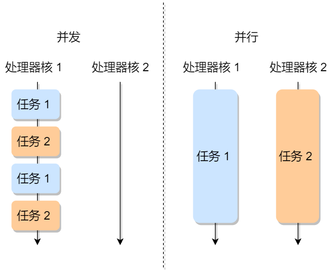
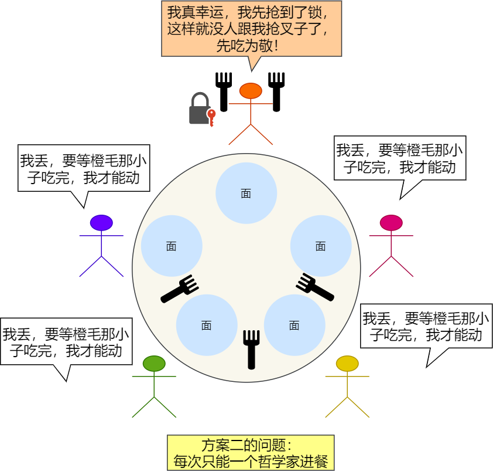
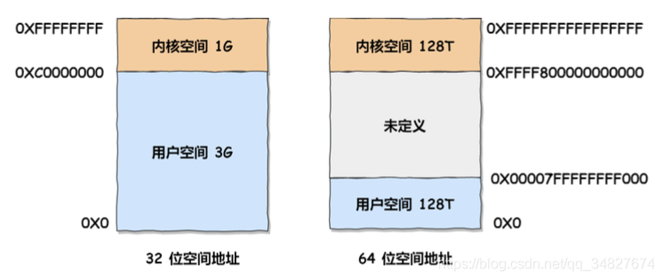
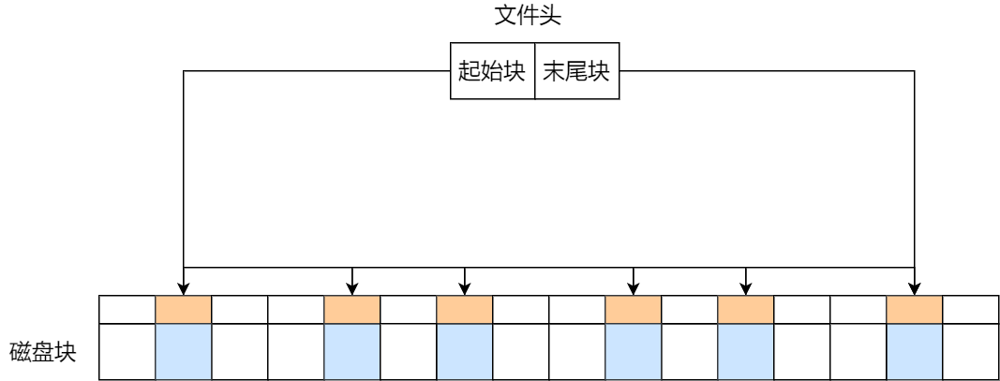
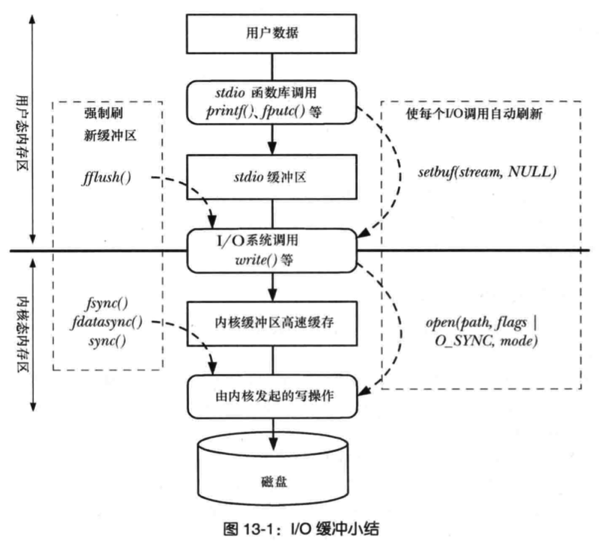
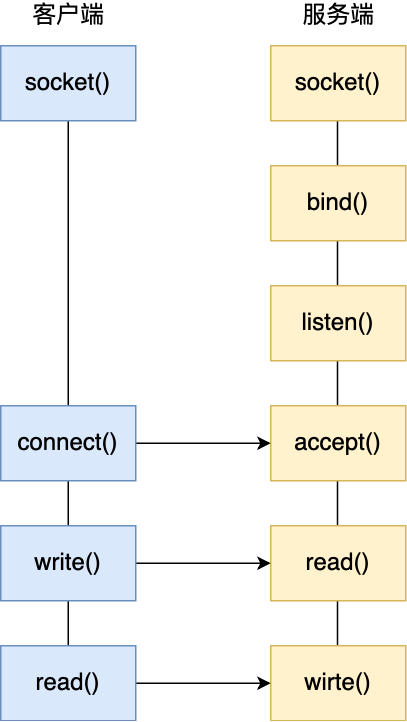
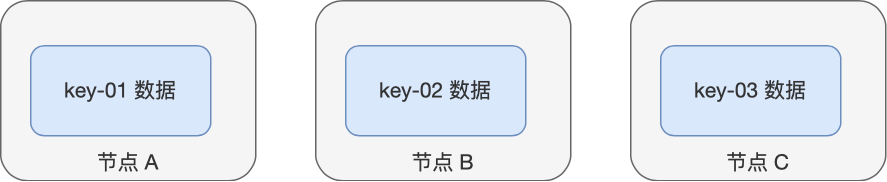
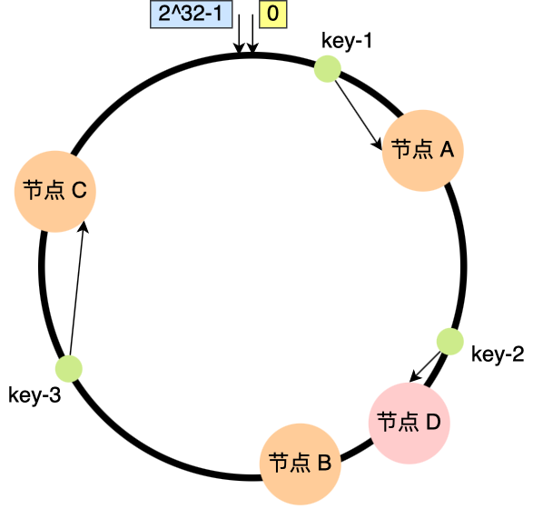
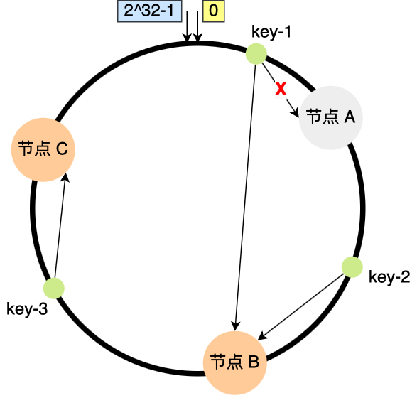

# 进程管理


## 进程、线程基础知识

> 先来看看一则小故事

我们写好的一行行代码，为了让其工作起来，我们还得把它送进城（**进程**）里，那既然进了城里，那肯定不能胡作非为了。

城里人有城里人的规矩，城中有个专门管辖你们的城管（**操作系统**），人家让你休息就休息，让你工作就工作，毕竟摊位不多，每个人都要占这个摊位来工作，城里要工作的人多着去了。

所以城管为了公平起见，它使用一种策略（**调度**）方式，给每个人一个固定的工作时间（**时间片**），时间到了就会通知你去休息而换另外一个人上场工作。

另外，在休息时候你也不能偷懒，要记住工作到哪了，不然下次到你工作了，你忘记工作到哪了，那还怎么继续？

有的人，可能还进入了县城（**线程**）工作，这里相对轻松一些，在休息的时候，要记住的东西相对较少，而且还能共享城里的资源。


### 进程

我们编写的代码只是一个存储在硬盘的静态文件，通过编译后就会生成二进制可执行文件，当我们运行这个可执行文件后，它会被装载到内存中，接着 CPU 会执行程序中的每一条指令，那么这个**运行中的程序，就被称为「进程」（Process）**。

现在我们考虑有一个会读取硬盘文件数据的程序被执行了，那么当运行到读取文件的指令时，就会去从硬盘读取数据，但是硬盘的读写速度是非常慢的，那么在这个时候，如果 CPU 傻傻的等硬盘返回数据的话，那 CPU 的利用率是非常低的。

做个类比，你去煮开水时，你会傻傻的等水壶烧开吗？很明显，小孩也不会傻等。我们可以在水壶烧开之前去做其他事情。当水壶烧开了，我们自然就会听到“嘀嘀嘀”的声音，于是再把烧开的水倒入到水杯里就好了。

所以，当进程要从硬盘读取数据时，CPU 不需要阻塞等待数据的返回，而是去执行另外的进程。当硬盘数据返回时，CPU 会收到个**中断**，于是 CPU 再继续运行这个进程。


这种**多个程序、交替执行**的思想，就有 CPU 管理多个进程的初步想法。

对于一个支持多进程的系统，CPU 会从一个进程快速切换至另一个进程，其间每个进程各运行几十或几百个毫秒。

虽然单核的 CPU 在某一个瞬间，只能运行一个进程。但在 1 秒钟期间，它可能会运行多个进程，这样就产生**并行的错觉**（**同一时间**运行多个进程），实际上这是**并发**（**一个时间段内**运行多个进程）。

> 并发和并行有什么区别？

一图胜千言。



> 进程与程序的关系的类比

到了晚饭时间，一对小情侣肚子都咕咕叫了，于是男生见机行事，就想给女生做晚饭，所以他就在网上找了辣子鸡的菜谱，接着买了一些鸡肉、辣椒、香料等材料，然后边看边学边做这道菜。


突然，女生说她想喝可乐，那么男生只好把做菜的事情暂停一下，并在手机菜谱标记做到哪一个步骤，把状态信息记录了下来。

然后男生听从女生的指令，跑去下楼买了一瓶冰可乐后，又回到厨房继续做菜。

**这体现了，CPU 可以从一个进程（做菜）切换到另外一个进程（买可乐），在切换前必须要记录当前进程中运行的状态信息，以备下次切换回来的时候可以恢复执行。**

所以，可以发现进程有着「**运行 - 暂停 - 运行**」的活动规律。


#### 进程的状态

在上面，我们知道了进程有着「运行 - 暂停 - 运行」的活动规律。一般说来，一个进程并不是自始至终连续不停地运行的，它与并发执行中的其他进程的执行是相互制约的。

它有时处于运行状态，有时又由于某种原因而暂停运行处于等待状态，当使它暂停的原因消失后，它又进入准备运行状态。

所以，**在一个进程的活动期间至少具备三种基本状态，即运行状态、就绪状态、阻塞状态。**


上图中各个状态的意义：

- 运行状态（*Running*）：该时刻进程占用 CPU；
- 就绪状态（*Ready*）：可运行，由于其他进程处于运行状态而暂时停止运行，等待获取CPU；
- 阻塞状态（*Blocked*）：该进程正在等待某一事件发生（如等待输入/输出操作的完成）而暂时停止运行，这时，即使给它CPU控制权，它也无法运行；

当然，进程还有另外两个基本状态：

- 创建状态（*new*）：进程正在被创建时的状态；
- 结束状态（*Exit*）：进程正在从系统中消失时的状态；

于是，一个完整的进程状态的变迁如下图：


再来详细说明一下进程的状态变迁：

- *NULL -> 创建状态*：一个新进程被创建时的第一个状态；
- *创建状态 -> 就绪状态*：当进程被创建完成并初始化后，一切就绪准备运行时，变为就绪状态，这个过程是很快的；
- *就绪态 -> 运行状态*：处于就绪状态的进程被操作系统的进程调度器选中后，就分配给 CPU 正式运行该进程；
- *运行状态 -> 结束状态*：当进程已经运行完成或出错时，会被操作系统作结束状态处理；
- *运行状态 -> 就绪状态*：处于运行状态的进程在运行过程中，由于分配给它的运行时间片用完，操作系统会把该进程变为就绪态，接着从就绪态选中另外一个进程运行；
- *运行状态 -> 阻塞状态*：当进程请求某个事件且必须等待时，例如请求 I/O 事件；
- *阻塞状态 -> 就绪状态*：当进程要等待的事件完成时，它从阻塞状态变到就绪状态；

如果有大量处于阻塞状态的进程，进程可能会占用着物理内存空间，显然不是我们所希望的，毕竟物理内存空间是有限的，被阻塞状态的进程占用着物理内存就一种浪费物理内存的行为。

所以，在虚拟内存管理的操作系统中，通常会把阻塞状态的进程的物理内存空间换出到硬盘，等需要再次运行的时候，再从硬盘换入到物理内存。


那么，就需要一个新的状态，来**描述进程没有占用实际的物理内存空间的情况，这个状态就是挂起状态**。这跟阻塞状态是不一样，阻塞状态是等待某个事件的返回。

另外，挂起状态可以分为两种：

- 阻塞挂起状态：进程在外存（硬盘）并等待某个事件的出现；
- 就绪挂起状态：进程在外存（硬盘），但只要进入内存，即刻立刻运行；

这两种挂起状态加上前面的五种状态，就变成了七种状态变迁（留给我的颜色不多了），见如下图：


导致进程挂起的原因不只是因为进程所使用的内存空间不在物理内存，还包括如下情况：

- 通过 sleep 让进程间歇性挂起，其工作原理是设置一个定时器，到期后唤醒进程。
- 用户希望挂起一个程序的执行，比如在 Linux 中用 `Ctrl+Z` 挂起进程；


#### 进程的控制结构

在操作系统中，是用**进程控制块**（*process control block，PCB*）数据结构来描述进程的。

那 PCB 是什么呢？打开知乎搜索你就会发现这个东西并不是那么简单。


打住打住，我们是个正经的人，怎么会去看那些问题呢？是吧，回来回来。

**PCB 是进程存在的唯一标识**，这意味着一个进程的存在，必然会有一个 PCB，如果进程消失了，那么 PCB 也会随之消失。

> PCB 具体包含什么信息呢？

**进程描述信息：**

- 进程标识符：标识各个进程，每个进程都有一个并且唯一的标识符；
- 用户标识符：进程归属的用户，用户标识符主要为共享和保护服务；

**进程控制和管理信息：**

- 进程当前状态，如 new、ready、running、waiting 或 blocked 等；
- 进程优先级：进程抢占 CPU 时的优先级；

**资源分配清单：**

- 有关内存地址空间或虚拟地址空间的信息，所打开文件的列表和所使用的 I/O 设备信息。

**CPU 相关信息：**

- CPU 中各个寄存器的值，当进程被切换时，CPU 的状态信息都会被保存在相应的 PCB 中，以便进程重新执行时，能从断点处继续执行。

可见，PCB 包含信息还是比较多的。

> 每个 PCB 是如何组织的呢？

通常是通过**链表**的方式进行组织，把具有**相同状态的进程链在一起，组成各种队列**。比如：

- 将所有处于就绪状态的进程链在一起，称为**就绪队列**；
- 把所有因等待某事件而处于等待状态的进程链在一起就组成各种**阻塞队列**；
- 另外，对于运行队列在单核 CPU 系统中则只有一个运行指针了，因为单核 CPU 在某个时间，只能运行一个程序。

那么，就绪队列和阻塞队列链表的组织形式如下图：


除了链接的组织方式，还有索引方式，它的工作原理：将同一状态的进程组织在一个索引表中，索引表项指向相应的 PCB，不同状态对应不同的索引表。

一般会选择链表，因为可能面临进程创建，销毁等调度导致进程状态发生变化，所以链表能够更加灵活的插入和删除。


#### 进程的控制

我们熟知了进程的状态变迁和进程的数据结构 PCB 后，再来看看进程的**创建、终止、阻塞、唤醒**的过程，这些过程也就是进程的控制。

**01 创建进程**

操作系统允许一个进程创建另一个进程，而且允许子进程继承父进程所拥有的资源。

创建进程的过程如下：

- 申请一个空白的 PCB，并向 PCB 中填写一些控制和管理进程的信息，比如进程的唯一标识等；
- 为该进程分配运行时所必需的资源，比如内存资源；
- 将 PCB 插入到就绪队列，等待被调度运行；

**02 终止进程**

进程可以有 3 种终止方式：正常结束、异常结束以及外界干预（信号 `kill` 掉）。

当子进程被终止时，其在父进程处继承的资源应当还给父进程。而当父进程被终止时，该父进程的子进程就变为孤儿进程，会被 1 号进程收养，并由 1 号进程对它们完成状态收集工作。

终止进程的过程如下：

- 查找需要终止的进程的 PCB；
- 如果处于执行状态，则立即终止该进程的执行，然后将 CPU 资源分配给其他进程；
- 如果其还有子进程，则应将该进程的子进程交给 1 号进程接管；
- 将该进程所拥有的全部资源都归还给操作系统；
- 将其从 PCB 所在队列中删除；

**03 阻塞进程**

当进程需要等待某一事件完成时，它可以调用阻塞语句把自己阻塞等待。而一旦被阻塞等待，它只能由另一个进程唤醒。

阻塞进程的过程如下：

- 找到将要被阻塞进程标识号对应的 PCB；
- 如果该进程为运行状态，则保护其现场，将其状态转为阻塞状态，停止运行；
- 将该 PCB 插入到阻塞队列中去；

**04 唤醒进程**

进程由「运行」转变为「阻塞」状态是由于进程必须等待某一事件的完成，**所以处于阻塞状态的进程是绝对不可能叫醒自己的。**

如果某进程正在等待 I/O 事件，需由别的进程发消息给它，则只有当该进程所期待的事件出现时，才由发现者进程用唤醒语句叫醒它。

唤醒进程的过程如下：

- 在该事件的阻塞队列中找到相应进程的 PCB；
- 将其从阻塞队列中移出，并置其状态为就绪状态；
- 把该 PCB 插入到就绪队列中，等待调度程序调度；

进程的阻塞和唤醒是一对功能相反的语句，如果某个进程调用了阻塞语句，则必有一个与之对应的唤醒语句。


#### 进程的上下文切换

各个进程之间是共享 CPU 资源的，在不同的时候进程之间需要切换，让不同的进程可以在 CPU 执行，那么这个**一个进程切换到另一个进程运行，称为进程的上下文切换**。

> 在详细说进程上下文切换前，我们先来看看 CPU 上下文切换

大多数操作系统都是多任务，通常支持大于 CPU 数量的任务同时运行。实际上，这些任务并不是同时运行的，只是因为系统在很短的时间内，让各个任务分别在 CPU 运行，于是就造成同时运行的错觉。

任务是交给 CPU 运行的，那么在每个任务运行前，CPU 需要知道任务从哪里加载，又从哪里开始运行。

所以，操作系统需要事先帮 CPU 设置好 **CPU 寄存器和程序计数器**。

CPU 寄存器是 CPU 内部一个容量小，但是速度极快的内存（缓存）。我举个例子，寄存器像是你的口袋，内存像你的书包，硬盘则是你家里的柜子，如果你的东西存放到口袋，那肯定是比你从书包或家里柜子取出来要快的多。

再来，程序计数器则是用来存储 CPU 正在执行的指令位置、或者即将执行的下一条指令位置。

<u>所以说，CPU 寄存器和程序计数是 CPU 在运行任何任务前，所必须依赖的环境，这些环境就叫做 **CPU 上下文**。</u>

既然知道了什么是 CPU 上下文，那理解 CPU 上下文切换就不难了。

CPU 上下文切换就是先把前一个任务的 CPU 上下文（CPU 寄存器和程序计数器）保存起来，然后加载新任务的上下文到这些寄存器和程序计数器，最后再跳转到程序计数器所指的新位置，运行新任务。

系统内核会存储保持下来的上下文信息，当此任务再次被分配给 CPU 运行时，CPU 会重新加载这些上下文，这样就能保证任务原来的状态不受影响，让任务看起来还是连续运行。

上面说到所谓的「任务」，主要包含进程、线程和中断。所以，可以根据任务的不同，把 CPU 上下文切换分成：**进程上下文切换、线程上下文切换和中断上下文切换**。

> 进程的上下文切换到底是切换什么呢？

进程是由内核管理和调度的，所以进程的切换只能发生在内核态。

所以，**进程的上下文切换不仅包含了虚拟内存、栈、全局变量等用户空间的资源，还包括了内核堆栈、寄存器等内核空间的资源。**

通常，会把交换的信息保存在进程的 PCB，当要运行另外一个进程的时候，我们需要从这个进程的 PCB 取出上下文，然后恢复到 CPU 中，这使得这个进程可以继续执行，如下图所示：


大家需要注意，进程的上下文开销是很关键的，我们希望它的开销越小越好，这样可以使得进程可以把更多时间花费在执行程序上，而不是耗费在上下文切换。

> 发生进程上下文切换有哪些场景？

- 为了保证所有进程可以得到公平调度，CPU 时间被划分为一段段的时间片，这些时间片再被轮流分配给各个进程。这样，当某个进程的时间片耗尽了，进程就从运行状态变为就绪状态，系统从就绪队列选择另外一个进程运行；
- 进程在系统资源不足（比如内存不足）时，要等到资源满足后才可以运行，这个时候进程也会被挂起，并由系统调度其他进程运行；
- 当进程通过睡眠函数 sleep 这样的方法将自己主动挂起时，自然也会重新调度；
- 当有优先级更高的进程运行时，为了保证高优先级进程的运行，当前进程会被挂起，由高优先级进程来运行；
- 发生硬件中断时，CPU 上的进程会被中断挂起，转而执行内核中的中断服务程序；

以上，就是发生进程上下文切换的常见场景了。


### 线程

在早期的操作系统中都是以进程作为独立运行的基本单位，直到后面，计算机科学家们又提出了更小的能独立运行的基本单位，也就是**线程。**


#### 为什么使用线程？

我们举个例子，假设你要编写一个视频播放器软件，那么该软件功能的核心模块有三个：

- 从视频文件当中读取数据；
- 对读取的数据进行解压缩；
- 把解压缩后的视频数据播放出来；

对于单进程的实现方式，我想大家都会是以下这个方式：


对于单进程的这种方式，存在以下问题：

- 播放出来的画面和声音会不连贯，因为当 CPU 能力不够强的时候，`Read` 的时候可能进程就等在这了，这样就会导致等半天才进行数据解压和播放；
- 各个函数之间不是并发执行，影响资源的使用效率；

那改进成多进程的方式：


对于多进程的这种方式，依然会存在问题：

- 进程之间如何通信，共享数据？
- 维护进程的系统开销较大，如创建进程时，分配资源、建立 PCB；终止进程时，回收资源、撤销 PCB；进程切换时，保存当前进程的状态信息；

那到底如何解决呢？需要有一种新的实体，满足以下特性：

- 实体之间可以并发运行；
- 实体之间共享相同的地址空间；

这个新的实体，就是**线程( Thread )**，线程之间可以并发运行且共享相同的地址空间。


#### 什么是线程？

**线程是进程当中的一条执行流程。**

同一个进程内多个线程之间可以共享代码段、数据段、打开的文件等资源，但每个线程各自都有一套独立的寄存器和栈，这样可以确保线程的控制流是相对独立的。


> 线程的优缺点？

线程的优点：

- 一个进程中可以同时存在多个线程；
- 各个线程之间可以并发执行；
- 各个线程之间可以共享地址空间和文件等资源；

线程的缺点：

- 当进程中的一个线程崩溃时，会导致其所属进程的所有线程崩溃（这里是针对 C/C++ 语言，Java语言中的线程奔溃不会造成进程崩溃，具体分析原因可以看这篇：[线程崩溃了，进程也会崩溃吗？ (opens new window)](https://xiaolincoding.com/os/4_process/thread_crash.html)）。

举个例子，对于游戏的用户设计，则不应该使用多线程的方式，否则一个用户挂了，会影响其他同个进程的线程。


#### 线程与进程的比较

线程与进程的比较如下：

- 进程是**资源（包括内存、打开的文件等）分配的单位**，**线程是 CPU 调度的单位；**
- 进程拥有一个完整的资源平台，而线程只独享必不可少的资源，如寄存器和栈；
- 线程同样具有就绪、阻塞、执行三种基本状态，同样具有状态之间的转换关系；
- 线程能减少并发执行的时间和空间开销；

对于，线程相比进程能减少开销，体现在：

- 线程的创建时间比进程快，因为进程在创建的过程中，还需要资源管理信息，比如内存管理信息、文件管理信息，而线程在创建的过程中，不会涉及这些资源管理信息，而是共享它们；
- 线程的终止时间比进程快，因为线程释放的资源相比进程少很多；
- 同一个进程内的线程切换比进程切换快，因为线程具有相同的地址空间（虚拟内存共享），这意味着同一个进程的线程都具有同一个页表，那么在切换的时候不需要切换页表。而对于进程之间的切换，切换的时候要把页表给切换掉，而页表的切换过程开销是比较大的；
- 由于同一进程的各线程间共享内存和文件资源，那么在线程之间数据传递的时候，就不需要经过内核了，这就使得线程之间的数据交互效率更高了；

所以，不管是时间效率，还是空间效率线程比进程都要高。


#### 线程的上下文切换

在前面我们知道了，线程与进程最大的区别在于：**线程是调度的基本单位，而进程则是资源拥有的基本单位**。

所以，所谓操作系统的任务调度，实际上的调度对象是线程，而进程只是给线程提供了虚拟内存、全局变量等资源。

对于线程和进程，我们可以这么理解：

- 当进程只有一个线程时，可以认为进程就等于线程；
- 当进程拥有多个线程时，这些线程会共享相同的虚拟内存和全局变量等资源，这些资源在上下文切换时是不需要修改的；

另外，线程也有自己的私有数据，比如栈和寄存器等，这些在上下文切换时也是需要保存的。

> 线程上下文切换的是什么？

这还得看线程是不是属于同一个进程：

- 当两个线程不是属于同一个进程，则切换的过程就跟进程上下文切换一样；
- **当两个线程是属于同一个进程，因为虚拟内存是共享的，所以在切换时，虚拟内存这些资源就保持不动，只需要切换线程的私有数据、寄存器等不共享的数据**；

所以，线程的上下文切换相比进程，开销要小很多。


#### 线程的实现

主要有三种线程的实现方式：

- **用户线程（User Thread）**：在用户空间实现的线程，不是由内核管理的线程，是由用户态的线程库来完成线程的管理；
- **内核线程（Kernel Thread）**：在内核中实现的线程，是由内核管理的线程；
- **轻量级进程（LightWeight Process）**：在内核中来支持用户线程；

那么，这还需要考虑一个问题，用户线程和内核线程的对应关系。

首先，第一种关系是**多对一**的关系，也就是多个用户线程对应同一个内核线程：


第二种是**一对一**的关系，也就是一个用户线程对应一个内核线程：


第三种是**多对多**的关系，也就是多个用户线程对应到多个内核线程：


> 用户线程如何理解？存在什么优势和缺陷？

用户线程是基于用户态的线程管理库来实现的，那么**线程控制块（Thread Control Block, TCB）** 也是在库里面来实现的，对于操作系统而言是看不到这个 TCB 的，它只能看到整个进程的 PCB。

所以，**用户线程的整个线程管理和调度，操作系统是不直接参与的，而是由用户级线程库函数来完成线程的管理，包括线程的创建、终止、同步和调度等。**

用户级线程的模型，也就类似前面提到的**多对一**的关系，即多个用户线程对应同一个内核线程，如下图所示：


用户线程的**优点**：

- 每个进程都需要有它私有的线程控制块（TCB）列表，用来跟踪记录它各个线程状态信息（PC、栈指针、寄存器），TCB 由用户级线程库函数来维护，可用于不支持线程技术的操作系统；
- 用户线程的切换也是由线程库函数来完成的，无需用户态与内核态的切换，所以速度特别快；

用户线程的**缺点**：

- 由于操作系统不参与线程的调度，如果一个线程发起了系统调用而阻塞，那进程所包含的用户线程都不能执行了。
- 当一个线程开始运行后，除非它主动地交出 CPU 的使用权，否则它所在的进程当中的其他线程无法运行，因为用户态的线程没法打断当前运行中的线程，它没有这个特权，只有操作系统才有，但是用户线程不是由操作系统管理的。
- 由于时间片分配给进程，故与其他进程比，在多线程执行时，每个线程得到的时间片较少，执行会比较慢；

以上，就是用户线程的优缺点了。

> 那内核线程如何理解？存在什么优势和缺陷？

**内核线程是由操作系统管理的，线程对应的 TCB 自然是放在操作系统里的，这样线程的创建、终止和管理都是由操作系统负责。**

内核线程的模型，也就类似前面提到的**一对一**的关系，即一个用户线程对应一个内核线程，如下图所示：


内核线程的**优点**：

- 在一个进程当中，如果某个内核线程发起系统调用而被阻塞，并不会影响其他内核线程的运行；
- 分配给线程，多线程的进程获得更多的 CPU 运行时间；

内核线程的**缺点**：

- 在支持内核线程的操作系统中，由内核来维护进程和线程的上下文信息，如 PCB 和 TCB；
- 线程的创建、终止和切换都是通过系统调用的方式来进行，因此对于系统来说，系统开销比较大；

以上，就是内核线程的优缺点了。

> 最后的轻量级进程如何理解？

**轻量级进程（Light-weight process，LWP）是内核支持的用户线程，一个进程可有一个或多个 LWP，每个 LWP 是跟内核线程一对一映射的，也就是 LWP 都是由一个内核线程支持，而且 LWP 是由内核管理并像普通进程一样被调度**。

在大多数系统中，**LWP与普通进程的区别也在于它只有一个最小的执行上下文和调度程序所需的统计信息**。一般来说，一个进程代表程序的一个实例，而 LWP 代表程序的执行线程，因为一个执行线程不像进程那样需要那么多状态信息，所以 LWP 也不带有这样的信息。

在 LWP 之上也是可以使用用户线程的，那么 LWP 与用户线程的对应关系就有三种：

- `1 : 1`，即一个 LWP 对应 一个用户线程；
- `N : 1`，即一个 LWP 对应多个用户线程；
- `M : N`，即多个 LWP 对应多个用户线程；

接下来针对上面这三种对应关系说明它们优缺点。先看下图的 LWP 模型：


**1 : 1 模式**

一个线程对应到一个 LWP 再对应到一个内核线程，如上图的进程 4，属于此模型。

- 优点：实现并行，当一个 LWP 阻塞，不会影响其他 LWP；
- 缺点：每一个用户线程，就产生一个内核线程，创建线程的开销较大。

**N : 1 模式**

多个用户线程对应一个 LWP 再对应一个内核线程，如上图的进程 2，线程管理是在用户空间完成的，此模式中用户的线程对操作系统不可见。

- 优点：用户线程要开几个都没问题，且上下文切换发生用户空间，切换的效率较高；
- 缺点：一个用户线程如果阻塞了，则整个进程都将会阻塞，另外在多核 CPU 中，是没办法充分利用 CPU 的。

**M : N 模式**

根据前面的两个模型混搭一起，就形成 `M:N` 模型，该模型提供了两级控制，首先多个用户线程对应到多个 LWP，LWP 再一一对应到内核线程，如上图的进程 3。

- 优点：综合了前两种优点，大部分的线程上下文发生在用户空间，且多个线程又可以充分利用多核 CPU 的资源。

**组合模式**

如上图的进程 5，此进程结合 `1:1` 模型和 `M:N` 模型。开发人员可以针对不同的应用特点调节内核线程的数目来达到物理并行性和逻辑并行性的最佳方案。


### 调度

进程都希望自己能够占用 CPU 进行工作，那么这涉及到前面说过的进程上下文切换。

一旦操作系统把进程切换到运行状态，也就意味着该进程占用着 CPU 在执行，但是当操作系统把进程切换到其他状态时，那就不能在 CPU 中执行了，于是操作系统会选择下一个要运行的进程。

选择一个进程运行这一功能是在操作系统中完成的，通常称为**调度程序**（*scheduler*）。

那到底什么时候调度进程，或以什么原则来调度进程呢？

**TIP**

我知道很多人会问，线程不是操作系统的调度单位吗？为什么这里参与调度的是进程？

先提前说明，这里的进程指只有主线程的进程，所以调度主线程就等于调度了整个进程。

那为什么干脆不直接取名线程调度？主要是操作系统相关书籍，都是用进程调度这个名字，所以我也沿用了这个名字。


#### 调度时机

在进程的生命周期中，当进程从一个运行状态到另外一状态变化的时候，其实会触发一次调度。

比如，以下状态的变化都会触发操作系统的调度：

- *从就绪态 -> 运行态*：当进程被创建时，会进入到就绪队列，操作系统会从就绪队列选择一个进程运行；
- *从运行态 -> 阻塞态*：当进程发生 I/O 事件而阻塞时，操作系统必须选择另外一个进程运行；
- *从运行态 -> 结束态*：当进程退出结束后，操作系统得从就绪队列选择另外一个进程运行；

因为，这些状态变化的时候，操作系统需要考虑是否要让新的进程给 CPU 运行，或者是否让当前进程从 CPU 上退出来而换另一个进程运行。

另外，如果硬件时钟提供某个频率的周期性中断，那么可以根据如何处理时钟中断 ，把调度算法分为两类：

- **非抢占式调度算法**挑选一个进程，然后让该进程运行直到被阻塞，或者直到该进程退出，才会调用另外一个进程，也就是说不会理时钟中断这个事情。
- **抢占式调度算法**挑选一个进程，然后让该进程只运行某段时间，如果在该时段结束时，该进程仍然在运行时，则会把它挂起，接着调度程序从就绪队列挑选另外一个进程。这种抢占式调度处理，需要在时间间隔的末端发生**时钟中断**，以便把 CPU 控制返回给调度程序进行调度，也就是常说的**时间片机制**。


#### 调度原则

*原则一*：如果运行的程序，发生了 **I/O 事件的请求**，那 CPU 使用率必然会很低，因为此时进程在阻塞等待硬盘的数据返回。这样的过程，势必会造成 CPU 突然的空闲。所以，**为了提高 CPU 利用率，在这种发送 I/O 事件致使 CPU 空闲的情况下，调度程序需要从就绪队列中选择一个进程来运行。**

*原则二*：有的程序执行某个任务花费的时间会比较长，如果这个程序一直占用着 CPU，会造成系统吞吐量（CPU 在单位时间内完成的进程数量）的降低。所以，**要提高系统的吞吐率，调度程序要权衡长任务和短任务进程的运行完成数量。**

*原则三*：从进程开始到结束的过程中，实际上是包含两个时间，分别是进程运行时间和进程等待时间，这两个时间总和就称为周转时间。进程的周转时间越小越好，**如果进程的等待时间很长而运行时间很短，那周转时间就很长，这不是我们所期望的，调度程序应该避免这种情况发生。**

*原则四*：处于就绪队列的进程，也不能等太久，当然希望这个等待的时间越短越好，这样可以使得进程更快的在 CPU 中执行。所以，**就绪队列中进程的等待时间也是调度程序所需要考虑的原则。**

*原则五*：对于鼠标、键盘这种交互式比较强的应用，我们当然希望它的响应时间越快越好，否则就会影响用户体验了。所以，**对于交互式比较强的应用，响应时间也是调度程序需要考虑的原则。**


针对上面的五种调度原则，总结成如下：

- **CPU 利用率**：调度程序应确保 CPU 是始终匆忙的状态，这可提高 CPU 的利用率；
- **系统吞吐量**：吞吐量表示的是单位时间内 CPU 完成进程的数量，长作业的进程会占用较长的 CPU 资源，因此会降低吞吐量，相反，短作业的进程会提升系统吞吐量；
- **周转时间**：周转时间是进程运行+阻塞时间+等待时间的总和，一个进程的周转时间越小越好；
- **等待时间**：这个等待时间不是阻塞状态的时间，而是进程处于就绪队列的时间，等待的时间越长，用户越不满意；
- **响应时间**：用户提交请求到系统第一次产生响应所花费的时间，在交互式系统中，响应时间是衡量调度算法好坏的主要标准。

说白了，这么多调度原则，目的就是要使得进程要「快」。


#### 调度算法

不同的调度算法适用的场景也是不同的。

接下来，说说在**单核 CPU 系统**中常见的调度算法。

> 01 先来先服务调度算法

最简单的一个调度算法，就是非抢占式的**先来先服务（First Come First Serve, FCFS）算法**了。


顾名思义，先来后到，**每次从就绪队列选择最先进入队列的进程，然后一直运行，直到进程退出或被阻塞，才会继续从队列中选择第一个进程接着运行。**

这似乎很公平，但是当一个长作业先运行了，那么后面的短作业等待的时间就会很长，不利于短作业。

**FCFS 对长作业有利，适用于 CPU 繁忙型作业的系统，而不适用于 I/O 繁忙型作业的系统。**


> 02 最短作业优先调度算法

**最短作业优先（Shortest Job First, SJF）调度算法**同样也是顾名思义，它会**优先选择运行时间最短的进程来运行**，这有助于提高系统的吞吐量。


这显然对长作业不利，很容易造成一种极端现象。

比如，一个长作业在就绪队列等待运行，而这个就绪队列有非常多的短作业，那么就会使得长作业不断的往后推，周转时间变长，致使长作业长期不会被运行。


> 03 高响应比优先调度算法

前面的「先来先服务调度算法」和「最短作业优先调度算法」都没有很好的权衡短作业和长作业。

那么，**高响应比优先 （Highest Response Ratio Next, HRRN）调度算法**主要是权衡了短作业和长作业。

**每次进行进程调度时，先计算「响应比优先级」，然后把「响应比优先级」最高的进程投入运行**，「响应比优先级」的计算公式：


从上面的公式，可以发现：

- 如果两个进程的「等待时间」相同时，「要求的服务时间」越短，「响应比」就越高，这样短作业的进程容易被选中运行；
- 如果两个进程「要求的服务时间」相同时，「等待时间」越长，「响应比」就越高，这就兼顾到了长作业进程，因为进程的响应比可以随时间等待的增加而提高，当其等待时间足够长时，其响应比便可以升到很高，从而获得运行的机会；

TIP

很多人问怎么才能知道一个进程要求服务的时间？这不是不可预知的吗？

对的，这是不可预估的。所以，高响应比优先调度算法是「理想型」的调度算法，现实中是实现不了的。


> 04 时间片轮转调度算法

最古老、最简单、最公平且使用最广的算法就是**时间片轮转（Round Robin, RR）调度算法**。


**每个进程被分配一个时间段，称为时间片（\*Quantum\*），即允许该进程在该时间段中运行。**

- 如果时间片用完，进程还在运行，那么将会把此进程从 CPU 释放出来，并把 CPU 分配给另外一个进程；
- 如果该进程在时间片结束前阻塞或结束，则 CPU 立即进行切换；

另外，时间片的长度就是一个很关键的点：

- 如果时间片设得太短会导致过多的进程上下文切换，降低了 CPU 效率；
- 如果设得太长又可能引起对短作业进程的响应时间变长。

一般来说，时间片设为 `20ms~50ms` 通常是一个比较合理的折中值。


> 05 最高优先级调度算法

前面的「时间片轮转算法」做了个假设，即让所有的进程同等重要，也不偏袒谁，大家的运行时间都一样。

但是，对于多用户计算机系统就有不同的看法了，它们希望调度是有优先级的，即希望调度程序能**从就绪队列中选择最高优先级的进程进行运行，这称为最高优先级（\*Highest Priority First，HPF\*）调度算法**。

进程的优先级可以分为，静态优先级和动态优先级：

- 静态优先级：创建进程时候，就已经确定了优先级了，然后整个运行时间优先级都不会变化；
- 动态优先级：根据进程的动态变化调整优先级，比如如果进程运行时间增加，则降低其优先级，如果进程等待时间（就绪队列的等待时间）增加，则升高其优先级，也就是**随着时间的推移增加等待进程的优先级**。

该算法也有两种处理优先级高的方法，非抢占式和抢占式：

- 非抢占式：当就绪队列中出现优先级高的进程，运行完当前进程，再选择优先级高的进程。
- 抢占式：当就绪队列中出现优先级高的进程，当前进程挂起，调度优先级高的进程运行。

但是依然有缺点，可能会导致低优先级的进程永远不会运行。


> 06 多级反馈队列调度算法

**多级反馈队列（\*Multilevel Feedback Queue\*）调度算法**是「时间片轮转算法」和「最高优先级算法」的综合和发展。

顾名思义：

- 「多级」表示有多个队列，每个队列优先级从高到低，同时优先级越高时间片越短。
- 「反馈」表示如果有新的进程加入优先级高的队列时，立刻停止当前正在运行的进程，转而去运行优先级高的队列；


来看看，它是如何工作的：

- 设置了多个队列，赋予每个队列不同的优先级，每个**队列优先级从高到低**，同时**优先级越高时间片越短**；
- 新的进程会被放入到第一级队列的末尾，按先来先服务的原则排队等待被调度，如果在第一级队列规定的时间片没运行完成，则将其转入到第二级队列的末尾，以此类推，直至完成；
- 当较高优先级的队列为空，才调度较低优先级的队列中的进程运行。如果进程运行时，有新进程进入较高优先级的队列，则停止当前运行的进程并将其移入到原队列末尾，接着让较高优先级的进程运行；

可以发现，对于短作业可能可以在第一级队列很快被处理完。对于长作业，如果在第一级队列处理不完，可以移入下次队列等待被执行，虽然等待的时间变长了，但是运行时间也变更长了，所以该算法很好的**兼顾了长短作业，同时有较好的响应时间。**

> 看的迷迷糊糊？那我拿去银行办业务的例子，把上面的调度算法串起来，你还不懂，你锤我！


**办理业务的客户相当于进程，银行窗口工作人员相当于 CPU。**

现在，假设这个银行只有一个窗口（单核 CPU ），那么工作人员一次只能处理一个业务。


那么最简单的处理方式，就是先来的先处理，后面来的就乖乖排队，这就是**先来先服务（\*FCFS\*）调度算法**。但是万一先来的这位老哥是来贷款的，这一谈就好几个小时，一直占用着窗口，这样后面的人只能干等，或许后面的人只是想简单的取个钱，几分钟就能搞定，却因为前面老哥办长业务而要等几个小时，你说气不气人？


有客户抱怨了，那我们就要改进，我们干脆优先给那些几分钟就能搞定的人办理业务，这就是**短作业优先（\*SJF\*）调度算法**。听起来不错，但是依然还是有个极端情况，万一办理短业务的人非常的多，这会导致长业务的人一直得不到服务，万一这个长业务是个大客户，那不就捡了芝麻丢了西瓜


那就公平起见，现在窗口工作人员规定，每个人我只处理 10 分钟。如果 10 分钟之内处理完，就马上换下一个人。如果没处理完，依然换下一个人，但是客户自己得记住办理到哪个步骤了。这个也就是**时间片轮转（\*RR\*）调度算法**。但是如果时间片设置过短，那么就会造成大量的上下文切换，增大了系统开销。如果时间片过长，相当于退化成 FCFS 算法了。


既然公平也可能存在问题，那银行就对客户分等级，分为普通客户、VIP 客户、SVIP 客户。只要高优先级的客户一来，就第一时间处理这个客户，这就是**最高优先级（\*HPF\*）调度算法**。但依然也会有极端的问题，万一当天来的全是高级客户，那普通客户不是没有被服务的机会，不把普通客户当人是吗？那我们把优先级改成动态的，如果客户办理业务时间增加，则降低其优先级，如果客户等待时间增加，则升高其优先级。


那有没有兼顾到公平和效率的方式呢？这里介绍一种算法，考虑的还算充分的，**多级反馈队列（\*MFQ\*）调度算法**，它是时间片轮转算法和优先级算法的综合和发展。它的工作方式：


- 银行设置了多个排队（就绪）队列，每个队列都有不同的优先级，**各个队列优先级从高到低**，同时每个队列执行时间片的长度也不同，**优先级越高的时间片越短**。
- 新客户（进程）来了，先进入第一级队列的末尾，按先来先服务原则排队等待被叫号（运行）。如果时间片用完客户的业务还没办理完成，则让客户进入到下一级队列的末尾，以此类推，直至客户业务办理完成。
- 当第一级队列没人排队时，就会叫号二级队列的客户。如果客户办理业务过程中，有新的客户加入到较高优先级的队列，那么此时办理中的客户需要停止办理，回到原队列的末尾等待再次叫号，因为要把窗口让给刚进入较高优先级队列的客户。

可以发现，对于要办理短业务的客户来说，可以很快的轮到并解决。对于要办理长业务的客户，一下子解决不了，就可以放到下一个队列，虽然等待的时间稍微变长了，但是轮到自己的办理时间也变长了，也可以接受，不会造成极端的现象，可以说是综合上面几种算法的优点


## 进程间有哪些通信方式？


每个进程的用户地址空间都是独立的，一般而言是不能互相访问的，但内核空间是每个进程都共享的，所以进程之间要通信必须通过内核。


Linux 内核提供了不少进程间通信的机制，我们来一起瞧瞧有哪些？


### 管道

如果你学过 Linux 命令，那你肯定很熟悉「`|`」这个竖线。

```bash
$ ps auxf | grep mysql
```

上面命令行里的「`|`」竖线就是一个**管道**，它的功能是将前一个命令（`ps auxf`）的输出，作为后一个命令（`grep mysql`）的输入，从这功能描述，可以看出**管道传输数据是单向的**，如果想相互通信，我们需要创建两个管道才行。

同时，我们得知上面这种管道是没有名字，所以「`|`」表示的管道称为**匿名管道**，用完了就销毁。

管道还有另外一个类型是**命名管道**，也被叫做 `FIFO`，因为数据是先进先出的传输方式。

在使用命名管道前，先需要通过 `mkfifo` 命令来创建，并且指定管道名字：

```bash
$ mkfifo myPipe
```

myPipe 就是这个管道的名称，基于 Linux 一切皆文件的理念，所以管道也是以文件的方式存在，我们可以用 ls 看一下，这个文件的类型是 p，也就是 pipe（管道） 的意思：

```bash
$ ls -l
prw-r--r--. 1 root    root         0 Jul 17 02:45 myPipe
```

接下来，我们往 myPipe 这个管道写入数据：

```bash
$ echo "hello" > myPipe  // 将数据写进管道
                         // 停住了 ...
```

你操作了后，你会发现命令执行后就停在这了，这是因为管道里的内容没有被读取，只有当管道里的数据被读完后，命令才可以正常退出。

于是，我们执行另外一个命令来读取这个管道里的数据：

```bash
$ cat < myPipe  // 读取管道里的数据
hello
```

可以看到，管道里的内容被读取出来了，并打印在了终端上，另外一方面，echo 那个命令也正常退出了。

我们可以看出，**管道这种通信方式效率低，不适合进程间频繁地交换数据**（会阻塞）。当然，它的好处，自然就是简单，同时也我们很容易得知管道里的数据已经被另一个进程读取了。

> 那管道如何创建呢，背后原理是什么？

匿名管道的创建，需要通过下面这个系统调用：

```c
int pipe(int fd[2])
```

这里表示创建一个匿名管道，并返回了两个描述符，一个是管道的读取端描述符 `fd[0]`，另一个是管道的写入端描述符 `fd[1]`。注意，这个匿名管道是特殊的文件，只存在于内存，不存于文件系统中。


其实，**所谓的管道，就是内核里面的一串缓存**。从管道的一段写入的数据，实际上是缓存在内核中的，另一端读取，也就是从内核中读取这段数据。另外，管道传输的数据是无格式的流且大小受限。

看到这，你可能会有疑问了，这两个描述符都是在一个进程里面，并没有起到进程间通信的作用，怎么样才能使得管道是跨过两个进程的呢？

我们可以使用 `fork` 创建子进程，**创建的子进程会复制父进程的文件描述符**，这样就做到了两个进程各有两个「 `fd[0]` 与 `fd[1]`」，两个进程就可以通过各自的 fd 写入和读取同一个管道文件实现跨进程通信了。


管道只能一端写入，另一端读出，所以上面这种模式容易造成混乱，因为父进程和子进程都可以同时写入，也都可以读出。那么，为了避免这种情况，通常的做法是：

- 父进程关闭读取的 fd[0]，只保留写入的 fd[1]；
- 子进程关闭写入的 fd[1]，只保留读取的 fd[0]；


所以说如果需要双向通信，则应该创建两个管道。

到这里，我们仅仅解析了使用管道进行父进程与子进程之间的通信，但是在我们 shell 里面并不是这样的。

在 shell 里面执行 `A | B`命令的时候，A 进程和 B 进程都是 shell 创建出来的子进程，A 和 B 之间不存在父子关系，它俩的父进程都是 shell。


所以说，在 shell 里通过「`|`」匿名管道将多个命令连接在一起，实际上也就是创建了多个子进程，那么在我们编写 shell 脚本时，能使用一个管道搞定的事情，就不要多用一个管道，这样可以减少创建子进程的系统开销。

我们可以得知，**对于匿名管道，它的通信范围是存在父子关系的进程**。因为管道没有实体，也就是没有管道文件，只能通过 fork 来复制父进程 fd 文件描述符，来达到通信的目的。

另外，**对于命名管道，它可以在不相关的进程间也能相互通信**。因为命令管道，提前创建了一个类型为管道的设备文件，在进程里只要使用这个设备文件，就可以相互通信。

不管是匿名管道还是命名管道，进程写入的数据都是缓存在内核中，另一个进程读取数据时候自然也是从内核中获取，同时通信数据都遵循**先进先出**原则，不支持 lseek 之类的文件定位操作。


### 消息队列

前面说到管道的通信方式是效率低的，因此管道不适合进程间频繁地交换数据。

对于这个问题，**消息队列**的通信模式就可以解决。比如，A 进程要给 B 进程发送消息，A 进程把数据放在对应的消息队列后就可以正常返回了，B 进程需要的时候再去读取数据就可以了。同理，B 进程要给 A 进程发送消息也是如此。

再来，**消息队列是保存在内核中的消息链表**，在发送数据时，会分成一个一个独立的数据单元，也就是消息体（数据块），消息体是用户自定义的数据类型，消息的发送方和接收方要约定好消息体的数据类型，所以每个消息体都是固定大小的存储块，不像管道是无格式的字节流数据。如果进程从消息队列中读取了消息体，内核就会把这个消息体删除。

**消息队列生命周期随内核**，如果没有释放消息队列或者没有关闭操作系统，消息队列会一直存在，**而前面提到的匿名管道的生命周期，是随进程的创建而建立**，随进程的结束而销毁。

消息这种模型，两个进程之间的通信就像平时发邮件一样，你来一封，我回一封，可以频繁沟通了。

但邮件的通信方式存在不足的地方有两点，**一是通信不及时，二是附件也有大小限制**，这同样也是消息队列通信不足的点。

**消息队列不适合比较大数据的传输**，因为在内核中每个消息体都有一个最大长度的限制，同时所有队列所包含的全部消息体的总长度也是有上限。在 Linux 内核中，会有两个宏定义 `MSGMAX` 和 `MSGMNB`，它们以字节为单位，分别定义了一条消息的最大长度和一个队列的最大长度。

**消息队列通信过程中，存在用户态与内核态之间的数据拷贝开销**，因为进程写入数据到内核中的消息队列时，会发生从用户态拷贝数据到内核态的过程，同理另一进程读取内核中的消息数据时，会发生从内核态拷贝数据到用户态的过程。


### 共享内存

消息队列的读取和写入的过程，都会有发生用户态与内核态之间的消息拷贝过程。那**共享内存**的方式，就很好的解决了这一问题。

现代操作系统，对于内存管理，采用的是虚拟内存技术，也就是每个进程都有自己独立的虚拟内存空间，不同进程的虚拟内存映射到不同的物理内存中。所以，即使进程 A 和 进程 B 的虚拟地址是一样的，其实访问的是不同的物理内存地址，对于数据的增删查改互不影响。

**共享内存的机制，就是拿出一块虚拟地址空间来，映射到相同的物理内存中**。这样这个进程写入的东西，另外一个进程马上就能看到了，都不需要拷贝来拷贝去，传来传去，大大提高了进程间通信的速度。


### 信号量

用了共享内存通信方式，带来新的问题，那就是如果多个进程同时修改同一个共享内存，很有可能就冲突了。例如两个进程都同时写一个地址，那先写的那个进程会发现内容被别人覆盖了。

为了防止多进程竞争共享资源，而造成的数据错乱，所以需要保护机制，使得共享的资源，在任意时刻只能被一个进程访问。正好，**信号量**就实现了这一保护机制。

**信号量其实是一个整型的计数器，主要用于实现进程间的互斥与同步，而不是用于缓存进程间通信的数据**。

信号量表示资源的数量，控制信号量的方式有两种原子操作：

- 一个是 **P 操作**，这个操作会把信号量减去 1，相减后如果信号量 < 0，则表明资源已被占用，进程需阻塞等待；相减后如果信号量 >= 0，则表明还有资源可使用，进程可正常继续执行。
- 另一个是 **V 操作**，这个操作会把信号量加上 1，相加后如果信号量 <= 0，则表明当前有阻塞中的进程，于是会将该进程唤醒运行；相加后如果信号量 > 0，则表明当前没有阻塞中的进程；

P 操作是用在进入共享资源之前，V 操作是用在离开共享资源之后，这两个操作是必须成对出现的。

接下来，举个例子，如果要使得两个进程互斥访问共享内存，我们可以初始化信号量为 `1`。


具体的过程如下：

- 进程 A 在访问共享内存前，先执行了 P 操作，由于信号量的初始值为 1，故在进程 A 执行 P 操作后信号量变为 0，表示共享资源可用，于是进程 A 就可以访问共享内存。
- 若此时，进程 B 也想访问共享内存，执行了 P 操作，结果信号量变为了 -1，这就意味着临界资源已被占用，因此进程 B 被阻塞。
- 直到进程 A 访问完共享内存，才会执行 V 操作，使得信号量恢复为 0，接着就会唤醒阻塞中的线程 B，使得进程 B 可以访问共享内存，最后完成共享内存的访问后，执行 V 操作，使信号量恢复到初始值 1。

可以发现，信号初始化为 `1`，就代表着是**互斥信号量**，它可以保证共享内存在任何时刻只有一个进程在访问，这就很好的保护了共享内存。

另外，在多进程里，每个进程并不一定是顺序执行的，它们基本是以各自独立的、不可预知的速度向前推进，但有时候我们又希望多个进程能密切合作，以实现一个共同的任务。

例如，进程 A 是负责生产数据，而进程 B 是负责读取数据，这两个进程是相互合作、相互依赖的，进程 A 必须先生产了数据，进程 B 才能读取到数据，所以执行是有前后顺序的。

那么这时候，就可以用信号量来实现多进程同步的方式，我们可以初始化信号量为 `0`。


具体过程：

- 如果进程 B 比进程 A 先执行了，那么执行到 P 操作时，由于信号量初始值为 0，故信号量会变为 -1，表示进程 A 还没生产数据，于是进程 B 就阻塞等待；
- 接着，当进程 A 生产完数据后，执行了 V 操作，就会使得信号量变为 0，于是就会唤醒阻塞在 P 操作的进程 B；
- 最后，进程 B 被唤醒后，意味着进程 A 已经生产了数据，于是进程 B 就可以正常读取数据了。

可以发现，信号初始化为 `0`，就代表着是**同步信号量**，它可以保证进程 A 应在进程 B 之前执行。


### 信号

上面说的进程间通信，都是常规状态下的工作模式。**对于异常情况下的工作模式，就需要用「信号」的方式来通知进程。**

信号跟信号量虽然名字相似度 66.66%，但两者用途完全不一样，就好像 Java 和 JavaScript 的区别。

在 Linux 操作系统中， 为了响应各种各样的事件，提供了几十种信号，分别代表不同的意义。我们可以通过 `kill -l` 命令，查看所有的信号：

```shell
$ kill -l
 1) SIGHUP       2) SIGINT       3) SIGQUIT      4) SIGILL       5) SIGTRAP
 6) SIGABRT      7) SIGBUS       8) SIGFPE       9) SIGKILL     10) SIGUSR1
11) SIGSEGV     12) SIGUSR2     13) SIGPIPE     14) SIGALRM     15) SIGTERM
16) SIGSTKFLT   17) SIGCHLD     18) SIGCONT     19) SIGSTOP     20) SIGTSTP
21) SIGTTIN     22) SIGTTOU     23) SIGURG      24) SIGXCPU     25) SIGXFSZ
26) SIGVTALRM   27) SIGPROF     28) SIGWINCH    29) SIGIO       30) SIGPWR
31) SIGSYS      34) SIGRTMIN    35) SIGRTMIN+1  36) SIGRTMIN+2  37) SIGRTMIN+3
38) SIGRTMIN+4  39) SIGRTMIN+5  40) SIGRTMIN+6  41) SIGRTMIN+7  42) SIGRTMIN+8
43) SIGRTMIN+9  44) SIGRTMIN+10 45) SIGRTMIN+11 46) SIGRTMIN+12 47) SIGRTMIN+13
48) SIGRTMIN+14 49) SIGRTMIN+15 50) SIGRTMAX-14 51) SIGRTMAX-13 52) SIGRTMAX-12
53) SIGRTMAX-11 54) SIGRTMAX-10 55) SIGRTMAX-9  56) SIGRTMAX-8  57) SIGRTMAX-7
58) SIGRTMAX-6  59) SIGRTMAX-5  60) SIGRTMAX-4  61) SIGRTMAX-3  62) SIGRTMAX-2
63) SIGRTMAX-1  64) SIGRTMAX
```

运行在 shell 终端的进程，我们可以通过键盘输入某些组合键的时候，给进程发送信号。例如

- Ctrl+C 产生 `SIGINT` 信号，表示终止该进程；
- Ctrl+Z 产生 `SIGTSTP` 信号，表示停止该进程，但还未结束；

如果进程在后台运行，可以通过 `kill` 命令的方式给进程发送信号，但前提需要知道运行中的进程 PID 号，例如：

- kill -9 1050 ，表示给 PID 为 1050 的进程发送 `SIGKILL` 信号，用来立即结束该进程；

所以，信号事件的来源主要有硬件来源（如键盘 Cltr+C ）和软件来源（如 kill 命令）。

信号是进程间通信机制中**唯一的异步通信机制**，因为可以在任何时候发送信号给某一进程，一旦有信号产生，我们就有下面这几种，用户进程对信号的处理方式。

**1.执行默认操作**。Linux 对每种信号都规定了默认操作，例如，上面列表中的 SIGTERM 信号，就是终止进程的意思。

**2.捕捉信号**。我们可以为信号定义一个信号处理函数。当信号发生时，我们就执行相应的信号处理函数。

**3.忽略信号**。当我们不希望处理某些信号的时候，就可以忽略该信号，不做任何处理。有两个信号是应用进程无法捕捉和忽略的，即 `SIGKILL` 和 `SEGSTOP`，它们用于在任何时候中断或结束某一进程。


### Socket

前面提到的管道、消息队列、共享内存、信号量和信号都是在同一台主机上进行进程间通信，那要想**跨网络与不同主机上的进程之间通信，就需要 Socket 通信了。**

实际上，Socket 通信不仅可以跨网络与不同主机的进程间通信，还可以在同主机上进程间通信。

我们来看看创建 socket 的系统调用：

```c
int socket(int domain, int type, int protocal)
```

三个参数分别代表：

- domain 参数用来指定协议族，比如 AF_INET 用于 IPV4、AF_INET6 用于 IPV6、AF_LOCAL/AF_UNIX 用于本机；
- type 参数用来指定通信特性，比如 SOCK_STREAM 表示的是字节流，对应 TCP、SOCK_DGRAM 表示的是数据报，对应 UDP、SOCK_RAW 表示的是原始套接字；
- protocal 参数原本是用来指定通信协议的，但现在基本废弃。因为协议已经通过前面两个参数指定完成，protocol 目前一般写成 0 即可；

根据创建 socket 类型的不同，通信的方式也就不同：

- 实现 TCP 字节流通信： socket 类型是 AF_INET 和 SOCK_STREAM；
- 实现 UDP 数据报通信：socket 类型是 AF_INET 和 SOCK_DGRAM；
- 实现本地进程间通信： 「本地字节流 socket 」类型是 AF_LOCAL 和 SOCK_STREAM，「本地数据报 socket 」类型是 AF_LOCAL 和 SOCK_DGRAM。另外，AF_UNIX 和 AF_LOCAL 是等价的，所以 AF_UNIX 也属于本地 socket；

接下来，简单说一下这三种通信的编程模式。

> 针对 TCP 协议通信的 socket 编程模型


- 服务端和客户端初始化 `socket`，得到文件描述符；
- 服务端调用 `bind`，将绑定在 IP 地址和端口;
- 服务端调用 `listen`，进行监听；
- 服务端调用 `accept`，等待客户端连接；
- 客户端调用 `connect`，向服务器端的地址和端口发起连接请求；
- 服务端 `accept` 返回用于传输的 `socket` 的文件描述符；
- 客户端调用 `write` 写入数据；服务端调用 `read` 读取数据；
- 客户端断开连接时，会调用 `close`，那么服务端 `read` 读取数据的时候，就会读取到了 `EOF`，待处理完数据后，服务端调用 `close`，表示连接关闭。

这里需要注意的是，服务端调用 `accept` 时，**连接成功了会返回一个已完成连接的 socket，后续用来传输数据。**

所以，监听的 socket 和真正用来传送数据的 socket，是「**两个**」 socket，一个叫作**监听 socket**，一个叫作**已完成连接 socket**。

成功连接建立之后，双方开始通过 read 和 write 函数来读写数据，就像往一个文件流里面写东西一样。

> 针对 UDP 协议通信的 socket 编程模型


UDP 是没有连接的，所以不需要三次握手，也就不需要像 TCP 调用 listen 和 connect，但是 UDP 的交互仍然需要 IP 地址和端口号，因此也需要 bind。

对于 UDP 来说，不需要要维护连接，那么也就没有所谓的发送方和接收方，甚至都不存在客户端和服务端的概念，只要有一个 socket 多台机器就可以任意通信，因此每一个 UDP 的 socket 都需要 bind。

另外，每次通信时，调用 sendto 和 recvfrom，都要传入目标主机的 IP 地址和端口。

> 针对本地进程间通信的 socket 编程模型

本地 socket 被用于在**同一台主机上进程间通信**的场景：

- 本地 socket 的编程接口和 IPv4 、IPv6 套接字编程接口是一致的，可以支持「字节流」和「数据报」两种协议；
- 本地 socket 的实现效率大大高于 IPv4 和 IPv6 的字节流、数据报 socket 实现；

对于本地字节流 socket，其 socket 类型是 AF_LOCAL 和 SOCK_STREAM。

对于本地数据报 socket，其 socket 类型是 AF_LOCAL 和 SOCK_DGRAM。

本地字节流 socket 和 本地数据报 socket 在 bind 的时候，不像 TCP 和 UDP 要绑定 IP 地址和端口，而是**绑定一个本地文件**，这也就是它们之间的最大区别。


### 总结

由于每个进程的用户空间都是独立的，不能相互访问，这时就需要借助内核空间来实现进程间通信，原因很简单，每个进程都是共享一个内核空间。

Linux 内核提供了不少进程间通信的方式，其中最简单的方式就是管道，管道分为「匿名管道」和「命名管道」。

**匿名管道**顾名思义，它没有名字标识，匿名管道是特殊文件只存在于内存，没有存在于文件系统中，shell 命令中的「`|`」竖线就是匿名管道，通信的数据是**无格式的流并且大小受限**，通信的方式是**单向**的，数据只能在一个方向上流动，如果要双向通信，需要创建两个管道，再来**匿名管道是只能用于存在父子关系的进程间通信**，匿名管道的生命周期随着进程创建而建立，随着进程终止而消失。

**命名管道**突破了匿名管道只能在亲缘关系进程间的通信限制，因为使用命名管道的前提，需要在文件系统创建一个类型为 p 的设备文件，那么毫无关系的进程就可以通过这个设备文件进行通信。另外，不管是匿名管道还是命名管道，进程写入的数据都是**缓存在内核**中，另一个进程读取数据时候自然也是从内核中获取，同时通信数据都遵循**先进先出**原则，不支持 lseek 之类的文件定位操作。

**消息队列**克服了管道通信的数据是无格式的字节流的问题，消息队列实际上是保存在内核的「消息链表」，消息队列的消息体是可以用户自定义的数据类型，发送数据时，会被分成一个一个独立的消息体，当然接收数据时，也要与发送方发送的消息体的数据类型保持一致，这样才能保证读取的数据是正确的。消息队列通信的速度不是最及时的，毕竟**每次数据的写入和读取都需要经过用户态与内核态之间的拷贝过程。**

**共享内存**可以解决消息队列通信中用户态与内核态之间数据拷贝过程带来的开销，**它直接分配一个共享空间，每个进程都可以直接访问**，就像访问进程自己的空间一样快捷方便，不需要陷入内核态或者系统调用，大大提高了通信的速度，享有**最快**的进程间通信方式之名。但是便捷高效的共享内存通信，**带来新的问题，多进程竞争同个共享资源会造成数据的错乱。**

那么，就需要**信号量**来保护共享资源，以确保任何时刻只能有一个进程访问共享资源，这种方式就是互斥访问。**信号量不仅可以实现访问的互斥性，还可以实现进程间的同步**，信号量其实是一个计数器，表示的是资源个数，其值可以通过两个原子操作来控制，分别是 **P 操作和 V 操作**。

与信号量名字很相似的叫**信号**，它俩名字虽然相似，但功能一点儿都不一样。信号是**异步通信机制**，信号可以在应用进程和内核之间直接交互，内核也可以利用信号来通知用户空间的进程发生了哪些系统事件，信号事件的来源主要有硬件来源（如键盘 Cltr+C ）和软件来源（如 kill 命令），一旦有信号发生，**进程有三种方式响应信号 1. 执行默认操作、2. 捕捉信号、3. 忽略信号**。有两个信号是应用进程无法捕捉和忽略的，即 `SIGKILL` 和 `SIGSTOP`，这是为了方便我们能在任何时候结束或停止某个进程。

前面说到的通信机制，都是工作于同一台主机，如果**要与不同主机的进程间通信，那么就需要 Socket 通信了**。Socket 实际上不仅用于不同的主机进程间通信，还可以用于本地主机进程间通信，可根据创建 Socket 的类型不同，分为三种常见的通信方式，一个是基于 TCP 协议的通信方式，一个是基于 UDP 协议的通信方式，一个是本地进程间通信方式。

以上，就是进程间通信的主要机制了。你可能会问了，那线程通信间的方式呢？

同个进程下的线程之间都是共享进程的资源，只要是共享变量都可以做到线程间通信，比如全局变量，所以对于线程间关注的不是通信方式，而是关注多线程竞争共享资源的问题，信号量也同样可以在线程间实现互斥与同步：

- 互斥的方式，可保证任意时刻只有一个线程访问共享资源；
- 同步的方式，可保证线程 A 应在线程 B 之前执行；


## 多线程冲突了怎么办？

到了厕所（**共享资源**），由于实在太急，小明直接冲入了厕所里，用手摸索着刚好第一个门没锁门，便夺门而入。

这就荒唐了，这个门里面正好小红在上着厕所，正好这个厕所门是坏了的，没办法锁门。

黑暗中，小红虽然看不见，但靠着声音，发现自己面前的这扇门有动静，觉得不对劲，于是铆足了力气，用她穿着高跟鞋脚，用力地一脚踢了过去。

小明很幸运，被踢中了「命根子」，撕心裂肺地喊出了一个字「痛」！

故事说完了，扯了那么多，实际上是为了说明，**对于共享资源，如果没有上锁，在多线程的环境里，那么就可能会发生翻车现场。**

接下来，用 `30+` 张图，带大家走进操作系统中避免多线程资源竞争的**互斥、同步**的方法。


### 竞争与协作

在单核 CPU 系统里，为了实现多个程序同时运行的假象，操作系统通常以时间片调度的方式，让每个进程执行每次执行一个时间片，时间片用完了，就切换下一个进程运行，由于这个时间片的时间很短，于是就造成了「并发」的现象。


另外，操作系统也为每个进程创建巨大、私有的虚拟内存的假象，这种地址空间的抽象让每个程序好像拥有自己的内存，而实际上操作系统在背后秘密地让多个地址空间「复用」物理内存或者磁盘。


如果一个程序只有一个执行流程，也代表它是单线程的。当然一个程序可以有多个执行流程，也就是所谓的多线程程序，**线程是调度的基本单位，进程则是资源分配的基本单位。**

所以，线程之间是可以共享进程的资源，比如代码段、堆空间、数据段、打开的文件等资源，但每个线程都有自己独立的栈空间。


那么问题就来了，多个线程如果竞争共享资源，如果不采取有效的措施，则会造成共享数据的混乱。

我们做个小实验，创建两个线程，它们分别对共享变量 `i` 自增 `1` 执行 `10000` 次，如下代码（虽然说是 C++ 代码，但是没学过 C++ 的同学也是看到懂的）：


按理来说，`i` 变量最后的值应该是 `20000`，但很不幸，并不是如此。我们对上面的程序执行一下：


运行了两次，发现出现了 `i` 值的结果是 `15173`，也会出现 `20000` 的 i 值结果。

每次运行不但会产生错误，而且得到不同的结果。在计算机里是不能容忍的，虽然是小概率出现的错误，但是小概率事件它一定是会发生的，「墨菲定律」大家都懂吧。

> 为什么会发生这种情况？

为了理解为什么会发生这种情况，我们必须了解编译器为更新计数器 `i` 变量生成的代码序列，也就是要了解汇编指令的执行顺序。

在这个例子中，我们只是想给 `i` 加上数字 1，那么它对应的汇编指令执行过程是这样的：


可以发现，只是单纯给 `i` 加上数字 1，在 CPU 运行的时候，实际上要执行 `3` 条指令。

设想我们的线程 1 进入这个代码区域，它将 i 的值（假设此时是 50 ）从内存加载到它的寄存器中，然后它向寄存器加 1，此时在寄存器中的 i 值是 51。

现在，一件不幸的事情发生了：**时钟中断发生**。因此，操作系统将当前正在运行的线程的状态保存到线程的线程控制块 TCB。

现在更糟的事情发生了，线程 2 被调度运行，并进入同一段代码。它也执行了第一条指令，从内存获取 i 值并将其放入到寄存器中，此时内存中 i 的值仍为 50，因此线程 2 寄存器中的 i 值也是 50。假设线程 2 执行接下来的两条指令，将寄存器中的 i 值 + 1，然后将寄存器中的 i 值保存到内存中，于是此时全局变量 i 值是 51。

最后，又发生一次上下文切换，线程 1 恢复执行。还记得它已经执行了两条汇编指令，现在准备执行最后一条指令。回忆一下， 线程 1 寄存器中的 i 值是51，因此，执行最后一条指令后，将值保存到内存，全局变量 i 的值再次被设置为 51。

简单来说，增加 i （值为 50 ）的代码被运行两次，按理来说，最后的 i 值应该是 52，但是由于**不可控的调度**，导致最后 i 值却是 51。

针对上面线程 1 和线程 2 的执行过程，我画了一张流程图，会更明确一些：


#### 互斥的概念

上面展示的情况称为**竞争条件（\*race condition\*）**，当多线程相互竞争操作共享变量时，由于运气不好，即在执行过程中发生了上下文切换，我们得到了错误的结果，事实上，每次运行都可能得到不同的结果，因此输出的结果存在**不确定性（\*indeterminate\*）**。

由于多线程执行操作共享变量的这段代码可能会导致竞争状态，因此我们将此段代码称为**临界区（\*critical section\*），它是访问共享资源的代码片段，一定不能给多线程同时执行。**

我们希望这段代码是**互斥（\*mutualexclusion\*）的，也就说保证一个线程在临界区执行时，其他线程应该被阻止进入临界区**，说白了，就是这段代码执行过程中，最多只能出现一个线程。


另外，说一下互斥也并不是只针对多线程。在多进程竞争共享资源的时候，也同样是可以使用互斥的方式来避免资源竞争造成的资源混乱。


#### 同步的概念

互斥解决了并发进程/线程对临界区的使用问题。这种基于临界区控制的交互作用是比较简单的，只要一个进程/线程进入了临界区，其他试图想进入临界区的进程/线程都会被阻塞着，直到第一个进程/线程离开了临界区。

我们都知道在多线程里，每个线程并不一定是顺序执行的，它们基本是以各自独立的、不可预知的速度向前推进，但有时候我们又希望多个线程能密切合作，以实现一个共同的任务。

例子，线程 1 是负责读入数据的，而线程 2 是负责处理数据的，这两个线程是相互合作、相互依赖的。线程 2 在没有收到线程 1 的唤醒通知时，就会一直阻塞等待，当线程 1 读完数据需要把数据传给线程 2 时，线程 1 会唤醒线程 2，并把数据交给线程 2 处理。

**所谓同步，就是并发进程/线程在一些关键点上可能需要互相等待与互通消息，这种相互制约的等待与互通信息称为进程/线程同步**。

举个生活的同步例子，你肚子饿了想要吃饭，你叫妈妈早点做菜，妈妈听到后就开始做菜，但是在妈妈没有做完饭之前，你必须阻塞等待，等妈妈做完饭后，自然会通知你，接着你吃饭的事情就可以进行了。


注意，同步与互斥是两种不同的概念：

- 同步就好比：「操作 A 应在操作 B 之前执行」，「操作 C 必须在操作 A 和操作 B 都完成之后才能执行」等；
- 互斥就好比：「操作 A 和操作 B 不能在同一时刻执行」；


### 互斥与同步的实现和使用

在进程/线程并发执行的过程中，进程/线程之间存在协作的关系，例如有互斥、同步的关系。

为了实现进程/线程间正确的协作，操作系统必须提供实现进程协作的措施和方法，主要的方法有两种：

- *锁*：加锁、解锁操作；
- *信号量*：P、V 操作；

这两个都可以方便地实现进程/线程互斥，而信号量比锁的功能更强一些，它还可以方便地实现进程/线程同步。


#### 锁

使用加锁操作和解锁操作可以解决并发线程/进程的互斥问题。

任何想进入临界区的线程，必须先执行加锁操作。若加锁操作顺利通过，则线程可进入临界区；在完成对临界资源的访问后再执行解锁操作，以释放该临界资源。


根据锁的实现不同，可以分为「忙等待锁」和「无忙等待锁」。

> 我们先来看看「忙等待锁」的实现

在说明「忙等待锁」的实现之前，先介绍现代 CPU 体系结构提供的特殊**原子操作指令 —— 测试和置位（\*Test-and-Set\*）指令**。

如果用 C 代码表示 Test-and-Set 指令，形式如下：


测试并设置指令做了下述事情:

- 把 `old_ptr` 更新为 `new` 的新值
- 返回 `old_ptr` 的旧值；

当然，**关键是这些代码是原子执行**。因为既可以测试旧值，又可以设置新值，所以我们把这条指令叫作「测试并设置」。

那什么是原子操作呢？**原子操作就是要么全部执行，要么都不执行，不能出现执行到一半的中间状态**

我们可以运用 Test-and-Set 指令来实现「忙等待锁」，代码如下：


我们来确保理解为什么这个锁能工作：

- 第一个场景是，首先假设一个线程在运行，调用 `lock()`，没有其他线程持有锁，所以 `flag` 是 0。当调用 `TestAndSet(flag, 1)` 方法，返回 0，线程会跳出 while 循环，获取锁。同时也会原子的设置 flag 为1，标志锁已经被持有。当线程离开临界区，调用 `unlock()` 将 `flag` 清理为 0。
- 第二种场景是，当某一个线程已经持有锁（即 `flag` 为1）。本线程调用 `lock()`，然后调用 `TestAndSet(flag, 1)`，这一次返回 1。只要另一个线程一直持有锁，`TestAndSet()` 会重复返回 1，本线程会一直**忙等**。当 `flag` 终于被改为 0，本线程会调用 `TestAndSet()`，返回 0 并且原子地设置为 1，从而获得锁，进入临界区。

很明显，当获取不到锁时，线程就会一直 while 循环，不做任何事情，所以就被称为「忙等待锁」，也被称为**自旋锁（\*spin lock\*）**。

这是最简单的一种锁，一直自旋，利用 CPU 周期，直到锁可用。在单处理器上，需要抢占式的调度器（即不断通过时钟中断一个线程，运行其他线程）。否则，自旋锁在单 CPU 上无法使用，因为一个自旋的线程永远不会放弃 CPU。

> 再来看看「无等待锁」的实现

无等待锁顾明思议就是获取不到锁的时候，不用自旋。

既然不想自旋，那当没获取到锁的时候，就把当前线程放入到锁的等待队列，然后执行调度程序，把 CPU 让给其他线程执行。


本次只是提出了两种简单锁的实现方式。当然，在具体操作系统实现中，会更复杂，但也离不开本例子两个基本元素。

如果你想要对锁的更进一步理解，推荐大家可以看《操作系统导论》第 28 章锁的内容，这本书在「微信读书」就可以免费看。


#### 信号量

信号量是操作系统提供的一种协调共享资源访问的方法。

通常**信号量表示资源的数量**，对应的变量是一个整型（`sem`）变量。

另外，还有**两个原子操作的系统调用函数来控制信号量的**，分别是：

- *P 操作*：将 `sem` 减 `1`，相减后，如果 `sem < 0`(等于0代表可获取到资源)，则进程/线程进入阻塞等待，否则继续，表明 P 操作可能会阻塞；
- *V 操作*：将 `sem` 加 `1`，相加后，如果 `sem <= 0`(代表存在阻塞的线程)，唤醒一个等待中的进程/线程，表明 V 操作不会阻塞；

> TIP

很多人问，V 操作 中 sem <= 0 的判断是不是写反了？

没写反，我举个例子，如果 sem = 1，有三个线程进行了 P 操作：

- 第一个线程 P 操作后，sem = 0；
- 第二个线程 P 操作后，sem = -1；
- 第三个线程 P 操作后，sem = -2；

这时，第一个线程执行 V 操作后， sem 是 -1，因为 sem <= 0，所以要唤醒第二或第三个线程。

P 操作是用在进入临界区之前，V 操作是用在离开临界区之后，这两个操作是必须成对出现的。

举个类比，2 个资源的信号量，相当于 2 条火车轨道，PV 操作如下图过程：


> 操作系统是如何实现 PV 操作的呢？

信号量数据结构与 PV 操作的算法描述如下图：


PV 操作的函数是由操作系统管理和实现的，所以操作系统已经使得执行 PV 函数时是具有原子性的。

> PV 操作如何使用的呢？

信号量不仅可以实现临界区的互斥访问控制，还可以线程间的事件同步。

我们先来说说如何使用**信号量实现临界区的互斥访问**。

为每类共享资源设置一个信号量 `s`，其初值为 `1`，表示该临界资源未被占用。

只要把进入临界区的操作置于 `P(s)` 和 `V(s)` 之间，即可实现进程/线程互斥：


此时，任何想进入临界区的线程，必先在互斥信号量上执行 P 操作，在完成对临界资源的访问后再执行 V 操作。由于互斥信号量的初始值为 1，故在第一个线程执行 P 操作后 s 值变为 0，表示临界资源为空闲，可分配给该线程，使之进入临界区。

若此时又有第二个线程想进入临界区，也应先执行 P 操作，结果使 s 变为负值，这就意味着临界资源已被占用，因此，第二个线程被阻塞。

并且，直到第一个线程执行 V 操作，释放临界资源而恢复 s 值为 0 后，才唤醒第二个线程，使之进入临界区，待它完成临界资源的访问后，又执行 V 操作，使 s 恢复到初始值 1。

对于两个并发线程，互斥信号量的值仅取 1、0 和 -1 三个值，分别表示：

- 如果互斥信号量为 1，表示没有线程进入临界区；
- 如果互斥信号量为 0，表示有一个线程进入临界区；
- 如果互斥信号量为 -1，表示一个线程进入临界区，另一个线程等待进入。

通过互斥信号量的方式，就能保证临界区任何时刻只有一个线程在执行，就达到了互斥的效果。

再来，我们说说如何使用**信号量实现事件同步**。

同步的方式是设置一个信号量，其初值为 `0`。

我们把前面的「吃饭-做饭」同步的例子，用代码的方式实现一下：


妈妈一开始询问儿子要不要做饭时，执行的是 `P(s1)` ，相当于询问儿子需不需要吃饭，由于 `s1` 初始值为 0，此时 `s1` 变成 -1，表明儿子不需要吃饭，所以妈妈线程就进入等待状态。

当儿子肚子饿时，执行了 `V(s1)`，使得 `s1` 信号量从 -1 变成 0，表明此时儿子需要吃饭了，于是就唤醒了阻塞中的妈妈线程，妈妈线程就开始做饭。

接着，儿子线程执行了 `P(s2)`，相当于询问妈妈饭做完了吗，由于 `s2` 初始值是 0，则此时 `s2` 变成 -1，说明妈妈还没做完饭，儿子线程就等待状态。

最后，妈妈终于做完饭了，于是执行 `V(s2)`，`s2` 信号量从 -1 变回了 0，于是就唤醒等待中的儿子线程，唤醒后，儿子线程就可以进行吃饭了。


#### 生产者-消费者问题


生产者-消费者问题描述：

- **生产者**在生成数据后，放在一个缓冲区中；
- **消费者**从缓冲区取出数据处理；
- 任何时刻，**只能有一个**生产者或消费者可以访问缓冲区；

我们对问题分析可以得出：

- 任何时刻只能有一个线程操作缓冲区，说明操作缓冲区是临界代码，**需要互斥**；
- 缓冲区空时，消费者必须等待生产者生成数据；缓冲区满时，生产者必须等待消费者取出数据。说明生产者和消费者**需要同步**。

那么我们需要三个信号量，分别是：

- 互斥信号量 `mutex`：用于互斥访问缓冲区，初始化值为 1；
- 资源信号量 `fullBuffers`：用于消费者询问缓冲区是否有数据，有数据则读取数据，初始化值为 0（表明缓冲区一开始为空）；
- 资源信号量 `emptyBuffers`：用于生产者询问缓冲区是否有空位，有空位则生成数据，初始化值为 n （缓冲区大小）；

具体的实现代码：


如果消费者线程一开始执行 `P(fullBuffers)`，由于信号量 `fullBuffers` 初始值为 0，则此时 `fullBuffers` 的值从 0 变为 -1，说明缓冲区里没有数据，消费者只能等待。

接着，轮到生产者执行 `P(emptyBuffers)`，表示减少 1 个空槽，如果当前没有其他生产者线程在临界区执行代码，那么该生产者线程就可以把数据放到缓冲区，放完后，执行 `V(fullBuffers)` ，信号量 `fullBuffers` 从 -1 变成 0，表明有「消费者」线程正在阻塞等待数据，于是阻塞等待的消费者线程会被唤醒。

消费者线程被唤醒后，如果此时没有其他消费者线程在读数据，那么就可以直接进入临界区，从缓冲区读取数据。最后，离开临界区后，把空槽的个数 + 1。


### 经典同步问题


#### 哲学家就餐问题

当初我在校招的时候，面试官也问过「哲学家就餐」这道题目，我当时听的一脸懵逼，无论面试官怎么讲述这个问题，我也始终没听懂，就莫名其妙的说这个问题会「死锁」。

当然，我这回答槽透了，所以当场 game over，残酷又悲惨故事，就不多说了，反正当时菜就是菜。


时至今日，看我来图解这道题。


先来看看哲学家就餐的问题描述：

- `5` 个老大哥哲学家，闲着没事做，围绕着一张圆桌吃面；
- 巧就巧在，这个桌子只有 `5` 支叉子，每两个哲学家之间放一支叉子；
- 哲学家围在一起先思考，思考中途饿了就会想进餐；
- **奇葩的是，这些哲学家要两支叉子才愿意吃面，也就是需要拿到左右两边的叉子才进餐**；
- **吃完后，会把两支叉子放回原处，继续思考**；

那么问题来了，如何保证哲学家们的动作有序进行，而不会出现有人永远拿不到叉子呢？

> 方案一

我们用信号量的方式，也就是 PV 操作来尝试解决它，代码如下：


上面的程序，好似很自然。拿起叉子用 P 操作，代表有叉子就直接用，没有叉子时就等待其他哲学家放回叉子。


不过，这种解法存在一个极端的问题：**假设五位哲学家同时拿起左边的叉子，桌面上就没有叉子了， 这样就没有人能够拿到他们右边的叉子，也就说每一位哲学家都会在 `P(fork[(i + 1) % N ])` 这条语句阻塞了，很明显这发生了死锁的现象**。

> 方案二

既然「方案一」会发生同时竞争左边叉子导致死锁的现象，那么我们就在拿叉子前，加个互斥信号量，代码如下：


上面程序中的互斥信号量的作用就在于，**只要有一个哲学家进入了「临界区」，也就是准备要拿叉子时，其他哲学家都不能动，只有这位哲学家用完叉子了，才能轮到下一个哲学家进餐。**



方案二虽然能让哲学家们按顺序吃饭，但是每次进餐只能有一位哲学家，而桌面上是有 5 把叉子，按道理是能可以有两个哲学家同时进餐的，所以从效率角度上，这不是最好的解决方案。

> 方案三

那既然方案二使用互斥信号量，会导致只能允许一个哲学家就餐，那么我们就不用它。

另外，方案一的问题在于，会出现所有哲学家同时拿左边刀叉的可能性，那我们就避免哲学家可以同时拿左边的刀叉，采用分支结构，根据哲学家的编号的不同，而采取不同的动作。

**即让偶数编号的哲学家「先拿左边的叉子后拿右边的叉子」，奇数编号的哲学家「先拿右边的叉子后拿左边的叉子」。**


上面的程序，在 P 操作时，根据哲学家的编号不同，拿起左右两边叉子的顺序不同。另外，V 操作是不需要分支的，因为 V 操作是不会阻塞的。


方案三即不会出现死锁，也可以两人同时进餐。

> 方案四

在这里再提出另外一种可行的解决方案，我们**用一个数组 state 来记录每一位哲学家的三个状态，分别是在进餐状态、思考状态、饥饿状态（正在试图拿叉子）。**

那么，**一个哲学家只有在两个邻居都没有进餐时，才可以进入进餐状态。**

第 `i` 个哲学家的左邻右舍，则由宏 `LEFT` 和 `RIGHT` 定义：

- *LEFT* : ( i + 5 - 1 ) % 5
- *RIGHT* : ( i + 1 ) % 5

比如 i 为 2，则 `LEFT` 为 1，`RIGHT` 为 3。

具体代码实现如下：


上面的程序使用了一个信号量数组，每个信号量对应一位哲学家，这样在所需的叉子被占用时，想进餐的哲学家就被阻塞。

注意，每个进程/线程将 `smart_person` 函数作为主代码运行，而其他 `take_forks`、`put_forks` 和 `test` 只是普通的函数，而非单独的进程/线程。


方案四同样不会出现死锁，也可以两人同时进餐。


#### 读者-写者问题

前面的「哲学家进餐问题」对于互斥访问有限的竞争问题（如 I/O 设备）一类的建模过程十分有用。

另外，还有个著名的问题是「读者-写者」，它为数据库访问建立了一个模型。

读者只会读取数据，不会修改数据，而写者即可以读也可以修改数据。

读者-写者的问题描述：

- 「读-读」允许：同一时刻，允许多个读者同时读
- 「读-写」互斥：没有写者时读者才能读，没有读者时写者才能写
- 「写-写」互斥：没有其他写者时，写者才能写

接下来，提出几个解决方案来分析分析。

> 方案一

使用信号量的方式来尝试解决：

- 信号量 `wMutex`：控制写操作的互斥信号量，初始值为 1 ；
- 读者计数 `rCount`：正在进行读操作的读者个数，初始化为 0；
- 信号量 `rCountMutex`：控制对 rCount 读者计数器的互斥修改，初始值为 1；

接下来看看代码的实现：


上面的这种实现，是读者优先的策略，因为只要有读者正在读的状态，后来的读者都可以直接进入，如果读者持续不断进入，则写者会处于饥饿状态。

> 方案二

那既然有读者优先策略，自然也有写者优先策略：

- 只要有写者准备要写入，写者应尽快执行写操作，后来的读者就必须阻塞；
- 如果有写者持续不断写入，则读者就处于饥饿；

在方案一的基础上新增如下变量：

- 信号量 `rMutex`：控制读者进入的互斥信号量，初始值为 1；
- 信号量 `wDataMutex`：控制写者写操作的互斥信号量，初始值为 1；
- 写者计数 `wCount`：记录写者数量，初始值为 0；
- 信号量 `wCountMutex`：控制 wCount 互斥修改，初始值为 1；

具体实现如下代码：


注意，这里 `rMutex` 的作用，开始有多个读者读数据，它们全部进入读者队列，此时来了一个写者，执行了 `P(rMutex)` 之后，后续的读者由于阻塞在 `rMutex` 上，都不能再进入读者队列，而写者到来，则可以全部进入写者队列，因此保证了写者优先。

同时，第一个写者执行了 `P(rMutex)` 之后，也不能马上开始写，必须等到所有进入读者队列的读者都执行完读操作，通过 `V(wDataMutex)` 唤醒写者的写操作。

> 方案三

既然读者优先策略和写者优先策略都会造成饥饿的现象，那么我们就来实现一下公平策略。

公平策略：

- 优先级相同；
- 写者、读者互斥访问；
- 只能一个写者访问临界区；
- 可以有多个读者同时访问临界资源；

具体代码实现：


看完代码不知你是否有这样的疑问，为什么加了一个信号量 `flag`，就实现了公平竞争？

对比方案一的读者优先策略，可以发现，读者优先中只要后续有读者到达，读者就可以进入读者队列， 而写者必须等待，直到没有读者到达。

没有读者到达会导致读者队列为空，即 `rCount==0`，此时写者才可以进入临界区执行写操作。

而这里 `flag` 的作用就是阻止读者的这种特殊权限（特殊权限是只要读者到达，就可以进入读者队列）。

比如：开始来了一些读者读数据，它们全部进入读者队列，此时来了一个写者，执行 `P(falg)` 操作，使得后续到来的读者都阻塞在 `flag` 上，不能进入读者队列，这会使得读者队列逐渐为空，即 `rCount` 减为 0。

这个写者也不能立马开始写（因为此时读者队列不为空），会阻塞在信号量 `wDataMutex` 上，读者队列中的读者全部读取结束后，最后一个读者进程执行 `V(wDataMutex)`，唤醒刚才的写者，写者则继续开始进行写操作。


## 怎么避免死锁？

面试过程中，死锁也是高频的考点，因为如果线上环境真多发生了死锁，那真的出大事了。

这次，我们就来系统地聊聊死锁的问题。

- 死锁的概念；
- 模拟死锁问题的产生；
- 利用工具排查死锁问题；
- 避免死锁问题的发生；


### 死锁的概念

在多线程编程中，我们为了防止多线程竞争共享资源而导致数据错乱，都会在操作共享资源之前加上互斥锁，只有成功获得到锁的线程，才能操作共享资源，获取不到锁的线程就只能等待，直到锁被释放。

那么，当两个线程为了保护两个不同的共享资源而使用了两个互斥锁，那么这两个互斥锁应用不当的时候，可能会造成**两个线程都在等待对方释放锁**，在没有外力的作用下，这些线程会一直相互等待，就没办法继续运行，这种情况就是发生了**死锁**。

举个例子，小林拿了小美房间的钥匙，而小林在自己的房间里，小美拿了小林房间的钥匙，而小美也在自己的房间里。如果小林要从自己的房间里出去，必须拿到小美手中的钥匙，但是小美要出去，又必须拿到小林手中的钥匙，这就形成了死锁。

死锁只有**同时满足**以下四个条件才会发生：

- 互斥条件；
- 持有并等待条件；
- 不可剥夺条件；
- 环路等待条件；


#### 发生死锁的条件

##### 互斥条件

互斥条件是指**多个线程不能同时使用同一个资源**。

比如下图，如果线程 A 已经持有的资源，不能再同时被线程 B 持有，如果线程 B 请求获取线程 A 已经占用的资源，那线程 B 只能等待，直到线程 A 释放了资源。


##### 请求和保存条件

持有并等待条件是指，当线程 A 已经持有了资源 1，又想申请资源 2，而资源 2 已经被线程 C 持有了，所以线程 A 就会处于等待状态，但是**线程 A 在等待资源 2 的同时并不会释放自己已经持有的资源 1**。


##### 不可剥夺条件

不可剥夺条件是指，当线程已经持有了资源 ，**在自己使用完之前不能被其他线程获取**，线程 B 如果也想使用此资源，则只能在线程 A 使用完并释放后才能获取。


##### 循环等待条件

环路等待条件指的是，在死锁发生的时候，**两个线程获取资源的顺序构成了环形链**。

比如，线程 A 已经持有资源 2，而想请求资源 1， 线程 B 已经获取了资源 1，而想请求资源 2，这就形成资源请求等待的环形图。


#### 死锁和饥饿的区别

饥饿：可能只有一个进程发送饥饿。发生饥饿的进程即可能是阻塞态，也可能是就绪态（即一直得不到CPU）

死锁：死锁一定是“循环等待对方手里的资源”导致的，因此如果发生死锁，那**至少有两个或两个以上的进程同时发生死锁**。另外，处于死锁的进程一定处于阻塞态（得不到资源而发生阻塞）。


### 模拟死锁问题的产生

Talk is cheap. Show me the code.

下面，我们用代码来模拟死锁问题的产生。

首先，我们先创建 2 个线程，分别为线程 A 和 线程 B，然后有两个互斥锁，分别是 mutex_A 和 mutex_B，代码如下：

```c
pthread_mutex_t mutex_A = PTHREAD_MUTEX_INITIALIZER;
pthread_mutex_t mutex_B = PTHREAD_MUTEX_INITIALIZER;

int main()
{
    pthread_t tidA, tidB;
    
    //创建两个线程
    pthread_create(&tidA, NULL, threadA_proc, NULL);
    pthread_create(&tidB, NULL, threadB_proc, NULL);
    
    pthread_join(tidA, NULL);
    pthread_join(tidB, NULL);
    
    printf("exit\n");
    
    return 0;
}
```

接下来，我们看下线程 A 函数做了什么。

```c
//线程函数 A
void *threadA_proc(void *data)
{
    printf("thread A waiting get ResourceA \n");
    pthread_mutex_lock(&mutex_A);
    printf("thread A got ResourceA \n");
    
    sleep(1);
    
    printf("thread A waiting get ResourceB \n");
    pthread_mutex_lock(&mutex_B);
    printf("thread A got ResourceB \n");

    pthread_mutex_unlock(&mutex_B);
    pthread_mutex_unlock(&mutex_A);
    return (void *)0;
}
```

可以看到，线程 A 函数的过程：

- 先获取互斥锁 A，然后睡眠 1 秒；
- 再获取互斥锁 B，然后释放互斥锁 B；
- 最后释放互斥锁 A；

```c
//线程函数 B
void *threadB_proc(void *data)
{
    printf("thread B waiting get ResourceB \n");
    pthread_mutex_lock(&mutex_B);
    printf("thread B got ResourceB \n");
    
    sleep(1);
    
    printf("thread B waiting  get ResourceA \n");
    pthread_mutex_lock(&mutex_A);
    printf("thread B got ResourceA \n");
    
    pthread_mutex_unlock(&mutex_A);
    pthread_mutex_unlock(&mutex_B);
    return (void *)0;
}
```

可以看到，线程 B 函数的过程：

- 先获取互斥锁 B，然后睡眠 1 秒；
- 再获取互斥锁 A，然后释放互斥锁 A；
- 最后释放互斥锁 B；

然后，我们运行这个程序，运行结果如下：

```shell
thread B waiting get ResourceB 
thread B got ResourceB 
thread A waiting get ResourceA 
thread A got ResourceA 
thread B waiting get ResourceA 
thread A waiting get ResourceB 
// 阻塞中。。。
```

可以看到线程 B 在等待互斥锁 A 的释放，线程 A 在等待互斥锁 B 的释放，双方都在等待对方资源的释放，很明显，产生了死锁问题。


### 预防死锁问题的发生

前面我们提到，产生死锁的四个必要条件是：**互斥条件、持有并等待条件、不可剥夺条件、环路等待条件**。

那么避免死锁问题就只需要破环其中一个条件就可以，最常见的并且可行的就是**使用资源有序分配法，来破环环路等待条件**。

那什么是资源有序分配法呢？

线程 A 和 线程 B 获取资源的顺序要一样，当线程 A 是先尝试获取资源 A，然后尝试获取资源 B 的时候，线程 B 同样也是先尝试获取资源 A，然后尝试获取资源 B。也就是说，**线程 A 和 线程 B 总是以相同的顺序申请自己想要的资源。**

我们使用资源有序分配法的方式来修改前面发生死锁的代码，我们可以不改动线程 A 的代码。

我们先要清楚线程 A 获取资源的顺序，它是先获取互斥锁 A，然后获取互斥锁 B。

所以我们只需将线程 B 改成以相同顺序的获取资源，就可以打破死锁了。


线程 B 函数改进后的代码如下：

```c
//线程 B 函数，同线程 A 一样，先获取互斥锁 A，然后获取互斥锁 B
void *threadB_proc(void *data)
{
    printf("thread B waiting get ResourceA \n");
    pthread_mutex_lock(&mutex_A);
    printf("thread B got ResourceA \n");
    
    sleep(1);
    
    printf("thread B waiting  get ResourceB \n");
    pthread_mutex_lock(&mutex_B);
    printf("thread B got ResourceB \n");
    
    pthread_mutex_unlock(&mutex_B);
    pthread_mutex_unlock(&mutex_A);
    return (void *)0;
}
```

执行结果如下，可以看，没有发生死锁。

```shell
thread B waiting get ResourceA 
thread B got ResourceA 
thread A waiting get ResourceA 
thread B waiting  get ResourceB 
thread B got ResourceB 
thread A got ResourceA 
thread A waiting get ResourceB 
thread A got ResourceB
exit
```


### 死锁的避免

银行家算法


### 死锁的检测和解除

##### 死锁检测算法

能否消除有向边


##### 死锁解除算法

- 资源剥夺
- 撤销进程
- 进程回退


### 总结

简单来说，死锁问题的产生是由两个或者以上线程并行执行的时候，争夺资源而互相等待造成的。

死锁只有同时满足互斥、持有并等待、不可剥夺、环路等待这四个条件的时候才会发生。

所以要避免死锁问题，就是要破坏其中一个条件即可，最常用的方法就是使用资源有序分配法来破坏环路等待条件。


## 什么是悲观锁、乐观锁？

那在编程世界里，「锁」更是五花八门，多种多样，每种锁的加锁开销以及应用场景也可能会不同。如何用好锁，也是程序员的基本素养之一了。高并发的场景下，如果选对了合适的锁，则会大大提高系统的性能，否则性能会降低。

所以，知道各种锁的开销，以及应用场景是很有必要的。

接下来，就谈一谈常见的这几种锁：


多线程访问共享资源的时候，避免不了资源竞争而导致数据错乱的问题，所以我们通常为了解决这一问题，都会在访问共享资源之前加锁。

最常用的就是互斥锁，当然还有很多种不同的锁，比如自旋锁、读写锁、乐观锁等，不同种类的锁自然适用于不同的场景。

如果选择了错误的锁，那么在一些高并发的场景下，可能会降低系统的性能，这样用户体验就会非常差了。

所以，为了选择合适的锁，我们不仅需要清楚知道加锁的成本开销有多大，还需要分析业务场景中访问的共享资源的方式，再来还要考虑并发访问共享资源时的冲突概率。

对症下药，才能减少锁对高并发性能的影响。

那接下来，针对不同的应用场景，谈一谈「**互斥锁、自旋锁、读写锁、乐观锁、悲观锁**」的选择和使用。


### 互斥锁与自旋锁

最底层的两种就是会「互斥锁和自旋锁」，有很多高级的锁都是基于它们实现的，你可以认为它们是各种锁的地基，所以我们必须清楚它俩之间的区别和应用。

**加锁的目的就是保证共享资源在任意时间里，只有一个线程访问，这样就可以避免多线程导致共享数据错乱的问题。**

当已经有一个线程加锁后，其他线程加锁则就会失败，互斥锁和自旋锁对于加锁失败后的处理方式是不一样的：

- **互斥锁**加锁失败后，线程会**释放 CPU** ，给其他线程；
- **自旋锁**加锁失败后，线程会**忙等待**，直到它拿到锁；

互斥锁是一种「独占锁」，比如当线程 A 加锁成功后，此时互斥锁已经被线程 A 独占了，只要线程 A 没有释放手中的锁，线程 B 加锁就会失败，于是就会释放 CPU 让给其他线程，**既然线程 B 释放掉了 CPU，自然线程 B 加锁的代码就会被阻塞**。

**对于互斥锁加锁失败而阻塞的现象，是由操作系统内核实现的**。当加锁失败时，内核会将线程置为「睡眠」状态，等到锁被释放后，内核会在合适的时机唤醒线程，当这个线程成功获取到锁后，于是就可以继续执行。如下图：


所以，互斥锁加锁失败时，会从用户态陷入到内核态，让内核帮我们切换线程，虽然简化了使用锁的难度，但是存在一定的性能开销成本。

那这个开销成本是什么呢？会有**两次线程上下文切换的成本**：

- 当线程加锁失败时，内核会把线程的状态从「运行」状态设置为「睡眠」状态，然后把 CPU 切换给其他线程运行；
- 接着，当锁被释放时，之前「睡眠」状态的线程会变为「就绪」状态，然后内核会在合适的时间，把 CPU 切换给该线程运行。

线程的上下文切换的是什么？当两个线程是属于同一个进程，**因为虚拟内存是共享的，所以在切换时，虚拟内存这些资源就保持不动，只需要切换线程的私有数据、寄存器等不共享的数据。**

上下切换的耗时有大佬统计过，大概在几十纳秒到几微秒之间，如果你锁住的代码执行时间比较短，那可能上下文切换的时间都比你锁住的代码执行时间还要长。

所以，**如果你能确定被锁住的代码执行时间很短，就不应该用互斥锁，而应该选用自旋锁，否则使用互斥锁。**

自旋锁是通过 CPU 提供的 `CAS` 函数（*Compare And Swap*），在「用户态」完成加锁和解锁操作，不会主动产生线程上下文切换，所以相比互斥锁来说，会快一些，开销也小一些。

一般加锁的过程，包含两个步骤：

- 第一步，查看锁的状态，如果锁是空闲的，则执行第二步，否则死等；
- 第二步，将锁设置为当前线程持有；

CAS 函数就把这两个步骤合并成一条硬件级指令，形成**原子指令**，这样就保证了这两个步骤是不可分割的，要么一次性执行完两个步骤，要么两个步骤都不执行。

比如，设锁为变量 lock，整数 0 表示锁是空闲状态，整数 pid 表示线程 ID，那么 CAS(lock, 0, pid) 就表示自旋锁的加锁操作，CAS(lock, pid, 0) 则表示解锁操作。

使用自旋锁的时候，当发生多线程竞争锁的情况，加锁失败的线程会「忙等待」，直到它拿到锁。这里的「忙等待」可以用 `while` 循环等待实现，不过最好是使用 CPU 提供的 `PAUSE` 指令来实现「忙等待」，因为可以减少循环等待时的耗电量。

自旋锁是最比较简单的一种锁，一直自旋，利用 CPU 周期，直到锁可用。**需要注意，在单核 CPU 上，需要抢占式的调度器（即不断通过时钟中断一个线程，运行其他线程）。否则，自旋锁在单 CPU 上无法使用，因为一个自旋的线程永远不会放弃 CPU。**

自旋锁开销少，在多核系统下一般不会主动产生线程切换，适合异步、协程等在用户态切换请求的编程方式，但如果被锁住的代码执行时间过长，自旋的线程会长时间占用 CPU 资源，所以自旋的时间和被锁住的代码执行的时间是成「正比」的关系，我们需要清楚的知道这一点。

自旋锁与互斥锁使用层面比较相似，但实现层面上完全不同：**当加锁失败时，互斥锁用「线程切换」来应对，自旋锁则用「忙等待」来应对**。

它俩是锁的最基本处理方式，更高级的锁都会选择其中一个来实现，比如读写锁既可以选择互斥锁实现，也可以基于自旋锁实现。


### 读写锁

读写锁从字面意思我们也可以知道，它由「读锁」和「写锁」两部分构成，如果只读取共享资源用「读锁」加锁，如果要修改共享资源则用「写锁」加锁。

所以，**读写锁适用于能明确区分读操作和写操作的场景**。

读写锁的工作原理是：

- 当「写锁」没有被线程持有时，多个线程能够并发地持有读锁，这大大提高了共享资源的访问效率，因为「读锁」是用于读取共享资源的场景，所以多个线程同时持有读锁也不会破坏共享资源的数据。
- 但是，一旦「写锁」被线程持有后，读线程的获取读锁的操作会被阻塞，而且其他写线程的获取写锁的操作也会被阻塞。

所以说，写锁是独占锁，因为任何时刻只能有一个线程持有写锁，类似互斥锁和自旋锁，而读锁是共享锁，因为读锁可以被多个线程同时持有。

知道了读写锁的工作原理后，我们可以发现，**读写锁在读多写少的场景，能发挥出优势**。

另外，根据实现的不同，读写锁可以分为「读优先锁」和「写优先锁」。

读优先锁期望的是，读锁能被更多的线程持有，以便提高读线程的并发性，它的工作方式是：当读线程 A 先持有了读锁，写线程 B 在获取写锁的时候，会被阻塞，并且在阻塞过程中，后续来的读线程 C 仍然可以成功获取读锁，最后直到读线程 A 和 C 释放读锁后，写线程 B 才可以成功获取写锁。如下图：


而「写优先锁」是优先服务写线程，其工作方式是：当读线程 A 先持有了读锁，写线程 B 在获取写锁的时候，会被阻塞，并且在阻塞过程中，后续来的读线程 C 获取读锁时会失败，于是读线程 C 将被阻塞在获取读锁的操作，这样只要读线程 A 释放读锁后，写线程 B 就可以成功获取写锁。如下图：


读优先锁对于读线程并发性更好，但也不是没有问题。我们试想一下，如果一直有读线程获取读锁，那么写线程将永远获取不到写锁，这就造成了写线程「饥饿」的现象。

写优先锁可以保证写线程不会饿死，但是如果一直有写线程获取写锁，读线程也会被「饿死」。

既然不管优先读锁还是写锁，对方可能会出现饿死问题，那么我们就不偏袒任何一方，搞个「公平读写锁」。

**公平读写锁比较简单的一种方式是：用队列把获取锁的线程排队，不管是写线程还是读线程都按照先进先出的原则加锁即可，这样读线程仍然可以并发，也不会出现「饥饿」的现象。**

互斥锁和自旋锁都是最基本的锁，读写锁可以根据场景来选择这两种锁其中的一个进行实现。


### 乐观锁与悲观锁

前面提到的互斥锁、自旋锁、读写锁，都是属于悲观锁。

悲观锁做事比较悲观，它认为**多线程同时修改共享资源的概率比较高，于是很容易出现冲突，所以访问共享资源前，先要上锁**。

那相反的，如果多线程同时修改共享资源的概率比较低，就可以采用乐观锁。

乐观锁做事比较乐观，它假定冲突的概率很低，它的工作方式是：**先修改完共享资源，再验证这段时间内有没有发生冲突，如果没有其他线程在修改资源，那么操作完成，如果发现有其他线程已经修改过这个资源，就放弃本次操作**。

放弃后如何重试，这跟业务场景息息相关，虽然重试的成本很高，但是冲突的概率足够低的话，还是可以接受的。

可见，乐观锁的心态是，不管三七二十一，先改了资源再说。另外，你会发现**乐观锁全程并没有加锁，所以它也叫无锁编程**。

这里举一个场景例子：在线文档。

我们都知道在线文档可以同时多人编辑的，如果使用了悲观锁，那么只要有一个用户正在编辑文档，此时其他用户就无法打开相同的文档了，这用户体验当然不好了。

那实现多人同时编辑，实际上是用了乐观锁，它允许多个用户打开同一个文档进行编辑，编辑完提交之后才验证修改的内容是否有冲突。

怎么样才算发生冲突？这里举个例子，比如用户 A 先在浏览器编辑文档，之后用户 B 在浏览器也打开了相同的文档进行编辑，但是用户 B 比用户 A 提交早，这一过程用户 A 是不知道的，当 A 提交修改完的内容时，那么 A 和 B 之间并行修改的地方就会发生冲突。

服务端要怎么验证是否冲突了呢？通常方案如下：

- 由于发生冲突的概率比较低，所以先让用户编辑文档，但是浏览器在下载文档时会记录下服务端返回的文档版本号；
- 当用户提交修改时，发给服务端的请求会带上原始文档版本号，服务器收到后将它与当前版本号进行比较，如果版本号不一致则提交失败，如果版本号一致则修改成功，然后服务端版本号更新到最新的版本号。

实际上，我们常见的 SVN 和 Git 也是用了乐观锁的思想，先让用户编辑代码，然后提交的时候，通过版本号来判断是否产生了冲突，发生了冲突的地方，需要我们自己修改后，再重新提交。

乐观锁虽然去除了加锁解锁的操作，但是一旦发生冲突，重试的成本非常高，所以**只有在冲突概率非常低，且加锁成本非常高的场景时，才考虑使用乐观锁。**


### 总结

开发过程中，最常见的就是互斥锁的了，互斥锁加锁失败时，会用「线程切换」来应对，当加锁失败的线程再次加锁成功后的这一过程，会有两次线程上下文切换的成本，性能损耗比较大。

如果我们明确知道被锁住的代码的执行时间很短，那我们应该选择开销比较小的自旋锁，因为自旋锁加锁失败时，并不会主动产生线程切换，而是一直忙等待，直到获取到锁，那么如果被锁住的代码执行时间很短，那这个忙等待的时间相对应也很短。

如果能区分读操作和写操作的场景，那读写锁就更合适了，它允许多个读线程可以同时持有读锁，提高了读的并发性。根据偏袒读方还是写方，可以分为读优先锁和写优先锁，读优先锁并发性很强，但是写线程会被饿死，而写优先锁会优先服务写线程，读线程也可能会被饿死，那为了避免饥饿的问题，于是就有了公平读写锁，它是用队列把请求锁的线程排队，并保证先入先出的原则来对线程加锁，这样便保证了某种线程不会被饿死，通用性也更好点。

互斥锁和自旋锁都是最基本的锁，读写锁可以根据场景来选择这两种锁其中的一个进行实现。

另外，互斥锁、自旋锁、读写锁都属于悲观锁，悲观锁认为并发访问共享资源时，冲突概率可能非常高，所以在访问共享资源前，都需要先加锁。

相反的，如果并发访问共享资源时，冲突概率非常低的话，就可以使用乐观锁，它的工作方式是，在访问共享资源时，不用先加锁，修改完共享资源后，再验证这段时间内有没有发生冲突，如果没有其他线程在修改资源，那么操作完成，如果发现有其他线程已经修改过这个资源，就放弃本次操作。

但是，一旦冲突概率上升，就不适合使用乐观锁了，因为它解决冲突的重试成本非常高。

不管使用的哪种锁，我们的加锁的代码范围应该尽可能的小，也就是加锁的粒度要小，这样执行速度会比较快。再来，使用上了合适的锁，就会快上加快了。


### 读者问答

> CAS 不是乐观锁吗，为什么基于 CAS 实现的自旋锁是悲观锁？

乐观锁是先修改同步资源，再验证有没有发生冲突。

悲观锁是修改共享数据前，都要先加锁，防止竞争。

CAS 是乐观锁没错，但是 CAS 和自旋锁不同之处，自旋锁基于 CAS 加了while 或者睡眠 CPU 的操作而产生自旋的效果，加锁失败会忙等待直到拿到锁，自旋锁是要需要事先拿到锁才能修改数据的，所以算悲观锁。


## 一个进程最多可以创建多少个线程？

 

大致意思就是，他看了一个面经，说虚拟内存是 2G 大小，然后他看了我的图解系统 PDF 里说虚拟内存是 4G，然后他就懵逼了。

其实他看这个面经很有问题，没有说明是什么操作系统，以及是多少位操作系统。

因为不同的操作系统和不同位数的操作系统，虚拟内存可能是不一样多。

Windows 系统我不了解，我就说说 Linux 系统。

在 Linux 操作系统中，虚拟地址空间的内部又被分为内核空间和用户空间两部分，不同位数的系统，地址 空间的范围也不同。比如最常⻅的 32 位和 64 位系统，如下所示:



通过这里可以看出:

- 32 位系统的内核空间占用 1G ，位于最高处，剩下的 3G 是用户空间;
- 64 位系统的内核空间和用户空间都是 128T ，分别占据整个内存空间的最高和最低处，剩下的中 间部分是未定义的。


接着，来看看读者那个面经题目：**一个进程最多可以创建多少个线程？**

这个问题跟两个东西有关系：

- **进程的虚拟内存空间上限**，因为创建一个线程，操作系统需要为其分配一个栈空间，如果线程数量越多，所需的栈空间就要越大，那么虚拟内存就会占用的越多。
- **系统参数限制**，虽然 Linux 并没有内核参数来控制单个进程创建的最大线程个数，但是有系统级别的参数来控制整个系统的最大线程个数。

我们先看看，在进程里创建一个线程需要消耗多少虚拟内存大小？

我们可以执行 ulimit -a 这条命令，查看进程创建线程时默认分配的栈空间大小，比如我这台服务器默认分配给线程的栈空间大小为 8M。


在前面我们知道，在 32 位 Linux 系统里，一个进程的虚拟空间是 4G，内核分走了1G，**留给用户用的只有 3G**。

那么假设创建一个线程需要占用 10M 虚拟内存，总共有 3G 虚拟内存可以使用。于是我们可以算出，最多可以创建差不多 300 个（3G/10M）左右的线程。

如果你想自己做个实验，你可以找台 32 位的 Linux 系统运行下面这个代码：


由于我手上没有 32 位的系统，我这里贴一个网上别人做的测试结果：


如果想使得进程创建上千个线程，那么我们可以调整创建线程时分配的栈空间大小，比如调整为 512k：

```text
$ ulimit -s 512
```

说完 32 位系统的情况，我们来看看 64 位系统里，一个进程能创建多少线程呢？

我的测试服务器的配置：

- 64 位系统；
- 2G 物理内存；
- 单核 CPU。

64 位系统意味着用户空间的虚拟内存最大值是 128T，这个数值是很大的，如果按创建一个线程需占用 10M 栈空间的情况来算，那么理论上可以创建 128T/10M 个线程，也就是 1000多万个线程，有点魔幻！

所以按 64 位系统的虚拟内存大小，理论上可以创建无数个线程。

事实上，肯定创建不了那么多线程，除了虚拟内存的限制，还有系统的限制。

比如下面这三个内核参数的大小，都会影响创建线程的上限：

- ***/proc/sys/kernel/threads-max***，表示系统支持的最大线程数，默认值是 `14553`；
- ***/proc/sys/kernel/pid_max***，表示系统全局的 PID 号数值的限制，每一个进程或线程都有 ID，ID 的值超过这个数，进程或线程就会创建失败，默认值是 `32768`；
- ***/proc/sys/vm/max_map_count***，表示限制一个进程可以拥有的VMA(虚拟内存区域)的数量，具体什么意思我也没搞清楚，反正如果它的值很小，也会导致创建线程失败，默认值是 `65530`。

那接下针对我的测试服务器的配置，看下一个进程最多能创建多少个线程呢？

我在这台服务器跑了前面的程序，其结果如下：


可以看到，创建了 14374 个线程后，就无法在创建了，而且报错是因为资源的限制。

前面我提到的 `threads-max` 内核参数，它是限制系统里最大线程数，默认值是 14553。

我们可以运行那个测试线程数的程序后，看下当前系统的线程数是多少，可以通过 `top -H` 查看。


左上角的 Threads 的数量显示是 14553，与 `threads-max` 内核参数的值相同，所以我们可以认为是因为这个参数导致无法继续创建线程。

那么，我们可以把 threads-max 参数设置成 `99999`:

```text
echo 99999 > /proc/sys/kernel/threads-max
```

设置完 threads-max 参数后，我们重新跑测试线程数的程序，运行后结果如下图：


可以看到，当进程创建了 32326 个线程后，就无法继续创建里，且报错是无法继续申请内存。

此时的上限个数很接近 `pid_max` 内核参数的默认值（32768），那么我们可以尝试将这个参数设置为 99999：

```text
echo 99999 > /proc/sys/kernel/pid_max
```

设置完 pid_max 参数后，继续跑测试线程数的程序，运行后结果创建线程的个数还是一样卡在了 32768 了。

当时我也挺疑惑的，明明 pid_max 已经调整大后，为什么线程个数还是上不去呢？

后面经过查阅资料发现，`max_map_count` 这个内核参数也是需要调大的，但是它的数值与最大线程数之间有什么关系，我也不太明白，只是知道它的值是会限制创建线程个数的上限。

然后，我把 max_map_count 内核参数也设置成后 99999：

```text
echo 99999 > /proc/sys/kernel/max_map_count 
```

继续跑测试线程数的程序，结果如下图：


当创建差不多 5 万个线程后，我的服务器就卡住不动了，CPU 都已经被占满了，毕竟这个是单核 CPU，所以现在是 CPU 的瓶颈了。

我只有这台服务器，如果你们有性能更强的服务器来测试的话，有兴趣的小伙伴可以去测试下。

接下来，我们换个思路测试下，把创建线程时分配的栈空间调大，比如调大为 100M，在大就会创建线程失败。

```text
ulimit -s 1024000
```

设置完后，跑测试线程的程序，其结果如下：


总共创建了 26390 个线程，然后就无法继续创建了，而且该进程的虚拟内存空间已经高达 25T，要知道这台服务器的物理内存才 2G。

为什么物理内存只有 2G，进程的虚拟内存却可以使用 25T 呢？

因为虚拟内存并不是全部都映射到物理内存的，程序是有局部性的特性，也就是某一个时间只会执行部分代码，所以只需要映射这部分程序就好。

你可以从上面那个 top 的截图看到，虽然进程虚拟空间很大，但是物理内存（RES）只有使用了 400 多M。

好了，简单总结下：

- 32 位系统，用户态的虚拟空间只有 3G，如果创建线程时分配的栈空间是 10M，那么一个进程最多只能创建 300 个左右的线程。
- 64 位系统，用户态的虚拟空间大到有 128T，理论上不会受虚拟内存大小的限制，而会受系统的参数或性能限制。


## 线程崩溃了，进程也会崩溃吗？


很多同学就好奇，**为什么 C/C++ 语言里，线程崩溃后，进程也会崩溃，而 Java 语言里却不会呢？**

我觉得写的很好，所以分享给大家一起拜读拜读，本文分以下几节来探讨：

1. 线程崩溃，进程一定会崩溃吗
2. 进程是如何崩溃的-信号机制简介
3. 为什么在 JVM 中线程崩溃不会导致 JVM 进程崩溃
4. openJDK 源码解析


### 线程崩溃，进程一定会崩溃吗

一般来说如果线程是因为非法访问内存引起的崩溃，那么进程肯定会崩溃，为什么系统要让进程崩溃呢，这主要是因为在进程中，**各个线程的地址空间是共享的**，既然是共享，那么某个线程对地址的非法访问就会导致内存的不确定性，进而可能会影响到其他线程，这种操作是危险的，操作系统会认为这很可能导致一系列严重的后果，于是干脆让整个进程崩溃


线程共享代码段，数据段，地址空间，文件非法访问内存有以下几种情况，我们以 C 语言举例来看看。

1.、针对只读内存写入数据

```c
   #include <stdio.h>
   #include <stdlib.h>
   
   int main() {
      char *s = "hello world";
      // 向只读内存写入数据，崩溃
      s[1] = 'H'; 
   }
```

2、访问了进程没有权限访问的地址空间（比如内核空间）

```c
   #include <stdio.h>
   #include <stdlib.h>

   int main() {
      int *p = (int *)0xC0000fff;
      // 针对进程的内核空间写入数据，崩溃
      *p = 10; 
   }
```

在 32 位虚拟地址空间中，p 指向的是内核空间，显然不具有写入权限，所以上述赋值操作会导致崩溃

3、访问了不存在的内存，比如：

```c
   #include <stdio.h>
   #include <stdlib.h>
   
   int main() {
      int *a = NULL;
      *a = 1;     
   }
```

以上错误都是访问内存时的错误，所以统一会报 Segment Fault 错误（即段错误），这些都会导致进程崩溃


### 进程是如何崩溃的-信号机制简介

那么线程崩溃后，进程是如何崩溃的呢，这背后的机制到底是怎样的，答案是**信号**。

大家想想要干掉一个正在运行的进程是不是经常用 kill -9 pid 这样的命令，这里的 kill 其实就是给指定 pid 发送终止信号的意思，其中的 9 就是信号。

其实信号有很多类型的，在 Linux 中可以通过 `kill -l`查看所有可用的信号：


当然了发 kill 信号必须具有一定的权限，否则任意进程都可以通过发信号来终止其他进程，那显然是不合理的，实际上 kill 执行的是系统调用，将控制权转移给了内核（操作系统），由内核来给指定的进程发送信号

那么发个信号进程怎么就崩溃了呢，这背后的原理到底是怎样的？

其背后的机制如下

1. CPU 执行正常的进程指令
2. 调用 kill 系统调用向进程发送信号
3. 进程收到操作系统发的信号，CPU 暂停当前程序运行，并将控制权转交给操作系统
4. 调用 kill 系统调用向进程发送信号（假设为 11，即 SIGSEGV，一般非法访问内存报的都是这个错误）
5. **操作系统根据情况执行相应的信号处理程序（函数），一般执行完信号处理程序逻辑后会让进程退出**

注意上面的第五步，如果进程没有注册自己的信号处理函数，那么操作系统会执行默认的信号处理程序（一般最后会让进程退出），但如果注册了，则会执行自己的信号处理函数，这样的话就给了进程一个垂死挣扎的机会，它收到 kill 信号后，可以调用 exit() 来退出，**但也可以使用 sigsetjmp，siglongjmp 这两个函数来恢复进程的执行**

```c
// 自定义信号处理函数示例

#include <stdio.h>
#include <signal.h>
#include <stdlib.h>
// 自定义信号处理函数，处理自定义逻辑后再调用 exit 退出
void sigHandler(int sig) {
  printf("Signal %d catched!\n", sig);
  exit(sig);
}
int main(void) {
  signal(SIGSEGV, sigHandler);
  int *p = (int *)0xC0000fff;
  *p = 10; // 针对不属于进程的内核空间写入数据，崩溃
}

// 以上结果输出: Signal 11 catched!
```

**如代码所示**：注册信号处理函数后，当收到 SIGSEGV 信号后，先执行相关的逻辑再退出

另外当进程接收信号之后也可以不定义自己的信号处理函数，而是选择忽略信号，如下

```c
#include <stdio.h>
#include <signal.h>
#include <stdlib.h>

int main(void) {
  // 忽略信号
  signal(SIGSEGV, SIG_IGN);

  // 产生一个 SIGSEGV 信号
  raise(SIGSEGV);

  printf("正常结束");
}
```

也就是说虽然给进程发送了 kill 信号，但如果进程自己定义了信号处理函数或者无视信号就有机会逃出生天，当然了 kill -9 命令例外，不管进程是否定义了信号处理函数，都会马上被干掉。

说到这大家是否想起了一道经典面试题：**如何让正在运行的 Java 工程的优雅停机？**

通过上面的介绍大家不难发现，其实是 JVM 自己定义了信号处理函数，这样当发送 kill pid 命令（默认会传 15 也就是 SIGTERM）后，JVM 就可以在信号处理函数中执行一些资源清理之后再调用 exit 退出。

这种场景显然不能用 kill -9，不然一下把进程干掉了资源就来不及清除了。


### 为什么线程崩溃不会导致 JVM 进程崩溃

现在我们再来看看开头这个问题，相信你多少会心中有数，想想看在 Java 中有哪些是常见的由于非法访问内存而产生的 Exception 或 error 呢，常见的是大家熟悉的 StackoverflowError 或者 NPE（NullPointerException）,NPE 我们都了解，属于是访问了不存在的内存。

但为什么栈溢出（Stackoverflow）也属于非法访问内存呢，这得简单聊一下进程的虚拟空间，也就是前面提到的共享地址空间。

现代操作系统为了保护进程之间不受影响，所以使用了虚拟地址空间来隔离进程，进程的寻址都是针对虚拟地址，每个进程的虚拟空间都是一样的，而线程会共用进程的地址空间。

以 32 位虚拟空间，进程的虚拟空间分布如下：


那么 stackoverflow 是怎么发生的呢？

进程每调用一个函数，都会分配一个栈桢，然后在栈桢里会分配函数里定义的各种局部变量。

假设现在调用了一个无限递归的函数，那就会持续分配栈帧，但 stack 的大小是有限的（Linux 中默认为 8 M，可以通过 ulimit -a 查看），如果无限递归很快栈就会分配完了，此时再调用函数试图分配超出栈的大小内存，就会发生段错误，也就是 stackoverflowError。


好了，现在我们知道了 StackoverflowError 怎么产生的。

那问题来了，既然 StackoverflowError 或者 NPE 都属于非法访问内存， JVM 为什么不会崩溃呢？

有了上一节的铺垫，相信你不难回答，其实就是**因为 JVM 自定义了自己的信号处理函数，拦截了 SIGSEGV 信号，针对这两者不让它们崩溃**。

怎么证明这个推测呢，我们来看下 JVM 的源码来一探究竟


### openJDK 源码解析

HotSpot 虚拟机目前使用范围最广的 Java 虚拟机，据 R 大所述， Oracle JDK 与 OpenJDK 里的 JVM 都是 HotSpot VM，从源码层面说，两者基本上是同一个东西。

OpenJDK 是开源的，所以我们主要研究下 Java 8 的 OpenJDK 即可，地址如下：[https://github.com/AdoptOpenJDK/openjdk-jdk8u (opens new window)](https://github.com/AdoptOpenJDK/openjdk-jdk8u)，有兴趣的可以下载来看看。

我们只要研究 Linux 下的 JVM，为了便于说明，也方便大家查阅，我把其中关于信号处理的关键流程整理了下（忽略其中的次要代码）。


可以看到，在启动 JVM 的时候，也设置了信号处理函数，收到 SIGSEGV，SIGPIPE 等信号后最终会调用 JVM_handle_linux_signal 这个自定义信号处理函数，再来看下这个函数的主要逻辑。

```java
JVM_handle_linux_signal(int sig,
                        siginfo_t* info,
                        void* ucVoid,
                        int abort_if_unrecognized) {

   // Must do this before SignalHandlerMark, if crash protection installed we will longjmp away
  // 这段代码里会调用 siglongjmp，主要做线程恢复之用
  os::ThreadCrashProtection::check_crash_protection(sig, t);

  if (info != NULL && uc != NULL && thread != NULL) {
    pc = (address) os::Linux::ucontext_get_pc(uc);

    // Handle ALL stack overflow variations here
    if (sig == SIGSEGV) {
      // Si_addr may not be valid due to a bug in the linux-ppc64 kernel (see
      // comment below). Use get_stack_bang_address instead of si_addr.
      address addr = ((NativeInstruction*)pc)->get_stack_bang_address(uc);

      // 判断是否栈溢出了
      if (addr < thread->stack_base() &&
          addr >= thread->stack_base() - thread->stack_size()) {
        if (thread->thread_state() == _thread_in_Java) {            // 针对栈溢出 JVM 的内部处理
            stub = SharedRuntime::continuation_for_implicit_exception(thread, pc, SharedRuntime::STACK_OVERFLOW);
        }
      }
    }
  }

  if (sig == SIGSEGV &&
               !MacroAssembler::needs_explicit_null_check((intptr_t)info->si_addr)) {
         // 此处会做空指针检查
      stub = SharedRuntime::continuation_for_implicit_exception(thread, pc, SharedRuntime::IMPLICIT_NULL);
  }


  // 如果是栈溢出或者空指针最终会返回 true，不会走最后的 report_and_die，所以 JVM 不会退出
  if (stub != NULL) {
    // save all thread context in case we need to restore it
    if (thread != NULL) thread->set_saved_exception_pc(pc);

    uc->uc_mcontext.gregs[REG_PC] = (greg_t)stub;
    // 返回 true 代表 JVM 进程不会退出
    return true;
  }

  VMError err(t, sig, pc, info, ucVoid);
  // 生成 hs_err_pid_xxx.log 文件并退出
  err.report_and_die();

  ShouldNotReachHere();
  return true; // Mute compiler

}
```

从以上代码我们可以知道以下信息：

1. 发生 stackoverflow 还有空指针错误，确实都发送了 SIGSEGV，只是虚拟机不选择退出，而是自己内部作了额外的处理，其实是恢复了线程的执行，并抛出 StackoverflowError 和 NPE，这就是为什么 JVM 不会崩溃且我们能捕获这两个错误/异常的原因
2. 如果针对 SIGSEGV 等信号，在以上的函数中 JVM 没有做额外的处理，那么最终会走到 report_and_die 这个方法，这个方法主要做的事情是生成 hs_err_pid_xxx.log crash 文件（记录了一些堆栈信息或错误），然后退出

至此我相信大家明白了为什么发生了 StackoverflowError 和 NPE 这两个非法访问内存的错误，JVM 却没有崩溃。

**原因其实就是虚拟机内部定义了信号处理函数，而在信号处理函数中对这两者做了额外的处理以让 JVM 不崩溃，另一方面也可以看出如果 JVM 不对信号做额外的处理，最后会自己退出并产生 crash 文件 hs_err_pid_xxx.log（可以通过 -XX:ErrorFile=/var/\*log\*/hs_err.log 这样的方式指定），这个文件记录了虚拟机崩溃的重要原因**。

所以也可以说，虚拟机是否崩溃只要看它是否会产生此崩溃日志文件


### 总结

正常情况下，操作系统为了保证系统安全，所以针对非法内存访问会发送一个 SIGSEGV 信号，而操作系统一般会调用默认的信号处理函数（一般会让相关的进程崩溃）。

但如果进程觉得"罪不致死"，那么它也可以选择自定义一个信号处理函数，这样的话它就可以做一些自定义的逻辑，比如记录 crash 信息等有意义的事。

回过头来看为什么虚拟机会针对 StackoverflowError 和 NullPointerException 做额外处理让线程恢复呢，针对 stackoverflow 其实它采用了一种栈回溯的方法保证线程可以一直执行下去，而捕获空指针错误主要是这个错误实在太普遍了。

为了这一个很常见的错误而让 JVM 崩溃那线上的 JVM 要宕机多少次，所以出于工程健壮性的考虑，与其直接让 JVM 崩溃倒不如让线程起死回生，并且将这两个错误/异常抛给用户来处理。


# 调度算法


然后发现，操作系统的知识点考察还是比较多的，大厂就是大厂就爱问基础知识。其中，关于操作系统的「调度算法」考察也算比较频繁。

所以，我这边总结了操作系统的三大调度机制，分别是「**进程调度/页面置换/磁盘调度算法**」，供大家复习，希望大家在秋招能斩获自己心意的 offer。


### 进程调度算法

进程调度算法也称 CPU 调度算法，毕竟进程是由 CPU 调度的。

当 CPU 空闲时，操作系统就选择内存中的某个「就绪状态」的进程，并给其分配 CPU。

什么时候会发生 CPU 调度呢？通常有以下情况：

1. 当进程从运行状态转到等待状态；
2. 当进程从运行状态转到就绪状态；
3. 当进程从等待状态转到就绪状态；
4. 当进程从运行状态转到终止状态；

其中发生在 1 和 4 两种情况下的调度称为「非抢占式调度」，2 和 3 两种情况下发生的调度称为「抢占式调度」。

**非抢占式的意思就是，当进程正在运行时，它就会一直运行，直到该进程完成或发生某个事件而被阻塞时，才会把 CPU 让给其他进程。**

**而抢占式调度，顾名思义就是进程正在运行时，可以被打断，使其把 CPU 让给其他进程。那抢占的原则一般有三种，分别是时间片原则、优先权原则、短作业优先原则。**

你可能会好奇为什么第 3 种情况也会发生 CPU 调度呢？假设有一个进程是处于等待状态的，但是它的优先级比较高，如果该进程等待的事件发生了，它就会转到就绪状态，一旦它转到就绪状态，如果我们的调度算法是以优先级来进行调度的，那么它就会立马抢占正在运行的进程，所以这个时候就会发生 CPU 调度。

那第 2 种状态通常是时间片到的情况，因为时间片到了就会发生中断，于是就会抢占正在运行的进程，从而占用 CPU。

调度算法影响的是等待时间（进程在就绪队列中等待调度的时间总和），而不能影响进程真在使用 CPU 的时间和 I/O 时间。

接下来，说说常见的调度算法：

- 先来先服务调度算法
- 最短作业优先调度算法
- 高响应比优先调度算法
- 时间片轮转调度算法
- 最高优先级调度算法
- 多级反馈队列调度算法


#### 先来先服务调度算法

最简单的一个调度算法，就是非抢占式的**先来先服务（\*First Come First Severd, FCFS\*）算法**了。


顾名思义，先来后到，**每次从就绪队列选择最先进入队列的进程，然后一直运行，直到进程退出或被阻塞，才会继续从队列中选择第一个进程接着运行。**

这似乎很公平，但是当一个长作业先运行了，那么后面的短作业等待的时间就会很长，不利于短作业。

**FCFS 对长作业有利，适用于 CPU 繁忙型作业的系统，而不适用于 I/O 繁忙型作业的系统。**


#### 最短作业优先调度算法

**最短作业优先（\*Shortest Job First, SJF\*）调度算法**同样也是顾名思义，它会**优先选择运行时间最短的进程来运行**，这有助于提高系统的吞吐量。


这显然对**长作业不利**，很容易造成一种极端现象。

比如，一个长作业在就绪队列等待运行，而这个就绪队列有非常多的短作业，那么就会使得长作业不断的往后推，周转时间变长，致使长作业长期不会被运行。


#### 高响应比优先调度算法

前面的「先来先服务调度算法」和「最短作业优先调度算法」都没有很好的权衡短作业和长作业。

那么，**高响应比优先 （\*Highest Response Ratio Next, HRRN\*）调度算法**主要是权衡了短作业和长作业。

**每次进行进程调度时，先计算「响应比优先级」，然后把「响应比优先级」最高的进程投入运行**，「响应比优先级」的计算公式：


从上面的公式，可以发现：

- 如果两个进程的「等待时间」相同时，「要求的服务时间」越短，「响应比」就越高，这样短作业的进程容易被选中运行；
- 如果两个进程「要求的服务时间」相同时，「等待时间」越长，「响应比」就越高，这就兼顾到了长作业进程，因为进程的响应比可以随时间等待的增加而提高，当其等待时间足够长时，其响应比便可以升到很高，从而获得运行的机会；


#### 时间片轮转调度算法

最古老、最简单、最公平且使用最广的算法就是**时间片轮转（\*Round Robin, RR\*）调度算法**。


**每个进程被分配一个时间段，称为时间片（\*Quantum\*），即允许该进程在该时间段中运行。**

- 如果时间片用完，进程还在运行，那么将会把此进程从 CPU 释放出来，并把 CPU 分配另外一个进程；
- 如果该进程在时间片结束前阻塞或结束，则 CPU 立即进行切换；

另外，时间片的长度就是一个很关键的点：

- 如果时间片设得太短会导致过多的进程上下文切换，降低了 CPU 效率；
- 如果设得太长又可能引起对短作业进程的响应时间变长。

通常时间片设为 `20ms~50ms` 通常是一个比较合理的折中值。


#### 最高优先级调度算法

前面的「时间片轮转算法」做了个假设，即让所有的进程同等重要，也不偏袒谁，大家的运行时间都一样。

但是，对于多用户计算机系统就有不同的看法了，它们希望调度是有优先级的，即希望调度程序能**从就绪队列中选择最高优先级的进程进行运行，这称为最高优先级（\*Highest Priority First，HPF\*）调度算法**。

进程的优先级可以分为，静态优先级或动态优先级：

- 静态优先级：创建进程时候，就已经确定了优先级了，然后整个运行时间优先级都不会变化；
- 动态优先级：根据进程的动态变化调整优先级，比如**如果进程运行时间增加，则降低其优先级，**如果进程等待时间（就绪队列的等待时间）增加，则升高其优先级，也就是**随着时间的推移增加等待进程的优先级**。

该算法也有两种处理优先级高的方法，非抢占式和抢占式：

- 非抢占式：当就绪队列中出现优先级高的进程，运行完当前进程，再选择优先级高的进程。
- 抢占式：当就绪队列中出现优先级高的进程，当前进程挂起，调度优先级高的进程运行。

但是依然有缺点，可能会导致低优先级的进程永远不会运行。


#### 多级反馈队列调度算法

**多级反馈队列（\*Multilevel Feedback Queue\*）调度算法**是「时间片轮转算法」和「最高优先级算法」的综合和发展。

顾名思义：

- 「多级」表示有多个队列，每个队列优先级从高到低，同时优先级越高时间片越短。
- 「反馈」表示如果有新的进程加入优先级高的队列时，立刻停止当前正在运行的进程，转而去运行优先级高的队列；


来看看，它是如何工作的：

- 设置了多个队列，赋予每个队列不同的优先级，每个**队列优先级从高到低**，同时**优先级越高时间片越短**；
- 新的进程会被放入到第一级队列的末尾，按先来先服务的原则排队等待被调度，如果在第一级队列规定的时间片没运行完成，则将其转入到第二级队列的末尾，以此类推，直至完成；
- 当较高优先级的队列为空，才调度较低优先级的队列中的进程运行。如果进程运行时，有新进程进入较高优先级的队列，则停止当前运行的进程并将其移入到原队列末尾，接着让较高优先级的进程运行；

可以发现，对于短作业可能可以在第一级队列很快被处理完。对于长作业，如果在第一级队列处理不完，可以移入下次队列等待被执行，虽然等待的时间变长了，但是运行时间也会更长了，所以该算法很好的**兼顾了长短作业，同时有较好的响应时间。**


### 内存页面置换算法

在了解内存页面置换算法前，我们得先谈一下**缺页异常（缺页中断）**。

当 CPU 访问的页面不在物理内存时，便会产生一个缺页中断，请求操作系统将所缺页调入到物理内存。那它与一般中断的主要区别在于：

- 缺页中断在指令**执行「期间」**产生和处理中断信号，而一般中断在一条指令执行**「完成」后**检查和处理中断信号。
- 缺页中断返回到该指令的**开始**重新执行**「该指令」**，而一般中断返回回到该指令的**「下一个指令」执行。**

我们来看一下缺页中断的处理流程，如下图：


1. 在 CPU 里访问一条 Load M 指令，然后 CPU 会去找 M 所对应的页表项。
2. 如果该页表项的状态位是「有效的」，那 CPU 就可以直接去访问物理内存了，如果状态位是「无效的」，则 CPU 则会发送缺页中断请求。
3. 操作系统收到了缺页中断，则会执行缺页中断处理函数，先会查找该页面在磁盘中的页面的位置。
4. 找到磁盘中对应的页面后，需要把该页面换入到物理内存中，但是在换入前，需要在物理内存中找空闲页，如果找到空闲页，就把页面换入到物理内存中。
5. 页面从磁盘换入到物理内存完成后，则把页表项中的状态位修改为「有效的」。
6. 最后，CPU 重新执行导致缺页异常的指令。

上面所说的过程，第 4 步是能在物理内存找到空闲页的情况，那如果找不到呢？

找不到空闲页的话，就说明此时内存已满了，这时候，**就需要「页面置换算法」选择一个物理页，如果该物理页有被修改过（脏页），则把它换出到磁盘，然后把该被置换出去的页表项的状态改成「无效的」，最后把正在访问的页面装入到这个物理页中。**

这里提一下，页表项通常有如下图的字段：


那其中：

- *状态位*：用于表示该页是否有效，也就是说是否在物理内存中，供程序访问时参考。
- *访问字段*：用于记录该页在一段时间被访问的次数，供页面置换算法选择出页面时参考。
- *修改位*：表示该页在调入内存后是否有被修改过，由于内存中的每一页都在磁盘上保留一份副本，因此，如果没有修改，在置换该页时就不需要将该页写回到磁盘上，以减少系统的开销；如果已经被修改，则将该页重写到磁盘上，以保证磁盘中所保留的始终是最新的副本。
- *硬盘地址*：用于指出该页在硬盘上的地址，通常是物理块号，供调入该页时使用。

这里我整理了虚拟内存的管理整个流程，你可以从下面这张图看到：


所以，页面置换算法的功能是，**当出现缺页异常，需调入新页面而内存已满时，选择被置换的物理页面**，也就是说选择一个物理页面换出到磁盘，然后把需要访问的页面换入到物理页。

那其算法目标则是，尽可能减少页面的换入换出的次数，常见的页面置换算法有如下几种：

- 最佳页面置换算法（*OPT*）
- 先进先出置换算法（*FIFO*）
- 最近最久未使用的置换算法（*LRU*）
- 时钟页面置换算法（*Lock*）
- 最不常用置换算法（*LFU*）


#### 最佳页面置换算法

最佳页面置换算法基本思路是，**置换在「未来」最长时间不访问的页面**。

所以，该算法实现需要计算内存中每个逻辑页面的「下一次」访问时间，然后比较，选择未来最长时间不访问的页面。

我们举个例子，假设一开始有 3 个空闲的物理页，然后有请求的页面序列，那它的置换过程如下图：


在这个请求的页面序列中，缺页共发生了 `7` 次（空闲页换入 3 次 + 最优页面置换 4 次），页面置换共发生了 `4` 次。

这很理想，但是实际系统中无法实现，因为程序访问页面时是动态的，我们是无法预知每个页面在「下一次」访问前的等待时间。

所以，最佳页面置换算法作用是为了衡量你的算法的效率，你的算法效率越接近该算法的效率，那么说明你的算法是高效的。


#### 先进先出置换算法

既然我们无法预知页面在下一次访问前所需的等待时间，那我们可以**选择在内存驻留时间很长的页面进行中置换**，这个就是「先进先出置换」算法的思想。

还是以前面的请求的页面序列作为例子，假设使用先进先出置换算法，则过程如下图：


在这个请求的页面序列中，缺页共发生了 `10` 次，页面置换共发生了 `7` 次，跟最佳页面置换算法比较起来，性能明显差了很多。


#### 最近最久未使用的置换算法

最近最久未使用（*LRU*）的置换算法的基本思路是，发生缺页时，**选择最长时间没有被访问的页面进行置换**，也就是说，该算法假设已经很久没有使用的页面很有可能在未来较长的一段时间内仍然不会被使用。

这种算法近似最优置换算法，**最优置换算法是通过「未来」的使用情况来推测要淘汰的页面，而 LRU 则是通过「历史」的使用情况来推测要淘汰的页面。**

还是以前面的请求的页面序列作为例子，假设使用最近最久未使用的置换算法，则过程如下图：


在这个请求的页面序列中，缺页共发生了 `9` 次，页面置换共发生了 `6` 次，跟先进先出置换算法比较起来，性能提高了一些。

虽然 LRU 在理论上是可以实现的，但代价很高。为了完全实现 LRU，需要在内存中维护一个所有页面的链表，最近最多使用的页面在表头，最近最少使用的页面在表尾。

困难的是，在每次访问内存时都必须要更新「整个链表」。在链表中找到一个页面，删除它，然后把它移动到表头是一个非常费时的操作。

所以，LRU 虽然看上去不错，但是由于开销比较大，实际应用中比较少使用。


#### 时钟页面置换算法

那有没有一种即能优化置换的次数，也能方便实现的算法呢？

时钟页面置换算法就可以两者兼得，它跟 LRU 近似，又是对 FIFO 的一种改进。

该算法的思路是，把所有的页面都保存在一个类似钟面的「环形链表」中，**一个表针指向最老的页面（如果所有页面最近都访问过，那这可以确保淘汰的是最老的页面）**。

当发生缺页中断时，算法首先检查表针指向的页面：

- 如果它的访问位位是 0 就淘汰该页面，并把新的页面插入这个位置，然后把表针前移一个位置；
- 如果访问位是 1 就清除访问位，并把表针前移一个位置，重复这个过程直到找到了一个访问位为 0 的页面为止；

我画了一副时钟页面置换算法的工作流程图，你可以在下方看到：


了解了这个算法的工作方式，就明白为什么它被称为时钟（*Clock*）算法了。


#### 最不常用算法

最不常用（*LFU*）算法，这名字听起来很调皮，但是它的意思不是指这个算法不常用，而是**当发生缺页中断时，选择「访问次数」最少的那个页面，并将其淘汰**。

**它的实现方式是，对每个页面设置一个「访问计数器」，每当一个页面被访问时，该页面的访问计数器就累加 1。在发生缺页中断时，淘汰计数器值最小的那个页面。**

看起来很简单，每个页面加一个计数器就可以实现了，但是在操作系统中实现的时候，我们需要考虑效率和硬件成本的。

要增加一个计数器来实现，这个硬件成本是比较高的，另外如果要对这个计数器查找哪个页面访问次数最小，查找链表本身，如果链表长度很大，是非常耗时的，效率不高。

但还有个问题，LFU 算法只考虑了频率问题，没考虑时间的问题，比如有些页面在过去时间里访问的频率很高，但是现在已经没有访问了，而当前频繁访问的页面由于没有这些页面访问的次数高，在发生缺页中断时，就会可能会误伤当前刚开始频繁访问，但访问次数还不高的页面。

那这个问题的解决的办法还是有的，可以定期减少访问的次数，比如当发生时间中断时，把过去时间访问的页面的访问次数除以 2，也就说，随着时间的流失，以前的高访问次数的页面会慢慢减少，相当于加大了被置换的概率。


### 磁盘调度算法

我们来看看磁盘的结构，如下图：


常见的机械磁盘是上图左边的样子，中间圆的部分是磁盘的盘片，一般会有多个盘片，每个盘面都有自己的磁头。右边的图就是一个盘片的结构，盘片中的每一层分为多个磁道，每个磁道分多个扇区，每个扇区是 `512` 字节。那么，多个具有相同编号的磁道形成一个圆柱，称之为磁盘的柱面，如上图里中间的样子。

磁盘调度算法的目的很简单，就是为了提高磁盘的访问性能，一般是通过优化磁盘的访问请求顺序来做到的。

寻道的时间是磁盘访问最耗时的部分，如果请求顺序优化的得当，必然可以节省一些不必要的寻道时间，从而提高磁盘的访问性能。

假设有下面一个请求序列，每个数字代表磁道的位置：

98，183，37，122，14，124，65，67

初始磁头当前的位置是在第 `53` 磁道。

接下来，分别对以上的序列，作为每个调度算法的例子，那常见的磁盘调度算法有：

- 先来先服务算法
- 最短寻道时间优先算法
- 扫描算法
- 循环扫描算法
- LOOK 与 C-LOOK 算法


#### 先来先服务

先来先服务（*First-Come，First-Served，FCFS*），顾名思义，先到来的请求，先被服务。

那按照这个序列的话：

98，183，37，122，14，124，65，67

那么，磁盘的写入顺序是从左到右，如下图：


先来先服务算法总共移动了 `640` 个磁道的距离，这么一看这种算法，比较简单粗暴，但是如果大量进程竞争使用磁盘，请求访问的磁道可能会很分散，那先来先服务算法在性能上就会显得很差，因为寻道时间过长。


#### 最短寻道时间优先

最短寻道时间优先（*Shortest Seek First，SSF*）算法的工作方式是，优先选择从当前磁头位置所需寻道时间最短的请求，还是以这个序列为例子：

98，183，37，122，14，124，65，67

那么，那么根据距离磁头（ 53 位置）最近的请求的算法，具体的请求则会是下列从左到右的顺序：

65，67，37，14，98，122，124，183


磁头移动的总距离是 `236` 磁道，相比先来先服务性能提高了不少。

但这个算法可能存在某些请求的**饥饿**，因为本次例子我们是静态的序列，看不出问题，假设是一个动态的请求，如果后续来的请求都是小于 183 磁道的，那么 183 磁道可能永远不会被响应，于是就产生了饥饿现象，这里**产生饥饿的原因是磁头在一小块区域来回移动**。


#### 扫描算法

最短寻道时间优先算法会产生饥饿的原因在于：磁头有可能再一个小区域内来回得移动。

为了防止这个问题，可以规定：**磁头在一个方向上移动，访问所有未完成的请求，直到磁头到达该方向上的最后的磁道，才调换方向，这就是扫描（\*Scan\*）算法**。

这种算法也叫做电梯算法，比如电梯保持按一个方向移动，直到在那个方向上没有请求为止，然后改变方向。

还是以这个序列为例子，磁头的初始位置是 53：

98，183，37，122，14，124，65，67

那么，假设扫描调度算先朝磁道号减少的方向移动，具体请求则会是下列从左到右的顺序：

37，14，`0`，65，67，98，122，124，183


磁头先响应左边的请求，直到到达最左端（ 0 磁道）后，才开始反向移动，响应右边的请求。

扫描调度算法性能较好，不会产生饥饿现象，但是存在这样的问题，中间部分的磁道会比较占便宜，中间部分相比其他部分响应的频率会比较多，也就是说每个磁道的响应频率存在差异。


#### 循环扫描算法

扫描算法使得每个磁道响应的频率存在差异，那么要优化这个问题的话，可以总是按相同的方向进行扫描，使得每个磁道的响应频率基本一致。

循环扫描（*Circular Scan, CSCAN* ）规定：**只有磁头朝某个特定方向移动时，才处理磁道访问请求**，而返回时直接快速移动至最靠边缘的磁道，也就是复位磁头，这个过程是很快的，并且**返回中途不处理任何请求**，该算法的特点，就是**磁道只响应一个方向上的请求**。

还是以这个序列为例子，磁头的初始位置是 53：

98，183，37，122，14，124，65，67

那么，假设循环扫描调度算先朝磁道增加的方向移动，具体请求会是下列从左到右的顺序：

65，67，98，122，124，183，`199`，`0`，14，37


磁头先响应了右边的请求，直到碰到了最右端的磁道 199，就立即回到磁盘的开始处（磁道 0），但这个返回的途中是不响应任何请求的，直到到达最开始的磁道后，才继续顺序响应右边的请求。

循环扫描算法相比于扫描算法，对于各个位置磁道响应频率相对比较平均。


#### LOOK 与 C-LOOK算法

我们前面说到的扫描算法和循环扫描算法，都是磁头移动到磁盘「最始端或最末端」才开始调换方向。

那这其实是可以优化的，优化的思路就是**磁头在移动到「最远的请求」位置，然后立即反向移动。**

那针对 SCAN 算法的优化则叫 LOOK 算法，它的工作方式，磁头在每个方向上仅仅移动到最远的请求位置，然后立即反向移动，而不需要移动到磁盘的最始端或最末端，**反向移动的途中会响应请求**。


而针 C-SCAN 算法的优化则叫 C-LOOK，它的工作方式，磁头在每个方向上仅仅移动到最远的请求位置，然后立即反向移动，而不需要移动到磁盘的最始端或最末端，**反向移动的途中不会响应请求**。


# 文件系统


## 文件系统全家桶

### 文件系统的基本组成

文件系统是操作系统中负责管理持久数据的子系统，说简单点，就是负责把用户的文件存到磁盘硬件中，因为即使计算机断电了，磁盘里的数据并不会丢失，所以可以持久化的保存文件。

**文件系统的基本数据单位是文件，它的目的是对磁盘上的文件进行组织管理，那组织的方式不同，就会形成不同的文件系统。**

Linux 最经典的一句话是：「**一切皆文件**」，不仅普通的文件和目录，就连块设备、管道、socket 等，也都是统一交给文件系统管理的。

Linux 文件系统会为每个文件分配两个数据结构：**索引节点（\*index node\*）和目录项（\*directory entry\*）**，它们主要用来记录文件的元信息和目录层次结构。

- 索引节点，也就是 *inode*，**用来记录文件的元信息**，比如 inode 编号、文件大小、访问权限、创建时间、修改时间、**数据在磁盘的位置**等等。索引节点是文件的**唯一**标识，它们之间一一对应，也同样都会被存储在硬盘中，所以**索引节点同样占用磁盘空间**。
- 目录项，也就是 *dentry*，**用来记录文件的名字**、**索引节点指针**以及与其他目录项的层级关联关系。多个目录项关联起来，就会形成目录结构，但它与索引节点不同的是，**目录项是由内核维护的一个数据结构，不存放于磁盘，而是缓存在内存**。

由于索引节点唯一标识一个文件，而目录项记录着文件的名字，所以**目录项和索引节点的关系是多对一**，也就是说，一个文件可以有多个别名。比如，硬链接的实现就是多个目录项中的索引节点指向同一个文件。

注意，**目录也是文件，也是用索引节点唯一标识，和普通文件不同的是，普通文件在磁盘里面保存的是文件数据，而目录文件在磁盘里面保存子目录或文件。**

> 目录项和目录是一个东西吗？

虽然名字很相近，但是它们不是一个东西，**目录是个文件，持久化存储在磁盘，而目录项是内核一个数据结构，缓存在内存。**

如果查询目录频繁从磁盘读，效率会很低，所以**内核会把已经读过的目录用目录项（目录或文件的缓存）这个数据结构缓存在内存，下次再次读到相同的目录时，只需从内存读就可以，大大提高了文件系统的效率。**

注意，目录项这个数据结构不只是表示目录，也是可以表示文件的。

> 那文件数据是如何存储在磁盘的呢？

磁盘读写的最小单位是**扇区**，扇区的大小只有 `512B` 大小，很明显，如果每次读写都以这么小为单位，那这读写的效率会非常低。

所以，文件系统把多个扇区组成了一个**逻辑块**，**每次读写的最小单位就是逻辑块（数据块）**，Linux 中的逻辑块大小为 `4KB`，也就是一次性读写 8 个扇区，这将大大提高了磁盘的读写的效率。

以上就是索引节点、目录项以及文件数据的关系，下面这个图就很好的展示了它们之间的关系：


索引节点是存储在硬盘上的数据，那么为了加速文件的访问，通常会把索引节点加载到内存中。

另外，磁盘进行格式化的时候，**会被分成三个存储区域，分别是超级块、索引节点区和数据块区。**

- *超级块*，用来存储文件系统的详细信息，比如块个数、块大小、空闲块等等（文件的简述）。
- *索引节点区*，用来存储索引节点（指向数据块）；
- *数据块区*，用来存储文件或目录数据；

我们不可能把超级块和索引节点区全部加载到内存，这样内存肯定撑不住，所以只有当需要使用的时候，才将其加载进内存，它们加载进内存的时机是不同的：

- 超级块：当文件系统挂载时进入内存；
- 索引节点区：当文件被访问时进入内存；


### 虚拟文件系统

文件系统的种类众多，而操作系统希望**对用户提供一个统一的接口**，于是在用户层与文件系统层引入了中间层，这个中间层就称为**虚拟文件系统（\*Virtual File System，VFS\*）。**

VFS 定义了一组所有文件系统都支持的数据结构和标准接口，这样程序员不需要了解文件系统的工作原理，只需要了解 VFS 提供的统一接口即可。

在 Linux 文件系统中，用户空间、系统调用、虚拟文件系统、缓存、文件系统以及存储之间的关系如下图：


Linux 支持的文件系统也不少，根据存储位置的不同，可以把文件系统分为三类：

- *磁盘的文件系统*，它是直接把数据存储在磁盘中，比如 Ext 2/3/4、XFS 等都是这类文件系统。
- *内存的文件系统*，**这类文件系统的数据不是存储在硬盘的**，而是占用内存空间，我们经常用到的 `/proc` 和 `/sys` 文件系统都属于这一类，读写这类文件，实际上是读写内核中相关的数据。
- *网络的文件系统*，用来访问其他计算机主机数据的文件系统，比如 NFS、SMB 等等。

文件系统首先要先挂载到某个目录才可以正常使用，比如 Linux 系统在启动时，会把文件系统挂载到根目录。


### 文件的使用

我们从用户角度来看文件的话，就是我们要怎么使用文件？首先，我们得通过系统调用来打开一个文件。


```c
fd = open(name, flag); # 打开文件
...
write(fd,...);         # 写数据
...
close(fd);             # 关闭文件
```

上面简单的代码是读取一个文件的过程：

- 首先用 `open` 系统调用打开文件，`open` 的参数中包含文件的路径名和文件名。
- 使用 `write` 写数据，其中 `write` 使用 `open` 所返回的**文件描述符**，并不使用文件名作为参数。
- 使用完文件后，要用 `close` 系统调用关闭文件，避免资源的泄露。

我们打开了一个文件后，操作系统会跟踪进程打开的所有文件，所谓的跟踪呢，**就是操作系统为每个进程维护一个打开文件表**，文件表里的每一项代表「**文件描述符**」，所以说**文件描述符是打开文件的标识。**


操作系统在打开文件表中维护着打开文件的状态和信息：

- 文件指针：系统跟踪上次读写位置作为当前文件位置指针，这种指针对打开文件的某个进程来说是**唯一的**；
- 文件打开计数器：文件关闭时，操作系统必须重用其打开文件表条目，否则表内空间不够用。因为多个进程可能打开同一个文件，所以系统在删除打开文件条目之前，必须等待最后一个进程关闭文件，该计数器跟踪打开和关闭的数量，当该计数为 0 时，系统关闭文件，删除该条目；
- 文件磁盘位置：绝大多数文件操作都要求系统修改文件数据，该信息保存在内存中，以免每个操作都从磁盘中读取；
- 访问权限：每个进程打开文件都需要有一个访问模式（创建、只读、读写、添加等），该信息保存在进程的打开文件表中，以便操作系统能允许或拒绝之后的 I/O 请求；

在用户视角里，文件就是一个持久化的数据结构，但操作系统并不会关心你想存在磁盘上的任何的数据结构，操作系统的视角是如何把文件数据和磁盘块对应起来。

所以，用户和操作系统对文件的读写操作是有差异的，用户习惯以字节的方式读写文件，而操作系统则是以数据块来读写文件，那屏蔽掉这种差异的工作就是文件系统了。

我们来分别看一下，读文件和写文件的过程：

- 当用户进程从文件读取 1 个字节大小的数据时，文件系统则需要获取字节所在的数据块，再返回数据块对应的用户进程所需的数据部分。
- 当用户进程把 1 个字节大小的数据写进文件时，文件系统则找到需要写入数据的数据块的位置，然后修改数据块中对应的部分，最后再把数据块写回磁盘。

所以说，**文件系统的基本操作单位是数据块**。


### 文件的存储

文件的数据是要存储在硬盘上面的，数据在磁盘上的存放方式，就像程序在内存中存放的方式那样，有以下两种：

- 连续空间存放方式
- 非连续空间存放方式

其中，非连续空间存放方式又可以分为「链表方式」和「索引方式」。

不同的存储方式，有各自的特点，重点是要分析它们的存储效率和读写性能，接下来分别对每种存储方式说一下。


#### 连续空间存放方式

连续空间存放方式顾名思义，**文件存放在磁盘「连续的」物理空间中**。这种模式下，文件的数据都是紧密相连，**读写效率很高**，因为一次磁盘寻道就可以读出整个文件。

使用连续存放的方式有一个前提，必须先知道一个文件的大小，这样文件系统才会根据文件的大小在磁盘上找到一块连续的空间分配给文件。

所以，**文件头里需要指定「起始块的位置」和「长度」**，有了这两个信息就可以很好的表示文件存放方式是一块连续的磁盘空间。

注意，此处说的文件头，就类似于 Linux 的 inode。


连续空间存放的方式虽然读写效率高，**但是有「磁盘空间碎片」和「文件长度不易扩展」的缺陷。**

如下图，如果文件 B 被删除，磁盘上就留下一块空缺，这时，如果新来的文件小于其中的一个空缺，我们就可以将其放在相应空缺里。但如果该文件的大小大于所有的空缺，但却小于空缺大小之和，则虽然磁盘上有足够的空缺，但该文件还是不能存放。当然了，我们可以通过将现有文件进行挪动来腾出空间以容纳新的文件，但是这个在磁盘挪动文件是非常耗时，所以这种方式不太现实。


另外一个缺陷是文件长度扩展不方便，例如上图中的文件 A 要想扩大一下，需要更多的磁盘空间，唯一的办法就只能是挪动的方式，前面也说了，这种方式效率是非常低的。

那么有没有更好的方式来解决上面的问题呢？答案当然有，既然连续空间存放的方式不太行，那么我们就改变存放的方式，使用非连续空间存放方式来解决这些缺陷。


#### 非连续空间存放方式

非连续空间存放方式分为「链表方式」和「索引方式」。

> 我们先来看看链表的方式。

链表的方式存放是**离散的，不用连续的**，于是就可以**消除磁盘碎片**，可大大提高磁盘空间的利用率，同时**文件的长度可以动态扩展**。根据实现的方式的不同，链表可分为「**隐式链表**」和「**显式链接**」两种形式。

文件要以「**隐式链表**」的方式存放的话，**实现的方式是文件头要包含「第一块」和「最后一块」的位置，并且每个数据块里面留出一个指针空间，用来存放下一个数据块的位置**，这样一个数据块连着一个数据块，从链头开始就可以顺着指针找到所有的数据块，所以存放的方式可以是不连续的。



隐式链表的存放方式的**缺点在于无法直接访问数据块，只能通过指针顺序访问文件，以及数据块指针消耗了一定的存储空间**。隐式链接分配的**稳定性较差**，系统在运行过程中由于软件或者硬件错误**导致链表中的指针丢失或损坏，会导致文件数据的丢失。**

如果取出每个磁盘块的指针，把它放在内存的一个表中，就可以解决上述隐式链表的两个不足。那么，这种实现方式是「**显式链接**」，它指**把用于链接文件各数据块的指针，显式地存放在内存的一张链接表中**，该表在整个磁盘仅设置一张，**每个表项中存放链接指针，指向下一个数据块号**。

对于显式链接的工作方式，我们举个例子，文件 A 依次使用了磁盘块 4、7、2、10 和 12 ，文件 B 依次使用了磁盘块 6、3、11 和 14 。利用下图中的表，可以从第 4 块开始，顺着链走到最后，找到文件 A 的全部磁盘块。同样，从第 6 块开始，顺着链走到最后，也能够找出文件 B 的全部磁盘块。最后，这两个链都以一个不属于有效磁盘编号的特殊标记（如 -1 ）结束。内存中的这样一个表格称为**文件分配表（\*File Allocation Table，FAT\*）**。


由于查找记录的过程是在内存中进行的，因而不仅显著地**提高了检索速度**，而且**大大减少了访问磁盘的次数**。但也正是整个表都存放在内存中的关系，它的主要的缺点是**不适用于大磁盘**。

比如，对于 200GB 的磁盘和 1KB 大小的块，这张表需要有 2 亿项（200GB / 1KB ），每一项对应于这 2 亿个磁盘块中的一个块，每项如果需要 4 个字节，那这张表要占用 800MB 内存，**很显然 FAT 方案对于大磁盘而言不太合适。**

> 接下来，我们来看看索引的方式。

**链表的方式解决了连续分配的磁盘碎片和文件动态扩展的问题，但是不能有效支持直接访问（因为隐式索引中每个数据块指向下一个数据块的指针对于用户来说是透明的，因此用户如果想要从中间开始读取的话，必须先从头遍历一遍，而不能直接访问，但显式链接的FAT除外），索引的方式可以解决这个问题。**

索引的实现是为每个文件创建一个「**索引数据块**」，里面存放的是**指向文件数据块的指针列表**，说白了就像书的目录一样，要找哪个章节的内容，看目录查就可以。

另外，**文件头需要包含指向「索引数据块」的指针**，这样就可以通过文件头知道索引数据块的位置，再通过索引数据块里的索引信息找到对应的数据块。

创建文件时，索引块的所有指针都设为空。当首次写入第 i 块时，先从空闲空间中取得一个块，再将其地址写到**索引块的第 i 个条目（索引表中逻辑块号是隐含的，因此第i个条目也就是第i个逻辑块）**。


索引的方式优点在于：

- 文件的创建、增大、缩小很方便；
- 不会有碎片的问题；
- 支持顺序读写和随机读写；

由于索引数据也是存放在磁盘块的，如果文件很小，明明只需一块就可以存放的下，但还是需要额外分配一块来存放索引数据，**所以缺陷之一就是存储索引带来的开销。**

如果文件很大，大到一个索引数据块放不下索引信息，这时又要如何处理大文件的存放呢？我们可以通过组合的方式，来处理大文件的存。

先来看看链表 + 索引的组合，这种组合称为「**链式索引块**」，它的实现方式是**在索引数据块留出一个存放下一个索引数据块的指针**，于是当一个索引数据块的索引信息用完了，就可以通过指针的方式，找到下一个索引数据块的信息。那这种方式也会出现前面提到的链表方式的问题，万一某个指针损坏了，后面的数据也就会无法读取了。


还有另外一种组合方式是索引 + 索引的方式，这种组合称为「**多级索引块**」，实现方式是**通过一个索引块来存放多个索引数据块**，一层套一层索引，像极了俄罗斯套娃是吧。


#### Unix 文件的实现方式

我们先把前面提到的文件实现方式，做个比较（读取一个数据块）：


- 顺序分配可以指定长度从磁盘读取文件所需的数据块数量
- 链表分配只能每次去磁盘中读取一个数据块，因此需要访问n次磁盘
- 索引分配，前面m次从磁盘中读取索引表到内存中m次（m级，每级一个索引表），然后再根据最后的索引表去磁盘中读取所需的文件

**FAT表是一个磁盘对应一张FAT表，而索引表则是一个文件对应一张索引表。**

那早期 Unix 文件系统是组合了前面的文件存放方式的优点，如下图：


它是根据文件的大小，存放的方式会有所变化：

- 如果存放文件所需的数据块小于 10 块，则采用直接查找的方式；
- 如果存放文件所需的数据块超过 10 块，则采用一级间接索引方式；
- 如果前面两种方式都不够存放大文件，则采用二级间接索引方式；
- 如果二级间接索引也不够存放大文件，这采用三级间接索引方式；

那么，文件头（*Inode*）就需要包含 13 个指针：

- 10 个指向数据块的指针；
- 第 11 个指向索引块的指针；
- 第 12 个指向二级索引块的指针；
- 第 13 个指向三级索引块的指针；

所以，这种方式能很灵活地支持小文件和大文件的存放：

- 对于小文件使用直接查找的方式可减少索引数据块的开销；
- 对于大文件则以多级索引的方式来支持，所以大文件在访问数据块时需要大量查询；

这个方案就用在了 Linux Ext 2/3 文件系统里，虽然解决大文件的存储，但是对于大文件的访问，需要大量的查询，效率比较低。

为了解决这个问题，Ext 4 做了一定的改变，具体怎么解决的，本文就不展开了。


### 空闲空间管理

前面说到的文件的存储是针对已经被占用的数据块组织和管理，接下来的问题是，如果我要保存一个数据块，我应该放在硬盘上的哪个位置呢？难道需要将所有的块扫描一遍，找个空的地方随便放吗？

那这种方式效率就太低了，所以针对磁盘的空闲空间也是要引入管理的机制，接下来介绍几种常见的方法：

- 空闲表法
- 空闲链表法
- 位图法


#### 空闲表法

空闲表法就是为所有空闲空间建立一张表，**表内容包括空闲区的第一个块号和该空闲区的块个数**，注意，这个方式是**连续分配**的。如下图：


当请求分配磁盘空间时，系统依次扫描空闲表里的内容，直到找到一个合适的空闲区域为止。当用户撤销一个文件时，系统回收文件空间。这时，也需顺序扫描空闲表，寻找一个空闲表条目并将释放空间的第一个物理块号及它占用的块数填到这个条目中。

这种方法仅当有少量的空闲区时才有较好的效果。因为，如果存储空间中有着大量的小的空闲区，则空闲表变得很大，这样查询效率会很低。另外，这种分配技术适用于建立连续文件。


#### 空闲链表法

我们也可以使用「链表」的方式来管理空闲空间，每一个空闲块里有一个指针指向下一个空闲块，这样也能很方便的找到空闲块并管理起来。如下图：


当创建文件需要一块或几块时，就从链头上依次取下一块或几块。反之，当回收空间时，把这些空闲块依次接到链头上。

这种技术只要在主存中保存一个指针，令它指向第一个空闲块。其特点是简单，但不能随机访问，工作效率低，因为每当在链上增加或移动空闲块时需要做很多 I/O 操作，同时数据块的指针消耗了一定的存储空间。

空闲表法和空闲链表法都不适合用于大型文件系统，因为这会使空闲表或空闲链表太大。


#### 位图法

位图是利用二进制的一位来表示磁盘中一个盘块的使用情况，磁盘上所有的盘块都有一个二进制位与之对应。

当值为 0 时，表示对应的盘块空闲，值为 1 时，表示对应的盘块已分配。它形式如下：

```text
1111110011111110001110110111111100111 ...
```

在 Linux 文件系统就采用了位图的方式来管理空闲空间，不仅用于数据空闲块的管理，还用于 inode 空闲块的管理，因为 inode 也是存储在磁盘的，自然也要有对其管理。


### 文件系统的结构

前面提到 Linux 是用位图的方式管理空闲空间，用户在创建一个新文件时，Linux 内核会通过 inode 的位图找到空闲可用的 inode，并进行分配。要存储数据时，会通过块的位图找到空闲的块，并分配，但仔细计算一下还是有问题的。

数据块的位图是放在磁盘块里的，假设是放在一个块里，一个块 4K，每位表示一个数据块，共可以表示 `4 * 1024 * 8 = 2^15` 个空闲块，由于 1 个数据块是 4K 大小，那么最大可以表示的空间为 `2^15 * 4 * 1024 = 2^27` 个 byte，也就是 128M。

也就是说按照上面的结构，如果采用「一个块的位图 + 一系列的块」，外加「一个块的 inode 的位图 + 一系列的 inode 的结构」能表示的最大空间也就 128M，这太少了，现在很多文件都比这个大。

在 Linux 文件系统，把这个结构称为一个**块组**，那么有 N 多的块组，就能够表示 N 大的文件。

下图给出了 Linux Ext2 整个文件系统的结构和块组的内容，文件系统都由大量块组组成，在硬盘上相继排布：


最前面的第一个块是引导块，在系统启动时用于启用引导，接着后面就是一个一个连续的块组了，块组的内容如下：

- *超级块*，包含的是文件系统的重要信息，比如 inode 总个数、块总个数、每个块组的 inode 个数、每个块组的块个数等等。
- *块组描述符*，包含文件系统中各个块组的状态，比如块组中空闲块和 inode 的数目等，每个块组都包含了文件系统中「所有块组的组描述符信息」。
- *数据位图和 inode 位图*， 用于表示对应的数据块或 inode 是空闲的，还是被使用中。
- *inode 列表*，包含了块组中所有的 inode，inode 用于保存文件系统中与各个文件和目录相关的所有元数据。
- *数据块*，包含文件的有用数据。

你可以会发现每个块组里有很多重复的信息，比如**超级块和块组描述符表，这两个都是全局信息，而且非常的重要**，这么做是有两个原因：

- 如果系统崩溃破坏了超级块或块组描述符，有关文件系统结构和内容的所有信息都会丢失。如果有冗余的副本，该信息是可能恢复的。
- 通过使文件和管理数据尽可能接近，减少了磁头寻道和旋转，这可以提高文件系统的性能。

不过，Ext2 的后续版本采用了稀疏技术。该做法是，超级块和块组描述符表不再存储到文件系统的每个块组中，而是只写入到块组 0、块组 1 和其他 ID 可以表示为 3、 5、7 的幂的块组中。


### 目录的存储

在前面，我们知道了一个普通文件是如何存储的，但还有一个特殊的文件，经常用到的目录，它是如何保存的呢？

基于 Linux 一切皆文件的设计思想，目录其实也是个文件，你甚至可以通过 `vim` 打开它，它也有 inode，inode 里面也是指向一些块。

和普通文件不同的是，**普通文件的块里面保存的是文件数据，而目录文件的块里面保存的是目录里面一项一项的文件信息。**

在目录文件的块中，最简单的保存格式就是**列表**，就是一项一项地将目录下的文件信息（如文件名、文件 inode、文件类型等）列在表里。

列表中每一项就代表该目录下的文件的文件名和对应的 inode，通过这个 inode，就可以找到真正的文件。


通常，第一项是「`.`」，表示当前目录，第二项是「`..`」，表示上一级目录，接下来就是一项一项的文件名和 inode。

如果一个目录有超级多的文件，我们要想在这个目录下找文件，按照列表一项一项的找，效率就不高了。

于是，保存目录的格式改成**哈希表**，对文件名进行哈希计算，把哈希值保存起来，如果我们要查找一个目录下面的文件名，可以通过名称取哈希。如果哈希能够匹配上，就说明这个文件的信息在相应的块里面。

Linux 系统的 ext 文件系统就是采用了哈希表，来保存目录的内容，这种方法的优点是查找非常迅速，插入和删除也较简单，不过需要一些预备措施来避免哈希冲突。

目录查询是通过在磁盘上反复搜索完成，需要不断地进行 I/O 操作，开销较大。所以，为了减少 I/O 操作，把当前使用的文件目录缓存在内存，以后要使用该文件时只要在内存中操作，从而降低了磁盘操作次数，提高了文件系统的访问速度。


### 软链接和硬链接

有时候我们希望给某个文件取个别名，那么在 Linux 中可以通过**硬链接（\*Hard Link\*）** 和**软链接（\*Symbolic Link\*）** 的方式来实现，它们都是比较特殊的文件，但是实现方式也是不相同的。

硬链接是**多个目录项中的「索引节点」指向一个文件**，也就是指向同一个 inode，但是 inode 是不可能跨越文件系统的，每个文件系统都有各自的 inode 数据结构和列表，所以**硬链接是不可用于跨文件系统的**。由于多个目录项都是指向一个 inode，那么**只有删除文件的所有硬链接以及源文件时，系统才会彻底删除该文件。**


软链接相当于重新创建一个文件，这个文件有**独立的 inode**，但是这个**文件的内容是另外一个文件的路径**，所以访问软链接的时候，实际上相当于访问到了另外一个文件，所以**软链接是可以跨文件系统的**，甚至**目标文件被删除了，链接文件还是在的，只不过指向的文件找不到了而已。**


## 文件 I/O

文件的读写方式各有千秋，对于文件的 I/O 分类也非常多，常见的有

- 缓冲与非缓冲 I/O
- 直接与非直接 I/O
- 阻塞与非阻塞 I/O VS 同步与异步 I/O

接下来，分别对这些分类讨论讨论。


### 缓冲与非缓冲 I/O

文件操作的标准库是可以实现数据的缓存，那么**根据「是否利用标准库缓冲」，可以把文件 I/O 分为缓冲 I/O 和非缓冲 I/O**：

- 缓冲 I/O，利用的是标准库的缓存实现文件的加速访问，而标准库再通过系统调用访问文件。
- 非缓冲 I/O，直接通过系统调用访问文件，不经过标准库缓存。

这里所说的「缓冲」特指标准库内部实现的缓冲。

比方说，很多程序遇到换行时才真正输出，而换行前的内容，其实就是被标准库暂时缓存了起来，这样做的目的是，减少系统调用的次数，毕竟系统调用是有 CPU 上下文切换的开销的。


### 直接与非直接 I/O

我们都知道磁盘 I/O 是非常慢的，所以 Linux 内核为了减少磁盘 I/O 次数，在系统调用后，会把用户数据拷贝到内核中缓存起来，这个内核缓存空间也就是「页缓存」，只有当缓存满足某些条件的时候，才发起磁盘 I/O 的请求。

那么，**根据是「否利用操作系统的缓存」，可以把文件 I/O 分为直接 I/O 与非直接 I/O**：

- 直接 I/O，不会发生内核缓存和用户程序之间数据复制，而是直接经过文件系统访问磁盘。
- 非直接 I/O，读操作时，数据从内核缓存中拷贝给用户程序，写操作时，数据从用户程序拷贝给内核缓存，再由内核决定什么时候写入数据到磁盘。

如果你在使用文件操作类的系统调用函数时，指定了 `O_DIRECT` 标志，则表示使用直接 I/O。如果没有设置过，默认使用的是非直接 I/O。

> 如果用了非直接 I/O 进行写数据操作，内核什么情况下才会把缓存数据写入到磁盘？

以下几种场景会触发内核缓存的数据写入磁盘：

- 在调用 `write` 的最后，当发现内核缓存的数据太多的时候，内核会把数据写到磁盘上；
- 用户主动调用 `sync`，内核缓存会刷到磁盘上；
- 当内存十分紧张，无法再分配页面时，也会把内核缓存的数据刷到磁盘上；
- 内核缓存的数据的缓存时间超过某个时间时，也会把数据刷到磁盘上；


### 阻塞与非阻塞 I/O VS 同步与异步 I/O

为什么把阻塞 / 非阻塞与同步与异步放一起说的呢？因为它们确实非常相似，也非常容易混淆，不过它们之间的关系还是有点微妙的。

先来看看**阻塞 I/O**，当用户程序执行 `read` ，线程会被阻塞，一直等到内核数据准备好，并把数据从内核缓冲区拷贝到应用程序的缓冲区中，当拷贝过程完成，`read` 才会返回。

注意，**阻塞等待的是「内核数据准备好」和「数据从内核态拷贝到用户态」这两个过程**。过程如下图：


知道了阻塞 I/O ，来看看**非阻塞 I/O**，非阻塞的 read 请求在数据未准备好的情况下立即返回，可以继续往下执行，此时应用程序不断轮询内核，直到数据准备好，内核将数据拷贝到应用程序缓冲区，`read` 调用才可以获取到结果。过程如下图：


注意，**这里最后一次 read 调用，获取数据的过程，是一个同步的过程，是需要等待的过程。这里的同步指的是内核态的数据拷贝到用户程序的缓存区这个过程。**

举个例子，访问管道或 socket 时，如果设置了 `O_NONBLOCK` 标志，那么就表示使用的是非阻塞 I/O 的方式访问，而不做任何设置的话，默认是阻塞 I/O。

应用程序每次轮询内核的 I/O 是否准备好，感觉有点傻乎乎，因为轮询的过程中，应用程序啥也做不了，只是在循环。

为了解决这种傻乎乎轮询方式，于是 **I/O 多路复用**技术就出来了，如 select、poll，它是通过 I/O 事件分发，当内核数据准备好时，再以事件通知应用程序进行操作。

这个做法大大改善了 CPU 的利用率，因为当调用了 I/O 多路复用接口，如果没有事件发生，那么当前线程就会发生阻塞，这时 CPU 会切换其他线程执行任务，等内核发现有事件到来的时候，会唤醒阻塞在 I/O 多路复用接口的线程，然后用户可以进行后续的事件处理。

整个流程要比阻塞 IO 要复杂，似乎也更浪费性能。但 **I/O 多路复用接口最大的优势在于，用户可以在一个线程内同时处理多个 socket 的 IO 请求**（参见：[I/O 多路复用：select/poll/epoll (opens new window)](https://xiaolincoding.com/os/8_network_system/selete_poll_epoll.html)）。用户可以注册多个 socket，然后不断地调用 I/O 多路复用接口读取被激活的 socket，即可达到在同一个线程内同时处理多个 IO 请求的目的。而在同步阻塞模型中，必须通过多线程的方式才能达到这个目的。

下图是使用 select I/O 多路复用过程。注意，`read` 获取数据的过程（数据从内核态拷贝到用户态的过程），也是一个**同步的过程**，需要等待：


实际上，无论是阻塞 I/O、非阻塞 I/O，还是基于非阻塞 I/O 的多路复用**都是同步调用。因为它们在 read 调用时，内核将数据从内核空间拷贝到应用程序空间，过程都是需要等待的，也就是说这个过程是同步的，如果内核实现的拷贝效率不高，read 调用就会在这个同步过程中等待比较长的时间。**

而真正的**异步 I/O** 是「内核数据准备好」和「数据从内核态拷贝到用户态」这两个过程都不用等待。

当我们发起 `aio_read` 之后，就立即返回，内核自动将数据从内核空间拷贝到应用程序空间，这个拷贝过程同样是异步的，内核自动完成的，和前面的同步操作不一样，应用程序并不需要主动发起拷贝动作。过程如下图：


下面这张图，总结了以上几种 I/O 模型：


在前面我们知道了，I/O 是分为两个过程的：

1. 数据准备的过程
2. 数据从内核空间拷贝到用户进程缓冲区的过程

阻塞 I/O 会阻塞在「过程 1 」和「过程 2」，而非阻塞 I/O 和基于非阻塞 I/O 的多路复用只会阻塞在「过程 2」，所以这三个都可以认为是同步 I/O。

异步 I/O 则不同，「过程 1 」和「过程 2 」都不会阻塞。

> 用故事去理解这几种 I/O 模型

举个你去饭堂吃饭的例子，你好比用户程序，饭堂好比操作系统。

阻塞 I/O 好比，你去饭堂吃饭，但是饭堂的菜还没做好，然后你就一直在那里等啊等，等了好长一段时间终于等到饭堂阿姨把菜端了出来（数据准备的过程），但是你还得继续等阿姨把菜（内核空间）打到你的饭盒里（用户空间），经历完这两个过程，你才可以离开。

非阻塞 I/O 好比，你去了饭堂，问阿姨菜做好了没有，阿姨告诉你没，你就离开了，过几十分钟，你又来饭堂问阿姨，阿姨说做好了，于是阿姨帮你把菜打到你的饭盒里，这个过程你是得等待的。

基于非阻塞的 I/O 多路复用好比，你去饭堂吃饭，发现有一排窗口，饭堂阿姨告诉你这些窗口都还没做好菜，等做好了再通知你，于是等啊等（`select` 调用中），过了一会阿姨通知你菜做好了，但是不知道哪个窗口的菜做好了，你自己看吧。于是你只能一个一个窗口去确认，后面发现 5 号窗口菜做好了，于是你让 5 号窗口的阿姨帮你打菜到饭盒里，这个打菜的过程你是要等待的，虽然时间不长。打完菜后，你自然就可以离开了。

异步 I/O 好比，你让饭堂阿姨将菜做好并把菜打到饭盒里后，把饭盒送到你面前，整个过程你都不需要任何等待。


## 进程写文件时，进程发生了崩溃，已写入的数据会丢失吗？


大概就是，进程写文件（使用缓冲 IO）过程中，写一半的时候，进程发生了崩溃，已写入的数据会丢失吗？

答案，是不会的。



**因为进程在执行 write （使用缓冲 IO）系统调用的时候，实际上是将文件数据写到了内核的 page cache，它是文件系统中用于缓存文件数据的缓冲，所以即使进程崩溃了，文件数据还是保留在内核的 page cache，我们读数据的时候，也是从内核的 page cache 读取，因此还是依然读的进程崩溃前写入的数据。**

内核会找个合适的时机，将 page cache 中的数据持久化到磁盘。但是如果 page cache 里的文件数据，在持久化到磁盘化到磁盘之前，系统发生了崩溃，那这部分数据就会丢失了。

当然， 我们也可以在程序里调用 fsync 函数，在写文文件的时候，立刻将文件数据持久化到磁盘，这样就可以解决系统崩溃导致的文件数据丢失的问题。

我在网上看到一篇介绍 page cache 很好的文章， 分享给大家一起学习。

> 作者：spongecaptain
>
> 原文地址：[Linux 的 Page Cache(opens new window)](https://spongecaptain.cool/SimpleClearFileIO/1. page cache.html)


### Page Cache

#### Page Cache 是什么？

为了理解 Page Cache，我们不妨先看一下 Linux 的文件 I/O 系统，如下图所示：


上图中，红色部分为 Page Cache。可见 Page Cache 的本质是由 Linux 内核管理的内存区域。我们通过 mmap 以及 buffered I/O 将文件读取到内存空间实际上都是读取到 Page Cache 中。


#### 如何查看系统的 Page Cache？

通过读取 `/proc/meminfo` 文件，能够实时获取系统内存情况：

```shell
$ cat /proc/meminfo
...
Buffers:            1224 kB
Cached:           111472 kB
SwapCached:        36364 kB
Active:          6224232 kB
Inactive:         979432 kB
Active(anon):    6173036 kB
Inactive(anon):   927932 kB
Active(file):      51196 kB
Inactive(file):    51500 kB
...
Shmem:             10000 kB
...
SReclaimable:      43532 kB
...
```

根据上面的数据，你可以简单得出这样的公式（等式两边之和都是 112696 KB）：

```text
Buffers + Cached + SwapCached = Active(file) + Inactive(file) + Shmem + SwapCached
```

两边等式都是 Page Cache，即：

```text
Page Cache = Buffers + Cached + SwapCached
```

通过阅读下面的小节，就能够理解为什么 SwapCached 与 Buffers 也是 Page Cache 的一部分。


#### page 与 Page Cache

page 是内存管理分配的基本单位， Page Cache 由多个 page 构成。page 在操作系统中通常为 4KB 大小（32bits/64bits），而 Page Cache 的大小则为 4KB 的整数倍。

**另一方面，并不是所有 page 都被组织为 Page Cache**。

Linux 系统上供用户可访问的内存分为两个类型，即：

- File-backed pages：文件备份页也就是 Page Cache 中的 page，对应于磁盘上的若干数据块；对于这些页最大的问题是脏页回盘；
- Anonymous pages：匿名页不对应磁盘上的任何磁盘数据块，它们是进程的运行是内存空间（例如方法栈、局部变量表等属性）；

**为什么 Linux 不把 Page Cache 称为 block cache，这不是更好吗？**

这是因为从磁盘中加载到内存的数据不仅仅放在 Page Cache 中，还放在 buffer cache 中。

例如通过 Direct I/O 技术的磁盘文件就不会进入 Page Cache 中。当然，这个问题也有 Linux 历史设计的原因，毕竟这只是一个称呼，含义随着 Linux 系统的演进也逐渐不同。

下面比较一下 File-backed pages 与 Anonymous pages 在 Swap 机制下的性能。

内存是一种珍惜资源，当内存不够用时，内存管理单元（Memory Mangament Unit）需要提供调度算法来回收相关内存空间。内存空间回收的方式通常就是 swap，即交换到持久化存储设备上。

File-backed pages（Page Cache）的内存回收代价较低。Page Cache 通常对应于一个文件上的若干顺序块，因此可以通过顺序 I/O 的方式落盘。另一方面，如果 Page Cache 上没有进行写操作（所谓的没有脏页），甚至不会将 Page Cache 回盘，因为数据的内容完全可以通过再次读取磁盘文件得到。

Page Cache 的主要难点在于脏页回盘，这个内容会在后面进行详细说明。

Anonymous pages 的内存回收代价较高。这是因为 Anonymous pages 通常随机地写入持久化交换设备。另一方面，无论是否有写操作，为了确保数据不丢失，Anonymous pages 在 swap 时必须持久化到磁盘。


#### Swap 与缺页中断

Swap 机制指的是当物理内存不够用，内存管理单元（Memory Mangament Unit，MMU）需要提供调度算法来回收相关内存空间，然后将清理出来的内存空间给当前内存申请方。

Swap 机制存在的本质原因是 Linux 系统提供了虚拟内存管理机制，每一个进程认为其独占内存空间，因此所有进程的内存空间之和远远大于物理内存。所有进程的内存空间之和超过物理内存的部分就需要交换到磁盘上。

操作系统以 page 为单位管理内存，当进程发现需要访问的数据不在内存时，操作系统可能会将数据以页的方式加载到内存中。上述过程被称为**缺页中断**，当操作系统发生缺页中断时，就会通过系统调用将 page 再次读到内存中。

但主内存的空间是有限的，当主内存中不包含可以使用的空间时，操作系统会从选择合适的物理内存页驱逐回磁盘，为新的内存页让出位置，**选择待驱逐页的过程在操作系统中叫做页面替换（Page Replacement）**，替换操作又会触发 swap 机制。

如果物理内存足够大，那么可能不需要 Swap 机制，但是 Swap 在这种情况下还是有一定优势：对于有发生内存泄漏几率的应用程序（进程），Swap 交换分区更是重要，这可以确保内存泄露不至于导致物理内存不够用，最终导致系统崩溃。但内存泄露会引起频繁的 swap，此时非常影响操作系统的性能。

Linux 通过一个 swappiness 参数来控制 Swap 机制：这个参数值可为 0-100，控制系统 swap 的优先级：

- 高数值：较高频率的 swap，进程不活跃时主动将其转换出物理内存。
- 低数值：较低频率的 swap，这可以确保交互式不因为内存空间频繁地交换到磁盘而提高响应延迟。

**最后，为什么 SwapCached 也是 Page Cache 的一部分？**

这是因为当匿名页（Inactive(anon) 以及 Active(anon)）先被交换（swap out）到磁盘上后，然后再加载回（swap in）内存中，由于读入到内存后原来的 Swap File 还在，所以 SwapCached 也可以认为是 File-backed page，即属于 Page Cache。这个过程如下图所示。


#### Page Cache 与 buffer cache

执行 free 命令，注意到会有两列名为 buffers 和 cached，也有一行名为 “-/+ buffers/cache”。

```text
~ free -m
             total       used       free     shared    buffers     cached
Mem:        128956      96440      32515          0       5368      39900
-/+ buffers/cache:      51172      77784
Swap:        16002          0      16001
```

其中，cached 列表示当前的页缓存（Page Cache）占用量，buffers 列表示当前的块缓存（buffer cache）占用量。

用一句话来解释：**Page Cache 用于缓存文件的页数据，buffer cache 用于缓存块设备（如磁盘）的块数据。**

- 页是逻辑上的概念，因此 Page Cache 是与文件系统同级的；
- 块是物理上的概念，因此 buffer cache 是与块设备驱动程序同级的。

Page Cache 与 buffer cache 的**共同目的都是加速数据 I/O**：

- 写数据时首先写到缓存，将写入的页标记为 dirty，然后向外部存储 flush，也就是缓存写机制中的 write-back（另一种是 write-through，Linux 默认情况下不采用）；
- 读数据时首先读取缓存，如果未命中，再去外部存储读取，并且将读取来的数据也加入缓存。操作系统总是积极地将所有空闲内存都用作 Page Cache 和 buffer cache，当内存不够用时也会用 LRU 等算法淘汰缓存页。

在 Linux 2.4 版本的内核之前，Page Cache 与 buffer cache 是完全分离的。但是，块设备大多是磁盘，磁盘上的数据又大多通过文件系统来组织，这种设计导致很多数据被缓存了两次，浪费内存。

**所以在 2.4 版本内核之后，两块缓存近似融合在了一起：如果一个文件的页加载到了 Page Cache，那么同时 buffer cache 只需要维护块指向页的指针就可以了**。只有那些没有文件表示的块，或者绕过了文件系统直接操作（如dd命令）的块，才会真正放到 buffer cache 里。

因此，**我们现在提起 Page Cache，基本上都同时指 Page Cache 和 buffer cache 两者，本文之后也不再区分，直接统称为 Page Cache**。

下图近似地示出 32-bit Linux 系统中可能的一种 Page Cache 结构，其中 block size 大小为 1KB，page size 大小为 4KB。


Page Cache 中的每个文件都是一棵基数树（radix tree，本质上是多叉搜索树），树的每个节点都是一个页。根据文件内的偏移量就可以快速定位到所在的页，如下图所示。关于基数树的原理可以参见英文维基，这里就不细说了。


#### Page Cache 与预读

操作系统为基于 Page Cache 的读缓存机制提供**预读机制**（PAGE_READAHEAD），一个例子是：

- 用户线程仅仅请求读取磁盘上文件 A 的 offset 为 0-3KB 范围内的数据，由于磁盘的基本读写单位为 block（4KB），于是操作系统至少会读 0-4KB 的内容，这恰好可以在一个 page 中装下。
- 但是操作系统出于局部性原理会选择将磁盘块 offset [4KB,8KB)、[8KB,12KB) 以及 [12KB,16KB) 都加载到内存，于是额外在内存中申请了 3 个 page；

下图代表了操作系统的预读机制：


上图中，应用程序利用 read 系统调动读取 4KB 数据，实际上内核使用 readahead 机制完成了 16KB 数据的读取。


### Page Cache 与文件持久化的一致性&可靠性

现代 Linux 的 Page Cache 正如其名，是对磁盘上 page（页）的内存缓存，同时可以用于读/写操作。

任何系统引入缓存，就会引发一致性问题：内存中的数据与磁盘中的数据不一致，例如常见后端架构中的 Redis 缓存与 MySQL 数据库就存在一致性问题。

Linux 提供多种机制来保证数据一致性，但无论是单机上的内存与磁盘一致性，还是分布式组件中节点 1 与节点 2 、节点 3 的数据一致性问题，理解的关键是 trade-off：吞吐量与数据一致性保证是一对矛盾。

首先，需要我们理解一下文件的数据。**文件 = 数据 + 元数据**。元数据用来描述文件的各种属性，也必须存储在磁盘上。因此，我们说保证文件一致性其实包含了两个方面：数据一致+元数据一致。

> 文件的元数据包括：文件大小、创建时间、访问时间、属主属组等信息。

我们考虑如下一致性问题：如果发生写操作并且对应的数据在 Page Cache 中，那么写操作就会直接作用于 Page Cache 中，此时如果数据还没刷新到磁盘，那么内存中的数据就领先于磁盘，此时对应 page 就被称为 Dirty page。

当前 Linux 下以两种方式实现文件一致性：

1. **Write Through（写穿）**：向用户层提供特定接口，应用程序可主动调用接口来保证文件一致性；
2. **Write back（写回）**：系统中存在定期任务（表现形式为内核线程），周期性地同步文件系统中文件脏数据块，这是默认的 Linux 一致性方案；

上述两种方式最终都依赖于系统调用，主要分为如下三种系统调用：

| 方法              | 含义                                                         |
| :---------------- | :----------------------------------------------------------- |
| fsync(intfd)      | fsync(fd)：将 fd 代表的文件的脏数据和脏元数据全部刷新至磁盘中。 |
| fdatasync(int fd) | fdatasync(fd)：将 fd 代表的文件的脏数据刷新至磁盘，同时对必要的元数据刷新至磁盘中，这里所说的必要的概念是指：对接下来访问文件有关键作用的信息，如文件大小，而文件修改时间等不属于必要信息 |
| sync()            | sync()：则是对系统中所有的脏的文件数据元数据刷新至磁盘中     |

上述三种系统调用可以分别由用户进程与内核进程发起。下面我们研究一下内核线程的相关特性。

1. 创建的针对回写任务的内核线程数由系统中持久存储设备决定，为每个存储设备创建单独的刷新线程；
2. 关于多线程的架构问题，Linux 内核采取了 Lighthttp 的做法，即系统中存在一个管理线程和多个刷新线程（每个持久存储设备对应一个刷新线程）。管理线程监控设备上的脏页面情况，若设备一段时间内没有产生脏页面，就销毁设备上的刷新线程；若监测到设备上有脏页面需要回写且尚未为该设备创建刷新线程，那么创建刷新线程处理脏页面回写。而刷新线程的任务较为单调，只负责将设备中的脏页面回写至持久存储设备中。
3. 刷新线程刷新设备上脏页面大致设计如下：
   - 每个设备保存脏文件链表，保存的是该设备上存储的脏文件的 inode 节点。所谓的回写文件脏页面即回写该 inode 链表上的某些文件的脏页面；
   - 系统中存在多个回写时机，第一是应用程序主动调用回写接口（fsync，fdatasync 以及 sync 等），第二管理线程周期性地唤醒设备上的回写线程进行回写，第三是某些应用程序/内核任务发现内存不足时要回收部分缓存页面而事先进行脏页面回写，设计一个统一的框架来管理这些回写任务非常有必要。

Write Through 与 Write back 在持久化的可靠性上有所不同：

- Write Through 以牺牲系统 I/O 吞吐量作为代价，向上层应用确保一旦写入，数据就已经落盘，不会丢失；
- Write back 在系统发生宕机的情况下无法确保数据已经落盘，因此存在数据丢失的问题。不过，在程序挂了，例如被 kill -9，Page Cache 中的数据操作系统还是会确保落盘；


### Page Cache 的优劣势

#### Page Cache 的优势

**1.加快数据访问**

如果数据能够在内存中进行缓存，那么下一次访问就不需要通过磁盘 I/O 了，直接命中内存缓存即可。

由于内存访问比磁盘访问快很多，因此加快数据访问是 Page Cache 的一大优势。

**2.减少 I/O 次数，提高系统磁盘 I/O 吞吐量**

得益于 Page Cache 的缓存以及预读能力，而程序又往往符合局部性原理，因此通过一次 I/O 将多个 page 装入 Page Cache 能够减少磁盘 I/O 次数， 进而提高系统磁盘 I/O 吞吐量。


#### Page Cache 的劣势

page cache 也有其劣势，最直接的缺点是需要占用额外物理内存空间，物理内存在比较紧俏的时候可能会导致频繁的 swap 操作，最终导致系统的磁盘 I/O 负载的上升。

Page Cache 的另一个缺陷是对应用层并没有提供很好的管理 API，几乎是透明管理。应用层即使想优化 Page Cache 的使用策略也很难进行。因此一些应用选择在用户空间实现自己的 page 管理，而不使用 page cache，例如 MySQL InnoDB 存储引擎以 16KB 的页进行管理。

Page Cache 最后一个缺陷是在某些应用场景下比 Direct I/O 多一次磁盘读 I/O 以及磁盘写 I/O。

Direct I/O 即直接 I/O。其名字中的”直接”二字用于区分使用 page cache 机制的缓存 I/O。

- 缓存文件 I/O：用户空间要读写一个文件并**不直接**与磁盘交互，而是中间夹了一层缓存，即 page cache；
- 直接文件 I/O：用户空间读取的文件**直接**与磁盘交互，没有中间 page cache 层；

“直接”在这里还有另一层语义：其他所有技术中，数据至少需要在内核空间存储一份，但是在 Direct I/O 技术中，数据直接存储在用户空间中，绕过了内核。

Direct I/O 模式如下图所示：


此时用户空间直接通过 DMA 的方式与磁盘以及网卡进行数据拷贝。

**Direct I/O 的读写非常有特点**：

- Write 操作：由于其不使用 page cache，所以其进行写文件，如果返回成功，数据就真的落盘了（不考虑磁盘自带的缓存）；
- Read 操作：由于其不使用 page cache，每次读操作是真的从磁盘中读取，不会从文件系统的缓存中读取。


### 总结

- Page cache就是在内核空间开一个缓冲区，
- mmap就是在用户空间做一个内存映射，指向page cache，
- Direct I/O就是去掉page cache，直接在用户空间开一个缓冲区，直接io的读出和写入都是交由 DMA 做的。


# 设备管理


## 键盘敲入 A 字母时，操作系统期间发生了什么？

键盘可以说是我们最常使用的输入硬件设备了，但身为程序员的你，你知道「**键盘敲入A 字母时，操作系统期间发生了什么吗**」？

那要想知道这个发生的过程，我们得先了解了解「操作系统是如何管理多种多样的的输入输出设备」的，等了解完这个后，我们再来看看这个问题，你就会发现问题已经被迎刃而解了。


### 设备控制器

我们的电脑设备可以接非常多的输入输出设备，比如键盘、鼠标、显示器、网卡、硬盘、打印机、音响等等，每个设备的用法和功能都不同，那操作系统是如何把这些输入输出设备统一管理的呢?

为了屏蔽设备之间的差异，每个设备都有一个叫**设备控制器（\*Device Control\*）** 的组件，比如硬盘有硬盘控制器、显示器有视频控制器等。


因为这些控制器都很清楚的知道对应设备的用法和功能，所以 CPU 是通过设备控制器来和设备打交道的。

设备控制器里有芯片，它可执行自己的逻辑，也有自己的寄存器，用来与 CPU 进行通信，比如：

- 通过写入这些寄存器，操作系统可以命令设备发送数据、接收数据、开启或关闭，或者执行某些其他操作。
- 通过读取这些寄存器，操作系统可以了解设备的状态，是否准备好接收一个新的命令等。

实际上，控制器是有三类寄存器，它们分别是**状态寄存器（\*Status Register\*）**、 **命令寄存器（\*Command Register\*）\**以及\**数据寄存器（\*Data Register\*）**，如下图：


这三个寄存器的作用：

- *数据寄存器*，CPU 向 I/O 设备写入需要传输的数据，比如要打印的内容是「Hello」，CPU 就要先发送一个 H 字符给到对应的 I/O 设备。
- *命令寄存器*，CPU 发送一个命令，告诉 I/O 设备，要进行输入/输出操作，于是就会交给 I/O 设备去工作，任务完成后，会把状态寄存器里面的状态标记为完成。
- *状态寄存器*，目的是告诉 CPU ，现在已经在工作或工作已经完成，如果已经在工作状态，CPU 再发送数据或者命令过来，都是没有用的，直到前面的工作已经完成，状态寄存标记成已完成，CPU 才能发送下一个字符和命令。

CPU 通过读写设备控制器中的寄存器控制设备，这可比 CPU 直接控制输入输出设备，要方便和标准很多。

另外， 输入输出设备可分为两大类 ：**块设备（\*Block Device\*）和字符设备（\*Character Device\*）**。

- *块设备*，把数据存储在固定大小的块中，每个块有自己的地址，硬盘、USB 是常见的块设备。
- *字符设备*，以字符为单位发送或接收一个字符流，字符设备是不可寻址的，也没有任何寻道操作，鼠标是常见的字符设备。

块设备通常传输的数据量会非常大，于是控制器设立了一个可读写的**数据缓冲区**。

- CPU 写入数据到控制器的缓冲区时，当缓冲区的数据囤够了一部分，才会发给设备。
- CPU 从控制器的缓冲区读取数据时，也需要缓冲区囤够了一部分，才拷贝到内存。

这样做是为了，减少对设备的频繁操作。

那 CPU 是如何与设备的控制寄存器和数据缓冲区进行通信的？存在两个方法：

- *端口 I/O*，每个控制寄存器被分配一个 I/O 端口，可以通过特殊的汇编指令操作这些寄存器，比如 `in/out` 类似的指令。
- *内存映射 I/O*，将所有控制寄存器映射到内存空间中，这样就可以像读写内存一样读写数据缓冲区。


### I/O 控制方式

在前面我知道，每种设备都有一个设备控制器，控制器相当于一个小 CPU，它可以自己处理一些事情，但有个问题是，当 CPU 给设备发送了一个指令，让设备控制器去读设备的数据，它读完的时候，要怎么通知 CPU 呢？

控制器的寄存器一般会有状态标记位，用来标识输入或输出操作是否完成。于是，我们想到第一种**轮询等待**的方法，让 CPU 一直查寄存器的状态，直到状态标记为完成，很明显，这种方式非常的傻瓜，它会占用 CPU 的全部时间。

那我们就想到第二种方法 —— **中断**，通知操作系统数据已经准备好了。我们一般会有一个硬件的**中断控制器**，当设备完成任务后触发中断到中断控制器，中断控制器就通知 CPU，一个中断产生了，CPU 需要停下当前手里的事情来处理中断。

另外，中断有两种，一种**软中断**，例如代码调用 `INT` 指令触发，一种是**硬件中断**，就是硬件通过中断控制器触发的。

但中断的方式对于频繁读写数据的磁盘，并不友好，这样 CPU 容易经常被打断，会占用 CPU 大量的时间。对于这一类设备的问题的解决方法是使用 **DMA（\*Direct Memory Access\*，相当于秘书）** 功能，它可以使得设备在 CPU 不参与的情况下，能够自行完成把设备 I/O 数据放入到内存。那要实现 DMA 功能要有 「DMA 控制器」硬件的支持。


DMA 的工作方式如下：

- CPU 需对 DMA 控制器下发指令，告诉它想读取多少数据，读完的数据放在内存的某个地方就可以了；
- 接下来，DMA 控制器会向磁盘控制器发出指令，通知它从磁盘读数据到其内部的缓冲区中，接着磁盘控制器将缓冲区的数据传输到内存；
- 当磁盘控制器把数据传输到内存的操作完成后，磁盘控制器在总线上发出一个确认成功的信号到 DMA 控制器；
- DMA 控制器收到信号后，DMA 控制器发中断通知 CPU 指令完成，CPU 就可以直接用内存里面现成的数据了；

可以看到， CPU 当要读取磁盘数据的时候，只需给 DMA 控制器发送指令，然后返回去做其他事情，当磁盘数据拷贝到内存后，DMA 控制机器通过中断的方式，告诉 CPU 数据已经准备好了，可以从内存读数据了。仅仅在传送开始和结束时需要 CPU 干预。


### 设备驱动程序

虽然设备控制器屏蔽了设备的众多细节，但每种设备的控制器的寄存器、缓冲区等使用模式都是不同的，所以为了屏蔽「设备控制器」的差异，引入了**设备驱动程序**。


设备控制器不属于操作系统范畴，它是属于硬件，而设备驱动程序属于操作系统的一部分，操作系统的内核代码可以像本地调用代码一样使用设备驱动程序的接口，而设备驱动程序是面向设备控制器的代码，它发出操控设备控制器的指令后，才可以操作设备控制器。

不同的设备控制器虽然功能不同，但是**设备驱动程序会提供统一的接口给操作系统**，这样不同的设备驱动程序，就可以以相同的方式接入操作系统。如下图：


前面提到了不少关于中断的事情，设备完成了事情，则会发送中断来通知操作系统。那操作系统就需要有一个地方来处理这个中断，这个地方也就是在设备驱动程序里，它会及时响应控制器发来的中断请求，并根据这个中断的类型调用响应的**中断处理程序**进行处理。

通常，设备驱动程序初始化的时候，要先注册一个该设备的中断处理函数。


我们来看看，中断处理程序的处理流程：

1. 在 I/O 时，设备控制器如果已经准备好数据，则会通过中断控制器向 CPU 发送中断请求；
2. 保护被中断进程的 CPU 上下文；
3. 转入相应的设备中断处理函数；
4. 进行中断处理；
5. 恢复被中断进程的上下文；


### 通用块层

对于块设备，为了减少不同块设备的差异带来的影响，Linux 通过一个统一的**通用块层**，来管理不同的块设备。

通用块层是处于文件系统和磁盘驱动中间的一个块设备抽象层，它主要有两个功能：

- 第一个功能，向上为文件系统和应用程序，提供访问块设备的标准接口，向下把各种不同的磁盘设备抽象为统一的块设备，并在内核层面，提供一个框架来管理这些设备的驱动程序；
- 第二功能，通用层还会给文件系统和应用程序发来的 I/O 请求排队，接着会对队列重新排序、请求合并等方式，也就是 I/O 调度，主要目的是为了提高磁盘读写的效率。

Linux 内存支持 5 种 I/O 调度算法，分别是：

- 没有调度算法
- 先入先出调度算法
- 完全公平调度算法
- 优先级调度
- 最终期限调度算法

第一种，没有调度算法，是的，你没听错，它不对文件系统和应用程序的 I/O 做任何处理，这种算法常用在虚拟机 I/O 中，此时磁盘 I/O 调度算法交由物理机系统负责。

第二种，先入先出调度算法，这是最简单的 I/O 调度算法，先进入 I/O 调度队列的 I/O 请求先发生。

第三种，完全公平调度算法，大部分系统都把这个算法作为默认的 I/O 调度器，它为每个进程维护了一个 I/O 调度队列，并按照时间片来均匀分布每个进程的 I/O 请求。

第四种，优先级调度算法，顾名思义，优先级高的 I/O 请求先发生， 它适用于运行大量进程的系统，像是桌面环境、多媒体应用等。

第五种，最终期限调度算法，分别为读、写请求创建了不同的 I/O 队列，这样可以提高机械磁盘的吞吐量，并确保达到最终期限的请求被优先处理，适用于在 I/O 压力比较大的场景，比如数据库等。


### 存储系统 I/O 软件分层

前面说到了不少东西，设备、设备控制器、驱动程序、通用块层，现在再结合文件系统原理，我们来看看 Linux 存储系统的 I/O 软件分层。

可以把 Linux 存储系统的 I/O 由上到下可以分为三个层次，分别是文件系统层、通用块层、设备层。他们整个的层次关系如下图：


这三个层次的作用是：

- 文件系统层，包括虚拟文件系统和其他文件系统的具体实现，它向上为应用程序统一提供了标准的文件访问接口，向下会通过通用块层来存储和管理磁盘数据。
- 通用块层，包括块设备的 I/O 队列和 I/O 调度器，它会对文件系统的 I/O 请求进行排队，再通过 I/O 调度器，选择一个 I/O 发给下一层的设备层。
- 设备层，包括硬件设备、设备控制器和驱动程序，负责最终物理设备的 I/O 操作。

有了文件系统接口之后，不但可以通过文件系统的命令行操作设备，也可以通过应用程序，调用 `read`、`write` 函数，就像读写文件一样操作设备，所以说设备在 Linux 下，也只是一个特殊的文件。

但是，除了读写操作，还需要有检查特定于设备的功能和属性。于是，需要 `ioctl` 接口，它表示输入输出控制接口，是用于配置和修改特定设备属性的通用接口。

另外，存储系统的 I/O 是整个系统最慢的一个环节，所以 Linux 提供了不少缓存机制来提高 I/O 的效率。

- 为了提高文件访问的效率，会使用**页缓存、索引节点缓存、目录项缓存**等多种缓存机制，目的是为了减少对块设备的直接调用。
- 为了提高块设备的访问效率， 会使用**缓冲区**，来缓存块设备的数据。


### 键盘敲入字母时，期间发生了什么？

看完前面的内容，相信你对输入输出设备的管理有了一定的认识，那接下来就从操作系统的角度回答开头的问题「键盘敲入字母时，操作系统期间发生了什么？」

我们先来看看 CPU 的硬件架构图：


CPU 里面的内存接口，直接和系统总线通信，然后系统总线再接入一个 I/O 桥接器，这个 I/O 桥接器，另一边接入了内存总线，使得 CPU 和内存通信。再另一边，又接入了一个 I/O 总线，用来连接 I/O 设备，比如键盘、显示器等。

那当用户输入了键盘字符，**键盘控制器**就会产生扫描码数据，并将其缓冲在键盘控制器的寄存器中，紧接着键盘控制器通过总线给 CPU 发送**中断请求**。

CPU 收到中断请求后，操作系统会**保存被中断进程的 CPU 上下文**，然后调用键盘的**中断处理程序**。

键盘的中断处理程序是在**键盘驱动程序**初始化时注册的，那键盘**中断处理函数**的功能就是从键盘控制器的寄存器的缓冲区读取扫描码，再根据扫描码找到用户在键盘输入的字符，如果输入的字符是显示字符，那就会把扫描码翻译成对应显示字符的 ASCII 码，比如用户在键盘输入的是字母 A，是显示字符，于是就会把扫描码翻译成 A 字符的 ASCII 码。

得到了显示字符的 ASCII 码后，就会把 ASCII 码放到「读缓冲区队列」，接下来就是要把显示字符显示屏幕了，显示设备的驱动程序会定时从「读缓冲区队列」读取数据放到「写缓冲区队列」，最后把「写缓冲区队列」的数据一个一个写入到显示设备的控制器的寄存器中的数据缓冲区，最后将这些数据显示在屏幕里。

显示出结果后，**恢复被中断进程的上下文**。


# 网络系统


## 什么是零拷贝？

磁盘可以说是计算机系统最慢的硬件之一，读写速度相差内存 10 倍以上，所以针对优化磁盘的技术非常的多，比如零拷贝、直接 I/O、异步 I/O 等等，这些优化的目的就是为了提高系统的吞吐量，另外操作系统内核中的磁盘高速缓存区，可以有效的减少磁盘的访问次数。

这次，我们就以「文件传输」作为切入点，来分析 I/O 工作方式，以及如何优化传输文件的性能。


### 为什么要有 DMA 技术?

在没有 DMA 技术前，I/O 的过程是这样的：

- CPU 发出对应的指令给磁盘控制器，然后返回；
- 磁盘控制器收到指令后，于是就开始准备数据，会把数据放入到磁盘控制器的内部缓冲区中，然后产生一个**中断**；
- CPU 收到中断信号后，停下手头的工作，接着把磁盘控制器的缓冲区的数据一次一个字节地读进自己的寄存器，然后再把寄存器里的数据写入到内存，而在数据传输的期间 CPU 是无法执行其他任务的。

为了方便你理解，我画了一副图：


可以看到，整个数据的传输过程，都要需要 CPU 亲自参与搬运数据的过程，而且这个过程，CPU 是不能做其他事情的。

简单的搬运几个字符数据那没问题，但是如果我们用千兆网卡或者硬盘传输大量数据的时候，都用 CPU 来搬运的话，肯定忙不过来。

计算机科学家们发现了事情的严重性后，于是就发明了 DMA 技术，也就是**直接内存访问（\*Direct Memory Access\*）** 技术。

什么是 DMA 技术？简单理解就是，**在进行 I/O 设备和内存的数据传输的时候，数据搬运的工作全部交给 DMA 控制器，而 CPU 不再参与任何与数据搬运相关的事情，这样 CPU 就可以去处理别的事务**。

那使用 DMA 控制器进行数据传输的过程究竟是什么样的呢？下面我们来具体看看。


具体过程：

- 用户进程调用 read 方法，向操作系统发出 I/O 请求，请求读取数据到自己的内存缓冲区中，进程进入阻塞状态；
- 操作系统收到请求后，进一步将 I/O 请求发送 DMA，然后让 CPU 执行其他任务；
- DMA 进一步将 I/O 请求发送给磁盘；
- 磁盘收到 DMA 的 I/O 请求，把数据从磁盘读取到磁盘控制器的缓冲区中，当磁盘控制器的缓冲区被读满后，向 DMA 发起中断信号，告知自己缓冲区已满；
- **DMA 收到磁盘的信号，将磁盘控制器缓冲区中的数据拷贝到内核缓冲区中，此时不占用 CPU，CPU 可以执行其他任务**；
- 当 DMA 读取了足够多的数据，就会发送中断信号给 CPU；
- CPU 收到 DMA 的信号，知道数据已经准备好，于是将数据从内核拷贝到用户空间，系统调用返回；

可以看到， **CPU 不再参与「将数据从磁盘控制器缓冲区搬运到内核空间」的工作，这部分工作全程由 DMA 完成**。但是 CPU 在这个过程中也是必不可少的，因为传输什么数据，从哪里传输到哪里，都需要 CPU 来告诉 DMA 控制器。

早期 DMA 只存在在主板上，如今由于 I/O 设备越来越多，数据传输的需求也不尽相同，所以每个 I/O 设备里面都有自己的 DMA 控制器。


### 传统的文件传输有多糟糕？

如果服务端要提供文件传输的功能，我们能想到的最简单的方式是：将磁盘上的文件读取出来，然后通过网络协议发送给客户端。

传统 I/O 的工作方式是，数据读取和写入是从用户空间到内核空间来回复制，而内核空间的数据是通过操作系统层面的 I/O 接口从磁盘读取或写入。

代码通常如下，一般会需要两个系统调用：

```c
read(file, tmp_buf, len);
write(socket, tmp_buf, len);
```

代码很简单，虽然就两行代码，但是这里面发生了不少的事情。


首先，期间共**发生了 4 次用户态与内核态的上下文切换**，因为发生了两次系统调用，一次是 `read()` ，一次是 `write()`，每次系统调用都得先从用户态切换到内核态，等内核完成任务后，再从内核态切换回用户态。

上下文切换成本并不小，一次切换需要耗时几十纳秒到几微秒，虽然时间看上去很短，但是在高并发的场景下，这类时间容易被累积和放大，从而影响系统的性能。

其次，还**发生了 4 次数据拷贝**，其中两次是 DMA 的拷贝，另外两次则是通过 CPU 拷贝的，下面说一下这个过程：

- *第一次拷贝*，把磁盘上的数据拷贝到操作系统内核的缓冲区里，这个拷贝的过程是通过 DMA 搬运的。
- *第二次拷贝*，把内核缓冲区的数据拷贝到用户的缓冲区里，于是我们应用程序就可以使用这部分数据了，这个拷贝到过程是由 CPU 完成的。
- *第三次拷贝*，把刚才拷贝到用户的缓冲区里的数据，再拷贝到内核的 socket 的缓冲区里，这个过程依然还是由 CPU 搬运的。
- *第四次拷贝*，把内核的 socket 缓冲区里的数据，拷贝到网卡的缓冲区里，这个过程又是由 DMA 搬运的。

我们回过头看这个文件传输的过程，我们只是搬运一份数据，结果却搬运了 4 次，过多的数据拷贝无疑会消耗 CPU 资源，大大降低了系统性能。

这种简单又传统的文件传输方式，存在冗余的上文切换和数据拷贝，在高并发系统里是非常糟糕的，多了很多不必要的开销，会严重影响系统性能。

所以，**要想提高文件传输的性能，就需要减少「用户态与内核态的上下文切换」和「内存拷贝」的次数**。


### 如何优化文件传输的性能？

> 先来看看，如何减少「用户态与内核态的上下文切换」的次数呢？

读取磁盘数据的时候，之所以要发生上下文切换，这是因为用户空间没有权限操作磁盘或网卡，内核的权限最高，这些操作设备的过程都需要交由操作系统内核来完成，所以一般要通过内核去完成某些任务的时候，就需要使用操作系统提供的系统调用函数。

而一次系统调用必然会发生 2 次上下文切换：首先从用户态切换到内核态，当内核执行完任务后，再切换回用户态交由进程代码执行。

所以，**要想减少上下文切换到次数，就要减少系统调用的次数**。

> 再来看看，如何减少「数据拷贝」的次数？

在前面我们知道了，传统的文件传输方式会历经 4 次数据拷贝，而且这里面，「从内核的读缓冲区拷贝到用户的缓冲区里，再从用户的缓冲区里拷贝到 socket 的缓冲区里」，这个过程是没有必要的。

因为文件传输的应用场景中，在用户空间我们并不会对数据「再加工」，所以数据实际上可以不用搬运到用户空间，因此**用户的缓冲区是没有必要存在的**。


### 如何实现零拷贝？

零拷贝技术实现的方式通常有 2 种：

- mmap + write
- sendfile

下面就谈一谈，它们是如何减少「上下文切换」和「数据拷贝」的次数。


#### mmap + write

在前面我们知道，`read()` 系统调用的过程中会把内核缓冲区的数据拷贝到用户的缓冲区里，于是为了减少这一步开销，我们可以用 `mmap()` 替换 `read()` 系统调用函数。

```c
buf = mmap(file, len);
write(sockfd, buf, len);
```

`mmap()` 系统调用函数会直接把内核缓冲区里的数据「**映射**」到用户空间，这样，操作系统内核与用户空间就不需要再进行任何的数据拷贝操作。


具体过程如下：

- 应用进程调用了 `mmap()` 后，DMA 会把磁盘的数据拷贝到内核的缓冲区里。接着，应用进程跟操作系统内核「共享」这个缓冲区；
- 应用进程再调用 `write()`，操作系统直接将内核缓冲区的数据拷贝到 socket 缓冲区中，这一切都发生在内核态，由 CPU 来搬运数据；
- 最后，把内核的 socket 缓冲区里的数据，拷贝到网卡的缓冲区里，这个过程是由 DMA 搬运的。

我们可以得知，通过使用 `mmap()` 来代替 `read()`， 可以减少一次数据拷贝的过程。

但这还不是最理想的零拷贝，因为仍然需要通过 CPU 把内核缓冲区的数据拷贝到 socket 缓冲区里，而且仍然需要 4 次上下文切换，因为系统调用还是 2 次。


#### sendfile

在 Linux 内核版本 2.1 中，提供了一个专门发送文件的系统调用函数 `sendfile()`，函数形式如下：

```c
#include <sys/socket.h>
ssize_t sendfile(int out_fd, int in_fd, off_t *offset, size_t count);
```

它的前两个参数分别是目的端和源端的文件描述符，后面两个参数是源端的偏移量和复制数据的长度，返回值是实际复制数据的长度。

首先，它可以替代前面的 `read()` 和 `write()` 这两个系统调用，这样就可以减少一次系统调用，也就减少了 2 次上下文切换的开销。

其次，该系统调用，可以直接把内核缓冲区里的数据拷贝到 socket 缓冲区里，不再拷贝到用户态，这样就只有 2 次上下文切换，和 3 次数据拷贝。如下图：


但是这还不是真正的零拷贝技术，如果网卡支持 SG-DMA（*The Scatter-Gather Direct Memory Access*）技术（和普通的 DMA 有所不同），我们可以进一步减少通过 CPU 把内核缓冲区里的数据拷贝到 socket 缓冲区的过程。

你可以在你的 Linux 系统通过下面这个命令，查看网卡是否支持 scatter-gather 特性：

```bash
$ ethtool -k eth0 | grep scatter-gather
scatter-gather: on
```

于是，从 Linux 内核 `2.4` 版本开始起，对于支持网卡支持 SG-DMA 技术的情况下， `sendfile()` 系统调用的过程发生了点变化，具体过程如下：

- 第一步，通过 DMA 将磁盘上的数据拷贝到内核缓冲区里；
- 第二步，**缓冲区描述符和数据长度传到 socket 缓冲区**，这样网卡的 SG-DMA 控制器就可以直接将内核缓存中的数据拷贝到网卡的缓冲区里，此过程不需要将数据从操作系统内核缓冲区拷贝到 socket 缓冲区中，这样就减少了一次数据拷贝；

所以，这个过程之中，只进行了 2 次数据拷贝，如下图：


这就是所谓的**零拷贝（\*Zero-copy\*）技术，因为我们没有在内存层面去拷贝数据，也就是说全程没有通过 CPU 来搬运数据，所有的数据都是通过 DMA 来进行传输的。**。

零拷贝技术的文件传输方式相比传统文件传输的方式，减少了 2 次上下文切换和数据拷贝次数，**只需要 2 次上下文切换和数据拷贝次数，就可以完成文件的传输，而且 2 次的数据拷贝过程，都不需要通过 CPU，2 次都是由 DMA 来搬运。**

所以，总体来看，**零拷贝技术可以把文件传输的性能提高至少一倍以上**。


#### 使用零拷贝技术的项目

事实上，Kafka 这个开源项目，就利用了「零拷贝」技术，从而大幅提升了 I/O 的吞吐率，这也是 Kafka 在处理海量数据为什么这么快的原因之一。

如果你追溯 Kafka 文件传输的代码，你会发现，最终它调用了 Java NIO 库里的 `transferTo` 方法：

```java
@Overridepublic 
long transferFrom(FileChannel fileChannel, long position, long count) throws IOException { 
    return fileChannel.transferTo(position, count, socketChannel);
}
```

如果 Linux 系统支持 `sendfile()` 系统调用，那么 `transferTo()` 实际上最后就会使用到 `sendfile()` 系统调用函数。

曾经有大佬专门写过程序测试过，在同样的硬件条件下，传统文件传输和零拷拷贝文件传输的性能差异，你可以看到下面这张测试数据图，使用了零拷贝能够缩短 `65%` 的时间，大幅度提升了机器传输数据的吞吐量。


另外，Nginx 也支持零拷贝技术，一般默认是开启零拷贝技术，这样有利于提高文件传输的效率，是否开启零拷贝技术的配置如下：

```text
http {
...
    sendfile on
...
}
```

sendfile 配置的具体意思:

- 设置为 on 表示，使用零拷贝技术来传输文件：sendfile ，这样只需要 2 次上下文切换，和 2 次数据拷贝。
- 设置为 off 表示，使用传统的文件传输技术：read + write，这时就需要 4 次上下文切换，和 4 次数据拷贝。

当然，要使用 sendfile，Linux 内核版本必须要 2.1 以上的版本。


### PageCache 有什么作用？

回顾前面说道文件传输过程，其中第一步都是先需要先把磁盘文件数据拷贝「内核缓冲区」里，这个「内核缓冲区」实际上是**磁盘高速缓存（\*PageCache\*）**。

由于零拷贝使用了 PageCache 技术，可以使得零拷贝进一步提升了性能，我们接下来看看 PageCache 是如何做到这一点的。

读写磁盘相比读写内存的速度慢太多了，所以我们应该想办法把「读写磁盘」替换成「读写内存」。于是，我们会通过 DMA 把磁盘里的数据搬运到内存里，这样就可以用读内存替换读磁盘。

但是，内存空间远比磁盘要小，内存注定只能拷贝磁盘里的一小部分数据。

那问题来了，选择哪些磁盘数据拷贝到内存呢？

我们都知道程序运行的时候，具有「局部性」，所以通常，刚被访问的数据在短时间内再次被访问的概率很高，于是我们可以用 **PageCache 来缓存最近被访问的数据**，当空间不足时淘汰最久未被访问的缓存。

所以，读磁盘数据的时候，优先在 PageCache 找，如果数据存在则可以直接返回；如果没有，则从磁盘中读取，然后缓存 PageCache 中。

还有一点，读取磁盘数据的时候，需要找到数据所在的位置，但是对于机械磁盘来说，就是通过磁头旋转到数据所在的扇区，再开始「顺序」读取数据，但是旋转磁头这个物理动作是非常耗时的，为了降低它的影响，**PageCache 使用了「预读功能」**。

比如，假设 read 方法每次只会读 `32 KB` 的字节，虽然 read 刚开始只会读 0 ～ 32 KB 的字节，但内核会把其后面的 32～64 KB 也读取到 PageCache，这样后面读取 32～64 KB 的成本就很低，如果在 32～64 KB 淘汰出 PageCache 前，进程读取到它了，收益就非常大。

所以，PageCache 的优点主要是两个：

- 缓存最近被访问的数据；
- 预读功能；

这两个做法，将大大提高读写磁盘的性能。

**但是，在传输大文件（GB 级别的文件）的时候，PageCache 会不起作用，那就白白浪费 DMA 多做的一次数据拷贝，造成性能的降低，即使使用了 PageCache 的零拷贝也会损失性能**

这是因为如果你有很多 GB 级别文件需要传输，每当用户访问这些大文件的时候，内核就会把它们载入 PageCache 中，于是 PageCache 空间很快被这些大文件占满。

另外，由于文件太大，可能某些部分的文件数据被再次访问的概率比较低，这样就会带来 2 个问题：

- PageCache 由于长时间被大文件占据，其他「热点」的小文件可能就无法充分使用到 PageCache，于是这样磁盘读写的性能就会下降了；
- PageCache 中的大文件数据，由于没有享受到缓存带来的好处，但却耗费 DMA 多拷贝到 PageCache 一次；

所以，针对大文件的传输，不应该使用 PageCache，也就是说不应该使用零拷贝技术，因为可能由于 PageCache 被大文件占据，而导致「热点」小文件无法利用到 PageCache，这样在高并发的环境下，会带来严重的性能问题。


### 大文件传输用什么方式实现？

那针对大文件的传输，我们应该使用什么方式呢？

我们先来看看最初的例子，当调用 read 方法读取文件时，进程实际上会阻塞在 read 方法调用，因为要等待磁盘数据的返回，如下图：


具体过程：

- 当调用 read 方法时，会阻塞着，此时内核会向磁盘发起 I/O 请求，磁盘收到请求后，便会寻址，当磁盘数据准备好后，就会向内核发起 I/O 中断，告知内核磁盘数据已经准备好；
- 内核收到 I/O 中断后，就将数据从磁盘控制器缓冲区拷贝到 PageCache 里；
- 最后，内核再把 PageCache 中的数据拷贝到用户缓冲区，于是 read 调用就正常返回了。

对于阻塞的问题，可以用异步 I/O 来解决，它工作方式如下图：


它把读操作分为两部分：

- 前半部分，内核向磁盘发起读请求，但是可以**不等待数据就位就可以返回**，于是进程此时可以处理其他任务；
- 后半部分，当内核将磁盘中的数据拷贝到进程缓冲区后，进程将接收到内核的**通知**，再去处理数据；

而且，我们可以发现，**异步 I/O 并没有涉及到 PageCache，所以使用异步 I/O 就意味着要绕开 PageCache。**

**绕开 PageCache 的 I/O 叫直接 I/O，使用 PageCache 的 I/O 则叫缓存 I/O。**通常，对于磁盘，异步 I/O 只支持直接 I/O。

前面也提到，大文件的传输不应该使用 PageCache，因为可能由于 PageCache 被大文件占据，而导致「热点」小文件无法利用到 PageCache。

于是，**在高并发的场景下，针对大文件的传输的方式，应该使用「异步 I/O + 直接 I/O」来替代零拷贝技术**。

直接 I/O 应用场景常见的两种：

- 应用程序已经实现了磁盘数据的缓存，那么可以不需要 PageCache 再次缓存（交给应用来实现缓存的功能），减少额外的性能损耗。在 MySQL 数据库中，可以通过参数设置开启直接 I/O，默认是不开启；
- 传输大文件的时候，由于大文件难以命中 PageCache 缓存，而且会占满 PageCache 导致「热点」文件无法充分利用缓存，从而增大了性能开销，因此，这时应该使用直接 I/O。

另外，由于直接 I/O 绕过了 PageCache，就无法享受内核的这两点的优化：

- 内核的 I/O 调度算法会缓存尽可能多的 I/O 请求在 PageCache 中，最后「**合并**」成一个更大的 I/O 请求再发给磁盘，这样做是为了减少磁盘的寻址操作；
- 内核也会「**预读**」后续的 I/O 请求放在 PageCache 中，一样是为了减少对磁盘的操作；

于是，传输大文件的时候，使用「异步 I/O + 直接 I/O」了，就可以无阻塞地读取文件了。

所以，传输文件的时候，我们要根据文件的大小来使用不同的方式：

- 传输大文件的时候，使用「异步 I/O + 直接 I/O」；
- 传输小文件的时候，则使用「零拷贝技术」；

在 nginx 中，我们可以用如下配置，来根据文件的大小来使用不同的方式：

```text
location /video/ { 
    sendfile on; 
    aio on; 
    directio 1024m; 
}
```

当文件大小大于 `directio` 值后，使用「异步 I/O + 直接 I/O」，否则使用「零拷贝技术」。


### 总结

早期 I/O 操作，内存与磁盘的数据传输的工作都是由 CPU 完成的，而此时 CPU 不能执行其他任务，会特别浪费 CPU 资源。

于是，为了解决这一问题，DMA 技术就出现了，每个 I/O 设备都有自己的 DMA 控制器，通过这个 DMA 控制器，CPU 只需要告诉 DMA 控制器，我们要传输什么数据，从哪里来，到哪里去，就可以放心离开了。后续的实际数据传输工作，都会由 DMA 控制器来完成，CPU 不需要参与数据传输的工作。

传统 IO 的工作方式，从硬盘读取数据，然后再通过网卡向外发送，我们需要进行 4 上下文切换，和 4 次数据拷贝，其中 2 次数据拷贝发生在内存里的缓冲区和对应的硬件设备之间，这个是由 DMA 完成，另外 2 次则发生在内核态和用户态之间，这个数据搬移工作是由 CPU 完成的。

为了提高文件传输的性能，于是就出现了零拷贝技术，它通过一次系统调用（`sendfile` 方法）合并了磁盘读取与网络发送两个操作，降低了上下文切换次数。另外，拷贝数据都是发生在内核中的，天然就降低了数据拷贝的次数。

Kafka 和 Nginx 都有实现零拷贝技术，这将大大提高文件传输的性能。

零拷贝技术是基于 PageCache 的，PageCache 会缓存最近访问的数据，提升了访问缓存数据的性能，同时，为了解决机械硬盘寻址慢的问题，它还协助 I/O 调度算法实现了 IO 合并与预读，这也是顺序读比随机读性能好的原因。这些优势，进一步提升了零拷贝的性能。

需要注意的是，零拷贝技术是不允许进程对文件内容作进一步的加工的，比如压缩数据再发送。

另外，当传输大文件时，不能使用零拷贝，因为可能由于 PageCache 被大文件占据，而导致「热点」小文件无法利用到 PageCache，并且大文件的缓存命中率不高，这时就需要使用「异步 IO + 直接 IO 」的方式。

在 Nginx 里，可以通过配置，设定一个文件大小阈值，针对大文件使用异步 IO 和直接 IO，而对小文件使用零拷贝。


## I/O 多路复用：select/poll/epoll

我们以最简单 socket 网络模型，一步一步的到 I/O 多路复用。

但我不会具体细节说到每个系统调用的参数，这方面书上肯定比我说的详细。

好了，**发车！**


### 最基本的 Socket 模型

要想客户端和服务器能在网络中通信，那必须得使用 Socket 编程，它是进程间通信里比较特别的方式，特别之处在于它是可以跨主机间通信。

Socket 的中文名叫作插口，咋一看还挺迷惑的。事实上，双方要进行网络通信前，各自得创建一个 Socket，这相当于客户端和服务器都开了一个“口子”，双方读取和发送数据的时候，都通过这个“口子”。这样一看，是不是觉得很像弄了一根网线，一头插在客户端，一头插在服务端，然后进行通信。

创建 Socket 的时候，可以指定网络层使用的是 IPv4 还是 IPv6，传输层使用的是 TCP 还是 UDP。

UDP 的 Socket 编程相对简单些，这里我们只介绍基于 TCP 的 Socket 编程。

服务器的程序要先跑起来，然后等待客户端的连接和数据，我们先来看看服务端的 Socket 编程过程是怎样的。

服务端首先调用 `socket()` 函数，创建网络协议为 IPv4，以及传输协议为 TCP 的 Socket ，接着调用 `bind()` 函数，给这个 Socket 绑定一个 **IP 地址和端口**，绑定这两个的目的是什么？

- 绑定端口的目的：当内核收到 TCP 报文，通过 TCP 头里面的端口号，来找到我们的应用程序，然后把数据传递给我们。
- 绑定 IP 地址的目的：一台机器是可以有多个网卡的，每个网卡都有对应的 IP 地址，当绑定一个网卡时，内核在收到该网卡上的包，才会发给我们；

绑定完 IP 地址和端口后，就可以调用 `listen()` 函数进行监听，此时对应 TCP 状态图中的 `listen`，如果我们要判定服务器中一个网络程序有没有启动，可以通过 `netstat` 命令查看对应的端口号是否有被监听。

服务端进入了监听状态后，通过调用 `accept()` 函数，来从内核获取客户端的连接，如果没有客户端连接，则会阻塞等待客户端连接的到来。

那客户端是怎么发起连接的呢？客户端在创建好 Socket 后，调用 `connect()` 函数发起连接，该函数的参数要指明服务端的 IP 地址和端口号，然后万众期待的 TCP 三次握手就开始了。

在 TCP 连接的过程中，服务器的内核实际上为每个 Socket 维护了两个队列：

- 一个是「还没完全建立」连接的队列，称为 **TCP 半连接队列**，这个队列都是没有完成三次握手的连接，此时服务端处于 `syn_rcvd` 的状态；
- 一个是「已经建立」连接的队列，称为 **TCP 全连接队列**，这个队列都是完成了三次握手的连接，此时服务端处于 `established` 状态；

当 TCP 全连接队列不为空后，服务端的 `accept()` 函数，就会从内核中的 TCP 全连接队列里拿出一个已经完成连接的 Socket 返回应用程序，后续数据传输都用这个 Socket。

注意，监听的 Socket 和真正用来传数据的 Socket 是两个：

- 一个叫作**监听 Socket**；
- 一个叫作**已连接 Socket**；

**服务端的监听socket和已连接socket都使用同一个固定的本地端口号，但是已连接socket还有一个额外的随机分配的本地端口号，用于区分不同的客户端。**

连接建立后，客户端和服务端就开始相互传输数据了，双方都可以通过 `read()` 和 `write()` 函数来读写数据。

至此， TCP 协议的 Socket 程序的调用过程就结束了，整个过程如下图：



看到这，不知道你有没有觉得读写 Socket 的方式，好像读写文件一样。

是的，基于 Linux 一切皆文件的理念，在内核中 Socket 也是以「文件」的形式存在的，也是有对应的文件描述符。

> PS : 下面会说到内核里的数据结构，不感兴趣的可以跳过这一部分，不会对后续的内容有影响。

文件描述符的作用是什么？每一个进程都有一个数据结构 `task_struct`，该结构体里有一个指向「文件描述符数组」的成员指针。该数组里列出这个进程打开的所有文件的文件描述符。数组的下标是文件描述符，是一个整数，而数组的内容是一个指针，指向内核中所有打开的文件的列表，也就是说内核可以通过文件描述符找到对应打开的文件。

然后每个文件都有一个 inode，Socket 文件的 inode 指向了内核中的 Socket 结构，在这个结构体里有两个队列，分别是**发送队列**和**接收队列**，这个两个队列里面保存的是一个个 `struct sk_buff`，用链表的组织形式串起来。

sk_buff 可以表示各个层的数据包，在应用层数据包叫 data，在 TCP 层我们称为 segment，在 IP 层我们叫 packet，在数据链路层称为 frame。

你可能会好奇，为什么全部数据包只用一个结构体来描述呢？协议栈采用的是分层结构，上层向下层传递数据时需要增加包头，下层向上层数据时又需要去掉包头，如果每一层都用一个结构体，那在层之间传递数据的时候，就要发生多次拷贝，这将大大降低 CPU 效率。

于是，为了在层级之间传递数据时，不发生拷贝，只用 sk_buff 一个结构体来描述所有的网络包，那它是如何做到的呢？是通过调整 sk_buff 中 `data` 的指针，比如：

- 当接收报文时，从网卡驱动开始，通过协议栈层层往上传送数据报，通过增加 skb->data 的值，来逐步剥离协议首部。
- 当要发送报文时，创建 sk_buff 结构体，数据缓存区的头部预留足够的空间，用来填充各层首部，在经过各下层协议时，通过减少 skb->data 的值来增加协议首部。

你可以从下面这张图看到，当发送报文时，data 指针的移动过程。


### 如何服务更多的用户？

前面提到的 TCP Socket 调用流程是最简单、最基本的，它基本只能一对一通信，因为使用的是同步阻塞的方式，当服务端在还没处理完一个客户端的网络 I/O 时，或者 读写操作发生阻塞时，其他客户端是无法与服务端连接的。

可如果我们服务器只能服务一个客户，那这样就太浪费资源了，于是我们要改进这个网络 I/O 模型，以支持更多的客户端。

在改进网络 I/O 模型前，我先来提一个问题，你知道服务器单机理论最大能连接多少个客户端？

相信你知道 TCP 连接是由四元组唯一确认的，这个四元组就是：**本机IP, 本机端口, 对端IP, 对端端口**。

服务器作为服务方，通常会在本地固定监听一个端口，等待客户端的连接。因此服务器的本地 IP 和端口是固定的，于是对于服务端 TCP 连接的四元组只有对端 IP 和端口是会变化的，所以**最大 TCP 连接数 = 客户端 IP 数×客户端端口数**。

对于 IPv4，客户端的 IP 数最多为 2 的 32 次方，客户端的端口数最多为 2 的 16 次方，也就是**服务端单机最大 TCP 连接数约为 2 的 48 次方**。

这个理论值相当“丰满”，但是服务器肯定承载不了那么大的连接数，主要会受两个方面的限制：

- **文件描述符**，Socket 实际上是一个文件，也就会对应一个文件描述符。在 Linux 下，单个进程打开的文件描述符数是有限制的，没有经过修改的值一般都是 1024，不过我们可以通过 ulimit 增大文件描述符的数目；
- **系统内存**，每个 TCP 连接在内核中都有对应的数据结构，意味着每个连接都是会占用一定内存的；

那如果服务器的内存只有 2 GB，网卡是千兆的，能支持并发 1 万请求吗？

并发 1 万请求，也就是经典的 C10K 问题 ，C 是 Client 单词首字母缩写，C10K 就是单机同时处理 1 万个请求的问题。

从硬件资源角度看，对于 2GB 内存千兆网卡的服务器，如果每个请求处理占用不到 200KB 的内存和 100Kbit 的网络带宽就可以满足并发 1 万个请求。

不过，要想真正实现 C10K 的服务器，要考虑的地方在于服务器的网络 I/O 模型，效率低的模型，会加重系统开销，从而会离 C10K 的目标越来越远。


### 多进程模型

基于最原始的阻塞网络 I/O， 如果服务器要支持多个客户端，其中比较传统的方式，就是使用**多进程模型**，也就是为每个客户端分配一个进程来处理请求。

服务器的主进程负责监听客户的连接，一旦与客户端连接完成，accept() 函数就会返回一个「已连接 Socket」，这时就通过 `fork()` 函数创建一个子进程，实际上就把父进程所有相关的东西都**复制**一份，包括文件描述符、内存地址空间、程序计数器、执行的代码等。

这两个进程刚复制完的时候，几乎一模一样。不过，会根据**返回值**来区分是父进程还是子进程，如果返回值是 0，则是子进程；如果返回值是其他的整数，就是父进程。

正因为子进程会**复制父进程的文件描述符**，于是就可以直接使用「已连接 Socket 」和客户端通信了，

可以发现，子进程不需要关心「监听 Socket」，只需要关心「已连接 Socket」；父进程则相反，将客户服务交给子进程来处理，因此父进程不需要关心「已连接 Socket」，只需要关心「监听 Socket」。

下面这张图描述了从连接请求到连接建立，父进程创建生子进程为客户服务。


另外，当「子进程」退出时，实际上内核里还会保留该进程的一些信息，也是会占用内存的，如果不做好“回收”工作，就会变成**僵尸进程**，随着僵尸进程越多，会慢慢耗尽我们的系统资源。

因此，父进程要“善后”好自己的孩子，怎么善后呢？那么有两种方式可以在子进程退出后回收资源，分别是调用 `wait()` 和 `waitpid()` 函数。

这种用多个进程来应付多个客户端的方式，在应对 100 个客户端还是可行的，但是当客户端数量高达一万时，肯定扛不住的，因为每产生一个进程，必会占据一定的系统资源，而且进程间上下文切换的“包袱”是很重的，性能会大打折扣。

进程的上下文切换不仅包含了虚拟内存、栈、全局变量等用户空间的资源，还包括了内核堆栈、寄存器等内核空间的资源。


### 多线程模型

既然进程间上下文切换的“包袱”很重，那我们就搞个比较轻量级的模型来应对多用户的请求 —— **多线程模型**。

线程是运行在进程中的一个“逻辑流”，单进程中可以运行多个线程，同进程里的线程可以共享进程的部分资源，比如文件描述符列表、进程空间、代码、全局数据、堆、共享库等，这些共享些资源在上下文切换时不需要切换，而只需要切换线程的私有数据、寄存器等不共享的数据，因此同一个进程下的线程上下文切换的开销要比进程小得多。

当服务器与客户端 TCP 完成连接后，通过 `pthread_create()` 函数创建线程，然后将「已连接 Socket」的文件描述符传递给线程函数，接着在线程里和客户端进行通信，从而达到并发处理的目的。

如果每来一个连接就创建一个线程，线程运行完后，还得操作系统还得销毁线程，虽说线程切换的上写文开销不大，但是如果频繁创建和销毁线程，系统开销也是不小的。

那么，我们可以使用**线程池**的方式来避免线程的频繁创建和销毁，所谓的线程池，就是提前创建若干个线程，这样当由新连接建立时，将这个已连接的 Socket 放入到一个队列里，然后线程池里的线程负责从队列中取出「已连接 Socket 」进行处理。


需要注意的是，这个队列是全局的，每个线程都会操作，为了避免多线程竞争，线程在操作这个队列前要加锁。

上面基于进程或者线程模型的，其实还是有问题的。新到来一个 TCP 连接，就需要分配一个进程或者线程，那么如果要达到 C10K，意味着要一台机器维护 1 万个连接，相当于要维护 1 万个进程/线程，操作系统就算死扛也是扛不住的。


### I/O 多路复用

既然为每个请求分配一个进程/线程的方式不合适，那有没有可能只使用一个进程来维护多个 Socket 呢？答案是有的，那就是 **I/O 多路复用**技术。


一个进程虽然任一时刻只能处理一个请求，但是处理每个请求的事件时，耗时控制在 1 毫秒以内，这样 1 秒内就可以处理上千个请求，**把时间拉长来看，多个请求复用了一个进程，这就是多路复用，这种思想很类似一个 CPU 并发多个进程，所以也叫做时分多路复用。**

我们熟悉的 select/poll/epoll 内核提供给用户态的多路复用系统调用，**进程可以通过一个系统调用函数从内核中获取多个事件**。

select/poll/epoll 是如何获取网络事件的呢？在获取事件时，先把所有连接（文件描述符）传给内核，再由内核返回产生了事件的连接，然后在用户态中再处理这些连接对应的请求即可。

select/poll/epoll 这是三个多路复用接口，都能实现 C10K 吗？接下来，我们分别说说它们。


### select/poll

select 实现多路复用的方式是，将已连接的 Socket 都放到一个**文件描述符<u>集合</u>**，然后调用 select 函数将文件描述符集合**拷贝**到内核里，让内核来检查是否有网络事件产生，检查的方式很粗暴，就是通过**遍历**文件描述符集合的方式，当检查到有事件产生后，将此 Socket 标记为可读或可写， 接着再把整个文件描述符集合**拷贝**回用户态里，然后用户态还需要再通过**遍历**的方法找到可读或可写的 Socket，然后再对其处理。

所以，对于 select 这种方式，需要进行 **2 次「遍历」文件描述符集合**，一次是在内核态里，一个次是在用户态里 ，而且还会发生 **2 次「拷贝」文件描述符集合**，先从用户空间传入内核空间，由内核修改后，再传出到用户空间中。

select 使用固定长度的 BitsMap，表示文件描述符集合，而且所支持的文件描述符的个数是有限制的，在 Linux 系统中，由内核中的 FD_SETSIZE 限制， 默认最大值为 `1024`，只能监听 0~1023 的文件描述符。

poll 不再用 BitsMap 来存储所关注的文件描述符，取而代之用动态数组，以链表形式来组织，突破了 select 的文件描述符个数限制，当然还会受到系统文件描述符限制。

但是 poll 和 select 并没有太大的本质区别，**都是使用「线性结构」存储进程关注的 Socket 集合，因此都需要遍历文件描述符集合来找到可读或可写的 Socket，时间复杂度为 O(n)，而且也需要在用户态与内核态之间拷贝文件描述符集合**，这种方式随着并发数上来，性能的损耗会呈指数级增长。


### epoll

先复习下 epoll 的用法。如下的代码中，先用e poll_create 创建一个 epoll 对象 epfd，再通过 epoll_ctl 将需要监视的 socket 添加到epfd中，最后调用 epoll_wait 等待数据。

```c
int s = socket(AF_INET, SOCK_STREAM, 0);
bind(s, ...);
listen(s, ...)

int epfd = epoll_create(...);
epoll_ctl(epfd, ...); //将所有需要监听的socket添加到epfd中

while(1) {
    int n = epoll_wait(...);
    for(接收到数据的socket){
        //处理
    }
}
```

epoll 通过两个方面，很好解决了 select/poll 的问题。

*第一点*，epoll 在内核里使用**红黑树来跟踪进程所有待检测的文件描述字**，把需要监控的 socket 通过 `epoll_ctl()` 函数加入内核中的红黑树里，红黑树是个高效的数据结构，增删改一般时间复杂度是 `O(logn)`。**而 select/poll 内核里没有类似 epoll 红黑树这种保存所有待检测的 socket 的数据结构，所以 select/poll 每次操作时都传入整个 socket 集合给内核，而 epoll 因为在内核维护了红黑树，可以保存所有待检测的 socket** ，所以只需要传入一个待检测的 socket，减少了内核和用户空间大量的数据拷贝和内存分配。

*第二点*， epoll 使用**事件驱动**的机制，内核里**维护了一个链表来记录就绪事件**，当某个 socket 有事件发生时，通过**回调函数**内核会将其加入到这个就绪事件列表中，当用户调用 `epoll_wait()` 函数时，只会返回有事件发生的文件描述符的个数，不需要像 select/poll 那样轮询扫描整个 socket 集合，大大提高了检测的效率。

从下图你可以看到 epoll 相关的接口作用：


epoll 的方式即使监听的 Socket 数量越多的时候，效率不会大幅度降低，能够同时监听的 Socket 的数目也非常的多了，上限就为系统定义的进程打开的最大文件描述符个数。因而，**epoll 被称为解决 C10K 问题的利器**。

插个题外话，网上文章不少说，`epoll_wait` 返回时，对于就绪的事件，epoll 使用的是共享内存的方式，即用户态和内核态都指向了就绪链表，所以就避免了内存拷贝消耗。

这是错的！看过 epoll 内核源码的都知道，**压根就没有使用共享内存这个玩意**。你可以从下面这份代码看到， epoll_wait 实现的内核代码中调用了 `__put_user` 函数，这个函数就是将数据从内核拷贝到用户空间。


好了，这个题外话就说到这了，我们继续！


#### 边缘触发和水平触发

epoll 支持两种事件触发模式，分别是**边缘触发（\*edge-triggered，ET\*）*和*水平触发（\*level-triggered，LT\*）**。

这两个术语还挺抽象的，其实它们的区别还是很好理解的。

- 使用边缘触发模式时，当被监控的 Socket 描述符上有可读事件发生时，**服务器端只会从 epoll_wait 中苏醒一次**，即使进程没有调用 read 函数从内核读取数据，也依然只苏醒一次，因此我们程序要保证一次性将内核缓冲区的数据读取完；
- 使用水平触发模式时，当被监控的 Socket 上有可读事件发生时，**服务器端不断地从 epoll_wait 中苏醒，直到内核缓冲区数据被 read 函数读完才结束**，目的是告诉我们有数据需要读取；

举个例子，你的快递被放到了一个快递箱里，如果快递箱只会通过短信通知你一次，即使你一直没有去取，它也不会再发送第二条短信提醒你，这个方式就是边缘触发；如果快递箱发现你的快递没有被取出，它就会不停地发短信通知你，直到你取出了快递，它才消停，这个就是水平触发的方式。

这就是两者的区别，水平触发的意思是只要满足事件的条件，比如内核中有数据需要读，就一直不断地把这个事件传递给用户；而边缘触发的意思是只有第一次满足条件的时候才触发，之后就不会再传递同样的事件了。

如果使用水平触发模式，当内核通知文件描述符可读写时，接下来还可以继续去检测它的状态，看它是否依然可读或可写。所以在收到通知后，没必要一次执行尽可能多的读写操作。

如果使用边缘触发模式，I/O 事件发生时只会通知一次，而且我们不知道到底能读写多少数据，所以在收到通知后应尽可能地读写数据，以免错失读写的机会。因此，我们会**循环**从文件描述符读写数据，那么如果文件描述符是阻塞的，没有数据可读写时，进程会阻塞在读写函数那里，程序就没办法继续往下执行。所以，**边缘触发模式一般和非阻塞 I/O 搭配使用**，程序会一直执行 I/O 操作，直到系统调用（如 `read` 和 `write`）返回错误，错误类型为 `EAGAIN` 或 `EWOULDBLOCK`。

一般来说，边缘触发的效率比水平触发的效率要高，因为边缘触发可以减少 epoll_wait 的系统调用次数，系统调用也是有一定的开销的的，毕竟也存在上下文的切换。

select/poll 只有水平触发模式，epoll 默认的触发模式是水平触发，但是可以根据应用场景设置为边缘触发模式。

另外，使用 I/O 多路复用时，最好搭配非阻塞 I/O 一起使用，Linux 手册关于 select 的内容中有如下说明：

> Under Linux, select() may report a socket file descriptor as "ready for reading", while nevertheless a subsequent read blocks. This could for example happen when data has arrived but upon examination has wrong checksum and is discarded. There may be other circumstances in which a file descriptor is spuriously reported as ready. Thus it may be safer to use O_NONBLOCK on sockets that should not block.

我谷歌翻译的结果：

> 在Linux下，select() 可能会将一个 socket 文件描述符报告为 "准备读取"，而后续的读取块却没有。例如，当数据已经到达，但经检查后发现有错误的校验和而被丢弃时，就会发生这种情况。也有可能在其他情况下，文件描述符被错误地报告为就绪。因此，在不应该阻塞的 socket 上使用 O_NONBLOCK 可能更安全。

简单点理解，就是**多路复用 API 返回的事件并不一定可读写的**，如果使用阻塞 I/O， 那么在调用 read/write 时则会发生程序阻塞，因此最好搭配非阻塞 I/O，以便应对极少数的特殊情况。


### 总结

最基础的 TCP 的 Socket 编程，它是阻塞 I/O 模型，基本上只能一对一通信，那为了服务更多的客户端，我们需要改进网络 I/O 模型。

比较传统的方式是使用多进程/线程模型，每来一个客户端连接，就分配一个进程/线程，然后后续的读写都在对应的进程/线程，这种方式处理 100 个客户端没问题，但是当客户端增大到 10000 个时，10000 个进程/线程的调度、上下文切换以及它们占用的内存，都会成为瓶颈。

为了解决上面这个问题，就出现了 I/O 的多路复用，可以只在一个进程里处理多个文件的 I/O，Linux 下有三种提供 I/O 多路复用的 API，分别是：select、poll、epoll。

select 和 poll 并没有本质区别，它们内部都是使用「线性结构」来存储进程关注的 Socket 集合。

在使用的时候，首先需要把关注的 Socket 集合通过 select/poll 系统调用从用户态拷贝到内核态，然后由内核检测事件，当有网络事件产生时，内核需要遍历进程关注 Socket 集合，找到对应的 Socket，并设置其状态为可读/可写，然后把整个 Socket 集合从内核态拷贝到用户态，用户态还要继续遍历整个 Socket 集合找到可读/可写的 Socket，然后对其处理。

很明显发现，select 和 poll 的缺陷在于，当客户端越多，也就是 Socket 集合越大，Socket 集合的遍历和拷贝会带来很大的开销，因此也很难应对 C10K。

epoll 是解决 C10K 问题的利器，通过两个方面解决了 select/poll 的问题。

- epoll 在内核里使用「红黑树」来关注进程所有待检测的 Socket，红黑树是个高效的数据结构，增删改一般时间复杂度是 O(logn)，通过对这棵黑红树的管理，不需要像 select/poll 在每次操作时都传入整个 Socket 集合，减少了内核和用户空间大量的数据拷贝和内存分配。
- epoll 使用事件驱动的机制，内核里维护了一个「链表」来记录就绪事件，只将有事件发生的 Socket 集合传递给应用程序，不需要像 select/poll 那样轮询扫描整个集合（包含有和无事件的 Socket ），大大提高了检测的效率。

而且，epoll 支持边缘触发和水平触发的方式，而 select/poll 只支持水平触发，一般而言，边缘触发的方式会比水平触发的效率高。


**epoll的过程？**

1 在内核创建一个epoll对象
2 将待检测的socket拷贝到epoll的红黑树中
3 通过回调函数将有网络事件发生的socket移动到链表中
4 将链表拷贝到用户态


## 高性能网络模式：Reactor 和 Proactor

别小看这两个东西，特别是 Reactor 模式，市面上常见的开源软件很多都采用了这个方案，比如 Redis、Nginx、Netty 等等，所以学好这个模式设计的思想，不仅有助于我们理解很多开源软件，而且也能在面试时吹逼。

发车！


### 演进

如果要让服务器服务多个客户端，那么最直接的方式就是为每一条连接创建线程。

其实创建进程也是可以的，原理是一样的，进程和线程的区别在于线程比较轻量级些，线程的创建和线程间切换的成本要小些，为了描述简述，后面都以线程为例。

处理完业务逻辑后，随着连接关闭后线程也同样要销毁了，但是这样不停地创建和销毁线程，不仅会带来性能开销，也会造成浪费资源，而且如果要连接几万条连接，创建几万个线程去应对也是不现实的。

要这么解决这个问题呢？我们可以使用「资源复用」的方式。

也就是不用再为每个连接创建线程，而是创建一个「线程池」，将连接分配给线程，然后一个线程可以处理多个连接的业务。

不过，这样又引来一个新的问题，线程怎样才能高效地处理多个连接的业务？

当一个连接对应一个线程时，线程一般采用「read -> 业务处理 -> send」的处理流程，如果当前连接没有数据可读，那么线程会阻塞在 `read` 操作上（ socket 默认情况是阻塞 I/O），不过这种阻塞方式并不影响其他线程。

但是引入了线程池，那么一个线程要处理多个连接的业务，线程在处理某个连接的 `read` 操作时，如果遇到没有数据可读，就会发生阻塞，那么线程就没办法继续处理其他连接的业务。

要解决这一个问题，最简单的方式就是将 socket 改成非阻塞，然后线程不断地轮询调用 `read` 操作来判断是否有数据，这种方式虽然该能够解决阻塞的问题，但是解决的方式比较粗暴，因为轮询是要消耗 CPU 的，而且随着一个线程处理的连接越多，轮询的效率就会越低。

上面的问题在于，线程并不知道当前连接是否有数据可读，从而需要每次通过 `read` 去试探。

那有没有办法在只有当连接上有数据的时候，线程才去发起读请求呢？答案是有的，实现这一技术的就是 I/O 多路复用。

I/O 多路复用技术会用一个系统调用函数来监听我们所有关心的连接，也就说可以在一个监控线程里面监控很多的连接。


我们熟悉的 select/poll/epoll 就是内核提供给用户态的多路复用系统调用，线程可以通过一个系统调用函数从内核中获取多个事件。

> PS：如果想知道 select/poll/epoll 的区别，可以看看小林之前写的这篇文章：[这次答应我，一举拿下 I/O 多路复用！(opens new window)](https://mp.weixin.qq.com/s/Qpa0qXxuIM8jrBqDaXmVNA)

#### select/poll/epoll 是如何获取网络事件的呢？

在获取事件时，先把我们要关心的连接传给内核，再由内核检测：

- 如果没有事件发生，线程只需阻塞在这个系统调用，而无需像前面的线程池方案那样轮训调用 read 操作来判断是否有数据。
- 如果有事件发生，内核会返回产生了事件的连接，线程就会从阻塞状态返回，然后在用户态中再处理这些连接对应的业务即可。

当下开源软件能做到网络高性能的原因就是 I/O 多路复用吗？

是的，基本是基于 I/O 多路复用，用过 I/O 多路复用接口写网络程序的同学，肯定知道是面向过程的方式写代码的，这样的开发的效率不高。

于是，大佬们基于面向对象的思想，对 I/O 多路复用作了一层封装，让使用者不用考虑底层网络 API 的细节，只需要关注应用代码的编写。

大佬们还为这种模式取了个让人第一时间难以理解的名字：**Reactor 模式**。

Reactor 翻译过来的意思是「反应堆」，可能大家会联想到物理学里的核反应堆，实际上并不是的这个意思。

这里的反应指的是「**对事件反应**」，也就是**来了一个事件，Reactor 就有相对应的反应/响应**。

事实上，Reactor 模式也叫 `Dispatcher` 模式，我觉得这个名字更贴合该模式的含义，即 **I/O 多路复用监听事件，收到事件后，根据事件类型分配（Dispatch）给某个进程 / 线程**。

Reactor 模式主要由 Reactor 和处理资源池这两个核心部分组成，它俩负责的事情如下：

- Reactor 负责监听和分发事件，事件类型包含连接事件、读写事件；
- 处理资源池负责处理事件，如 read -> 业务逻辑 -> send；

Reactor 模式是灵活多变的，可以应对不同的业务场景，灵活在于：

- Reactor 的数量可以只有一个，也可以有多个；
- 处理资源池可以是单个进程 / 线程，也可以是多个进程 /线程；

将上面的两个因素排列组设一下，理论上就可以有 4 种方案选择：

- 单 Reactor 单进程 / 线程；
- 单 Reactor 多进程 / 线程；
- 多 Reactor 单进程 / 线程；
- 多 Reactor 多进程 / 线程；

其中，「多 Reactor 单进程 / 线程」实现方案相比「单 Reactor 单进程 / 线程」方案，不仅复杂而且也没有性能优势，因此实际中并没有应用。

剩下的 3 个方案都是比较经典的，且都有应用在实际的项目中：

- 单 Reactor 单进程 / 线程；
- 单 Reactor 多线程 / 进程；
- 多 Reactor 多进程 / 线程；

方案具体使用进程还是线程，要看使用的编程语言以及平台有关：

- Java 语言一般使用线程，比如 Netty;
- C 语言使用进程和线程都可以，例如 Nginx 使用的是进程，Memcache 使用的是线程。

接下来，分别介绍这三个经典的 Reactor 方案。


### Reactor

#### 单 Reactor 单进程 / 线程

一般来说，C 语言实现的是「**单 Reactor \*单进程\***」的方案，因为 C 语编写完的程序，运行后就是一个独立的进程，不需要在进程中再创建线程。

而 Java 语言实现的是「**单 Reactor \*单线程\***」的方案，因为 Java 程序是跑在 Java 虚拟机这个进程上面的，虚拟机中有很多线程，我们写的 Java 程序只是其中的一个线程而已。

我们来看看「**单 Reactor 单进程**」的方案示意图：


可以看到进程里有 **Reactor、Acceptor、Handler** 这三个对象：

- Reactor 对象的作用是监听和分发事件；
- Acceptor 对象的作用是获取连接；
- Handler 对象的作用是处理业务；

对象里的 select、accept、read、send 是系统调用函数，dispatch 和 「业务处理」是需要完成的操作，其中 dispatch 是分发事件操作。

接下来，介绍下「单 Reactor 单进程」这个方案：

- Reactor 对象通过 select （IO 多路复用接口） 监听事件，收到事件后通过 dispatch 进行分发，具体分发给 Acceptor 对象还是 Handler 对象，还要看收到的事件类型；
- 如果是连接建立的事件，则交由 Acceptor 对象进行处理，Acceptor 对象会通过 accept 方法 获取连接，并创建一个 Handler 对象来处理后续的响应事件；
- 如果不是连接建立事件， 则交由当前连接对应的 Handler 对象来进行响应；
- Handler 对象通过 read -> 业务处理 -> send 的流程来完成完整的业务流程。

单 Reactor 单进程的方案因为全部工作都在同一个进程内完成，所以实现起来比较简单，不需要考虑进程间通信，也不用担心多进程竞争。

但是，这种方案存在 2 个缺点：

- 第一个缺点，因为只有一个进程，**无法充分利用 多核 CPU 的性能**；
- 第二个缺点，Handler 对象在业务处理时，整个进程是无法处理其他连接的事件的，**如果业务处理耗时比较长，那么就造成响应的延迟**；

所以，单 Reactor 单进程的方案**不适用计算机密集型的场景，只适用于业务处理非常快速的场景**。

Redis 是由 C 语言实现的，在 Redis 6.0 版本之前采用的正是「单 Reactor 单进程」的方案，因为 Redis 业务处理主要是在内存中完成，操作的速度是很快的，性能瓶颈不在 CPU 上，所以 Redis 对于命令的处理是单进程的方案。


#### 单 Reactor 多线程 / 多进程

如果要克服「单 Reactor 单线程 / 进程」方案的缺点，那么就需要引入多线程 / 多进程，这样就产生了**单 Reactor 多线程 / 多进程**的方案。

闻其名不如看其图，先来看看「单 Reactor 多线程」方案的示意图如下：


详细说一下这个方案：

- Reactor 对象通过 select （IO 多路复用接口） 监听事件，收到事件后通过 dispatch 进行分发，具体分发给 Acceptor 对象还是 Handler 对象，还要看收到的事件类型；
- 如果是连接建立的事件，则交由 Acceptor 对象进行处理，Acceptor 对象会通过 accept 方法 获取连接，并创建一个 Handler 对象来处理后续的响应事件；
- 如果不是连接建立事件， 则交由当前连接对应的 Handler 对象来进行响应；

上面的三个步骤和单 Reactor 单线程方案是一样的，接下来的步骤就开始不一样了：

- Handler 对象不再负责业务处理，只负责数据的接收和发送，Handler 对象通过 read 读取到数据后，会将数据发给子线程里的 Processor 对象进行业务处理；
- 子线程里的 Processor 对象就进行业务处理，处理完后，将结果发给主线程中的 Handler 对象，接着由 Handler 通过 send 方法将响应结果发送给 client；

单 Reator 多线程的方案优势在于**能够充分利用多核 CPU 的能**，那既然引入多线程，那么自然就带来了多线程竞争资源的问题。

例如，子线程完成业务处理后，要把结果传递给主线程的 Handler 进行发送，这里涉及共享数据的竞争。

要避免多线程由于竞争共享资源而导致数据错乱的问题，就需要在操作共享资源前加上互斥锁，以保证任意时间里只有一个线程在操作共享资源，待该线程操作完释放互斥锁后，其他线程才有机会操作共享数据。

聊完单 Reactor 多线程的方案，接着来看看单 Reactor 多进程的方案。

事实上，单 Reactor 多进程相比单 Reactor 多线程实现起来很麻烦，主要因为要考虑子进程 <-> 父进程的双向通信，并且父进程还得知道子进程要将数据发送给哪个客户端。

而多线程间可以共享数据，虽然要额外考虑并发问题，但是这远比进程间通信的复杂度低得多，因此实际应用中也看不到单 Reactor 多进程的模式。

另外，「单 Reactor」的模式还有个问题，**因为一个 Reactor 对象承担所有事件的监听和响应，而且只在主线程中运行，在面对瞬间高并发的场景时，容易成为性能的瓶颈的地方**。


#### 多 Reactor 多进程 / 线程

要解决「单 Reactor」的问题，就是将「单 Reactor」实现成「多 Reactor」，这样就产生了第 **多 Reactor 多进程 / 线程**的方案。

老规矩，闻其名不如看其图。多 Reactor 多进程 / 线程方案的示意图如下（以线程为例）：


方案详细说明如下：

- 主线程中的 MainReactor 对象通过 select 监控连接建立事件，收到事件后通过 Acceptor 对象中的 accept 获取连接，将新的连接分配给某个子线程；
- 子线程中的 SubReactor 对象将 MainReactor 对象分配的连接加入 select 继续进行监听，并创建一个 Handler 用于处理连接的响应事件。
- 如果有新的事件发生时，SubReactor 对象会调用当前连接对应的 Handler 对象来进行响应。
- Handler 对象通过 read -> 业务处理 -> send 的流程来完成完整的业务流程。

多 Reactor 多线程的方案虽然看起来复杂的，但是实际实现时比单 Reactor 多线程的方案要简单的多，原因如下：

- 主线程和子线程分工明确，主线程只负责接收新连接，子线程负责完成后续的业务处理。
- 主线程和子线程的交互很简单，主线程只需要把新连接传给子线程，子线程无须返回数据，直接就可以在子线程将处理结果发送给客户端。

大名鼎鼎的两个开源软件 Netty 和 Memcache 都采用了「多 Reactor 多线程」的方案。

采用了「多 Reactor 多进程」方案的开源软件是 Nginx，不过方案与标准的多 Reactor 多进程有些差异。

具体差异表现在主进程中仅仅用来初始化 socket，并没有创建 mainReactor 来 accept 连接，而是由子进程的 Reactor 来 accept 连接，通过锁来控制一次只有一个子进程进行 accept（防止出现惊群现象），子进程 accept 新连接后就放到自己的 Reactor 进行处理，不会再分配给其他子进程。


### Proactor

前面提到的 Reactor 是非阻塞同步网络模式，而 **Proactor 是异步网络模式**。

这里先给大家复习下阻塞、非阻塞、同步、异步 I/O 的概念。

先来看看**阻塞 I/O**，当用户程序执行 `read` ，线程会被阻塞，一直等到内核数据准备好，并把数据从内核缓冲区拷贝到应用程序的缓冲区中，当拷贝过程完成，`read` 才会返回。

注意，**阻塞等待的是「内核数据准备好」和「数据从内核态拷贝到用户态」这两个过程**。过程如下图：


知道了阻塞 I/O ，来看看**非阻塞 I/O**，非阻塞的 read 请求在数据未准备好的情况下立即返回，可以继续往下执行，此时应用程序不断轮询内核，直到数据准备好，内核将数据拷贝到应用程序缓冲区，`read` 调用才可以获取到结果。过程如下图：


注意，**这里最后一次 read 调用，获取数据的过程，是一个同步的过程，是需要等待的过程。这里的同步指的是内核态的数据拷贝到用户程序的缓存区这个过程。**

举个例子，如果 socket 设置了 `O_NONBLOCK` 标志，那么就表示使用的是非阻塞 I/O 的方式访问，而不做任何设置的话，默认是阻塞 I/O。

因此，**无论 read 和 send 是阻塞 I/O，还是非阻塞 I/O 都是同步调用。因为在 read 调用时，内核将数据从内核空间拷贝到用户空间的过程都是需要等待的，**也就是说这个过程是同步的，如果内核实现的拷贝效率不高，read 调用就会在这个同步过程中等待比较长的时间。

而真正的**异步 I/O** 是「内核数据准备好」和「数据从内核态拷贝到用户态」这**两个过程都不用等待**。

当我们发起 `aio_read` （异步 I/O） 之后，就立即返回，内核自动将数据从内核空间拷贝到用户空间，这个拷贝过程同样是异步的，内核自动完成的，和前面的同步操作不一样，**应用程序并不需要主动发起拷贝动作**。过程如下图：


举个你去饭堂吃饭的例子，你好比应用程序，饭堂好比操作系统。

阻塞 I/O 好比，你去饭堂吃饭，但是饭堂的菜还没做好，然后你就一直在那里等啊等，等了好长一段时间终于等到饭堂阿姨把菜端了出来（数据准备的过程），但是你还得继续等阿姨把菜（内核空间）打到你的饭盒里（用户空间），经历完这两个过程，你才可以离开。

非阻塞 I/O 好比，你去了饭堂，问阿姨菜做好了没有，阿姨告诉你没，你就离开了，过几十分钟，你又来饭堂问阿姨，阿姨说做好了，于是阿姨帮你把菜打到你的饭盒里，这个过程你是得等待的。

异步 I/O 好比，你让饭堂阿姨将菜做好并把菜打到饭盒里后，把饭盒送到你面前，整个过程你都不需要任何等待。

很明显，异步 I/O 比同步 I/O 性能更好，因为异步 I/O 在「内核数据准备好」和「数据从内核空间拷贝到用户空间」这两个过程都不用等待。

Proactor 正是采用了异步 I/O 技术，所以被称为异步网络模型。

现在我们再来理解 Reactor 和 Proactor 的区别，就比较清晰了。

- **Reactor 是非阻塞同步网络模式，感知的是就绪可读写事件**。在每次感知到有事件发生（比如可读就绪事件）后，就需要应用进程主动调用 read 方法来完成数据的读取，也就是要应用进程主动将 socket 接收缓存中的数据读到应用进程内存中，这个过程是同步的，读取完数据后应用进程才能处理数据。
- **Proactor 是异步网络模式， 感知的是已完成的读写事件**。在发起异步读写请求时，需要传入数据缓冲区的地址（用来存放结果数据）等信息，这样系统内核才可以自动帮我们把数据的读写工作完成，这里的读写工作全程由操作系统来做，并不需要像 Reactor 那样还需要应用进程主动发起 read/write 来读写数据，操作系统完成读写工作后，就会通知应用进程直接处理数据。

因此，**Reactor 可以理解为「来了事件操作系统通知应用进程，让应用进程来处理」**，而 **Proactor 可以理解为「来了事件操作系统来处理，处理完再通知应用进程」**。这里的「事件」就是有新连接、有数据可读、有数据可写的这些 I/O 事件这里的「处理」包含从驱动读取到内核以及从内核读取到用户空间。

举个实际生活中的例子，Reactor 模式就是快递员在楼下，给你打电话告诉你快递到你家小区了，你需要自己下楼来拿快递。而在 Proactor 模式下，快递员直接将快递送到你家门口，然后通知你。

无论是 Reactor，还是 Proactor，都是一种基于「事件分发」的网络编程模式，区别在于 **Reactor 模式是基于「待完成」的 I/O 事件，而 Proactor 模式则是基于「已完成」的 I/O 事件**。

接下来，一起看看 Proactor 模式的示意图：


介绍一下 Proactor 模式的工作流程：

- Proactor Initiator 负责创建 Proactor 和 Handler 对象，并将 Proactor 和 Handler 都通过 Asynchronous Operation Processor 注册到内核；
- Asynchronous Operation Processor 负责处理注册请求，并处理 I/O 操作；
- Asynchronous Operation Processor 完成 I/O 操作后通知 Proactor；
- Proactor 根据不同的事件类型回调不同的 Handler 进行业务处理；
- Handler 完成业务处理；

可惜的是，在 Linux 下的异步 I/O 是不完善的， `aio` 系列函数是由 POSIX 定义的异步操作接口，不是真正的操作系统级别支持的，而是在用户空间模拟出来的异步，并且仅仅支持基于本地文件的 aio 异步操作，网络编程中的 socket 是不支持的，这也使得基于 Linux 的高性能网络程序都是使用 Reactor 方案。

而 Windows 里实现了一套完整的支持 socket 的异步编程接口，这套接口就是 `IOCP`，是由操作系统级别实现的异步 I/O，真正意义上异步 I/O，因此在 Windows 里实现高性能网络程序可以使用效率更高的 Proactor 方案。


### 总结

常见的 Reactor 实现方案有三种。

第一种方案单 Reactor 单进程 / 线程，不用考虑进程间通信以及数据同步的问题，因此实现起来比较简单，这种方案的缺陷在于无法充分利用多核 CPU，而且处理业务逻辑的时间不能太长，否则会延迟响应，所以不适用于计算机密集型的场景，适用于业务处理快速的场景，比如 Redis（6.0之前 ） 采用的是单 Reactor 单进程的方案。

第二种方案单 Reactor 多线程，通过多线程的方式解决了方案一的缺陷，但它离高并发还差一点距离，差在只有一个 Reactor 对象来承担所有事件的监听和响应，而且只在主线程中运行**，在面对瞬间高并发的场景时，容易成为性能的瓶颈的地方。**

第三种方案多 Reactor 多进程 / 线程，通过多个 Reactor 来解决了方案二的缺陷，主 Reactor 只负责监听事件，响应事件的工作交给了从 Reactor，Netty 和 Memcache 都采用了「多 Reactor 多线程」的方案，Nginx 则采用了类似于 「多 Reactor 多进程」的方案。

Reactor 可以理解为「来了事件操作系统通知应用进程，让应用进程来处理」，而 Proactor 可以理解为「来了事件操作系统来处理，处理完再通知应用进程」。

因此，真正的大杀器还是 Proactor，它是采用异步 I/O 实现的异步网络模型，感知的是已完成的读写事件，而不需要像 Reactor 感知到事件后，还需要调用 read 来从内核中获取数据。

不过，无论是 Reactor，还是 Proactor，都是一种基于「事件分发」的网络编程模式，区别在于 Reactor 模式是基于「待完成」的 I/O 事件，而 Proactor 模式则是基于「已完成」的 I/O 事件。


## 什么是一致性哈希？


### 如何分配请求？

大多数网站背后肯定不是只有一台服务器提供服务，因为单机的并发量和数据量都是有限的，所以都会用多台服务器构成集群来对外提供服务。

但是问题来了，现在有那么多个节点（后面统称服务器为节点，因为少一个字），要如何分配客户端的请求呢？


其实这个问题就是「负载均衡问题」。解决负载均衡问题的算法很多，不同的负载均衡算法，对应的就是不同的分配策略，适应的业务场景也不同。

最简单的方式，引入一个中间的负载均衡层，让它将外界的请求「轮流」的转发给内部的集群。比如集群有 3 个节点，外界请求有 3 个，那么每个节点都会处理 1 个请求，达到了分配请求的目的。


考虑到每个节点的硬件配置有所区别，我们可以引入权重值，将硬件配置更好的节点的权重值设高，然后根据各个节点的权重值，按照一定比重分配在不同的节点上，让硬件配置更好的节点承担更多的请求，这种算法叫做加权轮询。

**加权轮询算法使用场景是建立在每个节点存储的数据都是相同的前提。**所以，每次读数据的请求，访问任意一个节点都能得到结果。

但是，加权轮询算法是无法应对「分布式系统（数据分片的系统）」的，因为分布式系统中，每个节点存储的数据是不同的。

当我们想提高系统的容量，就会将数据水平切分到不同的节点来存储，也就是将数据分布到了不同的节点。比如**一个分布式 KV（key-valu） 缓存系统，某个 key 应该到哪个或者哪些节点上获得，应该是确定的**，不是说任意访问一个节点都可以得到缓存结果的。

因此，我们要想一个能应对分布式系统的负载均衡算法。


### 使用哈希算法有什么问题？

有的同学可能很快就想到了：**哈希算法**。因为对同一个关键字进行哈希计算，每次计算都是相同的值，这样就可以将某个 key 确定到一个节点了，可以满足分布式系统的负载均衡需求。

哈希算法最简单的做法就是进行取模运算，比如分布式系统中有 3 个节点，基于 `hash(key) % 3` 公式对数据进行了映射。

如果客户端要获取指定 key 的数据，通过下面的公式可以定位节点：

```text
hash(key) % 3
```

如果经过上面这个公式计算后得到的值是 0，就说明该 key 需要去第一个节点获取。

但是有一个很致命的问题，**如果节点数量发生了变化，也就是在对系统做扩容或者缩容时，必须迁移改变了映射关系的数据**，否则会出现查询不到数据的问题。

举个例子，假设我们有一个由 A、B、C 三个节点组成分布式 KV 缓存系统，基于计算公式 `hash(key) % 3` 将数据进行了映射，每个节点存储了不同的数据：



现在有 3 个查询 key 的请求，分别查询 key-01，key-02，key-03 的数据，这三个 key 分别经过 hash() 函数计算后的值为 hash( key-01) = 6、hash( key-02) = 7、hash(key-03) = 8，然后再对这些值进行取模运算。

通过这样的哈希算法，每个 key 都可以定位到对应的节点。


当 3 个节点不能满足业务需求了，这时我们增加了一个节点，节点的数量从 3 变化为 4，意味取模哈希函数中基数的变化，这样会导致**大部分映射关系改变**，如下图：


比如，之前的 hash(key-01) % `3` = 0，就变成了 hash(key-01) % `4` = 2，查询 key-01 数据时，寻址到了节点 C，而 key-01 的数据是存储在节点 A 上的，不是在节点 C，所以会查询不到数据。

同样的道理，如果我们对分布式系统进行缩容，比如移除一个节点，也会因为取模哈希函数中基数的变化，可能出现查询不到数据的问题。

要解决这个问题的办法，就需要我们进行**迁移数据**，比如节点的数量从 3 变化为 4 时，要基于新的计算公式 hash(key) % 4 ，重新对数据和节点做映射。

假设总数据条数为 M，哈希算法在面对节点数量变化时，**最坏情况下所有数据都需要迁移，所以它的数据迁移规模是 O(M)**，这样数据的迁移成本太高了。

所以，我们应该要重新想一个新的算法，来避免分布式系统在扩容或者缩容时，发生过多的数据迁移。


### 使用一致性哈希算法（哈希加顺序查找）有什么问题？

一致性哈希算法就很好地解决了分布式系统在扩容或者缩容时，发生过多的数据迁移的问题。

一致哈希算法也用了取模运算，但与哈希算法不同的是，哈希算法是对节点的数量进行取模运算，而**一致哈希算法是对 2^32 进行取模运算，是一个固定的值**。

我们可以把一致哈希算法是对 2^32 进行取模运算的结果值组织成一个圆环，就像钟表一样，钟表的圆可以理解成由 60 个点组成的圆，而此处我们把这个圆想象成由 2^32 个点组成的圆，这个圆环被称为**哈希环**，如下图：


一致性哈希要进行两步哈希：

- 第一步：对**存储节点进行哈希计算**（从而获取数据要存储在那个节点，一个key可能对应多个节点），也就是对存储节点做哈希映射，比如根据节点的 IP 地址进行哈希；
- 第二步：当对数据进行存储或访问时，对数据进行哈希映射；

所以，**一致性哈希是指将「存储节点」和「数据」都映射到一个首尾相连的哈希环上**。

问题来了，对「数据」进行哈希映射得到一个结果要怎么找到存储该数据的节点呢？

答案是，映射的结果值往**顺时针的方向的找到第一个节点**，就是存储该数据的节点。

举个例子，有 3 个节点经过哈希计算，映射到了如下图的位置：


接着，对要查询的 key-01 进行哈希计算，确定此 key-01 映射在哈希环的位置，然后从这个位置往顺时针的方向找到第一个节点，就是存储该 key-01 数据的节点。

比如，下图中的 key-01 映射的位置，往顺时针的方向找到第一个节点就是节点 A。


所以，当需要对指定 key 的值进行读写的时候，要通过下面 2 步进行寻址：

- 首先，对 key 进行哈希计算，确定此 key 在环上的位置；
- 然后，从这个位置沿着顺时针方向走，遇到的第一节点就是存储 key 的节点。

知道了一致哈希寻址的方式，我们来看看，如果增加一个节点或者减少一个节点会发生大量的数据迁移吗？

假设节点数量从 3 增加到了 4，新的节点 D 经过哈希计算后映射到了下图中的位置：



你可以看到，key-01、key-03 都不受影响，只有 key-02 需要被迁移节点 D。

假设节点数量从 3 减少到了 2，比如将节点 A 移除：



你可以看到，key-02 和 key-03 不会受到影响，只有 key-01 需要被迁移节点 B（指向B）。

因此，**在一致哈希算法中，如果增加或者移除一个节点，仅影响该节点在哈希环上顺时针相邻的后继节点，其它数据也不会受到影响**。

上面这些图中 3 个节点映射在哈希环还是比较分散的，所以看起来请求都会「均衡」到每个节点。

但是**一致性哈希算法并不保证节点能够在哈希环上分布均匀**，这样就会带来一个问题，会有大量的请求集中在一个节点上。

比如，下图中 3 个节点的映射位置都在哈希环的右半边：


这时候有一半以上的数据的寻址都会找节点 A，也就是访问请求主要集中的节点 A 上，这肯定不行的呀，说好的负载均衡呢，这种情况一点都不均衡。

另外，在这种节点分布不均匀的情况下，进行容灾与扩容时，哈希环上的相邻节点容易受到过大影响，容易发生雪崩式的连锁反应。

比如，上图中如果节点 A 被移除了，当节点 A 宕机后，根据一致性哈希算法的规则，其上数据应该全部迁移到相邻的节点 B 上，这样，节点 B 的数据量、访问量都会迅速增加很多倍，一旦新增的压力超过了节点 B 的处理能力上限，就会导致节点 B 崩溃，进而形成雪崩式的连锁反应。

所以，**一致性哈希算法虽然减少了数据迁移量，但是存在节点分布不均匀的问题**。


### 如何通过虚拟节点提高均衡度？

**要想解决节点能在哈希环上分配不均匀的问题，就是要有大量的节点，节点数越多，哈希环上的节点分布的就越均匀。**

但问题是，实际中我们没有那么多节点。所以这个时候我们就加入**虚拟节点**，也就是对一个真实节点做多个副本。

具体做法是，**不再将真实节点映射到哈希环上，而是将虚拟节点映射到哈希环上，并将虚拟节点映射到实际节点，所以这里有「两层」映射关系。**

比如对每个节点分别设置 3 个虚拟节点：

- 对节点 A 加上编号来作为虚拟节点：A-01、A-02、A-03
- 对节点 B 加上编号来作为虚拟节点：B-01、B-02、B-03
- 对节点 C 加上编号来作为虚拟节点：C-01、C-02、C-03

引入虚拟节点后，原本哈希环上只有 3 个节点的情况，就会变成有 9 个虚拟节点映射到哈希环上，哈希环上的节点数量多了 3 倍。


你可以看到，**节点数量多了后，节点在哈希环上的分布就相对均匀了**。这时候，如果有访问请求寻址到「A-01」这个虚拟节点，接着再通过「A-01」虚拟节点找到真实节点 A，这样请求就能访问到真实节点 A 了。

上面为了方便你理解，每个真实节点仅包含 3 个虚拟节点，这样能起到的均衡效果其实很有限。而在实际的工程中，虚拟节点的数量会大很多，比如 Nginx 的一致性哈希算法，每个权重为 1 的真实节点就含有160 个虚拟节点。

另外，虚拟节点除了会提高节点的均衡度，还会提高系统的稳定性。**当节点变化时，会有不同的节点共同分担系统的变化，因此稳定性更高**。

比如，当某个节点被移除时，对应该节点的多个虚拟节点均会移除，而这些虚拟节点按顺时针方向的下一个虚拟节点，可能会对应不同的真实节点，即这些不同的真实节点共同分担了节点变化导致的压力。

而且，有了虚拟节点后，还可以为硬件配置更好的节点增加权重，比如对权重更高的节点增加更多的虚拟机节点即可。

因此，**带虚拟节点的一致性哈希方法不仅适合硬件配置不同的节点的场景，而且适合节点规模会发生变化的场景**。


### 总结

不同的负载均衡算法适用的业务场景也不同的。

**轮询这类的策略只能适用与每个节点的数据都是相同的场景，访问任意节点都能请求到数据。**但是不适用分布式系统，因为分布式系统意味着数据水平切分到了不同的节点上，访问数据的时候，一定要寻址存储该数据的节点。

哈希算法虽然能建立数据和节点的映射关系，但是每次在节点数量发生变化的时候，**最坏情况下所有数据都需要迁移**，这样太麻烦了，所以不适用节点数量变化的场景。

为了减少迁移的数据量，就出现了一致性哈希算法。

一致性哈希是指将「存储节点」和「数据」都映射到一个首尾相连的哈希环上，如果增加或者移除一个节点，仅影响该节点在哈希环上顺时针相邻的后继节点，其它数据也不会受到影响。

但是一致性哈希算法不能够均匀的分布节点，会出现大量请求都集中在一个节点的情况，在这种情况下进行容灾与扩容时，容易出现雪崩的连锁反应。

为了解决一致性哈希算法不能够均匀的分布节点的问题，就需要引入虚拟节点，对一个真实节点做多个副本。不再将真实节点映射到哈希环上，而是将虚拟节点映射到哈希环上，并将虚拟节点映射到实际节点，所以这里有「两层」映射关系。

**引入虚拟节点后，可以会提高节点的均衡度，还会提高系统的稳定性。所以，带虚拟节点的一致性哈希方法不仅适合硬件配置不同的节点的场景，而且适合节点规模会发生变化的场景。**


# Linux 命令


## 如何查看网络的性能指标？

Linux 网络协议栈是根据 TCP/IP 模型来实现的，TCP/IP 模型由应用层、传输层、网络层和网络接口层，共四层组成，每一层都有各自的职责。


应用程序要发送数据包时，通常是通过 socket 接口，于是就会发生系统调用，把应用层的数据拷贝到内核里的 socket 层，接着由网络协议栈从上到下逐层处理后，最后才会送到网卡发送出去。

而对于接收网络包时，同样也要经过网络协议逐层处理，不过处理的方向与发送数据时是相反的，也就是从下到上的逐层处理，最后才送到应用程序。

网络的速度往往跟用户体验是挂钩的，那我们又该用什么指标来衡量 Linux 的网络性能呢？以及如何分析网络问题呢？

这次，我们就来说这些。


### 性能指标有哪些？

通常是以 4 个指标来衡量网络的性能，分别是带宽、延时、吞吐率、PPS（Packet Per Second），它们表示的意义如下：

- *带宽*，表示链路的最大传输速率，单位是 b/s （比特 / 秒），带宽越大，其传输能力就越强。
- *延时*，表示请求数据包发送后，收到对端响应，所需要的时间延迟。不同的场景有着不同的含义，比如可以表示建立 TCP 连接所需的时间延迟，或一个数据包往返所需的时间延迟。
- *吞吐率*，表示单位时间内成功传输的数据量，单位是 b/s（比特 / 秒）或者 B/s（字节 / 秒），吞吐受带宽限制，带宽越大，吞吐率的上限才可能越高。
- *PPS*，全称是 Packet Per Second（包 / 秒），表示以网络包为单位的传输速率，一般用来评估系统对于网络的转发能力。

当然，除了以上这四种基本的指标，还有一些其他常用的性能指标，比如：

- *网络的可用性*，表示网络能否正常通信；
- *并发连接数*，表示 TCP 连接数量；
- *丢包率*，表示所丢失数据包数量占所发送数据组的比率；
- *重传率*，表示重传网络包的比例；

你可能会问了，如何观测这些性能指标呢？不急，继续往下看。


### 网络配置如何看？

要想知道网络的配置和状态，我们可以使用 `ifconfig` 或者 `ip` 命令来查看。

这两个命令功能都差不多，不过它们属于不同的软件包，`ifconfig` 属于 `net-tools` 软件包，`ip` 属于 `iproute2` 软件包，我的印象中 `net-tools` 软件包没有人继续维护了，而 `iproute2` 软件包是有开发者依然在维护，所以更推荐你使用 `ip` 工具。

学以致用，那就来使用这两个命令，来查看网口 `eth0` 的配置等信息：		


虽然这两个命令输出的格式不尽相同，但是输出的内容基本相同，比如都包含了 IP 地址、子网掩码、MAC 地址、网关地址、MTU 大小、网口的状态以及网络包收发的统计信息，下面就来说说这些信息，它们都与网络性能有一定的关系。

第一，网口的连接状态标志。其实也就是表示对应的网口是否连接到交换机或路由器等设备，如果 `ifconfig` 输出中看到有 `RUNNING`，或者 `ip` 输出中有 `LOWER_UP`，则说明物理网络是连通的，如果看不到，则表示网口没有接网线。

第二，MTU 大小。默认值是 `1500` 字节，其作用主要是限制网络包的大小，如果 IP 层有一个数据报要传，而且网络包的长度比链路层的 MTU 还大，那么 IP 层就需要进行分片，即把数据报分成若干片，这样每一片就都小于 MTU。事实上，每个网络的链路层 MTU 可能会不一样，所以你可能需要调大或者调小 MTU 的数值。

第三，网口的 IP 地址、子网掩码、MAC 地址、网关地址。这些信息必须要配置正确，网络功能才能正常工作。

第四，网络包收发的统计信息。通常有网络收发的字节数、包数、错误数以及丢包情况的信息，如果 `TX`（发送） 和 `RX`（接收） 部分中 errors、dropped、overruns、carrier 以及 collisions 等指标不为 0 时，则说明网络发送或者接收出问题了，这些出错统计信息的指标意义如下：

- *errors* 表示发生错误的数据包数，比如校验错误、帧同步错误等；
- *dropped* 表示丢弃的数据包数，即数据包已经收到了 Ring Buffer（这个缓冲区是在内核内存中，更具体一点是在网卡驱动程序里），但因为系统内存不足等原因而发生的丢包；
- *overruns* 表示超限数据包数，即网络接收/发送速度过快，导致 Ring Buffer 中的数据包来不及处理，而导致的丢包，因为过多的数据包挤压在 Ring Buffer，这样 Ring Buffer 很容易就溢出了；
- *carrier* 表示发生 carrirer 错误的数据包数，比如双工模式不匹配、物理电缆出现问题等；
- *collisions* 表示冲突、碰撞数据包数；

`ifconfig` 和 `ip` 命令只显示的是网口的配置以及收发数据包的统计信息，而看不到协议栈里的信息，那接下来就来看看如何查看协议栈里的信息。


### socket 信息如何查看？

我们可以使用 `netstat` 或者 `ss`，这两个命令查看 socket、网络协议栈、网口以及路由表的信息。

虽然 `netstat` 与 `ss` 命令查看的信息都差不多，但是如果在生产环境中要查看这类信息的时候，尽量不要使用 `netstat` 命令，因为它的性能不好，在系统比较繁忙的情况下，如果频繁使用 `netstat` 命令则会对性能的开销雪上加霜，所以更推荐你使用性能更好的 `ss` 命令。

从下面这张图，你可以看到这两个命令的输出内容：


可以发现，输出的内容都差不多， 比如都包含了 socket 的状态（*State*）、接收队列（*Recv-Q*）、发送队列（*Send-Q*）、本地地址（*Local Address*）、远端地址（*Foreign Address*）、进程 PID 和进程名称（*PID/Program name*）等。

接收队列（*Recv-Q*）和发送队列（*Send-Q*）比较特殊，在不同的 socket 状态。它们表示的含义是不同的。

当 socket 状态处于 `Established`时：

- *Recv-Q* 表示 socket 缓冲区中还没有被应用程序读取的字节数；
- *Send-Q* 表示 socket 缓冲区中还没有被远端主机确认的字节数；

而当 socket 状态处于 `Listen` 时：

- *Recv-Q* 表示全连接队列的长度；
- *Send-Q* 表示全连接队列的最大长度；

在 TCP 三次握手过程中，当服务器收到客户端的 SYN 包后，内核会把该连接存储到半连接队列，然后再向客户端发送 SYN+ACK 包，接着客户端会返回 ACK，服务端收到第三次握手的 ACK 后，内核会把连接从半连接队列移除，然后创建新的完全的连接，并将其增加到全连接队列 ，等待进程调用 `accept()` 函数时把连接取出来。


也就说，全连接队列指的是服务器与客户端完了 TCP 三次握手后，还没有被 `accept()` 系统调用取走连接的队列。

那对于协议栈的统计信息，依然还是使用 `netstat` 或 `ss`，它们查看统计信息的命令如下：


`ss` 命令输出的统计信息相比 `netsat` 比较少，`ss` 只显示已经连接（*estab*）、关闭（*closed*）、孤儿（*orphaned*） socket 等简要统计。

而 `netstat` 则有更详细的网络协议栈信息，比如上面显示了 TCP 协议的主动连接（*active connections openings*）、被动连接（*passive connection openings*）、失败重试（*failed connection attempts*）、发送（*segments send out*）和接收（*segments received*）的分段数量等各种信息。


### 网络吞吐率和 PPS 如何查看？

可以使用 `sar` 命令当前网络的吞吐率和 PPS，用法是给 `sar` 增加 `-n` 参数就可以查看网络的统计信息，比如

- sar -n DEV，显示网口的统计数据；
- sar -n EDEV，显示关于网络错误的统计数据；
- sar -n TCP，显示 TCP 的统计数据

比如，我通过 `sar` 命令获取了网口的统计信息：


它们的含义：

- `rxpck/s` 和 `txpck/s` 分别是接收和发送的 PPS，单位为包 / 秒。
- `rxkB/s` 和 `txkB/s` 分别是接收和发送的吞吐率，单位是 KB/ 秒。
- `rxcmp/s` 和 `txcmp/s` 分别是接收和发送的压缩数据包数，单位是包 / 秒。

对于带宽，我们可以使用 `ethtool` 命令来查询，它的单位通常是 `Gb/s` 或者 `Mb/s`，不过注意这里小写字母 `b` ，表示比特而不是字节。我们通常提到的千兆网卡、万兆网卡等，单位也都是比特（*bit*）。如下你可以看到， eth0 网卡就是一个千兆网卡：

```bash
$ ethtool eth0 | grep Speed
  Speed: 1000Mb/s
```


### 连通性和延时如何查看？

要测试本机与远程主机的连通性和延时，通常是使用 `ping` 命令，它是基于 ICMP 协议的，工作在网络层。

比如，如果要测试本机到 `192.168.12.20` IP 地址的连通性和延时：


显示的内容主要包含 `icmp_seq`（ICMP 序列号）、`TTL`（生存时间，或者跳数）以及 `time` （往返延时），而且最后会汇总本次测试的情况，如果网络没有丢包，`packet loss` 的百分比就是 0。

不过，需要注意的是，`ping` 不通服务器并不代表 HTTP 请求也不通，因为有的服务器的防火墙是会禁用 ICMP 协议的。


## 如何从日志分析 PV、UV？

很多时候，我们观察程序是否如期运行，或者是否有错误，最直接的方式就是看运行**日志**，当然要想从日志快速查到我们想要的信息，前提是程序打印的日志要精炼、精准。

但日志涵盖的信息远不止于此，比如对于 nginx 的 access.log 日志，我们可以根据日志信息**分析用户行为**。

什么用户行为呢？比如分析出哪个页面访问次数（*PV*）最多，访问人数（*UV*）最多，以及哪天访问量最多，哪个请求访问最多等等。

这次，将用一个大概几万条记录的 nginx 日志文件作为案例，一起来看看如何分析出「用户信息」。


### 别急着开始

当我们要分析日志的时候，先用 `ls -lh` 命令查看日志文件的大小，如果日志文件大小非常大，最好不要在线上环境做。

比如我下面这个日志就 6.5M，不算大，在线上环境分析问题不大。


如果日志文件数据量太大，你直接一个 `cat` 命令一执行，是会影响线上环境，加重服务器的负载，严重的话，可能导致服务器无响应。

当发现日志很大的时候，我们可以使用 `scp` 命令将文件传输到闲置的服务器再分析，scp 命令使用方式如下图：


### 慎用 cat

大家都知道 `cat` 命令是用来查看文件内容的，但是日志文件数据量有多少，它就读多少，很显然不适用大文件。

对于大文件，我们应该养成好习惯，用 `less` 命令去读文件里的内容，因为 less 并不会加载整个文件，而是按需加载，先是输出一小页的内容，当你要往下看的时候，才会继续加载。


可以发现，nginx 的 access.log 日志每一行是一次用户访问的记录，从左到右分别包含如下信息：

- 客户端的 IP 地址；
- 访问时间；
- HTTP 请求的方法、路径、协议版本、协议版本、返回的状态码；
- User Agent，一般是客户端使用的操作系统以及版本、浏览器及版本等；

不过，有时候我们想看日志最新部分的内容，可以使用 `tail` 命令，比如当你想查看倒数 5 行的内容，你可以使用这样的命令：


如果你想实时看日志打印的内容，你可以使用 `tail -f` 命令，这样你看日志的时候，就会是阻塞状态，有新日志输出的时候，就会实时显示出来。


### PV 分析

PV 的全称叫 *Page View*，用户访问一个页面就是一次 PV，比如大多数博客平台，点击一次页面，阅读量就加 1，所以说 PV 的数量并不代表真实的用户数量，只是个点击量。

对于 nginx 的 `acess.log` 日志文件来说，分析 PV 还是比较容易的，既然日志里的内容是访问记录，那有多少条日志记录就有多少 PV。

我们直接使用 `wc -l` 命令，就可以查看整体的 PV 了，如下图一共有 49903 条 PV。


### PV 分组

nginx 的 `acess.log` 日志文件有访问时间的信息，因此我们可以根据访问时间进行分组，比如按天分组，查看每天的总 PV，这样可以得到更加直观的数据。

要按时间分组，首先我们先「访问时间」过滤出来，这里可以使用 awk 命令来处理，awk 是一个处理文本的利器。

awk 命令默认是以「空格」为分隔符，由于访问时间在日志里的第 4 列，因此可以使用 `awk '{print $4}' access.log` 命令把访问时间的信息过滤出来，结果如下：


上面的信息还包含了时分秒，如果只想显示年月日的信息，可以使用 `awk` 的 `substr` 函数，从第 2 个字符开始，截取 11 个字符。


接着，我们可以使用 `sort` 对日期进行排序，然后使用 `uniq -c` 进行统计，于是按天分组的 PV 就出来了。

可以看到，每天的 PV 量大概在 2000-2800：


注意，**使用 `uniq -c` 命令前，先要进行 `sort` 排序**，因为 uniq 去重的原理是比较相邻的行，然后除去第二行和该行的后续副本，因此在使用 uniq 命令之前，请使用 sort 命令使所有重复行相邻。


### UV 分析

UV 的全称是 *Uniq Visitor*，它代表访问人数，比如公众号的阅读量就是以 UV 统计的，不管单个用户点击了多少次，最终只算 1 次阅读量。

access.log 日志里虽然没有用户的身份信息，但是我们可以用「客户端 IP 地址」来**近似统计** UV。


该命令的输出结果是 2589，也就说明 UV 的量为 2589。上图中，从左到右的命令意思如下：

- `awk '{print $1}' access.log`，取日志的第 1 列内容，客户端的 IP 地址正是第 1 列；
- `sort`，对信息排序；
- `uniq`，去除重复的记录；
- `wc -l`，查看记录条数；


### UV 分组

假设我们按天来分组分析每天的 UV 数量，这种情况就稍微比较复杂，需要比较多的命令来实现。

既然要按天统计 UV，那就得把「日期 + IP地址」过滤出来，并去重，命令如下：


具体分析如下：

- 第一次 `ack` 是将第 4 列的日期和第 1 列的客户端 IP 地址过滤出来，并用空格拼接起来；
- 然后 `sort` 对第一次 ack 输出的内容进行排序；
- 接着用 `uniq` 去除重复的记录，也就说日期 +IP 相同的行就只保留一个；

上面只是把 UV 的数据列了出来，但是并没有统计出次数。

如果需要对当天的 UV 统计，在上面的命令再拼接 `awk '{uv[$1]++;next}END{for (ip in uv) print ip, uv[ip]}'` 命令就可以了，结果如下图：


awk 本身是「逐行」进行处理的，当执行完一行后，我们可以用 `next` 关键字来告诉 awk 跳转到下一行，把下一行作为输入。

对每一行输入，awk 会根据第 1 列的字符串（也就是日期）进行累加，这样相同日期的 ip 地址，就会累加起来，作为当天的 uv 数量。

之后的 `END` 关键字代表一个触发器，就是当前面的输入全部完成后，才会执行 END {} 中的语句，END 的语句是通过 foreach 遍历 uv 中所有的 key，打印出按天分组的 uv 数量。


### 终端分析

nginx 的 access.log 日志最末尾关于 User Agent 的信息，主要是客户端访问服务器使用的工具，可能是手机、浏览器等。

因此，我们可以利用这一信息来分析有哪些终端访问了服务器。

User Agent 的信息在日志里的第 12 列，因此我们先使用 `awk` 过滤出第 12 列的内容后，进行 `sort` 排序，再用 `uniq -c` 去重并统计，最后再使用 `sort -rn`（*r 表示逆向排序， n 表示按数值排序*） 对统计的结果排序，结果如下图：


### 分析 TOP3 的请求

access.log 日志中，第 7 列是客户端请求的路径，先使用 `awk` 过滤出第 7 列的内容后，进行 `sort` 排序，再用 `uniq -c` 去重并统计，然后再使用 `sort -rn` 对统计的结果排序，最后使用 `head -n 3` 分析 TOP3 的请求，结果如下图：


