# 基础架构

下面我给出的是MySQL的基本架构示意图，从中你可以清楚地看到SQL语句在MySQL的各个功能模块中的执行过程。

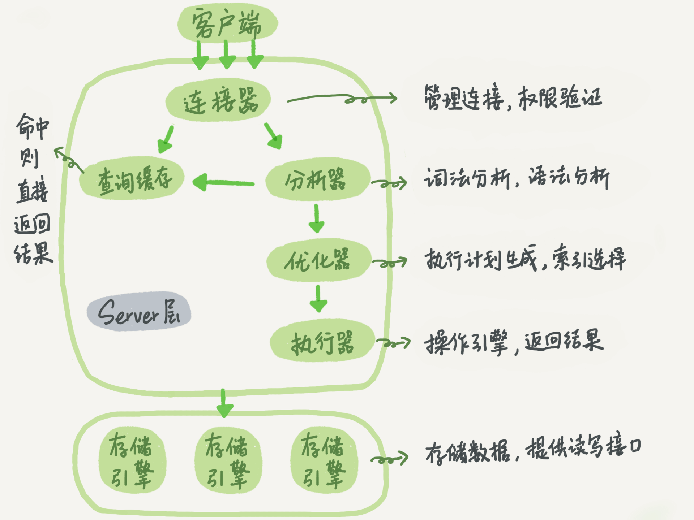

**大体来说，MySQL可以分为Server层和存储引擎层两部分。**

Server层包括连接器、查询缓存、分析器、优化器、执行器等，涵盖MySQL的大多数核心服务功能，以及所有的内置函数（如日期、时间、数学和加密函数等），所有跨存储引擎的功能都在这一层实现，比如存储过程、触发器、视图等。

而存储引擎层负责数据的存储和提取。其架构模式是插件式的，支持InnoDB、MyISAM、Memory等多个存储引擎。现在最常用的存储引擎是InnoDB，它从MySQL 5.5.5版本开始成为了默认存储引擎。


## 连接器

连接器负责跟客户端建立连接、获取权限、维持和管理连接。当身份认证完成以后，如果没有后序操作，连接会进入空闲状态，但wait_timeout过期时，连接器会关闭该连接。

MySQL中一般是使用长连接，但是长连接过多是会导致内存占用更大，被系统强行杀掉（OOD），即MySQL异常重启。

怎么解决这个问题呢？你可以考虑以下两种方案。

1. 定期断开长连接。使用一段时间，或者程序里面判断执行过一个占用内存的大查询后，断开连接，之后要查询再重连。

2. 如果你用的是MySQL 5.7或更新版本，可以在每次执行一个比较大的操作后，通过执行 mysql\_reset\_connection来重新初始化连接资源。这个过程不需要重连和重新做权限验证，但是会将连接恢复到刚刚创建完时的状态。


## 查询缓存

**但是大多数情况下我会建议你不要使用查询缓存，为什么呢？因为查询缓存往往弊大于利。**

查询缓存的失效非常频繁，只要有对一个表的更新，这个表上所有的查询缓存都会被清空。因此很可能你费劲地把结果存起来，还没使用呢，就被一个更新全清空了。对于更新压力大的数据库来说，查询缓存的命中率会非常低。除非你的业务就是有一张静态表，很长时间才会更新一次。比如，一个系统配置表，那这张表上的查询才适合使用查询缓存。

**需要注意的是，MySQL 8.0版本直接将查询缓存的整块功能删掉了，也就是说8.0开始彻底没有这个功能了。**


## 分析器

了解客户端输入的是什么语句，即连接需求。

- 分析器先会做“词法分析”。你输入的是由多个字符串和空格组成的一条SQL语句，MySQL需要识别出里面的字符串分别是什么，代表什么。（识别关键字）
- 做完了这些识别以后，就要做“语法分析”。根据词法分析的结果，语法分析器会根据语法规则，判断你输入的这个SQL语句是否满足MySQL语法。（语法错误的话会报错）


## 优化器

优化器是在表里面有多个索引的时候，决定使用哪个索引；或者在一个语句有多表关联（join）的时候，决定各个表的连接顺序


## 执行器

开始执行语句

开始执行的时候，要先判断一下你对这个表T有没有执行查询的权限，如果没有，就会返回没有权限的错误，如下所示(在工程实现上，如果命中查询缓存，会在查询缓存返回结果的时候，做权限验证。查询也会在优化器之前调用precheck验证权限)。

如果有权限，就打开表继续执行。打开表的时候，执行器就会根据表的引擎定义，去使用这个引擎提供的接口。


# 日志系统

## redo log（相当于数据的缓存）

MySQL里经常说到的WAL技术，WAL的全称是Write-Ahead Logging，**它的关键点就是先写日志，再写磁盘，也就是先写粉板，等不忙的时候再写账本。**

具体来说，当有一条记录需要更新的时候，InnoDB引擎就会先把记录写到redo log（粉板）里面，并更新内存，这个时候更新就算完成了。同时，InnoDB引擎会在适当的时候，将这个操作记录更新到磁盘里面，而这个更新往往是在系统比较空闲的时候做，这就像打烊以后掌柜做的事。

如果今天赊账的不多，掌柜可以等打烊后再整理。但如果某天赊账的特别多，粉板写满了，又怎么办呢？这个时候掌柜只好放下手中的活儿，把粉板中的一部分赊账记录更新到账本中，然后把这些记录从粉板上擦掉，为记新账腾出空间。

与此类似，InnoDB的redo log是固定大小的，比如可以配置为一组4个文件，每个文件的大小是1GB，那么这块“粉板”总共就可以记录4GB的操作。从头开始写，写到末尾就又回到开头循环写，如下面这个图所示。

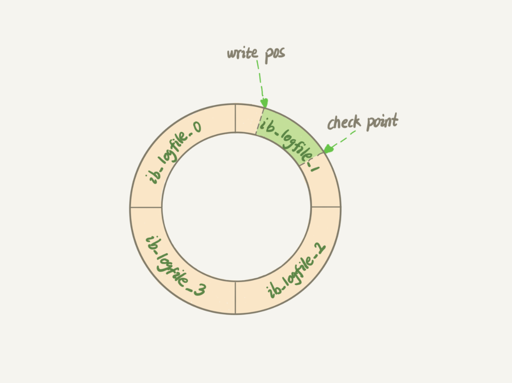

write pos是当前记录的位置，一边写一边后移，写到第3号文件末尾后就回到0号文件开头。checkpoint是当前要擦除的位置，也是往后推移并且循环的，擦除记录前要把记录更新到数据文件。

write pos和checkpoint之间的是“粉板”上还空着的部分，可以用来记录新的操作。如果write pos追上checkpoint，表示“粉板”满了，这时候不能再执行新的更新，得停下来先擦掉一些记录，把checkpoint推进一下。

有了redo log，InnoDB就可以保证即使数据库发生异常重启，之前提交的记录都不会丢失，这个能力称为 **crash-safe**。

要理解crash-safe这个概念，可以想想我们前面赊账记录的例子。只要赊账记录记在了粉板上或写在了账本上，之后即使掌柜忘记了，比如突然停业几天，恢复生意后依然可以通过账本和粉板上的数据明确赊账账目。


## binlog（操作日志）

MySQL整体来看，其实就有两块：一块是Server层，它主要做的是MySQL功能层面的事情；还有一块是引擎层，负责存储相关的具体事宜。上面我们聊到的粉板redo log是InnoDB引擎特有的日志，而Server层也有自己的日志，称为binlog（归档日志）。

这两种日志有以下三点不同。

1. redo log是InnoDB引擎特有的；binlog是MySQL的Server层实现的，所有引擎都可以使用。

2. redo log是**物理日志**，记录的是“在某个数据页上**做了什么修改**”；binlog是**逻辑日志**，记录的是这个语句的原始逻辑，比**如“给ID=2这一行的c字段加1** ”。

3. **redo log是循环写的，空间固定会用完**；**binlog是可以追加写入的**。“追加写”是指binlog文件写到一定大小后会切换到下一个，并不会覆盖以前的日志。


有了对这两个日志的概念性理解，我们再来看执行器和InnoDB引擎在执行这个简单的update语句时的内部流程。

1. 执行器先找引擎取ID=2这一行。ID是主键，引擎直接用树搜索找到这一行。如果ID=2这一行所在的数据页本来就在内存中，就直接返回给执行器；否则，需要先从磁盘读入内存，然后再返回。

2. 执行器拿到引擎给的行数据，把这个值加上1，比如原来是N，现在就是N+1，得到新的一行数据，再调用引擎接口写入这行新数据。

3. **引擎将这行新数据更新到内存中，同时将这个更新操作记录到redo log里面，此时redo log处于prepare状态。**然后告知执行器执行完成了，随时可以提交事务。）

4. 执行器生成这个操作的binlog，并把binlog写入磁盘。

5. **执行器调用引擎的提交事务接口，引擎把刚刚写入的redo log改成提交（commit）状态**，更新完成。


这里我给出这个update语句的执行流程图，图中浅色框表示是在InnoDB内部执行的，深色框表示是在执行器中执行的。


update语句执行流程

你可能注意到了，最后三步看上去有点“绕”，将redo log的写入拆成了两个步骤：prepare和commit，这就是"两阶段提交"。


## 两阶段提交

为什么必须有“两阶段提交”呢？这是为了让两份日志之间的逻辑一致。要说明这个问题，我们得从文章开头的那个问题说起： **怎样让数据库恢复到半个月内任意一秒的状态？**

前面我们说过了，binlog会记录所有的逻辑操作，并且是采用“追加写”的形式。如果你的DBA承诺说半个月内可以恢复，那么备份系统中一定会保存最近半个月的所有binlog，同时系统会定期做整库备份。这里的“定期”取决于系统的重要性，可以是一天一备，也可以是一周一备。

当需要恢复到指定的某一秒时，比如某天下午两点发现中午十二点有一次误删表，需要找回数据，那你可以这么做：

- 首先，找到最近的一次全量备份，如果你运气好，可能就是昨天晚上的一个备份，从这个备份恢复到临时库；
- 然后，从备份的时间点开始，将备份的binlog依次取出来，重放到中午误删表之前的那个时刻。

这样你的临时库就跟误删之前的线上库一样了，然后你可以把表数据从临时库取出来，按需要恢复到线上库去。

好了，说完了数据恢复过程，我们回来说说，为什么日志需要“两阶段提交”。这里不妨用反证法来进行解释。

由于redo log和binlog是两个独立的逻辑，如果不用两阶段提交，要么就是先写完redo log再写binlog，或者采用反过来的顺序。我们看看这两种方式会有什么问题。

仍然用前面的update语句来做例子。假设当前ID=2的行，字段c的值是0，再假设执行update语句过程中在写完第一个日志后，第二个日志还没有写完期间发生了crash，会出现什么情况呢？

1. **先写redo log后写binlog**。假设在redo log写完，binlog还没有写完的时候，MySQL进程异常重启。由于我们前面说过的，redo log写完之后，系统即使崩溃，仍然能够把数据恢复回来，所以恢复后这一行c的值是1。


   但是由于binlog没写完就crash了，这时候binlog里面就没有记录这个语句。因此，之后备份日志的时候，存起来的binlog里面就没有这条语句。


   然后你会发现，如果需要用这个binlog来恢复临时库的话，由于这个语句的binlog丢失，这个临时库就会少了这一次更新，恢复出来的这一行c的值就是0，与原库的值不同。

2. **先写binlog后写redo log**。如果在binlog写完之后crash，由于redo log还没写，崩溃恢复以后这个事务无效，所以这一行c的值是0。但是binlog里面已经记录了“把c从0改成1”这个日志。所以，在之后用binlog来恢复的时候就多了一个事务出来，恢复出来的这一行c的值就是1，与原库的值不同。


可以看到，如果不使用“两阶段提交”，那么数据库的状态就有可能和用它的日志恢复出来的库的状态不一致。

你可能会说，这个概率是不是很低，平时也没有什么动不动就需要恢复临时库的场景呀？

其实不是的，不只是误操作后需要用这个过程来恢复数据。当你需要扩容的时候，也就是需要再多搭建一些备库来增加系统的读能力的时候，现在常见的做法也是用全量备份加上应用binlog来实现的，这个“不一致”就会导致你的线上出现主从数据库不一致的情况。

简单说，redo log和binlog都可以用于表示事务的提交状态，而两阶段提交就是让这两个状态保持逻辑上的一致。


# 事务隔离

在MySQL中，事务支持是在引擎层实现的。你现在知道，MySQL是一个支持多引擎的系统，但并不是所有的引擎都支持事务。比如MySQL原生的MyISAM引擎就不支持事务，这也是MyISAM被InnoDB取代的重要原因之一。

### 隔离性与隔离级别

在谈隔离级别之前，你首先要知道，你隔离得越严实，效率就会越低。因此很多时候，我们都要在二者之间寻找一个平衡点。SQL标准的事务隔离级别包括：读未提交（read uncommitted）、读提交（read committed）、可重复读（repeatable read）和串行化（serializable ）。下面我逐一为你解释：

- 读未提交是指，一个事务还没提交时，它做的变更就能被别的事务看到。
- 读提交是指，一个事务提交之后，它做的变更才会被其他事务看到。
- 可重复读是指，一个事务执行过程中看到的数据，总是跟这个事务在启动时看到的数据是一致的。当然在可重复读隔离级别下，未提交变更对其他事务也是不可见的。
- 串行化，顾名思义是对于同一行记录，“写”会加“写锁”，“读”会加“读锁”。当出现读写锁冲突的时候，后访问的事务必须等前一个事务执行完成，才能继续执行。

其中“读提交”和“可重复读”比较难理解，所以我用一个例子说明这几种隔离级别。假设数据表T中只有一列，其中一行的值为1，下面是按照时间顺序执行两个事务的行为。

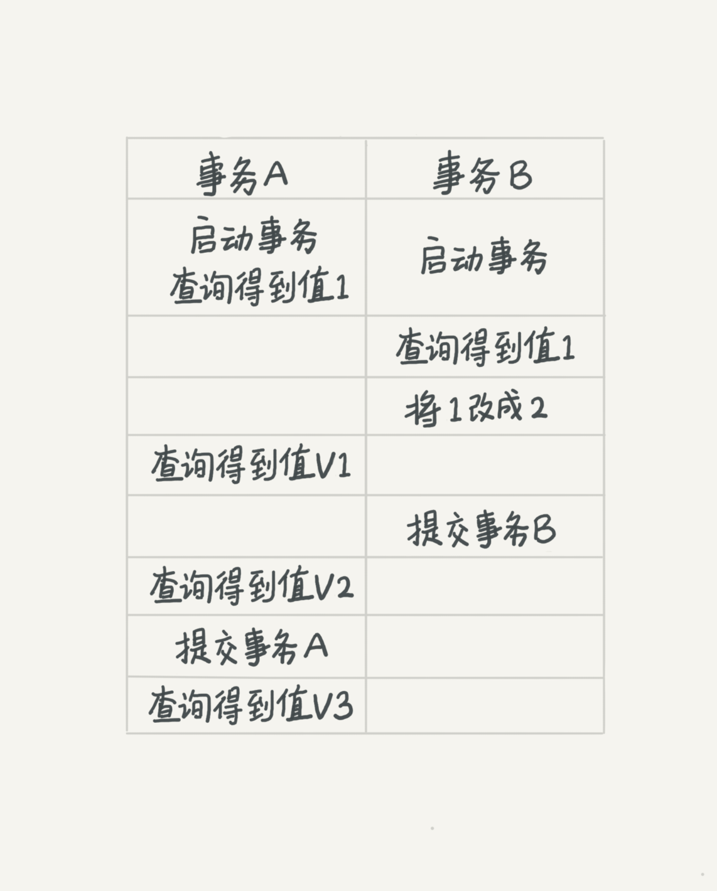

我们来看看在不同的隔离级别下，事务A会有哪些不同的返回结果，也就是图里面V1、V2、V3的返回值分别是什么。

- 若隔离级别是“读未提交”， 则V1的值就是2。这时候事务B虽然还没有提交，但是结果已经被A看到了。因此，V2、V3也都是2。**（全局透明）**
- 若隔离级别是“读提交”，则V1是1，V2的值是2。事务B的更新在提交后才能被A看到。所以， V3的值也是2。**（以事务为单位更新视图）**
- 若隔离级别是“可重复读”，则V1、V2是1，V3是2。之所以V2还是1，遵循的就是这个要求：事务在执行期间看到的数据前后必须是一致的。**（每个事务创建一张视图）**—— 月底对账
- 若隔离级别是“串行化”，则在事务B执行“将1改成2”的时候，会被锁住。直到事务A提交后，事务B才可以继续执行。所以从A的角度看， V1、V2值是1，V3的值是2。**（加锁）**

在实现上，**数据库里面会创建一个视图，访问的时候以视图的逻辑结果为准。在“可重复读”隔离级别下，这个视图是在事务启动时创建的，整个事务存在期间都用这个视图。在“读提交”隔离级别下，这个视图是在每个SQL语句开始执行的时候创建的。这里需要注意的是，“读未提交”隔离级别下直接返回记录上的最新值，没有视图概念；而“串行化”隔离级别下直接用加锁的方式来避免并行访问。**


### 事务隔离的实现

在MySQL中，实际上每条记录在更新的时候都会同时记录一条回滚操作。记录上的最新值，通过回滚操作，都可以得到前一个状态的值。

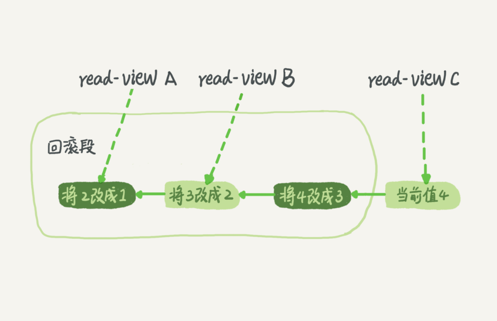

长事务意味着系统里面会存在很老的事务视图。由于这些事务随时可能访问数据库里面的任何数据，所以这个事务提交之前，数据库里面它可能用到的回滚记录都必须保留，这就会导致大量占用存储空间。


## 事务隔离分析


begin/start transaction 命令并不是一个事务的起点，在执行到它们之后的第一个操作InnoDB表的语句，事务才真正启动。如果你想要马上启动一个事务，可以使用start transaction with consistent snapshot 这个命令。

> 第一种启动方式，一致性视图是在执行第一个快照读语句时创建的；
>
> 第二种启动方式，一致性视图是在执行start transaction with consistent snapshot时创建的。

还需要注意的是，在整个专栏里面，我们的例子中如果没有特别说明，都是默认autocommit=1。

在这个例子中，事务C没有显式地使用begin/commit，表示这个update语句本身就是一个事务，语句完成的时候会自动提交。事务B在更新了行之后查询; 事务A在一个只读事务中查询，并且时间顺序上是在事务B的查询之后。

这时，如果我告诉你事务B查到的k的值是3，而事务A查到的k的值是1，你是不是感觉有点晕呢？


在MySQL里，有两个“视图”的概念：

- 一个是view。它是一个用查询语句定义的虚拟表，**在调用的时候执行查询语句并生成结果。创建视图的语法是create view … ，**而它的查询方法与表一样。
- 另一个是InnoDB在实现MVCC时用到的一致性读视图，即consistent read view，**用于支持RC（Read Committed，读提交）和RR（Repeatable Read，可重复读）隔离级别的实现。**

它没有物理结构，作用是事务执行期间用来定义“我能看到什么数据”。


### “快照”在MVCC里是怎么工作的？

在可重复读隔离级别下，事务在启动的时候就“拍了个快照”。注意，这个快照是基于整库的。

这时，你会说这看上去不太现实啊。如果一个库有100G，那么我启动一个事务，MySQL就要拷贝100G的数据出来，这个过程得多慢啊。可是，我平时的事务执行起来很快啊。

实际上，我们并不需要拷贝出这100G的数据。我们先来看看这个快照是怎么实现的。

InnoDB里面每个事务有一个唯一的事务ID，叫作transaction id。它是在事务开始的时候向InnoDB的事务系统申请的，是按申请顺序严格递增的。

而每行数据也都是有多个版本的。每次事务更新数据的时候，都会生成一个新的数据版本，并且把transaction id赋值给这个数据版本的事务ID，记为row trx\_id。同时，旧的数据版本要保留，并且在新的数据版本中，能够有信息可以直接拿到它。

**也就是说，数据表中的一行记录，其实可能有多个版本(row)，每个版本有自己的row trx\_id。**

如图所示，就是一个记录被多个事务连续更新后的状态。

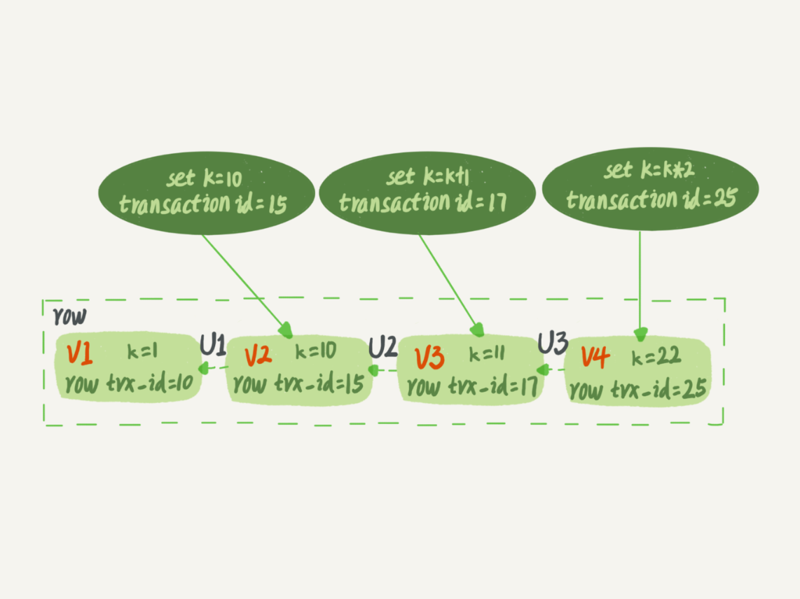

图中虚线框里是同一行数据的4个版本，当前最新版本是V4，k的值是22，它是被transaction id 为25的事务更新的，因此它的row trx\_id也是25。

你可能会问，前面的文章不是说，语句更新会生成undo log（回滚日志）吗？那么， **undo log在哪呢？**

实际上，图2中的三个虚线箭头，就是undo log；而V1、V2、V3并不是物理上真实存在的，而是每次需要的时候根据当前版本和undo log计算出来的。比如，需要V2的时候，就是通过V4依次执行U3、U2算出来。

明白了多版本和row trx\_id的概念后，我们再来想一下，InnoDB是怎么定义那个“100G”的快照的。

按照可重复读的定义，一个事务启动的时候，能够看到所有已经提交的事务结果。但是之后，这个事务执行期间，其他事务的更新对它不可见。

**因此，一个事务只需要在启动的时候声明说，“以我启动的时刻为准，如果一个数据版本是在我启动之前生成的，就认；如果是我启动以后才生成的，我就不认，我必须要找到它的上一个版本”。**

**当然，如果“上一个版本”也不可见，那就得继续往前找。还有，如果是这个事务自己更新的数据，它自己还是要认的。**

在实现上， **InnoDB为每个事务构造了一个数组，用来保存这个事务启动瞬间，当前正在“活跃”的所有事务ID。**“活跃”指的就是，启动了但还没提交。

数组里面事务ID的最小值记为低水位，当前系统里面已经创建过的事务ID的最大值加1记为高水位。

这个视图数组和高水位，就组成了当前事务的一致性视图（read-view）。

**而数据版本的可见性规则，就是基于数据的row trx\_id和这个一致性视图的对比结果得到的。**

这个视图数组把所有的row trx\_id 分成了几种不同的情况。

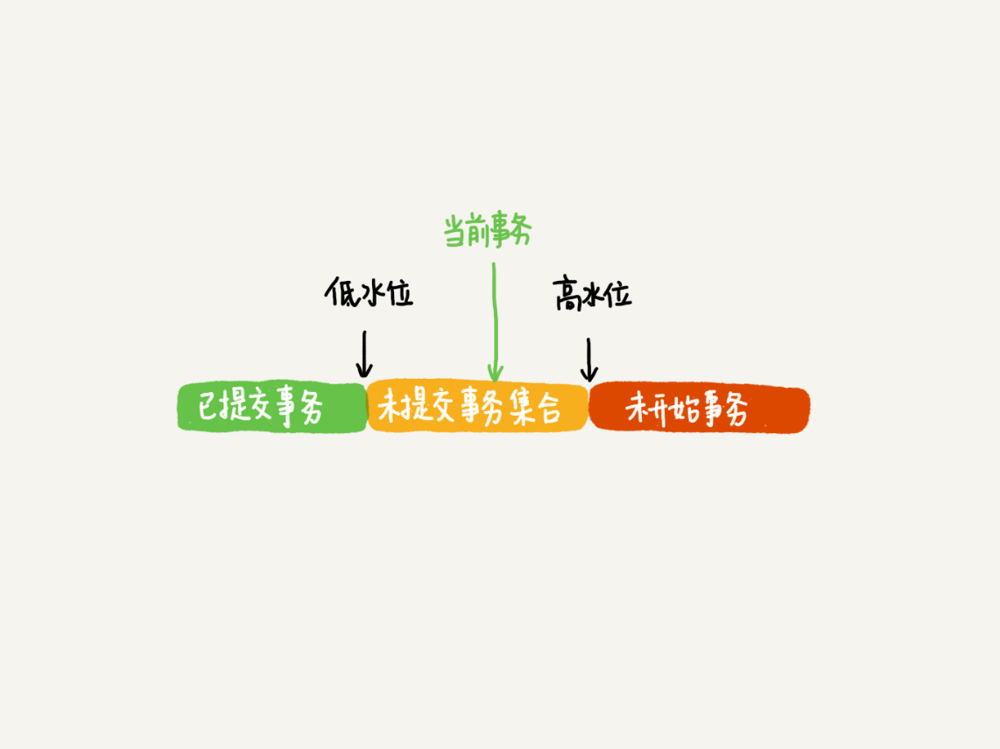

图3 数据版本可见性规则

这样，对于当前事务的启动瞬间来说，一个数据版本的row trx\_id，有以下几种可能：

1. 如果落在绿色部分，表示这个版本是已提交的事务或者是当前事务自己生成的，这个数据是可见的；

2. 如果落在红色部分，表示这个版本是由将来启动的事务生成的，是肯定不可见的；

3. 如果落在黄色部分，那就包括两种情况


   a. 若 row trx\_id在数组中，表示这个版本是由还没提交的事务生成的，不可见；


   b. 若 row trx\_id不在数组中，表示这个版本是已经提交了的事务生成的，可见。


比如，对于图2中的数据来说，如果有一个事务，它的低水位是18，那么当它访问这一行数据时，就会从V4通过U3计算出V3，所以在它看来，这一行的值是11。

你看，有了这个声明后，系统里面随后发生的更新，是不是就跟这个事务看到的内容无关了呢？因为之后的更新，生成的版本一定属于上面的2或者3(a)的情况，而对它来说，这些新的数据版本是不存在的，所以这个事务的快照，就是“静态”的了。

所以你现在知道了， **InnoDB利用了“所有数据都有多个版本”的这个特性，实现了“秒级创建快照”的能力。**

接下来，我们继续看一下图1中的三个事务，分析下事务A的语句返回的结果，为什么是k=1。

这里，我们不妨做如下假设：

1. 事务A开始前，系统里面只有一个活跃事务ID是99；

2. 事务A、B、C的版本号分别是100、101、102，且当前系统里只有这四个事务；

3. 三个事务开始前，(1,1）这一行数据的row trx\_id是90。


这样，事务A的视图数组就是\[99,100\], 事务B的视图数组是\[99,100,101\], 事务C的视图数组是\[99,100,101,102\]。

为了简化分析，我先把其他干扰语句去掉，只画出跟事务A查询逻辑有关的操作：

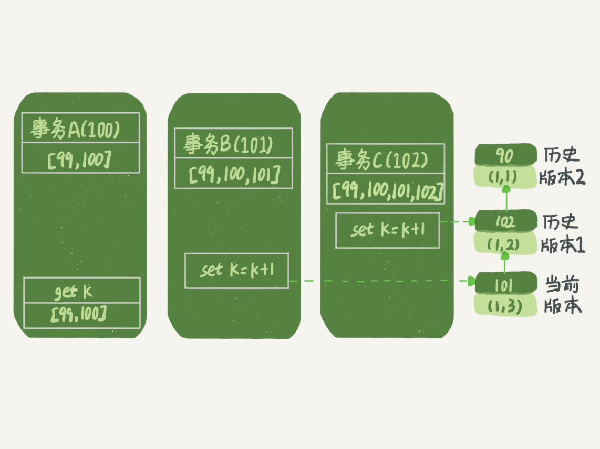

图4 事务A查询数据逻辑图

从图中可以看到，第一个有效更新是事务C，把数据从(1,1)改成了(1,2)。这时候，这个数据的最新版本的row trx\_id是102，而90这个版本已经成为了历史版本。

第二个有效更新是事务B，把数据从(1,2)改成了(1,3)。这时候，这个数据的最新版本（即row trx\_id）是101，而102又成为了历史版本。（如果b使用查询的时候，也要判断版本号）

你可能注意到了，在事务A查询的时候，其实事务B还没有提交，但是它生成的(1,3)这个版本已经变成当前版本了。但这个版本对事务A必须是不可见的，否则就变成脏读了。

好，现在事务A要来读数据了，它的视图数组是\[99,100\]。当然了，读数据都是从当前版本读起的。所以，事务A查询语句的读数据流程是这样的：

- 找到(1,3)的时候，判断出row trx\_id=101，比高水位大，处于红色区域，不可见；
- 接着，找到上一个历史版本，一看row trx\_id=102，比高水位大，处于红色区域，不可见；
- 再往前找，终于找到了（1,1)，它的row trx\_id=90，比低水位小，处于绿色区域，可见。

这样执行下来，虽然期间这一行数据被修改过，但是事务A不论在什么时候查询，看到这行数据的结果都是一致的，所以我们称之为一致性读。

这个判断规则是从代码逻辑直接转译过来的，但是正如你所见，用于人肉分析可见性很麻烦。

所以，我来给你翻译一下。一个数据版本，对于一个事务视图来说，除了自己的更新总是可见以外，有三种情况：

1. **版本未提交，不可见；**

2. **版本已提交，但是是在视图创建后提交的，不可见；**

3. **版本已提交，而且是在视图创建前提交的，可见。**


现在，我们用这个规则来判断图4中的查询结果，事务A的查询语句的视图数组是在事务A启动的时候生成的，这时候：

- (1,3)还没提交，属于情况1，不可见；
- (1,2)虽然提交了，但是是在视图数组创建之后提交的，属于情况2，不可见；
- (1,1)是在视图数组创建之前提交的，可见。

你看，去掉数字对比后，只用时间先后顺序来判断，分析起来是不是轻松多了。所以，后面我们就都用这个规则来分析。


### 更新逻辑

细心的同学可能有疑问了： **事务B的update语句，如果按照一致性读，好像结果不对哦？**

你看图5中，事务B的视图数组是先生成的，之后事务C才提交，不是应该看不见(1,2)吗，怎么能算出(1,3)来？

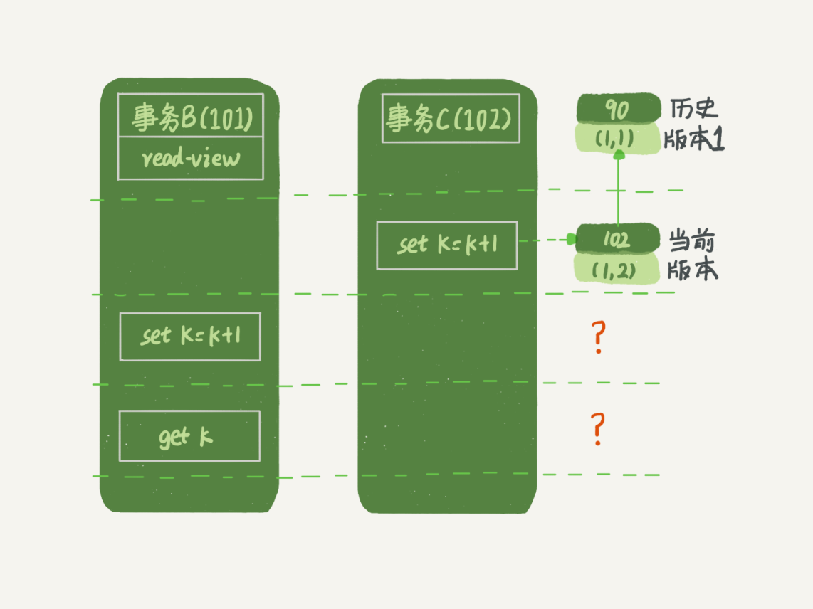

图5 事务B更新逻辑图

是的，如果事务B在更新之前查询一次数据，这个查询返回的k的值确实是1。

但是，当它要去更新数据的时候，就不能再在历史版本上更新了，否则事务C的更新就丢失了。因此，事务B此时的set k=k+1是在（1,2）的基础上进行的操作。

所以，这里就用到了这样一条规则： **更新数据都是先读后写的，而这个读，只能读当前的值，称为“当前读”（current read）。**

因此，在更新的时候，当前读拿到的数据是(1,2)，更新后生成了新版本的数据(1,3)，这个新版本的row trx\_id是101。

所以，在执行事务B查询语句的时候，一看自己的版本号是101，最新数据的版本号也是101，是自己的更新，可以直接使用，所以查询得到的k的值是3（因为执行更新语句后，最新数据的版本号跟自己的版本一样，所以会使用最新的数据）。

**这里我们提到了一个概念，叫作当前读。其实，除了update语句外，select语句如果加锁，也是当前读。**

所以，如果把事务A的查询语句select \* from t where id=1修改一下，加上lock in share mode 或 for update，也都可以读到版本号是101的数据，返回的k的值是3。下面这两个select语句，就是分别加了读锁（S锁，共享锁）和写锁（X锁，排他锁）。

```
mysql> select k from t where id=1 lock in share mode;
mysql> select k from t where id=1 for update;

```

再往前一步，假设事务C不是马上提交的，而是变成了下面的事务C’，会怎么样呢？

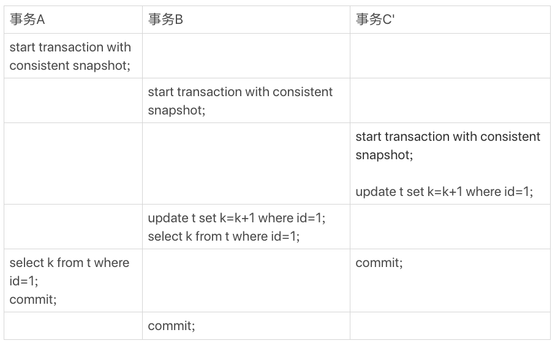

图6 事务A、B、C'的执行流程

事务C’的不同是，更新后并没有马上提交，在它提交前，事务B的更新语句先发起了。前面说过了，虽然事务C’还没提交，但是(1,2)这个版本也已经生成了，并且是当前的最新版本。那么，事务B的更新语句会怎么处理呢？

这时候，我们在上一篇文章中提到的“两阶段锁协议”就要上场了。事务C’没提交，**也就是说(1,2)这个版本上的写锁还没释放。**而事务B是**当前读**，必须要读最新版本，而且必须加锁，因此就被锁住了，必须等到事务C’释放这个锁，才能继续它的当前读（因为需要读完写）。

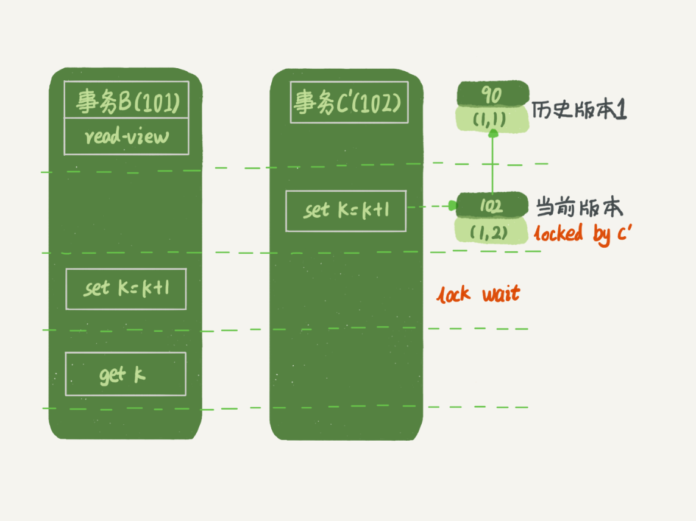

图7 事务B更新逻辑图（配合事务C'）

到这里，我们把一致性读、当前读和行锁就串起来了。

现在，我们再回到文章开头的问题： **事务的可重复读的能力是怎么实现的？**

**可重复读的核心就是一致性读（consistent read）；而事务更新数据的时候，只能用当前读。如果当前的记录的行锁被其他事务占用的话，就需要进入锁等待。**

而读提交的逻辑和可重复读的逻辑类似，它们最主要的区别是：

- 在可重复读隔离级别下，只需要在事务开始的时候创建一致性视图，之后事务里的其他查询都共用这个一致性视图；
- 在读提交隔离级别下，每一个语句执行前都会重新算出一个新的视图。

那么，我们再看一下，在读提交隔离级别下，事务A和事务B的查询语句查到的k，分别应该是多少呢？

这里需要说明一下，“start transaction with consistent snapshot; ”的意思是从这个语句开始，创建一个持续整个事务的一致性快照。所以，在读提交隔离级别下，这个用法就没意义了，等效于普通的start transaction。

下面是读提交时的状态图，可以看到这两个查询语句的创建视图数组的时机发生了变化，就是图中的read view框。（注意：这里，我们用的还是事务C的逻辑直接提交，而不是事务C’）


图8 读提交隔离级别下的事务状态图

这时，事务A的查询语句的视图数组是在执行这个语句的时候创建的，时序上(1,2)、(1,3)的生成时间都在创建这个视图数组的时刻之前。但是，在这个时刻：

- (1,3)还没提交，属于情况1，不可见；
- (1,2)提交了，属于情况3，可见。

所以，这时候事务A查询语句返回的是k=2。

显然地，事务B查询结果k=3。


### 小结

InnoDB的行数据有多个版本，每个数据版本有自己的row trx\_id，每个事务或者语句有自己的一致性视图。普通查询语句是一致性读，一致性读会根据row trx\_id和一致性视图确定数据版本的可见性。

- 对于可重复读，查询只承认在事务启动前就已经提交完成的数据；
- 对于读提交，查询只承认在语句启动前就已经提交完成的数据；


# 索引

一句话简单来说，索引的出现其实就是为了提高数据查询的效率，就像书的目录一样。一本500页的书，如果你想快速找到其中的某一个知识点，在不借助目录的情况下，那我估计你可得找一会儿。同样，对于数据库的表而言，索引其实就是它的“目录”。


## 索引的常见模型

索引的出现是为了提高查询效率，但是实现索引的方式却有很多种，所以这里也就引入了索引模型的概念。可以用于提高读写效率的数据结构很多，这里我先给你介绍三种常见、也比较简单的数据结构，它们分别是**哈希表、有序数组和搜索树。**


### 哈希表

哈希表是一种以键-值（key-value）存储数据的结构，我们只要输入待查找的键即key，就可以找到其对应的值即Value。哈希的思路很简单，把值放在数组里，用一个哈希函数把key换算成一个确定的位置，然后把value放在数组的这个位置。

不可避免地，多个key值经过哈希函数的换算，会出现同一个值的情况。处理这种情况的一种方法是，拉出一个链表。

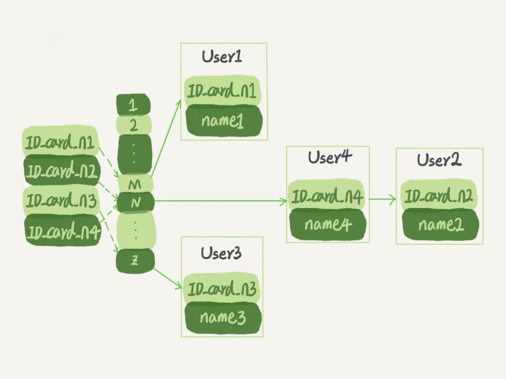

需要注意的是，图中四个ID\_card\_n的值并不是递增的，这样做的好处是增加新的User时速度会很快，只需要往后追加。但缺点是，因为不是有序的，所以哈希索引做区间查询的速度是很慢的。

你可以设想下，如果你现在要找身份证号在\[ID\_card\_X, ID\_card\_Y\]这个区间的所有用户，就必须全部扫描一遍了。

所以， **哈希表这种结构适用于只有等值查询的场景**，比如Memcached及其他一些NoSQL引擎。


### 有序数组

而 **有序数组在等值查询和范围查询场景中的性能就都非常优秀**。还是上面这个根据身份证号查名字的例子，如果我们使用有序数组来实现的话，示意图如下所示：

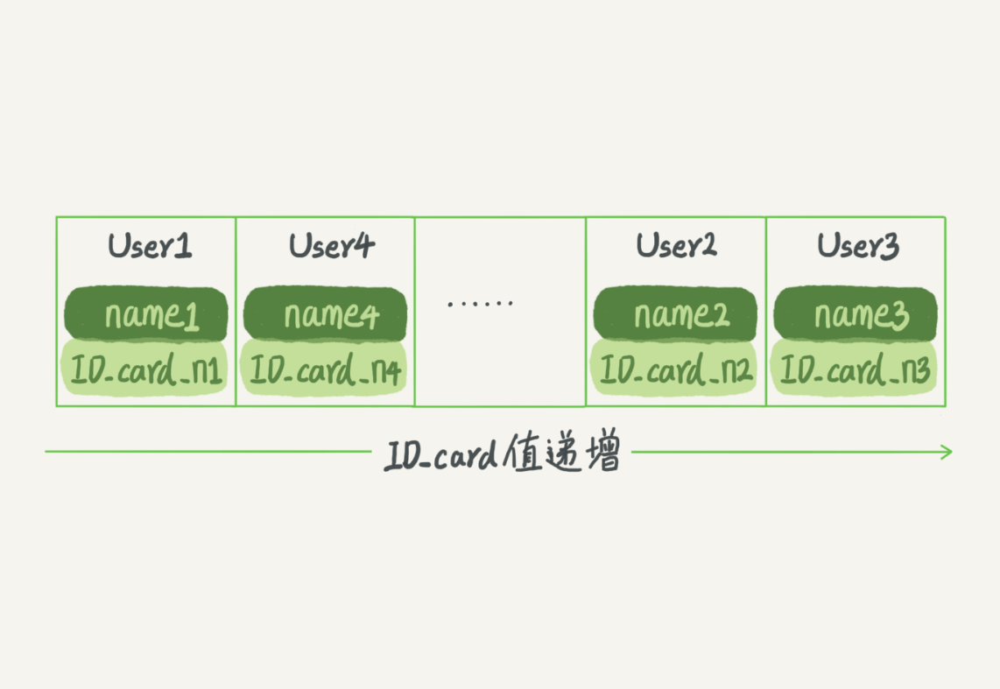

这里我们假设身份证号没有重复，这个数组就是按照身份证号递增的顺序保存的。这时候如果你要查ID\_card\_n2对应的名字，用二分法就可以快速得到，这个时间复杂度是O(log(N))。

同时很显然，这个索引结构支持范围查询。你要查身份证号在\[ID\_card\_X, ID\_card\_Y\]区间的User，可以先用二分法找到ID\_card\_X（如果不存在ID\_card\_X，就找到大于ID\_card\_X的第一个User），然后向右遍历，直到查到第一个大于ID\_card\_Y的身份证号，退出循环。

如果仅仅看查询效率，有序数组就是最好的数据结构了。但是，在需要更新数据的时候就麻烦了，你往中间插入一个记录就必须得挪动后面所有的记录，成本太高。

所以， **有序数组索引只适用于静态存储引擎**，比如你要保存的是2017年某个城市的所有人口信息，这类不会再修改的数据。


### 二叉搜索树

二叉搜索树也是课本里的经典数据结构了。还是上面根据身份证号查名字的例子，如果我们用二叉搜索树来实现的话，示意图如下所示：

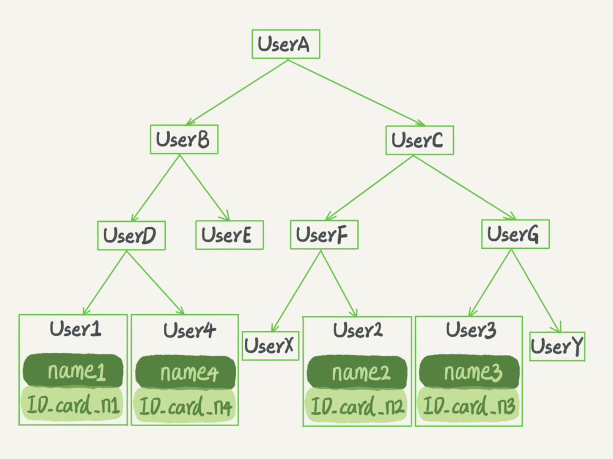

二叉搜索树的特点是：父节点左子树所有结点的值小于父节点的值，右子树所有结点的值大于父节点的值。这样如果你要查ID\_card\_n2的话，按照图中的搜索顺序就是按照UserA -> UserC -> UserF -> User2这个路径得到。这个时间复杂度是O(log(N))。

当然为了维持O(log(N))的查询复杂度，你就需要保持这棵树是平衡二叉树。为了做这个保证，更新的时间复杂度也是O(log(N))。

树可以有二叉，也可以有多叉。多叉树就是每个节点有多个儿子，儿子之间的大小保证从左到右递增。二叉树是搜索效率最高的，但是实际上大多数的数据库存储却并不使用二叉树。其原因是，索引不止存在内存中，还要写到磁盘上。

你可以想象一下一棵100万节点的平衡二叉树，树高20。一次查询可能需要访问20个数据块。在机械硬盘时代，从磁盘随机读一个数据块需要10 ms左右的寻址时间。也就是说，对于一个100万行的表，如果使用二叉树来存储，单独访问一个行可能需要20个10 ms的时间，这个查询可真够慢的。

**为了让一个查询尽量少地读磁盘，就必须让查询过程访问尽量少的数据块。那么，我们就不应该使用二叉树，而是要使用“N叉”树。这里，“N叉”树中的“N”取决于数据块的大小。**

**以InnoDB的一个整数字段索引为例，这个N差不多是1200。这棵树高是4的时候，就可以存1200的3次方个值，这已经17亿了。考虑到树根的数据块总是在内存中的，一个10亿行的表上一个整数字段的索引，查找一个值最多只需要访问3次磁盘。其实，树的第二层也有很大概率在内存中，那么访问磁盘的平均次数就更少了。**

N叉树由于在读写上的性能优点，以及适配磁盘的访问模式，已经被广泛应用在数据库引擎中了。


## InnoDB 的索引模型

在InnoDB中，表都是根据主键顺序以索引的形式存放的，这种存储方式的表称为索引组织表。又因为前面我们提到的，InnoDB使用了B+树索引模型，所以数据都是存储在B+树中的。

**每一个索引在InnoDB里面对应一棵B+树。**

假设，我们有一个主键列为ID的表，表中有字段k，并且在k上有索引。

```mysql
mysql> create table T(
id int primary key,
k int not null,
name varchar(16),
index (k))engine=InnoDB;
```

表中R1~R5的(ID,k)值分别为(100,1)、(200,2)、(300,3)、(500,5)和(600,6)，两棵树的示例示意图如下。


图4 InnoDB的索引组织结构

**从图中不难看出，根据叶子节点的内容，索引类型分为主键索引和非主键索引。**

**主键索引的叶子节点存的是整行数据。在InnoDB里，主键索引也被称为聚簇索引（clustered index）。**

**非主键索引的叶子节点内容是主键的值。在InnoDB里，非主键索引也被称为二级索引（secondary index）。**

根据上面的索引结构说明，我们来讨论一个问题： **基于主键索引和普通索引的查询有什么区别？**

- 如果语句是select \* from T where ID=500，即主键查询方式，则只需要搜索ID这棵B+树；
- 如果语句是select \* from T where k=5，即普通索引查询方式，则需要先搜索k索引树，得到ID的值为500，再到ID索引树搜索一次。这个过程称为回表。

也就是说，基于非主键索引的查询需要多扫描一棵索引树。因此，我们在应用中应该尽量使用主键查询。


## 索引维护

B+树为了维护索引有序性，在插入新值的时候需要做必要的维护。以上面这个图为例，如果插入新的行ID值为700，则只需要在R5的记录后面插入一个新记录。如果新插入的ID值为400，就相对麻烦了，需要逻辑上挪动后面的数据，空出位置。

而更糟的情况是，如果R5所在的数据页已经满了，根据B+树的算法，这时候需要申请一个新的数据页，然后挪动部分数据过去。这个过程称为页分裂。在这种情况下，性能自然会受影响。

除了性能外，页分裂操作还影响数据页的利用率。原本放在一个页的数据，现在分到两个页中，整体空间利用率降低大约50%。

当然有分裂就有合并。当相邻两个页由于删除了数据，利用率很低之后，会将数据页做合并。合并的过程，可以认为是分裂过程的逆过程。

基于上面的索引维护过程说明，我们来讨论一个案例：

> 你可能在一些建表规范里面见到过类似的描述，要求建表语句里一定要有自增主键。当然事无绝对，我们来分析一下哪些场景下应该使用自增主键，而哪些场景下不应该。

自增主键是指自增列上定义的主键，在建表语句中一般是这么定义的： NOT NULL PRIMARY KEY AUTO\_INCREMENT。

**插入新记录的时候可以不指定ID的值，系统会获取当前ID最大值加1作为下一条记录的ID值。**

也就是说，自增主键的插入数据模式，正符合了我们前面提到的递增插入的场景。每次插入一条新记录，都是追加操作，都不涉及到挪动其他记录，也不会触发叶子节点的分裂。

而有业务逻辑的字段做主键，则往往不容易保证有序插入，这样写数据成本相对较高。

除了考虑性能外，我们还可以从存储空间的角度来看。假设你的表中确实有一个唯一字段，比如字符串类型的身份证号，那应该用身份证号做主键，还是用自增字段做主键呢？

由于每个非主键索引的叶子节点上都是主键的值。如果用身份证号做主键，那么每个二级索引的叶子节点占用约20个字节，而如果用整型做主键，则只要4个字节，如果是长整型（bigint）则是8个字节。

**显然，主键长度越小，普通索引的叶子节点就越小，普通索引占用的空间也就越小。**

**所以，从性能和存储空间方面考量，自增主键往往是更合理的选择。**

有没有什么场景适合用业务字段直接做主键的呢？还是有的。比如，有些业务的场景需求是这样的：

1. 只有一个索引；

2. 该索引必须是唯一索引。


你一定看出来了，这就是典型的KV场景。

由于没有其他索引，所以也就不用考虑其他索引的叶子节点大小的问题。

这时候我们就要优先考虑上一段提到的“尽量使用主键查询”原则，直接将这个索引设置为主键，可以避免每次查询需要搜索两棵树。


## 回表

在下面这个表T中，如果我执行 select \* from T where k between 3 and 5，需要执行几次树的搜索操作，会扫描多少行？

下面是这个表的初始化语句。

```mysql
mysql> create table T (
ID int primary key,
k int NOT NULL DEFAULT 0,
s varchar(16) NOT NULL DEFAULT '',
index k(k))
engine=InnoDB;

insert into T values(100,1, 'aa'),(200,2,'bb'),(300,3,'cc'),(500,5,'ee'),(600,6,'ff'),(700,7,'gg');
```


图1 InnoDB的索引组织结构

现在，我们一起来看看这条SQL查询语句的执行流程：

1. 在k索引树上找到k=3的记录，取得 ID = 300；

2. 再到ID索引树查到ID=300对应的R3；

3. 在k索引树取下一个值k=5，取得ID=500；(向右遍历)

4. 再回到ID索引树查到ID=500对应的R4；

5. 在k索引树取下一个值k=6，不满足条件，循环结束。


在这个过程中， **回到主键索引树搜索的过程，我们称为回表**。可以看到，这个查询过程读了k索引树的3条记录（步骤1、3和5），回表了两次（步骤2和4）。

在这个例子中，由于查询结果所需要的数据只在主键索引上有，所以不得不回表。那么，有没有可能经过索引优化，避免回表过程呢？


## 覆盖索引

如果执行的语句是select ID from T where k between 3 and 5，这时只需要查ID的值，而ID的值已经在k索引树上了，因此可以直接提供查询结果，不需要回表。也**就是说，在这个查询里面，索引k已经“覆盖了”我们的查询需求，我们称为覆盖索引。**

**由于覆盖索引可以减少树的搜索次数，显著提升查询性能，所以使用覆盖索引是一个常用的性能优化手段。**

需要注意的是，在引擎内部使用覆盖索引在索引k上其实读了三个记录，R3~R5（对应的索引k上的记录项），但是对于MySQL的Server层来说，它就是找引擎拿到了两条记录，因此MySQL认为扫描行数是2。

基于上面覆盖索引的说明，我们来讨论一个问题： **在一个市民信息表上，是否有必要将身份证号和名字建立联合索引？**

我们知道，身份证号是市民的唯一标识。也就是说，如果有根据身份证号查询市民信息的需求，我们只要在身份证号字段上建立索引就够了。而再建立一个（身份证号、姓名）的联合索引，是不是浪费空间？

如果现在有一个高频请求，要根据市民的身份证号查询他的姓名，这个联合索引就有意义了。它可以在这个高频请求上用到覆盖索引，不再需要回表查整行记录，减少语句的执行时间。

当然，索引字段的维护总是有代价的。因此，在建立冗余索引来支持覆盖索引时就需要权衡考虑了。这正是业务DBA，或者称为业务数据架构师的工作。


## 最左前缀原则

看到这里你一定有一个疑问，如果为每一种查询都设计一个索引，索引是不是太多了。如果我现在要按照市民的身份证号去查他的家庭地址呢？虽然这个查询需求在业务中出现的概率不高，但总不能让它走全表扫描吧？反过来说，单独为一个不频繁的请求创建一个（身份证号，地址）的索引又感觉有点浪费。应该怎么做呢？

**B+树这种索引结构，可以利用索引的“最左前缀”（使用联合索引的最左来进行匹配），来定位记录。**


可以看到，索引项是按照索引定义里面出现的字段顺序排序的。

当你的逻辑需求是查到所有名字是“张三”的人时，可以快速定位到ID4，然后向后遍历得到所有需要的结果。

如果你要查的是所有名字第一个字是“张”的人，你的SQL语句的条件是"where name like ‘张%’"。这时，你也能够用上这个索引，查找到第一个符合条件的记录是ID3，然后向后遍历，直到不满足条件为止。

可以看到，不只是索引的全部定义，只要满足最左前缀，就可以利用索引来加速检索。这个最左前缀可以是联合索引的最左N个字段，也可以是字符串索引的最左M个字符。

基于上面对最左前缀索引的说明，我们来讨论一个问题： **在建立联合索引的时候，如何安排索引内的字段顺序。**

这里我们的评估标准是，索引的复用能力。因为可以支持最左前缀，所以当已经有了(a,b)这个联合索引后，一般就不需要单独在a上建立索引了。因此， **第一原则是，如果通过调整顺序，可以少维护一个索引，那么这个顺序往往就是需要优先考虑采用的。**

所以现在你知道了，这段开头的问题里，我们要为高频请求创建(身份证号，姓名）这个联合索引，并用这个索引支持“根据身份证号查询地址”的需求。

那么，如果既有联合查询，又有基于a、b各自的查询呢？**查询条件里面只有b的语句，是无法使用(a,b)这个联合索引的，这时候你不得不维护另外一个索引，也就是说你需要同时维护(a,b)、(b) 这两个索引。**

这时候，我们要 **考虑的原则就是空间** 了。比如上面这个市民表的情况，name字段是比age字段大的 ，那我就建议你创建一个（name,age)的联合索引和一个(age)的单字段索引。


## 索引下推（在索引内部先进行判断）

上一段我们说到满足最左前缀原则的时候，最左前缀可以用于在索引中定位记录。这时，你可能要问，那些不符合最左前缀的部分，会怎么样呢？

我们还是以市民表的联合索引（name, age）为例。如果现在有一个需求：检索出表中“名字第一个字是张，而且年龄是10岁的所有男孩”。那么，SQL语句是这么写的：

```
mysql> select * from tuser where name like '张%' and age=10 and ismale=1;

```

你已经知道了前缀索引规则，所以这个语句在搜索索引树的时候，只能用 “张”，找到第一个满足条件的记录ID3。当然，这还不错，总比全表扫描要好。

然后呢？

当然是判断其他条件是否满足。

在MySQL 5.6之前，只能从ID3开始一个个回表。到主键索引上找出数据行，再对比字段值。

**而MySQL 5.6 引入的索引下推优化（index condition pushdown)， 可以在索引遍历过程中，对索引中包含的字段先做判断，直接过滤掉不满足条件的记录，减少回表次数。**

图3和图4，是这两个过程的执行流程图。


在图3和4这两个图里面，每一个虚线箭头表示回表一次。

图3中，在(name,age)索引里面我特意去掉了age的值，这个过程InnoDB并不会去看age的值，只是按顺序把“name第一个字是’张’”的记录一条条取出来回表。因此，需要回表4次。

图4跟图3的区别是，**InnoDB在(name,age)索引内部就判断了age是否等于10，对于不等于10的记录，直接判断并跳过。**在我们的这个例子中，只需要对ID4、ID5这两条记录回表取数据判断，就只需要回表2次。


## 普通索引和唯一索引

唯一索引和普通索引使用的结构都是B-tree,执行时间复杂度都是O(log n)。

1、普通索引

　　普通索引（由关键字KEY或INDEX定义的索引）的唯一任务是加快对数据的访问速度。因此，应该只为那些最经常出现在查询条件（WHEREcolumn=）或排序条件（ORDERBYcolumn）中的数据列创建索引。只要有可能，就应该选择一个数据最整齐、最紧凑的数据列（如一个整数类型的数据列）来创建索引。

2、唯一索引

　　普通索引允许被索引的数据列包含重复的值。比如说，因为人有可能同名，所以同一个姓名在同一个“员工个人资料”数据表里可能出现两次或更多次。

如果能确定某个数据列将只包含彼此各不相同的值，在为这个数据列创建索引的时候就应该用关键字UNIQUE把它定义为一个唯一索引。


### 查询过程

假设，执行查询的语句是 select id from T where k=5。这个查询语句在索引树上查找的过程，先是通过B+树从树根开始，按层搜索到叶子节点，也就是图中右下角的这个数据页，然后可以认为数据页内部通过二分法来定位记录。

- 对于普通索引来说，查找到满足条件的第一个记录(5,500)后，需要查找下一个记录，直到碰到第一个不满足k=5条件的记录。
- 对于唯一索引来说，由于索引定义了唯一性，查找到第一个满足条件的记录后，就会停止继续检索。

那么，这个不同带来的性能差距会有多少呢？答案是，微乎其微。

你知道的，InnoDB的数据是按数据页为单位来读写的。也就是说，当需要读一条记录的时候，并不是将这个记录本身从磁盘读出来，而是以页为单位，将其整体读入内存。在InnoDB中，每个数据页的大小默认是16KB。

因为引擎是按页读写的，所以说，当找到k=5的记录的时候，它所在的数据页就都在内存里了。那么，对于普通索引来说，要多做的那一次“查找和判断下一条记录”的操作，就只需要一次指针寻找和一次计算。

当然，如果k=5这个记录刚好是这个数据页的最后一个记录，那么要取下一个记录，必须读取下一个数据页，这个操作会稍微复杂一些（极端情况，数据不在同一页）。

但是，我们之前计算过，对于整型字段，一个数据页可以放近千个key，因此出现这种情况的概率会很低。所以，我们计算平均性能差异时，仍可以认为这个操作成本对于现在的CPU来说可以忽略不计。


### 更新过程

为了说明普通索引和唯一索引对更新语句性能的影响这个问题，我需要先跟你介绍一下change buffer。

当需要更新一个数据页时，如果数据页在内存中就直接更新，而如果这个数据页还没有在内存中的话，在不影响数据一致性的前提下，InnoDB会将这些更新操作缓存在change buffer中，这样就不需要从磁盘中读入这个数据页了。在下次查询需要访问这个数据页的时候，将数据页读入内存，然后执行change buffer中与这个页有关的操作。通过这种方式就能保证这个数据逻辑的正确性。

需要说明的是，虽然名字叫作change buffer，实际上它是可以持久化的数据。也就是说，change buffer在内存中有拷贝，也会被写入到磁盘上。

将change buffer中的操作应用到原数据页，得到最新结果的过程称为merge。除了访问这个数据页会触发merge外，系统有后台线程会定期merge。在数据库正常关闭（shutdown）的过程中，也会执行merge操作。

显然，如果能够将更新操作先记录在change buffer，减少读磁盘，语句的执行速度会得到明显的提升。而且，数据读入内存是需要占用buffer pool的，所以这种方式还能够避免占用内存，提高内存利用率。

那么， **什么条件下可以使用change buffer呢？**

对于唯一索引来说，所有的更新操作都要先判断这个操作是否违反唯一性约束。比如，要插入(4,400)这个记录，就要先判断现在表中是否已经存在k=4的记录，而这必须要将数据页读入内存才能判断（不读入无法判断唯一性，而change buffer只记录改变）。如果都已经读入到内存了，那直接更新内存会更快，就没必要使用change buffer了。

因此，唯一索引的更新就不能使用change buffer，实际上也只有普通索引可以使用。

change buffer用的是buffer pool里的内存，因此不能无限增大。change buffer的大小，可以通过参数innodb\_change\_buffer\_max\_size来动态设置。这个参数设置为50的时候，表示change buffer的大小最多只能占用buffer pool的50%。

现在，你已经理解了change buffer的机制，那么我们再一起来看看 **如果要在这张表中插入一个新记录(4,400)的话，InnoDB的处理流程是怎样的。**

第一种情况是， **这个记录要更新的目标页在内存中**。这时，InnoDB的处理流程如下：

- 对于唯一索引来说，找到3和5之间的位置，判断到没有冲突，插入这个值，语句执行结束；
- 对于普通索引来说，找到3和5之间的位置，插入这个值，语句执行结束。

这样看来，普通索引和唯一索引对更新语句性能影响的差别，只是一个判断，只会耗费微小的CPU时间。

但，这不是我们关注的重点。

第二种情况是， **这个记录要更新的目标页不在内存中**。这时，InnoDB的处理流程如下：

- 对于唯一索引来说，需要将数据页读入内存，判断到没有冲突，插入这个值，语句执行结束；
- 对于普通索引来说，则是将更新记录在change buffer，语句执行就结束了。

将数据从磁盘读入内存涉及随机IO的访问，是数据库里面成本最高的操作之一。change buffer因为减少了随机磁盘访问，所以对更新性能的提升是会很明显的。

之前我就碰到过一件事儿，有个DBA的同学跟我反馈说，他负责的某个业务的库内存命中率突然从99%降低到了75%，整个系统处于阻塞状态，更新语句全部堵住。而探究其原因后，我发现这个业务有大量插入数据的操作，而他在前一天把其中的某个普通索引改成了唯一索引。


### change buffer的使用场景

通过上面的分析，你已经清楚了使用change buffer对更新过程的加速作用，也清楚了change buffer只限于用在普通索引的场景下，而不适用于唯一索引。那么，现在有一个问题就是：普通索引的所有场景，使用change buffer都可以起到加速作用吗？

因为merge的时候是真正进行数据更新的时刻，而change buffer的主要目的就是将记录的变更动作缓存下来，所以在一个数据页做merge之前，change buffer记录的变更越多（也就是这个页面上要更新的次数越多），收益就越大。

因此，对于写多读少的业务来说，页面在写完以后马上被访问到的概率比较小，此时change buffer的使用效果最好。这种业务模型常见的就是账单类、日志类的系统。

反过来，假设一个业务的更新模式是写入之后马上会做查询，那么即使满足了条件，将更新先记录在change buffer，但之后由于马上要访问这个数据页，会立即触发merge过程。这样随机访问IO的次数不会减少，反而增加了change buffer的维护代价。所以，对于这种业务模式来说，change buffer反而起到了副作用。


### 索引选择和实践

回到我们文章开头的问题，普通索引和唯一索引应该怎么选择。其实，这两类索引在查询能力上是没差别的，主要考虑的是对更新性能的影响。所以，我建议你尽量选择普通索引。

如果所有的更新后面，都马上伴随着对这个记录的查询，那么你应该关闭change buffer。而在其他情况下，change buffer都能提升更新性能。

在实际使用中，你会发现，普通索引和change buffer的配合使用，对于数据量大的表的更新优化还是很明显的。

特别地，在使用机械硬盘时，change buffer这个机制的收效是非常显著的。所以，当你有一个类似“历史数据”的库，并且出于成本考虑用的是机械硬盘时，那你应该特别关注这些表里的索引，尽量使用普通索引，然后把change buffer 尽量开大，以确保这个“历史数据”表的数据写入速度。


### change buffer 和 redo log

理解了change buffer的原理，你可能会联想到我在前面文章中和你介绍过的redo log和WAL。

在前面文章的评论中，我发现有同学混淆了redo log和change buffer。WAL 提升性能的核心机制，也的确是尽量减少随机读写，这两个概念确实容易混淆。所以，这里我把它们放到了同一个流程里来说明，便于你区分这两个概念。

现在，我们要在表上执行这个插入语句：

```
mysql> insert into t(id,k) values(id1,k1),(id2,k2);
```

这里，我们假设当前k索引树的状态，查找到位置后，k1所在的数据页在内存(InnoDB buffer pool)中，k2所在的数据页不在内存中。如图2所示是带change buffer的更新状态图。

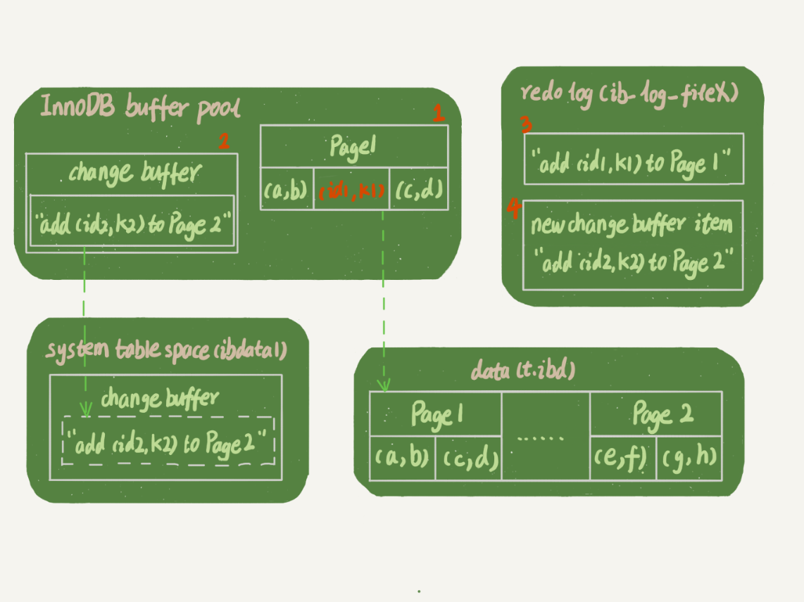

图2 带change buffer的更新过程

分析这条更新语句，你会发现它涉及了四个部分：内存、redo log（ib\_log\_fileX）、 数据表空间（t.ibd）、系统表空间（ibdata1）。

这条更新语句做了如下的操作（按照图中的数字顺序）：

1. Page 1在内存中，直接更新内存；

2. Page 2没有在内存中，就在内存的change buffer区域，记录下“我要往Page 2插入一行”这个信息

3. 将上述两个动作记入redo log中（图中3和4）。


做完上面这些，事务就可以完成了。所以，你会看到，执行这条更新语句的成本很低，就是写了两处内存，然后写了一处磁盘（两次操作合在一起写了一次磁盘），而且还是顺序写的。

同时，图中的两个虚线箭头，是后台操作，不影响更新的响应时间。

那在这之后的读请求，要怎么处理呢？

比如，我们现在要执行 select \* from t where k in (k1, k2)。这里，我画了这两个读请求的流程图。

如果读语句发生在更新语句后不久，内存中的数据都还在，那么此时的这两个读操作就与系统表空间（ibdata1）和 redo log（ib\_log\_fileX）无关了。所以，我在图中就没画出这两部分。

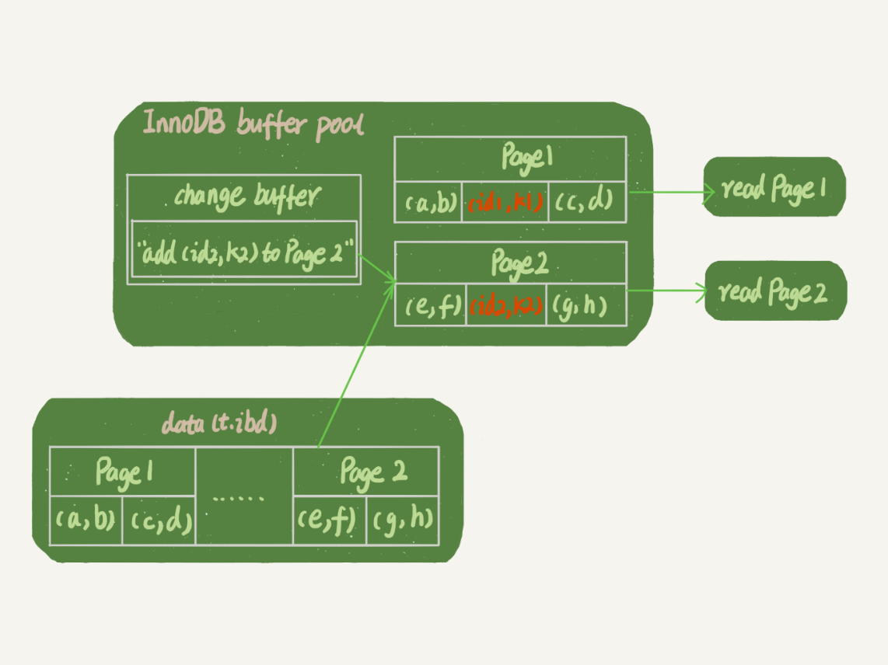

图3 带change buffer的读过程

从图中可以看到：

1. 读Page 1的时候，直接从内存返回。有几位同学在前面文章的评论中问到，WAL之后如果读数据，是不是一定要读盘，是不是一定要从redo log里面把数据更新以后才可以返回？其实是不用的。你可以看一下图3的这个状态，虽然磁盘上还是之前的数据，但是这里直接从内存返回结果，结果是正确的。

2. 要读Page 2的时候，需要把Page 2从磁盘读入内存中，然后应用change buffer里面的操作日志，生成一个正确的版本并返回结果。


可以看到，直到需要读Page 2的时候，这个数据页才会被读入内存。

所以，如果要简单地对比这两个机制在提升更新性能上的收益的话， **redo log 主要节省的是随机写磁盘的IO消耗（转成顺序写），而change buffer主要节省的则是随机读磁盘的IO消耗。**


### 小结

今天，我从普通索引和唯一索引的选择开始，和你分享了数据的查询和更新过程，然后说明了change buffer的机制以及应用场景，最后讲到了索引选择的实践。

由于唯一索引用不上change buffer的优化机制，因此如果业务可以接受，从性能角度出发我建议你优先考虑非唯一索引。


## MySQL为什么有时候会选错索引？


### 优化器的逻辑

而优化器选择索引的目的，是找到一个最优的执行方案，并用最小的代价去执行语句。在数据库里面，扫描行数是影响执行代价的因素之一。扫描的行数越少，意味着访问磁盘数据的次数越少，消耗的CPU资源越少。

当然，扫描行数并不是唯一的判断标准，优化器还会结合是否使用临时表、是否排序等因素进行综合判断。

我们这个简单的查询语句并没有涉及到临时表和排序，所以MySQL选错索引肯定是在判断扫描行数的时候出问题了。

那么，问题就是： **扫描行数是怎么判断的？**

MySQL在真正开始执行语句之前，并不能精确地知道满足这个条件的记录有多少条，而只能根据统计信息来估算记录数。

这个统计信息就是索引的“区分度”。显然，一个索引上不同的值越多，这个索引的区分度就越好。而一个索引上不同的值的个数，我们称之为“基数”（cardinality）。也就是说，这个基数越大，索引的区分度越好。


那么， **MySQL是怎样得到索引的基数的呢？** 这里，我给你简单介绍一下MySQL采样统计的方法。

为什么要采样统计呢？因为把整张表取出来一行行统计，虽然可以得到精确的结果，但是代价太高了，所以只能选择“采样统计”。

采样统计的时候，InnoDB默认会选择N个数据页，统计这些页面上的不同值，得到一个平均值，然后乘以这个索引的页面数，就得到了这个索引的基数。

而数据表是会持续更新的，索引统计信息也不会固定不变。所以，当变更的数据行数超过1/M的时候，会自动触发重新做一次索引统计。

在MySQL中，有两种存储索引统计的方式，可以通过设置参数innodb\_stats\_persistent的值来选择：

- 设置为on的时候，表示统计信息会持久化存储。这时，默认的N是20，M是10。
- 设置为off的时候，表示统计信息只存储在内存中。这时，默认的N是8，M是16。

由于是采样统计，所以不管N是20还是8，这个基数都是很容易不准的。


## 怎么给字符串字段加索引？

如果email这个字段上没有索引，那么这个语句就只能做全表扫描。

同时，MySQL是支持前缀索引的，也就是说，你可以定义字符串的一部分作为索引。默认地，如果你创建索引的语句不指定前缀长度，那么索引就会包含整个字符串。

比如，这两个在email字段上创建索引的语句：

```
mysql> alter table SUser add index index1(email);
或
mysql> alter table SUser add index index2(email(6));
```

第一个语句创建的index1索引里面，包含了每个记录的整个字符串；而第二个语句创建的index2索引里面，对于每个记录都是只取前6个字节。

那么，这两种不同的定义在数据结构和存储上有什么区别呢？如图2和3所示，就是这两个索引的示意图。

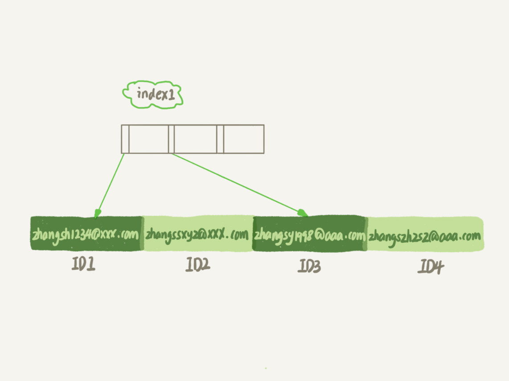

图1 email 索引结构


图2 email(6) 索引结构

**从图中你可以看到，由于email(6)这个索引结构中每个邮箱字段都只取前6个字节（即：zhangs），所以占用的空间会更小，这就是使用前缀索引的优势。**

**但，这同时带来的损失是，可能会增加额外的记录扫描次数。**

接下来，我们再看看下面这个语句，在这两个索引定义下分别是怎么执行的。

```
select id,name,email from SUser where email='zhangssxyz@xxx.com';
```

**如果使用的是index1**（即email整个字符串的索引结构），执行顺序是这样的：

1. 从index1索引树找到满足索引值是’zhangssxyz@xxx.com’的这条记录，取得ID2的值；

2. 到主键上查到主键值是ID2的行，判断email的值是正确的，将这行记录加入结果集；

3. 取index1索引树上刚刚查到的位置的下一条记录，发现已经不满足email='zhangssxyz@xxx.com’的条件了，循环结束。


这个过程中，只需要回主键索引取一次数据，所以系统认为只扫描了一行。

**如果使用的是index2**（即email(6)索引结构），执行顺序是这样的：

1. 从index2索引树找到满足索引值是’zhangs’的记录，找到的第一个是ID1；

2. 到主键上查到主键值是ID1的行，判断出email的值不是’zhangssxyz@xxx.com’，这行记录丢弃；

3. 取index2上刚刚查到的位置的下一条记录，发现仍然是’zhangs’，取出ID2，再到ID索引上取整行然后判断，这次值对了，将这行记录加入结果集；

4. 重复上一步，直到在idxe2上取到的值不是’zhangs’时，循环结束。


在这个过程中，要回主键索引取4次数据，也就是扫描了4行。

**通过这个对比，你很容易就可以发现，使用前缀索引后，可能会导致查询语句读数据的次数变多。**

但是，对于这个查询语句来说，如果你定义的index2不是email(6)而是email(7），也就是说取email字段的前7个字节来构建索引的话，即满足前缀’zhangss’的记录只有一个，也能够直接查到ID2，只扫描一行就结束了。

也就是说 **使用前缀索引，定义好长度，就可以做到既节省空间，又不用额外增加太多的查询成本。**

于是，你就有个问题：当要给字符串创建前缀索引时，有什么方法能够确定我应该使用多长的前缀呢？

实际上，我们在建立索引时关注的是区分度，区分度越高越好。因为区分度越高，意味着重复的键值越少。因此，我们可以通过统计索引上有多少个不同的值来判断要使用多长的前缀。

首先，你可以使用下面这个语句，算出这个列上有多少个不同的值：

```
mysql> select count(distinct email) as L from SUser;
```

然后，依次选取不同长度的前缀来看这个值，比如我们要看一下4~7个字节的前缀索引，可以用这个语句：

```
mysql> select
  count(distinct left(email,4)）as L4,
  count(distinct left(email,5)）as L5,
  count(distinct left(email,6)）as L6,
  count(distinct left(email,7)）as L7,
from SUser;

```

当然，使用前缀索引很可能会损失区分度，所以你需要预先设定一个可以接受的损失比例，比如5%。然后，在返回的L4~L7中，找出不小于 L \* 95%的值，假设这里L6、L7都满足，你就可以选择前缀长度为6。


### 前缀索引对覆盖索引的影响

前面我们说了使用前缀索引可能会增加扫描行数，这会影响到性能。其实，前缀索引的影响不止如此，我们再看一下另外一个场景。

你先来看看这个SQL语句：

```
select id,email from SUser where email='zhangssxyz@xxx.com';
```

与前面例子中的SQL语句

```
select id,name,email from SUser where email='zhangssxyz@xxx.com';
```

相比，这个语句只要求返回id和email字段。

所以，如果使用index1（即email整个字符串的索引结构）的话，可以利用覆盖索引，从index1查到结果后直接就返回了，不需要回到ID索引再去查一次。而如果使用index2（即email(6)索引结构）的话，就不得不回到ID索引再去判断email字段的值。

即使你将index2的定义修改为email(18)的前缀索引，这时候虽然index2已经包含了所有的信息，但InnoDB还是要回到id索引再查一下，因为系统并不确定前缀索引的定义是否截断了完整信息。

也就是说，**使用前缀索引就用不上覆盖索引对查询性能的优化了，这也是你在选择是否使用前缀索引时需要考虑的一个因素。**


### 其他方式

假设你维护的数据库是一个市的公民信息系统，这时候如果对身份证号做长度为6的前缀索引的话，这个索引的区分度就非常低了。

按照我们前面说的方法，可能你需要创建长度为12以上的前缀索引，才能够满足区分度要求。

但是，索引选取的越长，占用的磁盘空间就越大，相同的数据页能放下的索引值就越少，搜索的效率也就会越低。

那么，如果我们能够确定业务需求里面只有按照身份证进行等值查询的需求，还有没有别的处理方法呢？这种方法，既可以占用更小的空间，也能达到相同的查询效率。

答案是，有的。

**第一种方式是使用倒序存储。** 如果你存储身份证号的时候把它倒过来存，每次查询的时候，你可以这么写：

```
mysql> select field_list from t where id_card = reverse('input_id_card_string');
```

由于身份证号的最后6位没有地址码这样的重复逻辑，所以最后这6位很可能就提供了足够的区分度。当然了，实践中你不要忘记使用count(distinct)方法去做个验证。

**第二种方式是使用hash字段。** 你可以在表上再创建一个整数字段，来保存身份证的校验码，同时在这个字段上创建索引。

```
mysql> alter table t add id_card_crc int unsigned, add index(id_card_crc);
```

然后每次插入新记录的时候，都同时用crc32()这个函数得到校验码填到这个新字段。由于校验码可能存在冲突，也就是说两个不同的身份证号通过crc32()函数得到的结果可能是相同的，所以你的查询语句where部分要判断id\_card的值是否精确相同。

```
mysql> select field_list from t where id_card_crc=crc32('input_id_card_string') and id_card='input_id_card_string'
```

这样，索引的长度变成了4个字节，比原来小了很多。

接下来，我们再一起看看 **使用倒序存储和使用hash字段这两种方法的异同点。**

首先，它们的相同点是，都不支持范围查询。倒序存储的字段上创建的索引是按照倒序字符串的方式排序的，已经没有办法利用索引方式查出身份证号码在\[ID\_X, ID\_Y\]的所有市民了。同样地，hash字段的方式也只能支持等值查询。

它们的区别，主要体现在以下三个方面：

1. 从占用的额外空间来看，倒序存储方式在主键索引上，不会消耗额外的存储空间，而hash字段方法需要增加一个字段。当然，倒序存储方式使用4个字节的前缀长度应该是不够的，如果再长一点，这个消耗跟额外这个hash字段也差不多抵消了。

2. 在CPU消耗方面，倒序方式每次写和读的时候，都需要额外调用一次reverse函数，而hash字段的方式需要额外调用一次crc32()函数。如果只从这两个函数的计算复杂度来看的话，reverse函数额外消耗的CPU资源会更小些。

3. 从查询效率上看，使用hash字段方式的查询性能相对更稳定一些。因为crc32算出来的值虽然有冲突的概率，但是概率非常小，可以认为每次查询的平均扫描行数接近1。而倒序存储方式毕竟还是用的前缀索引的方式，也就是说还是会增加扫描行数。


### 小结

在今天这篇文章中，我跟你聊了聊字符串字段创建索引的场景。我们来回顾一下，你可以使用的方式有：

1. 直接创建完整索引，这样可能比较占用空间；

2. 创建前缀索引，节省空间，但会增加查询扫描次数，并且不能使用覆盖索引；

3. 倒序存储，再创建前缀索引，用于绕过字符串本身前缀的区分度不够的问题；

4. 创建hash字段索引，查询性能稳定，有额外的存储和计算消耗，跟第三种方式一样，都不支持范围扫描。


# 并发访问控制

数据库锁设计的初衷是处理并发问题。作为多用户共享的资源，当出现并发访问的时候，数据库需要合理地控制资源的访问规则。而锁就是用来实现这些访问规则的重要数据结构。根据加锁的范围，MySQL里面的锁大致可以分成**全局锁、表级锁和行锁**三类。


## 全局锁

顾名思义，全局锁就是对整个数据库实例加锁。MySQL提供了一个加全局读锁的方法，命令是 **Flush tables with read lock (FTWRL)**。当你需要让整个库处于只读状态的时候，可以使用这个命令，之后其他线程的以下语句会被阻塞：数据更新语句（数据的增删改）、数据定义语句（包括建表、修改表结构等）和更新类事务的提交语句。

**全局锁的典型使用场景是，做全库逻辑备份。** 也就是把整库每个表都select出来存成文本。

不加锁的话，备份系统备份的得到的库不是一个逻辑时间点，这个视图是逻辑不一致的。

官方自带的逻辑备份工具是mysqldump。当mysqldump使用参数–single-transaction的时候，导数据之前就会启动一个事务，来确保拿到一致性视图。而由于MVCC的支持，这个过程中数据是可以正常更新的。

你一定在疑惑，有了这个功能，为什么还需要FTWRL呢？ **一致性读是好，但前提是引擎要支持这个隔离级别。** 比如，对于MyISAM这种不支持事务的引擎，如果备份过程中有更新，总是只能取到最新的数据，那么就破坏了备份的一致性。这时，我们就需要使用FTWRL命令了。

所以， **single-transaction方法只适用于所有的表使用事务引擎的库。** 如果有的表使用了不支持事务的引擎，那么备份就只能通过FTWRL方法。这往往是DBA要求业务开发人员使用InnoDB替代MyISAM的原因之一。

你也许会问， **既然要全库只读，为什么不使用set global readonly=true的方式呢**？确实readonly方式也可以让全库进入只读状态，但我还是会建议你用FTWRL方式，主要有两个原因：

- 一是，在有些系统中，readonly的值会被用来做其他逻辑，比如用来判断一个库是主库还是备库。因此，修改global变量的方式影响面更大，我不建议你使用。
- 二是，在异常处理机制上有差异。如果执行FTWRL命令之后由于客户端发生异常断开，那么MySQL会自动释放这个全局锁，整个库回到可以正常更新的状态。而将整个库设置为readonly之后，如果客户端发生异常，则数据库就会一直保持readonly状态，这样会导致整个库长时间处于不可写状态，风险较高。

业务的更新不只是增删改数据（DML)，还有可能是加字段等修改表结构的操作（DDL）。不论是哪种方法，一个库被全局锁上以后，你要对里面任何一个表做加字段操作，都是会被锁住的。

但是，即使没有被全局锁住，加字段也不是就能一帆风顺的，因为你还会碰到接下来我们要介绍的表级锁。


## 表级锁

MySQL里面表级别的锁有两种：一种是表锁，一种是元数据锁（meta data lock，MDL)。

**表锁的语法是 lock tables … read/write。** 与FTWRL类似，可以用unlock tables主动释放锁，也可以在客户端断开的时候自动释放。需要注意，lock tables语法除了会限制别的线程的读写外，也限定了本线程接下来的操作对象。

举个例子, 如果在某个线程A中执行lock tables t1 read, t2 write; 这个语句，则其他线程写t1、读写t2的语句都会被阻塞。同时，线程A在执行unlock tables之前，也只能执行读t1、读写t2的操作。连写t1都不允许，自然也不能访问其他表。

在还没有出现更细粒度的锁的时候，表锁是最常用的处理并发的方式。而对于InnoDB这种支持行锁的引擎，一般不使用lock tables命令来控制并发，毕竟锁住整个表的影响面还是太大。

**另一类表级的锁是MDL（metadata lock)。** MDL不需要显式使用，在访问一个表的时候会被自动加上。MDL的作用是，保证读写的正确性。你可以想象一下，如果一个查询正在遍历一个表中的数据，而执行期间另一个线程对这个表结构做变更，删了一列，那么查询线程拿到的结果跟表结构对不上，肯定是不行的。

因此，在MySQL 5.5版本中引入了MDL，**当对一个表做增删改查操作的时候，加MDL读锁（可以同时进行增删改查）；当要对表做结构变更操作的时候，加MDL写锁。**

- 读锁之间不互斥，因此你可以有多个线程同时对一张表增删改查。

- 读写锁之间、写锁之间是互斥的，用来保证变更表结构操作的安全性。因此，如果有两个线程要同时给一个表加字段，其中一个要等另一个执行完才能开始执行。


虽然MDL锁是系统默认会加的，但却是你不能忽略的一个机制。比如下面这个例子，我经常看到有人掉到这个坑里：给一个小表加个字段，导致整个库挂了。

你肯定知道，给一个表加字段，或者修改字段，或者加索引，需要扫描全表的数据。在对大表操作的时候，你肯定会特别小心，以免对线上服务造成影响。而实际上，即使是小表，操作不慎也会出问题。

**因为会存在修改表的操作在等待写锁，而导致后面的增删改查的操作也阻塞。**


## 行锁

MySQL的行锁是在引擎层由各个引擎自己实现的。但并不是所有的引擎都支持行锁，比如MyISAM引擎就不支持行锁。不支持行锁意味着并发控制只能使用表锁，对于这种引擎的表，同一张表上任何时刻只能有一个更新在执行，这就会影响到业务并发度。InnoDB是支持行锁的，这也是MyISAM被InnoDB替代的重要原因之一。

顾名思义，**行锁就是针对数据表中行记录的锁。**这很好理解，比如事务A更新了一行，而这时候事务B也要**更新同一行**（针对同一行进行操作，必须等待一个事务完成后，另一个事务才能操作），则必须等事务A的操作完成后才能进行更新。


### 两阶段锁


这个问题的结论取决于事务A在执行完两条update语句后，持有哪些锁，以及在什么时候释放。你可以验证一下：实际上事务B的update语句会被阻塞，直到事务A执行commit之后，事务B才能继续执行。

知道了这个答案，你一定知道了事务A持有的两个记录的行锁，都是在commit的时候才释放的。

也就是说， **在InnoDB事务中，行锁是在需要的时候才加上的，但并不是不需要了就立刻释放，而是要等到事务结束时才释放。这个就是两阶段锁协议。**


### 死锁和死锁检测

**当并发系统中不同线程出现循环资源依赖，涉及的线程都在等待别的线程释放资源时，就会导致这几个线程都进入无限等待的状态，称为死锁。**这里我用数据库中的行锁举个例子。

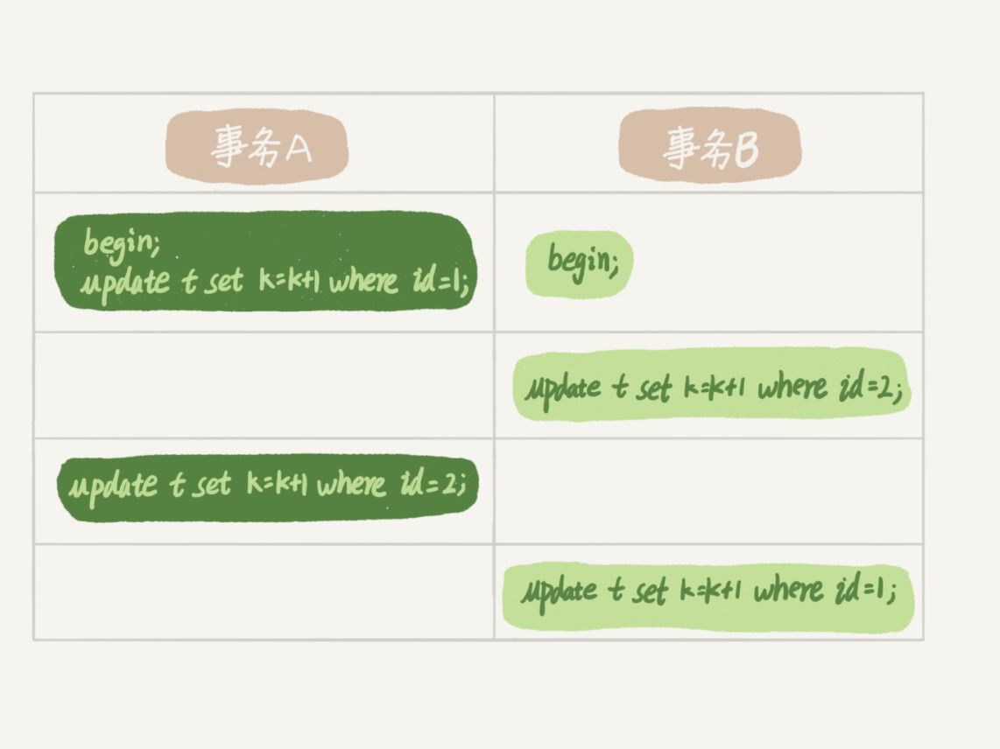

这时候，事务A在等待事务B释放id=2的行锁，而事务B在等待事务A释放id=1的行锁。 事务A和事务B在互相等待对方的资源释放，就是进入了死锁状态。**当出现死锁以后，有两种策略（因为互斥条件和循环等待不容易破环，因此只能破环请求并保持和不剥夺条件）：**1

- 一种策略是，直接进入等待，**直到超时**。这个超时时间可以通过参 innodb\_lock\_wait\_timeout来设置。
- 另一种策略是，**发起死锁检测，发现死锁后，主动回滚**死锁链条中的某一个事务，让其他事务得以继续执行。将参数innodb\_deadlock\_detect设置为on，表示开启这个逻辑。

在InnoDB中，innodb\_lock\_wait\_timeout的默认值是50s，意味着如果采用第一个策略，当出现死锁以后，第一个被锁住的线程要过50s才会超时退出，然后其他线程才有可能继续执行。对于在线服务来说，这个等待时间往往是无法接受的。

但是，我们又不可能直接把这个时间设置成一个很小的值，比如1s。这样当出现死锁的时候，确实很快就可以解开，但如果不是死锁，而是简单的锁等待呢？所以，超时时间设置太短的话，会出现很多误伤。

**所以，正常情况下我们还是要采用第二种策略，即：主动死锁检测，而且innodb\_deadlock\_detect的默认值本身就是on。主动死锁检测在发生死锁的时候，是能够快速发现并进行处理的，但是它也是有额外负担的。**

你可以想象一下这个过程：每当一个事务被锁的时候，就要看看它所依赖的线程有没有被别人锁住，如此循环，最后判断是否出现了循环等待，也就是死锁。

那如果是我们上面说到的所有事务都要更新同一行的场景呢？

每个新来的被堵住的线程，都要判断会不会由于自己的加入导致了死锁，这是一个时间复杂度是O(n)的操作。假设有1000个并发线程要同时更新同一行，那么死锁检测操作就是100万这个量级的。虽然最终检测的结果是没有死锁，但是这期间要消耗大量的CPU资源。因此，你就会看到CPU利用率很高，但是每秒却执行不了几个事务。

根据上面的分析，我们来讨论一下，怎么解决由这种热点行更新导致的性能问题呢？问题的症结在于，死锁检测要耗费大量的CPU资源。

**一种头痛医头的方法，就是如果你能确保这个业务一定不会出现死锁，可以临时把死锁检测关掉。** 但是这种操作本身带有一定的风险，因为业务设计的时候一般不会把死锁当做一个严重错误，毕竟出现死锁了，就回滚，然后通过业务重试一般就没问题了，这是业务无损的。**而关掉死锁检测意味着可能会出现大量的超时，这是业务有损的。**

**另一个思路是控制并发度。** 根据上面的分析，你会发现如果并发能够控制住，比如同一行同时最多只有10个线程在更新，那么死锁检测的成本很低，就不会出现这个问题。一个直接的想法就是，在客户端做并发控制。但是，你会很快发现这个方法不太可行，因为客户端很多。我见过一个应用，有600个客户端，这样即使每个客户端控制到只有5个并发线程，汇总到数据库服务端以后，峰值并发数也可能要达到3000。

因此，这个并发控制要做在数据库服务端。如果你有中间件，可以考虑在中间件实现；如果你的团队有能修改MySQL源码的人，也可以做在MySQL里面。基本思路就是，对于相同行的更新，在进入引擎之前排队。这样在InnoDB内部就不会有大量的死锁检测工作了。

可能你会问， **如果团队里暂时没有数据库方面的专家，不能实现这样的方案，能不能从设计上优化这个问题呢？**

**你可以考虑通过将一行改成逻辑上的多行来减少锁冲突。**还是以影院账户为例，可以考虑放在多条记录上，比如10个记录，影院的账户总额等于这10个记录的值的总和。这样每次要给影院账户加金额的时候，随机选其中一条记录来加。这样每次冲突概率变成原来的1/10，可以减少锁等待个数，也就减少了死锁检测的CPU消耗。

这个方案看上去是无损的，但其实这类方案需要根据业务逻辑做详细设计。如果账户余额可能会减少，比如退票逻辑，那么这时候就需要考虑当一部分行记录变成0的时候，代码要有特殊处理。


#  MySQL性能

## 为什么我的MySQL会“抖”一下？

做下类比的话，掌柜记账的账本是数据文件，记账用的粉板是日志文件（redo log），掌柜的记忆就是内存。

掌柜总要找时间把账本更新一下，这对应的就是把内存里的数据写入磁盘的过程，术语就是flush。在这个flush操作执行之前，孔乙己的赊账总额，其实跟掌柜手中账本里面的记录是不一致的。因为孔乙己今天的赊账金额还只在粉板上，而账本里的记录是老的，还没把今天的赊账算进去。

**当内存数据页跟磁盘数据页内容不一致的时候，我们称这个内存页为“脏页”。内存数据写入到磁盘后，内存和磁盘上的数据页的内容就一致了，称为“干净页”**。

不论是脏页还是干净页，都在内存中。在这个例子里，内存对应的就是掌柜的记忆。

接下来，我们用一个示意图来展示一下“孔乙己赊账”的整个操作过程。假设原来孔乙己欠账10文，这次又要赊9文。


图1 “孔乙己赊账”更新和flush过程

回到文章开头的问题，你不难想象，平时执行很快的更新操作，其实就是在写内存和日志，而MySQL偶尔“抖”一下的那个瞬间，可能就是在刷脏页（flush）。

**那么，什么情况会引发数据库的flush过程呢？**

我们还是继续用咸亨酒店掌柜的这个例子，想一想：掌柜在什么情况下会把粉板上的赊账记录改到账本上？

1）**第一种场景是，粉板满了，记不下了。**这时候如果再有人来赊账，掌柜就只得放下手里的活儿，将粉板上的记录擦掉一些，留出空位以便继续记账。当然在擦掉之前，他必须先将正确的账目记录到账本中才行。


  这个场景，对应的就是InnoDB的redo log写满了。这时候系统会停止所有更新操作，把checkpoint往前推进，redo log留出空间可以继续写。我在第二讲画了一个redo log的示意图，这里我改成环形，便于大家理解。

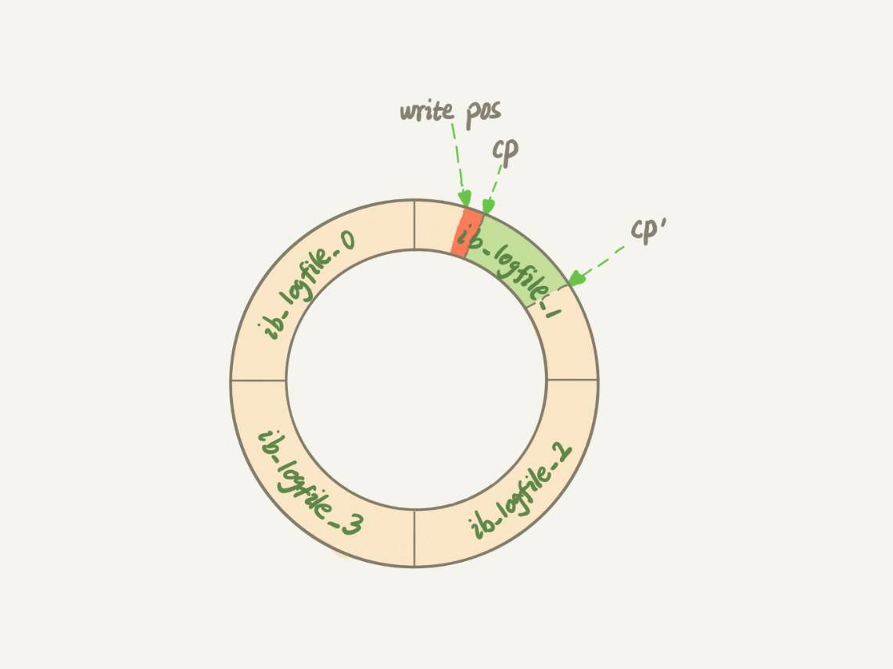

checkpoint可不是随便往前修改一下位置就可以的。比如图2中，把checkpoint位置从CP推进到CP’，就需要将两个点之间的日志（浅绿色部分），对应的所有脏页都flush到磁盘上。之后，图中从write pos到CP’之间就是可以再写入的redo log的区域。

**2）第二种场景是，这一天生意太好，要记住的事情太多，掌柜发现自己快记不住了，赶紧找出账本把孔乙己这笔账先加进去。**


  **这种场景，对应的就是系统内存不足。**当需要新的内存页，而内存不够用的时候，就要淘汰一些数据页，空出内存给别的数据页使用。如果淘汰的是“脏页”，就要先将脏页写到磁盘。


  你一定会说，这时候难道不能直接把内存淘汰掉，下次需要请求的时候，从磁盘读入数据页，然后拿redo log出来应用不就行了？这里其实是从性能考虑的。如果刷脏页一定会写盘，就保证了每个数据页有两种状态：

  - 一种是内存里存在，内存里就肯定是正确的结果，直接返回；
  - 另一种是内存里没有数据，就可以肯定数据文件上是正确的结果，读入内存后返回。


3）第三种场景是，生意不忙的时候，或者打烊之后。这时候柜台没事，掌柜闲着也是闲着，不如更新账本。


  **这种场景，对应的就是MySQL认为系统“空闲”的时候。**当然，MySQL“这家酒店”的生意好起来可是会很快就能把粉板记满的，所以“掌柜”要合理地安排时间，即使是“生意好”的时候，也要见缝插针地找时间，只要有机会就刷一点“脏页”。


4）第四种场景是，年底了咸亨酒店要关门几天，需要把账结清一下。这时候掌柜要把所有账都记到账本上，这样过完年重新开张的时候，就能就着账本明确账目情况了。


  **这种场景，对应的就是MySQL正常关闭的情况。**这时候，MySQL会把内存的脏页都flush到磁盘上，这样下次MySQL启动的时候，就可以直接从磁盘上读数据，启动速度会很快。


接下来， **你可以分析一下上面四种场景对性能的影响。**

其中，第三种情况是属于MySQL空闲时的操作，这时系统没什么压力，而第四种场景是数据库本来就要关闭了。这两种情况下，你不会太关注“性能”问题。所以这里，我们主要来分析一下前两种场景下的性能问题。

第一种是“redo log写满了，要flush脏页”，这种情况是InnoDB要尽量避免的。因为出现这种情况的时候，整个系统就不能再接受更新了，所有的更新都必须堵住。如果你从监控上看，这时候更新数会跌为0。

第二种是“内存不够用了，要先将脏页写到磁盘”，这种情况其实是常态。 **InnoDB用缓冲池（buffer pool）管理内存，缓冲池中的内存页有三种状态：**

- 第一种是，还没有使用的；
- 第二种是，使用了并且是干净页；
- 第三种是，使用了并且是脏页。

InnoDB的策略是尽量使用内存，因此对于一个长时间运行的库来说，未被使用的页面很少。

而当要读入的数据页没有在内存的时候，就必须到缓冲池中申请一个数据页。这时候只能把最久不使用的数据页从内存中淘汰掉：如果要淘汰的是一个干净页，就直接释放出来复用；但如果是脏页呢，就必须将脏页先刷到磁盘，变成干净页后才能复用。

**所以，刷脏页虽然是常态，但是出现以下这两种情况，都是会明显影响性能的：**

1. **一个查询要淘汰的脏页个数太多，会导致查询的响应时间明显变长；**

2. **日志写满，更新全部堵住，写性能跌为0，这种情况对敏感业务来说，是不能接受的。**


所以，InnoDB需要有控制脏页比例的机制，来尽量避免上面的这两种情况。


### InnoDB刷脏页的控制策略

接下来，我就来和你说说InnoDB脏页的控制策略，以及和这些策略相关的参数。

首先，你要正确地告诉InnoDB所在主机的IO能力，这样InnoDB才能知道需要全力刷脏页的时候，可以刷多快。

这就要用到innodb\_io\_capacity这个参数了，它会告诉InnoDB你的磁盘能力。这个值我建议你设置成磁盘的IOPS。

他的主机磁盘用的是SSD，但是innodb\_io\_capacity的值设置的是300。于是，InnoDB认为这个系统的能力就这么差，所以刷脏页刷得特别慢，甚至比脏页生成的速度还慢，这样就造成了脏页累积，影响了查询和更新性能。

虽然我们现在已经定义了“全力刷脏页”的行为，但平时总不能一直是全力刷吧？毕竟磁盘能力不能只用来刷脏页，还需要服务用户请求。所以接下来，我们就一起看看InnoDB怎么控制引擎按照“全力”的百分比来刷脏页。

根据我前面提到的知识点，试想一下， **如果你来设计策略控制刷脏页的速度，会参考哪些因素呢？**

这个问题可以这么想，如果刷太慢，会出现什么情况？首先是内存脏页太多，其次是redo log写满。

所以，InnoDB的刷盘速度就是要参考这两个因素：**一个是脏页比例，一个是redo log写盘速度。**

InnoDB会根据这两个因素先单独算出两个数字。

参数innodb\_max\_dirty\_pages\_pct是脏页比例上限，默认值是75%。InnoDB会根据当前的脏页比例（假设为M），算出一个范围在0到100之间的数字，计算这个数字的伪代码类似这样：

```
F1(M)
{
  if M>=innodb_max_dirty_pages_pct then
      return 100;
  return 100*M/innodb_max_dirty_pages_pct;
}

```

InnoDB每次写入的日志都有一个序号，当前写入的序号跟checkpoint对应的序号之间的差值，我们假设为N。InnoDB会根据这个N算出一个范围在0到100之间的数字，这个计算公式可以记为F2(N)。F2(N)算法比较复杂，你只要知道N越大，算出来的值越大就好了。

然后， **根据上述算得的F1(M)和F2(N)两个值，取其中较大的值记为R，之后引擎就可以按照innodb\_io\_capacity定义的能力乘以R%来控制刷脏页的速度。**

上述的计算流程比较抽象，不容易理解，所以我画了一个简单的流程图。图中的F1、F2就是上面我们通过脏页比例和redo log写入速度算出来的两个值。

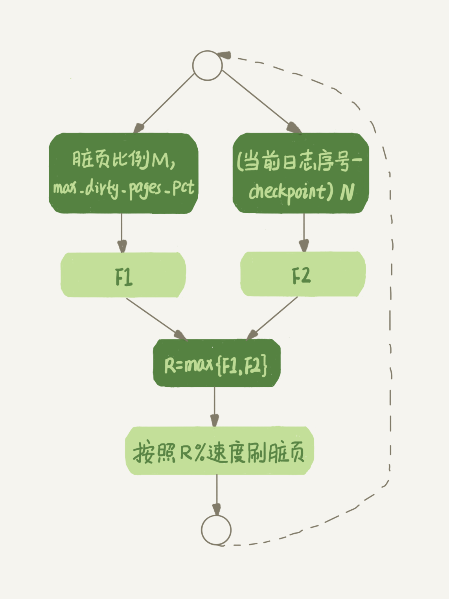

图3 InnoDB刷脏页速度策略

现在你知道了，InnoDB会在后台刷脏页，而刷脏页的过程是要将内存页写入磁盘。所以，无论是你的查询语句在需要内存的时候可能要求淘汰一个脏页，还是由于刷脏页的逻辑会占用IO资源并可能影响到了你的更新语句，都可能是造成你从业务端感知到MySQL“抖”了一下的原因。

要尽量避免这种情况，你就要合理地设置innodb\_io\_capacity的值，并且 **平时要多关注脏页比例，不要让它经常接近75%**。

其中，脏页比例是通过Innodb\_buffer\_pool\_pages\_dirty/Innodb\_buffer\_pool\_pages\_total得到的，具体的命令参考下面的代码：

```
mysql> select VARIABLE_VALUE into @a from global_status where VARIABLE_NAME = 'Innodb_buffer_pool_pages_dirty';
select VARIABLE_VALUE into @b from global_status where VARIABLE_NAME = 'Innodb_buffer_pool_pages_total';
select @a/@b;

```

接下来，我们再看一个有趣的策略。

一旦一个查询请求需要在执行过程中先flush掉一个脏页时，这个查询就可能要比平时慢了。而MySQL中的一个机制，可能让你的查询会更慢：在准备刷一个脏页的时候，如果这个数据页旁边的数据页刚好是脏页，就会把这个“邻居”也带着一起刷掉；而且这个把“邻居”拖下水的逻辑还可以继续蔓延，也就是对于每个邻居数据页，如果跟它相邻的数据页也还是脏页的话，也会被放到一起刷。

在InnoDB中，innodb\_flush\_neighbors 参数就是用来控制这个行为的，值为1的时候会有上述的“连坐”机制，值为0时表示不找邻居，自己刷自己的。

找“邻居”这个优化在机械硬盘时代是很有意义的，可以减少很多随机IO。机械硬盘的随机IOPS一般只有几百，相同的逻辑操作减少随机IO就意味着系统性能的大幅度提升。

而如果使用的是SSD这类IOPS比较高的设备的话，我就建议你把innodb\_flush\_neighbors的值设置成0。因为这时候IOPS往往不是瓶颈，而“只刷自己”，就能更快地执行完必要的刷脏页操作，减少SQL语句响应时间。

在MySQL 8.0中，innodb\_flush\_neighbors参数的默认值已经是0了。


### 小结

今天这篇文章，我延续第2篇中介绍的WAL的概念，和你解释了这个机制后续需要的刷脏页操作和执行时机。利用WAL技术，数据库将随机写转换成了顺序写，大大提升了数据库的性能。

但是，由此也带来了内存脏页的问题。脏页会被后台线程自动flush，也会由于数据页淘汰而触发flush，而刷脏页的过程由于会占用资源，可能会让你的更新和查询语句的响应时间长一些。在文章里，我也给你介绍了控制刷脏页的方法和对应的监控方式。


