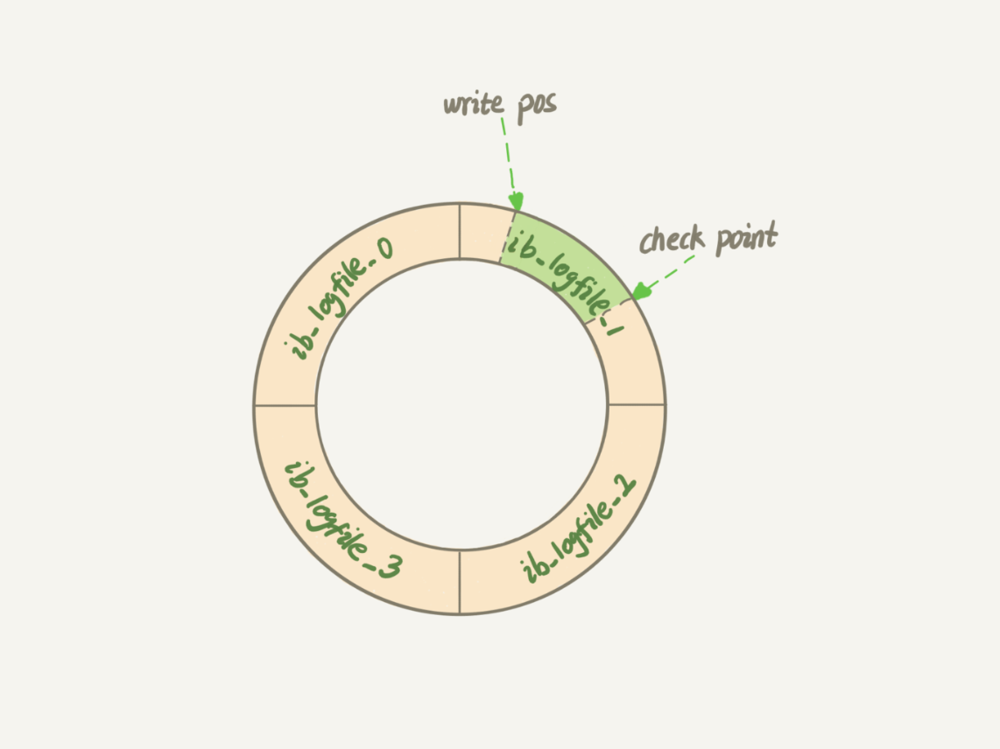
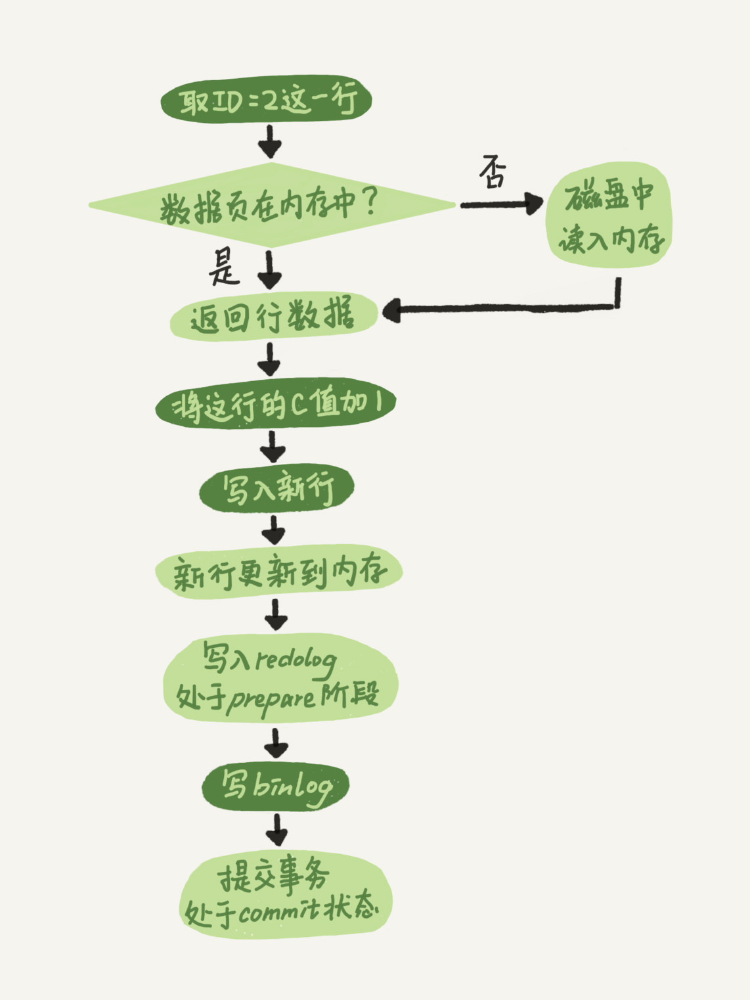
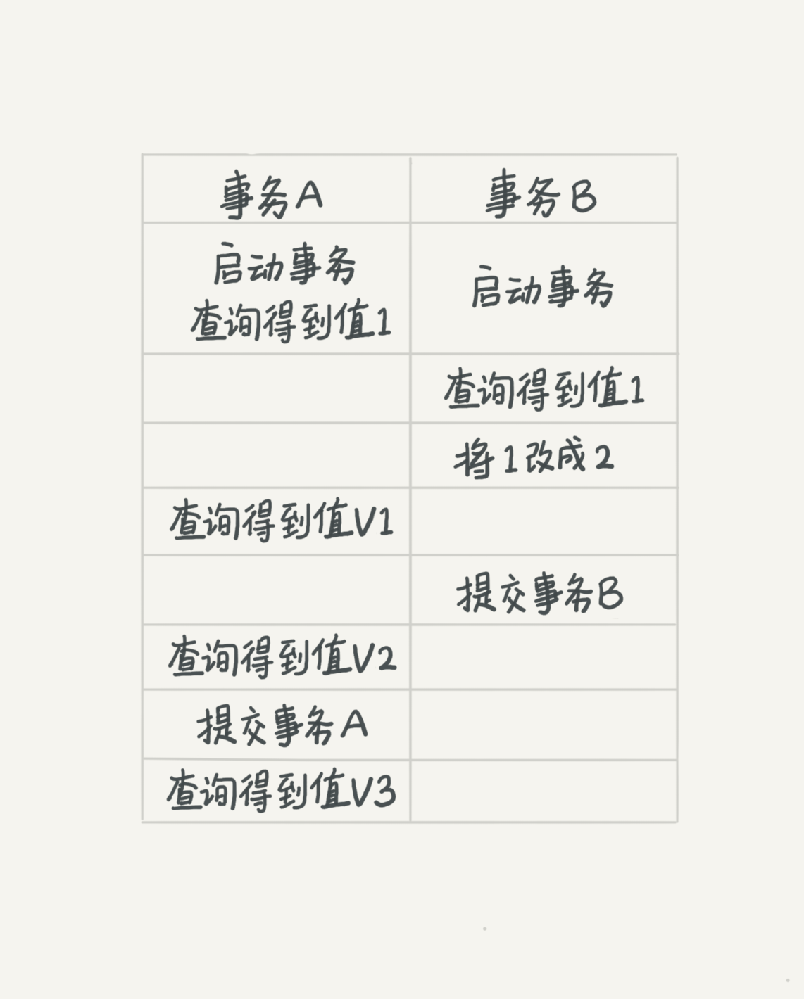
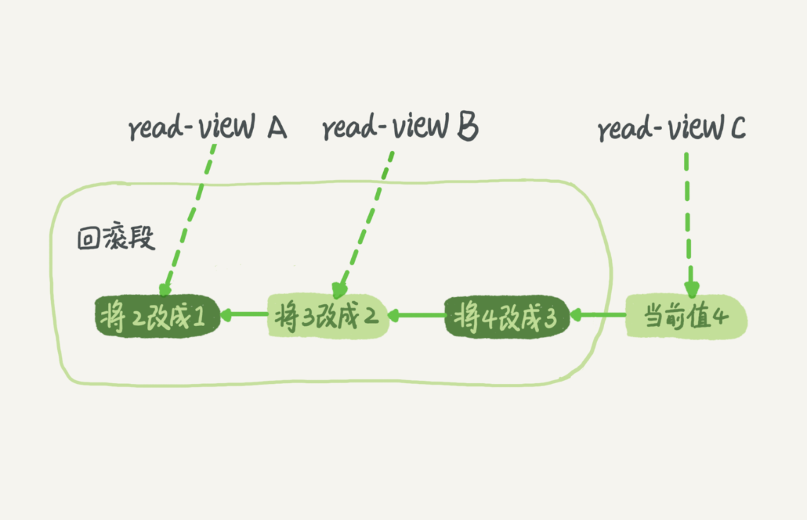
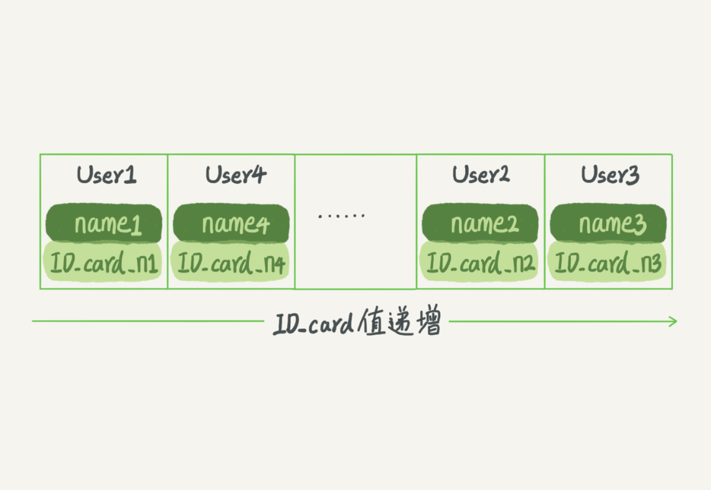
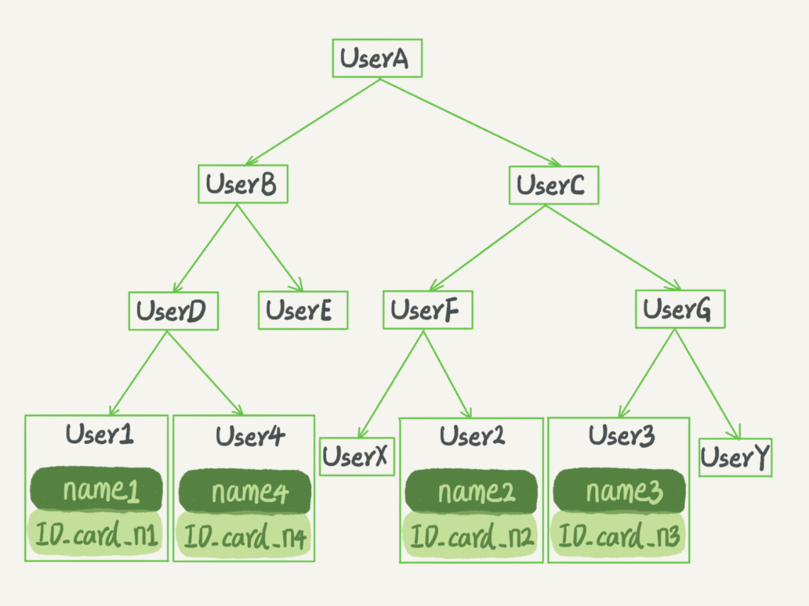
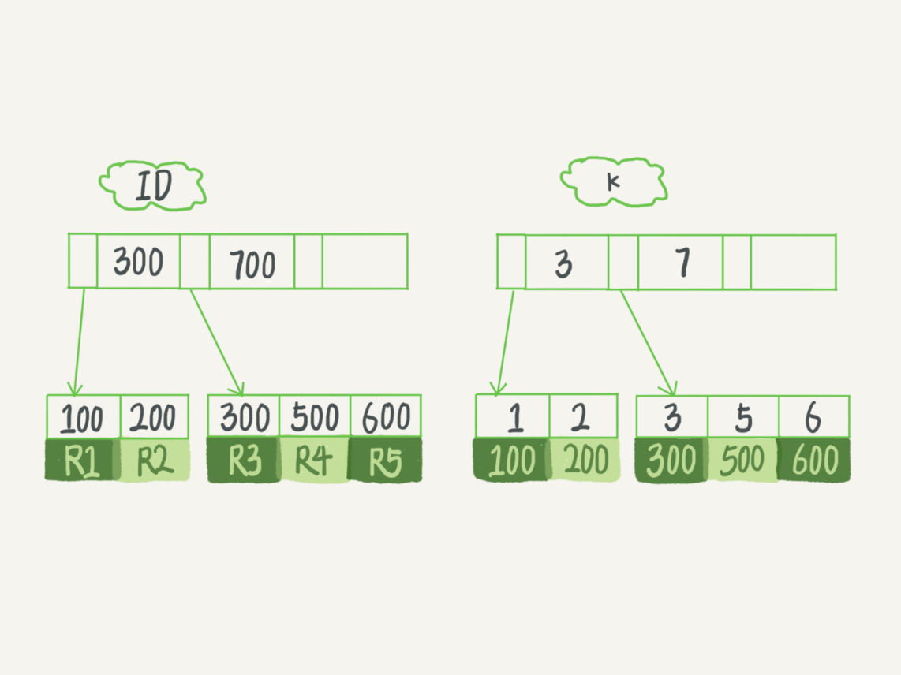
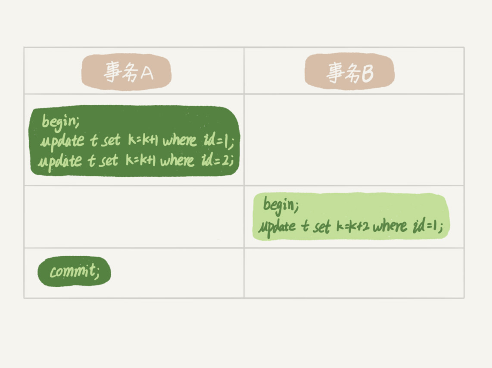
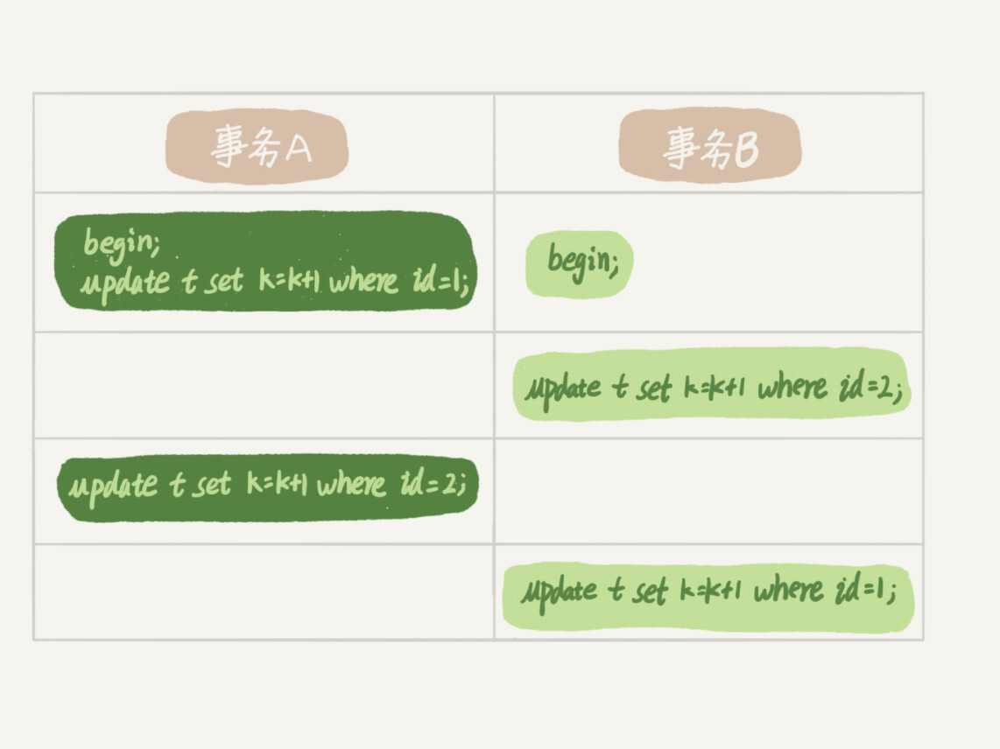

# 基础架构

下面我给出的是MySQL的基本架构示意图，从中你可以清楚地看到SQL语句在MySQL的各个功能模块中的执行过程。


**大体来说，MySQL可以分为Server层和存储引擎层两部分。**

Server层包括连接器、查询缓存、分析器、优化器、执行器等，涵盖MySQL的大多数核心服务功能，以及所有的内置函数（如日期、时间、数学和加密函数等），所有跨存储引擎的功能都在这一层实现，比如存储过程、触发器、视图等。

而存储引擎层负责数据的存储和提取。其架构模式是插件式的，支持InnoDB、MyISAM、Memory等多个存储引擎。现在最常用的存储引擎是InnoDB，它从MySQL 5.5.5版本开始成为了默认存储引擎。


## 连接器

连接器负责跟客户端建立连接、获取权限、维持和管理连接。当身份认证完成以后，如果没有后序操作，连接会进入空闲状态，但wait_timeout过期时，连接器会关闭该连接。

MySQL中一般是使用长连接，但是长连接过多是会导致内存占用更大，被系统强行杀掉（OOD），即MySQL异常重启。

怎么解决这个问题呢？你可以考虑以下两种方案。

1. 定期断开长连接。使用一段时间，或者程序里面判断执行过一个占用内存的大查询后，断开连接，之后要查询再重连。

2. 如果你用的是MySQL 5.7或更新版本，可以在每次执行一个比较大的操作后，通过执行 mysql\_reset\_connection来重新初始化连接资源。这个过程不需要重连和重新做权限验证，但是会将连接恢复到刚刚创建完时的状态。


## 查询缓存

**但是大多数情况下我会建议你不要使用查询缓存，为什么呢？因为查询缓存往往弊大于利。**

查询缓存的失效非常频繁，只要有对一个表的更新，这个表上所有的查询缓存都会被清空。因此很可能你费劲地把结果存起来，还没使用呢，就被一个更新全清空了。对于更新压力大的数据库来说，查询缓存的命中率会非常低。除非你的业务就是有一张静态表，很长时间才会更新一次。比如，一个系统配置表，那这张表上的查询才适合使用查询缓存。

**需要注意的是，MySQL 8.0版本直接将查询缓存的整块功能删掉了，也就是说8.0开始彻底没有这个功能了。**


## 分析器

了解客户端输入的是什么语句，即连接需求。

- 分析器先会做“词法分析”。你输入的是由多个字符串和空格组成的一条SQL语句，MySQL需要识别出里面的字符串分别是什么，代表什么。（识别关键字）
- 做完了这些识别以后，就要做“语法分析”。根据词法分析的结果，语法分析器会根据语法规则，判断你输入的这个SQL语句是否满足MySQL语法。（语法错误的话会报错）


## 优化器

优化器是在表里面有多个索引的时候，决定使用哪个索引；或者在一个语句有多表关联（join）的时候，决定各个表的连接顺序


## 执行器

开始执行语句

开始执行的时候，要先判断一下你对这个表T有没有执行查询的权限，如果没有，就会返回没有权限的错误，如下所示(在工程实现上，如果命中查询缓存，会在查询缓存返回结果的时候，做权限验证。查询也会在优化器之前调用precheck验证权限)。

如果有权限，就打开表继续执行。打开表的时候，执行器就会根据表的引擎定义，去使用这个引擎提供的接口。


# 日志系统

## redo log（相当于数据的缓存）

MySQL里经常说到的WAL技术，WAL的全称是Write-Ahead Logging，**它的关键点就是先写日志，再写磁盘，也就是先写粉板，等不忙的时候再写账本。**

具体来说，当有一条记录需要更新的时候，InnoDB引擎就会先把记录写到redo log（粉板）里面，并更新内存，这个时候更新就算完成了。同时，InnoDB引擎会在适当的时候，将这个操作记录更新到磁盘里面，而这个更新往往是在系统比较空闲的时候做，这就像打烊以后掌柜做的事。

如果今天赊账的不多，掌柜可以等打烊后再整理。但如果某天赊账的特别多，粉板写满了，又怎么办呢？这个时候掌柜只好放下手中的活儿，把粉板中的一部分赊账记录更新到账本中，然后把这些记录从粉板上擦掉，为记新账腾出空间。

与此类似，InnoDB的redo log是固定大小的，比如可以配置为一组4个文件，每个文件的大小是1GB，那么这块“粉板”总共就可以记录4GB的操作。从头开始写，写到末尾就又回到开头循环写，如下面这个图所示。



write pos是当前记录的位置，一边写一边后移，写到第3号文件末尾后就回到0号文件开头。checkpoint是当前要擦除的位置，也是往后推移并且循环的，擦除记录前要把记录更新到数据文件。

write pos和checkpoint之间的是“粉板”上还空着的部分，可以用来记录新的操作。如果write pos追上checkpoint，表示“粉板”满了，这时候不能再执行新的更新，得停下来先擦掉一些记录，把checkpoint推进一下。

有了redo log，InnoDB就可以保证即使数据库发生异常重启，之前提交的记录都不会丢失，这个能力称为 **crash-safe**。

要理解crash-safe这个概念，可以想想我们前面赊账记录的例子。只要赊账记录记在了粉板上或写在了账本上，之后即使掌柜忘记了，比如突然停业几天，恢复生意后依然可以通过账本和粉板上的数据明确赊账账目。


## binlog（操作日志）

MySQL整体来看，其实就有两块：一块是Server层，它主要做的是MySQL功能层面的事情；还有一块是引擎层，负责存储相关的具体事宜。上面我们聊到的粉板redo log是InnoDB引擎特有的日志，而Server层也有自己的日志，称为binlog（归档日志）。

这两种日志有以下三点不同。

1. redo log是InnoDB引擎特有的；binlog是MySQL的Server层实现的，所有引擎都可以使用。

2. redo log是**物理日志**，记录的是“在某个数据页上**做了什么修改**”；binlog是**逻辑日志**，记录的是这个语句的原始逻辑，比**如“给ID=2这一行的c字段加1** ”。

3. **redo log是循环写的，空间固定会用完**；**binlog是可以追加写入的**。“追加写”是指binlog文件写到一定大小后会切换到下一个，并不会覆盖以前的日志。


有了对这两个日志的概念性理解，我们再来看执行器和InnoDB引擎在执行这个简单的update语句时的内部流程。

1. 执行器先找引擎取ID=2这一行。ID是主键，引擎直接用树搜索找到这一行。如果ID=2这一行所在的数据页本来就在内存中，就直接返回给执行器；否则，需要先从磁盘读入内存，然后再返回。

2. 执行器拿到引擎给的行数据，把这个值加上1，比如原来是N，现在就是N+1，得到新的一行数据，再调用引擎接口写入这行新数据。

3. **引擎将这行新数据更新到内存中，同时将这个更新操作记录到redo log里面，此时redo log处于prepare状态。**然后告知执行器执行完成了，随时可以提交事务。）

4. 执行器生成这个操作的binlog，并把binlog写入磁盘。

5. **执行器调用引擎的提交事务接口，引擎把刚刚写入的redo log改成提交（commit）状态**，更新完成。


这里我给出这个update语句的执行流程图，图中浅色框表示是在InnoDB内部执行的，深色框表示是在执行器中执行的。



update语句执行流程

你可能注意到了，最后三步看上去有点“绕”，将redo log的写入拆成了两个步骤：prepare和commit，这就是"两阶段提交"。


## 两阶段提交

为什么必须有“两阶段提交”呢？这是为了让两份日志之间的逻辑一致。要说明这个问题，我们得从文章开头的那个问题说起： **怎样让数据库恢复到半个月内任意一秒的状态？**

前面我们说过了，binlog会记录所有的逻辑操作，并且是采用“追加写”的形式。如果你的DBA承诺说半个月内可以恢复，那么备份系统中一定会保存最近半个月的所有binlog，同时系统会定期做整库备份。这里的“定期”取决于系统的重要性，可以是一天一备，也可以是一周一备。

当需要恢复到指定的某一秒时，比如某天下午两点发现中午十二点有一次误删表，需要找回数据，那你可以这么做：

- 首先，找到最近的一次全量备份，如果你运气好，可能就是昨天晚上的一个备份，从这个备份恢复到临时库；
- 然后，从备份的时间点开始，将备份的binlog依次取出来，重放到中午误删表之前的那个时刻。

这样你的临时库就跟误删之前的线上库一样了，然后你可以把表数据从临时库取出来，按需要恢复到线上库去。

好了，说完了数据恢复过程，我们回来说说，为什么日志需要“两阶段提交”。这里不妨用反证法来进行解释。

由于redo log和binlog是两个独立的逻辑，如果不用两阶段提交，要么就是先写完redo log再写binlog，或者采用反过来的顺序。我们看看这两种方式会有什么问题。

仍然用前面的update语句来做例子。假设当前ID=2的行，字段c的值是0，再假设执行update语句过程中在写完第一个日志后，第二个日志还没有写完期间发生了crash，会出现什么情况呢？

1. **先写redo log后写binlog**。假设在redo log写完，binlog还没有写完的时候，MySQL进程异常重启。由于我们前面说过的，redo log写完之后，系统即使崩溃，仍然能够把数据恢复回来，所以恢复后这一行c的值是1。


   但是由于binlog没写完就crash了，这时候binlog里面就没有记录这个语句。因此，之后备份日志的时候，存起来的binlog里面就没有这条语句。


   然后你会发现，如果需要用这个binlog来恢复临时库的话，由于这个语句的binlog丢失，这个临时库就会少了这一次更新，恢复出来的这一行c的值就是0，与原库的值不同。

2. **先写binlog后写redo log**。如果在binlog写完之后crash，由于redo log还没写，崩溃恢复以后这个事务无效，所以这一行c的值是0。但是binlog里面已经记录了“把c从0改成1”这个日志。所以，在之后用binlog来恢复的时候就多了一个事务出来，恢复出来的这一行c的值就是1，与原库的值不同。


可以看到，如果不使用“两阶段提交”，那么数据库的状态就有可能和用它的日志恢复出来的库的状态不一致。

你可能会说，这个概率是不是很低，平时也没有什么动不动就需要恢复临时库的场景呀？

其实不是的，不只是误操作后需要用这个过程来恢复数据。当你需要扩容的时候，也就是需要再多搭建一些备库来增加系统的读能力的时候，现在常见的做法也是用全量备份加上应用binlog来实现的，这个“不一致”就会导致你的线上出现主从数据库不一致的情况。

简单说，redo log和binlog都可以用于表示事务的提交状态，而两阶段提交就是让这两个状态保持逻辑上的一致。


# 事务隔离

在MySQL中，事务支持是在引擎层实现的。你现在知道，MySQL是一个支持多引擎的系统，但并不是所有的引擎都支持事务。比如MySQL原生的MyISAM引擎就不支持事务，这也是MyISAM被InnoDB取代的重要原因之一。

### 隔离性与隔离级别

在谈隔离级别之前，你首先要知道，你隔离得越严实，效率就会越低。因此很多时候，我们都要在二者之间寻找一个平衡点。SQL标准的事务隔离级别包括：读未提交（read uncommitted）、读提交（read committed）、可重复读（repeatable read）和串行化（serializable ）。下面我逐一为你解释：

- 读未提交是指，一个事务还没提交时，它做的变更就能被别的事务看到。
- 读提交是指，一个事务提交之后，它做的变更才会被其他事务看到。
- 可重复读是指，一个事务执行过程中看到的数据，总是跟这个事务在启动时看到的数据是一致的。当然在可重复读隔离级别下，未提交变更对其他事务也是不可见的。
- 串行化，顾名思义是对于同一行记录，“写”会加“写锁”，“读”会加“读锁”。当出现读写锁冲突的时候，后访问的事务必须等前一个事务执行完成，才能继续执行。

其中“读提交”和“可重复读”比较难理解，所以我用一个例子说明这几种隔离级别。假设数据表T中只有一列，其中一行的值为1，下面是按照时间顺序执行两个事务的行为。



我们来看看在不同的隔离级别下，事务A会有哪些不同的返回结果，也就是图里面V1、V2、V3的返回值分别是什么。

- 若隔离级别是“读未提交”， 则V1的值就是2。这时候事务B虽然还没有提交，但是结果已经被A看到了。因此，V2、V3也都是2。**（全局透明）**
- 若隔离级别是“读提交”，则V1是1，V2的值是2。事务B的更新在提交后才能被A看到。所以， V3的值也是2。**（以事务为单位更新视图）**
- 若隔离级别是“可重复读”，则V1、V2是1，V3是2。之所以V2还是1，遵循的就是这个要求：事务在执行期间看到的数据前后必须是一致的。**（每个事务创建一张视图）**—— 月底对账
- 若隔离级别是“串行化”，则在事务B执行“将1改成2”的时候，会被锁住。直到事务A提交后，事务B才可以继续执行。所以从A的角度看， V1、V2值是1，V3的值是2。**（加锁）**

在实现上，**数据库里面会创建一个视图，访问的时候以视图的逻辑结果为准。在“可重复读”隔离级别下，这个视图是在事务启动时创建的，整个事务存在期间都用这个视图。在“读提交”隔离级别下，这个视图是在每个SQL语句开始执行的时候创建的。这里需要注意的是，“读未提交”隔离级别下直接返回记录上的最新值，没有视图概念；而“串行化”隔离级别下直接用加锁的方式来避免并行访问。**


### 事务隔离的实现

在MySQL中，实际上每条记录在更新的时候都会同时记录一条回滚操作。记录上的最新值，通过回滚操作，都可以得到前一个状态的值。



长事务意味着系统里面会存在很老的事务视图。由于这些事务随时可能访问数据库里面的任何数据，所以这个事务提交之前，数据库里面它可能用到的回滚记录都必须保留，这就会导致大量占用存储空间。


# 索引

一句话简单来说，索引的出现其实就是为了提高数据查询的效率，就像书的目录一样。一本500页的书，如果你想快速找到其中的某一个知识点，在不借助目录的情况下，那我估计你可得找一会儿。同样，对于数据库的表而言，索引其实就是它的“目录”。


## 索引的常见模型

索引的出现是为了提高查询效率，但是实现索引的方式却有很多种，所以这里也就引入了索引模型的概念。可以用于提高读写效率的数据结构很多，这里我先给你介绍三种常见、也比较简单的数据结构，它们分别是**哈希表、有序数组和搜索树。**


### 哈希表

哈希表是一种以键-值（key-value）存储数据的结构，我们只要输入待查找的键即key，就可以找到其对应的值即Value。哈希的思路很简单，把值放在数组里，用一个哈希函数把key换算成一个确定的位置，然后把value放在数组的这个位置。

不可避免地，多个key值经过哈希函数的换算，会出现同一个值的情况。处理这种情况的一种方法是，拉出一个链表。


需要注意的是，图中四个ID\_card\_n的值并不是递增的，这样做的好处是增加新的User时速度会很快，只需要往后追加。但缺点是，因为不是有序的，所以哈希索引做区间查询的速度是很慢的。

你可以设想下，如果你现在要找身份证号在\[ID\_card\_X, ID\_card\_Y\]这个区间的所有用户，就必须全部扫描一遍了。

所以， **哈希表这种结构适用于只有等值查询的场景**，比如Memcached及其他一些NoSQL引擎。


### 有序数组

而 **有序数组在等值查询和范围查询场景中的性能就都非常优秀**。还是上面这个根据身份证号查名字的例子，如果我们使用有序数组来实现的话，示意图如下所示：



这里我们假设身份证号没有重复，这个数组就是按照身份证号递增的顺序保存的。这时候如果你要查ID\_card\_n2对应的名字，用二分法就可以快速得到，这个时间复杂度是O(log(N))。

同时很显然，这个索引结构支持范围查询。你要查身份证号在\[ID\_card\_X, ID\_card\_Y\]区间的User，可以先用二分法找到ID\_card\_X（如果不存在ID\_card\_X，就找到大于ID\_card\_X的第一个User），然后向右遍历，直到查到第一个大于ID\_card\_Y的身份证号，退出循环。

如果仅仅看查询效率，有序数组就是最好的数据结构了。但是，在需要更新数据的时候就麻烦了，你往中间插入一个记录就必须得挪动后面所有的记录，成本太高。

所以， **有序数组索引只适用于静态存储引擎**，比如你要保存的是2017年某个城市的所有人口信息，这类不会再修改的数据。


### 二叉搜索树

二叉搜索树也是课本里的经典数据结构了。还是上面根据身份证号查名字的例子，如果我们用二叉搜索树来实现的话，示意图如下所示：



二叉搜索树的特点是：父节点左子树所有结点的值小于父节点的值，右子树所有结点的值大于父节点的值。这样如果你要查ID\_card\_n2的话，按照图中的搜索顺序就是按照UserA -> UserC -> UserF -> User2这个路径得到。这个时间复杂度是O(log(N))。

当然为了维持O(log(N))的查询复杂度，你就需要保持这棵树是平衡二叉树。为了做这个保证，更新的时间复杂度也是O(log(N))。

树可以有二叉，也可以有多叉。多叉树就是每个节点有多个儿子，儿子之间的大小保证从左到右递增。二叉树是搜索效率最高的，但是实际上大多数的数据库存储却并不使用二叉树。其原因是，索引不止存在内存中，还要写到磁盘上。

你可以想象一下一棵100万节点的平衡二叉树，树高20。一次查询可能需要访问20个数据块。在机械硬盘时代，从磁盘随机读一个数据块需要10 ms左右的寻址时间。也就是说，对于一个100万行的表，如果使用二叉树来存储，单独访问一个行可能需要20个10 ms的时间，这个查询可真够慢的。

**为了让一个查询尽量少地读磁盘，就必须让查询过程访问尽量少的数据块。那么，我们就不应该使用二叉树，而是要使用“N叉”树。这里，“N叉”树中的“N”取决于数据块的大小。**

**以InnoDB的一个整数字段索引为例，这个N差不多是1200。这棵树高是4的时候，就可以存1200的3次方个值，这已经17亿了。考虑到树根的数据块总是在内存中的，一个10亿行的表上一个整数字段的索引，查找一个值最多只需要访问3次磁盘。其实，树的第二层也有很大概率在内存中，那么访问磁盘的平均次数就更少了。**

N叉树由于在读写上的性能优点，以及适配磁盘的访问模式，已经被广泛应用在数据库引擎中了。


## InnoDB 的索引模型

在InnoDB中，表都是根据主键顺序以索引的形式存放的，这种存储方式的表称为索引组织表。又因为前面我们提到的，InnoDB使用了B+树索引模型，所以数据都是存储在B+树中的。

**每一个索引在InnoDB里面对应一棵B+树。**

假设，我们有一个主键列为ID的表，表中有字段k，并且在k上有索引。

```mysql
mysql> create table T(
id int primary key,
k int not null,
name varchar(16),
index (k))engine=InnoDB;
```

表中R1~R5的(ID,k)值分别为(100,1)、(200,2)、(300,3)、(500,5)和(600,6)，两棵树的示例示意图如下。



图4 InnoDB的索引组织结构

**从图中不难看出，根据叶子节点的内容，索引类型分为主键索引和非主键索引。**

**主键索引的叶子节点存的是整行数据。在InnoDB里，主键索引也被称为聚簇索引（clustered index）。**

**非主键索引的叶子节点内容是主键的值。在InnoDB里，非主键索引也被称为二级索引（secondary index）。**

根据上面的索引结构说明，我们来讨论一个问题： **基于主键索引和普通索引的查询有什么区别？**

- 如果语句是select \* from T where ID=500，即主键查询方式，则只需要搜索ID这棵B+树；
- 如果语句是select \* from T where k=5，即普通索引查询方式，则需要先搜索k索引树，得到ID的值为500，再到ID索引树搜索一次。这个过程称为回表。

也就是说，基于非主键索引的查询需要多扫描一棵索引树。因此，我们在应用中应该尽量使用主键查询。


## 索引维护

B+树为了维护索引有序性，在插入新值的时候需要做必要的维护。以上面这个图为例，如果插入新的行ID值为700，则只需要在R5的记录后面插入一个新记录。如果新插入的ID值为400，就相对麻烦了，需要逻辑上挪动后面的数据，空出位置。

而更糟的情况是，如果R5所在的数据页已经满了，根据B+树的算法，这时候需要申请一个新的数据页，然后挪动部分数据过去。这个过程称为页分裂。在这种情况下，性能自然会受影响。

除了性能外，页分裂操作还影响数据页的利用率。原本放在一个页的数据，现在分到两个页中，整体空间利用率降低大约50%。

当然有分裂就有合并。当相邻两个页由于删除了数据，利用率很低之后，会将数据页做合并。合并的过程，可以认为是分裂过程的逆过程。

基于上面的索引维护过程说明，我们来讨论一个案例：

> 你可能在一些建表规范里面见到过类似的描述，要求建表语句里一定要有自增主键。当然事无绝对，我们来分析一下哪些场景下应该使用自增主键，而哪些场景下不应该。

自增主键是指自增列上定义的主键，在建表语句中一般是这么定义的： NOT NULL PRIMARY KEY AUTO\_INCREMENT。

**插入新记录的时候可以不指定ID的值，系统会获取当前ID最大值加1作为下一条记录的ID值。**

也就是说，自增主键的插入数据模式，正符合了我们前面提到的递增插入的场景。每次插入一条新记录，都是追加操作，都不涉及到挪动其他记录，也不会触发叶子节点的分裂。

而有业务逻辑的字段做主键，则往往不容易保证有序插入，这样写数据成本相对较高。

除了考虑性能外，我们还可以从存储空间的角度来看。假设你的表中确实有一个唯一字段，比如字符串类型的身份证号，那应该用身份证号做主键，还是用自增字段做主键呢？

由于每个非主键索引的叶子节点上都是主键的值。如果用身份证号做主键，那么每个二级索引的叶子节点占用约20个字节，而如果用整型做主键，则只要4个字节，如果是长整型（bigint）则是8个字节。

**显然，主键长度越小，普通索引的叶子节点就越小，普通索引占用的空间也就越小。**

**所以，从性能和存储空间方面考量，自增主键往往是更合理的选择。**

有没有什么场景适合用业务字段直接做主键的呢？还是有的。比如，有些业务的场景需求是这样的：

1. 只有一个索引；

2. 该索引必须是唯一索引。


你一定看出来了，这就是典型的KV场景。

由于没有其他索引，所以也就不用考虑其他索引的叶子节点大小的问题。

这时候我们就要优先考虑上一段提到的“尽量使用主键查询”原则，直接将这个索引设置为主键，可以避免每次查询需要搜索两棵树。


## 回表

在下面这个表T中，如果我执行 select \* from T where k between 3 and 5，需要执行几次树的搜索操作，会扫描多少行？

下面是这个表的初始化语句。

```mysql
mysql> create table T (
ID int primary key,
k int NOT NULL DEFAULT 0,
s varchar(16) NOT NULL DEFAULT '',
index k(k))
engine=InnoDB;

insert into T values(100,1, 'aa'),(200,2,'bb'),(300,3,'cc'),(500,5,'ee'),(600,6,'ff'),(700,7,'gg');
```


图1 InnoDB的索引组织结构

现在，我们一起来看看这条SQL查询语句的执行流程：

1. 在k索引树上找到k=3的记录，取得 ID = 300；

2. 再到ID索引树查到ID=300对应的R3；

3. 在k索引树取下一个值k=5，取得ID=500；(向右遍历)

4. 再回到ID索引树查到ID=500对应的R4；

5. 在k索引树取下一个值k=6，不满足条件，循环结束。


在这个过程中， **回到主键索引树搜索的过程，我们称为回表**。可以看到，这个查询过程读了k索引树的3条记录（步骤1、3和5），回表了两次（步骤2和4）。

在这个例子中，由于查询结果所需要的数据只在主键索引上有，所以不得不回表。那么，有没有可能经过索引优化，避免回表过程呢？


## 覆盖索引

果执行的语句是select ID from T where k between 3 and 5，这时只需要查ID的值，而ID的值已经在k索引树上了，因此可以直接提供查询结果，不需要回表。也**就是说，在这个查询里面，索引k已经“覆盖了”我们的查询需求，我们称为覆盖索引。**

**由于覆盖索引可以减少树的搜索次数，显著提升查询性能，所以使用覆盖索引是一个常用的性能优化手段。**

需要注意的是，在引擎内部使用覆盖索引在索引k上其实读了三个记录，R3~R5（对应的索引k上的记录项），但是对于MySQL的Server层来说，它就是找引擎拿到了两条记录，因此MySQL认为扫描行数是2。

基于上面覆盖索引的说明，我们来讨论一个问题： **在一个市民信息表上，是否有必要将身份证号和名字建立联合索引？**

我们知道，身份证号是市民的唯一标识。也就是说，如果有根据身份证号查询市民信息的需求，我们只要在身份证号字段上建立索引就够了。而再建立一个（身份证号、姓名）的联合索引，是不是浪费空间？

如果现在有一个高频请求，要根据市民的身份证号查询他的姓名，这个联合索引就有意义了。它可以在这个高频请求上用到覆盖索引，不再需要回表查整行记录，减少语句的执行时间。

当然，索引字段的维护总是有代价的。因此，在建立冗余索引来支持覆盖索引时就需要权衡考虑了。这正是业务DBA，或者称为业务数据架构师的工作。


## 最左前缀原则

看到这里你一定有一个疑问，如果为每一种查询都设计一个索引，索引是不是太多了。如果我现在要按照市民的身份证号去查他的家庭地址呢？虽然这个查询需求在业务中出现的概率不高，但总不能让它走全表扫描吧？反过来说，单独为一个不频繁的请求创建一个（身份证号，地址）的索引又感觉有点浪费。应该怎么做呢？

**B+树这种索引结构，可以利用索引的“最左前缀”（使用联合索引的最左来进行匹配），来定位记录。**


可以看到，索引项是按照索引定义里面出现的字段顺序排序的。

当你的逻辑需求是查到所有名字是“张三”的人时，可以快速定位到ID4，然后向后遍历得到所有需要的结果。

如果你要查的是所有名字第一个字是“张”的人，你的SQL语句的条件是"where name like ‘张%’"。这时，你也能够用上这个索引，查找到第一个符合条件的记录是ID3，然后向后遍历，直到不满足条件为止。

可以看到，不只是索引的全部定义，只要满足最左前缀，就可以利用索引来加速检索。这个最左前缀可以是联合索引的最左N个字段，也可以是字符串索引的最左M个字符。

基于上面对最左前缀索引的说明，我们来讨论一个问题： **在建立联合索引的时候，如何安排索引内的字段顺序。**

这里我们的评估标准是，索引的复用能力。因为可以支持最左前缀，所以当已经有了(a,b)这个联合索引后，一般就不需要单独在a上建立索引了。因此， **第一原则是，如果通过调整顺序，可以少维护一个索引，那么这个顺序往往就是需要优先考虑采用的。**

所以现在你知道了，这段开头的问题里，我们要为高频请求创建(身份证号，姓名）这个联合索引，并用这个索引支持“根据身份证号查询地址”的需求。

那么，如果既有联合查询，又有基于a、b各自的查询呢？**查询条件里面只有b的语句，是无法使用(a,b)这个联合索引的，这时候你不得不维护另外一个索引，也就是说你需要同时维护(a,b)、(b) 这两个索引。**

这时候，我们要 **考虑的原则就是空间** 了。比如上面这个市民表的情况，name字段是比age字段大的 ，那我就建议你创建一个（name,age)的联合索引和一个(age)的单字段索引。


## 索引下推（在索引内部先进行判断）

上一段我们说到满足最左前缀原则的时候，最左前缀可以用于在索引中定位记录。这时，你可能要问，那些不符合最左前缀的部分，会怎么样呢？

我们还是以市民表的联合索引（name, age）为例。如果现在有一个需求：检索出表中“名字第一个字是张，而且年龄是10岁的所有男孩”。那么，SQL语句是这么写的：

```
mysql> select * from tuser where name like '张%' and age=10 and ismale=1;

```

你已经知道了前缀索引规则，所以这个语句在搜索索引树的时候，只能用 “张”，找到第一个满足条件的记录ID3。当然，这还不错，总比全表扫描要好。

然后呢？

当然是判断其他条件是否满足。

在MySQL 5.6之前，只能从ID3开始一个个回表。到主键索引上找出数据行，再对比字段值。

**而MySQL 5.6 引入的索引下推优化（index condition pushdown)， 可以在索引遍历过程中，对索引中包含的字段先做判断，直接过滤掉不满足条件的记录，减少回表次数。**

图3和图4，是这两个过程的执行流程图。


在图3和4这两个图里面，每一个虚线箭头表示回表一次。

图3中，在(name,age)索引里面我特意去掉了age的值，这个过程InnoDB并不会去看age的值，只是按顺序把“name第一个字是’张’”的记录一条条取出来回表。因此，需要回表4次。

图4跟图3的区别是，**InnoDB在(name,age)索引内部就判断了age是否等于10，对于不等于10的记录，直接判断并跳过。**在我们的这个例子中，只需要对ID4、ID5这两条记录回表取数据判断，就只需要回表2次。


# 并发访问控制

数据库锁设计的初衷是处理并发问题。作为多用户共享的资源，当出现并发访问的时候，数据库需要合理地控制资源的访问规则。而锁就是用来实现这些访问规则的重要数据结构。根据加锁的范围，MySQL里面的锁大致可以分成**全局锁、表级锁和行锁**三类。


## 全局锁

顾名思义，全局锁就是对整个数据库实例加锁。MySQL提供了一个加全局读锁的方法，命令是 **Flush tables with read lock (FTWRL)**。当你需要让整个库处于只读状态的时候，可以使用这个命令，之后其他线程的以下语句会被阻塞：数据更新语句（数据的增删改）、数据定义语句（包括建表、修改表结构等）和更新类事务的提交语句。

**全局锁的典型使用场景是，做全库逻辑备份。** 也就是把整库每个表都select出来存成文本。

不加锁的话，备份系统备份的得到的库不是一个逻辑时间点，这个视图是逻辑不一致的。

官方自带的逻辑备份工具是mysqldump。当mysqldump使用参数–single-transaction的时候，导数据之前就会启动一个事务，来确保拿到一致性视图。而由于MVCC的支持，这个过程中数据是可以正常更新的。

你一定在疑惑，有了这个功能，为什么还需要FTWRL呢？ **一致性读是好，但前提是引擎要支持这个隔离级别。** 比如，对于MyISAM这种不支持事务的引擎，如果备份过程中有更新，总是只能取到最新的数据，那么就破坏了备份的一致性。这时，我们就需要使用FTWRL命令了。

所以， **single-transaction方法只适用于所有的表使用事务引擎的库。** 如果有的表使用了不支持事务的引擎，那么备份就只能通过FTWRL方法。这往往是DBA要求业务开发人员使用InnoDB替代MyISAM的原因之一。

你也许会问， **既然要全库只读，为什么不使用set global readonly=true的方式呢**？确实readonly方式也可以让全库进入只读状态，但我还是会建议你用FTWRL方式，主要有两个原因：

- 一是，在有些系统中，readonly的值会被用来做其他逻辑，比如用来判断一个库是主库还是备库。因此，修改global变量的方式影响面更大，我不建议你使用。
- 二是，在异常处理机制上有差异。如果执行FTWRL命令之后由于客户端发生异常断开，那么MySQL会自动释放这个全局锁，整个库回到可以正常更新的状态。而将整个库设置为readonly之后，如果客户端发生异常，则数据库就会一直保持readonly状态，这样会导致整个库长时间处于不可写状态，风险较高。

业务的更新不只是增删改数据（DML)，还有可能是加字段等修改表结构的操作（DDL）。不论是哪种方法，一个库被全局锁上以后，你要对里面任何一个表做加字段操作，都是会被锁住的。

但是，即使没有被全局锁住，加字段也不是就能一帆风顺的，因为你还会碰到接下来我们要介绍的表级锁。


## 表级锁

MySQL里面表级别的锁有两种：一种是表锁，一种是元数据锁（meta data lock，MDL)。

**表锁的语法是 lock tables … read/write。** 与FTWRL类似，可以用unlock tables主动释放锁，也可以在客户端断开的时候自动释放。需要注意，lock tables语法除了会限制别的线程的读写外，也限定了本线程接下来的操作对象。

举个例子, 如果在某个线程A中执行lock tables t1 read, t2 write; 这个语句，则其他线程写t1、读写t2的语句都会被阻塞。同时，线程A在执行unlock tables之前，也只能执行读t1、读写t2的操作。连写t1都不允许，自然也不能访问其他表。

在还没有出现更细粒度的锁的时候，表锁是最常用的处理并发的方式。而对于InnoDB这种支持行锁的引擎，一般不使用lock tables命令来控制并发，毕竟锁住整个表的影响面还是太大。

**另一类表级的锁是MDL（metadata lock)。** MDL不需要显式使用，在访问一个表的时候会被自动加上。MDL的作用是，保证读写的正确性。你可以想象一下，如果一个查询正在遍历一个表中的数据，而执行期间另一个线程对这个表结构做变更，删了一列，那么查询线程拿到的结果跟表结构对不上，肯定是不行的。

因此，在MySQL 5.5版本中引入了MDL，**当对一个表做增删改查操作的时候，加MDL读锁（可以同时进行增删改查）；当要对表做结构变更操作的时候，加MDL写锁。**

- 读锁之间不互斥，因此你可以有多个线程同时对一张表增删改查。

- 读写锁之间、写锁之间是互斥的，用来保证变更表结构操作的安全性。因此，如果有两个线程要同时给一个表加字段，其中一个要等另一个执行完才能开始执行。


虽然MDL锁是系统默认会加的，但却是你不能忽略的一个机制。比如下面这个例子，我经常看到有人掉到这个坑里：给一个小表加个字段，导致整个库挂了。

你肯定知道，给一个表加字段，或者修改字段，或者加索引，需要扫描全表的数据。在对大表操作的时候，你肯定会特别小心，以免对线上服务造成影响。而实际上，即使是小表，操作不慎也会出问题。

**因为会存在修改表的操作在等待写锁，而导致后面的增删改查的操作也阻塞。**


## 行锁

MySQL的行锁是在引擎层由各个引擎自己实现的。但并不是所有的引擎都支持行锁，比如MyISAM引擎就不支持行锁。不支持行锁意味着并发控制只能使用表锁，对于这种引擎的表，同一张表上任何时刻只能有一个更新在执行，这就会影响到业务并发度。InnoDB是支持行锁的，这也是MyISAM被InnoDB替代的重要原因之一。

顾名思义，**行锁就是针对数据表中行记录的锁。**这很好理解，比如事务A更新了一行，而这时候事务B也要**更新同一行**（针对同一行进行操作，必须等待一个事务完成后，另一个事务才能操作），则必须等事务A的操作完成后才能进行更新。


### 两阶段锁



这个问题的结论取决于事务A在执行完两条update语句后，持有哪些锁，以及在什么时候释放。你可以验证一下：实际上事务B的update语句会被阻塞，直到事务A执行commit之后，事务B才能继续执行。

知道了这个答案，你一定知道了事务A持有的两个记录的行锁，都是在commit的时候才释放的。

也就是说， **在InnoDB事务中，行锁是在需要的时候才加上的，但并不是不需要了就立刻释放，而是要等到事务结束时才释放。这个就是两阶段锁协议。**


### 死锁和死锁检测

**当并发系统中不同线程出现循环资源依赖，涉及的线程都在等待别的线程释放资源时，就会导致这几个线程都进入无限等待的状态，称为死锁。**这里我用数据库中的行锁举个例子。



这时候，事务A在等待事务B释放id=2的行锁，而事务B在等待事务A释放id=1的行锁。 事务A和事务B在互相等待对方的资源释放，就是进入了死锁状态。**当出现死锁以后，有两种策略（因为互斥条件和循环等待不容易破环，因此只能破环请求并保持和不剥夺条件）：**1

- 一种策略是，直接进入等待，**直到超时**。这个超时时间可以通过参 innodb\_lock\_wait\_timeout来设置。
- 另一种策略是，**发起死锁检测，发现死锁后，主动回滚**死锁链条中的某一个事务，让其他事务得以继续执行。将参数innodb\_deadlock\_detect设置为on，表示开启这个逻辑。

在InnoDB中，innodb\_lock\_wait\_timeout的默认值是50s，意味着如果采用第一个策略，当出现死锁以后，第一个被锁住的线程要过50s才会超时退出，然后其他线程才有可能继续执行。对于在线服务来说，这个等待时间往往是无法接受的。

但是，我们又不可能直接把这个时间设置成一个很小的值，比如1s。这样当出现死锁的时候，确实很快就可以解开，但如果不是死锁，而是简单的锁等待呢？所以，超时时间设置太短的话，会出现很多误伤。

**所以，正常情况下我们还是要采用第二种策略，即：主动死锁检测，而且innodb\_deadlock\_detect的默认值本身就是on。主动死锁检测在发生死锁的时候，是能够快速发现并进行处理的，但是它也是有额外负担的。**

你可以想象一下这个过程：每当一个事务被锁的时候，就要看看它所依赖的线程有没有被别人锁住，如此循环，最后判断是否出现了循环等待，也就是死锁。

那如果是我们上面说到的所有事务都要更新同一行的场景呢？

每个新来的被堵住的线程，都要判断会不会由于自己的加入导致了死锁，这是一个时间复杂度是O(n)的操作。假设有1000个并发线程要同时更新同一行，那么死锁检测操作就是100万这个量级的。虽然最终检测的结果是没有死锁，但是这期间要消耗大量的CPU资源。因此，你就会看到CPU利用率很高，但是每秒却执行不了几个事务。

根据上面的分析，我们来讨论一下，怎么解决由这种热点行更新导致的性能问题呢？问题的症结在于，死锁检测要耗费大量的CPU资源。

**一种头痛医头的方法，就是如果你能确保这个业务一定不会出现死锁，可以临时把死锁检测关掉。** 但是这种操作本身带有一定的风险，因为业务设计的时候一般不会把死锁当做一个严重错误，毕竟出现死锁了，就回滚，然后通过业务重试一般就没问题了，这是业务无损的。**而关掉死锁检测意味着可能会出现大量的超时，这是业务有损的。**

**另一个思路是控制并发度。** 根据上面的分析，你会发现如果并发能够控制住，比如同一行同时最多只有10个线程在更新，那么死锁检测的成本很低，就不会出现这个问题。一个直接的想法就是，在客户端做并发控制。但是，你会很快发现这个方法不太可行，因为客户端很多。我见过一个应用，有600个客户端，这样即使每个客户端控制到只有5个并发线程，汇总到数据库服务端以后，峰值并发数也可能要达到3000。

因此，这个并发控制要做在数据库服务端。如果你有中间件，可以考虑在中间件实现；如果你的团队有能修改MySQL源码的人，也可以做在MySQL里面。基本思路就是，对于相同行的更新，在进入引擎之前排队。这样在InnoDB内部就不会有大量的死锁检测工作了。

可能你会问， **如果团队里暂时没有数据库方面的专家，不能实现这样的方案，能不能从设计上优化这个问题呢？**

**你可以考虑通过将一行改成逻辑上的多行来减少锁冲突。**还是以影院账户为例，可以考虑放在多条记录上，比如10个记录，影院的账户总额等于这10个记录的值的总和。这样每次要给影院账户加金额的时候，随机选其中一条记录来加。这样每次冲突概率变成原来的1/10，可以减少锁等待个数，也就减少了死锁检测的CPU消耗。

这个方案看上去是无损的，但其实这类方案需要根据业务逻辑做详细设计。如果账户余额可能会减少，比如退票逻辑，那么这时候就需要考虑当一部分行记录变成0的时候，代码要有特殊处理。


# 事务隔离