#  为什么表数据删掉一半，表文件大小不变？


## 参数innodb\_file\_per\_table

表数据既可以存在共享表空间里，也可以是单独的文件。这个行为是由参数innodb\_file\_per\_table控制的：

1. 这个参数设置为OFF表示的是，表的数据放在系统共享表空间，也就是跟数据字典放在一起；

2. 这个参数设置为ON表示的是，每个InnoDB表数据存储在一个以 .ibd为后缀的文件中。


从MySQL 5.6.6版本开始，它的默认值就是ON了。

我建议你不论使用MySQL的哪个版本，都将这个值设置为ON。因为，一个表单独存储为一个文件更容易管理，而且在你不需要这个表的时候，通过drop table命令，系统就会直接删除这个文件。而如果是放在共享表空间中，即使表删掉了，空间也是不会回收的。

所以， **将innodb\_file\_per\_table设置为ON，是推荐做法，我们接下来的讨论都是基于这个设置展开的。**

我们在删除整个表的时候，可以使用drop table命令回收表空间。但是，我们遇到的更多的删除数据的场景是删除某些行，这时就遇到了我们文章开头的问题：表中的数据被删除了，但是表空间却没有被回收。


## 数据删除流程

InnoDB里的数据都是用B+树的结构组织的。

假设，我们要删掉R4这个记录，InnoDB引擎只会把R4这个记录标记为删除。如果之后要再插入一个ID在300和600之间的记录时，可能会复用这个位置。但是，磁盘文件的大小并不会缩小。

现在，你已经知道了InnoDB的数据是按页存储的，那么如果我们删掉了一个数据页上的所有记录，会怎么样？

答案是，整个数据页就可以被复用了。

但是， **数据页的复用跟记录的复用是不同的。**

记录的复用，只限于符合范围条件的数据。比如上面的这个例子，R4这条记录被删除后，如果插入一个ID是400的行，可以直接复用这个空间。但如果插入的是一个ID是800的行，就不能复用这个位置了。

而当整个页从B+树里面摘掉以后，可以复用到任何位置。以图1为例，如果将数据页page A上的所有记录删除以后，page A会被标记为可复用。这时候如果要插入一条ID=50的记录需要使用新页的时候，page A是可以被复用的。

如果相邻的两个数据页利用率都很小，系统就会把这两个页上的数据合到其中一个页上，另外一个数据页就被标记为可复用。

进一步地，如果我们用delete命令把整个表的数据删除呢？结果就是，所有的数据页都会被标记为可复用。但是磁盘上，文件不会变小。

你现在知道了，delete命令其实只是把记录的位置，或者数据页标记为了“可复用”，但磁盘文件的大小是不会变的。也就是说，通过delete命令是不能回收表空间的。这些可以复用，而没有被使用的空间，看起来就像是“空洞”。

实际上， **不止是删除数据会造成空洞，插入数据也会。**

如果数据是按照索引递增顺序插入的，那么索引是紧凑的。但如果数据是随机插入的，就可能造成索引的数据页分裂。

假设图1中page A已经满了，这时我要再插入一行数据，会怎样呢？

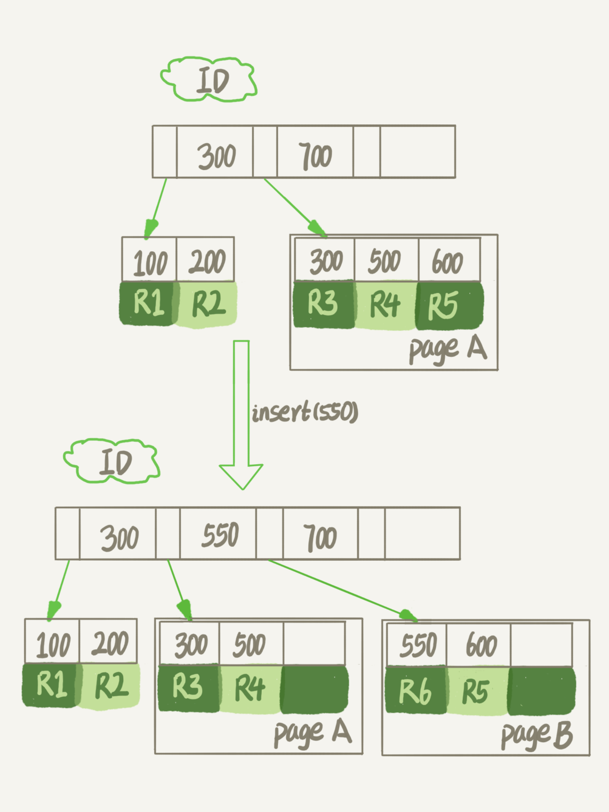

可以看到，由于page A满了，再插入一个ID是550的数据时，就不得不再申请一个新的页面page B来保存数据了。页分裂完成后，page A的末尾就留下了空洞（注意：实际上，可能不止1个记录的位置是空洞）。

另外，更新索引上的值，可以理解为删除一个旧的值，再插入一个新值。不难理解，这也是会造成空洞的。

也就是说，经过大量增删改的表，都是可能是存在空洞的。所以，如果能够把这些空洞去掉，就能达到收缩表空间的目的。

**而重建表，就可以达到这样的目的。**


## 重建表

试想一下，如果你现在有一个表A，需要做空间收缩，为了把表中存在的空洞去掉，你可以怎么做呢？

你可以新建一个与表A结构相同的表B，然后按照主键ID递增的顺序，把数据一行一行地从表A里读出来再插入到表B中。

由于表B是新建的表，所以表A主键索引上的空洞，在表B中就都不存在了。显然地，表B的主键索引更紧凑，数据页的利用率也更高。如果我们把表B作为临时表，数据从表A导入表B的操作完成后，用表B替换A，从效果上看，就起到了收缩表A空间的作用。

这里，你可以使用alter table A engine=InnoDB命令来重建表。在MySQL 5.5版本之前，这个命令的执行流程跟我们前面描述的差不多，区别只是这个临时表B不需要你自己创建，MySQL会自动完成转存数据、交换表名、删除旧表的操作。

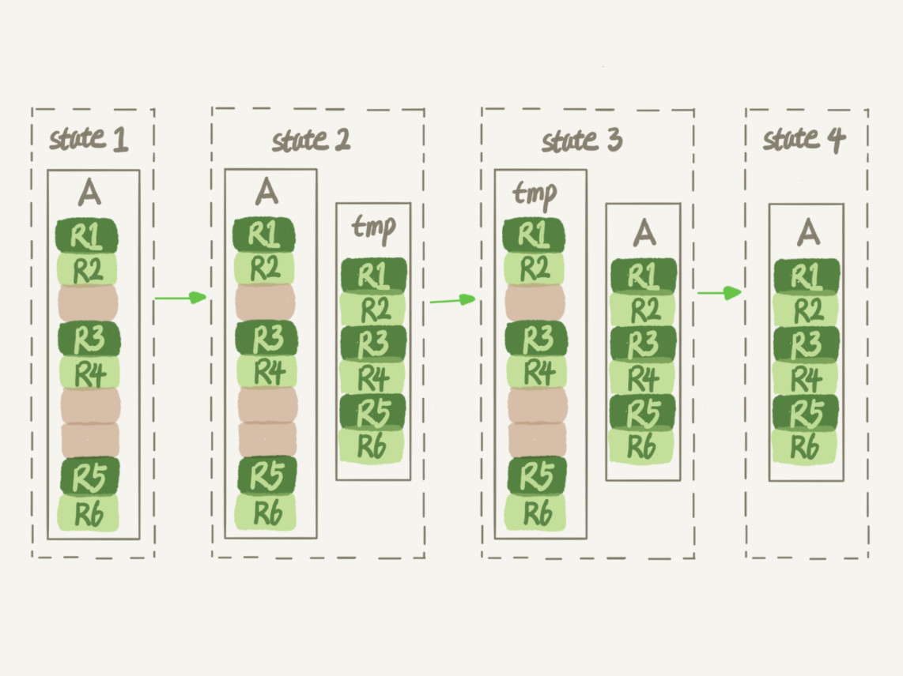

显然，花时间最多的步骤是往临时表插入数据的过程，如果在这个过程中，有新的数据要写入到表A的话，就会造成数据丢失。因此，在整个DDL过程中，表A中不能有更新。也就是说，这个DDL不是Online的。

而在 **MySQL 5.6版本开始引入的Online DDL，对这个操作流程做了优化。**

我给你简单描述一下引入了Online DDL之后，重建表的流程：

1. 建立一个临时文件，扫描表A主键的所有数据页；

2. 用数据页中表A的记录生成B+树，存储到临时文件中；

3. **生成临时文件的过程中，将所有对A的操作记录在一个日志文件（row log）中，对应的是图中state2的状态；**

4. 临时文件生成后，将日志文件中的操作应用到临时文件，得到一个逻辑数据上与表A相同的数据文件，对应的就是图中state3的状态；

5. 用临时文件替换表A的数据文件。

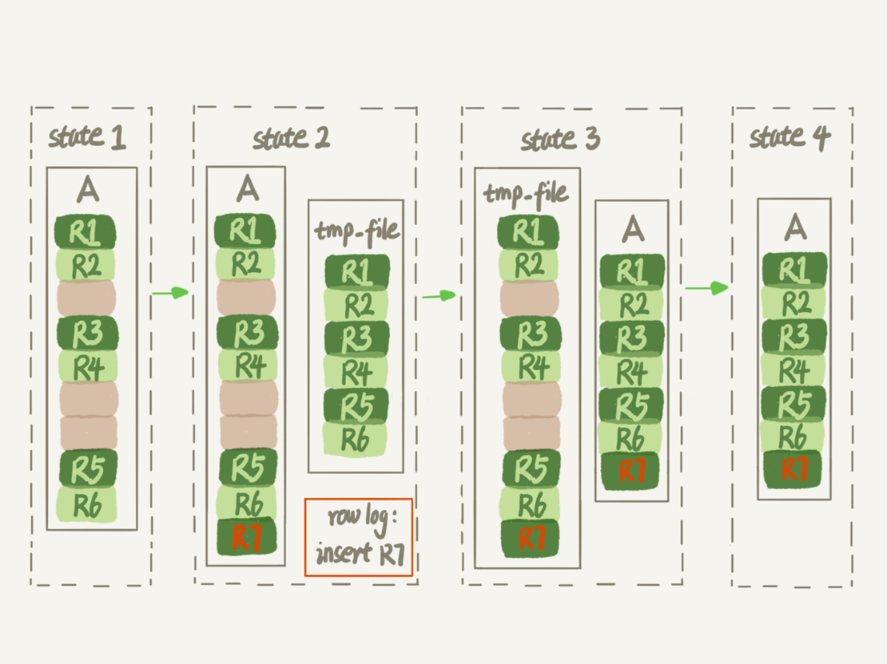

可以看到，与图3过程的不同之处在于，由于日志文件记录和重放操作这个功能的存在，这个方案在重建表的过程中，允许对表A做增删改操作。这也就是Online DDL名字的来源。

确实，图4的流程中，alter语句在启动的时候需要获取MDL写锁，但是这个写锁在真正拷贝数据之前就退化成读锁了。

为什么要退化呢？为了实现Online，MDL读锁不会阻塞增删改操作。

那为什么不干脆直接解锁呢？为了保护自己，禁止其他线程对这个表同时做DDL。

而对于一个大表来说，Online DDL最耗时的过程就是拷贝数据到临时表的过程，这个步骤的执行期间可以接受增删改操作。所以，相对于整个DDL过程来说，锁的时间非常短。对业务来说，就可以认为是Online的。

需要补充说明的是，上述的这些重建方法都会扫描原表数据和构建临时文件。对于很大的表来说，这个操作是很消耗IO和CPU资源的。因此，如果是线上服务，你要很小心地控制操作时间。如果想要比较安全的操作的话，我推荐你使用GitHub开源的gh-ost来做。


## Online 和 inplace

说到Online，我还要再和你澄清一下它和另一个跟DDL有关的、容易混淆的概念inplace的区别。

你可能注意到了，在图3中，我们把表A中的数据导出来的存放位置叫作tmp\_table。这是一个临时表，是在server层创建的。

在图4中，根据表A重建出来的数据是放在“tmp\_file”里的，这个临时文件是InnoDB在内部创建出来的。整个DDL过程都在InnoDB内部完成。对于server层来说，没有把数据挪动到临时表，是一个“原地”操作，这就是“inplace”名称的来源。

所以，我现在问你，如果你有一个1TB的表，现在磁盘间是1.2TB，能不能做一个inplace的DDL呢？

答案是不能。因为，tmp\_file也是要占用临时空间的。（因为tmp_file还要保持row log这些数据）

我们重建表的这个语句alter table t engine=InnoDB，其实隐含的意思是：

```
alter table t engine=innodb,ALGORITHM=inplace;
```

跟inplace对应的就是拷贝表的方式了，用法是：

```
alter table t engine=innodb,ALGORITHM=copy;
```

当你使用ALGORITHM=copy的时候，表示的是强制拷贝表，对应的流程就是图3的操作过程。

但我这样说你可能会觉得，inplace跟Online是不是就是一个意思？

其实不是的，只是在重建表这个逻辑中刚好是这样而已。

比如，如果我要给InnoDB表的一个字段加全文索引，写法是：

```
alter table t add FULLTEXT(field_name);
```

这个过程是inplace的，但会阻塞增删改操作，是非Online的。

如果说这两个逻辑之间的关系是什么的话，可以概括为：

1. DDL过程如果是Online的，就一定是inplace的；

2. 反过来未必，也就是说inplace的DDL，有可能不是Online的。截止到MySQL 8.0，添加全文索引（FULLTEXT index）和空间索引(SPATIAL index)就属于这种情况。


最后，我们再延伸一下。

在第10篇文章 [《MySQL为什么有时候会选错索引》](https://time.geekbang.org/column/article/71173) 的评论区中，有同学问到使用optimize table、analyze table和alter table这三种方式重建表的区别。这里，我顺便再简单和你解释一下。

- 从MySQL 5.6版本开始，alter table t engine = InnoDB（也就是recreate）默认的就是上面图4的流程了；
- analyze table t 其实不是重建表，只是对表的索引信息做重新统计，没有修改数据，这个过程中加了MDL读锁；
- optimize table t 等于recreate+analyze。


# count(*)的效率

### count(\*)的实现方式

你首先要明确的是，在不同的MySQL引擎中，count(\*)有不同的实现方式。

- **MyISAM引擎把一个表的总行数存在了磁盘上，因此执行count(\*)的时候会直接返回这个数，效率很高；**
- **而InnoDB引擎就麻烦了，它执行count(\*)的时候，需要把数据一行一行地从引擎里面读出来，然后累积计数。**

这里需要注意的是，我们在这篇文章里讨论的是没有过滤条件的count(\*)，如果加了where 条件的话，MyISAM表也是不能返回得这么快的。

在前面的文章中，我们一起分析了为什么要使用InnoDB，因为不论是在事务支持、并发能力还是在数据安全方面，InnoDB都优于MyISAM。我猜你的表也一定是用了InnoDB引擎。这就是当你的记录数越来越多的时候，计算一个表的总行数会越来越慢的原因。

那 **为什么InnoDB不跟MyISAM一样，也把数字存起来呢？**

这是因为即使是在同一个时刻的多个查询，由于多版本并发控制（MVCC）的原因，InnoDB表“应该返回多少行”也是不确定的。这里，我用一个算count(\*)的例子来为你解释一下。

假设表t中现在有10000条记录，我们设计了三个用户并行的会话。

- 会话A先启动事务并查询一次表的总行数；
- 会话B启动事务，插入一行后记录后，查询表的总行数；
- 会话C先启动一个单独的语句，插入一行记录后，查询表的总行数。

我们假设从上到下是按照时间顺序执行的，同一行语句是在同一时刻执行的。

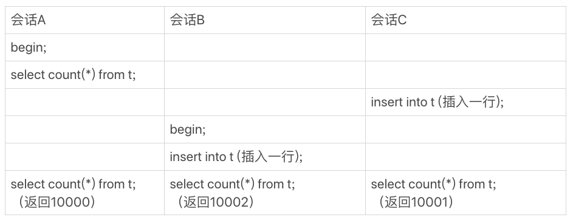

图1 会话A、B、C的执行流程

你会看到，在最后一个时刻，三个会话A、B、C会同时查询表t的总行数，但拿到的结果却不同。

这和InnoDB的事务设计有关系，可重复读是它默认的隔离级别，在代码上就是通过多版本并发控制，也就是MVCC来实现的。每一行记录都要判断自己是否对这个会话可见，因此对于count(\*)请求来说，InnoDB只好把数据一行一行地读出依次判断，可见的行才能够用于计算“基于这个查询”的表的总行数。


当然，现在这个看上去笨笨的MySQL，在执行count(\*)操作的时候还是做了优化的。

你知道的，InnoDB是索引组织表，主键索引树的叶子节点是数据，而普通索引树的叶子节点是主键值。所以，普通索引树比主键索引树小很多。对于count(\*)这样的操作，遍历哪个索引树得到的结果逻辑上都是一样的。因此，MySQL优化器会找到最小的那棵树来遍历。 **在保证逻辑正确的前提下，尽量减少扫描的数据量，是数据库系统设计的通用法则之一。**

如果你用过show table status 命令的话，就会发现这个命令的输出结果里面也有一个TABLE\_ROWS用于显示这个表当前有多少行，这个命令执行挺快的，那这个TABLE\_ROWS能代替count(\*)吗？

你可能还记得在第10篇文章 [《 MySQL为什么有时候会选错索引？》](https://time.geekbang.org/column/article/71173) 中我提到过，索引统计的值是通过采样来估算的。实际上，TABLE\_ROWS就是从这个采样估算得来的，因此它也很不准。有多不准呢，官方文档说误差可能达到40%到50%。 **所以，show table status命令显示的行数也不能直接使用。**

到这里我们小结一下：

- **MyISAM表虽然count(\*)很快，但是不支持事务；**
- **show table status命令虽然返回很快，但是不准确；**
- **InnoDB表直接count(\*)会遍历全表，虽然结果准确，但会导致性能问题。**

那么，回到文章开头的问题，如果你现在有一个页面经常要显示交易系统的操作记录总数，到底应该怎么办呢？答案是，我们只能自己计数。

接下来，我们讨论一下，看看自己计数有哪些方法，以及每种方法的优缺点有哪些。

这里，我先和你说一下这些方法的基本思路：你需要自己找一个地方，把操作记录表的行数存起来。


## 用缓存系统保存计数

对于更新很频繁的库来说，你可能会第一时间想到，用缓存系统来支持。

你可以用一个Redis服务来保存这个表的总行数。这个表每被插入一行Redis计数就加1，每被删除一行Redis计数就减1。这种方式下，读和更新操作都很快，但你再想一下这种方式存在什么问题吗？

没错，缓存系统可能会丢失更新。

Redis的数据不能永久地留在内存里，所以你会找一个地方把这个值定期地持久化存储起来。但即使这样，仍然可能丢失更新。试想如果刚刚在数据表中插入了一行，Redis中保存的值也加了1，然后Redis异常重启了，重启后你要从存储redis数据的地方把这个值读回来，而刚刚加1的这个计数操作却丢失了。

当然了，这还是有解的。比如，Redis异常重启以后，到数据库里面单独执行一次count(\*)获取真实的行数，再把这个值写回到Redis里就可以了。异常重启毕竟不是经常出现的情况，这一次全表扫描的成本，还是可以接受的。

但实际上， **将计数保存在缓存系统中的方式，还不只是丢失更新的问题。即使Redis正常工作，这个值还是逻辑上不精确的。**

你可以设想一下有这么一个页面，要显示操作记录的总数，同时还要显示最近操作的100条记录。那么，这个页面的逻辑就需要先到Redis里面取出计数，再到数据表里面取数据记录。

我们是这么定义不精确的：

1. 一种是，查到的100行结果里面有最新插入记录，而Redis的计数里还没加1；

2. 另一种是，查到的100行结果里没有最新插入的记录，而Redis的计数里已经加了1。


这两种情况，都是逻辑不一致的。

我们一起来看看这个时序图。

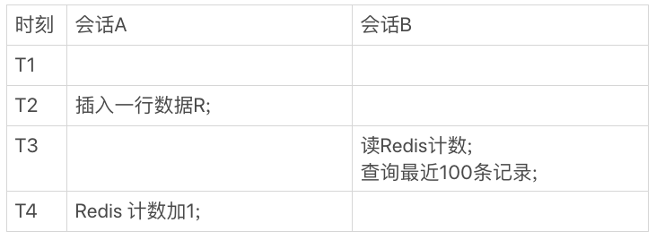

图2 会话A、B执行时序图

图2中，会话A是一个插入交易记录的逻辑，往数据表里插入一行R，然后Redis计数加1；会话B就是查询页面显示时需要的数据。

在图2的这个时序里，在T3时刻会话B来查询的时候，会显示出新插入的R这个记录，但是Redis的计数还没加1。这时候，就会出现我们说的数据不一致。

你一定会说，这是因为我们执行新增记录逻辑时候，是先写数据表，再改Redis计数。而读的时候是先读Redis，再读数据表，这个顺序是相反的。那么，如果保持顺序一样的话，是不是就没问题了？我们现在把会话A的更新顺序换一下，再看看执行结果。

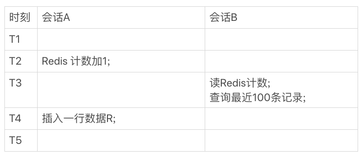

图3 调整顺序后，会话A、B的执行时序图

你会发现，这时候反过来了，会话B在T3时刻查询的时候，Redis计数加了1了，但还查不到新插入的R这一行，也是数据不一致的情况。

在并发系统里面，我们是无法精确控制不同线程的执行时刻的，因为存在图中的这种操作序列，所以，我们说即使Redis正常工作，这个计数值还是逻辑上不精确的。


## 在数据库保存计数

根据上面的分析，用缓存系统保存计数有丢失数据和计数不精确的问题。那么， **如果我们把这个计数直接放到数据库里单独的一张计数表C中，又会怎么样呢？**

首先，这解决了崩溃丢失的问题，InnoDB是支持崩溃恢复不丢数据的。


然后，我们再看看能不能解决计数不精确的问题。

你会说，这不一样吗？无非就是把图3中对Redis的操作，改成了对计数表C的操作。只要出现图3的这种执行序列，这个问题还是无解的吧？

这个问题还真不是无解的。

我们这篇文章要解决的问题，都是由于InnoDB要支持事务，从而导致InnoDB表不能把count(\*)直接存起来，然后查询的时候直接返回形成的。

所谓以子之矛攻子之盾，现在我们就利用“事务”这个特性，把问题解决掉。

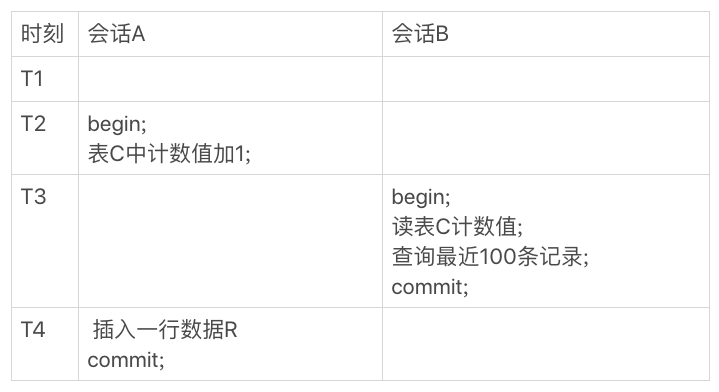

图4 会话A、B的执行时序图

我们来看下现在的执行结果。虽然会话B的读操作仍然是在T3执行的，但是因为这时候更新事务还没有提交，所以计数值加1这个操作对会话B还不可见。

因此，会话B看到的结果里， 查计数值和“最近100条记录”看到的结果，逻辑上就是一致的。


## 不同的count用法

在前面文章的评论区，有同学留言问到：在select count(?) from t这样的查询语句里面，count(\*)、count(主键id)、count(字段)和count(1)等不同用法的性能，有哪些差别。今天谈到了count(\*)的性能问题，我就借此机会和你详细说明一下这几种用法的性能差别。

需要注意的是，下面的讨论还是基于InnoDB引擎的。

这里，首先你要弄清楚count()的语义。count()是一个聚合函数，对于返回的结果集，一行行地判断，如果count函数的参数不是NULL，累计值就加1，否则不加。最后返回累计值。

所以，count(\*)、count(主键id)和count(1) 都表示返回满足条件的结果集的总行数；而count(字段），则表示返回满足条件的数据行里面，参数“字段”不为NULL的总个数。

至于分析性能差别的时候，你可以记住这么几个原则：

1. server层要什么就给什么；

2. InnoDB只给必要的值；

3. 现在的优化器只优化了count(\*)的语义为“取行数”，其他“显而易见”的优化并没有做。


这是什么意思呢？接下来，我们就一个个地来看看。

**对于count(主键id)来说**，InnoDB引擎会遍历整张表，把每一行的id值都取出来，返回给server层。server层拿到id后，判断是不可能为空的，就按行累加。

**对于count(1)来说**，InnoDB引擎遍历整张表，但不取值。server层对于返回的每一行，放一个数字“1”进去，判断是不可能为空的，按行累加。

单看这两个用法的差别的话，你能对比出来，count(1)执行得要比count(主键id)快。因为从引擎返回id会涉及到解析数据行，以及拷贝字段值的操作。

**对于count(字段)来说**：

1. 如果这个“字段”是定义为not null的话，一行行地从记录里面读出这个字段，判断不能为null，按行累加；

2. 如果这个“字段”定义允许为null，那么执行的时候，判断到有可能是null，还要把值取出来再判断一下，不是null才累加。


也就是前面的第一条原则，server层要什么字段，InnoDB就返回什么字段。

**但是count(\*)是例外**，并不会把全部字段取出来，而是专门做了优化，不取值。count(\*)肯定不是null，按行累加。

看到这里，你一定会说，优化器就不能自己判断一下吗，主键id肯定非空啊，为什么不能按照count(\*)来处理，多么简单的优化啊。

当然，MySQL专门针对这个语句进行优化，也不是不可以。但是这种需要专门优化的情况太多了，而且MySQL已经优化过count(\*)了，你直接使用这种用法就可以了。

所以结论是：按照效率排序的话，count(字段)<count(主键id)<count(1)≈count(\*)，所以我建议你，尽量使用count(\*)。


# “order by”是怎么工作的？

在你开发应用的时候，一定会经常碰到需要根据指定的字段排序来显示结果的需求。还是以我们前面举例用过的市民表为例，假设你要查询城市是“杭州”的所有人名字，并且按照姓名排序返回前1000个人的姓名、年龄。

```
select city,name,age from t where city='杭州' order by name limit 1000  ;
```

## 全字段排序

前面我们介绍过索引，所以你现在就很清楚了，为避免全表扫描，我们需要在city字段加上索引。

在city字段上创建索引之后，我们用explain命令来看看这个语句的执行情况。

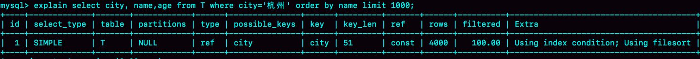

图1 使用explain命令查看语句的执行情况

Extra这个字段中的“Using filesort”表示的就是需要排序，MySQL会给每个线程分配一块内存用于排序，称为sort\_buffer。

为了说明这个SQL查询语句的执行过程，我们先来看一下city这个索引的示意图。

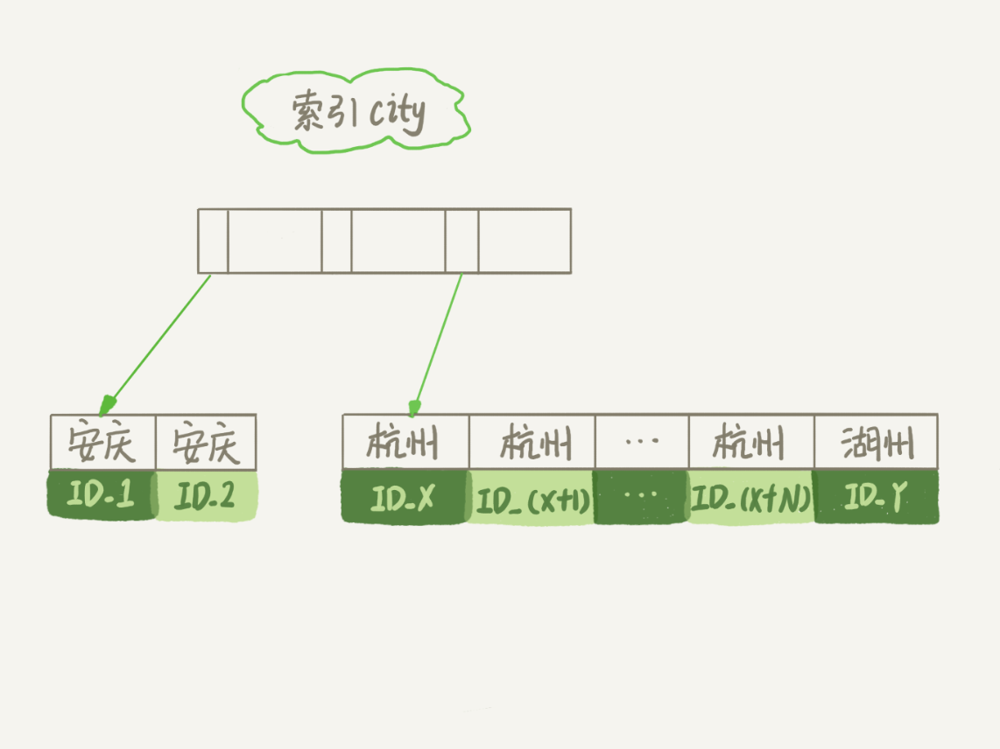

图2 city字段的索引示意图

从图中可以看到，满足city='杭州’条件的行，是从ID\_X到ID\_(X+N)的这些记录。

**通常情况下，这个语句执行流程如下所示 ：**(取出我们要select的所有字段，然后一起进行排序)

1. 初始化sort\_buffer，确定放入name、city、age这三个字段；

2. 从索引city找到第一个满足city='杭州’条件的主键id，也就是图中的ID\_X；

3. 到主键id索引取出整行，取name、city、age三个字段的值，存入sort\_buffer中；

4. 从索引city取下一个记录的主键id；

5. 重复步骤3、4直到city的值不满足查询条件为止，对应的主键id也就是图中的ID\_Y；

6. 对sort\_buffer中的数据按照字段name做快速排序；

7. 按照排序结果取前1000行返回给客户端。


我们暂且把这个排序过程，称为全字段排序，执行流程的示意图如下所示，下一篇文章中我们还会用到这个排序。

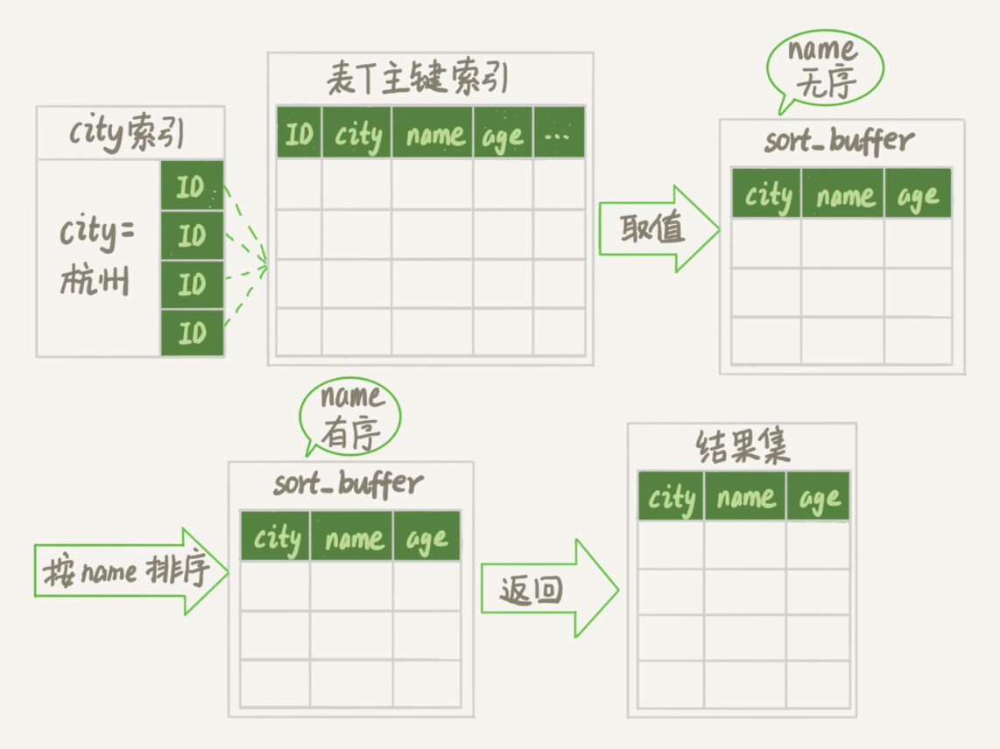

图3 全字段排序

图中“按name排序”这个动作，可能在内存中完成，也可能需要使用外部排序，这取决于排序所需的内存和参数sort\_buffer\_size。

sort\_buffer\_size，就是MySQL为排序开辟的内存（sort\_buffer）的大小。如果要排序的数据量小于sort\_buffer\_size，排序就在内存中完成。但如果排序数据量太大，内存放不下，则不得不利用磁盘临时文件辅助排序。

number\_of\_tmp\_files表示的是，排序过程中使用的临时文件数。你一定奇怪，为什么需要12个文件？内存放不下时，就需要使用外部排序，外部排序一般使用归并排序算法。可以这么简单理解， **MySQL将需要排序的数据分成12份，每一份单独排序后存在这些临时文件中。然后把这12个有序文件再合并成一个有序的大文件。**

如果sort\_buffer\_size超过了需要排序的数据量的大小，number\_of\_tmp\_files就是0，表示排序可以直接在内存中完成。

否则就需要放在临时文件中排序。sort\_buffer\_size越小，需要分成的份数越多，number\_of\_tmp\_files的值就越大。


## rowid排序

在上面这个算法过程里面，只对原表的数据读了一遍，剩下的操作都是在sort\_buffer和临时文件中执行的。但这个算法有一个问题，就是如果查询要返回的字段很多的话，那么sort\_buffer里面要放的字段数太多，这样内存里能够同时放下的行数很少，要分成很多个临时文件，排序的性能会很差。

所以如果单行很大，这个方法效率不够好。

那么， **如果MySQL认为排序的单行长度太大会怎么做呢？**

接下来，我来修改一个参数，让MySQL采用另外一种算法。

```
SET max_length_for_sort_data = 16;
```

max\_length\_for\_sort\_data，是MySQL中专门控制用于排序的行数据的长度的一个参数。它的意思是，如果单行的长度超过这个值，MySQL就认为单行太大，要换一个算法。

city、name、age 这三个字段的定义总长度是36，我把max\_length\_for\_sort\_data设置为16，我们再来看看计算过程有什么改变。

新的算法放入sort\_buffer的字段，只有要排序的列（即name字段）和主键id。

**但这时，排序的结果就因为少了city和age字段的值，不能直接返回了，整个执行流程就变成如下所示的样子：**（使用row提供的排序字段进行排序，使用id进行数据行的查找）

1. 初始化sort\_buffer，确定放入两个字段，即name和id；

2. 从索引city找到第一个满足city='杭州’条件的主键id，也就是图中的ID\_X；

3. 到主键id索引取出整行，取name、id这两个字段，存入sort\_buffer中；

4. 从索引city取下一个记录的主键id；

5. 重复步骤3、4直到不满足city='杭州’条件为止，也就是图中的ID\_Y；

6. 对sort\_buffer中的数据按照字段name进行排序；

7. 遍历排序结果，取前1000行，并按照id的值回到原表中取出city、name和age三个字段返回给客户端。


这个执行流程的示意图如下，我把它称为rowid排序。


图5 rowid排序

**对比图3的全字段排序流程图你会发现，rowid排序多访问了一次表t的主键索引，就是步骤7。**

从OPTIMIZER\_TRACE的结果中，你还能看到另外两个信息也变了。

- sort\_mode变成了<sort\_key, rowid>，表示参与排序的只有name和id这两个字段。
- number\_of\_tmp\_files变成10了，是因为这时候参与排序的行数虽然仍然是4000行，但是每一行都变小了，因此需要排序的总数据量就变小了，需要的临时文件也相应地变少了。


## 全字段排序 VS rowid排序

我们来分析一下，从这两个执行流程里，还能得出什么结论。

如果MySQL实在是担心排序内存太小，会影响排序效率，才会采用rowid排序算法，这样排序过程中一次可以排序更多行，但是需要再回到原表去取数据。

如果MySQL认为内存足够大，会优先选择全字段排序，把需要的字段都放到sort\_buffer中，这样排序后就会直接从内存里面返回查询结果了，不用再回到原表去取数据。

这也就体现了MySQL的一个设计思想： **如果内存够，就要多利用内存，尽量减少磁盘访问。**

对于InnoDB表来说，rowid排序会要求回表多造成磁盘读，因此不会被优先选择。

这个结论看上去有点废话的感觉，但是你要记住它，下一篇文章我们就会用到。

看到这里，你就了解了，MySQL做排序是一个成本比较高的操作。那么你会问，是不是所有的order by都需要排序操作呢？如果不排序就能得到正确的结果，那对系统的消耗会小很多，语句的执行时间也会变得更短。

其实，并不是所有的order by语句，都需要排序操作的。从上面分析的执行过程，我们可以看到，MySQL之所以需要生成临时表，并且在临时表上做排序操作， **其原因是原来的数据都是无序的。**

你可以设想下，如果能够保证从city这个索引上取出来的行，天然就是按照name递增排序的话，是不是就可以不用再排序了呢？

确实是这样的。

所以，我们可以在这个市民表上创建一个city和name的联合索引，对应的SQL语句是：

```
alter table t add index city_user(city, name);
```

作为与city索引的对比，我们来看看这个索引的示意图。

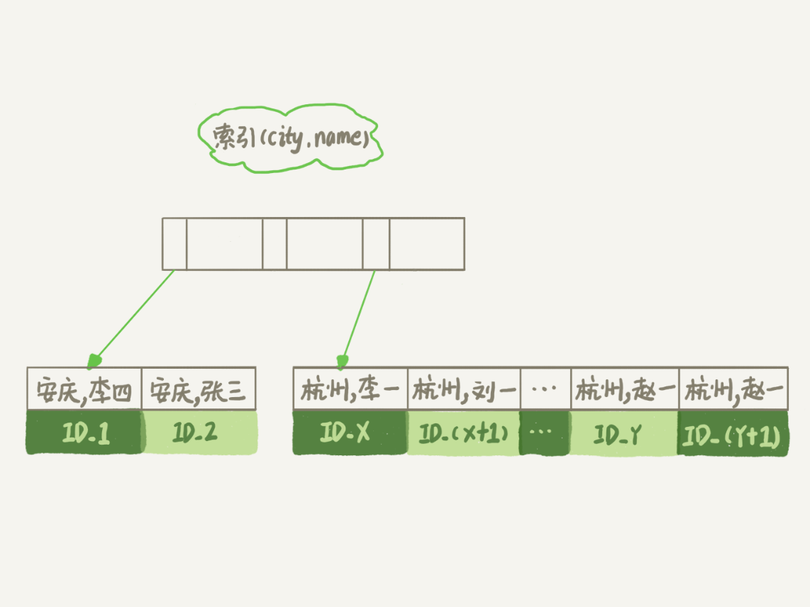

图7 city和name联合索引示意图

在这个索引里面，我们依然可以用树搜索的方式定位到第一个满足city='杭州’的记录，并且额外确保了，接下来按顺序取“下一条记录”的遍历过程中，只要city的值是杭州，name的值就一定是有序的。

这样整个查询过程的流程就变成了：

1. 从索引(city,name)找到第一个满足city='杭州’条件的主键id；

2. 到主键id索引取出整行，取name、city、age三个字段的值，作为结果集的一部分直接返回；

3. 从索引(city,name)取下一个记录主键id；

4. 重复步骤2、3，直到查到第1000条记录，或者是不满足city='杭州’条件时循环结束。


图8 引入(city,name)联合索引后，查询语句的执行计划

可以看到，这个查询过程不需要临时表，也不需要排序。接下来，我们用explain的结果来印证一下。

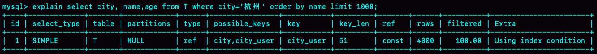

图9 引入(city,name)联合索引后，查询语句的执行计划

从图中可以看到，Extra字段中没有Using filesort了，也就是不需要排序了。而且由于(city,name)这个联合索引本身有序，所以这个查询也不用把4000行全都读一遍，只要找到满足条件的前1000条记录就可以退出了。也就是说，在我们这个例子里，只需要扫描1000次。


这里我们可以再稍微复习一下。 **覆盖索引是指，索引上的信息足够满足查询请求，不需要再回到主键索引上去取数据。**

按照覆盖索引的概念，我们可以再优化一下这个查询语句的执行流程。

针对这个查询，我们可以创建一个city、name和age的联合索引，对应的SQL语句就是：

```
alter table t add index city_user_age(city, name, age);
```

这时，对于city字段的值相同的行来说，还是按照name字段的值递增排序的，此时的查询语句也就不再需要排序了。这样整个查询语句的执行流程就变成了：

1. 从索引(city,name,age)找到第一个满足city='杭州’条件的记录，取出其中的city、name和age这三个字段的值，作为结果集的一部分直接返回；

2. 从索引(city,name,age)取下一个记录，同样取出这三个字段的值，作为结果集的一部分直接返回；

3. 重复执行步骤2，直到查到第1000条记录，或者是不满足city='杭州’条件时循环结束。


图10 引入(city,name,age)联合索引后，查询语句的执行流程

然后，我们再来看看explain的结果。

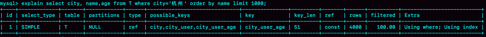

图11 引入(city,name,age)联合索引后，查询语句的执行计划

可以看到，Extra字段里面多了“Using index”，表示的就是使用了覆盖索引，性能上会快很多。

当然，这里并不是说要为了每个查询能用上覆盖索引，就要把语句中涉及的字段都建上联合索引，毕竟索引还是有维护代价的。这是一个需要权衡的决定。


# 如何正确地显示随机消息？

## 内存临时表

首先，你会想到用order by rand()来实现这个逻辑。

```
mysql> select word from words order by rand() limit 3;
```

这个语句的意思很直白，随机排序取前3个。虽然这个SQL语句写法很简单，但执行流程却有点复杂的。

我们先用explain命令来看看这个语句的执行情况。

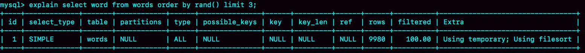

图1 使用explain命令查看语句的执行情况

Extra字段显示Using temporary，表示的是需要使用临时表；Using filesort，表示的是需要执行排序操作。

因此这个Extra的意思就是，需要临时表，并且需要在临时表上排序。

然后，我再问你一个问题，你觉得对于临时内存表的排序来说，它会选择哪一种算法呢？回顾一下上一篇文章的一个结论： **对于InnoDB表来说**，执行全字段排序会减少磁盘访问，因此会被优先选择。

我强调了“InnoDB表”，你肯定想到了， **对于内存表，回表过程只是简单地根据数据行的位置，直接访问内存得到数据，根本不会导致多访问磁盘**。优化器没有了这一层顾虑，那么它会优先考虑的，就是用于排序的行越小越好了，所以，MySQL这时就会选择rowid排序。

理解了这个算法选择的逻辑，我们再来看看语句的执行流程。同时，通过今天的这个例子，我们来尝试分析一下语句的扫描行数。

这条语句的执行流程是这样的：

1. 创建一个临时表。这个临时表使用的是memory引擎，表里有两个字段，第一个字段是double类型，为了后面描述方便，记为字段R，第二个字段是varchar(64)类型，记为字段W。并且，这个表没有建索引。

2. 从words表中，按主键顺序取出所有的word值。对于每一个word值，调用rand()函数生成一个大于0小于1的随机小数，并把这个随机小数和word分别存入临时表的R和W字段中，到此，扫描行数是10000。

3. 现在临时表有10000行数据了，接下来你要在这个没有索引的内存临时表上，按照字段R排序。

4. 初始化 sort\_buffer。sort\_buffer中有两个字段，一个是double类型，另一个是整型。

5. 从内存临时表中一行一行地取出R值和位置信息（我后面会和你解释这里为什么是“位置信息”），分别存入sort\_buffer中的两个字段里。这个过程要对内存临时表做全表扫描，此时扫描行数增加10000，变成了20000。

6. 在sort\_buffer中根据R的值进行排序。注意，这个过程没有涉及到表操作，所以不会增加扫描行数。

7. 排序完成后，取出前三个结果的位置信息，依次到内存临时表中取出word值，返回给客户端。这个过程中，访问了表的三行数据，总扫描行数变成了20003。


接下来，我们通过慢查询日志（slow log）来验证一下我们分析得到的扫描行数是否正确。

```
# Query_time: 0.900376  Lock_time: 0.000347 Rows_sent: 3 Rows_examined: 20003
SET timestamp=1541402277;
select word from words order by rand() limit 3;
```

其中，Rows\_examined：20003就表示这个语句执行过程中扫描了20003行，也就验证了我们分析得出的结论。

这里插一句题外话，在平时学习概念的过程中，你可以经常这样做，先通过原理分析算出扫描行数，然后再通过查看慢查询日志，来验证自己的结论。我自己就是经常这么做，这个过程很有趣，分析对了开心，分析错了但是弄清楚了也很开心。

现在，我来把完整的排序执行流程图画出来。

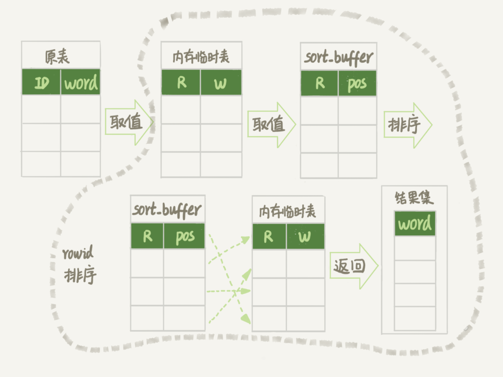

图4 随机排序完整流程图1

图中的pos就是位置信息，你可能会觉得奇怪，这里的“位置信息”是个什么概念？在上一篇文章中，我们对InnoDB表排序的时候，明明用的还是ID字段。

这时候，我们就要回到一个基本概念： **MySQL的表是用什么方法来定位“一行数据”的。**

在前面 [第4](https://time.geekbang.org/column/article/69236) 和 [第5](https://time.geekbang.org/column/article/69636) 篇介绍索引的文章中，有几位同学问到，如果把一个InnoDB表的主键删掉，是不是就没有主键，就没办法回表了？

其实不是的。如果你创建的表没有主键，或者把一个表的主键删掉了，那么InnoDB会自己生成一个长度为6字节的rowid来作为主键。

**这也就是排序模式里面，rowid名字的来历。实际上它表示的是：每个引擎用来唯一标识数据行的信息。**

- **对于有主键的InnoDB表来说，这个rowid就是主键ID；**
- **对于没有主键的InnoDB表来说，这个rowid就是由系统生成的；**
- **MEMORY引擎不是索引组织表。在这个例子里面，你可以认为它就是一个数组。因此，这个rowid其实就是数组的下标。**

到这里，我来稍微小结一下： **order by rand()使用了内存临时表，内存临时表排序的时候使用了rowid排序方法。**


## 磁盘临时表

那么，是不是所有的临时表都是内存表呢？

其实不是的。tmp\_table\_size这个配置限制了内存临时表的大小，默认值是16M。**如果临时表大小超过了tmp\_table\_size，那么内存临时表就会转成磁盘临时表。**

磁盘临时表使用的引擎默认是InnoDB，是由参数internal\_tmp\_disk\_storage\_engine控制的。

当使用磁盘临时表的时候，对应的就是一个没有显式索引的InnoDB表的排序过程。


因为将max\_length\_for\_sort\_data设置成16，小于word字段的长度定义，所以我们看到sort\_mode里面显示的是rowid排序，这个是符合预期的，参与排序的是随机值R字段和rowid字段组成的行。

这时候你可能心算了一下，发现不对。R字段存放的随机值就8个字节，rowid是6个字节（至于为什么是6字节，就留给你课后思考吧），数据总行数是10000，这样算出来就有140000字节，超过了sort\_buffer\_size 定义的 32768字节了。但是，number\_of\_tmp\_files的值居然是0，难道不需要用临时文件吗？

这个SQL语句的排序确实没有用到临时文件，采用是MySQL 5.6版本引入的一个新的排序算法，即：优先队列排序算法。接下来，我们就看看为什么没有使用临时文件的算法，也就是归并排序算法，而是采用了优先队列排序算法。

其实，我们现在的SQL语句，只需要取R值最小的3个rowid。但是，如果使用归并排序算法的话，虽然最终也能得到前3个值，但是这个算法结束后，已经将10000行数据都排好序了。

也就是说，后面的9997行也是有序的了。但，我们的查询并不需要这些数据是有序的。所以，想一下就明白了，这浪费了非常多的计算量。

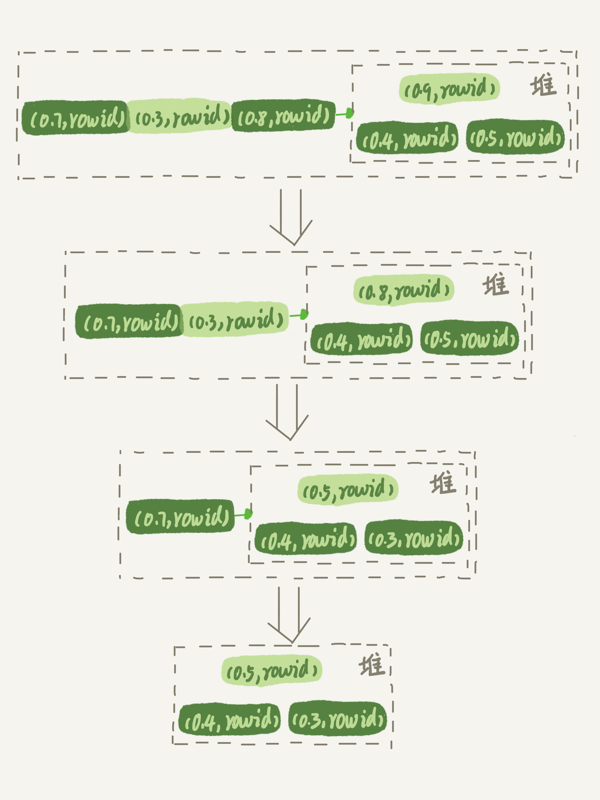

图6 优先队列排序算法示例

图6是模拟6个(R,rowid)行，通过优先队列排序找到最小的三个R值的行的过程。整个排序过程中，为了最快地拿到当前堆的最大值，总是保持最大值在堆顶，因此这是一个最大堆。

图5的OPTIMIZER\_TRACE结果中，filesort\_priority\_queue\_optimization这个部分的chosen=true，就表示使用了优先队列排序算法，这个过程不需要临时文件，因此对应的number\_of\_tmp\_files是0。

这个流程结束后，我们构造的堆里面，就是这个10000行里面R值最小的三行。然后，依次把它们的rowid取出来，去临时表里面拿到word字段，这个过程就跟上一篇文章的rowid排序的过程一样了。

我们再看一下上面一篇文章的SQL查询语句：

```
select city,name,age from t where city='杭州' order by name limit 1000  ;
```

**你可能会问，这里也用到了limit，为什么没用优先队列排序算法呢？原因是，这条SQL语句是limit 1000，如果使用优先队列算法的话，需要维护的堆的大小就是1000行的(name,rowid)，超过了我设置的sort\_buffer\_size大小，所以只能使用归并排序算法。**

总之，不论是使用哪种类型的临时表，order by rand()这种写法都会让计算过程非常复杂，需要大量的扫描行数，因此排序过程的资源消耗也会很大。

再回到我们文章开头的问题，怎么正确地随机排序呢？


## 随机排序方法

我们先把问题简化一下，如果只随机选择1个word值，可以怎么做呢？思路上是这样的：

1. 取得这个表的主键id的最大值M和最小值N;

2. 用随机函数生成一个最大值到最小值之间的数 X = (M-N)\*rand() + N;

3. 取不小于X的第一个ID的行。


我们把这个算法，暂时称作随机算法1。这里，我直接给你贴一下执行语句的序列:

```
mysql> select max(id),min(id) into @M,@N from t ;
set @X= floor((@M-@N+1)*rand() + @N);
select * from t where id >= @X limit 1;
```

这个方法效率很高，因为取max(id)和min(id)都是不需要扫描索引的，而第三步的select也可以用索引快速定位，可以认为就只扫描了3行。但实际上，这个算法本身并不严格满足题目的随机要求，因为ID中间可能有空洞，因此选择不同行的概率不一样，不是真正的随机。

比如你有4个id，分别是1、2、4、5，如果按照上面的方法，那么取到 id=4的这一行的概率是取得其他行概率的两倍。

如果这四行的id分别是1、2、40000、40001呢？这个算法基本就能当bug来看待了。

所以，为了得到严格随机的结果，你可以用下面这个流程:

1. 取得整个表的行数，并记为C。

2. 取得 Y = floor(C \* rand())。 floor函数在这里的作用，就是取整数部分。

3. 再用limit Y,1 取得一行。


我们把这个算法，称为随机算法2。下面这段代码，就是上面流程的执行语句的序列。

```
mysql> select count(*) into @C from t;
set @Y = floor(@C * rand());
set @sql = concat("select * from t limit ", @Y, ",1");
prepare stmt from @sql;
execute stmt;
DEALLOCATE prepare stmt;
```

由于limit 后面的参数不能直接跟变量，所以我在上面的代码中使用了prepare+execute的方法。你也可以把拼接SQL语句的方法写在应用程序中，会更简单些。

这个随机算法2，解决了算法1里面明显的概率不均匀问题。

**MySQL处理limit Y,1 的做法就是按顺序一个一个地读出来，丢掉前Y个，然后把下一个记录作为返回结果，因此这一步需要扫描Y+1行。再加上，第一步扫描的C行，总共需要扫描C+Y+1行，执行代价比随机算法1的代价要高。**

当然，随机算法2跟直接order by rand()比起来，执行代价还是小很多的。

你可能问了，如果按照这个表有10000行来计算的话，C=10000，要是随机到比较大的Y值，那扫描行数也跟20000差不多了，接近order by rand()的扫描行数，为什么说随机算法2的代价要小很多呢？我就把这个问题留给你去课后思考吧。

现在，我们再看看，如果我们按照随机算法2的思路，要随机取3个word值呢？你可以这么做：

1. 取得整个表的行数，记为C；

2. 根据相同的随机方法得到Y1、Y2、Y3；

3. 再执行三个limit Y, 1语句得到三行数据。


我们把这个算法，称作随机算法3。下面这段代码，就是上面流程的执行语句的序列。

```
mysql> select count(*) into @C from t;
set @Y1 = floor(@C * rand());
set @Y2 = floor(@C * rand());
set @Y3 = floor(@C * rand());
select * from t limit @Y1，1； //在应用代码里面取Y1、Y2、Y3值，拼出SQL后执行
select * from t limit @Y2，1；
select * from t limit @Y3，1；

```


# 为什么这些SQL语句逻辑相同，性能却差异巨大？


## 案例一：条件字段函数操作

假设，现在已经记录了从2016年初到2018年底的所有数据，运营部门有一个需求是，要统计发生在所有年份中7月份的交易记录总数。这个逻辑看上去并不复杂，你的SQL语句可能会这么写：

```
mysql> select count(*) from tradelog where month(t_modified)=7;
```

如果你问DBA同事为什么会出现这样的情况，他大概会告诉你：如果对字段做了函数计算，就用不上索引了，这是MySQL的规定。

现在你已经学过了InnoDB的索引结构了，可以再追问一句为什么？为什么条件是where t\_modified='2018-7-1’的时候可以用上索引，而改成where month(t\_modified)=7的时候就不行了？

下面是这个t\_modified索引的示意图。方框上面的数字就是month()函数对应的值。

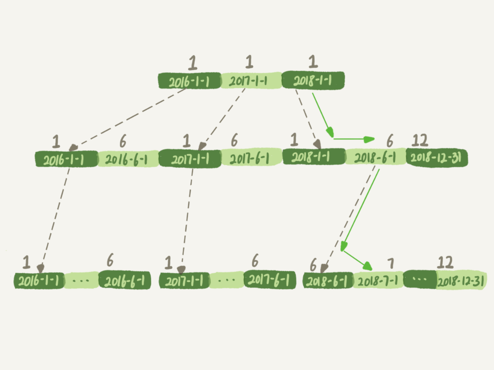

图1 t\_modified索引示意图

如果你的SQL语句条件用的是where t\_modified='2018-7-1’的话，引擎就会按照上面绿色箭头的路线，快速定位到 t\_modified='2018-7-1’需要的结果。

实际上，B+树提供的这个快速定位能力，来源于同一层兄弟节点的有序性。

但是，如果计算month()函数的话，你会看到传入7的时候，在树的第一层就不知道该怎么办了。

也就是说， **对索引字段做函数操作，可能会破坏索引值的有序性，因此优化器就决定放弃走树搜索功能。**

也就是说，由于在t\_modified字段加了month()函数操作，导致了全索引扫描。为了能够用上索引的快速定位能力，我们就要把SQL语句改成基于字段本身的范围查询。按照下面这个写法，优化器就能按照我们预期的，用上t\_modified索引的快速定位能力了。

```
mysql> select count(*) from tradelog where
    -> (t_modified >= '2016-7-1' and t_modified<'2016-8-1') or
    -> (t_modified >= '2017-7-1' and t_modified<'2017-8-1') or
    -> (t_modified >= '2018-7-1' and t_modified<'2018-8-1');

```

当然，如果你的系统上线时间更早，或者后面又插入了之后年份的数据的话，你就需要再把其他年份补齐。

到这里我给你说明了，由于加了month()函数操作，MySQL无法再使用索引快速定位功能，而只能使用全索引扫描。

不过优化器在个问题上确实有“偷懒”行为，即使是对于不改变有序性的函数，也不会考虑使用索引。比如，对于select \* from tradelog where id + 1 = 10000这个SQL语句，这个加1操作并不会改变有序性，但是MySQL优化器还是不能用id索引快速定位到9999这一行。所以，需要你在写SQL语句的时候，手动改写成 where id = 10000 -1才可以。


## 案例二：隐式类型转换

接下来我再跟你说一说，另一个经常让程序员掉坑里的例子。

我们一起看一下这条SQL语句：

```
mysql> select * from tradelog where tradeid=110717;
```

交易编号tradeid这个字段上，本来就有索引，但是explain的结果却显示，这条语句需要走全表扫描。你可能也发现了，tradeid的字段类型是varchar(32)，而输入的参数却是整型，所以需要做类型转换。

那么，现在这里就有两个问题：

1. 数据类型转换的规则是什么？

2. 为什么有数据类型转换，就需要走全索引扫描？


先来看第一个问题，你可能会说，数据库里面类型这么多，这种数据类型转换规则更多，我记不住，应该怎么办呢？

这里有一个简单的方法，看 select “10” > 9的结果：

1. 如果规则是“将字符串转成数字”，**那么就是做数字比较，结果应该是1；**

2. 如果规则是“将数字转成字符串”，那么就是做字符串比较，结果应该是0。


验证结果如图3所示。


图3 MySQL中字符串和数字转换的效果示意图

从图中可知，select “10” > 9返回的是1，所以你就能确认MySQL里的转换规则了：在MySQL中，字符串和数字做比较的话，是将字符串转换成数字。

这时，你再看这个全表扫描的语句：

```
mysql> select * from tradelog where tradeid=110717;
```

就知道对于优化器来说，这个语句相当于：

```
mysql> select * from tradelog where  CAST(tradid AS signed int) = 110717;
```

也就是说，这条语句触发了我们上面说到的规则：**对索引字段做函数操作，优化器会放弃走树搜索功能。**


## 案例三：隐式字符编码转换

```
mysql> select d.* from tradelog l, trade_detail d where d.tradeid=l.tradeid and l.id=2; /*语句Q1*/
```

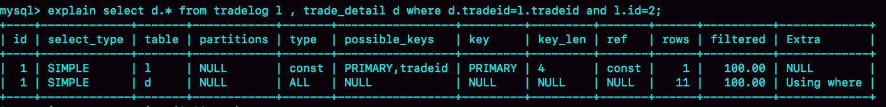

图4 语句Q1的explain 结果

我们一起来看下这个结果：

1. 第一行显示优化器会先在交易记录表tradelog上查到id=2的行，这个步骤用上了主键索引，rows=1表示只扫描一行；

2. 第二行key=NULL，表示没有用上交易详情表trade\_detail上的tradeid索引，进行了全表扫描。


在这个执行计划里，是从tradelog表中取tradeid字段，再去trade\_detail表里查询匹配字段。**因此，我们把tradelog称为驱动表，把trade\_detail称为被驱动表，把tradeid称为关联字段。**

接下来，我们看下这个explain结果表示的执行流程：

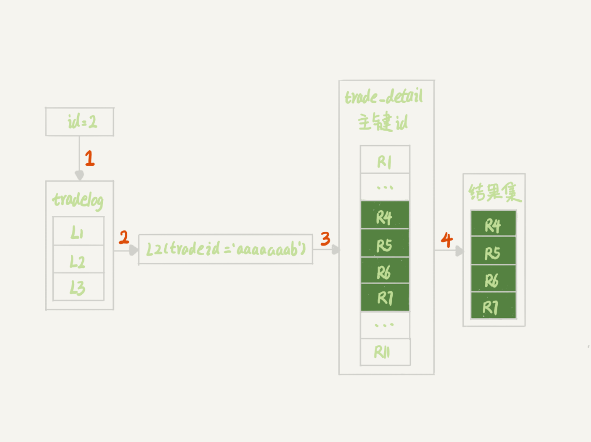

图5 语句Q1的执行过程

图中：

- 第1步，是根据id在tradelog表里找到L2这一行；
- 第2步，是从L2中取出tradeid字段的值；
- 第3步，是根据tradeid值到trade\_detail表中查找条件匹配的行。explain的结果里面第二行的key=NULL表示的就是，这个过程是通过遍历主键索引的方式，一个一个地判断tradeid的值是否匹配。

进行到这里，你会发现第3步不符合我们的预期。因为表trade\_detail里tradeid字段上是有索引的，我们本来是希望通过使用tradeid索引能够快速定位到等值的行。但，这里并没有。

如果你去问DBA同学，他们可能会告诉你，因为这两个表的字符集不同，一个是utf8，一个是utf8mb4，所以做表连接查询的时候用不上关联字段的索引。这个回答，也是通常你搜索这个问题时会得到的答案。

但是你应该再追问一下，为什么字符集不同就用不上索引呢？

我们说问题是出在执行步骤的第3步，如果单独把这一步改成SQL语句的话，那就是：

```
mysql> select * from trade_detail where tradeid=$L2.tradeid.value;

```

其中，$L2.tradeid.value的字符集是utf8mb4。

参照前面的两个例子，你肯定就想到了，字符集utf8mb4是utf8的超集，所以当这两个类型的字符串在做比较的时候，MySQL内部的操作是，先把utf8字符串转成utf8mb4字符集，再做比较。

> 这个设定很好理解，utf8mb4是utf8的超集。类似地，在程序设计语言里面，做自动类型转换的时候，为了避免数据在转换过程中由于截断导致数据错误，也都是“按数据长度增加的方向”进行转换的。

因此， 在执行上面这个语句的时候，需要将被驱动数据表里的字段一个个地转换成utf8mb4，再跟L2做比较。

也就是说，实际上这个语句等同于下面这个写法：

```
select * from trade_detail  where CONVERT(traideid USING utf8mb4)=$L2.tradeid.value;

```

CONVERT()函数，在这里的意思是把输入的字符串转成utf8mb4字符集。

这就再次触发了我们上面说到的原则：对索引字段做函数操作，优化器会放弃走树搜索功能。

到这里，你终于明确了，字符集不同只是条件之一， **连接过程中要求在被驱动表的索引字段上加函数操作**，是直接导致对被驱动表做全表扫描的原因。

作为对比验证，我给你提另外一个需求，“查找trade\_detail表里id=4的操作，对应的操作者是谁”，再来看下这个语句和它的执行计划。

```
mysql>select l.operator from tradelog l , trade_detail d where d.tradeid=l.tradeid and d.id=4;
```

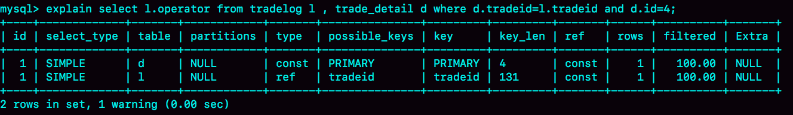

图6 explain 结果

这个语句里trade\_detail 表成了驱动表，但是explain结果的第二行显示，这次的查询操作用上了被驱动表tradelog里的索引(tradeid)，扫描行数是1。

这也是两个tradeid字段的join操作，为什么这次能用上被驱动表的tradeid索引呢？我们来分析一下。

假设驱动表trade\_detail里id=4的行记为R4，那么在连接的时候（图5的第3步），被驱动表tradelog上执行的就是类似这样的SQL 语句：

```
select operator from tradelog  where traideid =$R4.tradeid.value;
```

这时候$R4.tradeid.value的字符集是utf8, 按照字符集转换规则，要转成utf8mb4，所以这个过程就被改写成：

```
select operator from tradelog  where traideid =CONVERT($R4.tradeid.value USING utf8mb4);
```

你看，这里的CONVERT函数是加在输入参数上的，这样就可以用上被驱动表的traideid索引。

理解了原理以后，就可以用来指导操作了。如果要优化语句

```
select d.* from tradelog l, trade_detail d where d.tradeid=l.tradeid and l.id=2;

```

的执行过程，有两种做法：

- 比较常见的优化方法是，把trade\_detail表上的tradeid字段的字符集也改成utf8mb4，这样就没有字符集转换的问题了。

```
alter table trade_detail modify tradeid varchar(32) CHARACTER SET utf8mb4 default null;

```

- 如果能够修改字段的字符集的话，是最好不过了。但如果数据量比较大， 或者业务上暂时不能做这个DDL的话，那就只能采用修改SQL语句的方法了。

```
mysql> select d.* from tradelog l , trade_detail d where d.tradeid=CONVERT(l.tradeid USING utf8) and l.id=2;

```

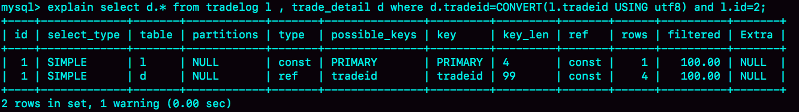

图7 SQL语句优化后的explain结果

这里，我主动把 l.tradeid转成utf8，就避免了被驱动表上的字符编码转换，从explain结果可以看到，这次索引走对了。


## 小结

今天我给你举了三个例子，其实是在说同一件事儿，即： **对索引字段做函数操作，可能会破坏索引值的有序性，因此优化器就决定放弃走树搜索功能。**

第二个例子是隐式类型转换，第三个例子是隐式字符编码转换，它们都跟第一个例子一样，因为要求在索引字段上做函数操作而导致了全索引扫描。

MySQL的优化器确实有“偷懒”的嫌疑，即使简单地把where id+1=1000改写成where id=1000-1就能够用上索引快速查找，也不会主动做这个语句重写。

因此，每次你的业务代码升级时，把可能出现的、新的SQL语句explain一下，是一个很好的习惯。


# 幻读

## 什么是幻读

幻读指的是一个事务在前后两次查询同一个范围的时候，后一次查询看到了前一次查询没有看到的行。


## 怎么解决幻读

，产生幻读的原因是，行锁只能锁住行，但是新插入记录这个动作，要更新的是记录之间的“间隙”。因此，为了解决幻读问题，InnoDB只好引入新的锁，也就是间隙锁(Gap Lock)。

顾名思义，间隙锁，锁的就是两个值之间的空隙。比如文章开头的表t，初始化插入了6个记录，这就产生了7个间隙。

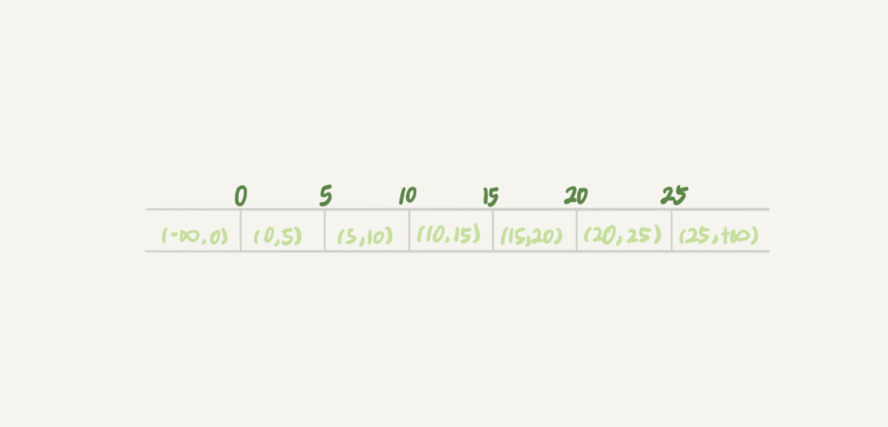

图 5 表t主键索引上的行锁和间隙锁

这样，当你执行 select \* from t where d=5 for update的时候，就不止是给数据库中已有的6个记录加上了行锁，还同时加了7个间隙锁。这样就确保了无法再插入新的记录。

也就是说这时候，在一行行扫描的过程中，不仅将给行加上了行锁，还给行两边的空隙，也加上了间隙锁。

现在你知道了，数据行是可以加上锁的实体，数据行之间的间隙，也是可以加上锁的实体。但是间隙锁跟我们之前碰到过的锁都不太一样。

比如行锁，分成读锁和写锁。下图就是这两种类型行锁的冲突关系。


图6 两种行锁间的冲突关系

也就是说，跟行锁有冲突关系的是“另外一个行锁”。

但是间隙锁不一样， **跟间隙锁存在冲突关系的，是“往这个间隙中插入一个记录”这个操作。** 间隙锁之间都不存在冲突关系。

间隙锁和行锁合称next-key lock，每个next-key lock是前开后闭区间。也就是说，我们的表t初始化以后，如果用select \* from t for update要把整个表所有记录锁起来，就形成了7个next-key lock，分别是 (-∞,0\]、(0,5\]、(5,10\]、(10,15\]、(15,20\]、(20, 25\]、(25, +supremum\]。


# MySQL是怎么保证高可用的？

**MySQL高可用，顾名思义就是当MySQL主机或服务发生任何故障时能够立马有其他主机顶替其工作，并且最低要求是要保证数据一致性。**因此，对于一个MySQL高可用系统需要达到的目标有以下几点：

- 数据一致性保证--这个是最基本的同时也是前提，如果主备的数据不一致，那么切换就无法进行，当然这里的一致性也是一个相对的，但是要做到最终一致性。

- 故障快速切换--当master故障时这里可以是机器故障或者是实例故障，要确保业务能在最短时间切换到备用节点，使得业务受影响时间最短。

- 简化日常维护--通过高可用平台来自动完成高可用的部署、维护、监控等任务，能够最大程度的解放DBA手动操作，提高日常运维效率。

- 统一管理--当复制集很多的情况下，能够统一管理高可用实例信息、监控信息、切换信息等。

- 高可用的部署--要对现有的数据库架构无影响，如果因为部署高可用，需要更改或者调整数据库架构则会导致成本增加。
  

## 主备延迟


### 同步延迟

与数据同步有关的时间点主要包括以下三个：

1. 主库A执行完成一个事务，写入binlog，我们把这个时刻记为T1;

2. 之后传给备库B，我们把备库B接收完这个binlog的时刻记为T2;

3. 备库B执行完成这个事务，我们把这个时刻记为T3。

**所谓主备延迟，就是同一个事务，在备库执行完成的时间和主库执行完成的时间之间的差值，也就是T3-T1。**

你可能会问，如果主备库机器的系统时间设置不一致，会不会导致主备延迟的值不准？

其实不会的。因为，备库连接到主库的时候，会通过执行SELECT UNIX\_TIMESTAMP()函数来获得当前主库的系统时间。如果这时候发现主库的系统时间与自己不一致，备库在执行seconds\_behind\_master计算的时候会自动扣掉这个差值。

需要说明的是，在网络正常的时候，日志从主库传给备库所需的时间是很短的，即T2-T1的值是非常小的。也就是说，网络正常情况下，主备延迟的主要来源是备库接收完binlog和执行完这个事务之间的时间差。

所以说，主备延迟最直接的表现是，备库消费中转日志（relay log）的速度，比主库生产binlog的速度要慢。


### 主备延迟的来源

- 首先，有些部署条件下，备库所在机器的性能要比主库所在的机器性能差。
- 第二种常见的可能了，即备库的压力大。一般的想法是，主库既然提供了写能力，那么备库可以提供一些读能力。或者一些运营后台需要的分析语句，不能影响正常业务，所以只能在备库上跑。

这种情况，我们一般可以这么处理：

1. 一主多从。除了备库外，可以多接几个从库，让这些从库来分担读的压力。

2. 通过binlog输出到外部系统，比如Hadoop这类系统，让外部系统提供统计类查询的能力。

其中，一主多从的方式大都会被采用。因为作为数据库系统，还必须保证有定期全量备份的能力。而从库，就很适合用来做备份。

- 这就是第三种可能了，即大事务。大事务这种情况很好理解。因为主库上必须等事务执行完成才会写入binlog，再传给备库。所以，如果一个主库上的语句执行10分钟，那这个事务很可能就会导致从库延迟10分钟。不知道你所在公司的DBA有没有跟你这么说过：不要 **一次性地用delete语句删除太多数据**。其实，这就是一个典型的大事务场景。另一种典型的大事务场景，就是大表DDL。


## 可靠性优先策略

在图1的双M结构下，从状态1到状态2切换的详细过程是这样的：

1. 判断备库B现在的seconds\_behind\_master，如果小于某个值（比如5秒）继续下一步，否则持续重试这一步；

2. 把主库A改成只读状态，即把readonly设置为true；

3. **判断备库B的seconds\_behind\_master的值，直到这个值变成0为止；**

4. 把备库B改成可读写状态，也就是把readonly 设置为false；

5. 把业务请求切到备库B。


这个切换流程，一般是由专门的HA系统来完成的，我们暂时称之为可靠性优先流程。


图2 MySQL可靠性优先主备切换流程

备注：图中的SBM，是seconds\_behind\_master参数的简写。

**可以看到，这个切换流程中是有不可用时间的。因为在步骤2之后，主库A和备库B都处于readonly状态，也就是说这时系统处于不可写状态，直到步骤5完成后才能恢复。**

在这个不可用状态中，比较耗费时间的是步骤3，可能需要耗费好几秒的时间。这也是为什么需要在步骤1先做判断，确保seconds\_behind\_master的值足够小。

试想如果一开始主备延迟就长达30分钟，而不先做判断直接切换的话，系统的不可用时间就会长达30分钟，这种情况一般业务都是不可接受的。

当然，系统的不可用时间，是由这个数据可靠性优先的策略决定的。你也可以选择可用性优先的策略，来把这个不可用时间几乎降为0。


## 可用性优先策略

如果我强行把步骤4、5调整到最开始执行，也就是说不等主备数据同步，直接把连接切到备库B，并且让备库B可以读写，那么系统几乎就没有不可用时间了。

我们把这个切换流程，暂时称作可用性优先流程。这个切换流程的代价，就是可能出现数据不一致的情况。

图3是 **可用性优先策略，且binlog\_format=mixed** 时的切换流程和数据结果。

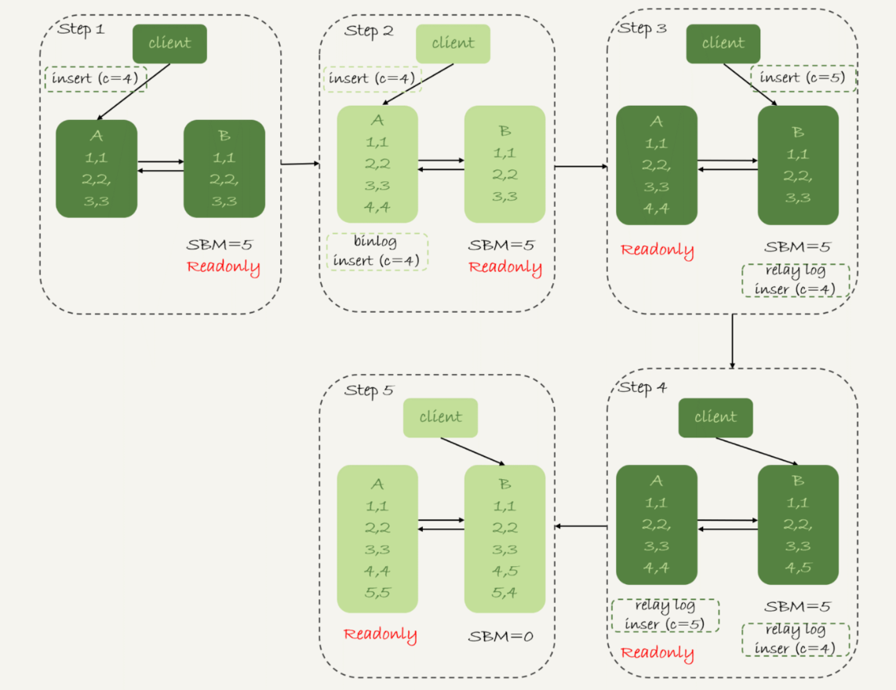

图3 可用性优先策略，且binlog\_format=mixed

现在，我们一起分析下这个切换流程：

1. 步骤2中，主库A执行完insert语句，插入了一行数据（4,4），之后开始进行主备切换。

2. 步骤3中，由于主备之间有5秒的延迟，所以备库B还没来得及应用“插入c=4”这个中转日志，就开始接收客户端“插入 c=5”的命令。

3. 步骤4中，备库B插入了一行数据（4,5），并且把这个binlog发给主库A。

4. 步骤5中，备库B执行“插入c=4”这个中转日志，插入了一行数据（5,4）。而直接在备库B执行的“插入c=5”这个语句，传到主库A，就插入了一行新数据（5,5）。

**最后的结果就是，主库A和备库B上出现了两行不一致的数据。可以看到，这个数据不一致，是由可用性优先流程导致的。**

那么，如果我还是用 **可用性优先策略，但设置binlog\_format=row**，情况又会怎样呢？

因为row格式在记录binlog的时候，会记录新插入的行的所有字段值，所以最后只会有一行不一致。而且，两边的主备同步的应用线程会报错duplicate key error并停止。也就是说，这种情况下，备库B的(5,4)和主库A的(5,5)这两行数据，都不会被对方执行。

图4中我画出了详细过程，你可以自己再分析一下。

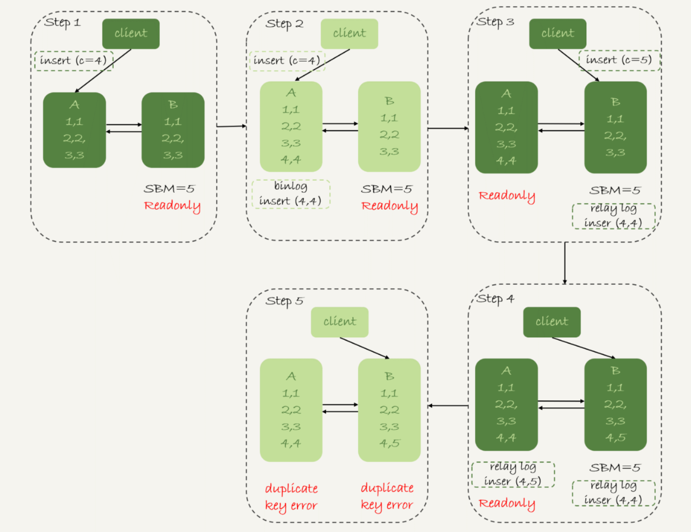

图4 可用性优先策略，且binlog\_format=row

从上面的分析中，你可以看到一些结论：

1. **使用row格式的binlog时，数据不一致的问题更容易被发现**。而使用mixed或者statement格式的binlog时，数据很可能悄悄地就不一致了。如果你过了很久才发现数据不一致的问题，很可能这时的数据不一致已经不可查，或者连带造成了更多的数据逻辑不一致。

2. 主备切换的可用性优先策略会导致数据不一致。因此，大多数情况下，**我都建议你使用可靠性优先策略。毕竟对数据服务来说的话，数据的可靠性一般还是要优于可用性的。**


但事无绝对， **有没有哪种情况数据的可用性优先级更高呢？**

答案是，有的。

我曾经碰到过这样的一个场景：

- 有一个库的作用是记录操作日志。这时候，如果数据不一致可以通过binlog来修补，而这个短暂的不一致也不会引发业务问题。
- 同时，业务系统依赖于这个日志写入逻辑，如果这个库不可写，会导致线上的业务操作无法执行。

这时候，你可能就需要选择先强行切换，事后再补数据的策略。

当然，事后复盘的时候，我们想到了一个改进措施就是，让业务逻辑不要依赖于这类日志的写入。也就是说，日志写入这个逻辑模块应该可以降级，比如写到本地文件，或者写到另外一个临时库里面。

这样的话，这种场景就又可以使用可靠性优先策略了。

接下来我们再看看， **按照可靠性优先的思路，异常切换会是什么效果？**

假设，主库A和备库B间的主备延迟是30分钟，这时候主库A掉电了，HA系统要切换B作为主库。我们在主动切换的时候，可以等到主备延迟小于5秒的时候再启动切换，但这时候已经别无选择了。

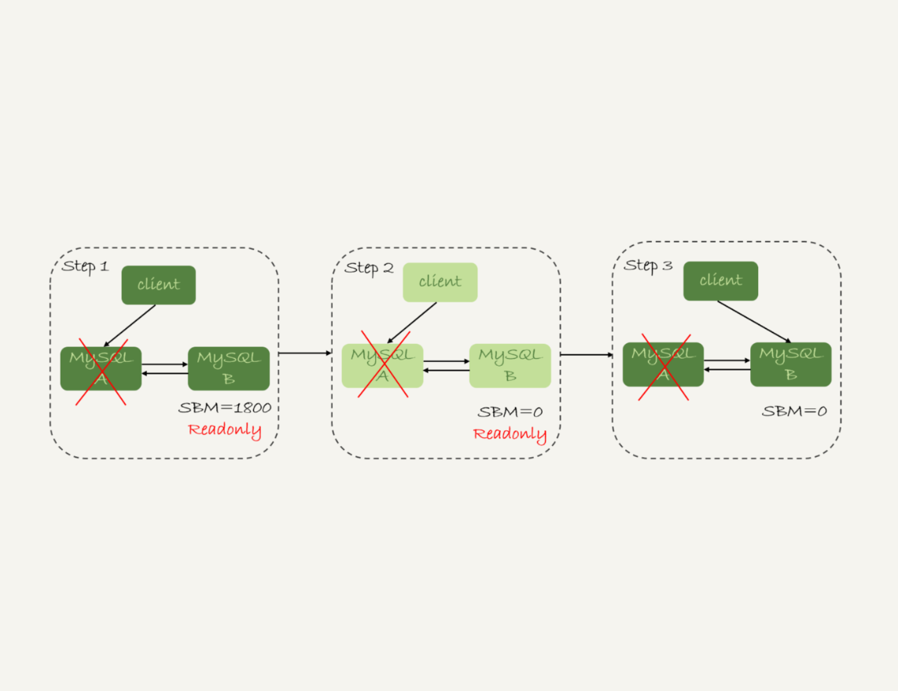

图5 可靠性优先策略，主库不可用

采用可靠性优先策略的话，你就必须得等到备库B的seconds\_behind\_master=0之后，才能切换。但现在的情况比刚刚更严重，并不是系统只读、不可写的问题了，而是系统处于完全不可用的状态。因为，主库A掉电后，我们的连接还没有切到备库B。


# 读写分离有哪些坑？

接下来，我们就看一下客户端直连和带proxy的读写分离架构，各有哪些特点。

1. 客户端直连方案，因为少了一层proxy转发，所以查询性能稍微好一点儿，并且整体架构简单，排查问题更方便。但是这种方案，由于要了解后端部署细节，所以在出现主备切换、库迁移等操作的时候，客户端都会感知到，并且需要调整数据库连接信息。


   你可能会觉得这样客户端也太麻烦了，信息大量冗余，架构很丑。其实也未必，一般采用这样的架构，一定会伴随一个负责管理后端的组件，比如Zookeeper，尽量让业务端只专注于业务逻辑开发。

2. 带proxy的架构，对客户端比较友好。客户端不需要关注后端细节，连接维护、后端信息维护等工作，都是由proxy完成的。但这样的话，对后端维护团队的要求会更高。而且，proxy也需要有高可用架构。因此，带proxy架构的整体就相对比较复杂。

**这种“在从库上会读到系统的一个过期状态”的现象，在这篇文章里，我们暂且称之为“过期读”。**

这里，我先把文章中涉及到的处理过期读的方案汇总在这里，以帮助你更好地理解和掌握全文的知识脉络。这些方案包括：

- 强制走主库方案 —— 强制走主库方案其实就是，将查询请求做分类（是否要求最新）。
- sleep方案 —— 主库更新后，读从库之前先sleep一下。具体的方案就是，类似于执行一条select sleep(1)命令。
- 判断主备无延迟方案；
- 配合semi-sync方案；
- 等主库位点方案；
- 等GTID方案。


# 怎么判断一个主库出问题了？

## select 1判断

实际上，select 1成功返回，只能说明这个库的进程还在，并不能说明主库没问题。现在，我们来看一下这个场景。


## 查表判断

为了能够检测InnoDB并发线程数过多导致的系统不可用情况，我们需要找一个访问InnoDB的场景。一般的做法是，在系统库（mysql库）里创建一个表，比如命名为health\_check，里面只放一行数据，然后定期执行：

```
mysql> select * from mysql.health_check;

```

使用这个方法，我们可以检测出由于并发线程过多导致的数据库不可用的情况。


## 更新判断

既然要更新，就要放个有意义的字段，常见做法是放一个timestamp字段，用来表示最后一次执行检测的时间。这条更新语句类似于：

```
mysql> update mysql.health_check set t_modified=now();

```

节点可用性的检测都应该包含主库和备库。如果用更新来检测主库的话，那么备库也要进行更新检测。
