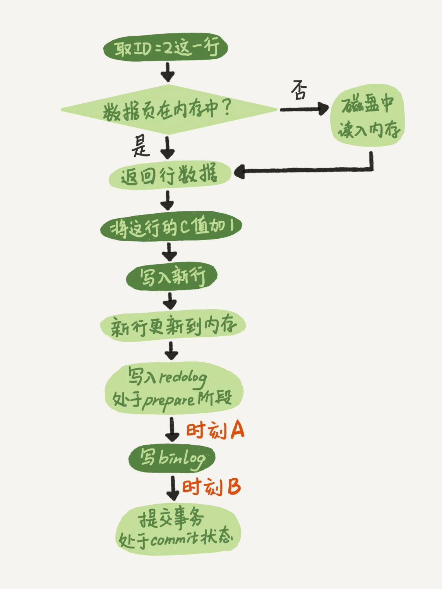
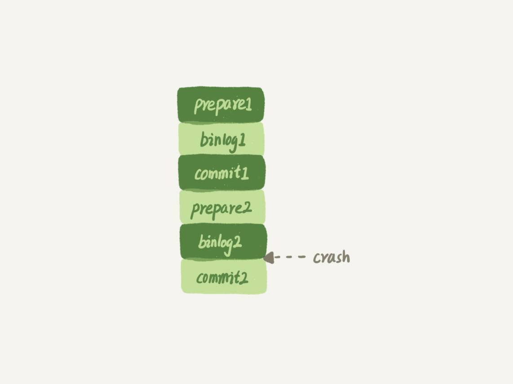

# 如何避免长事务对业务的影响？

**首先，从应用开发端来看：**

1. 确认是否使用了set autocommit=0。这个确认工作可以在测试环境中开展，把MySQL的general\_log开起来，然后随便跑一个业务逻辑，通过general\_log的日志来确认。一般框架如果会设置这个值，也就会提供参数来控制行为，你的目标就是把它改成1。

2. 确认是否有不必要的只读事务。有些框架会习惯不管什么语句先用begin/commit框起来。我见过有些是业务并没有这个需要，但是也把好几个select语句放到了事务中。这种只读事务可以去掉。

3. 业务连接数据库的时候，根据业务本身的预估，通过SET MAX\_EXECUTION\_TIME命令，来控制每个语句执行的最长时间，避免单个语句意外执行太长时间。（为什么会意外？在后续的文章中会提到这类案例）


**其次，从数据库端来看：**

1. 监控 information\_schema.Innodb\_trx表，设置长事务阈值，超过就报警/或者kill；

2. Percona的pt-kill这个工具不错，推荐使用；

3. 在业务功能测试阶段要求输出所有的general\_log，分析日志行为提前发现问题；

4. 如果使用的是MySQL 5.6或者更新版本，把innodb\_undo\_tablespaces设置成2（或更大的值）。如果真的出现大事务导致回滚段过大，这样设置后清理起来更方便。


# 在两阶段提交的不同瞬间，MySQL 如果发生异常重启，是怎么保证数据完整性的？



如果在图中时刻A的地方，也就是写入redo log 处于prepare阶段之后、写binlog之前，发生了崩溃（crash），由于此时binlog还没写，redo log也还没提交，所以崩溃恢复的时候，这个事务会回滚。这时候，binlog还没写，所以也不会传到备库。到这里，大家都可以理解。

1. 如果redo log里面的事务是完整的，也就是已经有了commit标识，则直接提交；

2. 如果redo log里面的事务只有完整的prepare，则判断对应的事务binlog是否存在并完整：


   a. 如果是，则提交事务；


   b. 否则，回滚事务。


## 追问1：MySQL怎么知道binlog是完整的?

一个事务的binlog是有完整格式的：

- statement格式的binlog，最后会有COMMIT；
- row格式的binlog，最后会有一个XID event。

另外，在MySQL 5.6.2版本以后，还引入了binlog-checksum参数，用来验证binlog内容的正确性。对于binlog日志由于磁盘原因，可能会在日志中间出错的情况，MySQL可以通过校验checksum的结果来发现。所以，MySQL还是有办法验证事务binlog的完整性的。


## 追问2：redo log 和 binlog是怎么关联起来的?

它们有一个共同的数据字段，叫XID。崩溃恢复的时候，会按顺序扫描redo log：

- 如果碰到既有prepare、又有commit的redo log，就直接提交；
- 如果碰到只有parepare、而没有commit的redo log，就拿着XID去binlog找对应的事务。


## 追问3：处于prepare阶段的redo log加上完整binlog，重启就能恢复，MySQL为什么要这么设计?

回答：其实，这个问题还是跟我们在反证法中说到的数据与备份的一致性有关。在时刻B，也就是binlog写完以后MySQL发生崩溃，这时候binlog已经写入了，之后就会被从库（或者用这个binlog恢复出来的库）使用。

所以，在主库上也要提交这个事务。采用这个策略，主库和备库的数据就保证了一致性。


## 追问4：如果这样的话，为什么还要两阶段提交呢？干脆先redo log写完，再写binlog。崩溃恢复的时候，必须得两个日志都完整才可以。是不是一样的逻辑？

回答：其实，两阶段提交是经典的分布式系统问题，并不是MySQL独有的。

如果必须要举一个场景，来说明这么做的必要性的话，那就是事务的持久性问题。

对于InnoDB引擎来说，如果redo log提交完成了，事务就不能回滚（如果这还允许回滚，就可能覆盖掉别的事务的更新）。而如果redo log直接提交，然后binlog写入的时候失败，InnoDB又回滚不了，数据和binlog日志又不一致了。

两阶段提交就是为了给所有人一个机会，当每个人都说“我ok”的时候，再一起提交。


## 追问5：不引入两个日志，也就没有两阶段提交的必要了。只用binlog来支持崩溃恢复，又能支持归档，不就可以了？

回答：这位同学的意思是，只保留binlog，然后可以把提交流程改成这样：… -> “数据更新到内存” -> “写 binlog” -> “提交事务”，是不是也可以提供崩溃恢复的能力？

答案是不可以。

如果说 **历史原因** 的话，那就是InnoDB并不是MySQL的原生存储引擎。MySQL的原生引擎是MyISAM，设计之初就有没有支持崩溃恢复。

InnoDB在作为MySQL的插件加入MySQL引擎家族之前，就已经是一个提供了崩溃恢复和事务支持的引擎了。

InnoDB接入了MySQL后，发现既然binlog没有崩溃恢复的能力，那就用InnoDB原有的redo log好了。

而如果说 **实现上的原因** 的话，就有很多了。就按照问题中说的，只用binlog来实现崩溃恢复的流程，我画了一张示意图，这里就没有redo log了。



这样的流程下，binlog还是不能支持崩溃恢复的。我说一个不支持的点吧：binlog没有能力恢复“数据页”。

如果在图中标的位置，也就是binlog2写完了，但是整个事务还没有commit的时候，MySQL发生了crash。

重启后，引擎内部事务2会回滚，然后应用binlog2可以补回来；但是对于事务1来说，系统已经认为提交完成了，不会再应用一次binlog1。

但是，InnoDB引擎使用的是WAL技术，执行事务的时候，写完内存和日志，事务就算完成了。如果之后崩溃，要依赖于日志来恢复数据页。

也就是说在图中这个位置发生崩溃的话，事务1也是可能丢失了的，而且是数据页级的丢失。此时，binlog里面并没有记录数据页的更新细节，是补不回来的。

你如果要说，那我优化一下binlog的内容，让它来记录数据页的更改可以吗？但，这其实就是又做了一个redo log出来。

所以，至少现在的binlog能力，还不能支持崩溃恢复。


## 追问6：那能不能反过来，只用redo log，不要binlog？

回答：如果只从崩溃恢复的角度来讲是可以的。你可以把binlog关掉，这样就没有两阶段提交了，但系统依然是crash-safe的。

但是，如果你了解一下业界各个公司的使用场景的话，就会发现在正式的生产库上，binlog都是开着的。因为binlog有着redo log无法替代的功能。

一个是归档。redo log是循环写，写到末尾是要回到开头继续写的。这样历史日志没法保留，redo log也就起不到归档的作用。

一个就是MySQL系统依赖于binlog。binlog作为MySQL一开始就有的功能，被用在了很多地方。其中，MySQL系统高可用的基础，就是binlog复制。

还有很多公司有异构系统（比如一些数据分析系统），这些系统就靠消费MySQL的binlog来更新自己的数据。关掉binlog的话，这些下游系统就没法输入了。

总之，由于现在包括MySQL高可用在内的很多系统机制都依赖于binlog，所以“鸠占鹊巢”redo log还做不到。你看，发展生态是多么重要。


## 追问7：redo log一般设置多大？

回答：redo log太小的话，会导致很快就被写满，然后不得不强行刷redo log，这样WAL机制的能力就发挥不出来了。

所以，如果是现在常见的几个TB的磁盘的话，就不要太小气了，直接将redo log设置为4个文件、每个文件1GB吧。


## 追问8：正常运行中的实例，数据写入后的最终落盘，是从redo log更新过来的还是从buffer pool更新过来的呢？

回答：这个问题其实问得非常好。这里涉及到了，“redo log里面到底是什么”的问题。

实际上，redo log并没有记录数据页的完整数据，所以它并没有能力自己去更新磁盘数据页，也就不存在“数据最终落盘，是由redo log更新过去”的情况。

1. 如果是正常运行的实例的话，数据页被修改以后，跟磁盘的数据页不一致，称为脏页。最终数据落盘，就是把内存中的数据页写盘。这个过程，甚至与redo log毫无关系。

2. 在崩溃恢复场景中，InnoDB如果判断到一个数据页可能在崩溃恢复的时候丢失了更新，就会将它读到内存，然后让redo log更新内存内容。更新完成后，内存页变成脏页，就回到了第一种情况的状态。


## 追问9：redo log buffer是什么？是先修改内存，还是先写redo log文件？

回答：这两个问题可以一起回答。

在一个事务的更新过程中，日志是要写多次的。比如下面这个事务：

```
begin;
insert into t1 ...
insert into t2 ...
commit;

```

这个事务要往两个表中插入记录，插入数据的过程中，生成的日志都得先保存起来，但又不能在还没commit的时候就直接写到redo log文件里。

所以，redo log buffer就是一块内存，用来先存redo日志的。也就是说，在执行第一个insert的时候，数据的内存被修改了，redo log buffer也写入了日志。

但是，真正把日志写到redo log文件（文件名是 ib\_logfile+数字），是在执行commit语句的时候做的。

（这里说的是事务执行过程中不会“主动去刷盘”，以减少不必要的IO消耗。但是可能会出现“被动写入磁盘”，比如内存不够、其他事务提交等情况。这个问题我们会在后面第22篇文章《MySQL有哪些“饮鸩止渴”的提高性能的方法？》中再详细展开）。

单独执行一个更新语句的时候，InnoDB会自己启动一个事务，在语句执行完成的时候提交。过程跟上面是一样的，只不过是“压缩”到了一个语句里面完成。


## 业务设计问题