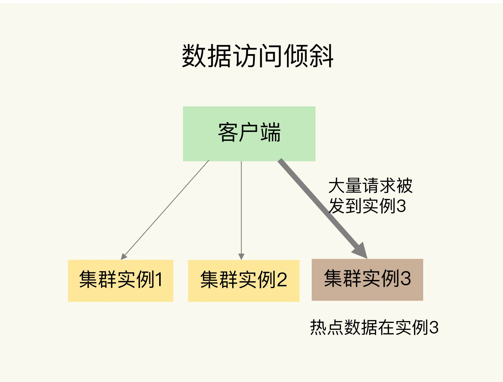
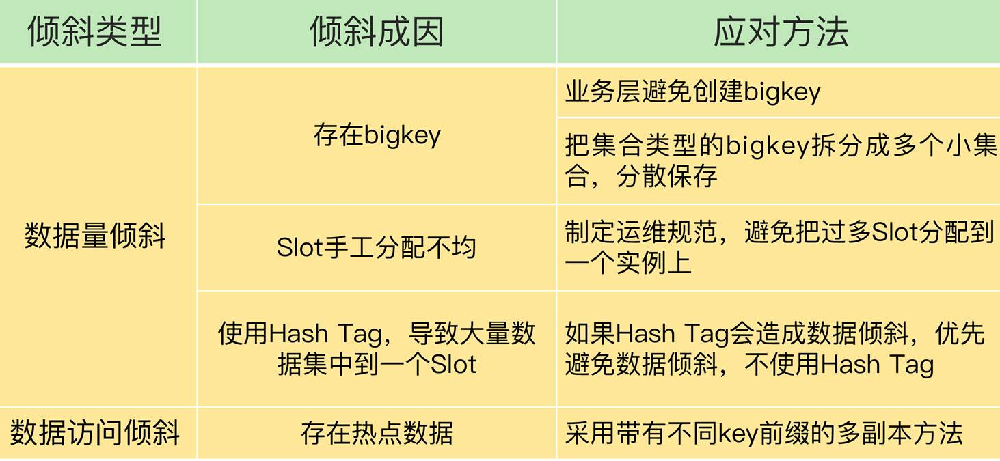

# Codis VS Redis Cluster：我该选择哪一个集群方案？ 

Redis 的切片集群使用多个实例保存数据，能够很好地应对大数据量的场景。在第 8 讲中，我们学习了 Redis 官方提供的切片集群方案 Redis Cluster，这为你掌握切片集群打下了基础。今天，我再来带你进阶一下，我们来学习下 Redis Cluster 方案正式发布前，业界已经广泛使用的 Codis。

我会具体讲解 Codis 的关键技术实现原理，同时将 Codis 和 Redis Cluster 进行对比，帮你选出最佳的集群方案。

好了，话不多说，我们先来学习下 Codis 的整体架构和流程。


## Codis 的整体架构和基本流程

Codis 集群中包含了 4 类关键组件。

- codis server：这是进行了二次开发的 Redis 实例，其中增加了额外的数据结构，支持数据迁移操作，**主要负责处理具体的数据读写请求。**

- codis proxy：**接收客户端请求**，并把请求转发给 codis server。

- Zookeeper 集群：保存集群元数据，例如数据位置信息和 codis proxy 信息。

- codis dashboard 和 codis fe：共同组成了集群管理工具。其中，codis dashboard 负责执行集群管理工作，包括增删 codis server、codis proxy 和进行数据迁移。而 codis fe 负责提供 dashboard 的 Web 操作界面，便于我们直接在 Web 界面上进行集群管理。

我用一张图来展示下 Codis 集群的架构和关键组件。


我来给你具体解释一下 Codis 是如何处理请求的。

- 首先，为了让集群能接收并处理请求，我们要先使用 codis dashboard 设置 codis server 和 codis proxy 的访问地址，完成设置后，codis server 和 codis proxy 才会开始接收连接。

- 然后，当客户端要读写数据时，客户端直接和 codis proxy 建立连接。你可能会担心，既然客户端连接的是 proxy，是不是需要修改客户端，才能访问 proxy？其实，你不用担心，codis proxy 本身支持 Redis 的 RESP 交互协议，所以，客户端访问 codis proxy 时，和访问原生的 Redis 实例没有什么区别，这样一来，原本连接单实例的客户端就可以轻松地和 Codis 集群建立起连接了。

- 最后，codis proxy 接收到请求，就会查询请求数据和 codis server 的映射关系，并把请求转发给相应的 codis server 进行处理。当 codis server 处理完请求后，会把结果返回给 codis proxy，proxy 再把数据返回给客户端。

我来用一张图展示这个处理流程：


好了，了解了 Codis 集群架构和基本流程后，接下来，我就围绕影响切片集群使用效果的 4 方面技术因素：数据分布、集群扩容和数据迁移、客户端兼容性、可靠性保证，来和你聊聊它们的具体设计选择和原理，帮你掌握 Codis 的具体用法。


## Codis 的关键技术原理

一旦我们使用了切片集群，面临的第一个问题就是，数据是怎么在多个实例上分布的。


#### 数据如何在集群里分布？

在 Codis 集群中，一个数据应该保存在哪个 codis server 上，这是通过逻辑槽（Slot）映射来完成的，具体来说，总共分成两步。

- 第一步，Codis 集群一共有 1024 个 Slot，编号依次是 0 到 1023。我**们可以把这些 Slot 手动分配给 codis server，每个 server 上包含一部分 Slot。当然，我们也可以让 codis dashboard 进行自动分配**，例如，dashboard 把 1024 个 Slot 在所有 server 上均分。

- 第二步，**当客户端要读写数据时，会使用 CRC32 算法计算数据 key 的哈希值，并把这个哈希值对 1024 取模。而取模后的值，则对应 Slot 的编号。**此时，根据第一步分配的 Slot 和 server 对应关系，我们就可以知道数据保存在哪个 server 上了。

我来举个例子。下图显示的就是数据、Slot 和 codis server 的映射保存关系。其中，Slot 0 和 1 被分配到了 server1，Slot 2 分配到 server2，Slot 1022 和 1023 被分配到 server8。当客户端访问 key 1 和 key 2 时，这两个数据的 CRC32 值对 1024 取模后，分别是 1 和 1022。因此，它们会被保存在 Slot 1 和 Slot 1022 上，而 Slot 1 和 Slot 1022 已经被分配到 codis server 1 和 8 上了。这样一来，key 1 和 key 2 的保存位置就很清楚了。


**数据 key 和 Slot 的映射关系是客户端在读写数据前直接通过 CRC32 计算得到的，而 Slot 和 codis server 的映射关系是通过分配完成的，所以就需要用一个存储系统保存下来，否则，如果集群有故障了，映射关系就会丢失。**

我们把 Slot 和 codis server 的映射关系称为**数据路由表（简称路由表）**。我们在 codis dashboard 上分配好路由表后，dashboard 会把路由表发送给 codis proxy，同时，dashboard 也会把路由表保存在 Zookeeper 中。codis-proxy 会把路由表缓存在本地，当它接收到客户端请求后，直接查询本地的路由表，就可以完成正确的请求转发了。

你可以看下这张图，它显示了路由表的分配和使用过程。


在数据分布的实现方法上，Codis 和 Redis Cluster 很相似，都采用了 key 映射到 Slot、Slot 再分配到实例上的机制。

但是，这里有一个明显的区别，我来解释一下。

Codis 中的路由表是我们通过 codis dashboard 分配和修改的，并被保存在 Zookeeper 集群中。一旦数据位置发生变化（例如有实例增减），路由表被修改了，codis dashbaord 就会把修改后的路由表发送给 codis proxy，proxy 就可以根据最新的路由信息转发请求了。

在 Redis Cluster 中，数据路由表是通过每个实例相互间的通信传递的，最后会在每个实例上保存一份。当数据路由信息发生变化时，就需要在所有实例间通过网络消息进行传递。所以，如果实例数量较多的话，就会消耗较多的集群网络资源。

数据分布解决了新数据写入时该保存在哪个 server 的问题，但是，当业务数据增加后，如果集群中的现有实例不足以保存所有数据，我们就需要对集群进行扩容。接下来，我们再来学习下 Codis 针对集群扩容的关键技术设计。


#### 集群扩容和数据迁移如何进行?

Codis 集群扩容包括了两方面：增加 codis server 和增加 codis proxy。

我们先来看增加 codis server，这个过程主要涉及到两步操作：

- 启动新的 codis server，将它加入集群；

- 把部分数据迁移到新的 server。

需要注意的是，这里的数据迁移是一个重要的机制，接下来我来重点介绍下。

Codis 集群按照 Slot 的粒度进行数据迁移，我们来看下迁移的基本流程。

- 在源 server 上，Codis 从要迁移的 Slot 中随机选择一个数据，发送给目的 server。

- 目的 server 确认收到数据后，会给源 server 返回确认消息。这时，源 server 会在本地将刚才迁移的数据删除。

第一步和第二步就是单个数据的迁移过程。Codis 会不断重复这个迁移过程，直到要迁移的 Slot 中的数据全部迁移完成。

我画了下面这张图，显示了数据迁移的流程，你可以看下加深理解。


针对刚才介绍的单个数据的迁移过程，Codis 实现了两种迁移模式，分别是**同步迁移和异步迁移**，我们来具体看下。

- 同步迁移是指，在数据从源 server 发送给目的 server 的过程中，源 server 是阻塞的，无法处理新的请求操作。这种模式很容易实现，但是迁移过程中会涉及多个操作（包括数据在源 server 序列化、网络传输、在目的 server 反序列化，以及在源 server 删除），如果迁移的数据是一个 bigkey，源 server 就会阻塞较长时间，无法及时处理用户请求。

- 为了避免数据迁移阻塞源 server，Codis 实现的第二种迁移模式就是异步迁移。异步迁移的关键特点有两个。

第一个特点是，当源 server 把数据发送给目的 server 后，就可以处理其他请求操作了，不用等到目的 server 的命令执行完。而目的 server 会在收到数据并反序列化保存到本地后，给源 server 发送一个 ACK 消息，表明迁移完成。此时，源 server 在本地把刚才迁移的数据删除。

**在这个过程中，迁移的数据会被设置为只读，所以，源 server 上的数据不会被修改，自然也就不会出现“和目的 server 上的数据不一致”问题了。**

第二个特点是，**对于 bigkey，异步迁移采用了拆分指令的方式进行迁移。**具体来说就是，对 bigkey 中每个元素，用一条指令进行迁移，而不是把整个 bigkey 进行序列化后再整体传输。这种化整为零的方式，就避免了 bigkey 迁移时，因为要序列化大量数据而阻塞源 server 的问题。

此外，当 bigkey 迁移了一部分数据后，如果 Codis 发生故障，就会导致 bigkey 的一部分元素在源 server，而另一部分元素在目的 server，这就破坏了迁移的原子性。

**所以，Codis 会在目标 server 上，给 bigkey 的元素设置一个临时过期时间。如果迁移过程中发生故障，那么，目标 server 上的 key 会在过期后被删除，不会影响迁移的原子性。当正常完成迁移后，bigkey 元素的临时过期时间会被删除。**

我给你举个例子，假如我们要迁移一个有 1 万个元素的 List 类型数据，当使用异步迁移时，源 server 就会给目的 server 传输 1 万条 RPUSH 命令，每条命令对应了 List 中一个元素的插入。在目的 server 上，这 1 万条命令再被依次执行，就可以完成数据迁移。

这里，有个地方需要你注意下，为了提升迁移的效率，Codis 在异步迁移 Slot 时，允许每次迁移多个 key。你可以通过异步迁移命令 SLOTSMGRTTAGSLOT-ASYNC 的参数 numkeys 设置每次迁移的 key 数量。

刚刚我们学习的是 codis server 的扩容和数据迁移机制，其实，在 Codis 集群中，除了增加 codis server，有时还需要增加 codis proxy。

因为在 Codis 集群中，客户端是和 codis proxy 直接连接的，所以，当客户端增加时，一个 proxy 无法支撑大量的请求操作，此时，我们就需要增加 proxy。

增加 proxy 比较容易，我们直接启动 proxy，再通过 codis dashboard 把 proxy 加入集群就行。

此时，codis proxy 的访问连接信息都会保存在 Zookeeper 上。所以，当新增了 proxy 后，Zookeeper 上会有最新的访问列表，客户端也就可以从 Zookeeper 上读取 proxy 访问列表，把请求发送给新增的 proxy。这样一来，客户端的访问压力就可以在多个 proxy 上分担处理了，如下图所示：


好了，到这里，我们就了解了 Codis 集群中的数据分布、集群扩容和数据迁移的方法，这都是切片集群中的关键机制。

不过，因为集群提供的功能和单实例提供的功能不同，所以，我们在应用集群时，不仅要关注切片集群中的关键机制，还需要关注客户端的使用。这里就有一个问题了：业务应用采用的客户端能否直接和集群交互呢？接下来，我们就来聊下这个问题。


#### 集群客户端需要重新开发吗?

使用 Redis 单实例时，客户端只要符合 RESP 协议，就可以和实例进行交互和读写数据。但是，在使用切片集群时，有些功能是和单实例不一样的，比如集群中的数据迁移操作，在单实例上是没有的，而且迁移过程中，数据访问请求可能要被重定向（例如 Redis Cluster 中的 MOVE 命令）。

所以，客户端需要增加和集群功能相关的命令操作的支持。如果原来使用单实例客户端，想要扩容使用集群，就需要使用新客户端，这对于业务应用的兼容性来说，并不是特别友好。

Codis 集群在设计时，就充分考虑了对现有单实例客户端的兼容性。

Codis 使用 codis proxy 直接和客户端连接，codis proxy 是和单实例客户端兼容的。而和集群相关的管理工作（例如请求转发、数据迁移等），都由 codis proxy、codis dashboard 这些组件来完成，不需要客户端参与。

这样一来，业务应用使用 Codis 集群时，就不用修改客户端了，可以复用和单实例连接的客户端，既能利用集群读写大容量数据，又避免了修改客户端增加复杂的操作逻辑，保证了业务代码的稳定性和兼容性。

最后，我们再来看下集群可靠性的问题。可靠性是实际业务应用的一个核心要求。对于一个分布式系统来说，它的可靠性和系统中的组件个数有关：组件越多，潜在的风险点也就越多。和 Redis Cluster 只包含 Redis 实例不一样，Codis 集群包含的组件有 4 类。那你就会问了，这么多组件会降低 Codis 集群的可靠性吗？


#### 怎么保证集群可靠性？

我们来分别看下 Codis 不同组件的可靠性保证方法。

- 首先是 codis server。

**codis server 其实就是 Redis 实例，只不过增加了和集群操作相关的命令。**Redis 的主从复制机制和哨兵机制在 codis server 上都是可以使用的，所以，Codis 就使用主从集群来保证 codis server 的可靠性。简单来说就是，Codis 给每个 server 配置从库，并使用哨兵机制进行监控，当发生故障时，主从库可以进行切换，从而保证了 server 的可靠性。

在这种配置情况下，每个 server 就成为了一个 server group，每个 group 中是一主多从的 server。数据分布使用的 Slot，也是按照 group 的粒度进行分配的。同时，codis proxy 在转发请求时，也是按照数据所在的 Slot 和 group 的对应关系，把写请求发到相应 group 的主库，读请求发到 group 中的主库或从库上。

下图展示的是配置了 server group 的 Codis 集群架构。在 Codis 集群中，我们通过部署 server group 和哨兵集群，实现 codis server 的主从切换，提升集群可靠性。


因为 codis proxy 和 Zookeeper 这两个组件是搭配在一起使用的，所以，接下来，我们再来看下这两个组件的可靠性。

在 Codis 集群设计时，proxy 上的信息源头都是来自 Zookeeper（例如路由表）。而 Zookeeper 集群使用多个实例来保存数据，只要有超过半数的 Zookeeper 实例可以正常工作， Zookeeper 集群就可以提供服务，也可以保证这些数据的可靠性。

所以，codis proxy 使用 Zookeeper 集群保存路由表，可以充分利用 Zookeeper 的高可靠性保证来确保 codis proxy 的可靠性，不用再做额外的工作了。当 codis proxy 发生故障后，直接重启 proxy 就行。重启后的 proxy，可以通过 codis dashboard 从 Zookeeper 集群上获取路由表，然后，就可以接收客户端请求进行转发了。这样的设计，也降低了 Codis 集群本身的开发复杂度。

对于 codis dashboard 和 codis fe 来说，它们主要提供配置管理和管理员手工操作，负载压力不大，所以，它们的可靠性可以不用额外进行保证了。


## 切片集群方案选择建议

到这里，Codis 和 Redis Cluster 这两种切片集群方案我们就学完了，我把它们的区别总结在了一张表里，你可以对比看下。


最后，在实际应用的时候，对于这两种方案，我们该怎么选择呢？我再给你提 4 条建议。

从稳定性和成熟度来看，Codis 应用得比较早，在业界已经有了成熟的生产部署。虽然 Codis 引入了 proxy 和 Zookeeper，增加了集群复杂度，但是，proxy 的无状态设计和 Zookeeper 自身的稳定性，也给 Codis 的稳定使用提供了保证。而 Redis Cluster 的推出时间晚于 Codis，相对来说，成熟度要弱于 Codis，如果你想选择一个成熟稳定的方案，Codis 更加合适些。

从业务应用客户端兼容性来看，连接单实例的客户端可以直接连接 codis proxy，而原本连接单实例的客户端要想连接 Redis Cluster 的话，就需要开发新功能。所以，如果你的业务应用中大量使用了单实例的客户端，而现在想应用切片集群的话，建议你选择 Codis，这样可以避免修改业务应用中的客户端。

从使用 Redis 新命令和新特性来看，Codis server 是基于开源的 Redis 3.2.8 开发的，所以，Codis 并不支持 Redis 后续的开源版本中的新增命令和数据类型。另外，Codis 并没有实现开源 Redis 版本的所有命令，比如 BITOP、BLPOP、BRPOP，以及和与事务相关的 MUTLI、EXEC 等命令。Codis 官网上列出了不被支持的命令列表，你在使用时记得去核查一下。所以，如果你想使用开源 Redis 版本的新特性，Redis Cluster 是一个合适的选择。

从数据迁移性能维度来看，Codis 能支持异步迁移，异步迁移对集群处理正常请求的性能影响要比使用同步迁移的小。所以，如果你在应用集群时，数据迁移比较频繁的话，Codis 是个更合适的选择。


## 小结

这节课，我们学习了 Redis 切片集群的 Codis 方案。Codis 集群包含 codis server、codis proxy、Zookeeper、codis dashboard 和 codis fe 这四大类组件。我们再来回顾下它们的主要功能。

- codis proxy 和 codis server 负责处理数据读写请求，其中，codis proxy 和客户端连接，接收请求，并转发请求给 codis server，而 codis server 负责具体处理请求。

- codis dashboard 和 codis fe 负责集群管理，其中，codis dashboard 执行管理操作，而 codis fe 提供 Web 管理界面。

- Zookeeper 集群负责保存集群的所有元数据信息，包括路由表、proxy 实例信息等。这里，有个地方需要你注意，除了使用 Zookeeper，Codis 还可以使用 etcd 或本地文件系统保存元数据信息。

关于 Codis 和 Redis Cluster 的选型考虑，我从稳定性成熟度、客户端兼容性、Redis 新特性使用以及数据迁移性能四个方面给你提供了建议，希望能帮助到你。

最后，我再给你提供一个 Codis 使用上的小建议：当你有多条业务线要使用 Codis 时，可以启动多个 codis dashboard，每个 dashboard 管理一部分 codis server，同时，再用一个 dashboard 对应负责一个业务线的集群管理，这样，就可以做到用一个 Codis 集群实现多条业务线的隔离管理了。


# Redis 支撑秒杀场景的关键技术和实践都有哪些？

秒杀是一个非常典型的活动场景，比如，在双 11、618 等电商促销活动中，都会有秒杀场景。秒杀场景的业务特点是**限时限量**，业务系统要处理瞬时的大量高并发请求，而 Redis 就经常被用来支撑秒杀活动。

不过，秒杀场景包含了多个环节，可以分成秒杀前、秒杀中和秒杀后三个阶段，每个阶段的请求处理需求并不相同，Redis 并不能支撑秒杀场景的每一个环节。

那么，Redis 具体是在秒杀场景的哪个环节起到支撑作用的呢？又是如何支持的呢？清楚了这个问题，我们才能知道在秒杀场景中，如何使用 Redis 来支撑高并发压力，并且做好秒杀场景的应对方案。

接下来，我们先来了解下秒杀场景的负载特征。


## **秒杀场景的负载特征对支撑系统的要求**

秒杀活动售卖的商品通常价格非常优惠，会吸引大量用户进行抢购。但是，商品库存量却远远小于购买该商品的用户数，而且会限定用户只能在一定的时间段内购买。这就给秒杀系统带来两个明显的负载特征，相应的，也对支撑系统提出了要求，我们来分析下。

**第一个特征是瞬时并发访问量非常高**。

一般数据库每秒只能支撑千级别的并发请求，而 Redis 的并发处理能力（每秒处理请求数）能达到万级别，甚至更高。所以，**当有大量并发请求涌入秒杀系统时，我们就需要使用** **Redis** **先拦截大部分请求，避免大量请求直接发送给数据库，把数据库压垮**。

**第二个特征是读多写少，而且读操作是简单的查询操作**。

在秒杀场景下，用户需要先查验商品是否还有库存（也就是根据商品 ID 查询该商品的库存还有多少），只有库存有余量时，秒杀系统才能进行库存扣减和下单操作。

库存查验操作是典型的键值对查询，而 Redis 对键值对查询的高效支持，正好和这个操作的要求相匹配。

不过，秒杀活动中只有少部分用户能成功下单，所以，商品库存查询操作（读操作）要远多于库存扣减和下单操作（写操作）。

当然，实际秒杀场景通常有多个环节，刚才介绍的用户查验库存只是其中的一个环节。那么，Redis 具体可以在整个秒杀场景中哪些环节发挥作用呢？这就要说到秒杀活动的整体流程了，我们来分析下。


## **Redis** **可以在秒杀场景的哪些环节发挥作用？**

我们一般可以把秒杀活动分成三个阶段。在每一个阶段，Redis 所发挥的作用也不一样。


### 第一阶段是秒杀活动前。

在这个阶段，用户会不断刷新商品详情页，这会导致详情页的瞬时请求量剧增。这个阶段的应对方案，一般是尽量**把商品详情页的页面元素静态化，然后使用** **CDN** **或是浏览器把这些静态化的元素缓存起来**。这样一来，秒杀前的大量请求可以直接由 CDN 或是浏览器缓存服务，不会到达服务器端了，这就减轻了服务器端的压力。

在这个阶段，有 CDN 和浏览器缓存服务请求就足够了，我们还不需要使用 Redis。


### 第二阶段是秒杀活动开始。

此时，大量用户点击商品详情页上的秒杀按钮，会产生大量的并发请求查询库存。一旦某个请求查询到有库存，紧接着系统就会进行库存扣减。然后，系统会生成实际订单，并进行后续处理，例如订单支付和物流服务。如果请求查不到库存，就会返回。用户通常会继续点击秒杀按钮，继续查询库存。

简单来说，**这个阶段的操作就是三个：库存查验、库存扣减和订单处理。**因为每个秒杀请求都会查询库存，而请求只有查到有库存余量后，后续的库存扣减和订单处理才会被执行。所以，这个阶段中最大的并发压力都在库存查验操作上。

为了支撑大量高并发的库存查验请求，我们需要在这个环节使用 Redis 保存库存量，这样一来，请求可以直接从 Redis 中读取库存并进行查验。

那么，库存扣减和订单处理是否都可以交给后端的数据库来执行呢?

**其实，订单处理可以在数据库中执行，但库存扣减操作，不能交给后端数据库处理。**

在数据库中处理订单的原因比较简单，我先说下。

订单处理会涉及支付、商品出库、物流等多个关联操作，这些操作本身涉及数据库中的多张数据表，要保证处理的事务性，需要在数据库中完成。而且，订单处理时的请求压力已经不大了，数据库可以支撑这些订单处理请求。

那为啥库存扣减操作不能在数据库执行呢？这是因为，一旦请求查到有库存，就意味着发送该请求的用户获得了商品的购买资格，用户就会下单了。同时，商品的库存余量也需要减少一个。如果我们把库存扣减的操作放到数据库执行，会带来两个问题。

- **额外的开销**。Redis 中保存了库存量，而库存量的最新值又是数据库在维护，所以数据库更新后，还需要和 Redis 进行同步，这个过程增加了额外的操作逻辑，也带来了额外的开销。

- **下单量超过实际库存量，出现超售**。由于数据库的处理速度较慢，不能及时更新库存余量，这就会导致大量库存查验的请求读取到旧的库存值，并进行下单。此时，就会出现下单数量大于实际的库存量，导致出现超售，这就不符合业务层的要求了。

所以，我们就需要直接在 Redis 中进行库存扣减。具体的操作是，当库存查验完成后，一旦库存有余量，我们就立即在 Redis 中扣减库存。而且，为了避免请求查询到旧的库存值，库存查验和库存扣减这两个操作需要保证原子性。


### 第三阶段就是秒杀活动结束后。

在这个阶段，可能还会有部分用户刷新商品详情页，尝试等待有其他用户退单。而已经成功下单的用户会刷新订单详情，跟踪订单的进展。不过，这个阶段中的用户请求量已经下降很多了，服务器端一般都能支撑，我们就不重点讨论了。


好了，我们先来总结下秒杀场景对 Redis 的需求。

秒杀场景分成秒杀前、秒杀中和秒杀后三个阶段。**秒杀开始前后，高并发压力没有那么大，我们不需要使用 Redis，但在秒杀进行中，需要查验和扣减商品库存，库存查验面临大量的高并发请求，而库存扣减又需要和库存查验一起执行，以保证原子性。**这就是秒杀对 Redis 的需求。

下图显示了在秒杀场景中需要 Redis 参与的两个环节：


了解需求后，我们使用 Redis 来支撑秒杀场景的方法就比较清晰了。接下来，我向你介绍两种方法。


## **Redis** **的哪些方法可以支撑秒杀场景？**

秒杀场景对 Redis 操作的根本要求有两个。

### **支持高并发**

这个很简单，Redis 本身高速处理请求的特性就可以支持高并发。而且，如果有多个秒杀商品，我们也可以使用切片集群，用不同的实例保存不同商品的库存，这样就避免，使用单个实例导致所有的秒杀请求都集中在一个实例上的问题了。不过，需要注意的是，当使用切片集群时，我们要先用 CRC 算法计算不同秒杀商品 key 对应的 Slot，然后，我们在分配 Slot 和实例对应关系时，才能把不同秒杀商品对应的 Slot 分配到不同实例上保存。


### 保证库存查验和库存扣减原子性执行

针对这条要求，我们就可以使用 Redis 的原子操作或是分布式锁这两个功能特性来支撑了。

我们先来看下 Redis 是如何基于原子操作来支撑秒杀场景的。


#### **基于原子操作支撑秒杀场景**

在秒杀场景中，一个商品的库存对应了两个信息，分别是总库存量和已秒杀量。这种数据模型正好是一个 key（商品 ID）对应了两个属性（总库存量和已秒杀量），所以，我们可以使用一个 Hash 类型的键值对来保存库存的这两个信息，如下所示：

```
key: itemID
value: {total: N, ordered: M}
```

其中，itemID 是商品的编号，total 是总库存量，ordered 是已秒杀量。

因为库存查验和库存扣减这两个操作要保证一起执行，**一个直接的方法就是使用** **Redis** **的原子操作**。

我们在第 29 讲中学习过，原子操作可以是 Redis 自身提供的原子命令，也可以是 Lua 脚本。因为库存查验和库存扣减是两个操作，无法用一条命令来完成，所以，我们就需要使用 Lua 脚本原子性地执行这两个操作。

那怎么在 Lua 脚本中实现这两个操作呢？我给你提供一段 Lua 脚本写的伪代码，它显示了这两个操作的实现。

```lua
\#获取商品库存信息       
local counts = redis.call("HMGET", KEYS[1], "total", "ordered");

\#将总库存转换为数值
local total = tonumber(counts[1])

\#将已被秒杀的库存转换为数值
local ordered = tonumber(counts[2])  

\#如果当前请求的库存量加上已被秒杀的库存量仍然小于总库存量，就可以更新库存     
if ordered + k <= total then
   \#更新已秒杀的库存量
  redis.call("HINCRBY",KEYS[1],"ordered",k)                
    return k;  

end        

return 0
```

有了 Lua 脚本后，我们就可以在 Redis 客户端，使用 EVAL 命令来执行这个脚本了。

最后，客户端会根据脚本的返回值，来确定秒杀是成功还是失败了。如果返回值是 k，就是成功了；如果是 0，就是失败。

到这里，我们学习了如何使用原子性的 Lua 脚本来实现库存查验和库存扣减。其实，要想保证库存查验和扣减这两个操作的原子性，我们还有另一种方法，就是**使用分布式锁来保证多个客户端能互斥执行这两个操作**。接下来，我们就来看下如何使用分布式锁来支撑秒杀场景。


#### **基于分布式锁来支撑秒杀场景**

**使用分布式锁来支撑秒杀场景的具体做法是，先让客户端向** **Redis** **申请分布式锁，只有拿到锁的客户端才能执行库存查验和库存扣减**。这样一来，大量的秒杀请求就会在争夺分布式锁时被过滤掉。而且，库存查验和扣减也不用使用原子操作了，因为多个并发客户端只有一个客户端能够拿到锁，已经保证了客户端并发访问的互斥性。

你可以看下下面的伪代码，它显示了使用分布式锁来执行库存查验和扣减的过程。

```lua
//使用商品ID作为key
key = itemID

//使用客户端唯一标识作为value
val = clientUniqueID

//申请分布式锁，Timeout是超时时间
lock =acquireLock(key, val, Timeout)

//当拿到锁后，才能进行库存查验和扣减
if(lock == True) {
  //库存查验和扣减
  availStock = DECR(key, k)

  //库存已经扣减完了，释放锁，返回秒杀失败
  if (availStock < 0) {
   releaseLock(key, val)
     return error
  }
  //库存扣减成功，释放锁
  else{
   releaseLock(key, val)
   //订单处理
  }
}

//没有拿到锁，直接返回
else
  return
```

需要提醒你的是，在使用分布式锁时，客户端需要先向 Redis 请求锁，只有请求到了锁，才能进行库存查验等操作，这样一来，客户端在争抢分布式锁时，大部分秒杀请求本身就会因为抢不到锁而被拦截。

所以，我给你一个小建议，**我们可以使用切片集群中的不同实例来分别保存分布式锁和商品库存信息**。使用这种保存方式后，秒杀请求会首先访问保存分布式锁的实例。如果客户端没有拿到锁，这些客户端就不会查询商品库存，这就可以减轻保存库存信息的实例的压力了。


**小结**

这节课，我们学习了 Redis 在秒杀场景中的具体应用。秒杀场景有 2 个负载特征，分别是瞬时高并发请求和读多写少。Redis 良好的高并发处理能力，以及高效的键值对读写特性，正好可以满足秒杀场景的需求。

在秒杀场景中，我们可以通过前端 CDN 和浏览器缓存拦截大量秒杀前的请求。在实际秒杀活动进行时，库存查验和库存扣减是承受巨大并发请求压力的两个操作，同时，这两个操作的执行需要保证原子性。Redis 的原子操作、分布式锁这两个功能特性可以有效地来支撑秒杀场景的需求。

当然，对于秒杀场景来说，只用 Redis 是不够的。秒杀系统是一个系统性工程，Redis 实现了对库存查验和扣减这个环节的支撑，除此之外，还有 4 个环节需要我们处理好。

- **前端静态页面的设计**。秒杀页面上能静态化处理的页面元素，我们都要尽量静态化，这样可以充分利用 CDN 或浏览器缓存服务秒杀开始前的请求。

- **请求拦截和流控**。在秒杀系统的接入层，对恶意请求进行拦截，避免对系统的恶意攻击，例如使用黑名单禁止恶意 IP 进行访问。如果 Redis 实例的访问压力过大，为了避免实例崩溃，我们也需要在接入层进行限流，控制进入秒杀系统的请求数量。

- **库存信息过期时间处理**。Redis 中保存的库存信息其实是数据库的缓存，为了避免缓存击穿问题，我们不要给库存信息设置过期时间。

- **数据库订单异常处理**。如果数据库没能成功处理订单，可以增加订单重试功能，保证订单最终能被成功处理。

最后，我也再给你一个小建议：秒杀活动带来的请求流量巨大，我们需要把秒杀商品的库存信息用单独的实例保存，而不要和日常业务系统的数据保存在同一个实例上，这样可以避免干扰业务系统的正常运行。


# 数据分布优化：如何应对数据倾斜？ 

在切片集群中，数据会按照一定的分布规则分散到不同的实例上保存。比如，在使用 Redis Cluster 或 Codis 时，数据都会先按照 CRC 算法的计算值对 Slot（逻辑槽）取模，同时，所有的 Slot 又会由运维管理员分配到不同的实例上。这样，数据就被保存到相应的实例上了。

虽然这种方法实现起来比较简单，但是很容易导致一个问题：数据倾斜。数据倾斜有两类。

- **数据量倾斜：在某些情况下，实例上的数据分布不均衡，某个实例上的数据特别多。**

- **数据访问倾斜：虽然每个集群实例上的数据量相差不大，但是某个实例上的数据是热点数据，被访问得非常频繁。**

如果发生了数据倾斜，那么保存了大量数据，或者是保存了热点数据的实例的处理压力就会增大，速度变慢，甚至还可能会引起这个实例的内存资源耗尽，从而崩溃。这是我们在应用切片集群时要避免的。

今天这节课，我就来和你聊聊，这两种数据倾斜是怎么发生的，我们又该怎么应对。


## 数据量倾斜的成因和应对方法

首先，我们来看数据量倾斜的成因和应对方案。

当数据量倾斜发生时，数据在切片集群的多个实例上分布不均衡，大量数据集中到了一个或几个实例上，如下图所示：


那么，数据量倾斜是怎么产生的呢？这主要有三个原因，分别是某个实例上保存了 bigkey、Slot 分配不均衡以及 Hash Tag。接下来，我们就一个一个来分析，同时我还会给你讲解相应的解决方案。


#### bigkey 导致倾斜

第一个原因是，某个实例上正好保存了 bigkey。bigkey 的 value 值很大（String 类型），或者是 bigkey 保存了大量集合元素（集合类型），会导致这个实例的数据量增加，内存资源消耗也相应增加。

而且，bigkey 的操作一般都会造成实例 IO 线程阻塞，如果 bigkey 的访问量比较大，就会影响到这个实例上的其它请求被处理的速度。

其实，bigkey 已经是我们课程中反复提到的一个关键点了。**为了避免 bigkey 造成的数据倾斜，一个根本的应对方法是，我们在业务层生成数据时，要尽量避免把过多的数据保存在同一个键值对中。**

此外，**如果 bigkey 正好是集合类型，我们还有一个方法，就是把 bigkey 拆分成很多个小的集合类型数据，分散保存在不同的实例上。**

我给你举个例子。假设 Hash 类型集合 user:info 保存了 100 万个用户的信息，是一个 bigkey。那么，我们就可以按照用户 ID 的范围，把这个集合拆分成 10 个小集合，每个小集合只保存 10 万个用户的信息（例如小集合 1 保存的是 ID 从 1 到 10 万的用户信息，小集合 2 保存的是 ID 从 10 万零 1 到 20 万的用户）。这样一来，我们就可以把一个 bigkey 化整为零、分散保存了，避免了 bigkey 给单个切片实例带来的访问压力。

需要注意的是，当 bigkey 访问量较大时，也会造成数据访问倾斜，我一会儿再给你讲具体怎么应对。

接下来，我们再来看导致数据量倾斜的第二个原因：Slot 分配不均衡。


#### Slot 分配不均衡导致倾斜

**如果集群运维人员没有均衡地分配 Slot，就会有大量的数据被分配到同一个 Slot 中，而同一个 Slot 只会在一个实例上分布，这就会导致，大量数据被集中到一个实例上，造成数据倾斜。**

我以 Redis Cluster 为例，来介绍下 Slot 分配不均衡的情况。

Redis Cluster 一共有 16384 个 Slot，假设集群一共有 5 个实例，其中，实例 1 的硬件配置较高，运维人员在给实例分配 Slot 时，就可能会给实例 1 多分配些 Slot，把实例 1 的资源充分利用起来。

但是，我们其实并不知道数据和 Slot 的对应关系，这种做法就可能会导致大量数据正好被映射到实例 1 上的 Slot，造成数据倾斜，给实例 1 带来访问压力。

**为了应对这个问题，我们可以通过运维规范，在分配之前，我们就要避免把过多的 Slot 分配到同一个实例。如果是已经分配好 Slot 的集群，我们可以先查看 Slot 和实例的具体分配关系，从而判断是否有过多的 Slot 集中到了同一个实例。如果有的话，就将部分 Slot 迁移到其它实例，从而避免数据倾斜。**

不同集群上查看 Slot 分配情况的方式不同：如果是 Redis Cluster，就用 CLUSTER SLOTS 命令；如果是 Codis，就可以在 codis dashboard 上查看。

比如说，我们执行 CLUSTER SLOTS 命令查看 Slot 分配情况。命令返回结果显示，Slot 0 到 Slot 4095 被分配到了实例 192.168.10.3 上，而 Slot 12288 到 Slot 16383 被分配到了实例 192.168.10.5 上。

```
127.0.0.1:6379> cluster slots
\1) 1) (integer) 0
  \2) (integer) 4095
  \3) 1) "192.168.10.3"
     \2) (integer) 6379
\2) 1) (integer) 12288
  \2) (integer) 16383
  \3) 1) "192.168.10.5"
     \2) (integer) 6379
```

如果某一个实例上有太多的 Slot，我们就可以使用迁移命令把这些 Slot 迁移到其它实例上。在 Redis Cluster 中，我们可以使用 3 个命令完成 Slot 迁移。

- CLUSTER SETSLOT：使用不同的选项进行三种设置，分别是设置 Slot 要迁入的目标实例，Slot 要迁出的源实例，以及 Slot 所属的实例。

- CLUSTER GETKEYSINSLOT：获取某个 Slot 中一定数量的 key。

- MIGRATE：把一个 key 从源实例实际迁移到目标实例。

我来借助一个例子，带你了解下这三个命令怎么用。

假设我们要把 Slot 300 从源实例（ID 为 3）迁移到目标实例（ID 为 5），那要怎么做呢？

实际上，我们可以分成 5 步。

第 1 步，我们先在目标实例 5 上执行下面的命令，将 Slot 300 的源实例设置为实例 3，表示要从实例 3 上迁入 Slot 300。

```
CLUSTER SETSLOT 300 IMPORTING 3
```

第 2 步，在源实例 3 上，我们把 Slot 300 的目标实例设置为 5，这表示，Slot 300 要迁出到实例 5 上，如下所示：

```
CLUSTER SETSLOT 300 MIGRATING 5
```

第 3 步，从 Slot 300 中获取 100 个 key。因为 Slot 中的 key 数量可能很多，所以我们需要在客户端上多次执行下面的这条命令，分批次获得并迁移 key。

```
CLUSTER GETKEYSINSLOT 300 100
```

第 4 步，我们把刚才获取的 100 个 key 中的 key1 迁移到目标实例 5 上（IP 为 192.168.10.5），同时把要迁入的数据库设置为 0 号数据库，把迁移的超时时间设置为 timeout。我们重复执行 MIGRATE 命令，把 100 个 key 都迁移完。

```
MIGRATE 192.168.10.5 6379 key1 0 timeout
```

最后，我们重复执行第 3 和第 4 步，直到 Slot 中的所有 key 都迁移完成。

从 Redis 3.0.6 开始，你也可以使用 KEYS 选项，一次迁移多个 key（key1、2、3），这样可以提升迁移效率。

```
MIGRATE 192.168.10.5 6379 "" 0 timeout KEYS key1 key2 key3
```

对于 Codis 来说，我们可以执行下面的命令进行数据迁移。其中，我们把 dashboard 组件的连接地址设置为 ADDR，并且把 Slot 300 迁移到编号为 6 的 codis server group 上。

```
codis-admin --dashboard=ADDR -slot-action --create --sid=300 --gid=6
```

**除了 bigkey 和 Slot 分配不均衡会导致数据量倾斜，还有一个导致倾斜的原因，就是使用了 Hash Tag 进行数据切片。**


#### Hash Tag 导致倾斜

Hash Tag 是指加在键值对 key 中的一对花括号{}。这对括号会把 key 的一部分括起来，客户端在计算 key 的 CRC16 值时，只对 Hash Tag 花括号中的 key 内容进行计算。如果没用 Hash Tag 的话，客户端计算整个 key 的 CRC16 的值。

**举个例子，假设 key 是 user:profile:3231，我们把其中的 3231 作为 Hash Tag，此时，key 就变成了 user:profile:{3231}。当客户端计算这个 key 的 CRC16 值时，就只会计算 3231 的 CRC16 值。否则，客户端会计算整个“user:profile:3231”的 CRC16 值。**

**使用 Hash Tag 的好处是，如果不同 key 的 Hash Tag 内容都是一样的，那么，这些 key 对应的数据会被映射到同一个 Slot 中，同时会被分配到同一个实例上。**

下面这张表就显示了使用 Hash Tag 后，数据被映射到相同 Slot 的情况，你可以看下。


其中，user:profile:{3231}和 user:order:{3231}的 Hash Tag 一样，都是 3231，它们的 CRC16 计算值对 16384 取模后的值也是一样的，所以就对应映射到了相同的 Slot 1024 中。user:profile:{5328}和 user:order:{5328}也是相同的映射结果。

**那么，Hash Tag 一般用在什么场景呢？其实，它主要是用在 Redis Cluster 和 Codis 中，支持事务操作和范围查询。因为 Redis Cluster 和 Codis 本身并不支持跨实例的事务操作和范围查询，当业务应用有这些需求时，就只能先把这些数据读取到业务层进行事务处理，或者是逐个查询每个实例，得到范围查询的结果。**

**这样操作起来非常麻烦，所以，我们可以使用 Hash Tag 把要执行事务操作或是范围查询的数据映射到同一个实例上，这样就能很轻松地实现事务或范围查询了。**

但是，使用 Hash Tag 的潜在问题，就是大量的数据可能被集中到一个实例上，导致数据倾斜，集群中的负载不均衡。那么，该怎么应对这种问题呢？我们就需要在范围查询、事务执行的需求和数据倾斜带来的访问压力之间，进行取舍了。

**我的建议是，如果使用 Hash Tag 进行切片的数据会带来较大的访问压力，就优先考虑避免数据倾斜，最好不要使用 Hash Tag 进行数据切片。因为事务和范围查询都还可以放在客户端来执行，而数据倾斜会导致实例不稳定，造成服务不可用。**

好了，到这里，我们完整地了解了数据量倾斜的原因以及应对方法。接下来，我们再来看数据访问倾斜的原因和应对方法。


## 数据访问倾斜的成因和应对方法

**发生数据访问倾斜的根本原因，就是实例上存在热点数据（比如新闻应用中的热点新闻内容、电商促销活动中的热门商品信息，等等）。**

一旦热点数据被存在了某个实例中，那么，这个实例的请求访问量就会远高于其它实例，面临巨大的访问压力，如下图所示：



那么，我们该如何应对呢？

和数据量倾斜不同，热点数据通常是一个或几个数据，所以，直接重新分配 Slot 并不能解决热点数据的问题。

通常来说，热点数据以服务读操作为主，在这种情况下，我们可以采用热点数据多副本的方法来应对。

**这个方法的具体做法是，我们把热点数据复制多份，在每一个数据副本的 key 中增加一个随机前缀，让它和其它副本数据不会被映射到同一个 Slot 中。这样一来，热点数据既有多个副本可以同时服务请求，同时，这些副本数据的 key 又不一样，会被映射到不同的 Slot 中。在给这些 Slot 分配实例时，我们也要注意把它们分配到不同的实例上，那么，热点数据的访问压力就被分散到不同的实例上了。**

**这里，有个地方需要注意下，热点数据多副本方法只能针对只读的热点数据。如果热点数据是有读有写的话，就不适合采用多副本方法了，因为要保证多副本间的数据一致性，会带来额外的开销。**

对于有读有写的热点数据，我们就要给实例本身增加资源了，例如使用配置更高的机器，来应对大量的访问压力。


## 小结

这节课，我向你介绍了数据倾斜的两种情况：数据量倾斜和数据访问倾斜。

造成数据量倾斜的原因主要有三个：

- 数据中有 bigkey，导致某个实例的数据量增加；

- Slot 手工分配不均，导致某个或某些实例上有大量数据；

- 使用了 Hash Tag，导致数据集中到某些实例上。

而数据访问倾斜的主要原因就是有热点数据存在，导致大量访问请求集中到了热点数据所在的实例上。

为了应对数据倾斜问题，我给你介绍了四个方法，也分别对应了造成数据倾斜的四个原因。我把它们总结在下表中，你可以看下。



当然，如果已经发生了数据倾斜，我们可以通过数据迁移来缓解数据倾斜的影响。Redis Cluster 和 Codis 集群都提供了查看 Slot 分配和手工迁移 Slot 的命令，你可以把它们应用起来。

最后，关于集群的实例资源配置，我再给你一个小建议：在构建切片集群时，尽量使用大小配置相同的实例（例如实例内存配置保持相同），这样可以避免因实例资源不均衡而在不同实例上分配不同数量的 Slot。


# 通信开销：限制Redis Cluster规模的关键因素

Redis Cluster 能保存的数据量以及支撑的吞吐量，跟集群的实例规模密切相关。Redis 官方给出了 Redis Cluster 的规模上限，就是一个集群运行 1000 个实例。

那么，你可能会问，为什么要限定集群规模呢？其实，这里的一个关键因素就是，实例间的通信开销会随着实例规模增加而增大，在集群超过一定规模时（比如 800 节点），集群吞吐量反而会下降。所以，集群的实际规模会受到限制。

今天这节课，我们就来聊聊，集群实例间的通信开销是如何影响 Redis Cluster 规模的，以及如何降低实例间的通信开销。掌握了今天的内容，你就可以通过合理的配置来扩大 Redis Cluster 的规模，同时保持高吞吐量。


## 实例通信方法和对集群规模的影响

**Redis Cluster 在运行时，每个实例上都会保存 Slot 和实例的对应关系（也就是 Slot 映射表），以及自身的状态信息。**

**为了让集群中的每个实例都知道其它所有实例的状态信息，实例之间会按照一定的规则进行通信。这个规则就是 Gossip 协议。**

Gossip 协议的工作原理可以概括成两点。

- **一是，每个实例之间会按照一定的频率，从集群中随机挑选一些实例，把 PING 消息发送给挑选出来的实例，用来检测这些实例是否在线，并交换彼此的状态信息。PING 消息中封装了发送消息的实例自身的状态信息、部分其它实例的状态信息，以及 Slot 映射表。**

- **二是，一个实例在接收到 PING 消息后，会给发送 PING 消息的实例，发送一个 PONG 消息。PONG 消息包含的内容和 PING 消息一样。**

下图显示了两个实例间进行 PING、PONG 消息传递的情况。


Gossip 协议可以保证在一段时间后，集群中的每一个实例都能获得其它所有实例的状态信息。

这样一来，即使有新节点加入、节点故障、Slot 变更等事件发生，实例间也可以通过 PING、PONG 消息的传递，完成集群状态在每个实例上的同步。

经过刚刚的分析，我们可以很直观地看到，实例间使用 Gossip 协议进行通信时，通信开销受到通信消息大小和通信频率这两方面的影响，

消息越大、频率越高，相应的通信开销也就越大。如果想要实现高效的通信，可以从这两方面入手去调优。接下来，我们就来具体分析下这两方面的实际情况。

首先，我们来看实例通信的消息大小。


### Gossip 消息大小

Redis 实例发送的 PING 消息的消息体是由 clusterMsgDataGossip 结构体组成的，这个结构体的定义如下所示：

```
typedef struct {
   char nodename[CLUSTER_NAMELEN]; //40字节
   uint32_t ping_sent; //4字节
   uint32_t pong_received; //4字节
   char ip[NET_IP_STR_LEN]; //46字节
   uint16_t port;  //2字节
   uint16_t cport;  //2字节
   uint16_t flags;  //2字节
   uint32_t notused1; //4字节
} clusterMsgDataGossip;
```

其中，CLUSTER_NAMELEN 和 NET_IP_STR_LEN 的值分别是 40 和 46，分别表示，nodename 和 ip 这两个字节数组的长度是 40 字节和 46 字节，我们再把结构体中其它信息的大小加起来，就可以得到一个 Gossip 消息的大小了，即 104 字节。

**每个实例在发送一个 Gossip 消息时，除了会传递自身的状态信息，默认还会传递集群十分之一实例的状态信息。**

所以，对于一个包含了 1000 个实例的集群来说，每个实例发送一个 PING 消息时，会包含 100 个实例的状态信息，总的数据量是 10400 字节，再加上发送实例自身的信息，一个 Gossip 消息大约是 10KB。

此外，为了让 Slot 映射表能够在不同实例间传播，PING 消息中还带有一个长度为 16,384 bit 的 Bitmap，这个 Bitmap 的每一位对应了一个 Slot，如果某一位为 1，就表示这个 Slot 属于当前实例。这个 Bitmap 大小换算成字节后，是 2KB。我们把实例状态信息和 Slot 分配信息相加，就可以得到一个 PING 消息的大小了，大约是 12KB。

PONG 消息和 PING 消息的内容一样，所以，它的大小大约是 12KB。每个实例发送了 PING 消息后，还会收到返回的 PONG 消息，两个消息加起来有 24KB。

虽然从绝对值上来看，24KB 并不算很大，但是，如果实例正常处理的单个请求只有几 KB 的话，那么，实例为了维护集群状态一致传输的 PING/PONG 消息，就要比单个业务请求大了。而且，每个实例都会给其它实例发送 PING/PONG 消息。随着集群规模增加，这些心跳消息的数量也会越多，会占据一部分集群的网络通信带宽，进而会降低集群服务正常客户端请求的吞吐量。

除了心跳消息大小会影响到通信开销，如果实例间通信非常频繁，也会导致集群网络带宽被频繁占用。那么，Redis Cluster 中实例的通信频率是什么样的呢？


### 实例间通信频率

**Redis Cluster 的实例启动后，默认会每秒从本地的实例列表中随机选出 5 个实例，再从这 5 个实例中找出一个最久没有通信的实例，把 PING 消息发送给该实例。这是实例周期性发送 PING 消息的基本做法。**

但是，这里有一个问题：实例选出来的这个最久没有通信的实例，毕竟是从随机选出的 5 个实例中挑选的，这并不能保证这个实例就一定是整个集群中最久没有通信的实例。

所以，这有可能会出现，有些实例一直没有被发送 PING 消息，导致它们维护的集群状态已经过期了。

**为了避免这种情况，Redis Cluster 的实例会按照每 100ms 一次的频率，扫描本地的实例列表，如果发现有实例最近一次接收 PONG 消息的时间，已经大于配置项 cluster-node-timeout 的一半了（cluster-node-timeout/2），就会立刻给该实例发送 PING 消息，更新这个实例上的集群状态信息。**

当集群规模扩大之后，因为网络拥塞或是不同服务器间的流量竞争，会导致实例间的网络通信延迟增加。如果有部分实例无法收到其它实例发送的 PONG 消息，就会引起实例之间频繁地发送 PING 消息，这又会对集群网络通信带来额外的开销了。

我们来总结下单实例每秒会发送的 PING 消息数量，如下所示：

PING 消息发送数量 = 1 + 10 * 实例数（最近一次接收 PONG 消息的时间超出 cluster-node-timeout/2）

其中，1 是指单实例常规按照每 1 秒发送一个 PING 消息，10 是指每 1 秒内实例会执行 10 次检查，每次检查后会给 PONG 消息超时的实例发送消息。

我来借助一个例子，带你分析一下在这种通信频率下，PING 消息占用集群带宽的情况。

假设单个实例检测发现，每 100 毫秒有 10 个实例的 PONG 消息接收超时，那么，这个实例每秒就会发送 101 个 PING 消息，约占 1.2MB/s 带宽。如果集群中有 30 个实例按照这种频率发送消息，就会占用 36MB/s 带宽，这就会挤占集群中用于服务正常请求的带宽。

所以，我们要想办法降低实例间的通信开销，那该怎么做呢？


## 如何降低实例间的通信开销？

**为了降低实例间的通信开销，从原理上说，我们可以减小实例传输的消息大小（PING/PONG 消息、Slot 分配信息），但是，因为集群实例依赖 PING、PONG 消息和 Slot 分配信息，来维持集群状态的统一，一旦减小了传递的消息大小，就会导致实例间的通信信息减少，不利于集群维护，所以，我们不能采用这种方式。**

那么，我们能不能降低实例间发送消息的频率呢？我们先来分析一下。

经过刚才的学习，我们现在知道，实例间发送消息的频率有两个。

每个实例每 1 秒发送一条 PING 消息。这个频率不算高，如果再降低该频率的话，集群中各实例的状态可能就没办法及时传播了。

每个实例每 100 毫秒会做一次检测，给 PONG 消息接收超过 cluster-node-timeout/2 的节点发送 PING 消息。实例按照每 100 毫秒进行检测的频率，是 Redis 实例默认的周期性检查任务的统一频率，我们一般不需要修改它。

那么，就只有 cluster-node-timeout 这个配置项可以修改了。

配置项 cluster-node-timeout 定义了集群实例被判断为故障的心跳超时时间，默认是 15 秒。如果 cluster-node-timeout 值比较小，那么，在大规模集群中，就会比较频繁地出现 PONG 消息接收超时的情况，从而导致实例每秒要执行 10 次“给 PONG 消息超时的实例发送 PING 消息”这个操作。

所以，为了避免过多的心跳消息挤占集群带宽，**我们可以调大 cluster-node-timeout 值，比如说调大到 20 秒或 25 秒。这样一来， PONG 消息接收超时的情况就会有所缓解，单实例也不用频繁地每秒执行 10 次心跳发送操作了。**

当然，我们也不要把 cluster-node-timeout 调得太大，否则，如果实例真的发生了故障，我们就需要等待 cluster-node-timeout 时长后，才能检测出这个故障，这又会导致实际的故障恢复时间被延长，会影响到集群服务的正常使用。

为了验证调整 cluster-node-timeout 值后，是否能减少心跳消息占用的集群网络带宽，我给你提个小建议：你可以在调整 cluster-node-timeout 值的前后，使用 tcpdump 命令抓取实例发送心跳信息网络包的情况。

例如，执行下面的命令后，我们可以抓取到 192.168.10.3 机器上的实例从 16379 端口发送的心跳网络包，并把网络包的内容保存到 r1.cap 文件中：

tcpdump host 192.168.10.3 port 16379 -i 网卡名 -w /tmp/r1.cap

通过分析网络包的数量和大小，就可以判断调整 cluster-node-timeout 值前后，心跳消息占用的带宽情况了。


## 小结

这节课，我向你介绍了 Redis Cluster 实例间以 Gossip 协议进行通信的机制。Redis Cluster 运行时，各实例间需要通过 PING、PONG 消息进行信息交换，这些心跳消息包含了当前实例和部分其它实例的状态信息，以及 Slot 分配信息。这种通信机制有助于 Redis Cluster 中的所有实例都拥有完整的集群状态信息。

但是，随着集群规模的增加，实例间的通信量也会增加。如果我们盲目地对 Redis Cluster 进行扩容，就可能会遇到集群性能变慢的情况。这是因为，集群中大规模的实例间心跳消息会挤占集群处理正常请求的带宽。而且，有些实例可能因为网络拥塞导致无法及时收到 PONG 消息，每个实例在运行时会周期性地（每秒 10 次）检测是否有这种情况发生，一旦发生，就会立即给这些 PONG 消息超时的实例发送心跳消息。集群规模越大，网络拥塞的概率就越高，相应的，PONG 消息超时的发生概率就越高，这就会导致集群中有大量的心跳消息，影响集群服务正常请求。

最后，我也给你一个小建议，虽然我们可以通过调整 cluster-node-timeout 配置项减少心跳消息的占用带宽情况，但是，在实际应用中，如果不是特别需要大容量集群，我建议你把 Redis Cluster 的规模控制在 400~500 个实例。

假设单个实例每秒能支撑 8 万请求操作（8 万 QPS），每个主实例配置 1 个从实例，那么，400~ 500 个实例可支持 1600 万~2000 万 QPS（200/250 个主实例 *8 万 QPS=1600/2000 万 QPS），这个吞吐量性能可以满足不少业务应用的需求。


# Redis 6.0的新特性：多线程、客户端缓存与安全 

所以，在课程的最后，我特意安排了这节课，想来和你聊聊 Redis 6.0 中的几个关键新特性，分别是面向网络处理的多 IO 线程、客户端缓存、细粒度的权限控制，以及 RESP 3 协议的使用。

其中，面向网络处理的多 IO 线程可以提高网络请求处理的速度，而客户端缓存可以让应用直接在客户端本地读取数据，这两个特性可以提升 Redis 的性能。除此之外，细粒度权限控制让 Redis 可以按照命令粒度控制不同用户的访问权限，加强了 Redis 的安全保护。RESP 3 协议则增强客户端的功能，可以让应用更加方便地使用 Redis 的不同数据类型。

只有详细掌握了这些特性的原理，你才能更好地判断是否使用 6.0 版本。如果你已经在使用 6.0 了，也可以看看怎么才能用得更好，少踩坑。

首先，我们来了解下 6.0 版本中新出的多线程特性。


## 从单线程处理网络请求到多线程处理

在 Redis 6.0 中，非常受关注的第一个新特性就是多线程。这是因为，Redis 一直被大家熟知的就是它的单线程架构，虽然有些命令操作可以用后台线程或子进程执行（比如数据删除、快照生成、AOF 重写），但是，从网络 IO 处理到实际的读写命令处理，都是由单个线程完成的。

随着网络硬件的性能提升，Redis 的性能瓶颈有时会出现在网络 IO 的处理上，也就是说，单个主线程处理网络请求的速度跟不上底层网络硬件的速度。

为了应对这个问题，一般有两种方法。

- **第一种方法是，用用户态网络协议栈（例如 DPDK）取代内核网络协议栈，让网络请求的处理不用在内核里执行，直接在用户态完成处理就行。**

对于高性能的 Redis 来说，避免频繁让内核进行网络请求处理，可以很好地提升请求处理效率。但是，这个方法要求在 Redis 的整体架构中，添加对用户态网络协议栈的支持，需要修改 Redis 源码中和网络相关的部分（例如修改所有的网络收发请求函数），这会带来很多开发工作量。而且新增代码还可能引入新 Bug，导致系统不稳定。所以，Redis 6.0 中并没有采用这个方法。

- **第二种方法就是采用多个 IO 线程来处理网络请求，提高网络请求处理的并行度。Redis 6.0 就是采用的这种方法。**

但是，Redis 的多 IO 线程只是用来处理网络请求的，对于读写命令，Redis 仍然使用单线程来处理。这是因为，Redis 处理请求时，网络处理经常是瓶颈，通过多个 IO 线程并行处理网络操作，可以提升实例的整体处理性能。而继续使用单线程执行命令操作，就不用为了保证 Lua 脚本、事务的原子性，额外开发多线程互斥机制了。这样一来，Redis 线程模型实现就简单了。

我们来看下，在 Redis 6.0 中，主线程和 IO 线程具体是怎么协作完成请求处理的。掌握了具体原理，你才能真正地会用多线程。为了方便你理解，我们可以把主线程和多 IO 线程的协作分成四个阶段。

- 阶段一：服务端和客户端建立 Socket 连接，并分配处理线程

首先，主线程负责接收建立连接请求。当有客户端请求和实例建立 Socket 连接时，主线程会创建和客户端的连接，并把 Socket 放入全局等待队列中。紧接着，主线程通过轮询方法把 Socket 连接分配给 IO 线程。

- 阶段二：IO 线程读取并解析请求

主线程一旦把 Socket 分配给 IO 线程，就会进入阻塞状态，等待 IO 线程完成客户端请求读取和解析。因为有多个 IO 线程在并行处理，所以，这个过程很快就可以完成。

- 阶段三：主线程执行请求操作

等到 IO 线程解析完请求，主线程还是会以单线程的方式执行这些命令操作。下面这张图显示了刚才介绍的这三个阶段，你可以看下，加深理解。


- 阶段四：IO 线程回写 Socket 和主线程清空全局队列

当主线程执行完请求操作后，会把需要返回的结果写入缓冲区，然后，主线程会阻塞等待 IO 线程把这些结果回写到 Socket 中，并返回给客户端。

和 IO 线程读取和解析请求一样，IO 线程回写 Socket 时，也是有多个线程在并发执行，所以回写 Socket 的速度也很快。等到 IO 线程回写 Socket 完毕，主线程会清空全局队列，等待客户端的后续请求。

我也画了一张图，展示了这个阶段主线程和 IO 线程的操作，你可以看下。


了解了 Redis 主线程和多线程的协作方式，我们该怎么启用多线程呢？在 Redis 6.0 中，多线程机制默认是关闭的，如果需要使用多线程功能，需要在 redis.conf 中完成两个设置。

\1. 设置 io-thread-do-reads 配置项为 yes，表示启用多线程。

```
io-threads-do-reads yes
```

\2. 设置线程个数。一般来说，线程个数要小于 Redis 实例所在机器的 CPU 核个数，例如，对于一个 8 核的机器来说，Redis 官方建议配置 6 个 IO 线程。

```
io-threads 6
```

如果你在实际应用中，发现 Redis 实例的 CPU 开销不大，吞吐量却没有提升，可以考虑使用 Redis 6.0 的多线程机制，加速网络处理，进而提升实例的吞吐量。


## 实现服务端协助的客户端缓存

和之前的版本相比，Redis 6.0 新增了一个重要的特性，**就是实现了服务端协助的客户端缓存功能，也称为跟踪（Tracking）功能**。有了这个功能，业务应用中的 Redis 客户端就可以把读取的数据缓存在业务应用本地了，应用就可以直接在本地快速读取数据了。

不过，当把数据缓存在客户端本地时，我们会面临一个问题：如果数据被修改了或是失效了，如何通知客户端对缓存的数据做失效处理？

6.0 实现的 Tracking 功能实现了两种模式，来解决这个问题。

- **第一种模式是普通模式。在这个模式下，实例会在服务端记录客户端读取过的 key，并监测 key 是否有修改。一旦 key 的值发生变化，服务端会给客户端发送 invalidate 消息，通知客户端缓存失效了。**（每读一次Key，当key修改时，再客户端下次读Key之前，只会发送一次 invalidate）

在使用普通模式时，有一点你需要注意一下，服务端对于记录的 key 只会报告一次 invalidate 消息，也就是说，服务端在给客户端发送过一次 invalidate 消息后，如果 key 再被修改，此时，服务端就不会再次给客户端发送 invalidate 消息。

只有当客户端再次执行读命令时，服务端才会再次监测被读取的 key，并在 key 修改时发送 invalidate 消息。这样设计的考虑是节省有限的内存空间。毕竟，如果客户端不再访问这个 key 了，而服务端仍然记录 key 的修改情况，就会浪费内存资源。

我们可以通过执行下面的命令，打开或关闭普通模式下的 Tracking 功能。

```
CLIENT TRACKING ON|OFF
```

- **第二种模式是广播模式。在这个模式下，服务端会给客户端广播所有 key 的失效情况，不过，这样做了之后，如果 key 被频繁修改，服务端会发送大量的失效广播消息，这就会消耗大量的网络带宽资源。**（有Key失效，就要广播）

所以，在实际应用时，我们会让客户端注册希望跟踪的 key 的前缀，当带有注册前缀的 key 被修改时，服务端会把失效消息广播给所有注册的客户端（**广播特定前缀的Key**）。和普通模式不同，在广播模式下，即使客户端还没有读取过 key，但只要它注册了要跟踪的 key，服务端都会把 key 失效消息通知给这个客户端。

我给你举个例子，带你看一下客户端如何使用广播模式接收 key 失效消息。当我们在客户端执行下面的命令后，如果服务端更新了 user:id:1003 这个 key，那么，客户端就会收到 invalidate 消息。

```
CLIENT TRACKING ON BCAST PREFIX user
```

这种监测带有前缀的 key 的广播模式，和我们对 key 的命名规范非常匹配。我们在实际应用时，会给同一业务下的 key 设置相同的业务名前缀，所以，我们就可以非常方便地使用广播模式。

不过，刚才介绍的普通模式和广播模式，需要客户端使用 RESP 3 协议，RESP 3 协议是 6.0 新启用的通信协议，一会儿我会给你具体介绍。

对于使用 RESP 2 协议的客户端来说，就需要使用另一种模式，也就是重定向模式（redirect）。在重定向模式下，想要获得失效消息通知的客户端，就需要执行订阅命令 SUBSCRIBE，专门订阅用于发送失效消息的频道 _redis_:invalidate。同时，再使用另外一个客户端，执行 CLIENT TRACKING 命令，设置服务端将失效消息转发给使用 RESP 2 协议的客户端。

我再给你举个例子，带你了解下如何让使用 RESP 2 协议的客户端也能接受失效消息。假设客户端 B 想要获取失效消息，但是客户端 B 只支持 RESP 2 协议，客户端 A 支持 RESP 3 协议。我们可以分别在客户端 B 和 A 上执行 SUBSCRIBE 和 CLIENT TRACKING，如下所示：

```
//客户端B执行，客户端B的ID号是303

SUBSCRIBE _redis_:invalidate

//客户端A执行

CLIENT TRACKING ON BCAST REDIRECT 303
```

这样设置以后，如果有键值对被修改了，客户端 B 就可以通过 _redis_:invalidate 频道，获得失效消息了。

好了，了解了 6.0 版本中的客户端缓存特性后，我们再来了解下第三个关键特性，也就是实例的访问权限控制列表功能（Access Control List，ACL），这个特性可以有效地提升 Redis 的使用安全性。


## 从简单的基于密码访问到细粒度的权限控制

在 Redis 6.0 版本之前，要想实现实例的安全访问，只能通过设置密码来控制，例如，客户端连接实例前需要输入密码。

此外，对于一些高风险的命令（例如 KEYS、FLUSHDB、FLUSHALL 等），在 Redis 6.0 之前，我们也只能通过 rename-command 来重新命名这些命令，避免客户端直接调用。

Redis 6.0 提供了更加细粒度的访问权限控制，这主要有两方面的体现。

首先，6.0 版本支持创建不同用户来使用 Redis。在 6.0 版本前，所有客户端可以使用同一个密码进行登录使用，但是没有用户的概念，而在 6.0 中，我们可以使用 ACL SETUSER 命令创建用户。例如，我们可以执行下面的命令，创建并启用一个用户 normaluser，把它的密码设置为“abc”：

```
ACL SETUSER normaluser on > abc
```

另外，6.0 版本还支持以用户为粒度设置命令操作的访问权限。我把具体操作列在了下表中，你可以看下，其中，加号（+）和减号（-）就分别表示给用户赋予或撤销命令的调用权限。


为了便于你理解，我给你举个例子。假设我们要设置用户 normaluser 只能调用 Hash 类型的命令操作，而不能调用 String 类型的命令操作，我们可以执行如下命令：

```
ACL SETUSER normaluser +@hash -@string
```

除了设置某个命令或某类命令的访问控制权限，6.0 版本还支持以 key 为粒度设置访问权限。

具体的做法是使用波浪号“~”和 key 的前缀来表示控制访问的 key。例如，我们执行下面命令，就可以设置用户 normaluser 只能对以“user:”为前缀的 key 进行命令操作：

```
ACL SETUSER normaluser ~user:* +@all
```

好了，到这里，你了解了，Redis 6.0 可以设置不同用户来访问实例，而且可以基于用户和 key 的粒度，设置某个用户对某些 key 允许或禁止执行的命令操作。

这样一来，我们在有多用户的 Redis 应用场景下，就可以非常方便和灵活地为不同用户设置不同级别的命令操作权限了，这对于提供安全的 Redis 访问非常有帮助。


## 启用 RESP 3 协议

Redis 6.0 实现了 RESP 3 通信协议，而之前都是使用的 RESP 2。在 RESP 2 中，客户端和服务器端的通信内容都是以字节数组形式进行编码的，客户端需要根据操作的命令或是数据类型自行对传输的数据进行解码，增加了客户端开发复杂度。

而 RESP 3 直接支持多种数据类型的区分编码，包括空值、浮点数、布尔值、有序的字典集合、无序的集合等。

所谓区分编码，就是指直接通过不同的开头字符，区分不同的数据类型，这样一来，客户端就可以直接通过判断传递消息的开头字符，来实现数据转换操作了，提升了客户端的效率。除此之外，RESP 3 协议还可以支持客户端以普通模式和广播模式实现客户端缓存。


## 小结

这节课，我向你介绍了 Redis 6.0 的新特性，我把这些新特性总结在了一张表里，你可以再回顾巩固下。


最后，我也再给你一个小建议：因为 Redis 6.0 是刚刚推出的，新的功能特性还需要在实际应用中进行部署和验证，所以，如果你想试用 Redis 6.0，可以尝试先在非核心业务上使用 Redis 6.0，一方面可以验证新特性带来的性能或功能优势，另一方面，也可以避免因为新特性不稳定而导致核心业务受到影响。


# Redis的下一步：基于NVM内存的实践 

这几年呢，**新型非易失存储（Non-Volatile Memory，NVM）器件发展得非常快。NVM 器件具有容量大、性能快、能持久化保存数据的特性，这些刚好就是 Redis 追求的目标。同时，NVM 器件像 DRAM 一样，可以让软件以字节粒度进行寻址访问，所以，在实际应用中，NVM 可以作为内存来使用，我们称为 NVM 内存。**

你肯定会想到，Redis 作为内存键值数据库，如果能和 NVM 内存结合起来使用，就可以充分享受到这些特性。我认为，Redis 发展的下一步，就可以基于 NVM 内存来实现大容量实例，或者是实现快速持久化数据和恢复。这节课，我就带你了解下这个新趋势。

接下来，我们先来学习下 NVM 内存的特性，以及软件使用 NVM 内存的两种模式。在不同的使用模式下，软件能用到的 NVM 特性是不一样的，所以，掌握这部分知识，可以帮助我们更好地根据业务需求选择适合的模式。


## NVM 内存的特性与使用模式

Redis 是基于 DRAM 内存的键值数据库，而跟传统的 DRAM 内存相比，NVM 有三个显著的特点。

- 首先，NVM 内存最大的优势是可以直接持久化保存数据。也就是说，数据保存在 NVM 内存上后，即使发生了宕机或是掉电，数据仍然存在 NVM 内存上。但如果数据是保存在 DRAM 上，那么，掉电后数据就会丢失。

- 其次，NVM 内存的访问速度接近 DRAM 的速度。我实际测试过 NVM 内存的访问速度，结果显示，它的读延迟大约是 200~300ns，而写延迟大约是 100ns。在读写带宽方面，单根 NVM 内存条的写带宽大约是 1~2GB/s，而读带宽约是 5~6GB/s。当软件系统把数据保存在 NVM 内存上时，系统仍然可以快速地存取数据。

- 最后，NVM 内存的容量很大。这是因为，NVM 器件的密度大，单个 NVM 的存储单元可以保存更多数据。例如，单根 NVM 内存条就能达到 128GB 的容量，最大可以达到 512GB，而单根 DRAM 内存条通常是 16GB 或 32GB。所以，我们可以很轻松地用 NVM 内存构建 TB 级别的内存。

总结来说，NVM 内存的特点可以用三句话概括：

- 能持久化保存数据；

- 读写速度和 DRAM 接近；

- 容量大。

现在，业界已经有了实际的 NVM 内存产品，就是 Intel 在 2019 年 4 月份时推出的 Optane AEP 内存条（简称 AEP 内存）。我们在应用 AEP 内存时，需要注意的是，AEP 内存给软件提供了两种使用模式，分别对应着使用了 NVM 的容量大和持久化保存数据两个特性，我们来学习下这两种模式。

- 第一种是 Memory 模式。

这种模式是把 NVM 内存作为大容量内存来使用的，也就是说，只使用 NVM 容量大和性能高的特性，没有启用数据持久化的功能。

例如，我们可以在一台服务器上安装 6 根 NVM 内存条，每根 512GB，这样我们就可以在单台服务器上获得 3TB 的内存容量了。

在 Memory 模式下，服务器上仍然需要配置 DRAM 内存，但是，DRAM 内存是被 CPU 用作 AEP 内存的缓存，DRAM 的空间对应用软件不可见。换句话说，软件系统能使用到的内存空间，就是 AEP 内存条的空间容量。

- 第二种是 App Direct 模式。

这种模式启用了 NVM 持久化数据的功能。在这种模式下，应用软件把数据写到 AEP 内存上时，数据就直接持久化保存下来了。所以，使用了 App Direct 模式的 AEP 内存，也叫做持久化内存（Persistent Memory，PM）。

现在呢，我们知道了 AEP 内存的两种使用模式，那 Redis 是怎么用的呢？我来给你具体解释一下。


## 基于 NVM 内存的 Redis 实践

当 AEP 内存使用 Memory 模式时，应用软件就可以利用它的大容量特性来保存大量数据，Redis 也就可以给上层业务应用提供大容量的实例了。而且，在 Memory 模式下，Redis 可以像在 DRAM 内存上运行一样，直接在 AEP 内存上运行，不用修改代码。

不过，有个地方需要注意下：在 Memory 模式下，AEP 内存的访问延迟会比 DRAM 高一点。我刚刚提到过，NVM 的读延迟大约是 200~300ns，而写延迟大约是 100ns。所以，在 Memory 模式下运行 Redis 实例，实例读性能会有所降低，我们就需要在保存大量数据和读性能较慢两者之间做个取舍。

那么，当我们使用 App Direct 模式，把 AEP 内存用作 PM 时，Redis 又该如何利用 PM 快速持久化数据的特性呢？这就和 Redis 的数据可靠性保证需求和现有机制有关了，我们来具体分析下。

为了保证数据可靠性，Redis 设计了 RDB 和 AOF 两种机制，把数据持久化保存到硬盘上。

但是，无论是 RDB 还是 AOF，都需要把数据或命令操作以文件的形式写到硬盘上。对于 RDB 来说，虽然 Redis 实例可以通过子进程生成 RDB 文件，但是，实例主线程 fork 子进程时，仍然会阻塞主线程。而且，RDB 文件的生成需要经过文件系统，文件本身会有一定的操作开销。

对于 AOF 日志来说，虽然 Redis 提供了 always、everysec 和 no 三个选项，其中，always 选项以 fsync 的方式落盘保存数据，虽然保证了数据的可靠性，但是面临性能损失的风险。everysec 选项避免了每个操作都要实时落盘，改为后台每秒定期落盘。在这种情况下，Redis 的写性能得到了改善，但是，应用会面临秒级数据丢失的风险。

此外，当我们使用 RDB 文件或 AOF 文件对 Redis 进行恢复时，需要把 RDB 文件加载到内存中，或者是回放 AOF 中的日志操作。这个恢复过程的效率受到 RDB 文件大小和 AOF 文件中的日志操作多少的影响。

所以，在前面的课程里，我也经常提醒你，不要让单个 Redis 实例过大，否则会导致 RDB 文件过大。在主从集群应用中，过大的 RDB 文件就会导致低效的主从同步。

我们先简单小结下现在 Redis 在涉及持久化操作时的问题：

- RDB 文件创建时的 fork 操作会阻塞主线程；

- AOF 文件记录日志时，需要在数据可靠性和写性能之间取得平衡；

- 使用 RDB 或 AOF 恢复数据时，恢复效率受 RDB 和 AOF 大小的限制。

但是，如果我们使用持久化内存，就可以充分利用 PM 快速持久化的特点，来避免 RDB 和 AOF 的操作。因为 PM 支持内存访问，而 Redis 的操作都是内存操作，那么，我们就可以把 Redis 直接运行在 PM 上。同时，数据本身就可以在 PM 上持久化保存了，我们就不再需要额外的 RDB 或 AOF 日志机制来保证数据可靠性了。

那么，当使用 PM 来支持 Redis 的持久化操作时，我们具体该如何实现呢？

我先介绍下 PM 的使用方法。

当服务器中部署了 PM 后，我们可以在操作系统的 /dev 目录下看到一个 PM 设备，如下所示：

```
/dev/pmem0
```

然后，我们需要使用 ext4-dax 文件系统来格式化这个设备：

```
mkfs.ext4 /dev/pmem0
```

接着，我们把这个格式化好的设备，挂载到服务器上的一个目录下：

```
mount -o dax /dev/pmem0 /mnt/pmem0
```

此时，我们就可以在这个目录下创建文件了。创建好了以后，再把这些文件通过内存映射（mmap）的方式映射到 Redis 的进程空间。这样一来，我们就可以把 Redis 接收到的数据直接保存到映射的内存空间上了，而这块内存空间是由 PM 提供的。所以，数据写入这块空间时，就可以直接被持久化保存了。

而且，如果要修改或删除数据，PM 本身也支持以字节粒度进行数据访问，所以，Redis 可以直接在 PM 上修改或删除数据。

如果发生了实例故障，Redis 宕机了，因为数据本身已经持久化保存在 PM 上了，所以我们可以直接使用 PM 上的数据进行实例恢复，而不用再像现在的 Redis 那样，通过加载 RDB 文件或是重放 AOF 日志操作来恢复了，可以实现快速的故障恢复。

当然，因为 PM 的读写速度比 DRAM 慢，所以，如果使用 PM 来运行 Redis，需要评估下 PM 提供的访问延迟和访问带宽，是否能满足业务层的需求。

我给你举个例子，带你看下如何评估 PM 带宽对 Redis 业务的支撑。

假设业务层需要支持 1 百万 QPS，平均每个请求的大小是 2KB，那么，就需要机器能支持 2GB/s 的带宽（1 百万请求操作每秒 * 2KB 每请求 = 2GB/s）。如果这些请求正好是写操作的话，那么，单根 PM 的写带宽可能不太够用了。

这个时候，我们就可以在一台服务器上使用多根 PM 内存条，来支撑高带宽的需求。当然，我们也可以使用切片集群，把数据分散保存到多个实例，分担访问压力。

好了，到这里，我们就掌握了用 PM 将 Redis 数据直接持久化保存在内存上的方法。现在，我们既可以在单个实例上使用大容量的 PM 保存更多的业务数据了，同时，也可以在实例故障后，直接使用 PM 上保存的数据进行故障恢复。


## 小结

这节课我向你介绍了 NVM 的三大特点：性能高、容量大、数据可以持久化保存。软件系统可以像访问传统 DRAM 内存一样，访问 NVM 内存。目前，Intel 已经推出了 NVM 内存产品 Optane AEP。

这款 NVM 内存产品给软件提供了两种使用模式，分别是 Memory 模式和 App Direct 模式。在 Memory 模式时，Redis 可以利用 NVM 容量大的特点，实现大容量实例，保存更多数据。在使用 App Direct 模式时，Redis 可以直接在持久化内存上进行数据读写，在这种情况下，Redis 不用再使用 RDB 或 AOF 文件了，数据在机器掉电后也不会丢失。而且，实例可以直接使用持久化内存上的数据进行恢复，恢复速度特别快。

NVM 内存是近年来存储设备领域中一个非常大的变化，它既能持久化保存数据，还能像内存一样快速访问，这必然会给当前基于 DRAM 和硬盘的系统软件优化带来新的机遇。现在，很多互联网大厂已经开始使用 NVM 内存了，希望你能够关注这个重要趋势，为未来的发展做好准备。