## TCP 三次握手和四次挥手


### TCP 基本认识


#### TCP 头格式有哪


**序列号**（seq）：在建立连接时由计算机生成的随机数作为其初始值，通过 SYN 包传给接收端主机，每发送一次数据，就「累加」一次该「数据字节数」的大小。**用来解决网络包乱序问题。**

**确认应答号(ack)**：指下一次「期望」收到的数据的序列号，发送端收到这个确认应答以后可以认为在这个序号以前的数据都已经被正常接收。**用来解决丢包的问题。**

**控制位(值为1时，表示对应的字段生效)：**

- *ACK*：该位为 `1` 时，「确认应答」的字段变为有效，**TCP 规定除了最初建立连接时的 `SYN` 包之外该位必须设置为 `1`** 。
- *RST*：该位为 `1` 时，表示 TCP 连接中**出现异常必须强制断开连接**。
- *SYN*：该位为 `1` 时，**表示希望建立连接**，并在其「序列号」的字段进行序列号初始值的设定。
- *FIN*：该位为 `1` 时，**表示今后不会再有数据发送，希望断开连接**。当通信结束希望断开连接时，通信双方的主机之间就可以相互交换 `FIN` 位为 1 的 TCP 段。


#### 什么需要 TCP 协议？ TCP 工作在哪一层？

`IP` 层是「不可靠」的，**它不保证网络包的交付、不保证网络包的按序交付、也不保证网络包中的数据的完整性。**


如果需要保障网络数据包的可靠性，那么就需要由上层（传输层）的 `TCP` 协议来负责。

因为 TCP 是一个工作在**传输层**的**可靠**数据传输的服务，它能确保接收端接收的网络包是**无损坏、无间隔、非冗余和按序的。**


#### 什么是 TCP ？

TCP 是**面向连接的、可靠的、基于字节流**的传输层通信协议。


- **面向连接**：一定是「一对一」才能连接，不能像 UDP 协议可以一个主机同时向多个主机发送消息，也就是一对多是无法做到的；
- **可靠的**：无论的网络链路中出现了怎样的链路变化，TCP 都可以保证一个报文一定能够到达接收端；
- **字节流**：用户消息通过 TCP 协议传输时，消息可能会被操作系统「分组」成多个的 TCP 报文，如果接收方的程序如果不知道「消息的边界」，是无法读出一个有效的用户消息的。并且 TCP 报文是「有序的」，当「前一个」TCP 报文没有收到的时候，即使它先收到了后面的 TCP 报文，那么也不能扔给应用层去处理，同时对「重复」的 TCP 报文会自动丢弃。


#### 什么是 TCP 连接？

我们来看看 RFC 793 是如何定义「连接」的：

*Connections: The reliability and flow control mechanisms described above require that TCPs initialize and maintain certain status information for each data stream. The combination of this information, including sockets, sequence numbers, and window sizes, is called a connection.*

简单来说就是，**用于保证可靠性和流量控制维护的某些状态信息，这些信息的组合，包括 Socket、序列号和窗口大小称为连接。**

所以我们可以知道，建立一个 TCP 连接是需要客户端与服务端达成上述三个信息的共识。

- **Socket**：由 IP 地址和端口号组成（可靠性）
- **序列号**：用来解决乱序问题等（有序）
- **窗口大小**：用来做流量控制


#### 如何唯一确定一个 TCP 连

TCP 四元组可以唯一的确定一个连接，四元组包括如下：

- 源地址
- 源端口
- 目的地址
- 目的端口


源地址和目的地址的字段（32 位）是在 IP 头部中，作用是通过 IP 协议发送报文给对方主机。

源端口和目的端口的字段（16 位）是在 TCP 头部中，作用是告诉 TCP 协议应该把报文发给哪个进程。


#### 有一个 IP 的服务端监听了一个端口，它的 TCP 的最大连接数是多少？

服务端通常固定在某个本地端口上监听，等待客户端的连接请求。

因此，客户端 IP 和端口是可变的，其理论值计算公式如下:


对 IPv4，客户端的 IP 数最多为 `2` 的 `32` 次方，客户端的端口数最多为 `2` 的 `16` 次方，也就是服务端单机最大 TCP 连接数，约为 `2` 的 `48` 次方。

当然，服务端最大并发 TCP 连接数远不能达到理论上限，会受以下因素影响：

- 文件描述符限制

  ，每个 TCP 连接都是一个文件，如果文件描述符被占满了，会发生 Too many open files。Linux 对可打开的文件描述符的数量分别作了三个方面的限制：

  - **系统级**：当前系统可打开的最大数量，通过 `cat /proc/sys/fs/file-max` 查看；
  - **用户级**：指定用户可打开的最大数量，通过 `cat /etc/security/limits.conf` 查看；
  - **进程级**：单个进程可打开的最大数量，通过 `cat /proc/sys/fs/nr_open` 查看；

- **内存限制**，每个 TCP 连接都要占用一定内存，操作系统的内存是有限的，如果内存资源被占满后，会发生 OOM。


####  UDP 和 TCP 有什么区别呢？分别的应用场景是？

UDP 不提供复杂的控制机制，利用 IP 提供面向「无连接」的通信服务。

UDP 协议真的非常简，头部只有 `8` 个字节（64 位），UDP 的头部格式如下：


- 目标和源端口：主要是告诉 UDP 协议应该把报文发给哪个进程。
- 包长度：该字段保存了 UDP 首部的长度跟数据的长度之和。
- 校验和：校验和是为了提供可靠的 UDP 首部和数据而设计，防止收到在网络传输中受损的 UDP 包。

**TCP 和 UDP 区别：**

*1. 连接*

- TCP 是面向连接的传输层协议，传输数据前先要建立连接。
- UDP 是不需要连接，即刻传输数据。

*2. 服务对象*

- TCP 是一对一的两点服务，即一条连接只有两个端点。
- UDP 支持一对一、一对多、多对多的交互通信

*3. 可靠性*

- TCP 是可靠交付数据的，数据可以无差错、不丢失、不重复、按序到达。
- UDP 是尽最大努力交付，不保证可靠交付数据。但是我们可以基于 UDP 传输协议实现一个可靠的传输协议，比如 QUIC 协议，具体可以参见这篇文章：[如何基于 UDP 协议实现可靠传输？(opens new window)](https://xiaolincoding.com/network/3_tcp/quic.html)

*4. 拥塞控制、流量控制*

- TCP 有拥塞控制和流量控制机制，保证数据传输的安全性。
- UDP 则没有，即使网络非常拥堵了，也不会影响 UDP 的发送速率。

*5. 首部开销*

- TCP 首部长度较长，会有一定的开销，首部在没有使用「选项」字段时是 `20` 个字节，如果使用了「选项」字段则会变长的。
- UDP 首部只有 8 个字节，并且是固定不变的，开销较小。

*6. 传输方式*

- TCP 是流式传输，没有边界，但保证顺序和可靠。
- UDP 是一个包一个包的发送，是有边界的，但可能会丢包和乱序。

*7. 分片不同*

- TCP 的数据大小如果大于 MSS 大小，则会在传输层进行分片，目标主机收到后，也同样在传输层组装 TCP 数据包，如果中途丢失了一个分片，只需要传输丢失的这个分片。
- UDP 的数据大小如果大于 MTU 大小，则会在 IP 层进行分片，目标主机收到后，在 IP 层组装完数据，接着再传给传输层。

**TCP 和 UDP 应用场景：**

由于 TCP 是面向连接，能保证数据的可靠性交付，因此经常用于：

- `FTP` 文件传输；
- HTTP / HTTPS；

由于 UDP 面向无连接，它可以随时发送数据，再加上 UDP 本身的处理既简单又高效，因此经常用于：

- 包总量较少的通信，如 `DNS` 、`SNMP` 等；
- 视频、音频等多媒体通信；
- 广播通信；

> 为什么 UDP 头部没有「首部长度」字段，而 TCP 头部有「首部长度」字段呢？

原因是 TCP 有**可变长**的「选项」字段，而 UDP 头部长度则是**不会变化**的，无需多一个字段去记录 UDP 的首部长度。

> 为什么 UDP 头部有「包长度」字段，而 TCP 头部则没有「包长度」字段呢？

先说说 TCP 是如何计算负载数据长度：


其中 IP 总长度 和 IP 首部长度，在 IP 首部格式是已知的。TCP 首部长度，则是在 TCP 首部格式已知的，所以就可以求得 TCP 数据的长度。

大家这时就奇怪了问：“UDP 也是基于 IP 层的呀，那 UDP 的数据长度也可以通过这个公式计算呀？ 为何还要有「包长度」呢？”

这么一问，确实感觉 UDP 的「包长度」是冗余的。

我查阅了很多资料，我觉得有两个比较靠谱的说法：

- 第一种说法：因为为了网络设备硬件设计和处理方便，首部长度需要是 `4` 字节的整数倍。如果去掉 UDP 的「包长度」字段，那 UDP 首部长度就不是 `4` 字节的整数倍了，所以我觉得这可能是为了补全 UDP 首部长度是 `4` 字节的整数倍，才补充了「包长度」字段。
- 第二种说法：如今的 UDP 协议是基于 IP 协议发展的，而当年可能并非如此，依赖的可能是别的不提供自身报文长度或首部长度的网络层协议，因此 UDP 报文首部需要有长度字段以供计算。

##### TCP 和 UDP 可以使用同一个端口吗？

答案：**可以的**。

在数据链路层中，通过 MAC 地址来寻找局域网中的主机。在网际层中，通过 IP 地址来寻找网络中互连的主机或路由器。在传输层中，需要通过端口进行寻址，来识别同一计算机中同时通信的不同应用程序。

所以，传输层的「端口号」的作用，是为了区分同一个主机上不同应用程序的数据包。

传输层有两个传输协议分别是 TCP 和 UDP，在内核中是两个完全独立的软件模块。

当主机收到数据包后，可以在 IP 包头的「协议号」字段知道该数据包是 TCP/UDP，所以可以根据这个信息确定送给哪个模块（TCP/UDP）处理，送给 TCP/UDP 模块的报文根据「端口号」确定送给哪个应用程序处理。


因此，TCP/UDP 各自的端口号也相互独立，如 TCP 有一个 80 号端口，UDP 也可以有一个 80 号端口，二者并不冲突。

关于端口的知识点，还是挺多可以讲的，比如还可以牵扯到这几个问题：

- 多个 TCP 服务进程可以同时绑定同一个端口吗？
- 重启 TCP 服务进程时，为什么会出现“Address in use”的报错信息？又该怎么避免？
- 客户端的端口可以重复使用吗？
- 客户端 TCP 连接 TIME_WAIT 状态过多，会导致端口资源耗尽而无法建立新的连接吗？


### TCP 连接建立


#### TCP 三次握手过程是怎样的？（客户端和服务器都发送一个seq和一个ack）

TCP 是面向连接的协议，所以使用 TCP 前必须先建立连接，而**建立连接是通过三次握手来进行的**。三次握手的过程如下图：


- 一开始，客户端和服务端都处于 `CLOSE` 状态。先是服务端主动监听某个端口，处于 `LISTEN` 状态


- 客户端会随机初始化序号（`client_isn`），将此序号置于 TCP 首部的「序号」字段中，同时把 `SYN` 标志位置为 `1`，表示 `SYN` 报文。接着把第一个 SYN 报文发送给服务端，表示向服务端发起连接，**该报文不包含应用层数据**，之后客户端处于 `SYN-SENT` 状态。


- 服务端收到客户端的 `SYN` 报文后，首先服务端也随机初始化自己的序号（`server_isn`），将此序号填入 TCP 首部的「序号」字段中，其次把 TCP 首部的「确认应答号」字段填入 `client_isn + 1`, 接着把 `SYN` 和 `ACK` 标志位置为 `1`。最后把该报文发给客户端，**该报文也不包含应用层数据**，之后服务端处于 `SYN-RCVD` 状态。

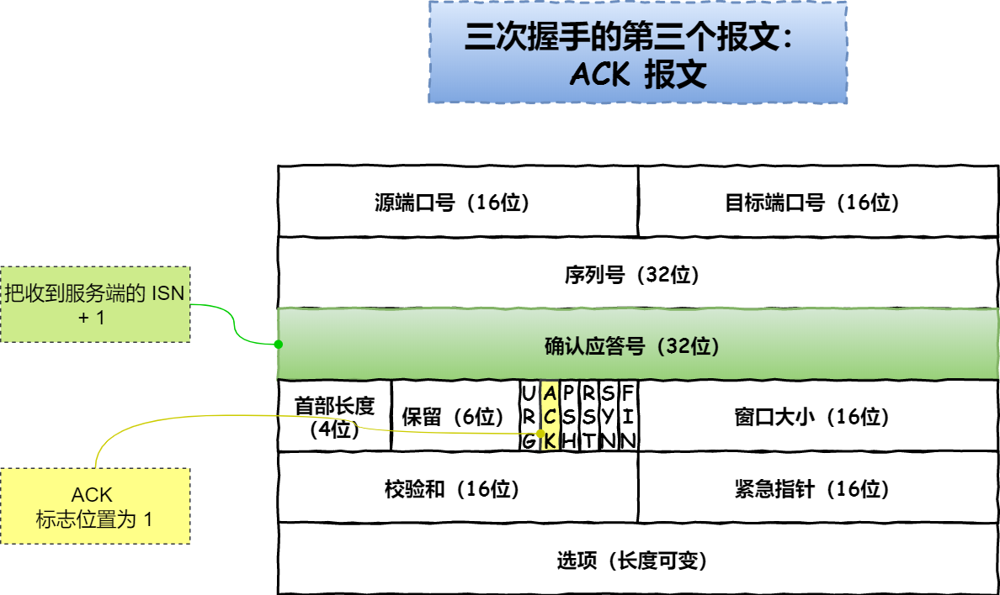

- 客户端收到服务端报文后，还要向服务端回应最后一个应答报文，首先该应答报文 TCP 首部 `ACK` 标志位置为 `1` ，其次「确认应答号」字段填入 `server_isn + 1` ，最后把报文发送给服务端，这次报文可以携带客户到服务端的数据，之后客户端处于 `ESTABLISHED` 状态。
- 服务端收到客户端的应答报文后，也进入 `ESTABLISHED` 状态。

从上面的过程可以发现**第三次握手是可以携带数据的，前两次握手是不可以携带数据的**，这也是面试常问的题。

一旦完成三次握手，双方都处于 `ESTABLISHED` 状态，此时连接就已建立完成，客户端和服务端就可以相互发送数据了。


#### 如何在 Linux 系统中查看 TCP 状态？

TCP 的连接状态查看，在 Linux 可以通过 `netstat -napt` 命令查看。


#### 为什么是三次握手？不是两次、四次？

相信大家比较常回答的是：“因为三次握手才能保证双方具有接收和发送的能力。”

这回答是没问题，但这回答是片面的，并没有说出主要的原因。

在前面我们知道了什么是 **TCP 连接**：

- 用于保证可靠性和流量控制维护的某些状态信息，这些信息的组合，包括 **Socket、序列号和窗口大小**称为连接。

所以，重要的是**为什么三次握手才可以初始化 Socket、序列号和窗口大小并建立 TCP 连接。**

接下来，以三个方面分析三次握手的原因：

- 三次握手才可以阻止重复历史连接的初始化（主要原因）
- 三次握手才可以同步双方的初始序列号
- 三次握手才可以避免资源浪费


*原因一：避免历史连接*

我们来看看 RFC 793 指出的 TCP 连接使用三次握手的**首要原因**：

*The principle reason for the three-way handshake is to prevent old duplicate connection initiations from causing confusion.*

简单来说，三次握手的**首要原因是为了防止旧的重复连接初始化造成混乱。**

我们考虑一个场景，客户端先发送了 SYN（seq = 90）报文，然后客户端宕机了，而且这个 SYN 报文还被网络阻塞了，服务端并没有收到，接着客户端重启后，又重新向服务端建立连接，发送了 SYN（seq = 100）报文（*注意！不是重传 SYN，重传的 SYN 的序列号是一样的*）。

看看三次握手是如何阻止历史连接的：

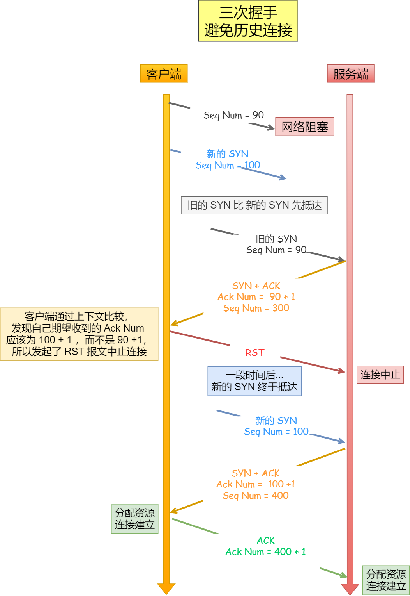

客户端连续发送多次 SYN（都是同一个四元组）建立连接的报文，在**网络拥堵**情况下：

- 一个「旧 SYN 报文」比「最新的 SYN」 报文早到达了服务端，那么此时服务端就会回一个 `SYN + ACK` 报文给客户端，此报文中的确认号是 91（90+1）。
- 客户端收到后，发现自己期望收到的确认号应该是 100 + 1，而不是 90 + 1，于是就会回 RST 报文。
- 服务端收到 RST 报文后，就会释放连接。
- 后续最新的 SYN 抵达了服务端后，客户端与服务端就可以正常的完成三次握手了。

上述中的「旧 SYN 报文」称为历史连接，TCP 使用三次握手建立连接的**最主要原因就是防止「历史连接」初始化了连接**。

TIP

有很多人问，如果服务端在收到 RST 报文之前，先收到了「新 SYN 报文」，也就是服务端收到客户端报文的顺序是：「旧 SYN 报文」->「新 SYN 报文」，此时会发生什么?

当服务端第一次收到 SYN 报文，也就是收到 「旧 SYN 报文」时，就会回复 `SYN + ACK` 报文给客户端，此报文中的确认号是 91（90+1）。

然后这时再收到「新 SYN 报文」时，就会回 [Challenge Ack (opens new window)](https://xiaolincoding.com/network/3_tcp/challenge_ack.html)报文给客户端，**这个 ack 报文并不是确认收到「新 SYN 报文」的，而是上一次的 ack 确认号**，也就是91（90+1）。所以客户端收到此 ACK 报文时，发现自己期望收到的确认号应该是 101，而不是 91，于是就会回 RST 报文。

**如果是两次握手连接，就无法阻止历史连接**，那为什么 TCP 两次握手为什么无法阻止历史连接呢？

我先直接说结论，主要是因为**在两次握手的情况下，服务端没有中间状态给客户端来阻止历史连接，导致服务端可能建立一个历史连接，造成资源浪费**。

你想想，在两次握手的情况下，服务端在收到 SYN 报文后，就进入 ESTABLISHED 状态，意味着这时可以给对方发送数据，但是客户端此时还没有进入 ESTABLISHED 状态，假设这次是历史连接，客户端判断到此次连接为历史连接，那么就会回 RST 报文来断开连接，而服务端在第一次握手的时候就进入 ESTABLISHED 状态，所以它可以发送数据的，但是它并不知道这个是历史连接，它只有在收到 RST 报文后，才会断开连接。


可以看到，如果采用两次握手建立 TCP 连接的场景下，服务端在向客户端发送数据前，并没有阻止掉历史连接，导致服务端建立了一个历史连接，又白白发送了数据，妥妥地浪费了服务端的资源。

因此，**要解决这种现象，最好就是在服务端发送数据前，也就是建立连接之前，要阻止掉历史连接，这样就不会造成资源浪费，而要实现这个功能，就需要三次握手**。

所以，**TCP 使用三次握手建立连接的最主要原因是防止「历史连接」初始化了连接。**

TIP

有人问：客户端发送三次握手（ack 报文）后就可以发送数据了，而被动方此时还是 syn_received 状态，如果 ack 丢了，那客户端发的数据是不是也白白浪费了？

不是的，即使服务端还是在 syn_received 状态，收到了客户端发送的数据，还是可以建立连接的，并且还可以正常收到这个数据包。这是因为数据报文中是有 ack 标识位，也有确认号，这个确认号就是确认收到了第二次握手。如下图：


所以，服务端收到这个数据报文，是可以正常建立连接的，然后就可以正常接收这个数据包了。

*原因二：同步双方初始序列号*

TCP 协议的通信双方， 都必须维护一个「序列号」， 序列号是可靠传输的一个关键因素，它的作用：

- 接收方可以去除重复的数据；
- 接收方可以根据数据包的序列号按序接收；
- 可以标识发送出去的数据包中， 哪些是已经被对方收到的（通过 ACK 报文中的序列号知道）；

可见，序列号在 TCP 连接中占据着非常重要的作用，所以当客户端发送携带「初始序列号」的 `SYN` 报文的时候，需要服务端回一个 `ACK` 应答报文，表示客户端的 SYN 报文已被服务端成功接收，那当服务端发送「初始序列号」给客户端的时候，依然也要得到客户端的应答回应，**这样一来一回，才能确保双方的初始序列号能被可靠的同步。**


四次握手其实也能够可靠的同步双方的初始化序号，但由于**第二步和第三步可以优化成一步**，所以就成了「三次握手」。

而两次握手只保证了一方的初始序列号能被对方成功接收，没办法保证双方的初始序列号都能被确认接收。

*原因三：避免资源浪费*

如果只有「两次握手」，当客户端发生的 `SYN` 报文在网络中阻塞，客户端没有接收到 `ACK` 报文，就会重新发送 `SYN` ，**由于没有第三次握手，服务端不清楚客户端是否收到了自己回复的 `ACK` 报文，所以服务端每收到一个 `SYN` 就只能先主动建立一个连接**，这会造成什么情况呢？

如果客户端发送的 `SYN` 报文在网络中阻塞了，重复发送多次 `SYN` 报文，那么服务端在收到请求后就会**建立多个冗余的无效链接，造成不必要的资源浪费。**


即两次握手会造成消息滞留情况下，服务端重复接受无用的连接请求 `SYN` 报文，而造成重复分配资源。

TIP

很多人问，两次握手不是也可以根据上下文信息丢弃 syn 历史报文吗？

我这里两次握手是假设「由于没有第三次握手，服务端不清楚客户端是否收到了自己发送的建立连接的 `ACK` 确认报文，所以每收到一个 `SYN` 就只能先主动建立一个连接」这个场景。

当然你要实现成类似三次握手那样，根据上下文丢弃 syn 历史报文也是可以的，两次握手没有具体的实现，怎么假设都行。

*小结*

TCP 建立连接时，通过三次握手**能防止历史连接的建立，能减少双方不必要的资源开销，能帮助双方同步初始化序列号**。序列号能够保证数据包不重复、不丢弃和按序传输。

不使用「两次握手」和「四次握手」的原因：

- 「两次握手」：无法防止历史连接的建立，会造成双方资源的浪费，也无法可靠的同步双方序列号；
- 「四次握手」：三次握手就已经理论上最少可靠连接建立，所以不需要使用更多的通信次数。


#### 为什么每次建立 TCP 连接时，初始化的序列号都要求不一样呢？

主要原因有两个方面：

- 为了防止历史报文被下一个相同四元组的连接接收（主要方面）；
- 为了安全性，防止黑客伪造的相同序列号的 TCP 报文被对方接收；

接下来，详细说说第一点。

假设每次建立连接，客户端和服务端的初始化序列号都是从 0 开始：


过程如下：

- 客户端和服务端建立一个 TCP 连接，在客户端发送数据包被网络阻塞了，然后超时重传了这个数据包，而此时服务端设备断电重启了，之前与客户端建立的连接就消失了，于是在收到客户端的数据包的时候就会发送 RST 报文。
- 紧接着，客户端又与服务端建立了与上一个连接相同四元组的连接；
- 在新连接建立完成后，上一个连接中被网络阻塞的数据包正好抵达了服务端，刚好该数据包的序列号正好是在服务端的接收窗口内，所以该数据包会被服务端正常接收，就会造成数据错乱。

可以看到，**如果每次建立连接，客户端和服务端的初始化序列号都是一样的话，很容易出现历史报文被下一个相同四元组的连接接收的问题**。

如果每次建立连接客户端和服务端的初始化序列号都「不一样」，就有大概率因为历史报文的序列号「不在」对方接收窗口，从而很大程度上避免了历史报文，比如下图：

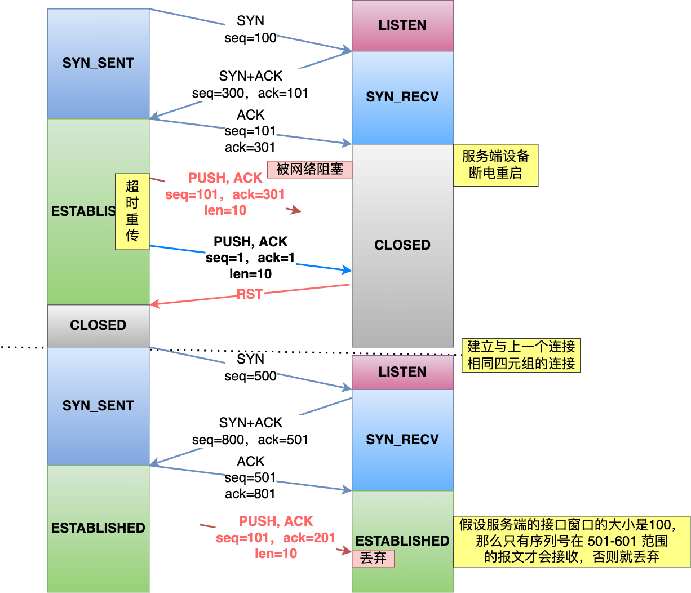

相反，如果每次建立连接客户端和服务端的初始化序列号都「一样」，就有大概率遇到历史报文的序列号刚「好在」对方的接收窗口内，从而导致历史报文被新连接成功接收。

所以，每次初始化序列号不一样很大程度上能够避免历史报文被下一个相同四元组的连接接收，注意是很大程度上，并不是完全避免了（因为序列号会有回绕的问题，所以需要用时间戳的机制来判断历史报文，详细看篇：[TCP 是如何避免历史报文的？ (opens new window)](https://xiaolincoding.com/network/3_tcp/isn_deff.html)）。


#### 初始序列号 ISN 是如何随机产生的？

起始 `ISN` 是基于时钟的，每 4 微秒 + 1，转一圈要 4.55 个小时。

RFC793 提到初始化序列号 ISN 随机生成算法：ISN = M + F(localhost, localport, remotehost, remoteport)。

- `M` 是一个计时器，这个计时器每隔 4 微秒加 1。
- `F` 是一个 Hash 算法，根据源 IP、目的 IP、源端口、目的端口生成一个随机数值。要保证 Hash 算法不能被外部轻易推算得出，用 MD5 算法是一个比较好的选择。

可以看到，随机数是会基于时钟计时器递增的，基本不可能会随机成一样的初始化序列号。


#### 既然 IP 层会分片，为什么 TCP 层还需要 MSS 呢？

我们先来认识下 MTU 和 MSS


- `MTU`：一个网络包的最大长度，以太网中一般为 `1500` 字节；
- `MSS`：除去 IP 和 TCP 头部之后，一个网络包所能容纳的 TCP 数据的最大长度；

如果在 TCP 的整个报文（头部 + 数据）交给 IP 层进行分片，会有什么异常呢？

当 IP 层有一个超过 `MTU` 大小的数据（TCP 头部 + TCP 数据）要发送，那么 IP 层就要进行分片，把数据分片成若干片，保证每一个分片都小于 MTU。把一份 IP 数据报进行分片以后，由目标主机的 IP 层来进行重新组装后，再交给上一层 TCP 传输层。

这看起来井然有序，但这存在隐患的，**那么当如果一个 IP 分片丢失，整个 IP 报文的所有分片都得重传**。

因为 IP 层本身没有超时重传机制，它由传输层的 TCP 来负责超时和重传。

当某一个 IP 分片丢失后，接收方的 IP 层就无法组装成一个完整的 TCP 报文（头部 + 数据），也就无法将数据报文送到 TCP 层，所以接收方不会响应 ACK 给发送方，因为发送方迟迟收不到 ACK 确认报文，所以会触发超时重传，就会重发「整个 TCP 报文（头部 + 数据）」。

因此，可以得知由 IP 层进行分片传输，是非常没有效率的。

所以，为了达到最佳的传输效能 TCP 协议在**建立连接的时候通常要协商双方的 MSS 值**，当 TCP 层发现数据超过 MSS 时，则就先会进行分片，当然由它形成的 IP 包的长度也就不会大于 MTU ，自然也就不用 IP 分片了。


经过 TCP 层分片后，如果一个 TCP 分片丢失后，**进行重发时也是以 MSS 为单位**，而不用重传所有的分片，大大增加了重传的效率。


#### 第一次握手丢失了，会发生什么？

当客户端想和服务端建立 TCP 连接的时候，首先第一个发的就是 SYN 报文，然后进入到 `SYN_SENT` 状态。

在这之后，如果客户端迟迟收不到服务端的 SYN-ACK 报文（第二次握手），就会触发「超时重传」机制，重传 SYN 报文，而且**重传的 SYN 报文的序列号都是一样的**。

不同版本的操作系统可能超时时间不同，有的 1 秒的，也有 3 秒的，这个超时时间是写死在内核里的，如果想要更改则需要重新编译内核，比较麻烦。

当客户端在 1 秒后没收到服务端的 SYN-ACK 报文后，客户端就会重发 SYN 报文，那到底重发几次呢？

在 Linux 里，客户端的 SYN 报文最大重传次数由 `tcp_syn_retries`内核参数控制，这个参数是可以自定义的，默认值一般是 5。

```shell
# cat /proc/sys/net/ipv4/tcp_syn_retries
5
```

通常，第一次超时重传是在 1 秒后，第二次超时重传是在 2 秒，第三次超时重传是在 4 秒后，第四次超时重传是在 8 秒后，第五次是在超时重传 16 秒后。没错，**每次超时的时间是上一次的 2 倍**。

当第五次超时重传后，会继续等待 32 秒，如果服务端仍然没有回应 ACK，客户端就不再发送 SYN 包，然后断开 TCP 连接。

所以，总耗时是 1+2+4+8+16+32=63 秒，大约 1 分钟左右。

举个例子，假设 tcp_syn_retries 参数值为 3，那么当客户端的 SYN 报文一直在网络中丢失时，会发生下图的过程：

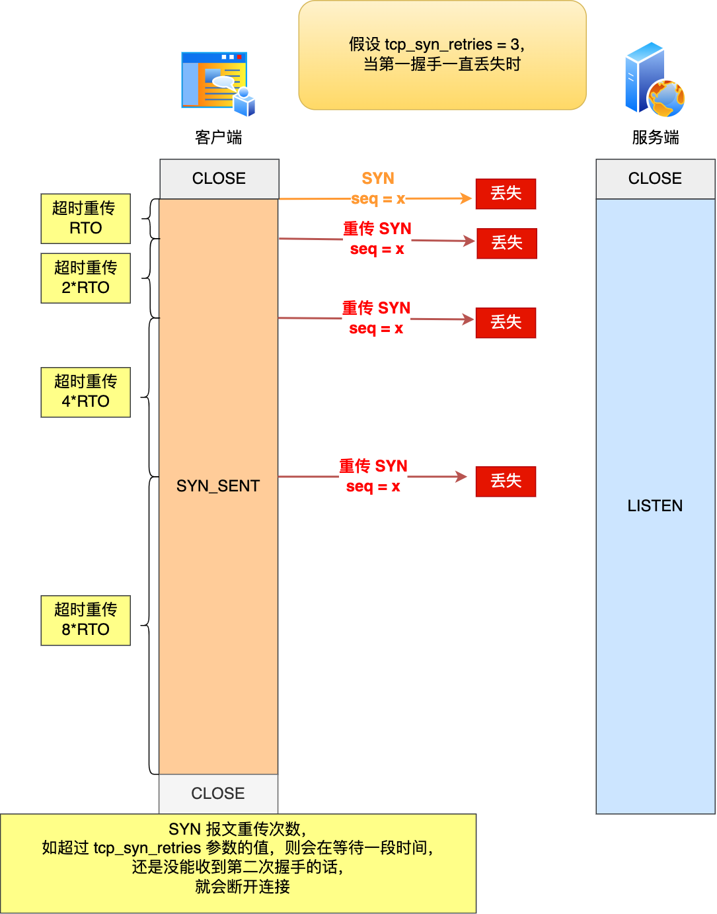

具体过程：

- 当客户端超时重传 3 次 SYN 报文后，由于 tcp_syn_retries 为 3，已达到最大重传次数，于是再等待一段时间（时间为上一次超时时间的 2 倍），如果还是没能收到服务端的第二次握手（SYN-ACK 报文），那么客户端就会断开连接。


#### 第二次握手丢失了，会发生什么？

当服务端收到客户端的第一次握手后，就会回 SYN-ACK 报文给客户端，这个就是第二次握手，此时服务端会进入 `SYN_RCVD` 状态。

第二次握手的 `SYN-ACK` 报文其实有两个目的 ：

- 第二次握手里的 ACK， 是对第一次握手的确认报文；
- 第二次握手里的 SYN，是服务端发起建立 TCP 连接的报文；

所以，如果第二次握手丢了，就会发生比较有意思的事情，具体会怎么样呢？

因为第二次握手报文里是包含对客户端的第一次握手的 ACK 确认报文，所以，如果客户端迟迟没有收到第二次握手，那么客户端就觉得可能自己的 SYN 报文（第一次握手）丢失了，于是**客户端就会触发超时重传机制，重传 SYN 报文**。

然后，因为第二次握手中包含服务端的 SYN 报文，所以当客户端收到后，需要给服务端发送 ACK 确认报文（第三次握手），服务端才会认为该 SYN 报文被客户端收到了。

那么，如果第二次握手丢失了，服务端就收不到第三次握手，于是**服务端这边会触发超时重传机制，重传 SYN-ACK 报文**。

在 Linux 下，SYN-ACK 报文的最大重传次数由 `tcp_synack_retries`内核参数决定，默认值是 5。

```shell
# cat /proc/sys/net/ipv4/tcp_synack_retries
5
```

因此，当第二次握手丢失了，客户端和服务端都会重传：

- 客户端会重传 SYN 报文，也就是第一次握手，最大重传次数由 `tcp_syn_retries`内核参数决定；
- 服务端会重传 SYN-ACK 报文，也就是第二次握手，最大重传次数由 `tcp_synack_retries` 内核参数决定。

举个例子，假设 tcp_syn_retries 参数值为 1，tcp_synack_retries 参数值为 2，那么当第二次握手一直丢失时，发生的过程如下图：

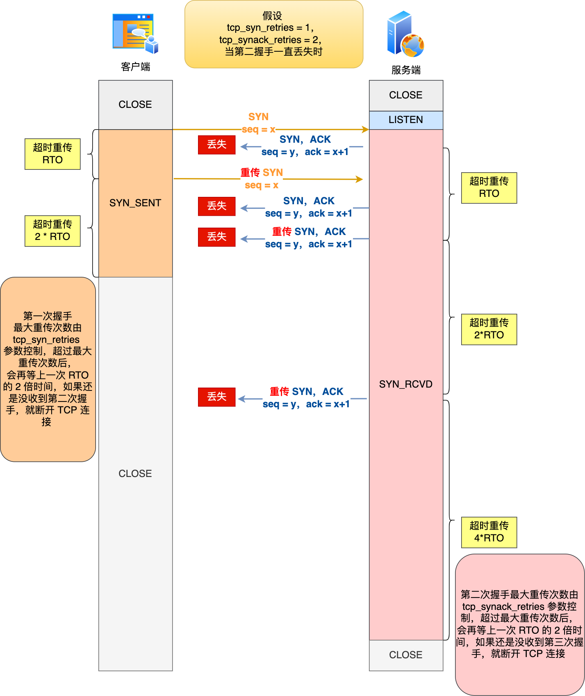

具体过程：

- 当客户端超时重传 1 次 SYN 报文后，由于 tcp_syn_retries 为 1，已达到最大重传次数，于是再等待一段时间（时间为上一次超时时间的 2 倍），如果还是没能收到服务端的第二次握手（SYN-ACK 报文），那么客户端就会断开连接。
- 当服务端超时重传 2 次 SYN-ACK 报文后，由于 tcp_synack_retries 为 2，已达到最大重传次数，于是再等待一段时间（时间为上一次超时时间的 2 倍），如果还是没能收到客户端的第三次握手（ACK 报文），那么服务端就会断开连接。


#### 第三次握手丢失了，会发生什么？

客户端收到服务端的 SYN-ACK 报文后，就会给服务端回一个 ACK 报文，也就是第三次握手，此时客户端状态进入到 `ESTABLISH` 状态。

因为这个第三次握手的 ACK 是对第二次握手的 SYN 的确认报文，所以当第三次握手丢失了，如果服务端那一方迟迟收不到这个确认报文，就会触发超时重传机制，重传 SYN-ACK 报文，直到收到第三次握手，或者达到最大重传次数。

注意，**ACK 报文是不会有重传的，当 ACK 丢失了，就由对方重传对应的报文**。

举个例子，假设 tcp_synack_retries 参数值为 2，那么当第三次握手一直丢失时，发生的过程如下图：


具体过程：

- 当服务端超时重传 2 次 SYN-ACK 报文后，由于 tcp_synack_retries 为 2，已达到最大重传次数，于是再等待一段时间（时间为上一次超时时间的 2 倍），如果还是没能收到客户端的第三次握手（ACK 报文），那么服务端就会断开连接。


#### 什么是 SYN 攻击？如何避免 SYN 攻击？

我们都知道 TCP 连接建立是需要三次握手，假设攻击者短时间伪造不同 IP 地址的 `SYN` 报文，服务端每接收到一个 `SYN` 报文，就进入`SYN_RCVD` 状态，但服务端发送出去的 `ACK + SYN` 报文，无法得到未知 IP 主机的 `ACK` 应答，久而久之就会**占满服务端的半连接队列**，使得服务端不能为正常用户服务。


先跟大家说一下，什么是 TCP 半连接和全连接队列。

在 TCP 三次握手的时候，Linux 内核会维护两个队列，分别是：

- 半连接队列，也称 SYN 队列；
- 全连接队列，也称 accept 队列；

我们先来看下 Linux 内核的 `SYN` 队列（半连接队列）与 `Accpet` 队列（全连接队列）是如何工作的？


正常流程：

- 当服务端接收到客户端的 SYN 报文时，会创建一个半连接的对象，然后将其加入到内核的「 SYN 队列」；
- 接着发送 SYN + ACK 给客户端，等待客户端回应 ACK 报文；
- 服务端接收到 ACK 报文后，从「 SYN 队列」取出一个半连接对象，然后创建一个新的连接对象放入到「 Accept 队列」；
- 应用通过调用 `accpet()` socket 接口，从「 Accept 队列」取出连接对象。

不管是半连接队列还是全连接队列，都有最大长度限制，超过限制时，默认情况都会丢弃报文。

SYN 攻击方式最直接的表现就会把 TCP 半连接队列打满，这样**当 TCP 半连接队列满了，后续再在收到 SYN 报文就会丢弃**，导致客户端无法和服务端建立连接。

避免 SYN 攻击方式，可以有以下四种方法：

- 调大 netdev_max_backlog；
- 增大 TCP 半连接队列；
- 开启 tcp_syncookies；
- 减少 SYN+ACK 重传次数

> 方式一：调大 netdev_max_backlog

当网卡接收数据包的速度大于内核处理的速度时，会有一个队列保存这些数据包。控制该队列的最大值如下参数，默认值是 1000，我们要适当调大该参数的值，比如设置为 10000：

```bash
net.core.netdev_max_backlog = 10000
```

> 方式二：增大 TCP 半连接队列

增大 TCP 半连接队列，要同时增大下面这三个参数：

- 增大 net.ipv4.tcp_max_syn_backlog
- 增大 listen() 函数中的 backlog
- 增大 net.core.somaxconn

具体为什么是三个参数决定 TCP 半连接队列的大小，可以看这篇：可以看这篇：[TCP 半连接队列和全连接队列满了会发生什么？又该如何应对？(opens new window)](https://xiaolincoding.com/network/3_tcp/tcp_queue.html)

> 方式三：开启 net.ipv4.tcp_syncookies

开启 syncookies 功能就可以在不使用 SYN 半连接队列的情况下成功建立连接，相当于绕过了 SYN 半连接来建立连接。


具体过程：

- 当 「 SYN 队列」满之后，后续服务端收到 SYN 包，不会丢弃，而是根据算法，计算出一个 `cookie` 值；
- 将 cookie 值放到第二次握手报文的「序列号」里，然后服务端回第二次握手给客户端；
- 服务端接收到客户端的应答报文时，服务端会检查这个 ACK 包的合法性。如果合法，将该连接对象放入到「 Accept 队列」。
- 最后应用程序通过调用 `accpet()` 接口，从「 Accept 队列」取出的连接。

可以看到，当开启了 tcp_syncookies 了，即使受到 SYN 攻击而导致 SYN 队列满时，也能保证正常的连接成功建立。

net.ipv4.tcp_syncookies 参数主要有以下三个值：

- 0 值，表示关闭该功能；
- 1 值，表示仅当 SYN 半连接队列放不下时，再启用它；
- 2 值，表示无条件开启功能；

那么在应对 SYN 攻击时，只需要设置为 1 即可。

```bash
$ echo 1 > /proc/sys/net/ipv4/tcp_syncookies
```

> 方式四：减少 SYN+ACK 重传次数

当服务端受到 SYN 攻击时，就会有大量处于 SYN_REVC 状态的 TCP 连接，处于这个状态的 TCP 会重传 SYN+ACK ，当重传超过次数达到上限后，就会断开连接。

那么针对 SYN 攻击的场景，我们可以减少 SYN-ACK 的重传次数，以加快处于 SYN_REVC 状态的 TCP 连接断开。

SYN-ACK 报文的最大重传次数由 `tcp_synack_retries`内核参数决定（默认值是 5 次），比如将 tcp_synack_retries 减少到 2 次：

```shell
$ echo 2 > /proc/sys/net/ipv4/tcp_synack_retries
```


### TCP 连接断开


#### TCP 四次挥手过程是怎样的？

天下没有不散的宴席，对于 TCP 连接也是这样， TCP 断开连接是通过**四次挥手**方式。

双方都可以主动断开连接，断开连接后主机中的「资源」将被释放，四次挥手的过程如下图：


- 客户端打算关闭连接，此时会发送一个 TCP 首部 `FIN` 标志位被置为 `1` 的报文，也即 `FIN` 报文，之后客户端进入 `FIN_WAIT_1` 状态。
- 服务端收到该报文后，就向客户端发送 `ACK` 应答报文，接着服务端进入 `CLOSE_WAIT` 状态。
- 客户端收到服务端的 `ACK` 应答报文后，之后进入 `FIN_WAIT_2` 状态。
- 等待服务端处理完数据后，也向客户端发送 `FIN` 报文，之后服务端进入 `LAST_ACK` 状态。
- 客户端收到服务端的 `FIN` 报文后，回一个 `ACK` 应答报文，之后进入 `TIME_WAIT` 状态
- 服务端收到了 `ACK` 应答报文后，就进入了 `CLOSE` 状态，至此服务端已经完成连接的关闭。
- 客户端在经过 `2MSL` 一段时间后，自动进入 `CLOSE` 状态，至此客户端也完成连接的关闭。

你可以看到，每个方向都需要**一个 FIN 和一个 ACK**，因此通常被称为**四次挥手**。

这里一点需要注意是：**主动关闭连接的，才有 TIME_WAIT 状态。**


#### 为什么挥手需要四次？

再来回顾下四次挥手双方发 `FIN` 包的过程，就能理解为什么需要四次了。

- 关闭连接时，客户端向服务端发送 `FIN` 时，仅仅表示客户端不再发送数据了但是还能接收数据。
- 服务端收到客户端的 `FIN` 报文时，先回一个 `ACK` 应答报文，而服务端可能还有数据需要处理和发送，等服务端不再发送数据时，才发送 `FIN` 报文给客户端来表示同意现在关闭连接。

从上面过程可知，服务端通常需要等待完成数据的发送和处理，所以服务端的 `ACK` 和 `FIN` 一般都会分开发送，因此是需要四次挥手。

但是**在特定情况下，四次挥手是可以变成三次挥手的**，具体情况可以看这篇：[TCP 四次挥手，可以变成三次吗？(opens new window)](https://xiaolincoding.com/network/3_tcp/tcp_three_fin.html)


#### 第一次挥手丢失了，会发生什么？

当客户端（主动关闭方）调用 close 函数后，就会向服务端发送 FIN 报文，试图与服务端断开连接，此时客户端的连接进入到 `FIN_WAIT_1` 状态。

正常情况下，如果能及时收到服务端（被动关闭方）的 ACK，则会很快变为 `FIN_WAIT2`状态。

如果第一次挥手丢失了，那么客户端迟迟收不到被动方的 ACK 的话，也就会触发超时重传机制，重传 FIN 报文，重发次数由 `tcp_orphan_retries` 参数控制。

当客户端重传 FIN 报文的次数超过 `tcp_orphan_retries` 后，就不再发送 FIN 报文，则会在等待一段时间（时间为上一次超时时间的 2 倍），如果还是没能收到第二次挥手，那么直接进入到 `close` 状态。

举个例子，假设 tcp_orphan_retries 参数值为 3，当第一次挥手一直丢失时，发生的过程如下图：


具体过程：

- 当客户端超时重传 3 次 FIN 报文后，由于 tcp_orphan_retries 为 3，已达到最大重传次数，于是再等待一段时间（时间为上一次超时时间的 2 倍），如果还是没能收到服务端的第二次挥手（ACK报文），那么客户端就会断开连接。


#### 第二次挥手丢失了，会发生什么？

当服务端收到客户端的第一次挥手后，就会先回一个 ACK 确认报文，此时服务端的连接进入到 `CLOSE_WAIT` 状态。

在前面我们也提了，ACK 报文是不会重传的，所以如果服务端的第二次挥手丢失了，客户端就会触发超时重传机制，重传 FIN 报文，直到收到服务端的第二次挥手，或者达到最大的重传次数。

举个例子，假设 tcp_orphan_retries 参数值为 2，当第二次挥手一直丢失时，发生的过程如下图：

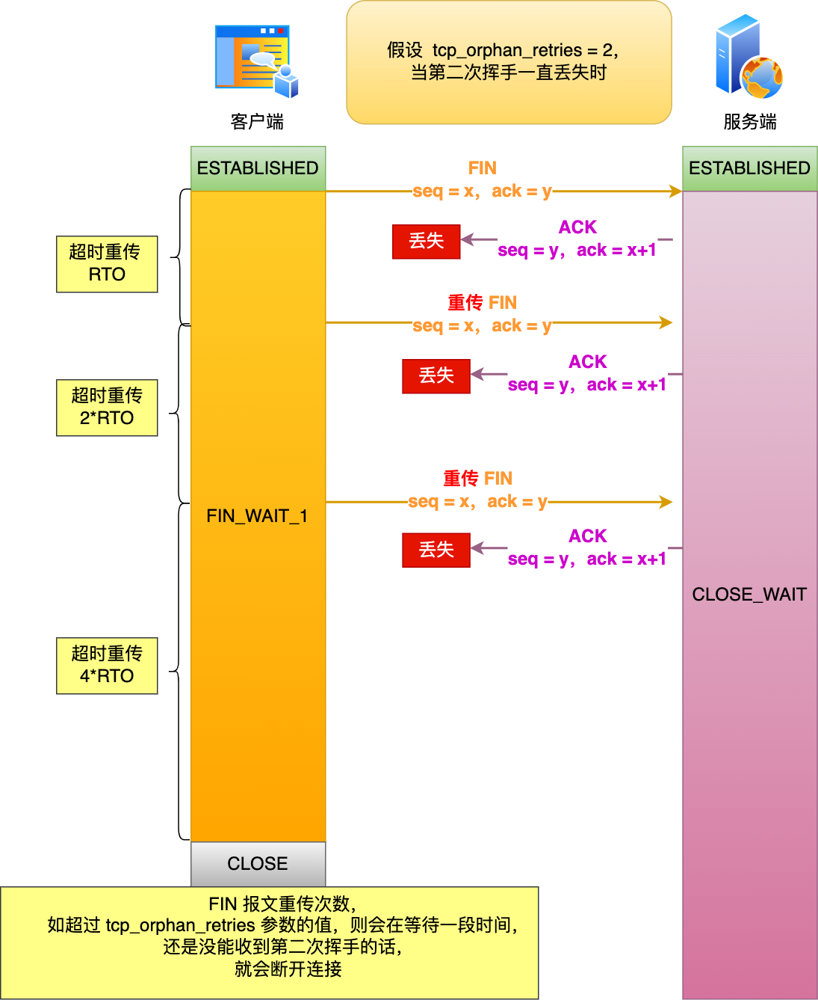

具体过程：

- 当客户端超时重传 2 次 FIN 报文后，由于 tcp_orphan_retries 为 2，已达到最大重传次数，于是再等待一段时间（时间为上一次超时时间的 2 倍），如果还是没能收到服务端的第二次挥手（ACK 报文），那么客户端就会断开连接。

这里提一下，当客户端收到第二次挥手，也就是收到服务端发送的 ACK 报文后，客户端就会处于 `FIN_WAIT2` 状态，在这个状态需要等服务端发送第三次挥手，也就是服务端的 FIN 报文。

对于 close 函数关闭的连接，由于无法再发送和接收数据，所以`FIN_WAIT2` 状态不可以持续太久，而 `tcp_fin_timeout` 控制了这个状态下连接的持续时长，默认值是 60 秒。

这意味着对于调用 close 关闭的连接，如果在 60 秒后还没有收到 FIN 报文，客户端（主动关闭方）的连接就会直接关闭，如下图：


但是注意，如果主动关闭方使用 shutdown 函数关闭连接，指定了只关闭发送方向，而接收方向并没有关闭，那么意味着主动关闭方还是可以接收数据的。

此时，如果主动关闭方一直没收到第三次挥手，那么主动关闭方的连接将会一直处于 `FIN_WAIT2` 状态（`tcp_fin_timeout` 无法控制 shutdown 关闭的连接）。如下图：


#### 第三次挥手丢失了，会发生什么？

当服务端（被动关闭方）收到客户端（主动关闭方）的 FIN 报文后，内核会自动回复 ACK，同时连接处于 `CLOSE_WAIT` 状态，顾名思义，它表示等待应用进程调用 close 函数关闭连接。

此时，内核是没有权利替代进程关闭连接，必须由进程主动调用 close 函数来触发服务端发送 FIN 报文。

服务端处于 CLOSE_WAIT 状态时，调用了 close 函数，内核就会发出 FIN 报文，同时连接进入 LAST_ACK 状态，等待客户端返回 ACK 来确认连接关闭。

如果迟迟收不到这个 ACK，服务端就会重发 FIN 报文，重发次数仍然由 `tcp_orphan_retrie`s 参数控制，这与客户端重发 FIN 报文的重传次数控制方式是一样的。

举个例子，假设 `tcp_orphan_retrie`s = 3，当第三次挥手一直丢失时，发生的过程如下图：


具体过程：

- 当服务端重传第三次挥手报文的次数达到了 3 次后，由于 tcp_orphan_retries 为 3，达到了重传最大次数，于是再等待一段时间（时间为上一次超时时间的 2 倍），如果还是没能收到客户端的第四次挥手（ACK报文），那么服务端就会断开连接。
- 客户端因为是通过 close 函数关闭连接的，处于 FIN_WAIT_2 状态是有时长限制的，如果 tcp_fin_timeout 时间内还是没能收到服务端的第三次挥手（FIN 报文），那么客户端就会断开连接。


#### 第四次挥手丢失了，会发生什么？

当客户端收到服务端的第三次挥手的 FIN 报文后，就会回 ACK 报文，也就是第四次挥手，此时客户端连接进入 `TIME_WAIT` 状态。

在 Linux 系统，TIME_WAIT 状态会持续 2MSL 后才会进入关闭状态。

然后，服务端（被动关闭方）没有收到 ACK 报文前，还是处于 LAST_ACK 状态。

如果第四次挥手的 ACK 报文没有到达服务端，服务端就会重发 FIN 报文，重发次数仍然由前面介绍过的 `tcp_orphan_retries` 参数控制。

举个例子，假设 tcp_orphan_retries 为 2，当第四次挥手一直丢失时，发生的过程如下：


具体过程：

- 当服务端重传第三次挥手报文达到 2 时，由于 tcp_orphan_retries 为 2， 达到了最大重传次数，于是再等待一段时间（时间为上一次超时时间的 2 倍），如果还是没能收到客户端的第四次挥手（ACK 报文），那么服务端就会断开连接。
- 客户端在收到第三次挥手后，就会进入 TIME_WAIT 状态，开启时长为 2MSL 的定时器，如果途中再次收到第三次挥手（FIN 报文）后，就会重置定时器，当等待 2MSL 时长后，客户端就会断开连接。


#### 为什么 TIME_WAIT 等待的时间是 2MSL？

`MSL` 是 Maximum Segment Lifetime，**报文最大生存时间**，它是任何报文在网络上存在的最长时间，超过这个时间报文将被丢弃。因为 TCP 报文基于是 IP 协议的，而 IP 头中有一个 `TTL` 字段，是 IP 数据报可以经过的最大路由数，每经过一个处理他的路由器此值就减 1，当此值为 0 则数据报将被丢弃，同时发送 ICMP 报文通知源主机。

MSL 与 TTL 的区别： MSL 的单位是时间，而 TTL 是经过路由跳数。所以 **MSL 应该要大于等于 TTL 消耗为 0 的时间**，以确保报文已被自然消亡。

**TTL 的值一般是 64，Linux 将 MSL 设置为 30 秒，意味着 Linux 认为数据报文经过 64 个路由器的时间不会超过 30 秒，如果超过了，就认为报文已经消失在网络中了**。

TIME_WAIT 等待 2 倍的 MSL，比较合理的解释是： 网络中可能存在来自发送方的数据包，当这些发送方的数据包被接收方处理后又会向对方发送响应，所以**一来一回需要等待 2 倍的时间**。

比如，如果被动关闭方没有收到断开连接的最后的 ACK 报文，就会触发超时重发 `FIN` 报文，另一方接收到 FIN 后，会重发 ACK 给被动关闭方， 一来一去正好 2 个 MSL。

可以看到 **2MSL时长** 这其实是相当于**至少允许报文丢失一次**。比如，若 ACK 在一个 MSL 内丢失，这样被动方重发的 FIN 会在第 2 个 MSL 内到达，TIME_WAIT 状态的连接可以应对。

为什么不是 4 或者 8 MSL 的时长呢？你可以想象一个丢包率达到百分之一的糟糕网络，连续两次丢包的概率只有万分之一，这个概率实在是太小了，忽略它比解决它更具性价比。

`2MSL` 的时间是从**客户端接收到 FIN 后发送 ACK 开始计时的**。如果在 TIME-WAIT 时间内，因为客户端的 ACK 没有传输到服务端，客户端又接收到了服务端重发的 FIN 报文，那么 **2MSL 时间将重新计时**。

在 Linux 系统里 `2MSL` 默认是 `60` 秒，那么一个 `MSL` 也就是 `30` 秒。**Linux 系统停留在 TIME_WAIT 的时间为固定的 60 秒**。

其定义在 Linux 内核代码里的名称为 TCP_TIMEWAIT_LEN：

```c
#define TCP_TIMEWAIT_LEN (60*HZ) /* how long to wait to destroy TIME-WAIT 
                                    state, about 60 seconds  */
```

如果要修改 TIME_WAIT 的时间长度，只能修改 Linux 内核代码里 TCP_TIMEWAIT_LEN 的值，并重新编译 Linux 内核。


#### 为什么需要 TIME_WAIT 状态？

主动发起关闭连接的一方，才会有 `TIME-WAIT` 状态。

需要 TIME-WAIT 状态，主要是两个原因：

- 防止历史连接中的数据，被后面相同四元组的连接错误的接收；
- 保证「被动关闭连接」的一方，能被正确的关闭；

*原因一：防止历史连接中的数据，被后面相同四元组的连接错误的接收*

为了能更好的理解这个原因，我们先来了解序列号（SEQ）和初始序列号（ISN）。

- **序列号**，是 TCP 一个头部字段，标识了 TCP 发送端到 TCP 接收端的数据流的一个字节，因为 TCP 是面向字节流的可靠协议，为了保证消息的顺序性和可靠性，TCP 为每个传输方向上的每个字节都赋予了一个编号，以便于传输成功后确认、丢失后重传以及在接收端保证不会乱序。**序列号是一个 32 位的无符号数，因此在到达 4G 之后再循环回到 0**。
- **初始序列号**，在 TCP 建立连接的时候，客户端和服务端都会各自生成一个初始序列号，它是基于时钟生成的一个随机数，来保证每个连接都拥有不同的初始序列号。**初始化序列号可被视为一个 32 位的计数器，该计数器的数值每 4 微秒加 1，循环一次需要 4.55 小时**。

给大家抓了一个包，下图中的 Seq 就是序列号，其中红色框住的分别是客户端和服务端各自生成的初始序列号。

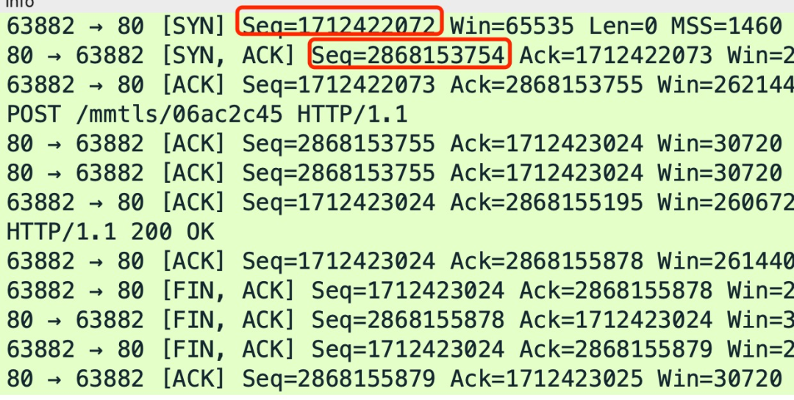

通过前面我们知道，**序列号和初始化序列号并不是无限递增的，会发生回绕为初始值的情况，这意味着无法根据序列号来判断新老数据**。

假设 TIME-WAIT 没有等待时间或时间过短，被延迟的数据包抵达后会发生什么呢？

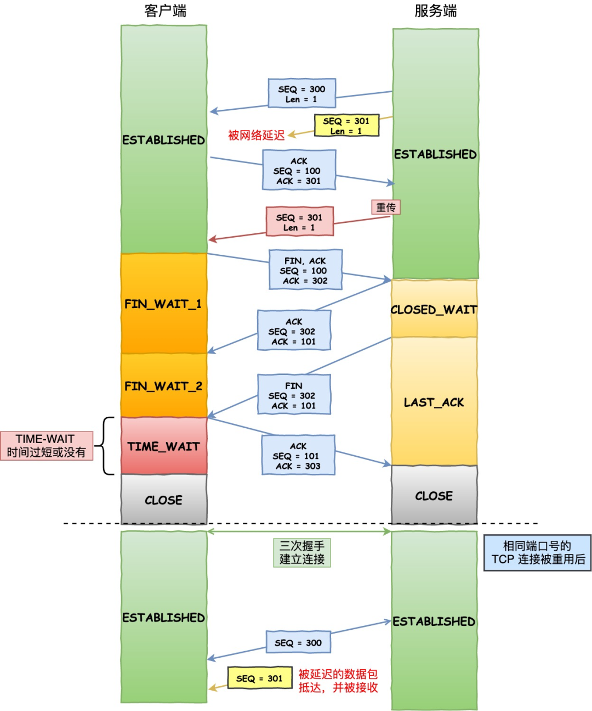

如上图：

- 服务端在关闭连接之前发送的 `SEQ = 301` 报文，被网络延迟了。
- 接着，服务端以相同的四元组重新打开了新连接，前面被延迟的 `SEQ = 301` 这时抵达了客户端，而且该数据报文的序列号刚好在客户端接收窗口内，因此客户端会正常接收这个数据报文，但是这个数据报文是上一个连接残留下来的，这样就产生数据错乱等严重的问题。

为了防止历史连接中的数据，被后面相同四元组的连接错误的接收，因此 TCP 设计了 TIME_WAIT 状态，状态会持续 `2MSL` 时长，这个时间**足以让两个方向上的数据包都被丢弃，使得原来连接的数据包在网络中都自然消失，再出现的数据包一定都是新建立连接所产生的。**

*原因二：保证「被动关闭连接」的一方，能被正确的关闭*

在 RFC 793 指出 TIME-WAIT 另一个重要的作用是：

*TIME-WAIT - represents waiting for enough time to pass to be sure the remote TCP received the acknowledgment of its connection termination request.*

也就是说，TIME-WAIT 作用是**等待足够的时间以确保最后的 ACK 能让被动关闭方接收，从而帮助其正常关闭。**

如果客户端（主动关闭方）最后一次 ACK 报文（第四次挥手）在网络中丢失了，那么按照 TCP 可靠性原则，服务端（被动关闭方）会重发 FIN 报文。

假设客户端没有 TIME_WAIT 状态，而是在发完最后一次回 ACK 报文就直接进入 CLOSE 状态，如果该 ACK 报文丢失了，服务端则重传的 FIN 报文，而这时客户端已经进入到关闭状态了，在收到服务端重传的 FIN 报文后，就会回 RST 报文。


服务端收到这个 RST 并将其解释为一个错误（Connection reset by peer），这对于一个可靠的协议来说不是一个优雅的终止方式。

为了防止这种情况出现，客户端必须等待足够长的时间，确保服务端能够收到 ACK，如果服务端没有收到 ACK，那么就会触发 TCP 重传机制，服务端会重新发送一个 FIN，这样一去一来刚好两个 MSL 的时间。


客户端在收到服务端重传的 FIN 报文时，TIME_WAIT 状态的等待时间，会重置回 2MSL。


#### TIME_WAIT 过多有什么危害？

过多的 TIME-WAIT 状态主要的危害有两种：

- 第一是占用系统资源，比如文件描述符、内存资源、CPU 资源、线程资源等；
- 第二是占用端口资源，端口资源也是有限的，一般可以开启的端口为 `32768～61000`，也可以通过 `net.ipv4.ip_local_port_range`参数指定范围。

客户端和服务端 TIME_WAIT 过多，造成的影响是不同的。

**如果客户端（主动发起关闭连接方）的 TIME_WAIT 状态过多**，占满了所有端口资源，那么就无法对「目的 IP+ 目的 PORT」都一样的服务端发起连接了，但是被使用的端口，还是可以继续对另外一个服务端发起连接的。具体可以看我这篇文章：[客户端的端口可以重复使用吗？(opens new window)](https://xiaolincoding.com/network/3_tcp/port.html#客户端的端口可以重复使用吗)

因此，客户端（发起连接方）都是和「目的 IP+ 目的 PORT 」都一样的服务端建立连接的话，当客户端的 TIME_WAIT 状态连接过多的话，就会受端口资源限制，如果占满了所有端口资源，那么就无法再跟「目的 IP+ 目的 PORT」都一样的服务端建立连接了。

不过，即使是在这种场景下，只要连接的是不同的服务端，端口是可以重复使用的，所以客户端还是可以向其他服务端发起连接的，这是因为内核在定位一个连接的时候，是通过四元组（源IP、源端口、目的IP、目的端口）信息来定位的，并不会因为客户端的端口一样，而导致连接冲突。

**如果服务端（主动发起关闭连接方）的 TIME_WAIT 状态过多**，并不会导致端口资源受限，因为服务端只监听一个端口，而且由于一个四元组唯一确定一个 TCP 连接，因此理论上服务端可以建立很多连接，但是 TCP 连接过多，会占用系统资源，比如文件描述符、内存资源、CPU 资源、线程资源等。


#### 如何优化 TIME_WAIT？

这里给出优化 TIME-WAIT 的几个方式，都是有利有弊：

- 打开 net.ipv4.tcp_tw_reuse 和 net.ipv4.tcp_timestamps 选项；
- net.ipv4.tcp_max_tw_buckets
- 程序中使用 SO_LINGER ，应用强制使用 RST 关闭。

*方式一：net.ipv4.tcp_tw_reuse 和 tcp_timestamps*

如下的 Linux 内核参数开启后，则可以**复用处于 TIME_WAIT 的 socket 为新的连接所用**。

有一点需要注意的是，**tcp_tw_reuse 功能只能用客户端（连接发起方），因为开启了该功能，在调用 connect() 函数时，内核会随机找一个 time_wait 状态超过 1 秒的连接给新的连接复用。**

```shell
net.ipv4.tcp_tw_reuse = 1
```

使用这个选项，还有一个前提，需要打开对 TCP 时间戳的支持，即

```text
net.ipv4.tcp_timestamps=1（默认即为 1）
```

这个时间戳的字段是在 TCP 头部的「选项」里，它由一共 8 个字节表示时间戳，其中第一个 4 字节字段用来保存发送该数据包的时间，第二个 4 字节字段用来保存最近一次接收对方发送到达数据的时间。

由于引入了时间戳，我们在前面提到的 `2MSL` 问题就不复存在了，因为重复的数据包会因为时间戳过期被自然丢弃。

*方式二：net.ipv4.tcp_max_tw_buckets*

这个值默认为 18000，**当系统中处于 TIME_WAIT 的连接一旦超过这个值时，系统就会将后面的 TIME_WAIT 连接状态重置**，这个方法比较暴力。

*方式三：程序中使用 SO_LINGER*

我们可以通过设置 socket 选项，来设置调用 close 关闭连接行为。

```c
struct linger so_linger;
so_linger.l_onoff = 1;
so_linger.l_linger = 0;
setsockopt(s, SOL_SOCKET, SO_LINGER, &so_linger,sizeof(so_linger));
```

如果`l_onoff`为非 0， 且`l_linger`值为 0，那么调用`close`后，会立该发送一个`RST`标志给对端，该 TCP 连接将跳过四次挥手，也就跳过了`TIME_WAIT`状态，直接关闭。

但这为跨越`TIME_WAIT`状态提供了一个可能，不过是一个非常危险的行为，不值得提倡。

前面介绍的方法都是试图越过 `TIME_WAIT`状态的，这样其实不太好。虽然 TIME_WAIT 状态持续的时间是有一点长，显得很不友好，但是它被设计来就是用来避免发生乱七八糟的事情。

《UNIX网络编程》一书中却说道：**TIME_WAIT 是我们的朋友，它是有助于我们的，不要试图避免这个状态，而是应该弄清楚它**。

**如果服务端要避免过多的 TIME_WAIT 状态的连接，就永远不要主动断开连接，让客户端去断开，由分布在各处的客户端去承受 TIME_WAIT**。


#### 服务器出现大量 TIME_WAIT 状态的原因有哪些？

首先要知道 TIME_WAIT 状态是主动关闭连接方才会出现的状态，所以如果服务器出现大量的 TIME_WAIT 状态的 TCP 连接，就是说明服务器主动断开了很多 TCP 连接。

问题来了，**什么场景下服务端会主动断开连接呢？**

- 第一个场景：HTTP 没有使用长连接
- 第二个场景：HTTP 长连接超时
- 第三个场景：HTTP 长连接的请求数量达到上限

接下来，分别介绍下。

*第一个场景：HTTP 没有使用长连接*

我们先来看看 HTTP 长连接（Keep-Alive）机制是怎么开启的。

在 HTTP/1.0 中默认是关闭的，如果浏览器要开启 Keep-Alive，它必须在请求的 header 中添加：

```text
Connection: Keep-Alive
```

然后当服务器收到请求，作出回应的时候，它也被添加到响应中 header 里：

```text
Connection: Keep-Alive
```

这样做，TCP 连接就不会中断，而是保持连接。当客户端发送另一个请求时，它会使用同一个 TCP 连接。这一直继续到客户端或服务器端提出断开连接。

**从 HTTP/1.1 开始， 就默认是开启了 Keep-Alive**，现在大多数浏览器都默认是使用 HTTP/1.1，所以 Keep-Alive 都是默认打开的。一旦客户端和服务端达成协议，那么长连接就建立好了。

如果要关闭 HTTP Keep-Alive，需要在 HTTP 请求或者响应的 header 里添加 `Connection:close` 信息，也就是说，**只要客户端和服务端任意一方的 HTTP header 中有 `Connection:close` 信息，那么就无法使用 HTTP 长连接的机制**。

关闭 HTTP 长连接机制后，每次请求都要经历这样的过程：建立 TCP -> 请求资源 -> 响应资源 -> 释放连接，那么此方式就是 **HTTP 短连接**，如下图：

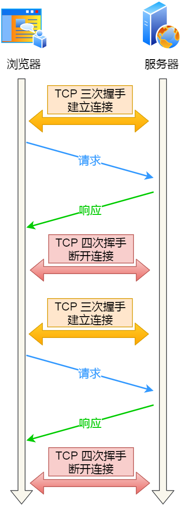

在前面我们知道，只要任意一方的 HTTP header 中有 `Connection:close` 信息，就无法使用 HTTP 长连接机制，这样在完成一次 HTTP 请求/处理后，就会关闭连接。

问题来了，**这时候是客户端还是服务端主动关闭连接呢？**

在 RFC 文档中，并没有明确由谁来关闭连接，**请求和响应的双方都可以主动关闭 TCP 连接。**

不过，**根据大多数 Web 服务的实现，不管哪一方禁用了 HTTP Keep-Alive，都是由服务端主动关闭连接**，那么此时服务端上就会出现 TIME_WAIT 状态的连接。

> 客户端禁用了 HTTP Keep-Alive，服务端开启 HTTP Keep-Alive，谁是主动关闭方？

当客户端禁用了 HTTP Keep-Alive，这时候 HTTP 请求的 header 就会有 `Connection:close` 信息，这时服务端在发完 HTTP 响应后，就会主动关闭连接。

为什么要这么设计呢？HTTP 是请求-响应模型，发起方一直是客户端，HTTP Keep-Alive 的初衷是**为客户端后续的请求重用连接**，如果我们**在某次 HTTP 请求-响应模型中，请求的 header 定义了 `connection：close` 信息，那不再重用这个连接的时机就只有在服务端了**，所以我们在 HTTP 请求-响应这个周期的「末端」关闭连接是合理的。

> 客户端开启了 HTTP Keep-Alive，服务端禁用了 HTTP Keep-Alive，谁是主动关闭方？

当客户端开启了 HTTP Keep-Alive，而服务端禁用了 HTTP Keep-Alive，这时服务端在发完 HTTP 响应后，服务端也会主动关闭连接。

为什么要这么设计呢？在服务端主动关闭连接的情况下，只要调用一次 close() 就可以释放连接，剩下的工作由内核 TCP 栈直接进行了处理，整个过程只有一次 syscall；如果是要求 客户端关闭，则服务端在写完最后一个 response 之后需要把这个 socket 放入 readable 队列，调用 select / epoll 去等待事件；然后调用一次 read() 才能知道连接已经被关闭，这其中是两次 syscall，多一次用户态程序被激活执行，而且 socket 保持时间也会更长。

因此，**当服务端出现大量的 TIME_WAIT 状态连接的时候，可以排查下是否客户端和服务端都开启了 HTTP Keep-Alive**，因为任意一方没有开启 HTTP Keep-Alive，都会导致服务端在处理完一个 HTTP 请求后，就主动关闭连接，此时服务端上就会出现大量的 TIME_WAIT 状态的连接。

针对这个场景下，解决的方式也很简单，让客户端和服务端都开启 HTTP Keep-Alive 机制。

*第二个场景：HTTP 长连接超时*

HTTP 长连接的特点是，只要任意一端没有明确提出断开连接，则保持 TCP 连接状态。

HTTP 长连接可以在同一个 TCP 连接上接收和发送多个 HTTP 请求/应答，避免了连接建立和释放的开销。

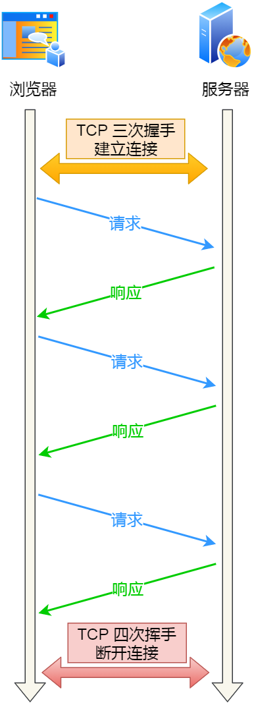

可能有的同学会问，如果使用了 HTTP 长连接，如果客户端完成一个 HTTP 请求后，就不再发起新的请求，此时这个 TCP 连接一直占用着不是挺浪费资源的吗？

对没错，所以为了避免资源浪费的情况，web 服务软件一般都会提供一个参数，用来指定 HTTP 长连接的超时时间，比如 nginx 提供的 keepalive_timeout 参数。

假设设置了 HTTP 长连接的超时时间是 60 秒，nginx 就会启动一个「定时器」，**如果客户端在完后一个 HTTP 请求后，在 60 秒内都没有再发起新的请求，定时器的时间一到，nginx 就会触发回调函数来关闭该连接，那么此时服务端上就会出现 TIME_WAIT 状态的连接**。

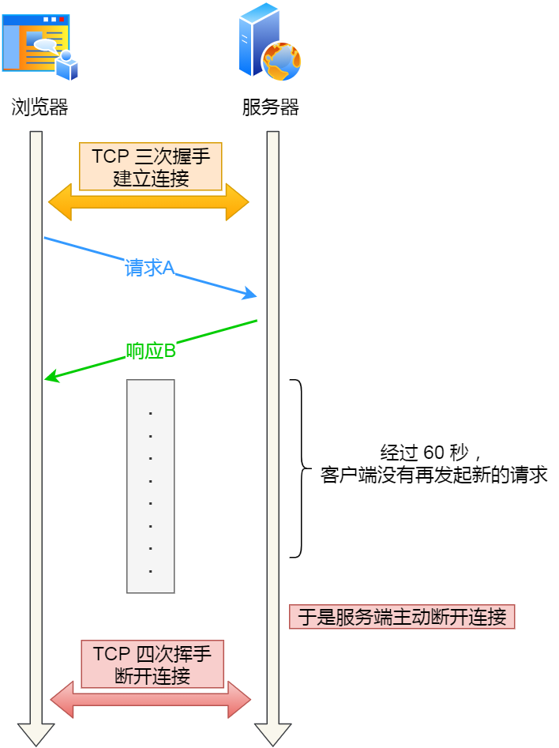

当服务端出现大量 TIME_WAIT 状态的连接时，如果现象是有大量的客户端建立完 TCP 连接后，很长一段时间没有发送数据，那么大概率就是因为 HTTP 长连接超时，导致服务端主动关闭连接，产生大量处于 TIME_WAIT 状态的连接。

可以往网络问题的方向排查，比如是否是因为网络问题，导致客户端发送的数据一直没有被服务端接收到，以至于 HTTP 长连接超时。

*第三个场景：HTTP 长连接的请求数量达到上限*

Web 服务端通常会有个参数，来定义一条 HTTP 长连接上最大能处理的请求数量，当超过最大限制时，就会主动关闭连接。

比如 nginx 的 keepalive_requests 这个参数，这个参数是指一个 HTTP 长连接建立之后，nginx 就会为这个连接设置一个计数器，记录这个 HTTP 长连接上已经接收并处理的客户端请求的数量。**如果达到这个参数设置的最大值时，则 nginx 会主动关闭这个长连接**，那么此时服务端上就会出现 TIME_WAIT 状态的连接。

keepalive_requests 参数的默认值是 100 ，意味着每个 HTTP 长连接最多只能跑 100 次请求，这个参数往往被大多数人忽略，因为当 QPS (每秒请求数) 不是很高时，默认值 100 凑合够用。

但是，**对于一些 QPS 比较高的场景，比如超过 10000 QPS，甚至达到 30000 , 50000 甚至更高，如果 keepalive_requests 参数值是 100，这时候就 nginx 就会很频繁地关闭连接，那么此时服务端上就会出大量的 TIME_WAIT 状态**。

针对这个场景下，解决的方式也很简单，调大 nginx 的 keepalive_requests 参数就行。


#### 服务器出现大量 CLOSE_WAIT 状态的原因有哪些？

CLOSE_WAIT 状态是「被动关闭方」才会有的状态，而且如果「被动关闭方」没有调用 close 函数关闭连接，那么就无法发出 FIN 报文，从而无法使得 CLOSE_WAIT 状态的连接转变为 LAST_ACK 状态。

所以，**当服务端出现大量 CLOSE_WAIT 状态的连接的时候，说明服务端的程序没有调用 close 函数关闭连接**。

那什么情况会导致服务端的程序没有调用 close 函数关闭连接？这时候通常需要排查代码。

我们先来分析一个普通的 TCP 服务端的流程：

1. 创建服务端 socket，bind 绑定端口、listen 监听端口
2. 将服务端 socket 注册到 epoll
3. epoll_wait 等待连接到来，连接到来时，调用 accpet 获取已连接的 socket
4. 将已连接的 socket 注册到 epoll
5. epoll_wait 等待事件发生
6. 对方连接关闭时，我方调用 close

可能导致服务端没有调用 close 函数的原因，如下。

**第一个原因**：第 2 步没有做，没有将服务端 socket 注册到 epoll，这样有新连接到来时，服务端没办法感知这个事件，也就无法获取到已连接的 socket，那服务端自然就没机会对 socket 调用 close 函数了。

不过这种原因发生的概率比较小，这种属于明显的代码逻辑 bug，在前期 read view 阶段就能发现的了。

**第二个原因**： 第 3 步没有做，有新连接到来时没有调用 accpet 获取该连接的 socket，导致当有大量的客户端主动断开了连接，而服务端没机会对这些 socket 调用 close 函数，从而导致服务端出现大量 CLOSE_WAIT 状态的连接。

发生这种情况可能是因为服务端在执行 accpet 函数之前，代码卡在某一个逻辑或者提前抛出了异常。

**第三个原因**：第 4 步没有做，通过 accpet 获取已连接的 socket 后，没有将其注册到 epoll，导致后续收到 FIN 报文的时候，服务端没办法感知这个事件，那服务端就没机会调用 close 函数了。

发生这种情况可能是因为服务端在将已连接的 socket 注册到 epoll 之前，代码卡在某一个逻辑或者提前抛出了异常。之前看到过别人解决 close_wait 问题的实践文章，感兴趣的可以看看：[一次 Netty 代码不健壮导致的大量 CLOSE_WAIT 连接原因分析(opens new window)](https://mp.weixin.qq.com/s?__biz=MzU3Njk0MTc3Ng==&mid=2247486020&idx=1&sn=f7cf41aec28e2e10a46228a64b1c0a5c&scene=21#wechat_redirect)

**第四个原因**：第 6 步没有做，当发现客户端关闭连接后，服务端没有执行 close 函数，可能是因为代码漏处理，或者是在执行 close 函数之前，代码卡在某一个逻辑，比如发生死锁等等。

可以发现，**当服务端出现大量 CLOSE_WAIT 状态的连接的时候，通常都是代码的问题，这时候我们需要针对具体的代码一步一步的进行排查和定位，主要分析的方向就是服务端为什么没有调用 close**。


#### 如果已经建立了连接，但是客户端突然出现故障了怎么办？

客户端出现故障指的是客户端的主机发生了宕机，或者断电的场景。发生这种情况的时候，如果服务端一直不会发送数据给客户端，那么服务端是永远无法感知到客户端宕机这个事件的，也就是服务端的 TCP 连接将一直处于 `ESTABLISH` 状态，占用着系统资源。

为了避免这种情况，TCP 搞了个**保活机制**。这个机制的原理是这样的：

定义一个时间段，在这个时间段内，如果没有任何连接相关的活动，TCP 保活机制会开始作用，每隔一个时间间隔，发送一个探测报文，该探测报文包含的数据非常少，如果连续几个探测报文都没有得到响应，则认为当前的 TCP 连接已经死亡，系统内核将错误信息通知给上层应用程序。

在 Linux 内核可以有对应的参数可以设置保活时间、保活探测的次数、保活探测的时间间隔，以下都为默认值：

```shell
net.ipv4.tcp_keepalive_time=7200
net.ipv4.tcp_keepalive_intvl=75  
net.ipv4.tcp_keepalive_probes=9
```

- tcp_keepalive_time=7200：表示保活时间是 7200 秒（2小时），也就 2 小时内如果没有任何连接相关的活动，则会启动保活机制
- tcp_keepalive_intvl=75：表示每次检测间隔 75 秒；
- tcp_keepalive_probes=9：表示检测 9 次无响应，认为对方是不可达的，从而中断本次的连接。

也就是说在 Linux 系统中，最少需要经过 2 小时 11 分 15 秒才可以发现一个「死亡」连接。

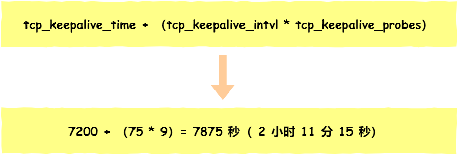

注意，应用程序若想使用 TCP 保活机制需要通过 socket 接口设置 `SO_KEEPALIVE` 选项才能够生效，如果没有设置，那么就无法使用 TCP 保活机制。

如果开启了 TCP 保活，需要考虑以下几种情况：

- 第一种，对端程序是正常工作的。当 TCP 保活的探测报文发送给对端, 对端会正常响应，这样 **TCP 保活时间会被重置**，等待下一个 TCP 保活时间的到来。
- 第二种，对端主机宕机并重启。当 TCP 保活的探测报文发送给对端后，对端是可以响应的，但由于没有该连接的有效信息，**会产生一个 RST 报文**，这样很快就会发现 TCP 连接已经被重置。
- 第三种，是对端主机宕机（*注意不是进程崩溃，进程崩溃后操作系统在回收进程资源的时候，会发送 FIN 报文，而主机宕机则是无法感知的，所以需要 TCP 保活机制来探测对方是不是发生了主机宕机*），或对端由于其他原因导致报文不可达。当 TCP 保活的探测报文发送给对端后，石沉大海，没有响应，连续几次，达到保活探测次数后，**TCP 会报告该 TCP 连接已经死亡**。

TCP 保活的这个机制检测的时间是有点长，我们可以自己在应用层实现一个心跳机制。

比如，web 服务软件一般都会提供 `keepalive_timeout` 参数，用来指定 HTTP 长连接的超时时间。如果设置了 HTTP 长连接的超时时间是 60 秒，web 服务软件就会**启动一个定时器**，如果客户端在完成一个 HTTP 请求后，在 60 秒内都没有再发起新的请求，**定时器的时间一到，就会触发回调函数来释放该连接。**


#### 如果已经建立了连接，但是服务端的进程崩溃会发生什么？

TCP 的连接信息是由内核维护的，所以当服务端的进程崩溃后，内核需要回收该进程的所有 TCP 连接资源，于是内核会发送第一次挥手 FIN 报文，后续的挥手过程也都是在内核完成，并不需要进程的参与，所以即使服务端的进程退出了，还是能与客户端完成 TCP 四次挥手的过程。

我自己做了个实验，使用 kill -9 来模拟进程崩溃的情况，发现**在 kill 掉进程后，服务端会发送 FIN 报文，与客户端进行四次挥手**。

TIP

关于进程崩溃和主机宕机的区别，可以参考这篇：[TCP 连接，一端断电和进程崩溃有什么区别？(opens new window)](https://xiaolincoding.com/network/3_tcp/tcp_down_and_crash.html)

还有一个类似的问题：「拔掉网线后， 原本的 TCP 连接还存在吗？」，具体可以看这篇：[拔掉网线后， 原本的 TCP 连接还存在吗？(opens new window)](https://xiaolincoding.com/network/3_tcp/tcp_unplug_the_network_cable.html)

------


### Socket 编程


#### 针对 TCP 应该如何 Socket 编程？


- 服务端和客户端初始化 `socket`，得到文件描述符；
- 服务端调用 `bind`，将 socket 绑定在指定的 IP 地址和端口;
- 服务端调用 `listen`，进行监听；
- 服务端调用 `accept`，等待客户端连接；
- 客户端调用 `connect`，向服务端的地址和端口发起连接请求；
- 服务端 `accept` 返回用于传输的 `socket` 的文件描述符；
- 客户端调用 `write` 写入数据；服务端调用 `read` 读取数据；
- 客户端断开连接时，会调用 `close`，那么服务端 `read` 读取数据的时候，就会读取到了 `EOF`，待处理完数据后，服务端调用 `close`，表示连接关闭。

这里需要注意的是，服务端调用 `accept` 时，连接成功了会返回一个已完成连接的 socket，后续用来传输数据。

所以，监听的 socket 和真正用来传送数据的 socket，是「两个」 socket，一个叫作**监听 socket**，一个叫作**已完成连接 socket**。

成功连接建立之后，双方开始通过 read 和 write 函数来读写数据，就像往一个文件流里面写东西一样。


#### listen 时候参数 backlog 的意义？

Linux内核中会维护两个队列：

- 半连接队列（SYN 队列）：接收到一个 SYN 建立连接请求，处于 SYN_RCVD 状态；
- 全连接队列（Accpet 队列）：已完成 TCP 三次握手过程，处于 ESTABLISHED 状态；


```c
int listen (int socketfd, int backlog)
```

- 参数一 socketfd 为 socketfd 文件描述符
- 参数二 backlog，这参数在历史版本有一定的变化

在早期 Linux 内核 backlog 是 SYN 队列大小，也就是未完成的队列大小。

在 Linux 内核 2.2 之后，backlog 变成 accept 队列，也就是已完成连接建立的队列长度，**所以现在通常认为 backlog 是 accept 队列。**

**但是上限值是内核参数 somaxconn 的大小，也就说 accpet 队列长度 = min(backlog, somaxconn)。**

想详细了解 TCP 半连接队列和全连接队列，可以看这篇：[TCP 半连接队列和全连接队列满了会发生什么？又该如何应对？(opens new window)](https://xiaolincoding.com/network/3_tcp/tcp_queue.html)


#### accept 发生在三次握手的哪一步？

我们先看看客户端连接服务端时，发送了什么？（一开始全连接队列accept为空，服务端等待accept队列有全连接，所以accept阻塞）


- 客户端的协议栈向服务端发送了 SYN 包，并告诉服务端当前发送序列号 client_isn，客户端进入 SYN_SENT 状态；
- 服务端的协议栈收到这个包之后，和客户端进行 ACK 应答，应答的值为 client_isn+1，表示对 SYN 包 client_isn 的确认，同时服务端也发送一个 SYN 包，告诉客户端当前我的发送序列号为 server_isn，服务端进入 SYN_RCVD 状态；
- 客户端协议栈收到 ACK 之后，使得应用程序从 `connect` 调用返回，表示客户端到服务端的单向连接建立成功，客户端的状态为 ESTABLISHED，同时客户端协议栈也会对服务端的 SYN 包进行应答，应答数据为 server_isn+1；
- ACK 应答包到达服务端后，服务端的 TCP 连接进入 ESTABLISHED 状态，同时服务端协议栈使得 `accept` 阻塞调用返回，这个时候服务端到客户端的单向连接也建立成功。至此，客户端与服务端两个方向的连接都建立成功。

从上面的描述过程，我们可以得知**客户端 connect 成功返回是在第二次握手，服务端 accept 成功返回是在三次握手成功之后。**


#### 客户端调用 close 了，连接是断开的流程是什么？

我们看看客户端主动调用了 `close`，会发生什么？


- 客户端调用 `close`，表明客户端没有数据需要发送了，则此时会向服务端发送 FIN 报文，进入 FIN_WAIT_1 状态；
- 服务端接收到了 FIN 报文，TCP 协议栈会为 FIN 包插入一个文件结束符 `EOF` 到接收缓冲区中，应用程序可以通过 `read` 调用来感知这个 FIN 包。这个 `EOF` 会被**放在已排队等候的其他已接收的数据之后**，这就意味着服务端需要处理这种异常情况，因为 EOF 表示在该连接上再无额外数据到达。此时，服务端进入 CLOSE_WAIT 状态；
- 接着，当处理完数据后，自然就会读到 `EOF`，于是也调用 `close` 关闭它的套接字，这会使得服务端发出一个 FIN 包，之后处于 LAST_ACK 状态；
- 客户端接收到服务端的 FIN 包，并发送 ACK 确认包给服务端，此时客户端将进入 TIME_WAIT 状态；
- 服务端收到 ACK 确认包后，就进入了最后的 CLOSE 状态；
- 客户端经过 `2MSL` 时间之后，也进入 CLOSE 状态；


#### 没有 accept，能建立 TCP 连接吗？

答案：**可以的**。

accpet 系统调用并不参与 TCP 三次握手过程，它只是负责从 TCP 全连接队列取出一个已经建立连接的 socket，用户层通过 accpet 系统调用拿到了已经建立连接的 socket，就可以对该 socket 进行读写操作了。


更想了解这个问题，可以参考这篇文章：[没有 accept，能建立 TCP 连接吗？(opens new window)](https://xiaolincoding.com/network/3_tcp/tcp_no_accpet.html)


#### 没有 listen，能建立 TCP 连接吗？

答案：**可以的**。

客户端是可以自己连自己的形成连接（**TCP自连接**），也可以两个客户端同时向对方发出请求建立连接（**TCP同时打开**），这两个情况都有个共同点，就是**没有服务端参与，也就是没有 listen，就能 TCP 建立连接。**


## TCP 重传、滑动窗口、流量控制、拥塞控制

相信大家都知道 TCP 是一个可靠传输的协议，那它是如何保证可靠的呢？

为了实现可靠性传输，需要考虑很多事情，例如数据的破坏、丢包、重复以及分片顺序混乱等问题。如不能解决这些问题，也就无从谈起可靠传输。

那么，TCP 是通过序列号、确认应答、重发控制、连接管理以及窗口控制等机制实现可靠性传输的。

今天，将重点介绍 TCP 的**重传机制、滑动窗口、流量控制、拥塞控制。**


###  重传机制

TCP 实现可靠传输的方式之一，是通过序列号与确认应答。

在 TCP 中，当发送端的数据到达接收主机时，接收端主机会返回一个确认应答消息，表示已收到消息。


但在错综复杂的网络，并不一定能如上图那么顺利能正常的数据传输，万一数据在传输过程中丢失了呢？

所以 TCP 针对数据包丢失的情况，会用**重传机制**解决。

接下来说说常见的重传机制：

- 超时重传
- 快速重传
- SACK
- D-SACK


#### 超时重传

重传机制的其中一个方式，就是在发送数据时，设定一个定时器，当超过指定的时间后，没有收到对方的 `ACK` 确认应答报文，就会重发该数据，也就是我们常说的**超时重传**。

TCP 会在以下两种情况发生超时重传：

- 数据包丢失
- 确认应答丢失

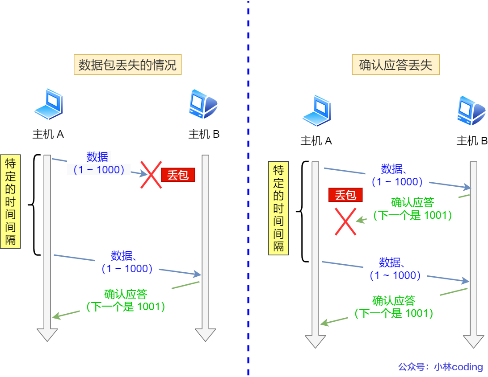

> 超时时间应该设置为多少呢？

我们先来了解一下什么是 `RTT`（Round-Trip Time 往返时延），从下图我们就可以知道：


`RTT` 指的是**数据发送时刻到接收到确认的时刻的差值**，也就是包的往返时间。

超时重传时间是以 `RTO` （Retransmission Timeout 超时重传时间）表示。

假设在重传的情况下，超时时间 `RTO` 「较长或较短」时，会发生什么事情呢？


上图中有两种超时时间不同的情况：

- 当超时时间 **RTO 较大（等待时间长了，发的间隔就长了）**时，重发就慢，丢了老半天才重发，没有效率，性能差；
- 当超时时间 **RTO 较小（等待时间短了，发的数量就多了）**时，会导致可能并没有丢就重发，于是重发的就快，会增加网络拥塞，导致更多的超时，更多的超时导致更多的重发。

精确的测量超时时间 `RTO` 的值是非常重要的，这可让我们的重传机制更高效。

根据上述的两种情况，我们可以得知，**超时重传时间 RTO 的值应该略大于报文往返 RTT 的值**。

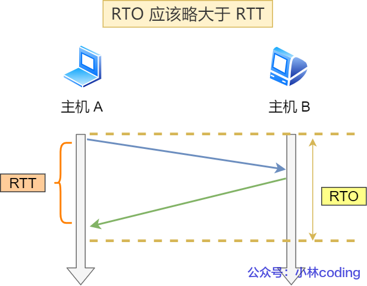

至此，可能大家觉得超时重传时间 `RTO` 的值计算，也不是很复杂嘛。

好像就是在发送端发包时记下 `t0` ，然后接收端再把这个 `ack` 回来时再记一个 `t1`，于是 `RTT = t1 – t0`。没那么简单，**这只是一个采样，不能代表普遍情况**。

实际上「报文往返 RTT 的值」是经常变化的，因为我们的网络也是时常变化的。也就因为「报文往返 RTT 的值」 是经常波动变化的，所以「超时重传时间 RTO 的值」应该是一个**动态变化的值**。

我们来看看 Linux 是如何计算 `RTO` 的呢？

估计往返时间，通常需要采样以下两个：

- 需要 TCP 通过采样 RTT 的时间，然后进行加权平均，算出一个平滑 RTT 的值，而且这个值还是要不断变化的，因为网络状况不断地变化。
- 除了采样 RTT，还要采样 RTT 的波动范围，这样就避免如果 RTT 有一个大的波动的话，很难被发现的情况。

RFC6289 建议使用以下的公式计算 RTO：


其中 `SRTT` 是计算平滑的RTT ，`DevRTR` 是计算平滑的RTT 与 最新 RTT 的差距。

在 Linux 下，**α = 0.125，β = 0.25， μ = 1，∂ = 4**。别问怎么来的，问就是大量实验中调出来的。

如果超时重发的数据，再次超时的时候，又需要重传的时候，TCP 的策略是**超时间隔加倍。**

也就是**每当遇到一次超时重传的时候，都会将下一次超时时间间隔设为先前值的两倍。两次超时，就说明网络环境差，不宜频繁反复发送。**

超时触发重传存在的问题是，超时周期可能相对较长。那是不是可以有更快的方式呢？

于是就可以用「快速重传」机制来解决超时重发的时间等待。


#### 快速重传

TCP 还有另外一种**快速重传（Fast Retransmit）机制**，它**不以时间为驱动，而是以数据驱动重传**。

快速重传机制，是如何工作的呢？其实很简单，一图胜千言。TCP 还有另外一种**快速重传（Fast Retransmit）机制**，它**不以时间为驱动，而是以数据驱动重传**。

快速重传机制，是如何工作的呢？其实很简单，一图胜千言。


在上图，发送方发出了 1，2，3，4，5 份数据：

- 第一份 Seq1 先送到了，于是就 Ack 回 2；
- 结果 Seq2 因为某些原因没收到，Seq3 到达了，于是还是 Ack 回 2；
- 后面的 Seq4 和 Seq5 都到了，但还是 Ack 回 2，因为 Seq2 还是没有收到；
- **发送端收到了三个 Ack = 2 的确认，知道了 Seq2 还没有收到，就会在定时器过期之前，重传丢失的 Seq2。**
- 最后，收到了 Seq2，此时因为 Seq3，Seq4，Seq5 都收到了，于是 Ack 回 6 。

所以，快速重传的工作方式是当收到三个相同的 ACK 报文时，会在定时器过期之前，重传丢失的报文段。

快速重传机制只解决了一个问题，就是超时时间的问题，但是它依然面临着另外一个问题。就是**重传的时候，是重传一个，还是重传所有的问题。**

举个例子，假设发送方发了 6 个数据，编号的顺序是 Seq1 ~ Seq6 ，但是 Seq2、Seq3 都丢失了，那么接收方在收到 Seq4、Seq5、Seq6 时，都是回复 ACK2 给发送方，但是发送方并不清楚这连续的 ACK2 是接收方收到哪个报文而回复的， 那是选择重传 Seq2 一个报文，还是重传 Seq2 之后已发送的所有报文呢（Seq2、Seq3、 Seq4、Seq5、 Seq6） 呢？

- 如果只选择重传 Seq2 一个报文，那么重传的效率很低。因为对于丢失的 Seq3 报文，还得在后续收到三个重复的 ACK3 才能触发重传。
- 如果选择重传 Seq2 之后已发送的所有报文，虽然能同时重传已丢失的 Seq2 和 Seq3 报文，但是 Seq4、Seq5、Seq6 的报文是已经被接收过了，对于重传 Seq4 ～Seq6 折部分数据相当于做了一次无用功，浪费资源。

可以看到，不管是重传一个报文，还是重传已发送的报文，都存在问题。

为了解决不知道该重传哪些 TCP 报文，于是就有 `SACK` 方法。


#### SACK 方法

还有一种实现重传机制的方式叫：`SACK`（ Selective Acknowledgment）， **选择性确认**。

这种方式需要在 TCP 头部「选项」字段里加一个 `SACK` 的东西，它**可以将已收到的数据的信息发送给「发送方」**，这样发送方就可以知道哪些数据收到了，哪些数据没收到，知道了这些信息，就可以**只重传丢失的数据**。

如下图，发送方收到了三次同样的 ACK 确认报文，于是就会触发快速重发机制，通过 `SACK` 信息发现只有 `200~299` 这段数据丢失，则重发时，就只选择了这个 TCP 段进行重复。


如果要支持 `SACK`，必须双方都要支持。在 Linux 下，可以通过 `net.ipv4.tcp_sack` 参数打开这个功能（Linux 2.4 后默认打开）。


#### Duplicate SACK

Duplicate SACK 又称 `D-SACK`，其主要**使用了 SACK 来告诉「发送方」有哪些数据被重复接收了。**

下面举例两个栗子，来说明 `D-SACK` 的作用。

*栗子一号：ACK 丢包*

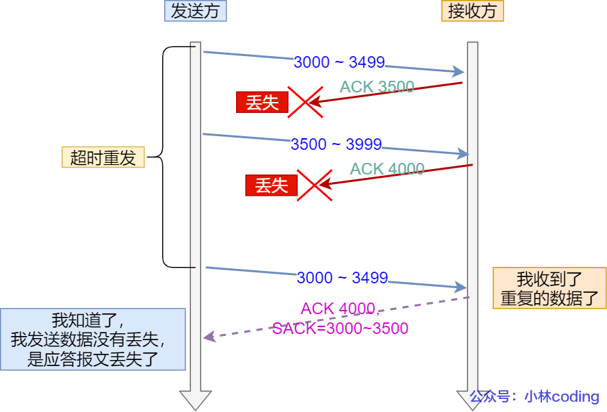

- 「接收方」发给「发送方」的两个 ACK 确认应答都丢失了，所以发送方超时后，重传第一个数据包（3000 ~ 3499）
- **于是「接收方」发现数据是重复收到的，于是回了一个 SACK = 3000~3500**，告诉「发送方」 3000~3500 的数据早已被接收了（此时因为ACK大于SACK，因此发送方知道这是一个D-SACK），因为 ACK 都到了 4000 了，已经意味着 4000 之前的所有数据都已收到，所以这个 SACK 就代表着 `D-SACK`。
- 这样「发送方」就知道了，数据没有丢，是「接收方」的 ACK 确认报文丢了。

*栗子二号：网络延时*


- 数据包（1000~1499） 被网络延迟了，导致「发送方」没有收到 Ack 1500 的确认报文。
- 而后面报文到达的三个相同的 ACK 确认报文，就触发了快速重传机制，但是在重传后，被延迟的数据包（1000~1499）又到了「接收方」；
- **所以「接收方」回了一个 SACK=1000~1500，因为 ACK 已经到了 3000，所以这个 SACK 是 D-SACK，表示收到了重复的包。**
- 这样发送方就知道快速重传触发的原因不是发出去的包丢了，也不是因为回应的 ACK 包丢了，而是因为网络延迟了。

可见，`D-SACK` 有这么几个好处：

1. 可以让「发送方」知道，是发出去的包丢了，还是接收方回应的 ACK 包丢了;
2. 可以知道是不是「发送方」的数据包被网络延迟了;
3. 可以知道网络中是不是把「发送方」的数据包给复制了;

在 Linux 下可以通过 `net.ipv4.tcp_dsack` 参数开启/关闭这个功能（Linux 2.4 后默认打开）。


### 滑动窗口

我们都知道 TCP 是每发送一个数据，都要进行一次确认应答。当上一个数据包收到了应答了， 再发送下一个。

这个模式就有点像我和你面对面聊天，你一句我一句。但这种方式的缺点是效率比较低的。

如果你说完一句话，我在处理其他事情，没有及时回复你，那你不是要干等着我做完其他事情后，我回复你，你才能说下一句话，很显然这不现实。

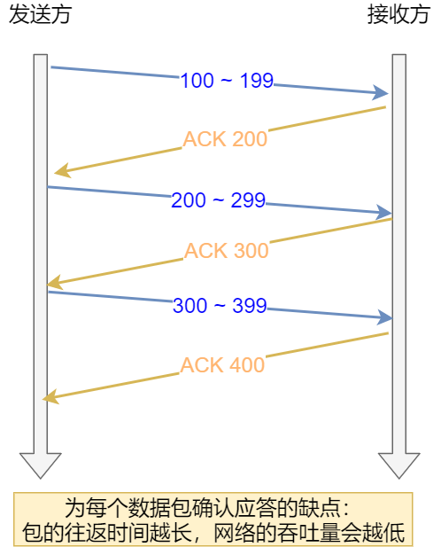

所以，这样的传输方式有一个缺点：数据包的**往返时间越长，通信的效率就越低**。

为解决这个问题，TCP 引入了**窗口**这个概念。即使在往返时间较长的情况下，它也不会降低网络通信的效率。

那么有了窗口，就可以指定窗口大小，窗口大小就是指**无需等待确认应答，而可以继续发送数据的最大值**。

窗口的实现实际上是操作系统开辟的一个缓存空间，发送方主机在等到确认应答返回之前，必须在缓冲区中保留已发送的数据。如果按期收到确认应答，此时数据就可以从缓存区清除。

假设窗口大小为 `3` 个 TCP 段，那么发送方就可以「连续发送」 `3` 个 TCP 段，并且中途若有 ACK 丢失，可以通过「下一个确认应答进行确认」。如下图：


图中的 ACK 600 确认应答报文丢失，也没关系，因为可以通过下一个确认应答进行确认，只要发送方收到了 ACK 700 确认应答，就意味着 700 之前的所有数据「接收方」都收到了。这个模式就叫**累计确认**或者**累计应答**。

> 窗口大小由哪一方决定？

TCP 头里有一个字段叫 `Window`，也就是窗口大小。

**这个字段是接收端告诉发送端自己还有多少缓冲区可以接收数据。于是发送端就可以根据这个接收端的处理能力来发送数据，而不会导致接收端处理不过来。**

所以，通常窗口的大小是由接收方的窗口大小来决定的。

**发送方发送的数据大小不能超过接收方的窗口大小，否则接收方就无法正常接收到数据。**

> 如果发送方发送的数据大于接收方的窗口，如果接收方窗口内的数据都没收到，而发送方发送接收方窗口外的值，此时接收方收到该数据的处理只能丢弃，所以发送方的窗口大小没必要大于接收方窗口大小。

> 发送方的滑动窗口

我们先来看看发送方的窗口，下图就是发送方缓存的数据，根据处理的情况分成四个部分，其中深蓝色方框是发送窗口，紫色方框是可用窗口：

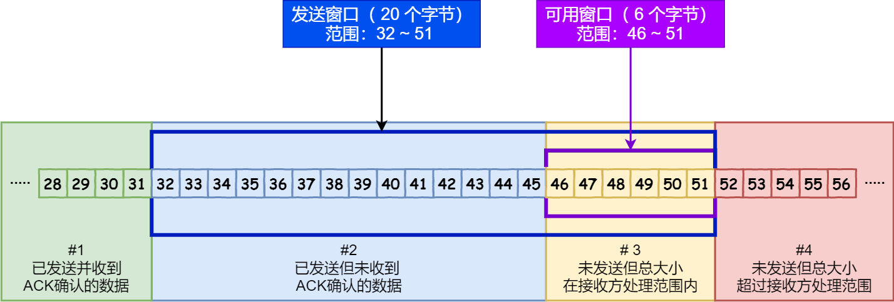

- \#1 是已发送并收到 ACK确认的数据：1~31 字节
- \#2 是已发送但未收到 ACK确认的数据：32~45 字节
- \#3 是未发送但总大小在接收方处理范围内（接收方还有空间）：46~51字节
- \#4 是未发送但总大小超过接收方处理范围（接收方没有空间）：52字节以后

在下图，当发送方把数据「全部」都一下发送出去后，可用窗口的大小就为 0 了，表明可用窗口耗尽，在没收到 ACK 确认之前是无法继续发送数据了。

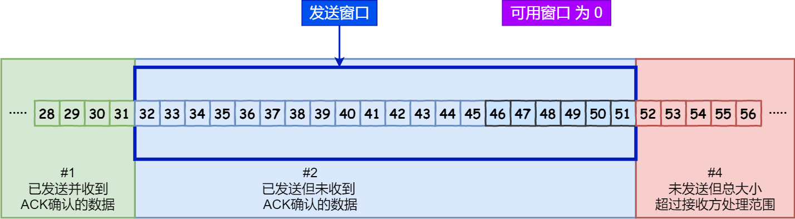

在下图，当收到之前发送的数据 `32~36` 字节的 ACK 确认应答后，如果发送窗口的大小没有变化，则**滑动窗口往右边移动 5 个字节，因为有 5 个字节的数据被应答确认**，接下来 `52~56` 字节又变成了可用窗口，那么后续也就可以发送 `52~56` 这 5 个字节的数据了。


> 程序是如何表示发送方的四个部分的呢？

TCP 滑动窗口方案使用三个指针来跟踪在四个传输类别中的每一个类别中的字节。其中两个指针是绝对指针（指特定的序列号），一个是相对指针（需要做偏移）。

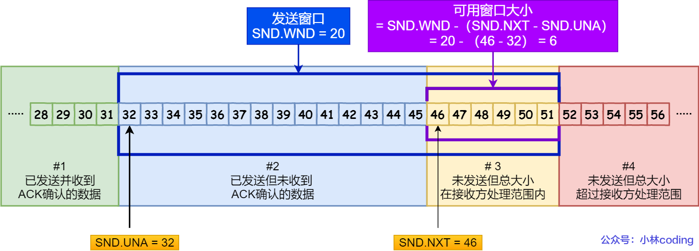

- `SND.WND`：表示发送窗口的大小（大小是由接收方指定的）；
- `SND.UNA`（*Send Unacknoleged*）：是一个绝对指针，它指向的是已发送但未收到确认的第一个字节的序列号，也就是 #2 的第一个字节。
- `SND.NXT`：也是一个绝对指针，它指向未发送但可发送范围的第一个字节的序列号，也就是 #3 的第一个字节。
- 指向 #4 的第一个字节是个相对指针，它需要 `SND.UNA` 指针加上 `SND.WND` 大小的偏移量，就可以指向 #4 的第一个字节了。

那么可用窗口大小的计算就可以是：

**可用窗口大小 = SND.WND -（SND.NXT - SND.UNA）**

> 接收方的滑动窗口

接下来我们看看接收方的窗口，接收窗口相对简单一些，根据处理的情况划分成三个部分：

- \#1 + #2 是已成功接收并确认的数据（等待应用进程读取）；
- \#3 是未收到数据但可以接收的数据；
- \#4 未收到数据并不可以接收的数据；


其中三个接收部分，使用两个指针进行划分:

- `RCV.WND`：==表示接收窗口的大小，它会通告给发送方==。
- `RCV.NXT`：是一个指针，它指向期望从发送方发送来的下一个数据字节的序列号，也就是 #3 的第一个字节。
- 指向 #4 的第一个字节是个相对指针，它需要 `RCV.NXT` 指针加上 `RCV.WND` 大小的偏移量，就可以指向 #4 的第一个字节了。

> 接收窗口和发送窗口的大小是相等的吗？

并不是完全相等，接收窗口的大小是**约等于**发送窗口的大小的。

因为滑动窗口并不是一成不变的**。比如，当接收方的应用进程读取数据的速度非常快的话，这样的话接收窗口可以很快的就空缺出来。那么新的接收窗口大小，是通过 TCP 报文中的 Windows 字段来告诉发送方。那么这个传输过程是存在时延的，所以接收窗口和发送窗口是约等于的关系**。


### 流量控制

发送方不能无脑的发数据给接收方，要考虑接收方处理能力。

如果一直无脑的发数据给对方，但对方处理不过来，那么就会导致触发重发机制，从而导致网络流量的无端的浪费。

为了解决这种现象发生，**TCP 提供一种机制可以让「发送方」根据「接收方」的实际接收能力控制发送的数据量，这就是所谓的流量控制。**

下面举个栗子，为了简单起见，假设以下场景：

- 客户端是接收方，服务端是发送方
- 假设接收窗口和发送窗口相同，都为 `200`
- 假设两个设备在整个传输过程中都保持相同的窗口大小，不受外界影响

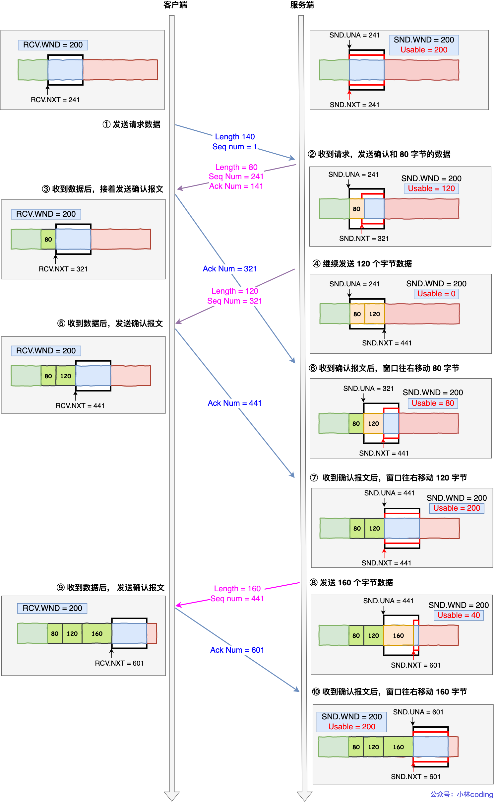

根据上图的流量控制，说明下每个过程：

1. 客户端向服务端发送请求数据报文。这里要说明下，本次例子是把服务端作为发送方，所以没有画出服务端的接收窗口。
2. 服务端收到请求报文后，发送确认报文和 80 字节的数据，于是可用窗口 `Usable` 减少为 120 字节，同时 `SND.NXT` 指针也向右偏移 80 字节后，指向 321，**这意味着下次发送数据的时候，序列号是 321。**
3. 客户端收到 80 字节数据后，于是接收窗口往右移动 80 字节，`RCV.NXT` 也就指向 321，**这意味着客户端期望的下一个报文的序列号是 321**，接着发送确认报文给服务端。
4. 服务端再次发送了 120 字节数据，于是可用窗口耗尽为 0，服务端无法再继续发送数据。
5. 客户端收到 120 字节的数据后，于是接收窗口往右移动 120 字节，`RCV.NXT` 也就指向 441，接着发送确认报文给服务端。
6. 服务端收到对 80 字节数据的确认报文后，`SND.UNA` 指针往右偏移后指向 321，于是可用窗口 `Usable` 增大到 80。
7. 服务端收到对 120 字节数据的确认报文后，`SND.UNA` 指针往右偏移后指向 441，于是可用窗口 `Usable` 增大到 200。
8. 服务端可以继续发送了，于是发送了 160 字节的数据后，`SND.NXT` 指向 601，于是可用窗口 `Usable` 减少到 40。
9. 客户端收到 160 字节后，接收窗口往右移动了 160 字节，`RCV.NXT` 也就是指向了 601，接着发送确认报文给服务端。
10. 服务端收到对 160 字节数据的确认报文后，发送窗口往右移动了 160 字节，于是 `SND.UNA` 指针偏移了 160 后指向 601，可用窗口 `Usable` 也就增大至了 200。


#### 操作系统缓冲区与滑动窗口的关系

前面的流量控制例子，我们假定了发送窗口和接收窗口是不变的，但是实际上，发送窗口和接收窗口中所存放的字节数，都是放在操作系统内存缓冲区中的，而操作系统的缓冲区，会**被操作系统调整**。

当应用进程没办法及时读取缓冲区的内容时，也会对我们的缓冲区造成影响。

> 那操作系统的缓冲区，是如何影响发送窗口和接收窗口的呢？

*我们先来看看第一个例子。*

当应用程序没有及时读取缓存时，发送窗口和接收窗口的变化。

考虑以下场景：

- 客户端作为发送方，服务端作为接收方，发送窗口和接收窗口初始大小为 `360`；
- 服务端非常的繁忙，当收到客户端的数据时，应用层不能及时读取数据。


根据上图的流量控制，说明下每个过程：

1. 客户端发送 140 字节数据后，可用窗口变为 220 （360 - 140）。
2. 服务端收到 140 字节数据，**但是服务端非常繁忙，应用进程只读取了 40 个字节，还有 100 字节占用着缓冲区，于是接收窗口收缩到了 260 （360 - 100）**，最后发送确认信息时，将窗口大小通告给客户端。
3. 客户端收到确认和窗口通告报文后，发送窗口减少为 260。
4. 客户端发送 180 字节数据，此时可用窗口减少到 80。
5. 服务端收到 180 字节数据，**但是应用程序没有读取任何数据，这 180 字节直接就留在了缓冲区，于是接收窗口收缩到了 80 （260 - 180）**，并在发送确认信息时，通过窗口大小给客户端。
6. 客户端收到确认和窗口通告报文后，发送窗口减少为 80。
7. 客户端发送 80 字节数据后，可用窗口耗尽。
8. 服务端收到 80 字节数据，**但是应用程序依然没有读取任何数据，这 80 字节留在了缓冲区，于是接收窗口收缩到了 0**，并在发送确认信息时，通过窗口大小给客户端。
9. 客户端收到确认和窗口通告报文后，发送窗口减少为 0。

可见最后窗口都收缩为 0 了，也就是发生了窗口关闭。当发送方可用窗口变为 0 时，发送方实际上会定时发送窗口探测报文，以便知道接收方的窗口是否发生了改变，这个内容后面会说，这里先简单提一下。

*我们先来看看第二个例子。*

当服务端系统资源非常紧张的时候，操作系统可能会直接减少了接收缓冲区大小，这时应用程序又无法及时读取缓存数据，那么这时候就有严重的事情发生了，会出现数据包丢失的现象。


说明下每个过程：

1. 客户端发送 140 字节的数据，于是可用窗口减少到了 220。
2. **服务端因为现在非常的繁忙，操作系统于是就把接收缓存减少了 120 字节，当收到 140 字节数据后，又因为应用程序没有读取任何数据，所以 140 字节留在了缓冲区中，于是接收窗口大小从 360 收缩成了 100**，最后发送确认信息时，通告窗口大小给对方。
3. 此时客户端因为还没有收到服务端的通告窗口报文，所以不知道此时接收窗口收缩成了 100，客户端只会看自己的可用窗口还有 220，所以客户端就发送了 180 字节数据，于是可用窗口减少到 40。
4. 服务端收到了 180 字节数据时，**发现数据大小超过了接收窗口的大小，于是就把数据包丢失了。**
5. 客户端收到第 2 步时，服务端发送的确认报文和通告窗口报文，尝试减少发送窗口到 100，把窗口的右端向左收缩了 80，此时可用窗口的大小就会出现诡异的负值。

所以，如果发生了先减少缓存，再收缩窗口，就会出现丢包的现象。

**为了防止这种情况发生，TCP 规定是不允许同时减少缓存又收缩窗口的，而是采用先收缩窗口，过段时间再减少缓存，这样就可以避免了丢包情况（即先告知发送方接收窗口缩小，等待一段时间，确保发送方知道接收窗口已缩小之前发送的数据都已处理，此时接收方的缓存大小）。**


#### 窗口关闭

在前面我们都看到了，TCP 通过让接收方指明希望从发送方接收的数据大小（窗口大小）来进行流量控制。

**如果窗口大小为 0 时，就会阻止发送方给接收方传递数据，直到窗口变为非 0 为止，这就是窗口关闭。**

> 窗口关闭潜在的危险

接收方向发送方通告窗口大小时，是通过 `ACK` 报文来通告的。

那么，当发生窗口关闭时，接收方处理完数据后，会向发送方通告一个窗口非 0 的 ACK 报文，如果这个通告窗口的 ACK 报文在网络中丢失了，那麻烦就大了。


这会导致发送方一直等待接收方的非 0 窗口通知，接收方也一直等待发送方的数据，如不采取措施，这种相互等待的过程，会造成了死锁的现象。

> TCP 是如何解决窗口关闭时，潜在的死锁现象呢？

为了解决这个问题，TCP 为每个连接设有一个持续定时器，**只要 TCP 连接一方收到对方的零窗口通知，就启动持续计时器。**

如果持续计时器超时，就会发送**窗口探测 ( Window probe ) 报文**，而对方在确认这个探测报文时，给出自己现在的接收窗口大小。

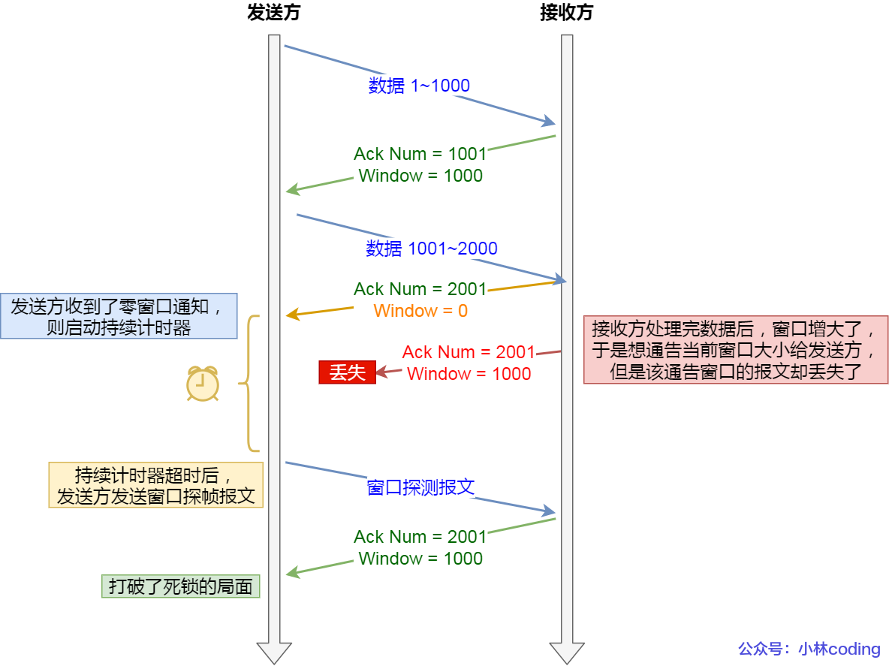

- 如果接收窗口仍然为 0，那么收到这个报文的一方就会重新启动持续计时器；
- 如果接收窗口不是 0，那么死锁的局面就可以被打破了。

窗口探测的次数一般为 3 次，每次大约 30-60 秒（不同的实现可能会不一样）。如果 3 次过后接收窗口还是 0 的话，有的 TCP 实现就会发 `RST` 报文来中断连接。


#### 糊涂窗口综合症

如果接收方太忙了，来不及取走接收窗口里的数据，那么就会导致发送方的发送窗口越来越小。

到最后，**如果接收方腾出几个字节并告诉发送方现在有几个字节的窗口，而发送方会义无反顾地发送这几个字节，这就是糊涂窗口综合症**。

要知道，我们的 `TCP + IP` 头有 `40` 个字节，为了传输那几个字节的数据，要搭上这么大的开销，这太不经济了。

就好像一个可以承载 50 人的大巴车，每次来了一两个人，就直接发车。除非家里有矿的大巴司机，才敢这样玩，不然迟早破产。要解决这个问题也不难，大巴司机等乘客数量超过了 25 个，才认定可以发车。

现举个糊涂窗口综合症的栗子，考虑以下场景：

接收方的窗口大小是 360 字节，但接收方由于某些原因陷入困境，假设接收方的应用层读取的能力如下：

- 接收方每接收 3 个字节，应用程序就只能从缓冲区中读取 1 个字节的数据；
- 在下一个发送方的 TCP 段到达之前，应用程序还从缓冲区中读取了 40 个额外的字节；


每个过程的窗口大小的变化，在图中都描述的很清楚了，可以发现窗口不断减少了，并且发送的数据都是比较小的了。

所以，糊涂窗口综合症的现象是可以发生在发送方和接收方：

- 接收方可以通告一个小的窗口
- 而发送方可以发送小数据

于是，要解决糊涂窗口综合症，就要同时解决上面两个问题就可以了：

- 让接收方不通告小窗口给发送方
- 让发送方避免发送小数据

> 怎么让接收方不通告小窗口呢？

接收方通常的策略如下:

当「窗口大小」小于 min( MSS，缓存空间/2 ) ，也就是小于 MSS 与 1/2 缓存大小中的最小值时，就会向发送方通告窗口为 `0`，也就阻止了发送方再发数据过来。

等到接收方处理了一些数据后，窗口大小 >= MSS，或者接收方缓存空间有一半可以使用，就可以把窗口打开让发送方发送数据过来。

> 怎么让发送方避免发送小数据呢？

发送方通常的策略如下:

使用 Nagle 算法，该算法的思路是延时处理，只有满足下面两个条件中的任意一个条件，才可以发送数据：

- 条件一：要等到窗口大小 >= `MSS` 并且 数据大小 >= `MSS`；
- 条件二：收到之前发送数据的 `ack` 回包；

只要上面两个条件都不满足，发送方一直在囤积数据，直到满足上面的发送条件。

Nagle 伪代码如下：

```c
if 有数据要发送 {
    if 可用窗口大小 >= MSS and 可发送的数据 >= MSS {
    	立刻发送MSS大小的数据
    } else {
        if 有未确认的数据 {
            将数据放入缓存等待接收ACK
        } else {
            立刻发送数据
        }
    }
}
```

注意，如果接收方不能满足「不通告小窗口给发送方」，那么即使开了 Nagle 算法，也无法避免糊涂窗口综合症，因为如果对端 ACK 回复很快的话（达到 Nagle 算法的条件二），Nagle 算法就不会拼接太多的数据包，这种情况下依然会有小数据包的传输，网络总体的利用率依然很低。

所以，**接收方得满足「不通告小窗口给发送方」+ 发送方开启 Nagle 算法，才能避免糊涂窗口综合症**。

另外，Nagle 算法默认是打开的，如果对于一些需要小数据包交互的场景的程序，比如，telnet 或 ssh 这样的交互性比较强的程序，则需要关闭 Nagle 算法。

可以在 Socket 设置 `TCP_NODELAY` 选项来关闭这个算法（关闭 Nagle 算法没有全局参数，需要根据每个应用自己的特点来关闭）

```c
setsockopt(sock_fd, IPPROTO_TCP, TCP_NODELAY, (char *)&value, sizeof(int));
```

------


### 拥塞控制

>  为什么要有拥塞控制呀，不是有流量控制了吗？

前面的流量控制是避免「发送方」的数据填满「接收方」的缓存，但是并不知道网络的中发生了什么。

一般来说，计算机网络都处在一个共享的环境。因此也有可能会因为其他主机之间的通信使得网络拥堵。

**在网络出现拥堵时，如果继续发送大量数据包，可能会导致数据包时延、丢失等，这时 TCP 就会重传数据，但是一重传就会导致网络的负担更重，于是会导致更大的延迟以及更多的丢包，这个情况就会进入恶性循环被不断地放大....**

所以，TCP 不能忽略网络上发生的事，它被设计成一个无私的协议，当网络发送拥塞时，TCP 会自我牺牲，降低发送的数据量。

于是，就有了**拥塞控制**，控制的目的就是**避免「发送方」的数据填满整个网络。**

为了在「发送方」调节所要发送数据的量，定义了一个叫做「**拥塞窗口**」的概念。

> 什么是拥塞窗口？和发送窗口有什么关系呢？

**拥塞窗口 cwnd**是发送方维护的一个的状态变量，它会根据**网络的拥塞程度动态变化的**。

我们在前面提到过发送窗口 `swnd` 和接收窗口 `rwnd` 是约等于的关系，那么由于加入了拥塞窗口的概念后，此时发送窗口的值是swnd = min(cwnd, rwnd)，也就是拥塞窗口和接收窗口中的最小值。

拥塞窗口 `cwnd` 变化的规则：

- 只要网络中没有出现拥塞，`cwnd` 就会增大；
- 但网络中出现了拥塞，`cwnd` 就减少；

> 那么怎么知道当前网络是否出现了拥塞呢？

其实只要「发送方」没有在规定时间内接收到 ACK 应答报文，也就是**发生了超时重传，就会认为网络出现了拥塞。**

> 拥塞控制有哪些控制算法？

拥塞控制主要是四个算法：

- 慢启动
- 拥塞避免
- 拥塞发生
- 快速恢复


#### 慢启动

TCP 在刚建立连接完成后，首先是有个慢启动的过程，这个慢启动的意思就是一点一点的提高发送数据包的数量，如果一上来就发大量的数据，这不是给网络添堵吗？

慢启动的算法记住一个规则就行：**当发送方每收到一个 ACK，拥塞窗口 cwnd 的大小就会加 1。**

这里假定拥塞窗口 `cwnd` 和发送窗口 `swnd` 相等，下面举个栗子：

- 连接建立完成后，一开始初始化 `cwnd = 1`，表示可以传一个 `MSS` 大小的数据。
- 当收到一个 ACK 确认应答后，cwnd 增加 1，于是一次能够发送 2 个
- 当收到 2 个的 ACK 确认应答后， cwnd 增加 2，于是就可以比之前多发2 个，所以这一次能够发送 4 个
- 当这 4 个的 ACK 确认到来的时候，每个确认 cwnd 增加 1， 4 个确认 cwnd 增加 4，于是就可以比之前多发 4 个，所以这一次能够发送 8 个。

慢启动算法的变化过程如下图：

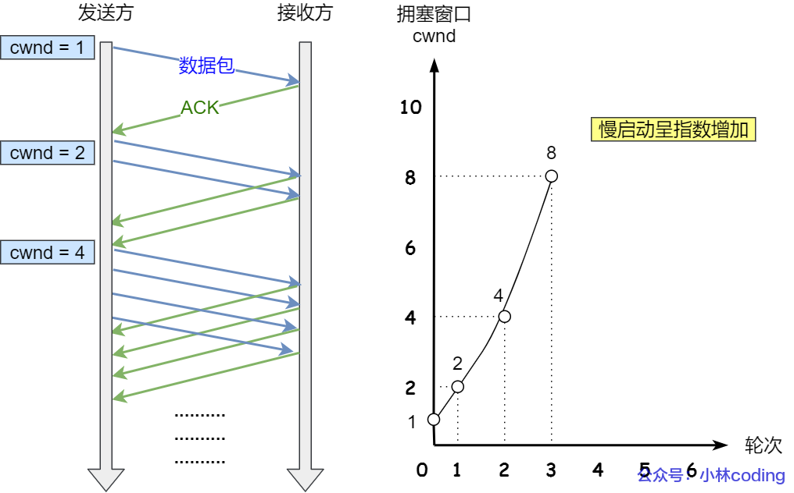

可以看出慢启动算法，发包的个数是**指数性的增长**。

> 那慢启动涨到什么时候是个头呢？

有一个叫慢启动门限 `ssthresh` （slow start threshold）状态变量。

- 当 `cwnd` < `ssthresh` 时，使用慢启动算法。
- 当 `cwnd` >= `ssthresh` 时，就会使用「拥塞避免算法」。


#### 拥塞避免算法

前面说道，当拥塞窗口 `cwnd` 「超过」慢启动门限 `ssthresh` 就会进入拥塞避免算法。

一般来说 `ssthresh` 的大小是 `65535` 字节。

那么进入拥塞避免算法后，它的规则是：**每当收到一个 ACK 时，cwnd 增加 1/cwnd。**

接上前面的慢启动的栗子，现假定 `ssthresh` 为 `8`：

- 当 8 个 ACK 应答确认到来时，每个确认增加 1/8，8 个 ACK 确认 cwnd 一共增加 1，于是这一次能够发送 9 个 `MSS` 大小的数据，变成了**线性增长。**

拥塞避免算法的变化过程如下图：

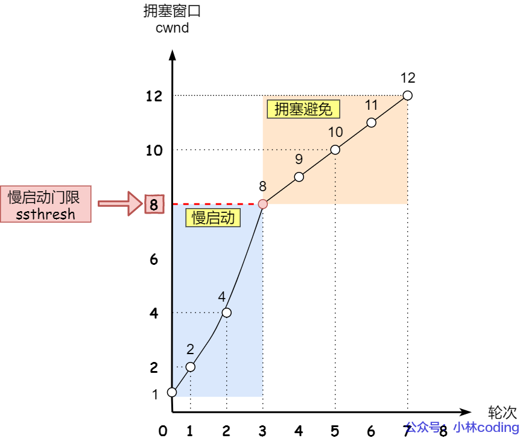

所以，我们可以发现，拥塞避免算法就是将原本慢启动算法的指数增长变成了线性增长，还是增长阶段，但是增长速度缓慢了一些。

就这么一直增长着后，网络就会慢慢进入了拥塞的状况了，于是就会出现丢包现象，这时就需要对丢失的数据包进行重传。

当触发了重传机制，也就进入了「拥塞发生算法」。


#### 拥塞发生

当网络出现拥塞，也就是会发生数据包重传，重传机制主要有两种：

- 超时重传
- 快速重传

这两种使用的拥塞发送算法是不同的，接下来分别来说说。

> 发生超时重传的拥塞发生算法

当发生了「超时重传」，则就会使用拥塞发生算法。

这个时候，ssthresh 和 cwnd 的值会发生变化：

- `ssthresh` 设为 `cwnd/2`，
- `cwnd` 重置为 `1` （是恢复为 cwnd 初始化值，我这里假定 cwnd 初始化值 1）

> 怎么查看系统的 cwnd 初始化值？

Linux 针对每一个 TCP 连接的 cwnd 初始化值是 10，也就是 10 个 MSS，我们可以用 ss -nli 命令查看每一个 TCP 连接的 cwnd 初始化值，如下图

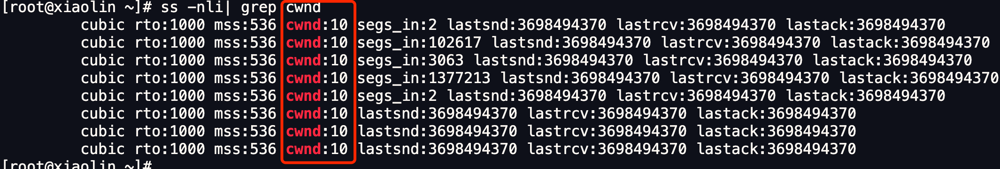

拥塞发生算法的变化如下图：


接着，就重新开始慢启动，慢启动是会突然减少数据流的。这真是一旦「超时重传」，马上回到解放前。但是这种方式太激进了，反应也很强烈，会造成网络卡顿。

就好像本来在秋名山高速漂移着，突然来个紧急刹车，轮胎受得了吗。。。

> 发生快速重传的拥塞发生算法

还有更好的方式，前面我们讲过「快速重传算法」。当接收方发现丢了一个中间包的时候，发送三次前一个包的 ACK，于是发送端就会快速地重传，不必等待超时再重传。

TCP 认为这种情况不严重，因为大部分没丢，只丢了一小部分，则 `ssthresh` 和 `cwnd` 变化如下：

- `cwnd = cwnd/2` ，也就是设置为原来的一半;
- `ssthresh = cwnd`;
- 进入快速恢复算法


#### 快速恢复

快速重传和快速恢复算法一般同时使用，快速恢复算法是认为，你还能收到 3 个重复 ACK 说明网络也不那么糟糕，所以没有必要像 `RTO` 超时那么强烈。

正如前面所说，进入快速恢复之前，`cwnd` 和 `ssthresh` 已被更新了：

- `cwnd = cwnd/2` ，也就是设置为原来的一半;
- `ssthresh = cwnd`;

然后，进入快速恢复算法如下：

- 拥塞窗口 `cwnd = ssthresh + 3` （ 3 的意思是确认有 3 个数据包被收到了）；
- 重传丢失的数据包；
- 如果再收到重复的 ACK，那么 cwnd 增加 1；
- 如果收到新数据的 ACK 后，把 cwnd 设置为第一步中的 ssthresh 的值，原因是该 ACK 确认了新的数据，说明从 duplicated ACK 时的数据都已收到，该恢复过程已经结束，可以回到恢复之前的状态了，也即再次进入拥塞避免状态；

快速恢复算法的变化过程如下图：


也就是没有像「超时重传」一夜回到解放前，而是还在比较高的值，后续呈线性增长。

> TIP 很多人问题，快速恢复算法过程中，为什么收到新的数据后，cwnd 设置回了 ssthresh ？

我的理解是：

1. 在快速恢复的过程中，首先 ssthresh = cwnd/2，然后 cwnd = ssthresh + 3，表示网络可能出现了阻塞，所以需要减小 cwnd 以避免，加 3 代表快速重传时已经确认接收到了 3 个重复的数据包；
2. 随后继续重传丢失的数据包，如果再收到重复的 ACK，那么 cwnd 增加 1。加 1 代表每个收到的重复的 ACK 包，都已经离开了网络。这个过程的目的是尽快将丢失的数据包发给目标。
3. 如果收到新数据的 ACK 后，把 cwnd 设置为第一步中的 ssthresh 的值，恢复过程结束。

**首先，快速恢复是拥塞发生后慢启动的优化，其首要目的仍然是降低 cwnd 来减缓拥塞，所以必然会出现 cwnd 从大到小的改变。**

**其次，过程2（cwnd逐渐加1）的存在是为了尽快将丢失的数据包发给目标，从而解决拥塞的根本问题（三次相同的 ACK 导致的快速重传），所以这一过程中 cwnd 反而是逐渐增大的。**


==============================

# 传输层


## TCP 协议

TCP，传输控制协议（Transmission Control Protocol），是一种传输层的通信协议，具有以下三个特性：

- **面向连接**
- **可靠的**
- **基于字节流**


## 为什么要将数据切片

网络传输的数据大小是有限制的，这个是由**网络接口层（数据链路层）**提供的，一般认为是 **MTU(1500)**。因此，在传输数据的时候，当数据的大小超过网络传输的限制以后，就需要对传输的数据进行切片，变成一个个数据包。当使用TCP协议时，消息进入传输层以后会被切片为一个个数据包，这个数据包的长度就是MSS。


### MTU和MSS有什么区别


#### MTU (Maximum Transmit Unit) —— 最大传输单元

由**网络接口层（数据链路层）**提供给网络层最大一次传输数据的大小，一般*MTU=1500 Byte*。IP层分片后，每个分片的 IP Header ID 相同。


#### MSS (Maximum Segment Size) —— 最大分段大小

- MSS 是TCP 用来限制应用层最大发送字节数。

- TCP提供给 IP 层的最大分段大小，不包含TCP Header 和 Option，只包含 TCP Payload (有效载荷)。

假设 MTU = 1500 byte，那么MSS = 1500 - 20(IP Header) - 20(TCP Header) = 1460 byte，如果应用层有2000 byte 需要发送，那么就需要两个切片才能完成，第一个TCP切片的大小=1460，第二个切片大小=540


-----------

综合来说，IP层就是一个只知道搬运消息的摸鱼打工人。

----------------------


## 粘包


### 什么是粘包

B收到从A发送过来的消息切片，对其进行重组的时候，出现了错误的字节流信息。**即粘包就是：两个数据包的内容被错误地当成一个数据包的内容解析出来。**


### 为什么会出现粘包

TCP传输过程中出现粘包的很大原因就是**基于字节流**这个特点。

字节流：一大堆二进制数据，数据串之间没有边界。


### 为什么要组装发送的数据

TCP切片是为了顺利通过网络的这根水管，而组装（把前后两次数据远小于MSS的TCP组装起来）就是**为了减少网络IO的次数**。


#### Nagle 算法优化 —— delay 发送

Nagle算法就是一种组装的算法，其目的就是为了避免发送小的数据包。

在 Nagle 算法开启的情况下，数据包会在以下两种情况下发送：

- 如果包长度达到 MSS（或含有Fin包），就会立即发送；否则就会等待下一个包到来，如果到来后两个包的长度大于MSS，则会再次进行拆分发送。
- 等待超时（一般为200ms），第一个包没到 MSS 长度，但下一个包迟迟未到达，则会立即发送。


#### 关闭 Nagle算法就不会粘包吗

还是会粘包。虽然关闭 Nagle 算法，可以让数据包立即发送，不需要等待，但是接收方如果对发送的数据包未及时处理，还是会出现粘包现象。


### 怎么处理粘包


### UDP会粘包吗


### 为什么长度冗余字段还要加到UDP首部中


### IP层会有粘包问题吗


