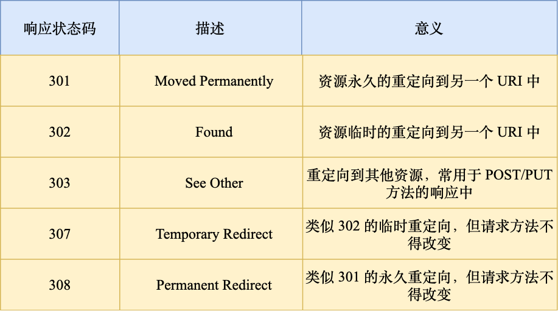
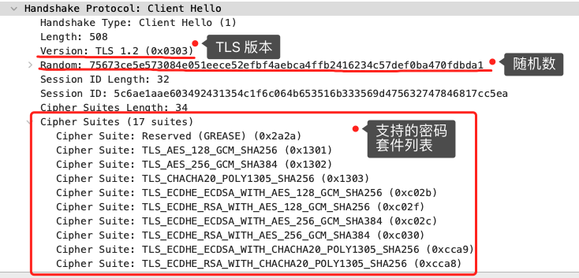
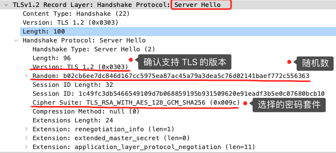
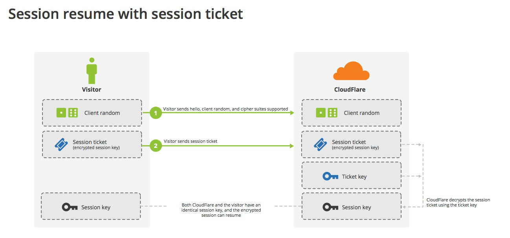
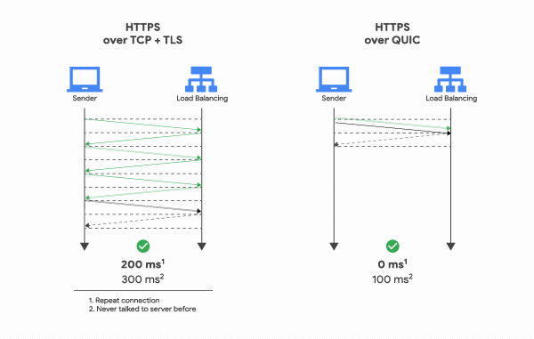
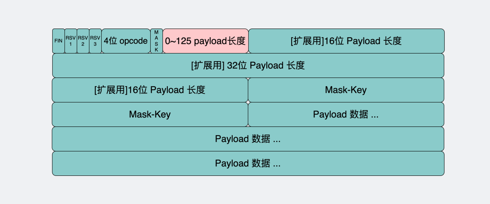
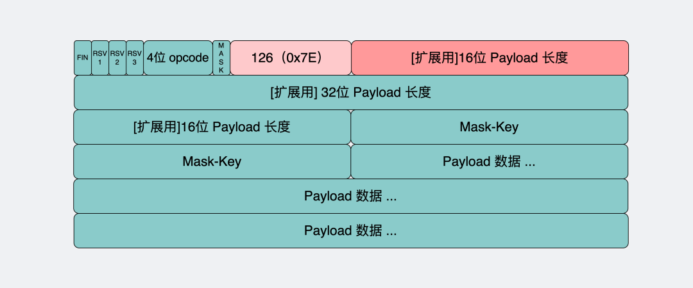

# 应用层


## HTTP 基本概念


### HTTP 是什么？

HTTP 是超文本传输协议，也就是**H**yperText **T**ransfer **P**rotocol。

> 能否详细解释「超文本传输协议」？


> 那「HTTP 是用于从互联网服务器传输超文本到本地浏览器的协议」，这种说法正确吗？


### HTTP 常见的状态码有哪些？


### HTTP 常见字段有哪些？


##  GET 与 POST


### GET 和 POST 有什么区别？


> GET 请求可以带 body 吗？


## HTTP 缓存技术


### HTTP 缓存有哪些实现


#### 什么是强制缓存？


---------------------------------------------------------------------------------------------------------------------------------------------------------


## HTTP/1.1 如何优化？

- *尽量避免发送 HTTP 请求*；
- *在需要发送 HTTP 请求时，考虑如何减少请求次数*；
- *减少服务器的 HTTP 响应的数据大小*；


### 如何避免发送 HTTP 请求？

##### 可以采取缓存的机制。

对于一些具有重复性的 HTTP 请求，比如每次请求得到的数据都一样的，我们可以把这对「请求-响应」的数据都**缓存在本地**，那么下次就直接读取本地的数据，不必在通过网络获取服务器的响应了，这样的话 HTTP/1.1 的性能肯定肉眼可见的提升。


##### 那缓存是如何做到的呢

客户端会把第一次请求以及响应的数据保存在本地磁盘上，其中将**请求的 URL 作为 key，而响应作为 value，两者形成映射关系。**

这样当后续发起相同的请求时，就可以先在本地磁盘上通过 key 查到对应的 value，也就是响应，如果找到了，就直接从本地读取该响应。毋庸置疑，读取本地磁盘的速度肯定比网络请求快得多，如下图：


##### 缓存的响应不是最新的，而客户端并不知情，那么该怎么办呢？

所以，服务器在发送 HTTP 响应时，会估算一个过期的时间，并把这个信息放到响应头部中，这样客户端在查看响应头部的信息时，一旦发现缓存的响应是过期的，则就会重新发送网络请求。

**如果客户端从第一次请求得到的响应头部中发现该响应过期了，客户端重新发送请求，假设服务器上的资源并没有变更，还是老样子，那么你觉得还要在服务器的响应带上这个资源吗？**

很显然不带的话，可以提高 HTTP 协议的性能

**只需要客户端在重新发送请求时，在请求的 `Etag` 头部带上第一次请求的响应头部中的摘要**，这个摘要是<u>唯一标识响应的资源</u>，当服务器收到请求后，会将本地资源的摘要与请求中的摘要做个比较。

如果不同，那么说明客户端的缓存已经没有价值，服务器在响应中带上最新的资源。

如果相同，说明客户端的缓存还是可以继续使用的，那么服务器**仅返回不含有包体的 `304 Not Modified` 响应**，告诉客户端仍然有效，这样就可以减少响应资源在网络中传输的延时，如下图：


**个人总结：**

当客户端第一次访问该url时，服务器可以返回一个响应，该响应的头部携带该资源的有效时间和 Etag（用来标识资源），客户端收到该资源时，会将其存储在本地；当客户端第二次访问该url时，其会先查看本地是否有缓存，如果有，查看其是否过期：

- 未过期，直接从本地的缓存获取该资源
- 已过期，向服务器发起请求，并在请求头部携带该资源的Etag，服务器收到该请求，会将该请求会服务器存储的资源进行对比：
  - Etag相同，服务器直接返回304响应，表示资源未修改，而不需携带资源
  - Etag不同，服务器重新发送该url对应的资源给客户端


### 如何减少 HTTP 请求次数？

减少 HTTP 请求次数自然也就提升了 HTTP 性能，可以从这 3 个方面入手：

- *减少重定向请求次数*；
- *合并请求*；
- *延迟发送请求*；


#### 减少重定向请求次数

##### 什么是**重定向请求**

服务器上的一个资源可能由于迁移、维护等原因从 url1 移至 url2 后，而客户端不知情，它还是继续请求 url1，这时服务器不能粗暴地返回错误，**而是通过 `302` 响应码和 `Location` 头部**，告诉客户端该资源已经迁移至 url2 了，于是客户端需要再发送 url2 请求以获得服务器的资源。

**那么，如果重定向请求越多，那么客户端就要多次发起 HTTP 请求，每一次的 HTTP 请求都得经过网络，这无疑会越降低网络性能。**

另外，服务端这一方往往不只有一台服务器，比如源服务器上一级是代理服务器，然后代理服务器才与客户端通信，这时客户端重定向就会导致客户端与代理服务器之间需要 2 次消息传递，如下图


##### 如何减少重定向请求次数

----------------

**个人总结**

对于重定向的url，每次客户端都要发起请求。而往往客户端和服务器中间还存在中间代理，这样就会导致重定向请求次数大大增加。可以通过以下方法来减少重定向次数：当服务器向中间代理返回302响应时，代理不先向客户端返回302响应，而是直接访问更新后的url2，然后才将获取到的资源返回给客户端，同时中间代理还可以存储重定向的连接。

----------------


可以将**重定向的工作交由代理服务器完成，就能减少 HTTP 请求次数了**，如下图：


而且当代理服务器知晓了重定向规则后，可以进一步减少消息传递次数，如下图：


除了 `302` 重定向响应码，还有其他一些重定向的响应码，你可以从下图看到：



其中，`301` 和 `308` 响应码是告诉客户端可以将重定向响应缓存到本地磁盘，之后客户端就自动用 url2 替代 url1 访问服务器的资源。


#### 合并请求

##### 什么是合并请求

---------------------

**合并请求的方式就是合并资源，以一个大资源的请求替换多个小资源的请求**。

但是这样的合并请求会带来新的问题，**当大资源中的某一个小资源发生变化后，客户端必须重新下载整个完整的大资源文件**，这显然带来了额外的网络消耗。

-----------------------------


如果把多个访问小文件的请求合并成一个大请求，虽然传输的资源一样，但是减少请求，**意味着减少了重复发送的HTTP头部**。 

由于HTTP/1.1使用的是请求响应模型，如果第一个发送的请求未得到响应，那么后续的请求就不会发送。所以为了防止阻塞，**浏览器一般会同时发送多个HTTP请求，每个请求都是不同的TCP连接**，那么如果合并了请求，也就**减少了TCP连接次数，因此省去了TCP握手和慢启动过程耗费的时间。**


##### 合并请求的几种方式

- 合并小图片：**通过将多个小图片合并成一个大图片来减少 HTTP 请求的次数，以减少 HTTP 请求的次数，从而减少网络的开销**。

有的网页会含有很多小图片、小图标，有多少个小图片，客户端就要发起多少次请求。那么对于这些小图片，我们可以考虑使用 `CSS Image Sprites` 技术把它们合成一个大图片，这样浏览器就可以用一次请求获得一个大图片，然后再根据 CSS 数据把大图片切割成多张小图片。


- 将图片的二进制数据用 `base64` 编码后，以 URL 的形式嵌入到 HTML 文件，跟随 HTML 文件一并发送


#### 延迟发送请求

一般 HTML 里会含有很多 HTTP 的 URL，当前不需要的资源，我们没必要也获取过来，于是可以通过「**按需获取**」的方式，来减少第一时间的 HTTP 请求次数。

请求网页的时候，没必要把全部资源都获取到，而是只获取当前用户所看到的页面资源，当用户向下滑动页面的时候，再向服务器获取接下来的资源，这样就达到了延迟发送请求的效果。


### 如何减少 HTTP 响应的数据大小？

对于 HTTP 的请求和响应，通常 HTTP 的响应的数据大小会比较大，也就是服务器返回的资源会比较大。于是，我们可以考虑对响应的资源进行**压缩**，这样就可以减少响应的数据大小，从而提高网络传输的效率。

压缩的方式一般分为 2 种，分别是：

- *无损压缩*；
- *有损压缩*；


#### 无损压缩

无损压缩是指资源经过压缩后，信息不被破坏，还能完全恢复到压缩前的原样，适合用在文本文件、程序可执行文件、程序源代码。

首先，我们针**对代码的语法规则进行压缩**，因为通常代码文件都有很多换行符或者空格，这些是为了帮助程序员更好的阅读，但是机器执行时并不要这些符，把这些多余的符号给去除掉。

接下来，就是无损压缩了，需要**对原始资源建立统计模型**，利用这个统计模型，将常出现的数据用较短的二进制比特序列表示，将不常出现的数据用较长的二进制比特序列表示，生成二进制比特序列一般是「霍夫曼编码」算法。

gzip 就是比较常见的无损压缩。客户端支持的压缩算法，会在 HTTP 请求中通过头部中的 `Accept-Encoding` 字段告诉服务器：

服务器收到后，会从中选择一个服务器支持的或者合适的压缩算法，然后使用此压缩算法对响应资源进行压缩，最后通过响应头部中的 `Content-Encoding` 字段告诉客户端该资源使用的压缩算法。

gzip 的压缩效率相比 Google 推出的 Brotli 算法还是差点意思，也就是上文中的 br，所以如果可以，服务器应该选择压缩效率更高的 br 压缩算法。


#### 有损压缩

与无损压缩相对的就是有损压缩，经过此方法压缩，解压的数据会与原始数据不同但是非常接近。

有损压缩主要将次要的数据舍弃，牺牲一些质量来减少数据量、提高压缩比，这种方法经常用于压缩多媒体数据，比如音频、视频、图片。

可以通过 HTTP 请求头部中的 `Accept` 字段里的「 q 质量因子」，告诉服务器期望的资源质量。

- 关于图片的压缩，目前压缩比较高的是 Google 推出的 **WebP 格式**，它与常见的 Png 格式图片的压缩比例对比：可以发现，相同图片质量下，WebP 格式的图片大小都比 Png 格式的图片小，所以对于大量图片的网站，可以考虑使用 WebP 格式的图片，这将大幅度提升网络传输的性能。
- 关于音视频的压缩，音视频主要是动态的，每个帧都有时序的关系，**通常时间连续的帧之间的变化是很小的**。如，一个在看书的视频，画面通常只有人物的手和书桌上的书是会有变化的，而其他地方通常都是静态的，于是只需要在一个静态的关键帧，使用**增量数据**来表达后续的帧，这样便减少了很多数据，提高了网络传输的性能。对于视频常见的编码格式有 H264、H265 等，音频常见的编码格式有 AAC、AC3。


### 总结

这次主要从 3 个方面介绍了优化 HTTP/1.1 协议的思路。

第一个思路是，通过缓存技术来避免发送 HTTP 请求。客户端收到第一个请求的响应后，可以将其缓存在本地磁盘，下次请求的时候，如果缓存没过期，就直接读取本地缓存的响应数据。如果缓存过期，客户端发送请求的时候带上响应数据的摘要，服务器比对后发现资源没有变化，就发出不带包体的 304 响应，告诉客户端缓存的响应仍然有效。

第二个思路是，减少 HTTP 请求的次数，有以下的方法：

1. 将原本由客户端处理的重定向请求，交给代理服务器处理，这样可以减少重定向请求的次数；
2. 将多个小资源合并成一个大资源再传输，能够减少 HTTP 请求次数以及 头部的重复传输，再来减少 TCP 连接数量，进而省去 TCP 握手和慢启动的网络消耗；
3. 按需访问资源，只访问当前用户看得到/用得到的资源，当客户往下滑动，再访问接下来的资源，以此达到延迟请求，也就减少了同一时间的 HTTP 请求次数。

第三思路是，通过压缩响应资源，降低传输资源的大小，从而提高传输效率，所以应当选择更优秀的压缩算法。


-------------------------------------------------------------------------------------------------------------------


## HTTPS RSA 握手解析


### TLS 握手过程

HTTP 由于是明文传输，所谓的明文，就是说客户端与服务端通信的信息都是肉眼可见的，随意使用一个抓包工具都可以截获通信的内容。

所以安全上存在以下三个风险：

- *窃听风险*，比如通信链路上可以获取通信内容，用户号容易没。
- *篡改风险*，比如强制植入垃圾广告，视觉污染，用户眼容易瞎。
- *冒充风险*，比如冒充淘宝网站，用户钱容易没。

HTTP**S** 在 HTTP 与 TCP 层之间加入了 TLS 协议，来解决上述的风险。


TLS 协议是如何解决 HTTP 的风险的呢？

- *信息加密*： HTTP 交互信息是被加密的，第三方就无法被窃取；
- *校验机制*：校验信息传输过程中是否有被第三方篡改过，如果被篡改过，则会有警告提示；
- *身份证书*：证明淘宝是真的淘宝网；

可见，有了 TLS 协议，能保证 HTTP 通信是安全的了，那么在进行 HTTP 通信前，需要先进行 TLS 握手。TLS 的握手过程，如下图：


上图简要概述了 TLS 的握手过程，其中每一个「框」都是一个记录（*record*），记录是 TLS 收发数据的基本单位，类似于 TCP 里的 segment。多个记录可以组合成一个 TCP 包发送，所以**通常经过「四个消息」就可以完成 TLS 握手，也就是需要 2个 RTT 的时延**，然后就可以在安全的通信环境里发送 HTTP 报文，实现 HTTPS 协议。

所以可以发现，HTTPS 是应用层协议，需要先完成 TCP 连接建立，然后走 TLS 握手过程后，才能建立通信安全的连接。

事实上，不同的密钥交换算法，TLS 的握手过程可能会有一些区别。

这里先简单介绍下密钥交换算法，因为考虑到性能的问题，所以双方在加密应用信息时使用的是对称加密密钥，而对称加密密钥是不能被泄漏的，为了保证对称加密密钥的安全性，所以使用非对称加密的方式来保护对称加密密钥的协商，这个工作就是密钥交换算法负责的。


### RSA 握手过程

传统的 TLS 握手基本都是使用 RSA 算法来实现密钥交换的，在将 TLS 证书部署服务端时，证书文件其实就是服务端的公钥，会在 TLS 握手阶段传递给客户端，而服务端的私钥则一直留在服务端，一定要确保私钥不能被窃取。

在 RSA 密钥协商算法中，客户端会生成随机密钥，并使用服务端的公钥加密后再传给服务端。根据非对称加密算法，公钥加密的消息仅能通过私钥解密，这样服务端解密后，双方就得到了相同的密钥，再用它加密应用消息。


#### TLS 第一次握手

客户端首先会发一个「**Client Hello**」消息，字面意思我们也能理解到，这是跟服务器「打招呼」。



消息里面有客户端使用的 TLS 版本号、支持的密码套件列表，以及生成的**随机数（Client Random）**，这个随机数会被服务端保留，它是生成对称加密密钥的材料之一。


#### TLS 第二次握手

当服务端收到客户端的「Client Hello」消息后，会确认 TLS 版本号是否支持，和从密码套件列表中选择一个密码套件，以及生成**随机数（Server Random）**。

接着，返回「**Server Hello**」消息，消息里面有服务器确认的 TLS 版本号，也给出了随机数（Server Random），然后从客户端的密码套件列表选择了一个合适的密码套件。



可以看到，服务端选择的密码套件是 “Cipher Suite: TLS_RSA_WITH_AES_128_GCM_SHA256”。

这个密码套件看起来真让人头晕，好一大串，但是其实它是有固定格式和规范的。基本的形式是「**密钥交换算法 + 签名算法 + 对称加密算法 + 摘要算法**」， 一般 WITH 单词前面有两个单词，第一个单词是约定密钥交换的算法，第二个单词是约定证书的验证算法。比如刚才的密码套件的意思就是：

- 由于 WITH 单词只有一个 RSA，则说明握手时密钥交换算法和签名算法都是使用 RSA；
- 握手后的通信使用 AES 对称算法，密钥长度 128 位，分组模式是 GCM；
- 摘要算法 SHA256 用于消息认证和产生随机数；

就前面这两个客户端和服务端相互「打招呼」的过程，客户端和服务端就已确认了 TLS 版本和使用的密码套件，而且你可能发现客户端和服务端都会各自生成一个随机数，并且还会把随机数传递给对方。

那这个随机数有啥用呢？其实这两个随机数是后续作为生成「会话密钥」的条件，所谓的会话密钥就是数据传输时，所使用的对称加密密钥。

然后，服务端为了证明自己的身份，会发送「**Server Certificate**」给客户端，这个消息里含有数字证书。


随后，服务端发了「**Server Hello Done**」消息，目的是告诉客户端，我已经把该给你的东西都给你了，本次打招呼完毕。


#### TLS 第三次握手

客户端验证完证书后，认为可信则继续往下走。

接着，客户端就会生成一个新的**随机数 (\*pre-master\*)**，用服务器的 RSA 公钥加密该随机数，通过「**Client Key Exchange**」消息传给服务端。


服务端收到后，用 RSA 私钥解密，得到客户端发来的随机数 (pre-master)。

至此，**客户端和服务端双方都共享了三个随机数，分别是 Client Random、Server Random、pre-master**。

于是，双方根据已经得到的三个随机数，生成**会话密钥（Master Secret）**，它是对称密钥，用于对后续的 HTTP 请求/响应的数据加解密。

生成完「会话密钥」后，然后客户端发一个「**Change Cipher Spec**」，告诉服务端开始使用加密方式发送消息。


然后，客户端再发一个「**Encrypted Handshake Message（Finishd）**」消息，把之前所有发送的数据做个**摘要**，再用会话密钥（master secret）加密一下，让服务器做个验证，验证加密通信「是否可用」和「之前握手信息是否有被中途篡改过」。


可以发现，「Change Cipher Spec」之前传输的 TLS 握手数据都是明文，之后都是对称密钥加密的密文。


#### TLS 第四次握手

服务器也是同样的操作，发「**Change Cipher Spec**」和「**Encrypted Handshake Message**」消息，如果双方都验证加密和解密没问题，那么握手正式完成。

最后，就用「会话密钥」加解密 HTTP 请求和响应了。


### RSA 算法的缺陷

**使用 RSA 密钥协商算法的最大问题是不支持前向保密**。

因为客户端传递随机数（用于生成对称加密密钥的条件之一）给服务端时使用的是公钥加密的，服务端收到后，会用私钥解密得到随机数。所以一旦服务端的私钥泄漏了，过去被第三方截获的所有 TLS 通讯密文都会被破解（**前向安全**或**前向保密**（英语：Forward Secrecy，缩写：FS），有时也被称为**完美前向安全** [1] （英语：Perfect Forward Secrecy，缩写：PFS），是[密码学](https://baike.baidu.com/item/密码学/480001?fromModule=lemma_inlink)中通讯协议的安全属性，指的是长期使用的主[密钥](https://baike.baidu.com/item/密钥?fromModule=lemma_inlink)泄漏不会导致过去的[会话密钥](https://baike.baidu.com/item/会话密钥/8831495?fromModule=lemma_inlink)泄漏。）。

为了解决这个问题，后面就出现了 ECDHE 密钥协商算法，我们现在大多数网站使用的正是 ECDHE 密钥协商算法。


### 客户端验证证书

在这里刹个车，客户端拿到了服务端的数字证书后，要怎么校验该数字证书是真实有效的呢？

#### [#](https://xiaolincoding.com/network/2_http/https_rsa.html#数字证书和-ca-机构)数字证书和 CA 机构

在说校验数字证书是否可信的过程前，我们先来看看数字证书是什么，一个数字证书通常包含了：

- 公钥；
- 持有者信息；
- 证书认证机构（CA）的信息；
- CA 对这份文件的数字签名及使用的算法；
- 证书有效期；
- 还有一些其他额外信息；

那数字证书的作用，是用来认证公钥持有者的身份，以防止第三方进行冒充。说简单些，证书就是用来告诉客户端，该服务端是否是合法的，因为只有证书合法，才代表服务端身份是可信的。

我们用证书来认证公钥持有者的身份（服务端的身份），那证书又是怎么来的？又该怎么认证证书呢？

为了让服务端的公钥被大家信任，服务端的证书都是由 CA （*Certificate Authority*，证书认证机构）签名的，CA 就是网络世界里的公安局、公证中心，具有极高的可信度，所以由它来给各个公钥签名，信任的一方签发的证书，那必然证书也是被信任的。

之所以要签名，是因为签名的作用可以避免中间人在获取证书时对证书内容的篡改。

#### [#](https://xiaolincoding.com/network/2_http/https_rsa.html#数字证书签发和验证流程)数字证书签发和验证流程

如下图图所示，为数字证书签发和验证流程：


CA 签发证书的过程，如上图左边部分：

- 首先 CA 会把持有者的公钥、用途、颁发者、有效时间等信息打成一个包，然后对这些信息进行 Hash 计算，得到一个 Hash 值；
- 然后 CA 会使用自己的私钥将该 Hash 值加密，生成 Certificate Signature，也就是 CA 对证书做了签名；
- 最后将 Certificate Signature 添加在文件证书上，形成数字证书；

客户端校验服务端的数字证书的过程，如上图右边部分：

- 首先客户端会使用同样的 Hash 算法获取该证书的 Hash 值 H1；
- 通常浏览器和操作系统中集成了 CA 的公钥信息，浏览器收到证书后可以使用 CA 的公钥解密 Certificate Signature 内容，得到一个 Hash 值 H2 ；
- 最后比较 H1 和 H2，如果值相同，则为可信赖的证书，否则则认为证书不可信。

#### [#](https://xiaolincoding.com/network/2_http/https_rsa.html#证书链)证书链

但事实上，证书的验证过程中还存在一个证书信任链的问题，因为我们向 CA 申请的证书一般不是根证书签发的，而是由中间证书签发的，比如百度的证书，从下图你可以看到，证书的层级有三级：


对于这种三级层级关系的证书的验证过程如下：

- 客户端收到 baidu.com 的证书后，发现这个证书的签发者不是根证书，就无法根据本地已有的根证书中的公钥去验证 baidu.com 证书是否可信。于是，客户端根据 baidu.com 证书中的签发者，找到该证书的颁发机构是 “GlobalSign Organization Validation CA - SHA256 - G2”，然后向 CA 请求该中间证书。
- 请求到证书后发现 “GlobalSign Organization Validation CA - SHA256 - G2” 证书是由 “GlobalSign Root CA” 签发的，由于 “GlobalSign Root CA” 没有再上级签发机构，说明它是根证书，也就是自签证书。应用软件会检查此证书有否已预载于根证书清单上，如果有，则可以利用根证书中的公钥去验证 “GlobalSign Organization Validation CA - SHA256 - G2” 证书，如果发现验证通过，就认为该中间证书是可信的。
- “GlobalSign Organization Validation CA - SHA256 - G2” 证书被信任后，可以使用 “GlobalSign Organization Validation CA - SHA256 - G2” 证书中的公钥去验证 baidu.com 证书的可信性，如果验证通过，就可以信任 baidu.com 证书。

在这四个步骤中，最开始客户端只信任根证书 GlobalSign Root CA 证书的，然后 “GlobalSign Root CA” 证书信任 “GlobalSign Organization Validation CA - SHA256 - G2” 证书，而 “GlobalSign Organization Validation CA - SHA256 - G2” 证书又信任 baidu.com 证书，于是客户端也信任 baidu.com 证书。

总括来说，由于用户信任 GlobalSign，所以由 GlobalSign 所担保的 baidu.com 可以被信任，另外由于用户信任操作系统或浏览器的软件商，所以由软件商预载了根证书的 GlobalSign 都可被信任。


操作系统里一般都会内置一些根证书，比如我的 MAC 电脑里内置的根证书有这么多：


这样的一层层地验证就构成了一条信任链路，整个证书信任链验证流程如下图所示：


最后一个问题，为什么需要证书链这么麻烦的流程？Root CA 为什么不直接颁发证书，而是要搞那么多中间层级呢？

这是为了确保根证书的绝对安全性，将根证书隔离地越严格越好，不然根证书如果失守了，那么整个信任链都会有问题。


-------------------------------


## HTTPS ECDHE 握手解析

HTTPS 常用的密钥交换算法有两种，分别是 RSA 和 ECDHE 算法。

其中，RSA 是比较传统的密钥交换算法，它不具备前向安全的性质（服务器的私钥泄露时，之前使用该密钥进行传输的数据会被破解），因此现在很少服务器使用的。而 ECDHE 算法具有前向安全，所以被广泛使用。


### 离散对数

ECDHE 密钥协商算法是 DH 算法演进过来的，所以我们先从 DH 算法说起。

DH 算法是非对称加密算法， 因此它可以用于密钥交换，该算法的核心数学思想是**离散对数**。

是不是听到这个数学概念就怂了？不怕，这次不会说离散对数推导的过程，只简单提一下它的数学公式。

离散对数是「离散 + 对数」的两个数学概念的组合，所以我们先来复习一遍对数。

要说起对数，必然要说指数，因为它们是互为反函数，指数就是幂运算，对数是指数的逆运算。

举个栗子，如果以 2 作为底数，那么指数和对数运算公式，如下图所示：


那么对于底数为 2 的时候， 32 的对数是 5，64 的对数是 6，计算过程如下：


对数运算的取值是可以连续的，而离散对数的取值是不能连续的，因此也以「离散」得名，

离散对数是在对数运算的基础上加了「模运算」，也就说取余数，对应编程语言的操作符是「%」，也可以用 mod 表示。离散对数的概念如下图：


上图的，底数 a 和模数 p 是离散对数的公共参数，也就说是公开的，b 是真数，i 是对数。知道了对数，就可以用上面的公式计算出真数。但反过来，知道真数却很难推算出对数。

**特别是当模数 p 是一个很大的质数，即使知道底数 a 和真数 b ，在现有的计算机的计算水平是几乎无法算出离散对数的，这就是 DH 算法的数学基础。**


### DH 算法

认识了离散对数，我们来看看 DH 算法是如何密钥交换的。

现假设小红和小明约定使用 DH 算法来交换密钥，那么基于离散对数，小红和小明需要先确定模数和底数作为算法的参数，这两个参数是公开的，用 P 和 G 来代称。

然后小红和小明各自生成一个随机整数作为**私钥**，双方的私钥要各自严格保管，不能泄漏，小红的私钥用 a 代称，小明的私钥用 b 代称。

现在小红和小明双方都有了 P 和 G 以及各自的私钥，于是就可以计算出**公钥**：

- 小红的公钥记作 A，A = G ^ a ( mod P )；
- 小明的公钥记作 B，B = G ^ b ( mod P )；

A 和 B 也是公开的，因为根据离散对数的原理，从真数（A 和 B）反向计算对数 a 和 b 是非常困难的，至少在现有计算机的计算能力是无法破解的，如果量子计算机出来了，那就有可能被破解，当然如果量子计算机真的出来了，那么密钥协商算法就要做大的升级了。

双方交换各自 DH 公钥后，小红手上共有 5 个数：P、G、a、A、B，小明手上也同样共有 5 个数：P、G、b、B、A。

然后小红执行运算： B ^ a ( mod P )，其结果为 K，因为离散对数的幂运算有交换律，所以小明执行运算： A ^ b ( mod P )，得到的结果也是 K。


这个 K 就是小红和小明之间用的**对称加密密钥**，可以作为会话密钥使用。

可以看到，整个密钥协商过程中，小红和小明公开了 4 个信息：P、G、A、B，其中 P、G 是算法的参数，A 和 B 是公钥，而 a、b 是双方各自保管的私钥，黑客无法获取这 2 个私钥，因此黑客只能从公开的 P、G、A、B 入手，计算出离散对数（私钥）。

前面也多次强调， 根据离散对数的原理，如果 P 是一个大数，在现有的计算机的计算能力是很难破解出 私钥 a、b 的，破解不出私钥，也就无法计算出会话密钥，因此 DH 密钥交换是安全的。


### DHE 算法

根据私钥生成的方式，DH 算法分为两种实现：

- static DH 算法，这个是已经被废弃了；
- DHE 算法，现在常用的；

**static DH 算法里有一方的私钥是静态的，**也就说每次密钥协商的时候有一方的私钥都是一样的，一般是服务器方固定，即 a 不变，客户端的私钥则是随机生成的。

于是，DH 交换密钥时就只有客户端的公钥是变化，而服务端公钥是不变的，那么随着时间延长，黑客就会截获海量的密钥协商过程的数据，因为密钥协商的过程有些数据是公开的，黑客就可以依据这些数据暴力破解出服务器的私钥，然后就可以计算出会话密钥了，于是之前截获的加密数据会被破解，所以 **static DH 算法不具备前向安全性**。

**既然固定一方的私钥有被破解的风险，那么干脆就让双方的私钥在每次密钥交换通信时，都是随机生成的、临时的，这个方式也就是 DHE 算法，E 全称是 ephemeral（临时性的）。**

所以，即使有个牛逼的黑客破解了某一次通信过程的私钥，其他通信过程的私钥仍然是安全的，因为**每个通信过程的私钥都是没有任何关系的，都是独立的，这样就保证了「前向安全」**。


### ECDHE 算法

**DHE 算法由于计算性能不佳，因为需要做大量的乘法（指数运算**），为了提升 DHE 算法的性能，所以就出现了现在广泛用于密钥交换算法 —— **ECDHE 算法**。

ECDHE 算法是在 DHE 算法的基础上利用了 ECC 椭圆曲线特性，可以用更少的计算量（只进行一次乘法）计算出公钥，以及最终的会话密钥。

小红和小明使用 ECDHE 密钥交换算法的过程：

- 双方事先确定好使用哪种椭圆曲线，和曲线上的基点 G (x0, y0)，这两个参数都是公开的；
- 双方各自随机生成一个随机数作为**私钥d**，并与基点 G相乘得到**公钥Q**（Q = dG），Q的坐标可记为(xq, yq)，此时小红的公私钥为 Q1 和 d1，小明的公私钥为 Q2 和 d2；
- 双方交换各自的公钥，最后小红计算点（x1，y1） = d1Q2，小明计算点（x2，y2） = d2Q1，由于椭圆曲线上是可以满足乘法交换和结合律，所以 H = d1Q2 = d1d2G = d2d1G = d2Q1 ，因此**双方的 x (H的y的坐标也一样)坐标是一样的，所以它是共享密钥，也就是会话密钥**。

**这个过程中，双方的私钥都是随机、临时生成的，都是不公开的，即使根据公开的信息（椭圆曲线、公钥、基点 G）也是很难计算出椭圆曲线上的离散对数（私钥）。**


### ECDHE 握手过程

用 Wireshark 工具抓了用 ECDHE 密钥协商算法的 TSL 握手过程，可以看到是四次握手：


细心的小伙伴应该发现了，**使用了 ECDHE，在 TLS 第四次握手前，客户端就已经发送了加密的 HTTP 数据**（图中的Application Data），而对于 RSA 握手过程，必须要完成 TLS 四次握手，才能传输应用数据。

所以，**ECDHE 相比 RSA 握手过程省去了一个消息往返的时间**，这个有点「抢跑」的意思，它被称为是「*TLS False Start*」，跟「*TCP Fast Open*」有点像，都是在还没连接完全建立前，就发送了应用数据，这样便提高了传输的效率。

接下来，分析每一个 ECDHE 握手过程。


#### TLS 第一次握手

客户端首先会发一个「**Client Hello**」消息，消息里面有客户端使用的 TLS 版本号、支持的密码套件列表，==以及生成的**随机数（Client Random）**==。


#### TLS 第二次握手

服务端收到客户端的「打招呼」，同样也要回礼，会返回「**Server Hello**」消息，消息面有服务器确认的 TLS 版本号，也给出了一个==**随机数（Server Random）**==，然后从客户端的密码套件列表选择了一个合适的密码套件。


不过，这次选择的密码套件就和 RSA 不一样了，我们来分析一下这次的密码套件的意思。

「 TLS_ECDHE_RSA_WITH_AES_256_GCM_SHA384」

- 密钥协商算法使用 ECDHE；
- 签名算法使用 RSA；
- 握手后的通信使用 AES 对称算法，密钥长度 256 位，分组模式是 GCM；
- 摘要算法使用 SHA384；

接着，服务端为了证明自己的身份，发送「**Certificate**」消息，会把证书也发给客户端。


这一步就和 RSA 握手过程有很大的区别了（*RSA要到第三次握手时才可以获得生成对称密钥的所有材料，由客户端根据第一次握手时生成的client random，第二次握手时服务器发来的server random，以及第三次握手时，客户端生成的pre-master来生成对称密钥*），==因为服务端选择了 ECDHE 密钥协商算法，所以会在发送完证书后，发送「**Server Key Exchange**」消息==。


这个过程服务器做了三件事：

- 选择了**名为 x25519 的椭圆曲线**，选好了椭圆曲线相当于椭圆曲线基点 G 也定好了，这些都会公开给客户端；
- 生成随机数作为服务端椭圆曲线的私钥，保留到本地；
- 根据基点 G 和私钥计算出**服务端的椭圆曲线公钥**，这个会公开给客户端。

**为了保证这个椭圆曲线的公钥不被第三方篡改，服务端会用 RSA 签名算法给服务端的椭圆曲线公钥做个签名。**

随后，就是「**Server Hello Done**」消息，服务端跟客户端表明：“这些就是我提供的信息，打招呼完毕”。


至此，TLS 两次握手就已经完成了，目前客户端和服务端通过明文共享了这几个信息：**Client Random、Server Random 、使用的椭圆曲线、椭圆曲线基点 G、服务端椭圆曲线的公钥**，这几个信息很重要，是后续生成会话密钥的材料。


#### TLS 第三次握手

客户端收到了服务端的证书后，自然要校验证书是否合法，如果证书合法，那么服务端到身份就是没问题的。校验证书的过程会走证书链逐级验证，确认证书的真实性，再用证书的公钥验证签名，这样就能确认服务端的身份了，确认无误后，就可以继续往下走。

客户端会生成一个随机数作为客户端椭圆曲线的私钥，然后再根据服务端前面给的信息，生成**客户端的椭圆曲线公钥**，然后用「**Client Key Exchange**」消息发给服务端。


至此，双方都有对方的椭圆曲线公钥、自己的椭圆曲线私钥、椭圆曲线基点 G。于是，双方都就计算出点（x，y），其中 x 坐标值双方都是一样的，前面说 ECDHE 算法时候，说 x 是会话密钥，**但实际应用中，x 还不是最终的会话密钥**。

还记得 TLS 握手阶段，客户端和服务端都会生成了一个随机数传递给对方吗？

**最终的会话密钥，就是用「客户端随机数 + 服务端随机数 + x（ECDHE 算法算出的共享密钥） 」三个材料生成的**。

之所以这么麻烦，是因为 TLS 设计者不信任客户端或服务器「伪随机数」的可靠性，为了保证真正的完全随机，把三个不可靠的随机数混合起来，那么「随机」的程度就非常高了，足够让黑客计算不出最终的会话密钥，安全性更高。

算好会话密钥后，客户端会发一个「**Change Cipher Spec**」消息，告诉服务端后续改用对称算法加密通信。


接着，客户端会发「**Encrypted Handshake Message**」消息，把之前发送的数据做一个摘要，再用对称密钥加密一下，让服务端做个验证，验证下本次生成的对称密钥是否可以正常使用。


#### TLS 第四次握手

最后，服务端也会有一个同样的操作，发「**Change Cipher Spec**」和「**Encrypted Handshake Message**」消息，如果双方都验证加密和解密没问题，那么握手正式完成。于是，就可以正常收发加密的 HTTP 请求和响应了。


### 总结

RSA 和 ECDHE 握手过程的区别：

- RSA 密钥协商算法「不支持」前向保密，ECDHE 密钥协商算法「支持」前向保密；
- 使用了 RSA 密钥协商算法，TLS 完成四次握手后，才能进行应用数据传输，而对于 ECDHE 算法，客户端可以不用等服务端的最后一次 TLS 握手，就可以提前发出加密的 HTTP 数据，节省了一个消息的往返时间（这个是 RFC 文档规定的，具体原因文档没有说明，所以这点我也不太明白）；
- 使用 ECDHE， 在 TLS 第 2 次握手中，会出现服务器端发出的「Server Key Exchange」消息，而 RSA 握手过程没有该消息；


----------------------------------------------


## HTTPS 如何优化？

由裸数据传输的 HTTP 协议转成加密数据传输的 HTTPS 协议，给应用数据套了个「保护伞」，提高安全性的同时也带来了性能消耗。

因为 HTTPS 相比 HTTP 协议多一个 TLS 协议握手过程，**目的是为了通过非对称加密握手协商或者交换出对称加密密钥**，这个过程最长可以花费掉 2 RTT，接着后续传输的应用数据都得使用对称加密密钥来加密/解密。

为了数据的安全性，我们不得不使用 HTTPS 协议，至今大部分网址都已从 HTTP 迁移至 HTTPS 协议，因此针对 HTTPS 的优化是非常重要的。

这次，就从多个角度来优化 HTTPS。


### 分析性能损耗

产生性能消耗的两个环节：

- 第一个环节， TLS 协议握手过程；
- 第二个环节，握手后的对称加密报文传输。

对于第二环节，现在主流的对称加密算法 AES、ChaCha20 性能都是不错的，而且一些 CPU 厂商还针对它们做了硬件级别的优化，因此这个环节的性能消耗可以说非常地小。

而第一个环节，TLS 协议握手过程不仅增加了网络延时（最长可以花费掉 2 RTT），而且握手过程中的一些步骤也会产生性能损耗，比如：

- 对于 ECDHE 密钥协商算法，握手过程中会客户端和服务端都需要临时生成椭圆曲线公私钥；
- 客户端验证证书时，会访问 CA 获取 CRL 或者 OCSP，目的是验证服务器的证书是否有被吊销；
- 双方计算 Pre-Master，也就是对称加密密钥；

为了大家更清楚这些步骤在 TLS 协议握手的哪一个阶段，我画出了这幅图：


### 硬件优化

**HTTPS 协议是计算密集型，而不是 I/O 密集型**，所以不能把钱花在网卡、硬盘等地方，应该花在 CPU 上。一个好的 CPU，可以提高计算性能，因为 HTTPS 连接过程中就有大量需要计算密钥的过程，所以这样可以加速 TLS 握手过程。另外，如果可以，应该选择可以**支持 AES-NI 特性的 CPU**，因为这种款式的 CPU 能在指令级别优化了 AES 算法，这样便加速了数据的加解密传输过程。


### 软件优化

如果公司预算充足对于新的服务器是可以考虑购买更好的 CPU，但是对于已经在使用的服务器，硬件优化的方式可能就不太适合了，于是就要从软件的方向来优化了。

软件的优化方向可以分层两种，一个是**软件升级**，一个是**协议优化**。


#### 软件升级

先说第一个软件升级，软件升级就是将正在使用的软件升级到最新版本，因为最新版本不仅提供了最新的特性，也优化了以前软件的问题或性能。

但看似简单的软件升级，对于有成百上千服务器的公司来说，软件升级也跟硬件升级同样是一个棘手的问题，因为要实行软件升级，会花费时间和人力，同时也存在一定的风险，也可能会影响正常的线上服务。


### 协议优化

协议的优化就是对「密钥交换过程」进行优化。


#### 密钥交换算法优化

TLS 1.2 版本如果使用的是 RSA 密钥交换算法，那么需要 4 次握手，也就是要花费 2 RTT，才可以进行应用数据的传输，而且 RSA 密钥交换算法不具备前向安全性。

总之使用 **RSA 密钥交换算法的 TLS 握手过程，不仅慢，而且安全性也不高**。

因此如果可以，尽量**选用 ECDHE 密钥交换**算法替换 RSA 算法，因为该算法由于支持「False Start」，它是 “抢跑” 的意思，客户端可以在 TLS 协议的第 3 次握手后，第 4 次握手前，发送加密的应用数据，以此将 **TLS 握手的消息往返由 2 RTT 减少到 1 RTT，而且安全性也高，具备前向安全性**。

ECDHE 算法是基于椭圆曲线实现的，不同的椭圆曲线性能也不同，应该尽量**选择 x25519 曲线**，该曲线是目前最快的椭圆曲线。

对于对称加密算法方面，如果对安全性不是特别高的要求，可以**选用 AES_128_GCM**，它比 AES_256_GCM 快一些，因为密钥的长度短一些。


#### TLS 升级

当然，如果可以，直接把 TLS 1.2 升级成 TLS 1.3，TLS 1.3 大幅度简化了握手的步骤，**完成 TLS 握手只要 1 RTT**，而且安全性更高。

在 TLS 1.2 的握手中，一般是需要 4 次握手，先要通过 Client Hello （第 1 次握手）和 Server Hello（第 2 次握手） 消息协商出后续使用的加密算法，再互相交换公钥（第 3 和 第 4 次握手），然后计算出最终的会话密钥，下图的左边部分就是 TLS 1.2 的握手过程：


上图的右边部分就是 TLS 1.3 的握手过程，可以发现 **TLS 1.3 把 Hello 和公钥交换这两个消息合并成了一个消息，于是这样就减少到只需 1 RTT 就能完成 TLS 握手**。

怎么合并的呢？**具体的做法是，客户端在 Client Hello 消息里带上了支持的椭圆曲线，以及这些椭圆曲线对应的公钥。服务端收到后，选定一个椭圆曲线等参数，然后返回消息时，带上服务端这边的公钥。**经过这 1 个 RTT，双方手上已经有生成会话密钥的材料了，于是客户端计算出会话密钥，就可以进行应用数据的加密传输了。而且，TLS1.3 对密码套件进行 “减肥” 了， **对于密钥交换算法，废除了不支持前向安全性的 RSA 和 DH 算法，只支持 ECDHE 算法**。

之所以 TLS1.3 仅支持这么少的密码套件，是因为 TLS1.2 由于支持各种古老且不安全的密码套件，中间人可以利用降级攻击，伪造客户端的 Client Hello 消息，替换客户端支持的密码套件为一些不安全的密码套件，使得服务器被迫使用这个密码套件进行 HTTPS 连接，从而破解密文。


#### 证书优化

为了验证的服务器的身份，服务器会在 TLS 握手过程中，把自己的证书发给客户端，以此证明自己身份是可信的。

对于证书的优化，可以有两个方向：

- 一个是**证书传输**：要让证书更便于传输，那必然是减少证书的大小，这样可以节约带宽，也能减少客户端的运算量。所以，**对于服务器的证书应该选择椭圆曲线（ECDSA）证书，而不是 RSA 证书，因为在相同安全强度下， ECC 密钥长度比 RSA 短的多**。
- 一个是**证书验证**：客户端在验证证书时，是个复杂的过程，会走证书链逐级验证，验证的过程不仅需要「用 CA 公钥解密证书」以及「用签名算法验证证书的完整性」，而且为了知道证书是否被 CA 吊销，客户端有时还会再去访问 CA， 下载 CRL 或者 OCSP 数据，以此确认证书的有效性。这个访问过程是 HTTP 访问，因此又会产生一系列网络通信的开销，如 DNS 查询、建立连接、收发数据等。

##### ①CRL（类似黑名单）

CRL 称为证书吊销列表（*Certificate Revocation List*），这个列表是由 CA 定期更新，列表内容都是被撤销信任的证书序号，如果服务器的证书在此列表，就认为证书已经失效，不在的话，则认为证书是有效的。


但是 CRL 存在两个问题：

- 第一个问题，由于 CRL 列表是由 CA 维护的，定期更新，如果一个证书刚被吊销后，客户端在更新 CRL 之前还是会信任这个证书，**实时性较差**；
- 第二个问题，**随着吊销证书的增多，列表会越来越大，下载的速度就会越慢**，下载完客户端还得遍历这么大的列表，那么就会导致客户端在校验证书这一环节的延时很大，进而拖慢了 HTTPS 连接。


##### ②OCSP（有效性查询）

因此，现在基本都是使用 OCSP ，名为在线证书状态协议（*Online Certificate Status Protocol*）来查询证书的有效性，它的工作方式是**向 CA 发送查询请求，让 CA 返回证书的有效状态**。


不必像 CRL 方式客户端需要下载大大的列表，还要从列表查询，同时因为可以实时查询每一张证书的有效性，解决了 CRL 的实时性问题。

OCSP 需要向 CA 查询，因此也是要发生网络请求，而且还得看 CA 服务器的 “脸色”，**如果网络状态不好，或者 CA 服务器繁忙，也会导致客户端在校验证书这一环节的延时变大。**

**OCSP Stapling**：于是为了解决这一个网络开销，就出现了 OCSP Stapling（让服务器去查询），其原理是：服务器向 CA 周期性地查询证书状态，获得一个带有时间戳和签名的响应结果并缓存它。


当有客户端发起连接请求时，服务器会把这个「响应结果」在 TLS 握手过程中发给客户端。**由于有签名的存在，服务器无法篡改**，因此客户端就能得知证书是否已被吊销了，这样客户端就不需要再去查询。


### 会话复用

TLS 握手的目的就是为了协商出会话密钥，也就是对称加密密钥，那我们如果我们把首次 TLS 握手协商的对称加密密钥缓存起来，待下次需要建立 HTTPS 连接时，直接「复用」这个密钥，不就减少 TLS 握手的性能损耗了吗？

这种方式就是**会话复用**（*TLS session resumption*），会话复用分两种：

- 第一种叫 Session ID；
- 第二种叫 Session Ticket；


#### Session ID

Session ID 的工作原理是，**客户端和服务器首次 TLS 握手连接后，双方会在内存缓存会话密钥，并用唯一的 Session ID 来标识**，Session ID 和会话密钥相当于 key-value 的关系。

当客户端再次连接时，hello 消息里会带上 Session ID，服务器收到后就会从内存找，如果找到就直接用该会话密钥恢复会话状态，跳过其余的过程，只用一个消息往返就可以建立安全通信。当然为了安全性，内存中的会话密钥会定期失效。


但是它有两个缺点：

- 服务器必须保持每一个客户端的会话密钥，随着客户端的增多，**服务器的内存压力也会越大**。
- 现在网站服务一般是由多台服务器通过负载均衡提供服务的，**客户端再次连接不一定会命中上次访问过的服务器**，于是还要走完整的 TLS 握手过程；


#### Session Ticket

为了解决 Session ID 的问题，就出现了 Session Ticket，**服务器不再缓存每个客户端的会话密钥，而是把缓存的工作交给了客户端**，类似于 HTTP 的 Cookie。

客户端与服务器首次建立连接时，服务器**会加密「会话密钥」作为 Ticket** 发给客户端，交给客户端缓存该 Ticket。

客户端再次连接服务器时，客户端会发送 Ticket，**服务器解密后**就可以获取上一次的会话密钥，然后验证有效期，如果没问题，就可以恢复会话了，开始加密通信。



对于集群服务器的话，**要确保每台服务器加密 「会话密钥」的密钥是一致的**，这样客户端携带 Ticket 访问任意一台服务器时，都能恢复会话。

Session ID 和 Session Ticket **都不具备前向安全性**，因为一旦加密「会话密钥」的密钥被破解或者服务器泄漏「会话密钥」，前面劫持的通信密文都会被破解。

同时应对**重放攻击（E使用A的Ticket一直向C发起请求）**也很困难，这里简单介绍下重放攻击工作的原理。


假设 Alice 想向 Bob 证明自己的身份。 Bob 要求 Alice 的密码作为身份证明，爱丽丝应尽全力提供（可能是在经过如哈希函数的转换之后）。与此同时，Eve 窃听了对话并保留了密码（或哈希）。

交换结束后，Eve（冒充 Alice ）连接到 Bob。当被要求提供身份证明时，Eve 发送从 Bob 接受的最后一个会话中读取的 Alice 的密码（或哈希），从而授予 Eve 访问权限。

重放攻击的危险之处在于，如果中间人截获了某个客户端的 Session ID 或 Session Ticket 以及 POST 报文，而一般 POST 请求会改变数据库的数据，中间人就可以利用此截获的报文，不断向服务器发送该报文，这样就会导致数据库的数据被中间人改变了，而客户是不知情的。

避免重放攻击的方式就是需要**对会话密钥设定一个合理的过期时间**。

前面的 Session ID 和 Session Ticket 方式都需要在 1 RTT 才能恢复会话。

而 TLS1.3 更为牛逼，对于重连 TLS1.3 只需要 **0 RTT**，原理和 Ticket 类似，只不过在重连时，客户端会把 Ticket 和 HTTP 请求一同发送给服务端，这种方式叫 **Pre-shared Key**。


同样的，Pre-shared Key 也有重放攻击的危险。


如上图，假设中间人通过某种方式，截获了客户端使用会话重用技术的 POST 请求，通常 POST 请求是会改变数据库的数据，然后中间人就可以把截获的这个报文发送给服务器，服务器收到后，也认为是合法的，于是就恢复会话，致使数据库的数据又被更改，但是此时用户是不知情的。

所以，应对重放攻击可以给会话密钥设定一个合理的过期时间，以及只针对安全的 HTTP 请求如 GET/HEAD 使用会话重用。


### 总结

对于硬件优化的方向，因为 HTTPS 是属于计算密集型，应该选择计算力更强的 CPU，而且最好选择**支持 AES-NI 特性的 CPU**，这个特性可以在硬件级别优化 AES 对称加密算法，加快应用数据的加解密。

对于软件优化的方向，如果可以，把软件升级成较新的版本，比如将 Linux 内核 2.X 升级成 4.X，将 openssl 1.0.1 升级到 1.1.1，因为新版本的软件不仅会提供新的特性，而且还会修复老版本的问题。

对于协议优化的方向：

- 密钥交换算法应该选择 **ECDHE 算法**，而不用 RSA 算法，因为 ECDHE 算法具备前向安全性，而且客户端可以在第三次握手之后，就发送加密应用数据，节省了 1 RTT。
- 将 TLS1.2 升级 **TLS1.3**，因为 TLS1.3 的握手过程只需要 1 RTT，而且安全性更强。

对于证书优化的方向：

- 服务器应该选用 **ECDSA 证书**，而非 RSA 证书，因为在相同安全级别下，ECC 的密钥长度比 RSA 短很多，这样可以提高证书传输的效率；
- 服务器应该开启 **OCSP Stapling** 功能，由服务器预先获得 OCSP 的响应，并把响应结果缓存起来，这样 TLS 握手的时候就不用再访问 CA 服务器，减少了网络通信的开销，提高了证书验证的效率；

对于重连 HTTPS 时，我们可以使用一些技术让客户端和服务端使用上一次 HTTPS 连接使用的会话密钥，直接恢复会话，而不用再重新走完整的 TLS 握手过程。

常见的**会话重用**技术有 Session ID 和 Session Ticket，用了会话重用技术，当再次重连 HTTPS 时，只需要 1 RTT 就可以恢复会话。对于 TLS1.3 使用 Pre-shared Key 会话重用技术，只需要 0 RTT 就可以恢复会话。

这些会话重用技术虽然好用，但是存在一定的安全风险，它们不仅不具备前向安全，而且有重放攻击的风险，所以应当对会话密钥设定一个合理的过期时间。


## HTTP/2 牛逼在哪


### HTTP/1.1 协议的性能问题

我们得先要了解下 HTTP/1.1 协议存在的性能问题，因为 HTTP/2 协议就是把这些性能问题逐个攻破了。

现在的站点相比以前变化太多了，比如：

- *消息的大小变大了*，从几 KB 大小的消息，到几 MB 大小的消息；
- *页面资源变多了*，从每个页面不到 10 个的资源，到每页超 100 多个资源；
- *内容形式变多样了*，从单纯到文本内容，到图片、视频、音频等内容；
- *实时性要求变高了*，对页面的实时性要求的应用越来越多；

这些变化带来的最大性能问题就是 **HTTP/1.1 的高延迟**，延迟高必然影响的就是用户体验。主要原因如下几个：

- *延迟难以下降*，虽然现在网络的「带宽」相比以前变多了，但是延迟降到一定幅度后，就很难再下降了，说白了就是到达了延迟的下限；
- *并发连接有限*，谷歌浏览器最大并发连接数是 6 个，而且每一个连接都要经过 TCP 和 TLS 握手耗时，以及 TCP 慢启动过程给流量带来的影响；
- *队头阻塞问题*，同一连接只能在完成一个 HTTP 事务（请求和响应）后，才能处理下一个事务；
- *HTTP 头部巨大且重复*，由于 HTTP 协议是无状态的，每一个请求都得携带 HTTP 头部，特别是对于有携带 Cookie 的头部，而 Cookie 的大小通常很大；
- *不支持服务器推送消息*，因此当客户端需要获取通知时，只能通过定时器不断地拉取消息，这无疑浪费大量了带宽和服务器资源。

为了解决 HTTP/1.1 性能问题，具体的优化手段你可以看这篇文章「[HTTP/1.1 如何优化？ (opens new window)](https://xiaolincoding.com/network/2_http/http_optimize.html)」，这里我举例几个常见的优化手段：

- 将多张小图合并成一张大图供浏览器 JavaScript 来切割使用，这样可以将多个请求合并成一个请求，但是带来了新的问题，当某张小图片更新了，那么需要重新请求大图片，浪费了大量的网络带宽；
- 将图片的二进制数据通过 Base64 编码后，把编码数据嵌入到 HTML 或 CSS 文件中，以此来减少网络请求次数；
- 将多个体积较小的 JavaScript 文件使用 Webpack 等工具打包成一个体积更大的 JavaScript 文件，以一个请求替代了很多个请求，但是带来的问题，当某个 js 文件变化了，需要重新请求同一个包里的所有 js 文件；
- 将同一个页面的资源分散到不同域名，提升并发连接上限，因为浏览器通常对同一域名的 HTTP 连接最大只能是 6 个；

尽管对 HTTP/1.1 协议的优化手段如此之多，但是效果还是不尽人意，因为这些手段都是对 HTTP/1.1 协议的 “外部” 做优化，**而一些关键的地方是没办法优化的，比如请求 - 响应模型、头部巨大且重复、并发连接耗时、服务器不能主动推送等，要改变这些必须重新设计 HTTP 协议，于是 HTTP/2 就出来了！**


### 兼容 HTTP/1.1

HTTP/2 出来的目的是为了改善 HTTP 的性能。协议升级有一个很重要的地方，就是要**兼容**老版本的协议，否则新协议推广起来就相当困难，所幸 HTTP/2 做到了兼容 HTTP/1.1。

那么，HTTP/2 是怎么做的呢？

第一点，HTTP/2 没有在 URI 里引入新的协议名，仍然用「http://」表示明文协议，用「https://」表示加密协议，于是只需要浏览器和服务器在背后自动升级协议，这样可以让用户意识不到协议的升级，很好的实现了协议的平滑升级。

第二点，只在应用层做了改变，还是基于 TCP 协议传输，应用层方面为了保持功能上的兼容，HTTP/2 把 HTTP 分解成了「语义」和「语法」两个部分，「语义」层不做改动，与 HTTP/1.1 完全一致，比如请求方法、状态码、头字段等规则保留不变。

但是，HTTP/2 在「语法」层面做了很多改造，基本改变了 HTTP 报文的传输格式。


### 头部压缩

HTTP 协议的报文是由「Header + Body」构成的，对于 Body 部分，HTTP/1.1 协议可以使用头字段 「Content-Encoding」指定 Body 的压缩方式，比如用 gzip 压缩，这样可以节约带宽，但报文中的另外一部分 Header，是没有针对它的优化手段。

HTTP/1.1 报文中 Header 部分存在的问题：

- 含很多固定的字段，比如 Cookie、User Agent、Accept 等，这些字段加起来也高达几百字节甚至上千字节，所以有必要**压缩**；
- 大量的请求和响应的报文里有很多字段值都是重复的，这样会使得大量带宽被这些冗余的数据占用了，所以有必须要**避免重复性**；
- 字段是 ASCII 编码的，虽然易于人类观察，但效率低，所以有必要改成**二进制编码**；

HTTP/2 对 Header 部分做了大改造，把以上的问题都解决了。

HTTP/2 没使用常见的 gzip 压缩方式来压缩头部，而是开发了 **HPACK** 算法，HPACK 算法主要包含三个组成部分：

- 静态字典；
- 动态字典；
- Huffman 编码（压缩算法）；

客户端和服务器两端都会建立和维护「**字典**」，用长度较小的索引号表示重复的字符串，再用 Huffman 编码压缩数据，**可达到 50%~90% 的高压缩率**。


#### 静态表编码

HTTP/2 为高频出现在头部的字符串和字段建立了一张**静态表**，它是写入到 HTTP/2 框架里的，不会变化的，静态表里共有 `61` 组，如下图：


表中的 `Index` 表示索引（Key），`Header Value` 表示索引对应的 Value，`Header Name` 表示字段的名字，比如 Index 为 2 代表 GET，Index 为 8 代表状态码 200。

你可能注意到，表中有的 Index 没有对应的 Header Value，这是因为这些 Value 并不是固定的而是变化的，这些 Value 都会经过 Huffman 编码后，才会发送出去。

这么说有点抽象，我们来看个具体的例子，下面这个 `server` 头部字段，在 HTTP/1.1 的形式如下：

```
server: nghttpx\r\n
```

算上冒号空格和末尾的`\r\n`，共占用了 17 字节，**而使用了静态表和 Huffman 编码，可以将它压缩成 8 字节，压缩率大概 47%**。

我抓了个 HTTP/2 协议的网络包，你可以从下图看到，高亮部分就是 `server` 头部字段，只用了 8 个字节来表示 `server` 头部数据。


根据 RFC7541 规范，如果头部字段属于静态表范围，并且 Value 是变化，那么它的 HTTP/2 头部前 2 位固定为 `01`，所以整个头部格式如下图：


HTTP/2 头部由于基于**二进制编码**，就不需要冒号空格和末尾的 \ r\n 作为分隔符，于是改用表示字符串长度（Value Length）来分割 Index 和 Value。

接下来，根据这个头部格式来分析上面抓包的 `server` 头部的二进制数据。

首先，从静态表中能查到 `server` 头部字段的 Index 为 54，二进制为 110110，再加上固定 01，头部格式第 1 个字节就是 `01110110`，这正是上面抓包标注的红色部分的二进制数据。

然后，第二个字节的首个比特位表示 Value 是否经过 Huffman 编码，剩余的 7 位表示 Value 的长度，比如这次例子的第二个字节为 `10000110`，首位比特位为 1 就代表 Value 字符串是经过 Huffman 编码的，经过 Huffman 编码的 Value 长度为 6。

最后，字符串 `nghttpx` 经过 Huffman 编码后压缩成了 6 个字节，Huffman 编码的原理是将高频出现的信息用「较短」的编码表示，从而缩减字符串长度。


于是，在统计大量的 HTTP 头部后，HTTP/2 根据出现频率将 ASCII 码编码为了 Huffman 编码表，可以在 RFC7541 文档找到这张**静态 Huffman 表**，我就不把表的全部内容列出来了，我只列出字符串 `nghttpx` 中每个字符对应的 Huffman 编码，如下图：


通过查表后，字符串 `nghttpx` 的 Huffman 编码在下图看到，共 6 个字节，每一个字符的 Huffman 编码，我用相同的颜色将他们对应起来了，最后的 7 位是补位的。


最终，`server` 头部的二进制数据对应的静态头部格式如下：


#### 动态表编码

静态表只包含了 61 种高频出现在头部的字符串，不在静态表范围内的头部字符串就要自行构建**动态表**，它的 Index 从 `62` 起步，会在编码解码的时候随时更新。

比如，第一次发送时头部中的「`User-Agent` 」字段数据有上百个字节，经过 Huffman 编码发送出去后，客户端和服务器双方都会更新自己的动态表，添加一个新的 Index 号 62。**那么在下一次发送的时候，就不用重复发这个字段的数据了，只用发 1 个字节的 Index 号就好了，因为双方都可以根据自己的动态表获取到字段的数据**。

所以，使得动态表生效有一个前提：**必须同一个连接上，重复传输完全相同的 HTTP 头部**。如果消息字段在 1 个连接上只发送了 1 次，或者重复传输时，字段总是略有变化，动态表就无法被充分利用了。

因此，随着在同一 HTTP/2 连接上发送的报文越来越多，客户端和服务器双方的「字典」积累的越来越多，理论上最终每个头部字段都会变成 1 个字节的 Index，这样便避免了大量的冗余数据的传输，大大节约了带宽。

理想很美好，现实很骨感。动态表越大，占用的内存也就越大，如果占用了太多内存，是会影响服务器性能的，因此 Web 服务器都会提供类似 `http2_max_requests` 的配置，用于限制一个连接上能够传输的请求数量，避免动态表无限增大，请求数量到达上限后，就会关闭 HTTP/2 连接来释放内存。

综上，HTTP/2 头部的编码通过「静态表、动态表、Huffman 编码」共同完成的。


### 二进制帧

HTTP/2 厉害的地方在于将 HTTP/1 的文本格式改成二进制格式传输数据，极大提高了 HTTP 传输效率，而且二进制数据使用位运算能高效解析。

你可以从下图看到，HTTP/1.1 的响应和 HTTP/2 的区别：


HTTP/2 把响应报文划分成了两类**帧（\*Frame\*）**，图中的 HEADERS（首部）和 DATA（消息负载） 是帧的类型，也就是说一条 HTTP 响应，划分成了两类帧来传输，并且采用二进制来编码。

比如状态码 200 ，在 HTTP/1.1 是用 '2''0''0' 三个字符来表示（二进制：00110010 00110000 00110000），共用了 3 个字节，如下图


在 HTTP/2 对于状态码 200 的二进制编码是 10001000，只用了 1 字节就能表示，相比于 HTTP/1.1 节省了 2 个字节，如下图：


Header: :status: 200 OK 的编码内容为：1000 1000，那么表达的含义是什么呢？


1. 最前面的 1 标识该 Header 是静态表中已经存在的 KV。
2. 我们再回顾一下之前的静态表内容，“:status: 200 OK” 其静态表编码是 8，即 1000。

因此，整体加起来就是 1000 1000。

HTTP/2 **二进制帧**的结构如下图：


帧头（Frame Header）很小，只有 9 个字节，帧开头的前 3 个字节表示帧数据（Frame Playload）的**长度**。

帧长度后面的一个字节是表示**帧的类型**，HTTP/2 总共定义了 10 种类型的帧，一般分为**数据帧**和**控制帧**两类，如下表格：


帧类型后面的一个字节是**标志位**，可以保存 8 个标志位，用于携带简单的控制信息，比如：

- **END_HEADERS** 表示头数据结束标志，相当于 HTTP/1 里头后的空行（“\r\n”）；
- **END_Stream** 表示单方向数据发送结束，后续不会再有数据帧。
- **PRIORITY** 表示流的优先级；

帧头的最后 4 个字节是**流标识符**（Stream ID），但最高位被保留不用，只有 31 位可以使用，因此流标识符的最大值是 2^31，大约是 21 亿，它的作用是用来标识该 Frame 属于哪个 Stream，接收方可以根据这个信息从乱序的帧里找到相同 Stream ID 的帧，从而有序组装信息。

最后面就是**帧数据**了，它存放的是通过 **HPACK 算法**压缩过的 HTTP 头部和包体。


### 并发传输

知道了 HTTP2 的帧结构后，我们再来看看它是如何实现**并发传输**的。

我们都知道 HTTP/1.1 的实现是基于请求 - 响应模型的。同一个连接中，HTTP 完成一个事务（请求与响应），才能处理下一个事务，也就是说在发出请求等待响应的过程中，是没办法做其他事情的，如果响应迟迟不来，那么后续的请求是无法发送的，也造成了**队头阻塞**的问题。

而 HTTP/2 就很牛逼了，通过 Stream 这个设计，**多个 Stream 复用一条 TCP 连接，达到并发的效果**，解决了 HTTP/1.1 队头阻塞的问题，提高了 HTTP 传输的吞吐量。

为了理解 HTTP/2 的并发是怎样实现的，我们先来理解 HTTP/2 中的 Stream、Message、Frame 这 3 个概念。


你可以从上图中看到：

- 1 个 TCP 连接包含一个或者多个 Stream，Stream 是 HTTP/2 并发的关键技术；
- Stream 里可以包含 1 个或多个 Message，Message 对应 HTTP/1 中的请求或响应，由 HTTP 头部和包体构成；
- Message 里包含一条或者多个 Frame，Frame 是 HTTP/2 最小单位，以二进制压缩格式存放 HTTP/1 中的内容（头部和包体）；

因此，我们可以得出个结论：多个 Stream 跑在一条 TCP 连接，同一个 HTTP 请求与响应是跑在同一个 Stream 中，HTTP 消息可以由多个 Frame 构成， 一个 Frame 可以由多个 TCP 报文构成。


在 HTTP/2 连接上，**不同 Stream 的帧是可以乱序发送的（因此可以并发不同的 Stream ）**，因为每个帧的头部会携带 Stream ID 信息，所以接收端可以通过 Stream ID 有序组装成 HTTP 消息，而**同一 Stream 内部的帧必须是严格有序的**。

比如下图，服务端**并行交错地**发送了两个响应： Stream 1 和 Stream 3，这两个 Stream 都是跑在一个 TCP 连接上，客户端收到后，会根据相同的 Stream ID 有序组装成 HTTP 消息。


客户端和服务器**双方都可以建立 Stream**，因为服务端可以主动推送资源给客户端， 客户端建立的 Stream 必须是奇数号，而服务器建立的 Stream 必须是偶数号。

比如下图，Stream 1 是客户端向服务端请求的资源，属于客户端建立的 Stream，所以该 Stream 的 ID 是奇数（数字 1）；Stream 2 和 4 都是服务端主动向客户端推送的资源，属于服务端建立的 Stream，所以这两个 Stream 的 ID 是偶数（数字 2 和 4）。


同一个连接中的 Stream ID 是不能复用的，只能顺序递增，所以当 Stream ID 耗尽时，需要发一个控制帧 `GOAWAY`，用来关闭 TCP 连接。

在 Nginx 中，可以通过 `http2_max_concurrent_Streams` 配置来设置 Stream 的上限，默认是 128 个。

HTTP/2 通过 Stream 实现的并发，比 HTTP/1.1 通过 TCP 连接实现并发要牛逼的多，**因为当 HTTP/2 实现 100 个并发 Stream 时，只需要建立一次 TCP 连接，而 HTTP/1.1 需要建立 100 个 TCP 连接，每个 TCP 连接都要经过 TCP 握手、慢启动以及 TLS 握手过程，这些都是很耗时的。**

HTTP/2 还可以对每个 Stream 设置不同**优先级**，帧头中的「标志位」可以设置优先级，比如客户端访问 HTML/CSS 和图片资源时，希望服务器先传递 HTML/CSS，再传图片，那么就可以通过设置 Stream 的优先级来实现，以此提高用户体验。


### 服务器主动推送资源

HTTP/1.1 不支持服务器主动推送资源给客户端，都是由客户端向服务器发起请求后，才能获取到服务器响应的资源。

比如，客户端通过 HTTP/1.1 请求从服务器那获取到了 HTML 文件，而 HTML 可能还需要依赖 CSS 来渲染页面，这时客户端还要再发起获取 CSS 文件的请求，需要两次消息往返，如下图左边部分：


如上图右边部分，在 HTTP/2 中，客户端在访问 HTML 时，服务器可以直接主动推送 CSS 文件，减少了消息传递的次数。

在 Nginx 中，如果你希望客户端访问 /test.html 时，服务器直接推送 /test.css，那么可以这么配置：

那 HTTP/2 的推送是怎么实现的？

客户端发起的请求，必须使用的是奇数号 Stream，服务器主动的推送，使用的是偶数号 Stream。服务器在推送资源时，会通过 `PUSH_PROMISE` 帧传输 HTTP 头部，并通过帧中的 `Promised Stream ID` 字段告知客户端，接下来会在哪个偶数号 Stream 中发送包体。


如上图，在 Stream 1 中通知客户端 CSS 资源即将到来，然后在 Stream 2 中发送 CSS 资源，注意 Stream 1 和 2 是可以**并发**的。


### 总结

HTTP/2 协议其实还有很多内容，比如流控制、流状态、依赖关系等等。

这次主要介绍了关于 HTTP/2 是如何提升性能的几个方向，它相比 HTTP/1 大大提高了传输效率、吞吐能力。

第一点，对于常见的 HTTP 头部通过**静态表和 Huffman 编码**的方式，将体积压缩了近一半，而且针对后续的请求头部，还可以建立**动态表**，将体积压缩近 90%，大大提高了编码效率，同时节约了带宽资源。

不过，动态表并非可以无限增大， 因为动态表是会占用内存的，动态表越大，内存也越大，容易影响服务器总体的并发能力，因此服务器需要限制 HTTP/2 连接时长或者请求次数。

第二点，**HTTP/2 实现了 Stream 并发**，多个 Stream 只需复用 1 个 TCP 连接，节约了 TCP 和 TLS 握手时间，以及减少了 TCP 慢启动阶段对流量的影响。不同的 Stream ID 可以并发，即使乱序发送帧也没问题，比如发送 A 请求帧 1 -> B 请求帧 1 -> A 请求帧 2 -> B 请求帧 2，但是同一个 Stream 里的帧必须严格有序。

另外，可以根据资源的渲染顺序来设置 Stream 的**优先级**，从而提高用户体验。

第三点，**服务器支持主动推送资源**，大大提升了消息的传输性能，服务器推送资源时，会先发送 PUSH_PROMISE 帧，告诉客户端接下来在哪个 Stream 发送资源，然后用偶数号 Stream 发送资源给客户端。

HTTP/2 通过 Stream 的并发能力，解决了 HTTP/1 队头阻塞的问题，看似很完美了，但是 HTTP/2 还是存在 “队头阻塞” 的问题，只不过问题不是在 HTTP 这一层面，而是在 TCP 这一层。

**HTTP/2 是基于 TCP 协议来传输数据的，TCP 是字节流协议，TCP 层必须保证收到的字节数据是完整且连续的，这样内核才会将缓冲区里的数据返回给 HTTP 应用，那么当「前 1 个字节数据」没有到达时，后收到的字节数据只能存放在内核缓冲区里，只有等到这 1 个字节数据到达时，HTTP/2 应用层才能从内核中拿到数据，这就是 HTTP/2 队头阻塞问题。**

有没有什么解决方案呢？既然是 TCP 协议自身的问题，那干脆放弃 TCP 协议，转而使用 UDP 协议作为传输层协议，这个大胆的决定，HTTP/3 协议做了！


## HTTP/3 强势来袭


### 美中不足的 HTTP/2

HTTP/2 通过头部压缩、二进制编码、多路复用、服务器推送等新特性大幅度提升了 HTTP/1.1 的性能，而美中不足的是 HTTP/2 协议是基于 TCP 实现的，于是存在的缺陷有三个。

- 队头阻塞；
- TCP 与 TLS 的握手时延迟；
- 网络迁移需要重新连接；


#### 队头阻塞

HTTP/2 多个请求是跑在一个 TCP 连接中的，那么当 TCP 丢包时，整个 TCP 都要等待重传，那么就会阻塞该 TCP 连接中的所有请求。

比如下图中，Stream 2 有一个 TCP 报文丢失了，那么即使收到了 Stream 3 和 Stream 4 的 TCP 报文，应用层也是无法读取读取的，相当于阻塞了 Stream 3 和 Stream 4 请求。


因为 TCP 是字节流协议，TCP 层必须保证收到的字节数据是完整且有序的，如果序列号较低的 TCP 段在网络传输中丢失了，即使序列号较高的 TCP 段已经被接收了，应用层也无法从内核中读取到这部分数据，**从 HTTP 视角看，就是请求被阻塞了。**

举个例子，如下图：


图中发送方发送了很多个 Packet，每个 Packet 都有自己的序号，你可以认为是 TCP 的序列号，其中 Packet 3 在网络中丢失了，即使 Packet 4-6 被接收方收到后，由于内核中的 TCP 数据不是连续的，于是接收方的应用层就无法从内核中读取到，只有等到 Packet 3 重传后，接收方的应用层才可以从内核中读取到数据，这就是 HTTP/2 的队头阻塞问题，是在 TCP 层面发生的。


#### TCP 与 TLS 的握手时延迟

发起 HTTP 请求时，需要经过 TCP 三次握手和 TLS 四次握手（TLS 1.2）的过程，因此共需要 3 个 RTT 的时延才能发出请求数据。


另外，TCP 由于具有「拥塞控制」的特性，所以刚建立连接的 TCP 会有个「慢启动」的过程，它会对 TCP 连接产生“减速”效果。


#### 网络迁移需要重新连接

一个 TCP 连接是由四元组（源 IP 地址，源端口，目标 IP 地址，目标端口）确定的，这意味着如果 IP 地址或者端口变动了，就会导致需要 TCP 与 TLS 重新握手，这不利于移动设备切换网络的场景，比如 4G 网络环境切换成 WiFi。

这些问题都是 TCP 协议固有的问题，无论应用层的 HTTP/2 在怎么设计都无法逃脱。要解决这个问题，就必须把**传输层协议替换成 UDP**，这个大胆的决定，HTTP/3 做了！


### QUIC （*Quic*k UDP Internet Connection）协议的特点

我们深知，UDP 是一个简单、不可靠的传输协议，而且是 UDP 包之间是无序的，也没有依赖关系。

而且，UDP 是不需要连接的，也就不需要握手和挥手的过程，所以天然的就比 TCP 快。

当然，HTTP/3 不仅仅只是简单将传输协议替换成了 UDP，还基于 UDP 协议在「应用层」实现了 **QUIC 协议**，它具有类似 TCP 的连接管理、拥塞窗口、流量控制的网络特性，相当于将不可靠传输的 UDP 协议变成“可靠”的了，所以不用担心数据包丢失的问题。

QUIC 协议的优点有很多，这里举例几个，比如：

- 无队头阻塞；
- 更快的连接建立；
- 连接迁移；


#### 无队头阻塞

QUIC 协议也有类似 HTTP/2 Stream 与多路复用的概念，也是可以在同一条连接上并发传输多个 Stream，Stream 可以认为就是一条 HTTP 请求。

由于 QUIC 使用的传输协议是 UDP，UDP 不关心数据包的顺序，如果数据包丢失，UDP 也不关心（不像TCP那样要求TCP的完整性）。

不过 QUIC 协议会保证数据包的可靠性，每个数据包都有一个序号唯一标识。当某个流中的一个数据包丢失了，即使该流的其他数据包到达了，数据也无法被 HTTP/3 读取，直到 QUIC 重传丢失的报文，数据才会交给 HTTP/3（UDP不要求数据的完整性，因此为了保证数据的完整性，所以这项个措施交给QUIC去做）。

而其他流的数据报文只要被完整接收，HTTP/3 就可以读取到数据。这与 HTTP/2 不同，HTTP/2 只要某个流中的数据包丢失了，其他流也会因此受影响（一个TCP包含多个stream，当某个stream丢失时，TCP完整性就无法保证，因此需要保证；而UDP不关心数据的完整性，因此某个stream丢失时，其他stream的接收不会收到影响，而丢失的stream交由给QUIC去保证）。

所以，QUIC 连接上的多个 Stream 之间并没有依赖，都是独立的，某个流发生丢包了，只会影响该流，其他流不受影响。


#### 更快的连接建立

对于 HTTP/1 和 HTTP/2 协议，TCP 和 TLS 是分层的，分别属于内核实现的传输层、OpenSSL 库实现的表示层，因此它们难以合并在一起，需要分批次来握手，先 TCP 握手，再 TLS 握手。

HTTP/3 在传输数据前虽然需要 QUIC 协议握手，这个握手过程只需要 1 RTT，握手的目的是为确认双方的「连接 ID」，连接迁移就是基于连接 ID 实现的。

但是 HTTP/3 的 QUIC 协议并不是与 TLS 分层，而是 **QUIC 内部包含了 TLS，它在自己的帧会携带 TLS 里的“记录”，再加上 QUIC 使用的是 TLS 1.3，因此仅需 1 个 RTT 就可以「同时」完成建立连接与密钥协商，甚至在第二次连接的时候，应用数据包可以和 QUIC 握手信息（连接信息 + TLS 信息）一起发送，达到 0-RTT 的效果**。

如下图右边部分，HTTP/3 当会话恢复时，有效负载数据与第一个数据包一起发送，可以做到 0-RTT：



#### 连接迁移

在前面我们提到，基于 TCP 传输协议的 HTTP 协议，由于是通过四元组（源 IP、源端口、目的 IP、目的端口）确定一条 TCP 连接。


那么当移动设备的网络从 4G 切换到 WiFi 时，意味着 IP 地址变化了，那么就必须要断开连接，然后重新建立连接，而建立连接的过程包含 TCP 三次握手和 TLS 四次握手的时延，以及 TCP 慢启动的减速过程，给用户的感觉就是网络突然卡顿了一下，因此连接的迁移成本是很高的。

而 QUIC 协议没有用四元组的方式来“绑定”连接，而是通过**连接 ID** 来标记通信的两个端点，客户端和服务器可以各自选择一组 ID 来标记自己，因此即使移动设备的网络变化后，导致 IP 地址变化了，只要仍保有上下文信息（比如连接 ID、TLS 密钥等），就可以“无缝”地复用原连接，消除重连的成本，没有丝毫卡顿感，达到了**连接迁移**的功能。


#### HTTP/3 协议

了解完 QUIC 协议的特点后，我们再来看看 HTTP/3 协议在 HTTP 这一层做了什么变化。

HTTP/3 同 HTTP/2 一样采用二进制帧的结构，不同的地方在于 HTTP/2 的二进制帧里需要定义 Stream，而 HTTP/3 自身不需要再定义 Stream，直接使用 QUIC 里的 Stream，于是 HTTP/3 的帧的结构也变简单了。


从上图可以看到，HTTP/3 帧头只有两个字段：类型和长度。

根据帧类型的不同，大体上分为数据帧和控制帧两大类，Headers 帧（HTTP 头部）和 DATA 帧（HTTP 包体）属于数据帧。

HTTP/3 在头部压缩算法这一方面也做了升级，升级成了 **QPACK**。与 HTTP/2 中的 HPACK 编码方式相似，HTTP/3 中的 QPACK 也采用了静态表、动态表及 Huffman 编码。

对于静态表的变化，HTTP/2 中的 HPACK 的静态表只有 61 项，而 HTTP/3 中的 QPACK 的静态表扩大到 91 项。

HTTP/2 和 HTTP/3 的 Huffman 编码并没有多大不同，但是动态表编解码方式不同。

所谓的动态表，在首次请求-响应后，双方会将未包含在静态表中的 Header 项更新各自的动态表，接着后续传输时仅用 1 个数字表示，然后对方可以根据这 1 个数字从动态表查到对应的数据，就不必每次都传输长长的数据，大大提升了编码效率。

可以看到，**动态表是具有时序性的，如果首次出现的请求发生了丢包，后续的收到请求，对方就无法解码出 HPACK 头部，因为对方还没建立好动态表，因此后续的请求解码会阻塞到首次请求中丢失的数据包重传过来**。

HTTP/3 的 QPACK 解决了这一问题，那它是如何解决的呢？

QUIC 会有两个特殊的单向流，所谓的单向流只有一端可以发送消息，双向则指两端都可以发送消息，传输 HTTP 消息时用的是双向流，这两个单向流的用法：

- 一个叫 QPACK Encoder Stream，用于将一个字典（Key-Value）传递给对方，比如面对不属于静态表的 HTTP 请求头部，客户端可以通过这个 Stream 发送字典；
- 一个叫 QPACK Decoder Stream，用于响应对方，告诉它刚发的字典已经更新到自己的本地动态表了，后续就可以使用这个字典来编码了。

这两个特殊的单向流是用来**同步双方的动态表**，编码方收到解码方更新确认的通知后，才使用动态表编码 HTTP 头部。


### 总结

HTTP/2 虽然具有多个流并发传输的能力，但是传输层是 TCP 协议，于是存在以下缺陷：

- **队头阻塞**，HTTP/2 多个请求跑在一个 TCP 连接中，如果序列号较低的 TCP 段在网络传输中丢失了，即使序列号较高的 TCP 段已经被接收了，应用层也无法从内核中读取到这部分数据，从 HTTP 视角看，就是多个请求被阻塞了；
- **TCP 和 TLS 握手时延**，TCP 三次握手和 TLS 四次握手，共有 3-RTT 的时延；
- **连接迁移需要重新连接**，移动设备从 4G 网络环境切换到 WiFi 时，由于 TCP 是基于四元组来确认一条 TCP 连接的，那么网络环境变化后，就会导致 IP 地址或端口变化，于是 TCP 只能断开连接，然后再重新建立连接，切换网络环境的成本高；

HTTP/3 就将传输层从 TCP 替换成了 UDP，并在 UDP 协议上开发了 QUIC 协议，来保证数据的可靠传输。

QUIC 协议的特点：

- **无队头阻塞**，QUIC 连接上的多个 Stream 之间并没有依赖，都是独立的，也不会有底层协议限制，某个流发生丢包了，只会影响该流，其他流不受影响；
- **建立连接速度快**，因为 QUIC 内部包含 TLS 1.3，因此仅需 1 个 RTT 就可以「同时」完成建立连接与 TLS 密钥协商，甚至在第二次连接的时候，应用数据包可以和 QUIC 握手信息（连接信息 + TLS 信息）一起发送，达到 0-RTT 的效果。
- **连接迁移**，QUIC 协议没有用四元组的方式来“绑定”连接，而是通过「连接 ID 」来标记通信的两个端点，客户端和服务器可以各自选择一组 ID 来标记自己，因此即使移动设备的网络变化后，导致 IP 地址变化了，只要仍保有上下文信息（比如连接 ID、TLS 密钥等），就可以“无缝”地复用原连接，消除重连的成本；

另外 HTTP/3 的 QPACK 通过两个特殊的单向流来同步双方的动态表，解决了 HTTP/2 的 HPACK 队头阻塞问题


## 既然有 HTTP 协议，为什么还要有 RPC？


### HTTP 和 RPC

我们回过头来看网络的分层图。


**TCP 是传输层的协议**，而基于 TCP 造出来的 HTTP 和**各类** RPC 协议，它们都只是定义了不同消息格式的**应用层协议**而已。

**HTTP** 协议（**H**yper **T**ext **T**ransfer **P**rotocol），又叫做**超文本传输协议**。我们用的比较多，平时上网在浏览器上敲个网址就能访问网页，这里用到的就是 HTTP 协议。


而 ==**RPC**（**R**emote **P**rocedure **C**all），又叫做**远程过程调用**。它本身并不是一个具体的协议，而是一种**调用方式**。==

举个例子，我们平时调用一个**本地方法**就像下面这样。

```go
 res = localFunc(req)
```

如果现在这不是个本地方法，而是个**远端服务器**暴露出来的一个方法 `remoteFunc`，如果我们还能像调用本地方法那样去调用它，这样就可以**屏蔽掉一些网络细节**，用起来更方便，岂不美哉？

```groovy
 res = remoteFunc(req)
```


基于这个思路，大佬们造出了非常多款式的 RPC 协议，比如比较有名的`gRPC`，`thrift`。

值得注意的是，虽然大部分 RPC 协议底层使用 TCP，但实际上**它们不一定非得使用 TCP，改用 UDP 或者 HTTP，其实也可以做到类似的功能。**


其实，`TCP` 是**70年**代出来的协议，而 `HTTP` 是 **90 年代**才开始流行的。而直接使用裸 TCP 会有问题，可想而知，这中间这么多年有多少自定义的协议，而这里面就有**80年代**出来的 `RPC`。

所以我们该问的不是**既然有 HTTP 协议为什么要有 RPC**，而是**为什么有 RPC 还要有 HTTP 协议**。


#### 那既然有 RPC 了，为什么还要有 HTTP 呢？

现在电脑上装的各种**联网**软件，比如 xx管家，xx卫士，它们都作为**客户端（Client）需要跟服务端（Server）建立连接收发消息**，此时都会用到应用层协议，在这种 Client/Server (C/S) 架构下，它们可以使用自家造的 RPC 协议，因为它只管连自己公司的服务器就 ok 了。

但有个软件不同，**浏览器（Browser）**，不管是 Chrome 还是 IE，它们不仅要能访问自家公司的**服务器（Server）**，还需要访问其他公司的网站服务器，因此它们需要有个统一的标准，不然大家没法交流。于是，HTTP 就是那个时代用于统一 **Browser/Server (B/S)** 的协议。

也就是说在多年以前，**HTTP 主要用于 B/S 架构，而 RPC 更多用于 C/S 架构。但现在其实已经没分那么清了，B/S 和 C/S 在慢慢融合。\**很多软件同时支持多端，比如某度云盘，既要支持\**网页版**，还要支持**手机端和 PC 端**，如果通信协议都用 HTTP 的话，那服务器只用同一套就够了。而 RPC 就开始退居幕后，一般用于公司内部集群里，各个微服务之间的通讯。

那这么说的话，**都用 HTTP 得了，还用什么 RPC？**


### HTTP 和 RPC 有什么区别


#### 服务发现

首先要向某个服务器发起请求，你得先建立连接，而建立连接的前提是，你得知道 **IP 地址和端口**。这个找到服务对应的 IP 端口的过程，其实就是**服务发现**。

在 **HTTP** 中，你知道服务的域名，就可以通过 **DNS 服务**去解析得到它背后的 IP 地址，默认 80 端口。

而 **RPC** 的话，就有些区别，一般会有专门的**中间服务**去保存服务名和IP信息，比如 **Consul 或者 Etcd，甚至是 Redis**。想要访问某个服务，就去这些中间服务去获得 IP 和端口信息。由于 DNS 也是服务发现的一种，所以也有基于 DNS 去做服务发现的组件，比如**CoreDNS**。

可以看出服务发现这一块，两者是有些区别，但不太能分高低。


#### 底层连接形式

以主流的 **HTTP/1.1** 协议为例，其默认在建立底层 TCP 连接之后会一直保持这个连接（**Keep Alive**），之后的请求和响应都会复用这条连接。

而 **RPC** 协议，也跟 HTTP 类似，也是通过建立 TCP 长链接进行数据交互，但不同的地方在于，RPC 协议一般还会再建个**连接池（先建立多个TCP连接，放在连接池里，当需要传输数据时，才从连接池里取出，用来传输数据）**，在请求量大的时候，建立多条连接放在池内，要发数据的时候就从池里取一条连接出来，**用完放回去，下次再复用**，可以说非常环保。


**由于连接池有利于提升网络请求性能，所以不少编程语言的网络库里都会给 HTTP 加个连接池**，比如 **Go** 就是这么干的。


####  传输的内容

基于 TCP 传输的消息，说到底，无非都是**消息头 Header 和消息体 Body。**

**Header** 是用于标记一些特殊信息，其中最重要的是**消息体长度**。

**Body** 则是放我们真正需要传输的内容，而这些内容只能是二进制 01 串，毕竟计算机只认识这玩意。所以 TCP 传字符串和数字都问题不大，因为字符串可以转成编码再变成 01 串，而数字本身也能直接转为二进制。但结构体呢，我们得想个办法将它也转为二进制 01 串，这样的方案现在也有很多现成的，比如 **Json，Protobuf。**

这个将结构体转为二进制数组的过程就叫**序列化**，反过来将二进制数组复原成结构体的过程叫**反序列化**。


对于主流的 HTTP/1.1，虽然它现在叫**超文本**协议，支持音频视频，但 HTTP 设计初是用于做网页**文本**展示的，所以它传的内容以字符串为主。Header 和 Body 都是如此。在 Body 这块，它使用 **Json** 来**序列化**结构体数据。

我们可以随便截个图直观看下。


可以看到这里面的内容非常多的**冗余**，显得**非常啰嗦**。最明显的，像 `Header` 里的那些信息，其实如果我们约定好头部的第几位是 Content-Type，就**不需要每次都真的把"Content-Type"这个字段都传过来**，类似的情况其实在 `body` 的 Json 结构里也特别明显。

而 RPC，因为它定制化程度更高，可以采用体积更小的 Protobuf 或其他序列化协议去保存结构体数据，同时也不需要像 HTTP 那样考虑各种浏览器行为，比如 302 重定向跳转啥的。**因此性能也会更好一些，这也是在公司内部微服务中抛弃 HTTP，选择使用 RPC 的最主要原因。**


当然上面说的 HTTP，其实**特指的是现在主流使用的 HTTP/1.1**，`HTTP/2` 在前者的基础上做了很多改进，所以**性能可能比很多 RPC 协议还要好**，甚至连 `gRPC` 底层都直接用的 `HTTP/2`。

> 那么问题又来了，为什么既然有了 HTTP/2，还要有 RPC 协议？

这个是由于 HTTP/2 是 2015 年出来的。那时候很多公司内部的 RPC 协议都已经跑了好些年了，基于历史原因，一般也没必要去换了。


### 总结

- 纯裸 TCP 是能收发数据，但它是个**无边界**的数据流，上层需要定义**消息格式**用于定义**消息边界**。于是就有了各种协议，HTTP 和各类 RPC 协议就是在 TCP 之上定义的应用层协议。
- **RPC 本质上不算是协议，而是一种调用方式**，而像 gRPC 和 Thrift 这样的具体实现，才是协议，它们是实现了 RPC 调用的协议。目的是希望程序员能像调用本地方法那样去调用远端的服务方法。同时 RPC 有很多种实现方式，**不一定非得基于 TCP 协议**。
- 从发展历史来说，**HTTP 主要用于 B/S 架构，而 RPC 更多用于 C/S 架构。但现在其实已经没分那么清了，B/S 和 C/S 在慢慢融合**。很多软件同时支持多端，所以对外一般用 HTTP 协议，而内部集群的微服务之间则采用 RPC 协议进行通讯。
- RPC 其实比 HTTP 出现的要早，且比目前主流的 HTTP/1.1 **性能**要更好，所以大部分公司内部都还在使用 RPC。
- **HTTP/2.0** 在 **HTTP/1.1** 的基础上做了优化，性能可能比很多 RPC 协议都要好，但由于是这几年才出来的，所以也不太可能取代掉 RPC。


## 既然有 HTTP 协议，为什么还要有 WebSocket？


从 HTTP 协议的角度来看，就是点一下网页上的某个按钮，**前端发一次 HTTP请 求，网站返回一次 HTTP 响应**。这种由客户端主动请求，服务器响应的方式也满足大部分网页的功能场景。

但是像广告的页面推送这种**看起来服务器主动发消息给客户端的场景**，是怎么做到的？


### 使用 HTTP 不断轮询

其实问题的痛点在于，**怎么样才能在用户不做任何操作的情况下，网页能收到消息并发生变更。**

最常见的解决方案是，**网页的前端代码里不断定时发 HTTP 请求到服务器，服务器收到请求后给客户端响应消息。**

这其实时一种「**伪**」服务器推的形式。

它其实并不是服务器主动发消息到客户端，而是客户端自己不断偷偷请求服务器，只是用户无感知而已。

用这种方式的场景也有很多，最常见的就是**扫码登录**。

比如，某信公众号平台，登录页面二维码出现之后，**前端**网页根本不知道用户扫没扫，于是不断去向**后端**服务器询问，看有没有人扫过这个码。而且是以大概 1 到 2 秒的间隔去不断发出请求，这样可以保证用户在扫码后能在 1 到 2 秒内得到及时的反馈，不至于**等太久**。

使用HTTP定时轮询

但这样，会有两个比较明显的问题：

- 当你打开 F12 页面时，你会发现满屏的 HTTP 请求。虽然很小，但这其实也消耗带宽，同时也会增加下游服务器的负担。
- 最坏情况下，用户在扫码后，需要等个 1~2 秒，正好才触发下一次 HTTP 请求，然后才跳转页面，用户会感到**明显的卡顿**。

使用起来的体验就是，二维码出现后，手机扫一扫，然后在手机上点个确认，这时候**卡顿等个 1~2 秒**，页面才跳转。


### 长轮询

我们知道，HTTP 请求发出后，一般会给服务器留一定的时间做响应，比如 3 秒，规定时间内没返回，就认为是超时。

如果我们的 HTTP 请求**将超时设置的很大**，比如 30 秒，**在这 30 秒内只要服务器收到了扫码请求，就立马返回给客户端网页。如果超时，那就立马发起下一次请求。**

这样就减少了 HTTP 请求的个数，并且由于大部分情况下，用户都会在某个 30 秒的区间内做扫码操作，所以响应也是及时的。


比如，某度云网盘就是这么干的。所以你会发现一扫码，手机上点个确认，电脑端网页就**秒跳转**，体验很好。


像这种发起一个请求，在较长时间内等待服务器响应的机制，就是所谓的**长轮询机制**。我们常用的消息队列 RocketMQ 中，消费者去取数据时，也用到了这种方式。


像这种，在用户不感知的情况下，服务器将数据推送给浏览器的技术，就是所谓的**服务器推送**技术，它还有个毫不沾边的英文名，**comet** 技术，大家听过就好。

上面提到的两种解决方案（不断轮询和长轮询），本质上，**其实还是客户端主动去取数据**。

对于像扫码登录这样的**简单场景**还能用用。但如果是网页游戏呢，游戏一般会有大量的数据需要从服务器主动推送到客户端。

这就得说下 **WebSocket** 了。


### WebSocket是什么

我们知道 TCP 连接的两端，**同一时间里**，**双方**都可以**主动**向对方发送数据。这就是所谓的**全双工**。

而现在使用最广泛的`HTTP/1.1`，也是基于TCP协议的，**同一时间里**，客户端和服务器**只能有一方主动**发数据，这就是所谓的**半双工**。

也就是说，好好的全双工 TCP，被 HTTP/1.1 用成了半双工。

为什么？

这是由于 HTTP 协议设计之初，考虑的是看看网页文本的场景，能做到**客户端发起请求再由服务器响应**，就够了，根本就没考虑网页游戏这种，客户端和服务器之间都要互相主动发大量数据的场景。

所以，为了更好的支持这样的场景，我们需要另外一个**基于TCP的新协议**。

于是新的应用层协议**WebSocket**就被设计出来了。

大家别被这个名字给带偏了。虽然名字带了个socket，但其实 **socket 和 WebSocket 之间，就跟雷峰和雷峰塔一样，二者接近毫无关系**。


### 怎么建立WebSocket连接

我们平时刷网页，一般都是在浏览器上刷的，一会刷刷图文，这时候用的是 **HTTP 协议**，一会打开网页游戏，这时候就得切换成我们新介绍的 **WebSocket 协议**。

为了兼容这些使用场景。浏览器在 **TCP 三次握手**建立连接之后，都**统一使用 HTTP 协议**先进行一次通信。

- 如果此时是**普通的 HTTP 请求**，那后续双方就还是老样子继续用普通 HTTP 协议进行交互，这点没啥疑问。
- 如果这时候是**想建立 WebSocket 连接**，就会在 HTTP 请求里带上一些**特殊的header 头**，如下：

```http
Connection: Upgrade
Upgrade: WebSocket
Sec-WebSocket-Key: T2a6wZlAwhgQNqruZ2YUyg==\r\n
```

这些 header 头的意思是，浏览器想**升级协议（Connection: Upgrade）**，并且**想升级成 WebSocket 协议（Upgrade: WebSocket）**。同时带上一段**随机生成的 base64 码（Sec-WebSocket-Key）**，发给服务器。

如果服务器正好支持升级成 WebSocket 协议。就会走 WebSocket 握手流程，同时根据客户端生成的 base64 码，用某个**公开的**算法变成另一段字符串，放在 HTTP 响应的 `Sec-WebSocket-Accept` 头里，同时带上`101状态码`，发回给浏览器。HTTP 的响应如下：

```http
HTTP/1.1 101 Switching Protocols\r\n
Sec-WebSocket-Accept: iBJKv/ALIW2DobfoA4dmr3JHBCY=\r\n
Upgrade: WebSocket\r\n
Connection: Upgrade\r\n
```

HTTP 状态码=200（正常响应）的情况，大家见得多了。101 确实不常见，它其实是指**协议切换**。


之后，浏览器也用同样的**公开算法**将`base64码`转成另一段字符串，如果这段字符串跟服务器传回来的**字符串一致**，那验证通过。


就这样经历了一来一回两次 HTTP 握手，WebSocket就建立完成了，后续双方就可以使用 webscoket 的数据格式进行通信了。


### WebSocket抓包

我们可以用wireshark抓个包，实际看下数据包的情况。


上面这张图，注意画了红框的第`2445`行报文，是WebSocket的**第一次握手**，意思是发起了一次带有`特殊Header`的HTTP请求。


上面这个图里画了红框的`4714`行报文，就是服务器在得到第一次握手后，响应的**第二次握手**，可以看到这也是个 HTTP 类型的报文，返回的状态码是 101。同时可以看到返回的报文 header 中也带有各种`WebSocket`相关的信息，比如`Sec-WebSocket-Accept`。


上面这张图就是全貌了，从截图上的注释可以看出，WebSocket和HTTP一样都是基于TCP的协议。**经历了三次TCP握手之后，利用 HTTP 协议升级为 WebSocket 协议**。

你在网上可能会看到一种说法："WebSocket 是基于HTTP的新协议"，**其实这并不对**，因为WebSocket只有在建立连接时才用到了HTTP，**升级完成之后就跟HTTP没有任何关系了**。

这就好像你喜欢的女生通过你要到了你大学室友的微信，然后他们自己就聊起来了。你能说这个女生是通过你去跟你室友沟通的吗？不能。你跟HTTP一样，都只是个**工具人**。


### WebSocket的消息格式

上面提到在完成协议升级之后，两端就会用webscoket的数据格式进行通信。

数据包在WebSocket中被叫做**帧**，我们来看下它的数据格式长什么样子。


这里面字段很多，但我们只需要关注下面这几个。

**opcode字段**：这个是用来标志这是个**什么类型**的数据帧。比如。

- 等于 1 ，是指text类型（`string`）的数据包
- 等于 2 ，是二进制数据类型（`[]byte`）的数据包
- 等于 8 ，是关闭连接的信号

**payload字段**：存放的是我们**真正想要传输的数据的长度**，单位是**字节**。比如你要发送的数据是`字符串"111"`，那它的长度就是`3`。


另外，可以看到，我们存放** payload 长度的字段有好几个**，我们既可以用最前面的`7bit`, 也可以用后面的`7+16bit 或 7+64bit。`

那么问题就来了。

我们知道，在数据层面，大家都是 01 二进制流。我怎么知道**什么情况下应该读 7 bit，什么情况下应该读7+16bit呢？**

WebSocket会用最开始的7bit做标志位。不管接下来的数据有多大，都**先读最先的7个bit**，根据它的取值决定还要不要再读个 16bit 或 64bit。

- 如果`最开始的7bit`的值是 0~125，那么它就表示了 **payload 全部长度**，只读最开始的`7个bit`就完事了。



- 如果是`126（0x7E）`。那它表示payload的长度范围在 `126~65535` 之间，接下来还需要**再读16bit**。这16bit会包含payload的真实长度。



- 如果是`127（0x7F）`。那它表示payload的长度范围`>=65536`，接下来还需要**再读64bit**。这64bit会包含payload的长度。这能放2的64次方byte的数据，换算一下好多个TB，肯定够用了。


**payload data字段**：这里存放的就是真正要传输的数据，在知道了上面的payload长度后，就可以根据这个值去截取对应的数据。

大家有没有发现一个小细节，WebSocket的数据格式也是**数据头（内含payload长度） + payload data** 的形式。

这是因为 TCP 协议本身就是全双工，但直接使用**纯裸TCP**去传输数据，会有**粘包**的"问题"。为了解决这个问题，上层协议一般会用**消息头+消息体**的格式去重新包装要发的数据。

而**消息头**里一般含有**消息体的长度**，通过这个长度可以去截取真正的消息体。

HTTP 协议和大部分 RPC 协议，以及我们今天介绍的WebSocket协议，都是这样设计的。


### WebSocket的使用场景

WebSocket完美继承了 TCP 协议的**全双工**能力，并且还贴心的提供了解决粘包的方案。

它适用于**需要服务器和客户端（浏览器）频繁交互**的大部分场景，比如网页/小程序游戏，网页聊天室，以及一些类似飞书这样的网页协同办公软件。

回到文章开头的问题，在使用 WebSocket 协议的网页游戏里，怪物移动以及攻击玩家的行为是**服务器逻辑**产生的，对玩家产生的伤害等数据，都需要由**服务器主动发送给客户端**，客户端获得数据后展示对应的效果。


### 总结

- TCP 协议本身是**全双工**的，但我们最常用的 HTTP/1.1，虽然是基于 TCP 的协议，但它是**半双工**的，对于大部分需要服务器主动推送数据到客户端的场景，都不太友好，因此我们需要使用支持全双工的 WebSocket 协议。
- 在 HTTP/1.1 里，只要客户端不问，服务端就不答。基于这样的特点，对于登录页面这样的简单场景，可以使用**定时轮询或者长轮询**的方式实现**服务器推送**(comet)的效果。
- 对于客户端和服务端之间需要频繁交互的复杂场景，比如网页游戏，都可以考虑使用 WebSocket 协议。
- WebSocket 和 socket 几乎没有任何关系，只是叫法相似。
- 正因为各个浏览器都支持 HTTP协 议，所以 WebSocket 会先利用HTTP协议加上一些特殊的 header 头进行握手升级操作，升级成功后就跟 HTTP 没有任何关系了，之后就用 WebSocket 的数据格式进行收发数据。


## Cookies


### Cookies是什么

- Cookies是浏览器访问服务器后，服务器传给浏览器的一段数据，**用于保存浏览器的身份信息**
- 浏览器要保存这段信息
- 浏览器每次访问服务器时，都要带上这段信息，用于服务器验证浏览器的身份信息


### Cookies的作用

- 识别用户身份：当浏览器A访问服务器时，服务器返回响应时会携带一个uid=A的cookies，从而在A浏览该域名的其他页面时，识别出A的身份
- 持久化用户信息：可以保存用户的个人信息，用于给用户推送广告等服务

-----------------------


## Referrer Policy 和 Referrer

- Referrer：浏览器向服务器发送的Request报文中，会携带Referrer（HTTP请求其中一个报文头），用于指明当前流量的来源参考页面，表明浏览器如何来到当前页面（如查看百度搜索结果，会被告知其通过www.baidu.com跳转的），**即Referrer字段是用来指定该请求是从哪个页面跳转来的，该信息是由浏览器填的**。
- Referrer Policy：由于Referre会告知服务器用户的来源，所以第三方网站可以通过其获取用户的id和密码（对于将密码存储在url的网站来说），此时就可以通过Referrer Policy来控制第三方网站获取的信息。如strict-origin-when-cross-origin策略的含义是跨域名访问时，将当前页面的URL过滤掉参数及路径部分，仅将协议、端口和域名作为Referre传输。

-----------------


## Cache-control


### 什么是Cache-control

Cache-control是一种缓存控制机制，**用于确定该用户是否从本地缓存中加载资源，还是向服务器发送新资源的请求**。


### 什么浏览器缓存

浏览器访问服务器时，服务器会将一些静态资源先发送给浏览器，而浏览器会本地保存这些资源一段时间（限定资源的保存时间，称为**生存时间TTL，Time To Life**），**以便不需要再次通过网络获取它们**，这就是浏览器缓存。


### 常见的缓存控制策略

- private：只能由客户端缓存
- public：可以由任何缓存
- no-store：无法缓存
- max-age：设置最大缓存时间
- no-cache：检查资源是否有无更新版本，如果没有，才可以使用所求资源的缓存版本


### Etag (Entity tag)

服务器资源版本的令牌标识。通过HTTP响应头部将其发送给客户端，当资源更新时，该令牌会更新。当使用no-cache缓存机制时，浏览器会将已有的Etag发送给服务器，服务器拿到Etag，对比资源是否发生变化，从而决定是否将资源重新发送给浏览器。

- 如果资源未发生变化，返回**304HTTP状态码**，不返回具体的资源
- 如果资源发送变化，则浏览器需要下载新版本的资源

这样可以确保用户始终获取资源的最新版本，而无需进行不必要的下载。


# 