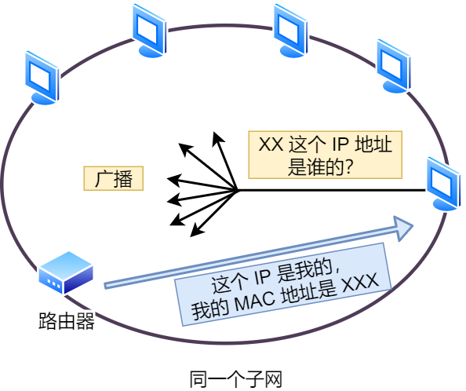
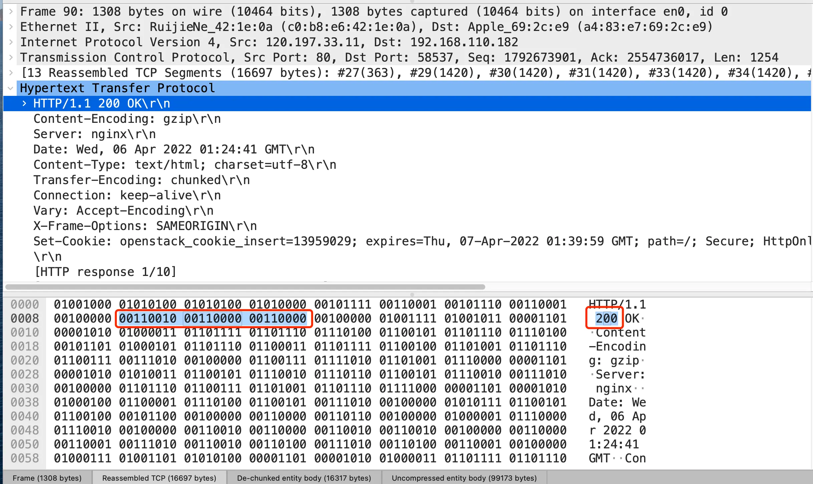
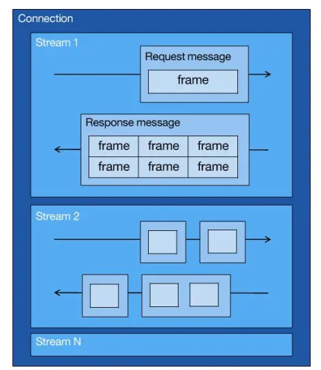
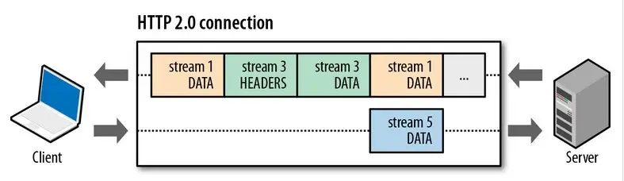
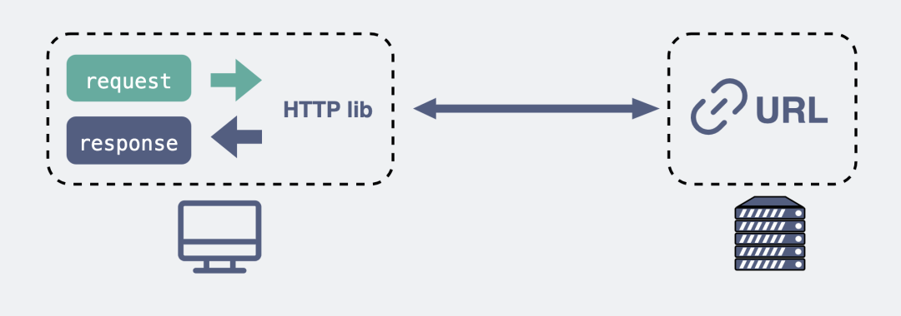
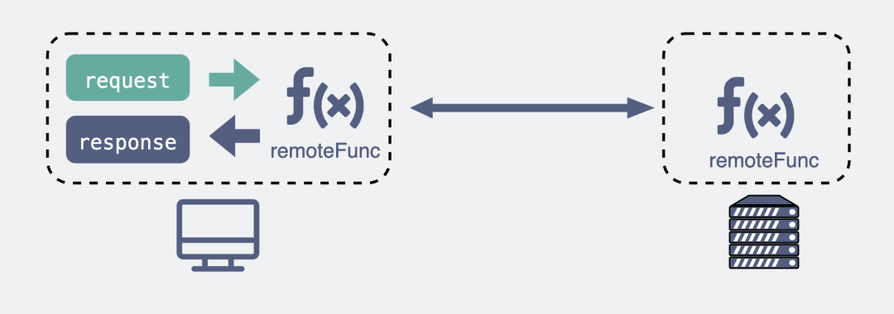
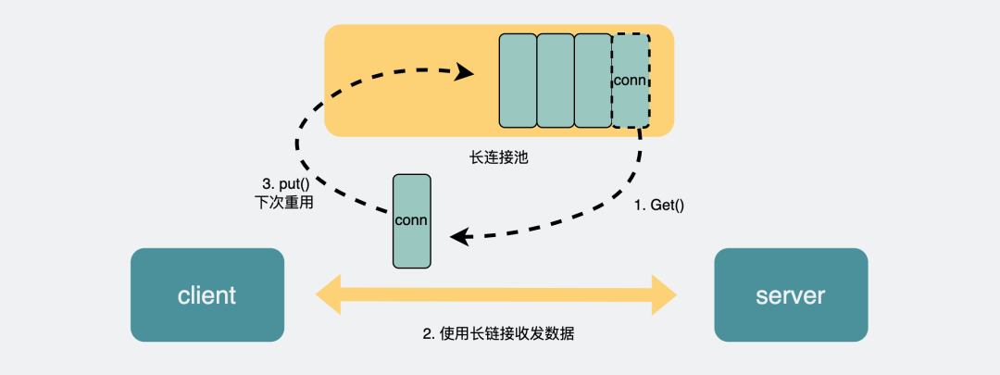
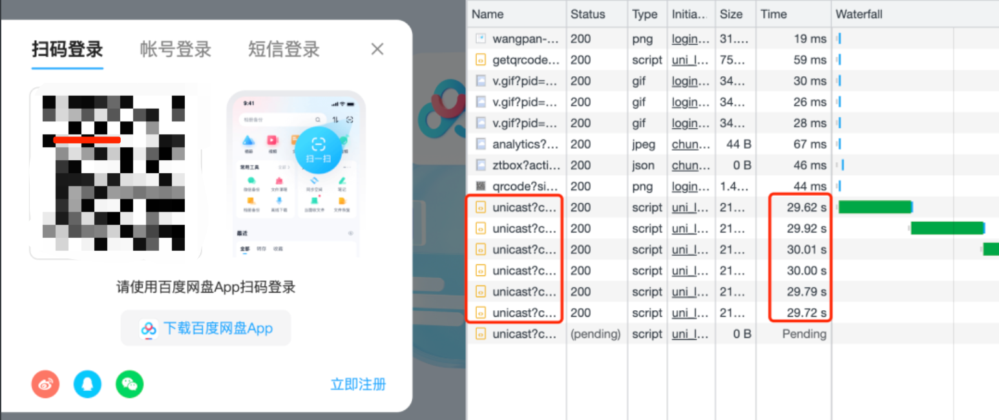
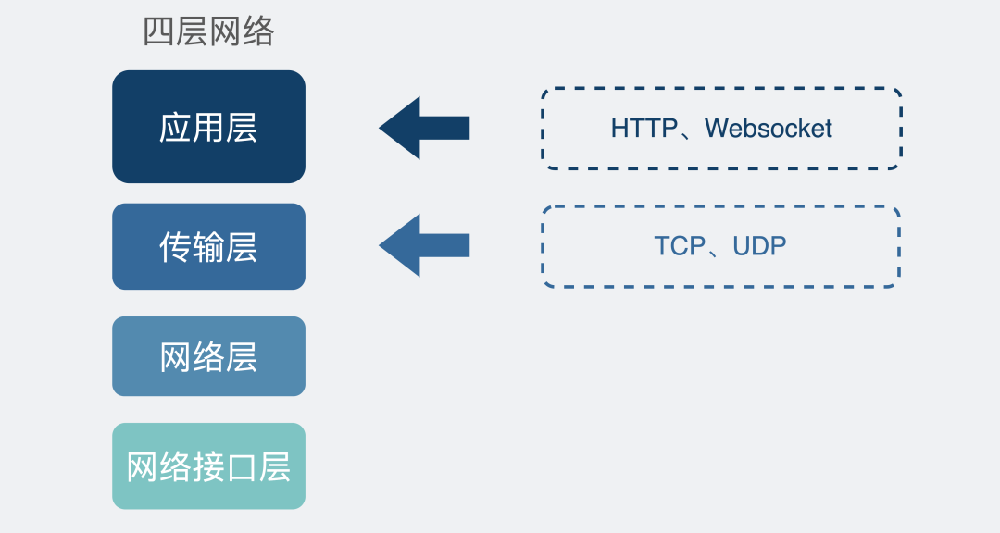
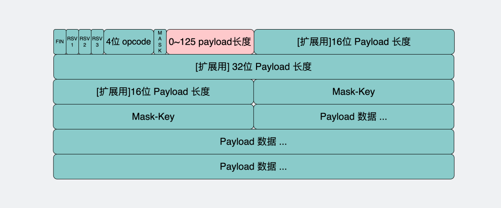

# 基础概念


## TCP/IP 网络模型有哪几层

TCP/IP 网络通常是由上到下分成 4 层，分别是**应用层，传输层，网络层和网络接口层**。


每一层的封装格式：


网络接口层的传输单位是帧（frame），IP 层的传输单位是包（packet），TCP 层的传输单位是段（segment），HTTP 的传输单位则是消息或报文（message）。但这些名词并没有什么本质的区分，可以统称为数据包。


### 应用层

最上层的，也是我们能直接接触到的就是**应用层**（*Application Layer*），我们电脑或手机使用的应用软件都是在应用层实现。那么，当两个不同设备的应用需要通信的时候，**应用就把应用数据传给下一层**，也就是传输层。

所以，**应用层只需要专注于为用户提供应用功能**，比如 HTTP、FTP、Telnet、DNS、SMTP等。

**应用层是不用去关心数据是如何传输的**，就类似于，我们寄快递的时候，只需要把包裹交给快递员，由他负责运输快递，我们不需要关心快递是如何被运输的。

而且应用层是工作在操作系统中的用户态，传输层及以下则工作在内核态。


### 传输层

应用层的数据包会传给传输层，**传输层**（*Transport Layer*）是为<u>应用层提供网络支持的</u>。


在传输层会有两个传输协议，**分别是 TCP 和 UDP。**

**TCP 的全称叫传输控制协议（*Transmission Control Protocol*）**，大部分应用使用的正是 TCP 传输层协议，比如 HTTP 应用层协议。TCP 相比 UDP 多了很多特性，比如**流量控制、超时重传、拥塞控制等，这些都是为了保证数据包能可靠地传输给对**方。

UDP 相对来说就很简单，**简单到只负责发送数据包，不保证数据包是否能抵达对方，但它实时性相对更好，传输效率也高。**当然，UDP 也可以实现可靠传输，把 TCP 的特性在应用层上实现就可以，不过要实现一个商用的可靠 UDP 传输协议，也不是一件简单的事情。

应用需要传输的数据可能会非常大，如果直接传输就不好控制，**因此当传输层的数据包大小超过 MSS（TCP 最大报文段长度） ，就要将数据包分块，这样即使中途有一个分块丢失或损坏了，只需要重新发送这一个分块，而不用重新发送整个数据包**。在 TCP 协议中，我们把每个分块称为一个 **TCP 段**（*TCP Segment*）。


当设备作为接收方时，传输层则要负责把数据包传给应用，<u>但是一台设备上可能会有很多应用在接收或者传输数据，因此需要用一个编号将应用区分开来，这个编号就是**端口**。</u>

比如 80 端口通常是 Web 服务器用的，22 端口通常是远程登录服务器用的。而对于浏览器（客户端）中的每个标签栏都是一个独立的进程，操作系统会为这些进程分配临时的端口号。

**由于传输层的报文中会携带端口号，因此接收方可以识别出该报文是发送给哪个应用。**


###  网络层

我们不希望传输层协议处理太多的事情，只需要服务好应用即可，**让其作为应用间数据传输的媒介，帮助实现应用到应用的通信（实现逻辑的传输功能）**，而实际的传输功能就交给下一层，也就是**网络层**（*Internet Layer*）。


网络层最常使用的是 IP 协议（*Internet Protocol*），<u>IP 协议会将传输层的报文作为数据部分，再加上 IP 包头组装成 IP 报文</u>，如果 IP 报文大小超过 MTU（以太网中一般为 1500 字节）就会**再次进行分片**，得到一个即将发送到网络的 IP 报文。


我们一般用 IP 地址给设备进行编号，对于 IPv4 协议， IP 地址共 32 位，分成了四段（比如，192.168.100.1），每段是 8 位。

因此，需要将 IP 地址分成两种意义：

- 一个是**网络号**，负责标识该 IP 地址是属于哪个「子网」的；
- 一个是**主机号**，负责标识同一「子网」下的不同主机；

怎么分的呢？这需要配合**子网掩码**才能算出 IP 地址 的网络号和主机号。

那么在寻址的过程中，先匹配到相同的网络号（表示要找到同一个子网），才会去找对应的主机。


除了寻址能力， IP 协议还有另一个重要的能力就是**路由**。实际场景中，两台设备并不是用一条网线连接起来的，而是通过很多网关、路由器、交换机等众多网络设备连接起来的，那么就会形成很多条网络的路径，**因此当数据包到达一个网络节点，就需要通过路由算法决定下一步走哪条路径。**

**路由器寻址工作中，就是要找到目标地址的子网，找到后进而把数据包转发给对应的网络内。**


所以，**IP 协议的寻址作用是告诉我们去往下一个目的地该朝哪个方向走，路由则是根据「下一个目的地」选择路径。寻址更像在导航，路由更像在操作方向盘（路线规划）**。


### 网络接口层

生成了 IP 头部之后，接下来要交给**网络接口层**（*Link Layer*）在 IP 头部的前面加上 MAC 头部，并封装成**数据帧（Data frame**）发送到网络上。


IP 头部中的接收方 IP 地址表示网络包的目的地，通过这个地址我们就可以判断要将包发到哪里，但在以太网的世界中，这个思路是行不通的。

**什么是以太网呢？**电脑上的以太网接口，Wi-Fi接口，以太网交换机、路由器上的千兆，万兆以太网口，还有网线，它们都是以太网的组成部分。**以太网就是一种在「局域网」内，把附近的设备连接起来，使它们之间可以进行通讯的技术。**

以太网在判断网络包目的地时和 IP 的方式不同，因此必须采用相匹配的方式才能在以太网中将包发往目的地，而 MAC 头部就是干这个用的，所以，在以太网进行通讯要用到 MAC 地址。

MAC 头部是以太网使用的头部，它包含了接收方和发送方的 MAC 地址等信息，我们可以通过 ARP 协议获取对方的 MAC 地址。

**所以说，网络接口层主要为网络层提供「链路级别」传输的服务，负责在以太网、WiFi 这样的底层网络上发送原始数据包，工作在网卡这个层次，使用 MAC 地址来标识网络上的设备。**


##  键入网址到网页显示，期间发生了什么？

接下来以下图较简单的网络拓扑模型作为例子，探究探究其间发生了什么？


### 孤单小弟 —— HTTP

首先浏览器做的第一步工作就是要对 `URL` 进行解析，从而生成发送给 `Web` 服务器的请求信息。

让我们看看一条长长的 URL 里的各个元素的代表什么，见下图：


所以图中的长长的 URL 实际上是请求服务器里的文件资源。

> 要是上图中的蓝色部分 URL 元素都省略了，那应该是请求哪个文件呢？

当没有路径名时，就代表访问根目录下事先设置的**默认文件**，也就是 `/index.html` 或者 `/default.html` 这些文件，这样就不会发生混乱了。

> 生产 HTTP 请求信息

对 `URL` 进行解析之后，浏览器确定了 Web 服务器和文件名，接下来就是根据这些信息来生成 HTTP 请求消息了。


> 一个孤单 HTTP 数据包表示：“我这么一个小小的数据包，没亲没友，直接发到浩瀚的网络，谁会知道我呢？谁能载我一程呢？谁能保护我呢？我的目的地在哪呢？”。充满各种疑问的它，没有停滞不前，依然踏上了征途！


###  真实地址查询 —— DNS

通过浏览器解析 URL 并生成 HTTP 消息后，需要委托操作系统将消息发送给 `Web` 服务器。

但在发送之前，还有一项工作需要完成，那就是**查询服务器域名对应的 IP 地址**，因为委托操作系统发送消息时，必须提供通信对象的 IP 地址。

比如我们打电话的时候，必须要知道对方的电话号码，但由于电话号码难以记忆，所以通常我们会将对方电话号 + 姓名保存在通讯录里。

**所以，有一种服务器就专门保存了 `Web` 服务器域名与 `IP` 的对应关系，它就是 `DNS` 服务器。**

> 域名的层级关系

DNS 中的域名都是用**句点**来分隔的，比如 `www.server.com`，这里的句点代表了不同层次之间的**界限**。

在域名中，**越靠右**的位置表示其层级**越高**（参考外国的命名方式）。

实际上域名最后还有一个点，比如 `www.server.com.`，这个最后的一个点代表根域名。

也就是，`.` 根域是在最顶层，它的下一层就是 `.com` 顶级域，再下面是 `server.com`。

所以域名的层级关系类似一个树状结构：

- 根 DNS 服务器（.）
- 顶级域 DNS 服务器（.com）
- 权威 DNS 服务器（server.com）


根域的 DNS 服务器信息保存在互联网中所有的 DNS 服务器中。

这样一来，任何 DNS 服务器就都可以找到并访问根域 DNS 服务器了。

因此，客户端只要能够找到任意一台 DNS 服务器，就可以通过它找到根域 DNS 服务器，然后再一路顺藤摸瓜找到位于下层的某台目标 DNS 服务器。


> 域名解析的工作流程

1. 客户端首先会发出一个 DNS 请求，问 www.server.com 的 IP 是啥，并发给本地 DNS 服务器（也就是客户端的 TCP/IP 设置中填写的 DNS 服务器地址）。
2. 本地域名服务器收到客户端的请求后，如果缓存里的表格能找到 www.server.com，则它直接返回 IP 地址。如果没有，本地 DNS 会去问它的根域名服务器：“老大， 能告诉我 www.server.com 的 IP 地址吗？” 根域名服务器是最高层次的，它不直接用于域名解析，但能指明一条道路。
3. 根 DNS 收到来自本地 DNS 的请求后，发现后置是 .com，说：“www.server.com 这个域名归 .com 区域管理”，我给你 .com 顶级域名服务器地址给你，你去问问它吧。”
4. 本地 DNS 收到顶级域名服务器的地址后，发起请求问“老二， 你能告诉我 www.server.com 的 IP 地址吗？”
5. 顶级域名服务器说：“我给你负责 www.server.com 区域的权威 DNS 服务器的地址，你去问它应该能问到”。
6. 本地 DNS 于是转向问权威 DNS 服务器：“老三，www.server.com对应的IP是啥呀？” server.com 的权威 DNS 服务器，它是域名解析结果的原出处。为啥叫权威呢？就是我的域名我做主。
7. 权威 DNS 服务器查询后将对应的 IP 地址 X.X.X.X 告诉本地 DNS。
8. 本地 DNS 再将 IP 地址返回客户端，客户端和目标建立连接。

至此，我们完成了 DNS 的解析过程。现在总结一下，整个过程我画成了一个图。


DNS 域名解析的过程蛮有意思的，整个过程就和我们日常生活中找人问路的过程类似，**只指路不带路**。

> 那是不是每次解析域名都要经过那么多的步骤呢？

当然不是了，还有缓存这个东西的嘛。

浏览器会先看自身有没有对这个域名的缓存，如果有，就直接返回，如果没有，就去问操作系统，操作系统也会去看自己的缓存，如果有，就直接返回，如果没有，再去 hosts 文件看，也没有，才会去问「本地 DNS 服务器」。

> 数据包表示：“DNS 老大哥厉害呀，找到了目的地了！我还是很迷茫呀，我要发出去，接下来我需要谁的帮助呢?”


### 指南好帮手 —— 协议栈

通过 DNS 获取到 IP 后，就可以把 HTTP 的传输工作交给操作系统中的**协议栈**。

协议栈的内部分为几个部分，分别承担不同的工作。上下关系是有一定的规则的，上面的部分会向下面的部分委托工作，下面的部分收到委托的工作并执行。


应用程序（浏览器）通过调用 Socket 库，来委托协议栈工作。协议栈的上半部分有两块，分别是负责收发数据的 TCP 和 UDP 协议，这两个传输协议会接受应用层的委托执行收发数据的操作。

协议栈的下面一半是用 IP 协议控制网络包收发操作，在互联网上传数据时，数据会被切分成一块块的网络包，而将网络包发送给对方的操作就是由 IP 负责的。

此外 IP 中还包括 `ICMP` 协议和 `ARP` 协议。

- `ICMP` 用于告知网络包传送过程中产生的错误以及各种控制信息。
- `ARP` 用于根据 IP 地址查询相应的以太网 MAC 地址。

IP 下面的网卡驱动程序负责控制网卡硬件，而最下面的网卡则负责完成实际的收发操作，也就是对网线中的信号执行发送和接收操作。


### 可靠传输 —— TCP

HTTP 是基于 TCP 协议传输的，所以在这我们先了解下 TCP 协议。

> TCP 包头格式


首先，**源端口号**和**目标端口**号是不可少的，如果没有这两个端口号，数据就不知道应该发给哪个应用。

接下来有包的**序**号，这个是为了解决包乱序的问题。

还有应该有的是**确认号**，目的是确认发出去对方是否有收到。如果没有收到就应该重新发送，直到送达，这个是为了解决丢包的问题。

接下来还有一些**状态位**。例如 `SYN` 是发起一个连接，`ACK` 是回复，`RST` 是重新连接，`FIN` 是结束连接等。TCP 是面向连接的，因而双方要维护连接的状态，这些带状态位的包的发送，会引起双方的状态变更。

还有一个重要的就是**窗口大小**。TCP 要做**流量控制**，通信双方各声明一个窗口（缓存大小），标识自己当前能够的处理能力，别发送的太快，撑死我，也别发的太慢，饿死我。

除了做流量控制以外，TCP还会做**拥塞控制**，对于真正的通路堵车不堵车，它无能为力，唯一能做的就是控制自己，也即控制发送的速度。不能改变世界，就改变自己嘛。

> TCP 传输数据之前，要先三次握手建立连接

在 HTTP 传输数据之前，首先需要 TCP 建立连接，TCP 连接的建立，通常称为**三次握手**。

这个所谓的「连接」，只是双方计算机里维护一个状态机，在连接建立的过程中，双方的状态变化时序图就像这样。


- 一开始，客户端和服务端都处于 `CLOSED` 状态。先是服务端主动监听某个端口，处于 `LISTEN` 状态。
- 然后客户端主动发起连接 `SYN`，之后处于 `SYN-SENT` 状态。
- 服务端收到发起的连接，返回 `SYN`，并且 `ACK` 客户端的 `SYN`，之后处于 `SYN-RCVD` 状态。
- 客户端收到服务端发送的 `SYN` 和 `ACK` 之后，发送对 `SYN` 确认的 `ACK`，之后处于 `ESTABLISHED` 状态，因为它一发一收成功了。
- 服务端收到 `ACK` 的 `ACK` 之后，处于 `ESTABLISHED` 状态，因为它也一发一收了。

所以三次握手目的是**保证双方都有发送和接收的能力**。

> 如何查看 TCP 的连接状态？

TCP 的连接状态查看，在 Linux 可以通过 `netstat -napt` 命令查看。


> TCP 分割数据

如果 HTTP 请求消息比较长，超过了 `MSS` 的长度，这时 TCP 就需要把 HTTP 的数据拆解成一块块的数据发送，而不是一次性发送所有数据。


- `MTU`：一个网络包的最大长度，以太网中一般为 `1500` 字节。
- `MSS`：除去 IP 和 TCP 头部之后，一个网络包所能容纳的 TCP 数据的最大长度。

数据会被以 `MSS` 的长度为单位进行拆分，拆分出来的每一块数据都会被放进单独的网络包中。也就是在每个被拆分的数据加上 TCP 头信息，然后交给 IP 模块来发送数据。


> TCP 报文生成

TCP 协议里面会有两个端口，一个是浏览器监听的端口（通常是随机生成的），一个是 Web 服务器监听的端口（HTTP 默认端口号是 `80`， HTTPS 默认端口号是 `443`）。

在双方建立了连接后，TCP 报文中的数据部分就是存放 HTTP 头部 + 数据，组装好 TCP 报文之后，就需交给下面的网络层处理。

至此，网络包的报文如下图。


> 此时，遇上了 TCP 的 数据包激动表示：“太好了，碰到了可靠传输的 TCP 传输，它给我加上 TCP 头部，我不再孤单了，安全感十足啊！有大佬可以保护我的可靠送达！但我应该往哪走呢？”

------


### 远程定位 —— IP

TCP 模块在执行连接、收发、断开等各阶段操作时，都需要委托 IP 模块将数据封装成**网络包**发送给通信对象。

> IP 包头格式

我们先看看 IP 报文头部的格式：


在 IP 协议里面需要有**源地址 IP** 和 **目标地址 IP**：

- 源地址IP，即是客户端输出的 IP 地址；
- 目标地址，即通过 DNS 域名解析得到的 Web 服务器 IP。

因为 HTTP 是经过 TCP 传输的，所以在 IP 包头的**协议号**，要填写为 `06`（十六进制），表示协议为 TCP。

> 假设客户端有多个网卡，就会有多个 IP 地址，那 IP 头部的源地址应该选择哪个 IP 呢？

当存在多个网卡时，在填写源地址 IP 时，就需要判断到底应该填写哪个地址。这个判断相当于在多块网卡中判断应该使用哪个一块网卡来发送包。

这个时候就需要根据**路由表**规则，来判断哪一个网卡作为源地址 IP。

在 Linux 操作系统，我们可以使用 `route -n` 命令查看当前系统的路由表。


举个例子，根据上面的路由表，我们假设 Web 服务器的目标地址是 `192.168.10.200`。


1. 首先先和第一条目的子网掩码（`Genmask`）进行 **与运算**，得到结果为 `192.168.10.0`，但是第一个条目的 `Destination` 是 `192.168.3.0`，两者不一致所以匹配失败。
2. 再与第二条目的子网掩码进行 **与运算**，得到的结果为 `192.168.10.0`，与第二条目的 `Destination 192.168.10.0` 匹配成功，所以将使用 `eth1` 网卡的 IP 地址作为 IP 包头的源地址。

那么假设 Web 服务器的目标地址是 `10.100.20.100`，那么依然依照上面的路由表规则判断，判断后的结果是和第三条目匹配。

第三条目比较特殊，它目标地址和子网掩码都是 `0.0.0.0`，这表示**默认网关**，如果其他所有条目都无法匹配，就会自动匹配这一行。并且后续就把包发给路由器，`Gateway` 即是路由器的 IP 地址。

> IP 报文生成

至此，网络包的报文如下图。


> 此时，加上了 IP 头部的数据包表示 ：“有 IP 大佬给我指路了，感谢 IP 层给我加上了 IP 包头，让我有了远程定位的能力！不会害怕在浩瀚的互联网迷茫了！可是目的地好远啊，我下一站应该去哪呢？”

------

### 两点传输 —— MAC

生成了 IP 头部之后，接下来网络包还需要在 IP 头部的前面加上 **MAC 头部**。

> MAC 包头格式

MAC 头部是以太网使用的头部，它包含了接收方和发送方的 MAC 地址等信息。


在 MAC 包头里需要**发送方 MAC 地址**和**接收方目标 MAC 地址**，用于**两点之间的传输**。

一般在 TCP/IP 通信里，MAC 包头的**协议类型**只使用：

- `0800` ： IP 协议
- `0806` ： ARP 协议

> MAC 发送方和接收方如何确认?

**发送方**的 MAC 地址获取就比较简单了，MAC 地址是在网卡生产时写入到 ROM 里的，只要将这个值读取出来写入到 MAC 头部就可以了。

**接收方**的 MAC 地址就有点复杂了，只要告诉以太网对方的 MAC 的地址，以太网就会帮我们把包发送过去，那么很显然这里应该填写对方的 MAC 地址。

所以先得搞清楚应该把包发给谁，这个只要查一下**路由表**就知道了。在路由表中找到相匹配的条目，然后把包发给 `Gateway` 列中的 IP 地址就可以了。

> 既然知道要发给谁，按如何获取对方的 MAC 地址呢？

不知道对方 MAC 地址？不知道就喊呗。

此时就需要 `ARP` 协议帮我们找到路由器的 MAC 地址。



ARP 协议会在以太网中以**广播**的形式，对以太网所有的设备喊出：“这个 IP 地址是谁的？请把你的 MAC 地址告诉我”。

然后就会有人回答：“这个 IP 地址是我的，我的 MAC 地址是 XXXX”。

如果对方和自己处于同一个子网中，那么通过上面的操作就可以得到对方的 MAC 地址。然后，我们将这个 MAC 地址写入 MAC 头部，MAC 头部就完成了。

> 好像每次都要广播获取，这不是很麻烦吗？

放心，在后续操作系统会把本次查询结果放到一块叫做 **ARP 缓存**的内存空间留着以后用，不过缓存的时间就几分钟。

也就是说，在发包时：

- 先查询 ARP 缓存，如果其中已经保存了对方的 MAC 地址，就不需要发送 ARP 查询，直接使用 ARP 缓存中的地址。
- 而当 ARP 缓存中不存在对方 MAC 地址时，则发送 ARP 广播查询。

> 查看 ARP 缓存内容

在 Linux 系统中，我们可以使用 `arp -a` 命令来查看 ARP 缓存的内容。


> MAC 报文生成

至此，网络包的报文如下图。


> 此时，加上了 MAC 头部的数据包万分感谢，说道 ：“感谢 MAC 大佬，我知道我下一步要去哪了！我现在有很多头部兄弟，相信我可以到达最终的目的地！”。 带着众多头部兄弟的数据包，终于准备要出门了。

------


### 出口 —— 网卡

网络包只是存放在内存中的一串二进制数字信息，没有办法直接发送给对方。因此，我们需要将**数字信息转换为电信号**，才能在网线上传输，也就是说，这才是真正的数据发送过程。

负责执行这一操作的是**网卡**，要控制网卡还需要靠**网卡驱动程序**。

网卡驱动获取网络包之后，会将其**复制**到网卡内的缓存区中，接着会在其**开头加上报头和起始帧分界符，在末尾加上用于检测错误的帧校验序列**。


- 起始帧分界符是一个用来表示包起始位置的标记
- 末尾的 `FCS`（帧校验序列）用来检查包传输过程是否有损坏

最后网卡会将包转为电信号，通过网线发送出去。

> 唉，真是不容易，发一个包，真是历经千辛万苦。致此，一个带有许多头部的数据终于踏上寻找目的地的征途了！

------


### 送别者 —— 交换机

下面来看一下包是如何通过交换机的。交换机的设计是将网络包**原样**转发到目的地。交换机工作在 MAC 层，也称为**二层网络设备**。

> 交换机的包接收操作

首先，电信号到达网线接口，交换机里的模块进行接收，接下来交换机里的模块将电信号转换为数字信号。

然后通过包末尾的 `FCS` 校验错误，如果没问题则放到缓冲区。这部分操作基本和计算机的网卡相同，但交换机的工作方式和网卡不同。

计算机的网卡本身具有 MAC 地址，并通过核对收到的包的接收方 MAC 地址判断是不是发给自己的，如果不是发给自己的则丢弃；相对地，交换机的端口不核对接收方 MAC 地址，而是直接接收所有的包并存放到缓冲区中。因此，和网卡不同，**交换机的端口不具有 MAC 地址**。

将包存入缓冲区后，接下来需要查询一下这个包的接收方 MAC 地址是否已经在 MAC 地址表中有记录了。

交换机的 MAC 地址表主要包含两个信息：

- 一个是设备的 MAC 地址，
- 另一个是该设备连接在交换机的哪个端口上。


举个例子，如果收到的包的接收方 MAC 地址为 `00-02-B3-1C-9C-F9`，则与图中表中的第 3 行匹配，根据端口列的信息，可知这个地址位于 `3` 号端口上，然后就可以通过交换电路将包发送到相应的端口了。

所以，**交换机根据 MAC 地址表查找 MAC 地址，然后将信号发送到相应的端口**。

> 当 MAC 地址表找不到指定的 MAC 地址会怎么样？

地址表中找不到指定的 MAC 地址。这可能是因为具有该地址的设备还没有向交换机发送过包，或者这个设备一段时间没有工作导致地址被从地址表中删除了。

这种情况下，交换机无法判断应该把包转发到哪个端口，只能将包转发到除了源端口之外的所有端口上，无论该设备连接在哪个端口上都能收到这个包。

这样做不会产生什么问题，因为以太网的设计本来就是将包发送到整个网络的，然后**只有相应的接收者才接收包，而其他设备则会忽略这个包**。

有人会说：“这样做会发送多余的包，会不会造成网络拥塞呢？”

其实完全不用过于担心，因为发送了包之后目标设备会作出响应，只要返回了响应包，交换机就可以将它的地址写入 MAC 地址表，下次也就不需要把包发到所有端口了。

局域网中每秒可以传输上千个包，多出一两个包并无大碍。

此外，如果接收方 MAC 地址是一个**广播地址**，那么交换机会将包发送到除源端口之外的所有端口。

以下两个属于广播地址：

- MAC 地址中的 `FF:FF:FF:FF:FF:FF`
- IP 地址中的 `255.255.255.255`

> 数据包通过交换机转发抵达了路由器，准备要离开土生土长的子网了。此时，数据包和交换机离别时说道：“感谢交换机兄弟，帮我转发到出境的大门，我要出远门啦！”

------


### 出境大门 —— 路由器

> 路由器与交换机的区别

网络包经过交换机之后，现在到达了**路由器**，并在此被转发到下一个路由器或目标设备。

这一步转发的工作原理和交换机类似，也是通过查表判断包转发的目标。

不过在具体的操作过程上，路由器和交换机是有区别的。

- 因为**路由器**是基于 IP 设计的，俗称**三层**网络设备，路由器的各个端口都具有 MAC 地址和 IP 地址；
- 而**交换机**是基于以太网设计的，俗称**二层**网络设备，交换机的端口不具有 MAC 地址。

> 路由器基本原理

路由器的端口具有 MAC 地址，因此它就能够成为以太网的发送方和接收方；同时还具有 IP 地址，从这个意义上来说，它和计算机的网卡是一样的。

当转发包时，首先路由器端口会接收发给自己的以太网包，然后**路由表**查询转发目标，再由相应的端口作为发送方将以太网包发送出去。

> 路由器的包接收操作

首先，电信号到达网线接口部分，路由器中的模块会将电信号转成数字信号，然后通过包末尾的 `FCS` 进行错误校验。

如果没问题则检查 MAC 头部中的**接收方 MAC 地址**，看看是不是发给自己的包，如果是就放到接收缓冲区中，否则就丢弃这个包。

总的来说，路由器的端口都具有 MAC 地址，只接收与自身地址匹配的包，遇到不匹配的包则直接丢弃。

> 查询路由表确定输出端口

完成包接收操作之后，路由器就会**去掉**包开头的 MAC 头部。

**MAC 头部的作用就是将包送达路由器**，其中的接收方 MAC 地址就是路由器端口的 MAC 地址。因此，当包到达路由器之后，MAC 头部的任务就完成了，于是 MAC 头部就会**被丢弃**。

接下来，路由器会根据 MAC 头部后方的 `IP` 头部中的内容进行包的转发操作。

转发操作分为几个阶段，首先是查询**路由表**判断转发目标。


具体的工作流程根据上图，举个例子。

假设地址为 `10.10.1.101` 的计算机要向地址为 `192.168.1.100` 的服务器发送一个包，这个包先到达图中的路由器。

判断转发目标的第一步，就是根据包的接收方 IP 地址查询路由表中的目标地址栏，以找到相匹配的记录。

路由匹配和前面讲的一样，每个条目的子网掩码和 `192.168.1.100` IP 做 **& 与运算**后，得到的结果与对应条目的目标地址进行匹配，如果匹配就会作为候选转发目标，如果不匹配就继续与下个条目进行路由匹配。

如第二条目的子网掩码 `255.255.255.0` 与 `192.168.1.100` IP 做 **& 与运算**后，得到结果是 `192.168.1.0` ，这与第二条目的目标地址 `192.168.1.0` 匹配，该第二条目记录就会被作为转发目标。

实在找不到匹配路由时，就会选择**默认路由**，路由表中子网掩码为 `0.0.0.0` 的记录表示「默认路由」。

> 路由器的发送操作

接下来就会进入包的**发送操作**。

首先，我们需要根据**路由表的网关列**判断对方的地址。

- 如果网关是一个 IP 地址，则这个IP 地址就是我们要转发到的目标地址，**还未抵达终点**，还需继续需要路由器转发。
- 如果网关为空，则 IP 头部中的接收方 IP 地址就是要转发到的目标地址，也是就终于找到 IP 包头里的目标地址了，说明**已抵达终点**。

知道对方的 IP 地址之后，接下来需要通过 `ARP` 协议根据 IP 地址查询 MAC 地址，并将查询的结果作为接收方 MAC 地址。

路由器也有 ARP 缓存，因此首先会在 ARP 缓存中查询，如果找不到则发送 ARP 查询请求。

接下来是发送方 MAC 地址字段，这里填写输出端口的 MAC 地址。还有一个以太类型字段，填写 `0800` （十六进制）表示 IP 协议。

网络包完成后，接下来会将其转换成电信号并通过端口发送出去。这一步的工作过程和计算机也是相同的。

发送出去的网络包会通过**交换机**到达下一个路由器。由于接收方 MAC 地址就是下一个路由器的地址，所以交换机会根据这一地址将包传输到下一个路由器。

接下来，下一个路由器会将包转发给再下一个路由器，经过层层转发之后，网络包就到达了最终的目的地。

不知你发现了没有，在网络包传输的过程中，**源 IP 和目标 IP 始终是不会变的，一直变化的是 MAC 地址**，因为需要 MAC 地址在以太网内进行**两个设备**之间的包传输。

> 数据包通过多个路由器道友的帮助，在网络世界途经了很多路程，最终抵达了目的地的城门！城门值守的路由器，发现了这个小兄弟数据包原来是找城内的人，于是它就将数据包送进了城内，再经由城内的交换机帮助下，最终转发到了目的地了。数据包感慨万千的说道：“多谢这一路上，各路大侠的相助！”

------


### 互相扒皮 —— 服务器 与 客户端

数据包抵达了服务器，服务器肯定高兴呀，正所谓有朋自远方来，不亦乐乎？

服务器高兴的不得了，于是开始扒数据包的皮！就好像你收到快递，能不兴奋吗？


数据包抵达服务器后，服务器会先扒开数据包的 MAC 头部，查看是否和服务器自己的 MAC 地址符合，符合就将包收起来。

接着继续扒开数据包的 IP 头，发现 IP 地址符合，根据 IP 头中协议项，知道自己上层是 TCP 协议。

于是，扒开 TCP 的头，里面有序列号，需要看一看这个序列包是不是我想要的，如果是就放入缓存中然后返回一个 ACK，如果不是就丢弃。TCP头部里面还有端口号， HTTP 的服务器正在监听这个端口号。

于是，服务器自然就知道是 HTTP 进程想要这个包，于是就将包发给 HTTP 进程。

服务器的 HTTP 进程看到，原来这个请求是要访问一个页面，于是就把这个网页封装在 HTTP 响应报文里。

HTTP 响应报文也需要穿上 TCP、IP、MAC 头部，不过这次是源地址是服务器 IP 地址，目的地址是客户端 IP 地址。

穿好头部衣服后，从网卡出去，交由交换机转发到出城的路由器，路由器就把响应数据包发到了下一个路由器，就这样跳啊跳。

最后跳到了客户端的城门把守的路由器，路由器扒开 IP 头部发现是要找城内的人，于是又把包发给了城内的交换机，再由交换机转发到客户端。

客户端收到了服务器的响应数据包后，同样也非常的高兴，客户能拆快递了！

于是，客户端开始扒皮，把收到的数据包的皮扒剩 HTTP 响应报文后，交给浏览器去渲染页面，一份特别的数据包快递，就这样显示出来了！

最后，客户端要离开了，向服务器发起了 TCP 四次挥手，至此双方的连接就断开了。


# 应用层


## HTTP 基本概念


### HTTP 是什么？

HTTP 是超文本传输协议，也就是**H**yperText **T**ransfer **P**rotocol。

> 能否详细解释「超文本传输协议」？


> 那「HTTP 是用于从互联网服务器传输超文本到本地浏览器的协议」，这种说法正确吗？


### HTTP 常见的状态码有哪些？


### HTTP 常见字段有哪些？


##  GET 与 POST


### GET 和 POST 有什么区别？


> GET 请求可以带 body 吗？


## HTTP 缓存技术


### HTTP 缓存有哪些实现


#### 什么是强制缓存？


---------------------------------------------------------------------------------------------------------------------------------------------------------


## HTTP/1.1 如何优化？

- *尽量避免发送 HTTP 请求*；
- *在需要发送 HTTP 请求时，考虑如何减少请求次数*；
- *减少服务器的 HTTP 响应的数据大小*；


### 如何避免发送 HTTP 请求？

##### 可以采取缓存的机制。

对于一些具有重复性的 HTTP 请求，比如每次请求得到的数据都一样的，我们可以把这对「请求-响应」的数据都**缓存在本地**，那么下次就直接读取本地的数据，不必在通过网络获取服务器的响应了，这样的话 HTTP/1.1 的性能肯定肉眼可见的提升。


##### 那缓存是如何做到的呢

客户端会把第一次请求以及响应的数据保存在本地磁盘上，其中将**请求的 URL 作为 key，而响应作为 value，两者形成映射关系。**

这样当后续发起相同的请求时，就可以先在本地磁盘上通过 key 查到对应的 value，也就是响应，如果找到了，就直接从本地读取该响应。毋庸置疑，读取本地磁盘的速度肯定比网络请求快得多，如下图：


##### 缓存的响应不是最新的，而客户端并不知情，那么该怎么办呢？

所以，服务器在发送 HTTP 响应时，会估算一个过期的时间，并把这个信息放到响应头部中，这样客户端在查看响应头部的信息时，一旦发现缓存的响应是过期的，则就会重新发送网络请求。

**如果客户端从第一次请求得到的响应头部中发现该响应过期了，客户端重新发送请求，假设服务器上的资源并没有变更，还是老样子，那么你觉得还要在服务器的响应带上这个资源吗？**

很显然不带的话，可以提高 HTTP 协议的性能

**只需要客户端在重新发送请求时，在请求的 `Etag` 头部带上第一次请求的响应头部中的摘要**，这个摘要是<u>唯一标识响应的资源</u>，当服务器收到请求后，会将本地资源的摘要与请求中的摘要做个比较。

如果不同，那么说明客户端的缓存已经没有价值，服务器在响应中带上最新的资源。

如果相同，说明客户端的缓存还是可以继续使用的，那么服务器**仅返回不含有包体的 `304 Not Modified` 响应**，告诉客户端仍然有效，这样就可以减少响应资源在网络中传输的延时，如下图：


**个人总结：**

当客户端第一次访问该url时，服务器可以返回一个响应，该响应的头部携带该资源的有效时间和 Etag（用来标识资源），客户端收到该资源时，会将其存储在本地；当客户端第二次访问该url时，其会先查看本地是否有缓存，如果有，查看其是否过期：

- 未过期，直接从本地的缓存获取该资源
- 已过期，向服务器发起请求，并在请求头部携带该资源的Etag，服务器收到该请求，会将该请求会服务器存储的资源进行对比：
  - Etag相同，服务器直接返回304响应，表示资源未修改，而不需携带资源
  - Etag不同，服务器重新发送该url对应的资源给客户端


### 如何减少 HTTP 请求次数？

减少 HTTP 请求次数自然也就提升了 HTTP 性能，可以从这 3 个方面入手：

- *减少重定向请求次数*；
- *合并请求*；
- *延迟发送请求*；


#### 减少重定向请求次数

##### 什么是**重定向请求**

服务器上的一个资源可能由于迁移、维护等原因从 url1 移至 url2 后，而客户端不知情，它还是继续请求 url1，这时服务器不能粗暴地返回错误，**而是通过 `302` 响应码和 `Location` 头部**，告诉客户端该资源已经迁移至 url2 了，于是客户端需要再发送 url2 请求以获得服务器的资源。

**那么，如果重定向请求越多，那么客户端就要多次发起 HTTP 请求，每一次的 HTTP 请求都得经过网络，这无疑会越降低网络性能。**

另外，服务端这一方往往不只有一台服务器，比如源服务器上一级是代理服务器，然后代理服务器才与客户端通信，这时客户端重定向就会导致客户端与代理服务器之间需要 2 次消息传递，如下图


##### 如何减少重定向请求次数

----------------

**个人总结**

对于重定向的url，每次客户端都要发起请求。而往往客户端和服务器中间还存在中间代理，这样就会导致重定向请求次数大大增加。可以通过以下方法来减少重定向次数：当服务器向中间代理返回302响应时，代理不先向客户端返回302响应，而是直接访问更新后的url2，然后才将获取到的资源返回给客户端，同时中间代理还可以存储重定向的连接。

----------------


可以将**重定向的工作交由代理服务器完成，就能减少 HTTP 请求次数了**，如下图：


而且当代理服务器知晓了重定向规则后，可以进一步减少消息传递次数，如下图：


除了 `302` 重定向响应码，还有其他一些重定向的响应码，你可以从下图看到：


其中，`301` 和 `308` 响应码是告诉客户端可以将重定向响应缓存到本地磁盘，之后客户端就自动用 url2 替代 url1 访问服务器的资源。


#### 合并请求

##### 什么是合并请求

---------------------

**合并请求的方式就是合并资源，以一个大资源的请求替换多个小资源的请求**。

但是这样的合并请求会带来新的问题，**当大资源中的某一个小资源发生变化后，客户端必须重新下载整个完整的大资源文件**，这显然带来了额外的网络消耗。

-----------------------------


如果把多个访问小文件的请求合并成一个大请求，虽然传输的资源一样，但是减少请求，**意味着减少了重复发送的HTTP头部**。 

由于HTTP/1.1使用的是请求响应模型，如果第一个发送的请求未得到响应，那么后续的请求就不会发送。所以为了防止阻塞，**浏览器一般会同时发送多个HTTP请求，每个请求都是不同的TCP连接**，那么如果合并了请求，也就**减少了TCP连接次数，因此省去了TCP握手和慢启动过程耗费的时间。**


##### 合并请求的几种方式

- 合并小图片：**通过将多个小图片合并成一个大图片来减少 HTTP 请求的次数，以减少 HTTP 请求的次数，从而减少网络的开销**。

有的网页会含有很多小图片、小图标，有多少个小图片，客户端就要发起多少次请求。那么对于这些小图片，我们可以考虑使用 `CSS Image Sprites` 技术把它们合成一个大图片，这样浏览器就可以用一次请求获得一个大图片，然后再根据 CSS 数据把大图片切割成多张小图片。


- 将图片的二进制数据用 `base64` 编码后，以 URL 的形式嵌入到 HTML 文件，跟随 HTML 文件一并发送


#### 延迟发送请求

一般 HTML 里会含有很多 HTTP 的 URL，当前不需要的资源，我们没必要也获取过来，于是可以通过「**按需获取**」的方式，来减少第一时间的 HTTP 请求次数。

请求网页的时候，没必要把全部资源都获取到，而是只获取当前用户所看到的页面资源，当用户向下滑动页面的时候，再向服务器获取接下来的资源，这样就达到了延迟发送请求的效果。


### 如何减少 HTTP 响应的数据大小？

对于 HTTP 的请求和响应，通常 HTTP 的响应的数据大小会比较大，也就是服务器返回的资源会比较大。于是，我们可以考虑对响应的资源进行**压缩**，这样就可以减少响应的数据大小，从而提高网络传输的效率。

压缩的方式一般分为 2 种，分别是：

- *无损压缩*；
- *有损压缩*；


#### 无损压缩

无损压缩是指资源经过压缩后，信息不被破坏，还能完全恢复到压缩前的原样，适合用在文本文件、程序可执行文件、程序源代码。

首先，我们针**对代码的语法规则进行压缩**，因为通常代码文件都有很多换行符或者空格，这些是为了帮助程序员更好的阅读，但是机器执行时并不要这些符，把这些多余的符号给去除掉。

接下来，就是无损压缩了，需要**对原始资源建立统计模型**，利用这个统计模型，将常出现的数据用较短的二进制比特序列表示，将不常出现的数据用较长的二进制比特序列表示，生成二进制比特序列一般是「霍夫曼编码」算法。

gzip 就是比较常见的无损压缩。客户端支持的压缩算法，会在 HTTP 请求中通过头部中的 `Accept-Encoding` 字段告诉服务器：

服务器收到后，会从中选择一个服务器支持的或者合适的压缩算法，然后使用此压缩算法对响应资源进行压缩，最后通过响应头部中的 `Content-Encoding` 字段告诉客户端该资源使用的压缩算法。

gzip 的压缩效率相比 Google 推出的 Brotli 算法还是差点意思，也就是上文中的 br，所以如果可以，服务器应该选择压缩效率更高的 br 压缩算法。


#### 有损压缩

与无损压缩相对的就是有损压缩，经过此方法压缩，解压的数据会与原始数据不同但是非常接近。

有损压缩主要将次要的数据舍弃，牺牲一些质量来减少数据量、提高压缩比，这种方法经常用于压缩多媒体数据，比如音频、视频、图片。

可以通过 HTTP 请求头部中的 `Accept` 字段里的「 q 质量因子」，告诉服务器期望的资源质量。

- 关于图片的压缩，目前压缩比较高的是 Google 推出的 **WebP 格式**，它与常见的 Png 格式图片的压缩比例对比：可以发现，相同图片质量下，WebP 格式的图片大小都比 Png 格式的图片小，所以对于大量图片的网站，可以考虑使用 WebP 格式的图片，这将大幅度提升网络传输的性能。
- 关于音视频的压缩，音视频主要是动态的，每个帧都有时序的关系，**通常时间连续的帧之间的变化是很小的**。如，一个在看书的视频，画面通常只有人物的手和书桌上的书是会有变化的，而其他地方通常都是静态的，于是只需要在一个静态的关键帧，使用**增量数据**来表达后续的帧，这样便减少了很多数据，提高了网络传输的性能。对于视频常见的编码格式有 H264、H265 等，音频常见的编码格式有 AAC、AC3。


### 总结

这次主要从 3 个方面介绍了优化 HTTP/1.1 协议的思路。

第一个思路是，通过缓存技术来避免发送 HTTP 请求。客户端收到第一个请求的响应后，可以将其缓存在本地磁盘，下次请求的时候，如果缓存没过期，就直接读取本地缓存的响应数据。如果缓存过期，客户端发送请求的时候带上响应数据的摘要，服务器比对后发现资源没有变化，就发出不带包体的 304 响应，告诉客户端缓存的响应仍然有效。

第二个思路是，减少 HTTP 请求的次数，有以下的方法：

1. 将原本由客户端处理的重定向请求，交给代理服务器处理，这样可以减少重定向请求的次数；
2. 将多个小资源合并成一个大资源再传输，能够减少 HTTP 请求次数以及 头部的重复传输，再来减少 TCP 连接数量，进而省去 TCP 握手和慢启动的网络消耗；
3. 按需访问资源，只访问当前用户看得到/用得到的资源，当客户往下滑动，再访问接下来的资源，以此达到延迟请求，也就减少了同一时间的 HTTP 请求次数。

第三思路是，通过压缩响应资源，降低传输资源的大小，从而提高传输效率，所以应当选择更优秀的压缩算法。


-------------------------------------------------------------------------------------------------------------------


## HTTPS RSA 握手解析


### TLS 握手过程

HTTP 由于是明文传输，所谓的明文，就是说客户端与服务端通信的信息都是肉眼可见的，随意使用一个抓包工具都可以截获通信的内容。

所以安全上存在以下三个风险：

- *窃听风险*，比如通信链路上可以获取通信内容，用户号容易没。
- *篡改风险*，比如强制植入垃圾广告，视觉污染，用户眼容易瞎。
- *冒充风险*，比如冒充淘宝网站，用户钱容易没。

HTTP**S** 在 HTTP 与 TCP 层之间加入了 TLS 协议，来解决上述的风险。


TLS 协议是如何解决 HTTP 的风险的呢？

- *信息加密*： HTTP 交互信息是被加密的，第三方就无法被窃取；
- *校验机制*：校验信息传输过程中是否有被第三方篡改过，如果被篡改过，则会有警告提示；
- *身份证书*：证明淘宝是真的淘宝网；

可见，有了 TLS 协议，能保证 HTTP 通信是安全的了，那么在进行 HTTP 通信前，需要先进行 TLS 握手。TLS 的握手过程，如下图：


上图简要概述了 TLS 的握手过程，其中每一个「框」都是一个记录（*record*），记录是 TLS 收发数据的基本单位，类似于 TCP 里的 segment。多个记录可以组合成一个 TCP 包发送，所以**通常经过「四个消息」就可以完成 TLS 握手，也就是需要 2个 RTT 的时延**，然后就可以在安全的通信环境里发送 HTTP 报文，实现 HTTPS 协议。

所以可以发现，HTTPS 是应用层协议，需要先完成 TCP 连接建立，然后走 TLS 握手过程后，才能建立通信安全的连接。

事实上，不同的密钥交换算法，TLS 的握手过程可能会有一些区别。

这里先简单介绍下密钥交换算法，因为考虑到性能的问题，所以双方在加密应用信息时使用的是对称加密密钥，而对称加密密钥是不能被泄漏的，为了保证对称加密密钥的安全性，所以使用非对称加密的方式来保护对称加密密钥的协商，这个工作就是密钥交换算法负责的。


### RSA 握手过程

传统的 TLS 握手基本都是使用 RSA 算法来实现密钥交换的，在将 TLS 证书部署服务端时，证书文件其实就是服务端的公钥，会在 TLS 握手阶段传递给客户端，而服务端的私钥则一直留在服务端，一定要确保私钥不能被窃取。

在 RSA 密钥协商算法中，客户端会生成随机密钥，并使用服务端的公钥加密后再传给服务端。根据非对称加密算法，公钥加密的消息仅能通过私钥解密，这样服务端解密后，双方就得到了相同的密钥，再用它加密应用消息。


#### TLS 第一次握手

客户端首先会发一个「**Client Hello**」消息，字面意思我们也能理解到，这是跟服务器「打招呼」。


消息里面有客户端使用的 TLS 版本号、支持的密码套件列表，以及生成的**随机数（Client Random）**，这个随机数会被服务端保留，它是生成对称加密密钥的材料之一。


#### TLS 第二次握手

当服务端收到客户端的「Client Hello」消息后，会确认 TLS 版本号是否支持，和从密码套件列表中选择一个密码套件，以及生成**随机数（Server Random）**。

接着，返回「**Server Hello**」消息，消息里面有服务器确认的 TLS 版本号，也给出了随机数（Server Random），然后从客户端的密码套件列表选择了一个合适的密码套件。


可以看到，服务端选择的密码套件是 “Cipher Suite: TLS_RSA_WITH_AES_128_GCM_SHA256”。

这个密码套件看起来真让人头晕，好一大串，但是其实它是有固定格式和规范的。基本的形式是「**密钥交换算法 + 签名算法 + 对称加密算法 + 摘要算法**」， 一般 WITH 单词前面有两个单词，第一个单词是约定密钥交换的算法，第二个单词是约定证书的验证算法。比如刚才的密码套件的意思就是：

- 由于 WITH 单词只有一个 RSA，则说明握手时密钥交换算法和签名算法都是使用 RSA；
- 握手后的通信使用 AES 对称算法，密钥长度 128 位，分组模式是 GCM；
- 摘要算法 SHA256 用于消息认证和产生随机数；

就前面这两个客户端和服务端相互「打招呼」的过程，客户端和服务端就已确认了 TLS 版本和使用的密码套件，而且你可能发现客户端和服务端都会各自生成一个随机数，并且还会把随机数传递给对方。

那这个随机数有啥用呢？其实这两个随机数是后续作为生成「会话密钥」的条件，所谓的会话密钥就是数据传输时，所使用的对称加密密钥。

然后，服务端为了证明自己的身份，会发送「**Server Certificate**」给客户端，这个消息里含有数字证书。


随后，服务端发了「**Server Hello Done**」消息，目的是告诉客户端，我已经把该给你的东西都给你了，本次打招呼完毕。


#### TLS 第三次握手

客户端验证完证书后，认为可信则继续往下走。

接着，客户端就会生成一个新的**随机数 (\*pre-master\*)**，用服务器的 RSA 公钥加密该随机数，通过「**Client Key Exchange**」消息传给服务端。


服务端收到后，用 RSA 私钥解密，得到客户端发来的随机数 (pre-master)。

至此，**客户端和服务端双方都共享了三个随机数，分别是 Client Random、Server Random、pre-master**。

于是，双方根据已经得到的三个随机数，生成**会话密钥（Master Secret）**，它是对称密钥，用于对后续的 HTTP 请求/响应的数据加解密。

生成完「会话密钥」后，然后客户端发一个「**Change Cipher Spec**」，告诉服务端开始使用加密方式发送消息。


然后，客户端再发一个「**Encrypted Handshake Message（Finishd）**」消息，把之前所有发送的数据做个**摘要**，再用会话密钥（master secret）加密一下，让服务器做个验证，验证加密通信「是否可用」和「之前握手信息是否有被中途篡改过」。


可以发现，「Change Cipher Spec」之前传输的 TLS 握手数据都是明文，之后都是对称密钥加密的密文。


#### TLS 第四次握手

服务器也是同样的操作，发「**Change Cipher Spec**」和「**Encrypted Handshake Message**」消息，如果双方都验证加密和解密没问题，那么握手正式完成。

最后，就用「会话密钥」加解密 HTTP 请求和响应了。


### RSA 算法的缺陷

**使用 RSA 密钥协商算法的最大问题是不支持前向保密**。

因为客户端传递随机数（用于生成对称加密密钥的条件之一）给服务端时使用的是公钥加密的，服务端收到后，会用私钥解密得到随机数。所以一旦服务端的私钥泄漏了，过去被第三方截获的所有 TLS 通讯密文都会被破解（**前向安全**或**前向保密**（英语：Forward Secrecy，缩写：FS），有时也被称为**完美前向安全** [1] （英语：Perfect Forward Secrecy，缩写：PFS），是[密码学](https://baike.baidu.com/item/密码学/480001?fromModule=lemma_inlink)中通讯协议的安全属性，指的是长期使用的主[密钥](https://baike.baidu.com/item/密钥?fromModule=lemma_inlink)泄漏不会导致过去的[会话密钥](https://baike.baidu.com/item/会话密钥/8831495?fromModule=lemma_inlink)泄漏。）。

为了解决这个问题，后面就出现了 ECDHE 密钥协商算法，我们现在大多数网站使用的正是 ECDHE 密钥协商算法。


### 客户端验证证书

在这里刹个车，客户端拿到了服务端的数字证书后，要怎么校验该数字证书是真实有效的呢？

#### [#](https://xiaolincoding.com/network/2_http/https_rsa.html#数字证书和-ca-机构)数字证书和 CA 机构

在说校验数字证书是否可信的过程前，我们先来看看数字证书是什么，一个数字证书通常包含了：

- 公钥；
- 持有者信息；
- 证书认证机构（CA）的信息；
- CA 对这份文件的数字签名及使用的算法；
- 证书有效期；
- 还有一些其他额外信息；

那数字证书的作用，是用来认证公钥持有者的身份，以防止第三方进行冒充。说简单些，证书就是用来告诉客户端，该服务端是否是合法的，因为只有证书合法，才代表服务端身份是可信的。

我们用证书来认证公钥持有者的身份（服务端的身份），那证书又是怎么来的？又该怎么认证证书呢？

为了让服务端的公钥被大家信任，服务端的证书都是由 CA （*Certificate Authority*，证书认证机构）签名的，CA 就是网络世界里的公安局、公证中心，具有极高的可信度，所以由它来给各个公钥签名，信任的一方签发的证书，那必然证书也是被信任的。

之所以要签名，是因为签名的作用可以避免中间人在获取证书时对证书内容的篡改。

#### [#](https://xiaolincoding.com/network/2_http/https_rsa.html#数字证书签发和验证流程)数字证书签发和验证流程

如下图图所示，为数字证书签发和验证流程：


CA 签发证书的过程，如上图左边部分：

- 首先 CA 会把持有者的公钥、用途、颁发者、有效时间等信息打成一个包，然后对这些信息进行 Hash 计算，得到一个 Hash 值；
- 然后 CA 会使用自己的私钥将该 Hash 值加密，生成 Certificate Signature，也就是 CA 对证书做了签名；
- 最后将 Certificate Signature 添加在文件证书上，形成数字证书；

客户端校验服务端的数字证书的过程，如上图右边部分：

- 首先客户端会使用同样的 Hash 算法获取该证书的 Hash 值 H1；
- 通常浏览器和操作系统中集成了 CA 的公钥信息，浏览器收到证书后可以使用 CA 的公钥解密 Certificate Signature 内容，得到一个 Hash 值 H2 ；
- 最后比较 H1 和 H2，如果值相同，则为可信赖的证书，否则则认为证书不可信。

#### [#](https://xiaolincoding.com/network/2_http/https_rsa.html#证书链)证书链

但事实上，证书的验证过程中还存在一个证书信任链的问题，因为我们向 CA 申请的证书一般不是根证书签发的，而是由中间证书签发的，比如百度的证书，从下图你可以看到，证书的层级有三级：


对于这种三级层级关系的证书的验证过程如下：

- 客户端收到 baidu.com 的证书后，发现这个证书的签发者不是根证书，就无法根据本地已有的根证书中的公钥去验证 baidu.com 证书是否可信。于是，客户端根据 baidu.com 证书中的签发者，找到该证书的颁发机构是 “GlobalSign Organization Validation CA - SHA256 - G2”，然后向 CA 请求该中间证书。
- 请求到证书后发现 “GlobalSign Organization Validation CA - SHA256 - G2” 证书是由 “GlobalSign Root CA” 签发的，由于 “GlobalSign Root CA” 没有再上级签发机构，说明它是根证书，也就是自签证书。应用软件会检查此证书有否已预载于根证书清单上，如果有，则可以利用根证书中的公钥去验证 “GlobalSign Organization Validation CA - SHA256 - G2” 证书，如果发现验证通过，就认为该中间证书是可信的。
- “GlobalSign Organization Validation CA - SHA256 - G2” 证书被信任后，可以使用 “GlobalSign Organization Validation CA - SHA256 - G2” 证书中的公钥去验证 baidu.com 证书的可信性，如果验证通过，就可以信任 baidu.com 证书。

在这四个步骤中，最开始客户端只信任根证书 GlobalSign Root CA 证书的，然后 “GlobalSign Root CA” 证书信任 “GlobalSign Organization Validation CA - SHA256 - G2” 证书，而 “GlobalSign Organization Validation CA - SHA256 - G2” 证书又信任 baidu.com 证书，于是客户端也信任 baidu.com 证书。

总括来说，由于用户信任 GlobalSign，所以由 GlobalSign 所担保的 baidu.com 可以被信任，另外由于用户信任操作系统或浏览器的软件商，所以由软件商预载了根证书的 GlobalSign 都可被信任。


操作系统里一般都会内置一些根证书，比如我的 MAC 电脑里内置的根证书有这么多：


这样的一层层地验证就构成了一条信任链路，整个证书信任链验证流程如下图所示：


最后一个问题，为什么需要证书链这么麻烦的流程？Root CA 为什么不直接颁发证书，而是要搞那么多中间层级呢？

这是为了确保根证书的绝对安全性，将根证书隔离地越严格越好，不然根证书如果失守了，那么整个信任链都会有问题。


-------------------------------


## HTTPS ECDHE 握手解析

HTTPS 常用的密钥交换算法有两种，分别是 RSA 和 ECDHE 算法。

其中，RSA 是比较传统的密钥交换算法，它不具备前向安全的性质（服务器的私钥泄露时，之前使用该密钥进行传输的数据会被破解），因此现在很少服务器使用的。而 ECDHE 算法具有前向安全，所以被广泛使用。


### 离散对数

ECDHE 密钥协商算法是 DH 算法演进过来的，所以我们先从 DH 算法说起。

DH 算法是非对称加密算法， 因此它可以用于密钥交换，该算法的核心数学思想是**离散对数**。

是不是听到这个数学概念就怂了？不怕，这次不会说离散对数推导的过程，只简单提一下它的数学公式。

离散对数是「离散 + 对数」的两个数学概念的组合，所以我们先来复习一遍对数。

要说起对数，必然要说指数，因为它们是互为反函数，指数就是幂运算，对数是指数的逆运算。

举个栗子，如果以 2 作为底数，那么指数和对数运算公式，如下图所示：


那么对于底数为 2 的时候， 32 的对数是 5，64 的对数是 6，计算过程如下：


对数运算的取值是可以连续的，而离散对数的取值是不能连续的，因此也以「离散」得名，

离散对数是在对数运算的基础上加了「模运算」，也就说取余数，对应编程语言的操作符是「%」，也可以用 mod 表示。离散对数的概念如下图：


上图的，底数 a 和模数 p 是离散对数的公共参数，也就说是公开的，b 是真数，i 是对数。知道了对数，就可以用上面的公式计算出真数。但反过来，知道真数却很难推算出对数。

**特别是当模数 p 是一个很大的质数，即使知道底数 a 和真数 b ，在现有的计算机的计算水平是几乎无法算出离散对数的，这就是 DH 算法的数学基础。**


### DH 算法

认识了离散对数，我们来看看 DH 算法是如何密钥交换的。

现假设小红和小明约定使用 DH 算法来交换密钥，那么基于离散对数，小红和小明需要先确定模数和底数作为算法的参数，这两个参数是公开的，用 P 和 G 来代称。

然后小红和小明各自生成一个随机整数作为**私钥**，双方的私钥要各自严格保管，不能泄漏，小红的私钥用 a 代称，小明的私钥用 b 代称。

现在小红和小明双方都有了 P 和 G 以及各自的私钥，于是就可以计算出**公钥**：

- 小红的公钥记作 A，A = G ^ a ( mod P )；
- 小明的公钥记作 B，B = G ^ b ( mod P )；

A 和 B 也是公开的，因为根据离散对数的原理，从真数（A 和 B）反向计算对数 a 和 b 是非常困难的，至少在现有计算机的计算能力是无法破解的，如果量子计算机出来了，那就有可能被破解，当然如果量子计算机真的出来了，那么密钥协商算法就要做大的升级了。

双方交换各自 DH 公钥后，小红手上共有 5 个数：P、G、a、A、B，小明手上也同样共有 5 个数：P、G、b、B、A。

然后小红执行运算： B ^ a ( mod P )，其结果为 K，因为离散对数的幂运算有交换律，所以小明执行运算： A ^ b ( mod P )，得到的结果也是 K。


这个 K 就是小红和小明之间用的**对称加密密钥**，可以作为会话密钥使用。

可以看到，整个密钥协商过程中，小红和小明公开了 4 个信息：P、G、A、B，其中 P、G 是算法的参数，A 和 B 是公钥，而 a、b 是双方各自保管的私钥，黑客无法获取这 2 个私钥，因此黑客只能从公开的 P、G、A、B 入手，计算出离散对数（私钥）。

前面也多次强调， 根据离散对数的原理，如果 P 是一个大数，在现有的计算机的计算能力是很难破解出 私钥 a、b 的，破解不出私钥，也就无法计算出会话密钥，因此 DH 密钥交换是安全的。


### DHE 算法

根据私钥生成的方式，DH 算法分为两种实现：

- static DH 算法，这个是已经被废弃了；
- DHE 算法，现在常用的；

**static DH 算法里有一方的私钥是静态的，**也就说每次密钥协商的时候有一方的私钥都是一样的，一般是服务器方固定，即 a 不变，客户端的私钥则是随机生成的。

于是，DH 交换密钥时就只有客户端的公钥是变化，而服务端公钥是不变的，那么随着时间延长，黑客就会截获海量的密钥协商过程的数据，因为密钥协商的过程有些数据是公开的，黑客就可以依据这些数据暴力破解出服务器的私钥，然后就可以计算出会话密钥了，于是之前截获的加密数据会被破解，所以 **static DH 算法不具备前向安全性**。

**既然固定一方的私钥有被破解的风险，那么干脆就让双方的私钥在每次密钥交换通信时，都是随机生成的、临时的，这个方式也就是 DHE 算法，E 全称是 ephemeral（临时性的）。**

所以，即使有个牛逼的黑客破解了某一次通信过程的私钥，其他通信过程的私钥仍然是安全的，因为**每个通信过程的私钥都是没有任何关系的，都是独立的，这样就保证了「前向安全」**。


### ECDHE 算法

**DHE 算法由于计算性能不佳，因为需要做大量的乘法（指数运算**），为了提升 DHE 算法的性能，所以就出现了现在广泛用于密钥交换算法 —— **ECDHE 算法**。

ECDHE 算法是在 DHE 算法的基础上利用了 ECC 椭圆曲线特性，可以用更少的计算量（只进行一次乘法）计算出公钥，以及最终的会话密钥。

小红和小明使用 ECDHE 密钥交换算法的过程：

- 双方事先确定好使用哪种椭圆曲线，和曲线上的基点 G (x0, y0)，这两个参数都是公开的；
- 双方各自随机生成一个随机数作为**私钥d**，并与基点 G相乘得到**公钥Q**（Q = dG），Q的坐标可记为(xq, yq)，此时小红的公私钥为 Q1 和 d1，小明的公私钥为 Q2 和 d2；
- 双方交换各自的公钥，最后小红计算点（x1，y1） = d1Q2，小明计算点（x2，y2） = d2Q1，由于椭圆曲线上是可以满足乘法交换和结合律，所以 H = d1Q2 = d1d2G = d2d1G = d2Q1 ，因此**双方的 x (H的y的坐标也一样)坐标是一样的，所以它是共享密钥，也就是会话密钥**。

**这个过程中，双方的私钥都是随机、临时生成的，都是不公开的，即使根据公开的信息（椭圆曲线、公钥、基点 G）也是很难计算出椭圆曲线上的离散对数（私钥）。**


### ECDHE 握手过程

用 Wireshark 工具抓了用 ECDHE 密钥协商算法的 TSL 握手过程，可以看到是四次握手：


细心的小伙伴应该发现了，**使用了 ECDHE，在 TLS 第四次握手前，客户端就已经发送了加密的 HTTP 数据**（图中的Application Data），而对于 RSA 握手过程，必须要完成 TLS 四次握手，才能传输应用数据。

所以，**ECDHE 相比 RSA 握手过程省去了一个消息往返的时间**，这个有点「抢跑」的意思，它被称为是「*TLS False Start*」，跟「*TCP Fast Open*」有点像，都是在还没连接完全建立前，就发送了应用数据，这样便提高了传输的效率。

接下来，分析每一个 ECDHE 握手过程。


#### TLS 第一次握手

客户端首先会发一个「**Client Hello**」消息，消息里面有客户端使用的 TLS 版本号、支持的密码套件列表，==以及生成的**随机数（Client Random）**==。


#### TLS 第二次握手

服务端收到客户端的「打招呼」，同样也要回礼，会返回「**Server Hello**」消息，消息面有服务器确认的 TLS 版本号，也给出了一个==**随机数（Server Random）**==，然后从客户端的密码套件列表选择了一个合适的密码套件。


不过，这次选择的密码套件就和 RSA 不一样了，我们来分析一下这次的密码套件的意思。

「 TLS_ECDHE_RSA_WITH_AES_256_GCM_SHA384」

- 密钥协商算法使用 ECDHE；
- 签名算法使用 RSA；
- 握手后的通信使用 AES 对称算法，密钥长度 256 位，分组模式是 GCM；
- 摘要算法使用 SHA384；

接着，服务端为了证明自己的身份，发送「**Certificate**」消息，会把证书也发给客户端。


这一步就和 RSA 握手过程有很大的区别了（*RSA要到第三次握手时才可以获得生成对称密钥的所有材料，由客户端根据第一次握手时生成的client random，第二次握手时服务器发来的server random，以及第三次握手时，客户端生成的pre-master来生成对称密钥*），==因为服务端选择了 ECDHE 密钥协商算法，所以会在发送完证书后，发送「**Server Key Exchange**」消息==。


这个过程服务器做了三件事：

- 选择了**名为 x25519 的椭圆曲线**，选好了椭圆曲线相当于椭圆曲线基点 G 也定好了，这些都会公开给客户端；
- 生成随机数作为服务端椭圆曲线的私钥，保留到本地；
- 根据基点 G 和私钥计算出**服务端的椭圆曲线公钥**，这个会公开给客户端。

**为了保证这个椭圆曲线的公钥不被第三方篡改，服务端会用 RSA 签名算法给服务端的椭圆曲线公钥做个签名。**

随后，就是「**Server Hello Done**」消息，服务端跟客户端表明：“这些就是我提供的信息，打招呼完毕”。


至此，TLS 两次握手就已经完成了，目前客户端和服务端通过明文共享了这几个信息：**Client Random、Server Random 、使用的椭圆曲线、椭圆曲线基点 G、服务端椭圆曲线的公钥**，这几个信息很重要，是后续生成会话密钥的材料。


#### TLS 第三次握手

客户端收到了服务端的证书后，自然要校验证书是否合法，如果证书合法，那么服务端到身份就是没问题的。校验证书的过程会走证书链逐级验证，确认证书的真实性，再用证书的公钥验证签名，这样就能确认服务端的身份了，确认无误后，就可以继续往下走。

客户端会生成一个随机数作为客户端椭圆曲线的私钥，然后再根据服务端前面给的信息，生成**客户端的椭圆曲线公钥**，然后用「**Client Key Exchange**」消息发给服务端。


至此，双方都有对方的椭圆曲线公钥、自己的椭圆曲线私钥、椭圆曲线基点 G。于是，双方都就计算出点（x，y），其中 x 坐标值双方都是一样的，前面说 ECDHE 算法时候，说 x 是会话密钥，**但实际应用中，x 还不是最终的会话密钥**。

还记得 TLS 握手阶段，客户端和服务端都会生成了一个随机数传递给对方吗？

**最终的会话密钥，就是用「客户端随机数 + 服务端随机数 + x（ECDHE 算法算出的共享密钥） 」三个材料生成的**。

之所以这么麻烦，是因为 TLS 设计者不信任客户端或服务器「伪随机数」的可靠性，为了保证真正的完全随机，把三个不可靠的随机数混合起来，那么「随机」的程度就非常高了，足够让黑客计算不出最终的会话密钥，安全性更高。

算好会话密钥后，客户端会发一个「**Change Cipher Spec**」消息，告诉服务端后续改用对称算法加密通信。


接着，客户端会发「**Encrypted Handshake Message**」消息，把之前发送的数据做一个摘要，再用对称密钥加密一下，让服务端做个验证，验证下本次生成的对称密钥是否可以正常使用。


#### TLS 第四次握手

最后，服务端也会有一个同样的操作，发「**Change Cipher Spec**」和「**Encrypted Handshake Message**」消息，如果双方都验证加密和解密没问题，那么握手正式完成。于是，就可以正常收发加密的 HTTP 请求和响应了。


### 总结

RSA 和 ECDHE 握手过程的区别：

- RSA 密钥协商算法「不支持」前向保密，ECDHE 密钥协商算法「支持」前向保密；
- 使用了 RSA 密钥协商算法，TLS 完成四次握手后，才能进行应用数据传输，而对于 ECDHE 算法，客户端可以不用等服务端的最后一次 TLS 握手，就可以提前发出加密的 HTTP 数据，节省了一个消息的往返时间（这个是 RFC 文档规定的，具体原因文档没有说明，所以这点我也不太明白）；
- 使用 ECDHE， 在 TLS 第 2 次握手中，会出现服务器端发出的「Server Key Exchange」消息，而 RSA 握手过程没有该消息；


----------------------------------------------


## HTTPS 如何优化？

由裸数据传输的 HTTP 协议转成加密数据传输的 HTTPS 协议，给应用数据套了个「保护伞」，提高安全性的同时也带来了性能消耗。

因为 HTTPS 相比 HTTP 协议多一个 TLS 协议握手过程，**目的是为了通过非对称加密握手协商或者交换出对称加密密钥**，这个过程最长可以花费掉 2 RTT，接着后续传输的应用数据都得使用对称加密密钥来加密/解密。

为了数据的安全性，我们不得不使用 HTTPS 协议，至今大部分网址都已从 HTTP 迁移至 HTTPS 协议，因此针对 HTTPS 的优化是非常重要的。

这次，就从多个角度来优化 HTTPS。


### 分析性能损耗

产生性能消耗的两个环节：

- 第一个环节， TLS 协议握手过程；
- 第二个环节，握手后的对称加密报文传输。

对于第二环节，现在主流的对称加密算法 AES、ChaCha20 性能都是不错的，而且一些 CPU 厂商还针对它们做了硬件级别的优化，因此这个环节的性能消耗可以说非常地小。

而第一个环节，TLS 协议握手过程不仅增加了网络延时（最长可以花费掉 2 RTT），而且握手过程中的一些步骤也会产生性能损耗，比如：

- 对于 ECDHE 密钥协商算法，握手过程中会客户端和服务端都需要临时生成椭圆曲线公私钥；
- 客户端验证证书时，会访问 CA 获取 CRL 或者 OCSP，目的是验证服务器的证书是否有被吊销；
- 双方计算 Pre-Master，也就是对称加密密钥；

为了大家更清楚这些步骤在 TLS 协议握手的哪一个阶段，我画出了这幅图：


### 硬件优化

**HTTPS 协议是计算密集型，而不是 I/O 密集型**，所以不能把钱花在网卡、硬盘等地方，应该花在 CPU 上。一个好的 CPU，可以提高计算性能，因为 HTTPS 连接过程中就有大量需要计算密钥的过程，所以这样可以加速 TLS 握手过程。另外，如果可以，应该选择可以**支持 AES-NI 特性的 CPU**，因为这种款式的 CPU 能在指令级别优化了 AES 算法，这样便加速了数据的加解密传输过程。


### 软件优化

如果公司预算充足对于新的服务器是可以考虑购买更好的 CPU，但是对于已经在使用的服务器，硬件优化的方式可能就不太适合了，于是就要从软件的方向来优化了。

软件的优化方向可以分层两种，一个是**软件升级**，一个是**协议优化**。


#### 软件升级

先说第一个软件升级，软件升级就是将正在使用的软件升级到最新版本，因为最新版本不仅提供了最新的特性，也优化了以前软件的问题或性能。

但看似简单的软件升级，对于有成百上千服务器的公司来说，软件升级也跟硬件升级同样是一个棘手的问题，因为要实行软件升级，会花费时间和人力，同时也存在一定的风险，也可能会影响正常的线上服务。


### 协议优化

协议的优化就是对「密钥交换过程」进行优化。


#### 密钥交换算法优化

TLS 1.2 版本如果使用的是 RSA 密钥交换算法，那么需要 4 次握手，也就是要花费 2 RTT，才可以进行应用数据的传输，而且 RSA 密钥交换算法不具备前向安全性。

总之使用 **RSA 密钥交换算法的 TLS 握手过程，不仅慢，而且安全性也不高**。

因此如果可以，尽量**选用 ECDHE 密钥交换**算法替换 RSA 算法，因为该算法由于支持「False Start」，它是 “抢跑” 的意思，客户端可以在 TLS 协议的第 3 次握手后，第 4 次握手前，发送加密的应用数据，以此将 **TLS 握手的消息往返由 2 RTT 减少到 1 RTT，而且安全性也高，具备前向安全性**。

ECDHE 算法是基于椭圆曲线实现的，不同的椭圆曲线性能也不同，应该尽量**选择 x25519 曲线**，该曲线是目前最快的椭圆曲线。

对于对称加密算法方面，如果对安全性不是特别高的要求，可以**选用 AES_128_GCM**，它比 AES_256_GCM 快一些，因为密钥的长度短一些。


#### TLS 升级

当然，如果可以，直接把 TLS 1.2 升级成 TLS 1.3，TLS 1.3 大幅度简化了握手的步骤，**完成 TLS 握手只要 1 RTT**，而且安全性更高。

在 TLS 1.2 的握手中，一般是需要 4 次握手，先要通过 Client Hello （第 1 次握手）和 Server Hello（第 2 次握手） 消息协商出后续使用的加密算法，再互相交换公钥（第 3 和 第 4 次握手），然后计算出最终的会话密钥，下图的左边部分就是 TLS 1.2 的握手过程：


上图的右边部分就是 TLS 1.3 的握手过程，可以发现 **TLS 1.3 把 Hello 和公钥交换这两个消息合并成了一个消息，于是这样就减少到只需 1 RTT 就能完成 TLS 握手**。

怎么合并的呢？**具体的做法是，客户端在 Client Hello 消息里带上了支持的椭圆曲线，以及这些椭圆曲线对应的公钥。服务端收到后，选定一个椭圆曲线等参数，然后返回消息时，带上服务端这边的公钥。**经过这 1 个 RTT，双方手上已经有生成会话密钥的材料了，于是客户端计算出会话密钥，就可以进行应用数据的加密传输了。而且，TLS1.3 对密码套件进行 “减肥” 了， **对于密钥交换算法，废除了不支持前向安全性的 RSA 和 DH 算法，只支持 ECDHE 算法**。

之所以 TLS1.3 仅支持这么少的密码套件，是因为 TLS1.2 由于支持各种古老且不安全的密码套件，中间人可以利用降级攻击，伪造客户端的 Client Hello 消息，替换客户端支持的密码套件为一些不安全的密码套件，使得服务器被迫使用这个密码套件进行 HTTPS 连接，从而破解密文。


#### 证书优化

为了验证的服务器的身份，服务器会在 TLS 握手过程中，把自己的证书发给客户端，以此证明自己身份是可信的。

对于证书的优化，可以有两个方向：

- 一个是**证书传输**：要让证书更便于传输，那必然是减少证书的大小，这样可以节约带宽，也能减少客户端的运算量。所以，**对于服务器的证书应该选择椭圆曲线（ECDSA）证书，而不是 RSA 证书，因为在相同安全强度下， ECC 密钥长度比 RSA 短的多**。
- 一个是**证书验证**：客户端在验证证书时，是个复杂的过程，会走证书链逐级验证，验证的过程不仅需要「用 CA 公钥解密证书」以及「用签名算法验证证书的完整性」，而且为了知道证书是否被 CA 吊销，客户端有时还会再去访问 CA， 下载 CRL 或者 OCSP 数据，以此确认证书的有效性。这个访问过程是 HTTP 访问，因此又会产生一系列网络通信的开销，如 DNS 查询、建立连接、收发数据等。

##### ①CRL（类似黑名单）

CRL 称为证书吊销列表（*Certificate Revocation List*），这个列表是由 CA 定期更新，列表内容都是被撤销信任的证书序号，如果服务器的证书在此列表，就认为证书已经失效，不在的话，则认为证书是有效的。


但是 CRL 存在两个问题：

- 第一个问题，由于 CRL 列表是由 CA 维护的，定期更新，如果一个证书刚被吊销后，客户端在更新 CRL 之前还是会信任这个证书，**实时性较差**；
- 第二个问题，**随着吊销证书的增多，列表会越来越大，下载的速度就会越慢**，下载完客户端还得遍历这么大的列表，那么就会导致客户端在校验证书这一环节的延时很大，进而拖慢了 HTTPS 连接。


##### ②OCSP（有效性查询）

因此，现在基本都是使用 OCSP ，名为在线证书状态协议（*Online Certificate Status Protocol*）来查询证书的有效性，它的工作方式是**向 CA 发送查询请求，让 CA 返回证书的有效状态**。


不必像 CRL 方式客户端需要下载大大的列表，还要从列表查询，同时因为可以实时查询每一张证书的有效性，解决了 CRL 的实时性问题。

OCSP 需要向 CA 查询，因此也是要发生网络请求，而且还得看 CA 服务器的 “脸色”，**如果网络状态不好，或者 CA 服务器繁忙，也会导致客户端在校验证书这一环节的延时变大。**

**OCSP Stapling**：于是为了解决这一个网络开销，就出现了 OCSP Stapling（让服务器去查询），其原理是：服务器向 CA 周期性地查询证书状态，获得一个带有时间戳和签名的响应结果并缓存它。


当有客户端发起连接请求时，服务器会把这个「响应结果」在 TLS 握手过程中发给客户端。**由于有签名的存在，服务器无法篡改**，因此客户端就能得知证书是否已被吊销了，这样客户端就不需要再去查询。


### 会话复用

TLS 握手的目的就是为了协商出会话密钥，也就是对称加密密钥，那我们如果我们把首次 TLS 握手协商的对称加密密钥缓存起来，待下次需要建立 HTTPS 连接时，直接「复用」这个密钥，不就减少 TLS 握手的性能损耗了吗？

这种方式就是**会话复用**（*TLS session resumption*），会话复用分两种：

- 第一种叫 Session ID；
- 第二种叫 Session Ticket；


#### Session ID

Session ID 的工作原理是，**客户端和服务器首次 TLS 握手连接后，双方会在内存缓存会话密钥，并用唯一的 Session ID 来标识**，Session ID 和会话密钥相当于 key-value 的关系。

当客户端再次连接时，hello 消息里会带上 Session ID，服务器收到后就会从内存找，如果找到就直接用该会话密钥恢复会话状态，跳过其余的过程，只用一个消息往返就可以建立安全通信。当然为了安全性，内存中的会话密钥会定期失效。


但是它有两个缺点：

- 服务器必须保持每一个客户端的会话密钥，随着客户端的增多，**服务器的内存压力也会越大**。
- 现在网站服务一般是由多台服务器通过负载均衡提供服务的，**客户端再次连接不一定会命中上次访问过的服务器**，于是还要走完整的 TLS 握手过程；


#### Session Ticket

为了解决 Session ID 的问题，就出现了 Session Ticket，**服务器不再缓存每个客户端的会话密钥，而是把缓存的工作交给了客户端**，类似于 HTTP 的 Cookie。

客户端与服务器首次建立连接时，服务器**会加密「会话密钥」作为 Ticket** 发给客户端，交给客户端缓存该 Ticket。

客户端再次连接服务器时，客户端会发送 Ticket，**服务器解密后**就可以获取上一次的会话密钥，然后验证有效期，如果没问题，就可以恢复会话了，开始加密通信。


对于集群服务器的话，**要确保每台服务器加密 「会话密钥」的密钥是一致的**，这样客户端携带 Ticket 访问任意一台服务器时，都能恢复会话。

Session ID 和 Session Ticket **都不具备前向安全性**，因为一旦加密「会话密钥」的密钥被破解或者服务器泄漏「会话密钥」，前面劫持的通信密文都会被破解。

同时应对**重放攻击（E使用A的Ticket一直向C发起请求）**也很困难，这里简单介绍下重放攻击工作的原理。


假设 Alice 想向 Bob 证明自己的身份。 Bob 要求 Alice 的密码作为身份证明，爱丽丝应尽全力提供（可能是在经过如哈希函数的转换之后）。与此同时，Eve 窃听了对话并保留了密码（或哈希）。

交换结束后，Eve（冒充 Alice ）连接到 Bob。当被要求提供身份证明时，Eve 发送从 Bob 接受的最后一个会话中读取的 Alice 的密码（或哈希），从而授予 Eve 访问权限。

重放攻击的危险之处在于，如果中间人截获了某个客户端的 Session ID 或 Session Ticket 以及 POST 报文，而一般 POST 请求会改变数据库的数据，中间人就可以利用此截获的报文，不断向服务器发送该报文，这样就会导致数据库的数据被中间人改变了，而客户是不知情的。

避免重放攻击的方式就是需要**对会话密钥设定一个合理的过期时间**。

前面的 Session ID 和 Session Ticket 方式都需要在 1 RTT 才能恢复会话。

而 TLS1.3 更为牛逼，对于重连 TLS1.3 只需要 **0 RTT**，原理和 Ticket 类似，只不过在重连时，客户端会把 Ticket 和 HTTP 请求一同发送给服务端，这种方式叫 **Pre-shared Key**。


同样的，Pre-shared Key 也有重放攻击的危险。


如上图，假设中间人通过某种方式，截获了客户端使用会话重用技术的 POST 请求，通常 POST 请求是会改变数据库的数据，然后中间人就可以把截获的这个报文发送给服务器，服务器收到后，也认为是合法的，于是就恢复会话，致使数据库的数据又被更改，但是此时用户是不知情的。

所以，应对重放攻击可以给会话密钥设定一个合理的过期时间，以及只针对安全的 HTTP 请求如 GET/HEAD 使用会话重用。


### 总结

对于硬件优化的方向，因为 HTTPS 是属于计算密集型，应该选择计算力更强的 CPU，而且最好选择**支持 AES-NI 特性的 CPU**，这个特性可以在硬件级别优化 AES 对称加密算法，加快应用数据的加解密。

对于软件优化的方向，如果可以，把软件升级成较新的版本，比如将 Linux 内核 2.X 升级成 4.X，将 openssl 1.0.1 升级到 1.1.1，因为新版本的软件不仅会提供新的特性，而且还会修复老版本的问题。

对于协议优化的方向：

- 密钥交换算法应该选择 **ECDHE 算法**，而不用 RSA 算法，因为 ECDHE 算法具备前向安全性，而且客户端可以在第三次握手之后，就发送加密应用数据，节省了 1 RTT。
- 将 TLS1.2 升级 **TLS1.3**，因为 TLS1.3 的握手过程只需要 1 RTT，而且安全性更强。

对于证书优化的方向：

- 服务器应该选用 **ECDSA 证书**，而非 RSA 证书，因为在相同安全级别下，ECC 的密钥长度比 RSA 短很多，这样可以提高证书传输的效率；
- 服务器应该开启 **OCSP Stapling** 功能，由服务器预先获得 OCSP 的响应，并把响应结果缓存起来，这样 TLS 握手的时候就不用再访问 CA 服务器，减少了网络通信的开销，提高了证书验证的效率；

对于重连 HTTPS 时，我们可以使用一些技术让客户端和服务端使用上一次 HTTPS 连接使用的会话密钥，直接恢复会话，而不用再重新走完整的 TLS 握手过程。

常见的**会话重用**技术有 Session ID 和 Session Ticket，用了会话重用技术，当再次重连 HTTPS 时，只需要 1 RTT 就可以恢复会话。对于 TLS1.3 使用 Pre-shared Key 会话重用技术，只需要 0 RTT 就可以恢复会话。

这些会话重用技术虽然好用，但是存在一定的安全风险，它们不仅不具备前向安全，而且有重放攻击的风险，所以应当对会话密钥设定一个合理的过期时间。


## HTTP/2 牛逼在哪


### HTTP/1.1 协议的性能问题

我们得先要了解下 HTTP/1.1 协议存在的性能问题，因为 HTTP/2 协议就是把这些性能问题逐个攻破了。

现在的站点相比以前变化太多了，比如：

- *消息的大小变大了*，从几 KB 大小的消息，到几 MB 大小的消息；
- *页面资源变多了*，从每个页面不到 10 个的资源，到每页超 100 多个资源；
- *内容形式变多样了*，从单纯到文本内容，到图片、视频、音频等内容；
- *实时性要求变高了*，对页面的实时性要求的应用越来越多；

这些变化带来的最大性能问题就是 **HTTP/1.1 的高延迟**，延迟高必然影响的就是用户体验。主要原因如下几个：

- *延迟难以下降*，虽然现在网络的「带宽」相比以前变多了，但是延迟降到一定幅度后，就很难再下降了，说白了就是到达了延迟的下限；
- *并发连接有限*，谷歌浏览器最大并发连接数是 6 个，而且每一个连接都要经过 TCP 和 TLS 握手耗时，以及 TCP 慢启动过程给流量带来的影响；
- *队头阻塞问题*，同一连接只能在完成一个 HTTP 事务（请求和响应）后，才能处理下一个事务；
- *HTTP 头部巨大且重复*，由于 HTTP 协议是无状态的，每一个请求都得携带 HTTP 头部，特别是对于有携带 Cookie 的头部，而 Cookie 的大小通常很大；
- *不支持服务器推送消息*，因此当客户端需要获取通知时，只能通过定时器不断地拉取消息，这无疑浪费大量了带宽和服务器资源。

为了解决 HTTP/1.1 性能问题，具体的优化手段你可以看这篇文章「[HTTP/1.1 如何优化？ (opens new window)](https://xiaolincoding.com/network/2_http/http_optimize.html)」，这里我举例几个常见的优化手段：

- 将多张小图合并成一张大图供浏览器 JavaScript 来切割使用，这样可以将多个请求合并成一个请求，但是带来了新的问题，当某张小图片更新了，那么需要重新请求大图片，浪费了大量的网络带宽；
- 将图片的二进制数据通过 Base64 编码后，把编码数据嵌入到 HTML 或 CSS 文件中，以此来减少网络请求次数；
- 将多个体积较小的 JavaScript 文件使用 Webpack 等工具打包成一个体积更大的 JavaScript 文件，以一个请求替代了很多个请求，但是带来的问题，当某个 js 文件变化了，需要重新请求同一个包里的所有 js 文件；
- 将同一个页面的资源分散到不同域名，提升并发连接上限，因为浏览器通常对同一域名的 HTTP 连接最大只能是 6 个；

尽管对 HTTP/1.1 协议的优化手段如此之多，但是效果还是不尽人意，因为这些手段都是对 HTTP/1.1 协议的 “外部” 做优化，**而一些关键的地方是没办法优化的，比如请求 - 响应模型、头部巨大且重复、并发连接耗时、服务器不能主动推送等，要改变这些必须重新设计 HTTP 协议，于是 HTTP/2 就出来了！**


### 兼容 HTTP/1.1

HTTP/2 出来的目的是为了改善 HTTP 的性能。协议升级有一个很重要的地方，就是要**兼容**老版本的协议，否则新协议推广起来就相当困难，所幸 HTTP/2 做到了兼容 HTTP/1.1。

那么，HTTP/2 是怎么做的呢？

第一点，HTTP/2 没有在 URI 里引入新的协议名，仍然用「http://」表示明文协议，用「https://」表示加密协议，于是只需要浏览器和服务器在背后自动升级协议，这样可以让用户意识不到协议的升级，很好的实现了协议的平滑升级。

第二点，只在应用层做了改变，还是基于 TCP 协议传输，应用层方面为了保持功能上的兼容，HTTP/2 把 HTTP 分解成了「语义」和「语法」两个部分，「语义」层不做改动，与 HTTP/1.1 完全一致，比如请求方法、状态码、头字段等规则保留不变。

但是，HTTP/2 在「语法」层面做了很多改造，基本改变了 HTTP 报文的传输格式。


### 头部压缩

HTTP 协议的报文是由「Header + Body」构成的，对于 Body 部分，HTTP/1.1 协议可以使用头字段 「Content-Encoding」指定 Body 的压缩方式，比如用 gzip 压缩，这样可以节约带宽，但报文中的另外一部分 Header，是没有针对它的优化手段。

HTTP/1.1 报文中 Header 部分存在的问题：

- 含很多固定的字段，比如 Cookie、User Agent、Accept 等，这些字段加起来也高达几百字节甚至上千字节，所以有必要**压缩**；
- 大量的请求和响应的报文里有很多字段值都是重复的，这样会使得大量带宽被这些冗余的数据占用了，所以有必须要**避免重复性**；
- 字段是 ASCII 编码的，虽然易于人类观察，但效率低，所以有必要改成**二进制编码**；

HTTP/2 对 Header 部分做了大改造，把以上的问题都解决了。

HTTP/2 没使用常见的 gzip 压缩方式来压缩头部，而是开发了 **HPACK** 算法，HPACK 算法主要包含三个组成部分：

- 静态字典；
- 动态字典；
- Huffman 编码（压缩算法）；

客户端和服务器两端都会建立和维护「**字典**」，用长度较小的索引号表示重复的字符串，再用 Huffman 编码压缩数据，**可达到 50%~90% 的高压缩率**。


#### 静态表编码

HTTP/2 为高频出现在头部的字符串和字段建立了一张**静态表**，它是写入到 HTTP/2 框架里的，不会变化的，静态表里共有 `61` 组，如下图：


表中的 `Index` 表示索引（Key），`Header Value` 表示索引对应的 Value，`Header Name` 表示字段的名字，比如 Index 为 2 代表 GET，Index 为 8 代表状态码 200。

你可能注意到，表中有的 Index 没有对应的 Header Value，这是因为这些 Value 并不是固定的而是变化的，这些 Value 都会经过 Huffman 编码后，才会发送出去。

这么说有点抽象，我们来看个具体的例子，下面这个 `server` 头部字段，在 HTTP/1.1 的形式如下：

```
server: nghttpx\r\n
```

算上冒号空格和末尾的`\r\n`，共占用了 17 字节，**而使用了静态表和 Huffman 编码，可以将它压缩成 8 字节，压缩率大概 47%**。

我抓了个 HTTP/2 协议的网络包，你可以从下图看到，高亮部分就是 `server` 头部字段，只用了 8 个字节来表示 `server` 头部数据。


根据 RFC7541 规范，如果头部字段属于静态表范围，并且 Value 是变化，那么它的 HTTP/2 头部前 2 位固定为 `01`，所以整个头部格式如下图：


HTTP/2 头部由于基于**二进制编码**，就不需要冒号空格和末尾的 \ r\n 作为分隔符，于是改用表示字符串长度（Value Length）来分割 Index 和 Value。

接下来，根据这个头部格式来分析上面抓包的 `server` 头部的二进制数据。

首先，从静态表中能查到 `server` 头部字段的 Index 为 54，二进制为 110110，再加上固定 01，头部格式第 1 个字节就是 `01110110`，这正是上面抓包标注的红色部分的二进制数据。

然后，第二个字节的首个比特位表示 Value 是否经过 Huffman 编码，剩余的 7 位表示 Value 的长度，比如这次例子的第二个字节为 `10000110`，首位比特位为 1 就代表 Value 字符串是经过 Huffman 编码的，经过 Huffman 编码的 Value 长度为 6。

最后，字符串 `nghttpx` 经过 Huffman 编码后压缩成了 6 个字节，Huffman 编码的原理是将高频出现的信息用「较短」的编码表示，从而缩减字符串长度。


于是，在统计大量的 HTTP 头部后，HTTP/2 根据出现频率将 ASCII 码编码为了 Huffman 编码表，可以在 RFC7541 文档找到这张**静态 Huffman 表**，我就不把表的全部内容列出来了，我只列出字符串 `nghttpx` 中每个字符对应的 Huffman 编码，如下图：


通过查表后，字符串 `nghttpx` 的 Huffman 编码在下图看到，共 6 个字节，每一个字符的 Huffman 编码，我用相同的颜色将他们对应起来了，最后的 7 位是补位的。


最终，`server` 头部的二进制数据对应的静态头部格式如下：


#### 动态表编码

静态表只包含了 61 种高频出现在头部的字符串，不在静态表范围内的头部字符串就要自行构建**动态表**，它的 Index 从 `62` 起步，会在编码解码的时候随时更新。

比如，第一次发送时头部中的「`User-Agent` 」字段数据有上百个字节，经过 Huffman 编码发送出去后，客户端和服务器双方都会更新自己的动态表，添加一个新的 Index 号 62。**那么在下一次发送的时候，就不用重复发这个字段的数据了，只用发 1 个字节的 Index 号就好了，因为双方都可以根据自己的动态表获取到字段的数据**。

所以，使得动态表生效有一个前提：**必须同一个连接上，重复传输完全相同的 HTTP 头部**。如果消息字段在 1 个连接上只发送了 1 次，或者重复传输时，字段总是略有变化，动态表就无法被充分利用了。

因此，随着在同一 HTTP/2 连接上发送的报文越来越多，客户端和服务器双方的「字典」积累的越来越多，理论上最终每个头部字段都会变成 1 个字节的 Index，这样便避免了大量的冗余数据的传输，大大节约了带宽。

理想很美好，现实很骨感。动态表越大，占用的内存也就越大，如果占用了太多内存，是会影响服务器性能的，因此 Web 服务器都会提供类似 `http2_max_requests` 的配置，用于限制一个连接上能够传输的请求数量，避免动态表无限增大，请求数量到达上限后，就会关闭 HTTP/2 连接来释放内存。

综上，HTTP/2 头部的编码通过「静态表、动态表、Huffman 编码」共同完成的。


### 二进制帧

HTTP/2 厉害的地方在于将 HTTP/1 的文本格式改成二进制格式传输数据，极大提高了 HTTP 传输效率，而且二进制数据使用位运算能高效解析。

你可以从下图看到，HTTP/1.1 的响应和 HTTP/2 的区别：


HTTP/2 把响应报文划分成了两类**帧（\*Frame\*）**，图中的 HEADERS（首部）和 DATA（消息负载） 是帧的类型，也就是说一条 HTTP 响应，划分成了两类帧来传输，并且采用二进制来编码。

比如状态码 200 ，在 HTTP/1.1 是用 '2''0''0' 三个字符来表示（二进制：00110010 00110000 00110000），共用了 3 个字节，如下图



在 HTTP/2 对于状态码 200 的二进制编码是 10001000，只用了 1 字节就能表示，相比于 HTTP/1.1 节省了 2 个字节，如下图：


Header: :status: 200 OK 的编码内容为：1000 1000，那么表达的含义是什么呢？


1. 最前面的 1 标识该 Header 是静态表中已经存在的 KV。
2. 我们再回顾一下之前的静态表内容，“:status: 200 OK” 其静态表编码是 8，即 1000。

因此，整体加起来就是 1000 1000。

HTTP/2 **二进制帧**的结构如下图：


帧头（Frame Header）很小，只有 9 个字节，帧开头的前 3 个字节表示帧数据（Frame Playload）的**长度**。

帧长度后面的一个字节是表示**帧的类型**，HTTP/2 总共定义了 10 种类型的帧，一般分为**数据帧**和**控制帧**两类，如下表格：


帧类型后面的一个字节是**标志位**，可以保存 8 个标志位，用于携带简单的控制信息，比如：

- **END_HEADERS** 表示头数据结束标志，相当于 HTTP/1 里头后的空行（“\r\n”）；
- **END_Stream** 表示单方向数据发送结束，后续不会再有数据帧。
- **PRIORITY** 表示流的优先级；

帧头的最后 4 个字节是**流标识符**（Stream ID），但最高位被保留不用，只有 31 位可以使用，因此流标识符的最大值是 2^31，大约是 21 亿，它的作用是用来标识该 Frame 属于哪个 Stream，接收方可以根据这个信息从乱序的帧里找到相同 Stream ID 的帧，从而有序组装信息。

最后面就是**帧数据**了，它存放的是通过 **HPACK 算法**压缩过的 HTTP 头部和包体。


### 并发传输

知道了 HTTP2 的帧结构后，我们再来看看它是如何实现**并发传输**的。

我们都知道 HTTP/1.1 的实现是基于请求 - 响应模型的。同一个连接中，HTTP 完成一个事务（请求与响应），才能处理下一个事务，也就是说在发出请求等待响应的过程中，是没办法做其他事情的，如果响应迟迟不来，那么后续的请求是无法发送的，也造成了**队头阻塞**的问题。

而 HTTP/2 就很牛逼了，通过 Stream 这个设计，**多个 Stream 复用一条 TCP 连接，达到并发的效果**，解决了 HTTP/1.1 队头阻塞的问题，提高了 HTTP 传输的吞吐量。

为了理解 HTTP/2 的并发是怎样实现的，我们先来理解 HTTP/2 中的 Stream、Message、Frame 这 3 个概念。



你可以从上图中看到：

- 1 个 TCP 连接包含一个或者多个 Stream，Stream 是 HTTP/2 并发的关键技术；
- Stream 里可以包含 1 个或多个 Message，Message 对应 HTTP/1 中的请求或响应，由 HTTP 头部和包体构成；
- Message 里包含一条或者多个 Frame，Frame 是 HTTP/2 最小单位，以二进制压缩格式存放 HTTP/1 中的内容（头部和包体）；

因此，我们可以得出个结论：多个 Stream 跑在一条 TCP 连接，同一个 HTTP 请求与响应是跑在同一个 Stream 中，HTTP 消息可以由多个 Frame 构成， 一个 Frame 可以由多个 TCP 报文构成。


在 HTTP/2 连接上，**不同 Stream 的帧是可以乱序发送的（因此可以并发不同的 Stream ）**，因为每个帧的头部会携带 Stream ID 信息，所以接收端可以通过 Stream ID 有序组装成 HTTP 消息，而**同一 Stream 内部的帧必须是严格有序的**。

比如下图，服务端**并行交错地**发送了两个响应： Stream 1 和 Stream 3，这两个 Stream 都是跑在一个 TCP 连接上，客户端收到后，会根据相同的 Stream ID 有序组装成 HTTP 消息。





客户端和服务器**双方都可以建立 Stream**，因为服务端可以主动推送资源给客户端， 客户端建立的 Stream 必须是奇数号，而服务器建立的 Stream 必须是偶数号。

比如下图，Stream 1 是客户端向服务端请求的资源，属于客户端建立的 Stream，所以该 Stream 的 ID 是奇数（数字 1）；Stream 2 和 4 都是服务端主动向客户端推送的资源，属于服务端建立的 Stream，所以这两个 Stream 的 ID 是偶数（数字 2 和 4）。


同一个连接中的 Stream ID 是不能复用的，只能顺序递增，所以当 Stream ID 耗尽时，需要发一个控制帧 `GOAWAY`，用来关闭 TCP 连接。

在 Nginx 中，可以通过 `http2_max_concurrent_Streams` 配置来设置 Stream 的上限，默认是 128 个。

HTTP/2 通过 Stream 实现的并发，比 HTTP/1.1 通过 TCP 连接实现并发要牛逼的多，**因为当 HTTP/2 实现 100 个并发 Stream 时，只需要建立一次 TCP 连接，而 HTTP/1.1 需要建立 100 个 TCP 连接，每个 TCP 连接都要经过 TCP 握手、慢启动以及 TLS 握手过程，这些都是很耗时的。**

HTTP/2 还可以对每个 Stream 设置不同**优先级**，帧头中的「标志位」可以设置优先级，比如客户端访问 HTML/CSS 和图片资源时，希望服务器先传递 HTML/CSS，再传图片，那么就可以通过设置 Stream 的优先级来实现，以此提高用户体验。


### 服务器主动推送资源

HTTP/1.1 不支持服务器主动推送资源给客户端，都是由客户端向服务器发起请求后，才能获取到服务器响应的资源。

比如，客户端通过 HTTP/1.1 请求从服务器那获取到了 HTML 文件，而 HTML 可能还需要依赖 CSS 来渲染页面，这时客户端还要再发起获取 CSS 文件的请求，需要两次消息往返，如下图左边部分：


如上图右边部分，在 HTTP/2 中，客户端在访问 HTML 时，服务器可以直接主动推送 CSS 文件，减少了消息传递的次数。

在 Nginx 中，如果你希望客户端访问 /test.html 时，服务器直接推送 /test.css，那么可以这么配置：

那 HTTP/2 的推送是怎么实现的？

客户端发起的请求，必须使用的是奇数号 Stream，服务器主动的推送，使用的是偶数号 Stream。服务器在推送资源时，会通过 `PUSH_PROMISE` 帧传输 HTTP 头部，并通过帧中的 `Promised Stream ID` 字段告知客户端，接下来会在哪个偶数号 Stream 中发送包体。


如上图，在 Stream 1 中通知客户端 CSS 资源即将到来，然后在 Stream 2 中发送 CSS 资源，注意 Stream 1 和 2 是可以**并发**的。


### 总结

HTTP/2 协议其实还有很多内容，比如流控制、流状态、依赖关系等等。

这次主要介绍了关于 HTTP/2 是如何提升性能的几个方向，它相比 HTTP/1 大大提高了传输效率、吞吐能力。

第一点，对于常见的 HTTP 头部通过**静态表和 Huffman 编码**的方式，将体积压缩了近一半，而且针对后续的请求头部，还可以建立**动态表**，将体积压缩近 90%，大大提高了编码效率，同时节约了带宽资源。

不过，动态表并非可以无限增大， 因为动态表是会占用内存的，动态表越大，内存也越大，容易影响服务器总体的并发能力，因此服务器需要限制 HTTP/2 连接时长或者请求次数。

第二点，**HTTP/2 实现了 Stream 并发**，多个 Stream 只需复用 1 个 TCP 连接，节约了 TCP 和 TLS 握手时间，以及减少了 TCP 慢启动阶段对流量的影响。不同的 Stream ID 可以并发，即使乱序发送帧也没问题，比如发送 A 请求帧 1 -> B 请求帧 1 -> A 请求帧 2 -> B 请求帧 2，但是同一个 Stream 里的帧必须严格有序。

另外，可以根据资源的渲染顺序来设置 Stream 的**优先级**，从而提高用户体验。

第三点，**服务器支持主动推送资源**，大大提升了消息的传输性能，服务器推送资源时，会先发送 PUSH_PROMISE 帧，告诉客户端接下来在哪个 Stream 发送资源，然后用偶数号 Stream 发送资源给客户端。

HTTP/2 通过 Stream 的并发能力，解决了 HTTP/1 队头阻塞的问题，看似很完美了，但是 HTTP/2 还是存在 “队头阻塞” 的问题，只不过问题不是在 HTTP 这一层面，而是在 TCP 这一层。

**HTTP/2 是基于 TCP 协议来传输数据的，TCP 是字节流协议，TCP 层必须保证收到的字节数据是完整且连续的，这样内核才会将缓冲区里的数据返回给 HTTP 应用，那么当「前 1 个字节数据」没有到达时，后收到的字节数据只能存放在内核缓冲区里，只有等到这 1 个字节数据到达时，HTTP/2 应用层才能从内核中拿到数据，这就是 HTTP/2 队头阻塞问题。**

有没有什么解决方案呢？既然是 TCP 协议自身的问题，那干脆放弃 TCP 协议，转而使用 UDP 协议作为传输层协议，这个大胆的决定，HTTP/3 协议做了！


## HTTP/3 强势来袭


### 美中不足的 HTTP/2

HTTP/2 通过头部压缩、二进制编码、多路复用、服务器推送等新特性大幅度提升了 HTTP/1.1 的性能，而美中不足的是 HTTP/2 协议是基于 TCP 实现的，于是存在的缺陷有三个。

- 队头阻塞；
- TCP 与 TLS 的握手时延迟；
- 网络迁移需要重新连接；


#### 队头阻塞

HTTP/2 多个请求是跑在一个 TCP 连接中的，那么当 TCP 丢包时，整个 TCP 都要等待重传，那么就会阻塞该 TCP 连接中的所有请求。

比如下图中，Stream 2 有一个 TCP 报文丢失了，那么即使收到了 Stream 3 和 Stream 4 的 TCP 报文，应用层也是无法读取读取的，相当于阻塞了 Stream 3 和 Stream 4 请求。


因为 TCP 是字节流协议，TCP 层必须保证收到的字节数据是完整且有序的，如果序列号较低的 TCP 段在网络传输中丢失了，即使序列号较高的 TCP 段已经被接收了，应用层也无法从内核中读取到这部分数据，**从 HTTP 视角看，就是请求被阻塞了。**

举个例子，如下图：


图中发送方发送了很多个 Packet，每个 Packet 都有自己的序号，你可以认为是 TCP 的序列号，其中 Packet 3 在网络中丢失了，即使 Packet 4-6 被接收方收到后，由于内核中的 TCP 数据不是连续的，于是接收方的应用层就无法从内核中读取到，只有等到 Packet 3 重传后，接收方的应用层才可以从内核中读取到数据，这就是 HTTP/2 的队头阻塞问题，是在 TCP 层面发生的。


#### TCP 与 TLS 的握手时延迟

发起 HTTP 请求时，需要经过 TCP 三次握手和 TLS 四次握手（TLS 1.2）的过程，因此共需要 3 个 RTT 的时延才能发出请求数据。


另外，TCP 由于具有「拥塞控制」的特性，所以刚建立连接的 TCP 会有个「慢启动」的过程，它会对 TCP 连接产生“减速”效果。


#### 网络迁移需要重新连接

一个 TCP 连接是由四元组（源 IP 地址，源端口，目标 IP 地址，目标端口）确定的，这意味着如果 IP 地址或者端口变动了，就会导致需要 TCP 与 TLS 重新握手，这不利于移动设备切换网络的场景，比如 4G 网络环境切换成 WiFi。

这些问题都是 TCP 协议固有的问题，无论应用层的 HTTP/2 在怎么设计都无法逃脱。要解决这个问题，就必须把**传输层协议替换成 UDP**，这个大胆的决定，HTTP/3 做了！


### QUIC （*Quic*k UDP Internet Connection）协议的特点

我们深知，UDP 是一个简单、不可靠的传输协议，而且是 UDP 包之间是无序的，也没有依赖关系。

而且，UDP 是不需要连接的，也就不需要握手和挥手的过程，所以天然的就比 TCP 快。

当然，HTTP/3 不仅仅只是简单将传输协议替换成了 UDP，还基于 UDP 协议在「应用层」实现了 **QUIC 协议**，它具有类似 TCP 的连接管理、拥塞窗口、流量控制的网络特性，相当于将不可靠传输的 UDP 协议变成“可靠”的了，所以不用担心数据包丢失的问题。

QUIC 协议的优点有很多，这里举例几个，比如：

- 无队头阻塞；
- 更快的连接建立；
- 连接迁移；


#### 无队头阻塞

QUIC 协议也有类似 HTTP/2 Stream 与多路复用的概念，也是可以在同一条连接上并发传输多个 Stream，Stream 可以认为就是一条 HTTP 请求。

由于 QUIC 使用的传输协议是 UDP，UDP 不关心数据包的顺序，如果数据包丢失，UDP 也不关心（不像TCP那样要求TCP的完整性）。

不过 QUIC 协议会保证数据包的可靠性，每个数据包都有一个序号唯一标识。当某个流中的一个数据包丢失了，即使该流的其他数据包到达了，数据也无法被 HTTP/3 读取，直到 QUIC 重传丢失的报文，数据才会交给 HTTP/3（UDP不要求数据的完整性，因此为了保证数据的完整性，所以这项个措施交给QUIC去做）。

而其他流的数据报文只要被完整接收，HTTP/3 就可以读取到数据。这与 HTTP/2 不同，HTTP/2 只要某个流中的数据包丢失了，其他流也会因此受影响（一个TCP包含多个stream，当某个stream丢失时，TCP完整性就无法保证，因此需要保证；而UDP不关心数据的完整性，因此某个stream丢失时，其他stream的接收不会收到影响，而丢失的stream交由给QUIC去保证）。

所以，QUIC 连接上的多个 Stream 之间并没有依赖，都是独立的，某个流发生丢包了，只会影响该流，其他流不受影响。


#### 更快的连接建立

对于 HTTP/1 和 HTTP/2 协议，TCP 和 TLS 是分层的，分别属于内核实现的传输层、OpenSSL 库实现的表示层，因此它们难以合并在一起，需要分批次来握手，先 TCP 握手，再 TLS 握手。

HTTP/3 在传输数据前虽然需要 QUIC 协议握手，这个握手过程只需要 1 RTT，握手的目的是为确认双方的「连接 ID」，连接迁移就是基于连接 ID 实现的。

但是 HTTP/3 的 QUIC 协议并不是与 TLS 分层，而是 **QUIC 内部包含了 TLS，它在自己的帧会携带 TLS 里的“记录”，再加上 QUIC 使用的是 TLS 1.3，因此仅需 1 个 RTT 就可以「同时」完成建立连接与密钥协商，甚至在第二次连接的时候，应用数据包可以和 QUIC 握手信息（连接信息 + TLS 信息）一起发送，达到 0-RTT 的效果**。

如下图右边部分，HTTP/3 当会话恢复时，有效负载数据与第一个数据包一起发送，可以做到 0-RTT：


#### 连接迁移

在前面我们提到，基于 TCP 传输协议的 HTTP 协议，由于是通过四元组（源 IP、源端口、目的 IP、目的端口）确定一条 TCP 连接。


那么当移动设备的网络从 4G 切换到 WiFi 时，意味着 IP 地址变化了，那么就必须要断开连接，然后重新建立连接，而建立连接的过程包含 TCP 三次握手和 TLS 四次握手的时延，以及 TCP 慢启动的减速过程，给用户的感觉就是网络突然卡顿了一下，因此连接的迁移成本是很高的。

而 QUIC 协议没有用四元组的方式来“绑定”连接，而是通过**连接 ID** 来标记通信的两个端点，客户端和服务器可以各自选择一组 ID 来标记自己，因此即使移动设备的网络变化后，导致 IP 地址变化了，只要仍保有上下文信息（比如连接 ID、TLS 密钥等），就可以“无缝”地复用原连接，消除重连的成本，没有丝毫卡顿感，达到了**连接迁移**的功能。


#### HTTP/3 协议

了解完 QUIC 协议的特点后，我们再来看看 HTTP/3 协议在 HTTP 这一层做了什么变化。

HTTP/3 同 HTTP/2 一样采用二进制帧的结构，不同的地方在于 HTTP/2 的二进制帧里需要定义 Stream，而 HTTP/3 自身不需要再定义 Stream，直接使用 QUIC 里的 Stream，于是 HTTP/3 的帧的结构也变简单了。


从上图可以看到，HTTP/3 帧头只有两个字段：类型和长度。

根据帧类型的不同，大体上分为数据帧和控制帧两大类，Headers 帧（HTTP 头部）和 DATA 帧（HTTP 包体）属于数据帧。

HTTP/3 在头部压缩算法这一方面也做了升级，升级成了 **QPACK**。与 HTTP/2 中的 HPACK 编码方式相似，HTTP/3 中的 QPACK 也采用了静态表、动态表及 Huffman 编码。

对于静态表的变化，HTTP/2 中的 HPACK 的静态表只有 61 项，而 HTTP/3 中的 QPACK 的静态表扩大到 91 项。

HTTP/2 和 HTTP/3 的 Huffman 编码并没有多大不同，但是动态表编解码方式不同。

所谓的动态表，在首次请求-响应后，双方会将未包含在静态表中的 Header 项更新各自的动态表，接着后续传输时仅用 1 个数字表示，然后对方可以根据这 1 个数字从动态表查到对应的数据，就不必每次都传输长长的数据，大大提升了编码效率。

可以看到，**动态表是具有时序性的，如果首次出现的请求发生了丢包，后续的收到请求，对方就无法解码出 HPACK 头部，因为对方还没建立好动态表，因此后续的请求解码会阻塞到首次请求中丢失的数据包重传过来**。

HTTP/3 的 QPACK 解决了这一问题，那它是如何解决的呢？

QUIC 会有两个特殊的单向流，所谓的单向流只有一端可以发送消息，双向则指两端都可以发送消息，传输 HTTP 消息时用的是双向流，这两个单向流的用法：

- 一个叫 QPACK Encoder Stream，用于将一个字典（Key-Value）传递给对方，比如面对不属于静态表的 HTTP 请求头部，客户端可以通过这个 Stream 发送字典；
- 一个叫 QPACK Decoder Stream，用于响应对方，告诉它刚发的字典已经更新到自己的本地动态表了，后续就可以使用这个字典来编码了。

这两个特殊的单向流是用来**同步双方的动态表**，编码方收到解码方更新确认的通知后，才使用动态表编码 HTTP 头部。


### 总结

HTTP/2 虽然具有多个流并发传输的能力，但是传输层是 TCP 协议，于是存在以下缺陷：

- **队头阻塞**，HTTP/2 多个请求跑在一个 TCP 连接中，如果序列号较低的 TCP 段在网络传输中丢失了，即使序列号较高的 TCP 段已经被接收了，应用层也无法从内核中读取到这部分数据，从 HTTP 视角看，就是多个请求被阻塞了；
- **TCP 和 TLS 握手时延**，TCP 三次握手和 TLS 四次握手，共有 3-RTT 的时延；
- **连接迁移需要重新连接**，移动设备从 4G 网络环境切换到 WiFi 时，由于 TCP 是基于四元组来确认一条 TCP 连接的，那么网络环境变化后，就会导致 IP 地址或端口变化，于是 TCP 只能断开连接，然后再重新建立连接，切换网络环境的成本高；

HTTP/3 就将传输层从 TCP 替换成了 UDP，并在 UDP 协议上开发了 QUIC 协议，来保证数据的可靠传输。

QUIC 协议的特点：

- **无队头阻塞**，QUIC 连接上的多个 Stream 之间并没有依赖，都是独立的，也不会有底层协议限制，某个流发生丢包了，只会影响该流，其他流不受影响；
- **建立连接速度快**，因为 QUIC 内部包含 TLS 1.3，因此仅需 1 个 RTT 就可以「同时」完成建立连接与 TLS 密钥协商，甚至在第二次连接的时候，应用数据包可以和 QUIC 握手信息（连接信息 + TLS 信息）一起发送，达到 0-RTT 的效果。
- **连接迁移**，QUIC 协议没有用四元组的方式来“绑定”连接，而是通过「连接 ID 」来标记通信的两个端点，客户端和服务器可以各自选择一组 ID 来标记自己，因此即使移动设备的网络变化后，导致 IP 地址变化了，只要仍保有上下文信息（比如连接 ID、TLS 密钥等），就可以“无缝”地复用原连接，消除重连的成本；

另外 HTTP/3 的 QPACK 通过两个特殊的单向流来同步双方的动态表，解决了 HTTP/2 的 HPACK 队头阻塞问题


## 既然有 HTTP 协议，为什么还要有 RPC？


### HTTP 和 RPC

我们回过头来看网络的分层图。


**TCP 是传输层的协议**，而基于 TCP 造出来的 HTTP 和**各类** RPC 协议，它们都只是定义了不同消息格式的**应用层协议**而已。

**HTTP** 协议（**H**yper **T**ext **T**ransfer **P**rotocol），又叫做**超文本传输协议**。我们用的比较多，平时上网在浏览器上敲个网址就能访问网页，这里用到的就是 HTTP 协议。



而 ==**RPC**（**R**emote **P**rocedure **C**all），又叫做**远程过程调用**。它本身并不是一个具体的协议，而是一种**调用方式**。==

举个例子，我们平时调用一个**本地方法**就像下面这样。

```go
 res = localFunc(req)
```

如果现在这不是个本地方法，而是个**远端服务器**暴露出来的一个方法 `remoteFunc`，如果我们还能像调用本地方法那样去调用它，这样就可以**屏蔽掉一些网络细节**，用起来更方便，岂不美哉？

```groovy
 res = remoteFunc(req)
```



基于这个思路，大佬们造出了非常多款式的 RPC 协议，比如比较有名的`gRPC`，`thrift`。

值得注意的是，虽然大部分 RPC 协议底层使用 TCP，但实际上**它们不一定非得使用 TCP，改用 UDP 或者 HTTP，其实也可以做到类似的功能。**


其实，`TCP` 是**70年**代出来的协议，而 `HTTP` 是 **90 年代**才开始流行的。而直接使用裸 TCP 会有问题，可想而知，这中间这么多年有多少自定义的协议，而这里面就有**80年代**出来的 `RPC`。

所以我们该问的不是**既然有 HTTP 协议为什么要有 RPC**，而是**为什么有 RPC 还要有 HTTP 协议**。


#### 那既然有 RPC 了，为什么还要有 HTTP 呢？

现在电脑上装的各种**联网**软件，比如 xx管家，xx卫士，它们都作为**客户端（Client）需要跟服务端（Server）建立连接收发消息**，此时都会用到应用层协议，在这种 Client/Server (C/S) 架构下，它们可以使用自家造的 RPC 协议，因为它只管连自己公司的服务器就 ok 了。

但有个软件不同，**浏览器（Browser）**，不管是 Chrome 还是 IE，它们不仅要能访问自家公司的**服务器（Server）**，还需要访问其他公司的网站服务器，因此它们需要有个统一的标准，不然大家没法交流。于是，HTTP 就是那个时代用于统一 **Browser/Server (B/S)** 的协议。

也就是说在多年以前，**HTTP 主要用于 B/S 架构，而 RPC 更多用于 C/S 架构。但现在其实已经没分那么清了，B/S 和 C/S 在慢慢融合。\**很多软件同时支持多端，比如某度云盘，既要支持\**网页版**，还要支持**手机端和 PC 端**，如果通信协议都用 HTTP 的话，那服务器只用同一套就够了。而 RPC 就开始退居幕后，一般用于公司内部集群里，各个微服务之间的通讯。

那这么说的话，**都用 HTTP 得了，还用什么 RPC？**


### HTTP 和 RPC 有什么区别


#### 服务发现

首先要向某个服务器发起请求，你得先建立连接，而建立连接的前提是，你得知道 **IP 地址和端口**。这个找到服务对应的 IP 端口的过程，其实就是**服务发现**。

在 **HTTP** 中，你知道服务的域名，就可以通过 **DNS 服务**去解析得到它背后的 IP 地址，默认 80 端口。

而 **RPC** 的话，就有些区别，一般会有专门的**中间服务**去保存服务名和IP信息，比如 **Consul 或者 Etcd，甚至是 Redis**。想要访问某个服务，就去这些中间服务去获得 IP 和端口信息。由于 DNS 也是服务发现的一种，所以也有基于 DNS 去做服务发现的组件，比如**CoreDNS**。

可以看出服务发现这一块，两者是有些区别，但不太能分高低。


#### 底层连接形式

以主流的 **HTTP/1.1** 协议为例，其默认在建立底层 TCP 连接之后会一直保持这个连接（**Keep Alive**），之后的请求和响应都会复用这条连接。

而 **RPC** 协议，也跟 HTTP 类似，也是通过建立 TCP 长链接进行数据交互，但不同的地方在于，RPC 协议一般还会再建个**连接池（先建立多个TCP连接，放在连接池里，当需要传输数据时，才从连接池里取出，用来传输数据）**，在请求量大的时候，建立多条连接放在池内，要发数据的时候就从池里取一条连接出来，**用完放回去，下次再复用**，可以说非常环保。



**由于连接池有利于提升网络请求性能，所以不少编程语言的网络库里都会给 HTTP 加个连接池**，比如 **Go** 就是这么干的。


####  传输的内容

基于 TCP 传输的消息，说到底，无非都是**消息头 Header 和消息体 Body。**

**Header** 是用于标记一些特殊信息，其中最重要的是**消息体长度**。

**Body** 则是放我们真正需要传输的内容，而这些内容只能是二进制 01 串，毕竟计算机只认识这玩意。所以 TCP 传字符串和数字都问题不大，因为字符串可以转成编码再变成 01 串，而数字本身也能直接转为二进制。但结构体呢，我们得想个办法将它也转为二进制 01 串，这样的方案现在也有很多现成的，比如 **Json，Protobuf。**

这个将结构体转为二进制数组的过程就叫**序列化**，反过来将二进制数组复原成结构体的过程叫**反序列化**。


对于主流的 HTTP/1.1，虽然它现在叫**超文本**协议，支持音频视频，但 HTTP 设计初是用于做网页**文本**展示的，所以它传的内容以字符串为主。Header 和 Body 都是如此。在 Body 这块，它使用 **Json** 来**序列化**结构体数据。

我们可以随便截个图直观看下。


可以看到这里面的内容非常多的**冗余**，显得**非常啰嗦**。最明显的，像 `Header` 里的那些信息，其实如果我们约定好头部的第几位是 Content-Type，就**不需要每次都真的把"Content-Type"这个字段都传过来**，类似的情况其实在 `body` 的 Json 结构里也特别明显。

而 RPC，因为它定制化程度更高，可以采用体积更小的 Protobuf 或其他序列化协议去保存结构体数据，同时也不需要像 HTTP 那样考虑各种浏览器行为，比如 302 重定向跳转啥的。**因此性能也会更好一些，这也是在公司内部微服务中抛弃 HTTP，选择使用 RPC 的最主要原因。**


当然上面说的 HTTP，其实**特指的是现在主流使用的 HTTP/1.1**，`HTTP/2` 在前者的基础上做了很多改进，所以**性能可能比很多 RPC 协议还要好**，甚至连 `gRPC` 底层都直接用的 `HTTP/2`。

> 那么问题又来了，为什么既然有了 HTTP/2，还要有 RPC 协议？

这个是由于 HTTP/2 是 2015 年出来的。那时候很多公司内部的 RPC 协议都已经跑了好些年了，基于历史原因，一般也没必要去换了。


### 总结

- 纯裸 TCP 是能收发数据，但它是个**无边界**的数据流，上层需要定义**消息格式**用于定义**消息边界**。于是就有了各种协议，HTTP 和各类 RPC 协议就是在 TCP 之上定义的应用层协议。
- **RPC 本质上不算是协议，而是一种调用方式**，而像 gRPC 和 Thrift 这样的具体实现，才是协议，它们是实现了 RPC 调用的协议。目的是希望程序员能像调用本地方法那样去调用远端的服务方法。同时 RPC 有很多种实现方式，**不一定非得基于 TCP 协议**。
- 从发展历史来说，**HTTP 主要用于 B/S 架构，而 RPC 更多用于 C/S 架构。但现在其实已经没分那么清了，B/S 和 C/S 在慢慢融合**。很多软件同时支持多端，所以对外一般用 HTTP 协议，而内部集群的微服务之间则采用 RPC 协议进行通讯。
- RPC 其实比 HTTP 出现的要早，且比目前主流的 HTTP/1.1 **性能**要更好，所以大部分公司内部都还在使用 RPC。
- **HTTP/2.0** 在 **HTTP/1.1** 的基础上做了优化，性能可能比很多 RPC 协议都要好，但由于是这几年才出来的，所以也不太可能取代掉 RPC。


## 既然有 HTTP 协议，为什么还要有 WebSocket？


从 HTTP 协议的角度来看，就是点一下网页上的某个按钮，**前端发一次 HTTP请 求，网站返回一次 HTTP 响应**。这种由客户端主动请求，服务器响应的方式也满足大部分网页的功能场景。

但是像广告的页面推送这种**看起来服务器主动发消息给客户端的场景**，是怎么做到的？


### 使用 HTTP 不断轮询

其实问题的痛点在于，**怎么样才能在用户不做任何操作的情况下，网页能收到消息并发生变更。**

最常见的解决方案是，**网页的前端代码里不断定时发 HTTP 请求到服务器，服务器收到请求后给客户端响应消息。**

这其实时一种「**伪**」服务器推的形式。

它其实并不是服务器主动发消息到客户端，而是客户端自己不断偷偷请求服务器，只是用户无感知而已。

用这种方式的场景也有很多，最常见的就是**扫码登录**。

比如，某信公众号平台，登录页面二维码出现之后，**前端**网页根本不知道用户扫没扫，于是不断去向**后端**服务器询问，看有没有人扫过这个码。而且是以大概 1 到 2 秒的间隔去不断发出请求，这样可以保证用户在扫码后能在 1 到 2 秒内得到及时的反馈，不至于**等太久**。

使用HTTP定时轮询

但这样，会有两个比较明显的问题：

- 当你打开 F12 页面时，你会发现满屏的 HTTP 请求。虽然很小，但这其实也消耗带宽，同时也会增加下游服务器的负担。
- 最坏情况下，用户在扫码后，需要等个 1~2 秒，正好才触发下一次 HTTP 请求，然后才跳转页面，用户会感到**明显的卡顿**。

使用起来的体验就是，二维码出现后，手机扫一扫，然后在手机上点个确认，这时候**卡顿等个 1~2 秒**，页面才跳转。


### 长轮询

我们知道，HTTP 请求发出后，一般会给服务器留一定的时间做响应，比如 3 秒，规定时间内没返回，就认为是超时。

如果我们的 HTTP 请求**将超时设置的很大**，比如 30 秒，**在这 30 秒内只要服务器收到了扫码请求，就立马返回给客户端网页。如果超时，那就立马发起下一次请求。**

这样就减少了 HTTP 请求的个数，并且由于大部分情况下，用户都会在某个 30 秒的区间内做扫码操作，所以响应也是及时的。


比如，某度云网盘就是这么干的。所以你会发现一扫码，手机上点个确认，电脑端网页就**秒跳转**，体验很好。



像这种发起一个请求，在较长时间内等待服务器响应的机制，就是所谓的**长轮询机制**。我们常用的消息队列 RocketMQ 中，消费者去取数据时，也用到了这种方式。


像这种，在用户不感知的情况下，服务器将数据推送给浏览器的技术，就是所谓的**服务器推送**技术，它还有个毫不沾边的英文名，**comet** 技术，大家听过就好。

上面提到的两种解决方案（不断轮询和长轮询），本质上，**其实还是客户端主动去取数据**。

对于像扫码登录这样的**简单场景**还能用用。但如果是网页游戏呢，游戏一般会有大量的数据需要从服务器主动推送到客户端。

这就得说下 **WebSocket** 了。


### WebSocket是什么

我们知道 TCP 连接的两端，**同一时间里**，**双方**都可以**主动**向对方发送数据。这就是所谓的**全双工**。

而现在使用最广泛的`HTTP/1.1`，也是基于TCP协议的，**同一时间里**，客户端和服务器**只能有一方主动**发数据，这就是所谓的**半双工**。

也就是说，好好的全双工 TCP，被 HTTP/1.1 用成了半双工。

为什么？

这是由于 HTTP 协议设计之初，考虑的是看看网页文本的场景，能做到**客户端发起请求再由服务器响应**，就够了，根本就没考虑网页游戏这种，客户端和服务器之间都要互相主动发大量数据的场景。

所以，为了更好的支持这样的场景，我们需要另外一个**基于TCP的新协议**。

于是新的应用层协议**WebSocket**就被设计出来了。

大家别被这个名字给带偏了。虽然名字带了个socket，但其实 **socket 和 WebSocket 之间，就跟雷峰和雷峰塔一样，二者接近毫无关系**。




### 怎么建立WebSocket连接

我们平时刷网页，一般都是在浏览器上刷的，一会刷刷图文，这时候用的是 **HTTP 协议**，一会打开网页游戏，这时候就得切换成我们新介绍的 **WebSocket 协议**。

为了兼容这些使用场景。浏览器在 **TCP 三次握手**建立连接之后，都**统一使用 HTTP 协议**先进行一次通信。

- 如果此时是**普通的 HTTP 请求**，那后续双方就还是老样子继续用普通 HTTP 协议进行交互，这点没啥疑问。
- 如果这时候是**想建立 WebSocket 连接**，就会在 HTTP 请求里带上一些**特殊的header 头**，如下：

```http
Connection: Upgrade
Upgrade: WebSocket
Sec-WebSocket-Key: T2a6wZlAwhgQNqruZ2YUyg==\r\n
```

这些 header 头的意思是，浏览器想**升级协议（Connection: Upgrade）**，并且**想升级成 WebSocket 协议（Upgrade: WebSocket）**。同时带上一段**随机生成的 base64 码（Sec-WebSocket-Key）**，发给服务器。

如果服务器正好支持升级成 WebSocket 协议。就会走 WebSocket 握手流程，同时根据客户端生成的 base64 码，用某个**公开的**算法变成另一段字符串，放在 HTTP 响应的 `Sec-WebSocket-Accept` 头里，同时带上`101状态码`，发回给浏览器。HTTP 的响应如下：

```http
HTTP/1.1 101 Switching Protocols\r\n
Sec-WebSocket-Accept: iBJKv/ALIW2DobfoA4dmr3JHBCY=\r\n
Upgrade: WebSocket\r\n
Connection: Upgrade\r\n
```

HTTP 状态码=200（正常响应）的情况，大家见得多了。101 确实不常见，它其实是指**协议切换**。


之后，浏览器也用同样的**公开算法**将`base64码`转成另一段字符串，如果这段字符串跟服务器传回来的**字符串一致**，那验证通过。


就这样经历了一来一回两次 HTTP 握手，WebSocket就建立完成了，后续双方就可以使用 webscoket 的数据格式进行通信了。


### WebSocket抓包

我们可以用wireshark抓个包，实际看下数据包的情况。


上面这张图，注意画了红框的第`2445`行报文，是WebSocket的**第一次握手**，意思是发起了一次带有`特殊Header`的HTTP请求。


上面这个图里画了红框的`4714`行报文，就是服务器在得到第一次握手后，响应的**第二次握手**，可以看到这也是个 HTTP 类型的报文，返回的状态码是 101。同时可以看到返回的报文 header 中也带有各种`WebSocket`相关的信息，比如`Sec-WebSocket-Accept`。


上面这张图就是全貌了，从截图上的注释可以看出，WebSocket和HTTP一样都是基于TCP的协议。**经历了三次TCP握手之后，利用 HTTP 协议升级为 WebSocket 协议**。

你在网上可能会看到一种说法："WebSocket 是基于HTTP的新协议"，**其实这并不对**，因为WebSocket只有在建立连接时才用到了HTTP，**升级完成之后就跟HTTP没有任何关系了**。

这就好像你喜欢的女生通过你要到了你大学室友的微信，然后他们自己就聊起来了。你能说这个女生是通过你去跟你室友沟通的吗？不能。你跟HTTP一样，都只是个**工具人**。


### WebSocket的消息格式

上面提到在完成协议升级之后，两端就会用webscoket的数据格式进行通信。

数据包在WebSocket中被叫做**帧**，我们来看下它的数据格式长什么样子。


这里面字段很多，但我们只需要关注下面这几个。

**opcode字段**：这个是用来标志这是个**什么类型**的数据帧。比如。

- 等于 1 ，是指text类型（`string`）的数据包
- 等于 2 ，是二进制数据类型（`[]byte`）的数据包
- 等于 8 ，是关闭连接的信号

**payload字段**：存放的是我们**真正想要传输的数据的长度**，单位是**字节**。比如你要发送的数据是`字符串"111"`，那它的长度就是`3`。


另外，可以看到，我们存放** payload 长度的字段有好几个**，我们既可以用最前面的`7bit`, 也可以用后面的`7+16bit 或 7+64bit。`

那么问题就来了。

我们知道，在数据层面，大家都是 01 二进制流。我怎么知道**什么情况下应该读 7 bit，什么情况下应该读7+16bit呢？**

WebSocket会用最开始的7bit做标志位。不管接下来的数据有多大，都**先读最先的7个bit**，根据它的取值决定还要不要再读个 16bit 或 64bit。

- 如果`最开始的7bit`的值是 0~125，那么它就表示了 **payload 全部长度**，只读最开始的`7个bit`就完事了。



- 如果是`126（0x7E）`。那它表示payload的长度范围在 `126~65535` 之间，接下来还需要**再读16bit**。这16bit会包含payload的真实长度。


- 如果是`127（0x7F）`。那它表示payload的长度范围`>=65536`，接下来还需要**再读64bit**。这64bit会包含payload的长度。这能放2的64次方byte的数据，换算一下好多个TB，肯定够用了。


**payload data字段**：这里存放的就是真正要传输的数据，在知道了上面的payload长度后，就可以根据这个值去截取对应的数据。

大家有没有发现一个小细节，WebSocket的数据格式也是**数据头（内含payload长度） + payload data** 的形式。

这是因为 TCP 协议本身就是全双工，但直接使用**纯裸TCP**去传输数据，会有**粘包**的"问题"。为了解决这个问题，上层协议一般会用**消息头+消息体**的格式去重新包装要发的数据。

而**消息头**里一般含有**消息体的长度**，通过这个长度可以去截取真正的消息体。

HTTP 协议和大部分 RPC 协议，以及我们今天介绍的WebSocket协议，都是这样设计的。


### WebSocket的使用场景

WebSocket完美继承了 TCP 协议的**全双工**能力，并且还贴心的提供了解决粘包的方案。

它适用于**需要服务器和客户端（浏览器）频繁交互**的大部分场景，比如网页/小程序游戏，网页聊天室，以及一些类似飞书这样的网页协同办公软件。

回到文章开头的问题，在使用 WebSocket 协议的网页游戏里，怪物移动以及攻击玩家的行为是**服务器逻辑**产生的，对玩家产生的伤害等数据，都需要由**服务器主动发送给客户端**，客户端获得数据后展示对应的效果。


### 总结

- TCP 协议本身是**全双工**的，但我们最常用的 HTTP/1.1，虽然是基于 TCP 的协议，但它是**半双工**的，对于大部分需要服务器主动推送数据到客户端的场景，都不太友好，因此我们需要使用支持全双工的 WebSocket 协议。
- 在 HTTP/1.1 里，只要客户端不问，服务端就不答。基于这样的特点，对于登录页面这样的简单场景，可以使用**定时轮询或者长轮询**的方式实现**服务器推送**(comet)的效果。
- 对于客户端和服务端之间需要频繁交互的复杂场景，比如网页游戏，都可以考虑使用 WebSocket 协议。
- WebSocket 和 socket 几乎没有任何关系，只是叫法相似。
- 正因为各个浏览器都支持 HTTP协 议，所以 WebSocket 会先利用HTTP协议加上一些特殊的 header 头进行握手升级操作，升级成功后就跟 HTTP 没有任何关系了，之后就用 WebSocket 的数据格式进行收发数据。


-------------------------------------------------------------

-------------------------------------------------------------

-------------------------------------------------------------

-------------------------------------------------------------


# 应用层


## HTTP 协议


### Cookies


#### Cookies是什么

- Cookies是浏览器访问服务器后，服务器传给浏览器的一段数据，**用于保存浏览器的身份信息**
- 浏览器要保存这段信息
- 浏览器每次访问服务器时，都要带上这段信息，用于服务器验证浏览器的身份信息


#### Cookies的作用

- 识别用户身份：当浏览器A访问服务器时，服务器返回响应时会携带一个uid=A的cookies，从而在A浏览该域名的其他页面时，识别出A的身份
- 持久化用户信息：可以保存用户的个人信息，用于给用户推送广告等服务

-----------------------


### Referrer Policy 和 Referrer

- Referrer：浏览器向服务器发送的Request报文中，会携带Referrer（HTTP请求其中一个报文头），用于指明当前流量的来源参考页面，表明浏览器如何来到当前页面（如查看百度搜索结果，会被告知其通过www.baidu.com跳转的），**即Referrer字段是用来指定该请求是从哪个页面跳转来的，该信息是由浏览器填的**。
- Referrer Policy：由于Referre会告知服务器用户的来源，所以第三方网站可以通过其获取用户的id和密码（对于将密码存储在url的网站来说），此时就可以通过Referrer Policy来控制第三方网站获取的信息。如strict-origin-when-cross-origin策略的含义是跨域名访问时，将当前页面的URL过滤掉参数及路径部分，仅将协议、端口和域名作为Referre传输。

-----------------


### Cache-control


#### 什么是Cache-control

Cache-control是一种缓存控制机制，**用于确定该用户是否从本地缓存中加载资源，还是向服务器发送新资源的请求**。


#### 什么浏览器缓存

浏览器访问服务器时，服务器会将一些静态资源先发送给浏览器，而浏览器会本地保存这些资源一段时间（限定资源的保存时间，称为**生存时间TTL，Time To Life**），**以便不需要再次通过网络获取它们**，这就是浏览器缓存。


#### 常见的缓存控制策略

- private：只能由客户端缓存
- public：可以由任何缓存
- no-store：无法缓存
- max-age：设置最大缓存时间
- no-cache：检查资源是否有无更新版本，如果没有，才可以使用所求资源的缓存版本


#### Etag (Entity tag)

服务器资源版本的令牌标识。通过HTTP响应头部将其发送给客户端，当资源更新时，该令牌会更新。当使用no-cache缓存机制时，浏览器会将已有的Etag发送给服务器，服务器拿到Etag，对比资源是否发生变化，从而决定是否将资源重新发送给浏览器。

- 如果资源未发生变化，返回**304HTTP状态码**，不返回具体的资源
- 如果资源发送变化，则浏览器需要下载新版本的资源

这样可以确保用户始终获取资源的最新版本，而无需进行不必要的下载。


# 传输层


## TCP 协议

TCP，传输控制协议（Transmission Control Protocol），是一种传输层的通信协议，具有以下三个特性：

- **面向连接**
- **可靠的**
- **基于字节流**


## 为什么要将数据切片

网络传输的数据大小是有限制的，这个是由**网络接口层（数据链路层）**提供的，一般认为是 **MTU(1500)**。因此，在传输数据的时候，当数据的大小超过网络传输的限制以后，就需要对传输的数据进行切片，变成一个个数据包。当使用TCP协议时，消息进入传输层以后会被切片为一个个数据包，这个数据包的长度就是MSS。


### MTU和MSS有什么区别


#### MTU (Maximum Transmit Unit) —— 最大传输单元

由**网络接口层（数据链路层）**提供给网络层最大一次传输数据的大小，一般*MTU=1500 Byte*。IP层分片后，每个分片的 IP Header ID 相同。


#### MSS (Maximum Segment Size) —— 最大分段大小

- MSS 是TCP 用来限制应用层最大发送字节数。

- TCP提供给 IP 层的最大分段大小，不包含TCP Header 和 Option，只包含 TCP Payload (有效载荷)。

假设 MTU = 1500 byte，那么MSS = 1500 - 20(IP Header) - 20(TCP Header) = 1460 byte，如果应用层有2000 byte 需要发送，那么就需要两个切片才能完成，第一个TCP切片的大小=1460，第二个切片大小=540


-----------

综合来说，IP层就是一个只知道搬运消息的摸鱼打工人。

----------------------


## 粘包


### 什么是粘包

B收到从A发送过来的消息切片，对其进行重组的时候，出现了错误的字节流信息。**即粘包就是：两个数据包的内容被错误地当成一个数据包的内容解析出来。**


### 为什么会出现粘包

TCP传输过程中出现粘包的很大原因就是**基于字节流**这个特点。

字节流：一大堆二进制数据，数据串之间没有边界。


### 为什么要组装发送的数据

TCP切片是为了顺利通过网络的这根水管，而组装（把前后两次数据远小于MSS的TCP组装起来）就是**为了减少网络IO的次数**。


#### Nagle 算法优化 —— delay 发送

Nagle算法就是一种组装的算法，其目的就是为了避免发送小的数据包。

在 Nagle 算法开启的情况下，数据包会在以下两种情况下发送：

- 如果包长度达到 MSS（或含有Fin包），就会立即发送；否则就会等待下一个包到来，如果到来后两个包的长度大于MSS，则会再次进行拆分发送。
- 等待超时（一般为200ms），第一个包没到 MSS 长度，但下一个包迟迟未到达，则会立即发送。


#### 关闭 Nagle算法就不会粘包吗

还是会粘包。虽然关闭 Nagle 算法，可以让数据包立即发送，不需要等待，但是接收方如果对发送的数据包未及时处理，还是会出现粘包现象。


### 怎么处理粘包


### UDP会粘包吗


### 为什么长度冗余字段还要加到UDP首部中


### IP层会有粘包问题吗


