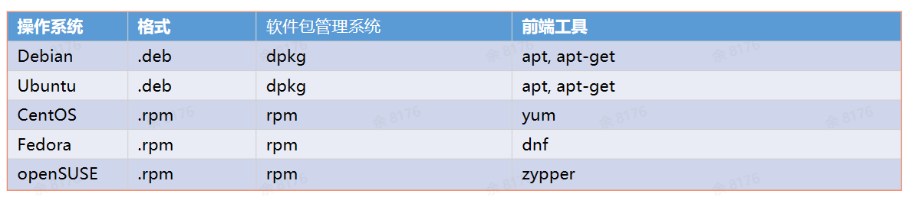

# Linux基础

### 命令

##### 1 查看 Linux 系统内核版本

```
# 方法1
uname -a
# 方法2
cat /proc/version
```


### 框架

[Linux框架图](../img/linux框架.png)

[Linux漫画](../img/Linux漫画.png)


### 概念

#### 1 Linux 基本组成

- 内核

- shell 

- 文件系统
- 应用程序


### 2 Linux 体系结构

##### 1 内核态

- 内核是硬件与软件之间的中间层
- 内核是一个资源管理程序
- 内核提供一组面向系统的命令

##### 2 用户态


### 3 Linux 系统结构

#### 进程管理

- 进程是正在执行的一个程序或命令
- 进程有自己的地址空间，占用一定的系统资源
- 一个CPU＆同一时间只能运行一个进程
- 进程由它的进程ID (PID) 和它父进程的ID (PID) 唯一标识（类似类的继承，树型结构）


##### 命令——查询进程信息

```
# 查看启动的 nginx 进程
ps -of | grep nginx

# 查看某个进程
top -p 93824

# 关闭指定进程
kill 93824

# 全部进程动态实时视图
top
```


#### 进程调度

进程调度是指操作系统按某种策略或规则选择进程占用CPU进行运行的过程


#### 系统调用

用户程序会频繁的在用户态和内核态之间进行切换，从而使得应用程序能够使用硬件和内核态的资源。


#### 文件系统

- 文件系统是操作系统中复制管理持久数据的子系统，负责把用户的文件存到硬盘中，持久化的保存文件。
- Linux 文件系统是采用树状的目录结构，最上层是 / (根) 目录

- 虚拟文件系统 (VFS)：对应用层/文件系统提供一个标准的文件操作接口


##### 命令 —— 查看文件系统类型

````
# df 命令报告文件系统磁盘空间利用率
df -T

# mount 命令是 挂载文件系统用的，不带任何参数运行，会打印包含文件系统类型在内的磁盘分区信息
mount 
````

##### 命令 —— 文件夹基本操作

````
ls # 查看文件夹内容
mkdir demo # 创建名为demo的文件夹
mv demo /home # 移动demo文件夹到/home
rm -r demo # 删除demo文件夹
touch file.txt # 创建空文件
cp file.txt file_bak.txt # 复制文件
````


#### 用户权限

##### 1 用户账户

- 普通用户
- 超级用户：在系统中对用户和整个系统进行管理

##### 2 组账户

- 标准组：可以容纳多个用户
- 私有组：只有用户自己


##### 命令 —— 查看用户信息

````
w # 查看当前登录用户信息
groups # 查看当前用户所属的组
id xxxx # 查看用户的uid 信息
````


#### 文件权限

- 所有者：文件所有者
- 所在组：文件所有者所在的组
- 其他人：除文件所有者即所在组外的所有人

每个用户对于文件都有不同的权限，包括读(R)、写(W)、执行(X)


### 软件包

- 底层工具：RPM、DPKG
- 上层工具



debian apt 常用软件


