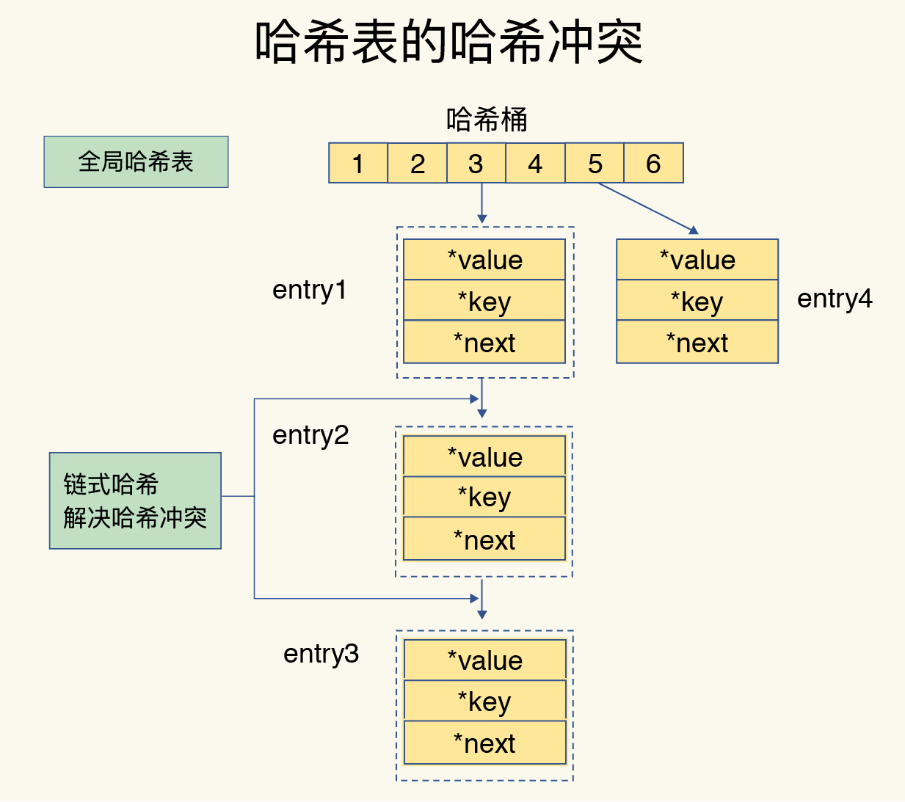
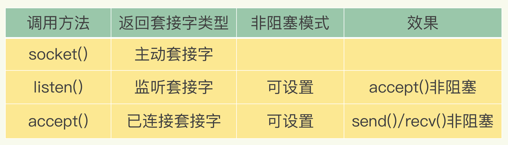

# 概述

所谓的 Redis 知识全景图都包括什么呢？简单来说，就是“两大维度，三大主线”。

“两大维度”就是指系统维度和应用维度，“三大主线”也就是指高性能、高可靠和高可扩展（可以简称为“三高”）。

首先，从系统维度上说，你需要了解 Redis 的各项关键技术的设计原理，这些能够为你判断和推理问题打下坚实的基础，而且，你还能从中掌握一些优雅的系统设计规范，例如run-to-complete 模型、epoll 网络模型，这些可以应用到你后续的系统开发实践中。

别看技术点是零碎的，其实你完全可以按照这三大主线，给它们分下类，就像图片中展示的那样，具体如下：

**高性能主线**，包括线程模型、数据结构、持久化、网络框架；

**高可靠主线**，包括主从复制、哨兵机制；

**高可扩展主线**，包括数据分片、负载均衡。

其次，在应用维度上，我建议你按照两种方式学习: “**应用场景驱动**”和“**典型案例驱动**”，一个是“面”的梳理，一个是“点”的掌握。

# 数据结构：快速的Redis有哪些慢操作？

简单来说，底层数据结构一共有 6 种，分别是简单动态字符串、双向链表、压缩列表、哈希表、跳表和整数数组。它们和数据类型的对应关系如下图所示：

## 键和值用什么结构组织？

为了实现从键到值的快速访问，**Redis 使用了一个哈希表来保存所有键值对**。一个哈希表，其实就是一个数组，数组的每个元素称为一个哈希桶。所以，我们常说，一个哈希表是由多个哈希桶组成的，每个哈希桶中保存了键值对数据。

看到这里，你可能会问了：“如果值是集合类型的话，作为数组元素的哈希桶怎么来保存呢？”

其实，哈希桶中的元素保存的并不是值本身，而是指向具体值的指针。这也就是说，不管值是 String，还是集合类型，哈希桶中的元素都是指向它们的指针。

在下图中，可以看到，哈希桶中的 entry 元素中保存了*key和*value指针，分别指向了实际的键和值，这样一来，即使值是一个集合，也可以通过*value指针被查找到。

因为这个哈希表保存了所有的键值对，所以，我也把它称为**全局哈希表**。哈希表的最大好处很明显，就是让我们可以用 O(1) 的时间复杂度来快速查找到键值对——我们只需要计算键的哈希值，就可以知道它所对应的哈希桶位置，然后就可以访问相应的 entry 元素。

你看，这个查找过程主要依赖于哈希计算，和数据量的多少并没有直接关系。也就是说，不管哈希表里有 10 万个键还是 100 万个键，我们只需要一次计算就能找到相应的键。但是，如果你只是了解了哈希表的 O(1) 复杂度和快速查找特性，那么，当你往 Redis 中写入大量数据后，就可能发现操作有时候会突然变慢了。这其实是因为你忽略了一个潜在的风险点，那就是**哈希表的冲突问题和 rehash 可能带来的操作阻塞。**

## 为什么哈希表操作变慢了？

当你往哈希表中写入更多数据时，哈希冲突是不可避免的问题。这里的哈希冲突，也就是指，两个 key 的哈希值和哈希桶计算对应关系时，正好落在了同一个哈希桶中。毕竟，哈希桶的个数通常要少于 key 的数量，这也就是说，难免会有一些 key 的哈希值对应到了同一个哈希桶中。

Redis 解决哈希冲突的方式，就是链式哈希。链式哈希也很容易理解，就是指**同一个哈希桶中的多个元素用一个链表来保存，它们之间依次用指针连接**。

如下图所示：entry1、entry2 和 entry3 都需要保存在哈希桶 3 中，导致了哈希冲突。此时，entry1 元素会通过一个*next指针指向 entry2，同样，entry2 也会通过*next指针指向 entry3。这样一来，即使哈希桶 3 中的元素有 100 个，我们也可以通过 entry 元素中的指针，把它们连起来。这就形成了一个链表，也叫作哈希冲突链。

但是，这里依然存在一个问题，哈希冲突链上的元素只能通过指针逐一查找再操作。如果哈希表里写入的数据越来越多，哈希冲突可能也会越来越多，这就会导致某些哈希冲突链过长，进而导致这个链上的元素查找耗时长，效率降低。对于追求“快”的 Redis 来说，这是不太能接受的。

所以，Redis 会对哈希表做 rehash 操作。rehash 也就是增加现有的哈希桶数量，让逐渐增多的 entry 元素能在更多的桶之间分散保存，减少单个桶中的元素数量，从而减少单个桶中的冲突。那具体怎么做呢？

**其实，为了使 rehash 操作更高效，Redis 默认使用了两个全局哈希表：哈希表 1 和哈希表 2。**一开始，当你刚插入数据时，默认使用哈希表 1，此时的哈希表 2 并没有被分配空间。随着数据逐步增多，Redis 开始执行 rehash，这个过程分为三步：

1. 给哈希表 2 分配更大的空间，例如是当前哈希表 1 大小的两倍；

2. 把哈希表 1 中的数据重新映射并拷贝到哈希表 2 中；

3. 释放哈希表 1 的空间。

到此，我们就可以从哈希表 1 切换到哈希表 2，用增大的哈希表 2 保存更多数据，而原来的哈希表 1 留作下一次 rehash 扩容备用。

这个过程看似简单，但是第二步涉及大量的数据拷贝，如果一次性把哈希表 1 中的数据都迁移完，会造成 Redis 线程阻塞，无法服务其他请求。此时，Redis 就无法快速访问数据了。

为了避免这个问题，Redis 采用了**渐进式 rehash**。

简单来说就是在第二步拷贝数据时，Redis 仍然正常处理客户端请求，每处理一个请求时，从哈希表 1 中的第一个索引位置开始，顺带着将这个索引位置上的所有 entries 拷贝到哈希表 2 中；等处理下一个请求时，再顺带拷贝哈希表 1 中的下一个索引位置的entries。如下图所示：

这样就巧妙地把一次性大量拷贝的开销，分摊到了多次处理请求的过程中，避免了耗时操作，保证了数据的快速访问。好了，到这里，你应该就能理解，Redis 的键和值是怎么通过哈希表组织的了。对于String 类型来说，找到哈希桶就能直接增删改查了，所以，哈希表的 O(1) 操作复杂度也就是它的复杂度了。

## 集合类型

### 集合数据操作效率

和 String 类型不同，一个集合类型的值，第一步是通过全局哈希表找到对应的哈希桶位置，第二步是在集合中再增删改查。那么，集合的操作效率和哪些因素相关呢？

首先，与集合的底层数据结构有关。例如，使用哈希表实现的集合，要比使用链表实现的集合访问效率更高。其次，操作效率和这些操作本身的执行特点有关，比如读写一个元素的操作要比读写所有元素的效率高。

### 底层数据结构

集合类型的底层数据结构主要有 5 种：整数数组、双向链表、哈希表、压缩列表和跳表。

整数数组和双向链表也很常见，它们的操作特征都是顺序读写，也就是通过数组下标或者链表的指针逐个元素访问，操作复杂度基本是 O(N)，操作效率比较低。

压缩列表（类似Slice）实际上类似于一个数组，数组中的每一个元素都对应保存一个数据。和数组不同的是，**压缩列表在表头有三个字段 zlbytes、zltail 和 zllen，分别表示列表长度、列表尾的偏移量和列表中的 entry 个数**；压缩列表在表尾还有一个 zlend，表示列表结束。

有序链表只能逐一查找元素，导致操作起来非常缓慢，于是就出现了跳表。具体来说，跳表（类似二分查找）在链表的基础上，**增加了多级索引，通过索引位置的几个跳转，实现数据的快速定位**，如下图所示：

如果我们还想再快，可以再增加二级索引：从一级索引中，再抽取部分元素作为二级索引。例如，从一级索引中抽取 1、27、100 作为二级索引，二级索引指向一级索引。这样，我们只需要 3 次查找，就能定位到元素 33 了。

可以看到，这个查找过程就是在多级索引上跳来跳去，最后定位到元素。这也正好符合“跳”表的叫法。当数据量很大时，跳表的查找复杂度就是 $O(logN)$。

我们现在可以按照查找的时间复杂度给这些数据结构分下类了：

**不同操作的复杂度**

集合类型的操作类型很多，有读写单个集合元素的，例如 HGET、HSET，也有操作多个元素的，例如 SADD，还有对整个集合进行遍历操作的，例如 SMEMBERS。这么多操作，它们的复杂度也各不相同。而复杂度的高低又是我们选择集合类型的重要依据。

我总结了一个“四句口诀”，希望能帮助你快速记住集合常见操作的复杂度。这样你在使用过程中，就可以提前规避高复杂度操作了。

- 单元素操作是基础；
- 范围操作非常耗时；
- 统计操作通常高效；
- 例外情况只有几个。

第一，**单元素操作，是指每一种集合类型对单个数据实现的增删改查操作**。例如，Hash 类型的 HGET、HSET 和 HDEL，Set 类型的 SADD、SREM、SRANDMEMBER 等。这些操作的复杂度由集合采用的数据结构决定，例如，HGET、HSET 和 HDEL 是对哈希表做操作，所以它们的复杂度都O(1)；Set 类型用哈希表作为底层数据结构时，它的 SADD、SREM、SRANDMEMBER 复杂度也是 O(1)。

这里，有个地方你需要注意一下，集合类型支持同时对多个元素进行增删改查，例如 Hash类型的HMGET 和 HMSET，Set 类型的 SADD 也支持同时增加多个元素。此时，这些操作的复杂度，就是由单个元素操作复杂度和元素个数决定的。例如，HMSET 增加 M 个元素时，复杂度就从 O(1) 变成O(M) 了。

第二，**范围操作，是指集合类型中的遍历操作，可以返回集合中的所有数据**，比如 Hash类型的 HGETALL 和 Set 类型的 SMEMBERS，或者返回一个范围内的部分数据，比如 List类型的 LRANGE 和 ZSet 类型的 ZRANGE。**这类操作的复杂度一般是 O(N)，比较耗时，我们应该尽量避免**。

不过，Redis 从 2.8 版本开始提供了 SCAN 系列操作（包括 HSCAN，SSCAN 和ZSCAN），这类操作实现了渐进式遍历，每次只返回有限数量的数据。这样一来，相比于HGETALL、SMEMBERS 这类操作来说，就避免了一次性返回所有元素而导致的 Redis 阻塞。

第三，统计操作，是指**集合类型对集合中所有元素个数的记录**，例如 LLEN 和 SCARD。这类操作复杂度只有 O(1)，这是因为当集合类型采用压缩列表、双向链表、整数数组这些数据结构时，这些结构中专门记录了元素的个数统计，因此可以高效地完成相关操作。

第四，例外情况，是指某些数据结构的特殊记录，例如**压缩列表和双向链表都会记录表头和表尾的偏移量**。这样一来，对于 List 类型的 LPOP、RPOP、LPUSH、RPUSH 这四个操作来说，它们是在列表的头尾增删元素，这就可以通过偏移量直接定位，所以它们的复杂度也只有 O(1)，可以实现快速操作。

# 高性能IO模型：为什么单线程Redis能那么快？

我们通常说，Redis 是单线程，主要是指 **Redis 的网络 IO和键值对读写是由一个线程来完成的，这也是 Redis 对外提供键值存储服务的主要流程**。但 Redis 的其他功能，比如持久化、异步删除、集群数据同步等，其实是由额外的线程执行的。

## 问题

- Redis 为什么使用单线程？使用多线程会有什么问题？单线程为什么这么快？

现在，我们知道了，Redis 单线程是指它对网络 IO 和数据读写的操作采用了一个线程，而采用单线程的一个核心原因是避免多线程开发的并发控制问题。单线程的 Redis 也能获得高性能，跟多路复用的 IO 模型密切相关，因为这避免了 accept() 和 send()/recv() 潜在的网络 IO 操作阻塞点。

## Redis 为什么用单线程？

### 多线程的开销

日常写程序时，我们经常会听到一种说法：“使用多线程，可以增加系统吞吐率，或是可以增加系统扩展性。”的确，对于一个多线程的系统来说，在有合理的资源分配的情况下，可以增加系统中处理请求操作的资源实体，进而提升系统能够同时处理的请求数，即吞吐率。下面的左图是我们采用多线程时所期待的结果。

但是，通常情况下，在我们采用多线程后，如果没有良好的系统设计，实际得到的结果，其实是右图所展示的那样。我们刚开始增加线程数时，系统吞吐率会增加，但是，再进一步增加线程时，系统吞吐率就增长迟缓了，有时甚至还会出现下降的情况。

为什么会出现这种情况呢？一个关键的瓶颈在于，系统中通常会存在被多线程同时访问的共享资源，比如一个共享的数据结构。当有多个线程要修改这个共享资源时，**为了保证共享资源的正确性，就需要有额外的机制进行保证，而这个额外的机制，就会带来额外的开销。**

假设 Redis 采用多线程设计，如下图所示，现在有两个线程 A 和 B，线程 A 对一个 List 做 LPUSH 操作，并对队列长度加 1。同时，线程 B 对该 List 执行LPOP 操作，并对队列长度减 1。为了保证队列长度的正确性，**Redis 需要让线程 A 和 B的 LPUSH 和 LPOP 串行执行**，这样一来，Redis 可以无误地记录它们对 List 长度的修改。否则，我们可能就会得到错误的长度结果。这就是**多线程编程模式面临的共享资源的并发访问控制问题**。

**而且，采用多线程开发一般会引入同步原语来保护共享资源的并发访问，这也会降低系统代码的易调试性和可维护性。为了避免这些问题，Redis 直接采用了单线程模式。**

## **单线程** Redis 为什么那么快？

通常来说，单线程的处理能力要比多线程差很多，但是 Redis 却能使用单线程模型达到每秒数十万级别的处理能力，这是为什么呢？其实，这是 Redis 多方面设计选择的一个综合结果。	

一方面，Redis 的大部分操作**在内存上完成**，再加上它采用了**高效的数据结构**，例如哈希表和跳表，这是它实现高性能的一个重要原因。另一方面，就是 Redis 采用了**多路复用机制**，使其在网络 IO 操作中能并发处理大量的客户端请求，实现高吞吐率。

首先，我们要弄明白网络操作的基本 IO 模型和潜在的阻塞点。毕竟，Redis 采用单线程进行 IO，如果线程被阻塞了，就无法进行多路复用了。

### **基本** **IO 模型与阻塞点**

以 Get 请求为例，SimpleKV 为了处理一个 Get 请求，需要监听客户端请求（bind/listen），和客户端建立连接（accept），从 socket 中读取请求（recv），解析客户端发送请求（parse），根据请求类型读取键值数据（get），最后给客户端返回结果，即向 socket 中写回数据（send）。下图显示了这一过程，其中，bind/listen、accept、recv、parse 和 send 属于网络 IO 处理，而 get 属于键值数据操作。既然 Redis 是单线程，那么，最基本的一种实现是在一个线程中依次执行上面说的这些操作。

但是，在这里的网络 IO 操作中，有潜在的阻塞点，分别是 accept() 和 recv()。当 Redis 监听到一个客户端有连接请求，但一直未能成功建立起连接时，会阻塞在 accept() 函数这里，导致其他客户端无法和 Redis 建立连接。类似的，当 Redis 通过 recv() 从一个客户端读取数据时，如果数据一直没有到达，Redis 也会一直阻塞在 recv()。这就导致 Redis 整个线程阻塞，无法处理其他客户端请求，效率很低。不过，幸运的是，socket 网络模型本身支持非阻塞模式。

### 非阻塞模式

Socket 网络模型的非阻塞模式设置，主要体现在三个关键的函数调用上，如果想要使用 socket 非阻塞模式，就必须要了解这三个函数的调用返回类型和设置模式。接下来，我们就重点学习下它们。在 socket 模型中，不同操作调用后会返回不同的套接字类型。socket() 方法会返回主动套接字，然后调用 listen() 方法，将主动套接字转化为监听套接字，此时，可以监听来自客户端的连接请求。最后，调用 accept() 方法接收到达的客户端连接，并返回已连接套接字。

针对监听套接字，我们可以设置非阻塞模式：当 Redis 调用 accept() 但一直未有连接请求到达时，Redis 线程可以返回处理其他操作，而不用一直等待。但是，你要注意的是，调用 accept() 时，已经存在监听套接字了。

虽然 Redis 线程可以不用继续等待，但是总得有机制继续在监听套接字上等待后续连接请求，并在有请求时通知 Redis。

类似的，我们也可以针对已连接套接字设置非阻塞模式：Redis 调用 recv() 后，如果已连接套接字上一直没有数据到达，Redis 线程同样可以返回处理其他操作。我们也需要有机制继续监听该已连接套接字，并在有数据达到时通知 Redis。这样才能保证 Redis 线程，既不会像基本 IO 模型中一直在阻塞点等待，也不会导致 Redis 无法处理实际到达的连接请求或数据。

### 基于多路复用的高性能I/O 模型

Linux 中的 IO 多路复用机制是指一个线程处理多个 IO 流，就是我们经常听到的 select/epoll 机制。简单来说，在 Redis 只运行单线程的情况下，**该机制允许内核中，同时存在多个监听套接字和已连接套接字**。内核会一直监听这些套接字上的连接请求或数据请求。一旦有请求到达，就会交给 Redis 线程处理，这就实现了一个 Redis 线程处理多个 IO 流的效果。

下图就是基于多路复用的 Redis IO 模型。图中的多个 FD 就是刚才所说的多个套接字。Redis 网络框架调用 epoll 机制，让内核监听这些套接字。此时，Redis 线程不会阻塞在某一个特定的监听或已连接套接字上，也就是说，不会阻塞在某一个特定的客户端请求处理上。正因为此，Redis 可以同时和多个客户端连接并处理请求，从而提升并发性。

为了在请求到达时能通知到 Redis 线程，select/epoll 提供了**基于事件的回调机制**，即**针对不同事件的发生，调用相应的处理函数**。

那么，回调机制是怎么工作的呢？其实，**select/epoll 一旦监测到 FD 上有请求到达时，就会触发相应的事件。这些事件会被放进一个事件队列，Redis 单线程对该事件队列不断进行处理。**这样一来，Redis 无需一直轮询是否有请求实际发生，这就可以避免造成 CPU 资源浪费。同时，**Redis 在对事件队列中的事件进行处理时，会调用相应的处理函数，这就实现了基于事件的回调。**因为 Redis 一直在对事件队列进行处理，所以能及时响应客户端请求，提升 Redis 的响应性能。

>  为了方便理解，以连接请求和读数据请求为例，具体解释一下：

这两个请求分别对应 Accept 事件和 Read 事件，Redis 分别对这两个事件注册 accept 和get 回调函数。当 Linux 内核监听到有连接请求或读数据请求时，就会触发 Accept 事件和 Read 事件，此时，内核就会回调 Redis 相应的 accept 和 get 函数进行处理。这就像病人去医院瞧病。在医生实际诊断前，每个病人（等同于请求）都需要先分诊、测体温、登记等。如果这些工作都由医生来完成，医生的工作效率就会很低。所以，医院都设置了分诊台，分诊台会一直处理这些诊断前的工作（类似于 Linux 内核监听请求），然后再转交给医生做实际诊断。这样即使一个医生（相当于 Redis 单线程），效率也能提升。

不过，需要注意的是，即使你的应用场景中部署了不同的操作系统，多路复用机制也是适用的。因为这个机制的实现有很多种，既有基于 Linux 系统下的 select 和 epoll 实现，也有基于 FreeBSD 的 kqueue 实现，以及基于 Solaris 的 evport 实现，这样，你可以根据 Redis 实际运行的操作系统，选择相应的多路复用实现。