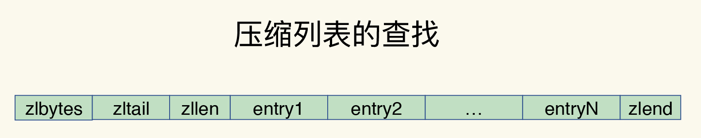
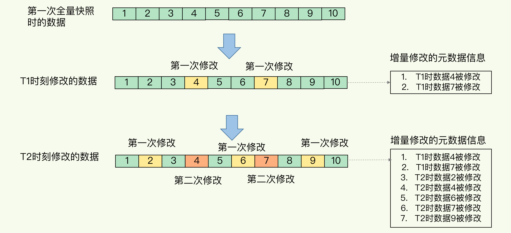
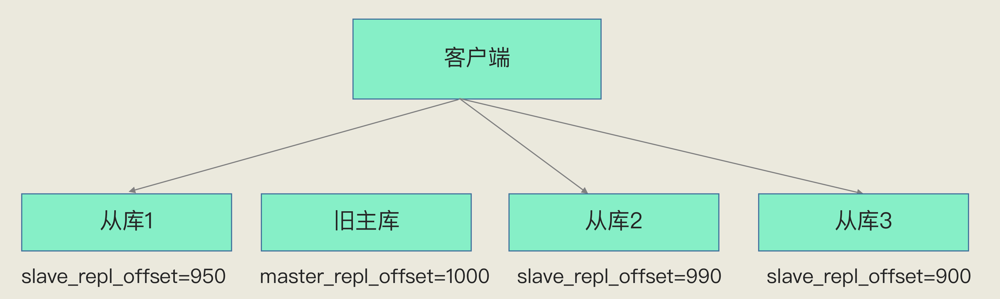

# 概述

所谓的 Redis 知识全景图都包括什么呢？简单来说，就是“两大维度，三大主线”。


“两大维度”就是指系统维度和应用维度，“三大主线”也就是指高性能、高可靠和高可扩展（可以简称为“三高”）。

首先，从系统维度上说，你需要了解 Redis 的各项关键技术的设计原理，这些能够为你判断和推理问题打下坚实的基础，而且，你还能从中掌握一些优雅的系统设计规范，例如run-to-complete 模型、epoll 网络模型，这些可以应用到你后续的系统开发实践中。

别看技术点是零碎的，其实你完全可以按照这三大主线，给它们分下类，就像图片中展示的那样，具体如下：

**高性能主线**，包括线程模型、数据结构、持久化、网络框架；

**高可靠主线**，包括主从复制、哨兵机制；

**高可扩展主线**，包括数据分片、负载均衡。

其次，在应用维度上，我建议你按照两种方式学习: “**应用场景驱动**”和“**典型案例驱动**”，一个是“面”的梳理，一个是“点”的掌握。


# 数据结构：快速的Redis有哪些慢操作？

简单来说，底层数据结构一共有 6 种，分别是简单动态字符串、双向链表、压缩列表、哈希表、跳表和整数数组。它们和数据类型的对应关系如下图所示：


## 键和值用什么结构组织？

为了实现从键到值的快速访问，**Redis 使用了一个哈希表来保存所有键值对**。一个哈希表，其实就是一个数组，数组的每个元素称为一个哈希桶。所以，我们常说，一个哈希表是由多个哈希桶组成的，每个哈希桶中保存了键值对数据。

看到这里，你可能会问了：“如果值是集合类型的话，作为数组元素的哈希桶怎么来保存呢？”

其实，哈希桶中的元素保存的并不是值本身，而是指向具体值的指针。这也就是说，不管值是 String，还是集合类型，哈希桶中的元素都是指向它们的指针。

在下图中，可以看到，哈希桶中的 entry 元素中保存了*key和*value指针，分别指向了实际的键和值，这样一来，即使值是一个集合，也可以通过*value指针被查找到。


因为这个哈希表保存了所有的键值对，所以，我也把它称为**全局哈希表**。哈希表的最大好处很明显，就是让我们可以用 O(1) 的时间复杂度来快速查找到键值对——我们只需要计算键的哈希值，就可以知道它所对应的哈希桶位置，然后就可以访问相应的 entry 元素。

你看，这个查找过程主要依赖于哈希计算，和数据量的多少并没有直接关系。也就是说，不管哈希表里有 10 万个键还是 100 万个键，我们只需要一次计算就能找到相应的键。但是，如果你只是了解了哈希表的 O(1) 复杂度和快速查找特性，那么，当你往 Redis 中写入大量数据后，就可能发现操作有时候会突然变慢了。这其实是因为你忽略了一个潜在的风险点，那就是**哈希表的冲突问题和 rehash 可能带来的操作阻塞。**


## 为什么哈希表操作变慢了？

当你往哈希表中写入更多数据时，哈希冲突是不可避免的问题。这里的哈希冲突，也就是指，两个 key 的哈希值和哈希桶计算对应关系时，正好落在了同一个哈希桶中。毕竟，哈希桶的个数通常要少于 key 的数量，这也就是说，难免会有一些 key 的哈希值对应到了同一个哈希桶中。

Redis 解决哈希冲突的方式，就是链式哈希。链式哈希也很容易理解，就是指**同一个哈希桶中的多个元素用一个链表来保存，它们之间依次用指针连接**。

如下图所示：entry1、entry2 和 entry3 都需要保存在哈希桶 3 中，导致了哈希冲突。此时，entry1 元素会通过一个*next指针指向 entry2，同样，entry2 也会通过*next指针指向 entry3。这样一来，即使哈希桶 3 中的元素有 100 个，我们也可以通过 entry 元素中的指针，把它们连起来。这就形成了一个链表，也叫作哈希冲突链。


但是，这里依然存在一个问题，哈希冲突链上的元素只能通过指针逐一查找再操作。如果哈希表里写入的数据越来越多，哈希冲突可能也会越来越多，这就会导致某些哈希冲突链过长，进而导致这个链上的元素查找耗时长，效率降低。对于追求“快”的 Redis 来说，这是不太能接受的。

所以，Redis 会对哈希表做 rehash 操作。rehash 也就是增加现有的哈希桶数量，让逐渐增多的 entry 元素能在更多的桶之间分散保存，减少单个桶中的元素数量，从而减少单个桶中的冲突。那具体怎么做呢？

**其实，为了使 rehash 操作更高效，Redis 默认使用了两个全局哈希表：哈希表 1 和哈希表 2。**一开始，当你刚插入数据时，默认使用哈希表 1，此时的哈希表 2 并没有被分配空间。随着数据逐步增多，Redis 开始执行 rehash，这个过程分为三步：

1. 给哈希表 2 分配更大的空间，例如是当前哈希表 1 大小的两倍；

2. 把哈希表 1 中的数据重新映射并拷贝到哈希表 2 中；

3. 释放哈希表 1 的空间。

到此，我们就可以从哈希表 1 切换到哈希表 2，用增大的哈希表 2 保存更多数据，而原来的哈希表 1 留作下一次 rehash 扩容备用。

这个过程看似简单，但是第二步涉及大量的数据拷贝，如果一次性把哈希表 1 中的数据都迁移完，会造成 Redis 线程阻塞，无法服务其他请求。此时，Redis 就无法快速访问数据了。

为了避免这个问题，Redis 采用了**渐进式 rehash**。

简单来说就是在第二步拷贝数据时，Redis 仍然正常处理客户端请求，每处理一个请求时，从哈希表 1 中的第一个索引位置开始，顺带着将这个索引位置上的所有 entries 拷贝到哈希表 2 中；等处理下一个请求时，再顺带拷贝哈希表 1 中的下一个索引位置的entries。如下图所示：


这样就巧妙地把一次性大量拷贝的开销，分摊到了多次处理请求的过程中，避免了耗时操作，保证了数据的快速访问。好了，到这里，你应该就能理解，Redis 的键和值是怎么通过哈希表组织的了。对于String 类型来说，找到哈希桶就能直接增删改查了，所以，哈希表的 O(1) 操作复杂度也就是它的复杂度了。


## 集合类型

### 集合数据操作效率

和 String 类型不同，一个集合类型的值，第一步是通过全局哈希表找到对应的哈希桶位置，第二步是在集合中再增删改查。那么，集合的操作效率和哪些因素相关呢？

首先，与集合的底层数据结构有关。例如，使用哈希表实现的集合，要比使用链表实现的集合访问效率更高。其次，操作效率和这些操作本身的执行特点有关，比如读写一个元素的操作要比读写所有元素的效率高。


### 底层数据结构

集合类型的底层数据结构主要有 5 种：整数数组、双向链表、哈希表、压缩列表和跳表。

整数数组和双向链表也很常见，它们的操作特征都是顺序读写，也就是通过数组下标或者链表的指针逐个元素访问，操作复杂度基本是 O(N)，操作效率比较低。

压缩列表（类似Slice）实际上类似于一个数组，数组中的每一个元素都对应保存一个数据。和数组不同的是，**压缩列表在表头有三个字段 zlbytes、zltail 和 zllen，分别表示列表长度、列表尾的偏移量和列表中的 entry 个数**；压缩列表在表尾还有一个 zlend，表示列表结束。



有序链表只能逐一查找元素，导致操作起来非常缓慢，于是就出现了跳表。具体来说，跳表（类似二分查找）在链表的基础上，**增加了多级索引，通过索引位置的几个跳转，实现数据的快速定位**，如下图所示：


如果我们还想再快，可以再增加二级索引：从一级索引中，再抽取部分元素作为二级索引。例如，从一级索引中抽取 1、27、100 作为二级索引，二级索引指向一级索引。这样，我们只需要 3 次查找，就能定位到元素 33 了。

可以看到，这个查找过程就是在多级索引上跳来跳去，最后定位到元素。这也正好符合“跳”表的叫法。当数据量很大时，跳表的查找复杂度就是 $O(logN)$。


我们现在可以按照查找的时间复杂度给这些数据结构分下类了：


**不同操作的复杂度**

集合类型的操作类型很多，有读写单个集合元素的，例如 HGET、HSET，也有操作多个元素的，例如 SADD，还有对整个集合进行遍历操作的，例如 SMEMBERS。这么多操作，它们的复杂度也各不相同。而复杂度的高低又是我们选择集合类型的重要依据。

我总结了一个“四句口诀”，希望能帮助你快速记住集合常见操作的复杂度。这样你在使用过程中，就可以提前规避高复杂度操作了。

- 单元素操作是基础；
- 范围操作非常耗时；
- 统计操作通常高效；
- 例外情况只有几个。

第一，**单元素操作，是指每一种集合类型对单个数据实现的增删改查操作**。例如，Hash 类型的 HGET、HSET 和 HDEL，Set 类型的 SADD、SREM、SRANDMEMBER 等。这些操作的复杂度由集合采用的数据结构决定，例如，HGET、HSET 和 HDEL 是对哈希表做操作，所以它们的复杂度都O(1)；Set 类型用哈希表作为底层数据结构时，它的 SADD、SREM、SRANDMEMBER 复杂度也是 O(1)。

这里，有个地方你需要注意一下，集合类型支持同时对多个元素进行增删改查，例如 Hash类型的HMGET 和 HMSET，Set 类型的 SADD 也支持同时增加多个元素。此时，这些操作的复杂度，就是由单个元素操作复杂度和元素个数决定的。例如，HMSET 增加 M 个元素时，复杂度就从 O(1) 变成O(M) 了。

第二，**范围操作，是指集合类型中的遍历操作，可以返回集合中的所有数据**，比如 Hash类型的 HGETALL 和 Set 类型的 SMEMBERS，或者返回一个范围内的部分数据，比如 List类型的 LRANGE 和 ZSet 类型的 ZRANGE。**这类操作的复杂度一般是 O(N)，比较耗时，我们应该尽量避免**。

不过，Redis 从 2.8 版本开始提供了 SCAN 系列操作（包括 HSCAN，SSCAN 和ZSCAN），这类操作实现了渐进式遍历，每次只返回有限数量的数据。这样一来，相比于HGETALL、SMEMBERS 这类操作来说，就避免了一次性返回所有元素而导致的 Redis 阻塞。

第三，统计操作，是指**集合类型对集合中所有元素个数的记录**，例如 LLEN 和 SCARD。这类操作复杂度只有 O(1)，这是因为当集合类型采用压缩列表、双向链表、整数数组这些数据结构时，这些结构中专门记录了元素的个数统计，因此可以高效地完成相关操作。

第四，例外情况，是指某些数据结构的特殊记录，例如**压缩列表和双向链表都会记录表头和表尾的偏移量**。这样一来，对于 List 类型的 LPOP、RPOP、LPUSH、RPUSH 这四个操作来说，它们是在列表的头尾增删元素，这就可以通过偏移量直接定位，所以它们的复杂度也只有 O(1)，可以实现快速操作。


# 高性能IO模型：为什么单线程Redis能那么快？

我们通常说，Redis 是单线程，主要是指 **Redis 的网络 IO和键值对读写是由一个线程来完成的，这也是 Redis 对外提供键值存储服务的主要流程**。但 Redis 的其他功能，比如持久化、异步删除、集群数据同步等，其实是由额外的线程执行的。


## 问题

- Redis 为什么使用单线程？使用多线程会有什么问题？单线程为什么这么快？

现在，我们知道了，Redis 单线程是指它对网络 IO 和数据读写的操作采用了一个线程，而采用单线程的一个核心原因是避免多线程开发的并发控制问题。单线程的 Redis 也能获得高性能，跟多路复用的 IO 模型密切相关，因为这避免了 accept() 和 send()/recv() 潜在的网络 IO 操作阻塞点。


## Redis 为什么用单线程？


### 多线程的开销

日常写程序时，我们经常会听到一种说法：“使用多线程，可以增加系统吞吐率，或是可以增加系统扩展性。”的确，对于一个多线程的系统来说，在有合理的资源分配的情况下，可以增加系统中处理请求操作的资源实体，进而提升系统能够同时处理的请求数，即吞吐率。下面的左图是我们采用多线程时所期待的结果。

但是，通常情况下，在我们采用多线程后，如果没有良好的系统设计，实际得到的结果，其实是右图所展示的那样。我们刚开始增加线程数时，系统吞吐率会增加，但是，再进一步增加线程时，系统吞吐率就增长迟缓了，有时甚至还会出现下降的情况。


为什么会出现这种情况呢？一个关键的瓶颈在于，系统中通常会存在被多线程同时访问的共享资源，比如一个共享的数据结构。当有多个线程要修改这个共享资源时，**为了保证共享资源的正确性，就需要有额外的机制进行保证，而这个额外的机制，就会带来额外的开销。**

假设 Redis 采用多线程设计，如下图所示，现在有两个线程 A 和 B，线程 A 对一个 List 做 LPUSH 操作，并对队列长度加 1。同时，线程 B 对该 List 执行LPOP 操作，并对队列长度减 1。为了保证队列长度的正确性，**Redis 需要让线程 A 和 B的 LPUSH 和 LPOP 串行执行**，这样一来，Redis 可以无误地记录它们对 List 长度的修改。否则，我们可能就会得到错误的长度结果。这就是**多线程编程模式面临的共享资源的并发访问控制问题**。


**而且，采用多线程开发一般会引入同步原语来保护共享资源的并发访问，这也会降低系统代码的易调试性和可维护性。为了避免这些问题，Redis 直接采用了单线程模式。**


## **单线程** Redis 为什么那么快？

通常来说，单线程的处理能力要比多线程差很多，但是 Redis 却能使用单线程模型达到每秒数十万级别的处理能力，这是为什么呢？其实，这是 Redis 多方面设计选择的一个综合结果。	

一方面，Redis 的大部分操作**在内存上完成**，再加上它采用了**高效的数据结构**，例如哈希表和跳表，这是它实现高性能的一个重要原因。另一方面，就是 Redis 采用了**多路复用机制**，使其在网络 IO 操作中能并发处理大量的客户端请求，实现高吞吐率。


首先，我们要弄明白网络操作的基本 IO 模型和潜在的阻塞点。毕竟，Redis 采用单线程进行 IO，如果线程被阻塞了，就无法进行多路复用了。


### **基本** **IO 模型与阻塞点**

以 Get 请求为例，SimpleKV 为了处理一个 Get 请求，需要监听客户端请求（bind/listen），和客户端建立连接（accept），从 socket 中读取请求（recv），解析客户端发送请求（parse），根据请求类型读取键值数据（get），最后给客户端返回结果，即向 socket 中写回数据（send）。下图显示了这一过程，其中，bind/listen、accept、recv、parse 和 send 属于网络 IO 处理，而 get 属于键值数据操作。既然 Redis 是单线程，那么，最基本的一种实现是在一个线程中依次执行上面说的这些操作。


但是，在这里的网络 IO 操作中，有潜在的阻塞点，分别是 accept() 和 recv()。当 Redis 监听到一个客户端有连接请求，但一直未能成功建立起连接时，会阻塞在 accept() 函数这里，导致其他客户端无法和 Redis 建立连接。类似的，当 Redis 通过 recv() 从一个客户端读取数据时，如果数据一直没有到达，Redis 也会一直阻塞在 recv()。这就导致 Redis 整个线程阻塞，无法处理其他客户端请求，效率很低。不过，幸运的是，socket 网络模型本身支持非阻塞模式。


### 非阻塞模式

Socket 网络模型的非阻塞模式设置，主要体现在三个关键的函数调用上，如果想要使用 socket 非阻塞模式，就必须要了解这三个函数的调用返回类型和设置模式。接下来，我们就重点学习下它们。在 socket 模型中，不同操作调用后会返回不同的套接字类型。socket() 方法会返回主动套接字，然后调用 listen() 方法，将主动套接字转化为监听套接字，此时，可以监听来自客户端的连接请求。最后，调用 accept() 方法接收到达的客户端连接，并返回已连接套接字。


针对监听套接字，我们可以设置非阻塞模式：当 Redis 调用 accept() 但一直未有连接请求到达时，Redis 线程可以返回处理其他操作，而不用一直等待。但是，你要注意的是，调用 accept() 时，已经存在监听套接字了。

虽然 Redis 线程可以不用继续等待，但是总得有机制继续在监听套接字上等待后续连接请求，并在有请求时通知 Redis。

类似的，我们也可以针对已连接套接字设置非阻塞模式：Redis 调用 recv() 后，如果已连接套接字上一直没有数据到达，Redis 线程同样可以返回处理其他操作。我们也需要有机制继续监听该已连接套接字，并在有数据达到时通知 Redis。这样才能保证 Redis 线程，既不会像基本 IO 模型中一直在阻塞点等待，也不会导致 Redis 无法处理实际到达的连接请求或数据。


### 基于多路复用的高性能I/O 模型

Linux 中的 IO 多路复用机制是指一个线程处理多个 IO 流，就是我们经常听到的 select/epoll 机制。简单来说，在 Redis 只运行单线程的情况下，**该机制允许内核中，同时存在多个监听套接字和已连接套接字**。内核会一直监听这些套接字上的连接请求或数据请求。一旦有请求到达，就会交给 Redis 线程处理，这就实现了一个 Redis 线程处理多个 IO 流的效果。

下图就是基于多路复用的 Redis IO 模型。图中的多个 FD 就是刚才所说的多个套接字。Redis 网络框架调用 epoll 机制，让内核监听这些套接字。此时，Redis 线程不会阻塞在某一个特定的监听或已连接套接字上，也就是说，不会阻塞在某一个特定的客户端请求处理上。正因为此，Redis 可以同时和多个客户端连接并处理请求，从而提升并发性。


为了在请求到达时能通知到 Redis 线程，select/epoll 提供了**基于事件的回调机制**，即**针对不同事件的发生，调用相应的处理函数**。

那么，回调机制是怎么工作的呢？其实，**select/epoll 一旦监测到 FD 上有请求到达时，就会触发相应的事件。这些事件会被放进一个事件队列，Redis 单线程对该事件队列不断进行处理。**这样一来，Redis 无需一直轮询是否有请求实际发生，这就可以避免造成 CPU 资源浪费。同时，**Redis 在对事件队列中的事件进行处理时，会调用相应的处理函数，这就实现了基于事件的回调。**因为 Redis 一直在对事件队列进行处理，所以能及时响应客户端请求，提升 Redis 的响应性能。


>  为了方便理解，以连接请求和读数据请求为例，具体解释一下：

这两个请求分别对应 Accept 事件和 Read 事件，Redis 分别对这两个事件注册 accept 和get 回调函数。当 Linux 内核监听到有连接请求或读数据请求时，就会触发 Accept 事件和 Read 事件，此时，内核就会回调 Redis 相应的 accept 和 get 函数进行处理。这就像病人去医院瞧病。在医生实际诊断前，每个病人（等同于请求）都需要先分诊、测体温、登记等。如果这些工作都由医生来完成，医生的工作效率就会很低。所以，医院都设置了分诊台，分诊台会一直处理这些诊断前的工作（类似于 Linux 内核监听请求），然后再转交给医生做实际诊断。这样即使一个医生（相当于 Redis 单线程），效率也能提升。

不过，需要注意的是，即使你的应用场景中部署了不同的操作系统，多路复用机制也是适用的。因为这个机制的实现有很多种，既有基于 Linux 系统下的 select 和 epoll 实现，也有基于 FreeBSD 的 kqueue 实现，以及基于 Solaris 的 evport 实现，这样，你可以根据 Redis 实际运行的操作系统，选择相应的多路复用实现。


# AOF(Append Only File)日志：宕机了，Redis如何避免数据丢失？

如果有人问你：“你会把 Redis 用在什么业务场景下？”我想你大概率会说：“我会把它当作缓存使用，因为它把后端数据库中的数据存储在内存中，然后直接从内存中读取数据，响应速度会非常快。”没错，这确实是 Redis 的一个普遍使用场景，但是，这里也有一个绝对不能忽略的问题：**一旦服务器宕机，内存中的数据将全部丢失。**我们很容易想到的一个解决方案是，从后端数据库恢复这些数据，但这种方式存在两个问题：一是，需要频繁访问数据库，会给数据库带来巨大的压力；二是，这些数据是从慢速数据库中读取出来的，性能肯定比不上从 Redis 中读取，导致使用这些数据的应用程序响应变慢。所以，对 Redis 来说，实现数据的持久化，避免从后端数据库中进行恢复，是至关重要的。

**目前，Redis 的持久化主要有两大机制，即 AOF 日志和 RDB 快照。**


## AOF 日志是如何实现的？

说到日志，我们比较熟悉的是数据库的写前日志（Write Ahead Log, WAL），也就是说，在实际写数据前，先把修改的数据记到日志文件中，以便故障时进行恢复。不过，AOF 日志正好相反，它是写后日志，“写后”的意思是 Redis 是先执行命令，把数据写入内存，然后才记录日志，如下图所示：


## 那 AOF 为什么要先执行命令再记日志呢？

要回答这个问题，我们要先知道 AOF 里记录了什么内容。传统数据库的日志，例如 redo log（重做日志），<u>记录的是修改后的数据</u>，**而 AOF 里记录的是 Redis 收到的每一条命令，这些命令是以文本形式保存的。**我们以 Redis 收到 `set testkey testvalue` 命令后记录的日志为例，看看 AOF 日志的内容。其中， `*3` 表示当前命令有三个部分，每部分都是由 `$+数字` 开头，后面紧跟着具体的命令、键或值。这里，“数字”表示这部分中的命令、键或值一共有多少字节。例如，`$3 set` 表示这部分有 3 个字节，也就是 `set` 命令。


​		但是，**为了避免额外的检查开销，Redis 在向 AOF 里面记录日志的时候，并不会先去对这些命令进行语法检查。所以，如果先记日志再执行命令的话，日志中就有可能记录了错误的命令，Redis 在使用日志恢复数据时，就可能会出错。**而写后日志这种方式，就是先让系统执行命令，只有命令能执行成功，才会被记录到日志中，否则，系统就会直接向客户端报错。所以，Redis 使用写后日志这一方式的一大好处是，可以避免出现记录错误命令的情况。

除此之外，AOF 还有一个好处：它是在命令执行后才记录日志，所以**不会阻塞当前的写操作**。

​	不过，**AOF 也有两个潜在的风险。**

- 首先，如果刚执行完一个命令，还没有来得及记日志就宕机了，那么这个命令和相应的数据就有丢失的风险。如果此时 Redis 是用作缓存，还可以从后端数据库重新读入数据进行恢复，但是，**如果 Redis 是直接用作数据库的话，此时，因为命令没有记入日志，所以就无法用日志进行恢复了。**
- 其次，AOF 虽然避免了对当前命令的阻塞，但可能会给下一个操作带来阻塞风险。这是因为，AOF 日志也是在主线程中执行的，如果在把日志文件写入磁盘时，磁盘写压力大，就会导致写盘很慢，进而导致后续的操作也无法执行了。仔细分析的话，你就会发现，这两个风险都是和 AOF 写回磁盘的时机相关的。**这也就意味着，如果我们能够控制一个写命令执行完后 AOF 日志写回磁盘的时机，这两个风险就解除了。**


## 三种写回策略

​	其实，对于这个问题，AOF 机制给我们提供了三个选择，也就是 AOF 配置项 appendfsync 的三个可选值。**针对避免主线程阻塞和减少数据丢失问题，这三种写回策略都无法做到两全其美。**我们来分析下其中的原因。

- **Always**，同步写回：每个写命令执行完，**立马**同步地将日志写回磁盘；

- **Everysec**，每秒写回：每个写命令执行完，只是先把日志写到 AOF 文件的内存缓冲区，**每隔一秒**把缓冲区中的内容写入磁盘；

- **No**，操作系统控制的写回：每个写命令执行完，只是先把日志写到 AOF 文件的内存缓冲区，**由操作系统决定**何时将缓冲区内容写回磁盘。

针对避免主线程阻塞和减少数据丢失问题，这三种写回策略都无法做到两全其美。我们来分析下其中的原因。

- “同步写回”可以做到基本不丢数据，但是它在每一个写命令后都有一个慢速的落盘操作，不可避免地会影响主线程性能；虽然“操作系统控制的写回”在写完缓冲区后，就可以继续执行后续的命令，但是落盘的时机已经不在 Redis 手中了，只要 AOF 记录没有写回磁盘，一旦宕机对应的数据就丢失了；

- “每秒写回”采用一秒写回一次的频率，**避免了“同步写回”的性能开销**，虽然减少了对系统性能的影响，**但是如果发生宕机，上一秒内未落盘的命令操作仍然会丢失。**所以，这只能算是，在避免影响主线程性能和避免数据丢失两者间取了个折中。

我把这三种策略的写回时机，以及优缺点汇总在了一张表格里，以方便你随时查看。


到这里，我们就可以根据系统对高性能和高可靠性的要求，来选择使用哪种写回策略了。


**总结一下就是：想要获得高性能，就选择 No 策略；如果想要得到高可靠性保证，就选择Always 策略；如果允许数据有一点丢失，又希望性能别受太大影响的话，那么就选择Everysec 策略。**


但是，按照系统的性能需求选定了写回策略，并不是“高枕无忧”了。毕竟，AOF 是以文件的形式在记录接收到的所有写命令。随着接收的写命令越来越多，AOF 文件会越来越大。这也就意味着，我们一定要小心 **AOF 文件过大带来的性能问题**。

**这里的“性能问题”，主要在于以下三个方面：**

一是，文件系统本身对文件大小有限制，**无法保存过大的文件**；

二是，如果文件太大，之后再往里面追加命令记录的话，效率也会变低；

三是，如果发生宕机，**AOF 中记录的命令要一个个被重新执行**，用于故障恢复，如果日志文件太大，整个恢复过程就会非常缓慢，这就会影响到 Redis 的正常使用。

所以，我们就要采取一定的控制手段，这个时候，**AOF 重写机制**就登场了。


## 日志文件太大了怎么办？

​		简单来说，AOF 重写机制就是在重写时，Redis 根据数据库的现状创建一个新的 AOF 文件，也就是说，读取数据库中的所有键值对，然后对每一个键值对用一条命令记录它的写入。比如说，当读取了键值对`testkey”: “testvalue`之后，重写机制会记录 `set testkey testvalue` 这条命令。这样，当需要恢复时，可以重新执行该命令，实现 `testkey”: “testvalue` 的写入。

为什么重写机制可以把日志文件变小呢? 实际上，重写机制具有“多变一”功能。所谓的“多变一”，也就是说，**旧日志文件中的多条命令，在重写后的新日志中变成了一条命令。**

我们知道，AOF 文件是以追加的方式，逐一记录接收到的写命令的。当一个键值对被多条写命令反复修改时，AOF 文件会记录相应的多条命令。但是，在重写的时候，是根据这个键值对当前的最新状态，为它生成对应的写入命令。这样一来，一个键值对在重写日志中只用一条命令就行了，而且，在日志恢复时，只用执行这条命令，就可以直接完成这个键值对的写入了。

下面这张图就是一个例子：


当我们对一个列表先后做了 6 次修改操作后，列表的最后状态是[“D”, “C”, “N”]，此时，只用 LPUSH u:list “N”, “C”, "D"这一条命令就能实现该数据的恢复，这就节省了五条命令的空间。对于被修改过成百上千次的键值对来说，重写能节省的空间当然就更大了。

不过，虽然 AOF 重写后，日志文件会缩小，但是，要把整个数据库的最新数据的操作日志都写回磁盘，仍然是一个非常耗时的过程。这时，我们就要继续关注另一个问题了：重写会不会阻塞主线程？


## AOF 重写会阻塞吗?

​		**和 AOF 日志由主线程写回不同，重写过程是由后台线程 bgrewriteaof 来完成的**，这也是为了避免阻塞主线程，导致数据库性能下降。

我把重写的过程总结为“**一个拷贝，两处日志**”。

- “一个拷贝”就是指，每次执行重写时，主线程 fork 出后台的 bgrewriteaof 子进程。此时，fork 会把主线程的内存拷贝一份给 bgrewriteaof 子进程，这里面就包含了数据库的最新数据。然后，bgrewriteaof 子进程就可以在不影响主线程的情况下，逐一把拷贝的数据写成操作，记入重写日志。
- “两处日志”又是什么呢？因为主线程未阻塞，仍然可以处理新来的操作。此时，如果有写操作，**第一处日志就是指正在使用的 AOF 日志，Redis 会把这个操作写到它的缓冲区。**这样一来，即使宕机了，这个 AOF 日志的操作仍然是齐全的，可以用于恢复。**而第二处日志，就是指新的 AOF 重写日志。**这个操作也会被写到重写日志的缓冲区。这样，重写日志也不会丢失最新的操作。<u>等到拷贝数据的所有操作记录重写完成后，重写日志记录的这些最新操作也会写入新的 AOF 文件，以保证数据库最新状态的记录。</u>此时，我们就可以用新的 AOF 文件替代旧文件了。


**总结来说，每次 AOF 重写时，Redis 会先执行一个内存拷贝，用于重写；然后，使用两个日志保证在重写过程中，新写入的数据不会丢失。而且，因为 Redis 采用额外的线程进行数据重写，所以，这个过程并不会阻塞主线程。**


> fork子进程时，子进程是会拷贝父进程的页表，即虚实映射关系，而不会拷贝物理内存。子进程复制了父进程页表，也能共享访问父进程的内存数据了，此时，类似于有了父进程的所有内存数据。


# 内存快照：宕机后，Redis如何实现快速恢复？

​		但是，也正因为记录的是操作命令，而不是实际的数据，所以，用 AOF 方法进行故障恢复的时候，需要逐一把操作日志都执行一遍。如果操作日志非常多，Redis 就会恢复得很缓慢，影响到正常使用。这当然不是理想的结果。那么，还有没有既可以保证可靠性，还能在宕机时实现快速恢复的其他方法呢？

​		当然有了，这就是我们今天要一起学习的另一种持久化方法：**内存快照**。所谓内存快照，就是指内存中的数据在某一个时刻的状态记录。这就类似于照片，当你给朋友拍照时，一张照片就能把朋友一瞬间的形象完全记下来。对 Redis 来说，它实现类似照片记录效果的方式，**就是把某一时刻的状态以文件的形式写到磁盘上，也就是快照。**这样一来，即使宕机，快照文件也不会丢失，数据的可靠性也就得到了保证。**这个快照文件就称为 RDB 文件，其中，RDB 就是 Redis DataBase 的缩写。**

**和 AOF 相比，RDB 记录的是某一时刻的数据，并不是操作**，所以，在做数据恢复时，我们可以直接把 RDB 文件读入内存，很快地完成恢复。听起来好像很不错，但内存快照也并不是最优选项。为什么这么说呢？

我们还要考虑两个关键问题：

- **对哪些数据做快照？**这关系到快照的执行效率问题；

- **做快照时，数据还能被增删改吗？**这关系到 Redis 是否被阻塞，能否同时正常处理请求。

这么说可能你还不太好理解，我还是拿拍照片来举例子。我们在拍照时，通常要关注两个问题：

- 如何取景？也就是说，我们打算把哪些人、哪些物拍到照片中；

- 在按快门前，要记着提醒朋友不要乱动，否则拍出来的照片就模糊了。

你看，这两个问题是不是非常重要呢？那么，接下来，我们就来具体地聊一聊。先说“取景”问题，也就是我们对哪些数据做快照。


## 给哪些内存数据做快照？

​		Redis 的数据都在内存中，为了提供所有数据的可靠性保证，它执行的是**全量快照**，也就是说，把内存中的所有数据都记录到磁盘中，这就类似于给 100 个人拍合影，把每一个人都拍进照片里。这样做的好处是，一次性记录了所有数据，一个都不少。

当你给一个人拍照时，只用协调一个人就够了，但是，拍 100 人的大合影，却需要协调100 个人的位置、状态，等等，这当然会更费时费力。同样，给内存的全量数据做快照，把它们全部写入磁盘也会花费很多时间。而且，全量数据越多，RDB 文件就越大，往磁盘上写数据的时间开销就越大。

​		**对于 Redis 而言，它的单线程模型就决定了，我们要尽量避免所有会阻塞主线程的操作，所以，针对任何操作，我们都会提一个灵魂之问：“它会阻塞主线程吗?” RDB 文件的生成是否会阻塞主线程，这就关系到是否会降低 Redis 的性能。**


**Redis 提供了两个命令来生成 RDB 文件，分别是 save 和 bgsave。**

- save：在**主线程**中执行，会导致阻塞；

- bgsave：创建一个**子进程**，专门用于写入 RDB 文件，避免了主线程的阻塞，这也是 Redis RDB 文件生成的默认配置。


​		好了，这个时候，我们就可以通过 bgsave 命令来执行全量快照，这既提供了数据的可靠性保证，也避免了对 Redis 的性能影响。接下来，我们要关注的问题就是，在对内存数据做快照时，这些数据还能“动”吗? 也就是说，这些数据还能被修改吗？ 这个问题非常重要，这是因为，如果数据能被修改，那就意味着 Redis 还能正常处理写操作。否则，所有写操作都得等到快照完了才能执行，性能一下子就降低了。


## 快照时数据能修改吗?

​		在给别人拍照时，一旦对方动了，那么这张照片就拍糊了，我们就需要重拍，所以我们当然希望对方保持不动。对于内存快照而言，我们也不希望数据“动”。举个例子。我们在时刻 t 给内存做快照，假设内存数据量是 4GB，磁盘的写入带宽是0.2GB/s，简单来说，至少需要 20s（4/0.2 = 20）才能做完。如果在时刻 t+5s 时，一个还没有被写入磁盘的内存数据 A，被修改成了 A’，那么就会破坏快照的完整性，因为A’不是时刻 t 时的状态。因此，和拍照类似，我们在做快照时也不希望数据“动”，也就是不能被修改。

​		但是，如果快照执行期间数据不能被修改，是会有潜在问题的。对于刚刚的例子来说，在做快照的 20s 时间里，如果这 4GB 的数据都不能被修改，Redis 就不能处理对这些数据的写操作，那无疑就会给业务服务造成巨大的影响。你可能会想到，可以用 bgsave 避免阻塞啊。这里我就要说到一个常见的误区了，**避免阻塞和正常处理写操作并不是一回事**。此时，主线程的确没有阻塞，可以正常接收请求，但是，为了保证快照完整性，它只能处理读操作，因为不能修改正在执行快照的数据。为了快照而暂停写操作，肯定是不能接受的。所以这个时候，**Redis 就会借助操作系统提供的写时复制技术（Copy-On-Write, COW），在执行快照的同时，正常处理写操作。简单来说，bgsave 子进程是由主线程 fork 生成的，可以共享主线程的所有内存数据。**

​		bgsave 子进程运行后，开始读取主线程的内存数据，并把它们写入 RDB 文件。

此时，如果主线程对这些数据也都是**读操作**（例如图中的键值对 A），那么，主线程和bgsave 子进程**相互不影响**。但是，如果主线程要**修改**一块数据（例如图中的键值对 C），那么，这块数据就会被**复制一份**，**生成该数据的副本**。然后，bgsave 子进程会把这个副本数据写入 RDB 文件，而在这个过程中，主线程仍然可以直接修改原来的数据。（bgsave与主线程共享内存数据，如果主线程发生修改，就将修改的部分复制一份，从而不阻塞主线程的写操作）


这既保证了快照的完整性，也允许主线程同时对数据进行修改，避免了对正常业务的影响。

到这里，我们就解决了对“哪些数据做快照”以及“做快照时数据能否修改”这两大问题：Redis 会使用 bgsave 对当前内存中的所有数据做快照，这个操作是子进程在后台完成的，这就允许主线程同时可以修改数据。现在，我们再来看另一个问题：多久做一次快照？我们在拍照的时候，还有项技术叫“连拍”，可以记录人或物连续多个瞬间的状态。那么，快照也适合“连拍”吗？


## 可以每秒做一次快照吗？

对于快照来说，所谓“连拍”就是指连续地做快照。这样一来，快照的间隔时间变得很短，即使某一时刻发生宕机了，因为上一时刻快照刚执行，丢失的数据也不会太多。但是，这其中的快照间隔时间就很关键了。

如下图所示，我们先在 T0 时刻做了一次快照，然后又在 T0+t 时刻做了一次快照，在这期间，数据块 5 和 9 被修改了。如果在 t 这段时间内，机器宕机了，那么，只能按照 T0 时刻的快照进行恢复。此时，数据块 5 和 9 的修改值因为没有快照记录，就无法恢复了。


​		所以，要想尽可能恢复数据，t 值就要尽可能小，t 越小，就越像“连拍”。那么，t 值可以小到什么程度呢，比如说是不是可以每秒做一次快照？毕竟，每次快照都是由 bgsave子进程在后台执行，也不会阻塞主线程。

这种想法其实是错误的。虽然 bgsave 执行时不阻塞主线程，但是，**如果频繁地执行全量快照，也会带来两方面的开销**。

- 一方面，频繁将全量数据写入磁盘，会给磁盘带来很大压力，多个快照竞争有限的磁盘带宽，前一个快照还没有做完，后一个又开始做了，容易造成恶性循环。

- 另一方面，bgsave 子进程需要通过 fork 操作从主线程创建出来。虽然，子进程在创建后不会再阻塞主线程，但是，f**ork 这个创建过程本身会阻塞主线程**，而且主线程的内存越大，阻塞时间越长。如果频繁 fork 出 bgsave 子进程，这就会频繁阻塞主线程了。

  

​	那么，有什么其他好方法吗？此时，我们可以做增量快照，所谓**增量快照**，就是指，做了一次全量快照后，后续的快照只对修改的数据进行快照记录，这样可以避免每次全量快照的开销。在第一次做完全量快照后，T1 和 T2 时刻如果再做快照，我们只需要将被修改的数据写入快照文件就行。但是，这么做的前提是，**我们需要记住哪些数据被修改了**。你可不要小瞧这个“记住”功能，它需要我们使用额外的元数据信息去记录哪些数据被修改了，这会带来额外的空间开销问题。如下图所示：



​		如果我们对每一个键值对的修改，都做个记录，那么，如果有 1 万个被修改的键值对，我们就需要有 1 万条额外的记录。而且，有的时候，键值对非常小，比如只有 32 字节，而记录它被修改的元数据信息，可能就需要 8 字节，这样的画，为了“记住”修改，引入的额外空间开销比较大。这对于内存资源宝贵的 Redis 来说，有些得不偿失。到这里，你可以发现，虽然跟 AOF 相比，快照的恢复速度快，但是，快照的频率不好把握，如果频率太低，两次快照间一旦宕机，就可能有比较多的数据丢失。如果频率太高，又会产生额外开销，那么，还有什么方法既能利用 RDB 的快速恢复，又能以较小的开销做到尽量少丢数据呢？

​		Redis 4.0 中提出了一个**混合使用 AOF 日志和内存快照**的方法。简单来说，内存快照以一定的频率执行，在两次快照之间，使用 AOF 日志记录这期间的所有命令操作。这样一来，快照不用很频繁地执行，这就避免了频繁 fork 对主线程的影响。而且，AOF日志也只用记录两次快照间的操作，也就是说，不需要记录所有操作了，因此，就不会出现文件过大的情况了，也可以避免重写开销。

如下图所示，T1 和 T2 时刻的修改，用 AOF 日志记录，等到第二次做全量快照时，就可以清空 AOF 日志，因为此时的修改都已经记录到快照中了，恢复时就不再用日志了。


这个方法既能享受到 RDB 文件快速恢复的好处，又能享受到 AOF 只记录操作命令的简单优势，颇有点“鱼和熊掌可以兼得”的感觉，建议你在实践中用起来。


## 小结

- 数据不能丢失时，内存快照和 AOF 的混合使用是一个很好的选择；

- 如果允许分钟级别的数据丢失，可以只使用 RDB；

- 如果只用 AOF，优先使用 everysec 的配置选项，因为它在可靠性和性能之间取了一个平衡。


>  我曾碰到过这么一个场景：我们使用一个 2 核 CPU、4GB 内存、500GB 磁盘的云主机运行 Redis，Redis 数据库的数据量大小差不多是 2GB，我们使用了 RDB 做持久化保证。当时 Redis 的运行负载以修改操作为主，写读比例差不多在 8:2 左右，也就是说，如果有100 个请求，80 个请求执行的是修改操作。你觉得，在这个场景下，用 RDB 做持久化有什么风险吗？你能帮着一起分析分析吗？

1.写太多，COW需要复制的东西太多，内存占用问题；

2.CPU太少，redis后台还有很多线程在后台工作，会产生CPU竞争。


# 数据同步：主从库如何实现数据一致？

我们总说的 Redis 具有高可靠性，又是什么意思呢？其实，这里有两层含义：一是**数据尽量少丢失**，二是**服务尽量少中断**。AOF 和 RDB 保证了前者，而对于后者，Redis 的做法就是**增加副本冗余量**，将一份数据同时保存在多个实例上。即使有一个实例出现了故障，需要过一段时间才能恢复，其他实例也可以对外提供服务，不会影响业务使用。

多实例保存同一份数据，听起来好像很不错，但是，我们必须要考虑一个问题：这么多副本，**它们之间的数据如何保持一致呢？**数据读写操作可以发给所有的实例吗？实际上，Redis 提供了主从库模式，以保证数据副本的一致，**主从库之间采用的是读写分离的方式。**

- **读操作**：主库、从库都可以接收（即客户端可以对主库和从库都可以进行读操作）；

- **写操作**：首先到主库执行，然后，**主库将写操作同步给从库。**


**那么，为什么要采用读写分离的方式呢？**

你可以设想一下，如果在上图中，不管是主库还是从库，都能接收客户端的写操作，那么，一个直接的问题就是：如果客户端对同一个数据（例如 k1）前后修改了三次，每一次的修改请求都发送到不同的实例上，在不同的实例上执行，那么，这个数据在这三个实例上的副本就不一致了（分别是 v1、v2 和 v3）。在读取这个数据的时候，就可能读取到旧的值。

**如果我们非要保持这个数据在三个实例上一致，就要涉及到加锁、实例间协商是否完成修改等一系列操作，但这会带来巨额的开销，当然是不太能接受的。**而主从库模式一旦采用了读写分离，所有数据的修改只会在主库上进行，不用协调三个实例。主库有了最新的数据后，会同步给从库，这样，主从库的数据就是一致的。

那么，主从库同步是如何完成的呢？主库数据是一次性传给从库，还是分批同步？要是主从库间的网络断连了，数据还能保持一致吗？这节课，我就和你聊聊主从库同步的原理，以及应对网络断连风险的方案。好了，我们先来看看主从库间的第一次同步是如何进行的，这也是 Redis 实例建立主从库模式后的规定动作。


## 主从库间如何进行第一次同步？

当我们启动多个 Redis 实例的时候，它们相互之间就可以通过 replicaof（Redis 5.0 之前使用 slaveof）命令形成主库和从库的关系，之后会按照三个阶段完成数据的第一次同步。例如，现在有实例 1（ip：172.16.19.3）和实例 2（ip：172.16.19.5），我们在实例 2 上执行以下这个命令后，实例 2 就变成了实例 1 的从库，并从实例 1 上复制数据：

```redis
replicaof 172.16.19.3 6379
```

接下来，我们就要学习主从库间数据第一次同步的三个阶段了。你可以先看一下下面这张图，有个整体感知，接下来我再具体介绍。


第一阶段是主从库间建立连接、协商同步的过程，主要是为全量复制做准备。在这一步，**从库和主库建立起连接，并告诉主库即将进行同步，主库确认回复后，主从库间就可以开始同步了**。

具体来说，从库给主库发送 psync 命令，表示要进行数据同步，主库根据这个命令的参数来启动复制。psync 命令包含了**主库的 runID** 和**复制进度 offset** 两个参数。

- runID，是每个 Redis 实例启动时都会自动生成的一个随机 ID，用来唯一标记这个实例。当从库和主库第一次复制时，因为不知道主库的 runID，所以将 runID 设为“？”。

- offset，此时设为 -1，表示第一次复制。

主库收到 psync 命令后，会用 FULLRESYNC 响应命令带上两个参数：主库 runID 和主库目前的复制进度 offset，返回给从库。从库收到响应后，会记录下这两个参数。这里有个地方需要注意，**FULLRESYNC 响应表示第一次复制采用的全量复制，也就是说，主库会把当前所有的数据都复制给从库**。在第二阶段，**主库将所有数据同步给从库。从库收到数据后，在本地完成数据加载**。这个过程依赖于内存快照生成的 RDB 文件。


具体来说，主库执行 bgsave 命令，生成 RDB 文件，接着将文件发给从库。从库接收到 RDB 文件后，会先清空当前数据库，然后加载 RDB 文件。这是因为从库在通过 replicaof 命令开始和主库同步前，可能保存了其他数据。为了避免之前数据的影响，从库需要先把当前数据库清空。

在主库将数据同步给从库的过程中，主库不会被阻塞，仍然可以正常接收请求。否则， Redis 的服务就被中断了。但是，这些请求中的写操作并没有记录到刚刚生成的 RDB 文件中。为了保证主从库的数据一致性，主库会在内存中用专门的 replication buffer，记录 RDB 文件生成后收到的所有写操作。最后，也就是第三个阶段，主库会把第二阶段执行过程中新收到的写命令，再发送给从库。具体的操作是，当主库完成 RDB 文件发送后，就会把此时 replication buffer 中的修改操作发给从库，从库再重新执行这些操作。这样一来，主从库就实现同步了。


## 主从级联模式分担全量复制时的主库压力

通过分析主从库间第一次数据同步的过程，你可以看到，一次全量复制中，对于主库来说，需要完成两个耗时的操作：生成 RDB 文件和传输 RDB 文件。如果从库数量很多，而且都要和主库进行全量复制的话，就会导致主库忙于 fork 子进程生成 RDB 文件，进行数据全量同步。fork 这个操作会阻塞主线程处理正常请求，从而导致主库响应应用程序的请求速度变慢。此外，传输 RDB 文件也会占用主库的网络带宽，同样会给主库的资源使用带来压力。那么，有没有好的解决方法可以分担主库压力呢？

其实是有的，这就是“主 - 从 - 从”模式。在刚才介绍的主从库模式中，所有的从库都是和主库连接，所有的全量复制也都是和主库进行的。现在，我们可以**通过“主 - 从 - 从”模式将主库生成 RDB 和传输 RDB 的压力，以级联的方式分散到从库上**。

简单来说，我们在部署主从集群的时候，可以手动选择一个从库（比如选择内存资源配置较高的从库），用于级联其他的从库。然后，我们可以再选择一些从库（例如三分之一的从库），在这些从库上执行如下命令，让它们和刚才所选的从库，建立起主从关系。

```
replicaof 所选库的IP 6379
```

这样一来，这些从库就会知道，在进行同步时，不用再和主库进行交互了，只要和级联的从库进行写操作同步就行了，这就可以减轻主库上的压力，如下图所示：


好了，到这里，我们了解了主从库间通过全量复制实现数据同步的过程，以及通过“主 -从 - 从”模式分担主库压力的方式。那么，一旦主从库完成了全量复制，它们之间就会一直维护一个网络连接，主库会通过这个连接将后续陆续收到的命令操作再同步给从库，这个过程也称为**基于长连接的命令传播**，可以避免频繁建立连接的开销。听上去好像很简单，但不可忽视的是，这个过程中存在着风险点，最常见的就是**网络断连或阻塞**。如果网络断连，主从库之间就无法进行命令传播了，从库的数据自然也就没办法和主库保持一致了，客户端就可能从从库读到旧数据。接下来，我们就来聊聊网络断连后的解决办法。


## 主从库间网络断了怎么办？

在 Redis 2.8 之前，如果主从库在命令传播时出现了网络闪断，那么，从库就会和主库重新进行一次全量复制，开销非常大。从 Redis 2.8 开始，网络断了之后，主从库会采用增量复制的方式继续同步。听名字大概就可以猜到它和全量复制的不同：全量复制是同步所有数据，而增量复制只会把主从库网络断连期间主库收到的命令，同步给从库。

那么，增量复制时，主从库之间具体是怎么保持同步的呢？这里的奥妙就在于 repl_backlog_buffer 这个缓冲区。我们先来看下它是如何用于增量命令的同步的。当主从库断连后，主库会把断连期间收到的写操作命令，写入 replication buffer，同时也会把这些操作命令也写入 repl_backlog_buffer 这个缓冲区。repl_backlog_buffer 是一个环形缓冲区，**主库会记录自己写到的位置，从库则会记录自己已经读到的位置**。

刚开始的时候，主库和从库的写读位置在一起，这算是它们的起始位置。随着主库不断接收新的写操作，它在缓冲区中的写位置会逐步偏离起始位置，我们通常用偏移量来衡量这个偏移距离的大小，对主库来说，对应的偏移量就是 master_repl_offset。主库接收的新写操作越多，这个值就会越大。同样，从库在复制完写操作命令后，它在缓冲区中的读位置也开始逐步偏移刚才的起始位置，此时，从库已复制的偏移量 slave_repl_offset 也在不断增加。正常情况下，这两个偏移量基本相等。


主从库的连接恢复之后，从库首先会给主库发送 psync 命令，并把自己当前的 slave_repl_offset 发给主库，主库会判断自己的 master_repl_offset 和 slave_repl_offset之间的差距。 

在网络断连阶段，主库可能会收到新的写操作命令，所以，一般来说，master_repl_offset 会大于 slave_repl_offset。此时，主库只用把 master_repl_offset 和 slave_repl_offset 之间的命令操作同步给从库就行。就像刚刚示意图的中间部分，主库和从库之间相差了 put d e 和 put d f 两个操作，在增量复制时，主库只需要把它们同步给从库，就行了。说到这里，我们再借助一张图，回顾下增量复制的流程。


不过，有一个地方我要强调一下，因为 repl_backlog_buffer 是一个环形缓冲区，所以在缓冲区写满后，主库会继续写入，此时，就会覆盖掉之前写入的操作。**如果从库的读取速度比较慢，就有可能导致从库还未读取的操作被主库新写的操作覆盖了，这会导致主从库间的数据不一致**。

​		因此，我们要想办法避免这一情况，一般而言，我们可以调整 **repl_backlog_size** 这个参数。这个参数和所需的缓冲空间大小有关。缓冲空间的计算公式是：

​		**缓冲空间大小 = 主库写入命令速度 * 操作大小 - 主从库间网络传输命令速度 * 操作大小。**

​		在实际应用中，考虑到可能存在一些突发的请求压力，我们通常需要把这个缓冲空间扩大一倍，即 repl_backlog_size = 缓冲空间大小 * 2，这也就是repl_backlog_size 的最终值。

举个例子，如果主库每秒写入 2000 个操作，每个操作的大小为 2KB，网络每秒能传输1000 个操作，那么，有 1000 个操作需要缓冲起来，这就至少需要 2MB 的缓冲空间。否则，新写的命令就会覆盖掉旧操作了。为了应对可能的突发压力，我们最终把 repl_backlog_size 设为 4MB。这样一来，增量复制时主从库的数据不一致风险就降低了。不过，如果并发请求量非常大，连两倍的缓冲空间都存不下新操作请求的话，此时，主从库数据仍然可能不一致。针对这种情况，

- 一方面，你可以根据 Redis 所在服务器的内存资源再适当增加 repl_backlog_size 值，比如说设置成缓冲空间大小的 4 倍，
- 另一方面，你可以考虑使用切片集群来分担单个主库的请求压力


> 主从库间的数据复制同步使用的是 RDB 文件，前面我们学习过，AOF 记录的操作命令更全，相比于 RDB 丢失的数据更少。那么，为什么主从库间的复制不使用 AOF 呢？

- 因为AOF文件比RDB文件大，网络传输比较耗时，
- 从库在初始化数据时，RDB文件比AOF文件执行更快


# 哨兵机制：主库挂了，如何不间断服务？

上节课，我们学习了主从库集群模式。在这个模式下，如果从库发生故障了，客户端可以继续向主库或其他从库发送请求，进行相关的操作，但是如果主库发生故障了，那就直接会影响到从库的同步，因为从库没有相应的主库可以进行数据复制操作了。而且，如果客户端发送的都是读操作请求，那还可以由从库继续提供服务，这在纯读的业务场景下还能被接受。但是，一旦有写操作请求了，按照主从库模式下的读写分离要求，需要由主库来完成写操作。此时，也没有实例可以来服务客户端的写操作请求了，如下图所示：


无论是写服务中断，还是从库无法进行数据同步，都是不能接受的。所以，如果主库挂了，我们就需要运行一个新主库，比如说把一个从库切换为主库，把它当成主库。这就涉及到三个问题：

1. 主库真的挂了吗？

2. 该选择哪个从库作为主库？
3. 怎么把新主库的相关信息通知给从库和客户端呢？

这就要提到哨兵机制了。**在 Redis 主从集群中，哨兵机制是实现主从库自动切换的关键机制，它有效地解决了主从复制模式下故障转移的这三个问题。**接下来，我们就一起学习下哨兵机制。


## 哨兵机制的基本流程

**哨兵其实就是一个运行在特殊模式下的 Redis 进程**，主从库实例运行的同时，它也在运行。**哨兵主要负责的就是三个任务：监控、选主（选择主库）和通知。**

- 我们先看监控。监控是指哨兵进程在运行时，**周期性地给所有的主从库发送 PING 命令，检测它们是否仍然在线运行。**如果从库没有在规定时间内响应哨兵的 PING 命令，哨兵就会把它标记为“下线状态”；同样，如果主库也没有在规定时间内响应哨兵的 PING 命令，哨兵就会判定主库下线，然后开始**自动切换主库**的流程。
- 这个流程首先是执行哨兵的第二个任务，选主。主库挂了以后，哨兵就需要从很多个从库里，按照一定的规则选择一个从库实例，把它作为新的主库。这一步完成后，现在的集群里就有了新主库。
- 然后，哨兵会执行最后一个任务：通知。在执行通知任务时，哨兵会把新主库的连接信息发给其他从库，让它们执行 replicaof 命令，和新主库建立连接，并进行数据复制。同时，哨兵会把新主库的连接信息通知给客户端，让它们把请求操作发到新主库上。我画了一张图片，展示了这三个任务以及它们各自的目标。


在这三个任务中，通知任务相对来说比较简单，哨兵只需要把新主库信息发给从库和客户端，让它们和新主库建立连接就行，并不涉及决策的逻辑。但是，在监控和选主这两个任务中，哨兵需要做出两个决策：

- 在监控任务中，哨兵需要判断主库是否处于下线状态；

- 在选主任务中，哨兵也要决定选择哪个从库实例作为主库。

接下来，我们就先说说如何判断主库的下线状态。你首先要知道的是，哨兵对主库的下线判断有“主观下线”和“客观下线”两种。那么，

为什么会存在两种判断呢？它们的区别和联系是什么呢？


## 主观下线和客观下线

我先解释下什么是“主观下线”。**哨兵进程会使用 PING 命令检测它自己和主、从库的网络连接情况，用来判断实例的状态**。如果哨兵发现主库或从库对 PING 命令的响应超时了，那么，哨兵就会先把它标记为“**主观下线”**。

如果检测的是从库，那么，哨兵简单地把它标记为“主观下线”就行了，因为从库的下线影响一般不太大，集群的对外服务不会间断。

但是，如果检测的是主库，那么，哨兵还不能简单地把它标记为“主观下线”，开启主从切换。因为很有可能存在这么一个情况：**那就是哨兵误判了，其实主库并没有故障。**可是，一旦启动了主从切换，后续的选主和通知操作都会带来额外的计算和通信开销。为了避免这些不必要的开销，我们要特别注意误判的情况。

首先，我们要知道啥叫误判。很简单，就是主库实际并没有下线，但是哨兵误以为它下线了。误判一般会发生在集群网络压力较大、网络拥塞，或者是主库本身压力较大的情况下。

一旦哨兵判断主库下线了，就会开始选择新主库，并让从库和新主库进行数据同步，这个过程本身就会有开销，例如，哨兵要花时间选出新主库，从库也需要花时间和新主库同步。而在误判的情况下，主库本身根本就不需要进行切换的，所以这个过程的开销是没有价值的。正因为这样，我们需要判断是否有误判，以及减少误判。那怎么减少误判呢？在日常生活中，当我们要对一些重要的事情做判断的时候，经常会和家人或朋友一起商量一下，然后再做决定。哨兵机制也是类似的，它**通常会采用多实例组成的集群模式进行部署，这也被称为哨兵集群**。引入多个哨兵实例一起来判断，就可以避免单个哨兵因为自身网络状况不好，而误判主库下线的情况。同时，多个哨兵的网络同时不稳定的概率较小，由它们一起做决策，误判率也能降低。

这节课，你只需要先理解哨兵集群在减少误判方面的作用，就行了。至于具体的运行机制，下节课我们再重点学习。在判断主库是否下线时，不能由一个哨兵说了算，只有大多数的哨兵实例，都判断主库已经“主观下线”了，主库才会被标记为“客观下线”，这个叫法也是表明主库下线成为一个客观事实了。这个判断原则就是：少数服从多数。同时，这会进一步触发哨兵开始主从切换流程。

为了方便你理解，我再画一张图展示一下这里的逻辑。


如上图所示，Redis 主从集群有一个主库、三个从库，还有三个哨兵实例。在图片的左边，哨兵 2 判断主库为“主观下线”，但哨兵 1 和 3 却判定主库是上线状态，此时，主库仍然被判断为处于上线状态。在图片的右边，哨兵 1 和 2 都判断主库为“主观下线”，此时，即使哨兵 3 仍然判断主库为上线状态，主库也被标记为“客观下线”了

简单来说，**“客观下线”的标准就是，当有 N 个哨兵实例时，最好要有 N/2 + 1 个实例判断主库为“主观下线”，才能最终判定主库为“客观下线”。**这样一来，就可以减少误判的概率，也能避免误判带来的无谓的主从库切换。（当然，有多少个实例做出“主观下线”的判断才可以，可以由 Redis 管理员自行设定）。


好了，到这里，你可以看到，借助于多个哨兵实例的共同判断机制，我们就可以更准确地判断出主库是否处于下线状态。如果主库的确下线了，哨兵就要开始下一个决策过程了，即从许多从库中，选出一个从库来做新主库。


## 如何选定新主库？

一般来说，我把哨兵选择新主库的过程称为“筛选 + 打分”。简单来说，我们在多个从库中，先按照**一定的筛选条件**，把不符合条件的从库去掉。然后，我们再按照**一定的规则**，给剩下的从库逐个打分，将得分最高的从库选为新主库，如下图所示：


在刚刚的这段话里，需要注意的是两个“一定”，现在，我们要考虑这里的“一定”具体是指什么。

首先来看筛选的条件。一般情况下，我们肯定要先保证所选的从库仍然在线运行。不过，在选主时从库正常在线，这只能表示从库的现状良好，并不代表它就是最适合做主库的。设想一下，如果在选主时，一个从库正常运行，我们把它选为新主库开始使用了。可是，很快它的网络出了故障，此时，我们就得重新选主了。这显然不是我们期望的结果。


所以，在选主时，**除了要检查从库的当前在线状态，还要判断它之前的网络连接状态**。如果从库总是和主库断连，而且断连次数超出了一定的阈值，我们就有理由相信，这个从库的网络状况并不是太好，就可以把这个从库筛掉了。

具体怎么判断呢？你使用配置项 down-after-milliseconds * 10。其中，down-after milliseconds 是我们认定主从库断连的最大连接超时时间。如果在 down-after milliseconds 毫秒内，主从节点都没有通过网络联系上，我们就可以认为主从节点断连了。如果发生断连的次数超过了 10 次，就说明这个从库的网络状况不好，不适合作为新主库。

好了，这样我们就过滤掉了不适合做主库的从库，完成了筛选工作。接下来就要给剩余的从库打分了。我们可以分别按照三个规则依次进行三轮打分，这三个规则分别是**从库优先级、从库复制进度以及从库 ID 号**。只要在某一轮中，有从库得分最高，那么它就是主库了，选主过程到此结束。如果没有出现得分最高的从库，那么就继续进行下一轮。


### 第一轮：优先级最高的从库得分高。

用户可以通过 slave-priority 配置项，给不同的从库设置不同优先级。比如，你有两个从库，它们的内存大小不一样，你可以手动给内存大的实例设置一个高优先级。在选主时，哨兵会给优先级高的从库打高分，如果有一个从库优先级最高，那么它就是新主库了。如果从库的优先级都一样，那么哨兵开始第二轮打分。


### 第二轮：和旧主库同步程度最接近的从库得分高。

这个规则的依据是，如果选择和旧主库同步最接近的那个从库作为主库，那么，这个新主库上就有最新的数据。如何判断从库和旧主库间的同步进度呢？上节课我向你介绍过，主从库同步时有个命令传播的过程。在这个过程中，主库会用 master_repl_offset 记录当前的最新写操作在 repl_backlog_buffer 中的位置，而从库会用 slave_repl_offset 这个值记录当前的复制进度。


此时，我们想要找的从库，它的 slave_repl_offset 需要最接近 master_repl_offset。如果在所有从库中，有从库的 slave_repl_offset 最接近 master_repl_offset，那么它的得分就最高，可以作为新主库。就像下图所示，旧主库的 master_repl_offset 是 1000，从库 1、2 和 3 的 slave_repl_offset 分别是 950、990 和 900，那么，从库 2 就应该被选为新主库。



当然，如果有两个从库的 slave_repl_offset 值大小是一样的（例如，从库 1 和从库 2 的 slave_repl_offset 值都是 990），我们就需要给它们进行第三轮打分了。


### 第三轮：ID 号小的从库得分高。

每个实例都会有一个 ID，这个 ID 就类似于这里的从库的编号。目前，Redis 在选主库时，有一个默认的规定：**在优先级和复制进度都相同的情况下，ID 号最小的从库得分最高，会被选为新主库**。

到这里，新主库就被选出来了，“选主”这个过程就完成了。我们再回顾下这个流程。首先，哨兵会按照在线状态、网络状态，筛选过滤掉一部分不符合要求的从库，然后，依次按照优先级、复制进度、ID 号大小再对剩余的从库进行打分，只要有得分最高的从库出现，就把它选为新主库。


