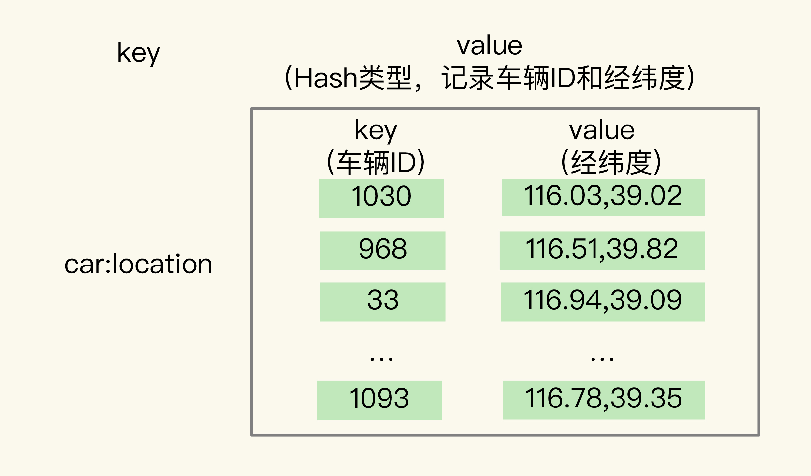
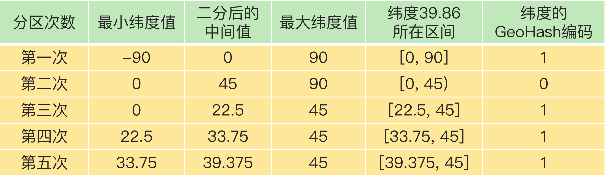

# GEO 是什么？还可以定义新的数据类型吗？


## 面向 LBS 应用的 GEO 数据类型

在日常生活中，我们越来越依赖搜索“附近的餐馆”、在打车软件上叫车，这些都离不开**基于位置信息服务（Location-Based Service，LBS）的应用**。LBS 应用访问的数据是和人或物关联的一组经纬度信息，而且要能查询相邻的经纬度范围，GEO 就非常适合应用在LBS 服务的场景中，我们来看一下它的底层结构。


### GEO 的底层结构

**一般来说，在设计一个数据类型的底层结构时，我们首先需要知道，要处理的数据有什么访问特点**。所以，我们需要先搞清楚位置信息到底是怎么被存取的。我以叫车服务为例，来分析下 LBS 应用中经纬度的存取特点。

- 每一辆网约车都有一个编号（例如 33），网约车需要将自己的经度信息（例如 116.034579）和纬度信息（例如 39.000452 ）发给叫车应用。
- 用户在叫车的时候，叫车应用会根据用户的经纬度位置（例如经度 116.054579，纬度 39.030452），查找用户的附近车辆，并进行匹配。
- 等把位置相近的用户和车辆匹配上以后，叫车应用就会根据车辆的编号，获取车辆的信息，并返回给用户。

可以看到，一辆车（或一个用户）对应一组经纬度，并且随着车（或用户）的位置移动，相应的经纬度也会变化。

这种数据记录模式属于一个 key（例如车 ID）对应一个 value（一组经纬度）。当有很多车辆信息要保存时，就需要有一个集合来保存一系列的 key 和 value。Hash 集合类型可以快速存取一系列的 key 和 value，正好可以用来记录一系列车辆 ID 和经纬度的对应关系，

所以，我们可以把不同车辆的 ID 和它们对应的经纬度信息存在 Hash 集合中，如下图所示：



同时，Hash 类型的 HSET 操作命令，会根据 key 来设置相应的 value 值，所以，我们可以用它来快速地更新车辆变化的经纬度信息。到这里，Hash 类型看起来是一个不错的选择。但问题是，对于一个 LBS 应用来说，除了记录经纬度信息，还需要根据用户的经纬度信息在车辆的 Hash 集合中进行范围查询。一旦涉及到范围查询，就意味着集合中的元素需要有序，但 Hash 类型的元素是无序的，显然不能满足我们的要求。

我们再来看看使用 **Sorted Set 类型**是不是合适。

Sorted Set 类型也支持一个 key 对应一个 value 的记录模式，其中，key 就是 Sorted Set 中的元素，而 value 则是元素的权重分数。更重要的是，Sorted Set 可以根据元素的权重分数排序，支持范围查询。这就能满足 LBS 服务中查找相邻位置的需求了。

实际上，GEO 类型的底层数据结构就是用 Sorted Set 来实现的。咱们还是借着叫车应用的例子来加深下理解。用 Sorted Set 来保存车辆的经纬度信息时，Sorted Set 的元素是车辆 ID，元素的权重分数是经纬度信息，如下图所示：


这时问题来了，Sorted Set 元素的权重分数是一个浮点数（float 类型），而一组经纬度包含的是经度和纬度两个值，是没法直接保存为一个浮点数的，那具体该怎么进行保存呢？这就要用到 GEO 类型中的 GeoHash 编码了。


### GeoHash 的编码方法

为了能高效地对经纬度进行比较，Redis 采用了业界广泛使用的 GeoHash 编码方法，这个方法的基本原理就是“二分区间，区间编码”。

当我们要对一组经纬度进行 GeoHash 编码时，我们要先对经度和纬度分别编码，然后再把经纬度各自的编码组合成一个最终编码。

首先，我们来看下经度和纬度的单独编码过程。对于一个地理位置信息来说，它的经度范围是[-180,180]。GeoHash 编码会把一个经度值编码成一个 N 位的二进制值，我们来对经度范围[-180,180]做 N 次的二分区操作，其中 N 可以自定义。

在进行第一次二分区时，经度范围[-180,180]会被分成两个子区间：[-180,0) 和[0,180]（我称之为左、右分区）。此时，我们可以查看一下要编码的经度值落在了左分区还是右分区。如果是落在左分区，我们就用 0 表示；如果落在右分区，就用 1 表示。这样一来，每做完一次二分区，我们就可以得到 1 位编码值。

然后，我们再对经度值所属的分区再做一次二分区，同时再次查看经度值落在了二分区后的左分区还是右分区，按照刚才的规则再做 1 位编码。当做完 N 次的二分区后，经度值就可以用一个 N bit 的数来表示了。

举个例子，假设我们要编码的经度值是 116.37，我们用 5 位编码值（也就是 N=5，做 5次分区）。

我们先做第一次二分区操作，把经度区间[-180,180]分成了左分区[-180,0) 和右分区[0,180]，此时，经度值 116.37 是属于右分区[0,180]，所以，我们用 1 表示第一次二分区后的编码值。

接下来，我们做第二次二分区：把经度值 116.37 所属的[0,180]区间，分成[0,90) 和[90,180]。此时，经度值 116.37 还是属于右分区[90,180]，所以，第二次分区后的编码值仍然为 1。等到第三次对[90,180]进行二分区，经度值 116.37 落在了分区后的左分区[90, 135)中，所以，第三次分区后的编码值就是 0。

按照这种方法，做完 5 次分区后，我们把经度值 116.37 定位在[112.5, 123.75]这个区间，并且得到了经度值的 5 位编码值，即 11010。这个编码过程如下表所示：


对纬度的编码方式，和对经度的一样，只是纬度的范围是[-90，90]，下面这张表显示了对纬度值 39.86 的编码过程。



当一组经纬度值都编完码后，我们再把它们的各自编码值组合在一起，组合的规则是：最终编码值的偶数位上依次是经度的编码值，奇数位上依次是纬度的编码值，其中，偶数位从 0 开始，奇数位从 1 开始。

我们刚刚计算的经纬度（116.37，39.86）的各自编码值是 11010 和 10111，组合之后，第 0 位是经度的第 0 位 1，第 1 位是纬度的第 0 位 1，第 2 位是经度的第 1 位 1，第 3位是纬度的第 1 位 0，以此类推，就能得到最终编码值 1110011101，如下图所示：


用了 GeoHash 编码后，原来无法用一个权重分数表示的一组经纬度（116.37，39.86）就可以用 1110011101 这一个值来表示，就可以保存为 Sorted Set 的权重分数了。当然，使用 GeoHash 编码后，我们相当于把整个地理空间划分成了一个个方格，每个方格对应了 GeoHash 中的一个分区。

举个例子。我们把经度区间[-180,180]做一次二分区，把纬度区间[-90,90]做一次二分区，就会得到 4 个分区。我们来看下它们的经度和纬度范围以及对应的 GeoHash 组合编码。

- 分区一：[-180,0) 和[-90,0)，编码 00；
- 分区二：[-180,0) 和[0,90]，编码 01；
- 分区三：[0,180]和[-90,0)，编码 10；
- 分区四：[0,180]和[0,90]，编码 11。

这 4 个分区对应了 4 个方格，每个方格覆盖了一定范围内的经纬度值，分区越多，每个方格能覆盖到的地理空间就越小，也就越精准。我们把所有方格的编码值映射到一维空间时，相邻方格的 GeoHash 编码值基本也是接近的，如下图所示：


所以，我们使用 Sorted Set 范围查询得到的相近编码值，在实际的地理空间上，也是相邻的方格，这就可以实现 LBS 应用“搜索附近的人或物”的功能了。

不过，我要提醒你一句，有的编码值虽然在大小上接近，但实际对应的方格却距离比较远。例如，我们用 4 位来做 GeoHash 编码（N =  2 ），把经度区间[-180,180]和纬度区间[-90,90]各分成了 4 个分区，一共 16 个分区，对应了 16 个方格。编码值为 0111 和 1000 的两个方格就离得比较远，如下图所示：


所以，为了避免查询不准确问题，我们可以同时查询给定经纬度所在的方格周围的 4 个或 8 个方格。好了，到这里，我们就知道了，GEO 类型是把经纬度所在的区间编码作为 Sorted Set 中元素的权重分数，把和经纬度相关的车辆 ID 作为 Sorted Set 中元素本身的值保存下来，这样相邻经纬度的查询就可以通过编码值的大小范围查询来实现了。接下来，我们再来聊聊具体如何操作 GEO 类型。


### 如何操作 GEO 类型？

在使用 GEO 类型时，我们经常会用到两个命令，分别是 GEOADD 和 GEORADIUS。

- GEOADD 命令：用于把一组经纬度信息和相对应的一个 ID 记录到 GEO 类型集合中；
- GEORADIUS 命令：会根据输入的经纬度位置，查找以这个经纬度为中心的一定范围内的其他元素。当然，我们可以自己定义这个范围。

我还是以叫车应用的车辆匹配场景为例，介绍下具体如何使用这两个命令。假设车辆 ID 是 33，经纬度位置是（116.034579，39.030452），我们可以用一个 GEO 集合保存所有车辆的经纬度，集合 key 是 `cars:locations`。执行下面的这个命令，就可以把 ID 号为 33 的车辆的当前经纬度位置存入 GEO 集合中：

```
GEOADD cars:locations 116.034579 39.030452 33
```

当用户想要寻找自己附近的网约车时，LBS 应用就可以使用 GEORADIUS 命令。例如，LBS 应用执行下面的命令时，Redis 会根据输入的用户的经纬度信息（116.054579，39.030452 ），查找以这个经纬度为中心的 5 公里内的车辆信息，并返回给 LBS 应用。当然， 你可以修改“5”这个参数，来返回更大或更小范围内的车辆信息。

```
GEORADIUS cars:locations 116.054579 39.030452 5 km ASC COUNT 10
```

另外，我们还可以进一步限定返回的车辆信息。比如，我们可以使用 ASC 选项，让返回的车辆信息按照距离这个中心位置从近到远的方式来排序，以方便选择最近的车辆；还可以使用 COUNT 选项，指定返回的车辆信息的数量。毕竟，5 公里范围内的车辆可能有很多，如果返回全部信息，会占用比较多的数据带宽，这个选项可以帮助控制返回的数据量，节省带宽。

可以看到，使用 GEO 数据类型可以非常轻松地操作经纬度这种信息。

虽然我们有了 5 种基本类型和 3 种扩展数据类型，但是有些场景下，我们对数据类型会有特殊需求，例如，我们需要一个数据类型既能像 Hash 那样支持快速的单键查询，又能像 Sorted Set 那样支持范围查询，此时，我们之前学习的这些数据类型就无法满足需求了。

那么，接下来，我就再向你介绍下 Redis 扩展数据类型的终极版——自定义的数据类型。这样，你就可以定制符合自己需求的数据类型了，不管你的应用场景怎么变化，你都不用担心没有合适的数据类型。


## 如何自定义数据类型？

为了实现自定义数据类型，首先，我们需要了解 Redis 的基本对象结构 RedisObject，因为 Redis 键值对中的每一个值都是用 RedisObject 保存的。RedisObject 包括元数据和指针。其中，元数据的一个功能就是用来区分不同的数据类型，指针用来指向具体的数据类型的值。所以，要想开发新数据类型，我们就先来了解下 RedisObject 的元数据和指针。


### Redis 的基本对象结构

RedisObject 的内部组成包括了 type,、encoding,、lru 和 refcount 4 个元数据，以及 1个*ptr指针。

- type：表示值的类型，涵盖了我们前面学习的五大基本类型；
- encoding：是值的编码方式，用来表示 Redis 中实现各个基本类型的底层数据结构，例如 SDS、压缩列表、哈希表、跳表等；
- lru：记录了这个对象最后一次被访问的时间，用于淘汰过期的键值对；
- refcount：记录了对象的引用计数；
- *ptr：是指向数据的指针。


RedisObject 结构借助`*ptr`指针，就可以指向不同的数据类型，例如，`*ptr`指向一个 SDS 或一个跳表，就表示键值对中的值是 String 类型或 Sorted Set 类型。所以，我们在定义了新的数据类型后，也只要在 RedisObject 中设置好新类型的 type 和 encoding，再用`*ptr`指向新类型的实现，就行了。


### 开发一个新的数据类型

了解了 RedisObject 结构后，定义一个新的数据类型也就不难了。首先，我们需要为新数据类型定义好它的底层结构、type 和 encoding 属性值，然后再实现新数据类型的创建、释放函数和基本命令。

接下来，我以开发一个名字叫作 NewTypeObject 的新数据类型为例，来解释下具体的 4 个操作步骤。


#### 第一步：定义新数据类型的底层结构

我们用 newtype.h 文件来保存这个新类型的定义，具体定义的代码如下所示：

```
struct NewTypeObject {
	struct NewTypeNode *head;
	size_t len;
}NewTypeObject;
```

其中，NewTypeNode 结构就是我们自定义的新类型的底层结构。我们为底层结构设计两个成员变量：一个是 Long 类型的 value 值，用来保存实际数据；一个是*next指针，指向下一个 NewTypeNode 结构。

```
struct NewTypeNode {
	long value;
	struct NewTypeNode *next;
};
```

从代码中可以看到，NewTypeObject 类型的底层结构其实就是一个 Long 类型的单向链表。当然，你还可以根据自己的需求，把 NewTypeObject 的底层结构定义为其他类型。例如，如果我们想要 NewTypeObject 的查询效率比链表高，就可以把它的底层结构设计成一颗 B+ 树。


#### 第二步：在 RedisObject 的 type 属性中，增加这个新类型的定义

这个定义是在 Redis 的 server.h 文件中。比如，我们增加一个叫作 OBJ_NEWTYPE 的宏定义，用来在代码中指代 NewTypeObject 这个新类型。

```
#define OBJ_STRING 0 /* String object. */
#define OBJ_LIST 1 /* List object. */
#define OBJ_SET 2 /* Set object. */
#define OBJ_ZSET 3 /* Sorted set object. */
…
#define OBJ_NEWTYPE 7
```


#### 第三步：开发新类型的创建和释放函数

Redis 把数据类型的创建和释放函数都定义在了 object.c 文件中。所以，我们可以在这个文件中增加 NewTypeObject 的创建函数 createNewTypeObject，如下所示：

```
robj *createNewTypeObject(void){
	NewTypeObject *h = newtypeNew();
	robj *o = createObject(OBJ_NEWTYPE,h);
	return o;
}
```

createNewTypeObject 分别调用了 newtypeNew 和 createObject 两个函数，我分别来介绍下。

先说 newtypeNew 函数。它是用来为新数据类型初始化内存结构的。这个初始化过程主要是用 zmalloc 做底层结构分配空间，以便写入数据。

```
NewTypeObject *newtypeNew(void){
	NewTypeObject *n = zmalloc(sizeof(*n));
	n->head = NULL;
	n->len = 0;
	return n;
}
```

newtypeNew 函数涉及到新数据类型的具体创建，而 Redis 默认会为每个数据类型定义一个单独文件，实现这个类型的创建和命令操作，例如，t_string.c 和 t_list.c 分别对应 String 和 List 类型。按照 Redis 的惯例，我们就把 newtypeNew 函数定义在名为 t_newtype.c 的文件中。createObject 是 Redis 本身提供的 RedisObject 创建函数，它的参数是数据类型的 type 和指向数据类型实现的指针*ptr。

我们给 createObject 函数中传入了两个参数，分别是新类型的 type 值 OBJ_NEWTYPE，以及指向一个初始化过的 NewTypeObjec 的指针。这样一来，创建的 RedisObject 就能指向我们自定义的新数据类型了。

```
robj *createObject(int type, void *ptr) {
	robj *o = zmalloc(sizeof(*o));
	o->type = type;
	o->ptr = ptr;
	...
	return o;
}
```

对于释放函数来说，它是创建函数的反过程，是用 zfree 命令把新结构的内存空间释放掉。


#### 第四步：开发新类型的命令操作

简单来说，增加相应的命令操作的过程可以分成三小步：

- 在 t_newtype.c 文件中增加命令操作的实现。比如说，我们定义 ntinsertCommand 函数，由它实现对 NewTypeObject 单向链表的插入操作：

```
void ntinsertCommand(client *c){
	//基于客户端传递的参数，实现在NewTypeObject链表头插入元素
}
```

- 在 server.h 文件中，声明我们已经实现的命令，以便在 server.c 文件引用这个命令，例如：

```
void ntinsertCommand(client *c)
```

- 在 server.c 文件中的 redisCommandTable 里面，把新增命令和实现函数关联起来。例如，新增的 ntinsert 命令由 ntinsertCommand 函数实现，我们就可以用 ntinsert 命令给 NewTypeObject 数据类型插入元素了。

```
struct redisCommand redisCommandTable[] = {
	...
	{"ntinsert",ntinsertCommand,2,"m",...}
}
```

此时，我们就完成了一个自定义的 NewTypeObject 数据类型，可以实现基本的命令操作了。当然，如果你还希望新的数据类型能被持久化保存，我们还需要在 Redis 的 RDB 和 AOF 模块中增加对新数据类型进行持久化保存的代码，我会在后面的加餐中再和你分享。


# 如何在Redis中保存时间序列数据？


## 时间序列数据的读写特点

在实际应用中，时间序列数据通常是持续高并发写入的，例如，需要连续记录数万个设备的实时状态值。同时，时间序列数据的写入主要就是插入新数据，而不是更新一个已存在的数据，也就是说，一个时间序列数据被记录后通常就不会变了，因为它就代表了一个设备在某个时刻的状态值（例如，一个设备在某个时刻的温度测量值，一旦记录下来，这个值本身就不会再变了）。

所以，**这种数据的写入特点很简单，就是插入数据快，这就要求我们选择的数据类型，在进行数据插入时，复杂度要低，尽量不要阻塞**。看到这儿，你可能第一时间会想到用 Redis 的 String、Hash 类型来保存，因为它们的插入复杂度都是 O(1)，是个不错的选择。但是，我在第 11 讲中说过，String 类型在记录小数据时（例如刚才例子中的设备温度值），元数据的内存开销比较大，不太适合保存大量数据。

那我们再看看，时间序列数据的“读”操作有什么特点。

我们在查询时间序列数据时，既有对单条记录的查询（例如查询某个设备在某一个时刻的运行状态信息，对应的就是这个设备的一条记录），也有对某个时间范围内的数据的查询（例如每天早上 8 点到 10 点的所有设备的状态信息）。

除此之外，还有一些更复杂的查询，比如对某个时间范围内的数据做聚合计算。这里的聚合计算，就是对符合查询条件的所有数据做计算，包括计算均值、最大 / 最小值、求和等。例如，我们要计算某个时间段内的设备压力的最大值，来判断是否有故障发生。那用一个词概括时间序列数据的“读”，就是查询模式多。

弄清楚了时间序列数据的读写特点，接下来我们就看看如何在 Redis 中保存这些数据。我们来分析下：针对时间序列数据的“写要快”，Redis 的高性能写特性直接就可以满足了；而针对“查询模式多”，也就是要支持单点查询、范围查询和聚合计算，Redis 提供了保存时间序列数据的两种方案，分别可以基于 Hash 和 Sorted Set 实现，以及基于 RedisTimeSeries 模块实现。

接下来，我们先学习下第一种方案。


## 基于 Hash 和 Sorted Set 保存时间序列数据

Hash 和 Sorted Set 组合的方式有一个明显的好处：它们是 Redis 内在的数据类型，代码成熟和性能稳定。所以，基于这两个数据类型保存时间序列数据，系统稳定性是可以预期的。不过，在前面学习的场景中，我们都是使用一个数据类型来存取数据，那么，

**为什么保存时间序列数据，要同时使用这两种类型？这是我们要回答的第一个问题。**

关于 Hash 类型，我们都知道，它有一个特点是，可以实现对单键的快速查询。这就满足了时间序列数据的单键查询需求。我们可以把时间戳作为 Hash 集合的 key，把记录的设备状态值作为 Hash 集合的 value。可以看下用 Hash 集合记录设备的温度值的示意图：


当我们想要查询某个时间点或者是多个时间点上的温度数据时，直接使用 HGET 命令或者 HMGET 命令，就可以分别获得 Hash 集合中的一个 key 和多个 key 的 value 值了。举个例子。我们用 HGET 命令查询 202008030905 这个时刻的温度值，使用 HMGET 查询 202008030905、202008030907、202008030908 这三个时刻的温度值，如下所示：

```
HGET device:temperature 202008030905
"25.1"
HMGET device:temperature 202008030905 202008030907 202008030908
1) "25.1"
2) "25.9"
3) "24.9"
```

你看，用 Hash 类型来实现单键的查询很简单。但是，**Hash 类型有个短板：它并不支持对数据进行范围查询。**

虽然时间序列数据是按时间递增顺序插入 Hash 集合中的，但 Hash 类型的底层结构是哈希表，并没有对数据进行有序索引。所以，如果要对 Hash 类型进行范围查询的话，就需

要扫描 Hash 集合中的所有数据，再把这些数据取回到客户端进行排序，然后，才能在客户端得到所查询范围内的数据。显然，查询效率很低。**为了能同时支持按时间戳范围的查询，可以用 Sorted Set 来保存时间序列数据，因为它能够根据元素的权重分数来排序**。我们可以把时间戳作为 Sorted Set 集合的元素分数，把时间点上记录的数据作为元素本身。

我还是以保存设备温度的时间序列数据为例，进行解释。下图显示了用 Sorted Set 集合保存的结果。


使用 Sorted Set 保存数据后，我们就可以使用 ZRANGEBYSCORE 命令，按照输入的最大时间戳和最小时间戳来查询这个时间范围内的温度值了。如下所示，我们来查询一下在 2020 年 8 月 3 日 9 点 7 分到 9 点 10 分间的所有温度值：

```
ZRANGEBYSCORE device:temperature 202008030907 202008030910
1) "25.9"
2) "24.9"
3) "25.3"
4) "25.2"
```

现在我们知道了，同时使用 Hash 和 Sorted Set，可以满足单个时间点和一个时间范围内的数据查询需求了，但是我们又会面临一个新的问题，

**也就是我们要解答的第二个问题：如何保证写入 Hash 和 Sorted Set 是一个原子性的操作呢？**

所谓“原子性的操作”，就是指我们执行多个写命令操作时（例如用 HSET 命令和 ZADD命令分别把数据写入 Hash 和 Sorted Set），这些命令操作要么全部完成，要么都不完成。

只有保证了写操作的原子性，才能保证同一个时间序列数据，在 Hash 和 Sorted Set 中，要么都保存了，要么都没保存。否则，就可能出现 Hash 集合中有时间序列数据，而 Sorted Set 中没有，那么，在进行范围查询时，就没有办法满足查询需求了。那 Redis 是怎么保证原子性操作的呢？这里就涉及到了 Redis 用来实现简单的事务的 MULTI 和 EXEC 命令。当多个命令及其参数本身无误时，MULTI 和 EXEC 命令可以保证执行这些命令时的原子性。关于 Redis 的事务支持和原子性保证的异常情况，我会在第 30讲中向你介绍，这节课，我们只要了解一下 MULTI 和 EXEC 这两个命令的使用方法就行了。

- MULTI 命令：表示一系列原子性操作的开始。收到这个命令后，Redis 就知道，接下来再收到的命令需要放到一个内部队列中，后续一起执行，保证原子性。

- EXEC 命令：表示一系列原子性操作的结束。一旦 Redis 收到了这个命令，就表示所有要保证原子性的命令操作都已经发送完成了。此时，Redis 开始执行刚才放到内部队列中的所有命令操作。

你可以看下下面这张示意图，命令 1 到命令 N 是在 MULTI 命令后、EXEC 命令前发送的，它们会被一起执行，保证原子性。


以保存设备状态信息的需求为例，我们执行下面的代码，把设备在 2020 年 8 月 3 日 9 时 5 分的温度，分别用 HSET 命令和 ZADD 命令写入 Hash 集合和 Sorted Set 集合。

```
127.0.0.1:6379> MULTI
OK
127.0.0.1:6379> HSET device:temperature 202008030911 26.8
QUEUED
127.0.0.1:6379> ZADD device:temperature 202008030911 26.8
QUEUED
127.0.0.1:6379> EXEC
1) (integer) 1
2) (integer) 1
```

可以看到，首先，Redis 收到了客户端执行的 MULTI 命令。然后，客户端再执行 HSET 和 ZADD 命令后，Redis 返回的结果为“QUEUED”，表示这两个命令暂时入队，先不执行；执行了 EXEC 命令后，HSET 命令和 ZADD 命令才真正执行，并返回成功结果（结果值为 1）。

到这里，我们就解决了时间序列数据的单点查询、范围查询问题，并使用 MUTLI 和 EXEC 命令保证了 Redis 能原子性地把数据保存到 Hash 和 Sorted Set 中。

**接下来，我们需要继续解决第三个问题：如何对时间序列数据进行聚合计算？**

聚合计算一般被用来周期性地统计时间窗口内的数据汇总状态，在实时监控与预警等场景下会频繁执行。因为 Sorted Set 只支持范围查询，无法直接进行聚合计算，所以，我们只能先把时间范围内的数据取回到客户端，然后在客户端自行完成聚合计算。这个方法虽然能完成聚合计算，但是会带来一定的潜在风险，也就是**大量数据在 Redis 实例和客户端间频繁传输，这会和其他操作命令竞争网络资源，导致其他操作变慢。**

在我们这个物联网项目中，就需要每 3 分钟统计一下各个设备的温度状态，一旦设备温度超出了设定的阈值，就要进行报警。这是一个典型的聚合计算场景，我们可以来看看这个过程中的数据体量。

假设我们需要每 3 分钟计算一次的所有设备各指标的最大值，每个设备每 15 秒记录一个指标值，1 分钟就会记录 4 个值，3 分钟就会有 12 个值。我们要统计的设备指标数量有 33 个，所以，单个设备每 3 分钟记录的指标数据有将近 400 个（33 * 12 = 396），而设备总数量有 1 万台，这样一来，每 3 分钟就有将近 400 万条（396 * 1 万 = 396 万）数据需要在客户端和 Redis 实例间进行传输。

为了避免客户端和 Redis 实例间频繁的大量数据传输，我们可以使用 RedisTimeSeries 来保存时间序列数据。 RedisTimeSeries 支持直接在 Redis 实例上进行聚合计算。还是以刚才每 3 分钟算一次最大值为例。在 Redis 实例上直接聚合计算，那么，对于单个设备的一个指标值来说，每 3 分钟记录的 12 条数据可以聚合计算成一个值，单个设备每 3 分钟也就只有 33 个聚合值需要传输，1 万台设备也只有 33 万条数据。数据量大约是在客户端做聚合计算的十分之一，很显然，可以减少大量数据传输对 Redis 实例网络的性能影响。

所以，如果我们只需要进行单个时间点查询或是对某个时间范围查询的话，适合使用 Hash 和 Sorted Set 的组合，它们都是 Redis 的内在数据结构，性能好，稳定性高。但是，**如果我们需要进行大量的聚合计算，同时网络带宽条件不是太好时，Hash 和 Sorted Set 的组合就不太适合了。此时，使用 RedisTimeSeries 就更加合适一些。**


## 基于 RedisTimeSeries 模块保存时间序列数据

RedisTimeSeries 是 Redis 的一个扩展模块。它专门面向时间序列数据提供了数据类型和访问接口，并且支持在 Redis 实例上直接对数据进行按时间范围的聚合计算。因为 RedisTimeSeries 不属于 Redis 的内建功能模块，在使用时，我们需要先把它的源码单独编译成动态链接库 redistimeseries.so，再使用 loadmodule 命令进行加载，如下所示：

```
loadmodule redistimeseries.so
```

当用于时间序列数据存取时，RedisTimeSeries 的操作主要有 5 个：

- 用 TS.CREATE 命令创建时间序列数据集合；
- 用 TS.ADD 命令插入数据；
- 用 TS.GET 命令读取最新数据；
- 用 TS.MGET 命令按标签过滤查询数据集合；
- 用 TS.RANGE 支持聚合计算的范围查询。

下面，我来介绍一下如何使用这 5 个操作。


### **1. 用 TS.CREATE 命令创建一个时间序列数据集合**

在 TS.CREATE 命令中，我们需要设置时间序列数据集合的 key 和数据的过期时间（以毫秒为单位）。此外，我们还可以为数据集合设置标签，来表示数据集合的属性。例如，我们执行下面的命令，创建一个 key 为 `device:temperature`、数据有效期为 600s的时间序列数据集合。也就是说，这个集合中的数据创建了 600s 后，就会被自动删除。最后，我们给这个集合设置了一个标签属性{device_id:1}，表明这个数据集合中记录的是属于设备 ID 号为 1 的数据。

```
TS.CREATE device:temperature RETENTION 600000 LABELS device_id 1
OK
```


### **2. 用 TS.ADD 命令插入数据，用 TS.GET 命令读取最新数据**

我们可以用 TS.ADD 命令往时间序列集合中插入数据，包括时间戳和具体的数值，并使用 TS.GET 命令读取数据集合中的最新一条数据。

例如，我们执行下列 TS.ADD 命令时，就往 device:temperature 集合中插入了一条数据，记录的是设备在 2020 年 8 月 3 日 9 时 5 分的设备温度；再执行 TS.GET 命令时，就会把刚刚插入的**最新数据**读取出来。

```
TS.ADD device:temperature 1596416700 25.1
1596416700
TS.GET device:temperature
25.1
```


### **3. 用 TS.MGET 命令按标签过滤查询数据集合**

在保存多个设备的时间序列数据时，我们通常会把不同设备的数据保存到不同集合中。此时，我们就可以使用 TS.MGET 命令，按照标签查询部分集合中的最新数据。在使用 TS.CREATE 创建数据集合时，我们可以给集合设置标签属性。当我们进行查询时，就可以在查询条件中对集合标签属性进行匹配，最后的查询结果里只返回匹配上的集合中的最新数据。

举个例子。假设我们一共用 4 个集合为 4 个设备保存时间序列数据，设备的 ID 号是 1、2、3、4，我们在创建数据集合时，把 device_id 设置为每个集合的标签。此时，我们就可以使用下列 TS.MGET 命令，以及 FILTER 设置（这个配置项用来设置集合标签的过滤条件），查询 device_id 不等于 2 的所有其他设备的数据集合，并返回各自集合中的最新的一条数据。

```
TS.MGET FILTER device_id!=2
1) 1) "device:temperature:1"
	2) (empty list or set)
	3) 1) (integer) 1596417000
	   2) "25.3"
2) 1) "device:temperature:3"
	2) (empty list or set)
	3) 1) (integer) 1596417000
	   2) "29.5"
3) 1) "device:temperature:4"
   2) (empty list or set)
   3) 1) (integer) 1596417000
      2) "30.1"
```


### **4. 用 TS.RANGE 支持需要聚合计算的范围查询**

最后，在对时间序列数据进行聚合计算时，我们可以使用 TS.RANGE 命令指定要查询的数据的时间范围，同时用 AGGREGATION 参数指定要执行的聚合计算类型。 RedisTimeSeries 支持的聚合计算类型很丰富，包括求均值（avg）、求最大 / 最小值（max/min），求和（sum）等。

例如，在执行下列命令时，我们就可以按照每 180s 的时间窗口，对 2020 年 8 月 3 日 9 时 5 分和 2020 年 8 月 3 日 9 时 12 分这段时间内的数据进行均值计算了。

```
TS.RANGE device:temperature 1596416700 1596417120 AGGREGATION avg 180000
1) 1) (integer) 1596416700
   2) "25.6"
2) 1) (integer) 1596416880
   2) "25.8"
3) 1) (integer) 1596417060
   2) "26.1"
```

与使用 Hash 和 Sorted Set 来保存时间序列数据相比，RedisTimeSeries 是专门为时间序列数据访问设计的扩展模块，能支持在 Redis 实例上直接进行聚合计算，以及按标签属性过滤查询数据集合，当**我们需要频繁进行聚合计算，以及从大量集合中筛选出特定设备或用户的数据集合时，RedisTimeSeries 就可以发挥优势了。**


## 总结

对于时间序列数据操作要求：

- 数据插入速度快，即复杂度要低

- 点查询，根据一个时间戳，查询相应时间的数据； ——  Hash 快速查询单条数据

- 范围查询，查询起始和截止时间戳范围内的数据  ——  Sorted Set 对数据进行排序，从而进行范围查询

- 聚合计算，针对起始和截止时间戳范围内的所有数据进行计算，例如求最大 / 最小值，

  求均值等。

要达到上述情况，可以使用 Hash 和 Sorted Set 结合，关于快速写入的要求，Redis 的高性能写特性足以应对了；

第一种方案是，组合使用 Redis 内置的 Hash 和 Sorted Set 类型，把数据同时保存在Hash 集合和 Sorted Set 集合中。这种方案既可以利用 Hash 类型实现对单键的快速查询，还能利用 Sorted Set 实现对范围查询的高效支持，一下子满足了时间序列数据的两大查询需求。

不过，第一种方案也有两个不足：一个是，在执行聚合计算时，我们需要把数据读取到客户端再进行聚合，**当有大量数据要聚合时，数据传输开销大**；另一个是，所有的数据会在两个数据类型中各保存一份，内存开销不小。不过，我们可以通过设置适当的数据过期时间，释放内存，减小内存压力。

我们学习的第二种实现方案是使用 RedisTimeSeries 模块。这是专门为存取时间序列数据而设计的扩展模块。和第一种方案相比，RedisTimeSeries 能支持直接在 Redis 实例上进行多种数据聚合计算，避免了大量数据在实例和客户端间传输。不过，**RedisTimeSeries的底层数据结构使用了链表，它的范围查询的复杂度是 O(N) 级别的，**同时，**它的 TS.GET查询只能返回最新的数据**，没有办法像第一种方案的 Hash 类型一样，可以返回任一时间点的数据。

如果你的部署环境中网络带宽高、Redis 实例内存大，可以优先考虑第一种方案；如果你的部署环境中网络、内存资源有限，而且数据量大，聚合计算频繁，需要按数据集合属性查询，可以优先考虑第二种方案。


