# GEO 是什么？还可以定义新的数据类型吗？


## 面向 LBS 应用的 GEO 数据类型

在日常生活中，我们越来越依赖搜索“附近的餐馆”、在打车软件上叫车，这些都离不开**基于位置信息服务（Location-Based Service，LBS）的应用**。LBS 应用访问的数据是和人或物关联的一组经纬度信息，而且要能查询相邻的经纬度范围，GEO 就非常适合应用在LBS 服务的场景中，我们来看一下它的底层结构。


### GEO 的底层结构

**一般来说，在设计一个数据类型的底层结构时，我们首先需要知道，要处理的数据有什么访问特点**。所以，我们需要先搞清楚位置信息到底是怎么被存取的。我以叫车服务为例，来分析下 LBS 应用中经纬度的存取特点。

- 每一辆网约车都有一个编号（例如 33），网约车需要将自己的经度信息（例如 116.034579）和纬度信息（例如 39.000452 ）发给叫车应用。
- 用户在叫车的时候，叫车应用会根据用户的经纬度位置（例如经度 116.054579，纬度 39.030452），查找用户的附近车辆，并进行匹配。
- 等把位置相近的用户和车辆匹配上以后，叫车应用就会根据车辆的编号，获取车辆的信息，并返回给用户。

可以看到，一辆车（或一个用户）对应一组经纬度，并且随着车（或用户）的位置移动，相应的经纬度也会变化。

这种数据记录模式属于一个 key（例如车 ID）对应一个 value（一组经纬度）。当有很多车辆信息要保存时，就需要有一个集合来保存一系列的 key 和 value。Hash 集合类型可以快速存取一系列的 key 和 value，正好可以用来记录一系列车辆 ID 和经纬度的对应关系，

所以，我们可以把不同车辆的 ID 和它们对应的经纬度信息存在 Hash 集合中，如下图所示：


同时，Hash 类型的 HSET 操作命令，会根据 key 来设置相应的 value 值，所以，我们可以用它来快速地更新车辆变化的经纬度信息。到这里，Hash 类型看起来是一个不错的选择。但问题是，对于一个 LBS 应用来说，除了记录经纬度信息，还需要根据用户的经纬度信息在车辆的 Hash 集合中进行范围查询。一旦涉及到范围查询，就意味着集合中的元素需要有序，但 Hash 类型的元素是无序的，显然不能满足我们的要求。

我们再来看看使用 **Sorted Set 类型**是不是合适。

Sorted Set 类型也支持一个 key 对应一个 value 的记录模式，其中，key 就是 Sorted Set 中的元素，而 value 则是元素的权重分数。更重要的是，Sorted Set 可以根据元素的权重分数排序，支持范围查询。这就能满足 LBS 服务中查找相邻位置的需求了。

实际上，GEO 类型的底层数据结构就是用 Sorted Set 来实现的。咱们还是借着叫车应用的例子来加深下理解。用 Sorted Set 来保存车辆的经纬度信息时，Sorted Set 的元素是车辆 ID，元素的权重分数是经纬度信息，如下图所示：


这时问题来了，Sorted Set 元素的权重分数是一个浮点数（float 类型），而一组经纬度包含的是经度和纬度两个值，是没法直接保存为一个浮点数的，那具体该怎么进行保存呢？这就要用到 GEO 类型中的 GeoHash 编码了。


### GeoHash 的编码方法

为了能高效地对经纬度进行比较，Redis 采用了业界广泛使用的 GeoHash 编码方法，这个方法的基本原理就是“二分区间，区间编码”。

当我们要对一组经纬度进行 GeoHash 编码时，我们要先对经度和纬度分别编码，然后再把经纬度各自的编码组合成一个最终编码。

首先，我们来看下经度和纬度的单独编码过程。对于一个地理位置信息来说，它的经度范围是[-180,180]。GeoHash 编码会把一个经度值编码成一个 N 位的二进制值，我们来对经度范围[-180,180]做 N 次的二分区操作，其中 N 可以自定义。

在进行第一次二分区时，经度范围[-180,180]会被分成两个子区间：[-180,0) 和[0,180]（我称之为左、右分区）。此时，我们可以查看一下要编码的经度值落在了左分区还是右分区。如果是落在左分区，我们就用 0 表示；如果落在右分区，就用 1 表示。这样一来，每做完一次二分区，我们就可以得到 1 位编码值。

然后，我们再对经度值所属的分区再做一次二分区，同时再次查看经度值落在了二分区后的左分区还是右分区，按照刚才的规则再做 1 位编码。当做完 N 次的二分区后，经度值就可以用一个 N bit 的数来表示了。

举个例子，假设我们要编码的经度值是 116.37，我们用 5 位编码值（也就是 N=5，做 5次分区）。

我们先做第一次二分区操作，把经度区间[-180,180]分成了左分区[-180,0) 和右分区[0,180]，此时，经度值 116.37 是属于右分区[0,180]，所以，我们用 1 表示第一次二分区后的编码值。

接下来，我们做第二次二分区：把经度值 116.37 所属的[0,180]区间，分成[0,90) 和[90,180]。此时，经度值 116.37 还是属于右分区[90,180]，所以，第二次分区后的编码值仍然为 1。等到第三次对[90,180]进行二分区，经度值 116.37 落在了分区后的左分区[90, 135)中，所以，第三次分区后的编码值就是 0。

按照这种方法，做完 5 次分区后，我们把经度值 116.37 定位在[112.5, 123.75]这个区间，并且得到了经度值的 5 位编码值，即 11010。这个编码过程如下表所示：


对纬度的编码方式，和对经度的一样，只是纬度的范围是[-90，90]，下面这张表显示了对纬度值 39.86 的编码过程。


当一组经纬度值都编完码后，我们再把它们的各自编码值组合在一起，组合的规则是：最终编码值的偶数位上依次是经度的编码值，奇数位上依次是纬度的编码值，其中，偶数位从 0 开始，奇数位从 1 开始。

我们刚刚计算的经纬度（116.37，39.86）的各自编码值是 11010 和 10111，组合之后，第 0 位是经度的第 0 位 1，第 1 位是纬度的第 0 位 1，第 2 位是经度的第 1 位 1，第 3位是纬度的第 1 位 0，以此类推，就能得到最终编码值 1110011101，如下图所示：


用了 GeoHash 编码后，原来无法用一个权重分数表示的一组经纬度（116.37，39.86）就可以用 1110011101 这一个值来表示，就可以保存为 Sorted Set 的权重分数了。当然，使用 GeoHash 编码后，我们相当于把整个地理空间划分成了一个个方格，每个方格对应了 GeoHash 中的一个分区。

举个例子。我们把经度区间[-180,180]做一次二分区，把纬度区间[-90,90]做一次二分区，就会得到 4 个分区。我们来看下它们的经度和纬度范围以及对应的 GeoHash 组合编码。

- 分区一：[-180,0) 和[-90,0)，编码 00；
- 分区二：[-180,0) 和[0,90]，编码 01；
- 分区三：[0,180]和[-90,0)，编码 10；
- 分区四：[0,180]和[0,90]，编码 11。

这 4 个分区对应了 4 个方格，每个方格覆盖了一定范围内的经纬度值，分区越多，每个方格能覆盖到的地理空间就越小，也就越精准。我们把所有方格的编码值映射到一维空间时，相邻方格的 GeoHash 编码值基本也是接近的，如下图所示：

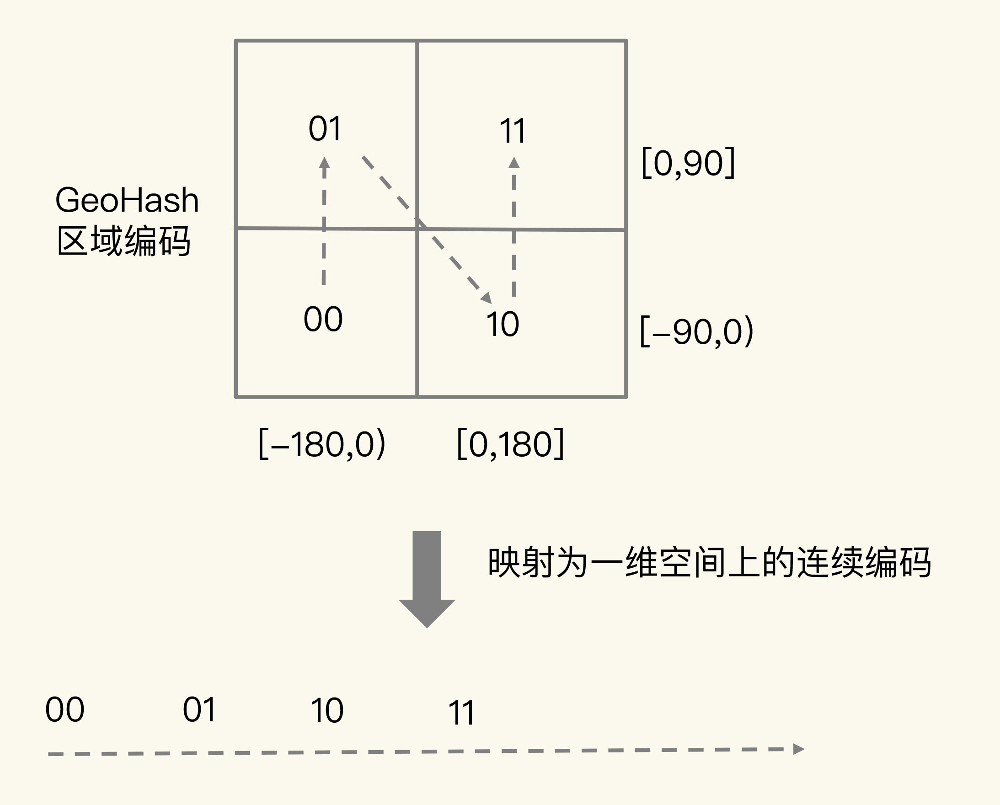

所以，我们使用 Sorted Set 范围查询得到的相近编码值，在实际的地理空间上，也是相邻的方格，这就可以实现 LBS 应用“搜索附近的人或物”的功能了。

不过，我要提醒你一句，有的编码值虽然在大小上接近，但实际对应的方格却距离比较远。例如，我们用 4 位来做 GeoHash 编码（N =  2 ），把经度区间[-180,180]和纬度区间[-90,90]各分成了 4 个分区，一共 16 个分区，对应了 16 个方格。编码值为 0111 和 1000 的两个方格就离得比较远，如下图所示：


所以，为了避免查询不准确问题，我们可以同时查询给定经纬度所在的方格周围的 4 个或 8 个方格。好了，到这里，我们就知道了，GEO 类型是把经纬度所在的区间编码作为 Sorted Set 中元素的权重分数，把和经纬度相关的车辆 ID 作为 Sorted Set 中元素本身的值保存下来，这样相邻经纬度的查询就可以通过编码值的大小范围查询来实现了。接下来，我们再来聊聊具体如何操作 GEO 类型。


### 如何操作 GEO 类型？

在使用 GEO 类型时，我们经常会用到两个命令，分别是 GEOADD 和 GEORADIUS。

- GEOADD 命令：用于把一组经纬度信息和相对应的一个 ID 记录到 GEO 类型集合中；
- GEORADIUS 命令：会根据输入的经纬度位置，查找以这个经纬度为中心的一定范围内的其他元素。当然，我们可以自己定义这个范围。

我还是以叫车应用的车辆匹配场景为例，介绍下具体如何使用这两个命令。假设车辆 ID 是 33，经纬度位置是（116.034579，39.030452），我们可以用一个 GEO 集合保存所有车辆的经纬度，集合 key 是 `cars:locations`。执行下面的这个命令，就可以把 ID 号为 33 的车辆的当前经纬度位置存入 GEO 集合中：

```
GEOADD cars:locations 116.034579 39.030452 33
```

当用户想要寻找自己附近的网约车时，LBS 应用就可以使用 GEORADIUS 命令。例如，LBS 应用执行下面的命令时，Redis 会根据输入的用户的经纬度信息（116.054579，39.030452 ），查找以这个经纬度为中心的 5 公里内的车辆信息，并返回给 LBS 应用。当然， 你可以修改“5”这个参数，来返回更大或更小范围内的车辆信息。

```
GEORADIUS cars:locations 116.054579 39.030452 5 km ASC COUNT 10
```

另外，我们还可以进一步限定返回的车辆信息。比如，我们可以使用 ASC 选项，让返回的车辆信息按照距离这个中心位置从近到远的方式来排序，以方便选择最近的车辆；还可以使用 COUNT 选项，指定返回的车辆信息的数量。毕竟，5 公里范围内的车辆可能有很多，如果返回全部信息，会占用比较多的数据带宽，这个选项可以帮助控制返回的数据量，节省带宽。

可以看到，使用 GEO 数据类型可以非常轻松地操作经纬度这种信息。

虽然我们有了 5 种基本类型和 3 种扩展数据类型，但是有些场景下，我们对数据类型会有特殊需求，例如，我们需要一个数据类型既能像 Hash 那样支持快速的单键查询，又能像 Sorted Set 那样支持范围查询，此时，我们之前学习的这些数据类型就无法满足需求了。

那么，接下来，我就再向你介绍下 Redis 扩展数据类型的终极版——自定义的数据类型。这样，你就可以定制符合自己需求的数据类型了，不管你的应用场景怎么变化，你都不用担心没有合适的数据类型。


## 如何自定义数据类型？

为了实现自定义数据类型，首先，我们需要了解 Redis 的基本对象结构 RedisObject，因为 Redis 键值对中的每一个值都是用 RedisObject 保存的。RedisObject 包括元数据和指针。其中，元数据的一个功能就是用来区分不同的数据类型，指针用来指向具体的数据类型的值。所以，要想开发新数据类型，我们就先来了解下 RedisObject 的元数据和指针。


### Redis 的基本对象结构

RedisObject 的内部组成包括了 type,、encoding,、lru 和 refcount 4 个元数据，以及 1个*ptr指针。

- type：表示值的类型，涵盖了我们前面学习的五大基本类型；
- encoding：是值的编码方式，用来表示 Redis 中实现各个基本类型的底层数据结构，例如 SDS、压缩列表、哈希表、跳表等；
- lru：记录了这个对象最后一次被访问的时间，用于淘汰过期的键值对；
- refcount：记录了对象的引用计数；
- *ptr：是指向数据的指针。


RedisObject 结构借助`*ptr`指针，就可以指向不同的数据类型，例如，`*ptr`指向一个 SDS 或一个跳表，就表示键值对中的值是 String 类型或 Sorted Set 类型。所以，我们在定义了新的数据类型后，也只要在 RedisObject 中设置好新类型的 type 和 encoding，再用`*ptr`指向新类型的实现，就行了。


### 开发一个新的数据类型

了解了 RedisObject 结构后，定义一个新的数据类型也就不难了。首先，我们需要为新数据类型定义好它的底层结构、type 和 encoding 属性值，然后再实现新数据类型的创建、释放函数和基本命令。

接下来，我以开发一个名字叫作 NewTypeObject 的新数据类型为例，来解释下具体的 4 个操作步骤。


#### 第一步：定义新数据类型的底层结构

我们用 newtype.h 文件来保存这个新类型的定义，具体定义的代码如下所示：

```
struct NewTypeObject {
	struct NewTypeNode *head;
	size_t len;
}NewTypeObject;
```

其中，NewTypeNode 结构就是我们自定义的新类型的底层结构。我们为底层结构设计两个成员变量：一个是 Long 类型的 value 值，用来保存实际数据；一个是*next指针，指向下一个 NewTypeNode 结构。

```
struct NewTypeNode {
	long value;
	struct NewTypeNode *next;
};
```

从代码中可以看到，NewTypeObject 类型的底层结构其实就是一个 Long 类型的单向链表。当然，你还可以根据自己的需求，把 NewTypeObject 的底层结构定义为其他类型。例如，如果我们想要 NewTypeObject 的查询效率比链表高，就可以把它的底层结构设计成一颗 B+ 树。


#### 第二步：在 RedisObject 的 type 属性中，增加这个新类型的定义

这个定义是在 Redis 的 server.h 文件中。比如，我们增加一个叫作 OBJ_NEWTYPE 的宏定义，用来在代码中指代 NewTypeObject 这个新类型。

```
#define OBJ_STRING 0 /* String object. */
#define OBJ_LIST 1 /* List object. */
#define OBJ_SET 2 /* Set object. */
#define OBJ_ZSET 3 /* Sorted set object. */
…
#define OBJ_NEWTYPE 7
```


#### 第三步：开发新类型的创建和释放函数

Redis 把数据类型的创建和释放函数都定义在了 object.c 文件中。所以，我们可以在这个文件中增加 NewTypeObject 的创建函数 createNewTypeObject，如下所示：

```
robj *createNewTypeObject(void){
	NewTypeObject *h = newtypeNew();
	robj *o = createObject(OBJ_NEWTYPE,h);
	return o;
}
```

createNewTypeObject 分别调用了 newtypeNew 和 createObject 两个函数，我分别来介绍下。

先说 newtypeNew 函数。它是用来为新数据类型初始化内存结构的。这个初始化过程主要是用 zmalloc 做底层结构分配空间，以便写入数据。

```
NewTypeObject *newtypeNew(void){
	NewTypeObject *n = zmalloc(sizeof(*n));
	n->head = NULL;
	n->len = 0;
	return n;
}
```

newtypeNew 函数涉及到新数据类型的具体创建，而 Redis 默认会为每个数据类型定义一个单独文件，实现这个类型的创建和命令操作，例如，t_string.c 和 t_list.c 分别对应 String 和 List 类型。按照 Redis 的惯例，我们就把 newtypeNew 函数定义在名为 t_newtype.c 的文件中。createObject 是 Redis 本身提供的 RedisObject 创建函数，它的参数是数据类型的 type 和指向数据类型实现的指针*ptr。

我们给 createObject 函数中传入了两个参数，分别是新类型的 type 值 OBJ_NEWTYPE，以及指向一个初始化过的 NewTypeObjec 的指针。这样一来，创建的 RedisObject 就能指向我们自定义的新数据类型了。

```
robj *createObject(int type, void *ptr) {
	robj *o = zmalloc(sizeof(*o));
	o->type = type;
	o->ptr = ptr;
	...
	return o;
}
```

对于释放函数来说，它是创建函数的反过程，是用 zfree 命令把新结构的内存空间释放掉。


#### 第四步：开发新类型的命令操作

简单来说，增加相应的命令操作的过程可以分成三小步：

- 在 t_newtype.c 文件中增加命令操作的实现。比如说，我们定义 ntinsertCommand 函数，由它实现对 NewTypeObject 单向链表的插入操作：

```
void ntinsertCommand(client *c){
	//基于客户端传递的参数，实现在NewTypeObject链表头插入元素
}
```

- 在 server.h 文件中，声明我们已经实现的命令，以便在 server.c 文件引用这个命令，例如：

```
void ntinsertCommand(client *c)
```

- 在 server.c 文件中的 redisCommandTable 里面，把新增命令和实现函数关联起来。例如，新增的 ntinsert 命令由 ntinsertCommand 函数实现，我们就可以用 ntinsert 命令给 NewTypeObject 数据类型插入元素了。

```
struct redisCommand redisCommandTable[] = {
	...
	{"ntinsert",ntinsertCommand,2,"m",...}
}
```

此时，我们就完成了一个自定义的 NewTypeObject 数据类型，可以实现基本的命令操作了。当然，如果你还希望新的数据类型能被持久化保存，我们还需要在 Redis 的 RDB 和 AOF 模块中增加对新数据类型进行持久化保存的代码，我会在后面的加餐中再和你分享。


# 如何在Redis中保存时间序列数据？


## 时间序列数据的读写特点

在实际应用中，时间序列数据通常是持续高并发写入的，例如，需要连续记录数万个设备的实时状态值。同时，时间序列数据的写入主要就是插入新数据，而不是更新一个已存在的数据，也就是说，一个时间序列数据被记录后通常就不会变了，因为它就代表了一个设备在某个时刻的状态值（例如，一个设备在某个时刻的温度测量值，一旦记录下来，这个值本身就不会再变了）。

所以，**这种数据的写入特点很简单，就是插入数据快，这就要求我们选择的数据类型，在进行数据插入时，复杂度要低，尽量不要阻塞**。看到这儿，你可能第一时间会想到用 Redis 的 String、Hash 类型来保存，因为它们的插入复杂度都是 O(1)，是个不错的选择。但是，我在第 11 讲中说过，String 类型在记录小数据时（例如刚才例子中的设备温度值），元数据的内存开销比较大，不太适合保存大量数据。

那我们再看看，时间序列数据的“读”操作有什么特点。

我们在查询时间序列数据时，既有对单条记录的查询（例如查询某个设备在某一个时刻的运行状态信息，对应的就是这个设备的一条记录），也有对某个时间范围内的数据的查询（例如每天早上 8 点到 10 点的所有设备的状态信息）。

除此之外，还有一些更复杂的查询，比如对某个时间范围内的数据做聚合计算。这里的聚合计算，就是对符合查询条件的所有数据做计算，包括计算均值、最大 / 最小值、求和等。例如，我们要计算某个时间段内的设备压力的最大值，来判断是否有故障发生。那用一个词概括时间序列数据的“读”，就是查询模式多。

弄清楚了时间序列数据的读写特点，接下来我们就看看如何在 Redis 中保存这些数据。我们来分析下：针对时间序列数据的“写要快”，Redis 的高性能写特性直接就可以满足了；而针对“查询模式多”，也就是要支持单点查询、范围查询和聚合计算，Redis 提供了保存时间序列数据的两种方案，分别可以基于 Hash 和 Sorted Set 实现，以及基于 RedisTimeSeries 模块实现。

接下来，我们先学习下第一种方案。


## 基于 Hash 和 Sorted Set 保存时间序列数据

Hash 和 Sorted Set 组合的方式有一个明显的好处：它们是 Redis 内在的数据类型，代码成熟和性能稳定。所以，基于这两个数据类型保存时间序列数据，系统稳定性是可以预期的。不过，在前面学习的场景中，我们都是使用一个数据类型来存取数据，那么，

**为什么保存时间序列数据，要同时使用这两种类型？这是我们要回答的第一个问题。**

关于 Hash 类型，我们都知道，它有一个特点是，可以实现对单键的快速查询。这就满足了时间序列数据的单键查询需求。我们可以把时间戳作为 Hash 集合的 key，把记录的设备状态值作为 Hash 集合的 value。可以看下用 Hash 集合记录设备的温度值的示意图：


当我们想要查询某个时间点或者是多个时间点上的温度数据时，直接使用 HGET 命令或者 HMGET 命令，就可以分别获得 Hash 集合中的一个 key 和多个 key 的 value 值了。举个例子。我们用 HGET 命令查询 202008030905 这个时刻的温度值，使用 HMGET 查询 202008030905、202008030907、202008030908 这三个时刻的温度值，如下所示：

```
HGET device:temperature 202008030905
"25.1"
HMGET device:temperature 202008030905 202008030907 202008030908
1) "25.1"
2) "25.9"
3) "24.9"
```

你看，用 Hash 类型来实现单键的查询很简单。但是，**Hash 类型有个短板：它并不支持对数据进行范围查询。**

虽然时间序列数据是按时间递增顺序插入 Hash 集合中的，但 Hash 类型的底层结构是哈希表，并没有对数据进行有序索引。所以，如果要对 Hash 类型进行范围查询的话，就需

要扫描 Hash 集合中的所有数据，再把这些数据取回到客户端进行排序，然后，才能在客户端得到所查询范围内的数据。显然，查询效率很低。**为了能同时支持按时间戳范围的查询，可以用 Sorted Set 来保存时间序列数据，因为它能够根据元素的权重分数来排序**。我们可以把时间戳作为 Sorted Set 集合的元素分数，把时间点上记录的数据作为元素本身。

我还是以保存设备温度的时间序列数据为例，进行解释。下图显示了用 Sorted Set 集合保存的结果。


使用 Sorted Set 保存数据后，我们就可以使用 ZRANGEBYSCORE 命令，按照输入的最大时间戳和最小时间戳来查询这个时间范围内的温度值了。如下所示，我们来查询一下在 2020 年 8 月 3 日 9 点 7 分到 9 点 10 分间的所有温度值：

```
ZRANGEBYSCORE device:temperature 202008030907 202008030910
1) "25.9"
2) "24.9"
3) "25.3"
4) "25.2"
```

现在我们知道了，同时使用 Hash 和 Sorted Set，可以满足单个时间点和一个时间范围内的数据查询需求了，但是我们又会面临一个新的问题，

**也就是我们要解答的第二个问题：如何保证写入 Hash 和 Sorted Set 是一个原子性的操作呢？**

所谓“原子性的操作”，就是指我们执行多个写命令操作时（例如用 HSET 命令和 ZADD命令分别把数据写入 Hash 和 Sorted Set），这些命令操作要么全部完成，要么都不完成。

只有保证了写操作的原子性，才能保证同一个时间序列数据，在 Hash 和 Sorted Set 中，要么都保存了，要么都没保存。否则，就可能出现 Hash 集合中有时间序列数据，而 Sorted Set 中没有，那么，在进行范围查询时，就没有办法满足查询需求了。那 Redis 是怎么保证原子性操作的呢？这里就涉及到了 Redis 用来实现简单的事务的 MULTI 和 EXEC 命令。当多个命令及其参数本身无误时，MULTI 和 EXEC 命令可以保证执行这些命令时的原子性。关于 Redis 的事务支持和原子性保证的异常情况，我会在第 30讲中向你介绍，这节课，我们只要了解一下 MULTI 和 EXEC 这两个命令的使用方法就行了。

- MULTI 命令：表示一系列原子性操作的开始。收到这个命令后，Redis 就知道，接下来再收到的命令需要放到一个内部队列中，后续一起执行，保证原子性。

- EXEC 命令：表示一系列原子性操作的结束。一旦 Redis 收到了这个命令，就表示所有要保证原子性的命令操作都已经发送完成了。此时，Redis 开始执行刚才放到内部队列中的所有命令操作。

你可以看下下面这张示意图，命令 1 到命令 N 是在 MULTI 命令后、EXEC 命令前发送的，它们会被一起执行，保证原子性。

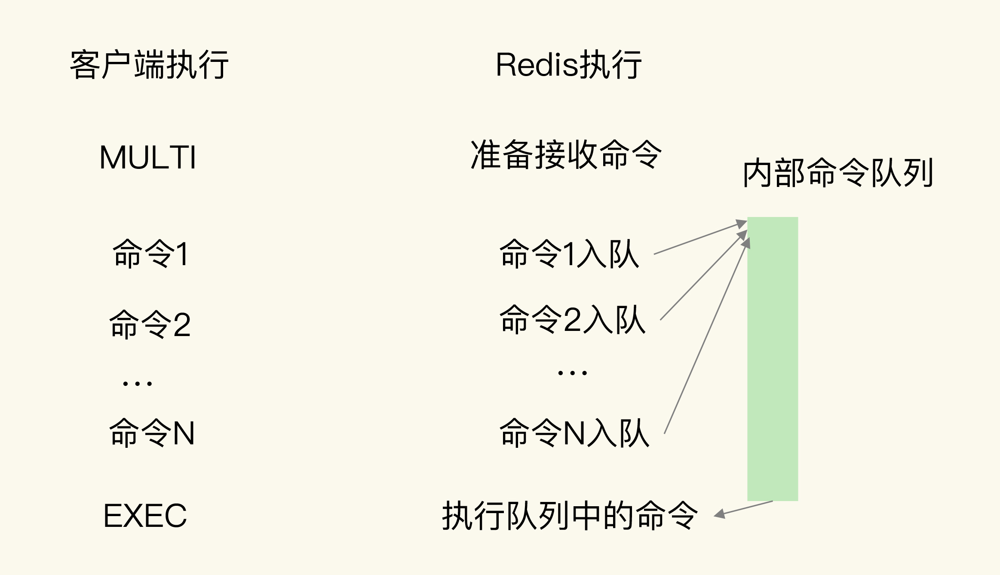

以保存设备状态信息的需求为例，我们执行下面的代码，把设备在 2020 年 8 月 3 日 9 时 5 分的温度，分别用 HSET 命令和 ZADD 命令写入 Hash 集合和 Sorted Set 集合。

```
127.0.0.1:6379> MULTI
OK
127.0.0.1:6379> HSET device:temperature 202008030911 26.8
QUEUED
127.0.0.1:6379> ZADD device:temperature 202008030911 26.8
QUEUED
127.0.0.1:6379> EXEC
1) (integer) 1
2) (integer) 1
```

可以看到，首先，Redis 收到了客户端执行的 MULTI 命令。然后，客户端再执行 HSET 和 ZADD 命令后，Redis 返回的结果为“QUEUED”，表示这两个命令暂时入队，先不执行；执行了 EXEC 命令后，HSET 命令和 ZADD 命令才真正执行，并返回成功结果（结果值为 1）。

到这里，我们就解决了时间序列数据的单点查询、范围查询问题，并使用 MUTLI 和 EXEC 命令保证了 Redis 能原子性地把数据保存到 Hash 和 Sorted Set 中。

**接下来，我们需要继续解决第三个问题：如何对时间序列数据进行聚合计算？**

聚合计算一般被用来周期性地统计时间窗口内的数据汇总状态，在实时监控与预警等场景下会频繁执行。因为 Sorted Set 只支持范围查询，无法直接进行聚合计算，所以，我们只能先把时间范围内的数据取回到客户端，然后在客户端自行完成聚合计算。这个方法虽然能完成聚合计算，但是会带来一定的潜在风险，也就是**大量数据在 Redis 实例和客户端间频繁传输，这会和其他操作命令竞争网络资源，导致其他操作变慢。**

在我们这个物联网项目中，就需要每 3 分钟统计一下各个设备的温度状态，一旦设备温度超出了设定的阈值，就要进行报警。这是一个典型的聚合计算场景，我们可以来看看这个过程中的数据体量。

假设我们需要每 3 分钟计算一次的所有设备各指标的最大值，每个设备每 15 秒记录一个指标值，1 分钟就会记录 4 个值，3 分钟就会有 12 个值。我们要统计的设备指标数量有 33 个，所以，单个设备每 3 分钟记录的指标数据有将近 400 个（33 * 12 = 396），而设备总数量有 1 万台，这样一来，每 3 分钟就有将近 400 万条（396 * 1 万 = 396 万）数据需要在客户端和 Redis 实例间进行传输。

为了避免客户端和 Redis 实例间频繁的大量数据传输，我们可以使用 RedisTimeSeries 来保存时间序列数据。 RedisTimeSeries 支持直接在 Redis 实例上进行聚合计算。还是以刚才每 3 分钟算一次最大值为例。在 Redis 实例上直接聚合计算，那么，对于单个设备的一个指标值来说，每 3 分钟记录的 12 条数据可以聚合计算成一个值，单个设备每 3 分钟也就只有 33 个聚合值需要传输，1 万台设备也只有 33 万条数据。数据量大约是在客户端做聚合计算的十分之一，很显然，可以减少大量数据传输对 Redis 实例网络的性能影响。

所以，如果我们只需要进行单个时间点查询或是对某个时间范围查询的话，适合使用 Hash 和 Sorted Set 的组合，它们都是 Redis 的内在数据结构，性能好，稳定性高。但是，**如果我们需要进行大量的聚合计算，同时网络带宽条件不是太好时，Hash 和 Sorted Set 的组合就不太适合了。此时，使用 RedisTimeSeries 就更加合适一些。**


## 基于 RedisTimeSeries 模块保存时间序列数据

RedisTimeSeries 是 Redis 的一个扩展模块。它专门面向时间序列数据提供了数据类型和访问接口，并且支持在 Redis 实例上直接对数据进行按时间范围的聚合计算。因为 RedisTimeSeries 不属于 Redis 的内建功能模块，在使用时，我们需要先把它的源码单独编译成动态链接库 redistimeseries.so，再使用 loadmodule 命令进行加载，如下所示：

```
loadmodule redistimeseries.so
```

当用于时间序列数据存取时，RedisTimeSeries 的操作主要有 5 个：

- 用 TS.CREATE 命令创建时间序列数据集合；
- 用 TS.ADD 命令插入数据；
- 用 TS.GET 命令读取最新数据；
- 用 TS.MGET 命令按标签过滤查询数据集合；
- 用 TS.RANGE 支持聚合计算的范围查询。

下面，我来介绍一下如何使用这 5 个操作。


### **1. 用 TS.CREATE 命令创建一个时间序列数据集合**

在 TS.CREATE 命令中，我们需要设置时间序列数据集合的 key 和数据的过期时间（以毫秒为单位）。此外，我们还可以为数据集合设置标签，来表示数据集合的属性。例如，我们执行下面的命令，创建一个 key 为 `device:temperature`、数据有效期为 600s的时间序列数据集合。也就是说，这个集合中的数据创建了 600s 后，就会被自动删除。最后，我们给这个集合设置了一个标签属性{device_id:1}，表明这个数据集合中记录的是属于设备 ID 号为 1 的数据。

```
TS.CREATE device:temperature RETENTION 600000 LABELS device_id 1
OK
```


### **2. 用 TS.ADD 命令插入数据，用 TS.GET 命令读取最新数据**

我们可以用 TS.ADD 命令往时间序列集合中插入数据，包括时间戳和具体的数值，并使用 TS.GET 命令读取数据集合中的最新一条数据。

例如，我们执行下列 TS.ADD 命令时，就往 device:temperature 集合中插入了一条数据，记录的是设备在 2020 年 8 月 3 日 9 时 5 分的设备温度；再执行 TS.GET 命令时，就会把刚刚插入的**最新数据**读取出来。

```
TS.ADD device:temperature 1596416700 25.1
1596416700
TS.GET device:temperature
25.1
```


### **3. 用 TS.MGET 命令按标签过滤查询数据集合**

在保存多个设备的时间序列数据时，我们通常会把不同设备的数据保存到不同集合中。此时，我们就可以使用 TS.MGET 命令，按照标签查询部分集合中的最新数据。在使用 TS.CREATE 创建数据集合时，我们可以给集合设置标签属性。当我们进行查询时，就可以在查询条件中对集合标签属性进行匹配，最后的查询结果里只返回匹配上的集合中的最新数据。

举个例子。假设我们一共用 4 个集合为 4 个设备保存时间序列数据，设备的 ID 号是 1、2、3、4，我们在创建数据集合时，把 device_id 设置为每个集合的标签。此时，我们就可以使用下列 TS.MGET 命令，以及 FILTER 设置（这个配置项用来设置集合标签的过滤条件），查询 device_id 不等于 2 的所有其他设备的数据集合，并返回各自集合中的最新的一条数据。

```
TS.MGET FILTER device_id!=2
1) 1) "device:temperature:1"
	2) (empty list or set)
	3) 1) (integer) 1596417000
	   2) "25.3"
2) 1) "device:temperature:3"
	2) (empty list or set)
	3) 1) (integer) 1596417000
	   2) "29.5"
3) 1) "device:temperature:4"
   2) (empty list or set)
   3) 1) (integer) 1596417000
      2) "30.1"
```


### **4. 用 TS.RANGE 支持需要聚合计算的范围查询**

最后，在对时间序列数据进行聚合计算时，我们可以使用 TS.RANGE 命令指定要查询的数据的时间范围，同时用 AGGREGATION 参数指定要执行的聚合计算类型。 RedisTimeSeries 支持的聚合计算类型很丰富，包括求均值（avg）、求最大 / 最小值（max/min），求和（sum）等。

例如，在执行下列命令时，我们就可以按照每 180s 的时间窗口，对 2020 年 8 月 3 日 9 时 5 分和 2020 年 8 月 3 日 9 时 12 分这段时间内的数据进行均值计算了。

```
TS.RANGE device:temperature 1596416700 1596417120 AGGREGATION avg 180000
1) 1) (integer) 1596416700
   2) "25.6"
2) 1) (integer) 1596416880
   2) "25.8"
3) 1) (integer) 1596417060
   2) "26.1"
```

与使用 Hash 和 Sorted Set 来保存时间序列数据相比，RedisTimeSeries 是专门为时间序列数据访问设计的扩展模块，能支持在 Redis 实例上直接进行聚合计算，以及按标签属性过滤查询数据集合，当**我们需要频繁进行聚合计算，以及从大量集合中筛选出特定设备或用户的数据集合时，RedisTimeSeries 就可以发挥优势了。**


## 总结

对于时间序列数据操作要求：

- 数据插入速度快，即复杂度要低

- 点查询，根据一个时间戳，查询相应时间的数据； ——  Hash 快速查询单条数据

- 范围查询，查询起始和截止时间戳范围内的数据  ——  Sorted Set 对数据进行排序，从而进行范围查询

- 聚合计算，针对起始和截止时间戳范围内的所有数据进行计算，例如求最大 / 最小值，

  求均值等。

要达到上述情况，可以使用 Hash 和 Sorted Set 结合，关于快速写入的要求，Redis 的高性能写特性足以应对了；

第一种方案是，组合使用 Redis 内置的 Hash 和 Sorted Set 类型，把数据同时保存在Hash 集合和 Sorted Set 集合中。这种方案既可以利用 Hash 类型实现对单键的快速查询，还能利用 Sorted Set 实现对范围查询的高效支持，一下子满足了时间序列数据的两大查询需求。

不过，第一种方案也有两个不足：一个是，在执行聚合计算时，我们需要把数据读取到客户端再进行聚合，**当有大量数据要聚合时，数据传输开销大**；另一个是，所有的数据会在两个数据类型中各保存一份，内存开销不小。不过，我们可以通过设置适当的数据过期时间，释放内存，减小内存压力。

我们学习的第二种实现方案是使用 RedisTimeSeries 模块。这是专门为存取时间序列数据而设计的扩展模块。和第一种方案相比，RedisTimeSeries 能支持直接在 Redis 实例上进行多种数据聚合计算，避免了大量数据在实例和客户端间传输。不过，**RedisTimeSeries的底层数据结构使用了链表，它的范围查询的复杂度是 O(N) 级别的，**同时，**它的 TS.GET查询只能返回最新的数据**，没有办法像第一种方案的 Hash 类型一样，可以返回任一时间点的数据。

如果你的部署环境中网络带宽高、Redis 实例内存大，可以优先考虑第一种方案；如果你的部署环境中网络、内存资源有限，而且数据量大，聚合计算频繁，需要按数据集合属性查询，可以优先考虑第二种方案。


# 消息队列的考验：Redis有哪些解决方案？


## 消息队列的消息存取需求

我先介绍一下消息队列存取消息的过程。**在分布式系统中，当两个组件要基于消息队列进行通信时，一个组件会把要处理的数据以消息的形式传递给消息队列，然后，这个组件就可以继续执行其他操作了；远端的另一个组件从消息队列中把消息读取出来，再在本地进行处理。**

为了方便你理解，我还是借助一个例子来解释一下。假设组件 1 需要对采集到的数据进行求和计算，并写入数据库，但是，消息到达的速度很快，组件 1 没有办法及时地既做采集，又做计算，并且写入数据库。所以，我们可以使用基于消息队列的通信，让组件 1 把数据 x 和 y 保存为 JSON 格式的消息，再发到消息队列，这样它就可以继续接收新的数据了。组件 2 则异步地从消息队列中把数据读取出来，在服务器 2 上进行求和计算后，再写入数据库。这个过程如下图所示：

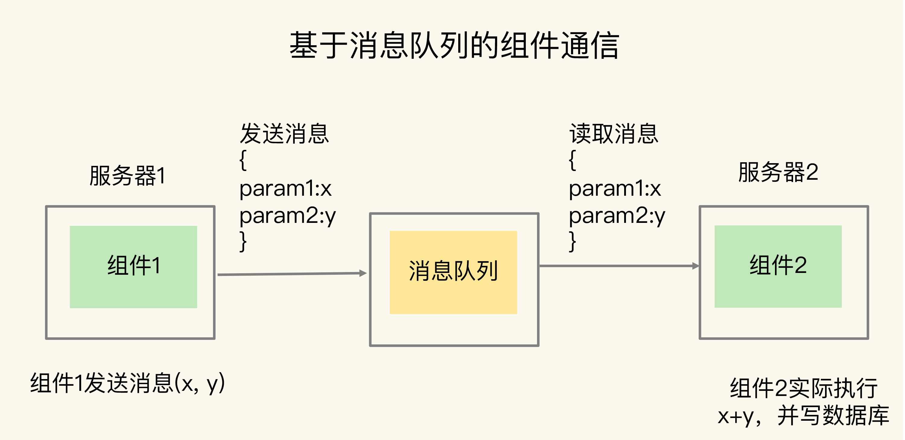

**我们一般把消息队列中发送消息的组件称为生产者（例子中的组件 1），把接收消息的组件称为消费者（例子中的组件 2）**，下图展示了一个通用的消息队列的架构模型：

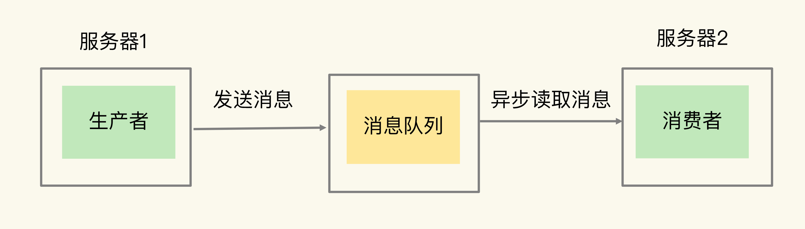

在使用消息队列时，消费者可以异步读取生产者消息，然后再进行处理。这样一来，即使生产者发送消息的速度远远超过了消费者处理消息的速度，生产者已经发送的消息也可以缓存在消息队列中，避免阻塞生产者，这是消息队列作为分布式组件通信的一大优势。

**不过，消息队列在存取消息时，必须要满足三个需求，分别是消息保序、处理重复的消息和保证消息可靠性。**


### 需求一：消息保序

虽然消费者是异步处理消息，但是，**消费者仍然需要按照生产者发送消息的顺序来处理消息，避免后发送的消息被先处理了。对于要求消息保序的场景来说，一旦出现这种消息被乱序处理的情况，就可能会导致业务逻辑被错误执行**，从而给业务方造成损失。

我们来看一个更新商品库存的场景。假设生产者负责接收库存更新请求，消费者负责实际更新库存，现有库存量是 10。生产者先后发送了消息 1 和消息 2，消息 1 要把商品 X 的库存记录更新为 5，消息 2 是把商品 X 库存更新为 3。如果消息 1 和 2 在消息队列中无法保序，出现消息 2 早于消息 1 被处理的情况，那么，很显然，库存更新就出错了。这是业务应用无法接受的。

面对这种情况，你可能会想到一种解决方案：不要把更新后的库存量作为生产者发送的消息，而是**把库存扣除值作为消息的内容**。这样一来，消息 1 是扣减库存量 5，消息 2 是扣减库存量 2。如果消息 1 和消息 2 之间没有库存查询请求的话，即使消费者先处理消息 2，再处理消息 1，这个方案也能够保证最终的库存量是正确的，也就是库存量为 3。

但是，我们还需要考虑这样一种情况：假如消费者收到了这样三条消息：消息 1 是扣减库存量 5，消息 2 是读取库存量，消息 3 是扣减库存量 2，此时，如果消费者先处理了消息 3（把库存量扣减 2），那么库存量就变成了 8。然后，消费者处理了消息 2，读取当前的库存量是 8，这就会出现库存量查询不正确的情况。从业务应用层面看，消息 1、2、3 应该是顺序执行的，所以，消息 2 查询到的应该是扣减了 5 以后的库存量，而不是扣减了 2 以后的库存量。所**以，用库存扣除值作为消息的方案，在消息中同时包含读写操作的场景下，会带来数据读取错误的问题。而且，这个方案还会面临一个问题，那就是重复消息处理。**


### 需求二：重复消息处理

消费者从消息队列读取消息时，**有时会因为网络堵塞而出现消息重传的情况。此时，消费者可能会收到多条重复的消息。**对于重复的消息，消费者如果多次处理的话，就可能造成一个业务逻辑被多次执行，如果业务逻辑正好是要修改数据，那就会出现数据被多次修改的问题了。

还是以库存更新为例，假设消费者收到了一次消息 1，要扣减库存量 5，然后又收到了一次消息 1，那么，如果消费者无法识别这两条消息实际是一条相同消息的话，就会执行两次扣减库存量 5 的操作，此时，库存量就不对了。这当然也是无法接受的。


### 需求三：消息可靠性保证

另外，消**费者在处理消息的时候，还可能出现因为故障或宕机导致消息没有处理完成的情况。**此时，消息队列需要能提供消息可靠性的保证，也就是说，当消费者重启后，可以重新读取消息再次进行处理，否则，就会出现消息漏处理的问题了。


Redis 的 List 和 Streams 两种数据类型，就可以满足消息队列的这三个需求。我们先来了解下基于 List 的消息队列实现方法。


## 基于 List 的消息队列解决方案

List 本身就是按先进先出的顺序对数据进行存取的，所以，如果使用 List 作为消息队列保存消息的话，就已经能满足消息保序的需求了。

具体来说，生产者可以使用 `LPUSH` 命令把要发送的消息依次写入 List，而消费者则可以使用 `RPOP` 命令，从 List 的另一端按照消息的写入顺序，依次读取消息并进行处理。

如下图所示，生产者先用 `LPUSH` 写入了两条库存消息，分别是 5 和 3，表示要把库存更新为 5 和 3；消费者则用 RPOP 把两条消息依次读出，然后进行相应的处理。


不过，在消费者读取数据时，有一个潜在的性能风险点。在生产者往 List 中写入数据时，List 并不会主动地通知消费者有新消息写入，如果消费者想要及时处理消息，就需要在程序中不停地调用 `RPOP` 命令（比如使用一个 while(1) 循环）。如果有新消息写入，`RPOP` 命令就会返回结果，否则，`RPOP` 命令返回空值，再继续循环。

所以，即使没有新消息写入 List，消费者也要不停地调用 RPOP 命令，这就会导致消费者程序的 CPU 一直消耗在执行 RPOP 命令上，带来不必要的性能损失。为了解决这个问题，Redis 提供了 `BRPOP` 命令。**BRPOP 命令也称为阻塞式读取，客户端在没有读到队列数据时，自动阻塞，直到有新的数据写入队列，再开始读取新数据**。和消费者程序自己不停地调用 `RPOP` 命令相比，这种方式能节省 CPU 开销消息保序的问题解决了，接下来，我们还需要考虑解决重复消息处理的问题，这里其实有一个要求：**消费者程序本身能对重复消息进行判断。**

- 一方面，消息队列要能给每一个消息提供全局唯一的 ID 号；
- 另一方面，消费者程序要把已经处理过的消息的 ID 号记录下来。

当收到一条消息后，消费者程序就可以对比收到的消息 ID 和记录的已处理过的消息 ID，来判断当前收到的消息有没有经过处理。如果已经处理过，那么，消费者程序就不再进行处理了。这种处理特性也称为**幂等性**，幂**等性就是指，对于同一条消息，消费者收到一次的处理结果和收到多次的处理结果是一致的。**不过，List 本身是不会为每个消息生成 ID 号的，所以，消息的全局唯一 ID 号就需要生产者程序在发送消息前自行生成。生成之后，我们在用 `LPUSH `命令把消息插入 List 时，需要在消息中包含这个全局唯一 ID。例如，我们执行以下命令，就把一条全局 ID 为 101030001、库存量为 5 的消息插入了消息队列：

```
LPUSH mq "101030001:stock:5"
(integer) 1
```

最后，我们再来看下，List 类型是如何保证消息可靠性的。当消费者程序从 List 中读取一条消息后，List 就不会再留存这条消息了。所以，如果消费者程序在处理消息的过程出现了故障或宕机，就会导致消息没有处理完成，那么，消费者程序再次启动后，就没法再次从 List 中读取消息了。

为了留存消息，List 类型提供了 `BRPOPLPUSH` 命令，**这个命令的作用是让消费者程序从一个 List 中读取消息，同时，Redis 会把这个消息再插入到另一个 List（可以叫作备份 List）留存。**这样一来，如果消费者程序读了消息但没能正常处理，等它重启后，就可以从备份 List 中重新读取消息并进行处理了。

我画了一张示意图，展示了使用 `BRPOPLPUSH `命令留存消息，以及消费者再次读取消息的过程，你可以看下。


生产者先用` LPUSH` 把消息“5”“3”插入到消息队列 mq 中。消费者程序使用 `BRPOPLPUSH` 命令读取消息“5”，同时，消息“5”还会被 Redis 插入到 mqback 队列中。如果消费者程序处理消息“5”时宕机了，等它重启后，可以从 mqback 中再次读取消息“5”，继续处理。

好了，到这里，你可以看到，基于 List 类型，我们可以满足分布式组件对消息队列的三大需求。但是，在用 List 做消息队列时，我们还可能遇到过一个问题：**生产者消息发送很快，而消费者处理消息的速度比较慢，这就导致 List 中的消息越积越多，给 Redis 的内存带来很大压力**。

这个时候，我们希望启动多个消费者程序组成一个消费组，一起分担处理 List 中的消息。但是，List 类型并不支持消费组的实现。那么，还有没有更合适的解决方案呢？这就要说到 Redis 从 5.0 版本开始提供的 Streams 数据类型了。

和 List 相比，Streams 同样能够满足消息队列的三大需求。而且，它还支持消费组形式的消息读取。接下来，我们就来了解下 Streams 的使用方法。


## 基于 Streams 的消息队列解决方案

**Streams 是 Redis 专门为消息队列设计的数据类型，它提供了丰富的消息队列操作命令。**

- `XADD`：插入消息，保证有序，可以**自动生成全局唯一 ID；**
- `XREAD`：用于读取消息，可以按 ID 读取数据；
- `XREADGROUP`：按消费组形式读取消息；（即多消费者模型）
- `XPENDING 和 XACK`：`XPENDING` 命令可以用来查询每个消费组内所有消费者已读取但尚未确认的消息，而 `XACK `命令用于向消息队列确认消息处理已完成

首先，我们来学习下 Streams 类型存取消息的操作 `XADD`。`XADD` 命令可以往消息队列中插入新消息，消息的格式是键 - 值对形式。对于插入的每一条消息，Streams 可以自动为其生成一个全局唯一的 ID。比如说，我们执行下面的命令，就可以往名称为 mqstream 的消息队列中插入一条消息，消息的键是 repo，值是 5。其中，**消息队列名称后面的*，表示让 Redis 为插入的数据自动生成一个全局唯一的 ID**，例如`“1599203861727-0”`。当然，我们也可以不用 `*`，直接在消息队列名称后自行设定一个 ID 号，只要保证这个 ID 号是全局唯一的就行。不过，相比自行设定 ID 号，使用 `*` 会更加方便高效。

```
XADD mqstream * repo 5  # 命令 redisKey ID messageKey messageValue
"1599203861727-0"
```

可以看到，消息的全局唯一 ID 由两部分组成，**第一部分 `“1599203861727”` 是数据插入时，以毫秒为单位计算的当前服务器时间，第二部分表示插入消息在当前毫秒内的消息序号，这是从 0 开始编号的。**例如，“1599203861727-0”就表示在 `“1599203861727”` 毫秒内的第 1 条消息。

当消费者需要读取消息时，可以直接使用 XREAD 命令从消息队列中读取。XREAD 在读取消息时，可以指定一个消息 ID，并从这个消息 ID 的**下一条消息**开始进行读取。例如，我们可以执行下面的命令，从 ID 号为 1599203861727-0 的消息开始，**读取后续**的所有消息（示例中一共 3 条）。

```
XREAD BLOCK 100 STREAMS mqstream 1599203861727-0
	1) 1) "mqstream"
	   2) 1) 1) "1599274912765-0"
		  	 2) 1) "repo"
			    2) "3"
		  2) 1) "1599274925823-0"
			 2) 1) "repo"
			    2) "2"
          3) 1) "1599274927910-0"
			 2) 1) "repo"
				2) "1"
```

另外，**消费者也可以在调用 XRAED 时设定 block 配置项，实现类似于 BRPOP 的阻塞读取操作。当消息队列中没有消息时，一旦设置了 block 配置项，XREAD 就会阻塞，阻塞的时长可以在 block 配置项进行设置。**

举个例子，我们来看一下下面的命令，其中，**命令最后的“$”符号表示读取最新的消息**，同时，我们设置了 block 10000 的配置项，10000 的单位是**毫秒**，表明 XREAD 在读取最新消息时，如果没有消息到来，XREAD 将阻塞 10000 毫秒（即 10 秒），然后再返回。下面命令中的 XREAD 执行后，消息队列 mqstream 中一直没有消息，所以，XREAD 在 10 秒后返回空值（nil）。

```
XREAD block 10000 streams mqstream $
(nil)
(10.00s)
```

刚刚讲到的这些操作是 List 也支持的，接下来，我们再来学习下 Streams 特有的功能。Streams 本身可以使用 XGROUP 创建消费组，创建消费组之后，**Streams 可以使用 `XREADGROUP` 命令让消费组内的消费者读取消息**，例如，我们执行下面的命令，创建一个名为 group1 的消费组，这个消费组消费的消息队列是 mqstream。

```
XGROUP create mqstream group1 0  # 将消息队列mqstream加入到group1
OK
```

然后，我们再执行一段命令，让 group1 消费组里的消费者 consumer1 从 mqstream 中读取所有消息，其中，**命令最后的参数“>”，表示从第一条尚未被消费的消息开始读取。**因为在 consumer1 读取消息前，group1 中没有其他消费者读取过消息，所以，consumer1 就得到 mqstream 消息队列中的所有消息了（一共 4 条）。

```
XREADGROUP group group1 consumer1 streams mqstream >
1) 1) "mqstream"
   2) 1) 1) "1599203861727-0"
         2) 1) "repo"
   			2) "5"
	  2) 1) "1599274912765-0"
		 2) 1) "repo"
			2) "3"
	  3) 1) "1599274925823-0"
		 2) 1) "repo"
		    2) "2"
 	  4) 1) "1599274927910-0"
		 2) 1) "repo"
			2) "1"
```

需要注意的是，**消息队列中的消息一旦被消费组里的一个消费者读取了，就不能再被该消费组内的其他消费者读取了**。比如说，我们执行完刚才的 XREADGROUP 命令后，再执行下面的命令，让 group1 内的 consumer2 读取消息时，consumer2 读到的就是空值，因为消息已经被 consumer1 读取完了，如下所示：

```
XREADGROUP group group1 consumer2 streams mqstream 0
1) 1) "mqstream"
   2) (empty list or set)
```

使用消费组的目的是让组内的多个消费者共同分担读取消息，所以，我们通常会让每个消费者读取部分消息，从而实现消息读取负载在多个消费者间是均衡分布的。例如，我们执行下列命令，让 group2 中的 consumer1、2、3 各自读取一条消息。

```
XREADGROUP group group2 consumer1 count 1 streams mqstream >
1) 1) "mqstream"
   2) 1) 1) "1599203861727-0"
  		 2) 1) "repo"
		    2) "5"
XREADGROUP group group2 consumer2 count 1 streams mqstream >
1) 1) "mqstream"
   2) 1) 1) "1599274912765-0"
	     2) 1) "repo"
		    2) "3"
XREADGROUP group group2 consumer3 count 1 streams mqstream >
1) 1) "mqstream"
   2) 1) 1) "1599274925823-0"
	     2) 1) "repo"
		    2) "2"
```

为了保证消费者在发生故障或宕机再次重启后，仍然可以读取未处理完的消息，**Streams会自动使用内部队列（也称为 PENDING List）留存消费组里每个消费者读取的消息，直到消费者使用 XACK 命令通知 Streams“消息已经处理完成”。如果消费者没有成功处理消息，它就不会给 Streams 发送 XACK 命令，消息仍然会留存。**此时，消费者可以在重启后，用 XPENDING 命令查看已读取、但尚未确认处理完成的消息。

例如，我们来查看一下 group2 中各个消费者已读取、但尚未确认的消息个数。其中，XPENDING 返回结果的第二、三行分别表示 group2 中所有消费者读取的消息最小 ID 和最大 ID。

```
XPENDING mqstream group2
1) (integer) 3
2) "1599203861727-0"
3) "1599274925823-0"
4) 1) 1) "consumer1"
      2) "1"
   2) 1) "consumer2"
      2) "1"
   3) 1) "consumer3"
      2) "1"
```

如果我们还需要进一步查看某个消费者具体读取了哪些数据，可以执行下面的命令：

```
XPENDING mqstream group2 - + 10 consumer2
1) 1) "1599274912765-0"
   2) "consumer2"
   3) (integer) 513336
   4) (integer) 1
```

可以看到，consumer2 已读取的消息的 ID 是 1599274912765-0。一旦消息 1599274912765-0 被 consumer2 处理了，consumer2 就可以使用 XACK 命令通知 Streams，然后这条消息就会被删除。当我们再使用 XPENDING 命令查看时，就可以看到，consumer2 已经没有已读取、但尚未确认处理的消息了。

```
XACK mqstream group2 1599274912765-0
(integer) 1
XPENDING mqstream group2 - + 10 consumer2
(empty list or set)
```

现在，我们就知道了用 Streams 实现消息队列的方法，我还想再强调下，Streams 是 Redis 5.0 专门针对消息队列场景设计的数据类型，如果你的 Redis 是 5.0 及 5.0 以后的版本，就可以考虑把 Streams 用作消息队列了。


## 小结

这节课，我们学习了分布式系统组件使用消息队列时的三大需求：**消息保序、重复消息处理和消息可靠性保证**，这三大需求可以进一步转换为对消息队列的三大要求：**消息数据有序存取，消息数据具有全局唯一编号，以及消息数据在消费完成后被删除**。


# 影响 Redis 性能的 5 大方面的潜在因素


## Redis 内部的阻塞式操作


### Redis 实例有哪些阻塞点？

Redis 实例在运行时，要和许多对象进行交互，这些不同的交互就会涉及不同的操作，下面我们来看看和 Redis 实例交互的对象，以及交互时会发生的操作。（一个主机创建了一个redis进程，即实例）

- **客户端**：网络 IO，键值对增删改查操作，数据库操作；

- **磁盘**：生成 RDB 快照，记录 AOF 日志，AOF 日志重写；

- **主从节点**：主库生成、传输 RDB 文件，从库接收 RDB 文件、清空数据库、加载 RDB文件；
- **切片集群实例**：向其他实例传输哈希槽信息，数据迁移。

为了帮助你理解，我再画一张图来展示下这 4 类交互对象和具体的操作之间的关系。


接下来，我们来逐个分析下在这些交互对象中，有哪些操作会引起阻塞。


#### **1. 和客户端交互时的阻塞点**

网络 IO 有时候会比较慢，但是 Redis 使用了 IO 多路复用机制，避免了主线程一直处在等待网络连接或请求到来的状态，所以，网络 IO 不是导致 Redis 阻塞的因素。键值对的增删改查操作是 Redis 和客户端交互的主要部分，也是 Redis 主线程执行的主要任务。所以，**复杂度高的增删改查操作肯定会阻塞 Redis。**

**那么，怎么判断操作复杂度是不是高呢？这里有一个最基本的标准，就是看操作的复杂度是否为 O(N)**。Redis 中涉及集合的操作复杂度通常为 O(N)，我们要在使用时重视起来。例如集合元素全量查询操作 HGETALL、SMEMBERS，以及集合的聚合统计操作，例如求交、并和差集。这些操作可以作为 Redis 的**第一个阻塞点：集合全量查询和聚合操作**。

除此之外，集合自身的删除操作同样也有潜在的阻塞风险。你可能会认为，删除操作很简单，直接把数据删除就好了，为什么还会阻塞主线程呢？其实，删除操作的本质是要释放键值对占用的内存空间。你可不要小瞧内存的释放过程。释放内存只是第一步，为了更加高效地管理内存空间，在应用程序释放内存时，操作系统需要把释放掉的内存块插入一个空闲内存块的链表，以便后续进行管理和再分配。这个过程本身需要一定时间，而且会阻塞当前释放内存的应用程序，所以，如果一下子释放了大量内存，空闲内存块链表操作时间就会增加，相应地就会造成 Redis 主线程的阻塞。

那么，什么时候会释放大量内存呢？其实就是在删除大量键值对数据的时候，**最典型的就是删除包含了大量元素的集合，也称为 bigkey 删除。**为了让你对 bigkey 的删除性能有一个直观的印象，我测试了不同元素数量的集合在进行删除操作时所消耗的时间，如下表所示：

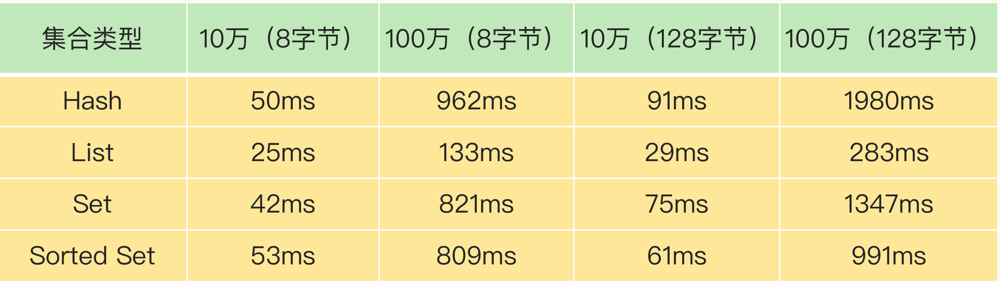

从这张表里，我们可以得出三个结论：

- 当元素数量从 10 万增加到 100 万时，4 大集合类型的删除时间的增长幅度从 5 倍上升到了近 20 倍；
- 集合元素越大，删除所花费的时间就越长；
- 当删除有 100 万个元素的集合时，最大的删除时间绝对值已经达到了 1.98s（Hash 类型）。Redis 的响应时间一般在微秒级别，所以，一个操作达到了近 2s，不可避免地会阻塞主线程。

经过刚刚的分析，很显然，**bigkey 删除操作就是 Redis 的第二个阻塞点**。删除操作对Redis 实例性能的负面影响很大，而且在实际业务开发时容易被忽略，所以一定要重视它。

既然频繁删除键值对都是潜在的阻塞点了，那么，在 Redis 的数据库级别操作中，清空数据库（例如 FLUSHDB 和 FLUSHALL 操作）必然也是一个潜在的阻塞风险，因为它涉及到删除和释放所有的键值对。所以，这就是 **Redis 的第三个阻塞点：清空数据库**。


#### **2. 和磁盘交互时的阻塞点**

我之所以把 Redis 与磁盘的交互单独列为一类，主要是因为磁盘 IO 一般都是比较费时费力的，需要重点关注。幸运的是，Redis 开发者早已认识到磁盘 IO 会带来阻塞，所以就把 Redis 进一步设计为采用子进程的方式生成 RDB 快照文件，以及执行 AOF 日志重写操作。这样一来，这两个操作由子进程负责执行，慢速的磁盘 IO 就不会阻塞主线程了。

但是，Redis 直接记录 AOF 日志时，会根据不同的写回策略对数据做落盘保存。一个同步写磁盘的操作的耗时大约是 1～2ms，如果有大量的写操作需要记录在 AOF 日志中，并同步写回的话，就会阻塞主线程了。这就得到了 Redis 的**第四个阻塞点了：AOF 日志同步写**。


#### **3. 主从节点交互时的阻塞点**

在主从集群中，主库需要生成 RDB 文件，并传输给从库。主库在复制的过程中，创建和传输 RDB 文件都是由子进程来完成的，不会阻塞主线程。但是，对于从库来说，**它在接收了 RDB 文件后，需要使用 FLUSHDB 命令清空当前数据库**，这就正好撞上了刚才我们分析的**第三个阻塞点。**

此外，从库在清空当前数据库后，还需要把 RDB 文件加载到内存，这个过程的快慢和 RDB 文件的大小密切相关，RDB 文件越大，加载过程越慢，所以，**加载 RDB 文件就成为了 Redis 的第五个阻塞点**。


#### **4. 切片集群实例交互时的阻塞点**

最后，当我们部署 Redis 切片集群时，每个 Redis 实例上分配的哈希槽信息需要在不同实例间进行传递，同时，当需要进行负载均衡或者有实例增删时，数据会在不同的实例间进行迁移。不过，哈希槽的信息量不大，而数据迁移是渐进式执行的，所以，一般来说，这两类操作对 Redis 主线程的阻塞风险不大。

不过，如果你使用了 Redis Cluster 方案，而且同时正好迁移的是 bigkey 的话，就会造成主线程的阻塞，因为 Redis Cluster 使用了同步迁移。我将在第 33 讲中向你介绍不同切片集群方案对数据迁移造成的阻塞的解决方法，这里你只需要知道，**当没有 bigkey 时，切片集群的各实例在进行交互时不会阻塞主线程，就可以了。**

好了，你现在已经了解了 Redis 的各种关键操作，以及其中的阻塞式操作，我们来总结下刚刚找到的五个阻塞点：

- 集合全量查询和聚合操作；
- bigkey 删除；
- 清空数据库；
- AOF 日志同步写；
- 从库加载 RDB 文件。

如果在主线程中执行这些操作，必然会导致主线程长时间无法服务其他请求。为了避免阻塞式操作，Redis 提供了异步线程机制。所谓的异步线程机制，就是指，Redis 会启动一些子线程，然后把一些任务交给这些子线程，让它们在后台完成，而不再由主线程来执行这些任务。使用异步线程机制执行操作，可以避免阻塞主线程。

不过，这个时候，问题来了：这五大阻塞式操作都可以被异步执行吗？


### **哪些阻塞点可以异步执行？**

在分析阻塞式操作的异步执行的可行性之前，我们先来了解下异步执行对操作的要求。如果一个操作能被异步执行，就意味着，它并不是 Redis 主线程的关键路径上的操作。我再解释下关键路径上的操作是啥。这就是说，客户端把请求发送给 Redis 后，等着 Redis 返回数据结果的操作。


主线程接收到操作 1 后，因为操作 1 并不用给客户端返回具体的数据，所以，主线程可以把它交给后台子线程来完成，同时只要给客户端返回一个“OK”结果就行。在子线程执行操作 1 的时候，客户端又向 Redis 实例发送了操作 2，而此时，客户端是需要使用操作 2返回的数据结果的，如果操作 2 不返回结果，那么，客户端将一直处于等待状态。

在这个例子中，操作 1 就不算关键路径上的操作，因为它不用给客户端返回具体数据，所以可以由后台子线程异步执行。而操作 2 需要把结果返回给客户端，它就是关键路径上的操作，所以主线程必须立即把这个操作执行完。

对于 Redis 来说，**读操作是典型的关键路径操作**，因为客户端发送了读操作之后，就会等待读取的数据返回，以便进行后续的数据处理。而 Redis 的第一个阻塞点“集合全量查询和聚合操作”都涉及到了读操作，所以，它们是不能进行异步操作了。

我们再来看看删除操作。删除操作并不需要给客户端返回具体的数据结果，所以不算是关键路径操作。**而我们刚才总结的第二个阻塞点“bigkey 删除”，和第三个阻塞点“清空数据库”，都是对数据做删除，并不在关键路径上。因此，我们可以使用后台子线程来异步执行删除操作。**


对于第四个阻塞点“AOF 日志同步写”来说，为了保证数据可靠性，Redis 实例需要保证AOF 日志中的操作记录已经落盘，这个操作虽然需要实例等待，但它并不会返回具体的数据结果给实例。所以，我们也可以启动一个子线程来执行 AOF 日志的同步写，而不用让主线程等待 AOF 日志的写完成。

最后，我们再来看下“从库加载 RDB 文件”这个阻塞点。从库要想对客户端提供数据存取服务，就必须把 RDB 文件加载完成。所以，这个操作也属于**关键路径**上的操作，我们必须让从库的主线程来执行。

对于 Redis 的五大阻塞点来说，**除了“集合全量查询和聚合操作”和“从库加载 RDB 文件”，其他三个阻塞点涉及的操作都不在关键路径上**，所以，我们可以使用 Redis 的异步子线程机制来实现 bigkey 删除，清空数据库，以及 AOF 日志同步写。那么，Redis 实现的异步子线程机制具体是怎么执行呢？


### 异步的子线程机制

Redis 主线程启动后，会使用操作系统提供的 pthread_create 函数创建 3 个子线程，分别由它们负责 AOF 日志写操作、键值对删除以及文件关闭的异步执行。主线程通过一个链表形式的任务队列和子线程进行交互。当收到键值对删除和清空数据库的操作时，主线程会把这个操作封装成一个任务，放入到任务队列中，然后给客户端返回一个完成信息，表明删除已经完成。

但实际上，这个时候删除还没有执行，**等到后台子线程从任务队列中读取任务后，才开始实际删除键值对，**并释放相应的内存空间。因此，我们把这**种异步删除也称为惰性删除（lazy free）**。此时，删除或清空操作不会阻塞主线程，这就避免了对主线程的性能影响。

和惰性删除类似，当 AOF 日志配置成 everysec 选项后，主线程会把 AOF 写日志操作封装成一个任务，也放到任务队列中。后台子线程读取任务后，开始自行写入 AOF 日志，这样主线程就不用一直等待 AOF 日志写完了。下面这张图展示了 Redis 中的异步子线程执行机制，你可以再看下，加深印象。

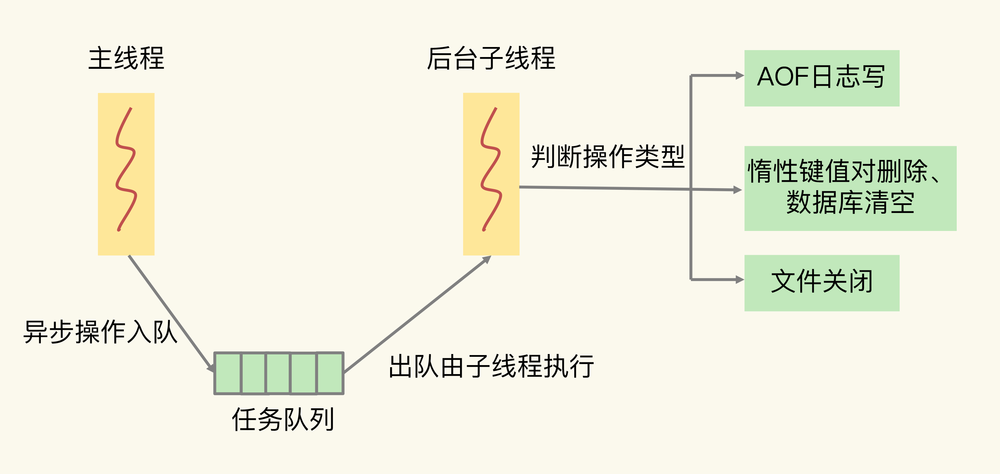

这里有个地方需要你注意一下，异步的键值对删除和数据库清空操作是 Redis 4.0 后提供的功能，Redis 也提供了新的命令来执行这两个操作。

- 键值对删除：当你的集合类型中有大量元素（例如有百万级别或千万级别元素）需要删除时，我建议你使用 UNLINK 命令。

- 清空数据库：可以在 FLUSHDB 和 FLUSHALL 命令后加上 ASYNC 选项，这样就可以让后台子线程异步地清空数据库，如下所示：

```
FLUSHDB ASYNC
FLUSHALL AYSNC
```


### 总结

- 集合全量查询和聚合操作：可以使用 SCAN 命令，分批读取数据，再在客户端进行聚合计算；

- 从库加载 RDB 文件：把主库的数据量大小控制在 2~4GB 左右，以保证 RDB 文件能以较快的速度加载。


## 为什么CPU结构也会影响Redis的性能？


### **主流的** **CPU** **架构**

要了解 CPU 对 Redis 具体有什么影响，我们得先了解一下 CPU 架构。一个 CPU 处理器中一般有多个运行核心，我们把一个运行核心称为一个物理核，每个物理核都可以运行应用程序。每个物理核都拥有私有的一级缓存（Level 1 cache，简称 L1 cache），包括一级指令缓存和一级数据缓存，以及私有的二级缓存（Level 2 cache，简称 L2 cache）。

这里提到了一个概念，就是物理核的私有缓存。它其实是指缓存空间只能被当前的这个物理核使用，其他的物理核无法对这个核的缓存空间进行数据存取。我们来看一下 CPU 物理核的架构。

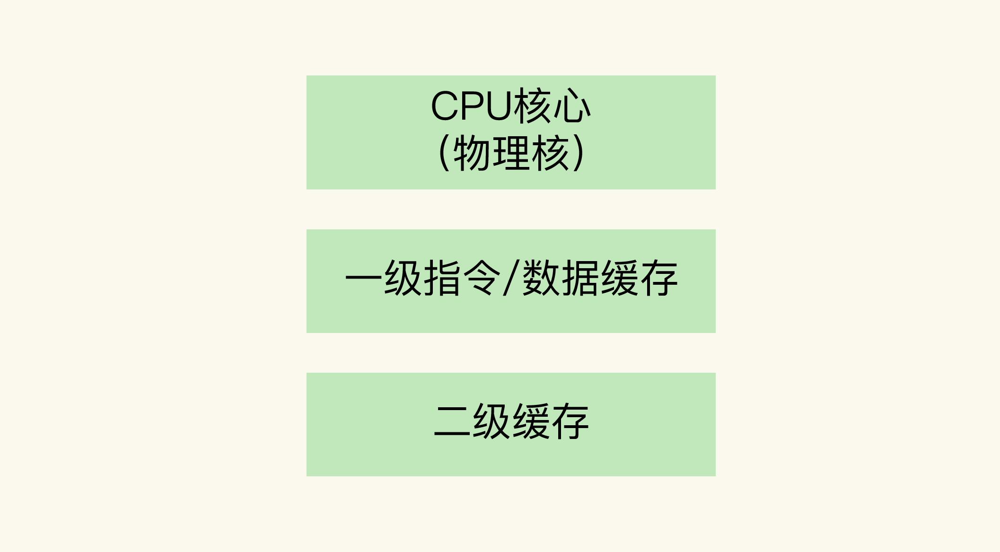

因为 L1 和 L2 缓存是每个物理核私有的，所以，当数据或指令保存在 L1、L2 缓存时，物理核访问它们的延迟不超过 10 纳秒，速度非常快。那么，如果 Redis 把要运行的指令或存取的数据保存在 L1 和 L2 缓存的话，就能高速地访问这些指令和数据。

但是，这些 L1 和 L2 缓存的大小受限于处理器的制造技术，一般只有 KB 级别，存不下太多的数据。如果 L1、L2 缓存中没有所需的数据，应用程序就需要访问内存来获取数据。而应用程序的访存延迟一般在百纳秒级别，是访问 L1、L2 缓存的延迟的近 10 倍，不可避免地会对性能造成影响。

所以，不同的物理核还会共享一个共同的三级缓存（Level 3 cache，简称为 L3 cache）。L3 缓存能够使用的存储资源比较多，所以一般比较大，能达到几 MB 到几十 MB，这就能让应用程序缓存更多的数据。当 L1、L2 缓存中没有数据缓存时，可以访问 L3，尽可能避免访问内存。

另外，现在主流的 CPU 处理器中，每个物理核通常都会运行两个超线程，也叫作逻辑核。同一个物理核的逻辑核会共享使用 L1、L2 缓存。为了方便你理解，我用一张图展示一下物理核和逻辑核，以及一级、二级缓存的关系。


在主流的服务器上，一个 CPU 处理器会有 10 到 20 多个物理核。同时，为了提升服务器的处理能力，服务器上通常还会有多个 CPU 处理器（也称为多 CPU Socket），每个处理器有自己的物理核（包括 L1、L2 缓存），L3 缓存，以及连接的内存，同时，不同处理器间通过总线连接。

下图显示的就是多 CPU Socket 的架构，图中有两个 Socket，每个 Socket 有两个物理核。


**在多 CPU 架构上，应用程序可以在不同的处理器上运行**。在刚才的图中，Redis 可以先在 Socket 1 上运行一段时间，然后再被调度到 Socket 2 上运行。但是，有个地方需要你注意一下：如果应用程序先在一个 Socket 上运行，并且把数据保存到了内存，然后被调度到另一个 Socket 上运行，此时，应用程序再进行内存访问时，就需要访问之前 Socket 上连接的内存，这种访问属于**远端内存访问**。**和访问 Socket 直接连接的内存相比，远端内存访问会增加应用程序的延迟。**

在多 CPU 架构下，一个应用程序访问所在 Socket 的本地内存和访问远端内存的延迟并不一致，所以，我们也把这个架构称为**非统一内存访问架构（Non-Uniform Memory Access，NUMA 架构）**。到这里，我们就知道了主流的 CPU 多核架构和多 CPU 架构，我们来简单总结下 CPU 架构对应用程序运行的影响。

- L1、L2 缓存中的指令和数据的访问速度很快，所以，充分利用 L1、L2 缓存，可以有效缩短应用程序的执行时间；
- 在 NUMA 架构下，如果应用程序从一个 Socket 上调度到另一个 Socket 上，就可能会出现远端内存访问的情况，这会直接增加应用程序的执行时间。

接下来，我们就先来了解下 CPU 多核是如何影响 Redis 性能的。


### CPU 多核对 Redis 性能的影响

在一个 CPU 核上运行时，应用程序需要记录自身使用的软硬件资源信息（例如栈指针、CPU 核的寄存器值等），我们把这些信息称为**运行时信息**。同时，应用程序访问最频繁的指令和数据还会被缓存到 L1、L2 缓存上，以便提升执行速度。

但是，在多核 CPU 的场景下，一旦应用程序需要在一个新的 CPU 核上运行，那么，运行时信息就需要重新加载到新的 CPU 核上。而且，新的 CPU 核的 L1、L2 缓存也需要重新加载数据和指令，这会导致程序的运行时间增加。

说到这儿，我想跟你分享一个我曾经在多核 CPU 环境下对 Redis 性能进行调优的案例。希望借助这个案例，帮你全方位地了解到多核 CPU 对 Redis 的性能的影响。当时，我们的项目需求是要对 Redis 的 99% 尾延迟进行优化，要求 GET 尾延迟小于 300微秒，PUT 尾延迟小于 500 微秒。

可能有同学不太清楚 99% 尾延迟是啥，我先解释一下。我们把所有请求的处理延迟从小到大排个序，**99% 的请求延迟小于的值就是 99% 尾延迟**。比如说，我们有 1000 个请求，假设按请求延迟从小到大排序后，第 991 个请求的延迟实测值是 1ms，而前 990 个请求的延迟都小于 1ms，所以，这里的 99% 尾延迟就是 1ms。

刚开始的时候，我们使用 GET/PUT 复杂度为 O(1) 的 String 类型进行数据存取，同时关闭了 RDB 和 AOF，而且，Redis 实例中没有保存集合类型的其他数据，也就没有 bigkey操作，避免了可能导致延迟增加的许多情况。

但是，即使这样，我们在一台有 24 个 CPU 核的服务器上运行 Redis 实例，GET 和 PUT的 99% 尾延迟分别是 504 微秒和 1175 微秒，明显大于我们设定的目标。后来，我们仔细检测了 Redis 实例运行时的服务器 CPU 的状态指标值，这才发现，CPU的 context switch 次数比较多。context switch 是指线程的上下文切换，这里的上下文就是线程的运行时信息。在 CPU 多核的环境中，一个线程先在一个 CPU 核上运行，之后又切换到另一个 CPU 核上运行，这时就会发生 context switch。

当 context switch 发生后，Redis 主线程的运行时信息需要被重新加载到另一个 CPU 核上，而且，此时，另一个 CPU 核上的 L1、L2 缓存中，并没有 Redis 实例之前运行时频繁访问的指令和数据，所以，这些指令和数据都需要重新从 L3 缓存，甚至是内存中加载。这个重新加载的过程是需要花费一定时间的。而且，Redis 实例需要等待这个重新加载的过程完成后，才能开始处理请求，所以，这也会导致一些请求的处理时间增加。

如果在 CPU 多核场景下，Redis 实例被频繁调度到不同 CPU 核上运行的话，那么，对Redis 实例的请求处理时间影响就更大了。**每调度一次，一些请求就会受到运行时信息、指令和数据重新加载过程的影响，这就会导致某些请求的延迟明显高于其他请求**。分析到

这里，我们就知道了刚刚的例子中 99% 尾延迟的值始终降不下来的原因。所以，我们要避免 Redis 总是在不同 CPU 核上来回调度执行。于是，我们尝试着把 Redis实例和 CPU 核绑定了，让一个 Redis 实例固定运行在一个 CPU 核上。我们可以使用**taskset 命令**把一个程序绑定在一个核上运行。

比如说，我们执行下面的命令，就把 Redis 实例绑在了 0 号核上，其中，`“-c”` 选项用于设置要绑定的核编号。

```
 taskset -c 0 ./redis-server
```

绑定以后，我们进行了测试。我们发现，Redis 实例的 GET 和 PUT 的 99% 尾延迟一下子就分别降到了 260 微秒和 482 微秒，达到了我们期望的目标。我们来看一下绑核前后的 Redis 的 99% 尾延迟。

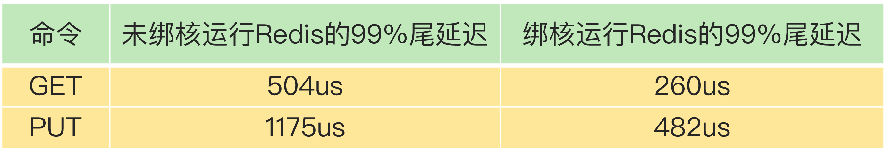

可以看到，在 CPU 多核的环境下，通过绑定 Redis 实例和 CPU 核，可以有效降低 Redis的尾延迟。当然，绑核不仅对降低尾延迟有好处，同样也能降低平均延迟、提升吞吐率，进而提升 Redis 性能。

接下来，我们再来看看多 CPU 架构，也就是 NUMA 架构，对 Redis 性能的影响。


### **CPU** **的** **NUMA** **架构对** **Redis** **性能的影响**

在实际应用 Redis 时，我经常看到一种做法，为了提升 Redis 的网络性能，把操作系统的网络中断处理程序和 CPU 核绑定。这个做法可以避免网络中断处理程序在不同核上来回调度执行，的确能有效提升 Redis 的网络处理性能。

但是，网络中断程序是要和 Redis 实例进行网络数据交互的，一旦把网络中断程序绑核后，我们就需要注意 Redis 实例是绑在哪个核上了，这会关系到 Redis 访问网络数据的效率高低。

我们先来看下 Redis 实例和网络中断程序的数据交互：网络中断处理程序从网卡硬件中读取数据，并把数据写入到操作系统内核维护的一块内存缓冲区。内核会通过 epoll 机制触发事件，通知 Redis 实例，Redis 实例再把数据从内核的内存缓冲区拷贝到自己的内存空间，如下图所示：


那么，在 CPU 的 NUMA 架构下，当网络中断处理程序、Redis 实例分别和 CPU 核绑定后，就会有一个潜在的风险：**如果网络中断处理程序和 Redis 实例各自所绑的 CPU 核不在同一个 CPU Socket 上，那么，Redis 实例读取网络数据时，就需要跨 CPU Socket 访问内存，这个过程会花费较多时间。**这么说可能有点抽象，我再借助一张图来解释下。

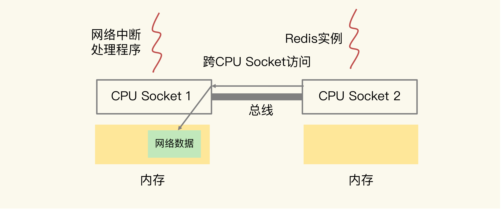

可以看到，图中的网络中断处理程序被绑在了 CPU Socket 1 的某个核上，而 Redis 实例则被绑在了 CPU Socket 2 上。此时，网络中断处理程序读取到的网络数据，被保存在CPU Socket 1 的本地内存中，当 Redis 实例要访问网络数据时，就需要 Socket 2 通过总线把内存访问命令发送到 Socket 1 上，进行远程访问，时间开销比较大。

我们曾经做过测试，和访问 CPU Socket 本地内存相比，跨 CPU Socket 的内存访问延迟增加了 18%，这自然会导致 Redis 处理请求的延迟增加。所以，为了避免 Redis 跨 CPU Socket 访问网络数据，我们最好把网络中断程序和 Redis实例绑在同一个 CPU Socket 上，这样一来，Redis 实例就可以直接从本地内存读取网络数据了，如下图所示：


不过，需要注意的是，**在 CPU 的 NUMA 架构下，对 CPU 核的编号规则，并不是先把一个 CPU Socket 中的所有逻辑核编完，再对下一个 CPU Socket 中的逻辑核编码，而是先给每个 CPU Socket 中每个物理核的第一个逻辑核依次编号，再给每个 CPU Socket 中的物理核的第二个逻辑核依次编号。**

我给你举个例子。假设有 2 个 CPU Socket，每个 Socket 上有 6 个物理核，每个物理核又有 2 个逻辑核，总共 24 个逻辑核。我们可以执行 **lscpu 命令**，查看到这些核的编号：

```
lscpu
Architecture: x86_64
...
NUMA node0 CPU(s): 0-5,12-17
NUMA node1 CPU(s): 6-11,18-23
...
```

可以看到，NUMA node0 的 CPU 核编号是 0 到 5、12 到 17。其中，0 到 5 是 node0上的 6 个物理核中的第一个逻辑核的编号，12 到 17 是相应物理核中的第二个逻辑核编号。NUMA node1 的 CPU 核编号规则和 node0 一样。所以，在绑核时，我们一定要注意，不能想当然地认为第一个 Socket 上的 12 个逻辑核的编号就是 0 到 11。否则，网络中断程序和 Redis 实例就可能绑在了不同的 CPU Socket上。

比如说，如果我们把网络中断程序和 Redis 实例分别绑到编号为 1 和 7 的 CPU 核上，此时，它们仍然是在 2 个 CPU Socket 上，Redis 实例仍然需要跨 Socket 读取网络数据。

**所以，你一定要注意 NUMA 架构下 CPU 核的编号方法，这样才不会绑错核。**

我们先简单地总结下刚刚学习的内容。在 CPU 多核的场景下，用 taskset 命令把 Redis 实例和一个核绑定，可以减少 Redis 实例在不同核上被来回调度执行的开销，避免较高的尾延迟；在多 CPU 的 NUMA 架构下，如果你对网络中断程序做了绑核操作，建议你同时把Redis 实例和网络中断程序绑在同一个 CPU Socket 的不同核上，这样可以避免 Redis 跨 Socket 访问内存中的网络数据的时间开销。

不过，“硬币都是有两面的”，绑核也存在一定的风险。接下来，我们就来了解下它的潜在风险点和解决方案。


### **绑核的风险和解决方案**

Redis 除了主线程以外，还有用于 RDB 生成和 AOF 重写的子进程。此外，我们还在第 16 讲学习了 Redis 的后台线程。

当我们把 Redis 实例绑到一个 CPU 逻辑核上时，就会导致子进程、后台线程和 Redis 主线程竞争 CPU 资源，一旦子进程或后台线程占用 CPU 时，主线程就会被阻塞，导致Redis 请求延迟增加。

针对这种情况，我来给你介绍两种解决方案，分别是**一个 Redis 实例对应绑一个物理核和优化 Redis 源码。**


#### **方案一：一个 Redis 实例对应绑一个物理核**

在给 Redis 实例绑核时，我们不要把一个实例和一个逻辑核绑定，而要和一个物理核绑定，也就是说，把一个物理核的 2 个逻辑核都用上。我们还是以刚才的 NUMA 架构为例，NUMA node0 的 CPU 核编号是 0 到 5、12 到 17。其中，编号 0 和 12、1 和 13、2 和 14 等都是表示一个物理核的 2 个逻辑核。所以，在绑核时，我们使用属于同一个物理核的 2 个逻辑核进行绑核操作。例如，我们执行下面的命令，就把 Redis 实例绑定到了逻辑核 0 和 12 上，而这两个核正好都属于物理核 1。

```
taskset -c 0,12 ./redis-server
```

和只绑一个逻辑核相比，把 Redis 实例和物理核绑定，可以让主线程、子进程、后台线程共享使用 2 个逻辑核，可以在一定程度上缓解 CPU 资源竞争。但是，因为只用了 2 个逻辑核，它们相互之间的 CPU 竞争仍然还会存在。如果你还想进一步减少 CPU 竞争，我再给你介绍一种方案。


#### **方案二：优化 Redis 源码**

这个方案就是通过修改 Redis 源码，把子进程和后台线程绑到不同的 CPU 核上。如果你对 Redis 的源码不太熟悉，也没关系，因为这是通过编程实现绑核的一个通用做法。学会了这个方案，你可以在熟悉了源码之后把它用上，也可以应用在其他需要绑核的场景中。

接下来，我先介绍一下通用的做法，然后，再具体说说可以把这个做法对应到 Redis 的哪部分源码中。

通过编程实现绑核时，要用到操作系统提供的 1 个数据结构 cpu_set_t 和 3 个函数 CPU_ZERO、CPU_SET 和 sched_setaffinity，我先来解释下它们。

- cpu_set_t 数据结构：是一个位图，每一位用来表示服务器上的一个 CPU 逻辑核。

- CPU_ZERO 函数：以 cpu_set_t 结构的位图为输入参数，把位图中所有的位设置为 0。
- CPU_SET 函数：以 CPU 逻辑核编号和 cpu_set_t 位图为参数，把位图中和输入的逻辑核编号对应的位设置为 1。
- sched_setaffinity 函数：以进程 / 线程 ID 号和 cpu_set_t 为参数，检查 cpu_set_t 中哪一位为 1，就把输入的 ID 号所代表的进程 / 线程绑在对应的逻辑核上。

那么，怎么在编程时把这三个函数结合起来实现绑核呢？很简单，我们分四步走就行。

- 第一步：创建一个 cpu_set_t 结构的位图变量；
- 第二步：使用 CPU_ZERO 函数，把 cpu_set_t 结构的位图所有的位都设置为 0；
- 第三步：根据要绑定的逻辑核编号，使用 CPU_SET 函数，把 cpu_set_t 结构的位图相应位设置为 1；
- 第四步：使用 sched_setaffinity 函数，把程序绑定在 cpu_set_t 结构位图中为 1 的逻辑核上。

下面，我就具体介绍下，分别把后台线程、子进程绑到不同的核上的做法。先说后台线程。为了让你更好地理解编程实现绑核，你可以看下这段示例代码，它实现了为线程绑核的操作：

```
//线程函数
void worker(int bind_cpu){
	cpu_set_t cpuset; //创建位图变量
	CPU_ZERO(&cpu_set); //位图变量所有位设置0
	CPU_SET(bind_cpu, &cpuset); //根据输入的bind_cpu编号，把位图对应为设置为1
	sched_setaffinity(0, sizeof(cpuset), &cpuset); //把程序绑定在cpu_set_t结构位图
	//实际线程函数工作
}
int main(){
	pthread_t pthread1
	//把创建的pthread1绑在编号为3的逻辑核上
	pthread_create(&pthread1, NULL, (void *)worker, 3);
}
```

对于 Redis 来说，它是在 bio.c 文件中的 bioProcessBackgroundJobs 函数中创建了后台线程。bioProcessBackgroundJobs 函数类似于刚刚的例子中的 worker 函数，在这个函数中实现绑核四步操作，就可以把后台线程绑到和主线程不同的核上了。和给线程绑核类似，当我们使用 fork 创建子进程时，也可以把刚刚说的四步操作实现在fork 后的子进程代码中，示例代码如下：

```
int main(){
	//用fork创建一个子进程
	pid_t p = fork();
	if(p < 0){
		printf(" fork error\n");
	}
    //子进程代码部分
    else if(!p){
    cpu_set_t cpuset; //创建位图变量
    CPU_ZERO(&cpu_set); //位图变量所有位设置0
    CPU_SET(3, &cpuset); //把位图的第3位设置为1
    sched_setaffinity(0, sizeof(cpuset), &cpuset); //把程序绑定在3号逻辑核
    //实际子进程工作
    exit(0);
    }
    ...
}
```

对于 Redis 来说，生成 RDB 和 AOF 日志重写的子进程分别是下面两个文件的函数中实现的。

- rdb.c 文件：rdbSaveBackground 函数；
- aof.c 文件：rewriteAppendOnlyFileBackground 函数。

这两个函数中都调用了 fork 创建子进程，所以，我们可以在子进程代码部分加上绑核的四步操作。使用源码优化方案，我们既可以实现 Redis 实例绑核，避免切换核带来的性能影响，还可以让子进程、后台线程和主线程不在同一个核上运行，避免了它们之间的 CPU 资源竞争。相比使用 taskset 绑核来说，这个方案可以进一步降低绑核的风险。


## 波动的响应延迟：如何应对变慢的 Redis？（上）

### **Redis** **真的变慢了吗？**

在实际解决问题之前，我们首先要弄清楚，如何判断 Redis 是不是真的变慢了。一个最直接的方法，就是**查看 Redis 的响应延迟**。大部分时候，Redis 延迟很低，但是在某些时刻，有些 Redis 实例会出现很高的响应延迟，甚至能达到几秒到十几秒，不过持续时间不长，这也叫延迟“毛刺”。当你发现 Redis 命令的执行时间突然就增长到了几秒，基本就可以认定 Redis 变慢了。

这种方法是看 Redis 延迟的绝对值，但是，在不同的软硬件环境下，Redis 本身的绝对性能并不相同。比如，在我的环境中，当延迟为 1ms 时，我判定 Redis 变慢了，但是你的硬件配置高，那么，在你的运行环境下，可能延迟是 0.2ms 的时候，你就可以认定 Redis 变慢了。

所以，这里我就要说第二个方法了，也就是基于**当前环境下的 Redis 基线性能**做判断。所谓的基线性能呢，也就是一个系统在低压力、无干扰下的基本性能，这个性能只由当前的软硬件配置决定。

你可能会问，具体怎么确定基线性能呢？有什么好方法吗？

实际上，从 2.8.7 版本开始，redis-cli 命令提供了–intrinsic-latency 选项，**可以用来监测和统计测试期间内的最大延迟，这个延迟可以作为 Redis 的基线性能。**其中，测试时长可以用–intrinsic-latency 选项的参数来指定。举个例子，比如说，我们运行下面的命令，该命令会打印 120 秒内监测到的最大延迟。可以看到，这里的最大延迟是 119 微秒，也就是基线性能为 119 微秒。一般情况下，运行 120 秒就足够监测到最大延迟了，所以，我们可以把参数设置为 120。

```
./redis-cli --intrinsic-latency 120
Max latency so far: 17 microseconds.
Max latency so far: 44 microseconds.
Max latency so far: 94 microseconds.
Max latency so far: 110 microseconds.
Max latency so far: 119 microseconds.
36481658 total runs (avg latency: 3.2893 microseconds / 3289.32 nanoseconds pe
Worst run took 36x longer than the average latency
```

需要注意的是，**基线性能和当前的操作系统、硬件配置相关。因此，我们可以把它和 Redis 运行时的延迟结合起来，再进一步判断 Redis 性能是否变慢了。**一般来说，**你要把运行时延迟和基线性能进行对比，如果你观察到的 Redis 运行时延迟是其基线性能的 2 倍及以上，就可以认定 Redis 变慢了。**

判断基线性能这一点，对于在虚拟化环境下运行的 Redis 来说，非常重要。这是因为，在虚拟化环境（例如虚拟机或容器）中，由于增加了虚拟化软件层，与物理机相比，虚拟机或容器本身就会引入一定的性能开销，所以基线性能会高一些。下面的测试结果，显示的就是某一个虚拟机上运行 Redis 时测的基线性能。

```
$ ./redis-cli --intrinsic-latency 120
Max latency so far: 692 microseconds.
Max latency so far: 915 microseconds.
Max latency so far: 2193 microseconds.
Max latency so far: 9343 microseconds.
Max latency so far: 9871 microseconds.
```

可以看到，由于虚拟化软件本身的开销，此时的基线性能已经达到了 9.871ms。如果该 Redis 实例的运行时延迟为 10ms，这并不能算作性能变慢，因为此时，运行时延迟只比基线性能增加了 1.3%。如果你不了解基线性能，一看到较高的运行时延迟，就很有可能误判 Redis 变慢了。

不过，我们通常是通过客户端和网络访问 Redis 服务，为了避免网络对基线性能的影响，刚刚说的这个命令需要在服务器端直接运行，这也就是说，**我们只考虑服务器端软硬件环境的影响**。

**如果你想了解网络对 Redis 性能的影响，一个简单的方法是用 iPerf 这样的工具，测量从Redis 客户端到服务器端的网络延迟。**如果这个延迟有几十毫秒甚至是几百毫秒，就说明，Redis 运行的网络环境中很可能有大流量的其他应用程序在运行，导致网络拥塞了。这个时候，你就需要协调网络运维，调整网络的流量分配了。


### **如何应对** **Redis** **变慢？**

经过了上一步之后，你已经能够确定 Redis 是否变慢了。一旦发现变慢了，接下来，就要开始查找原因并解决这个问题了，这其实是一个很有意思的诊断过程。

此时的你就像一名医生，而 Redis 则是一位病人。在给病人看病时，你要知道人体的机制，还要知道可能对身体造成影响的外部因素，比如不健康的食物、不好的情绪等，然后要拍 CT、心电图等找出病因，最后再确定治疗方案。在诊断“Redis 变慢”这个病症时，同样也是这样。你要基于自己对 Redis 本身的工作原理的理解，并且结合和它交互的操作系统、存储以及网络等外部系统关键机制，再借助一些辅助工具来定位原因，并制定行之有效的解决方案。

医生诊断一般都是有章可循的。同样，Redis 的性能诊断也有章可依，这就是影响 Redis的关键因素。下面这张图你应该有印象，这是我们在第一节课画的 Redis 架构图。你可以重点关注下我在图上新增的红色模块，**也就是 Redis 自身的操作特性、文件系统和操作系统，它们是影响 Redis 性能的三大要素。**

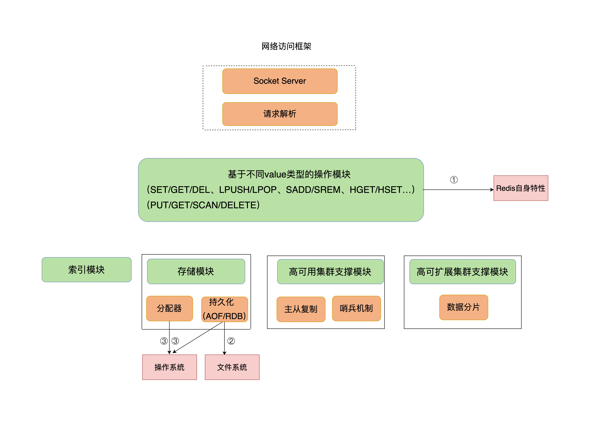

接下来，我将从这三大要素入手，结合实际的应用场景，依次给你介绍从不同要素出发排查和解决问题的实践经验。这节课我先给你介绍 Redis 的自身操作特性的影响，下节课我们再重点研究操作系统和文件系统的影响。


### Redis **自身操作特性的影响**

首先，我们来学习下 Redis 提供的键值对命令操作对延迟性能的影响。我重点介绍两类关键操作：慢查询命令和过期 key 操作。

#### **1. 慢查询命令**

**慢查询命令，就是指在 Redis 中执行速度慢的命令，这会导致 Redis 延迟增加。**Redis 提供的命令操作很多，并不是所有命令都慢，这和命令操作的复杂度有关。所以，我们必须要知道 Redis 的不同命令的复杂度。比如说，Value 类型为 String 时，GET/SET 操作主要就是操作 Redis 的哈希表索引。这个操作复杂度基本是固定的，即 O(1)。但是，当 Value 类型为 Set 时，SORT、SUNION/SMEMBERS 操作复杂度分别为 O(N+M*log(M)) 和 O(N)。其中，N 为 Set 中的元素个数，M 为 SORT 操作返回的元素个数。这个复杂度就增加了很多。Redis 官方文档中对每个命令的复杂度都有介绍，当你需要了解某个命令的复杂度时，可以直接查询。

那该怎么应对这个问题呢？在这儿，我就要给你排查建议和解决方法了，这也是今天的第一个方法。

当你发现 Redis 性能变慢时，可以通过 Redis 日志，或者是 latency monitor 工具，查询变慢的请求，根据请求对应的具体命令以及官方文档，确认下是否采用了复杂度高的慢查询命令。

如果的确有大量的慢查询命令，有两种处理方式：

- **用其他高效命令代替**。比如说，如果你需要返回一个 SET 中的所有成员时，不要使用SMEMBERS 命令，而是要使用 SSCAN 多次迭代返回，避免一次返回大量数据，造成线程阻塞。
- **当你需要执行排序、交集、并集操作时，可以在客户端完成，而不要用 SORT、SUNION、SINTER 这些命令，以免拖慢 Redis 实例**。

当然，如果业务逻辑就是要求使用慢查询命令，那你得考虑采用性能更好的 CPU，更快地完成查询命令，避免慢查询的影响。还有一个比较容易忽略的慢查询命令，就是 KEYS。它用于返回和输入模式匹配的所有 key，例如，以下命令返回所有包含“name”字符串的 keys。

```
redis> KEYS *name*
1) "lastname"
2) "firstname"
```

**因为 KEYS 命令需要遍历存储的键值对，所以操作延时高**。如果你不了解它的实现而使用了它，就会导致 Redis 性能变慢。所以，**KEYS 命令一般不被建议用于生产环境中**。


#### **2. 过期 key 操作**

接下来，我们来看过期 key 的自动删除机制。它是 Redis 用来回收内存空间的常用机制，应用广泛，本身就会引起 Redis 操作阻塞，导致性能变慢，所以，你必须要知道该机制对性能的影响。

Redis 键值对的 key 可以设置过期时间。默认情况下，Redis 每 100 毫秒会删除一些过期 key，具体的算法如下：

- 采样 ACTIVE_EXPIRE_CYCLE_LOOKUPS_PER_LOOP 个数的 key，并将其中过期的key 全部删除；

- 如果超过 25% 的 key 过期了，则重复删除的过程，直到过期 key 的比例降至 25% 以下。

ACTIVE_EXPIRE_CYCLE_LOOKUPS_PER_LOOP 是 Redis 的一个参数，默认是 20，那么，一秒内基本有 200 个过期 key 会被删除。这一策略对清除过期 key、释放内存空间很有帮助。如果每秒钟删除 200 个过期 key，并不会对 Redis 造成太大影响。

<u>但是，如果触发了上面这个算法的第二条，Redis 就会一直删除以释放内存空间。</u>注意，**删除操作是阻塞的**（Redis 4.0 后可以用异步线程机制来减少阻塞影响）。所以，一旦该条件触发，Redis 的线程就会一直执行删除，这样一来，就没办法正常服务其他的键值操作了，就会进一步引起其他键值操作的延迟增加，Redis 就会变慢。那么，算法的第二条是怎么被触发的呢？其中一个重要来源，就是**频繁使用带有相同时间参数的 EXPIREAT 命令设置过期 key**，这就会导致，在同一秒内有大量的 key 同时过期。

现在，我就要给出第二条排查建议和解决方法了。你要检查业务代码在使用 EXPIREAT 命令设置 key 过期时间时，是否使用了相同的 UNIX 时间戳，有没有使用 EXPIRE 命令给批量的 key 设置相同的过期秒数。因为，这都会造成大量 key 在同一时间过期，导致性能变慢。

遇到这种情况时，千万不要嫌麻烦，你首先要根据实际业务的使用需求，决定 EXPIREAT和 EXPIRE 的过期时间参数。其次，如果一批 key 的确是同时过期，你还可以在 EXPIREAT 和 EXPIRE 的过期时间参数上，加上一个一定大小范围内的随机数，这样，既保证了 key 在一个邻近时间范围内被删除，又避免了同时过期造成的压力。


## 波动的响应延迟：如何应对变慢的Redis？（下）


### 文件系统：AOF 模式

你可能会问，Redis 是个内存数据库，为什么它的性能还和文件系统有关呢？我在前面讲过，为了保证数据可靠性，Redis 会采用 AOF 日志或 RDB 快照。其中，AOF 日志提供了三种日志写回策略：no、everysec、always。这三种写回策略依赖文件系统的两个系统调用完成，也就是 write 和 fsync。

**write 只要把日志记录写到内核缓冲区**，就可以返回了，并不需要等待日志实际写回到磁盘；**而 fsync 需要把日志记录写回到磁盘后才能返回**，时间较长。下面这张表展示了三种写回策略所执行的系统调用。

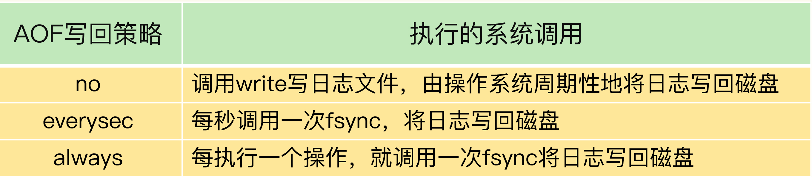

当写回策略配置为 everysec 和 always 时，Redis 需要调用 fsync 把日志写回磁盘。但是，这两种写回策略的具体执行情况还不太一样。在使用 everysec 时，Redis 允许丢失一秒的操作记录，所以，Redis 主线程并不需要确保每个操作记录日志都写回磁盘。而且，fsync 的执行时间很长，如果是在 Redis 主线程中执行 fsync，就容易阻塞主线程。所以，**当写回策略配置为 everysec 时，Redis 会使用后台的子线程异步完成 fsync 的操作。**

而对于 always 策略来说，Redis 需要确保每个操作记录日志都写回磁盘，如果用后台子线程异步完成，主线程就无法及时地知道每个操作是否已经完成了，这就不符合 always 策略的要求了。所以，**always 策略并不使用后台子线程来执行**。另外，在使用 AOF 日志时，为了避免日志文件不断增大，Redis 会执行 AOF 重写，生成体量缩小的新的 AOF 日志文件。AOF 重写本身需要的时间很长，也容易阻塞 Redis 主线程，所以，**Redis 使用子进程来进行 AOF 重写。**

但是，这里有一个潜在的风险点：AOF 重写会对磁盘进行大量 IO 操作，同时，fsync 又需要等到数据写到磁盘后才能返回，所以，当 AOF 重写的压力比较大时，就会导致 fsync 被阻塞。虽然 fsync 是由后台子线程负责执行的，但是，主线程会监控 fsync 的执行进度。

当主线程使用后台子线程执行了一次 fsync，需要再次把新接收的操作记录写回磁盘时，如果主线程发现上一次的 fsync 还没有执行完，那么它就会阻塞。所以，如果后台子线程执行的 fsync 频繁阻塞的话（比如 AOF 重写占用了大量的磁盘 IO 带宽），主线程也会阻塞，导致 Redis 性能变慢。

为了帮助你理解，我再画一张图来展示下在磁盘压力小和压力大的时候，fsync 后台子线程和主线程受到的影响。


好了，说到这里，你已经了解了，由于 fsync 后台子线程和 AOF 重写子进程的存在，主 IO 线程一般不会被阻塞。但是，如果在重写日志时，AOF 重写子进程的写入量比较大，fsync 线程也会被阻塞，进而阻塞主线程，导致延迟增加。现在，我来给出排查和解决建议。首先，你可以检查下 Redis 配置文件中的 appendfsync 配置项，该配置项的取值表明了 Redis 实例使用的是哪种 AOF 日志写回策略，如下所示：


如果 AOF 写回策略使用了 everysec 或 always 配置，请先确认下业务方对数据可靠性的要求，明确是否需要每一秒或每一个操作都记日志。有的业务方不了解 Redis AOF 机制，很可能就直接使用数据可靠性最高等级的 always 配置了。其实，在有些场景中（例如 Redis 用于缓存），数据丢了还可以从后端数据库中获取，并不需要很高的数据可靠性。

如果业务应用对延迟非常敏感，但同时允许一定量的数据丢失，那么，可以把配置项 no appendfsync-on-rewrite 设置为 yes，如下所示：

```
no-appendfsync-on-rewrite yes
```

这个配置项设置为 yes 时，表示在 AOF 重写时，不进行 fsync 操作。也就是说，Redis 实例把写命令写到内存后，不调用后台线程进行 fsync 操作，就可以直接返回了。当然，如果此时实例发生宕机，就会导致数据丢失。反之，如果这个配置项设置为 no（也是默认配置），在 AOF 重写时，Redis 实例仍然会调用后台线程进行 fsync 操作，这就会给实例带来阻塞。

如果的确需要高性能，同时也需要高可靠数据保证，我建议你考虑**采用高速的固态硬盘作为 AOF 日志的写入设备。**

高速固态盘的带宽和并发度比传统的机械硬盘的要高出 10 倍及以上。在 AOF 重写和 fsync 后台线程同时执行时，固态硬盘可以提供较为充足的磁盘 IO 资源，让 AOF 重写和 fsync 后台线程的磁盘 IO 资源竞争减少，从而降低对 Redis 的性能影响。


### 操作系统：swap

如果 Redis 的 AOF 日志配置只是 no，或者就没有采用 AOF 模式，那么，还会有什么问题导致性能变慢吗？

接下来，我就再说一个潜在的瓶颈：**操作系统的内存 swap**。

内存 swap 是操作系统里将内存数据在内存和磁盘间来回换入和换出的机制，涉及到磁盘的读写，所以，一旦触发 swap，无论是被换入数据的进程，还是被换出数据的进程，其性能都会受到慢速磁盘读写的影响。

Redis 是内存数据库，内存使用量大，如果没有控制好内存的使用量，或者和其他内存需求大的应用一起运行了，就可能受到 swap 的影响，而导致性能变慢。

这一点对于 Redis 内存数据库而言，显得更为重要：正常情况下，Redis 的操作是直接通过访问内存就能完成，一旦 swap 被触发了，Redis 的请求操作需要等到磁盘数据读写完成才行。而且，和我刚才说的 AOF 日志文件读写使用 fsync 线程不同，**swap 触发后影响的是 Redis 主 IO 线程，这会极大地增加 Redis 的响应时间。**

说到这儿，我想给你分享一个我曾经遇到过的因为 swap 而导致性能降低的例子。在正常情况下，我们运行的一个实例完成 5000 万个 GET 请求时需要 300s，但是，有一次，这个实例完成 5000 万 GET 请求，花了将近 4 个小时的时间。经过问题复现，我们发现，当时 Redis 处理请求用了近 4 小时的情况下，该实例所在的机器已经发生了 swap。

从 300s 到 4 个小时，延迟增加了将近 48 倍，可以看到 swap 对性能造成的严重影响。那么，什么时候会触发 swap 呢？

通常，触发 swap 的原因主要是**物理机器内存不足**，对于 Redis 而言，有两种常见的情况：

- Redis 实例自身使用了大量的内存，导致物理机器的可用内存不足；

- 和 Redis 实例在同一台机器上运行的其他进程，在进行大量的文件读写操作。文件读写本身会占用系统内存，这会导致分配给 Redis 实例的内存量变少，进而触发 Redis 发生 swap。

针对这个问题，我也给你提供一个解决思路：**增加机器的内存或者使用 Redis 集群**。操作系统本身会在后台记录每个进程的 swap 使用情况，即有多少数据量发生了 swap。你可以先通过下面的命令查看 Redis 的进程号，这里是 5332。

```
$ redis-cli info | grep process_id
process_id: 5332
```

然后，进入 Redis 所在机器的 /proc 目录下的该进程目录中：

```
$ cd /proc/5332
```

最后，运行下面的命令，查看该 Redis 进程的使用情况。在这儿，我只截取了部分结果：

```
$cat smaps | egrep '^(Swap|Size)'
Size: 584 kB
Swap: 0 kB
Size: 4 kB
Swap: 4 kB
Size: 4 kB
Swap: 0 kB
Size: 462044 kB
Swap: 462008 kB
Size: 21392 kB
Swap: 0 kB
```

每一行 Size 表示的是 Redis 实例所用的一块内存大小，而 Size 下方的 Swap 和它相对应，表示这块 Size 大小的内存区域有多少已经被换出到磁盘上了。如果这两个值相等，就表示这块内存区域已经完全被换出到磁盘了。

作为内存数据库，Redis 本身会使用很多大小不一的内存块，所以，你可以看到有很多Size 行，有的很小，就是 4KB，而有的很大，例如 462044KB。**不同内存块被换出到磁盘上的大小也不一样**，例如刚刚的结果中的第一个 4KB 内存块，它下方的 Swap 也是 4KB，

这表示这个内存块已经被换出了；另外，462044KB 这个内存块也被换出了 462008KB，差不多有 462MB。这里有个重要的地方，我得提醒你一下，**当出现百 MB，甚至 GB 级别的 swap 大小时，就表明，此时，Redis 实例的内存压力很大，很有可能会变慢。所以，swap 的大小是排查 Redis 性能变慢是否由 swap 引起的重要指标。**

一旦发生内存 swap，最直接的解决方法就是**增加机器内存**。如果该实例在一个 Redis 切片集群中，可以增加 Redis 集群的实例个数，来分摊每个实例服务的数据量，进而减少每个实例所需的内存量。

当然，如果 Redis 实例和其他操作大量文件的程序（例如数据分析程序）共享机器，你可以将 Redis 实例迁移到单独的机器上运行，以满足它的内存需求量。如果该实例正好是 Redis 主从集群中的主库，而从库的内存很大，也可以考虑进行主从切换，把大内存的从库变成主库，由它来处理客户端请求。


### **操作系统：内存大页**

除了内存 swap，还有一个和内存相关的因素，即内存大页机制（Transparent Huge Page, THP），也会影响 Redis 性能。

Linux 内核从 2.6.38 开始支持内存大页机制，该机制支持 2MB 大小的内存页分配，而常规的内存页分配是按 4KB 的粒度来执行的。

很多人都觉得：“Redis 是内存数据库，内存大页不正好可以满足 Redis 的需求吗？而且在分配相同的内存量时，内存大页还能减少分配次数，不也是对 Redis 友好吗?” 其实，系统的设计通常是一个取舍过程，我们称之为 trade-off。很多机制通常都是优势和劣势并存的。Redis 使用内存大页就是一个典型的例子。

虽然内存大页可以给 Redis 带来内存分配方面的收益，但是，不要忘了，Redis 为了提供数据可靠性保证，需要将数据做持久化保存。这个写入过程由额外的线程执行，所以，此时，Redis 主线程仍然可以接收客户端写请求。客户端的写请求可能会修改正在进行持久化的数据。在这一过程中，Redis 就会采用写时复制机制，也就是说，一旦有数据要被修改，Redis 并不会直接修改内存中的数据，而是将这些数据拷贝一份，然后再进行修改。

如果采用了内存大页，那么，即使客户端请求只修改 100B 的数据，Redis 也需要拷贝 2MB 的大页。相反，如果是常规内存页机制，只用拷贝 4KB。两者相比，你可以看到，当客户端请求修改或新写入数据较多时，内存大页机制将导致大量的拷贝，这就会影响 Redis 正常的访存操作，最终导致性能变慢。

那该怎么办呢？很简单，关闭内存大页，就行了。

首先，我们要先排查下内存大页。方法是：在 Redis 实例运行的机器上执行如下命令:

```
cat /sys/kernel/mm/transparent_hugepage/enabled
```

如果执行结果是 always，就表明内存大页机制被启动了；如果是 never，就表示，内存大页机制被禁止。

在实际生产环境中部署时，我建议你不要使用内存大页机制，操作也很简单，只需要执行下面的命令就可以了：

```
echo never /sys/kernel/mm/transparent_hugepage/enabled
```


## **小结**

为了方便你应用，我给你梳理了一个包含 9 个检查点的 Checklist，希望你在遇到 Redis性能变慢时，按照这些步骤逐一检查，高效地解决问题。

1、获取 Redis 实例在当前环境下的基线性能。

2、是否用了慢查询命令？如果是的话，就使用其他命令替代慢查询命令，或者把聚合计算命令放在客户端做。

3、是否对过期 key 设置了相同的过期时间？对于批量删除的 key，可以在每个 key 的过期时间上加一个随机数，避免同时删除。

4、是否存在 bigkey？ 对于 bigkey 的删除操作，如果你的 Redis 是 4.0 及以上的版本，可以直接利用异步线程机制减少主线程阻塞；如果是 Redis 4.0 以前的版本，可以使用SCAN 命令迭代删除；对于 bigkey 的集合查询和聚合操作，可以使用 SCAN 命令在客户端完成。

5、Redis AOF 配置级别是什么？业务层面是否的确需要这一可靠性级别？如果我们需要高性能，同时也允许数据丢失，可以将配置项 no-appendfsync-on-rewrite 设置为 yes，避免 AOF 重写和 fsync 竞争磁盘 IO 资源，导致 Redis 延迟增加。当然， 如果既需要高性能又需要高可靠性，最好使用高速固态盘作为 AOF 日志的写入盘。

6、Redis 实例的内存使用是否过大？发生 swap 了吗？如果是的话，就增加机器内存，或者是使用 Redis 集群，分摊单机 Redis 的键值对数量和内存压力。同时，要避免出现 Redis 和其他内存需求大的应用共享机器的情况。

在 Redis 实例的运行环境中，是否启用了透明大页机制？如果是的话，直接关闭内存大页机制就行了。

7、是否运行了 Redis 主从集群？如果是的话，把主库实例的数据量大小控制在 2~4GB，以免主从复制时，从库因加载大的 RDB 文件而阻塞。

8、是否使用了多核 CPU 或 NUMA 架构的机器运行 Redis 实例？使用多核 CPU 时，可以给 Redis 实例绑定物理核；使用 NUMA 架构时，注意把 Redis 实例和网络中断处理程序运行在同一个 CPU Socket 上。


