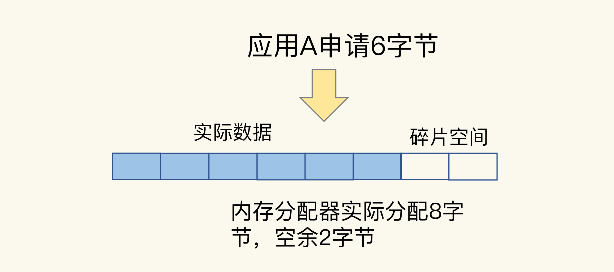
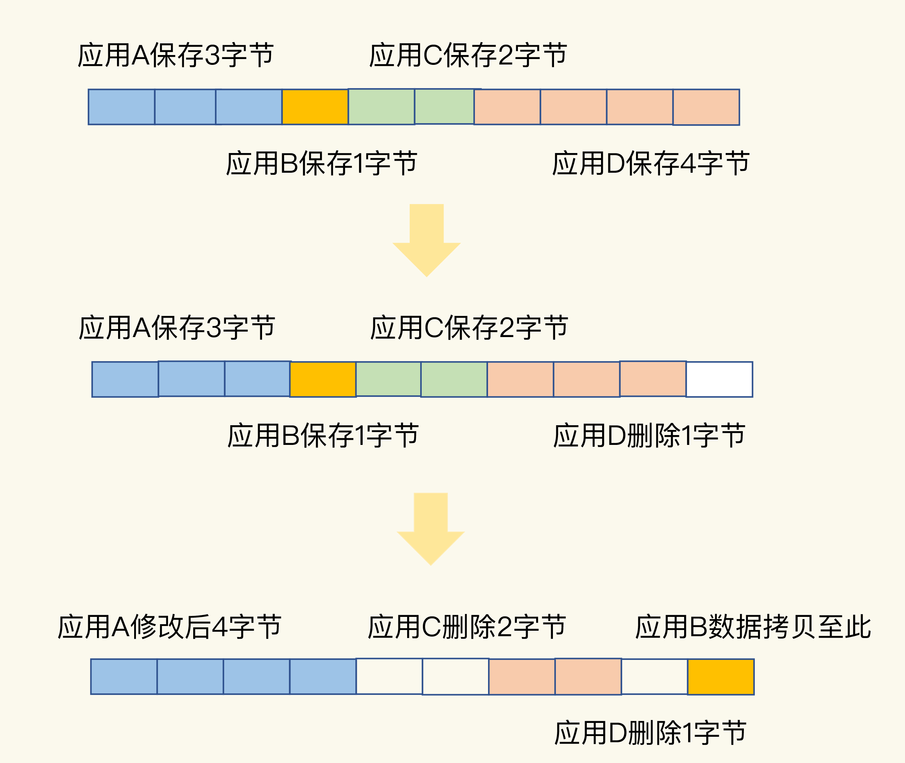

# 删除数据后，为什么内存占用率还是很高？

**什么是内存碎片？**

通常情况下，内存空间闲置，往往是因为操作系统发生了较为严重的内存碎片。那么，什么是内存碎片呢？

为了方便你理解，我还是借助高铁的车厢座位来进行解释。假设一个车厢的座位总共有 60个，现在已经卖了 57 张票，你和 2 个小伙伴要乘坐高铁出门旅行，刚好需要三张票。不过，你们想要坐在一起，这样可以在路上聊天。但是，在选座位时，你们却发现，已经买不到连续的座位了。于是，你们只好换了一趟车。这样一来，你们需要改变出行时间，而且这趟车就空置了三个座位。其实，这趟车的空座位是和你们的人数相匹配的，只是这些空座位是分散的，如下图所示：


我们可以把这些分散的空座位叫作“车厢座位碎片”，知道了这一点，操作系统的内存碎片就很容易理解了。虽然操作系统的剩余内存空间总量足够，但是，应用申请的是一块连续地址空间的 N 字节，但在剩余的内存空间中，没有大小为 N 字节的连续空间了，那么，这些剩余空间就是内存碎片（比如上图中的“空闲 2 字节”和“空闲 1 字节”，就是这样的碎片）。

那么，Redis 中的内存碎片是什么原因导致的呢？接下来，我带你来具体看一看。我们只有了解了内存碎片的成因，才能对症下药，把 Redis 占用的内存空间充分利用起来，增加存储的数据量。


## **内存碎片是如何形成的？**

其实，内存碎片的形成有内因和外因两个层面的原因。简单来说，内因是操作系统的内存分配机制，外因是 Redis 的负载特征。


### **内因：内存分配器的分配策略**

内存分配器的分配策略就决定了操作系统无法做到“按需分配”。这是因为，**内存分配器一般是按固定大小来分配内存，而不是完全按照应用程序申请的内存空间大小给程序分配。**

Redis 可以使用 libc、jemalloc、tcmalloc 多种内存分配器来分配内存，默认使用 jemalloc。接下来，我就以 jemalloc 为例，来具体解释一下。其他分配器也存在类似的问题。jemalloc 的分配策略之一，是按照一系列固定的大小划分内存空间，例如 8 字节、16 字节、32 字节、48 字节，…, 2KB、4KB、8KB 等。当程序申请的内存最接近某个固定值时，jemalloc 会给它分配相应大小的空间。

这样的分配方式本身是为了减少分配次数。例如，Redis 申请一个 20 字节的空间保存数据，jemalloc 就会分配 32 字节，此时，如果应用还要写入 10 字节的数据，Redis 就不用再向操作系统申请空间了，因为刚才分配的 32 字节已经够用了，这就避免了一次分配操作。

但是，如果 Redis 每次向分配器申请的内存空间大小不一样，这种分配方式就会有形成碎片的风险，而这正好来源于 Redis 的外因了。


### **外因：键值对大小不一样和删改操作**

Redis 通常作为共用的缓存系统或键值数据库对外提供服务，所以，不同业务应用的数据都可能保存在 Redis 中，这就会带来不同大小的键值对。这样一来，**Redis 申请内存空间分配时，本身就会有大小不一的空间需求。这是第一个外因**。但是咱们刚刚讲过，内存分配器只能按固定大小分配内存，所以，分配的内存空间一般都会比申请的空间大一些，不会完全一致，这本身就会造成一定的碎片，降低内存空间存储效率。

比如说，应用 A 保存 6 字节数据，jemalloc 按分配策略分配 8 字节。如果应用 A 不再保存新数据，那么，这里多出来的 2 字节空间就是内存碎片了，如下图所示：



**第二个外因是，这些键值对会被修改和删除，这会导致空间的扩容和释放。**具体来说，一方面，如果修改后的键值对变大或变小了，就需要占用额外的空间或者释放不用的空间。另一方面，删除的键值对就不再需要内存空间了，此时，就会把空间释放出来，形成空闲空间。我画了下面这张图来帮助你理解。



一开始，应用 A、B、C、D 分别保存了 3、1、2、4 字节的数据，并占据了相应的内存空间。然后，应用 D 删除了 1 个字节，这个 1 字节的内存空间就空出来了。紧接着，应用 A 修改了数据，从 3 字节变成了 4 字节。为了保持 A 数据的空间连续性，操作系统就需要把 B 的数据拷贝到别的空间，比如拷贝到 D 刚刚释放的空间中。此时，应用 C 和 D 也分别删除了 2 字节和 1 字节的数据，整个内存空间上就分别出现了 2 字节和 1 字节的空闲碎片。如果应用 E 想要一个 3 字节的连续空间，显然是不能得到满足的。因为，虽然空间总量够，但却是碎片空间，并不是连续的。

好了，到这里，我们就知道了造成内存碎片的内外因素，其中，**内存分配器策略是内因，而 Redis 的负载属于外因，包括了大小不一的键值对和键值对修改删除带来的内存空间变化。**

大量内存碎片的存在，会造成 Redis 的内存实际利用率变低，接下来，我们就要来解决这个问题了。不过，在解决问题前，我们要先判断 Redis 运行过程中是否存在内存碎片。


## **如何判断是否有内存碎片？**

Redis 是内存数据库，内存利用率的高低直接关系到 Redis 运行效率的高低。为了让用户能监控到实时的内存使用情况，Redis 自身提供了 INFO 命令，可以用来查询内存使用的详细信息，命令如下：

```
INFO memory
# Memory
used_memory:1073741736
used_memory_human:1024.00M
used_memory_rss:1997159792
used_memory_rss_human:1.86G
…
mem_fragmentation_ratio:1.86
```

这里有一个 mem_fragmentation_ratio 的指标，它表示的就是 Redis 当前的内存碎片率。那么，这个碎片率是怎么计算的呢？其实，就是上面的命令中的两个指标 used_memory_rss 和 used_memory 相除的结果。

```
mem_fragmentation_ratio = used_memory_rss/ used_memory
```

used_memory_rss 是操作系统实际分配给 Redis 的物理内存空间，里面就包含了碎片；而 used_memory 是 Redis 为了保存数据实际申请使用的空间。我简单举个例子。例如，Redis 申请使用了 100 字节（used_memory），操作系统实际分配了 128 字节（used_memory_rss），此时，mem_fragmentation_ratio 就是 1.28。

那么，知道了这个指标，我们该如何使用呢？在这儿，我提供一些经验阈值：

- **mem_fragmentation_ratio 大于 1 但小于 1.5**。这种情况是合理的。这是因为，刚才我介绍的那些因素是难以避免的。毕竟，内因的内存分配器是一定要使用的，分配策略都是通用的，不会轻易修改；而外因由 Redis 负载决定，也无法限制。所以，存在内存碎也是正常的。
- **mem_fragmentation_ratio 大于 1.5** 。这表明内存碎片率已经超过了 50%。一般情况下，这个时候，我们就需要采取一些措施来降低内存碎片率了。


## **如何清理内存碎片？**

当 Redis 发生内存碎片后，一个“简单粗暴”的方法就是**重启 Redis 实例**。当然，这并不是一个“优雅”的方法，毕竟，重启 Redis 会带来两个后果：

- 如果 Redis 中的数据没有持久化，那么，数据就会丢失；
- 即使 Redis 数据持久化了，我们还需要通过 AOF 或 RDB 进行恢复，恢复时长取决于 AOF 或 RDB 的大小，如果只有一个 Redis 实例，恢复阶段无法提供服务。

所以，还有什么其他好办法吗?幸运的是，从 4.0-RC3 版本以后，Redis 自身提供了一种内存碎片自动清理的方法，我们先来看这个方法的基本机制。

内存碎片清理，简单来说，就是“搬家让位，合并空间”。

我还以刚才的高铁车厢选座为例，来解释一下。你和小伙伴不想耽误时间，所以直接买了座位不在一起的三张票。但是，上车后，你和小伙伴通过和别人调换座位，又坐到了一起。

这么一说，碎片清理的机制就很容易理解了。当有数据把一块连续的内存空间分割成好几块不连续的空间时，操作系统就会把数据拷贝到别处。此时，数据拷贝需要能把这些数据原来占用的空间都空出来，把原本不连续的内存空间变成连续的空间。否则，如果数据拷贝后，并没有形成连续的内存空间，这就不能算是清理了。我画一张图来解释一下。


在进行碎片清理前，这段 10 字节的空间中分别有 1 个 2 字节和 1 个 1 字节的空闲空间，只是这两个空间并不连续。操作系统在清理碎片时，会先把应用 D 的数据拷贝到 2 字节的空闲空间中，并释放 D 原先所占的空间。然后，再把 B 的数据拷贝到 D 原来的空间中。这样一来，这段 10 字节空间的最后三个字节就是一块连续空间了。到这里，碎片清理结束。

不过，需要注意的是：**碎片清理是有代价的**，操作系统需要把多份数据拷贝到新位置，把原有空间释放出来，这会带来时间开销。**因为 Redis 是单线程，在数据拷贝时，Redis 只能等着，这就导致 Redis 无法及时处理请求，性能就会降低**。而且，有的时候，数据拷贝还需要注意顺序，就像刚刚说的清理内存碎片的例子，操作系统需要先拷贝 D，并释放 D的空间后，才能拷贝 B。这种对顺序性的要求，会进一步增加 Redis 的等待时间，导致性能降低。

那么，有什么办法可以尽量缓解这个问题吗？这就要提到，Redis 专门为自动内存碎片清理功机制设置的参数了。我们可以通过设置参数，来控制碎片清理的开始和结束时机，以及占用的 CPU 比例，从而减少碎片清理对 Redis 本身请求处理的性能影响。

首先，Redis 需要启用自动内存碎片清理，可以把 activedefrag 配置项设置为 yes，命令如下：

```
config set activedefrag yes
```

这个命令只是启用了自动清理功能，但是，具体什么时候清理，会受到下面这两个参数的控制。这两个参数分别设置了触发内存清理的一个条件，如果同时满足这两个条件，就开始清理。在清理的过程中，只要有一个条件不满足了，就停止自动清理。

- **active-defrag-ignore-bytes 100mb**：表示内存碎片的字节数达到 100MB 时，开始清理；
- **active-defrag-threshold-lower 10**：表示内存碎片空间占操作系统分配给 Redis 的总空间比例达到 10% 时，开始清理。

为了尽可能减少碎片清理对 Redis 正常请求处理的影响，自动内存碎片清理功能在执行时，还会监控清理操作占用的 CPU 时间，而且还设置了两个参数，分别用于控制清理操作占用的 CPU 时间比例的上、下限，既保证清理工作能正常进行，又避免了降低 Redis 性能。这两个参数具体如下：

- **active-defrag-cycle-min 25**： 表示自动清理过程所用 CPU 时间的比例不低于25%，保证清理能正常开展；
- **active-defrag-cycle-max 75**：表示自动清理过程所用 CPU 时间的比例不高于75%，一旦超过，就停止清理，从而避免在清理时，大量的内存拷贝阻塞 Redis，导致响应延迟升高。

自动内存碎片清理机制在控制碎片清理启停的时机上，既考虑了碎片的空间占比、对 Redis 内存使用效率的影响，还考虑了清理机制本身的 CPU 时间占比、对 Redis 性能的影响。而且，清理机制还提供了 4 个参数，让我们可以根据实际应用中的数据量需求和性能要求灵活使用，建议你在实践中好好地把这个机制用起来。


# 缓冲区：一个可能引发“惨案”的地方

缓冲区的功能其实很简单，主要就是用一块内存空间来暂时存放命令数据，以免出现因为数据和命令的处理速度慢于发送速度而导致的数据丢失和性能问题。但因为缓冲区的内存空间有限，如果往里面写入数据的速度持续地大于从里面读取数据的速度，就会导致缓冲区需要越来越多的内存来暂存数据。**当缓冲区占用的内存超出了设定的上限阈值时，就会出现缓冲区溢出。**

如果发生了溢出，就会丢数据了。那是不是不给缓冲区的大小设置上限，就可以了呢？显然不是，随着累积的数据越来越多，缓冲区占用内存空间越来越大，一旦耗尽了 Redis 实例所在机器的可用内存，就会导致 Redis 实例崩溃。

## **客户端输入和输出缓冲区**

我们先来看看服务器端和客户端之间的缓冲区。为了避免客户端和服务器端的请求发送和处理速度不匹配，**服务器端给每个连接的客户端都设置了一个输入缓冲区和输出缓冲区，我们称之为客户端输入缓冲区和输出缓冲区。**输入缓冲区会先把客户端发送过来的命令暂存起来，Redis 主线程再从输入缓冲区中读取命令，进行处理。当 Redis 主线程处理完数据后，会把结果写入到输出缓冲区，再通过输出缓冲区返回给客户端，如下图所示：


下面，我们就分别学习下输入缓冲区和输出缓冲区发生溢出的情况，以及相应的应对方案。


### **如何应对输入缓冲区溢出？**

我们前面已经分析过了，输入缓冲区就是用来暂存客户端发送的请求命令的，所以可能导致溢出的情况主要是下面两种：

- **写入了 bigkey**，比如一下子写入了多个百万级别的集合类型数据；
- 服务器端处理请求的速度过慢，例如，Redis 主线程出现了**间歇性阻塞**，无法及时处理正常发送的请求，导致客户端发送的请求在缓冲区越积越多

接下来，我们就从**如何查看输入缓冲区的内存使用情况，以及如何避免溢出**这两个问题出发，来继续学习吧。要查看和服务器端相连的每个客户端对输入缓冲区的使用情况，我们可以**使用 CLIENT LIST 命令**：

```
CLIENT LIST
id=3 addr=127.0.0.1:63786 fd=11 name= age=729 idle=0 flags=N db=0 sub=0 psub=0 multi=-1 qbuf=26 qbuf-free=32742 obl=0 oll=0 omem=0 events=r cmd=client
```

CLIENT 命令返回的信息虽然很多，但我们只需要重点关注两类信息就可以了。**一类是与服务器端连接的客户端的信息。**这个案例展示的是一个客户端的输入缓冲区情况，如果有多个客户端，输出结果中的 addr 会显示不同客户端的 IP 和端口号。**另一类是与输入缓冲区相关的三个参数**：

- cmd，表示客户端最新执行的命令。这个例子中执行的是 CLIENT 命令。
- qbuf，表示输入缓冲区已经使用的大小。这个例子中的 CLIENT 命令已使用了 26 字节大小的缓冲区。
- qbuf-free，表示输入缓冲区尚未使用的大小。这个例子中的 CLIENT 命令还可以使用 32742 字节的缓冲区。qbuf 和 qbuf-free 的总和就是，Redis 服务器端当前为已连接的这个客户端分配的缓冲区总大小。这个例子中总共分配了 26 + 32742 = 32768 字节，也就是 32KB 的缓冲区。

有了 CLIENT LIST 命令，我们就可以通过输出结果来判断客户端输入缓冲区的内存占用情况了。**如果 qbuf 很大，而同时 qbuf-free 很小，就要引起注意了，因为这时候输入缓冲区已经占用了很多内存，而且没有什么空闲空间了。**此时，客户端再写入大量命令的话，就会引起客户端输入缓冲区溢出，Redis 的处理办法就是把客户端连接关闭，结果就是业务程序无法进行数据存取了。

通常情况下，Redis 服务器端不止服务一个客户端，**当多个客户端连接占用的内存总量，超过了 Redis 的 maxmemory 配置项时（例如 4GB），就会触发 Redis 进行数据淘汰。一旦数据被淘汰出 Redis，再要访问这部分数据，就需要去后端数据库读取，这就降低了业务应用的访问性能。**此外，更糟糕的是，如果使用多个客户端，导致 Redis 内存占用过大，也会导致内存溢出（out-of-memory）问题，进而会引起 Redis 崩溃，给业务应用造成严重影响。

所以，我们必须得想办法避免输入缓冲区溢出。**我们可以从两个角度去考虑如何避免，一是把缓冲区调大，二是从数据命令的发送和处理速度入手。**

我们先看看，**到底有没有办法通过参数调整输入缓冲区的大小呢？答案是没有。Redis 的客户端输入缓冲区大小的上限阈值，在代码中就设定为了 1GB。也就是说，Redis 服务器端允许为每个客户端最多暂存 1GB 的命令和数据。**1GB 的大小，对于一般的生产环境已经是比较合适的了。

- 一方面，这个大小对于处理绝大部分客户端的请求已经够用了；
- 另一方面，如果再大的话，Redis 就有可能因为客户端占用了过多的内存资源而崩溃。

所以，**Redis 并没有提供参数让我们调节客户端输入缓冲区的大小。如果要避免输入缓冲区溢出，那我们就只能从数据命令的发送和处理速度入手**，也就是前面提到的避免客户端写入 bigkey，以及避免 Redis 主线程阻塞。接下来，我们再来看看输出缓冲区的溢出问题。


### **如何应对输出缓冲区溢出？**

**Redis 的输出缓冲区暂存的是 Redis 主线程要返回给客户端的数据。一般来说，主线程返回给客户端的数据，**既有简单且大小固定的 OK 响应（例如，执行 SET 命令）或报错信息，也有大小不固定的、包含具体数据的执行结果（例如，执行 HGET 命令）。

因此，**Redis 为每个客户端设置的输出缓冲区也包括两部分：一部分，是一个大小为 16KB的固定缓冲空间，用来暂存 OK 响应和出错信息；另一部分，是一个可以动态增加的缓冲空间，用来暂存大小可变的响应结果。**

**那什么情况下会发生输出缓冲区溢出呢？** 我为你总结了三种：

- 服务器端返回 bigkey 的大量结果；
- 执行了 MONITOR 命令；
- 缓冲区大小设置得不合理。

其中，bigkey 原本就会占用大量的内存空间，所以服务器端返回的结果包含 bigkey，必然会影响输出缓冲区。接下来，我们就重点看下，执行 MONITOR 命令和设置缓冲区大小这两种情况吧。

MONITOR 命令是用来监测 Redis 执行的。执行这个命令之后，就会持续输出监测到的各个命令操作，如下所示：

```
MONITOR
OK
1600617456.437129 [0 127.0.0.1:50487] "COMMAND"
1600617477.289667 [0 127.0.0.1:50487] "info" "memory"
```

到这里，你有没有看出什么问题呢？MONITOR 的输出结果会持续占用输出缓冲区，并越占越多，最后的结果就是发生溢出。所以，我要给你一个小建议：**MONITOR 命令主要用在调试环境中，不要在线上生产环境中持续使用 MONITOR**。当然，如果在线上环境中偶尔使用 MONITOR 检查 Redis 的命令执行情况，是没问题的。

**接下来，我们看下输出缓冲区大小设置的问题**。和输入缓冲区不同，我们可以通过 client output-buffer-limit 配置项，来设置缓冲区的大小。具体设置的内容包括两方面：

- 设置缓冲区大小的上限阈值；

- 设置输出缓冲区持续写入数据的数量上限阈值，和持续写入数据的时间的上限阈值。

在具体使用 client-output-buffer-limit 来设置缓冲区大小的时候，我们需要先区分下客户端的类型。

对于和 Redis 实例进行交互的应用程序来说，主要使用两类客户端和 Redis 服务器端交互，分别是常规和 Redis 服务器端进行读写命令交互的普通客户端，以及订阅了 Redis 频道的订阅客户端。此外，在 Redis 主从集群中，主节点上也有一类客户端（从节点客户端）用来和从节点进行数据同步，我会在介绍主从集群中的缓冲区时，向你具体介绍。当我们给普通客户端设置缓冲区大小时，通常可以在 Redis 配置文件中进行这样的设置：

```
client-output-buffer-limit normal 0 0 0
```

其中，normal 表示当前设置的是普通客户端，第 1 个 0 设置的是缓冲区大小限制，第 2个 0 和第 3 个 0 分别表示缓冲区持续写入量限制和持续写入时间限制。对于普通客户端来说，它每发送完一个请求，会等到请求结果返回后，再发送下一个请求，这种发送方式称为阻塞式发送。在这种情况下，如果不是读取体量特别大的 bigkey，服务器端的输出缓冲区一般不会被阻塞的。所以，我们通常把普通客户端的缓冲区大小限制，以及持续写入量限制、持续写入时间限制都设置为 0，也就是不做限制。

**对于订阅客户端来说，一旦订阅的 Redis 频道有消息了，服务器端都会通过输出缓冲区把消息发给客户端。所以，订阅客户端和服务器间的消息发送方式，不属于阻塞式发送。不过，如果频道消息较多的话，也会占用较多的输出缓冲区空间。**

因此，我们会给订阅客户端设置缓冲区大小限制、缓冲区持续写入量限制，以及持续写入时间限制，可以在 Redis 配置文件中这样设置：

```
client-output-buffer-limit pubsub 8mb 2mb 60
```

其中，pubsub 参数表示当前是对订阅客户端进行设置；8mb 表示输出缓冲区的大小上限为 8MB，一旦实际占用的缓冲区大小要超过 8MB，服务器端就会直接关闭客户端的连接；2mb 和 60 表示，如果连续 60 秒内对输出缓冲区的写入量超过 2MB 的话，服务器端也会关闭客户端连接。

好了，我们来总结下如何应对输出缓冲区溢出：

- 避免 bigkey 操作返回大量数据结果；
- 避免在线上环境中持续使用 MONITOR 命令。
- 使用 client-output-buffer-limit **设置合理的缓冲区大小上限，或是缓冲区连续写入时间和写入量上限。**

以上就是关于客户端缓冲区，我们要重点掌握的内容了。我们继续看看在主从集群间使用缓冲区，需要注意什么问题。


## **主从集群中的缓冲区**

**主从集群间的数据复制包括全量复制和增量复制两种。全量复制是同步所有数据，而增量复制只会把主从库网络断连期间主库收到的命令，同步给从库。**无论在哪种形式的复制中，为了保证主从节点的数据一致，都会用到缓冲区。但是，这两种复制场景下的缓冲区，在溢出影响和大小设置方面并不一样。所以，我们分别来学习下吧。


### **复制缓冲区的溢出问题**

在全量复制过程中，**主节点在向从节点传输 RDB 文件的同时，会继续接收客户端发送的写命令请求。这些写命令就会先保存在复制缓冲区中，等 RDB 文件传输完成后，再发送给从节点去执行。**主节点上会为每个从节点都维护一个复制缓冲区，来保证主从节点间的数据同步。


所以，如果在全量复制时，从节点接收和加载 RDB 较慢，**同时主节点接收到了大量的写命令，写命令在复制缓冲区中就会越积越多，最终导致溢出。**

其实，主节点上的复制缓冲区，本质上也是一个用于和从节点连接的客户端（我们称之为从节点客户端），使用的输出缓冲区。复制缓冲区一旦发生溢出，主节点也会直接关闭和从节点进行复制操作的连接，导致全量复制失败。那如何避免复制缓冲区发生溢出呢？

- **一方面，我们可以控制主节点保存的数据量大小。**按通常的使用经验，我们会把主节点的数据量控制在 2~4GB，这样可以让全量同步执行得更快些，避免复制缓冲区累积过多命令。

- **另一方面，我们可以使用 client-output-buffer-limit 配置项，来设置合理的复制缓冲区大小。**设置的依据，就是主节点的数据量大小、主节点的写负载压力和主节点本身的内存大小。

我们通过一个具体的例子，来学习下具体怎么设置。在主节点执行如下命令：

```
config set client-output-buffer-limit slave 512mb 128mb 60
```

其中，slave 参数表明该配置项是针对复制缓冲区的。512mb 代表将缓冲区大小的上限设置为 512MB；128mb 和 60 代表的设置是，如果连续 60 秒内的写入量超过 128MB 的话，也会触发缓冲区溢出。

我们再继续看看这个设置对我们有啥用。假设一条写命令数据是 1KB，那么，复制缓冲区可以累积 512K 条（512MB/1KB = 512K）写命令。同时，主节点在全量复制期间，可以承受的写命令速率上限是 2000 条 /s（128MB/1KB/60 约等于 2000）。

这样一来，我们就得到了一种方法：在实际应用中设置复制缓冲区的大小时，可以根据写命令数据的大小和应用的实际负载情况（也就是写命令速率），来粗略估计缓冲区中会累积的写命令数据量；然后，再和所设置的复制缓冲区大小进行比较，判断设置的缓冲区大小是否足够支撑累积的写命令数据量。

关于复制缓冲区，我们还会遇到一个问题。**主节点上复制缓冲区的内存开销，会是每个从节点客户端输出缓冲区占用内存的总和**。如果集群中的从节点数非常多的话，主节点的内存开销就会非常大。所以，**我们还必须得控制和主节点连接的从节点个数，不要使用大规模的主从集群。**

好了，我们先总结一下这部分的内容。为了避免复制缓冲区累积过多命令造成溢出，引发全量复制失败，我们可以控制主节点保存的数据量大小，并设置合理的复制缓冲区大小。同时，我们需要控制从节点的数量，来避免主节点中复制缓冲区占用过多内存的问题。


### **复制积压缓冲区的溢出问题**

接下来，**我们再来看下增量复制时使用的缓冲区，这个缓冲区称为复制积压缓冲区。**主节点在把接收到的写命令同步给从节点时，同时会把这些写命令写入复制积压缓冲区。一旦从节点发生网络闪断，再次和主节点恢复连接后，从节点就会从复制积压缓冲区中，读取断连期间主节点接收到的写命令，进而进行增量同步，如下图所示：


看到这里你是不是感觉有些熟悉？没错，我们在第 6 讲时已经学过复制积压缓冲区了，只不过我当时告诉你的是它的英文名字 repl_backlog_buffer。所以这一讲，我们从缓冲区溢出的角度再来回顾下两个重点：复制积压缓冲区溢出的影响，以及如何应对复制积压缓冲区的溢出问题。

**首先，复制积压缓冲区是一个大小有限的环形缓冲区。当主节点把复制积压缓冲区写满后，会覆盖缓冲区中的旧命令数据。如果从节点还没有同步这些旧命令数据，就会造成主从节点间重新开始执行全量复制。**

其次，为了应对复制积压缓冲区的溢出问题，我们可以调整复制积压缓冲区的大小，也就是设置 repl_backlog_size 这个参数的值。具体的调整依据，你可以再看下第 6 讲中提供的 repl_backlog_size 大小的计算依据。


**小结**

这节课，我们一起学习了 Redis 中使用的缓冲区。使用缓冲区以后，当命令数据的接收方处理速度跟不上发送方的发送速度时，缓冲区可以避免命令数据的丢失。按照缓冲区的用途，例如是用于客户端通信还是用于主从节点复制，我把缓冲区分成了客户端的输入和输出缓冲区，以及主从集群中主节点上的复制缓冲区和复制积压缓冲区。这样学习的好处是，你可以很清楚 Redis 中到底有哪些地方使用了缓冲区，那么在排查问题的时候，就可以快速找到方向——从客户端和服务器端的通信过程以及主从节点的复制过程中分析原因。现在，从缓冲区溢出对 Redis 的影响的角度，我再把这四个缓冲区分成两类做个总结。

- **缓冲区溢出导致网络连接关闭**：普通客户端、订阅客户端，以及从节点客户端，它们使用的缓冲区，本质上都是 Redis 客户端和服务器端之间，或是主从节点之间为了传输命令数据而维护的。这些缓冲区一旦发生溢出，处理机制都是直接把客户端和服务器端的连接，或是主从节点间的连接关闭。网络连接关闭造成的直接影响，就是业务程序无法读写 Redis，或者是主从节点全量同步失败，需要重新执行。

- **缓冲区溢出导致命令数据丢失**：主节点上的复制积压缓冲区属于环形缓冲区，一旦发生溢出，新写入的命令数据就会覆盖旧的命令数据，导致旧命令数据的丢失，进而导致主从节点重新进行全量复制。

从本质上看，缓冲区溢出，无非就是三个原因：**命令数据发送过快过大；命令数据处理较慢；缓冲区空间过小。**明白了这，我们就可以有针对性地拿出应对策略了。

- **针对命令数据发送过快过大的问题，对于普通客户端来说可以避免 bigkey，而对于复制缓冲区来说，就是避免过大的 RDB 文件**。针对命令数据处理较慢的问题，解决方案就是减少 Redis 主线程上的阻塞操作，**例如使用异步的删除操作。**

- 针对缓冲区空间过小的问题，解决方案就是使用 client-output-buffer-limit 配置项设置合理的输出缓冲区、复制缓冲区和复制积压缓冲区大小。当然，我们不要忘了，输入
- 缓冲区的大小默认是固定的，我们无法通过配置来修改它，除非直接去修改 Redis 源码。


# **课后思考题答案**


## **第** **11** **讲**

**问题：除了** **String** **类型和** **Hash** **类型，还有什么类型适合保存第** **11** **讲中所说的图片吗？**

答案：除了 String 和 Hash，我们还可以使用 Sorted Set 类型进行保存。Sorted Set 的元素有 member 值和 score 值，可以像 Hash 那样，使用二级编码进行保存。具体做法是，把图片 ID 的前 7 位作为 Sorted Set 的 key，把图片 ID 的后 3 位作为 member 值，图片存储对象 ID 作为 score 值。

Sorted Set 中元素较少时，Redis 会使用压缩列表进行存储，可以节省内存空间。不过，和 Hash 不一样，Sorted Set 插入数据时，需要按 score 值的大小排序。当底层结构是压缩列表时，Sorted Set 的插入性能就比不上 Hash。所以，在我们这节课描述的场景中，Sorted Set 类型虽然可以用来保存，但并不是最优选项。

## **第** **12** **讲**

**问题：我在第 12 讲中介绍了 4 种典型的统计模式，分别是聚合统计、排序统计、二值状态统计和基数统计，以及它们各自适合的集合类型。你还遇到过其他的统计场景吗？用的是什么集合类型呢？**

答案：@海拉鲁同学在留言中提供了一种场景：他们曾使用 List+Lua 统计最近 200 个客户的触达率。具体做法是，每个 List 元素表示一个客户，元素值为 0，代表触达；元素值为 1，就代表未触达。在进行统计时，应用程序会把代表客户的元素写入队列中。当需要统计触达率时，就使用 LRANGE key 0 -1 取出全部元素，计算 0 的比例，这个比例就是触达率。

这个例子需要获取全部元素，不过数据量只有 200 个，不算大，所以，使用 List，在实际应用中也是可以接受的。但是，如果数据量很大，又有其他查询需求的话（例如查询单个元素的触达情况），List 的操作复杂度较高，就不合适了，可以考虑使用 Hash 类型。

## **第** **13** **讲**

**问题：你在日常的实践过程中，还用过 Redis 的其他数据类型吗？**

答案：除了我们课程上介绍的 5 大基本数据类型，以及 HyperLogLog、Bitmap、GEO，Redis 还有一种数据类型，叫作布隆过滤器。它的查询效率很高，经常会用在缓存场景中，可以用来判断数据是否存在缓存中。我会在后面（第 25 讲）具体地介绍一下它。

## **第** **14** **讲**

**问题：在用 Sorted Set 保存时间序列数据时，如果把时间戳作为 score，把实际的数据作为 member，这样保存数据有没有潜在的风险？另外，如果你是 Redis 的开发维护者，你会把聚合计算也设计为 Sorted Set 的一个内在功能吗？**

答案：Sorted Set 和 Set 一样，都会对集合中的元素进行去重，也就是说，如果我们往集合中插入的 member 值，和之前已经存在的 member 值一样，那么，原来 member 的 score 就会被新写入的 member 的 score 覆盖。相同 member 的值，在 Sorted Set 中只会保留一个。

对于时间序列数据来说，这种去重的特性是会带来数据丢失风险的。毕竟，某一时间段内的多个时间序列数据的值可能是相同的。如果我们往 Sorted Set 中写入的数据是在不同时刻产生的，但是写入的时刻不同，Sorted Set 中只会保存一份最近时刻的数据。这样一来，其他时刻的数据就都没有保存下来。

举个例子，在记录物联网设备的温度时，一个设备一个上午的温度值可能都是 26。在 Sorted Set 中，我们把温度值作为 member，把时间戳作为 score。我们用 ZADD 命令把上午不同时刻的温度值写入 Sorted Set。由于 member 值一样，所以只会把 score 更新为最新时间戳，最后只有一个最新时间戳（例如上午 12 点）下的温度值。这肯定是无法满足保存多个时刻数据的需求的。

关于是否把聚合计算作为 Sorted Set 的内在功能，考虑到 Redis 的读写功能是由单线程执行，在进行数据读写时，本身就会消耗较多的 CPU 资源，如果再在 Sorted Set 中实现聚合计算，就会进一步增加 CPU 的资源消耗，影响到 Redis 的正常数据读取。所以，如果我是 Redis 的开发维护者，除非对 Redis 的线程模型做修改，比如说在 Redis 中使用额外的线程池做聚合计算，否则，我不会把聚合计算作为 Redis 的内在功能实现的。

## **第** **15** **讲**

**问题：如果一个生产者发送给消息队列的消息，需要被多个消费者进行读取和处理（例如，一个消息是一条从业务系统采集的数据，既要被消费者 1 读取并进行实时计算，也要被消费者 2 读取并留存到分布式文件系统 HDFS 中，以便后续进行历史查询），你会使用 Redis 的什么数据类型来解决这个问题呢？**

答案：有同学提到，可以使用 Streams 数据类型的消费组，同时消费生产者的数据，这是可以的。但是，有个地方需要注意，如果只是使用一个消费组的话，消费组内的多个消费者在消费消息时是互斥的，换句话说，在一个消费组内，一个消息只能被一个消费者消费。我们希望消息既要被消费者 1 读取，也要被消费者 2 读取，是一个多消费者的需求。所以，**如果使用消费组模式，需要让消费者 1 和消费者 2 属于不同的消费组，这样它们就能同时消费了。**

另外，**Redis 基于字典和链表数据结构，实现了发布和订阅功能，这个功能可以实现一个消息被多个消费者消费使用，可以满足问题中的场景需求。**

## **第** **16** **讲**

**问题：Redis 的写操作（例如 SET、HSET、SADD 等）是在关键路径上吗？**

答案：Redis 本身是内存数据库，所以，写操作都需要在内存上完成执行后才能返回，这就意味着，如果这些写操作处理的是大数据集，例如 1 万个数据，那么，主线程需要等这 1 万个数据都写完，才能继续执行后面的命令。所以说，Redis 的写操作也是在关键路径上的。

这个问题是希望你把面向内存和面向磁盘的写操作区分开。当一个写操作需要把数据写到磁盘时，一般来说，写操作只要把数据写到操作系统的内核缓冲区就行。不过，如果我们执行了同步写操作，那就必须要等到数据写回磁盘。所以，面向磁盘的写操作一般不会在关键路径上。

我看到有同学说，根据写操作命令的返回值来决定是否在关键路径上，如果返回值是 OK，或者客户端不关心是否写成功，那么，此时的写操作就不算在关键路径上。

这个思路不错，不过，需要注意的是，客户端经常会阻塞等待发送的命令返回结果，在上一个命令还没有返回结果前，客户端会一直等待，直到返回结果后，才会发送下一个命令。此时，即使我们不关心返回结果，客户端也要等到写操作执行完成才行。**所以，在不关心写操作返回结果的场景下，可以对 Redis 客户端做异步改造。具体点说，就是使用异步线程发送这些不关心返回结果的命令，而不是在 Redis 客户端中等待这些命令的结果。**

## **第** **17** **讲**

**问题：在一台有两个 CPU Socket（每个 Socket 8 个物理核）的服务器上，我们部署了一个有着 8 个实例的 Redis 切片集群（8 个实例都为主节点，没有主备关系），现在有两个方案：**

**在同一个 CPU Socket 上运行 8 个实例，并和 8 个 CPU 核绑定；**

**在两个 CPU Socket 上各运行 4 个实例，并和相应 Socket 上的核绑定。**

**如果不考虑网络数据读取的影响，你会选择哪个方案呢？**

答案：建议使用第二个方案，主要有两方面的原因。

同一个 CPU Socket 上的进程，会共享 L3 缓存。如果把 8 个实例都部署在同一个 Socket 上，它们会竞争 L3 缓存，这就会导致它们的 L3 缓存命中率降低，影响访问性能。

同一个 CPU Socket 上的进程，会使用同一个 Socket 上的内存空间。8 个实例共享同一个 Socket 上的内存空间，肯定会竞争内存资源。如果有实例保存的数据量大，其他实例能用到的内存空间可能就不够了，此时，其他实例就会跨 Socket 申请内存，进而造成跨 Socket 访问内存，造成实例的性能降低。

另外，在切片集群中，不同实例间通过网络进行消息通信和数据迁移，并不会使用共享内存空间进行跨实例的数据访问。所以，即使把不同的实例部署到不同的 Socket 上，它们之间也不会发生跨 Socket 内存的访问，不会受跨 Socket 内存访问的负面影响。

## **第** **18** **讲**

**问题：在 Redis 中，还有哪些命令可以代替 KEYS 命令，实现对键值对的 key 的模糊查询呢？这些命令的复杂度会导致 Redis 变慢吗？**

答案：Redis 提供的 SCAN 命令，以及针对集合类型数据提供的 SSCAN、HSCAN 等，可以根据执行时设定的数量参数，返回指定数量的数据，这就可以避免像 KEYS 命令一样同时返回所有匹配的数据，不会导致 Redis 变慢。以 HSCAN 为例，我们可以执行下面的命令，从 user 这个 Hash 集合中返回 key 前缀以 103 开头的 100 个键值对。

HSCAN user 0 match "103*" 100

## **第** **19** **讲**

**问题：你遇到过 Redis 变慢的情况吗？如果有的话，你是怎么解决的呢？**

答案：@Kaito 同学在留言区分享了他排查 Redis 变慢问题的 Checklist，而且还提供了解决方案，非常好，我把 Kaito 同学给出的导致 Redis 变慢的原因汇总并完善一下，分享给你：

使用复杂度过高的命令或一次查询全量数据；

- 操作 bigkey；

- 大量 key 集中过期；

- 内存达到 maxmemory；

- 客户端使用短连接和 Redis 相连；

- 当 Redis 实例的数据量大时，无论是生成 RDB，还是 AOF 重写，都会导致 fork 耗时严重；

- AOF 的写回策略为 always，导致每个操作都要同步刷回磁盘；

- Redis 实例运行机器的内存不足，导致 swap 发生，Redis 需要到 swap 分区读取数据；

- 进程绑定 CPU 不合理；

- Redis 实例运行机器上开启了透明内存大页机制；

- 网卡压力过大。

## **第** **20** **讲**

**问题：我们可以使用 mem_fragmentation_ratio 来判断 Redis 当前的内存碎片率是否严重，我给出的经验阈值都是大于 1 的。我想请你思考一下，如果 mem_fragmentation_ratio 小于 1，Redis 的内存使用是什么情况呢？会对 Redis 的性能和内存空间利用率造成什么影响呢？**

答案：**如果 mem_fragmentation_ratio 小于 1，就表明，操作系统分配给 Redis 的内存空间已经小于 Redis 所申请的空间大小了，此时，运行 Redis 实例的服务器上的内存已经不够用了，可能已经发生 swap 了**。这样一来，Redis 的读写性能也会受到影响，因为 Redis 实例需要在磁盘上的 swap 分区中读写数据，速度较慢。

## **第** **21** **讲**

**问题：在和 Redis 实例交互时，应用程序中使用的客户端需要使用缓冲区吗？如果使用的话，对 Redis 的性能和内存使用会有影响吗？**

答案：应用程序中使用的 Redis 客户端，需要把要发送的请求暂存在缓冲区。这有两方面的好处。

- 一方面，可以在客户端控制发送速率，避免把过多的请求一下子全部发到 Redis 实例，导致实例因压力过大而性能下降。不过，客户端缓冲区不会太大，所以，对 Redis 实例的内存使用没有什么影响。

- 另一方面，在应用 Redis 主从集群时，主从节点进行故障切换是需要一定时间的，此时，主节点无法服务外来请求。如果客户端有缓冲区暂存请求，那么，客户端仍然可以正常接收业务应用的请求，这就可以避免直接给应用返回无法服务的错误。


## **代表性问题**

在前面的课程中，我重点介绍了避免 Redis 变慢的方法。慢查询命令的执行时间和 bigkey 操作的耗时都很长，会阻塞 Redis。很多同学学完之后，知道了要尽量避免 Redis 阻塞，但是还不太清楚，具体应该如何排查阻塞的命令和 bigkey 呢。

所以，接下来，我就再重点解释一下，如何排查慢查询命令，以及如何排查 bigkey。

### **问题** **1****：如何使用慢查询日志和** **latency monitor** **排查执行慢的操作？**

在第 18 讲中，我提到，可以使用 Redis 日志（慢查询日志）和 latency monitor 来排查执行较慢的命令操作，那么，我们该如何使用慢查询日志和 latency monitor 呢？

- Redis 的慢查询日志记录了执行时间超过一定阈值的命令操作。当我们发现 Redis 响应变慢、请求延迟增加时，就可以在慢查询日志中进行查找，确定究竟是哪些命令执行时间很长。在使用慢查询日志前，我们需要设置两个参数。
  - slowlog-log-slower-than**：这个参数表示，慢查询日志对执行时间大于多少微秒的命令进行记录。**
  - slowlog-max-len：**这个参数表示，慢查询日志最多能记录多少条命令记录。**慢查询日志的底层实现是一个具有预定大小的先进先出队列，一旦记录的命令数量超过了队列长度，最先记录的命令操作就会被删除。这个值默认是 128。但是，如果慢查询命令较多的话，日志里就存不下了；如果这个值太大了，又会占用一定的内存空间。所以，一般建议设置为 1000 左右，这样既可以多记录些慢查询命令，方便排查，也可以避免内存开销。

设置好参数后，慢查询日志就会把执行时间超过 slowlog-log-slower-than 阈值的命令操作记录在日志中。

我们可以使用 SLOWLOG GET 命令，来查看慢查询日志中记录的命令操作，例如，我们执行如下命令，可以查看最近的一条慢查询的日志信息。

可以看到，KEYS "abc*"这条命令的执行时间是 20906 微秒，大约 20 毫秒，的确是一条执行较慢的命令操作。如果我们想查看更多的慢日志，只要把 SLOWLOG GET 后面的数字参数改为想查看的日志条数，就可以了。

好了，有了慢查询日志后，我们就可以快速确认，究竟是哪些命令的执行时间比较长，然后可以反馈给业务部门，让业务开发人员避免在应用 Redis 的过程中使用这些命令，或是减少操作的数据量，从而降低命令的执行复杂度。

除了慢查询日志以外，Redis 从 2.8.13 版本开始，还提供了 latency monitor 监控工具，这个工具可以用来监控 Redis 运行过程中的峰值延迟情况。

和慢查询日志的设置相类似，要使用 latency monitor，首先要设置命令执行时长的阈值。当一个命令的实际执行时长超过该阈值时，就会被 latency monitor 监控到。比如，我们可以把 latency monitor 监控的命令执行时长阈值设为 1000 微秒，如下所示：


### **问题 2：如何排查 Redis 的bigkey**？

在应用 Redis 时，我们要尽量避免 bigkey 的使用，这是因为，Redis 主线程在操作 bigkey 时，会被阻塞。那么，一旦业务应用中使用了 bigkey，我们该如何进行排查呢？

**Redis 可以在执行 redis-cli 命令时带上–bigkeys 选项，进而对整个数据库中的键值对大小情况进行统计分析**，比如说，统计每种数据类型的键值对个数以及平均大小。此外，这个命令执行后，会输出每种数据类型中最大的 bigkey 的信息，对于 String 类型来说，会输出最大 bigkey 的字节长度，对于集合类型来说，会输出最大 bigkey 的元素个数，如下所示：

**不过，在使用–bigkeys 选项时，有一个地方需要注意一下。这个工具是通过扫描数据库来查找 bigkey 的，所以，在执行的过程中，会对 Redis 实例的性能产生影响。如果你在使用主从集群，我建议你在从节点上执行该命令。因为主节点上执行时，会阻塞主节点。如果没有从节点，**那么，我给你两个小建议：

- 第一个建议是，在 Redis 实例业务压力的低峰阶段进行扫描查询，以免影响到实例的正常运行；
- 第二个建议是，可以使用 -i 参数控制扫描间隔，避免长时间扫描降低 Redis 实例的性能。例如，我们执行如下命令时，redis-cli 会每扫描 100 次暂停 100 毫秒（0.1 秒）。

这个方法只能返回每种类型中最大的那个 bigkey，无法得到大小排在前 N 位的 bigkey；

对于集合类型来说，这个方法只统计集合元素个数的多少，而不是实际占用的内存量。但是，一个集合中的元素个数多，并不一定占用的内存就多。因为，有可能每个元素占用的内存很小，这样的话，即使元素个数有很多，总内存开销也不大。

所以，如果我们想统计每个数据类型中占用内存最多的前 N 个 bigkey，可以自己开发一个程序，来进行统计。

我给你提供一个基本的开发思路：使用 SCAN 命令对数据库扫描，然后用 TYPE 命令获取返回的每一个 key 的类型。接下来，对于 String 类型，可以直接使用 STRLEN 命令获取字符串的长度，也就是占用的内存空间字节数。

对于集合类型来说，有两种方法可以获得它占用的内存大小。

如果你能够预先从业务层知道集合元素的平均大小，那么，可以使用下面的命令获取集合元素的个数，然后乘以集合元素的平均大小，这样就能获得集合占用的内存大小了。

- List 类型：LLEN 命令；

- Hash 类型：HLEN 命令；

- Set 类型：SCARD 命令；

- Sorted Set 类型：ZCARD 命令；

如果你不能提前知道写入集合的元素大小，可以使用 MEMORY USAGE 命令（需要 Redis 4.0 及以上版本），查询一个键值对占用的内存空间。例如，执行以下命令，可以获得 key 为 user:info 这个集合类型占用的内存空间大小。

这样一来，你就可以在开发的程序中，把每一种数据类型中的占用内存空间大小排在前 N 位的 key 统计出来，这也就是每个数据类型中的前 N 个 bigkey。


# 总结

从第 11 讲到第 21 讲，我们重点介绍的知识点比较多，也比较细。其实，我们可以分成两大部分来掌握：**一个是多种多样的数据结构，另一个是如何避免 Redis 性能变慢。**