# 旁路缓存：Redis是如何工作的？

我们知道，Redis 提供了高性能的数据存取功能，所以广泛应用在缓存场景中，既能有效地提升业务应用的响应速度，还可以避免把高并发大压力的请求发送到数据库层。

但是，如果 Redis 做缓存时出现了问题，比如说缓存失效，那么，大量请求就会直接积压到数据库层，必然会给数据库带来巨大的压力，很可能会导致数据库宕机或是故障，那么，业务应用就没有办法存取数据、响应用户请求了。这种生产事故，肯定不是我们希望看到的。

正因为 Redis 用作缓存的普遍性以及它在业务应用中的重要作用，所以，我们需要系统地掌握缓存的一系列内容，包括**工作原理、替换策略、异常处理和扩展机制**。具体来说，我们需要解决四个关键问题：

- Redis 缓存具体是怎么工作的？

- Redis 缓存如果满了，该怎么办？

- 为什么会有缓存一致性、缓存穿透、缓存雪崩、缓存击穿等异常，该如何应对？

- Redis 的内存毕竟有限，如果用快速的固态硬盘来保存数据，可以增加缓存的数据量，那么，Redis 缓存可以使用快速固态硬盘吗？

这节课，我们来了解下缓存的特征和 Redis 适用于缓存的天然优势，以及 Redis 缓存的具体工作机制。


## **缓存的特征**

要想弄明白 Redis 为什么适合用作缓存，我们得清楚缓存都有什么特征。

首先，你要知道，一个系统中的不同层之间的访问速度不一样，所以我们才需要缓存，这样就可以把一些需要频繁访问的数据放在缓存中，以加快它们的访问速度。

为了让你能更好地理解，我以计算机系统为例，来解释一下。下图是计算机系统中的三层存储结构，以及它们各自的常用容量和访问性能。最上面是处理器，中间是内存，最下面是磁盘。

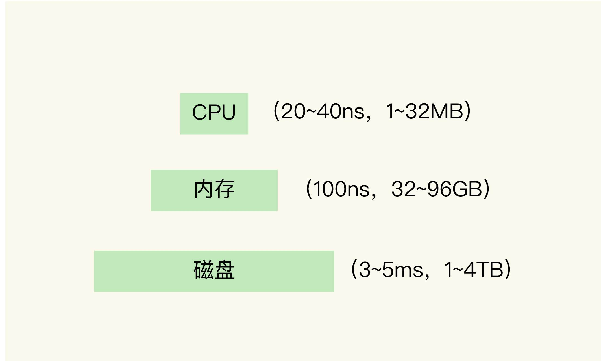

从图上可以看到，CPU、内存和磁盘这三层的访问速度从几十 ns 到 100ns，再到几 ms，性能的差异很大。

想象一下，如果每次 CPU 处理数据时，都要从 ms 级别的慢速磁盘中读取数据，然后再进行处理，那么，CPU 只能等磁盘的数据传输完成。这样一来，高速的 CPU 就被慢速的磁盘拖累了，整个计算机系统的运行速度会变得非常慢。

所以，计算机系统中，默认有两种缓存：

**CPU 里面的末级缓存，即 LLC，用来缓存内存中的数据，避免每次从内存中存取数据；**

**内存中的高速页缓存，即 page cache，用来缓存磁盘中的数据，避免每次从磁盘中存取数据。**

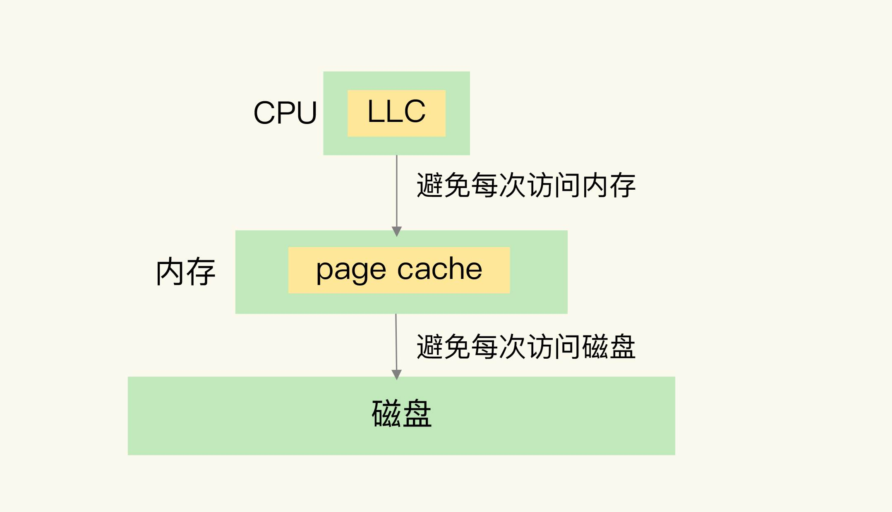

跟内存相比，LLC 的访问速度更快，而跟磁盘相比，内存的访问是更快的。所以，我们可以看出来缓存的**第一个特征**：**在一个层次化的系统中，缓存一定是一个快速子系统，数据存在缓存中时，能避免每次从慢速子系统中存取数据。**对应到互联网应用来说，Redis 就是快速子系统，而数据库就是慢速子系统了。

知道了这一点，你就能理解，为什么我们必须想尽办法让 Redis 提供高性能的访问，因为，如果访问速度很慢，Redis 作为缓存的价值就不大了。

我们再看一下刚才的计算机分层结构。LLC 的大小是 MB 级别，page cache 的大小是 GB 级别，而磁盘的大小是 TB 级别。这其实包含了缓存的**第二个特征：缓存系统的容量大小总是小于后端慢速系统的，我们不可能把所有数据都放在缓存系统中**。

这个很有意思，它表明，缓存的容量终究是有限的，缓存中的数据量也是有限的，肯定是没法时刻都满足访问需求的。所以，缓存和后端慢速系统之间，必然存在数据写回和再读取的交互过程。简单来说，缓存中的数据需要按一定规则淘汰出去，写回后端系统，而新的数据又要从后端系统中读取进来，写入缓存。

说到这儿，你肯定会想到，Redis 本身是支持按一定规则淘汰数据的，相当于实现了缓存的数据淘汰，其实，这也是 Redis 适合用作缓存的一个重要原因。

好了，我们现在了解了缓存的两个重要特征，那么，接下来，我们就来学习下，缓存是怎么处理请求的。实际上，业务应用在访问 Redis 缓存中的数据时，数据不一定存在，因此，处理的方式也不同。


### **Redis** **缓存处理请求的两种情况**

把 Redis 用作缓存时，我们会把 Redis 部署在数据库的前端，业务应用在访问数据时，会先查询 Redis 中是否保存了相应的数据。此时，根据数据是否存在缓存中，会有两种情况。

**缓存命中**：Redis 中有相应数据，就直接读取 Redis，性能非常快。

**缓存缺失**：Redis 中没有保存相应数据，就从后端数据库中读取数据，性能就会变慢。而且，一旦发生缓存缺失，为了让后续请求能从缓存中读取到数据，**我们需要把缺失的数据写入 Redis，这个过程叫作缓存更新**。缓存更新操作会涉及到保证缓存和数据库之间的数据一致性问题，关于这一点，我会在第 25 讲中再具体介绍。

我画了一张图，清晰地展示了发生缓存命中或缺失时，应用读取数据的情况，你可以看下这张图片。

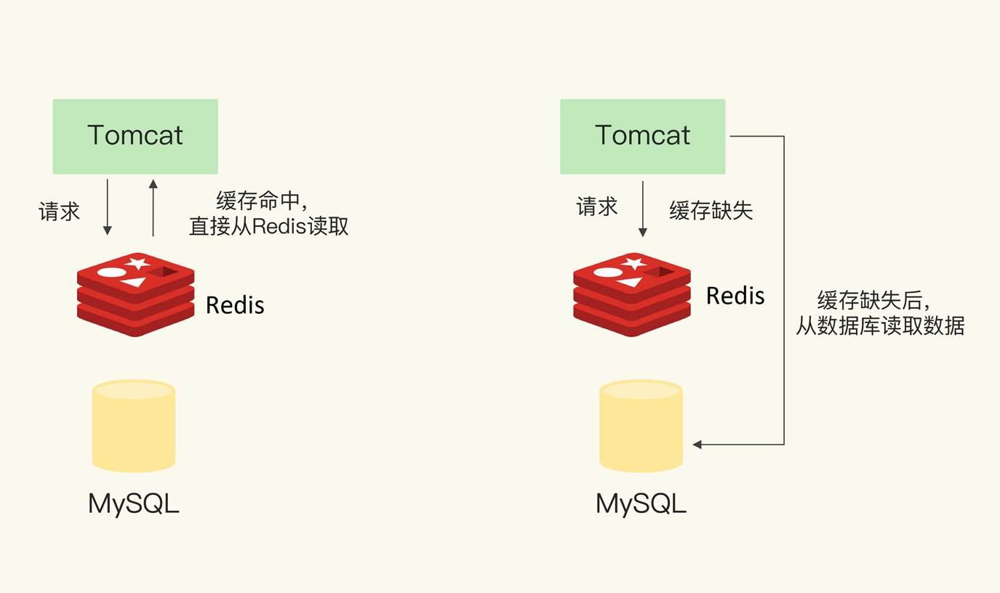

假设我们在一个 Web 应用中，使用 Redis 作为缓存。用户请求发送给 Tomcat，Tomcat 负责处理业务逻辑。如果要访问数据，就需要从 MySQL 中读写数据。那么，我们可以把 Redis 部署在 MySQL 前端。如果访问的数据在 Redis 中，此时缓存命中，Tomcat 可以直接从 Redis 中读取数据，加速应用的访问。否则，Tomcat 就需要从慢速的数据库中读取数据了。

到这里，你可能已经发现了，使用 Redis 缓存时，我们基本有三个操作：

- **应用读取数据时，需要先读取 Redis；**

- **发生缓存缺失时，需要从数据库读取数据；**

- **发生缓存缺失时，还需要更新缓存。**

那么，这些操作具体是由谁来做的呢？这和 Redis 缓存的使用方式相关。接下来，我就来和你聊聊 Redis 作为旁路缓存的使用操作方式。


### **Redis** **作为旁路缓存的使用操作**

Redis 是一个独立的系统软件，和业务应用程序是两个软件，当我们部署了 Redis 实例后，它只会被动地等待客户端发送请求，然后再进行处理。所以，如**果应用程序想要使用 Redis 缓存，我们就要在程序中增加相应的缓存操作代码。所以，我们也把 Redis 称为旁路缓存，也就是说，读取缓存、读取数据库和更新缓存的操作都需要在应用程序中来完成。**

这和我刚才讲的计算机系统中的 LLC 和 page cache 不一样。你可以回想下，平时在开发程序时，我们是没有专门在代码中显式地创建 LLC 或 page cache 的实例的，也没有显式调用过它们的 GET 接口。这是因为，我们在构建计算机硬件系统时，已经把 LLC 和 page cache 放在了应用程序的数据访问路径上，应用程序访问数据时直接就能用上缓存。

**那么，使用 Redis 缓存时，具体来说，我们需要在应用程序中增加三方面的代码：**

- **当应用程序需要读取数据时，我们需要在代码中显式调用 Redis 的 GET 操作接口，进行查询；**

- **如果缓存缺失了，应用程序需要再和数据库连接，从数据库中读取数据；**

- **当缓存中的数据需要更新时，我们也需要在应用程序中显式地调用 SET 操作接口，把更新的数据写入缓存。**

那么，代码应该怎么加呢？我给你展示一段 Web 应用中使用 Redis 缓存的伪代码示例。

```
String cacheKey = “productid_11010003”;

String cacheValue = redisCache.get(cacheKey)；

//缓存命中

if ( cacheValue != NULL)

  return cacheValue;

//缓存缺失

else

  cacheValue = getProductFromDB();

  redisCache.put(cacheValue)  //缓存更新
```

可以看到，为了使用缓存，Web 应用程序需要有一个表示缓存系统的实例对象 redisCache，还需要主动调用 Redis 的 GET 接口，并且要处理缓存命中和缓存缺失时的逻辑，例如在缓存缺失时，需要更新缓存。

了解了这一点，我们在使用 Redis 缓存时，有一个地方就需要注意了：因为需要新增程序代码来使用缓存，所以，Redis 并不适用于那些无法获得源码的应用，例如一些很早之前开发的应用程序，它们的源码已经没有再维护了，或者是第三方供应商开发的应用，没有提供源码，所以，我们就没有办法在这些应用中进行缓存操作。

**在使用旁路缓存时，我们需要在应用程序中增加操作代码，增加了使用 Redis 缓存的额外工作量，但是，也正因为 Redis 是旁路缓存，是一个独立的系统，我们可以单独对 Redis 缓存进行扩容或性能优化。而且，只要保持操作接口不变，我们在应用程序中增加的代码就不用再修改了。**

好了，到这里，我们知道了，通过在应用程序中加入 Redis 的操作代码，我们可以让应用程序使用 Redis 缓存数据了。不过，除了从 Redis 缓存中查询、读取数据以外，应用程序还可能会对数据进行修改，这时，我们既可以在缓存中修改，也可以在后端数据库中进行修改，我们该怎么选择呢？

其实，这就涉及到了 Redis 缓存的两种类型：只读缓存和读写缓存。只读缓存能加速读请求，而读写缓存可以同时加速读写请求。而且，读写缓存又有两种数据写回策略，可以让我们根据业务需求，在保证性能和保证数据可靠性之间进行选择。所以，接下来，我们来具体了解下 Redis 的缓存类型和相应的写回策略。


## **缓存的类型**

**按照 Redis 缓存是否接受写请求，我们可以把它分成只读缓存和读写缓存。**先来了解下只读缓存。

### **只读缓存**(只在缓存中进行读操作)

当 Redis 用作只读缓存时，应用要读取数据的话，会先调用 Redis GET 接口，查询数据是否存在。**而所有的数据写请求，会直接发往后端的数据库，在数据库中增删改。对于删改的数据来说，如果 Redis 已经缓存了相应的数据，应用需要把这些缓存的数据删除，Redis 中就没有这些数据了。**

当应用再次读取这些数据时，会发生缓存缺失，应用会把这些数据从数据库中读出来，并写到缓存中。这样一来，这些数据后续再被读取时，就可以直接从缓存中获取了，能起到加速访问的效果。

我给你举个例子。假设业务应用要修改数据 A，此时，数据 A 在 Redis 中也缓存了，那么，应用会先直接在数据库里修改 A，并把 Redis 中的 A 删除。等到应用需要读取数据 A 时，会发生缓存缺失，此时，应用从数据库中读取 A，并写入 Redis，以便后续请求从缓存中直接读取，如下图所示：

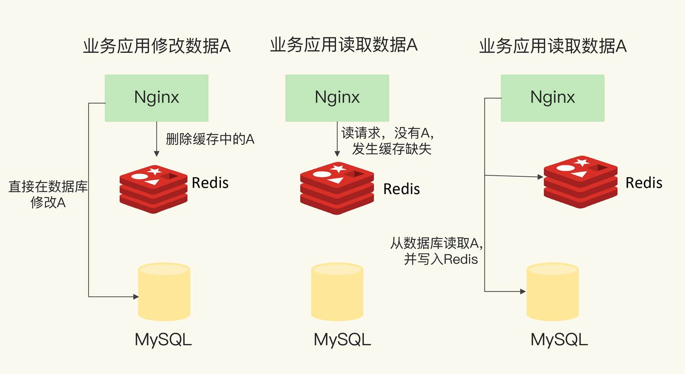

只读缓存直接在数据库中更新数据的好处是，所有最新的数据都在数据库中，而数据库是提供数据可靠性保障的，这些数据不会有丢失的风险。**当我们需要缓存图片、短视频这些用户只读的数据时，就可以使用只读缓存这个类型了。**


### **读写缓存**（读写都在缓存中操作）

知道了只读缓存，读写缓存也就很容易理解了。

**对于读写缓存来说，除了读请求会发送到缓存进行处理（直接在缓存中查询数据是否存在)，所有的写请求也会发送到缓存，在缓存中直接对数据进行增删改操作。**此时，得益于 Redis 的高性能访问特性，数据的增删改操作可以在缓存中快速完成，处理结果也会快速返回给业务应用，这就可以提升业务应用的响应速度。

但是，和只读缓存不一样的是**，在使用读写缓存时，最新的数据是在 Redis 中，而 Redis 是内存数据库，一旦出现掉电或宕机，内存中的数据就会丢失。这也就是说，应用的最新数据可能会丢失，给应用业务带来风险。**

所以，**根据业务应用对数据可靠性和缓存性能的不同要求，我们会有同步直写和异步写回两种策略**。其中，**同步直写策略优先保证数据可靠性，而异步写回策略优先提供快速响应。**学习了解这两种策略，可以帮助我们根据业务需求，做出正确的设计选择。

接下来，我们来具体看下这两种策略。

- **同步直写是指（把对redis和数据库的操作作为一个事务进行操作），写请求发给缓存的同时，也会发给后端数据库进行处理，等到缓存和数据库都写完数据，才给客户端返回。**这样，即使缓存宕机或发生故障，最新的数据仍然保存在数据库中，这就提供了数据可靠性保证。

不过，同步直写会降低缓存的访问性能。这是因为缓存中处理写请求的速度是很快的，而数据库处理写请求的速度较慢。即使缓存很快地处理了写请求，也需要等待数据库处理完所有的写请求，才能给应用返回结果，这就增加了缓存的响应延迟。

- **而异步写回策略，则是优先考虑了响应延迟。**此时，所有写请求都先在缓存中处理。等到这些增改的数据要被从缓存中淘汰出来时，缓存将它们写回后端数据库。这样一来，处理这些数据的操作是在缓存中进行的，很快就能完成。只不过，如果发生了掉电，而它们还没有被写回数据库，就会有丢失的风险了。

为了便于你理解，我也画了下面这张图，你可以看下。

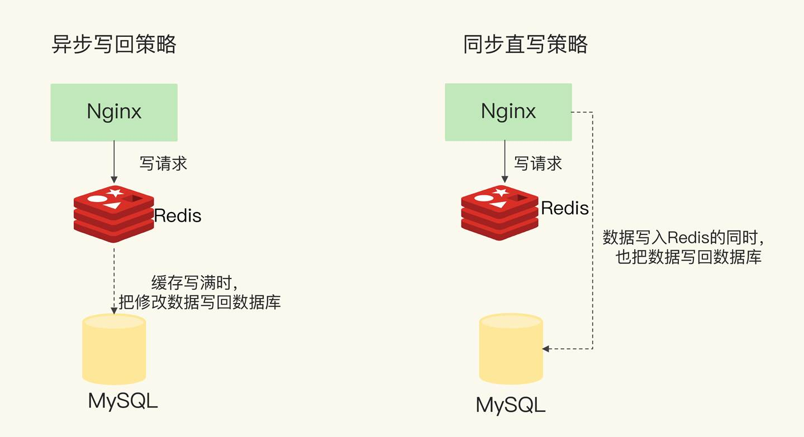

关于是选择只读缓存，还是读写缓存，主要看我们对写请求是否有加速的需求。

- **如果需要对写请求进行加速，我们选择读写缓存（因为只读缓存每次进行写操作都需要操作数据库，会大大影响响应时间）；**

- **如果写请求很少，或者是只需要提升读请求的响应速度的话，我们选择只读缓存。**

举个例子，在商品大促的场景中，商品的库存信息会一直被修改。如果每次修改都需到数据库中处理，就会拖慢整个应用，此时，我们通常会选择读写缓存的模式。而在短视频 App 的场景中，虽然视频的属性有很多，但是，一般确定后，修改并不频繁，此时，在数据库中进行修改对缓存影响不大，所以只读缓存模式是一个合适的选择。


## **小结**

今天，我们学习了缓存的两个特征，分别是在分层系统中，数据暂存在快速子系统中有助于加速访问；缓存容量有限，缓存写满时，数据需要被淘汰。而 Redis 天然就具有高性能访问和数据淘汰机制，正好符合缓存的这两个特征的要求，所以非常适合用作缓存。

另外，我们还学习了 Redis 作为旁路缓存的特性，旁路缓存就意味着需要在应用程序中新增缓存逻辑处理的代码。当然，如果是无法修改源码的应用场景，就不能使用 Redis 做缓存了。

Redis 做缓存时，还有两种模式，分别是只读缓存和读写缓存。其中，读写缓存还提供了同步直写和异步写回这两种模式，同步直写模式侧重于保证数据可靠性，而异步写回模式则侧重于提供低延迟访问，我们要根据实际的业务场景需求来进行选择。


# 替换策略：缓存满了怎么办？

Redis 缓存使用内存来保存数据，避免业务应用从后端数据库中读取数据，可以提升应用的响应速度。那么，如果我们把所有要访问的数据都放入缓存，是不是一个很好的设计选择呢？其实，这样做的性价比反而不高。

举个例子吧。MySQL 中有 1TB 的数据，如果我们使用 Redis 把这 1TB 的数据都缓存起来，虽然应用都能在内存中访问数据了，但是，这样配置并不合理，因为性价比很低。一方面，1TB 内存的价格大约是 3.5 万元，而 1TB 磁盘的价格大约是 1000 元。另一方面，数据访问都是有局部性的，也就是我们通常所说的“八二原理”，80% 的请求实际只访问了 20% 的数据。所以，用 1TB 的内存做缓存，并没有必要。

为了保证较高的性价比，缓存的空间容量必然要小于后端数据库的数据总量。不过，内存大小毕竟有限，随着要缓存的数据量越来越大，有限的缓存空间不可避免地会被写满。此时，该怎么办呢？

解决这个问题就涉及到缓存系统的一个重要机制，即**缓存数据的淘汰机制**。简单来说，数据淘汰机制包括两步：

- 第一，根据一定的策略，筛选出对应用访问来说“不重要”的数据；
- 第二，将这些数据从缓存中删除，为新来的数据腾出空间，

这节课上，我就来和你聊聊缓存满了之后的数据淘汰机制。通常，我们也把它叫作缓存替换机制，同时还会讲到一系列选择淘汰数据的具体策略。了解了数据淘汰机制和相应策略，我们才可以选择合理的 Redis 配置，提高缓存命中率，提升应用的访问性能。

不过，在学习淘汰策略之前，我们首先要知道设置缓存容量的依据和方法。毕竟，在实际使用缓存时，我们需要决定用多大的空间来缓存数据。


## **设置多大的缓存容量合适？**

缓存容量设置得是否合理，会直接影响到使用缓存的性价比。我们通常希望以最小的代价去获得最大的收益，所以，把昂贵的内存资源用在关键地方就非常重要了。

就像我刚才说的，实际应用中的数据访问是具有局部性的。下面有一张图，图里有红、蓝两条线，显示了不同比例数据贡献的访问量情况。蓝线代表了“八二原理”表示的数据局部性，而红线则表示在当前应用负载下，数据局部性的变化。

我们先看看蓝线。它表示的就是“八二原理”，有 20% 的数据贡献了 80% 的访问了，而剩余的数据虽然体量很大，但只贡献了 20% 的访问量。这 80% 的数据在访问量上就形成了一条长长的尾巴，我们也称为“长尾效应”。

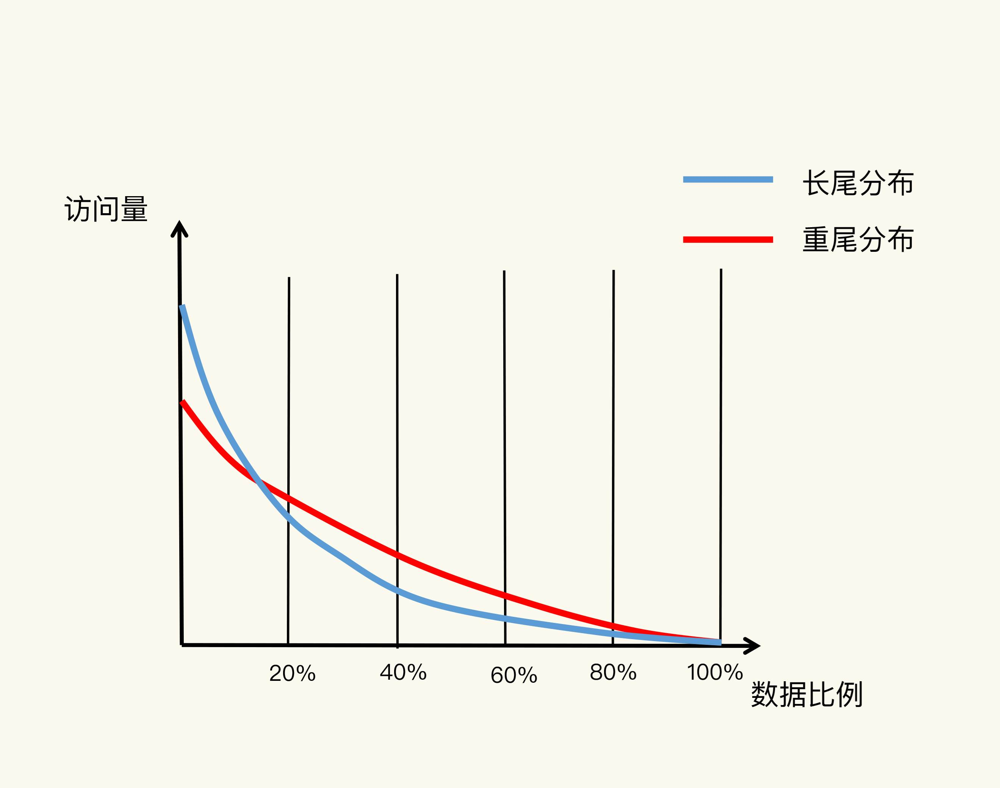

所以，如果按照“八二原理”来设置缓存空间容量，也就是把缓存空间容量设置为总数据量的 20% 的话，就有可能拦截到 80% 的访问。

为什么说是“有可能”呢？这是因为，“八二原理”是对大量实际应用的数据访问情况做了统计后，得出的一个统计学意义上的数据量和访问量的比例。具体到某一个应用来说，数据访问的规律会和具体的业务场景有关。对于最常被访问的 20% 的数据来说，它们贡献的访问量，既有可能超过 80%，也有可能不到 80%。

我们再通过一个电商商品的场景，来说明下“有可能”这件事儿。一方面，在商品促销时，热门商品的信息可能只占到总商品数据信息量的 5%，而这些商品信息承载的可能是超过 90% 的访问请求。这时，我们只要缓存这 5% 的数据，就能获得很好的性能收益。另一方面，如果业务应用要对所有商品信息进行查询统计，这时候，即使按照“八二原理”缓存了 20% 的商品数据，也不能获得很好的访问性能，因为 80% 的数据仍然需要从后端数据库中获取。

接下来，我们再看看数据访问局部性示意图中的红线。近年来，有些研究人员专门对互联网应用（例如视频播放网站）中，用户请求访问内容的分布情况做过分析，得到了这张图中的红线。

在这条红线上，80% 的数据贡献的访问量，超过了传统的长尾效应中 80% 数据能贡献的访问量。原因在于，用户的个性化需求越来越多，在一个业务应用中，不同用户访问的内容可能差别很大，所以，用户请求的数据和它们贡献的访问量比例，不再具备长尾效应中的“八二原理”分布特征了。也就是说，20% 的数据可能贡献不了 80% 的访问，而剩余的 80% 数据反而贡献了更多的访问量，我们称之为重尾效应。

正是因为 20% 的数据不一定能贡献 80% 的访问量，我们不能简单地按照“总数据量的 20%”来设置缓存最大空间容量。在实践过程中，我看到过的缓存容量占总数据量的比例，从 5% 到 40% 的都有。这个容量规划不能一概而论，是需要结合**应用数据实际访问特征**和**成本开销**来综合考虑的。

这其实也是我一直在和你分享的经验，系统的设计选择是一个权衡的过程：大容量缓存是能带来性能加速的收益，但是成本也会更高，而小容量缓存不一定就起不到加速访问的效果。一般来说，**我会建议把缓存容量设置为总数据量的** **15%** **到** **30%，兼顾访问性能和内存空间开销**。

对于 Redis 来说，一旦确定了缓存最大容量，比如 4GB，你就可以使用下面这个命令来设定缓存的大小了：

```
CONFIG SET maxmemory 4gb
```

不过，**缓存被写满是不可避免的**。即使你精挑细选，确定了缓存容量，还是要面对缓存写满时的替换操作。缓存替换需要解决两个问题：决定淘汰哪些数据，如何处理那些被淘汰的数据。

接下来，我们就来学习下，Redis 中的数据淘汰策略。


## **Redis** **缓存有哪些淘汰策略？**

Redis 4.0 之前一共实现了 6 种内存淘汰策略，在 4.0 之后，又增加了 2 种策略。我们可以按照是否会进行数据淘汰把它们分成两类：

- 不进行数据淘汰的策略，只有 noeviction 这一种。

- 会进行淘汰的 7 种其他策略。


会进行淘汰的 7 种策略，我们可以再进一步根据淘汰候选数据集的范围把它们分成两类：

- 在设置了过期时间的数据中进行淘汰，包括 volatile-random、volatile-ttl、volatile-lru、volatile-lfu（Redis 4.0 后新增）四种。

- 在所有数据范围内进行淘汰，包括 allkeys-lru、allkeys-random、allkeys-lfu（Redis 4.0 后新增）三种。

我把这 8 种策略的分类，画到了一张图里：

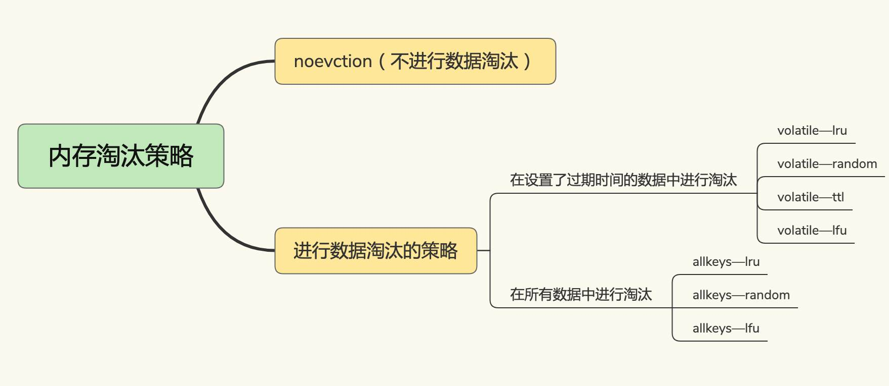

下面我就来具体解释下各个策略。

默认情况下，Redis 在使用的内存空间超过 maxmemory 值时，并不会淘汰数据，也就是设定的 **noeviction** **策略**。对应到 Redis 缓存，也就是指，一旦缓存被写满了，再有写请求来时，Redis 不再提供服务，而是直接返回错误。Redis 用作缓存时，实际的数据集通常都是大于缓存容量的，总会有新的数据要写入缓存，这个策略本身不淘汰数据，也就不会腾出新的缓存空间，我们不把它用在 Redis 缓存中。


我们再分析下 volatile-random、volatile-ttl、volatile-lru 和 volatile-lfu 这四种淘汰策略。它们筛选的候选数据范围，被限制在已经设置了过期时间的键值对上。也正因为此，即使缓存没有写满，这些数据如果过期了，也会被删除。

例如，我们使用 EXPIRE 命令对一批键值对设置了过期时间后，无论是这些键值对的过期时间是快到了，还是 Redis 的内存使用量达到了 maxmemory 阈值，Redis 都会进一步按照 volatile-ttl、volatile-random、volatile-lru、volatile-lfu 这四种策略的具体筛选规则进行淘汰。

- volatile-ttl 在筛选时，会针对设置了过期时间的键值对，根据过期时间的先后进行删除，**越早过期的越先被删除**。
- volatile-random 就像它的名称一样，在设置了过期时间的键值对中，**进行随机删除**。
- volatile-lru 会**使用 LRU 算法**筛选设置了过期时间的键值对。
- volatile-lfu 会**使用 LFU 算法**选择设置了过期时间的键值对。

可以看到，volatile-ttl 和 volatile-random 筛选规则比较简单，而 volatile-lru 因为涉及了 LRU 算法，所以我会在分析 allkeys-lru 策略时再详细解释。volatile-lfu 使用了 LFU 算法，我会在第 26 讲中具体解释，现在你只需要知道，**它是在 LRU 算法的基础上，同时考虑了数据的访问时效性和数据的访问次数，可以看作是对淘汰策略的优化。**

相对于 volatile-ttl、volatile-random、volatile-lru、volatile-lfu 这四种策略淘汰的是设置了过期时间的数据，a**llkeys-lru、allkeys-random、allkeys-lfu 这三种淘汰策略的备选淘汰数据范围，就扩大到了所有键值对，无论这些键值对是否设置了过期时间。**它们筛选数据进行淘汰的规则是：

- allkeys-random 策略，从所有键值对中**随机选择**并删除数据；

- allkeys-lru 策略，使用 **LRU 算法**在所有数据中进行筛选。

- allkeys-lfu 策略，使用 **LFU 算法**在所有数据中进行筛选。

这也就是说，如果一个键值对被删除策略选中了，即使它的过期时间还没到，也需要被删除。当然，如果它的过期时间到了但未被策略选中，同样也会被删除。

接下来，我们就看看 volatile-lru 和 allkeys-lru 策略都用到的 LRU 算法吧。LRU 算法工作机制并不复杂，我们一起学习下。

**LRU 算法的全称是 Least Recently Used，从名字上就可以看出，这是按照最近最少使用的原则来筛选数据，最不常用的数据会被筛选出来，而最近频繁使用的数据会留在缓存中。**

那具体是怎么筛选的呢？LRU 会把所有的数据组织成一个链表，链表的头和尾分别表示 MRU 端和 LRU 端，分别代表最近最常使用的数据和最近最不常用的数据。我们看一个例子。

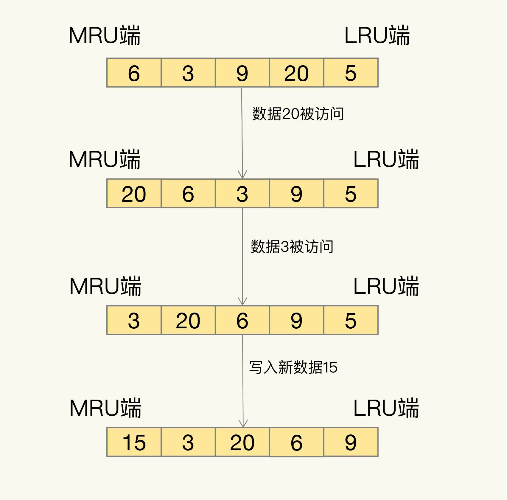

我们现在有数据 6、3、9、20、5。如果数据 20 和 3 被先后访问，它们都会从现有的链表位置移到 MRU 端，而链表中在它们之前的数据则相应地往后移一位。因为，LRU 算法选择删除数据时，都是从 LRU 端开始，所以把刚刚被访问的数据移到 MRU 端，就可以让它们尽可能地留在缓存中。

如果有一个新数据 15 要被写入缓存，但此时已经没有缓存空间了，也就是链表没有空余位置了，那么，LRU 算法做两件事：

- 数据 15 是刚被访问的，所以它会被放到 MRU 端；

- 算法把 LRU 端的数据 5 从缓存中删除，相应的链表中就没有数据 5 的记录了。

其实，LRU 算法背后的想法非常朴素：它认为刚刚被访问的数据，肯定还会被再次访问，所以就把它放在 MRU 端；长久不访问的数据，肯定就不会再被访问了，所以就让它逐渐后移到 LRU 端，在缓存满时，就优先删除它。


不过，LRU 算法在实际实现时，需要用链表管理所有的缓存数据，这会**带来额外的空间开销**。而且，当有数据被访问时，需要在链表上把该数据移动到 MRU 端，如果有大量数据被访问，就会带来很多链表移动操作，会很耗时，进而会降低 Redis 缓存性能。

**所以，在 Redis 中，LRU 算法被做了简化，以减轻数据淘汰对缓存性能的影响。具体来说，Redis 默认会记录每个数据的最近一次访问的时间戳（由键值对数据结构 RedisObject 中的 lru 字段记录）。然后，Redis 在决定淘汰的数据时，第一次会随机选出 N 个数据，把它们作为一个候选集合。接下来，Redis 会比较这 N 个数据的 lru 字段，把 lru 字段值最小的数据从缓存中淘汰出去。**

Redis 提供了一个配置参数 maxmemory-samples，这个参数就是 Redis 选出的数据个数 N。例如，我们执行如下命令，可以让 Redis 选出 100 个数据作为候选数据集：

CONFIG SET maxmemory-samples 100

当需要再次淘汰数据时，Redis 需要挑选数据进入第一次淘汰时创建的候选集合。这儿的挑选标准是：**能进入候选集合的数据的** **lru** **字段值必须小于候选集合中最小的** **lru** **值**（优先队列）。当有新数据进入候选数据集后，如果候选数据集中的数据个数达到了 maxmemory-samples，Redis 就把候选数据集中 lru 字段值最小的数据淘汰出去。

这样一来，Redis 缓存不用为所有的数据维护一个大链表，也不用在每次数据访问时都移动链表项，提升了缓存的性能。

好了，到这里，我们就学完了除了使用 LFU 算法以外的 5 种缓存淘汰策略，我再给你三个使用建议。

- **优先使用** **allkeys-lru** **策略**。这样，可以充分利用 LRU 这一经典缓存算法的优势，把最近最常访问的数据留在缓存中，提升应用的访问性能。如果你的业务数据中有明显的冷热数据区分，我建议你使用 allkeys-lru 策略。

- 如果业务应用中的数据访问频率相差不大，没有明显的冷热数据区分，建议使用 allkeys-random 策略，随机选择淘汰的数据就行。

- **如果你的业务中有置顶的需求**，**比如置顶新闻、置顶视频，那么，可以使用 volatile-lru 策略，同时不给这些置顶数据设置过期时间。这样一来，这些需要置顶的数据一直不会被删除，**而其他数据会在过期时根据 LRU 规则进行筛选。

一旦被淘汰的数据被选定后，Redis 怎么处理这些数据呢？这就要说到缓存替换时的具体操作了。


**如何处理被淘汰的数据？**

一般来说，一旦被淘汰的数据选定后，如果这个数据是干净数据，那么我们就直接删除；如果这个数据是脏数据，我们需要把它写回数据库，如下图所示：

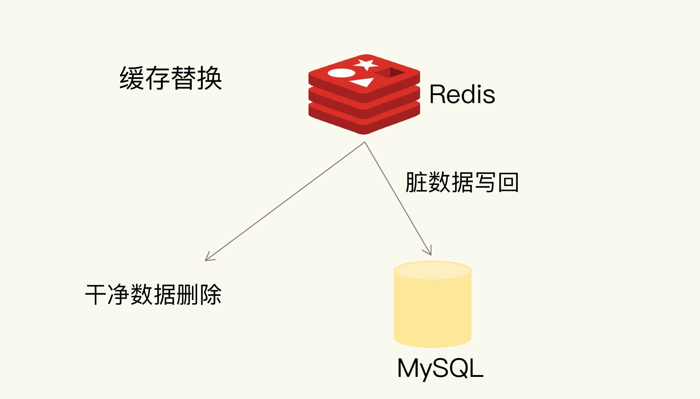

那怎么判断一个数据到底是干净的还是脏的呢？

干净数据和脏数据的区别就在于，和最初从后端数据库里读取时的值相比，有没有被修改过。干净数据一直没有被修改，所以后端数据库里的数据也是最新值。在替换时，它可以被直接删除。

而脏数据就是曾经被修改过的，已经和后端数据库中保存的数据不一致了。此时，如果不把脏数据写回到数据库中，这个数据的最新值就丢失了，就会影响应用的正常使用。

这么一来，缓存替换既腾出了缓存空间，用来缓存新的数据，同时，将脏数据写回数据库，也保证了最新数据不会丢失。

**不过，对于 Redis 来说，它决定了被淘汰的数据后，会把它们删除。即使淘汰的数据是脏数据，Redis 也不会把它们写回数据库。所以，我们在使用 Redis 缓存时，如果数据被修改了，需要在数据修改时就将它写回数据库。否则，这个脏数据被淘汰时，会被 Redis 删除，而数据库里也没有最新的数据了。**


## **小结**

在这节课上，我围绕着“缓存满了该怎么办”这一问题，向你介绍了缓存替换时的数据淘汰策略，以及被淘汰数据的处理方法。

Redis 4.0 版本以后一共提供了 8 种数据淘汰策略，从淘汰数据的候选集范围来看，我们有两种候选范围：一种是所有数据都是候选集，一种是设置了过期时间的数据是候选集。另外，无论是面向哪种候选数据集进行淘汰数据选择，我们都有三种策略，分别是随机选择，根据 LRU 算法选择，以及根据 LFU 算法选择。当然，当面向设置了过期时间的数据集选择淘汰数据时，我们还可以根据数据离过期时间的远近来决定。

一般来说，缓存系统对于选定的被淘汰数据，会根据其是干净数据还是脏数据，选择直接删除还是写回数据库。但是，在 Redis 中，被淘汰数据无论干净与否都会被删除，所以，这是我们在使用 Redis 缓存时要特别注意的：当数据修改成为脏数据时，需要在数据库中也把数据修改过来。

选择哪种缓存策略是值得我们多加琢磨的，它在筛选数据方面是否能筛选出可能被再次访问的数据，直接决定了缓存效率的高与低。

很简单的一个对比，如果我们使用随机策略，刚筛选出来的要被删除的数据可能正好又被访问了，此时应用就只能花费几毫秒从数据库中读取数据了。而如果使用 LRU 策略，被筛选出来的数据往往是经过时间验证了，如果在一段时间内一直没有访问，本身被再次访问的概率也很低了。

所以，我给你的建议是，先根据是否有始终会被频繁访问的数据（例如置顶消息），来选择淘汰数据的候选集，也就是决定是针对所有数据进行淘汰，还是针对设置了过期时间的数据进行淘汰。候选数据集范围选定后，建议优先使用 LRU 算法，也就是，allkeys-lru 或 volatile-lru 策略。

当然，设置缓存容量的大小也很重要，我的建议是：结合实际应用的数据总量、热数据的体量，以及成本预算，把缓存空间大小设置在总数据量的 15% 到 30% 这个区间就可以。


# 缓存异常


## 如何解决缓存和数据库的数据不一致问题？ 

在实际应用 Redis 缓存时，我们经常会遇到一些异常问题，概括来说有 4 个方面：**缓存中的数据和数据库中的不一致；缓存雪崩；缓存击穿和缓存穿透。**

只要我们使用 Redis 缓存，就必然会面对缓存和数据库间的一致性保证问题，这也算是 Redis 缓存应用中的“必答题”了。最重要的是，如果数据不一致，那么业务应用从缓存中读取的数据就不是最新数据，这会导致严重的错误。比如说，我们把电商商品的库存信息缓存在 Redis 中，如果库存信息不对，那么业务层下单操作就可能出错，这当然是不能接受的。所以，这节课我就重点和你聊聊这个问题。关于缓存雪崩、穿透和击穿等问题，我会在下一节课向你介绍。

接下来，我们就来看看，缓存和数据库之间的数据不一致是怎么引起的。


### 缓存和数据库的数据不一致是如何发生的？

首先，我们得清楚“数据的一致性”具体是啥意思。其实，这里的“一致性”包含了两种情况：

- **缓存中有数据，那么，缓存的数据值需要和数据库中的值相同；**

- **缓存中本身没有数据，那么，数据库中的值必须是最新值。**

不符合这两种情况的，就属于缓存和数据库的数据不一致问题了。不过，当缓存的读写模式不同时，缓存数据不一致的发生情况不一样，我们的应对方法也会有所不同，所以，我们先按照缓存读写模式，来分别了解下不同模式下的缓存不一致情况。我在第 23 讲中讲过，根据是否接收写请求，我们可以把缓存分成读写缓存和只读缓存。

**对于读写缓存来说，如果要对数据进行增删改，就需要在缓存中进行，同时还要根据采取的写回策略，决定是否同步写回到数据库中。**

- 同步直写策略：写缓存时，也同步写数据库，缓存和数据库中的数据一致；

- 异步写回策略：写缓存时不同步写数据库，等到数据从缓存中淘汰时，再写回数据库。使用这种策略时，如果数据还没有写回数据库，缓存就发生了故障，那么，此时，数据库就没有最新的数据了。

**所以，对于读写缓存来说，要想保证缓存和数据库中的数据一致，就要采用同步直写策略。**不过，需要注意的是，如果采用这种策略，就需要同时更新缓存和数据库。**所以，我们要在业务应用中使用事务机制，来保证缓存和数据库的更新具有原子性**，也就是说，两者要不一起更新，要不都不更新，返回错误信息，进行重试。否则，我们就无法实现同步直写。

当然，在有些场景下，我们对数据一致性的要求可能不是那么高，比如说缓存的是电商商品的非关键属性或者短视频的创建或修改时间（就算数据丢失，还是可以知道该数据的丢失时间）等，那么，我们可以使用异步写回策略。


**下面我们再来说说只读缓存。对于只读缓存来说，如果有数据新增，会直接写入数据库；而有数据删改时，就需要把只读缓存中的数据标记为无效（因为只读不涉及数据修改）。这样一来，应用后续再访问这些增删改的数据时，因为缓存中没有相应的数据，就会发生缓存缺失。此时，应用再从数据库中把数据读入缓存，这样后续再访问数据时，就能够直接从缓存中读取了。**

接下来，我以 Tomcat 向 MySQL 中写入和删改数据为例，来给你解释一下，数据的增删改操作具体是如何进行的，如下图所示：

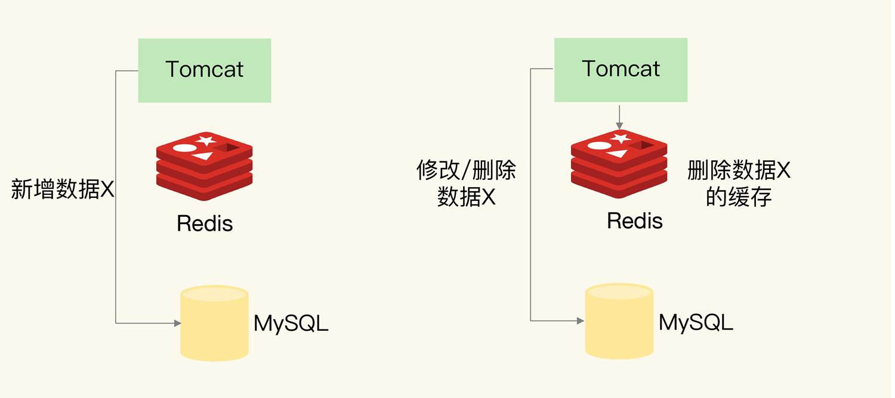

从图中可以看到，Tomcat 上运行的应用，无论是新增（Insert 操作）、修改（Update 操作）、还是删除（Delete 操作）数据 X，都会直接在数据库中增改删。当然，如果应用执行的是修改或删除操作，还会删除缓存的数据 X。

那么，这个过程中会不会出现数据不一致的情况呢？考虑到新增数据和删改数据的情况不一样，所以我们分开来看。

- 新增数据

如果是新增数据，数据会直接写到数据库中，不用对缓存做任何操作，此时，**缓存中本身就没有新增数据（缓存中无该数据）**，而数据库中是最新值，这种情况符合我们刚刚所说的一致性的第 2 种情况，所以，此时，缓存和数据库的数据是一致的。

- 删改数据

如果发生删改操作，应用既要更新数据库，也要在缓存中删除数据。**这两个操作如果无法保证原子性，也就是说，要不都完成，要不都没完成，此时，就会出现数据不一致问题了。**这个问题比较复杂，我们来分析一下。


#### **先删除缓存，再更新数据库**，

如果缓存删除成功，但是数据库更新失败，那么，应用再访问数据时，缓存中没有数据，就会发生缓存缺失。然后，应用再访问数据库，但是数据库中的值为旧值，应用就访问到旧值了。

我来举个例子说明一下，可以先看看下面的图片。


应用要把数据 X 的值从 10 更新为 3，先在 Redis 缓存中删除了 X 的缓存值，但是更新数据库却失败了。如果此时有其他并发的请求访问 X，会发现 Redis 中缓存缺失，紧接着，请求就会访问数据库，读到的却是旧值 10。


#### 先更新数据库，再删除缓存中的值

如果应用先完成了数据库的更新，但是，在删除缓存时失败了，那么，数据库中的值是新值，而缓存中的是旧值，这肯定是不一致的。这个时候，如果有其他的并发请求来访问数据，按照正常的缓存访问流程，就会先在缓存中查询，但此时，就会读到旧值了。

我还是借助一个例子来说明一下。


应用要把数据 X 的值从 10 更新为 3，先成功更新了数据库，然后在 Redis 缓存中删除 X 的缓存，但是这个操作却失败了，这个时候，数据库中 X 的新值为 3，Redis 中的 X 的缓存值为 10，这肯定是不一致的。如果刚好此时有其他客户端也发送请求访问 X，会先在 Redis 中查询，该客户端会发现缓存命中，但是读到的却是旧值 10。


好了，到这里，我们可以看到，在更新数据库和删除缓存值的过程中，无论这两个操作的执行顺序谁先谁后，只要有一个操作失败了，就会导致客户端读取到旧值。我画了下面这张表，总结了刚刚所说的这两种情况。


问题发生的原因我们知道了，那该怎么解决呢？


### 如何解决数据不一致问题？


#### 重试机制

具体来说，可以把要删除的缓存值或者是要更新的数据库值暂存到消息队列中（例如使用 Kafka 消息队列）。当应用没有能够成功地删除缓存值或者是更新数据库值时，可以从消息队列中重新读取这些值，然后再次进行删除或更新。

如果能够成功地删除或更新，我们就要把这些值从消息队列中去除，以免重复操作，此时，我们也可以保证数据库和缓存的数据一致了。否则的话，我们还需要再次进行重试。如果重试超过的一定次数，还是没有成功，我们就需要向业务层发送报错信息了。

下图显示了**先更新数据库，再删除缓存值时**，如果缓存删除失败，再次重试后删除成功的情况，你可以看下。

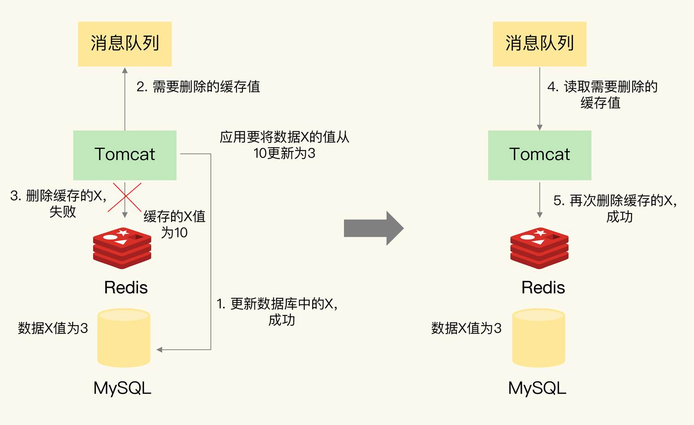

刚刚说的是在更新数据库和删除缓存值的过程中，其中一个操作失败的情况，实际上，即使这两个操作第一次执行时都没有失败，当有大量并发请求时，应用还是有可能读到不一致的数据。


同样，我们按照不同的删除和更新顺序，分成两种情况来看。在这两种情况下，我们的解决方法也有所不同。


#### 情况一：先删除缓存，再更新数据库。

**（引入sleep机制，删除两次缓存，即删除缓存-更新数据库-删除缓存）**

假设线程 A 删除缓存值后，还没有来得及更新数据库（比如说有网络延迟），线程 B 就开始读取数据了，那么这个时候，线程 B 会发现缓存缺失，就只能去数据库读取。这会带来两个问题：

- 线程 B 读取到了旧值；

- **线程 B 是在缓存缺失的情况下读取的数据库，所以，它还会把旧值写入缓存，这可能会导致其他线程从缓存中读到旧值。**

等到线程 B 从数据库读取完数据、更新了缓存后，线程 A 才开始更新数据库，此时，**缓存中的数据是旧值，而数据库中的是最新值，两者就不一致了。**

我用一张表来汇总下这种情况。


这该怎么办呢？我来给你提供一种解决方案。

**在线程 A 更新完数据库值以后，我们可以让它先 sleep 一小段时间，再进行一次缓存删除操作。**

之所以要加上 sleep 的这段时间，就是为了让线程 B 能够先从数据库读取数据，再把缺失的数据写入缓存，然后，线程 A 再进行删除。所以，线程 A sleep 的时间，就需要大于线程 B 读取数据再写入缓存的时间。这个时间怎么确定呢？建议你在业务程序运行的时候，统计下线程读数据和写缓存的操作时间，以此为基础来进行估算。

**这样一来，其它线程读取数据时，会发现缓存缺失，所以会从数据库中读取最新值。因为这个方案会在第一次删除缓存值后，延迟一段时间再次进行删除，所以我们也把它叫做“延迟双删”。**

下面的这段伪代码就是“延迟双删”方案的示例，你可以看下。

```
redis.delKey(X)
db.update(X)
Thread.sleep(N)
redis.delKey(X)
```


#### **情况二：先更新数据库值，再删除缓存值。**

如果线程 A 删除了数据库中的值，但还没来得及删除缓存值，线程 B 就开始读取数据了，那么此时，线程 B 查询缓存时，发现缓存命中，就会直接从缓存中读取旧值。不过，在这种情况下，如果其他线程并发读缓存的请求不多，那么，就不会有很多请求读取到旧值。而且，线程 A 一般也会很快删除缓存值，这样一来，其他线程再次读取时，就会发生缓存缺失，进而从数据库中读取最新值。**所以，这种情况对业务的影响较小。**

我再画一张表，带你总结下先更新数据库、再删除缓存值的情况。

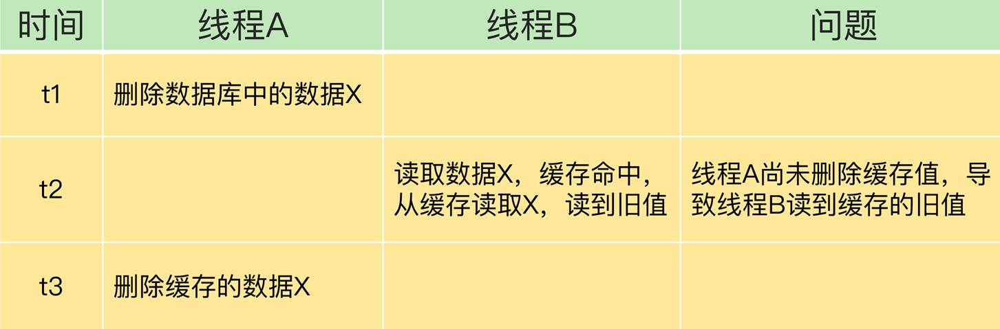

好了，到这里，我们了解到了，缓存和数据库的数据不一致一般是由两个原因导致的，我给你提供了相应的解决方案。

**删除缓存值或更新数据库失败而导致数据不一致，你可以使用重试机制确保删除或更新操作成功。**

**在删除缓存值、更新数据库的这两步操作中，有其他线程的并发读操作，导致其他线程读取到旧值，应对方案是延迟双删。**


### 小结

在这节课，我们学习了在使用 Redis 缓存时，最常遇见的一个问题，也就是缓存和数据库不一致的问题。针对这个问题，我们可以分成读写缓存和只读缓存两种情况进行分析。

对于读写缓存来说，如果我们采用同步写回策略，那么可以保证缓存和数据库中的数据一致。只读缓存的情况比较复杂，我总结了一张表，以便于你更加清晰地了解数据不一致的问题原因、现象和应对方案。

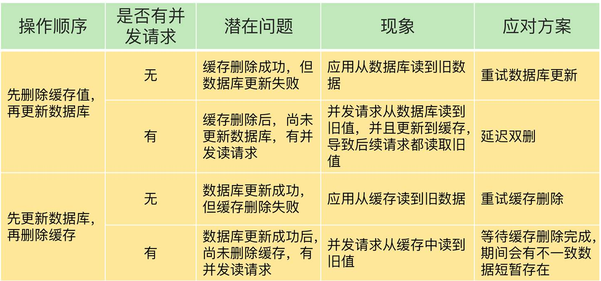

希望你能把我总结的这张表格放入到你的学习笔记中，时不时复习一下。

最后，我还想再多说几句。在大多数业务场景下，我们会把 Redis 作为只读缓存使用。针对只读缓存来说，我们既可以先删除缓存值再更新数据库，也可以先更新数据库再删除缓存。我的建议是，优先使用先更新数据库再删除缓存的方法，原因主要有两个：

- 先删除缓存值再更新数据库，**有可能导致请求因缓存缺失而访问数据库**，给数据库带来压力；

- 如果业务应用中读取数据库和写缓存的时间不好估算，那么，**延迟双删中的等待时间就不好设置。**

**不过，当使用先更新数据库再删除缓存时，也有个地方需要注意，如果业务层要求必须读取一致的数据，那么，我们就需要在更新数据库时，先在 Redis 缓存客户端暂存并发读请求，等数据库更新完、缓存值删除后，再读取数据，从而保证数据一致性。**


## 如何解决缓存雪崩、击穿、穿透难题？ 

上节课，我们学习了缓存和数据库的数据不一致问题和应对方法。除了数据不一致问题，我们常常还会面临缓存异常的三个问题，分别是缓存雪崩、缓存击穿和缓存穿透。这三个问题一旦发生，会导致大量的请求积压到数据库层。如果请求的并发量很大，就会导致数据库宕机或是故障，这就是很严重的生产事故了。

这节课，我就来和你聊聊这三个问题的表现、诱发原因以及解决方法。俗话说，知己知彼，百战不殆。了解了问题的成因，我们就能够在应用 Redis 缓存时，进行合理的缓存设置，以及相应的业务应用前端设置，提前做好准备。

接下来，我们就先看下缓存雪崩的问题和应对方案。


### 缓存雪崩（大量不同数据的请求穿过缓存）

**缓存雪崩是指大量的应用请求无法在 Redis 缓存中进行处理，紧接着，应用将大量请求发送到数据库层，导致数据库层的压力激增。**

缓存雪崩一般是由两个原因导致的，应对方案也有所不同，我们一个个来看。


#### 第一个原因是：缓存中有大量数据同时过期，导致大量请求无法得到处理。

具体来说，当数据保存在缓存中，并且设置了过期时间时，如果在某一个时刻，大量数据同时过期，此时，应用再访问这些数据的话，就会发生缓存缺失。紧接着，应用就会把请求发送给数据库，从数据库中读取数据。如果应用的并发请求量很大，那么数据库的压力也就很大，这会进一步影响到数据库的其他正常业务请求处理。我们来看一个简单的例子，如下图所示：

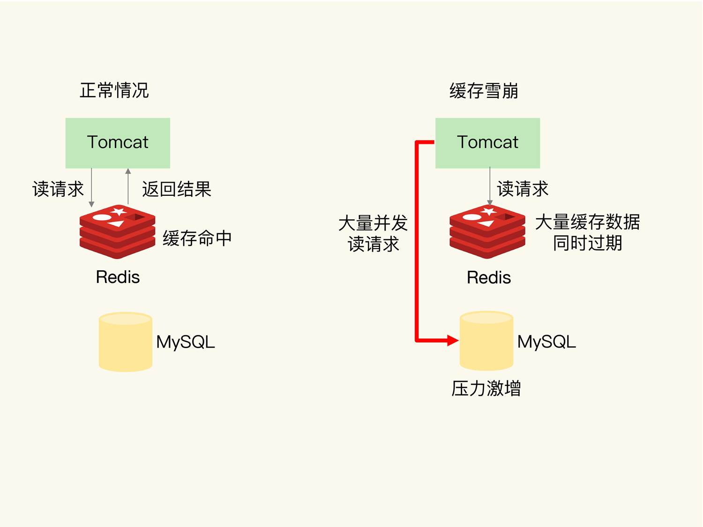

**针对大量数据同时失效带来的缓存雪崩问题，我给你提供两种解决方案。**

- **首先，我们可以避免给大量的数据设置相同的过期时间。**如果业务层的确要求有些数据同时失效，你可以在用 EXPIRE 命令给每个数据设置过期时间时，给这些数据的过期时间增加一个较小的随机数（例如，随机增加 1~3 分钟），这样一来，不同数据的过期时间有所差别，但差别又不会太大，既避免了大量数据同时过期，同时也保证了这些数据基本在相近的时间失效，仍然能满足业务需求。

- 除了微调过期时间，我们还可以通过服务降级，来应对缓存雪崩。**所谓的服务降级，是指发生缓存雪崩时，针对不同的数据采取不同的处理方式。**
  - **当业务应用访问的是非核心数据（例如电商商品属性）时**，暂时停止从缓存中查询这些数据，而是直接返回预定义信息、空值或是错误信息；
  - **当业务应用访问的是核心数据（例如电商商品库存）时**，仍然允许查询缓存，如果缓存缺失，也可以继续通过数据库读取。

这样一来，只有部分过期数据的请求会发送到数据库，数据库的压力就没有那么大了。下面这张图显示的是服务降级时数据请求的执行情况，你可以看下。

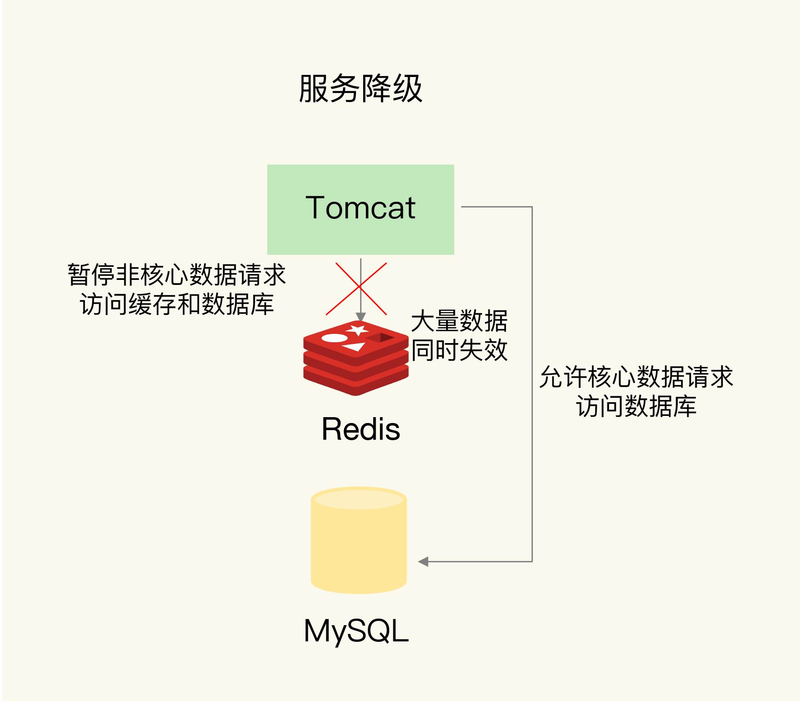


#### 第二个原因：Redis 缓存实例发生故障宕机了

除了大量数据同时失效会导致缓存雪崩，**还有一种情况也会发生缓存雪崩，那就是 Redis 缓存实例发生故障宕机了，无法处理请求，这就会导致大量请求一下子积压到数据库层，从而发生缓存雪崩。**

一般来说，一个 Redis 实例可以支持数万级别的请求处理吞吐量，而单个数据库可能只能支持数千级别的请求处理吞吐量，它们两个的处理能力可能相差了近十倍。由于缓存雪崩，Redis 缓存失效，所以，数据库就可能要承受近十倍的请求压力，从而因为压力过大而崩溃。

此时，因为 Redis 实例发生了宕机，我们需要通过其他方法来应对缓存雪崩了。我给你提供两个建议。


- **第一个建议，是在业务系统中实现服务熔断或请求限流机制**。

所谓的**服务熔断**（直接关闭缓存功能和数据库功能），是指在发生缓存雪崩时，为了防止引发连锁的数据库雪崩，甚至是整个系统的崩溃，我们暂停业务应用对缓存系统的接口访问。再具体点说，**就是业务应用调用缓存接口时，缓存客户端并不把请求发给 Redis 缓存实例，而是直接返回，等到 Redis 缓存实例重新恢复服务后，再允许应用请求发送到缓存系统。**

这样一来，我们就避免了大量请求因缓存缺失，而积压到数据库系统，保证了数据库系统的正常运行。

在业务系统运行时，我们可以监测 Redis 缓存所在机器和数据库所在机器的负载指标，例如每秒请求数、CPU 利用率、内存利用率等。如果我们发现 Redis 缓存实例宕机了，而数据库所在机器的负载压力突然增加（例如每秒请求数激增），此时，就发生缓存雪崩了。大量请求被发送到数据库进行处理。我们可以启动服务熔断机制，暂停业务应用对缓存服务的访问，从而降低对数据库的访问压力，如下图所示：

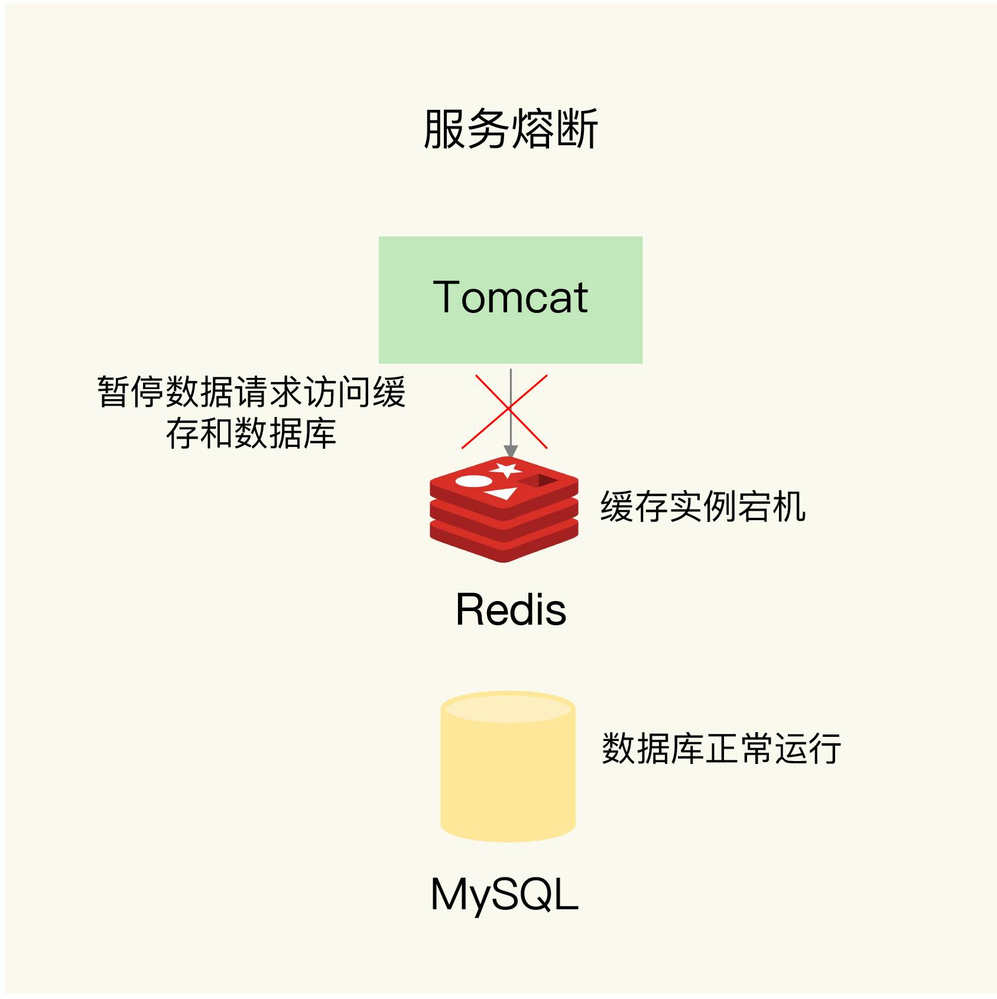

**服务熔断虽然可以保证数据库的正常运行，但是暂停了整个缓存系统的访问，对业务应用的影响范围大。**


为了尽可能减少这种影响，我们也可以进行请求限流。**这里说的请求限流，就是指，我们在业务系统的请求入口前端控制每秒进入系统的请求数，避免过多的请求被发送到数据库。**

我给你举个例子。假设业务系统正常运行时，请求入口前端允许每秒进入系统的请求是 1 万个，其中，9000 个请求都能在缓存系统中进行处理，只有 1000 个请求会被应用发送到数据库进行处理。

一旦发生了缓存雪崩，数据库的每秒请求数突然增加到每秒 1 万个，此时，我们就可以启动请求限流机制，在请求入口前端只允许每秒进入系统的请求数为 1000 个，再多的请求就会在入口前端被直接拒绝服务。所以，使用了请求限流，就可以避免大量并发请求压力传递到数据库层。

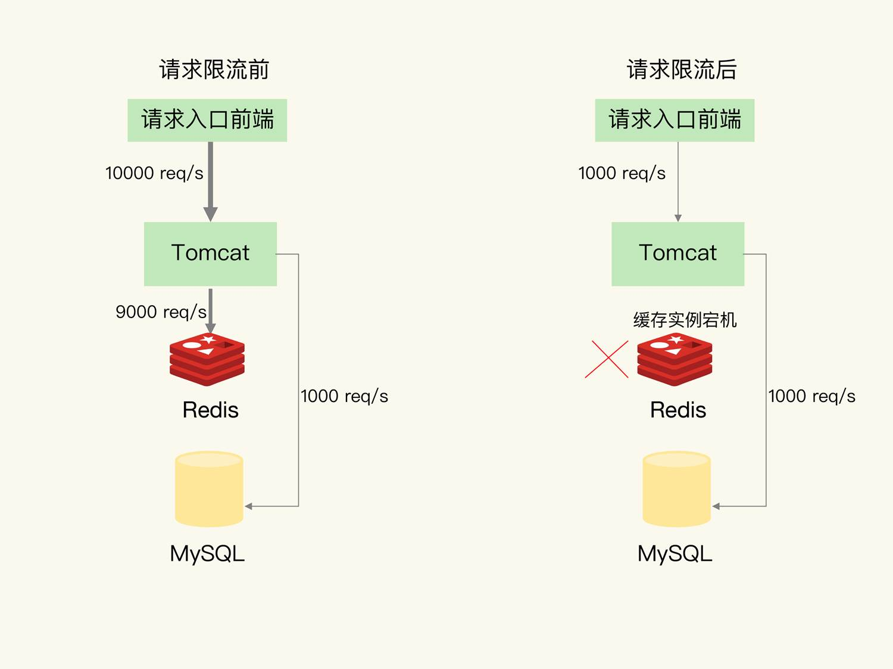

**使用服务熔断或是请求限流机制，来应对 Redis 实例宕机导致的缓存雪崩问题，是属于“事后诸葛亮”，也就是已经发生缓存雪崩了，我们使用这两个机制，来降低雪崩对数据库和整个业务系统的影响。**


- 我给你的第二个建议就是**事前预防。**

**通过主从节点的方式构建 Redis 缓存高可靠集群。**如果 Redis 缓存的主节点故障宕机了，从节点还可以切换成为主节点，继续提供缓存服务，避免了由于缓存实例宕机而导致的缓存雪崩问题。


缓存雪崩是发生在大量数据同时失效的场景下，而接下来我要向你介绍的缓存击穿，是发生在某个热点数据失效的场景下。和缓存雪崩相比，缓存击穿失效的数据数量要小很多，应对方法也不一样，我们来看下。


### 缓存击穿（单个数据的请求穿过缓存）

**缓存击穿是指，针对某个访问非常频繁的热点数据的请求，无法在缓存中进行处理，紧接着，访问该数据的大量请求，一下子都发送到了后端数据库，导致了数据库压力激增，会影响数据库处理其他请求**。缓存击穿的情况，经常发生在热点数据过期失效时，如下图所示：

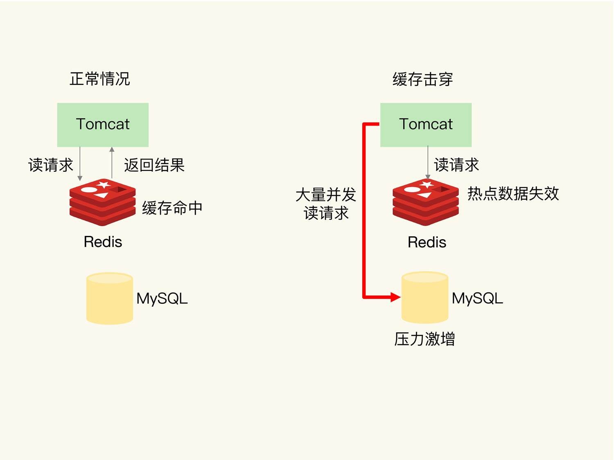

为了避免缓存击穿给数据库带来的激增压力，我们的解决方法也比较直接，**对于访问特别频繁的热点数据，我们就不设置过期时间了。**这样一来，对热点数据的访问请求，都可以在缓存中进行处理，而 Redis 数万级别的高吞吐量可以很好地应对大量的并发请求访问。


好了，到这里，你了解了缓存雪崩和缓存击穿问题，以及它们的应对方案。当**发生缓存雪崩或击穿时，数据库中还是保存了应用要访问的数据。接下来，我向你介绍的缓存穿透问题，和雪崩、击穿问题不一样，缓存穿透发生时，数据也不在数据库中，这会同时给缓存和数据库带来访问压力，**那该怎么办呢？我们来具体看下。


### 缓存穿透（直接穿过缓存，访问数据库不存在的数据）

**缓存穿透是指要访问的数据既不在 Redis 缓存中，也不在数据库中，导致请求在访问缓存时，发生缓存缺失，再去访问数据库时，发现数据库中也没有要访问的数据。**此时，应用也无法从数据库中读取数据再写入缓存，来服务后续请求，这样一来，缓存也就成了“摆设”，如果应用持续有大量请求访问数据，就会同时给缓存和数据库带来巨大压力，如下图所示：

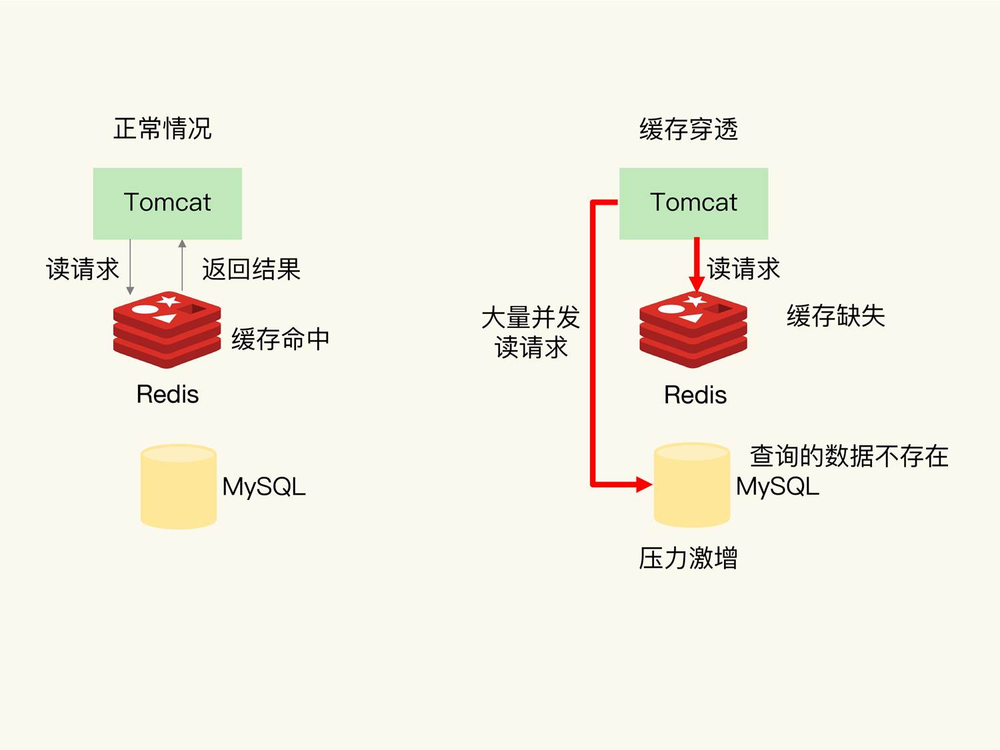

**那么，缓存穿透会发生在什么时候呢？一般来说，有两种情况。**

- **业务层误操作：缓存中的数据和数据库中的数据被误删除了，所以缓存和数据库中都没有数据；**

- **恶意攻击：专门访问数据库中没有的数据。**


为了避免缓存穿透的影响，我来给你提供三种应对方案。


#### 第一种方案是，缓存空值或缺省值。

一旦发生缓存穿透，我们就可以针对查询的数据，在 **Redis 中缓存一个空值或是和业务层协商确定的缺省值（例如，库存的缺省值可以设为 0）。**紧接着，应用发送的后续请求再进行查询时，就可以直接从 Redis 中读取空值或缺省值，返回给业务应用了，避免了把大量请求发送给数据库处理，保持了数据库的正常运行。


#### 第二种方案是，使用布隆过滤器

**使用布隆过滤器快速判断数据是否存在，避免从数据库中查询数据是否存在，减轻数据库压力。**

我们先来看下，布隆过滤器是如何工作的。

**布隆过滤器由一个初值都为 0 的 bit 数组和 N 个哈希函数组成，可以用来快速判断某个数据是否存在。**当我们想标记某个数据存在时（例如，数据已被写入数据库），布隆过滤器会通过三个操作完成标记：

**1）首先，使用 N 个哈希函数，分别计算这个数据的哈希值，得到 N 个哈希值。**

**2）然后，我们把这 N 个哈希值对 bit 数组的长度取模，得到每个哈希值在数组中的对应位置。**

**3）最后，我们把对应位置的 bit 位设置为 1，这就完成了在布隆过滤器中标记数据的操作。**

如果数据不存在（例如，数据库里没有写入数据），我们也就没有用布隆过滤器标记过数据，那么，bit 数组对应 bit 位的值仍然为 0。

**当需要查询某个数据时，我们就执行刚刚说的计算过程，先得到这个数据在 bit 数组中对应的 N 个位置。紧接着，我们查看 bit 数组中这 N 个位置上的 bit 值。只要这 N 个 bit 值有一个不为 1，这就表明布隆过滤器没有对该数据做过标记，所以，查询的数据一定没有在数据库中保存。**为了便于你理解，我画了一张图，你可以看下。

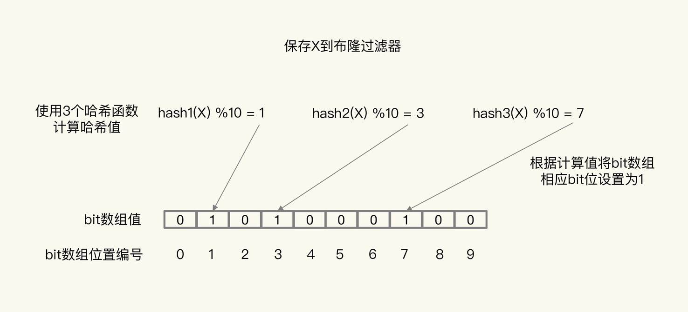

图中布隆过滤器是一个包含 10 个 bit 位的数组，使用了 3 个哈希函数，当在布隆过滤器中标记数据 X 时，X 会被计算 3 次哈希值，并对 10 取模，取模结果分别是 1、3、7。所以，bit 数组的第 1、3、7 位被设置为 1。当应用想要查询 X 时，只要查看数组的第 1、3、7 位是否为 1，只要有一个为 0，那么，X 就肯定不在数据库中。


正是基于布隆过滤器的快速检测特性，我们可以在把数据写入数据库时，使用布隆过滤器做个标记**。当缓存缺失后，应用查询数据库时，可以通过查询布隆过滤器快速判断数据是否存在。如果不存在，就不用再去数据库中查询了。这样一来，即使发生缓存穿透了，大量请求只会查询 Redis 和布隆过滤器，而不会积压到数据库，也就不会影响数据库的正常运行。**布隆过滤器可以使用 Redis 实现，本身就能承担较大的并发访问压力。


#### 最后一种方案是，在请求入口的前端进行请求检测。

**缓存穿透的一个原因是有大量的恶意请求访问不存在的数据，所以，一个有效的应对方案是在请求入口前端，对业务系统接收到的请求进行合法性检测，把恶意的请求（例如请求参数不合理、请求参数是非法值、请求字段不存在）直接过滤掉，不让它们访问后端缓存和数据库。这样一来，也就不会出现缓存穿透问题了。**


跟缓存雪崩、缓存击穿这两类问题相比，缓存穿透的影响更大一些，希望你能重点关注一下。从预防的角度来说，我们需要避免误删除数据库和缓存中的数据；从应对角度来说，我们可以在业务系统中使用缓存空值或缺省值、使用布隆过滤器，以及进行恶意请求检测等方法。上节课，我们学习了缓存和数据库的数据不一致问题和应对方法。除了数据不一致问题，我们常常还会面临缓存异常的三个问题，分别是缓存雪崩、缓存击穿和缓存穿透。这三个问题一旦发生，会导致大量的请求积压到数据库层。如果请求的并发量很大，就会导致数据库宕机或是故障，这就是很严重的生产事故了。


### 小结

这节课，我们学习了缓存雪崩、击穿和穿透这三类异常问题。从问题成因来看，**缓存雪崩和击穿主要是因为数据不在缓存中了，而缓存穿透则是因为数据既不在缓存中，也不在数据库中。**所以，缓存雪崩或击穿时，一旦数据库中的数据被再次写入到缓存后，应用又可以在缓存中快速访问数据了，数据库的压力也会相应地降低下来，而缓存穿透发生时，Redis 缓存和数据库会同时持续承受请求压力。


最后，我想强调一下，服务熔断、服务降级、请求限流这些方法都是属于“有损”方案，在保证数据库和整体系统稳定的同时，会对业务应用带来负面影响。例如使用服务降级时，有部分数据的请求就只能得到错误返回信息，无法正常处理。如果使用了服务熔断，那么，整个缓存系统的服务都被暂停了，影响的业务范围更大。而使用了请求限流机制后，整个业务系统的吞吐率会降低，能并发处理的用户请求会减少，会影响到用户体验。

所以，我给你的建议是，尽量使用预防式方案：

- 针对缓存雪崩，合理地设置数据过期时间，以及搭建高可靠缓存集群；

- 针对缓存击穿，在缓存访问非常频繁的热点数据时，不要设置过期时间；

- 针对缓存穿透，提前在入口前端实现恶意请求检测，或者规范数据库的数据删除操作，避免误删除。


**关于布隆过滤器的使用，**

 1、布隆过滤器会有误判：由于采用固定bit的数组，使用多个哈希函数映射到多个bit上，有可能会导致两个不同的值都映射到相同的一组bit上。虽然有误判，但对于业务没有影响，无非就是还存在一些穿透而已，但整体上已经过滤了大多数无效穿透请求。

 2、布隆过滤器误判率和空间使用的计算：误判本质是因为哈希冲突，降低误判的方法是增加哈希函数 + 扩大整个bit数组的长度，但增加哈希函数意味着影响性能，扩大数组长度意味着空间占用变大，所以使用布隆过滤器，需要在误判率和性能、空间作一个平衡，具体的误判率是有一个计算公式可以推导出来的（比较复杂）。但我们在使用开源的布隆过滤器时比较简单，通常会提供2个参数：预估存入的数据量大小、要求的误判率，输入这些参数后，布隆过滤器会有自动计算出最佳的哈希函数数量和数组占用的空间大小，直接使用即可。

 3、布隆过滤器可以放在缓存和数据库的最前面：把Redis当作布隆过滤器时（4.0提供了布隆过滤器模块，4.0以下需要引入第三方库），当用户产生业务数据写入缓存和数据库后，同时也写入布隆过滤器，之后当用户访问自己的业务数据时，先检查布隆过滤器，如果过滤器不存在，就不需要查询缓存和数据库了，可以同时降低缓存和数据库的压力。

 4、Redis实现的布隆过滤器bigkey问题：Redis布隆过滤器是使用String类型实现的，存储的方式是一个bigkey，建议使用时单独部署一个实例，专门存放布隆过滤器的数据，不要和业务数据混用，否则在集群环境下，数据迁移时会导致Redis阻塞问题


# 缓存被污染了，该怎么办？

我们应用 Redis 缓存时，如果能缓存会被反复访问的数据，那就能加速业务应用的访问。但是，如果发生了缓存污染，那么，缓存对业务应用的加速作用就减少了。

**那什么是缓存污染呢？在一些场景下，有些数据被访问的次数非常少，甚至只会被访问一次。当这些数据服务完访问请求后，如果还继续留存在缓存中的话，就只会白白占用缓存空间。这种情况，就是缓存污染。**

当缓存污染不严重时，只有少量数据占据缓存空间，此时，对缓存系统的影响不大。但是，缓存污染一旦变得严重后，就会有大量不再访问的数据滞留在缓存中。如果这时数据占满了缓存空间，我们再往缓存中写入新数据时，就需要先把这些数据逐步淘汰出缓存，这就会引入额外的操作时间开销，进而会影响应用的性能。

今天，我们就来看看如何解决缓存污染问题。


## 如何解决缓存污染问题？

**要解决缓存污染，我们也能很容易想到解决方案，那就是得把不会再被访问的数据筛选出来并淘汰掉。这样就不用等到缓存被写满以后，再逐一淘汰旧数据之后，才能写入新数据了。而哪些数据能留存在缓存中，是由缓存的淘汰策略决定的。**

到这里，你还记得咱们在第 24 讲一起学习的 8 种数据淘汰策略吗？它们分别是 noeviction、volatile-random、volatile-ttl、volatile-lru、volatile-lfu、allkeys-lru、allkeys-random 和 allkeys-lfu 策略。

在这 8 种策略中，noeviction 策略是不会进行数据淘汰的。所以，它肯定不能用来解决缓存污染问题。其他的 7 种策略，都会按照一定的规则来淘汰数据。这里有个关键词是“一定的规则”，那么问题来了，不同的规则对于解决缓存污染问题，是否都有效呢？接下来，我们就一一分析下。

因为 LRU 算法是我们在缓存数据淘汰策略中广泛应用的算法，所以我们先分析其他策略，然后单独分析淘汰策略使用 LRU 算法的情况，最后再学习下 LFU 算法用于淘汰策略时，对缓存污染的应对措施。使用 LRU 算法和 LFU 算法的策略各有两种（volatile-lru 和 allkeys-lru，以及 volatile-lfu 和 allkeys-lfu），为了便于理解，接下来我会统一把它们叫作 LRU 策略和 LFU 策略。


### random、ttl 策略

**首先，我们看下 volatile-random 和 allkeys-random 这两种策略。它们都是采用随机挑选数据的方式，来筛选即将被淘汰的数据。**

既然是随机挑选，那么 Redis 就不会根据数据的访问情况来筛选数据。如果被淘汰的数据又被访问了，就会发生缓存缺失。也就是说，应用需要到后端数据库中访问这些数据，降低了应用的请求响应速度。**所以，volatile-random 和 allkeys-random 策略，在避免缓存污染这个问题上的效果非常有限。**

我给你举个例子吧。如下图所示，假设我们配置 Redi s 缓存使用 allkeys-random 淘汰策略，当缓存写满时，allkeys-random 策略随机选择了数据 20 进行淘汰。不巧的是，数据 20 紧接着又被访问了，此时，Redis 就会发生了缓存缺失。

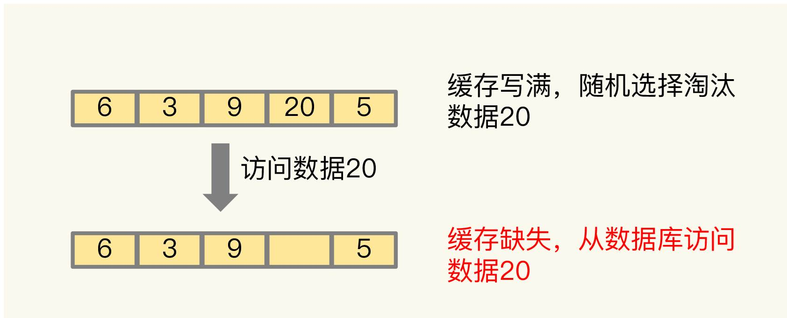


**我们继续看 volatile-ttl 策略是否能有效应对缓存污染。volatile-ttl 针对的是设置了过期时间的数据，把这些数据中剩余存活时间最短的筛选出来并淘汰掉。**

虽然 volatile-ttl 策略不再是随机选择淘汰数据了，但是剩余存活时间并不能直接反映数据再次访问的情况。所以，按照 volatile-ttl 策略淘汰数据，和按随机方式淘汰数据类似，也可能出现数据被淘汰后，被再次访问导致的缓存缺失问题。


这时，你可能会想到一种例外的情况：**业务应用在给数据设置过期时间的时候，就明确知道数据被再次访问的情况，并根据访问情况设置过期时间。**此时，Redis 按照数据的剩余最短存活时间进行筛选，是可以把不会再被访问的数据筛选出来的，进而避免缓存污染。例如，业务部门知道数据被访问的时长就是一个小时，并把数据的过期时间设置为一个小时后。这样一来，被淘汰的数据的确是不会再被访问了。


讲到这里，我们先小结下。除了在明确知道数据被再次访问的情况下，volatile-ttl 可以有效避免缓存污染。在其他情况下，volatile-random、allkeys-random、volatile-ttl 这三种策略并不能应对缓存污染问题。

接下来，我们再分别分析下 LRU 策略，以及 Redis 4.0 后实现的 LFU 策略。LRU 策略会按照数据访问的时效性，来筛选即将被淘汰的数据，应用非常广泛。在第 24 讲，我们已经学习了 Redis 是如何实现 LRU 策略的，所以接下来我们就重点看下它在解决缓存污染问题上的效果。


### LRU 缓存策略

我们先复习下 LRU 策略的核心思想：**如果一个数据刚刚被访问，那么这个数据肯定是热数据，还会被再次访问。**

按照这个核心思想，**Redis 中的 LRU 策略，会在每个数据对应的 RedisObject 结构体中设置一个 lru 字段，用来记录数据的访问时间戳。在进行数据淘汰时，LRU 策略会在候选数据集中淘汰掉 lru 字段值最小的数据（也就是访问时间最久的数据）。**

所以，在数据被频繁访问的业务场景中，LRU 策略的确能有效留存访问时间最近的数据。而且，因为留存的这些数据还会被再次访问，所以又可以提升业务应用的访问速度。

但是，也正是因为只看数据的访问时间，使用 LRU 策略在处理扫描式单次查询操作时，无法解决缓存污染。**所谓的扫描式单次查询操作，就是指应用对大量的数据进行一次全体读取，每个数据都会被读取，而且只会被读取一次。此时，因为这些被查询的数据刚刚被访问过，所以 lru 字段值都很大。**

在使用 LRU 策略淘汰数据时，这些数据会留存在缓存中很长一段时间，造成缓存污染。如果查询的数据量很大，这些数据占满了缓存空间，却又不会服务新的缓存请求，此时，再有新数据要写入缓存的话，还是需要先把这些旧数据替换出缓存才行，这会影响缓存的性能。


为了方便你理解，我给你举个例子。如下图所示，数据 6 被访问后，被写入 Redis 缓存。但是，在此之后，数据 6 一直没有被再次访问，这就导致数据 6 滞留在缓存中，造成了污染。

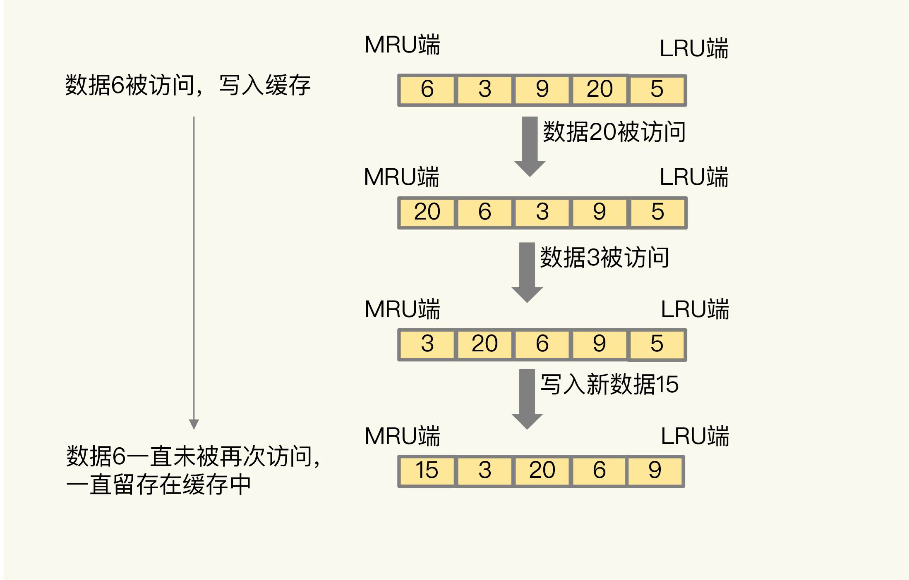

所以，对于采用了 LRU 策略的 Redis 缓存来说，扫描式单次查询会造成缓存污染。为了应对这类缓存污染问题，Redis 从 4.0 版本开始增加了 LFU 淘汰策略。

与 LRU 策略相比，L**FU 策略中会从两个维度来筛选并淘汰数据：一是，数据访问的时效性（访问时间离当前时间的远近）；二是，数据的被访问次数。**

那 Redis 的 LFU 策略是怎么实现的，又是如何解决缓存污染问题的呢？我们来看一下。


### LFU (Least Frequently Used) 缓存策略的优化

**LFU 缓存策略是在 LRU 策略基础上，为每个数据增加了一个计数器，来统计这个数据的访问次数。当使用 LFU 策略筛选淘汰数据时，首先会根据数据的访问次数进行筛选，把访问次数最低的数据淘汰出缓存。如果两个数据的访问次数相同，LFU 策略再比较这两个数据的访问时效性，把距离上一次访问时间更久的数据淘汰出缓存。**

和那些被频繁访问的数据相比，扫描式单次查询的数据因为不会被再次访问，所以它们的访问次数不会再增加。因此，LFU 策略会优先把这些访问次数低的数据淘汰出缓存。这样一来，LFU 策略就可以避免这些数据对缓存造成污染了。

那么，LFU 策略具体又是如何实现的呢？既然 LFU 策略是在 LRU 策略上做的优化，那它们的实现必定有些关系。所以，我们就再复习下第 24 讲学习过的 LRU 策略的实现。

为了避免操作链表的开销，Redis 在实现 LRU 策略时使用了两个近似方法：

Redis 是用 RedisObject 结构来保存数据的，RedisObject 结构中设置了一个 lru 字段，用来记录数据的访问时间戳；

Redis 并没有为所有的数据维护一个全局的链表，而是通过随机采样方式，选取一定数量（例如 10 个）的数据放入候选集合，后续在候选集合中根据 lru 字段值的大小进行筛选。

在此基础上，Redis 在实现 LFU 策略的时候，只是把原来 24bit 大小的 lru 字段，又进一步拆分成了两部分。

- ldt 值：lru 字段的前 16bit，表示数据的**访问时间戳；**

- counter 值：lru 字段的后 8bit，表示数据的**访问次数。**

**总结一下：当 LFU 策略筛选数据时，Redis 会在候选集合中，根据数据 lru 字段的后 8bit 选择访问次数最少的数据进行淘汰。当访问次数相同时，再根据 lru 字段的前 16bit 值大小，选择访问时间最久远的数据进行淘汰。**


**到这里，还没结束，Redis 只使用了 8bit 记录数据的访问次数，而 8bit 记录的最大值是 255，这样可以吗？**

在实际应用中，一个数据可能会被访问成千上万次。如果每被访问一次，counter 值就加 1 的话，那么，只要访问次数超过了 255，数据的 counter 值就一样了。在进行数据淘汰时，LFU 策略就无法很好地区分并筛选这些数据，反而还可能会把不怎么访问的数据留存在了缓存中。

我们一起来看个例子。

假设第一个数据 A 的累计访问次数是 256，访问时间戳是 202010010909，所以它的 counter 值为 255，而第二个数据 B 的累计访问次数是 1024，访问时间戳是 202010010810。如果 counter 值只能记录到 255，那么数据 B 的 counter 值也是 255。

此时，缓存写满了，Redis 使用 LFU 策略进行淘汰。数据 A 和 B 的 counter 值都是 255，LFU 策略再比较 A 和 B 的访问时间戳，发现数据 B 的上一次访问时间早于 A，就会把 B 淘汰掉。但其实数据 B 的访问次数远大于数据 A，很可能会被再次访问。这样一来，使用 LFU 策略来淘汰数据就不合适了。

的确，Redis 也注意到了这个问题。因此，在实现 LFU 策略时，Redis 并没有采用数据每被访问一次，就给对应的 counter 值加 1 的计数规则，而是采用了一个更优化的计数规则。

**简单来说，LFU 策略实现的计数规则是：每当数据被访问一次时，首先，用计数器当前的值乘以配置项 lfu_log_factor 再加 1，再取其倒数，得到一个 p 值；然后，把这个 p 值和一个取值范围在（0，1）间的随机数 r 值比大小，只有 p 值大于 r 值时，计数器才加 1。**

下面这段 Redis 的部分源码，显示了 LFU 策略增加计数器值的计算逻辑。其中，baseval 是计数器当前的值。计数器的初始值默认是 5（由代码中的 LFU_INIT_VAL 常量设置），而不是 0，这样可以避免数据刚被写入缓存，就因为访问次数少而被立即淘汰。

```
double r = (double)rand()/RAND_MAX;

...

double p = 1.0/(baseval*server.lfu_log_factor+1);

if (r < p) counter++;  
```

使用了这种计算规则后，我们可以通过设置不同的 lfu_log_factor 配置项，来控制计数器值增加的速度，避免 counter 值很快就到 255 了。

为了更进一步说明 LFU 策略计数器递增的效果，你可以看下下面这张表。这是 Redis官网上提供的一张表，它记录了当 lfu_log_factor 取不同值时，在不同的实际访问次数情况下，计数器的值是如何变化的。

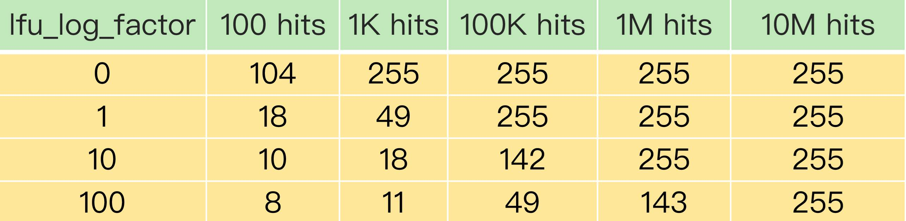

可以看到，当 lfu_log_factor 取值为 1 时，实际访问次数为 100K 后，counter 值就达到 255 了，无法再区分实际访问次数更多的数据了。而当 lfu_log_factor 取值为 100 时，当实际访问次数为 10M 时，counter 值才达到 255，此时，实际访问次数小于 10M 的不同数据都可以通过 counter 值区分出来。

正是因为使用了非线性递增的计数器方法，即使缓存数据的访问次数成千上万，LFU 策略也可以有效地区分不同的访问次数，从而进行合理的数据筛选。从刚才的表中，我们可以看到，当 lfu_log_factor 取值为 10 时，百、千、十万级别的访问次数对应的 counter 值已经有明显的区分了，所以，我们在应用 LFU 策略时，一般可以将 lfu_log_factor 取值为 10。


前面我们也提到了，应用负载的情况是很复杂的。在**一些场景下，有些数据在短时间内被大量访问后就不会再被访问了。那么再按照访问次数来筛选的话，这些数据会被留存在缓存中，但不会提升缓存命中率。为此，Redis 在实现 LFU 策略时，还设计了一个 counter 值的衰减机制。**

**简单来说，LFU 策略使用衰减因子配置项 lfu_decay_time 来控制访问次数的衰减。LFU 策略会计算当前时间和数据最近一次访问时间的差值，并把这个差值换算成以分钟为单位。然后，LFU 策略再把这个差值除以 lfu_decay_time 值，所得的结果就是数据 counter 要衰减的值。**

简单举个例子，假设 lfu_decay_time 取值为 1，如果数据在 N 分钟内没有被访问，那么它的访问次数就要减 N。如果 lfu_decay_time 取值更大，那么相应的衰减值会变小，衰减效果也会减弱。所以，如果业务应用中有短时高频访问的数据的话，建议把 lfu_decay_time 值设置为 1，这样一来，LFU 策略在它们不再被访问后，会较快地衰减它们的访问次数，尽早把它们从缓存中淘汰出去，避免缓存污染。


## 小结

今天这节课，我们学习的是“如何解决缓存污染”这个问题。

缓存污染问题指的是留存在缓存中的数据，实际不会被再次访问了，但是又占据了缓存空间。如果这样的数据体量很大，甚至占满了缓存，每次有新数据写入缓存时，还需要把这些数据逐步淘汰出缓存，就会增加缓存操作的时间开销。

因此，要解决缓存污染问题，最关键的技术点就是能识别出这些只访问一次或是访问次数很少的数据，在淘汰数据时，优先把它们筛选出来并淘汰掉。因为 noviction 策略不涉及数据淘汰，所以这节课，我们就从能否有效解决缓存污染这个维度，分析了 Redis 的其他 7 种数据淘汰策略。

volatile-random 和 allkeys-random 是随机选择数据进行淘汰，无法把不再访问的数据筛选出来，可能会造成缓存污染。如果业务层明确知道数据的访问时长，可以给数据设置合理的过期时间，再设置 Redis 缓存使用 volatile-ttl 策略。当缓存写满时，剩余存活时间最短的数据就会被淘汰出缓存，避免滞留在缓存中，造成污染。

当我们使用 LRU 策略时，由于 LRU 策略只考虑数据的访问时效，对于只访问一次的数据来说，LRU 策略无法很快将其筛选出来。而 LFU 策略在 LRU 策略基础上进行了优化，在筛选数据时，首先会筛选并淘汰访问次数少的数据，然后针对访问次数相同的数据，再筛选并淘汰访问时间最久远的数据。

在具体实现上，相对于 LRU 策略，Redis 只是把原来 24bit 大小的 lru 字段，又进一步拆分成了 16bit 的 ldt 和 8bit 的 counter，分别用来表示数据的访问时间戳和访问次数。为了避开 8bit 最大只能记录 255 的限制，LFU 策略设计使用非线性增长的计数器来表示数据的访问次数。

在实际业务应用中，LRU 和 LFU 两个策略都有应用。LRU 和 LFU 两个策略关注的数据访问特征各有侧重，LRU 策略更加关注数据的时效性，而 LFU 策略更加关注数据的访问频次。通常情况下，实际应用的负载具有较好的时间局部性，所以 LRU 策略的应用会更加广泛。但是，在扫描式查询的应用场景中，LFU 策略就可以很好地应对缓存污染问题了，建议你优先使用。

此外，如果业务应用中有短时高频访问的数据，**除了 LFU 策略本身会对数据的访问次数进行自动衰减以外，我再给你个小建议：你可以优先使用 volatile-lfu 策略，并根据这些数据的访问时限设置它们的过期时间，以免它们留存在缓存中造成污染。我们应用 Redis 缓存时，如果能缓存会被反复访问的数据，那就能加速业务应用的访问。但是，如果发生了缓存污染，那么，缓存对业务应用的加速作用就减少了。**

