# 如何基于SSD实现大容量Redis？

我们在应用 Redis 时，随着业务数据的增加（比如说电商业务中，随着用户规模和商品数量的增加），就需要 Redis 能保存更多的数据。你可能会想到使用 Redis 切片集群，把数据分散保存到多个实例上。但是这样做的话，会有一个问题，如果要保存的数据总量很大，但是每个实例保存的数据量较小的话，就会导致集群的实例规模增加，这会让集群的运维管理变得复杂，增加开销。

你可能又会说，我们可以通过增加 Redis 单实例的内存容量，形成大内存实例，每个实例可以保存更多的数据，这样一来，在保存相同的数据总量时，所需要的大内存实例的个数就会减少，就可以节省开销。

这是一个好主意，但这也并不是完美的方案：基于大内存的大容量实例在实例恢复、主从同步过程中会引起一系列潜在问题，例如恢复时间增长、主从切换开销大、缓冲区易溢出。

那怎么办呢？我推荐你使用固态硬盘（Solid State Drive，SSD）。它的成本很低（每 GB 的成本约是内存的十分之一），而且容量大，读写速度快，我们可以基于 SSD 来实现大容量的 Redis 实例。360 公司 DBA 和基础架构组联合开发的 Pika键值数据库，正好实现了这一需求。

Pika 在刚开始设计的时候，就有两个目标：一是，单实例可以保存大容量数据，同时避免了实例恢复和主从同步时的潜在问题；二是，和 Redis 数据类型保持兼容，可以支持使用 Redis 的应用平滑地迁移到 Pika 上。所以，如果你一直在使用 Redis，并且想使用 SSD 来扩展单实例容量，Pika 就是一个很好的选择。

这节课，我就和你聊聊 Pika。在介绍 Pika 前，我先给你具体解释下基于大内存实现大容量 Redis 实例的潜在问题。只有知道了这些问题，我们才能选择更合适的方案。另外呢，我还会带你一步步分析下 Pika 是如何实现刚刚我们所说的两个设计目标，解决这些问题的。


## 大内存 Redis 实例的潜在问题

Redis 使用内存保存数据，内存容量增加后，就会带来两方面的潜在问题，分别是，内存快照 RDB 生成和恢复效率低，以及主从节点全量同步时长增加、缓冲区易溢出。我来一一解释下，

我们先看内存快照 RDB 受到的影响。内存大小和内存快照 RDB 的关系是非常直接的：实例内存容量大，RDB 文件也会相应增大，那么，RDB 文件生成时的 fork 时长就会增加，这就会导致 Redis 实例阻塞。而且，RDB 文件增大后，使用 RDB 进行恢复的时长也会增加，会导致 Redis 较长时间无法对外提供服务。

接下来我们再来看下主从同步受到的影响，

- **主从节点间的同步的第一步就是要做全量同步。**全量同步是主节点生成 RDB 文件，并传给从节点，从节点再进行加载。试想一下，如果 RDB 文件很大，肯定会导致全量同步的时长增加，效率不高，而且还可能会导致复制缓冲区溢出。一旦缓冲区溢出了，主从节点间就会又开始全量同步，影响业务应用的正常使用。如果我们增加复制缓冲区的容量，这又会消耗宝贵的内存资源。

- 此外，如果主库发生了故障，进行主从切换后，其他从库都需要和新主库进行一次全量同步。**如果 RDB 文件很大，也会导致主从切换的过程耗时增加，同样会影响业务的可用性。**

那么，Pika 是如何解决这两方面的问题呢？这就要提到 Pika 中的关键模块 RocksDB、binlog 机制和 Nemo 了，这些模块都是 Pika 架构中的重要组成部分。所以，接下来，我们就来先看下 Pika 的整体架构。


## Pika 的整体架构

Pika 键值数据库的整体架构中包括了五部分，分别是网络框架、Pika 线程模块、Nemo 存储模块、RocksDB 和 binlog 机制，如下图所示：

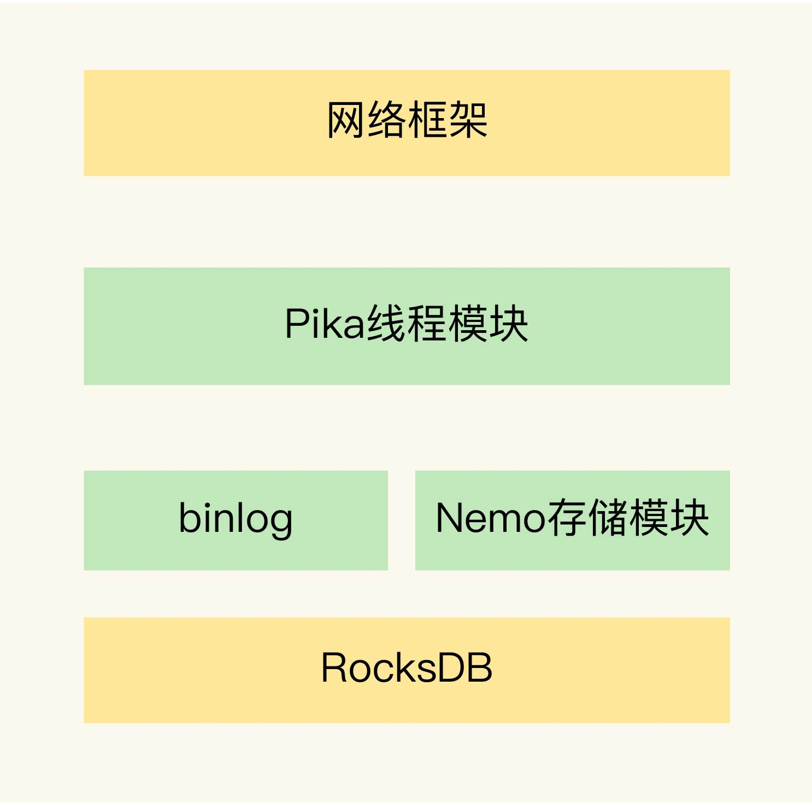

这五个部分分别实现了不同的功能，下面我一个个来介绍下。

- 首先**，网络框架主要负责底层网络请求的接收和发送**。Pika 的网络框架是对操作系统底层的网络函数进行了封装。Pika 在进行网络通信时，可以直接调用网络框架封装好的函数。

- 其次，**Pika 线程模块采用了多线程模型来具体处理客户端请求**，包括一个请求分发线程（DispatchThread）、一组工作线程（WorkerThread）以及一个线程池（ThreadPool）。

**请求分发线程专门监听网络端口，一旦接收到客户端的连接请求后，就和客户端建立连接，并把连接交由工作线程处理。工作线程负责接收客户端连接上发送的具体命令请求，并把命令请求封装成 Task，再交给线程池中的线程，由这些线程进行实际的数据存取处理**，如下图所示：

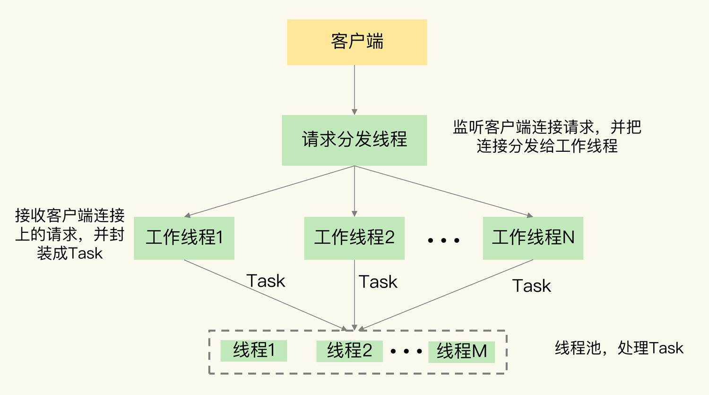

在实际应用 Pika 的时候，我们可以通过增加工作线程数和线程池中的线程数，来提升 Pika 的请求处理吞吐率，进而满足业务层对数据处理性能的需求。

Nemo 模块很容易理解，它实现了 Pika 和 Redis 的数据类型兼容。这样一来，当我们把 Redis 服务迁移到 Pika 时，不用修改业务应用中操作 Redis 的代码，而且还可以继续应用运维 Redis 的经验，这使得 Pika 的学习成本就较低。Nemo 模块对数据类型的具体转换机制是我们要重点关心的，下面我会具体介绍。

最后，我们再来看看 RocksDB 提供的基于 SSD 保存数据的功能。它使得 Pika 可以不用大容量的内存，就能保存更多数据，还避免了使用内存快照。而且，Pika 使用 binlog 机制记录写命令，用于主从节点的命令同步，避免了刚刚所说的大内存实例在主从同步过程中的潜在问题。

接下来，我们就来具体了解下，Pika 是如何使用 RocksDB 和 binlog 机制的。


## Pika 如何基于 SSD 保存更多数据？

为了把数据保存到 SSD，Pika 使用了业界广泛应用的持久化键值数据库RocksDB。RocksDB 本身的实现机制较为复杂，你不需要全部弄明白，你只要记住 RocksDB 的基本数据读写机制，对于学习了解 Pika 来说，就已经足够了。下面我来解释下这个基本读写机制。

下面我结合一张图片，来给你具体介绍下 RocksDB 写入数据的基本流程。


当 Pika 需要保存数据时，RocksDB 会使用两小块内存空间（Memtable1 和 Memtable2）来交替缓存写入的数据。Memtable 的大小可以设置，一个 Memtable 的大小一般为几 MB 或几十 MB。当有数据要写入 RocksDB 时，RocksDB 会先把数据写入到 Memtable1。等到 Memtable1 写满后，RocksDB 再把数据以文件的形式，快速写入底层的 SSD。同时，RocksDB 会使用 Memtable2 来代替 Memtable1，缓存新写入的数据。等到 Memtable1 的数据都写入 SSD 了，RocksDB 会在 Memtable2 写满后，再用 Memtable1 缓存新写入的数据。

这么一分析你就知道了，RocksDB 会先用 Memtable 缓存数据，再将数据快速写入 SSD，即使数据量再大，所有数据也都能保存到 SSD 中。而且，Memtable 本身容量不大，即使 RocksDB 使用了两个 Memtable，也不会占用过多的内存，这样一来，Pika 在保存大容量数据时，也不用占据太大的内存空间了。

当 Pika 需要读取数据的时候，RocksDB 会先在 Memtable 中查询是否有要读取的数据。这是因为，最新的数据都是先写入到 Memtable 中的。如果 Memtable 中没有要读取的数据，RocksDB 会再查询保存在 SSD 上的数据文件，如下图所示：

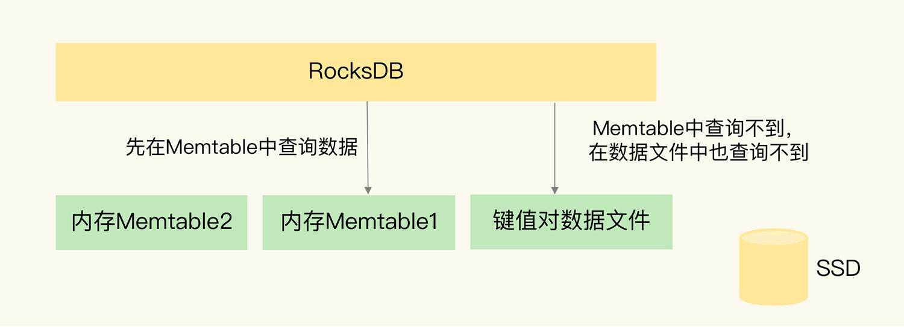

到这里，你就了解了，当使用了 RocksDB 保存数据后，Pika 就可以把大量数据保存到大容量的 SSD 上了，实现了大容量实例。不过，我刚才向你介绍过，当使用大内存实例保存大量数据时，Redis 会面临 RDB 生成和恢复的效率问题，以及主从同步时的效率和缓冲区溢出问题。那么，当 Pika 保存大量数据时，还会面临相同的问题吗？

其实不会了，我们来分析一下。

一方面，**Pika 基于 RocksDB 保存了数据文件，直接读取数据文件就能恢复**（保存在SSD中），不需要再通过内存快照进行恢复了。而且，Pika 从库在进行全量同步时，可以直接从主库拷贝数据文件，不需要使用内存快照，这样一来，Pika 就避免了大内存快照生成效率低的问题。

另一方面，**Pika 使用了 binlog 机制实现增量命令同步**，既节省了内存，还避免了缓冲区溢出的问题。binlog 是保存在 SSD 上的文件，Pika 接收到写命令后，**在把数据写入 Memtable 时，也会把命令操作写到 binlog 文件中。**和 Redis 类似，当全量同步结束后，从库会从 binlog 中把尚未同步的命令读取过来，这样就可以和主库的数据保持一致。当进行增量同步时，从库也是把自己已经复制的偏移量发给主库，主库把尚未同步的命令发给从库，来保持主从库的数据一致。

不过，和 Redis 使用缓冲区相比，使用 binlog 好处是非常明显的：binlog 是保存在 SSD 上的文件，文件大小不像缓冲区，会受到内存容量的较多限制。而且，当 binlog 文件增大后，还可以通过轮替操作，生成新的 binlog 文件，再把旧的 binlog 文件独立保存。这样一来，即使 Pika 实例保存了大量的数据，在同步过程中也不会出现缓冲区溢出的问题了。

现在，我们先简单小结下。Pika 使用 RocksDB 把大量数据保存到了 SSD，同时避免了内存快照的生成和恢复问题。而且，Pika 使用 binlog 机制进行主从同步，避免大内存时的影响，Pika 的第一个设计目标就实现了。

接下来，我们再来看 Pika 是如何实现第二个设计目标的，也就是如何和 Redis 兼容。毕竟，如果不兼容的话，原来使用 Redis 的业务就无法平滑迁移到 Pika 上使用了，也就没办法利用 Pika 保存大容量数据的优势了。


## Pika 如何实现 Redis 数据类型兼容？

Pika 的底层存储使用了 RocksDB 来保存数据，但是，RocksDB 只提供了单值的键值对类型，RocksDB 键值对中的值就是单个值，而 Redis 键值对中的值还可以是集合类型。

对于 Redis 的 String 类型来说，它本身就是单值的键值对，我们直接用 RocksDB 保存就行。但是，对于集合类型来说，我们就无法直接把集合保存为单值的键值对，而是需要进行转换操作。

为了保持和 Redis 的兼容性，Pika 的 Nemo 模块就负责把 Redis 的集合类型转换成单值的键值对。简单来说，我们可以把 Redis 的集合类型分成两类：

一类是 List 和 Set 类型，它们的集合中也只有单值；

另一类是 Hash 和 Sorted Set 类型，它们的集合中的元素是成对的，其中，Hash 集合元素是 field-value 类型，而 Sorted Set 集合元素是 member-score 类型。

Nemo 模块通过转换操作，把这 4 种集合类型的元素表示为单值的键值对。具体怎么转换呢？下面我们来分别看下每种类型的转换。

首先我们来看 List 类型。在 Pika 中，List 集合的 key 被嵌入到了单值键值对的键当中，用 key 字段表示；而 List 集合的元素值，则被嵌入到单值键值对的值当中，用 value 字段表示。因为 List 集合中的元素是有序的，所以，Nemo 模块还在单值键值对的 key 后面增加了 sequence 字段，表示当前元素在 List 中的顺序，同时，还在 value 的前面增加了 previous sequence 和 next sequence 这两个字段，分别表示当前元素的前一个元素和后一个元素。

此外，在单值键值对的 key 前面，Nemo 模块还增加了一个值“l”，表示当前数据是 List 类型，以及增加了一个 1 字节的 size 字段，表示 List 集合 key 的大小。在单值键值对的 value 后面，Nemo 模块还增加了 version 和 ttl 字段，分别表示当前数据的版本号和剩余存活时间（用来支持过期 key 功能），如下图所示：

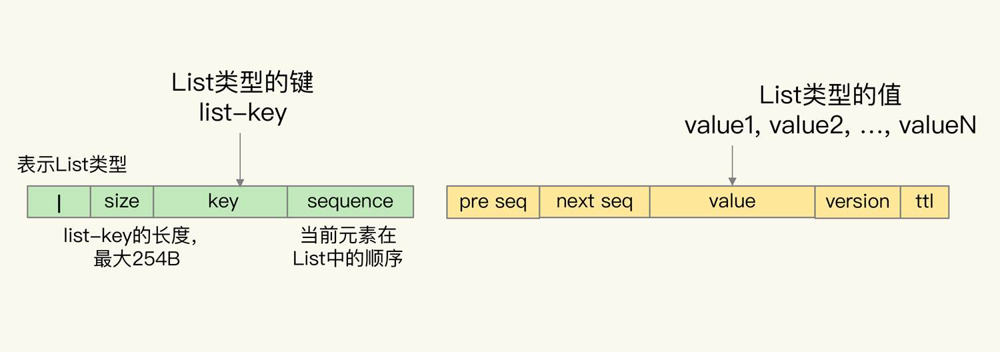

我们再来看看 Set 集合。

Set 集合的 key 和元素 member 值，都被嵌入到了 Pika 单值键值对的键当中，分别用 key 和 member 字段表示。同时，和 List 集合类似，单值键值对的 key 前面有值“s”，用来表示数据是 Set 类型，同时还有 size 字段，用来表示 key 的大小。Pika 单值键值对的值只保存了数据的版本信息和剩余存活时间，如下图所示：

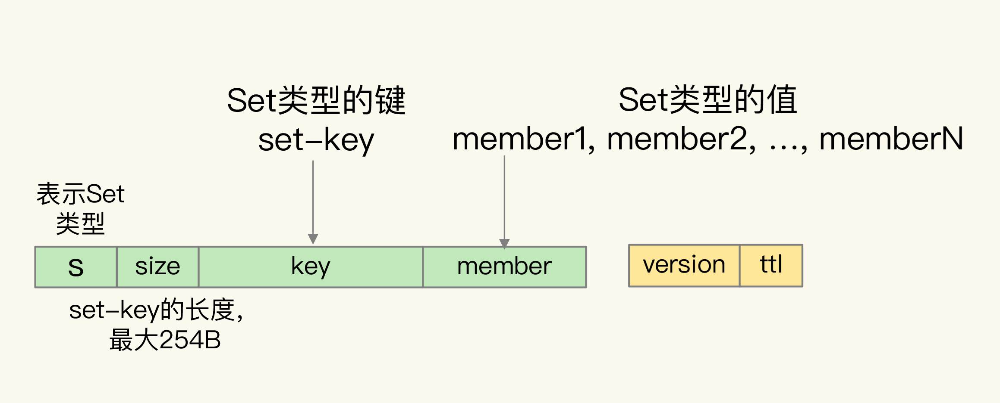

对于 Hash 类型来说，Hash 集合的 key 被嵌入到单值键值对的键当中，用 key 字段表示，而 Hash 集合元素的 field 也被嵌入到单值键值对的键当中，紧接着 key 字段，用 field 字段表示。Hash 集合元素的 value 则是嵌入到单值键值对的值当中，并且也带有版本信息和剩余存活时间，如下图所示：

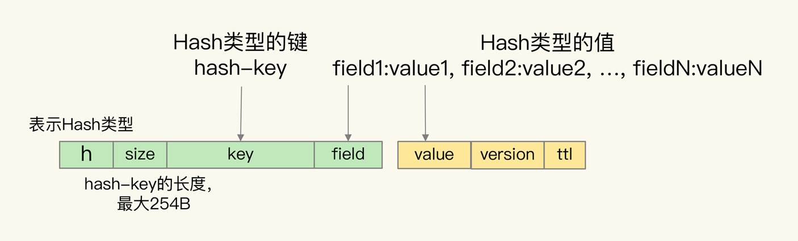

最后，对于 Sorted Set 类型来说，该类型是需要能够按照集合元素的 score 值排序的，而 RocksDB 只支持按照单值键值对的键来排序。所以，Nemo 模块在转换数据时，就把 Sorted Set 集合 key、元素的 score 和 member 值都嵌入到了单值键值对的键当中，此时，单值键值对中的值只保存了数据的版本信息和剩余存活时间，如下图所示：


采用了上面的转换方式之后，Pika 不仅能兼容支持 Redis 的数据类型，而且还保留了这些数据类型的特征，例如 List 的元素保序、Sorted Set 的元素按 score 排序。了解了 Pika 的转换机制后，你就会明白，如果你有业务应用计划从使用 Redis 切换到使用 Pika，就不用担心面临因为操作接口不兼容而要修改业务应用的问题了。

经过刚刚的分析，我们可以知道，Pika 能够基于 SSD 保存大容量数据，而且和 Redis 兼容，这是它的两个优势。接下来，我们再来看看，跟 Redis 相比，Pika 的其他优势，以及潜在的不足。当在实际应用 Pika 时，Pika 的不足之处是你需要特别注意的地方，这些可能都需要你进行系统配置或参数上的调优。


## Pika 的其他优势与不足

跟 Redis 相比，Pika 最大的特点就是使用了 SSD 来保存数据，这个特点能带来的最直接好处就是，Pika 单实例能保存更多的数据了，实现了实例数据扩容。

除此之外，Pika 使用 SSD 来保存数据，还有额外的两个优势。

首先，实例重启快。Pika 的数据在写入数据库时，是会保存到 SSD 上的。当 Pika 实例重启时，可以直接从 SSD 上的数据文件中读取数据，不需要像 Redis 一样，从 RDB 文件全部重新加载数据或是从 AOF 文件中全部回放操作，这极大地提高了 Pika 实例的重启速度，可以快速处理业务应用请求。

另外，主从库重新执行全量同步的风险低。Pika 通过 binlog 机制实现写命令的增量同步，不再受内存缓冲区大小的限制，所以，即使在数据量很大导致主从库同步耗时很长的情况下，Pika 也不用担心缓冲区溢出而触发的主从库重新全量同步。

但是，就像我在前面的课程中和你说的，“硬币都是有正反两面的”，Pika 也有自身的一些不足。

虽然它保持了 Redis 操作接口，也能实现数据库扩容，但是，当把数据保存到 SSD 上后，会降低数据的访问性能。这是因为，数据操作毕竟不能在内存中直接执行了，而是要在底层的 SSD 中进行存取，这肯定会影响，Pika 的性能。而且，我们还需要把 binlog 机制记录的写命令同步到 SSD 上，这会降低 Pika 的写性能。

不过，Pika 的多线程模型，可以同时使用多个线程进行数据读写，这在一定程度上弥补了从 SSD 存取数据造成的性能损失。当然，你也可以使用高配的 SSD 来提升访问性能，进而减少读写 SSD 对 Pika 性能的影响。

为了帮助你更直观地了解 Pika 的性能情况，我再给你提供一张表，这是 Pika官网上提供的测试数据。

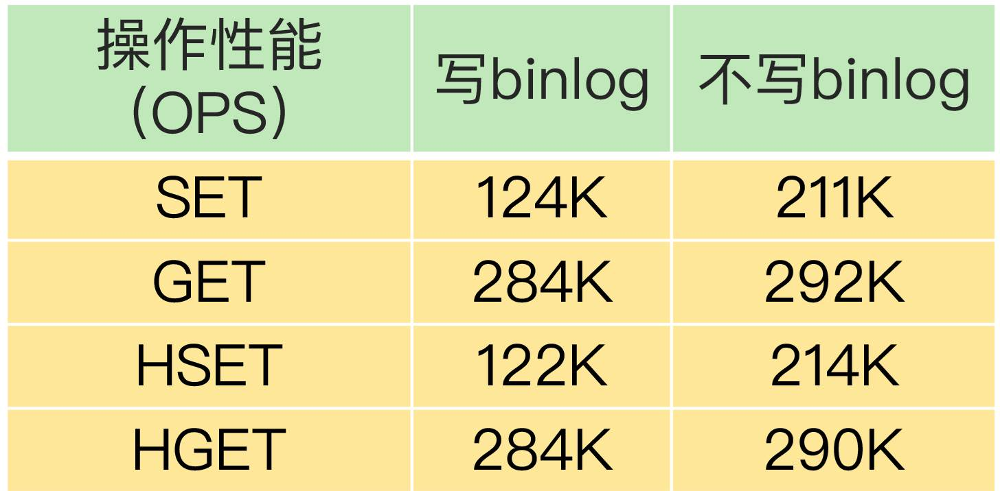

这些数据是在 Pika 3.2 版本中，String 和 Hash 类型在多线程情况下的基本操作性能结果。从表中可以看到，在不写 binlog 时，Pika 的 SET/GET、HSET/HGET 的性能都能达到 200K OPS 以上，而一旦增加了写 binlog 操作，SET 和 HSET 操作性能大约下降了 41%，只有约 120K OPS。

所以，我们在使用 Pika 时，需要在单实例扩容的必要性和可能的性能损失间做个权衡。如果保存大容量数据是我们的首要需求，那么，Pika 是一个不错的解决方案。


## 小结

这节课，我们学习了基于 SSD 给 Redis 单实例进行扩容的技术方案 Pika。跟 Redis 相比，Pika 的好处非常明显：既支持 Redis 操作接口，又能支持保存大容量的数据。如果你原来就在应用 Redis，现在想进行扩容，那么，Pika 无疑是一个很好的选择，无论是代码迁移还是运维管理，Pika 基本不需要额外的工作量。

不过，Pika 毕竟是把数据保存到了 SSD 上，数据访问要读写 SSD，所以，读写性能要弱于 Redis。针对这一点，我给你提供两个降低读写 SSD 对 Pika 的性能影响的小建议：

利用 Pika 的多线程模型，增加线程数量，提升 Pika 的并发请求处理能力；

为 Pika 配置高配的 SSD，提升 SSD 自身的访问性能。

最后，我想再给你一个小提示。Pika 本身提供了很多工具，可以帮助我们把 Redis 数据迁移到 Pika，或者是把 Redis 请求转发给 Pika。比如说，我们使用 aof_to_pika 命令，并且指定 Redis 的 AOF 文件以及 Pika 的连接信息，就可以把 Redis 数据迁移到 Pika 中了，如下所示：

```
aof_to_pika -i [Redis AOF文件] -h [Pika IP] -p [Pika port] -a [认证信息]
```

关于这些工具的信息，你都可以直接在 Pika 的GitHub上找到。而且，Pika 本身也还在迭代开发中，我也建议你多去看看 GitHub，进一步地了解它。这样，你就可以获得 Pika 的最新进展，也能更好地把它应用到你的业务实践中。


# Redis如何应对并发访问？


## 无锁的原子操作

我们在使用 Redis 时，不可避免地会遇到并发访问的问题，比如说如果多个用户同时下单，就会对缓存在 Redis 中的商品库存并发更新。一旦有了并发写操作，数据就会被修改，如果我们没有对并发写请求做好控制，就可能导致数据被改错，影响到业务的正常使用（例如库存数据错误，导致下单异常）。

**为了保证并发访问的正确性，Redis 提供了两种方法，分别是加锁和原子操作。**

- 加锁是一种常用的方法，在读取数据前，客户端需要先获得锁，否则就无法进行操作。当一个客户端获得锁后，就会一直持有这把锁，直到客户端完成数据更新，才释放这把锁。看上去好像是一种很好的方案，但是，其实这里会有两个问题：一个是，如果加锁操作多，会降低系统的并发访问性能；第二个是，Redis 客户端要加锁时，需要用到分布式锁，而分布式锁实现复杂，需要用额外的存储系统来提供加解锁操作，我会在下节课向你介绍。

- 原子操作是另一种提供并发访问控制的方法。原子操作是指执行过程保持原子性的操作，而且原子操作执行时并不需要再加锁，实现了无锁操作。这样一来，既能保证并发控制，还能减少对系统并发性能的影响。

这节课，我就来和你聊聊 Redis 中的原子操作。原子操作的目标是实现并发访问控制，那么当有并发访问请求时，我们具体需要控制什么呢？接下来，我就先向你介绍下并发控制的内容。


### 并发访问中需要对什么进行控制？

**我们说的并发访问控制，是指对多个客户端访问操作同一份数据的过程进行控制，以保证任何一个客户端发送的操作在 Redis 实例上执行时具有互斥性。**例如，客户端 A 的访问操作在执行时，客户端 B 的操作不能执行，需要等到 A 的操作结束后，才能执行。

并发访问控制对应的操作主要是数据修改操作。当客户端需要修改数据时，基本流程分成两步：

- 客户端先把数据读取到本地，在本地进行修改；

- 客户端修改完数据后，再写回 Redis。

我们把这个流程叫做“读取 - 修改 - 写回”操作（Read-Modify-Write，简称为 RMW 操作）。**当有多个客户端对同一份数据执行 RMW 操作的话，我们就需要让 RMW 操作涉及的代码以原子性方式执行。访问同一份数据的 RMW 操作代码，就叫做<u>临界区代码</u>。**

不过，当有多个客户端并发执行临界区代码时，就会存在一些潜在问题，接下来，我用一个多客户端更新商品库存的例子来解释一下。

我们先看下临界区代码。假设客户端要对商品库存执行扣减 1 的操作，伪代码如下所示：

```
current = GET(id)

current--

SET(id, current)
```

可以看到，客户端首先会根据商品 id，从 Redis 中读取商品当前的库存值 current（对应 Read)，然后，客户端对库存值减 1（对应 Modify），再把库存值写回 Redis（对应 Write）。当有多个客户端执行这段代码时，这就是一份临界区代码。

如果我们对临界区代码的执行没有控制机制，就会出现数据更新错误。在刚才的例子中，假设现在有两个客户端 A 和 B，同时执行刚才的临界区代码，就会出现错误，你可以看下下面这张图。

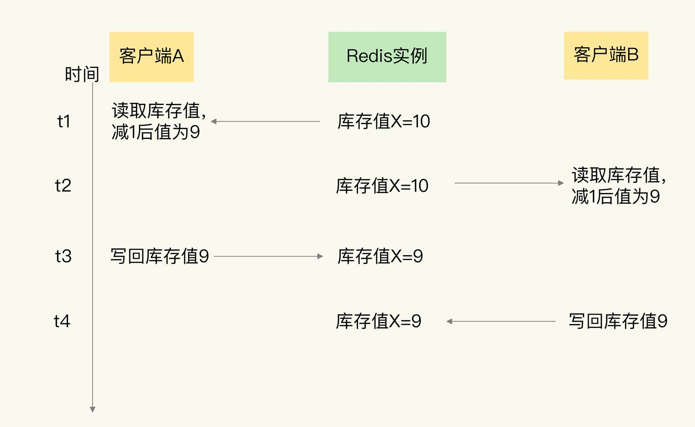

可以看到，客户端 A 在 t1 时读取库存值 10 并扣减 1，在 t2 时，客户端 A 还没有把扣减后的库存值 9 写回 Redis，而在此时，客户端 B 读到库存值 10，也扣减了 1，B 记录的库存值也为 9 了。等到 t3 时，A 往 Redis 写回了库存值 9，而到 t4 时，B 也写回了库存值 9。

如果按正确的逻辑处理，客户端 A 和 B 对库存值各做了一次扣减，库存值应该为 8。所以，这里的库存值明显更新错了。

出现这个现象的原因是，临界区代码中的客户端读取数据、更新数据、再写回数据涉及了三个操作，而这三个操作在执行时并不具有互斥性，多个客户端基于相同的初始值进行修改，而不是基于前一个客户端修改后的值再修改。

为了保证数据并发修改的正确性，我们可以用锁把并行操作变成串行操作，串行操作就具有互斥性。一个客户端持有锁后，其他客户端只能等到锁释放，才能拿锁再进行修改。

下面的伪代码显示了使用锁来控制临界区代码的执行情况，你可以看下。

```
LOCK()

current = GET(id)

current--

SET(id, current)

UNLOCK()
```

**虽然加锁保证了互斥性，但是加锁也会导致系统并发性能降低。**

如下图所示，当客户端 A 加锁执行操作时，客户端 B、C 就需要等待。A 释放锁后，假设 B 拿到锁，那么 C 还需要继续等待，所以，t1 时段内只有 A 能访问共享数据，t2 时段内只有 B 能访问共享数据，系统的并发性能当然就下降了。

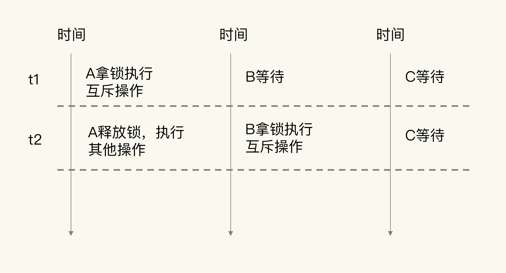

和加锁类似，原子操作也能实现并发控制，但是原子操作对系统并发性能的影响较小，接下来，我们就来了解下 Redis 中的原子操作。


### Redis 的两种原子操作方法

**为了实现并发控制要求的临界区代码互斥执行，Redis 的原子操作采用了两种方法：**

- **把多个操作在 Redis 中实现成一个操作，也就是单命令操作；**
- **把多个操作写到一个 Lua 脚本中，以原子性方式执行单个 Lua 脚本。**

我们先来看下 Redis 本身的单命令操作。

Redis 是使用单线程来串行处理客户端的请求操作命令的，所以，当 Redis 执行某个命令操作时，其他命令是无法执行的，这相当于命令操作是互斥执行的。当然，Redis 的快照生成、AOF 重写这些操作，可以使用后台线程或者是子进程执行，也就是和主线程的操作并行执行。不过，这些操作只是读取数据，不会修改数据，所以，我们并不需要对它们做并发控制。

你可能也注意到了，虽然 Redis 的单个命令操作可以原子性地执行，但是在实际应用中，数据修改时可能包含多个操作，至少包括读数据、数据增减、写回数据三个操作，这显然就不是单个命令操作了，那该怎么办呢？

别担心，**Redis 提供了 INCR/DECR 命令，把这三个操作转变为一个原子操作了。INCR/DECR 命令可以对数据进行增值 / 减值操作，而且它们本身就是单个命令操作，Redis 在执行它们时，本身就具有互斥性。**

比如说，在刚才的库存扣减例子中，客户端可以使用下面的代码，直接完成对商品 id 的库存值减 1 操作。即使有多个客户端执行下面的代码，也不用担心出现库存值扣减错误的问题。

``` 
DECR id 
```

**所以，如果我们执行的 RMW 操作是对数据进行增减值的话（只是修改商品数量），Redis 提供的原子操作 INCR 和 DECR 可以直接帮助我们进行并发控制。**

但是，如果我们要执行的操作不是简单地增减数据，而是有更加复杂的判断逻辑或者是其他操作，那么，Redis 的单命令操作已经无法保证多个操作的互斥执行了。所以，这个时候，我们需要使用第二个方法，也就是 Lua 脚本。

Redis 会把整个 Lua 脚本作为一个整体执行，在执行的过程中不会被其他命令打断，从而保证了 Lua 脚本中操作的原子性。如果我们有多个操作要执行，但是又无法用 INCR/DECR 这种命令操作来实现，就可以把这些要执行的操作编写到一个 Lua 脚本中。然后，我们可以使用 Redis 的 EVAL 命令来执行脚本。这样一来，这些操作在执行时就具有了互斥性。

我再给你举个例子，来具体解释下 Lua 的使用。

当一个业务应用的访问用户增加时，我们有时需要限制某个客户端在一定时间范围内的访问次数，比如爆款商品的购买限流、社交网络中的每分钟点赞次数限制等。

那该怎么限制呢？我们可以把客户端 IP 作为 key，把客户端的访问次数作为 value，保存到 Redis 中。客户端每访问一次后，我们就用 INCR 增加访问次数。

不过，在这种场景下，客户端限流其实同时包含了对访问次数和时间范围的限制，例如每分钟的访问次数不能超过 20。所以，我们可以在客户端第一次访问时，给对应键值对设置过期时间，例如设置为 60s 后过期。同时，在客户端每次访问时，我们读取客户端当前的访问次数，如果次数超过阈值，就报错，限制客户端再次访问。你可以看下下面的这段代码，它实现了对客户端每分钟访问次数不超过 20 次的限制。

```
//获取ip对应的访问次数
current = GET(ip)

//如果超过访问次数超过20次，则报错
IF current != NULL AND current > 20 THEN
  ERROR "exceed 20 accesses per second"
ELSE
   //如果访问次数不足20次，增加一次访问计数
  value = INCR(ip)
   //如果是第一次访问，将键值对的过期时间设置为60s后
  IF value == 1 THEN
	   EXPIRE(ip,60)
  END
   //执行其他操作
  DO THINGS
END
```

可以看到，在这个例子中，我们已经使用了 INCR 来原子性地增加计数。但是，客户端限流的逻辑不只有计数，还包括访问次数判断和过期时间设置。

对于这些操作，我们同样需要保证它们的原子性。否则，如果客户端使用多线程访问，访问次数初始值为 0，第一个线程执行了 INCR(ip) 操作后，第二个线程紧接着也执行了 INCR(ip)，此时，ip 对应的访问次数就被增加到了 2，我们就无法再对这个 ip 设置过期时间了。这样就会导致，这个 ip 对应的客户端访问次数达到 20 次之后，就无法再进行访问了。即使过了 60s，也不能再继续访问，显然不符合业务要求。

所以，这个例子中的操作无法用 Redis 单个命令来实现，**此时，我们就可以使用 Lua 脚本来保证并发控制。我们可以把访问次数加 1、判断访问次数是否为 1，以及设置过期时间这三个操作写入一个 Lua 脚本，**如下所示：

```lua
local current
current = redis.call("incr",KEYS[1])
if tonumber(current) == 1 then
  redis.call("expire",KEYS[1],60)
end
```

假设我们编写的脚本名称为 lua.script，我们接着就可以使用 Redis 客户端，带上 eval 选项，来执行该脚本。脚本所需的参数将通过以下命令中的 keys 和 args 进行传递。

```
redis-cli --eval lua.script keys , args
```

这样一来，访问次数加 1、判断访问次数是否为 1，以及设置过期时间这三个操作就可以原子性地执行了。即使客户端有多个线程同时执行这个脚本，Redis 也会依次串行执行脚本代码，避免了并发操作带来的数据错误。


### 小结

在并发访问时，并发的 RMW 操作会导致数据错误，所以需要进行并发控制。所谓并发控制，就是要保证临界区代码的互斥执行。

**Redis 提供了两种原子操作的方法来实现并发控制，分别是单命令操作和 Lua 脚本。因为原子操作本身不会对太多的资源限制访问，可以维持较高的系统并发性能。**

但是，单命令原子操作的适用范围较小，并不是所有的 RMW 操作都能转变成单命令的原子操作（例如 INCR/DECR 命令只能在读取数据后做原子增减），当我们需要对读取的数据做更多判断，或者是我们对数据的修改不是简单的增减时，单命令操作就不适用了。

而 Redis 的 Lua 脚本可以包含多个操作，这些操作都会以原子性的方式执行，绕开了单命令操作的限制。不过，如果把很多操作都放在 Lua 脚本中原子执行，会导致 Redis 执行脚本的时间增加，同样也会降低 Redis 的并发性能。所以，我给你一个小建议：在编写 Lua 脚本时，你要避免把不需要做并发控制的操作写入脚本中。

当然，加锁也能实现临界区代码的互斥执行，只是如果有多个客户端加锁时，就需要分布式锁的支持了。所以，下节课，我就来和你聊聊分布式锁的实现。


## 如何使用Redis实现分布式锁？

上节课，我提到，在应对并发问题时，除了原子操作，Redis 客户端还可以通过加锁的方式，来控制并发写操作对共享数据的修改，从而保证数据的正确性。

但是，Redis 属于分布式系统，当有多个客户端需要争抢锁时，我们必须要保证，这把锁不能是某个客户端本地的锁。否则的话，其它客户端是无法访问这把锁的，当然也就不能获取这把锁了。

所以，在分布式系统中，当有多个客户端需要获取锁时，我们需要分布式锁。此时，锁是保存在一个共享存储系统中的，可以被多个客户端共享访问和获取。

Redis 本身可以被多个客户端共享访问，正好就是一个共享存储系统，可以用来保存分布式锁。而且 Redis 的读写性能高，可以应对高并发的锁操作场景。所以，这节课，我就来和你聊聊如何基于 Redis 实现分布式锁。

我们日常在写程序的时候，经常会用到单机上的锁，你应该也比较熟悉了。而分布式锁和单机上的锁既有相似性，但也因为分布式锁是用在分布式场景中，所以又具有一些特殊的要求。

所以，接下来，我就先带你对比下分布式锁和单机上的锁，找出它们的联系与区别，这样就可以加深你对分布式锁的概念和实现要求的理解。


### 单机上的锁和分布式锁的联系与区别

我们先来看下单机上的锁。对于在单机上运行的多线程程序来说，锁本身可以用一个变量表示。

- 变量值为 0 时，表示没有线程获取锁；

- 变量值为 1 时，表示已经有线程获取到锁了。

我们通常说的线程调用加锁和释放锁的操作，到底是啥意思呢？我来解释一下。实际上，一个线程调用加锁操作，其实就是检查锁变量值是否为 0。如果是 0，就把锁的变量值设置为 1，表示获取到锁，如果不是 0，就返回错误信息，表示加锁失败，已经有别的线程获取到锁了。而一个线程调用释放锁操作，其实就是将锁变量的值置为 0，以便其它线程可以来获取锁。

我用一段代码来展示下加锁和释放锁的操作，其中，lock 为锁变量。

```
acquire_lock(){
 if lock == 0
   lock = 1
   return 1
 else
   return 0
} 

release_lock(){
 lock = 0
 return 1
}
```

**和单机上的锁类似，分布式锁同样可以用一个变量来实现。客户端加锁和释放锁的操作逻辑，也和单机上的加锁和释放锁操作逻辑一致：加锁时同样需要判断锁变量的值，根据锁变量值来判断能否加锁成功；释放锁时需要把锁变量值设置为 0，表明客户端不再持有锁。**

**但是，和线程在单机上操作锁不同的是，在分布式场景下，锁变量需要由一个共享存储系统来维护，只有这样，多个客户端才可以通过访问共享存储系统来访问锁变量。相应的，加锁和释放锁的操作就变成了读取、判断和设置共享存储系统中的锁变量值。**

这样一来，我们就可以得出实现分布式锁的两个要求。

- 要求一：分布式锁的加锁和释放锁的过程，涉及多个操作。**所以，在实现分布式锁时，我们需要保证这些锁操作的原子性；**

- 要求二：共享存储系统保存了锁变量，如果共享存储系统发生故障或宕机，那么客户端也就无法进行锁操作了。**在实现分布式锁时，我们需要考虑保证共享存储系统的可靠性，进而保证锁的可靠性。**

好了，知道了具体的要求，接下来，我们就来学习下 Redis 是怎么实现分布式锁的。

其实，我们既可以基于单个 Redis 节点来实现，也可以使用多个 Redis 节点实现。在这两种情况下，锁的可靠性是不一样的。我们先来看基于单个 Redis 节点的实现方法。


### 基于单个 Redis 节点实现分布式锁

作为分布式锁实现过程中的共享存储系统，Redis 可以使用键值对来保存锁变量，再接收和处理不同客户端发送的加锁和释放锁的操作请求。那么，键值对的键和值具体是怎么定的呢？

**我们要赋予锁变量一个变量名，把这个变量名作为键值对的键，而锁变量的值，则是键值对的值，这样一来，Redis 就能保存锁变量了，客户端也就可以通过 Redis 的命令操作来实现锁操作。**

为了帮助你理解，我画了一张图片，它展示 Redis 使用键值对保存锁变量，以及两个客户端同时请求加锁的操作过程。

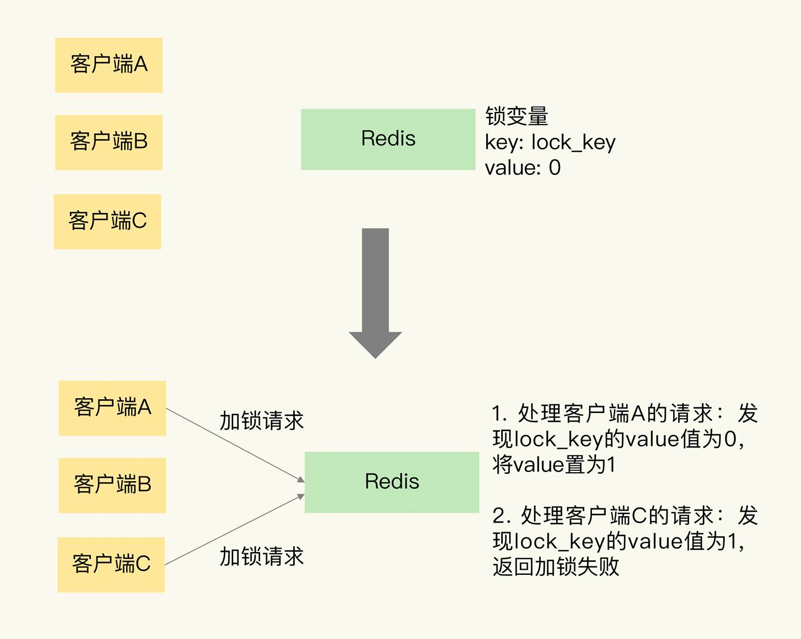

可以看到，Redis 可以使用一个键值对 lock_key:0 来保存锁变量，其中，键是 lock_key，也是锁变量的名称，锁变量的初始值是 0。

我们再来分析下加锁操作。

在图中，客户端 A 和 C 同时请求加锁。**因为 Redis 使用单线程处理请求，所以，即使客户端 A 和 C 同时把加锁请求发给了 Redis，Redis 也会串行处理它们的请求。**

我们假设 Redis 先处理客户端 A 的请求，读取 lock_key 的值，发现 lock_key 为 0，所以，Redis 就把 lock_key 的 value 置为 1，表示已经加锁了。紧接着，Redis 处理客户端 C 的请求，此时，Redis 会发现 lock_key 的值已经为 1 了，所以就返回加锁失败的信息。

刚刚说的是加锁的操作，那释放锁该怎么操作呢？其实，释放锁就是直接把锁变量值设置为 0。

我还是借助一张图片来解释一下。这张图片展示了客户端 A 请求释放锁的过程。当客户端 A 持有锁时，锁变量 lock_key 的值为 1。客户端 A 执行释放锁操作后，Redis 将 lock_key 的值置为 0，表明已经没有客户端持有锁了。


**因为加锁包含了三个操作（读取锁变量、判断锁变量值以及把锁变量值设置为 1），而这三个操作在执行时需要保证原子性。那怎么保证原子性呢？**

上节课，我们学过，要想保证操作的原子性，有两种通用的方法，分别是使用 Redis 的单命令操作和使用 Lua 脚本。那么，在分布式加锁场景下，该怎么应用这两个方法呢？

我们先来看下，Redis 可以用哪些单命令操作实现加锁操作。

- 首先是 `SETNX` 命令，它用于设置键值对的值。具体来说，就是这个命令在执行时会判断键值对是否存在，如果不存在，就设置键值对的值，如果存在，就不做任何设置。

举个例子，如果执行下面的命令时，key 不存在，那么 key 会被创建，并且值会被设置为 value；如果 key 已经存在，SETNX 不做任何赋值操作。

```
SETNX key value
```

对于释放锁操作来说，我们可以在执行完业务逻辑后，使用 DEL 命令删除锁变量。不过，你不用担心锁变量被删除后，其他客户端无法请求加锁了。因为 SETNX 命令在执行时，如果要设置的键值对（也就是锁变量）不存在，SETNX 命令会先创建键值对，然后设置它的值。所以，释放锁之后，再有客户端请求加锁时，SETNX 命令会创建保存锁变量的键值对，并设置锁变量的值，完成加锁。

总结来说，我们就可以用 SETNX 和 DEL 命令组合来实现加锁和释放锁操作。下面的伪代码示例显示了锁操作的过程，你可以看下。

```
// 加锁
SETNX lock_key 1

// 业务逻辑
DO THINGS

// 释放锁
DEL lock_key
```

不过，使用 SETNX 和 DEL 命令组合实现分布锁，存在两个潜在的风险。

- **第一个风险是，假如某个客户端在执行了 SETNX 命令、加锁之后，紧接着却在操作共享数据时发生了异常，结果一直没有执行最后的 DEL 命令释放锁。**因此，锁就一直被这个客户端持有，其它客户端无法拿到锁，也无法访问共享数据和执行后续操作，这会给业务应用带来影响。针对这个问题，**一个有效的解决方法是，给锁变量设置一个过期时间。**这样一来，即使持有锁的客户端发生了异常，无法主动地释放锁，Redis 也会根据锁变量的过期时间，在锁变量过期后，把它删除。其它客户端在锁变量过期后，就可以重新请求加锁，这就不会出现无法加锁的问题了。

- **我们再来看第二个风险。如果客户端 A 执行了 SETNX 命令加锁后，假设客户端 B 执行了 DEL 命令释放锁，此时，客户端 A 的锁就被误释放了。**如果客户端 C 正好也在申请加锁，就可以成功获得锁，进而开始操作共享数据。这样一来，客户端 A 和 C 同时在对共享数据进行操作，数据就会被修改错误，这也是业务层不能接受的。

为了应对这个问题，我们需要能区分来自不同客户端的锁操作，具体咋做呢？其实，我们可以在锁变量的值上想想办法。

在使用 SETNX 命令进行加锁的方法中，我们通过把锁变量值设置为 1 或 0，表示是否加锁成功。1 和 0 只有两种状态，无法表示究竟是哪个客户端进行的锁操作。**所以，我们在加锁操作时，可以让每个客户端给锁变量设置一个唯一值，这里的唯一值就可以用来标识当前操作的客户端。**在释放锁操作时，客户端需要判断，当前锁变量的值是否和自己的唯一标识相等，只有在相等的情况下，才能释放锁。这样一来，就不会出现误释放锁的问题了。

知道了解决方案，那么，在 Redis 中，具体是怎么实现的呢？我们再来了解下。

在查看具体的代码前，我要先带你学习下 Redis 的 SET 命令。

我们刚刚在说 SETNX 命令的时候提到，对于不存在的键值对，它会先创建再设置值（也就是“不存在即设置”），为了能达到和 SETNX 命令一样的效果，Redis 给 SET 命令提供了类似的选项 NX，用来实现“不存在即设置”。**如果使用了 NX 选项，SET 命令只有在键值对不存在时，才会进行设置，否则不做赋值操作。此外，SET 命令在执行时还可以带上 EX 或 PX 选项，用来设置键值对的过期时间。**

举个例子，执行下面的命令时，只有 key 不存在时，SET 才会创建 key，并对 key 进行赋值。另外，key 的存活时间由 seconds 或者 milliseconds 选项值来决定。

```
SET key value [EX seconds | PX milliseconds] [NX]
// 有了 SET 命令的 NX 和 EX/PX 选项后，我们就可以用下面的命令来实现加锁操作了。
// 加锁, unique_value作为客户端唯一性的标识

SET lock_key unique_value NX PX 10000
```

其中，unique_value 是客户端的唯一标识，可以用一个随机生成的字符串来表示，PX 10000 则表示 lock_key 会在 10s 后过期，以免客户端在这期间发生异常而无法释放锁。

因为在加锁操作中，每个客户端都使用了一个唯一标识，所以在释放锁操作时，我们需要判断锁变量的值，是否等于执行释放锁操作的客户端的唯一标识，如下所示：

```lua
//释放锁 比较unique_value是否相等，避免误释放
if redis.call("get",KEYS[1]) == ARGV[1] then
   return redis.call("del",KEYS[1])
else
   return 0
end
```

这是使用 Lua 脚本（unlock.script）实现的释放锁操作的伪代码，其中，KEYS[1]表示 lock_key，ARGV[1]是当前客户端的唯一标识，这两个值都是我们在执行 Lua 脚本时作为参数传入的。

最后，我们执行下面的命令，就可以完成锁释放操作了。

```redis
redis-cli --eval unlock.script lock_key , unique_value 
```

你可能也注意到了，在释放锁操作中，我们使用了 Lua 脚本，这是因为，释放锁操作的逻辑也包含了读取锁变量、判断值、删除锁变量的多个操作，而 Redis 在执行 Lua 脚本时，可以以原子性的方式执行，从而保证了锁释放操作的原子性。

好了，到这里，你了解了如何使用 SET 命令和 Lua 脚本在 Redis 单节点上实现分布式锁。但是，我们现在只用了一个 Redis 实例来保存锁变量，如果这个 Redis 实例发生故障宕机了，那么锁变量就没有了。此时，客户端也无法进行锁操作了，这就会影响到业务的正常执行。所以，我们在实现分布式锁时，还需要保证锁的可靠性。那怎么提高呢？这就要提到基于多个 Redis 节点实现分布式锁的方式了。


### 基于多个 Redis 节点实现高可靠的分布式锁

当我们要实现高可靠的分布式锁时，就不能只依赖单个的命令操作了，我们需要按照一定的步骤和规则进行加解锁操作，否则，就可能会出现锁无法工作的情况。“一定的步骤和规则”是指啥呢？其实就是分布式锁的算法。

为了避免 Redis 实例故障而导致的锁无法工作的问题，Redis 的开发者 Antirez 提出了分布式锁算法 Redlock。

**Redlock 算法的基本思路，是让客户端和多个独立的 Redis 实例依次请求加锁，如果客户端能够和半数以上的实例成功地完成加锁操作，那么我们就认为，客户端成功地获得分布式锁了，否则加锁失败。这样一来，即使有单个 Redis 实例发生故障，因为锁变量在其它实例上也有保存，所以，客户端仍然可以正常地进行锁操作，锁变量并不会丢失。**

我们来具体看下 Redlock 算法的执行步骤。Redlock 算法的实现需要有 N 个独立的 Redis 实例。接下来，我们可以分成 3 步来完成加锁操作。

- 第一步是，客户端获取当前时间。

- 第二步是，客户端按顺序依次向 N 个 Redis 实例执行加锁操作。

这里的加锁操作和在单实例上执行的加锁操作一样，使用 SET 命令，带上 NX，EX/PX 选项，以及带上客户端的唯一标识。当然，如果某个 Redis 实例发生故障了，为了保证在这种情况下，Redlock 算法能够继续运行，我们需要给加锁操作设置一个超时时间。

如果客户端在和一个 Redis 实例请求加锁时，一直到超时都没有成功，那么此时，客户端会和下一个 Redis 实例继续请求加锁。**加锁操作的超时时间需要远远地小于锁的有效时间，一般也就是设置为几十毫秒。**

- 第三步是，一旦客户端完成了和所有 Redis 实例的加锁操作，客户端就要计算整个加锁过程的总耗时。

**客户端只有在满足下面的这两个条件时，才能认为是加锁成功。**

- 条件一：客户端从超过半数（大于等于 N/2+1）的 Redis 实例上成功获取到了锁；

- 条件二：客户端获取锁的总耗时没有超过锁的有效时间。

在满足了这两个条件后，我们需要重新计算这把锁的有效时间，计算的结果是锁的最初有效时间减去客户端为获取锁的总耗时。如果锁的有效时间已经来不及完成共享数据的操作了，我们可以释放锁，以免出现还没完成数据操作，锁就过期了的情况。

当然，如果客户端在和所有实例执行完加锁操作后，没能同时满足这两个条件，那么，客户端向所有 Redis 节点发起释放锁的操作。

在 Redlock 算法中，释放锁的操作和在单实例上释放锁的操作一样，只要执行释放锁的 Lua 脚本就可以了。这样一来，只要 N 个 Redis 实例中的半数以上实例能正常工作，就能保证分布式锁的正常工作了。

所以，在实际的业务应用中，如果你想要提升分布式锁的可靠性，就可以通过 Redlock 算法来实现。


### 小结

分布式锁是由共享存储系统维护的变量，多个客户端可以向共享存储系统发送命令进行加锁或释放锁操作。Redis 作为一个共享存储系统，可以用来实现分布式锁。

在基于单个 Redis 实例实现分布式锁时，对于加锁操作，我们需要满足三个条件。

加锁包括了读取锁变量、检查锁变量值和设置锁变量值三个操作，但需要以原子操作的方式完成，所以，我们使用 SET 命令带上 NX 选项来实现加锁；

锁变量需要设置过期时间，以免客户端拿到锁后发生异常，导致锁一直无法释放，所以，我们在 SET 命令执行时加上 EX/PX 选项，设置其过期时间；

锁变量的值需要能区分来自不同客户端的加锁操作，以免在释放锁时，出现误释放操作，所以，我们使用 SET 命令设置锁变量值时，每个客户端设置的值是一个唯一值，用于标识客户端。

和加锁类似，释放锁也包含了读取锁变量值、判断锁变量值和删除锁变量三个操作，不过，我们无法使用单个命令来实现，所以，我们可以采用 Lua 脚本执行释放锁操作，通过 Redis 原子性地执行 Lua 脚本，来保证释放锁操作的原子性。

不过，基于单个 Redis 实例实现分布式锁时，会面临实例异常或崩溃的情况，这会导致实例无法提供锁操作，正因为此，Redis 也提供了 Redlock 算法，用来实现基于多个实例的分布式锁。这样一来，锁变量由多个实例维护，即使有实例发生了故障，锁变量仍然是存在的，客户端还是可以完成锁操作。Redlock 算法是实现高可靠分布式锁的一种有效解决方案，你可以在实际应用中把它用起来。


## 事务机制：Redis能实现ACID属性吗？ 

事务是数据库的一个重要功能。**所谓的事务，就是指对数据进行读写的一系列操作。事务在执行时，会提供专门的属性保证，包括原子性（Atomicity）、一致性（Consistency）、隔离性（Isolation）和持久性（Durability），也就是 ACID 属性。这些属性既包括了对事务执行结果的要求，也有对数据库在事务执行前后的数据状态变化的要求。**

那么，Redis 可以完全保证 ACID 属性吗？毕竟，如果有些属性在一些场景下不能保证的话，很可能会导致数据出错，所以，我们必须要掌握 Redis 对这些属性的支持情况，并且提前准备应对策略。

接下来，我们就先了解 ACID 属性对事务执行的具体要求，有了这个知识基础后，我们才能准确地判断 Redis 的事务机制能否保证 ACID 属性。


## 事务 ACID 属性的要求

首先来看原子性。**原子性的要求很明确，就是一个事务中的多个操作必须都完成，或者都不完成。**业务应用使用事务时，原子性也是最被看重的一个属性。

我给你举个例子。假如用户在一个订单中购买了两个商品 A 和 B，那么，数据库就需要把这两个商品的库存都进行扣减。如果只扣减了一个商品的库存，那么，这个订单完成后，另一个商品的库存肯定就错了。

第二个属性是一致性。这个很容易理解，**就是指数据库中的数据在事务执行前后是一致的。（对于同样的语句，使用事务与否结果都一样）**

第三个属性是隔离性。**它要求数据库在执行一个事务时，其它操作无法存取到正在执行事务访问的数据。**

我还是借助用户下单的例子给你解释下。假设商品 A 和 B 的现有库存分别是 5 和 10，用户 X 对 A、B 下单的数量分别是 3、6。如果事务不具备隔离性，在用户 X 下单事务执行的过程中，用户 Y 一下子也购买了 5 件 B，这和 X 购买的 6 件 B 累加后，就超过 B 的总库存值了，这就不符合业务要求了。

最后一个属性是持久性。**数据库执行事务后，数据的修改要被持久化保存下来。当数据库重启后，数据的值需要是被修改后的值。**

了解了 ACID 属性的具体要求后，我们再来看下 Redis 是如何实现事务机制的。


## Redis 如何实现事务？

事务的执行过程包含三个步骤，Redis 提供了 `MULTI、EXEC` 两个命令来完成这三个步骤。下面我们来分析下。

- 第一步，客户端要使用一个命令显式地表示一个事务的开启。在 Redis 中，这个命令就是 MULTI。

- 第二步，客户端把事务中本身要执行的具体操作（例如增删改数据）发送给服务器端。这些操作就是 Redis 本身提供的数据读写命令，例如 GET、SET 等。不过，**这些命令虽然被客户端发送到了服务器端，但 Redis 实例只是把这些命令暂存到一个命令队列中，并不会立即执行。**

- 第三步，客户端向服务器端发送提交事务的命令，让数据库实际执行第二步中发送的具体操作。Redis 提供的 EXEC 命令就是执行事务提交的。**当服务器端收到 EXEC 命令后，才会实际执行命令队列中的所有命令。**

下面的代码就显示了使用 MULTI 和 EXEC 执行一个事务的过程，你可以看下。

```
\#开启事务
127.0.0.1:6379> MULTI
OK

\#将a:stock减1，
127.0.0.1:6379> DECR a:stock
QUEUED

\#将b:stock减1
127.0.0.1:6379> DECR b:stock
QUEUED

\#实际执行事务
127.0.0.1:6379> EXEC
\1) (integer) 4
\2) (integer) 9
```

我们假设 a:stock、b:stock 两个键的初始值是 5 和 10。在 MULTI 命令后执行的两个 DECR 命令，是把 a:stock、b:stock 两个键的值分别减 1，它们执行后的返回结果都是 QUEUED，这就表示，这些操作都被暂存到了命令队列，还没有实际执行。等到执行了 EXEC 命令后，可以看到返回了 4、9，这就表明，两个 DECR 命令已经成功地执行了。

好了，通过使用 MULTI 和 EXEC 命令，我们可以实现多个操作的共同执行，但是这符合事务要求的 ACID 属性吗？接下来，我们就来具体分析下。


# Redis 的事务机制能保证哪些属性？

原子性是事务操作最重要的一个属性，所以，我们先来分析下 Redis 事务机制能否保证原子性。


## 原子性

如果事务正常执行，没有发生任何错误，那么，MULTI 和 EXEC 配合使用，就可以保证多个操作都完成。但是，如果事务执行发生错误了，原子性还能保证吗？我们需要分三种情况来看。

**第一种情况是，在执行 EXEC 命令前，客户端发送的操作命令本身就有错误（比如语法错误，使用了不存在的命令），在命令入队时就被 Redis 实例判断出来了。**

对于这种情况，**在命令入队时，Redis 就会报错并且记录下这个错误。此时，我们还能继续提交命令操作。等到执行了 EXEC 命令之后，Redis 就会拒绝执行所有提交的命令操作，返回事务失败的结果**。这样一来，事务中的所有命令都不会再被执行了，保证了原子性。

我们来看一个因为事务操作入队时发生错误，而导致事务失败的小例子。

```
\#开启事务
127.0.0.1:6379> MULTI
OK

\#发送事务中的第一个操作，但是Redis不支持该命令，返回报错信息
127.0.0.1:6379> PUT a:stock 5
(error) ERR unknown command `PUT`, with args beginning with: `a:stock`, `5`, 

\#发送事务中的第二个操作，这个操作是正确的命令，Redis把该命令入队
127.0.0.1:6379> DECR b:stock
QUEUED

\#实际执行事务，但是之前命令有错误，所以Redis拒绝执行
127.0.0.1:6379> EXEC
(error) EXECABORT Transaction discarded because of previous errors.
```

在这个例子中，事务里包含了一个 Redis 本身就不支持的 PUT 命令，所以，在 PUT 命令入队时，Redis 就报错了。虽然，事务里还有一个正确的 DECR 命令，但是，在最后执行 EXEC 命令后，整个事务被放弃执行了。

**我们再来看第二种情况。**

**和第一种情况不同的是，事务操作入队时，命令和操作的数据类型不匹配，但 Redis 实例没有检查出错误。但是，在执行完 EXEC 命令以后，Redis 实际执行这些事务操作时，就会报错。不过，需要注意的是，虽然 Redis 会对错误命令报错，但还是会把正确的命令执行完。在这种情况下，事务的原子性就无法得到保证了。**

举个小例子。事务中的 LPOP 命令对 String 类型数据进行操作，入队时没有报错，但是，在 EXEC 执行时报错了。LPOP 命令本身没有执行成功，但是事务中的 DECR 命令却成功执行了。

```
\#开启事务
127.0.0.1:6379> MULTI
OK

\#发送事务中的第一个操作，LPOP命令操作的数据类型不匹配，此时并不报错
127.0.0.1:6379> LPOP a:stock
QUEUED

\#发送事务中的第二个操作
127.0.0.1:6379> DECR b:stock
QUEUED

\#实际执行事务，事务第一个操作执行报错
127.0.0.1:6379> EXEC
\1) (error) WRONGTYPE Operation against a key holding the wrong kind of value
\2) (integer) 8
```

看到这里，你可能有个疑问，传统数据库（例如 MySQL）在执行事务时，会提供回滚机制，当事务执行发生错误时，事务中的所有操作都会撤销，已经修改的数据也会被恢复到事务执行前的状态，那么，在刚才的例子中，如果命令实际执行时报错了，是不是可以用回滚机制恢复原来的数据呢？

**其实，Redis 中并没有提供回滚机制。虽然 Redis 提供了 DISCARD 命令，但是，这个命令只能用来主动放弃事务执行，把暂存的命令队列清空，起不到回滚的效果。**

DISCARD 命令具体怎么用呢？我们来看下下面的代码。

```
\#读取a:stock的值4
127.0.0.1:6379> GET a:stock
"4"

\#开启事务
127.0.0.1:6379> MULTI 
OK

\#发送事务的第一个操作，对a:stock减1
127.0.0.1:6379> DECR a:stock
QUEUED

\#执行DISCARD命令，主动放弃事务
127.0.0.1:6379> DISCARD
OK

\#再次读取a:stock的值，值没有被修改
127.0.0.1:6379> GET a:stock
"4"
```

这个例子中，a:stock 键的值一开始为 4，然后，我们执行一个事务，想对 a:stock 的值减 1。但是，在事务的最后，我们执行的是 DISCARD 命令，所以事务就被放弃了。我们再次查看 a:stock 的值，会发现仍然为 4。

**最后，我们再来看下第三种情况：在执行事务的 EXEC 命令时，Redis 实例发生了故障，导致事务执行失败。**

**在这种情况下，如果 Redis 开启了 AOF 日志，那么，只会有部分的事务操作被记录到 AOF 日志中。我们需要使用 redis-check-aof 工具检查 AOF 日志文件，这个工具可以把已完成的事务操作从 AOF 文件中去除。这样一来，我们使用 AOF 恢复实例后，事务操作不会再被执行，从而保证了原子性。**

当然，如果 AOF 日志并没有开启，那么实例重启后，数据也都没法恢复了，此时，也就谈不上原子性了。

好了，到这里，你了解了 Redis 对事务原子性属性的保证情况，我们来简单小结下：

- **命令入队时就报错，会放弃事务执行，保证原子性；**

- **命令入队时没报错，实际执行时报错，不保证原子性；**

- **EXEC 命令执行时实例故障，如果开启了 AOF 日志，可以保证原子性。**

接下来，我们再来学习下一致性属性的保证情况。


## 一致性

事务的一致性保证会受到错误命令、实例故障的影响。所以，我们按照命令出错和实例故障的发生时机，分成三种情况来看。

- 情况一：命令入队时就报错

在这种情况下，事务本身就会被放弃执行，**所以可以保证数据库的一致性。**

- 情况二：命令入队时没报错，实际执行时报错

在这种情况下，有错误的命令不会被执行，正确的命令可以正常执行，**也不会改变数据库的一致性。**

- 情况三：EXEC 命令执行时实例发生故障

在这种情况下，实例故障后会进行重启，这就和数据恢复的方式有关了，我们要根据实例是否开启了 RDB 或 AOF 来分情况讨论下。

如果我们没有开启 RDB 或 AOF，那么，实例故障重启后，数据都没有了，数据库是一致的。

如果我们使用了 RDB 快照，因为 RDB 快照不会在事务执行时执行，所以，事务命令操作的结果不会被保存到 RDB 快照中，使用 RDB 快照进行恢复时，数据库里的数据也是一致的。

如果我们使用了 AOF 日志，而事务操作还没有被记录到 AOF 日志时，实例就发生了故障，那么，使用 AOF 日志恢复的数据库数据是一致的。如果只有部分操作被记录到了 AOF 日志，我们可以使用 redis-check-aof 清除事务中已经完成的操作，数据库恢复后也是一致的。

**所以，总结来说，在命令执行错误或 Redis 发生故障的情况下，Redis 事务机制对一致性属性是有保证的。接下来，我们再继续分析下隔离性。**


## 隔离性

事务的隔离性保证，会受到和事务一起执行的并发操作的影响。而事务执行又可以分成命令入队（EXEC 命令执行前）和命令实际执行（EXEC 命令执行后）两个阶段，所以，我们就针对这两个阶段，分成两种情况来分析：

- **并发操作在 EXEC 命令前执行，此时，隔离性的保证要使用 WATCH 机制来实现，否则隔离性无法保证；**

- **并发操作在 EXEC 命令后执行，此时，隔离性可以保证。**

我们先来看第一种情况。一个事务的 EXEC 命令还没有执行时，事务的命令操作是暂存在命令队列中的。此时，如果有其它的并发操作，我们就需要看事务是否使用了 WATCH 机制。

**WATCH 机制的作用是，在事务执行前，监控一个或多个键的值变化情况，当事务调用 EXEC 命令执行时，WATCH 机制会先检查监控的键是否被其它客户端修改了。如果修改了，就放弃事务执行，避免事务的隔离性被破坏。然后，客户端可以再次执行事务，此时，如果没有并发修改事务数据的操作了，事务就能正常执行，隔离性也得到了保证。**

WATCH 机制的具体实现是由 WATCH 命令实现的，我给你举个例子，你可以看下下面的图，进一步理解下 WATCH 命令的使用。

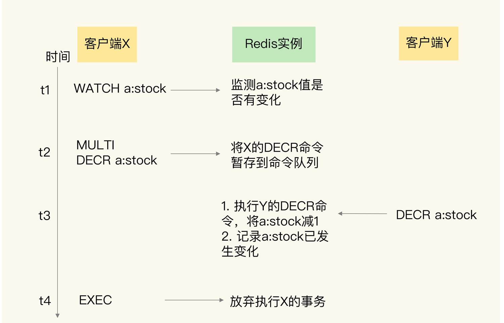

我来给你具体解释下图中的内容。

在 t1 时，客户端 X 向实例发送了 WATCH 命令。实例收到 WATCH 命令后，开始监测 a:stock 的值的变化情况。

紧接着，在 t2 时，客户端 X 把 MULTI 命令和 DECR 命令发送给实例，实例把 DECR 命令暂存入命令队列。

在 t3 时，客户端 Y 也给实例发送了一个 DECR 命令，要修改 a:stock 的值，实例收到命令后就直接执行了。

等到 t4 时，实例收到客户端 X 发送的 EXEC 命令，但是，实例的 WATCH 机制发现 a:stock 已经被修改了，就会放弃事务执行。这样一来，事务的隔离性就可以得到保证了。

**当然，如果没有使用 WATCH 机制，在 EXEC 命令前执行的并发操作是会对数据进行读写的。而且，在执行 EXEC 命令的时候，事务要操作的数据已经改变了，在这种情况下，Redis 并没有做到让事务对其它操作隔离，隔离性也就没有得到保障。**下面这张图显示了没有 WATCH 机制时的情况，你可以看下。

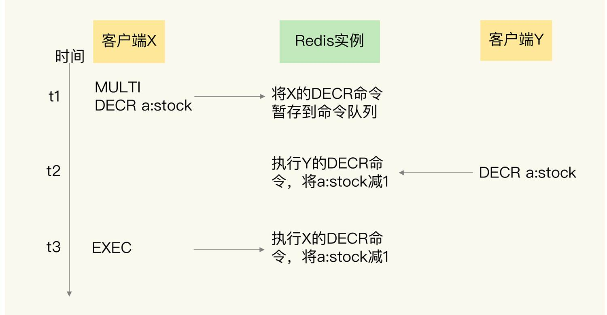

在 t2 时刻，客户端 X 发送的 EXEC 命令还没有执行，但是客户端 Y 的 DECR 命令就执行了，此时，a:stock 的值会被修改，这就无法保证 X 发起的事务的隔离性了。

刚刚说的是并发操作在 EXEC 命令前执行的情况，**下面我再来说一说第二种情况：并发操作在 EXEC 命令之后被服务器端接收并执行。**

因为 Redis 是用单线程执行命令，而且，EXEC 命令执行后，Redis 会保证先把命令队列中的所有命令执行完。所以，在这种情况下，并发操作不会破坏事务的隔离性，如下图所示：

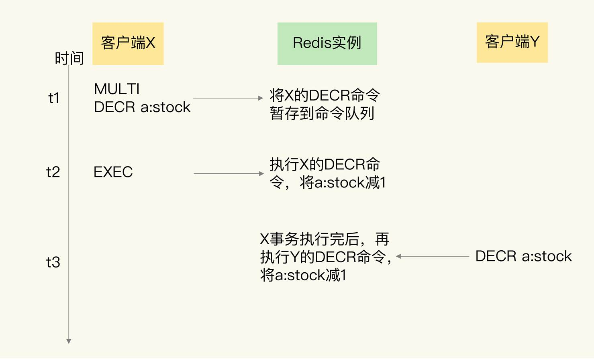

最后，我们来分析一下 Redis 事务的持久性属性保证情况。


## 持久性

因为 Redis 是内存数据库，所以，数据是否持久化保存完全取决于 Redis 的持久化配置模式。

**如果 Redis 没有使用 RDB 或 AOF，那么事务的持久化属性肯定得不到保证。如果 Redis 使用了 RDB 模式，那么，在一个事务执行后，而下一次的 RDB 快照还未执行前，如果发生了实例宕机，这种情况下，事务修改的数据也是不能保证持久化的。**

**如果 Redis 采用了 AOF 模式，因为 AOF 模式的三种配置选项 no、everysec 和 always 都会存在数据丢失的情况，所以，事务的持久性属性也还是得不到保证。**

所以，不管 Redis 采用什么持久化模式，事务的持久性属性是得不到保证的。


## 小结

在这节课上，我们学习了 Redis 中的事务实现。Redis 通过 MULTI、EXEC、DISCARD 和 WATCH 四个命令来支持事务机制，这 4 个命令的作用，我总结在下面的表中，你可以再看下。

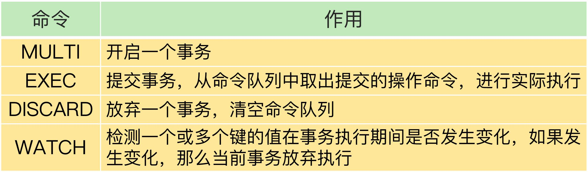

事务的 ACID 属性是我们使用事务进行正确操作的基本要求。通过这节课的分析，我们了解到了，Redis 的事务机制可以保证一致性和隔离性，但是无法保证持久性。不过，因为 Redis 本身是内存数据库，持久性并不是一个必须的属性，我们更加关注的还是原子性、一致性和隔离性这三个属性。

原子性的情况比较复杂，只有当事务中使用的命令语法有误时，原子性得不到保证，在其它情况下，事务都可以原子性执行。

所以，我给你一个小建议：严格按照 Redis 的命令规范进行程序开发，并且通过 code review 确保命令的正确性。这样一来，Redis 的事务机制就能被应用在实践中，保证多操作的正确执行。


# Redis 主从同步与故障切换，有哪些坑？ 

Redis 的主从同步机制不仅可以让从库服务更多的读请求，分担主库的压力，而且还能在主库发生故障时，进行主从库切换，提供高可靠服务。

不过，在实际使用主从机制的时候，我们很容易踩到一些坑。这节课，我就向你介绍 3 个坑，分别是主从数据不一致、读到过期数据，以及配置项设置得不合理从而导致服务挂掉。

一旦踩到这些坑，业务应用不仅会读到错误数据，而且很可能会导致 Redis 无法正常使用，我们必须要全面地掌握这些坑的成因，提前准备一套规避方案。不过，即使不小心掉进了陷阱里，也不要担心，我还会给你介绍相应的解决方案。

好了，话不多说，下面我们先来看看第一个坑：主从数据不一致。


## 主从数据不一致

**主从数据不一致，就是指客户端从从库中读取到的值和主库中的最新值并不一致。**

举个例子，假设主从库之前保存的用户年龄值是 19，但是主库接收到了修改命令，已经把这个数据更新为 20 了，但是，从库中的值仍然是 19。那么，如果客户端从从库中读取用户年龄值，就会读到旧值。

那为啥会出现这个坑呢？其实这是因为主从库间的命令复制是**异步**进行的。

具体来说，在主从库命令传播阶段，主库收到新的写命令后，会发送给从库。但是，主库并不会等到从库实际执行完命令后，再把结果返回给客户端，而是主库自己在本地执行完命令后，就会向客户端返回结果了。如果从库还没有执行主库同步过来的命令，主从库间的数据就不一致了。

那在什么情况下，从库会滞后执行同步命令呢？其实，这里主要有两个原因。

- **一方面，==主从库间的网络可能会有传输延迟==，所以从库不能及时地收到主库发送的命令，从库上执行同步命令的时间就会被延后。**

- **另一方面，即使从库及时收到了主库的命令，但是，也可能会==因为正在处理其它复杂度高的命令（例如集合操作命令）而阻塞==。此时，从库需要处理完当前的命令，才能执行主库发送的命令操作，这就会造成主从数据不一致。而在主库命令被滞后处理的这段时间内，主库本身可能又执行了新的写操作。这样一来，主从库间的数据不一致程度就会进一步加剧。**

那么，我们该怎么应对呢？我给你提供两种方法。

- **首先，在硬件环境配置方面，我们要尽量保证主从库间的网络连接状况良好。例如，我们要避免把主从库部署在不同的机房，或者是避免把网络通信密集的应用（例如数据分析应用）和 Redis 主从库部署在一起。**

- **另外，我们还可以开发一个外部程序来监控主从库间的复制进度。**

因为 Redis 的 INFO replication 命令可以查看主库接收写命令的进度信息（master_repl_offset）和从库复制写命令的进度信息（slave_repl_offset），所以，我们就可以开发一个监控程序，先用 INFO replication 命令查到主、从库的进度，然后，我们用 master_repl_offset 减去 slave_repl_offset，这样就能得到从库和主库间的复制进度差值了。

**如果某个从库的进度差值大于我们预设的阈值，我们可以让客户端不再和这个从库连接进行数据读取**，这样就可以减少读到不一致数据的情况。不过，为了避免出现客户端和所有从库都不能连接的情况，我们需要把复制进度差值的阈值设置得大一些。

我们在应用 Redis 时，可以周期性地运行这个流程来监测主从库间的不一致情况。为了帮助你更好地理解这个方法，我画了一张流程图，你可以看下。

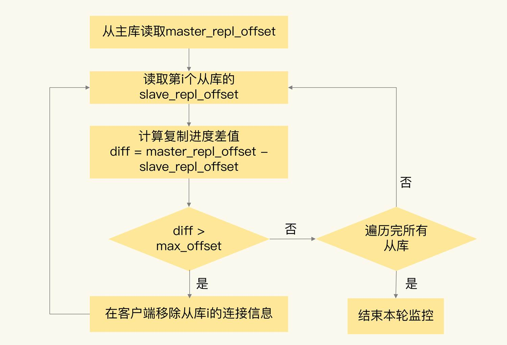

当然，监控程序可以一直监控着从库的复制进度，当从库的复制进度又赶上主库时，我们就允许客户端再次跟这些从库连接。

除了主从数据不一致以外，我们有时还会在从库中读到过期的数据，这是怎么回事呢？接下来，我们就来详细分析一下。


## 读取过期数据

我们在使用 Redis 主从集群时，有时会读到过期数据。例如，数据 X 的过期时间是 202010240900，但是客户端在 202010240910 时，仍然可以从从库中读到数据 X。一个数据过期后，应该是被删除的，客户端不能再读取到该数据，但是，Redis 为什么还能在从库中读到过期的数据呢？

其实，这是由 Redis 的过期数据删除策略引起的。我来给你具体解释下。

**Redis 同时使用了两种策略来删除过期的数据，分别是惰性删除策略和定期删除策略。**

- 先说惰性删除策略。**当一个数据的过期时间到了以后，并不会立即删除数据，而是等到再有请求来读写这个数据时，对数据进行检查，如果发现数据已经过期了，再删除这个数据。**

这个策略的好处是尽量减少删除操作对 CPU 资源的使用，对于用不到的数据，就不再浪费时间进行检查和删除了。但是，这个策略会导致大量已经过期的数据留存在内存中，占用较多的内存资源。所以，Redis 在使用这个策略的同时，还使用了第二种策略：定期删除策略。

- **定期删除策略是指，Redis 每隔一段时间（默认 100ms），就会随机选出一定数量的数据，检查它们是否过期，并把其中过期的数据删除，这样就可以及时释放一些内存。**

清楚了这两个删除策略，我们再来看看它们为什么会导致读取到过期数据。

首先，虽然定期删除策略可以释放一些内存，但是，Redis 为了避免过多删除操作对性能产生影响，每次随机检查数据的数量并不多。如果过期数据很多，并且一直没有再被访问的话，这些数据就会留存在 Redis 实例中。业务应用之所以会读到过期数据，这些留存数据就是一个重要因素。

其次，惰性删除策略实现后，数据只有被再次访问时，才会被实际删除。如果客户端从主库上读取留存的过期数据，主库会触发删除操作，此时，客户端并不会读到过期数据。**但是，从库本身不会执行删除操作，如果客户端在从库中访问留存的过期数据，从库并不会触发数据删除。那么，从库会给客户端返回过期数据吗？**

这就和你使用的 Redis 版本有关了。如果你使用的是 Redis 3.2 之前的版本，那么，从库在服务读请求时，并不会判断数据是否过期，而是会返回过期数据**。在 3.2 版本后，Redis 做了改进，如果读取的数据已经过期了，从库虽然不会删除，但是会返回空值，这就避免了客户端读到过期数据**。所以，在应用主从集群时，尽量使用 Redis 3.2 及以上版本。

你可能会问，只要使用了 Redis 3.2 后的版本，就不会读到过期数据了吗？其实还是会的。

为啥会这样呢？这跟 Redis 用于设置过期时间的命令有关系，有些命令给数据设置的过期时间在从库上可能会被延后，导致应该过期的数据又在从库上被读取到了，我来给你具体解释下。

我先给你介绍下这些命令。设置数据过期时间的命令一共有 4 个，我们可以把它们分成两类：

- **EXPIRE 和 PEXPIRE：它们给数据设置的是从命令执行时开始计算的存活时间；**

- **EXPIREAT 和 PEXPIREAT：它们会直接把数据的过期时间设置为具体的一个时间点。**

这 4 个命令的参数和含义如下表所示：

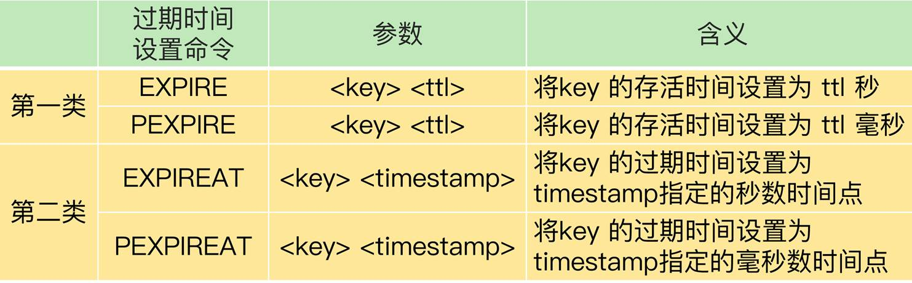

为了方便你理解，我给你举两个例子。

第一个例子是使用 EXPIRE 命令，当执行下面的命令时，我们就把 testkey 的过期时间设置为 60s 后。

```
EXPIRE testkey 60
```

第二个例子是使用 EXPIREAT 命令，例如，我们执行下面的命令，就可以让 testkey 在 2020 年 10 月 24 日上午 9 点过期，命令中的 1603501200 就是以秒数时间戳表示的 10 月 24 日上午 9 点。

```
EXPIREAT testkey 1603501200
```

好了，知道了这些命令，下面我们来看看这些命令如何导致读到过期数据。

当主从库全量同步时，如果主库接收到了一条 EXPIRE 命令，那么，主库会直接执行这条命令。这条命令会在全量同步完成后，发给从库执行。**而从库在执行时，就会在当前时间的基础上加上数据的存活时间，这样一来，从库上数据的过期时间就会比主库上延后了。**

这么说可能不太好理解，我再给你举个例子。

假设当前时间是 2020 年 10 月 24 日上午 9 点，主从库正在同步，主库收到了一条命令：`EXPIRE testkey 60`，这就表示，testkey 的过期时间就是 24 日上午 9 点 1 分，主库直接执行了这条命令。

但是，主从库全量同步花费了 2 分钟才完成。等从库开始执行这条命令时，时间已经是 9 点 2 分了。而 EXPIRE 命令是把 testkey 的过期时间设置为当前时间的 60s 后，也就是 9 点 3 分。如果客户端在 9 点 2 分 30 秒时在从库上读取 testkey，仍然可以读到 testkey 的值。但是，testkey 实际上已经过期了。

为了避免这种情况，**我给你的建议是，在业务应用中使用 EXPIREAT/PEXPIREAT 命令，把数据的过期时间设置为具体的时间点，避免读到过期数据。**

好了，我们先简单地总结下刚刚学过的这两个典型的坑。

- 主从数据不一致。Redis 采用的是异步复制，所以无法实现强一致性保证（主从数据时时刻刻保持一致），数据不一致是难以避免的。我给你提供了应对方法：保证良好网络环境，以及使用程序监控从库复制进度，一旦从库复制进度超过阈值，不让客户端连接从库。

- 对于读到过期数据，这是可以提前规避的，一个方法是，使用 Redis 3.2 及以上版本；另外，你也可以使用 EXPIREAT/PEXPIREAT 命令设置过期时间，避免从库上的数据过期时间滞后。不过，这里有个地方需要注意下，因为 EXPIREAT/PEXPIREAT 设置的是时间点，所以，主从节点上的时钟要保持一致，具体的做法是，让主从节点和相同的 NTP 服务器（时间服务器）进行时钟同步。

除了同步过程中有坑以外，主从故障切换时，也会因为配置不合理而踩坑。接下来，我向你介绍两个服务挂掉的情况，都是由不合理配置项引起的。


## 不合理配置项导致的服务挂掉

这里涉及到的配置项有两个，分别是 `protected-mode`和 `cluster-node-timeout`。

### protected-mode 配置项

**这个配置项的作用是限定哨兵实例能否被其他服务器访问。当这个配置项设置为 yes 时，哨兵实例只能在部署的服务器本地进行访问。当设置为 no 时，其他服务器也可以访问这个哨兵实例。**

正因为这样，如果 protected-mode 被设置为 yes，而其余哨兵实例部署在其它服务器，那么，这些哨兵实例间就无法通信。当主库故障时，哨兵无法判断主库下线，也无法进行主从切换，最终 Redis 服务不可用。

所以，我们在应用主从集群时，要注意将 protected-mode 配置项设置为 no，并且将 bind 配置项设置为其它哨兵实例的 IP 地址。这样一来，只有在 bind 中设置了 IP 地址的哨兵，才可以访问当前实例，既保证了实例间能够通信进行主从切换，也保证了哨兵的安全性。

我们来看一个简单的小例子。如果设置了下面的配置项，那么，部署在 192.168.10.3/4/5 这三台服务器上的哨兵实例就可以相互通信，执行主从切换。

```
protected-mode no

bind 192.168.10.3 192.168.10.4 192.168.10.5
```

### cluster-node-timeout 配置项

这个配置项设置了 Redis Cluster 中实例响应心跳消息的超时时间。

当我们在 Redis Cluster 集群中为每个实例配置了“一主一从”模式时，如果主实例发生故障，从实例会切换为主实例，受网络延迟和切换操作执行的影响，切换时间可能较长，就会导致实例的心跳超时（超出 cluster-node-timeout）。实例超时后，就会被 Redis Cluster 判断为异常。而 Redis Cluster 正常运行的条件就是，有半数以上的实例都能正常运行。

所以，<u>如果执行主从切换的实例超过半数，而主从切换时间又过长的话，就可能有半数以上的实例心跳超时，从而可能导致整个集群挂掉。</u>所以，**我建议你将 cluster-node-timeout 调大些（例如 10 到 20 秒）**。


## 小结

这节课，我们学习了 Redis 主从库同步时可能出现的 3 个坑，分别是主从数据不一致、读取到过期数据和不合理配置项导致服务挂掉。

为了方便你掌握，我把这些坑的成因和解决方法汇总在下面的这张表中，你可以再回顾下。

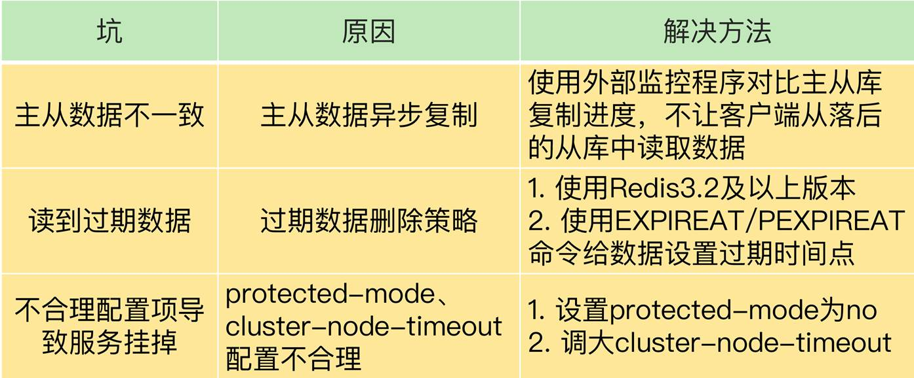

最后，关于主从库数据不一致的问题，我还想再给你提一个小建议：Redis 中的 slave-serve-stale-data 配置项设置了从库能否处理数据读写命令，你可以把它设置为 no。这样一来，从库只能服务 INFO、SLAVEOF 命令，这就可以避免在从库中读到不一致的数据了。

不过，你要注意下这个配置项和 slave-read-only 的区别，slave-read-only 是设置从库能否处理写命令，slave-read-only 设置为 yes 时，从库只能处理读请求，无法处理写请求，你可不要搞混了。


# 脑裂：一次奇怪的数据丢失 

在使用主从集群时，我曾遇到过这样一个问题：我们的主从集群有 1 个主库、5 个从库和 3 个哨兵实例，在使用的过程中，我们发现客户端发送的一些数据丢失了，这直接影响到了业务层的数据可靠性。

通过一系列的问题排查，我们才知道，这其实是主从集群中的脑裂问题导致的。

**所谓的脑裂，就是指在主从集群中，同时有两个主节点，它们都能接收写请求。而脑裂最直接的影响，就是客户端不知道应该往哪个主节点写入数据，结果就是不同的客户端会往不同的主节点上写入数据。**而且，严重的话，脑裂会进一步导致数据丢失。

那么，主从集群中为什么会发生脑裂？脑裂为什么又会导致数据丢失呢？我们该如何避免脑裂的发生呢？这节课，我就结合我遇见的这个真实问题，带你一起分析和定位问题，帮助你掌握脑裂的成因、后果和应对方法。

刚才我提到，我最初发现的问题是，在主从集群中，客户端发送的数据丢失了。所以，我们首先要弄明白，为什么数据会丢失？是不是数据同步出了问题？


### 第一步：确认是不是数据同步出现了问题

在主从集群中发生数据丢失，最常见的原因就是主库的数据还没有同步到从库，结果主库发生了故障，等从库升级为主库后，未同步的数据就丢失了。

如下图所示，新写入主库的数据 a:1、b:3，就因为在主库故障前未同步到从库而丢失了。

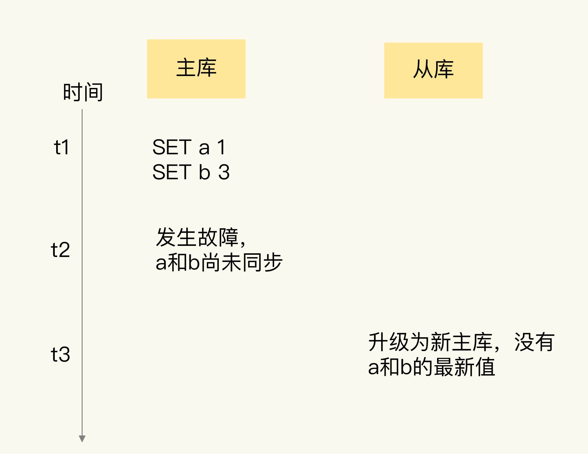

**如果是这种情况的数据丢失，我们可以通过比对主从库上的复制进度差值来进行判断，也就是计算 master_repl_offset 和 slave_repl_offset 的差值。如果从库上的 slave_repl_offset 小于原主库的 master_repl_offset，那么，我们就可以认定数据丢失是由数据同步未完成导致的。**

我们在部署主从集群时，也监测了主库上的 master_repl_offset，以及从库上的 slave_repl_offset。但是，当我们发现数据丢失后，我们检查了新主库升级前的 slave_repl_offset，以及原主库的 master_repl_offset，它们是一致的，也就是说，这个升级为新主库的从库，在升级时已经和原主库的数据保持一致了。那么，为什么还会出现客户端发送的数据丢失呢？

分析到这里，我们的第一个设想就被推翻了。这时，我们想到，所有的数据操作都是从客户端发送给 Redis 实例的，那么，是不是可以从客户端操作日志中发现问题呢？紧接着，我们就把目光转到了客户端。


### 第二步：排查客户端的操作日志，发现脑裂现象

在排查客户端的操作日志时，我们发现，在主从切换后的一段时间内，有一个客户端仍然在和原主库通信，并没有和升级的新主库进行交互。这就相当于主从集群中同时有了两个主库。根据这个迹象，我们就想到了在分布式主从集群发生故障时会出现的一个问题：脑裂。

但是，不同客户端给两个主库发送数据写操作，按道理来说，只会导致新数据会分布在不同的主库上，并不会造成数据丢失。那么，为什么我们的数据仍然丢失了呢？

到这里，我们的排查思路又一次中断了。不过，在分析问题时，我们一直认为“从原理出发是追本溯源的好方法”。脑裂是发生在主从切换的过程中，我们猜测，肯定是漏掉了主从集群切换过程中的某个环节，所以，我们把研究的焦点投向了主从切换的执行过程。


### 第三步：发现是原主库假故障导致的脑裂

我们是采用哨兵机制进行主从切换的，当主从切换发生时，一定是有超过预设数量（quorum 配置项）的哨兵实例和主库的心跳都超时了，才会把主库判断为客观下线，然后，哨兵开始执行切换操作。哨兵切换完成后，客户端会和新主库进行通信，发送请求操作。

但是，在切换过程中，既然客户端仍然和原主库通信，这就表明，原主库并没有真的发生故障（例如主库进程挂掉）。我们猜测，主库是由于某些原因无法处理请求，也没有响应哨兵的心跳，才被哨兵错误地判断为客观下线的。结果，在被判断下线之后，原主库又重新开始处理请求了，而此时，哨兵还没有完成主从切换，客户端仍然可以和原主库通信，客户端发送的写操作就会在原主库上写入数据了。

为了验证原主库只是“假故障”，我们也查看了原主库所在服务器的资源使用监控记录。

的确，我们看到原主库所在的机器有一段时间的 CPU 利用率突然特别高，这是我们在机器上部署的一个数据采集程序导致的。因为这个程序基本把机器的 CPU 都用满了，导致 Redis 主库无法响应心跳了，在这个期间内，哨兵就把主库判断为客观下线，开始主从切换了。不过，这个数据采集程序很快恢复正常，CPU 的使用率也降下来了。此时，原主库又开始正常服务请求了。

正因为原主库并没有真的发生故障，我们在客户端操作日志中就看到了和原主库的通信记录。等到从库被升级为新主库后，主从集群里就有两个主库了，到这里，我们就把脑裂发生的原因摸清楚了。

为了帮助你加深理解，我再画一张图，展示一下脑裂的发生过程。


弄清楚了脑裂发生的原因后，我们又结合主从切换的原理过程进行了分析，很快就找到数据丢失的原因了。


## 为什么脑裂会导致数据丢失？

主从切换后，从库一旦升级为新主库，哨兵就会让原主库执行 slave of 命令，和新主库重新进行全量同步。而在全量同步执行的最后阶段，原主库需要清空本地的数据，加载新主库发送的 RDB 文件，这样一来，原主库在主从切换期间保存的新写数据就丢失了。

下面这张图直观地展示了原主库数据丢失的过程。


到这里，我们就完全弄明白了这个问题的发生过程和原因。

在主从切换的过程中，如果原主库只是“假故障”，它会触发哨兵启动主从切换，一旦等它从假故障中恢复后，又开始处理请求，这样一来，就会和新主库同时存在，形成脑裂。等到哨兵让原主库和新主库做全量同步后，原主库在切换期间保存的数据就丢失了。

看到这里，你肯定会很关心，我们该怎么应对脑裂造成的数据丢失问题呢？


## 如何应对脑裂问题？

刚刚说了，主从集群中的数据丢失事件，归根结底是因为发生了脑裂。所以，我们必须要找到应对脑裂问题的策略。

既然问题是出在原主库发生假故障后仍然能接收请求上，我们就开始在主从集群机制的配置项中查找是否有限制主库接收请求的设置。

通过查找，我们发现，Redis 已经提供了两个配置项来限制主库的请求处理，分别是 min-slaves-to-write 和 min-slaves-max-lag。

- min-slaves-to-write：这个配置项设置了**主库能进行数据同步的最少从库数量**；

- min-slaves-max-lag：这个配置项设置了主从库间进行数据复制时，**从库给主库发送 ACK 消息的最大延迟（以秒为单位）**。

有了这两个配置项后，我们就可以轻松地应对脑裂问题了。具体咋做呢？

我们可以把 min-slaves-to-write 和 min-slaves-max-lag 这两个配置项搭配起来使用，分别给它们设置一定的阈值，假设为 N 和 T。这两个配置项组合后的要求是，主库连接的从库中至少有 N 个从库，和主库进行数据复制时的 ACK 消息延迟不能超过 T 秒，否则，主库就不会再接收客户端的请求了。

**即使原主库是假故障，它在假故障期间也无法响应哨兵心跳，也不能和从库进行同步，自然也就无法和从库进行 ACK 确认了。这样一来，min-slaves-to-write 和 min-slaves-max-lag 的组合要求就无法得到满足，原主库就会被限制接收客户端请求，客户端也就不能在原主库中写入新数据了。**

**等到新主库上线时，就只有新主库能接收和处理客户端请求，此时，新写的数据会被直接写到新主库中。而原主库会被哨兵降为从库，即使它的数据被清空了，也不会有新数据丢失。**

我再来给你举个例子。

假设我们将 min-slaves-to-write 设置为 1，把 min-slaves-max-lag 设置为 12s，把哨兵的 down-after-milliseconds 设置为 10s，主库因为某些原因卡住了 15s，导致哨兵判断主库客观下线，开始进行主从切换。同时，因为原主库卡住了 15s，没有一个从库能和原主库在 12s 内进行数据复制，原主库也无法接收客户端请求了。这样一来，主从切换完成后，也只有新主库能接收请求，不会发生脑裂，也就不会发生数据丢失的问题了。


## 小结

这节课，我们学习了主从切换时可能遇到的脑裂问题。脑裂是指在主从集群中，同时有两个主库都能接收写请求。在 Redis 的主从切换过程中，如果发生了脑裂，客户端数据就会写入到原主库，如果原主库被降为从库，这些新写入的数据就丢失了。

脑裂发生的原因主要是原主库发生了假故障，我们来总结下假故障的两个原因。

和主库部署在同一台服务器上的其他程序临时占用了大量资源（例如 CPU 资源），导致主库资源使用受限，短时间内无法响应心跳。其它程序不再使用资源时，主库又恢复正常。

主库自身遇到了阻塞的情况，例如，处理 bigkey 或是发生内存 swap（你可以复习下第 19 讲中总结的导致实例阻塞的原因），短时间内无法响应心跳，等主库阻塞解除后，又恢复正常的请求处理了。

为了应对脑裂，你可以在主从集群部署时，通过合理地配置参数 min-slaves-to-write 和 min-slaves-max-lag，来预防脑裂的发生。

在实际应用中，可能会因为网络暂时拥塞导致从库暂时和主库的 ACK 消息超时。在这种情况下，并不是主库假故障，我们也不用禁止主库接收请求。

所以，我给你的建议是，假设从库有 K 个，可以将 min-slaves-to-write 设置为 K/2+1（如果 K 等于 1，就设为 1），将 min-slaves-max-lag 设置为十几秒（例如 10～20s），在这个配置下，如果有一半以上的从库和主库进行的 ACK 消息延迟超过十几秒，我们就禁止主库接收客户端写请求。

这样一来，我们可以避免脑裂带来数据丢失的情况，而且，也不会因为只有少数几个从库因为网络阻塞连不上主库，就禁止主库接收请求，增加了系统的鲁棒性。


# 第23~33讲课后思考题答案及常见问题答疑 

### 第 23 讲

**问题：Redis 的只读缓存和使用直写策略的读写缓存，都会把数据同步写到后端数据库中，你觉得它们有什么区别吗？**

答案：主要的区别在于，当有缓存数据被修改时，在只读缓存中，业务应用会直接修改数据库，并把缓存中的数据标记为无效；而在读写缓存中，业务应用需要同时修改缓存和数据库。

我把这两类缓存的优劣势汇总在一张表中，如下所示：

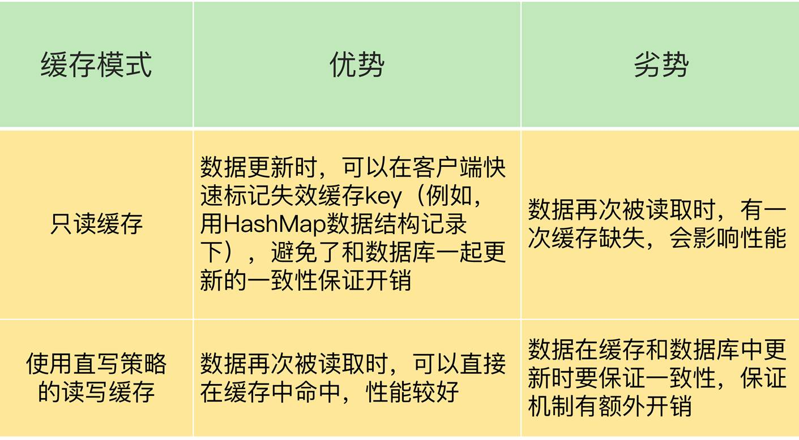

### 第 24 讲

**问题：Redis 缓存在处理脏数据时，不仅会修改数据，还会把它写回数据库。我们在前面学过 Redis 的只读缓存模式和两种读写缓存模式（带同步直写的读写模式，带异步写回的读写模式）），请你思考下，Redis 缓存对应哪一种或哪几种模式？**

答案：如果我们在使用 Redis 缓存时，需要把脏数据写回数据库，这就意味着，Redis 中缓存的数据可以直接被修改，这就对应了读写缓存模式。更进一步分析的话，**脏数据是在被替换出缓存时写回后端数据库的，这就对应了带有异步写回策略的读写缓存模式。**


### 第 25 讲

**问题：在只读缓存中对数据进行删改时，需要在缓存中删除相应的缓存值。如果在这个过程中，我们不是删除缓存值，而是直接更新缓存的值，你觉得，和删除缓存值相比，直接更新缓存值有什么好处和不足吗？**

答案：如果我们直接在缓存中更新缓存值，等到下次数据再被访问时，业务应用可以直接从缓存中读取数据，这是它的一大好处。

不足之处在于，当有数据更新操作时，我们要保证缓存和数据库中的数据是一致的，这就可以采用我在第 25 讲中介绍的重试或延时双删方法。不过，这样就需要在业务应用中增加额外代码，有一定的开销。


### 第 26 讲

**问题：在讲到缓存雪崩时，我提到，可以采用服务熔断、服务降级、请求限流三种方法来应对。请你思考下，这三个方法可以用来应对缓存穿透问题吗？**

答案：关于这个问题，@徐培同学回答得特别好，他看到了缓存穿透的本质，也理解了穿透和缓存雪崩、击穿场景的区别，我再来回答一下这个问题。

缓存穿透这个问题的本质是查询了 Redis 和数据库中没有的数据，而服务熔断、服务降级和请求限流的方法，本质上是为了解决 Redis 实例没有起到缓存层作用的问题，缓存雪崩和缓存击穿都属于这类问题。

在缓存穿透的场景下，业务应用是要从 Redis 和数据库中读取不存在的数据，此时，如果没有人工介入，Redis 是无法发挥缓存作用的。

一个可行的办法就是事前拦截，不让这种查询 Redis 和数据库中都没有的数据的请求发送到数据库层。

使用布隆过滤器也是一个方法，布隆过滤器在判别数据不存在时，是不会误判的，而且判断速度非常快，一旦判断数据不存在，就立即给客户端返回结果。使用布隆过滤器的好处是既降低了对 Redis 的查询压力，也避免了对数据库的无效访问。

另外，这里，有个地方需要注意下，对于缓存雪崩和击穿问题来说，服务熔断、服务降级和请求限流这三种方法属于有损方法，会降低业务吞吐量、拖慢系统响应、降低用户体验。不过，采用这些方法后，随着数据慢慢地重新填充回 Redis，Redis 还是可以逐步恢复缓存层作用的。


### 第 27 讲

**问题：使用了 LFU 策略后，缓存还会被污染吗？**

答案：在 Redis 中，我们使用了 LFU 策略后，还是有可能发生缓存污染的。@yeek 回答得不错，我给你分享下他的答案。

在一些极端情况下，LFU 策略使用的计数器可能会在短时间内达到一个很大值，而计数器的衰减配置项设置得较大，导致计数器值衰减很慢，在这种情况下，数据就可能在缓存中长期驻留。例如，一个数据在短时间内被高频访问，即使我们使用了 LFU 策略，这个数据也有可能滞留在缓存中，造成污染。


### 第 28 讲

**问题：这节课，我向你介绍的是使用 SSD 作为内存容量的扩展，增加 Redis 实例的数据保存量，我想请你来聊一聊，我们可以使用机械硬盘来作为实例容量扩展吗？有什么好处或不足吗？**

答案：这道题有不少同学（例如 @Lemon、@Kaito）都分析得不错，我再来总结下使用机械硬盘的优劣势。

从容量维度来看，机械硬盘的性价比更高，机械硬盘每 GB 的成本大约在 0.1 元左右，而 SSD 每 GB 的成本大约是 0.4~0.6 元左右。

从性能角度来看，机械硬盘（例如 SAS 盘）的延迟大约在 3~5ms，而企业级 SSD 的读延迟大约是 60~80us，写延迟在 20us。缓存的负载特征一般是小粒度数据、高并发请求，要求访问延迟低。所以，如果使用机械硬盘作为 Pika 底层存储设备的话，缓存的访问性能就会降低。

所以，我的建议是，如果业务应用需要缓存大容量数据，但是对缓存的性能要求不高，就可以使用机械硬盘，否则最好是用 SSD。


### 第 29 讲

**问题：Redis 在执行 Lua 脚本时，是可以保证原子性的，那么，在课程里举的 Lua 脚本例子（lua.script）中，你觉得是否需要把读取客户端 ip 的访问次数，也就是 GET(ip)，以及判断访问次数是否超过 20 的判断逻辑，也加到 Lua 脚本中吗？代码如下所示：**

```
local current
current = redis.call("incr",KEYS[1])

if tonumber(current) == 1 then
  redis.call("expire",KEYS[1],60)
end
```

答案：在这个例子中，要保证原子性的操作有三个，分别是 INCR、判断访问次数是否为 1 和设置过期时间。而对于获取 IP 以及判断访问次数是否超过 20 这两个操作来说，它们只是读操作，即使客户端有多个线程并发执行这两个操作，也不会改变任何值，所以并不需要保证原子性，我们也就不用把它们放到 Lua 脚本中了。


### 第 30 讲

**问题：在课程里，我提到，我们可以使用 SET 命令带上 NX 和 EX/PX 选项进行加锁操作，那么，我们是否可以用下面的方式来实现加锁操作呢？**

```
// 加锁

SETNX lock_key unique_value

EXPIRE lock_key 10S

// 业务逻辑

DO THINGS 
```

答案：如果使用这个方法实现加锁的话，SETNX 和 EXPIRE 两个命令虽然分别完成了对锁变量进行原子判断和值设置，以及设置锁变量的过期时间的操作，但是这两个操作一起执行时，并没有保证原子性。

**如果在执行了 SETNX 命令后，客户端发生了故障，但锁变量还没有设置过期时间，就无法在实例上释放了，这就会导致别的客户端无法执行加锁操作。所以，我们不能使用这个方法进行加锁。**


### 第 31 讲

**问题：在执行事务时，如果 Redis 实例发生故障，而 Redis 使用的是 RDB 机制，那么，事务的原子性还能得到保证吗？**

答案：当 Redis 采用 RDB 机制保证数据可靠性时，Redis 会按照一定的周期执行内存快照。

一个事务在执行过程中，事务操作对数据所做的修改并不会实时地记录到 RDB 中，而且，Redis 也不会创建 RDB 快照。我们可以根据故障发生的时机以及 RDB 是否生成，分成三种情况来讨论事务的原子性保证。

假设事务在执行到一半时，实例发生了故障，在这种情况下，上一次 RDB 快照中不会包含事务所做的修改，而下一次 RDB 快照还没有执行。所以，实例恢复后，事务修改的数据会丢失，事务的原子性能得到保证。

**假设事务执行完成后，RDB 快照已经生成了，如果实例发生了故障，事务修改的数据可以从 RDB 中恢复，事务的原子性也就得到了保证。**

**假设事务执行已经完成，但是 RDB 快照还没有生成，如果实例发生了故障，那么，事务修改的数据就会全部丢失，也就谈不上原子性了。**


### 第 32 讲

**问题：在主从集群中，我们把 slave-read-only 设置为 no，让从库也能直接删除数据，以此来避免读到过期数据。你觉得，这是一个好方法吗？**

答案：这道题目的重点是，假设从库也能直接删除过期数据的话（也就是执行写操作），是不是一个好方法？其实，我是想借助这道题目提醒你，主从复制中的增删改操作都需要在主库执行，即使从库能做删除，也不要在从库删除，否则会导致数据不一致。

**例如，主从库上都有 a:stock 的键，客户端 A 给主库发送一个 SET 命令，修改 a:stock 的值，客户端 B 给从库发送了一个 SET 命令，也修改 a:stock 的值，此时，相同键的值就不一样了。所以，如果从库具备执行写操作的功能，就会导致主从数据不一致。**

@Kaito 同学在留言区对这道题做了分析，回答得很好，我稍微整理下，给你分享下他的留言。

即使从库可以删除过期数据，也还会有不一致的风险，有两种情况。

第一种情况是，对于已经设置了过期时间的 key，主库在 key 快要过期时，使用 expire 命令重置了过期时间，例如，一个 key 原本设置为 10s 后过期，在还剩 1s 就要过期时，主库又用 expire 命令将 key 的过期时间设置为 60s 后。但是，expire 命令从主库传输到从库时，由于网络延迟导致从库没有及时收到 expire 命令（比如延后了 3s 从库才收到 expire 命令），所以，从库按照原定的过期时间删除了过期 key，这就导致主从数据不一致了。

第二种情况是，主从库的时钟不同步，导致主从库删除时间不一致。

另外，当 slave-read-only 设置为 no 时，如果在从库上写入的数据设置了过期时间，Redis 4.0 前的版本不会删除过期数据，而 Redis 4.0 及以上版本会在数据过期后删除。但是，对于主库同步过来的带有过期时间的数据，从库仍然不会主动进行删除。


### 第 33 讲

**问题：假设我们将 min-slaves-to-write 设置为 1，min-slaves-max-lag 设置为 15s，哨兵的 down-after-milliseconds 设置为 10s，哨兵主从切换需要 5s，而主库因为某些原因卡住了 12s。此时，还会发生脑裂吗？主从切换完成后，数据会丢失吗？**

答案：主库卡住了 12s，超过了哨兵的 down-after-milliseconds 10s 阈值，所以，哨兵会把主库判断为客观下线，开始进行主从切换。因为主从切换需要 5s，在主从切换过程中，原主库恢复正常。min-slaves-max-lag 设置的是 15s，而原主库在卡住 12s 后就恢复正常了，所以没有被禁止接收请求，客户端在原主库恢复后，又可以发送请求给原主库。一旦在主从切换之后有新主库上线，就会出现脑裂。**如果原主库在恢复正常后到降级为从库前的这段时间内，接收了写操作请求，那么，这些数据就会丢失了。**


## 典型问题答疑

在第 23 讲中，我们学习了 Redis 缓存的工作原理，我提到了 Redis 是旁路缓存，而且可以分成只读模式和读写模式。我看到留言区有一些共性问题：如何理解 Redis 属于旁路缓存？Redis 通常会使用哪种模式？现在，我来解释下这两个问题。

### 如何理解把 Redis 称为旁路缓存？

有同学提到，平时看到的旁路缓存是指，写请求的处理方式是直接更新数据库，并删除缓存数据；而读请求的处理方式是查询缓存，如果缓存缺失，就读取数据库，并把数据写入缓存。那么，课程中说的“Redis 属于旁路缓存”是这个意思吗？

其实，这位同学说的是典型的只读缓存的特点。而我把 Redis 称为旁路缓存，更多的是从“业务应用程序如何使用 Redis 缓存”这个角度来说的。业务应用在使用 Redis 缓存时，需要在业务代码中显式地增加缓存的操作逻辑。

例如，一个基本的缓存操作就是，一旦发生缓存缺失，业务应用需要自行去读取数据库，而不是缓存自身去从数据库中读取数据再返回。

为了便于你理解，我们再来看下和旁路缓存相对应的、计算机系统中的 CPU 缓存和 page cache。这两种缓存默认就在应用程序访问内存和磁盘的路径上，我们写的应用程序都能直接使用这两种缓存。

我之所以强调 Redis 是一个旁路缓存，也是希望你能够记住，**在使用 Redis 缓存时，我们需要修改业务代码。**


### 使用 Redis 缓存时，应该用哪种模式？

我提到，通用的缓存模式有三种：只读缓存模式、采用同步直写策略的读写缓存模式、采用异步写回策略的读写缓存模式。

一般情况下，我们会把 Redis 缓存用作只读缓存。只读缓存涉及的操作，包括查询缓存、缓存缺失时读数据库和回填，数据更新时删除缓存数据，这些操作都可以加到业务应用中。而且，当数据更新时，缓存直接删除数据，缓存和数据库的数据一致性较为容易保证。

当然，有时我们也会把 Redis 用作读写缓存，同时采用同步直写策略。在这种情况下，缓存涉及的操作也都可以加到业务应用中。而且，和只读缓存相比有一个好处，就是数据修改后的最新值可以直接从缓存中读取。

对于采用异步写回策略的读写缓存模式来说，缓存系统需要能在脏数据被淘汰时，自行把数据写回数据库，但是，Redis 是无法实现这一点的，所以我们使用 Redis 缓存时，并不采用这个模式。

