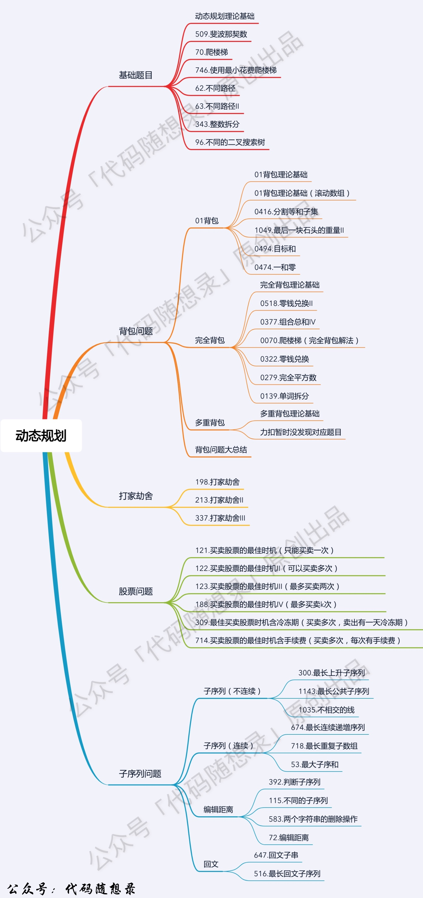
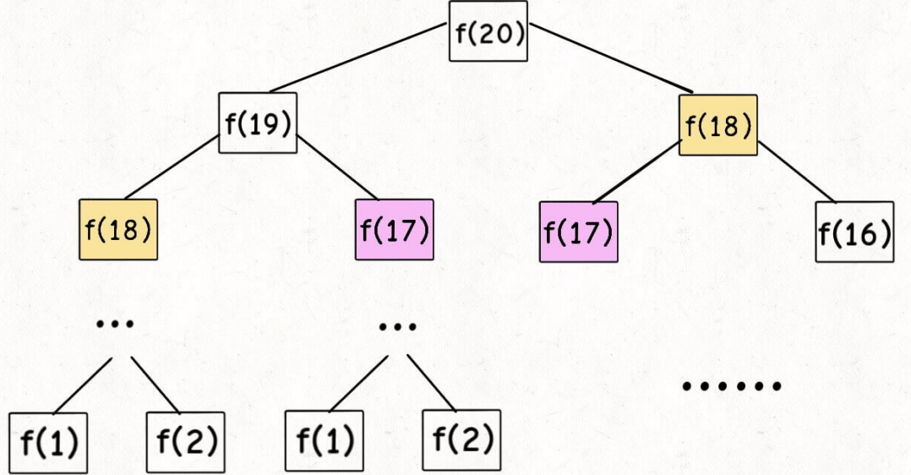
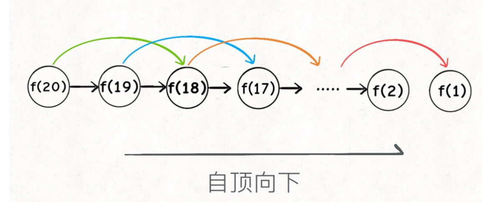
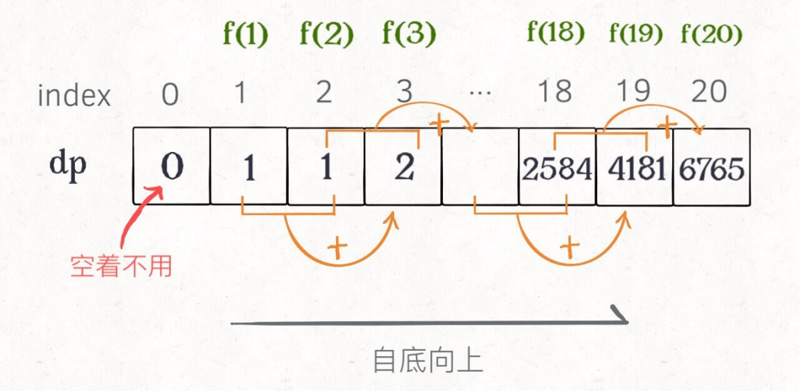
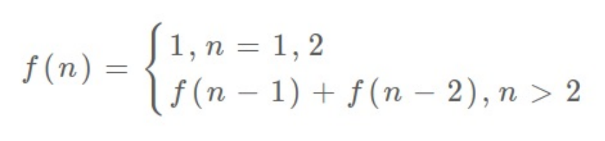
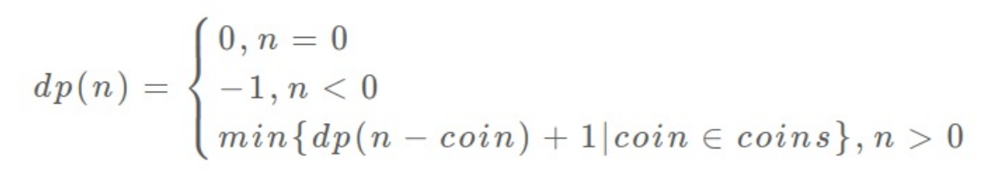
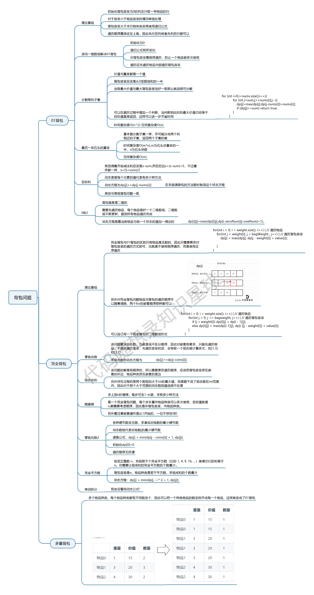

# 动态规划

### 概念

##### 1 动态规划的一般求解形式 —— 求最值

##### 2 动态规划核心问题

​	求解动态规划的核⼼问题是**穷举**，然后在穷举的答案中找**最值**。但可能会存在一些重复求解的问题（即重复子问题）。

##### 3 动态规划三要素

- 重复子问题

  在穷举过程中，求解的问题重复出现，如果每次出现都重新求解，可能会导致很多的重复计算，因此动态规划需要去优化穷举的过程，常见的操作就是引进一个**【备忘录】**或者**【DP table】**

- 最优子结构

  如果问题的最优解是由其子问题的最优解来构造，则称该问题具有最优子结构性质。**【即原问题的最优解可由子问题的最优解得到】**，因此动态规划求解的问题必须具有**无后效性**，即我们只求解每个阶段的最优解的结果，而不关心其求解的过程。

- 状态转移方程

  阶段与阶段之间的联系

  

  ​	

### 思想

##### 1 动态规划的思想实质 

​	分治思想（**分解问题**）和解决冗余（**查表**）。 

##### 2 与分治法类似的是

   将原问题分解成若干个子问题，先求解子问题，然后从这些子问题的解得到原问题的解。

##### 3 与分治法不同的是

   经分解的子问题**往往不是互相独立的**。若用分治法来解，有些共同部分（子问题或子子问题）被重复计算了很多次。

​	如果能够保存已解决的子问题的答案，在需要时再查找，这样就可以避免重复计算、节省时间。动态规划法**用一个表来记录所有已解的子问题的答案**。这就是动态规划法的基本思路。具体的动态规划算法多种多样，但它们具有相同的填表方式。

##### 4 如何写出状态转移方程

- 明确**base case**
- 明确「状态」
- 明确「选择」
- 定义 `dp` 数组/函数的含义
- 确定`dp`数组`（dp table）`以及下标的含义
- 确定递推公式
- `dp`数组如何初始化
- 确定遍历顺序
- 举例推导`dp`数组


### 动态规划应该如何debug

相信动规的题目，很大部分同学都是这样做的。

看一下题解，感觉看懂了，然后照葫芦画瓢，如果能正好画对了，万事大吉，一旦要是没通过，就怎么改都通过不了，对 dp数组的初始化，递推公式，遍历顺序，处于一种黑盒的理解状态。

写动规题目，代码出问题很正常！

**找问题的最好方式就是把dp数组打印出来，看看究竟是不是按照自己思路推导的！**

一些同学对于dp的学习是黑盒的状态，就是不清楚dp数组的含义，不懂为什么这么初始化，递推公式背下来了，遍历顺序靠习惯就是这么写的，然后一鼓作气写出代码，如果代码能通过万事大吉，通过不了的话就凭感觉改一改。

这是一个很不好的习惯！

**做动规的题目，写代码之前一定要把状态转移在dp数组的上具体情况模拟一遍，心中有数，确定最后推出的是想要的结果**。

然后再写代码，如果代码没通过就打印dp数组，看看是不是和自己预先推导的哪里不一样。

如果打印出来和自己预先模拟推导是一样的，那么就是自己的递归公式、初始化或者遍历顺序有问题了。

如果和自己预先模拟推导的不一样，那么就是代码实现细节有问题。

**这样才是一个完整的思考过程，而不是一旦代码出问题，就毫无头绪的东改改西改改，最后过不了，或者说是稀里糊涂的过了**。


## 





### DP解法

#### 一 经验解法

##### 1 我们是如何确定本题可以使用动态规划来解决的？

​	通常我们要从**「有无后效性」**进行入手分析。

​	**如果对于某个状态，我们可以只关注状态的值，而不需要关注状态是如何转移过来的话，那么这就是一个无后效性的问题，**可以考虑使用 DP 解决。另外一个更加实在的技巧，我们还可以通过 **数据范围** 来猜测是不是可以用 DP 来做。

​	因为 DP 是一个递推的过程，因此如果数据范围是 10^5 ~10^6的话，可以考虑是不是可以使用一维 DP 来解决


#### 二 技巧解法

​	使用这种技巧，你将不需要去猜「状态定义」和根据「状态定义」推导「状态转移方程」	

​	如下面的例子：

我们重点关注下我们的 DFS 方法签名设计：

```go
dfs(ls []int, u int, end int, fuel int) int {}
```


其中，ls 参数和 end 参数分别代表源输入的 locations 和 finish，在整个 DFS 过程都不会变化，属于**不变参数**。

而 u 参数和 fuel 参数则是代表了 DFS 过程中的当前位置和当前油量，属于**变化参数**。

**因此我们可以定一个 f[][] 二维数组，来分别表示两个可变参数。**

- 第一维代表当前位置（对应 locations 数组的下标），

- 第二维代表当前剩余油量。二维数组中存储的就是我们的 DFS 方法的返回值（路径数量）。

**同时结合题意，不难得知维度的取值范围：**

- 第一维的取值范围为 [0, locations.length)
- 第二维的取值范围为 [0, fuel]。做完这一步的”翻译“工作，我们就得到了「动态规划」的**「状态定义」**了。

**f\[i][j]代表从位置 i 出发，当前剩余油量为 j 的前提下，到达目的地的路径数量。**

不知道你是否发现，这个「状态定义」和我们「记忆化搜索」中的缓存器的定义是一致的。

接下来我们要从 DFS 中”翻译“出「状态转移方程」。所谓的「状态转移方程」其实就是指如何从一个状态转移到另外一个状态。

而我们的 DFS 主逻辑就是完成这个转移的。**DFS 中的主逻辑很简单：枚举所有的位置，看从当前位置 u 出发，可以到达的位置有哪些。**

于是我们很容易就可以得出状态转移方程：

​						**f\[i][fuel]=f\[i][fuel]+f\[k][fuel-need]**

k 代表计算位置 i 油量 fuel 的状态时枚举的「下一位置」，need 代表从 i 到达 k 需要的油量。从状态转移方程可以发现，在计算 f\[i][fuel] 的时候依赖于 f\[k][fuel-need]。其中 i 和 k 并无严格的大小关系，而 fuel 和 fuel-need 具有严格的大小关系（fuel >= fuel-need）。

**因此我们需要先从小到大枚举油量这一维。**


### 常见问题

##### 1 对状态转移的要求是什么？

​	我们的状态转移是要做到「不漏」还是「不重不漏」取决于问题本身：

- 如果是**求最值**的话，我们只需要确保**「不漏**」即可，因为重复不影响结果。
- 如果是**求方案数**的话，我们需要确保**「不重不漏」**。


##### 2 我们是如何分析动态规划的时间复杂度的？

​	对于动态规划的复杂度/计算量分析，**有多少个状态，复杂度/计算量就是多少**。

​	因此一维 DP 的复杂度通常是线性的 O(n)，而二维 DP 的复杂度通常是平方的 O(n^2)。


##### 3 如何确定「状态定义」呢？

​	通常我们会根据「结尾」或「答案」来猜 DP 的状态定义。所谓的「结尾」通常就是指「最后一步」。对于本题，我们结合两者可以猜一个 DP 状态： f\[i][j]代表到达某个点的最小路径和。那么 min(f\[n-1][i])（最后一行的每列的路径和的最小值）就是答案。


### 例子

#### 1 斐波那契数列 —— 理解重复子问题

##### 1）暴力递归

```go
func fib(n int) int {
    if n == 1 || n == 2 {
        return 1
    }
    return fib(n-1) + fib(n-2)
}
```

根据递归思想画出上述的递归树：



​		

**递归算法的时间复杂度怎么计算？子问题个数乘以解决⼀个⼦问题需要的时间。**

子问题个数，即递归树中节点的总数。显然⼆叉树节点总数为指数级别，所以⼦问题个数为 O(2^n)。

解决⼀个⼦问题的时间，在本算法中，没有循环，只有 f(n - 1) + f(n - 2) ⼀个加法操作，时间为 O(1)。

所以，这个算法的时间复杂度为 O(2^n)，指数级别，爆炸。

**观察递归树，很明显发现了算法低效的原因：**存在大量重复计算，比如f(18) 被计算了两次，而且你可以看到，以 f(18) 为根的这个递归树体量巨⼤，多算⼀遍，会耗费巨⼤的时间。这就是动态规划问题的第一个性质，也是其要解决的问题：**【重复子问题】**

##### 2）改进：带备忘录的递归 —— 自顶向下法

​	对于重复子问题，一个很容易想到的方法就是使用一个备忘录记录已经求解的子问题的答案，当用到的时候，直接从备忘录中取出即可。其算法如下：

```go
func fib(n int) int {
    memo := make([]int, n+1)
    var f func(x int) int
    f = func(x int) int {
        if x == 1 || x == 2 {
            return x
        }
        if memo[x] != 0 {
            return memo[x]
        }
        memo[x] = f(x-1) + f(x-2)
        return memo[x]
    }
    return f(n)
}
```

根据算法思想，可画出如下的递归树：



**复杂度计算**

- 时间：每个节点计算一次，因此是O(n)
- 空间：备忘录O(n) + 递归栈O(n) ——> O(n)


##### 3）改进：dp数组的迭代解法 —— 自底向上

​	将备忘录改为一张表，其可以查询子问题的结果，记为**DP table**。其算法如下：

```go
func fib(n int) int {
    dp := make([]int, n+1)
    dp[1], dp[2] = 1, 1
    for i := 3; i <= n; i++ {
        dp[i] = dp[i-1] + dp[i-2]
    }
    return dp[n]
}
```



##### 4）状态转移方程



​    为啥叫「状态转移⽅程」？为了听起来⾼端。你把 f(n) 想做⼀个状态 n，这个状态 n 是由状态 n - 1 和状态 n - 2 相加转移⽽来，这就叫状态转移，仅此⽽已。

​    你会发现，上⾯的几种解法中的所有操作，例如 return f(n - 1) + f(n - 2)，dp[i] = dp[i - 1] + dp[i - 2]，以及对备忘录或 DP table 的初始化操作，都是围绕这个方程式的不同表现形式。可⻅列出「状态转移⽅程」的重要性，它是解决问题的核⼼。

 	很容易发现，**【其实状态转移方程直接代表着暴力解法】**。**千万不要看不起暴力解，动态规划问题最困难的就是写出状态转移⽅程**，即这个暴力解。优化⽅法⽆⾮是⽤备忘录或者 DP table，再⽆奥妙可⾔。

##### 5）算法优化

​	根据斐波那契数列的状态转移⽅程，当前状态只和之前的两个状态有关，其实并不需要那么长的⼀个 DP table 来存储所有的状态，只要想办法存储之前的两个状态就行了。所以，可以进⼀步优化，把空间复杂度降为 O(1)：

```go
func fib(n int) int {
    if n == 1 || n == 2 {
        return n
    }
    pre, cur := 1, 1
    for i := 3; i <= n; i++ {
        pre, cur = cur, pre+cur
    }
    return cur
}
```


#### 2 凑零钱问题 —— 理解最优子结构

##### 1）题⽬

​	给你 k 种⾯值的硬币，⾯值分别为 c1, c2 ... ck ，每种硬币的数量无限，再给⼀个总金额 amount ，问你**最少**需要几枚硬币凑出这个金额，如果不可能凑出，算法返回 -1 。

​	比如说 k = 3 ，面值分别为 1，2，5，总⾦额 amount = 11 。那么最少需要 3 枚硬币凑出，即 11 = 5 + 5 + 1。


**为什么说它符合最优子结构呢？**

​	比如你想求 amount =11 时的最少硬币数（原问题），如果你知道凑出 amount = 10 的最少硬币数（⼦问题），你只需要把⼦问题的答案加⼀（再选⼀枚⾯值为 1 的硬币）就是原问题的答案，**【因为硬币的数量是没有限制的，⼦问题之间没有相互制，是互相独立的】。**

那么，既然知道了这是个动态规划问题，就要思考**如何列出正确的状态转移方程？**

- **先确定「状态」**，也就是原问题和子问题中变化的变量。由于硬币数量⽆限，**所以唯⼀的状态就是目标金额 amount** 。

- **然后确定dp数组的含义**：当前金额为n，至少需要**dp[n]个硬币才能凑出该金额**。

- **然后确定【选择】并择优**：也就是对于每个状态，**可以做出什么选择改变当前状态**。具体到这个问题，无论当前的目标金额是多少，选择就是从面额列表coins中选择一个硬币，然后目标金额就会减少。

  ```go
  # 伪代码
  def coinChange(coins []int, amount int) int {
      # 函数功能：要凑出金额n，需要dp[n]个硬币
      def dp[n]:
      	# 做选择，选择硬币最少的那个结果
      	for coin in coins:
      		// 选择coin硬币，其操作次数是面额为n-coin的金额所需操作数+1
      		res = min(res, dp[n-coin]+1)
      	return res
      # 我们所求问题
      return dp[amount]
  }
  ```

- 明确**初始状态**：当金额为0时，所需硬币数量为0，即dp[0] = 0，当目标金额小于0时，无解

​	以上代码的数学形式就是状态转移方程



##### 3）改进 —— 带备忘录的递归

```go
func coinChange(coins []int, amount int) int {
    memo := []int{}
	// 当前金额为n，所需的最小硬币数量
    var subProblem func(n int) int 
    subProblem = func(n int) int {
		if memo[n] != 0 {
			return memo[n]
		}
		if n < 0 { return -1 }
		if n == 0 { return 0 }
		ans := -1
		for _, coin := range coins {
			if memo[n-coin] == -1 {
				continue
			}
			ans = min(ans, memo[n-coin]+1)
		}
		memo[n] = ans
		return memo[n]
	}
	return subProblem(amount)
}
```

##### 4）dp数组的迭代解法 —— 自底向上

```go
func coinChange(coins []int, amount int) int {
	if amount < 0 { return -1 }
	if amount == 0 { return 0 }
	dp := make([]int, amount+1)  // dp[0] = 0
	for i := 1; i <= amount; i++ {
		// 当前金额为i
		for _, coin := range coins {
			if i - coin < 0 { continue }
			dp[i] = min(dp[i], dp[i-coin]+1)
		}
	}
	return dp[amount]
}
```

> **计算机解决问题其实没有任何奇淫巧计，它唯一解决办法就是*穷举***，穷举所有可能性。算法设计无法就是**【先思考“如何穷举”，再追求”如何聪明的穷举“】**。列出状态转移方程，其实质就是在解决**”如何穷举的问题“**。之所以说动态规划难，一是因为很多穷举需要递归实现，二是因为有的问题本身解空间复杂，很难在规定时间内穷举完成。而引入”备忘录、DP table“就是在追求**”如何聪明的穷举“**。用空间换时间的思想，是降低时间复杂度的不二法门，除此之外，试问，还能玩出什么花样？


### 【注释】

1. 阶段：把所给的问题的求解过程恰当地划分为若干个相互联系的阶段。
2. 状态：状态表示每个阶段开始时，问题的客观状况。状态既是该阶段的某个起点，又是前一个阶段的某个终点。通常一个阶段有若干个状态。
3. 无后效性：如果某阶段状态给定后，则该阶段以后过程的发展不受该阶段以前各阶段状态的影响，也就是说状态具有马尔科夫性。**【即之前的决策不会影响之后的决策】**，如一颗在(2,3)的棋子，我们不关心它之前是如何走到当前位置，也不会影响到我之后的决策
4. 有后效性：与无后效性相反，如移动一颗棋子，但是**【棋子不能走重复的格子】**，此时之前的决策对后面的决策就有影响。


-----------------------------------


## 背包问题


### 01 背包


有n件物品和一个最多能背重量为w 的背包。第 i 件物品的重量是weight[i]，得到的价值是value[i] 。**每件物品只能用一次**，求解将哪些物品装入背包里物品价值总和最大。


在下面的讲解中，我举一个例子：

背包最大重量为4。

物品为：

|       | 重量 | 价值 |
| ----- | ---- | ---- |
| 物品0 | 1    | 15   |
| 物品1 | 3    | 20   |
| 物品2 | 4    | 30   |

问背包能背的物品最大价值是多少？

以下讲解和图示中出现的数字都是以这个例子为例。


#### 二维 dp 数组

1. 确定 dp 数组以及下标的含义

对于背包问题，有一种写法， 是使用二维数组，即**dp\[i][j] 表示从下标为[0-i]的物品里任意取，放进容量为j的背包，价值总和最大是多少**。

2. 确定递推公式

那么可以有两个方向推出来dp\[i][j]，

- **不放物品i**：由dp\[i - 1][j]推出，即背包容量为j，里面不放物品i的最大价值，此时dp\[i][j]就是dp\[i - 1][j]。(其实就是当物品i的重量大于背包j的重量时，物品i无法放进背包中，所以被背包内的价值依然和前面相同。)
- **放物品i**：由dp\[i - 1][j - weight[i]]推出，dp\[i - 1][j - weight[i]] 为背包容量为j - weight[i]的时候不放物品i的最大价值，那么dp\[i - 1][j - weight[i]] + value[i] （物品i的价值），就是背包放物品i得到的最大价值

所以递归公式： $dp[i][j] = max(dp[i - 1][j], dp[i - 1][j - weight[i]] + value[i])$;

3. dp 数组如何初始化

​	**关于初始化，一定要和dp数组的定义吻合，否则到递推公式的时候就会越来越乱**。

首先从dp\[i][j]的定义出发，如果背包容量j为0的话，即dp\[i][0]，无论是选取哪些物品，背包价值总和一定为0。如图：


在看其他情况。

状态转移方程 $dp[i][j] = max(dp[i - 1][j], dp[i - 1][j - weight[i]] + value[i])$; 可以看出i 是由 i-1 推导出来，那么i为0的时候就一定要初始化。

dp\[0][j]，即：i为0，存放编号0的物品的时候，各个容量的背包所能存放的最大价值。

那么很明显当 j < weight[0]的时候，dp\[0][j] 应该是 0，因为背包容量比编号0的物品重量还小。

当j >= weight[0]时，dp\[0][j] 应该是value[0]，因为背包容量放足够放编号0物品。

代码初始化如下：

```go
for (int j = 0 ; j < weight[0]; j++) {  // 小于第一个物品容量的背包置为0
    dp[0][j] = 0;
}
// 正序遍历
for (int j = weight[0]; j <= bagweight; j++) {  // 大于第一个物品容量的背包置为物品价值
    dp[0][j] = value[0];
}
```


4. 确定遍历顺序

在如下图中，可以看出，有两个遍历的维度：物品与背包重量

那么问题来了，**先遍历 物品还是先遍历背包重量呢？**

**其实都可以！！ 但是先遍历物品更好理解**。

那么我先给出先遍历物品，然后遍历背包重量的代码。

```c++
// weight数组的大小 就是物品个数
for(int i = 1; i < weight.size(); i++) { // 遍历物品
    for(int j = 0; j <= bagweight; j++) { // 遍历背包容量
        if (j < weight[i]) dp[i][j] = dp[i - 1][j]; 
        else dp[i][j] = max(dp[i - 1][j], dp[i - 1][j - weight[i]] + value[i]);

    }
}
```

**先遍历背包，再遍历物品，也是可以的！（注意我这里使用的二维dp数组）**

```c++
// weight数组的大小 就是物品个数
for(int j = 0; j <= bagweight; j++) { // 遍历背包容量
    for(int i = 1; i < weight.size(); i++) { // 遍历物品
        if (j < weight[i]) dp[i][j] = dp[i - 1][j];
        else dp[i][j] = max(dp[i - 1][j], dp[i - 1][j - weight[i]] + value[i]);
    }
}
```


- [纯 0 - 1 背包 (opens new window)](https://programmercarl.com/背包理论基础01背包-2.html)是求 给定背包容量 装满背包 的最大价值是多少。
- [416. 分割等和子集 (opens new window)](https://programmercarl.com/0416.分割等和子集.html)是求 给定背包容量，能不能装满这个背包。
- [1049. 最后一块石头的重量 II (opens new window)](https://programmercarl.com/1049.最后一块石头的重量II.html)是求 给定背包容量，尽可能装，最多能装多少
- [494. 目标和 (opens new window)](https://programmercarl.com/0494.目标和.html)是求 给定背包容量，装满背包有多少种方法。
- 本题是求 给定背包容量，装满背包最多有多少个物品。


#### 一和零

**题目**：[474. 一和零](https://leetcode.cn/problems/ones-and-zeroes/)

**思路**：

1. 确定遍历顺序

我们讲到了01背包为什么一定是外层for循环遍历物品，内层for循环遍历背包容量且从后向前遍历！（因为如果在滚动数组中，先遍历背包容量会造成覆盖）

那么本题也是，**物品就是strs里的字符串，背包容量就是题目描述中的m和n。**

**代码**：

```go
func findMaxForm(strs []string, m int, n int) int {
    // dp tables
    dp := make([][]int, m+1)
    for i := range dp {
        dp[i] = make([]int, n+1)
    }

    // 遍历
    for _, str := range strs {
        cnt0, cnt1 := count(str)
        // 由于依靠上一张dp表，因此需要从后往前覆盖
        for i := m; i >= cnt0; i-- {
            for j := n; j >= cnt1; j-- {
                dp[i][j] = max(dp[i][j], dp[i-cnt0][j-cnt1] + 1)
            }
        }
    }

    return dp[m][n]
}

func count(s string) (cnt0, cnt1 int) {
    for _, ch := range s {
        if ch == '0' {
            cnt0++
        } else {
            cnt1++
        }
    }
    return
}

func max(a, b int) int {
    if a < b {
        return b
    }
    return a
}
```


### 完全背包


有N件物品和一个最多能背重量为W的背包。第i件物品的重量是weight[i]，得到的价值是value[i] 。**每件物品都有无限个（也就是可以放入背包多次）**，求解将哪些物品装入背包里物品价值总和最大。

**完全背包和01背包问题唯一不同的地方就是，每种物品有无限件**。

同样leetcode上没有纯完全背包问题，都是需要完全背包的各种应用，需要转化成完全背包问题，所以我这里还是以纯完全背包问题进行讲解理论和原理。

在下面的讲解中，我依然举这个例子：

背包最大重量为4。

物品为：

|       | 重量 | 价值 |
| ----- | ---- | ---- |
| 物品0 | 1    | 15   |
| 物品1 | 3    | 20   |
| 物品2 | 4    | 30   |

**每件商品都有无限个！**

问背包能背的物品最大价值是多少？

01背包和完全背包唯一不同就是体现在遍历顺序上，所以本文就不去做动规五部曲了，我们直接针对遍历顺序经行分析！


我们知道01背包内嵌的循环是从大到小遍历，为了保证每个物品仅被添加一次（正序会导致后面的数据会使用前面更新后的数据）。

而完全背包的物品是可以添加多次的，所以要从小到大去遍历，即：

```go
// 先遍历物品，再遍历背包
for(int i = 0; i < weight.size(); i++) { // 遍历物品
    for(int j = weight[i]; j <= bagWeight ; j++) { // 遍历背包容量
        dp[j] = max(dp[j], dp[j - weight[i]] + value[i]);

    }
}
```


#### 零钱兑换 II

**题目**：[518. 零钱兑换 II](https://leetcode.cn/problems/coin-change-ii/)

**思路**：

1. 确定遍历顺序

本题中我们是外层for循环遍历物品（钱币），内层for遍历背包（金钱总额），还是外层for遍历背包（金钱总额），内层for循环遍历物品（钱币）呢？

我在[动态规划：关于完全背包，你该了解这些！ (opens new window)](https://programmercarl.com/背包问题理论基础完全背包.html)中讲解了完全背包的两个for循环的先后顺序都是可以的。

**但本题就不行了！**

因为纯完全背包求得装满背包的最大价值是多少，和凑成总和的元素有没有顺序没关系，即：有顺序也行，没有顺序也行！

而本题要求凑成总和的组合数，元素之间明确要求没有顺序。

所以纯完全背包是能凑成总和就行，不用管怎么凑的。

本题是求凑出来的方案个数，且每个方案个数是为组合数。

那么本题，两个for循环的先后顺序可就有说法了。

我们先来看 外层for循环遍历物品（钱币），内层for遍历背包（金钱总额）的情况。

代码如下：

```cpp
for (int i = 0; i < coins.size(); i++) { // 遍历物品
    for (int j = coins[i]; j <= amount; j++) { // 遍历背包容量
        dp[j] += dp[j - coins[i]];
    }
}
```

假设：coins[0] = 1，coins[1] = 5。

那么就是先把1加入计算，然后再把5加入计算，得到的方法数量只有{1, 5}这种情况。而不会出现{5, 1}的情况。

**所以这种遍历顺序中dp[j]里计算的是组合数！**

如果把两个for交换顺序，代码如下：

```cpp
for (int j = 0; j <= amount; j++) { // 遍历背包容量
    for (int i = 0; i < coins.size(); i++) { // 遍历物品
        if (j - coins[i] >= 0) dp[j] += dp[j - coins[i]];
    }
}
```

背包容量的每一个值，都是经过 1 和 5 的计算，包含了{1, 5} 和 {5, 1}两种情况。

**此时dp[j]里算出来的就是排列数！**


**代码**：

```go
func change(amount int, coins []int) int {
    // dp tables
    dp := make([]int, amount+1)  // 背包容量

    // 初始化，总金额为0的情况下，有不选硬币这一情况
    dp[0] = 1
    // 遍历
    for _, coin := range coins {
        for j := coin; j <= amount; j++ {
            dp[j] += dp[j-coin]
        }
    }

    return dp[amount]
}
```


#### 组合 和 排列


**组合不强调顺序**，(1,5)和(5,1)是同一个组合。

**排列强调顺序**，(1,5)和(5,1)是两个不同的排列。


**如果求组合数就是外层for循环遍历物品，内层for遍历背包**。这样物品的放入只存在一种顺序。

**如果求排列数就是外层for遍历背包，内层for循环遍历物品**。这样物品的放入会存在多种顺序，因为其是在背包容量固定的情况下，试探放入物品的所有可能，如容量为6，则 (1, 5) 和 (5, 1)都是可行的。


### 多重背包


有N种物品和一个容量为V 的背包。第i种物品最多有Mi件可用，每件耗费的空间是Ci ，价值是Wi 。求解将哪些物品装入背包可使这些物品的耗费的空间 总和不超过背包容量，且价值总和最大。

**多重背包和01背包是非常像的， 为什么和01背包像呢？**

**每件物品最多有Mi件可用，把Mi件摊开，其实就是一个01背包问题了。**

例如：

背包最大重量为10。

物品为：

|       | 重量 | 价值 | 数量 |
| ----- | ---- | ---- | ---- |
| 物品0 | 1    | 15   | 2    |
| 物品1 | 3    | 20   | 3    |
| 物品2 | 4    | 30   | 2    |

问背包能背的物品最大价值是多少？

和如下情况有区别么？

|       | 重量 | 价值 | 数量 |
| ----- | ---- | ---- | ---- |
| 物品0 | 1    | 15   | 1    |
| 物品0 | 1    | 15   | 1    |
| 物品1 | 3    | 20   | 1    |
| 物品1 | 3    | 20   | 1    |
| 物品1 | 3    | 20   | 1    |
| 物品2 | 4    | 30   | 1    |
| 物品2 | 4    | 30   | 1    |

毫无区别，这就转成了一个01背包问题了，且每个物品只用一次。


这种方式来实现多重背包的代码如下（将物品展开，然后放入物品中，从而转化为01背包问题）：

```go
package theory

import "log"

// 多重背包可以化解为 01 背包
func multiplePack(weight, value, nums []int, bagWeight int) int {

	for i := 0; i < len(nums); i++ {
		for nums[i] > 1 {
			weight = append(weight, weight[i])
			value = append(value, value[i])
			nums[i]--
		}
	}
	log.Println(weight)
	log.Println(value)

	res := make([]int, bagWeight+1)
	for i := 0; i < len(weight); i++ {
		for j := bagWeight; j >= weight[i]; j-- {
			res[j] = getMax(res[j], res[j-weight[i]]+value[i])
		}
		log.Println(res)
	}

	return res[bagWeight]
}
```

- 时间复杂度：O(m × n × k)，m：物品种类个数，n背包容量，k单类物品数量


也有另一种实现方式，就是把每种商品遍历的个数放在01背包里面在遍历一遍。

代码如下：（详看注释）

```c++
void test_multi_pack() {
    vector<int> weight = {1, 3, 4};
    vector<int> value = {15, 20, 30};
    vector<int> nums = {2, 3, 2};
    int bagWeight = 10;
    vector<int> dp(bagWeight + 1, 0);


    for(int i = 0; i < weight.size(); i++) { // 遍历物品
        for(int j = bagWeight; j >= weight[i]; j--) { // 遍历背包容量
            // 以上为01背包，然后加一个遍历个数
            for (int k = 1; k <= nums[i] && (j - k * weight[i]) >= 0; k++) { // 遍历个数
                dp[j] = max(dp[j], dp[j - k * weight[i]] + k * value[i]);
            }
        }
        // 打印一下dp数组
        for (int j = 0; j <= bagWeight; j++) {
            cout << dp[j] << " ";
        }
        cout << endl;
    }
    cout << dp[bagWeight] << endl;
}
int main() {
    test_multi_pack();
}
```

- 时间复杂度：O(m × n × k)，m：物品种类个数，n背包容量，k单类物品数量

从代码里可以看出是01背包里面在加一个for循环遍历一个每种商品的数量。 和01背包还是如出一辙的。

当然还有那种二进制优化的方法，其实就是把每种物品的数量，打包成一个个独立的包。

和以上在循环遍历上有所不同，因为是分拆为各个包最后可以组成一个完整背包，具体原理我就不做过多解释了，大家了解一下就行，面试的话基本不会考完这个深度了，感兴趣可以自己深入研究一波。

## 


### 总结


#### 背包递推公式


**1 问能否能装满背包（或者最多装多少）：dp[j] = max(dp[j], dp[j - nums[i]] + nums[i]); ，对应题目如下**：

- [动态规划：416.分割等和子集(opens new window)](https://programmercarl.com/0416.分割等和子集.html)
- [动态规划：1049.最后一块石头的重量 II(opens new window)](https://programmercarl.com/1049.最后一块石头的重量II.html)

**2 问装满背包有几种方法：dp[j] += dp[j - nums[i]] ，对应题目如下：**

- [动态规划：494.目标和(opens new window)](https://programmercarl.com/0494.目标和.html)
- [动态规划：518. 零钱兑换 II(opens new window)](https://programmercarl.com/0518.零钱兑换II.html)
- [动态规划：377.组合总和Ⅳ(opens new window)](https://programmercarl.com/0377.组合总和Ⅳ.html)
- [动态规划：70. 爬楼梯进阶版（完全背包）(opens new window)](https://programmercarl.com/0070.爬楼梯完全背包版本.html)

问背包装满最大价值：dp[j] = max(dp[j], dp[j - weight[i]] + value[i]); （1的变种，即物品重量和价值不同），对应题目如下：

- [动态规划：474.一和零(opens new window)](https://programmercarl.com/0474.一和零.html)

问装满背包所有物品的最小个数：dp[j] = min(dp[j - coins[i]] + 1, dp[j]);（2的变种） ，对应题目如下：

- [动态规划：322.零钱兑换(opens new window)](https://programmercarl.com/0322.零钱兑换.html)
- [动态规划：279.完全平方数(opens new window)](https://programmercarl.com/0279.完全平方数.html)


#### 遍历顺序


##### 01背包

在[动态规划：关于01背包问题，你该了解这些！ (opens new window)](https://programmercarl.com/背包理论基础01背包-1.html)中我们讲解二维dp数组01背包先遍历物品还是先遍历背包都是可以的，且第二层for循环是**从小到大遍历**。

和[动态规划：关于01背包问题，你该了解这些！（滚动数组） (opens new window)](https://programmercarl.com/背包理论基础01背包-2.html)中，我们讲解一维dp数组01背包**只能先遍历物品再遍历背包容量**，且第二层for循环是**从大到小遍历**。

**一维dp数组的背包在遍历顺序上和二维dp数组实现的01背包其实是有很大差异的，大家需要注意！**


##### 完全背包

在[动态规划：关于完全背包，你该了解这些！ (opens new window)](https://programmercarl.com/背包问题理论基础完全背包.html)中，讲解了纯完全背包的一维dp数组实现，先遍历物品还是先遍历背包都是可以的，且第二层for循环是从小到大遍历。

但是仅仅是纯完全背包的遍历顺序是这样的，题目稍有变化，两个for循环的先后顺序就不一样了。

**如果求组合数就是外层for循环遍历物品，内层for遍历背包**。

**如果求排列数就是外层for遍历背包，内层for循环遍历物品**。

**如果求最小数，那么两层for循环的先后顺序就无所谓了。**

 


