# 回溯算法


## 回溯算法是什么？

​	其实回溯算法和我们常说的 `DFS` 算法非常类似，本质上就是一种暴力穷举算法。回溯算法和 `DFS` 算法的细微差别是：**回溯算法是在遍历「树枝」，`DFS` 算法是在遍历「节点」**


--------------------------------------


## 解决回溯算法相关的问题有什么技巧？

​	解决一个回溯问题，**实际上就是一个决策树的遍历过程，站在回溯树的一个节点上，你只需要思考 3 个问题**：

1、路径：也就是**已经做出的选择**。

2、选择列表：也就是你**当前可以做的选择**。

3、结束条件：也就是到达决策树底层，**无法再做选择的条件**。


-------------------------


## 如何学习回溯算法？


----------------------------


## 回溯算法代码是否有规律可循？

**思想**：站在当前节点，我有三件事要做：

- 我现在是不是已经走到尽头了，是的话记录这条路径（如果需要）
- 我现在能往那几条路走（做选择）
- 这条路行不通，我要往回走（撤销走）

回溯算法的伪代码框架：

```go
result = []
def backtrack(路径, 选择列表):
    if 满足结束条件:
        result.add(路径)
        return
    
    for 选择 in 选择列表:
        做选择
        backtrack(路径, 选择列表)
        撤销选择
```

**其核心就是 for 循环里面的递归，在递归调用之前「做选择」，在递归调用之后「撤销选择」**


## 实战

---------------


### 经典回溯算法


#### 全排列问题

**题目**：[46. 全排列](https://leetcode.cn/problems/permutations/)

**思路**：

比方说给三个数 `[1,2,3]`，你肯定不会无规律地乱穷举，一般是这样：

先固定第一位为 1，然后第二位可以是 2，那么第三位只能是 3；然后可以把第二位变成 3，第三位就只能是 2 了；然后就只能变化第一位，变成 2，然后再穷举后两位……

其实这就是回溯算法，我们高中无师自通就会用，或者有的同学直接画出如下这棵回溯树：

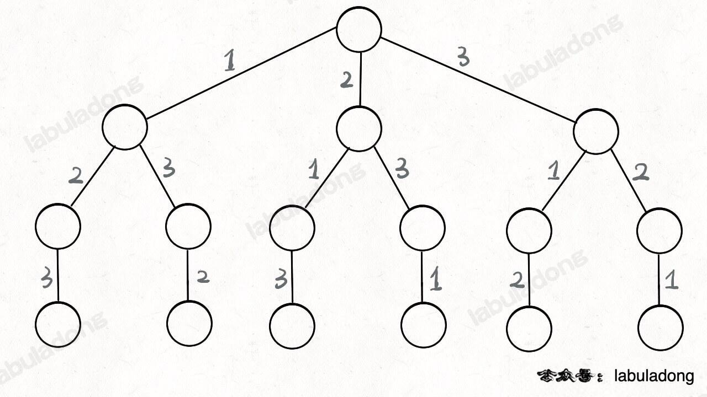

只要从根遍历这棵树，记录路径上的数字，其实就是所有的全排列。**我们不妨把这棵树称为回溯算法的「决策树」**。

**为啥说这是决策树呢，因为你在每个节点上其实都在做决策**。比如说你站在下图的红色节点上：

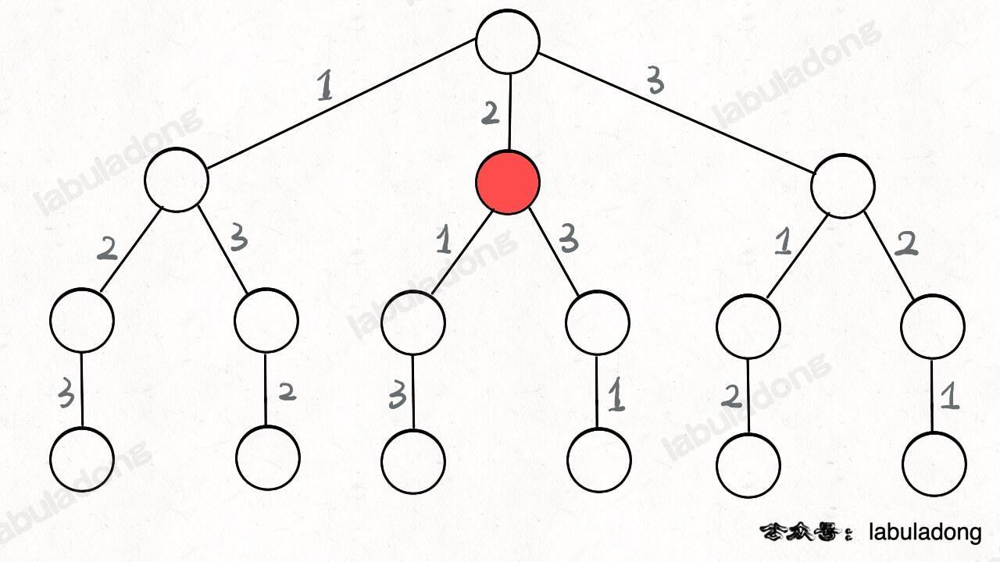

你现在就在做决策，可以选择 1 那条树枝，也可以选择 3 那条树枝。为啥只能在 1 和 3 之中选择呢？因为 2 这个树枝在你身后，这个选择你之前做过了，而全排列是不允许重复使用数字的。

**现在可以解答开头的几个名词：`[2]` 就是「路径」，记录你已经做过的选择；`[1,3]` 就是「选择列表」，表示你当前可以做出的选择；「结束条件」就是遍历到树的底层叶子节点，这里也就是选择列表为空的时候**。

如果明白了这几个名词，可以把「路径」和「选择」列表作为决策树上每个节点的属性，比如下图列出了几个蓝色节点的属性：


**我们定义的 `backtrack` 函数其实就像一个指针，在这棵树上游走，同时要正确维护每个节点的属性，每当走到树的底层叶子节点，其「路径」就是一个全排列**。

各种搜索问题其实都是树的遍历问题，而多叉树的遍历框架就是这样：

```go
func traverse(root *TreeNode) {
    if root == nil {
        return
    }
    // 前序位置
    for child := range root.children {
        traverse(child)
    }
    // 后序位置
}
```

回溯算法的遍历框架：

```go
func traverse(root *TreeNode) {
    for child := range root.children {
        // 前序位置
        traverse(child)
        // 后序位置
    }
}
```

PS：细心的读者肯定会疑问：多叉树 DFS 遍历框架的前序位置和后序位置应该在 for 循环外面，并不应该是在 for 循环里面呀？为什么在回溯算法中跑到 for 循环里面了？

而所谓的前序遍历和后序遍历，他们只是两个很有用的时间点，我给你画张图你就明白了：

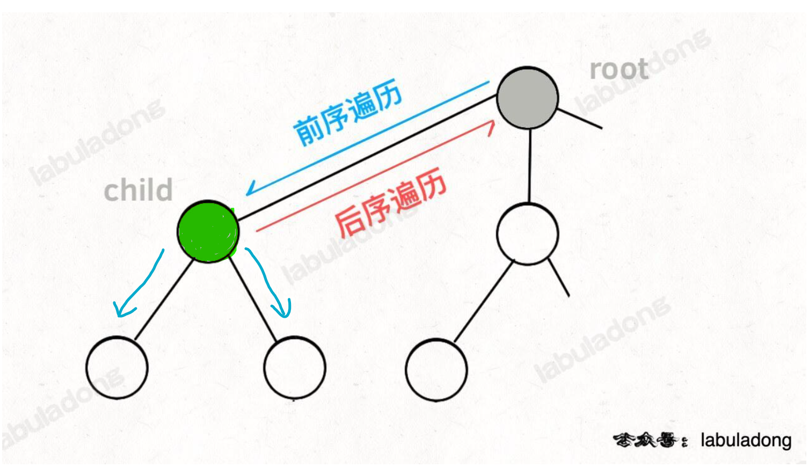

**前序遍历的代码在进入某一个节点之前的那个时间点执行，后序遍历代码在离开某个节点之后的那个时间点执行**。

==对于绿色节点`child`来说，`dfs`就是进出节点之前的操作，如从`child`进入其孩子节点之前的操作就是前序遍历，从`child`出去之后的的操作就是后序遍历==

回想我们刚才说的，**「路径」和「选择」是每个节点的属性，函数在树上游走要正确处理节点的属性，**那么就要在这两个特殊时间点搞点动作：

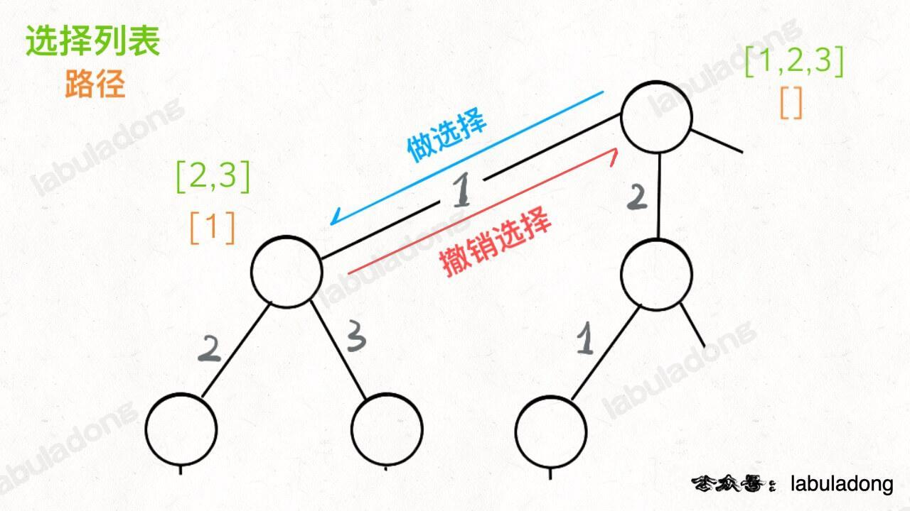

- **`dfs`重点是对节点的遍历，而其前序和后序是站在树的边上，在进入节点和退出节点（往回进入树边）的时候做一些事情。**

- **回溯算法重点是对边的遍历，而其选择操作是站在树的节点处，在进入树边和退出树边（往回进入节点）的时候做一些事情。**

**两者在代码方面上体现的区别：**

```go
// DFS 算法，关注点在节点
func traverse(root *TreeNode) {
    if root == nil {
        return
    }
    fmt.Printf("进入节点 %s ", root.Val)
    for child := range root.children {
        traverse(child)
    }
    fmt.Printf("退出节点 %s", root.Val)
}

// 回溯算法，关注点在树枝
func traverse(root *TreeNode) {
    if root == nil {
        return
    }
    // 回溯关注的是对每一条边的选择，因此在for里选择
    for child := range root.children {
        // 做选择
        // 将该选择从选择列表移除
    	// 路径.add(选择)
        fmt.Printf("从 %s 到 %s ", root, child)
        traverse(child)
        // 撤销选择
        // 路径.remove(选择)
    	// 将该选择再加入选择列表
        fmt.Printf("从 %s 到 %s ", child, root)
    }
}
```

**我们只要在递归之前做出选择，在递归之后撤销刚才的选择**，就能正确得到每个节点的选择列表和路径。


**代码**

```go
func permute(nums []int) [][]int {
    res := [][]int{}
    // 使用track记录路径
    track := []int{}
    // 「路径」中的元素会被标记为 true，避免重复使用
    used := make([]bool, len(nums))

    // 路径：记录在 track 中
    // 选择列表：nums 中不存在于 track 的那些元素（used[i] 为 false）
    // 结束条件：nums 中的元素全都在 track 中出现
    var backtrack func() 
    backtrack = func() {
        // 触发结束条件
        if len(track) == len(nums) {
            tmp := make([]int, len(track))
            copy(tmp, track)  
            res = append(res, tmp)
            return
        }

        for i, val := range nums {
            // 排除不合法的选择
            if used[i] {
                // nums[i] 已经在 track 中，跳过
                continue
            }
            // 做选择
            track = append(track, val)
            used[i] = true
            // 进入下一层决策树
            backtrack()
            // 撤销选择
            track = track[:len(track)-1]
            used[i] = false
        }
    }

    backtrack()
    return res
}
```

我们这里稍微做了些变通，没有显式记录「选择列表」，而是通过 `used` 数组排除已经存在 `track` 中的元素，从而推导出当前的选择列表：

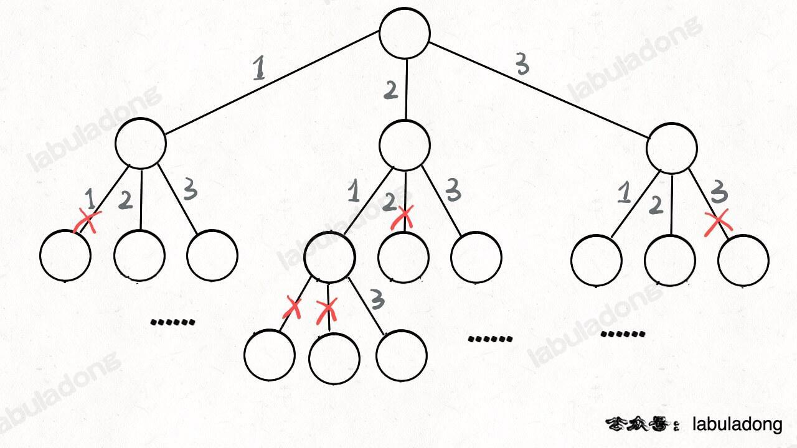

但是必须说明的是，不管怎么优化，都符合回溯框架，而且时间复杂度都不可能低于 O(N!)，因为穷举整棵决策树是无法避免的。**这也是回溯算法的一个特点，不像动态规划存在重叠子问题可以优化，回溯算法就是纯暴力穷举，复杂度一般都很高**。


#### N 皇后问题

**题目**：[51. N 皇后](https://leetcode.cn/problems/n-queens/submissions/)

**思路**：

函数 `backtrack` 依然像个在决策树上游走的指针，通过 `row` 和 `col` 就可以表示函数遍历到的位置，通过 `isValid` 函数可以将不符合条件的情况剪枝：


**代码**：

```go
func solveNQueens(n int) [][]string {
    // 返回所有的放置结果
    res := [][]string{}
    // board 表示初始的空棋盘
    board := make([][]byte, n)
    for i := range board {
        board[i] = make([]byte, n)
        for j := range board[i] {
            board[i][j] = '.'
        }
    }

    var backtrack func(row int) 
    backtrack = func(row int) {
        // 触发结束条件
        if row == n {
            str := make([]string, 0, n)
            for _, b := range board {
                tmp := string(b)
                str = append(str, tmp)
            }
            res = append(res, str)
            return
        }

        for col := 0; col < n; col++ {
            // 排除非法选择
            if !isVaild(board, row, col) {
                continue
            }
            // 做选择
            board[row][col] = 'Q'
            // 进入下一层的决策
            backtrack(row+1)
            // 撤销选择
            board[row][col] = '.'
        }
    }
    backtrack(0)
    return res
}

/* 是否可以在 board[row][col] 放置皇后？ */
func isVaild(board [][]byte, row, col int) bool {
    n := len(board)
    // 检查列是否有皇后互相冲突
    for i := 0; i <= row; i++ {
        if board[i][col] == 'Q' {
            return false
        }
    }
    // 以row为x轴，col为y轴，注意坐标
    b, c := col + row, col - row 
    // 直线为：y = x + b, y = -x + c
    for i := row; i >= 0; i-- {
        // 检查右上方是否有皇后互相冲突
        if b - i < n && board[i][b-i] == 'Q' {
            return false 
        }
        // 检查左上方是否有皇后互相冲突
        if i + c >= 0 && board[i][i+c] == 'Q' {
            return false 
        }
    }
    return true
}
```

以上的代码是显示记录路径，但如果只需要可行的路径数时，我们可以使用一个访问列表，隐式记录路径：

```go
func solveNQueens(n int) int {
	// 返回所有的放置结果
	res := 0
	// 由于只需要记录最后的放置位置，因此只需一个一维数组即可
	track := make([]int, 0, n)

	var backtrack func(row int)
	backtrack = func(row int) {
		// 触发结束条件
		if row >= n {
			res++
			return
		}
		for col := 0; col < n; col++ {
			// 排除非法选择
			if !isVaild(track, row, col) {
				continue
			}
			// 做选择
			track = append(track, col)
			// 进入下一层的决策
			backtrack(row + 1)
			// 撤销选择
			track = track[:len(track)-1]
		}
	}
	backtrack(0)
	return res
}

/* 是否可以在 board[row][col] 放置皇后？ */
func isVaild(track []int, row, col int) bool {
	// 判断非法条件
	// 检查列是否有皇后互相冲突
	// 检查斜率为正负1位置是否互相冲突
	for i := 0; i < row; i++ {
		if abs(row-i) == abs(col-track[i]) || track[i] == col {
			return false
		}
	}

	return true
}

func abs(a int) int {
	if a < 0 {
		return -a
	}
	return a
}
```


#### 集合划分问题

**题目**：[698. 划分为k个相等的子集](https://leetcode.cn/problems/partition-to-k-equal-sum-subsets/)

**思路**

##### 以数字的视角

用 for 循环迭代遍历 `nums` 数组大家肯定都会：

```go
for i := range nums {
    fmt.Println(nums[i])
}
```

递归遍历数组

```go
func traverse(nums []int, index int) {
    if index == len(nums) {
        return
    }
    fmt.Println(nums[index])
    traverse(nums, index+1)
} 

traverse(nums, 0)
```

那么回到这道题，以数字的视角，选择 `k` 个桶（每个数字都要选择一个桶，因此要遍历所有数字，对桶做出选择），用 for 循环写出来是下面这样：

```go
// k 个桶（集合），记录每个桶装的数字之和
bucket := make([]int, k)

// 穷举 nums 中的每个数字
for i, val := range nums {
    // 穷举每个桶
    for j := 0; j < k; j++ {
        // nums[index] 选择是否要进入第 i 个桶
        // ...
    }
}
```

改成递归模式

```go
// k 个桶（集合），记录每个桶装的数字之和
bucket := make([]int, k)

func backtrack(nums []int, index int) {
    // base case
    if index == len(nums) {
        // 检查所有桶的数字之和是否都是 target
        for _, val := range ba
 
        
        
        
        
        return
    }
    // 穷举每个桶
    for j := 0; j < k; j++ {
        // 选择装进第i个桶
        bucket[i] += nums[index]
        // 递归穷举下一个数字的选择
        backtrack(nums, index+1)
        // 撤销选择
        bucket[i] -= nums[index]
    }
}
```


```go
func canPartitionKSubsets(nums []int, k int) bool {
    // k 个桶（集合），记录每个桶装的数字之和
    bucket := make([]int, k)
    // 理论上每个桶（集合）中数字的和 target
    sum := 0
    for _, val := range nums {
        sum += val
    }
    target := sum / k
    sort.Ints(nums)

    var baccktrack func(index int) bool 
    baccktrack = func(index int) bool {
        // base case
        if index == len(nums) {
            // 检查所有桶的数字之和是否都是 target
            for _, val := range bucket {
                if val != target {
                    return false
                }
            }
            // nums 成功平分成 k 个子集
            return true
        }

        // 穷举每个桶
        for i := range bucket {
            // 剪枝，桶装装满了
            if bucket[i] + nums[index] > target {
                continue 
            }
            // 选择装进第 i 个桶
            bucket[i] += nums[index]
            // 递归穷举下一个数字的选择
            if baccktrack(index+1) {
                return true
            }
            // 撤销选择
            bucket[i] -= nums[index]
        }
        // nums[index] 装入哪个桶都不行
        return false
    }

    return baccktrack(0)
}
```


##### 以桶的视角

**以桶的视角进行穷举，每个桶需要遍历 `nums` 中的所有数字，决定是否把当前数字装进桶中；当装满一个桶之后，还要装下一个桶，直到所有桶都装满为止**。

这个思路可以用下面这段代码表示出来：

```go
// 装满所有桶为止
for k > 0 {
    // 记录当前桶中的数字之和
    bucket := 0
    for i := 0; i < len(nums); i++ {
        // 决定是否将 nums[i] 放入当前桶中
        if canAdd(bucket, nums[i]) {
            bucket += nums[i]
        }
        if bucker == target {
            // 装满了一个桶，装下一个桶
            k--
            break
        }
    }
}
```

那么我们也可以把这个 while 循环改写成递归函数，不过比刚才略微复杂一些，首先写一个 `backtrack` 递归函数出来：

```go
func backtrack(k, bucket, start, target int, nums []int, used []bool) 
```

现在 `k` 号桶正在思考是否应该把 `nums[start]` 这个元素装进来；目前 `k` 号桶里面已经装的数字之和为 `bucket`；`used` 标志某一个元素是否已经被装到桶中；`target` 是每个桶需要达成的目标和。

根据这个函数定义，可以这样调用 `backtrack` 函数：

```go
func canPartitionKSubsets(nums []int, k int) {
    // 排除一些基本情况
    if k > len(nums) {
        // 数字不够分
        return false
    }
    sum := 0
    for _, v := range nums {
        sum += v
    }
    if sum % k != 0 {
        // 不能平分
        return false
    }
    // 标记数字是否以放入桶里
    used := make([]bool, len(nums))
    target := sum / k
    // k号桶初始什么都没装，从nums[0]开始做选择
    return backtrack(k, 0, nums, used, target)
}
```

实现 `backtrack` 函数的逻辑之前，再重复一遍，从桶的视角：

1、需要遍历 `nums` 中所有数字，决定哪些数字需要装到当前桶中。

2、如果当前桶装满了（桶内数字和达到 `target`），则让下一个桶开始执行第 1 步。

下面的代码就实现了这个逻辑：

```go
// 以桶的视角
func canPartitionKSubsets(nums []int, k int) bool {
	// 排除一些基本情况
	if k > len(nums) {
		// 数字不够分
		return false
	}
	sum := 0
	for _, v := range nums {
		sum += v
	}
	if sum%k != 0 {
		// 不能平分
		return false
	}
	// 标记数字是否以放入桶里
	used := make([]bool, len(nums))
	target := sum / k

	var backtrack func(index, start, bucket int) bool
	backtrack = func(index, start, bucket int) bool {
		// base case
		if index == 0 {
			// 所有桶都被装满了，而且 nums 一定全部用完了
			// 因为 target == sum / k
			return true
		}
		if target == bucket {
			// 装满了当前桶，递归穷举下一个桶的选择
			// 让下一个桶从 nums[0] 开始选数字
			return backtrack(index-1, 0, 0)
		}

		// 从 start 开始向后探查有效的 nums[i] 装入当前桶
		for i, val := range nums[start:] {
			// 剪枝
			if used[i+start] {
				// nums[i] 已经被装入别的桶中
				continue
			}
			if val+bucket > target {
				// 当前桶装不下 nums[i]
				continue
			}
			// 做选择，将 nums[i] 装入当前桶中
			bucket += val
			used[i+start] = true
			// 递归穷举下一个数字是否装入当前桶
			if backtrack(index, i+1, bucket) {
				return true
			}
			// 撤销选择
			bucket -= val
			used[i+start] = false
		}
		// 穷举了所有数字，都无法装满当前桶
		return false
	}

	// k号桶初始什么都没装，从nums[0]开始做选择
	return backtrack(k, 0, 0)
}
```

**这段代码是可以得出正确答案的，但是效率很低，我们可以思考一下是否还有优化的空间**。

首先，在这个解法中每个桶都可以认为是没有差异的，但是我们的回溯算法却会对它们区别对待，这里就会出现重复计算的情况。

什么意思呢？我们的回溯算法，说到底就是穷举所有可能的组合，然后看是否能找出和为 `target` 的 `k` 个桶（子集）。

那么，比如下面这种情况，`target = 5`，算法会在第一个桶里面装 `1, 4`，然后以此类推，对后面的元素进行穷举，凑出若干个和为 5 的桶（子集）。

**但问题是，如果最后发现无法凑出和为 `target` 的 `k` 个子集，算法会怎么做？**

回溯算法会回溯到第一个桶，重新开始穷举，现在它知道第一个桶里装 `1, 4` 是不可行的，它会尝试把 `2, 3` 装到第一个桶里（回到上一步）：


现在第一个桶装满了，就开始装第二个桶，算法会装入 `1, 4`：


好，到这里你应该看出来问题了，这种情况其实和之前的那种情况是一样的。也就是说，到这里你其实已经知道不需要再穷举了，必然凑不出来和为 `target` 的 `k` 个子集。

但我们的算法还是会傻乎乎地继续穷举，因为在她看来，第一个桶和第二个桶里面装的元素不一样，那这就是两种不一样的情况呀。

那么我们怎么让算法的智商提高，识别出这种情况，避免冗余计算呢？

你注意这两种情况的 `used` 数组肯定长得一样，所以 `used` 数组可以认为是回溯过程中的「状态」。

**所以，我们可以用一个 `memo` 备忘录，在装满一个桶时记录当前 `used` 的状态，如果当前 `used` 的状态是曾经出现过的，那就不用再继续穷举，从而起到剪枝避免冗余计算的作用**。

有读者肯定会问，`used` 是一个布尔数组，怎么作为键进行存储呢？这其实是小问题，比如我们可以把数组转化成字符串，这样就可以作为哈希表的键进行存储了。

```go
// 以桶的视角
func canPartitionKSubsets(nums []int, k int) bool {
	// 其他逻辑不变
    
	// 备忘录，存储 used 数组的状态
	memo := map[string]bool{}
	target := sum / k

	var backtrack func(index, start, bucket int) bool
	backtrack = func(index, start, bucket int) bool {
		// base case
		if index == 0 {
			// 所有桶都被装满了，而且 nums 一定全部用完了
			// 因为 target == sum / k
			return true
		}
		// 将 used 的状态转化成形如 [true, false, ...] 的字符串
		// 便于存入 HashMap
		var state bytes.Buffer
		for _, ud := range used {
			if ud {
				state.WriteByte('1')
			} else {
				state.WriteByte('0')
			}
		}
		if target == bucket {
			// 装满了当前桶，递归穷举下一个桶的选择
			res := backtrack(index-1, 0, 0)
			// 将当前状态和结果存入备忘录
			memo[state.String()] = res
			return res
		}

		if value, ok := memo[state.String()]; ok {
			// 如果当前状态曾今计算过，就直接返回，不要再递归穷举了
			return value
		}

		// 其他逻辑不变
	}

	// k号桶初始什么都没装，从nums[0]开始做选择
	return backtrack(k, 0, 0)
}
```

这样提交解法，发现执行效率依然比较低，这次不是因为算法逻辑上的冗余计算，而是代码实现上的问题。

**因为每次递归都要把 `used` 数组转化成字符串，这对于编程语言来说也是一个不小的消耗，所以我们还可以进一步优化**。

注意题目给的数据规模 `nums.length <= 16`，也就是说 `used` 数组最多也不会超过 16，那么我们完全可以用「位图」的技巧，用一个 int 类型的 `used` 变量来替代 `used` 数组。

**具体来说，我们可以用整数 `used` 的第 `i` 位（`(used >> i) & 1`）的 1/0 来表示 `used[i]` 的 true/false。**

这样一来，不仅节约了空间，而且整数 `used` 也可以直接作为键存入 HashMap，省去数组转字符串的消耗。

```go
// 以桶的视角
func canPartitionKSubsets(nums []int, k int) bool {
	// 排除一些基本情况
	if k > len(nums) {
		// 数字不够分
		return false
	}
	sum := 0
	for _, v := range nums {
		sum += v
	}
	if sum%k != 0 {
		// 不能平分
		return false
	}
	// 使用位图标记是否以放入桶里
	used := 0
	// 备忘录，存储 used 数组的状态
	memo := map[int]bool{}
	target := sum / k

	var backtrack func(index, start, bucket int) bool
	backtrack = func(index, start, bucket int) bool {
		// base case
		if index == 0 {
			// 所有桶都被装满了，而且 nums 一定全部用完了
			// 因为 target == sum / k
			return true
		}

		if target == bucket {
			// 装满了当前桶，递归穷举下一个桶的选择
			res := backtrack(index-1, 0, 0)
			// 将当前状态和结果存入备忘录
			memo[used] = res
			return res
		}

		if value, ok := memo[used]; ok {
			// 如果当前状态曾今计算过，就直接返回，不要再递归穷举了
			return value
		}

		// 从 start 开始向后探查有效的 nums[i] 装入当前桶
		for i, val := range nums[start:] {
			// 剪枝
			if used>>(i+start)&1 == 1 { // 判断第 i+start 位是否是 1
				// nums[i] 已经被装入别的桶中
				continue
			}
			if val+bucket > target {
				// 当前桶装不下 nums[i]
				continue
			}
			// 做选择，将 nums[i] 装入当前桶中
			bucket += val
			used |= 1 << (start + i) // 将第 i+start 位置为 1
			// 递归穷举下一个数字是否装入当前桶
			if backtrack(index, i+1, bucket) {
				return true
			}
			// 撤销选择
			bucket -= val
			used ^= 1 << (start + i) // 使用异或运算将第 i+start 位恢复 0
		}
		// 穷举了所有数字，都无法装满当前桶
		return false
	}

	// k号桶初始什么都没装，从nums[0]开始做选择
	return backtrack(k, 0, 0)
}
```


**总结**

本文写的这两种思路都可以算出正确答案，不过第一种解法即便经过了排序优化，也明显比第二种解法慢很多，这是为什么呢？

我们来分析一下这两个算法的时间复杂度，假设 `nums` 中的元素个数为 `n`。

先说第一个解法，也就是从数字的角度进行穷举，`n` 个数字，每个数字有 `k` 个桶可供选择，所以组合出的结果个数为 `k^n`，时间复杂度也就是 `O(k^n)`。

第二个解法，每个桶要遍历 `n` 个数字，对每个数字有「装入」或「不装入」两种选择，所以组合的结果有 `2^n` 种；而我们有 `k` 个桶，所以总的时间复杂度为 `O(k*2^n)`。

**当然，这是对最坏复杂度上界的粗略估算，实际的复杂度肯定要好很多，毕竟我们添加了这么多剪枝逻辑**。不过，从复杂度的上界已经可以看出第一种思路要慢很多了。

所以，谁说回溯算法没有技巧性的？虽然回溯算法就是暴力穷举，但穷举也分聪明的穷举方式和低效的穷举方式，关键看你以谁的「视**角」进行穷举。**

**通俗来说，我们应该尽量「少量多次」，就是说宁可多做几次选择（乘法关系），也不要给太大的选择空间（指数关系）；做 `n` 次「`k` 选一」仅重复一次（`O(k^n)`），比 `n` 次「二选一」重复 `k` 次（`O(k*2^n)`）效率低很多。**

--------------------------


### 排列-组合-子集的九种变化问题

无论是排列、组合还是子集问题，简单说无非就是让你从序列 `nums` 中以给定规则取若干元素，主要有以下几种变体：

**形式一、元素无重不可复选，即 `nums` 中的元素都是唯一的，每个元素最多只能被使用一次，这也是最基本的形式**。

以组合为例，如果输入 `nums = [2,3,6,7]`，和为 7 的组合应该只有 `[7]`。

**形式二、元素可重不可复选，即 `nums` 中的元素可以存在重复，每个元素最多只能被使用一次**。

以组合为例，如果输入 `nums = [2,5,2,1,2]`，和为 7 的组合应该有两种 `[2,2,2,1]` 和 `[5,2]`。

**形式三、元素无重可复选，即 `nums` 中的元素都是唯一的，每个元素可以被使用若干次**。

以组合为例，如果输入 `nums = [2,3,6,7]`，和为 7 的组合应该有两种 `[2,2,3]` 和 `[7]`。


当然，也可以说有第四种形式，即元素可重可复选。但既然元素可复选，那又何必存在重复元素呢？元素去重之后就等同于形式三，所以这种情况不用考虑。

上面用组合问题举的例子，但排列、组合、子集问题都可以有这三种基本形式，所以共有 9 种变化。

除此之外，题目也可以再添加各种限制条件，比如让你求和为 `target` 且元素个数为 `k` 的组合，那这么一来又可以衍生出一堆变体，怪不得面试笔试中经常考到排列组合这种基本题型。


**但无论形式怎么变化，其本质就是穷举所有解，而这些解呈现树形结构，所以合理使用回溯算法框架，稍改代码框架即可把这些问题一网打尽**。记住如下子集问题和排列问题的回溯树，就可以解决所有排列组合子集相关的问题：


为什么只要记住这两种树形结构就能解决所有相关问题呢？

**首先，组合问题和子集问题其实是等价的，这个后面会讲；至于之前说的三种变化形式，无非是在这两棵树上剪掉或者增加一些树枝罢了**。

那么，接下来我们就开始穷举，把排列/组合/子集问题的 9 种形式都过一遍，学学如何用回溯算法把它们一套带走。

--------------------


#### 元素无重不可复选

##### 子集（元素无重不可复选）

**题目**：[78. 子集 ](https://leetcode.cn/problems/subsets/submissions/)—— 集合不用考虑顺序

**思路**：

如何手推所有子集？

首先，生成元素个数为 0 的子集，即空集 `[]`，为了方便表示，我称之为 `S_0`。

然后，在 `S_0` 的基础上生成元素个数为 1 的所有子集，我称为 `S_1`：

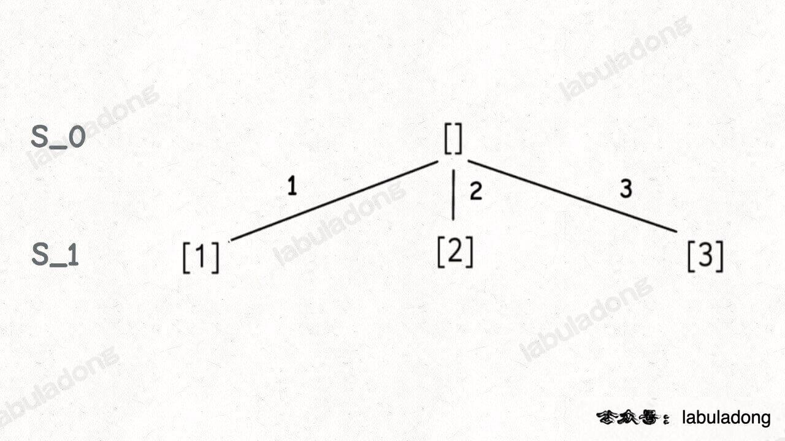

接下来，我们可以在 `S_1` 的基础上推导出 `S_2`，即元素个数为 2 的所有子集：

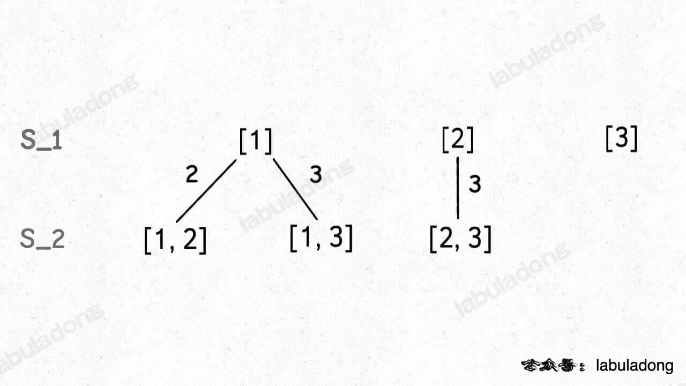

为什么集合 `[2]` 只需要添加 `3`，而不添加前面的 `1` 呢？

**因为集合中的元素不用考虑顺序， `[1,2,3]` 中 `2` 后面只有 `3`，如果你向前考虑 `1`，那么 `[2,1]` 会和之前已经生成的子集 `[1,2]` 重复。**

**换句话说，我们通过保证元素之间的相对顺序不变来防止出现重复的子集**。

接着，我们可以通过 `S_2` 推出 `S_3`，实际上 `S_3` 中只有一个集合 `[1,2,3]`，它是通过 `[1,2]` 推出的。

整个推导过程就是这样一棵树：


注意这棵树的特性：

**如果把根节点作为第 0 层，将每个节点和根节点之间树枝上的元素作为该节点的值，那么第 `n` 层的所有节点就是大小为 `n` 的所有子集**。

你比如大小为 2 的子集就是这一层节点的值（当遇到子集大小满足k的问题，其答案就是该k层）：


那么再进一步，**如果想计算所有子集，那只要遍历这棵多叉树，把所有节点的值收集起来不就行了？** —— 因此可以使用 **前序 + 回溯** 。

**代码**

```go
func subsets(nums []int) [][]int {
    res := [][]int{}

    // 标记数组，true表示该数字已被选
    // visited := make([]bool, len(nums))
    track := []int{} // 记录其中一个子数组

    var backtrack func(start int) 
    backtrack = func(start int) {
        // base case
        // if start == len(nums) {
        //     tmp := make([]int, len(track))
        //     copy(tmp, track)
        //     res = append(res, tmp)
        // }
        // 前序位置，每个节点的值都是一个子集
        tmp := make([]int, len(track))
        copy(tmp, track)
        res = append(res, tmp)

        for i := start; i < len(nums); i++ {
            // 剪枝，不用剪

            // 做选择
            track = append(track, nums[i])
            backtrack(i+1)
            // 撤销选择
            track = track[:len(track)-1]
        }
    }

    backtrack(0)
    return res
}
```

们使用 `start` 参数控制树枝的生长避免产生重复的子集，用 `track` 记录根节点到每个节点的路径的值，同时在前序位置把每个节点的路径值收集起来，完成回溯树的遍历就收集了所有子集：

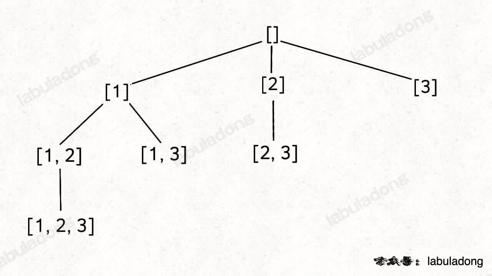

最后，`backtrack` 函数开头看似没有 base case，会不会进入无限递归？

其实不会的，当 `start == nums.length` 时，叶子节点的值会被装入 `res`，但 for 循环不会执行，也就结束了递归。


##### 组合（元素无重不可复选）

**题目**：[77. 组合](https://leetcode.cn/problems/combinations/)

**思路**：

你比如说，让你在 `nums = [1,2,3]` 中拿 2 个元素形成所有的组合，你怎么做？

稍微想想就会发现，大小为 2 的所有组合，不就是所有大小为 2 的子集嘛。

**所以我说组合和子集是一样的：大小为 `k` 的组合就是大小为 `k` 的子集**。

这是标准的组合问题，但我给你翻译一下就变成子集问题了：

**给你输入一个数组 `nums = [1,2..,n]` 和一个正整数 `k`，请你生成所有大小为 `k` 的子集**。

还是以 `nums = [1,2,3]` 为例，刚才让你求所有子集，就是把所有节点的值都收集起来；**现在你只需要把第 2 层（根节点视为第 0 层）的节点收集起来，就是大小为 2 的所有组合**：

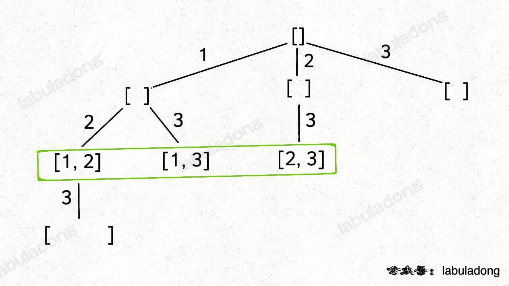

**代码**

```go
// 组合问题 —— 回溯
// k个数的组合 —— 决策树的第k层
func combine(n int, k int) [][]int {
    res := [][]int{}

    // 记录一个组合
    track := make([]int, 0, k)

    var backtrack func(start int) 
    backtrack = func(start int) {
        // base case
        if len(track) == k {
            tmp := make([]int, len(track))
            copy(tmp, track)
            res = append(res, tmp)
        }
        // 剪枝，加上剩余的元素也不够k个元素
        if len(track) + n - start + 1 < k {
            return
        }

        for i := start; i <= n; i++ {
            // 做选择
            track = append(track, i)
            backtrack(i+1)
            // 撤销选择
            track = track[:len(track)-1]
        }
    }

    backtrack(1)
    return res
}
```


##### 排列（元素无重不可复选）


刚才讲的组合/子集问题使用 `start` 变量保证元素 `nums[start]` 之后只会出现 `nums[start+1..]` 中的元素，通过固定元素的相对位置保证不出现重复的子集。

**但排列问题本身就是让你穷举元素的位置，`nums[i]` 之后也可以出现 `nums[i]` 左边的元素，所以之前的那一套玩不转了，需要额外使用 `used` 数组来标记哪些元素还可以被选择**。

标准全排列可以抽象成如下这棵多叉树：

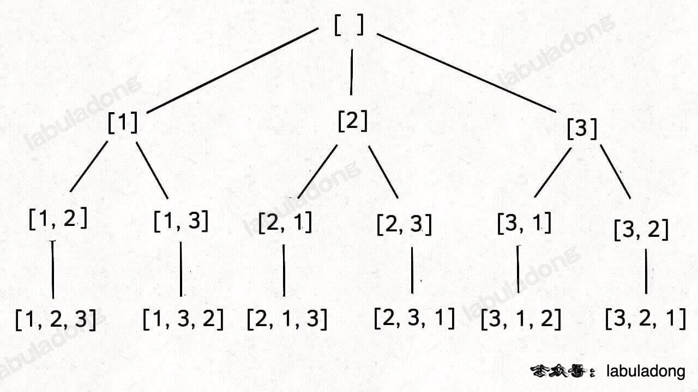

我们用 `used` 数组标记已经在路径上的元素避免重复选择，然后收集所有叶子节点上的值，就是所有全排列的结果：


**排列问题在[全排列问题](####全排列问题)有详细代码**

但如果题目不让你算全排列，而是让你算元素个数为 `k` 的排列，怎么算？

也很简单，改下 `backtrack` 函数的 base case，仅收集第 `k` 层的节点值即可

```go
   	// 回溯算法核心框架
	backtrack = func() {
        // 触发结束条件
		// base case，到达第 k 层，收集节点的值
        if len(track) == k {
            // 第 k 层节点的值就是大小为 k 的排列
            tmp := make([]int, len(track))
            copy(tmp, track)
            res = append(res, tmp)
            return
        }

		// 其余代码逻辑不变
    }

```


#### 元素可重不可复选


##### 子集/组合（元素有重不可复选）

**题目**： [90. 子集 II](https://leetcode.cn/problems/subsets-ii/)

**思路**：

就以 `nums = [1,2,2]` 为例，为了区别两个 `2` 是不同元素，后面我们写作 `nums = [1,2,2']`。

按照之前的思路画出子集的树形结构，显然，两条值相同的相邻树枝会产生重复：


所以我们需要进行剪枝，如果一个节点有多条值相同的树枝相邻，则只遍历第一条，剩下的都剪掉，不要去遍历：

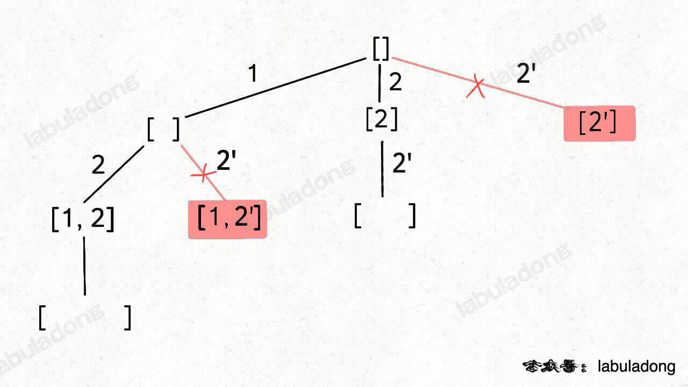

**体现在代码上，需要先进行排序，让相同的元素靠在一起，如果发现 `nums[i] == nums[i-1]`，则跳过**：

**代码**

```go
func subsetsWithDup(nums []int) [][]int {
    res := [][]int{}
    // 用于记录一组子集
    track := []int{}
    sort.Ints(nums)
    var backtrack func(start int)
    backtrack = func(start int) {
        // 需要遍历决策树的所有节点
        // 前序遍历
        tmp := make([]int, len(track))
        copy(tmp, track)
        res = append(res, tmp)

        // 回溯框架
        for i := start; i < len(nums); i++ {
            // 剪枝，需要剪掉值相同的路径
            if i > start && nums[i] == nums[i-1] {
                continue
            }
            // 选择
            track = append(track, nums[i])
            backtrack(i+1)
            // 撤销选择
            track = track[:len(track)-1]
        }
    }

    backtrack(0)
    return res
}
```

**我们说了组合问题和子集问题是等价的**，所以我们直接看一道组合的题目吧，这是力扣第 40 题「 [组合总和 II](https://leetcode.cn/problems/combination-sum-ii/)」：

给你输入 `candidates` 和一个目标和 `target`，从 `candidates` 中找出中所有和为 `target` 的组合。

`candidates` 可能存在重复元素，且其中的每个数字最多只能使用一次。

说这是一个组合问题，其实换个问法就变成子集问题了：请你计算 `candidates` 中所有和为 `target` 的子集。

所以这题怎么做呢？

对比子集问题的解法，只要额外用一个 `trackSum` 变量记录回溯路径上的元素和，然后将 base case 改一改即可解决这道题：

```go
func combinationSum2(candidates []int, target int) [][]int {
    res := [][]int{}

    track := []int{}
    // 排序数组，让相同数字在一起
    sort.Ints(candidates)
    sum := 0
    for _, val := range candidates {
        sum += val
    }

    var backtrace func(start, lSum, rSum int) 
    backtrace = func(start, lSum, rSum int) {
        // base case
        if lSum == target {
            tmp := make([]int, len(track))
            copy(tmp, track)
            res = append(res, tmp)
            return
        }

        // 回溯框架
        for i := start; i < len(candidates); i++ {
            // 剪枝
            // 重复树枝只保留一颗
            if i > start && candidates[i] == candidates[i-1] {
                continue
            }
            // 如果加上剩余值也小于target，剪枝
            if lSum + rSum < target {
                continue
            }
            // 如果加上当前值大于target，剪枝
            if lSum + candidates[i] > target {
                continue
            }

            // 做选择
            track = append(track, candidates[i])
            lSum += candidates[i]
            // 剩余数字和
            rSum -= candidates[i]
            // 递归
            backtrace(i+1, lSum, rSum)
            //撤销选择
            track = track[:len(track)-1]
            lSum -= candidates[i]
        }
    }

    backtrace(0, 0, sum)
    return res
}
```


##### 排列（元素可重不可复选）

**题目**：[47. 全排列 II](https://leetcode.cn/problems/permutations-ii/submissions/)

**思路**：

你对比一下之前的标准全排列解法代码，这段解法代码只有两处不同：

1、对 `nums` 进行了排序。

2、添加了一句额外的剪枝逻辑。

类比输入包含重复元素的子集/组合问题，你大概应该理解这么做是为了防止出现重复结果。

但是注意排列问题的剪枝逻辑，和子集/组合问题的剪枝逻辑略有不同：新增了 `!used[i - 1]` 的逻辑判断。

这个地方理解起来就需要一些技巧性了，且听我慢慢到来。为了方便研究，依然把相同的元素用上标 `'` 以示区别。

假设输入为 `nums = [1,2,2']`，标准的全排列算法会得出如下答案：

显然，这个结果存在重复，比如 `[1,2,2']` 和 `[1,2',2]` 应该只被算作同一个排列，但被算作了两个不同的排列。

所以现在的关键在于，如何设计剪枝逻辑，把这种重复去除掉？

**答案是，保证相同元素在排列中的相对位置保持不变**。

比如说 `nums = [1,2,2']` 这个例子，我保持排列中 `2` 一直在 `2'` 前面。

这样的话，你从上面 6 个排列中只能挑出 3 个排列符合这个条件：

```go
[ [1,2,2'],[2,1,2'],[2,2',1] ]
```

这也就是正确答案。

进一步，如果 `nums = [1,2,2',2'']`，我只要保证重复元素 `2` 的相对位置固定，比如说 `2 -> 2' -> 2''`(即前面的2没被使用，那后面的2就不选，即相同的数字，优先选前面的数字)，也可以得到无重复的全排列结果。

**标准全排列算法之所以出现重复，是因为把相同元素形成的排列序列视为不同的序列，但实际上它们应该是相同的；而如果固定相同元素形成的序列顺序，当然就避免了重复**。

这里拓展一下，如果你把上述剪枝逻辑中的 `!used[i - 1]` 改成 `used[i - 1]`，其实也可以通过所有测试用例，但效率会有所下降，这是为什么呢？

之所以这样修改不会产生错误，是因为这种写法相当于维护了 `2'' -> 2' -> 2` 的相对顺序，最终也可以实现去重的效果。

但为什么这样写效率会下降呢？因为这个写法剪掉的树枝不够多。

比如输入 `nums = [2,2',2'']`，产生的回溯树如下：

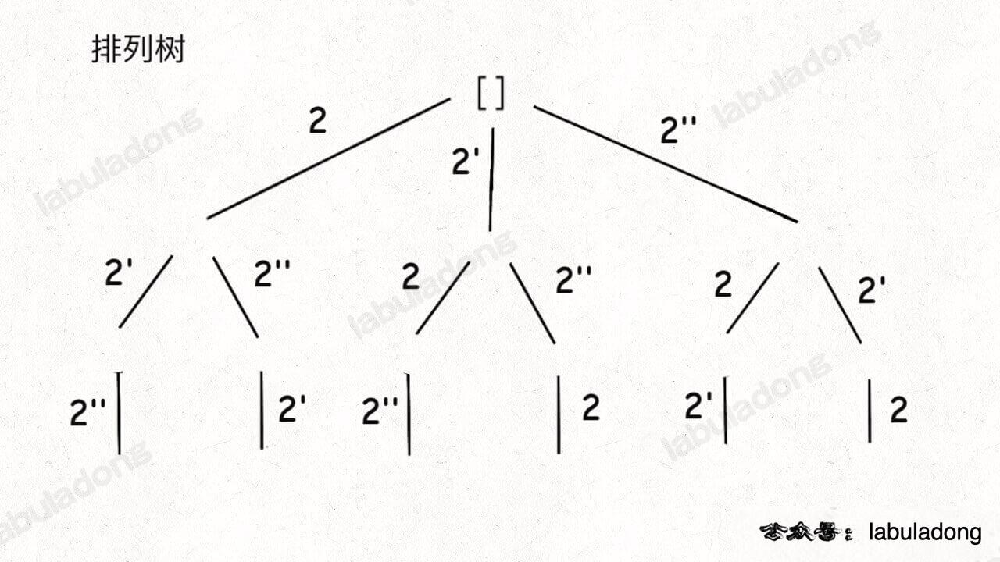

如果用绿色树枝代表 `backtrack` 函数遍历过的路径，红色树枝代表剪枝逻辑的触发，那么 `!used[i - 1]` 这种剪枝逻辑得到的回溯树长这样：

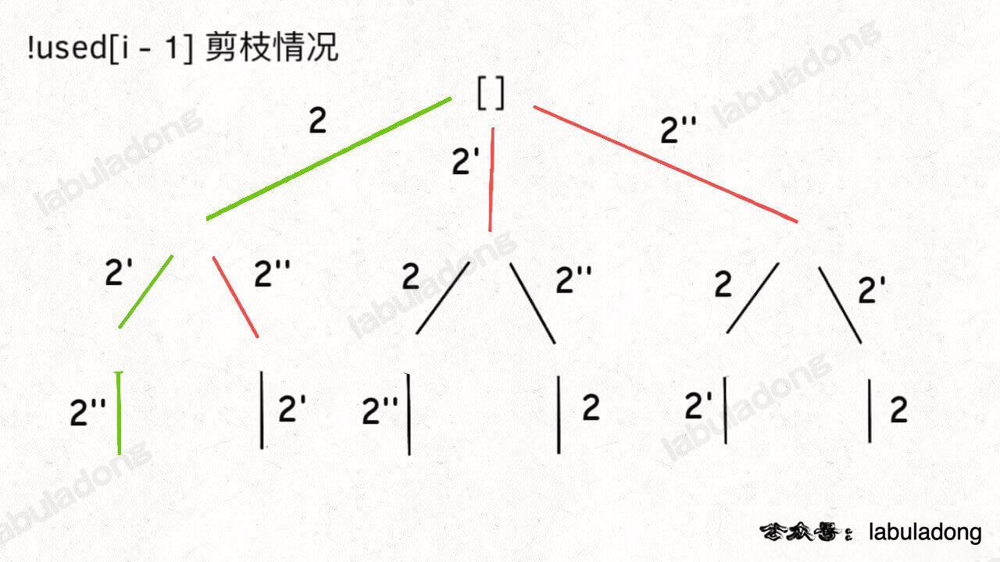

而 `used[i - 1]` 这种剪枝逻辑得到的回溯树如下：

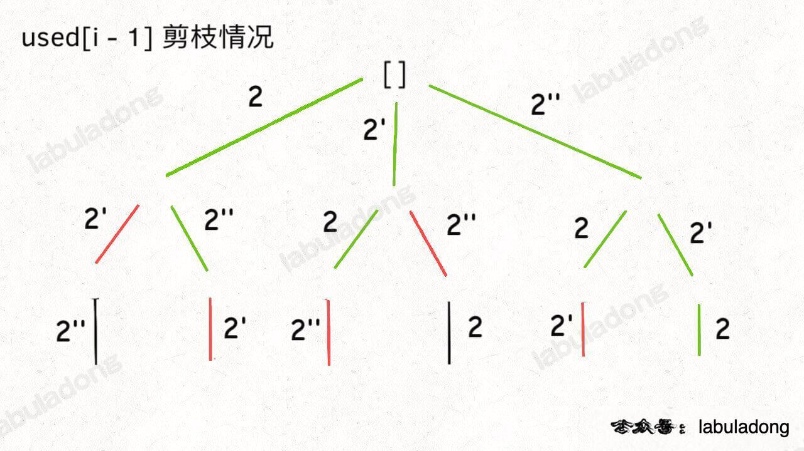

可以看到，`!used[i - 1]` 这种剪枝逻辑剪得干净利落，而 `used[i - 1]` 这种剪枝逻辑虽然也能得到无重结果，但它剪掉的树枝较少，存在的无效计算较多，所以效率会差一些。


**代码**：

```go
func permuteUnique(nums []int) [][]int {
    res := [][]int{}

    track := make([]int, 0, len(nums))
    sort.Ints(nums)
    // 标记数组
    visit := make([]bool, len(nums))

    var backtrace func() 
    backtrace = func() {
        // base case
        if len(track) == len(nums) {
            tmp := make([]int, len(track))
            copy(tmp, track)
            res = append(res, tmp)
            return
        }

        // 回溯框架
        for i := 0; i < len(nums); i++ {
            // 剪枝
            // 1. 已经选过的数字，剪枝
            if visit[i] {
                continue
            }
            // 2. 如果前面的相邻相等元素没有用过，剪枝
            if i > 0 && !visit[i-1] && nums[i-1] == nums[i] {
                continue
            }

            // 选择
            track = append(track, nums[i])
            visit[i] = true
            backtrace()
            // 撤销选择
            track = track[:len(track)-1]
            visit[i] = false
        }
    }
    backtrace()
    return res
}
```


--------------------


#### 元素无重可复选


##### 子集/组合（元素无重可复选）

**题目**：[39. 组合总和](https://leetcode.cn/problems/combination-sum/submissions/)

**思路**：

这个 `i` 从 `start` 开始，那么下一层回溯树就是从 `start + 1` 开始，从而保证 `nums[start]` 这个元素不会被重复使用：


**那么反过来，如果我想让每个元素被重复使用，我只要把 `i + 1` 改成 `i` 即可：**

```go
    backtrace = func(start int) {
		// ...
        // 递归框架
        for i := start; i < len(candidates); i++ {
            // ...
            backtrace(i)
            // ...
        }
    }
```

这相当于给之前的回溯树添加了一条树枝，在遍历这棵树的过程中，一个元素可以被无限次使用：


当然，这样这棵回溯树会永远生长下去，所以我们的递归函数需要设置合适的 base case 以结束算法，即路径和大于 `target` 时就没必要再遍历下去了。

-------------------------


**代码**

```go
func combinationSum(candidates []int, target int) [][]int {
    res := [][]int{}

    track := []int{}
    sort.Ints(candidates)
    sum := 0

    var backtrace func(start int) 
    backtrace = func(start int) {
        // base case
        if target == sum {
            tmp := make([]int, len(track))
            copy(tmp, track)
            res = append(res, tmp)
            return
        }
        if sum > target {
            return 
        }

        // 递归框架
        for i := start; i < len(candidates); i++ {
            // 剪枝， 无

            // 选择
            track = append(track, candidates[i])
            sum += candidates[i]
            backtrace(i)
            // 撤销选择
            track = track[:len(track)-1]
            sum -= candidates[i]
        }
    }

    backtrace(0)
    return res
}
```


##### 排列（元素无重可复选）

力扣上没有类似的题目，我们不妨先想一下，`nums` 数组中的元素无重复且可复选的情况下，会有哪些排列？

比如输入 `nums = [1,2,3]`，那么这种条件下的全排列共有 3^3 = 27 种：

**标准的全排列算法利用 `used` 数组进行剪枝，避免重复使用同一个元素。如果允许重复使用元素的话，直接放飞自我，去除所有 `used` 数组的剪枝逻辑就行了**。

那这个问题就简单了，代码如下：

```go
func combinationSum(candidates []int, target int) [][]int {
    res := [][]int{}
    track := []int{}

    var backtrace func() 
    backtrace = func() {
        // base case
        if len(track) == len(candidates) {
            tmp := make([]int, len(track))
            copy(tmp, track)
            res = append(res, tmp)
            return
        }

        // 回溯框架
        for i := 0; i < len(candidates); i++ {
            // 剪枝， 无

            // 选择
            track = append(track, candidates[i])
            backtrace(i)
            // 撤销选择
            track = track[:len(track)-1]
        }
    }

    backtrace()
    return res
}
```


#### 最后总结

来回顾一下排列/组合/子集问题的三种形式在代码上的区别。

由于子集问题和组合问题本质上是一样的，无非就是 base case 有一些区别，所以把这两个问题放在一起看。

**形式一、元素无重不可复选，即 `nums` 中的元素都是唯一的，每个元素最多只能被使用一次**

**形式二、元素可重不可复选，即 `nums` 中的元素可以存在重复，每个元素最多只能被使用一次**，其关键在于排序和剪枝。

**形式三、元素无重可复选，即 `nums` 中的元素都是唯一的，每个元素可以被使用若干次**，只要删掉去重逻辑即可。


### 岛屿题目

**岛屿系列题目的核心考点就是用 DFS/BFS 算法遍历二维数组**。

本文主要来讲解如何用 DFS 算法来秒杀岛屿系列题目，不过用 BFS 算法的核心思路是完全一样的，无非就是把 DFS 改写成 BFS 而已。

那么如何在二维矩阵中使用 DFS 搜索呢？如果你把二维矩阵中的每一个位置看做一个节点，这个节点的上下左右四个位置就是相邻节点，那么整个矩阵就可以抽象成一幅网状的「图」结构。

```go
// 二叉树遍历框架
func traverse(root *TreeNode) {
    traverse(root.Left)
    traverse(root.Right)
}

// 二维矩阵遍历框架

// 方向数组，分别代表上、下、左、右
dirs := [4][2]int{{-1,0}, {1,0}, {0,-1}, {0,1}};
func dfs(grid [][]int, i, j int, visit [][]bool) {
    m, n := len(grid), len(grid[0])
    if i < 0 || j < 0 || i >= m || j >= n {
        // 超出索引边界
        return
    }
    if visit[i][j] {
        // 已遍历过 (i, j)
        return
    }
    // 进入节点 (i, j)
	visit[i][j] = true
    // 递归遍历上下左右的节点
    for _, d := range dires {
        x := i + d[0]
        y := j + d[1]
        dfs(grid, x, y, visit)
    }
    // 离开节点 (i, j)
}
```

因为二维矩阵本质上是一幅「图」，所以遍历的过程中需要一个 `visited` 布尔数组防止走回头路，如果你能理解上面这段代码，那么搞定所有岛屿系列题目都很简单。

这种写法无非就是用 for 循环处理上下左右的遍历罢了，你可以按照个人喜好选择写法。


#### 岛屿数量

**题目**：[200. 岛屿数量](https://leetcode.cn/problems/number-of-islands/)

**思路**：

思路很简单，关键在于如何寻找并标记「岛屿」，这就要 DFS 算法发挥作用了.

如果可以修改原数组，那可以将原数组值设为'0'，代表将其淹没，因为遍历不用访问为'0'的海水。

如果不可以修改原数组，则需要使用一个标记数组，来标记已经登录过的岛屿，从而实现只登录未访问过的岛屿。

**代码**：

```go
func numIslands(grid [][]byte) int {
    res := 0
    m, n := len(grid), len(grid[0])
    // 方向数组，分别代表上、下、左、右
    dires := [4][2]int{{-1,0}, {1,0}, {0,-1}, {0,1}}
    visit := make([][]bool, m)
    for i := range visit {
        visit[i] = make([]bool, n)
    }
    
    // 二维矩阵遍历框架
    var dfs func(i, j int) 
    dfs = func(i, j int) {
        // 边界判断
        if i < 0 || j < 0 || i >= m || j >= n {
            return
        }
        // 登录过的岛屿或者海水
        if visit[i][j] || grid[i][j] == '0' {
            return
        }
        // 将岛屿设为已登录
        visit[i][j] = true
        //  登录四周的岛屿
        for _, d := range dires {
            x := i + d[0]
            y := j + d[1]
            dfs(x, y)
        }
    }

    for i := 0; i < m; i++ {
        for j := 0; j < n; j++ {
            if !visit[i][j] && grid[i][j] == '1' {
                // 每发现一个未登录的岛屿，岛屿数量加一
                res++
                dfs(i, j)
            }
        }
    }

    return res
}
```


#### 封闭岛屿的数量

**题目**：[1254. 统计封闭岛屿的数目](https://leetcode.cn/problems/number-of-closed-islands/)

**思路**：

**那么如何判断「封闭岛屿」呢？其实很简单，把上一题中那些靠边的岛屿排除掉，剩下的不就是「封闭岛屿」了吗**？

只要提前把靠边的陆地都淹掉，然后算出来的就是封闭岛屿了。

**代码**：

```go
func closedIsland(grid [][]int) int {
    res := 0
    m, n := len(grid), len(grid[0])
    // 方向数组
    dires := [4][2]int{{1,0}, {-1,0}, {0,1}, {0,-1}}
    // 标记数组
    visit := make([][]bool, m)
    for i := range visit {
        visit[i] = make([]bool, n)
    }

    // 递归
    var dfs func(i, j int) 
    dfs = func(i, j int) {
        // 边界判断
        if i < 0 || j < 0 || i >= m || j >= n {
            return 
        }
        // 不能登录
        if visit[i][j] || grid[i][j] == 1 {
            return 
        }
        visit[i][j] = true
        for _, d := range dires {
            x := i + d[0]
            y := j + d[1]
            dfs(x, y)
        }
    }
    
    // 将边界的岛设为无法访问，因为边界的岛不是封闭岛屿
    // 关闭上下岛
    for i := 0; i < n; i++ {
        dfs(0, i)
        dfs(m-1, i)
    } 
    // 关闭左右岛
    for i := 0; i < m; i++ {
        dfs(i, 0)
        dfs(i, n-1)
    }

    for i := 0; i < m; i++ {
        for j := 0; j < n; j++ {
            if !visit[i][j] && grid[i][j] == 0 {
                res++
                dfs(i, j)
            }
        }
    }

    return res
}
```


这道岛屿题目的解法稍微改改就可以解决力扣第 1020 题「 [飞地的数量](https://leetcode.cn/problems/number-of-enclaves/)」，这题不让你求封闭岛屿的数量，而是求封闭岛屿的面积总和。

其实思路都是一样的，先把靠边的陆地淹掉，然后去数剩下的陆地数量就行了，注意第 1020 题中 `1` 代表陆地，`0` 代表海水：

**代码**

```go
func numEnclaves(grid [][]int) int {
    m, n := len(grid), len(grid[0])
    res := 0
    // 方向数组
    dires := [4][2]int{{1,0}, {-1,0}, {0,1}, {0,-1}}
    // 标记数组
    visit := make([][]bool, m)
    for i := range visit {
        visit[i] = make([]bool, n)
    }

    var dfs func(i, j int) 
    dfs = func(i, j int) {
        // 边界问题
        if i < 0 || j < 0 || i >= m || j >= n {
            return
        }
        // 无法访问的岛屿
        if visit[i][j] || grid[i][j] == 0 {
            return
        }
        // 选择
        visit[i][j] = true
        for _, d := range dires {
            x := i + d[0]
            y := j + d[1]
            dfs(x, y)
        }
    }

    // 处理边界的岛屿，由于其可以到达网格边界
    for i := 0; i < n; i++ {
        // 将靠上边的岛屿淹没
        dfs(0, i)
        // 将靠下边的岛屿淹没
        dfs(m-1, i)
    }

    for i := 0; i < m; i++ {
        // 将靠左边的岛屿淹没
        dfs(i, 0)
        // 将靠右边的岛屿淹没
        dfs(i, n-1)
    }

    // 统计剩下的岛屿
    for i, g := range grid {
        for j := range g {
            if !visit[i][j] && grid[i][j] == 1 {
                res++
            }
        }
    }

    return res
}
```

可以看到最后阶段不用进行`dfs`，因为我们要统计岛屿数，而不是岛屿块的数量。


#### 岛屿的最大面积

**题目**：[695. 岛屿的最大面积](https://leetcode.cn/problems/max-area-of-island/)

**思路**

**这题的大体思路和之前完全一样，只不过 `dfs` 函数淹没岛屿的同时，还应该想办法记录这个岛屿的面积**。

我们可以给 `dfs` 函数设置返回值，记录每次淹没的陆地的个数，直接看解法吧

**代码**

```go
func maxAreaOfIsland(grid [][]int) int {
    m, n := len(grid), len(grid[0])
    // 方向数组
    dires := [4][2]int{{1,0}, {-1,0}, {0,1}, {0,-1}}
    visit := make([][]bool, m)
    for i := range visit {
        visit[i] = make([]bool, n)
    }

    var dfs func(i, j int) int
    dfs = func(i, j int) int {
        // 处理边界问题
        if i < 0 || j < 0 || i >= m || j >= n {
            return 0
        }
        // 无法访问的岛屿
        if visit[i][j] || grid[i][j] == 0 {
            return 0
        }

        // 选择
        visit[i][j] = true
        tmp := 0
        for _, d := range dires {
            x := i + d[0]
            y := j + d[1]
            tmp += dfs(x, y)
        }
        return tmp + 1
    }
    res := 0
    // 遍历所有岛屿
    for i, g := range grid {
        for j := range g {
            if !visit[i][j] && grid[i][j] == 1 {
                res = max(res, dfs(i, j))
            }
        }
    }

    return res
}

func max(a, b int) int {
    if a < b {
        return b
    }
    return a
}
```


#### 子岛屿数量

**题目**：[1905. 统计子岛屿](https://leetcode.cn/problems/count-sub-islands/)

**思路**

什么情况下 `grid2` 中的一个岛屿 `B` 是 `grid1` 中的一个岛屿 `A` 的子岛？

当岛屿 `B` 中所有陆地在岛屿 `A` 中也是陆地的时候，岛屿 `B` 是岛屿 `A` 的子岛。

**反过来说，如果岛屿 `B` 中存在一片陆地，在岛屿 `A` 的对应位置是海水，那么岛屿 `B` 就不是岛屿 `A` 的子岛**。

那么，我们只要遍历 `grid2` 中的所有岛屿，把那些不可能是子岛的岛屿排除掉，剩下的就是子岛。

依据这个思路，可以直接写出下面的代码：

**代码**：

```go
func countSubIslands(grid1 [][]int, grid2 [][]int) int {
    m, n := len(grid1), len(grid1[0])
    // 方向数组
    dires := [4][2]int{{1,0}, {-1,0}, {0,1}, {0,-1}}
    visit := make([][]bool, m)
    for i := range visit {
        visit[i] = make([]bool, n)
    }

    var dfs func(i, j int) 
    dfs = func(i, j int) {
        if i < 0 || j < 0 || i >= m || j >= n {
            return 
        }
        if visit[i][j] || grid2[i][j] == 0 {
            return 
        }
        visit[i][j] = true
        for _, d := range dires {
            x := i + d[0]
            y := j + d[1]
            dfs(x, y)
        }
    }

    // 把grid2中不是grid1子岛淹没掉
    for i, g := range grid1 {
        for j := range g {
            if grid1[i][j] == 0 && grid2[i][j] == 1 {
                dfs(i, j)
            }
        }
    }

    res := 0
    for i, g := range grid2 {
        for j := range g {
            if !visit[i][j] && grid2[i][j] == 1 {
                res++
                dfs(i, j)
            }
        }
    }

    return res
}
```


#### 不同的岛屿数量

**题目**：[694. 不同岛屿的数量](https://leetcode.cn/problems/number-of-distinct-islands/)

输入一个二维矩阵，`0` 表示海水，`1` 表示陆地，这次让你计算 **不同的 (distinct)** 岛屿数量，函数签名如下：

```go
func numDistinctIslands(grid [][]int)
```

比如题目输入下面这个二维矩阵：


其中有四个岛屿，但是左下角和右上角的岛屿形状相同，所以不同的岛屿共有三个，算法返回 3。

对于不同的判断，可以将字符序列化。


```go
func numDistinctIslands(grid [][]int) int {
	dires := [4][2]int{{0, -1}, {0, 1}, {-1, 0}, {1, 0}}
	m, n := len(grid), len(grid[0])
	hash := map[string]struct{}{}

	var dfs func(i, j int, dir int, str bytes.Buffer)
	dfs = func(i, j int, dir int, str bytes.Buffer) {
		// 边界处理
		if i > 0 || j > 0 || i <= m || j <= n {
			return
		}
		if grid[i][j] == 0 {
			return
		}
		// 前序遍历位置，进入(i, j)
		grid[i][j] = 0
		str.WriteByte(byte(dir))
		str.WriteByte(',')

		for i, d := range dires {
			x := i + d[0]
			y := j + d[1]
			dfs(x, y, i, str)
		}
		// 后序遍历位置，离开(i, j)
		str.WriteByte(byte(-dir))
		str.WriteByte(',')
	}

	var res int
	// 记录所有岛屿的序列化结果
	for i := 0; i < m; i++ {
		for j := 0; j < n; j++ {
			if grid[i][j] == 1 {
				var str bytes.Buffer
				// 淹掉这个岛屿，同时存储岛屿的序列化结果
				dfs(i, j, 33, str)
				if _, ok := hash[str.String()]; !ok {
					hash[str.String()] = struct{}{}
					res++
				}
			}
		}
	}

	return res
}
```

 

### 解数独

**题目**：[37. 解数独](https://leetcode.cn/problems/sudoku-solver/)

**思路**：

**算法的核心思路非常非常的简单，就是对每一个空着的格子穷举 1 到 9，如果遇到不合法的数字（在同一行或同一列或同一个 3×3 的区域中存在相同的数字）则跳过，如果找到一个合法的数字，则继续穷举下一个空格子**。

**简单啊，从 1 到 9 就是选择，全部试一遍不就行了**：

继续细化，并不是 1 到 9 都可以取到的，有的数字不是不满足数独的合法条件吗？而且现在只是给 `j` 加一，那如果 `j` 加到最后一列了，怎么办？

**很简单，当 `j` 到达超过每一行的最后一个索引时，转为增加 `i` 开始穷举下一行，并且在穷举之前添加一个判断，跳过不满足条件的数字**：

现在基本上差不多了，还剩最后一个问题：这个算法没有 base case，永远不会停止递归。这个好办，什么时候结束递归？**显然 `r == m` 的时候就说明穷举完了最后一行，完成了所有的穷举，就是 base case**。

**代码**：

```go
func solveSudoku(board [][]byte)  {
    m, n := 9, 9

    // 对 board[i][j] 进行穷举尝试
    var backtrace func(i, j int) bool
    backtrace = func(i, j int) bool {
        // 边界处理
        if j == n {
            // 穷举到最后一列的话就换到下一行重新开始。
            return backtrace(i+1, 0)
        }
        if i == m {
            // 找到一个可行解，触发 base case
            return true
        }

        // 如果该位置是预设的数字，不用我们操心
        if board[i][j] != '.' {
            return backtrace(i, j+1)
        }
        var ch byte
        for ch = '1'; ch <= '9'; ch++ {
            // 如果遇到不合法的数字，就跳过
            if !isVaild(board, i, j, ch) {
                continue
            } 

            // 做选择
            board[i][j] = ch
            // 继续穷举下一个
            if backtrace(i, j+1) {
                return true
            }
            // 撤销选择
            board[i][j] = '.'
        }
        // 穷举完 1~9，依然没有找到可行解，此路不通
        return false
    }

    backtrace(0, 0)
}


func isVaild(board [][]byte, x, y int, ch byte) bool {
    for i := 0; i < 9; i++ {
        if ch == board[x][i] || ch == board[i][y] {
            return false
        } 
        if ch == board[(x/3)*3 + i/3][(y/3)*3 + i%3] {
            return false
        }
    }

    return true
}
```


### 括号生成

#### 括号合法性的判断

对于括号合法性的判断，主要是借助「栈」这种数据结构


#### 合法括号的生成

对于括号的生成，一般都要利用回溯递归的思想。

**题目**：[22. 括号生成](https://leetcode.cn/problems/generate-parentheses/)

**思路**

有关括号问题，你只要记住以下性质，思路就很容易想出来：

**1、一个「合法」括号组合的左括号数量一定等于右括号数量，这个很好理解**。

**2、对于一个「合法」的括号字符串组合 `p`，必然对于任何 `0 <= i < len(p)` 都有：子串 `p[0..i]` 中左括号的数量都大于或等于右括号的数量**。


**代码**

```go
func generateParenthesis(n int) []string {
    res := []string{}
    track := []byte{}

    var backtrace func(left, right int)
    backtrace = func(left, right int) {
        // 边界处理
        // 若左括号剩下的多，说明不合法
        if right < left {
            return
        }
        // 数量小于 0 肯定是不合法的
        if left < 0 || right < 0 {
            return
        }

        // 保存结果
        if left == 0 && right == 0 {
            res = append(res, string(track))
            return
        }

        // 做选择

        // 选择 '('
        track = append(track, '(')
        backtrace(left-1, right)
        // 撤销选择
        track = track[:len(track)-1]

        // 选择 ')'
        track = append(track, ')')
        backtrace(left, right-1)
        // 撤销选择
        track = track[:len(track)-1]
    }

    backtrace(n, n)
    return res
}
```


