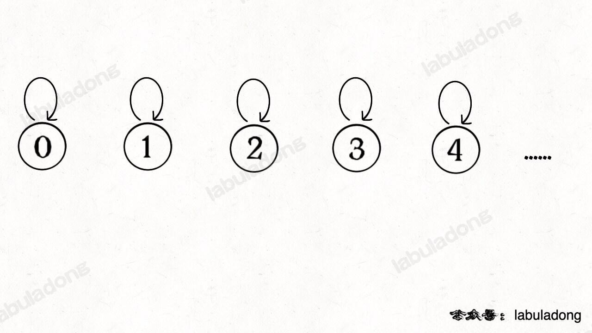

# 图论


## 图论基础

--------------------------------------------------

### 概念


#### 度（degree）

- 在==无向图==中，「度」就是每个节点相连的边的条数。

- 由于==有向图==的边有方向，所以有向图中每个节点「度」被细分为**入度**（indegree）和**出度**（outdegree），比如下图：


​	其中节点 `3` 的入度为 3（有三条边指向它），出度为 1（它有 1 条边指向别的节点）。


---------------------------------------


### 图的逻辑结构和具体实现

一幅图是由**节点**和**边**构成的，逻辑结构如下：


**什么叫「逻辑结构」？就是说为了方便研究，我们把图抽象成这个样子**。

根据这个逻辑结构，我们可以认为每个节点的实现如下：

```go
/* 图节点的逻辑结构 */
type Vertex struct {
    val 	  int
    neighbors []*Vertex
}
```

可以发现，图的逻辑结构和多叉树非常相似

```go
/* 基本的 N 叉树节点 */
type TreeNode struct {
    val 	 int
    children []*TreeNode
}
```

**所以说，图真本质上就是个高级点的多叉树而已，适用于树的 DFS/BFS 遍历算法，全部适用于图。**

上面的这种实现是「逻辑上的」，其相当于一个多叉树，然后图则由多个Vertex节点组成。

实际上我们很少用这个 `Vertex` 类实现图，而是用常说的**邻接表和邻接矩阵**来实现。


### 具体实现

比如还是刚才那幅图：


用邻接表和邻接矩阵的存储方式如下：


- 邻接表很直观，我把每个节点 `x` 的邻居都存到一个列表里，然后把 `x` 和这个列表关联起来，这样就可以通过一个节点 `x` 找到它的所有相邻节点。
- 邻接矩阵则是一个二维数组，我们权且称为 `matrix`，如果节点 `x` 和 `y` 是相连的，那么就把 `matrix[x][y]` 设为 `true`（上图中绿色的方格代表 `true`）。如果想找节点 `x` 的邻居，去扫一圈 `matrix[x][..]` 就行了。

**代码实现**

```go
// 邻接表

// 邻接矩阵
// matrix[x][y] 记录 x 是否有一条指向 y 的边
matrix [][]bool
```


### 两种存储方式的优缺点

对于邻接表，**好处是占用的空间少**。

但是，**邻接表无法快速判断两个节点是否相邻。**

比如说我想判断节点 `1` 是否和节点 `3` 相邻，我要去邻接表里 `1` 对应的邻居列表里查找 `3` 是否存在。但对于邻接矩阵就简单了，只要看看 `matrix[1][3]` 就知道了，效率高。


### 图的遍历

**各种数据结构被发明出来无非就是为了遍历和访问，所以「遍历」是所有数据结构的基础**。

图怎么遍历？还是那句话，参考多叉树，多叉树的 DFS 遍历框架如下：

```GO
/* 多叉树遍历框架 */
func traverse(root TreeNode) {
    if root == nil {
        return 
    }
    // 前序位置
    for child := range root.childern {
        traverse(child)
    }
    // 后序位置
}
```


​	**图和多叉树最大的区别是，图是可能包含环的**，你从图的某一个节点开始遍历，有可能走了一圈又回到这个节点，而树不会出现这种情况，从某个节点出发必然走到叶子节点，绝不可能回到它自身。

==所以，如果图包含环，遍历框架就要一个 `visited` 数组进行辅助==：

```go
// 记录被遍历过的节点
visited []bool
// 记录从起点到当前节点的路径
onPath  []bool

/* 图遍历框架 */
func traverse(graph Graph, s int) {
    // 由于图可能有环，因此不能像遍历树一样，设置节点nil为递归结束条件
    // 所以需要使用一个辅助数组，用来记录被遍历过的节点
    // 当节点被访问过时，递归结束
    if visited[s] {
        return 
    }
    // 经过节点 s，标记为已遍历
    visited[s] = true
    // 做选择：标记节点 s 在路径上
    onPath[s] = true
    for neighbor := range graph.neighbors(s) {
        traverse(graph, neighbor)
    }
    

}
```


#### BFS 算法

##### 思想

BFS 的核心思想应该不难理解的，就是把一些问题抽象成图，从一个点开始，向四周开始扩散。一般来说，我们写 **BFS 算法都是用「队列」这种数据结**构，每次将一个节点周围的所有节点加入队列。

BFS 相对 DFS 的最主要的区别是：**BFS 找到的路径一定是最短的，但代价就是空间复杂度可能比 DFS 大很多。**


**BFS 出现的常见场景：**

**其问题的本质就是让你在一幅「图」中找到从起点 `start` 到终点 `target` 的最近距离，这个例子听起来很枯燥，但是 BFS 算法问题其实都是在干这个事儿**


这个广义的描述可以有各种变体，比如走迷宫，有的格子是围墙不能走，从起点到终点的最短距离是多少？如果这个迷宫带「传送门」可以瞬间传送呢？

再比如说两个单词，要求你通过某些替换，把其中一个变成另一个，每次只能替换一个字符，最少要替换几次？

再比如说连连看游戏，两个方块消除的条件不仅仅是图案相同，还得保证两个方块之间的最短连线不能多于两个拐点。你玩连连看，点击两个坐标，游戏是如何判断它俩的最短连线有几个拐点的？

净整些花里胡哨的，这些问题都没啥奇技淫巧，本质上就是一幅「图」，让你从一个起点，走到终点，问最短路径。这就是 BFS 的本质，框架搞清楚了直接默写就好。


##### 框架

```go
func BFS() {
    // 1. 确定起点和终点
    start, target := ...
    // 2. 使用辅助队列
    queue := []type{}
    // 2.1 图形序列化
    
	// 3. 设置标记数组，防止走回头路
    
    // 4. 从起点开始访问
    
    // 5. 遍历节点
    for len(queue) > 0 {
        sz := len(queue)
        
        for i := 0 to sz {
            if // 未被访问过
            
        }  
    }
}


```


```go
// 计算从起点 start 到终点 target 的最近距离
func BFS(start *Node, target *Node) int {
    q := []*Node{}  // 核心数据结构
    visited := map[*Node]struct{}{}  // 避免走回头路
    
    q = append(q, start)  // 将起点加入队列
    visited[start] = struct{}{}
    step := 0 // 记录扩散的步数
    
    for len(q) > 0 {
        sz := len(q)
        /* 将当前队列中的所有节点向四周扩散 */
        for i := 0; i < sz; i++ {
            cur := q[len(q)-1]
            q = q[:len(q)-1]
            /* 划重点：这里判断是否到达终点 */
            if cur == target {
                return setp
            }
            /* 将 cur 的相邻节点加入队列 */
            for _, x := range cur.adj() {
                if x not in visited {
                    q = append(q, x)
                    visited[q] = struct{}{}
                }
            }
        }
        /* 划重点：更新步数在这里 */
        step++
    }
}
```


##### 二叉树的最小高度

**题目**：[111. 二叉树的最小深度](https://leetcode.cn/problems/minimum-depth-of-binary-tree/submissions/)

**思路**：

怎么套到 BFS 的框架里呢？首先明确一下起点 `start` 和终点 `target` 是什么，怎么判断到达了终点？

**显然起点就是 `root` 根节点，终点就是最靠近根节点的那个「叶子节点」嘛**，叶子节点就是两个子节点都是 `null` 的节点：

这里注意这个 两个`for` 循环的配合，**第一个`for` 循环控制一层一层往下走，第二个`for` 循环利用 `sz` 变量控制从左到右遍历每一层二叉树节点**：


**代码**：

```go
func minDepth(root *TreeNode) int {
    if root == nil {
        return 0
    }
    // 记录树的深度
    depth := 1

    // 辅助队列
    queue := []*TreeNode{root} 
    // BFS 
    for len(queue) > 0 {
        n := len(queue)
        for i := 0; i < n; i++ {
            // 出队
            q := queue[0]
            queue = queue[1:]
            if q.Left == nil && q.Right == nil {
                return depth
            }

            if q.Left != nil {
                queue = append(queue, q.Left)
            }
            if q.Right != nil {
                queue = append(queue, q.Right)
            }
        }
        depth++
    }

    return depth
}
```


##### 解开密码锁的最少次数

**题目**：[752. 打开转盘锁](https://leetcode.cn/problems/open-the-lock/submissions/)

**思路**：

**第一步，我们不管所有的限制条件，不管 `deadends` 和 `target` 的限制，就思考一个问题：如果让你设计一个算法，穷举所有可能的密码组合，你怎么做**？

穷举呗，再简单一点，如果你只转一下锁，有几种可能？总共有 4 个位置，**每个位置可以向上转，也可以向下转**，也就是有 8 种可能对吧。

比如说从 `"0000"` 开始，转一次，可以穷举出 `"1000", "9000", "0100", "0900"...` 共 8 种密码。然后，再以这 8 种密码作为基础，对每个密码再转一下，穷举出所有可能…

**仔细想想，这就可以抽象成一幅图，每个节点有 8 个相邻的节点**，又让你求最短距离，这不就是典型的 BFS 嘛，框架就可以派上用场了，先写出一个「简陋」的 BFS 框架代码再说别的：

**这段 BFS 代码已经能够穷举所有可能的密码组合了，但是显然不能完成题目，有如下问题需要解决**：

1、会走回头路。比如说我们从 `"0000"` 拨到 `"1000"`，但是等从队列拿出 `"1000"` 时，还会拨出一个 `"0000"`，这样的话会产生死循环。

2、没有终止条件，按照题目要求，我们找到 `target` 就应该结束并返回拨动的次数。

3、没有对 `deadends` 的处理，按道理这些「死亡密码」是不能出现的，也就是说你遇到这些密码的时候需要跳过。

```go
func openLock(deadends []string, target string) int {
    // 记录需要跳过的死亡密码
    deads := map[string]struct{}{}
    for _, s := range deadends {
        deads[s] = struct{}{}
    }
    // 记录已经穷举过的密码，防止走回头路
    visited := map[string]struct{}{}
    queue := []string{"0000"}
    visited["0000"] = struct{}{}
    step := 0

    for len(queue) > 0 {
        sz := len(queue)
        /* 将当前队列中的所有节点向周围扩散 */
        for i := 0; i < sz; i++ {
            q := queue[0]
            queue = queue[1:]
            /* 判断是否到达终点 */
            if _, ok := deads[q]; ok {
                continue
            }
            if q == target {
                return step
            }

            /* 将一个节点的相邻节点加入队列 */
            for j := 0; j < 4; j++ {
                up := plusOne(q, j)
                if _, ok := visited[up]; !ok {
                    queue = append(queue, up)
                    visited[up] = struct{}{}
                }
                down := minusOne(q, j)
                if _, ok := visited[down]; !ok {
                    queue = append(queue, down)
                    visited[down] = struct{}{}
                }
            }
        }
        /* 在这里增加步数 */
        step++
    }

    return -1
}


// 将s[i]向上拨动
func plusOne(s string, i int) string {
    ch := []byte(s)
    if ch[i] == '9' {
        ch[i] = '0'
    } else {
        ch[i] += 1
    }
    return string(ch)
}

// 将s[i]向下拨动
func minusOne(s string, i int) string {
    ch := []byte(s)
    if ch[i] == '0' {
        ch[i] = '9'
    } else {
        ch[i] -= 1
    }
    return string(ch)
}
```


##### 双向 BFS 优化

**统的 BFS 框架就是从起点开始向四周扩散，遇到终点时停止；而双向 BFS 则是从起点和终点同时开始扩散，当两边有交集的时候停止**。

为什么这样能够能够提升效率呢？其实从 Big O 表示法分析算法复杂度的话，它俩的最坏复杂度都是 `O(N)`，但是实际上双向 BFS 确实会快一些，我给你画两张图看一眼就明白了：


图示中的树形结构，如果终点在最底部，按照传统 BFS 算法的策略，会把整棵树的节点都搜索一遍，最后找到 `target`；而双向 BFS 其实只遍历了半棵树就出现了交集，也就是找到了最短距离。从这个例子可以直观地感受到，双向 BFS 是要比传统 BFS 高效的。

双向 BFS 还是遵循 BFS 算法框架的，只是**不再使用队列，而是使用 HashSet 方便快速判断两个集合是否有交集**。

另外的一个技巧点就是 **while 循环的最后交换 `q1` 和 `q2` 的内容**，所以只要默认扩散 `q1` 就相当于轮流扩散 `q1` 和 `q2`。

**代码**

```go
func openLock(deadends []string, target string) int {
    // 记录需要跳过的死亡密码
    deads := map[string]struct{}{}
    for _, s := range deadends {
        deads[s] = struct{}{}
    }
    // 记录已经穷举过的密码，防止走回头路
    visited := map[string]struct{}{}
    // 使用两个哈希表代替队列
    q1 := map[string]struct{}{}
    q2 := map[string]struct{}{}

    q1["0000"] = struct{}{}
    q2[target] = struct{}{}
    step := 0

    for len(q1) > 0 && len(q2) > 0 {
        if len(q1) > len(q2) {
            q1, q2 = q2, q1
        }
        // 哈希集合在遍历的过程中不能修改，用 temp 存储扩散结果
        tmp := map[string]struct{}{}
        /* 将 q1 中的所有节点向周围扩散 */
        for cur, _ := range q1 {
            /* 判断是否到达终点 */
            if _, ok := deads[cur]; ok {
                continue
            }
            if _, ok := q2[cur]; ok {
                return step
            }

            visited[cur] = struct{}{}
            /* 将一个节点的未遍历相邻节点加入集合 */
            for j := 0; j < 4; j++ {
                up := plusOne(cur, j)
                if _, ok := visited[up]; !ok {
                    tmp[up] = struct{}{}
                }
                down := minusOne(cur, j)
                if _, ok := visited[down]; !ok {
                    tmp[down] = struct{}{}
                }
            }
        }
        /* 在这里增加步数 */
        step++
        // temp 相当于 q1
        // 这里交换 q1 q2，下一轮 for 就是扩散 q2
        q1 = q2
        q2 = tmp
    }
    return -1
}


// 将s[i]向上拨动
func plusOne(s string, i int) string {
    ch := []byte(s)
    if ch[i] == '9' {
        ch[i] = '0'
    } else {
        ch[i] += 1
    }
    return string(ch)
}

// 将s[i]向下拨动
func minusOne(s string, i int) string {
    ch := []byte(s)
    if ch[i] == '0' {
        ch[i] = '9'
    } else {
        ch[i] -= 1
    }
    return string(ch)
}
```


#### BFS 算法秒杀各种智力题


**思路**：

对于这种计算最小步数的问题，我们就要敏感地想到 BFS 算法。

这个题目转化成 BFS 问题是有一些技巧的，我们面临如下问题：

1、一般的 BFS 算法，是从一个起点 `start` 开始，向终点 `target` 进行寻路，但是拼图问题不是在寻路，而是在不断交换数字，这应该怎么转化成 BFS 算法问题呢？

2、即便这个问题能够转化成 BFS 问题，如何处理起点 `start` 和终点 `target`？它们都是数组哎，把数组放进队列，套 BFS 框架，想想就比较麻烦且低效。

首先回答第一个问题，**BFS 算法并不只是一个寻路算法，而是一种暴力搜索算法**，只要涉及暴力穷举的问题，BFS 就可以用，而且可以最快地找到答案。

明白了这个道理，我们的问题就转化成了：**如何穷举出 `board` 当前局面下可能衍生出的所有局面**？这就简单了，看数字 0 的位置呗，和上下左右的数字进行交换就行了：


这样其实就是一个 BFS 问题，每次先找到数字 0，然后和周围的数字进行交换，形成新的局面加入队列…… 当第一次到达 `target` 时，就得到了赢得游戏的最少步数。

对于第二个问题，我们这里的 `board` 仅仅是 2x3 的二维数组，所以可以压缩成一个一维字符串。**其中比较有技巧性的点在于，二维数组有「上下左右」的概念，压缩成一维后，如何得到某一个索引上下左右的索引**？

对于这道题，题目说输入的数组大小都是 2 x 3，所以我们可以直接手动写出来这个映射：

```go
    // 记录一维字符串的相邻索引
	// 对于位置0，其相邻位置为右边的1，下边的3
    neighbor := [][]int{
        {1, 3},
        {0, 2, 4},
        {1, 5},
        {0, 4},
        {3, 1, 5}, 
        {4, 2},
    }
```

**这个含义就是，在一维字符串中，索引 `i` 在二维数组中的的相邻索引为 `neighbor[i]`**


**代码**

```go
func slidingPuzzle(board [][]int) int {
    // 将初始 board 转化为 初始字符串
    var str bytes.Buffer
    for _, bo := range board {
        for _, b := range bo {
            str.WriteString(strconv.Itoa(b))
        } 
    }
    start := str.String()

    // 记录一维字符串的相邻索引
    neighbor := [][]int{
        {1, 3},
        {0, 2, 4},
        {1, 5},
        {0, 4},
        {3, 1, 5}, 
        {4, 2},
    }
    /******* BFS 算法框架开始 *******/
    Queue := []string{}
    visit := map[string]struct{}{}
    // 从起点开始 BFS 搜索
    Queue = append(Queue, start)
    visit[start] = struct{}{}

    target := "123450"
    step := 0 
    for len(Queue) > 0 {
        sz := len(Queue) 
        for i := 0; i < sz; i++ {
            cur := Queue[0]
            Queue = Queue[1:]
            if cur == target {
                return step
            }
            // 找到数字'0'的索引
            idx := 0
            for cur[idx] != '0' {
                idx++
            }
            // 将数字 0 和相邻的数字交换位置
            for _, ne := range neighbor[idx] {
                byte_cur := []byte(cur)
                byte_cur[ne], byte_cur[idx] = byte_cur[idx], byte_cur[ne]
                new_board := string(byte_cur)
                // 防止走回头路
                if _, ok := visit[new_board]; !ok {
                    Queue = append(Queue, new_board)
                    visit[new_board] = struct{}{}
                }
                
            }
        }
        step++
    }

    return -1
}
```


## 环检测算法 && 拓扑排序


### DFS 实现

```go
func findOrder(numCourses int, prerequisites [][]int) []int {
	graph := buildGraph(numCourses, prerequisites)

	hasCycle := false                       // 用于判断是否存在环
	visited := make([]bool, numCourses)     // 防止重复遍历同一个节点
	onPath := make([]bool, numCourses)      // 记录遍历路径
	postOrder := make([]int, 0, numCourses) // 存放后序遍历的结果

	// 从节点 s 开始 DFS 遍历，将遍历过的节点标记为 true
	var traverse func(idx int)
	traverse = func(idx int) {
		// 是否有环
		if onPath[idx] {
			hasCycle = true
		}
		if visited[idx] || hasCycle {
			return
		}
		// 访问当前节点
		visited[idx] = true
		// 选择
		onPath[idx] = true
		// 遍历相邻节点
		for e := graph[idx].Front(); e != nil; e = e.Next() {
			traverse(e.Value.(int))
		}
		// 后序遍历位置
		postOrder = append(postOrder, idx)
		// 撤销选择
		onPath[idx] = false
	}

	// 遍历图中所有节点
	for i := 0; i < numCourses; i++ {
		traverse(i)
	}

    // 有环图无法进行拓扑排序
    if (hasCycle) {
        return []int{};
    }
	res := []int{}
	for i := len(postOrder) - 1; i >= 0; i-- {
		res = append(res, postOrder[i])
	}
	return res
}

// 使用邻接表建表
func buildGraph(numCourses int, prerequisites [][]int) []*list.List {
	// 图中共有 numCourses 个节点
	graph := make([]*list.List, numCourses)
	for i := 0; i < numCourses; i++ {
		graph[i] = list.New()
	}
	// 为图中的每条边建立对应映射
	for _, v := range prerequisites {
		graph[v[1]].PushBack(v[0])
	}

	return graph
}
```


### BFS 实现

- 根据输入的依赖关系生成对应的图
- 构建对应的入度数组
- 将入度为0的节点加入队列
- 遍历队列，将队头节点出队，遍历其相邻节点，并将其相邻节点的入度减1

```go
func canFinish(numCourses int, prerequisites [][]int) bool {
	graph := buildGraph(numCourses, prerequisites)
	// 构建入度数组
	inDegree := make([]int, numCourses)
	for _, e := range prerequisites {
		// 节点 e[0] 的入度加一
		inDegree[e[0]]++
	}

	// 根据入度初始化队列中的节点
	q := list.New()
	for i, v := range inDegree {
		if v == 0 {
			// 节点 v 没有入度，即没有依赖的节点
            // 可以作为拓扑排序的起点，加入队列
			q.PushBack(i)
		}
	}

	// 记录遍历的节点个数
	count := 0
	// 开始执行 BFS 循环
	for q.Len() > 0 {
		// 弹出队头节点 cur，并将它指向的节点的入度减一
		cur := q.Remove(q.Front()).(int)
		count++  // 遍历的节点数加1
		for e := graph[cur].Front(); e != nil; e = e.Next() {
			t := e.Value.(int)
			inDegree[t]--
			if inDegree[t] == 0 {
				// 如果入度变为 0，说明 t 依赖的节点都已被遍历
				q.PushBack(t)
			}
		}
	}

    // 如果所有节点都被遍历过，说明不成环
	return count == numCourses
}

// 使用邻接表建表
func buildGraph(numCourses int, prerequisites [][]int) []*list.List {
	// 图中共有 numCourses 个节点
	graph := make([]*list.List, numCourses)
	for i := 0; i < numCourses; i++ {
		graph[i] = list.New()
	}
	// 为图中的每条边建立对应映射
	for _, v := range prerequisites {
		graph[v[1]].PushBack(v[0])
	}

	return graph
}
```


## 二分图判定算法


### 二分图简介

二分图的顶点集可分割为两个互不相交的子集，图中每条边依附的两个顶点都分属于这两个子集，且两个子集内的顶点不相邻。


其实图论里面很多术语的定义都比较拗口，不容易理解。我们甭看这个死板的定义了，来玩个游戏吧：

**给你一幅「图」，请你用两种颜色将图中的所有顶点着色，且使得任意一条边的两个端点的颜色都不相同，你能做到吗**？

这就是图的「双色问题」，其实这个问题就等同于二分图的判定问题，如果你能够成功地将图染色，那么这幅图就是一幅二分图，反之则不是：


在具体讲解二分图判定算法之前，我们先来说说计算机大佬们闲着无聊解决双色问题的目的是什么。

首先，二分图作为一种特殊的图模型，会被很多高级图算法（比如最大流算法）用到，不过这些高级算法我们不是特别有必要去掌握，有兴趣的读者可以自行搜索。

从简单实用的角度来看，二分图结构在某些场景可以更高效地存储数据。

比如说我们需要一种数据结构来储存电影和演员之间的关系：某一部电影肯定是由多位演员出演的，且某一位演员可能会出演多部电影。你使用什么数据结构来存储这种关系呢？

既然是存储映射关系，最简单的不就是使用哈希表嘛，我们可以使用一个 `HashMap<String, List<String>>` 来存储电影到演员列表的映射，如果给一部电影的名字，就能快速得到出演该电影的演员。

但是如果给出一个演员的名字，我们想快速得到该演员演出的所有电影，怎么办呢？这就需要「反向索引」，对之前的哈希表进行一些操作，新建另一个哈希表，把演员作为键，把电影列表作为值。

显然，如果用哈希表存储，需要两个哈希表分别存储「每个演员到电影列表」的映射和「每部电影到演员列表」的映射。但如果用「图」结构存储，将电影和参演的演员连接，很自然地就成为了一幅二分图：

[](https://labuladong.github.io/algo/images/algo4/2.jpg)

每个电影节点的相邻节点就是参演该电影的所有演员，每个演员的相邻节点就是该演员参演过的所有电影，非常方便直观。

**相当于电影1和参演电影1的演员构成一个二分图，而参演电影1的个别演员可能与其他演员和电影2过程另一个二分图。**


### 二分图判定思路

判定二分图的算法很简单，就是用代码解决「双色问题」。

**说白了就是遍历一遍图，一边遍历一边染色，看看能不能用两种颜色给所有节点染色，且相邻节点的颜色都不相同**。

既然说到遍历图，也不涉及最短路径之类的，当然是 DFS 算法和 BFS 皆可了，DFS 算法相对更常用些，所以我们先来看看如何用 DFS 算法判定双色图。

首先，基于 [学习数据结构和算法的框架思维](https://labuladong.github.io/algo/di-ling-zh-bfe1b/xue-xi-sua-01220/) 写出图的遍历框架：

```java
/* 二叉树遍历框架 */
void traverse(TreeNode root) {
    if (root == null) return;
    traverse(root.left);
    traverse(root.right);
}

/* 多叉树遍历框架 */
void traverse(Node root) {
    if (root == null) return;
    for (Node child : root.children)
        traverse(child);
}

/* 图遍历框架 */
boolean[] visited;
void traverse(Graph graph, int v) {
    // 防止走回头路进入死循环
    if (visited[v]) return;
    // 前序遍历位置，标记节点 v 已访问
    visited[v] = true;
    for (Vertex neighbor : graph.neighbors(v))
        traverse(graph, neighbor);
}

```

因为图中可能存在环，所以用 `visited` 数组防止走回头路。

**回顾一下二分图怎么判断，其实就是让 `traverse` 函数一边遍历节点，一边给节点染色，尝试让每对相邻节点的颜色都不一样**。

所以，判定二分图的代码逻辑可以这样写：

```java
/* 图遍历框架 */
void traverse(Graph graph, boolean[] visited, int v) {
    visited[v] = true;
    // 遍历节点 v 的所有相邻节点 neighbor
    for (int neighbor : graph.neighbors(v)) {
        if (!visited[neighbor]) {
            // 相邻节点 neighbor 没有被访问过
            // 那么应该给节点 neighbor 涂上和节点 v 不同的颜色
            traverse(graph, visited, neighbor);
        } else {
            // 相邻节点 neighbor 已经被访问过
            // 那么应该比较节点 neighbor 和节点 v 的颜色
            // 若相同，则此图不是二分图
        }
    }
}
```


### 实战

#### [785. 判断二分图](https://leetcode.cn/problems/is-graph-bipartite/)

##### 1 DFS 实现

```go
func isBipartite(graph [][]int) bool {
    // visited 标记节点是否访问过
    visited := make([]bool, len(graph))
    color := make([]bool, len(graph))
    // 记录是否为二分图
    ok := true

    // traverse 图的DFS遍历
    var traverse func(v int) 
    traverse = func(v int) {
        // 如果已经确定不是二分图了，就不用浪费时间再递归遍历了
        if !ok {
            return
        }
        // 访问节点v
        visited[v] = true
        // 访问节点v的相邻节点
        for _, neighbor := range graph[v] {
            if !visited[neighbor] {
                // 相邻节点未被访问
                // 那么应该给节点 neighbor 涂上和节点 v 不同的颜色
                color[neighbor] = !color[v]
                traverse(neighbor)
            } else {
                // 相邻节点 neighbor 已经被访问过
                // 那么应该比较节点 neighbor 和节点 v 的颜色
                // 若相同，则此图不是二分图
                if color[v] == color[neighbor] {
                    // 颜色相同
                    ok = false
                    return
                }
            }
        }
    }

    for i := range graph {
        if visited[i] {
            // 节点已被访问
            continue
        }
        traverse(i)
    }

    return ok
}
```

##### 2 BFS 实现

```go
func isBipartite(graph [][]int) bool {
    // 记录图是否符合二分图性质
    ok := true
    // 记录图中节点的颜色，false 和 true 代表两种不同颜色
    color := make([]bool, len(graph))
    // 记录图中节点是否被访问过 
    visit := make([]bool, len(graph))
    // 辅助队列
    var queue []int

    // 从 v 节点开始进行 BFS 遍历
    var bfs func(v int)
    bfs = func(v int) {
        if !ok {
            // 已确定不是二分图
            return
        }
        // 辅助队列
        queue = make([]int, 0, len(graph))
        queue = append(queue, v)
        for len(queue) > 0 {
            // 节点出队
            node := queue[0]
            queue = queue[1:]
            // 访问节点node
            visit[node] = true
            // 访问相邻节点
            for _, neighbor := range graph[node] {
                if !visit[neighbor] {
                    // 如果相邻节点未被访问
                    // 将其涂上和node不同的颜色
                    color[neighbor] = !color[node]
                    // 将相邻节点加入队列
                    queue = append(queue, neighbor)
                } else {
                    // 相邻节点已被访问
                    // 判断v和相邻节点的颜色是否相同
                    // 相同则返回该图不是二分图
                    if color[neighbor] == color[node] {
                        ok = false
                        return
                    }
                }
            }
        }
    }

    // 保证所有的子图都可以遍历到
    for i := range graph {
        if visit[i] {
            // 已访问过
            continue
        }
        bfs(i)
    }

    return ok
}
```


#### [886. 可能的二分法](https://leetcode.cn/problems/possible-bipartition/)

##### DFS 实现

```go
func possibleBipartition(n int, dislikes [][]int) bool {
    // visit 标记节点是否已访问过
    visit := make([]bool, n+1)
    // group 用来表示节点所属分组
    group := make([]bool, n+1)
    // ok 标记是否可以分成两组
    ok := true

    graph := buildGraph(n, dislikes)
    // dfs 遍历
    var dfs func(v int)
    dfs = func(v int) {
        if !ok {
            // 已确定不可以分成两组
            return
        }
        // 访问节点v
        visit[v] = true
        // 遍历节点v的相邻节点
        for e := graph[v].Front(); e != nil; e = e.Next() {
            node := e.Value.(int)
            if !visit[node] {
                // 节点node未访问
                // 将节点node和节点v分配到不同组
                group[node] = !group[v]
                dfs(node)
            } else {
                // 节点node已访问过
                if group[node] == group[v] {
                    // 节点v和node属于同一组，分组失败
                    ok = false
                    return
                }
            }
        }
    }

    // 确保遍历所有的节点
    for i := range graph[1:] {
        if visit[i+1] {
            // 已访问
            continue
        }
        dfs(i+1)
    }

    return ok
}

func buildGraph(n int, dislikes [][]int) []*list.List {
    graph := make([]*list.List, n+1)
    for i := range graph[1:] {
        graph[i+1] = list.New()
    }

    for _, dl := range dislikes {
        // 生成v1到v2和v2到v1的边
        v1, v2 := dl[0], dl[1]
        graph[v1].PushBack(v2)
        graph[v2].PushBack(v1)
    }

    return graph
}
```


## 并查集（UNION-FIND）算法


### 动态连通性

简单说，动态连通性其实可以抽象成给一幅图连线。比如下面这幅图，总共有 10 个节点，他们互不相连，分别用 0~9 标记：


现在我们的 Union-Find 算法主要需要实现这两个 API：

```class UF {
class UF {
    /* 将 p 和 q 连接 */
    public void union(int p, int q);
    /* 判断 p 和 q 是否连通 */
    public boolean connected(int p, int q);
    /* 返回图中有多少个连通分量 */
    public int count();
}
```

这里所说的「连通」是一种等价关系，也就是说具有如下三个性质：

1、自反性：节点 `p` 和 `p` 是连通的（顶点自身是连通的）。

2、对称性：如果节点 `p` 和 `q` 连通，那么 `q` 和 `p` 也连通。

3、传递性：如果节点 `p` 和 `q` 连通，`q` 和 `r` 连通，那么 `p` 和 `r` 也连通。

比如说之前那幅图，0～9 任意两个**不同**的点都不连通，调用 `connected` 都会返回 false，连通分量为 10 个。

如果现在调用 `union(0, 1)`，那么 0 和 1 被连通，连通分量降为 9 个。

再调用 `union(1, 2)`，这时 0,1,2 都被连通，调用 `connected(0, 2)` 也会返回 true，连通分量变为 8 个。


判断这种「等价关系」非常实用，比如说编译器判断同一个变量的不同引用，比如社交网络中的朋友圈计算等等。

这样，你应该大概明白什么是动态连通性了，Union-Find 算法的关键就在于 `union` 和 `connected` 函数的效率。那么用什么模型来表示这幅图的连通状态呢？用什么数据结构来实现代码呢？


### 基本思路

注意我刚才把「模型」和具体的「数据结构」分开说，这么做是有原因的。因为我们使用森林（若干棵树）来表示图的动态连通性，用数组来具体实现这个森林。

怎么用森林来表示连通性呢？**我们设定树的每个节点有一个指针指向其父节点**，如果是根节点的话，这个指针指向自己。比如说刚才那幅 10 个节点的图，一开始的时候没有相互连通，就是这样：



```java
class UF {
    // 记录连通分量
    private int count;
    // 节点 x 的父节点是 parent[x]
    private int[] parent;

    /* 构造函数，n 为图的节点总数 */
    public UF(int n) {
        // 一开始互不连通
        this.count = n;
        // 父节点指针初始指向自己
        parent = new int[n];
        for (int i = 0; i < n; i++)
            parent[i] = i;
    }

    /* 其他函数 */
}
```

**如果某两个节点被连通，则让其中的（任意）一个节点的根节点接到另一个节点的根节点上（即修改其中一个节点的父节点为另外一个节点的父节点）**：


```java
public void union(int p, int q) {
    int rootP = find(p);  // 找到p节点的根节点
    int rootQ = find(q);  // 找到q节点的根节点
    if (rootP == rootQ)
        return;
    // 将两棵树合并为一棵
    parent[rootP] = rootQ;
    // parent[rootQ] = rootP 也一样
    count--; // 两个分量合二为一
}

/* 返回某个节点 x 的根节点 */
private int find(int x) {
    // 根节点的 parent[x] == x
    while (parent[x] != x)
        x = parent[x];
    return x;
}

/* 返回当前的连通分量个数 */
public int count() { 
    return count;
}
```

**这样，如果节点 `p` 和 `q` 连通的话，它们一定拥有相同的根节点**：


```java
public boolean connected(int p, int q) {
    int rootP = find(p);
    int rootQ = find(q);
    return rootP == rootQ;
}
```

至此，Union-Find 算法就基本完成了。是不是很神奇？竟然可以这样使用数组来模拟出一个森林，如此巧妙的解决这个比较复杂的问题！

那么这个算法的复杂度是多少呢？我们发现，主要 API `connected` 和 `union` 中的复杂度都是 `find` 函数造成的，所以说它们的复杂度和 `find` 一样。

`find` 主要功能就是从某个节点向上遍历到树根，其时间复杂度就是树的高度。我们可能习惯性地认为树的高度就是 `logN`，但这并不一定。`logN` 的高度只存在于平衡二叉树，对于一般的树可能出现极端不平衡的情况，使得「树」几乎退化成「链表」，树的高度最坏情况下可能变成 `N`。


所以说上面这种解法，`find` , `union` , `connected` 的时间复杂度都是 O(N)。这个复杂度很不理想的，你想图论解决的都是诸如社交网络这样数据规模巨大的问题，对于 `union` 和 `connected` 的调用非常频繁，每次调用需要线性时间完全不可忍受。

**问题的关键在于，如何想办法避免树的不平衡呢**？只需要略施小计即可。


### 平衡性优化

我们要知道哪种情况下可能出现不平衡现象，关键在于 `union` 过程：

```java
public void union(int p, int q) {
    int rootP = find(p);
    int rootQ = find(q);
    if (rootP == rootQ)
        return;
    // 将两棵树合并为一棵
    parent[rootP] = rootQ;
    // parent[rootQ] = rootP 也可以
    count--;
```

我们一开始就是简单粗暴的把 `p` 所在的树接到 `q` 所在的树的根节点下面，那么这里就可能出现「头重脚轻」的不平衡状况，比如下面这种局面：


长此以往，树可能生长得很不平衡。**我们其实是希望，小一些的树接到大一些的树下面，这样就能避免头重脚轻，更平衡一些**。解决方法是额外使用一个 `size` 数组，记录每棵树包含的节点数，我们不妨称为「重量」：

```java
class UF {
    private int count;
    private int[] parent;
    // 新增一个数组记录树的“重量”
    private int[] size;

    public UF(int n) {
        this.count = n;
        parent = new int[n];
        // 最初每棵树只有一个节点
        // 重量应该初始化 1
        size = new int[n];
        for (int i = 0; i < n; i++) {
            parent[i] = i;
            size[i] = 1;
        }
    }
    /* 其他函数 */
}
```

比如说 `size[3] = 5` 表示，以节点 `3` 为根的那棵树，总共有 `5` 个节点。这样我们可以修改一下 `union` 方法：

```java
public void union(int p, int q) {
    int rootP = find(p);
    int rootQ = find(q);
    if (rootP == rootQ)
        return;
    
    // 小树接到大树下面，较平衡
    if (size[rootP] > size[rootQ]) {
        parent[rootQ] = rootP;
        size[rootP] += size[rootQ];
    } else {
        parent[rootP] = rootQ;
        size[rootQ] += size[rootP];
    }
    count--;
}
```

这样，通过比较树的重量，就可以保证树的生长相对平衡，树的高度大致在 `logN` 这个数量级，极大提升执行效率。

此时，`find` , `union` , `connected` 的时间复杂度都下降为 O(logN)，即便数据规模上亿，所需时间也非常少。


### 路径压缩

**其实我们并不在乎每棵树的结构长什么样，只在乎根节点**。

因为无论树长啥样，树上的每个节点的根节点都是相同的，所以能不能进一步压缩每棵树的高度，使树高始终保持为常数？


这样每个节点的父节点就是整棵树的根节点，`find` 就能以 O(1) 的时间找到某一节点的根节点，相应的，`connected` 和 `union` 复杂度都下降为 O(1)。

要做到这一点主要是修改 `find` 函数逻辑，非常简单，但你可能会看到两种不同的写法。

第一种是在 `find` 中加一行代码：

```java
private int find(int x) {
    while (parent[x] != x) {
        // 这行代码进行路径压缩
        parent[x] = parent[parent[x]];
        x = parent[x];
    }
    return x;
}
```

可以看出节点x往上顶，把其他节点顶开。


用语言描述就是，每次 while 循环都会把一对儿父子节点改到同一层，这样每次调用 `find` 函数向树根遍历的同时，顺手就将树高缩短了。


路径压缩的第二种写法是这样：

```java
// 第二种路径压缩的 find 方法
public int find(int x) {
    if (parent[x] != x) {
        parent[x] = find(parent[x]);
    }
    return parent[x];
}
```

把这个函数做的事情翻译成迭代形式，方便你理解它进行路径压缩的原理：

```java
// 这段迭代代码方便你理解递归代码所做的事情
public int find(int x) {
    // 先找到根节点
    int root = x;
    while (parent[root] != root) {
        root = parent[root];
    }
    // 然后把 x 到根节点之间的所有节点直接接到根节点下面
    int old_parent = parent[x];
    while (x != root) {
        parent[x] = root;
        x = old_parent;
        old_parent = parent[old_parent];
    }
    return root;
}
```

这种路径压缩的效果如下：


比起第一种路径压缩，显然这种方法压缩得更彻底，直接把一整条树枝压平，一点意外都没有。就算一些极端情况下产生了一棵比较高的树，只要一次路径压缩就能大幅降低树高，从 [摊还分析](https://labuladong.github.io/algo/di-ling-zh-bfe1b/suan-fa-sh-05f25/) 的角度来看，所有操作的平均时间复杂度依然是 O(1)，所以从效率的角度来说，推荐你使用这种路径压缩算法。

**另外，如果使用路径压缩技巧，那么 `size` 数组的平衡优化就不是特别必要了**。所以你一般看到的 Union Find 算法应该是如下实现：

```java
package union

type unionFind struct {
	count  int   // 连通分量个数
	parent []int // 存储每个节点的父节点
}

// Construct 构造函数，输入节点个数，生成并查集
func New(n int) unionFind {
	// 创建长度为n的数组，用来存储节点对应的父节点
	parent := make([]int, n)
	for i := range parent {
		// 初始节点指向自身
		parent[i] = i
	}
	return unionFind{n, parent}
}

// Union 将节点p和q连通
func (u *unionFind) Union(p, q int) {
	rootP, rootQ := u.Find(p), u.Find(q)
	if rootP == rootQ {
		// p 和 q 指向同一个根节点
		return
	}
	// 将p的根节点连接到q的根节点上
	u.parent[rootP] = rootQ
	// 两个连通分量变为一个
	u.count--
}

// Connected 判断节点p和q是否连通
func (u *unionFind) Connected(p, q int) bool {
	return u.Find(p) == u.Find(q)
}

// Find 返回节点x的父节点
func (u *unionFind) Find(x int) int {
	if x != u.parent[x] {
		u.parent[x] = u.Find(u.parent[x])
	}
	return u.parent[x]
}

// CountUnion 返回连通分量数
func (u *unionFind) CountUnion() int {
	return u.count
}

```

Union-Find 算法的复杂度可以这样分析：构造函数初始化数据结构需要 O(N) 的时间和空间复杂度；连通两个节点 `union`、判断两个节点的连通性 `connected`、计算连通分量 `count` 所需的时间复杂度均为 O(1)。

到这里，相信你已经掌握了 Union-Find 算法的核心逻辑，总结一下我们优化算法的过程：

1、用 `parent` 数组记录每个节点的父节点，相当于指向父节点的指针，所以 `parent` 数组内实际存储着一个森林（若干棵多叉树）。

2、用 `size` 数组记录着每棵树的重量，目的是让 `union` 后树依然拥有平衡性，保证各个 API 时间复杂度为 O(logN)，而不会退化成链表影响操作效率。

3、在 `find` 函数中进行路径压缩，保证任意树的高度保持在常数，使得各个 API 时间复杂度为 O(1)。使用了路径压缩之后，可以不使用 `size` 数组的平衡优化。


### 实例

#### [130. 被围绕的区域](https://leetcode.cn/problems/surrounded-regions/)

##### 转化为岛屿问题

先用 for 循环遍历棋盘的**四边**，用 DFS 算法把那些与边界相连的 `O` 换成一个特殊字符，比如 `#`；然后再遍历整个棋盘，把剩下的 `O` 换成 `X`，把 `#` 恢复成 `O`。这样就能完成题目的要求，时间复杂度 O(MN)。

```go
func solve(board [][]byte)  {
    m, n := len(board), len(board[0])
    // 方向坐标
    direct := [4][2]int{{-1, 0}, {1, 0}, {0, -1}, {0, 1}}

    // 标记数组，用来标记坐标是否访问过
    visit := make([][]bool, m)
    for i := range visit {
        visit[i] = make([]bool, n)
    }

    var dfs func(x, y int, ch byte) 
    dfs = func(x, y int, ch byte) {
        // 边界判断
        if x < 0 || x >= m || y < 0 || y >= n {
            return
        }
        if visit[x][y] || board[x][y] != 'O' {
            return
        }
        visit[x][y] = true
        board[x][y] = ch
        // 遍历四个方向
        for _, d := range direct {
            nx, ny := x + d[0], y + d[1]
            dfs(nx, ny, ch)
        }
    }

    // 处理边界的O，用#填充
    for i := 0; i < m; i++ {
        dfs(i, 0, '#')
        dfs(i, n-1, '#')
    }
    for j := 0; j < n; j++ {
        dfs(0, j, '#')
        dfs(m-1, j, '#')
    }

    // 处理不在边界的O
    for i := 0; i < m; i++ {
        for j := 0; j < n; j++ {
            dfs(i, j, 'X')
        }
    }

    for i := 0; i < m; i++ {
        for j := 0; j < n; j++ {
            if board[i][j] == '#' {
                board[i][j] = 'O'
            }
        }
    }
}
```

##### Union-Find

但这个问题也可以用 Union-Find 算法解决，虽然实现复杂一些，甚至效率也略低，但这是使用 Union-Find 算法的通用思想，值得一学。

**你可以把那些不需要被替换的 `O` 看成一个拥有独门绝技的门派，它们有一个共同「祖师爷」叫 `dummy`，这些 `O` 和 `dummy` 互相连通，而那些需要被替换的 `O` 与 `dummy` 不连通**。


这就是 Union-Find 的核心思路，明白这个图，就很容易看懂代码了。

首先要解决的是，根据我们的实现，Union-Find 底层用的是一维数组，构造函数需要传入这个数组的大小，而题目给的是一个二维棋盘。

这个很简单，二维坐标 `(x,y)` 可以转换成 `x * n + y` 这个数（`m` 是棋盘的行数，`n` 是棋盘的列数），**敲黑板，这是将二维坐标映射到一维的常用技巧**。

其次，我们之前描述的「祖师爷」是虚构的，需要给他老人家留个位置。索引 `[0.. m*n-1]` 都是棋盘内坐标的一维映射，那就让这个虚拟的 `dummy` 节点占据索引 `m * n` 好了。

```go
func solve(board [][]byte)  {
    m, n := len(board), len(board[0])
    // 给dummy留一个位置
    u := New(m*n + 1)

    dummy := m * n
    // 将首列和末列的 O 与 dummy 连通
    for i := 0; i < m; i++ {
        if board[i][0] == 'O' {
            u.Union(dummy, i*n)
        }
        if board[i][n-1] == 'O' {
            u.Union(dummy, (i+1)*n-1)
        }
    }
    // 将首行和末行的 O 与 dummy 连通
    for i := 0; i < n; i++ {
        if board[0][i] == 'O' {
            u.Union(dummy, i)
        }
        if board[m-1][i] == 'O' {
            u.Union(dummy, (m-1)*n + i)
        }
    }

    direct := [4][2]int{{-1, 0}, {1, 0}, {0, -1}, {0, 1}}
    // 寻找O
    for i := 1; i < m-1; i++ {
        for j := 1; j < n-1; j++ {
            if board[i][j] == 'O' {
                // 将坐标(i,j)的O与周围的O连接
                for _, d := range direct {
                    x, y := i + d[0], j + d[1]
                    if board[x][y] == 'O' {
                        u.Union(i*n+j, x*n+y)       
                    }    
                }
            }
        }
    }

    // 寻找不与dummy连通的O
    for i, bi := range board {
        for j, bj := range bi {
            if bj == 'O' && !u.Connected(dummy, i*n+j) {
                board[i][j] = 'X'
            }
        } 
    }
}
```


#### [990. 等式方程的可满足性](https://leetcode.cn/problems/satisfiability-of-equality-equations/)

给你一个数组 `equations`，装着若干字符串表示的算式。每个算式 `equations[i]` 长度都是 4，而且只有这两种情况：`a==b` 或者 `a!=b`，其中 `a,b` 可以是任意小写字母。你写一个算法，如果 `equations` 中所有算式都不会互相冲突，返回 true，否则返回 false。

比如说，输入 `["a==b","b!=c","c==a"]`，算法返回 false，因为这三个算式不可能同时正确。

再比如，输入 `["c==c","b==d","x!=z"]`，算法返回 true，因为这三个算式并不会造成逻辑冲突。

我们前文说过，动态连通性其实就是一种等价关系，具有「自反性」「传递性」和「对称性」，其实 `==` 关系也是一种等价关系，具有这些性质。所以这个问题用 Union-Find 算法就很自然。

**核心思想是，将 `equations` 中的算式根据 `==` 和 `!=` 分成两部分，先处理 `==` 算式，使得他们通过相等关系各自勾结成门派（连通分量）；然后处理 `!=` 算式，检查不等关系是否破坏了相等关系的连通性**。

```go
func equationsPossible(equations []string) bool {
    // 共有26个字母，代表最多有26个节点
    u := New(26)

    // 先让相等的字母形成连通分量
    for _, eq := range equations {
        if eq[1] == '=' {
            u.Union(int(eq[0]-'a'), int(eq[3]-'a'))
        }
    }

    // 检查不等关系是否打破相等关系的连通性
    for _, eq := range equations {
        if eq[1] == '!' {
            if u.Connected(int(eq[0]-'a'), int(eq[3]-'a')) {
                return false
            }
        }
    }

    return true
}
```

