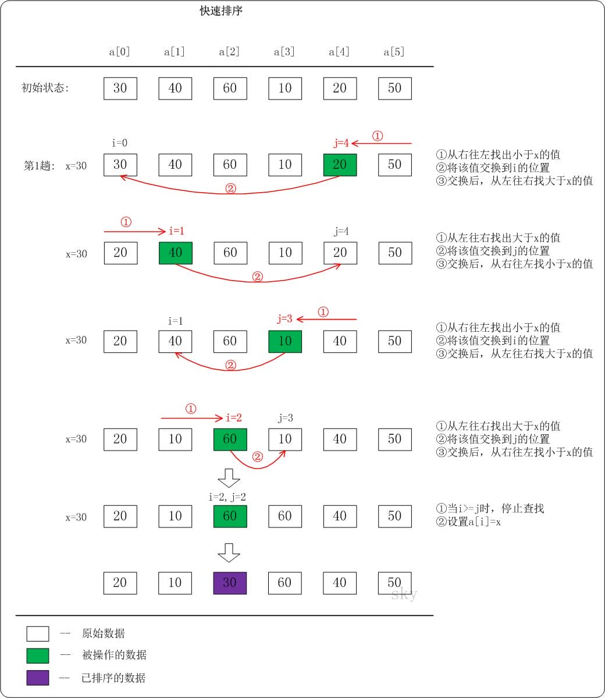
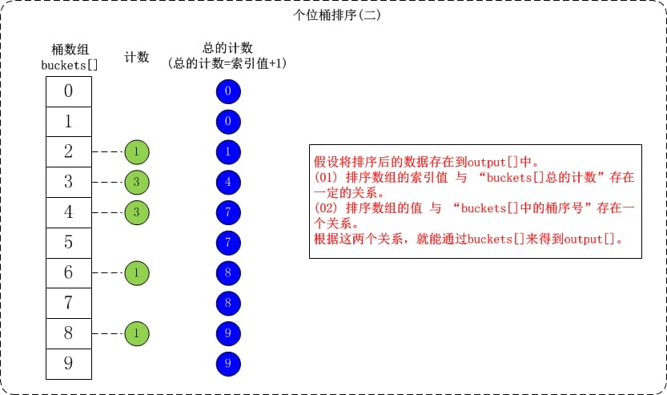

# 查找类算法

## 二分查找

### 1、二分查找框架

```go
func binarySearch(nums []int, target int) int {
    left, right := 0, ...
    
    for ... {
        mid := left + (right-left)>>1
        if nums[mid] == target {
            ...
        } else if nums[mid] < target {
            left = ...
        } else if nums[mid] > target {
            right = ...
        }
    }
    return ...
}
```

- **分析二分查找的一个技巧是：不要出现 else，而是把所有情况用 else if 写清楚，这样可以清楚地展现所有细节**。

- 其中 `...` 标记的部分，就是可能出现细节问题的地方，当你见到一个二分查找的代码时，首先注意这几个地方。后文用实例分析这些地方能有什么样的变化。

- **另外提前说明一下，计算 `mid` 时需要防止溢出**，代码中 `left + (right - left) / 2` 就和 `(left + right) / 2` 的结果相同，但是有效防止了 `left` 和 `right` 太大，直接相加导致溢出的情况。


### 2、二分搜索细节

##### 2.1 为什么 while 循环的条件中是 <=，而不是 <？

- 主要看**搜索区间**

- while (left <= right) 要使用 <= ，因为left == right是有意义的，所以使用 <=

- 因为初始化 `right` 的赋值是 `nums.length - 1`，即最后一个元素的索引，而不是 `nums.length`。如果`right`的赋值为`nums.length` ，则右边界是不需要取到的，此时就要用 `<`  。
- 这二者可能出现在不同功能的二分查找中，区别是：前者相当于两端都闭区间 `[left, right]`，后者相当于左闭右开区间 `[left, right)`，因为索引大小为 `nums.length` 是越界的。

##### 2.2 为什么 `left = mid + 1`，`right = mid - 1`？我看有的代码是 `right = mid` 或者 `left = mid`，没有这些加加减减，到底怎么回事，怎么判断？

​	刚才明确了「搜索区间」这个概念，而且本算法的搜索区间是两端都闭的，即 `[left, right]`。那么当我们发现索引 `mid` 不是要找的 `target` 时，下一步应该去搜索哪里呢？

​	当然是去搜索区间 `[left, mid-1]` 或者区间 `[mid+1, right]` 对不对？**因为 `mid` 已经搜索过，应该从搜索区间中去除**。

- if (nums[middle] > target) right 要赋值为 middle - 1，因为当前这个nums[middle]一定不是target，那么接下来要查找的左区间结束下标位置就是 middle - 1


### 3、基本二分搜索 —— 寻找一个数

**题目**：[704. 二分查找](https://leetcode.cn/problems/binary-search/)

**思路**：

**1 搜索区间**：` [left, right] ` ——> ` <= `

​	`while(left <= right)` 的终止条件是 `left == right + 1`，写成区间的形式就是 `[right + 1, right]`，或者带个具体的数字进去 `[3, 2]`，可见**这时候区间为空**，因为没有数字既大于等于 3 又小于等于 2 的吧。所以这时候 while 循环终止是正确的，直接返回 -1 即可。

​	`while(left < right)` 的终止条件是 `left == right`，写成区间的形式就是 `[right, right]`，或者带个具体的数字进去 `[2, 2]`，**这时候区间非空**，还有一个数 2，但此时 while 循环终止了。也就是说这区间 `[2, 2]` 被漏掉了，索引 2 没有被搜索，如果这时候直接返回 -1 就是错误的。

**2 left = mid + ?**

​	由于搜索区间为` [left, right] `，当` mid `的值不是target值，我们就需要更新搜索区间，即` [left, mid-1]` 和 `[mid+1，right]`，因为` mid ` 已经搜索过了，所以不用再次搜索

**3 算法缺陷**

​	比如说给你有序数组 `nums = [1,2,2,2,3]`，`target` 为 2，此算法返回的索引是 2，没错。但是如果我想得到 `target` 的左侧边界，即索引 1，或者我想得到 `target` 的右侧边界，即索引 3，这样的话此算法是无法处理的。

​	这样的需求很常见，**你也许会说，找到一个 `target`，然后向左或向右线性搜索不行吗？可以，但是不好，因为这样难以保证二分查找对数级的复杂度了**。

**代码**：

```go
func binarySearch(nums []int, target int) int {
    left, right := 0, len(nums)-1
    
    for left <= right {
        mid := left + (right-left)>>1
        if nums[mid] == target {
            return mid
        } else if nums[mid] < target {
            left = mid + 1
        } else if nums[mid] > target {
            right = mid - 1 
        }
    }
    return -1
}
```


### 4、寻找左侧边界的二分搜索

**思路**：使用左闭右开区间

**1 为什么 while 中是 `<` 而不是 `<=`**?

​	因为搜索区间是` [left, right)`，其取不到边界

**2、为什么没有返回 -1 的操作？如果 `nums` 中不存在 `target` 这个值，怎么办**？

​	其实很简单，**在返回的时候额外判断一下 `nums[left]` 是否等于 `target` 就行了，如果不等于，就说明 `target` 不存在。**

​	不过我们得考察一下 `left` 的取值范围，免得索引越界。假如输入的 `target` 非常大，那么就会一直触发 `nums[mid] < target` 的 if 条件，`left` 会一直向右侧移动，直到等于 `right`，while 循环结束。

​	**由于这里 `right` 初始化为 `nums.length`，所以 `left` 变量的取值区间是闭区间 `[0, nums.length]`，那么我们在检查 `nums[left]` 之前需要额外判断一下，防止索引越界：**

**3、为什么 `left = mid + 1`，`right = mid` ？和之前的算法不一样**？

​	因为我们的「搜索区间」是 `[left, right)` 左闭右开，所以当 `nums[mid]` 被检测之后，下一步应该去 `mid` 的左侧或者右侧区间搜索，即 `[left, mid)` 或 `[mid + 1, right)`。

**4、为什么该算法能够搜索左侧边界**？

```go
if nums[mid] == target {
    // 选择mid是因为左闭右开
    right = mid
}	
```

​	可见，找到 target 时不要立即返回，而是缩小「搜索区间」的上界 `right`，在区间 `[left, mid)` 中继续搜索，即不断向左收缩，达到锁定左侧边界的目的。

**5、为什么返回 `left` 而不是 `right`**？

​	都是一样的，因为 while 终止的条件是 `left == right`。

**代码**：

```go
func binSearch(nums []int, target int) int {
    left, right := 0, len(nums)
    for left < right {
        mid := left + (right-left)>>1
        if nums[mid] == target {
            // 选择mid是因为左闭右开
            right = mid  
        } else if nums[mid] < target {
            // 此时的mid不用再次使用，因此left = mid+1
            left = mid+1  
        } else if nums[mid] > target {
            // 因为搜索区间左闭右开，因此mid需要只用一次，但是right=mid
            right = mid 
        }
    }
    return left
}
```


### 5、寻找右侧边界的二分查找

**思路**：

1）转化为搜索目标值为`target+1`的左侧边界

2）使用如下代码

```go
func binSearch(nums []int, target int) int {
    left, right := 0, len(nums)-1
    for left <= right {
        mid := left + (right-left)>>1
        if nums[mid] == target {
            // 增大搜索区间，向右边界靠拢
            left = mid+1  
        } else if nums[mid] < target {
            left = mid+1  
        } else if nums[mid] > target {
            right = mid-1
        }
    }
    return left-1  // 
}
```

**1、为什么最后返回 `left - 1` 而不像左侧边界的函数，返回 `left`？而且我觉得这里既然是搜索右侧边界，应该返回 `right` 才对**。

​	答：首先，while 循环的终止条件是 `left == right`，所以 `left` 和 `right` 是一样的，你非要体现右侧的特点，返回 `right - 1` 好了。

```go
if nums[mid] == target {
    // 可以想成mid = left-1
	left = mid+1  
}
```

**2、为什么没有返回 -1 的操作？如果 `nums` 中不存在 `target` 这个值，怎么办**？

答：只要在最后判断一下 `nums[left-1]` 是不是 `target` 就行了。类似之前的左侧边界搜索，`left` 的取值范围是 `[0, nums.length-1]`，但由于我们最后返回的是 `left - 1`，所以 `left` 取值为 0 的时候会造成索引越界，额外处理一下即可正确地返回 -1：


### 6、二分搜索统一框架(闭区间)

##### 1 查找目标值

```go
func biSearch(nums []int, target int) int {
    left, right := 0, len(nums)-1
    for left <= right {
        mid := left + (right-left)>>1
        if nums[mid] == target {
            return mid  // 注意
        } else if nums[mid] < target {
            left = mid + 1
        } else if nums[mid] > target {
            right = mid - 1
        }
    }
    return -1
}
```

##### 2 查找左侧边界


```go
func leftBound(nums []int, target int) int {
    left, right := 0, len(nums)-1
    for left <= right {
        mid := left + (right-left)>>1
        if nums[mid] == target {
            right = mid - 1  // 淘汰右边目标值
        } else if nums[mid] < target {
            left = mid + 1
        } else if nums[mid] > target {
            right = mid - 1
        }
    }
    // return left // 因为left没有移动，其指向的是第一个target
    if left == len(nums) {  // 防止left+1越界
        return -1
    } 
    if nums[left] == target {  // 索引left的值等于target，找到左侧边界
        return left 
    }  
    // 未找到左侧边界，返回-1
    return -1
}
```

##### 3 查找右侧边界


```go
func rightBound(nums []int, target int) int {
    left, right := 0, len(nums)-1
    for left <= right {
        mid := left + (right-left)>>1
        if nums[mid] == target {
            left = mid + 1  // 淘汰左边目标值
        } else if nums[mid] < target {
            left = mid + 1
        } else if nums[mid] > target {
            right = mid - 1
        }
    }
    // return right // 直接返回right，也可返回mid = left - 1，
    if right < 0 {
        return -1
    }
    if nums[right] == target {
        return right
    } 
    return -1
}
```

**思想总结**

​	以上二分搜索的框架属于「术」的范畴，如果上升到「道」的层面，**二分思维的精髓就是：通过已知信息尽可能多地收缩（折半）搜索空间**，从而增加穷举效率，快速找到目标


### 7、二分查找的实际运用

##### 1 二分搜索问题的泛化

**什么问题可以运用二分搜索算法技巧？**

​	**首先，你要从题目中抽象出一个自变量 `x`，一个关于 `x` 的函数 `f(x)`，以及一个目标值 `target`**。

同时，`x, f(x), target` 还要满足以下条件：

- `f(x)` 必须是在 `x` 上的单调函数（单调增单调减都可以）。

- 题目是让你计算满足约束条件 `f(x) == target` 时的 `x` 的值。

**例子**

​	给你一个升序排列的有序数组 `nums` 以及一个目标元素 `target`，请你计算 `target` 在数组中的索引位置，如果有多个目标元素，返回最小的索引。

​	这就是「搜索左侧边界」这个基本题型，解法代码之前都写了，但这里面 `x, f(x), target` 分别是什么呢？

​	我们可以把数组中元素的索引认为是自变量 `x`，函数关系 `f(x)` 就可以这样设定：

```go
// 函数 f(x) 是关于自变量 x 的单调递增函数
// 入参 nums 是不会改变的，所以可以忽略，不算自变量
int f(int x, int[] nums) {
    return nums[x];
}
```

​	其实这个函数 `f` 就是在访问数组 `nums`，因为题目给我们的数组 `nums` 是升序排列的，所以函数 `f(x)` 就是在 `x` 上单调递增的函数。

​	最后，题目让我们求什么来着？是不是让我们计算元素 `target` 的最左侧索引？

​	是不是就相当于在问我们「满足 `f(x) == target` 的 `x` 的最小值是多少」？

​	画个图，如下：


**如果遇到一个算法问题，能够把它抽象成这幅图，就可以对它运用二分搜索算法**。


##### 2 运用二分搜索的套路框架

具体来说，想要用二分搜索算法解决问题，分为以下几步：

**1、确定 `x, f(x), target` 分别是什么，并写出函数 `f` 的代码**。

**2、找到 `x` 的取值范围作为二分搜索的搜索区间，初始化 `left` 和 `right` 变量**。

**3、根据题目的要求，确定应该使用搜索左侧还是搜索右侧的二分搜索算法，写出解法代码**。


##### 3 具体例子

**题目**：[875. 爱吃香蕉的珂珂](https://leetcode.cn/problems/koko-eating-bananas/)

**思路**：

**1、确定 `x, f(x), target` 分别是什么，并写出函数 `f` 的代码**。

​	自变量 `x` 是什么呢？回忆之前的函数图像，二分搜索的本质就是在搜索自变量。所以，题目让求什么，就把什么设为自变量，珂珂吃香蕉的速度就是自变量 `x`。

​	f(x)：香蕉吃的越快，吃完所有香蕉堆所需的时间就越少，速度和时间就是一个单调函数关系。所以，`f(x)` 函数就可以这样定义：若吃香蕉的速度为 `x` 根/小时，则需要 `f(x)` 小时吃完所有香蕉。

​	`target` 就很明显了，吃香蕉的时间限制 `H` 自然就是 `target`，是对 `f(x)` 返回值的最大约束。

**2、找到 `x` 的取值范围作为二分搜索的搜索区间，初始化 `left` 和 `right` 变量**。

​	显然，最小速度应该是 1，最大速度是 `piles` 数组中元素的最大值，因为每小时最多吃一堆香蕉，胃口再大也白搭嘛。

**3、根据题目的要求，确定应该使用搜索左侧还是搜索右侧的二分搜索算法，写出解法代码**。

现在我们确定了自变量 `x` 是吃香蕉的速度，`f(x)` 是单调递减的函数，`target` 就是吃香蕉的时间限制 `H`，题目要我们计算最小速度，也就是 `x` 要尽可能小：


**代码**

```go
func minEatingSpeed(piles []int, h int) int {
    left, right := 1, int(1e9+1)
    for left <= right {
        mid := left + (right-left)>>1
        q := f(piles, mid)
        if q <= h {
            right = mid - 1
        } else {
            left = mid + 1
        }
    }
    return left
}

func f(piles []int, x int) int {
    hours := 0
    for _, val := range piles {
        hours += val / x
        if val % x > 0 {
            hours++
        } 
    }
    return hours
}
```


**题目**：[1011. 在 D 天内送达包裹的能力](https://leetcode.cn/problems/capacity-to-ship-packages-within-d-days/)

**思路**：

**1、确定 `x, f(x), target` 分别是什么，并写出函数 `f` 的代码**。

​	题目问什么，什么就是自变量，也就是说船的运载能力就是自变量 `x`。

​	运输天数和运载能力成反比，所以可以让 `f(x)` 计算 `x` 的运载能力下需要的运输天数，那么 `f(x)` 是单调递减的。

​	对于这道题，`target` 显然就是运输天数 `D`，我们要在 `f(x) == D` 的约束下，算出船的最小载重。

**2、找到 `x` 的取值范围作为二分搜索的搜索区间，初始化 `left` 和 `right` 变量**。

船的最小载重是多少？最大载重是多少？

显然，船的最小载重应该是 `weights` 数组中元素的最大值，因为每次至少得装一件货物走，不能说装不下嘛。

最大载重显然就是`weights` 数组所有元素之和，也就是一次把所有货物都装走。

这样就确定了搜索区间 `[left, right]`

**3、需要根据题目的要求，确定应该使用搜索左侧还是搜索右侧的二分搜索算法，写出解法代码**。

​	现在我们确定了自变量 `x` 是船的载重能力，`f(x)` 是单调递减的函数，`target` 就是运输总天数限制 `D`，题目要我们计算船的最小载重，也就是 `x` 要尽可能小：


**代码**：

```go
func shipWithinDays(weights []int, days int) int {
    left, right := 0, 1
    for _, val := range weights {
        left = max(left, val)
        right += val
    }
    for left <= right {
        mid := left + (right-left)>>1 
        if f(weights, mid) <= days {
            right = mid - 1
        } else {
            left = mid + 1
        }
    }
    return left
}

func f(weights []int, x int) int {
    days := 0
    for i := 0; i < len(weights); {
        cap := x 
        for i < len(weights) {
            if cap < weights[i] {
                break
            }
            cap -= weights[i]
            i++
        }
        days++
    }
    return days
}

func max(a, b int) int {
    if a < b {
        return b
    }
    return a
}
```


**题目**：[410. 分割数组的最大值](https://leetcode.cn/problems/split-array-largest-sum/)

**思路：**

**1、求子数组各自和的最大值最小**

​	MM问题往往可以考虑二分法

**2、确定 `x, f(x), target` 分别是什么，并写出函数 `f` 的代码**。

​	题目问什么，什么就是自变量，也就是说子数组各自和的最大值就是自变量 `x`。

​	子数组各自和的最大值和子数组个数成反比，所以可以让 `f(x)` 计算 `x` 的子数组各自和的最大值下需要的子数组个数，那么 `f(x)` 是单调递减的。

​	对于这道题，`m` 显然就是子数组 `D`，我们要在 `f(x) == D` 的约束下，算出子数组各自和的最大值。

**3、区间确定？**

​	子数组各自和最大值的最小值是多少？最大值是多少？

​	显然`[left, right] = [原数组中的最大值，原数组的和]`

**代码**

```go
func splitArray(nums []int, k int) int {
    left, right := 0, 1
    for _, val := range nums {
        left = max(left, val)
        right += val
    }
    for left <= right {
        mid := left + (right-left)>>1
        if f(nums, mid) <= k {
            right = mid - 1
        } else {
            left = mid + 1
        }
    }
    return left
}

func f(nums []int, x int) int {
    res := 0 
    for i := 0; i < len(nums); {
        sum := x
        for i < len(nums) {
            if sum < nums[i] {
                break
            }
            sum -= nums[i]
            i++
        }
        res++
    }
    return res
}

func max(a, b int) int {
    if a < b {
        return b
    }
    return a
}
```


### 总结

​	如果发现题目中存在单调关系，就可以尝试使用二分搜索的思路来解决。搞清楚单调性和二分搜索的种类，通过分析和画图，就能够写出最终的代码。


## Trie Tree 

Trie [traɪ] 读音和 try 相同，它的另一些名字有：字典树，前缀树，单词查找树等。

### 介绍 Trie🌳

Trie 是一颗非典型的多叉树模型，多叉好理解，即每个结点的分支数量可能为多个。

为什么说非典型呢？因为它和一般的多叉树不一样，尤其在结点的数据结构设计上，比如一般的多叉树的结点是这样的：

```c++
struct TreeNode {
    VALUETYPE value;    //结点值
    TreeNode* children[NUM];    //指向孩子结点
};
```


而 Trie 的结点是这样的(假设只包含'a'~'z'中的字符)：

```c++
struct TrieNode {
    bool isEnd; //该结点是否是一个串的结束
    TrieNode* next[26]; //字母映射表
};
```


要想学会 Trie 就得先明白它的结点设计。我们可以看到TrieNode结点中并没有直接保存字符值的数据成员，那它是怎么保存字符的呢？

这时字母映射表next 的妙用就体现了，TrieNode* next[26]中保存了对当前结点而言下一个可能出现的所有字符的链接，因此我们可以通过一个父结点来预知它所有子结点的值：

``` C++
for (int i = 0; i < 26; i++) {
    char ch = 'a' + i;
    if (parentNode->next[i] == NULL) {
        说明父结点的后一个字母不可为 ch
    } else {
        说明父结点的后一个字母可以是 ch
    }
}我们来看个例子吧。
```

想象以下，包含三个单词 "sea","sells","she" 的 Trie 会长啥样呢？

它的真实情况是这样的：


Trie 中一般都含有大量的空链接，因此在绘制一棵单词查找树时一般会忽略空链接，同时为了方便理解我们可以画成这样：


接下来我们一起来实现对 Trie 的一些常用操作方法。

### 定义类 Trie

``` C++
class Trie {
private:
    bool isEnd;
    Trie* next[26];
public:
    //方法将在下文实现...
};
```

#### 插入

描述：向 Trie 中插入一个单词 word

实现：这个操作和构建链表很像。首先从根结点的子结点开始与 word 第一个字符进行匹配，一直匹配到前缀链上没有对应的字符，这时开始不断开辟新的结点，直到插入完 word 的最后一个字符，同时还要将最后一个结点isEnd = true;，表示它是一个单词的末尾。

``` C++
void insert(string word) {
    Trie* node = this;
    for (char c : word) {
        if (node->next[c-'a'] == NULL) {
            node->next[c-'a'] = new Trie();
        }
        node = node->next[c-'a'];
    }
    node->isEnd = true;
}
```

#### 查找

描述：查找 Trie 中是否存在单词 word

实现：从根结点的子结点开始，	一直向下匹配即可，如果出现结点值为空就返回 false，如果匹配到了最后一个字符，那我们只需判断 node->isEnd即可。

``` C++
bool search(string word) {
    Trie* node = this;
    for (char c : word) {
        node = node->next[c - 'a'];
        if (node == NULL) {
            return false;
        }
    }
    return node->isEnd;
}
```

#### 前缀匹配

描述：判断 Trie 中是或有以 prefix 为前缀的单词

实现：和 search 操作类似，只是不需要判断最后一个字符结点的isEnd，因为既然能匹配到最后一个字符，那后面一定有单词是以它为前缀的。

``` C++
bool startsWith(string prefix) {
    Trie* node = this;
    for (char c : prefix) {
        node = node->next[c-'a'];
        if (node == NULL) {
            return false;
        }
    }
    return true;
}
```

总结
通过以上介绍和代码实现我们可以总结出 Trie 的几点性质：

- Trie 的形状和单词的插入或删除顺序无关，也就是说对于任意给定的一组单词，Trie 的形状都是唯一的。

- 查找或插入一个长度为 L 的单词，访问 next 数组的次数最多为 L+1，和 Trie 中包含多少个单词无关。

- Trie 的每个结点中都保留着一个字母表，这是很耗费空间的。如果 Trie 的高度为 n，字母表的大小为 m，最坏的情况是 Trie 中还不存在前缀相同的单词，那空间复杂度就为 `O(m*n)`

最后，关于 Trie 的应用场景，希望你能记住 8 个字：**一次建树，多次查询**。


### go代码实现

``` go
type Trie struct {
    isEnd bool
    next  [26]*Trie
}


func Constructor() Trie {
    return Trie{}
}


func (this *Trie) Insert(word string)  {
    node := this
    for _, ch := range word {
        if node.next[ch-'a'] == nil {
            node.next[ch-'a'] = &Trie{}
        }
        node = node.next[ch-'a']
    }
    node.isEnd = true
}


func (this *Trie) Search(word string) bool {
    node := this
    for _, ch := range word {
        node = node.next[ch-'a']
        if node == nil {
            return false
        }
    }

    return node.isEnd
}


func (this *Trie) StartsWith(prefix string) bool {
    node := this
    for _, ch := range prefix {
        node = node.next[ch-'a']
        if node == nil {
            return false
        }
    }

    return true
}


/**
 * Your Trie object will be instantiated and called as such:
 * obj := Constructor();
 * obj.Insert(word);
 * param_2 := obj.Search(word);
 * param_3 := obj.StartsWith(prefix);
 */
```


# 排序类算法


### 概念

#### 稳定排序与不稳定排序

​	对于序列中的相同元素，**如果排序之后它们的相对位置没有发生改变，则称该排序算法为「稳定排序」**，反之则为「不稳定排序」。

​	即在原序列中，r[i]=r[j]，且r[i]在r[j]之前，而在排序后的序列中，r[i]仍在r[j]之前，则称这种排序

**稳定排序：**冒泡排序、插入排序、归并排序、基数排序

**不稳定排序：**选择排序、希尔排序、快速排序、堆排序


## 插入排序


### [#](#插入排序(Insertion Sort)) 插入排序(Insertion Sort)

#### 插入排序介绍

直接插入排序(Straight Insertion Sort)的基本思想是: 把n个待排序的元素看成为一个有序表和一个无序表。开始时有序表中只包含1个元素，无序表中包含有n-1个元素，排序过程中每次从无序表中取出第一个元素，将它插入到有序表中的适当位置，使之成为新的有序表，重复n-1次可完成排序过程。


#### 插入排序实现

下面选取直接插入排序的一个中间过程对其进行说明。假设{20,30,40,10,60,50}中的前3个数已经排列过，是有序的了；接下来对10进行排列。示意图如下:


图中将数列分为有序区和无序区。我们需要做的工作只有两个: (1)取出无序区中的第1个数，并找出它在有序区对应的位置。(2)将无序区的数据插入到有序区；若有必要的话，则对有序区中的相关数据进行移位。


#### 插入排序的时间复杂度和稳定性

##### 插入排序时间复杂度

直接插入排序的时间复杂度是$O(N2)$。

假设被排序的数列中有$N$个数。遍历一趟的时间复杂度是$O(N)$，需要遍历多少次呢? $N-1$！因此，直接插入排序的时间复杂度是$O(N2)$。

##### 插入排序稳定性

直接插入排序是稳定的算法，它满足稳定算法的定义。


#### 代码实现

```go
func InsertSort(nums []int) {
	// 已有序
	if len(nums) <= 1 {
		return
	}

	// 插入排序
	// 设[0,i]部分已有序，对于nums[i+1]，在[0,i]中找到其对应位置
	for i := 1; i < len(nums); i++ {
		ins := nums[i]
		// 从后往前找插入位置
		j := i - 1
		for j >= 0 && ins < nums[j] {
			nums[j+1] = nums[j]
			j--
		}
		if j+1 != i {
			nums[j+1] = ins
		}
	}
}
```


### [#](#希尔排序(Shell Sort)) 希尔排序(Shell Sort)


#### 希尔排序介绍

希尔排序实质上是一种分组插入方法。它的基本思想是: 对于n个待排序的数列，取一个小于n的整数gap(gap被称为步长)将待排序元素分成若干个组子序列，所有距离为gap的倍数的记录放在同一个组中；然后，对各组内的元素进行直接插入排序。 这一趟排序完成之后，每一个组的元素都是有序的。然后减小gap的值，并重复执行上述的分组和排序。重复这样的操作，当gap=1时，整个数列就是有序的。


#### [#](#希尔排序实现) 希尔排序实现

下面以数列{80,30,60,40,20,10,50,70}为例，演示它的希尔排序过程。

第1趟: (gap=4)


当gap=4时,意味着将数列分为4个组: {80,20},{30,10},{60,50},{40,70}。 对应数列: {80,30,60,40,20,10,50,70} 对这4个组分别进行排序，排序结果: {20,80},{10,30},{50,60},{40,70}。 对应数列: 

第2趟: (gap=2)


当gap=2时,意味着将数列分为2个组: {20,50,80,60}, {10,40,30,70}。 对应数列: {20,10,50,40,80,30,60,70} 注意: {20,50,80,60}实际上有两个有序的数列{20,80}和{50,60}组成。 {10,40,30,70}实际上有两个有序的数列{10,30}和{40,70}组成。 对这2个组分别进行排序，排序结果: {20,50,60,80}, {10,30,40,70}。 对应数列: 

第3趟: (gap=1)


当gap=1时,意味着将数列分为1个组: {20,10,50,30,60,40,80,70} 注意: {20,10,50,30,60,40,80,70}实际上有两个有序的数列{20,50,60,80}和{10,30,40,70}组成。 对这1个组分别进行排序，排序结果:


#### 希尔排序的时间复杂度和稳定性

##### 希尔排序时间复杂度

希尔排序的时间复杂度与增量(即，步长gap)的选取有关。例如，当增量为1时，希尔排序退化成了直接插入排序，此时的时间复杂度为$O(N²)$，而Hibbard增量的希尔排序的时间复杂度为$O(N^\frac{3}{2})$。

Hibbard增量序列的取法为$Dk=2^k-1$：{1, 3, 7, 15, 31, 63, 127, 255, 511, 1023, 2047, 4095, 8191...}
最坏时间复杂度为；$O(N^\frac{3}{2})$平均时间复杂度约为$O(N^\frac{5}{4})$。

##### 希尔排序稳定性

希尔排序是按照不同步长对元素进行插入排序，当刚开始元素很无序的时候，步长最大，所以插入排序的元素个数很少，速度很快；当元素基本有序了，步长很小， 插入排序对于有序的序列效率很高。所以，希尔排序的时间复杂度会比O(n^2)好一些。由于多次插入排序，我们知道一次插入排序是稳定的，不会改变相同元素的相对顺序，但**在不同的插入排序过程中，相同的元素可能在各自的插入排序中移动，最后其稳定性就会被打乱，所以shell排序是不稳定的**。


#### 代码实现

```go
func ShellSort(nums []int) {
	sz := len(nums)
	// gap为步长，每次减为原来的一半
	for gap := sz / 2; gap > 0; gap /= 2 {
		// 共gap个组，对每一组都执行直接插入排序
		for i := 0; i < gap; i++ {
			// j - gap 已有序
			for j := i + gap; j < sz; j += gap {
				ins := nums[j]
				// 从后往前找插入位置
				idx := j - gap
				for idx >= 0 && ins < nums[idx] {
					nums[idx+gap] = nums[idx]
					idx -= gap
				}
				if idx+gap != j {
					nums[idx+gap] = ins
				}
			}
		}
	}
}
```


## 选择排序


### [#](#选择排序(Selection sort)) 选择排序(Selection sort)

#### 选择排序介绍

它的基本思想是: 首先在**未排序的数列**中找到最小(or最大)元素，然后将其存放到数列的起始位置；接着，再从剩余**未排序的元素**中继续寻找最小(or最大)元素，然后放到**已排序序列的末尾**。以此类推，直到所有元素均排序完毕。


#### 选择排序实现

下面以数列{20,40,30,10,60,50}为例，演示它的选择排序过程(如下图)。


排序流程

- 第1趟: i=0。找出a[1...5]中的最小值a[3]=10，然后将a[0]和a[3]互换。 数列变化: 20,40,30,10,60,50 -- > 10,40,30,20,60,50
- 第2趟: i=1。找出a[2...5]中的最小值a[3]=20，然后将a[1]和a[3]互换。 数列变化: 10,40,30,20,60,50 -- > 10,20,30,40,60,50
- 第3趟: i=2。找出a[3...5]中的最小值，由于该最小值大于a[2]，该趟不做任何处理。
- 第4趟: i=3。找出a[4...5]中的最小值，由于该最小值大于a[3]，该趟不做任何处理。
- 第5趟: i=4。交换a[4]和a[5]的数据。 数列变化: 10,20,30,40,60,50 -- > 10,20,30,40,50,60


#### 选择排序的时间复杂度和稳定性

##### 选择排序时间复杂度

选择排序的时间复杂度是$O(N^2)$。

假设被排序的数列中有N个数。遍历一趟的时间复杂度是$O(N)$，需要遍历多少次呢? $N-1$！因此，选择排序的时间复杂度是$O(N^2)$。

##### 选择排序稳定性

> 选择排序的稳定性是**有一些争议**的，不过一般提到排序算法，往往默认是数组实现，所以通常认为选择排序是不稳定的。知乎上有个[讨论在新窗口打开](https://www.zhihu.com/question/20926405)可以看下。


- **数组实现和链表实现的差异**

用数组实现的选择排序是不稳定的，用链表实现的选择排序是稳定的。

不过，一般提到排序算法时，大家往往会默认是数组实现，所以选择排序是不稳定的。

- **此外，排序算法的稳定性也是可以改变的，只是需要额外的时间和空间**

有很多办法可以将任意排序算法变成稳定的，但是，往往需要额外的时间或者空间；而我们**默认情况谈算法的稳定性是不考虑这种实现的**


#### 代码实现

```go
func SelectSort(nums []int) {
	if len(nums) <= 1 {
		return
	}

	for i := 0; i < len(nums); i++ {
		// 寻找插入位置 i 的元素下标
		minIdx := i
		for j := i + 1; j < len(nums); j++ {
			if nums[j] < nums[minIdx] {
				minIdx = j
			}
		}
		nums[i], nums[minIdx] = nums[minIdx], nums[i]
	}
}

```


### [#](#堆排序(Heap Sort)) 堆排序(Heap Sort)

堆排序是指利用堆这种数据结构所设计的一种排序算法。堆是一个近似完全二叉树的结构，并同时满足堆积的性质：**即子结点的键值或索引总是小于（或者大于）它的父节点。**


#### 堆排序介绍

堆分为"最大堆"和"最小堆"。最大堆通常被用来进行"升序"排序（将堆顶元素出栈——将其放在数组尾部，因此最终得到升序数组），而最小堆通常被用来进行"降序"排序。 鉴于最大堆和最小堆是对称关系，理解其中一种即可。本文将对最大堆实现的升序排序进行详细说明。


#### 最大堆进行升序排序的基本思想: 

① 初始化堆: 将数列a[1...n]构造成最大堆。 

② 交换数据: 将a[1]和a[n]交换，使a[n]是a[1...n]中的最大值（**将堆顶元素出堆，即交换堆顶和堆底元素，然后重新调整堆**）；然后将a[1...n-1]重新调整为最大堆。 接着，将a[1]和a[n-1]交换，使a[n-1]是a[1...n-1]中的最大值；然后将a[1...n-2]重新调整为最大值。 依次类推，直到整个数列都是有序的。

下面，通过图文来解析堆排序的实现过程。注意实现中用到了"数组实现的二叉堆的性质"。 在第一个元素的索引为 0 的情形中:

- 性质一: 索引为i的左孩子的索引是 (2*i+1);
- 性质二: 索引为i的右孩子的索引是 (2*i+2);
- 性质三: 索引为i的父结点的索引是 floor((i-1)/2);


#### 堆排序实现

下面演示`heap_sort_asc(a, n)`对a={20,30,90,40,70,110,60,10,100,50,80}, n=11进行堆排序过程。下面是数组a对应的初始化结构:


##### 初始化堆

在堆排序算法中，首先要将待排序的数组转化成二叉堆。 下面演示将数组{20,30,90,40,70,110,60,10,100,50,80}转换为最大堆{110,100,90,40,80,20,60,10,30,50,70}的步骤。

- 1.1 i=11/2-1，即i=4


上面是maxheap_down(a, 4, 9)调整过程。maxheap_down(a, 4, 9)的作用是将a[4...9]进行下调；a[4]的左孩子是a[9]，右孩子是a[10]。调整时，选择左右孩子中较大的一个(即a[10])和a[4]交换。

- 1.2 i=3


上面是maxheap_down(a, 3, 9)调整过程。maxheap_down(a, 3, 9)的作用是将a[3...9]进行下调；a[3]的左孩子是a[7]，右孩子是a[8]。调整时，选择左右孩子中较大的一个(即a[8])和a[4]交换。

- 1.3 i=2


上面是maxheap_down(a, 2, 9)调整过程。maxheap_down(a, 2, 9)的作用是将a[2...9]进行下调；a[2]的左孩子是a[5]，右孩子是a[6]。调整时，选择左右孩子中较大的一个(即a[5])和a[2]交换。

- 1.4 i=1


上面是maxheap_down(a, 1, 9)调整过程。maxheap_down(a, 1, 9)的作用是将a[1...9]进行下调；a[1]的左孩子是a[3]，右孩子是a[4]。调整时，选择左右孩子中较大的一个(即a[3])和a[1]交换。交换之后，a[3]为30，它比它的右孩子a[8]要大，接着，再将它们交换。

- 1.5 i=0


上面是maxheap_down(a, 0, 9)调整过程。maxheap_down(a, 0, 9)的作用是将a[0...9]进行下调；a[0]的左孩子是a[1]，右孩子是a[2]。调整时，选择左右孩子中较大的一个(即a[2])和a[0]交换。交换之后，a[2]为20，它比它的左右孩子要大，选择较大的孩子(即左孩子)和a[2]交换。

调整完毕，就得到了最大堆。此时，数组{20,30,90,40,70,110,60,10,100,50,80}也就变成了{110,100,90,40,80,20,60,10,30,50,70}。


##### 交换数据

在将数组转换成最大堆之后，接着要进行交换数据，从而使数组成为一个真正的有序数组。 交换数据部分相对比较简单，下面仅仅给出将最大值放在数组末尾的示意图。


上面是当n=10时，交换数据的示意图。 当n=10时，首先交换a[0]和a[10]，使得a[10]是a[0...10]之间的最大值；然后，调整a[0...9]使它称为最大堆。交换之后: a[10]是有序的！ 当n=9时， 首先交换a[0]和a[9]，使得a[9]是a[0...9]之间的最大值；然后，调整a[0...8]使它称为最大堆。交换之后: a[9...10]是有序的！ ... 依此类推，直到a[0...10]是有序的。


#### 堆排序复杂度和稳定性

##### 堆排序时间复杂度

堆排序的时间复杂度是$O(N*lgN)$。

假设被排序的数列中有$N$个数。遍历一趟的时间复杂度是$O(N)$，需要遍历多少次呢? 堆排序是采用的二叉堆进行排序的，二叉堆就是一棵二叉树，它需要遍历的次数就是二叉树的深度，而根据完全二叉树的定义，它的深度至少是$lg(N+1)$。最多是多少呢? 由于二叉堆是完全二叉树，因此，它的深度最多也不会超过$lg(2N)$。因此，遍历一趟的时间复杂度是$O(N)$，而遍历次数介于$lg(N+1)$和$lg(2N)$之间；因此得出它的时间复杂度是$O(N*lgN)$。

##### 堆排序稳定性

堆排序是不稳定的算法，它不满足稳定算法的定义。它在交换数据的时候，是比较父结点和子节点之间的数据，所以，即便是存在两个数值相等的兄弟节点，它们的相对顺序在排序也可能发生变化。


#### 代码实现

```go
// 堆排序
func HeadSort(nums []int) {
	if len(nums) <= 1 {
		return
	}
	// 初始化建堆
	BuildMinHeap(nums)
	// 进行出堆操作，直到堆为空
	for i := len(nums) - 1; i > 0; i-- {
		// 输出堆顶元素 —— 与堆底元素进行交换
		nums[0], nums[i] = nums[i], nums[0]
		// 重新调整堆
		AdjustDown(nums, 0, i-1) // 将索引0的元素进行向下调整
	}
}

// 建堆算法
func BuildMinHeap(nums []int) {
	sz := len(nums)
	for i := sz/2 - 1; i >= 0; i-- {
		// 向下调整堆
            AdjustDown(nums, i, sz-1)
	}
}

// AdjustDown 向下调整算法，将元素 nums[idx] 向下进行调整
func AdjustDown(nums []int, cur, size int) {
	val := nums[cur]
	for i := 2*cur + 1; i <= size; i = 2*i + 1 {
		// 初始设置左孩子的Key最大
		if i < size && nums[i] < nums[i+1] {
			i++ // 更新为右孩子的Key更大
		}
		if val < nums[i] { // 不满足大根堆的条件，需要调整
			// 将较大Key放到父节点
			nums[cur] = nums[i]
			// 修改父节点的值，进行向下调整
			cur = i
        } else {  // 提前退出
            break 
        }
	}
	// 被筛选的节点值的最终位置
	nums[cur] = val
}

// 向上调整算法 —— 用于节点插入的
func adjustUp(arr []int, cur int) {
    if cur == 0 {
        return
    }
    // 大于父节点，向上交换
    if arr[cur] > arr[(cur-1)/2] {
        arr[(cur-1)/2], arr[cur] = arr[cur], arr[(cur-1)/2]
        adjustUp(arr, (cur-1)/2)  // 对交换完的位置进行向上调整操作
    }
}
```


## 交换排序


### [#](#冒泡排序(Bubble Sort)) 冒泡排序(Bubble Sort)

#### 介绍

它是一种较简单的排序算法。它会遍历若干次要排序的数列，每次遍历时，它都会从前往后依次的比较相邻两个数的大小；如果前者比后者大，则交换它们的位置。这样，一次遍历之后，最大的元素就在数列的末尾！ 采用相同的方法再次遍历时，第二大的元素就被排列在最大元素之前。重复此操作，直到整个数列都有序为止！


#### 冒泡排序实现


#### 复杂度和稳定性

##### 冒泡排序时间复杂度

冒泡排序的时间复杂度是$O(N^2)$。 假设被排序的数列中有N个数。遍历一趟的时间复杂度是$O(N)$，需要遍历多少次呢? N-1次！因此，冒泡排序的时间复杂度是$O(N^2)$。

##### 冒泡排序稳定性

冒泡排序是**稳定的算法**，它满足稳定算法的定义。 

#### 代码实现

```go
func BubbleSort(nums []int) {
	if len(nums) <= 1 {
		return
	}

	for i := 0; i < len(nums); i++ {
		for j := len(nums) - 1; j > i; j-- {
			if nums[j] < nums[j-1] {
				nums[j-1], nums[j] = nums[j], nums[j-1]
			}
		}
	}
}
```


### [#](#快速排序(Quick Sort)) 快速排序(Quick Sort)


#### 快速排序介绍

它的基本思想是: 选择一个基准数，通过一趟排序将要排序的数据分割成独立的两部分；其中一部分的所有数据都比另外一部分的所有数据都要小（**每一次确定一个基准数，满足左小右大或者左大右小**，即每次至少确定一个元素的最终位置）。然后，再按此方法对这两部分数据分别进行快速排序，整个排序过程可以递归进行，以此达到整个数据变成有序序列。


#### 思想

**归并排序**：先把左半边数组排好序，再把右半边数组排好序，然后把两半数组合并。 —— 后序遍历

**快速排序**：是先将一个元素排好序，然后再将左右两个数组。 —— 先序遍历

​	快速排序的核心无疑是 `partition` 函数， `partition` 函数的作用是在 `nums[lo..hi]` 中寻找一个分界点 `p`，通过交换元素使得 `nums[lo..p-1]` 都小于等于 `nums[p]`，且 `nums[p+1..hi]` 都大于 `nums[p]`：


​	一个元素左边的元素都比它小，右边的元素都比它大，啥意思？不就是它自己已经被放到正确的位置上了吗？所以 `partition` 函数干的事情，其实就是把 `nums[p]` 这个元素排好序了。一个元素被排好序了，然后呢？你再把剩下的元素排好序不就得了。剩下的元素有哪些？左边一坨，右边一坨，去吧，对子数组进行递归，用 `partition` 函数把剩下的元素也排好序。

​	**从二叉树的视角，我们可以把子数组 `nums[lo..hi]` 理解成二叉树节点上的值，`sort` 函数理解成二叉树的遍历函数**。

参照二叉树的前序遍历顺序，快速排序的运行过程如下 GIF：


这应该不难理解吧，因为 `partition` 函数每次都将数组切分成左小右大两部分，恰好和二叉搜索树左小右大的特性吻合。

​	**你甚至可以这样理解：快速排序的过程是一个构造二叉搜索树的过程**。

​	但谈到二叉搜索树的构造，那就不得不说二叉搜索树不平衡的极端情况，极端情况下二叉搜索树会退化成一个链表，导致操作效率大幅降低。快速排序的过程中也有类似的情况，比如我画的图中每次 `partition` 函数选出的分界点都能把 `nums[lo..hi]` 平分成两半，但现实中你不见得运气这么好。如果你每次运气都特别背，有一边的元素特别少的话，这样会导致二叉树生长不平衡：


​	这样的话，时间复杂度会大幅上升，后面分析时间复杂度的时候再细说。

**我们为了避免出现这种极端情况，需要引入随机性**。

​	常见的方式是在进行排序之前对整个数组执行 [洗牌算法](https://labuladong.github.io/article/fname.html?fname=随机算法) 进行打乱，或者在 `partition` 函数中随机选择数组元素作为分界点，本文会使用前者。


#### 快速排序实现

- 从数列中挑出一个基准值。
- 将所有比基准值小的摆放在基准前面，所有比基准值大的摆在基准的后面(相同的数可以到任一边)；在这个分区退出之后，该基准就处于数列的中间位置。
- 递归地把"基准值前面的子数列"和"基准值后面的子数列"进行排序。

下面以数列a={30,40,60,10,20,50}为例，演示它的快速排序过程(如下图)。




#### 快速排序时间复杂度和稳定性

##### 快速排序稳定性

快速排序是**不稳定的算法**，它不满足稳定算法的定义。


##### 快速排序时间复杂度

> 快速排序的时间复杂度在最坏情况下是$O(N2)$，平均的时间复杂度是$O(N*lgN)$。

这句话很好理解: 假设被排序的数列中有N个数。遍历一次的时间复杂度是$O(N)$，需要遍历多少次呢? 至少$lg(N+1)$次，最多$N$次。

- 为什么最少是$lg(N+1)$次? 快速排序是采用的分治法进行遍历的，我们将它看作一棵二叉树，它需要遍历的次数就是二叉树的深度，而根据完全二叉树的定义，它的深度至少是$lg(N+1)$。因此，快速排序的遍历次数最少是$lg(N+1)$次。
- 为什么最多是$N$次? 这个应该非常简单，还是将快速排序看作一棵二叉树，它的深度最大是$N$。因此，快读排序的遍历次数最多是N次。


#### 代码实现

```go
func QuickSort(nums []int, low, high int) {
	// 边界条件
	if low >= high {
		return
	}
	// 划分位置，前序遍历位置
	pivot := partition(nums, low, high)
	// 左半区快排
	QuickSort(nums, low, pivot-1)
	// 右半区快排
	QuickSort(nums, pivot+1, high)
}

func partition(nums []int, low, high int) int {
	// 选择划分元素
	pivot := nums[high]

	i, j := low, low
	// 在[j, high)范围内查找比pivot小的元素，将其放入[low, i]中
	// 此时[low, i)中的元素全部小于pivot，(i, j]中的元素全部大于pivot
	// 因此 i 为待插入的位置
	for ; j < high; j++ {
		// 将[j, high)中小于pivot的元素放入[low, i]中
		if nums[j] < pivot {
			nums[i], nums[j] = nums[j], nums[i]
			i++
		}
	}

	// 确认最后位置
	nums[high], nums[i] = nums[i], nums[high]
	// 返回插入位置
	return i
}

// 洗牌算法，将输入的数组随机打乱
func Shuffle(nums []int) {
	sz := len(nums)
	for i := range nums {
		// 生成[i, n-1]的随机数
		r := i + rand.Intn(sz-i)
		nums[i], nums[r] = nums[r], nums[i]
	}
}
```


## 归并排序

### 思想

​	根据具体的实现，归并排序包括"从上往下"和"从下往上"2种方式。

#### 从下往上的归并排序

将待排序的数列分成若干个长度为1的子数列，然后将这些数列两两合并；得到若干个长度为2的有序数列，再将这些数列两两合并；得到若干个长度为4的有序数列，再将它们两两合并；直接合并成一个数列为止。这样就得到了我们想要的排序结果。(参考下面的图片)

#### 从上往下的归并排序（先序+后序）

它与"从下往上"在排序上是反方向的。它基本包括3步:

- `分解` -- 将当前区间一分为二，即求分裂点 mid = (low + high)/2;
- `求解` -- 递归地对两个子区间a[low...mid] 和 a[mid+1...high]进行归并排序。递归的终结条件是子区间长度为1。
- `合并` -- 将已排序的两个子区间a[low...mid]和 a[mid+1...high]归并为一个有序的区间a[low...high]。

将待排序的数列分成若干个长度为1的子数列，然后将这些数列两两合并；得到若干个长度为2的有序数列，再将这些数列两两合并；得到若干个长度为4的有序数列，再将它们两两合并；直接合并成一个数列为止。这样就得到了我们想要的排序结果。(参考下面的图片)


​	**所有递归的算法，甭管它是干什么的，本质上都是在遍历一棵（递归）树，然后在节点（前中后序位置）上执行代码，你要写递归算法，本质上就是要告诉每个节点需要做什么**。

​	**归并排序的过程可以在逻辑上抽象成一棵二叉树，树上的每个节点的值可以认为是 `nums[lo..hi]`，叶子节点的值就是数组中的单个元素**：


​	然后，在每个节点的后序位置（左右子节点已经被排好序）的时候执行 `merge` 函数，合并两个子节点上的子数组：


​	这个 `merge` 操作会在二叉树的每个节点上都执行一遍，执行顺序是二叉树后序遍历的顺序。

​	结合上述基本分析，我们把 `nums[lo..hi]` 理解成二叉树的节点，`sort` 函数理解成二叉树的遍历函数，`merge`函数理解成对当前节点的操作，整个归并排序的执行过程就是以下 GIF 描述的这样：


### 归并排序实现

#### 从上往下的归并排序

从上往下的归并排序采用了递归的方式实现。它的原理非常简单，如下图:


通过"从上往下的归并排序"来对数组{80,30,60,40,20,10,50,70}进行排序时:

- 将数组{80,30,60,40,20,10,50,70}看作由两个有序的子数组{80,30,60,40}和{20,10,50,70}组成。对两个有序子树组进行排序即可。
- 将子数组{80,30,60,40}看作由两个有序的子数组{80,30}和{60,40}组成。 
  - 将子数组{20,10,50,70}看作由两个有序的子数组{20,10}和{50,70}组成。
- 将子数组{80,30}看作由两个有序的子数组{80}和{30}组成。 
  - 将子数组{60,40}看作由两个有序的子数组{60}和{40}组成。
  - 将子数组{20,10}看作由两个有序的子数组{20}和{10}组成。
  - 将子数组{50,70}看作由两个有序的子数组{50}和{70}组成。


#### 从下往上的归并排序

从下往上的归并排序的思想正好与"从下往上的归并排序"相反。如下图:


通过"从下往上的归并排序"来对数组{80,30,60,40,20,10,50,70}进行排序时:

- 将数组{80,30,60,40,20,10,50,70}看作由8个有序的子数组{80},{30},{60},{40},{20},{10},{50}和{70}组成。
- 将这8个有序的子数列两两合并。得到4个有序的子树列{30,80},{40,60},{10,20}和{50,70}。
- 将这4个有序的子数列两两合并。得到2个有序的子树列{30,40,60,80}和{10,20,50,70}。
- 将这2个有序的子数列两两合并。得到1个有序的子树列{10,20,30,40,50,60,70,80}。


### 归并排序的时间复杂度和稳定性

#### 归并排序时间复杂度

归并排序的时间复杂度是$O(N*lgN)$。

假设被排序的数列中有N个数。遍历一趟的时间复杂度是O(N)，需要遍历多少次呢? 归并排序的形式就是一棵二叉树，它需要遍历的次数就是二叉树的深度，而根据完全二叉树的可以得出它的时间复杂度是$O(N*lgN)$。

#### 归并排序稳定性

归并排序是稳定的算法，它满足稳定算法的定义。


### 代码实现

```go
func MergeSort(nums []int) {
	sort(nums, 0, len(nums)-1)
}

// 排序函数
func sort(nums []int, low, high int) {
	// 边界判断
	if low >= high {
		return
	}
	// 先序获取划分位置
	mid := low + (high-low)>>1
	// 子数组排序
	sort(nums, low, mid)
	sort(nums, mid+1, high)
	// 后序遍历位置 - 合并
	merge(nums, low, mid, high)
}

func merge(nums []int, low, mid, high int) {
	tmp := make([]int, high-low+1)
	copy(tmp, nums[low:high+1])
	left, right := low, mid+1

	for i := low; i <= high; i++ {
		if left == mid+1 { // 左半区已取完
			nums[i] = tmp[right-low]
			right++
		} else if right == high+1 { // 右半区已取完
			nums[i] = tmp[left-low]
			left++
		} else if tmp[left-low] > tmp[right-low] {
			nums[i] = tmp[right-low]
			right++
		} else {
			nums[i] = tmp[left-low]
			left++
		}
	}
}
```

- 需要使用一个辅助数组`O(n)`和一个递归栈`O(log)`，因此空间复杂度是`O(n)`

- **执行的次数是二叉树节点的个数，每次执行的复杂度就是每个节点代表的子数组的长度，所以总的时间复杂度就是整棵树中「数组元素」的个数**。

  所以从整体上看，这个二叉树的高度是 `logN`，其中每一层的元素个数就是原数组的长度 `N`，所以总的时间复杂度就是 `O(NlogN)`。


## 桶排序


### 桶排序(Bucket Sort)介绍

假设待排序的数组a中共有N个整数，并且已知数组a中数据的范围[0, MAX)。在桶排序时，创建容量为MAX的桶数组r，并将桶数组元素都初始化为0；将容量为MAX的桶数组中的每一个单元都看作一个"桶"。

在排序时，逐个遍历数组a，将数组a的值，作为"桶数组r"的下标。当a中数据被读取时，就将桶的值加1。例如，读取到数组a[3]=5，则将r[5]的值+1。


### 桶排序实现

假设a={8,2,3,4,3,6,6,3,9}, max=10。此时，将数组a的所有数据都放到需要为0-9的桶中。如下图:


在将数据放到桶中之后，再通过一定的算法，将桶中的数据提出出来并转换成有序数组。就得到我们想要的结果了。


### 桶排序复杂度和稳定性

#### 桶排序复杂度

- 平均时间复杂度: O(n + k)
- 最佳时间复杂度: O(n + k)
- 最差时间复杂度: O(n ^ 2)
- 空间复杂度: O(n * k)

桶排序最好情况下使用线性时间O(n)，桶排序的时间复杂度，取决与对各个桶之间数据进行排序的时间复杂度，因为其它部分的时间复杂度都为O(n)。很显然，桶划分的越小，各个桶之间的数据越少，排序所用的时间也会越少。但相应的空间消耗就会增大。

#### 桶排序稳定性

稳定性: 稳定


### 代码实现

```go
/*	桶排序	*/
func BucketSort(nums []int, max int) { // max -- 数组a中最大值的范围
	if len(nums) == 0 || max < 1 {
		return
	}

	// 创建一个容量为max的数组buckets，并且将buckets中的所有数据都初始化为0。
	bucket := make([]int, max)

	// 1. 计数
	for _, num := range nums {
		bucket[num]++
	}

	// 2. 排序
	for i, idx := 0, 0; i < max; i++ {
		for ; bucket[i] > 0; bucket[i]-- {
			nums[idx] = i
			idx++
		}
	}
}
```


## 基数排序


### 基数排序(Radix Sort)介绍

它的基本思想是: 将整数按位数切割成不同的数字，然后按每个位数分别比较。 具体做法是: 将所有待比较数值统一为同样的数位长度，数位较短的数前面补零。然后，从最低位开始，依次进行一次排序。这样从最低位排序一直到最高位排序完成以后, 数列就变成一个有序序列。


### 基数排序实现

通过基数排序对数组{53, 3, 542, 748, 14, 214, 154, 63, 616}，它的示意图如下:


在上图中，首先将所有待比较数统一为位数长度，接着从最低位开始，依次进行排序。

1. 按照个位数进行排序。
2. 按照十位数进行排序。
3. 按照百位数进行排序。 排序后，数列就变成了一个有序序列。

下面简单介绍一下对数组{53, 3, 542, 748, 14, 214, 154, 63, 616}按个位数进行排序的流程。

- 个位的数值范围是[0,10)。因此，参见桶数组buckets[]，将数组按照个位数值添加到桶中。


- 接着是根据桶数组buckets[]来进行排序。假设将排序后的数组存在output[]中；找出output[]和buckets[]之间的联系就可以对数据进行排序了。




### 基数排序复杂度和稳定性

#### 基数排序复杂度

#### 基数排序稳定性


### 代码实现


## 例子

**题目** ：[315. 计算右侧小于当前元素的个数](https://leetcode.cn/problems/count-of-smaller-numbers-after-self/)

**思路**：

拍脑袋的暴力解法就不说了，嵌套 for 循环，平方级别的复杂度。

这题和归并排序什么关系呢，主要在 `merge` 函数，**我们在使用 `merge` 函数合并两个有序数组的时候，其实是可以知道一个元素 `nums[i]` 后边有多少个元素比 `nums[i]` 小的**。

具体来说，比如这个场景：


这时候我们应该把 `temp[i]` 放到 `nums[p]` 上，因为 `temp[i] < temp[j]`。

但就在这个场景下，我们还可以知道一个信息：5 后面比 5 小的元素个数就是 左闭右开区间 `[mid + 1, j)` 中的元素个数，即 2 和 4 这两个元素：


**换句话说，在对 `nums[lo..hi]` 合并的过程中，每当执行 `nums[p] = temp[i]` 时，就可以确定 `temp[i]` 这个元素后面比它小的元素个数为 `j - mid - 1`**。

当然，`nums[lo..hi]` 本身也只是一个子数组，这个子数组之后还会被执行 `merge`，其中元素的位置还是会改变。但这是其他递归节点需要考虑的问题，我们只要在 `merge` 函数中做一些手脚，叠加每次 `merge` 时记录的结果即可。

发现了这个规律后，我们只要在 `merge` 中添加两行代码即可解决这个问题，看解法代码：

**代码**：

```go
type Pair struct {
    // 记录数组的元素值
    val int
    // 记录数组元素的原始索引
    idx int
}

// 归并排序辅助数组
var tmp []Pair
// 记录每个元素后面比自己小的元素个数
var count []int

func countSmaller(nums []int) []int {
    n := len(nums)
    tmp = make([]Pair, n)
    count = make([]int, n)
    arr := make([]Pair, n)
    // 记录元素原始的索引位置，以便在 count 数组中更新结果
    for i, val := range nums {
        arr[i] = Pair{val, i}
    }
    sort(arr, 0, n-1)

    return count
}

func sort(arr []Pair, low, high int) {
    if low >= high {
        return 
    }
    mid := low + (high-low)>>1
    sort(arr, low, mid)
    sort(arr, mid+1, high)
    // 后序遍历位置
    merge(arr, low, mid, high)
}

func merge(arr []Pair, low, mid, high int) {
    // 复制nums到临时数组
    copy(tmp, arr[low:high+1])

    left, right := low, mid+1
    for i := low; i <= high; i++ {
        if left == mid + 1 {
            arr[i] = tmp[right-low]
            right++ 
        } else if right == high + 1 {
            // 右边遍历完还没到mid，说明右边所有的元素都比mid小
            arr[i] = tmp[left-low]
            left++
            count[arr[i].idx] += right - mid - 1
        } else if tmp[left-low].val > tmp[right-low].val {
            arr[i] = tmp[right-low]
            right++
        } else {
            arr[i] = tmp[left-low]
            left++
            // 更新count数组
            count[arr[i].idx] += right - mid - 1
        }
    }
}
```


**题目**：[493. 翻转对](https://leetcode.cn/problems/reverse-pairs/)

**思路**：

​	所以解题的思路当然还是要在 `merge` 函数中做点手脚，当 `nums[lo..mid]` 和 `nums[mid+1..hi]` 两个子数组完成排序后，对于 `nums[lo..mid]` 中的每个元素 `nums[i]`，去 `nums[mid+1..hi]` 中寻找符合条件的 `nums[j]` 就行了。

- 因为右区间的元素索引一定大于左边的元素索引，因此只要使用滑动窗口的思想去遍历左子区间即可

**代码**：

```go
// 辅助数组
var tmp []int

// 答案
var res int

func reversePairs(nums []int) int {
	n := len(nums)
	tmp = make([]int, n)
    res := 0
	sort(nums, 0, n-1)

	return res
}

func sort(nums []int, low, high int) {
	if low >= high {
		return
	}
	mid := low + (high-low)>>1
	sort(nums, low, mid)
	sort(nums, mid+1, high)
	// 后序遍历位置
	merge(nums, low, mid, high)
}

func merge(nums []int, low, mid, high int) {
	// 复制nums到临时数组
	copy(tmp, nums[low:high+1])

	// 进行效率优化，维护左闭右开区间 [mid+1, end) 中的元素乘 2 小于 nums[i]
	// 为什么 end 是开区间？因为这样的话可以保证初始区间 [mid+1, mid+1) 是一个空区间
	end := mid + 1
	for i := low; i <= mid; i++ {
		for end <= high && (nums[i]-nums[end]-nums[end]) > 0 {
			end++
		}
		res += end - (mid + 1)
	}

	left, right := low, mid+1
	for i := low; i <= high; i++ {
		if left == mid+1 {
			nums[i] = tmp[right-low]
			right++
		} else if right == high+1 {
			nums[i] = tmp[left-low]
			left++
		} else if tmp[left-low] > tmp[right-low] {
			nums[i] = tmp[right-low]
			right++
		} else {
			nums[i] = tmp[left-low]
			left++
		}
	}
}
```


**题目**：[区间和的个数 - 区间和的个数](https://leetcode.cn/problems/count-of-range-sum/solution/qu-jian-he-de-ge-shu-by-leetcode-solution/)

**思路**

第一反应滑动窗口，但是当出现不满足的情况时，要如何滑动窗口，即移动指针

如果使用两个for循环，那就是暴力求解，此时会出现一个问题：重复计算前n到m项的和，用空间换时间，想到**前缀和数组**。

```go
func countRangeSum(nums []int, lower int, upper int) int {
    n := len(nums)
    // 生成前缀和数组，设置哨兵
    prefix := make([]int, n+1)
    for i, val := range nums {
        prefix[i+1] = prefix[i] + val
    }
    
    var res int
    for i, v1 := range prefix {
        for j := i+1; j <= n; j++ {
            if q := prefix[j] - v1; lower <= q && q <= upper {
                res++
            }
        }
    }

    return res
}
```

然后就。。。


接着想到了使用归并算法+前缀和分别计算两个子区间的值，并判断左右区间之和是否在和区间内。

但是这样会遇到一个新问题，就是左右两个区间的中间区间没有进行判断，因此，引进了滑动窗口的思想，遍历左区间，在右区间寻找满足条件的窗口。

**代码**：

```go
var tmp []int

var count, low, up int

func countRangeSum(nums []int, lower int, upper int) int {
    n := len(nums)
    // 生成前缀和数组，设置哨兵
    prefix := make([]int, n+1)
    for i, val := range nums {
        prefix[i+1] = prefix[i] + val
    }

    tmp = make([]int, n+1)
    count = 0
    low, up = lower, upper
    sort(prefix, 0, n)

    return count
}

func sort(nums []int, lo, hi int) {
    if lo >= hi {
        return
    }
    mid := lo + (hi-lo)>>1
    sort(nums, lo, mid)
    sort(nums, mid+1, hi)
    merge(nums, lo, mid, hi)
}

func merge(nums []int, lo, mid, hi int) {
    copy(tmp, nums[lo:hi+1])

    // 进行效率优化
    // 维护左闭右开区间 [start, end) 中的元素和 nums[i] 的差在 [lower, upper] 中
    start, end := mid+1, mid+1
    for i := lo; i <= mid; i++ {
        // 如果 nums[i] 对应的区间是 [start, end)，
        // 那么 nums[i+1] 对应的区间一定会整体右移，类似滑动窗口
        // 因为nums[i]代表左边数组存在从0到i的前缀和等于nums[i]
        // 而nums[start]代表右边数组中存在从0到start的前缀和等于nums[start]
        for start <= hi && nums[start] - nums[i] < low {
            start++
        }
        for end <= hi && nums[end] - nums[i] <= up {
            end++
        }
        // 找到的区间
        count += end - start
    }

    left, right := lo, mid+1
	for i := lo; i <= hi; i++ {
		if left == mid+1 {
			nums[i] = tmp[right-lo]
			right++
		} else if right == hi+1 {
			nums[i] = tmp[left-lo]
			left++
		} else if tmp[left-lo] > tmp[right-lo] {
			nums[i] = tmp[right-lo]
			right++
		} else {
			nums[i] = tmp[left-lo]
			left++
		}
	}
}
```


### 快速排序


#### 快速排序代码实现

```go
func sort(nums []int, low, high int) {
    // 一个元素不用排序
	if low >= high {
		return
	}

	// 前序位置
	p := partition(nums, low, high)
	// 排序左右两个数组
	sort(nums, low, p-1)
	sort(nums, p+1, high)
}

// 对nums进行划分
func partition(nums []int, low, high int) int {
	pivot := nums[low]
	// 关于区间的边界控制需格外小心，稍有不慎就会出错
	// 我这里把 i, j 定义为开区间，同时定义：
	// [lo, i) <= pivot；(j, hi] > pivot
	// 之后都要正确维护这个边界区间的定义
	i, j := low+1, high
	// 当 i > j 时结束循环，以保证区间 [low, high] 都被覆盖
	// 如果是 i >= j 时结束循环，会导致 [low, high] (其中low = high) 取不到
	for i <= j {
		for i < high && pivot > nums[i] {
			i++
		}
		for j > low && pivot < nums[j] {
			j--
		}
		// 找到插入位置，结束循环
		if i >= j {
			break
		}
		// 此时 [low, i) <= pivot && (j, high] > pivot
		// 交换 nums[j] 和 nums[i]
		// 把右边小于pivot的值和左边大于pivot的值交换
		nums[i], nums[j] = nums[j], nums[i]
		// 此时 [low, i] <= pivot && [j, high] > pivot
	}

	nums[low], nums[j] = nums[j], nums[low]
	// 返回插入的位置
	return j
}

// 洗牌算法，将输入的数组随机打乱
func shuffle(nums []int) {
	n := len(nums)
	for i := range nums {
		// 生成[i, n-1]的随机数
		r := i + rand.Intn(n-i)
		nums[i], nums[r] = nums[r], nums[i]
	}
}

func main() {
	nums := []int{1, 2, 3, 4, 5, 6, 7, 8}
	fmt.Println(nums)  // [1 2 3 4 5 6 7 8]
	shuffle(nums)
	fmt.Println(nums)  // [2 4 8 3 6 5 1 7]
	sort(nums, 0, len(nums)-1)
	fmt.Println(nums)  // [1 2 3 4 5 6 7 8]
}
```

​	这里啰嗦一下核心函数 `partition` 的实现，正如前文 [二分搜索框架详解](https://appktavsiei5995.pc.xiaoe-tech.com/detail/i_627cce93e4b0812e17989cfa/1) 所说，想要正确寻找切分点非常考验你对边界条件的控制，稍有差错就会产生错误的结果。

​	**处理边界细节的一个技巧就是，你要明确每个变量的定义以及区间的开闭情况**。具体的细节看代码注释，建议自己动手实践。

​	接下来分析一下快速排序的时间复杂度。

​	显然，快速排序的时间复杂度主要消耗在 `partition` 函数上，因为这个函数中存在循环。

​	所以 `partition` 函数到底执行了多少次？每次执行的时间复杂度是多少？总的时间复杂度是多少？

​	和归并排序类似，需要结合之前画的这幅图来从整体上分析：


**`partition` 执行的次数是二叉树节点的个数，每次执行的复杂度就是每个节点代表的子数组 `nums[lo..hi]` 的长度，所以总的时间复杂度就是整棵树中「数组元素」的个数**。

假设数组元素个数为 `N`，那么二叉树每一层的元素个数之和就是 `O(N)`；分界点分布均匀的理想情况下，树的层数为 `O(logN)`，所以理想的总时间复杂度为 `O(NlogN)`。

由于快速排序没有使用任何辅助数组，所以空间复杂度就是递归堆栈的深度，也就是树高 `O(logN)`。

当然，我们之前说过快速排序的效率存在一定随机性，如果每次 `partition` 切分的结果都极不均匀：


快速排序就退化成选择排序了，树高为 `O(N)`，每层节点的元素个数从 `N` 开始递减，总的时间复杂度为：

```python
N + (N - 1) + (N - 2) + ... + 1 = O(N^2)
```

所以我们说，快速排序理想情况的时间复杂度是 `O(NlogN)`，空间复杂度 `O(logN)`，极端情况下的最坏时间复杂度是 `O(N^2)`，空间复杂度是 `O(N)`。

不过大家放心，**经过随机化的 `partition` 函数很难出现极端情况**，所以快速排序的效率还是非常高的。


#### 例子

**题目**：[912. 排序数组](https://leetcode.cn/problems/sort-an-array/)

**思路**：快排实现，注意`pivot <= nums[i]`

**代码**：

```go
func sortArray(nums []int) []int {
    rand.Seed(time.Now().UnixNano())
    quickSort(nums, 0, len(nums)-1)
    return nums
}

func quickSort(nums []int, low, high int) {
    if low >= high {
        return 
    }

    p := partition(nums, low, high)
    quickSort(nums, low, p-1)
    quickSort(nums, p+1, high)
}

func partition(nums []int, low, high int) int {
    x := rand.Int() % (high-low+1) + low
    nums[x], nums[low] = nums[low], nums[x]
    pivot := nums[low]

    i, j := low+1, high
    for i <= j {
        for i < high && pivot >= nums[i] {
            i++
            // 此 while 结束时恰好 nums[i] > pivot
        }
        for j > low && pivot < nums[j] {
            j--
            // 此 while 结束时恰好 nums[j] <= pivot
        }

        if i >= j {
            break
        }
        nums[i], nums[j] = nums[j], nums[i]
    }

    nums[low], nums[j] = nums[j], nums[low]
    return j
}
```


**题目**：[215. 数组中的第K个最大元素](https://leetcode.cn/problems/kth-largest-element-in-an-array/)

**思路**：快速排序的变种 —— **快速选择**

​	对于没必要查找的区间无需进行排序查找，可以看成**快速选择 = 快速排序 + 二分查找**

**代码**：

```go
func findKthLargest(nums []int, k int) int {
    // 首先随机打乱数组
    shuffle(nums)
    low, high := 0, len(nums)-1
    // 转化成「排名第 k 的元素」
    k = len(nums) - k
    for low <= high {
        // 在 nums[lo..hi] 中选一个分界点
        p := partition(nums, low, high)
        if p < k {
            low = p + 1
        } else if p > k {
            high = p - 1
        } else {
            return nums[p]
        }
    }

    return -1
}

func partition(nums []int, low, high int) int {
    pivot := nums[low]

    i, j := low+1, high 
    for i <= j {
        for i < high && pivot >= nums[i] {
            i++
        }
        for j > low && pivot < nums[j] {
            j--
        }
        if i >= j {
            break
        }
        nums[i], nums[j] = nums[j], nums[i]
    }
    nums[low], nums[j] = nums[j], nums[low]
    return j
}

func shuffle(nums []int) {
    n := len(nums)
    for i := range nums {
        x := rand.Intn(n-i) + i 
        nums[i], nums[x] = nums[x], nums[i]
    }
}
```

显然，这个算法的时间复杂度也主要集中在 `partition` 函数上，我们需要估算 `partition` 函数执行了多少次，每次执行的时间复杂度是多少。

最好情况下，每次 `partition` 函数切分出的 `p` 都恰好是正中间索引 `(lo + hi) / 2`（二分），且每次切分之后会到左边或者右边的子数组继续进行切分，那么 `partition` 函数**执行的次数是 `logN`**，每次输入的数组大小缩短一半，即每次`partition`函数的**执行时间**为`N,N/2,...,1`。

所以总的时间复杂度为：

```python
# 等比数列
N + N/2 + N/4 + N/8 + ... + 1 = 2N = O(N)
```

当然，类似快速排序，快速选择算法中的 `partition` 函数也可能出现极端情况，最坏情况下 `p` 一直都是 `lo + 1` 或者一直都是 `hi - 1`，这样的话时间复杂度就退化为 `O(N^2)` 了：

```python
N + (N - 1) + (N - 2) + ... + 1 = O(N^2)
```

这也是我们在代码中使用 `shuffle` 函数的原因，通过引入随机性来避免极端情况的出现，让算法的效率保持在比较高的水平。随机化之后的快速选择算法的复杂度可以认为是 O(N)。	
