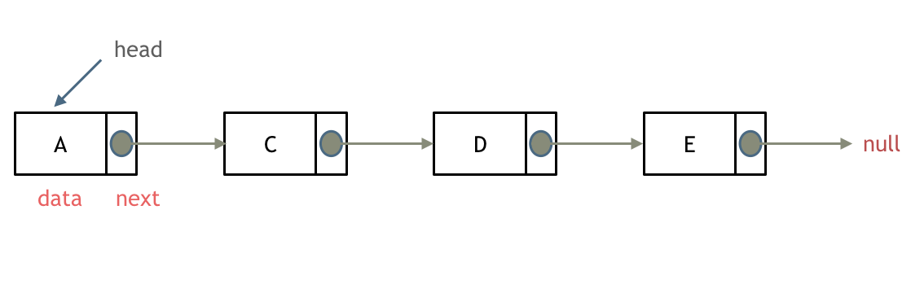
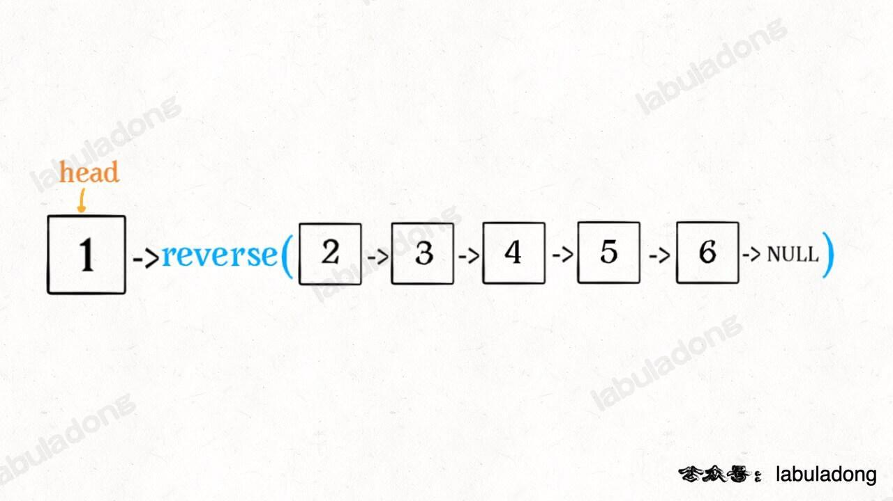
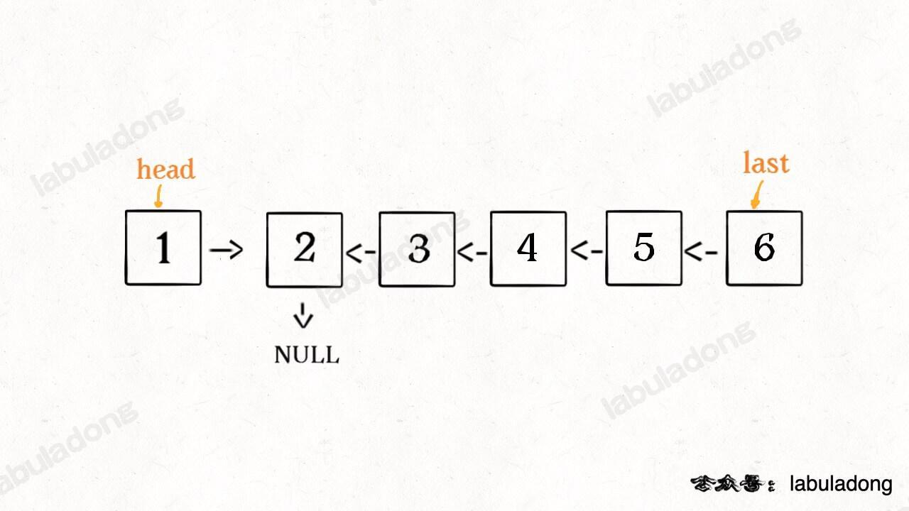
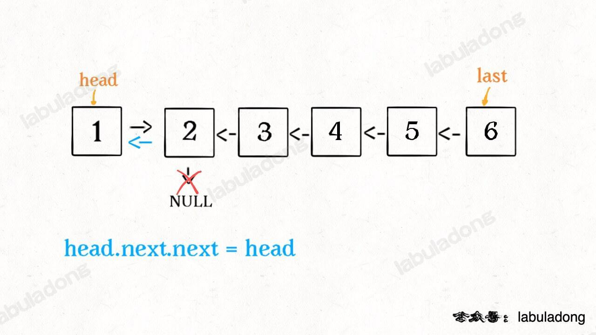

# 链表基础


## 什么是链表

链表是一种通过指针串联在一起的线性结构，每一个节点由两部分组成，一个是数据域一个是指针域（存放指向下一个节点的指针），最后一个节点的指针域指向null（空指针的意思）。

链表的入口节点称为链表的头结点也就是head。

如图所示：


### 链表的类型

#### 单链表



#### 双链表

单链表中的指针域只能指向节点的下一个节点。

双链表：每一个节点有两个指针域，一个指向下一个节点，一个指向上一个节点。

双链表 既可以向前查询也可以向后查询。

如图所示：


#### 循环链表

循环链表，顾名思义，就是链表首尾相连。

循环链表可以用来解决约瑟夫环问题。


### 链表的存储方式

了解完链表的类型，再来说一说链表在内存中的存储方式。数**组是在内存中是连续分布的，但是链表在内存中可不是连续分布的。**

**链表是通过指针域的指针链接在内存中各个节点。**

所以链表中的节点在内存中不是连续分布的 ，而是散乱分布在内存中的某地址上，分配机制取决于操作系统的内存管理。

如图所示：


这个链表起始节点为2， 终止节点为7， 各个节点分布在内存的不同地址空间上，通过指针串联在一起。


### 链表的定义

```go
type ListNode struct {
    Val  int        // 节点上存储的元素
    Next *ListNode  // 节点上存储的元素
}
```


## 链表的操作


### 删除节点

删除D节点，如图所示：


只要将C节点的next指针 指向E节点就可以了。那有同学说了，D节点不是依然存留在内存里么？只不过是没有在这个链表里而已。

是这样的，所以在C++里最好是再手动释放这个D节点，释放这块内存。

其他语言例如Java、Python，就有自己的内存回收机制，就不用自己手动释放了。


### 添加节点

如图所示：


可以看出链表的增添和删除都是O(1)操作，也不会影响到其他节点。

但是要注意，要是删除第五个节点，需要从头节点查找到第四个节点通过next指针进行删除操作，查找的时间复杂度是O(n)。


## 性能分析

再把链表的特性和数组的特性进行一个对比，如图所示：


数组在定义的时候，长度就是固定的，如果想改动数组的长度，就需要重新定义一个新的数组。

链表的长度可以是不固定的，并且可以动态增删， 适合数据量不固定，频繁增删，较少查询的场景。


# 链表实战


## 链表反转

### 1 递归法

​	**对于递归算法，最重要的就是明确递归函数的定义**。具体来说，我们的 `reverse` 函数定义是这样的：

**输入一个节点 `head`，将「以 `head` 为起点」的链表反转，并返回反转之后的头结点**。

​	明白了函数的定义，再来看这个问题。比如说我们想反转这个链表：

[](https://labuladong.github.io/algo/images/反转链表/1.jpg)

那么输入 `reverse(head)` 后，会在这里进行递归：

```java
ListNode last = reverse(head.next);
```

不要跳进递归（你的脑袋能压几个栈呀？），而是要根据刚才的函数定义，来弄清楚这段代码会产生什么结果：



这个 `reverse(head.next)` 执行完成后，整个链表就成了这样：



并且根据函数定义，`reverse` 函数会返回反转之后的头结点，我们用变量 `last` 接收了。

现在再来看下面的代码：

```java
head.next.next = head;
```



接下来：

```java
head.next = null;
return last;
```


神不神奇，这样整个链表就反转过来了！递归代码就是这么简洁优雅，不过其中有两个地方需要注意：

1、递归函数要有 base case，也就是这句：

```java
if (head == null || head.next == null) {
    return head;
}
```

意思是如果链表为空或者只有一个节点的时候，反转结果就是它自己，直接返回即可。

2、当链表递归反转之后，新的头结点是 `last`，而之前的 `head` 变成了最后一个节点，别忘了链表的末尾要指向 null：

```java
head.next = null;
```

理解了这两点后，我们就可以进一步深入了，接下来的问题其实都是在这个算法上的扩展

### 2 迭代法

​	多画图，注意每次需要用到的指针。


## 回文链表

**题目**：[回文链表](https://leetcode.cn/problems/palindrome-linked-list/)

**思路**：

### 1 逆向复制链表，使用双指针遍历比较，空间复杂度O(n)

### 2 使用递归

```go
func isPalindrome(head *ListNode) bool {
    left := head
    var palindrome func(right *ListNode) bool
    palindrome = func(right *ListNode) bool {
        if right == nil {
            return true
        }
        res := palindrome(right.Next)
        res = res && (right.Val == left.Val)
        left = left.Next
        return res
    }

    return palindrome(head)
}
```


### 3 快慢指针+逆转链表

​	使用快慢指针找到中点，逆转后半段链表，比较完成后再逆转回来，这样就不会破环链表原有结构


## 双指针技巧解决常见链表题目

### 1 合并两个有序链表

**题目**：[21. 合并两个有序链表 - 力扣（LeetCode）](https://leetcode.cn/problems/merge-two-sorted-lists/)

​	将两个升序链表合并为一个新的 **升序** 链表并返回。新链表是通过拼接给定的两个链表的所有节点组成的。


**思想**：虚拟节点+双指针

形象地理解，这个算法的逻辑类似于拉拉链，`l1, l2` 类似于拉链两侧的锯齿，指针 `p` 就好像拉链的拉索，将两个有序链表合并；或者说这个过程像蛋白酶合成蛋白质，`l1, l2` 就好比两条氨基酸，而指针 `p` 就好像蛋白酶，将氨基酸组合成蛋白质。

**代码中还用到一个链表的算法题中是很常见的「虚拟头结点」技巧，也就是 `dummy` 节点**。你可以试试，如果不使用 `dummy` 虚拟节点，代码会复杂很多，而有了 `dummy` 节点这个占位符，可以避免处理空指针的情况，降低代码的复杂性。

> PS：经常有读者问我，什么时候需要用虚拟头结点？我这里总结下：**当你需要创造一条新链表的时候，可以使用虚拟头结点简化边界情况的处理**。
>
> 比如说，让你把两条有序链表合并成一条新的有序链表，是不是要创造一条新链表？再比你想把一条链表分解成两条链表，是不是也在创造新链表？这些情况都可以使用虚拟头结点简化边界情况的处理。

**代码**：

```go
func mergeTwoLists(list1 *ListNode, list2 *ListNode) *ListNode {
	head := new(ListNode)
	q := head
	for list1 != nil && list2 != nil {
		if list1.Val < list2.Val {
			q.Next = list1
			list1 = list1.Next
		} else {
			q.Next = list2
			list2 = list2.Next
		}
		q = q.Next
	}

	if list1 == nil {
		q.Next = list2
	} else {
		q.Next = list1
	}

	return head.Next
}
```


### 2 单链表的分解

**题目**：[86. 分隔链表 - 力扣（LeetCode）](https://leetcode.cn/problems/partition-list/)

**思路**：虚拟节点

- 我们可以把原链表分成两个小链表，一个链表中的元素大小都小于 `x`，另一个链表中的元素都大于等于 `x`，最后再把这两条链表接到一起，就得到了题目想要的结果。

- 整体逻辑和合并有序链表非常相似，细节直接看代码吧，**注意虚拟头结点的运用**。
- **注意处理尾节点**


**代码**：

```go
func partition(head *ListNode, x int) *ListNode {
	dummy1, dummy2 := &ListNode{}, &ListNode{}
	p, p1, p2 := head, dummy1, dummy2

	for p != nil {
		if p.Val < x {
			p1.Next = p
			p1 = p1.Next
		} else {
			p2.Next = p
			p2 = p2.Next
		}
		p = p.Next
	}
	p1.Next, p2.Next = dummy2.Next, nil

	return dummy1.Next
}
```


### 3 合并 k 个有序链表

**题目**：[23. 合并K个升序链表 - 力扣（LeetCode）](https://leetcode.cn/problems/merge-k-sorted-lists/)

​	给你一个链表数组，每个链表都已经按升序排列。请你将所有链表合并到一个升序链表中，返回合并后的链表。

**思路**：虚拟节点+双指针

- 逐一合并

- 两两合并，使用归并合并

- 优先队列：合并 `k` 个有序链表的逻辑类似合并两个有序链表，难点在于，如何快速得到 `k` 个节点中的最小节点，接到结果链表上？

  这里我们就要用到 [优先级队列（二叉堆）](https://labuladong.github.io/algo/2/23/65/) 这种数据结构，把链表节点放入一个最小堆，就可以每次获得 `k` 个节点中的最小节点


### 4 单链表的倒数第 k 个节点

**题目**：[19. 删除链表的倒数第 N 个结点 - 力扣（LeetCode）](https://leetcode.cn/problems/remove-nth-node-from-end-of-list/)

**思路**：虚拟节点+快慢指针

那么，我们能不能**只遍历一次链表**，就算出倒数第 `k` 个节点？可以做到的，如果是面试问到这道题，面试官肯定也是希望你给出只需遍历一次链表的解法。

这个解法就比较巧妙了，假设 `k = 2`，思路如下：

首先，我们先让一个指针 `p1` 指向链表的头节点 `head`，然后走 `k` 步：

[](https://labuladong.github.io/algo/images/链表技巧/1.jpeg)

现在的 `p1`，只要再走 `n - k` 步，就能走到链表末尾的空指针了对吧？

趁这个时候，再用一个指针 `p2` 指向链表头节点 `head`：

[](https://labuladong.github.io/algo/images/链表技巧/2.jpeg)

接下来就很显然了，让 `p1` 和 `p2` 同时向前走，`p1` 走到链表末尾的空指针时前进了 `n - k` 步，`p2` 也从 `head` 开始前进了 `n - k` 步，停留在第 `n - k + 1` 个节点上，即恰好停链表的倒数第 `k` 个节点上：

[](https://labuladong.github.io/algo/images/链表技巧/3.jpeg)

这样，只遍历了一次链表，就获得了倒数第 `k` 个节点 `p2`。

**代码**：

```go
func removeNthFromEnd(head *ListNode, n int) *ListNode {
    dummy := &ListNode{Next: head}
    p, q := dummy, dummy
    // 为了删除待删除节点，需要找到其前驱节点，即倒数n+1
    // 如果是倒数i个，则快慢指针的差值为i-1，其前驱为i
    for i := 0; i < n; i++ {
        q = q.Next
    }

    for q.Next != nil {
        p, q = p.Next, q.Next
    }

    p.Next = p.Next.Next

    return dummy.Next
}
```


### 5 判断链表是否包含环

**题目**：[141. 环形链表 - 力扣（LeetCode）](https://leetcode.cn/problems/linked-list-cycle/)

**思路**：快慢指针

​	判断链表是否包含环属于经典问题了，解决方案也是用快慢指针：每当慢指针 `slow` 前进一步，快指针 `fast` 就前进两步。如果 `fast` 最终遇到空指针，说明链表中没有环；如果 `fast` 最终和 `slow` 相遇，那肯定是 `fast` 超过了 `slow` 一圈，说明链表中含有环。

**代码**：

```go
func hasCycle(head *ListNode) bool {
    p, q := head, head

    for q != nil && q.Next != nil {
        p, q = p.Next, q.Next.Next
        if p == q {
            return true
        }
    }

    return false
}
```


### 6 两个链表是否相交

**题目**：[160. 相交链表](https://leetcode.cn/problems/intersection-of-two-linked-lists/)


**思路**：双指针+交替迭代

**代码**：

```go
func getIntersectionNode(headA, headB *ListNode) *ListNode {
    p, q := headA, headB
    if p == nil || q == nil {
        return nil
    }
    for p != q {
        if p == nil {
            p = headB
        } else {
            p = p.Next
        }
        if q == nil {
            q = headA
        } else {
            q = q.Next
        }
    }

    return p
}
```

#### 进阶：

​	在A尾节点增加一条指向B链表的路径，这样**相交链表**就转换为**判断寻找环起点问题**


​	**题目**：[142. 环形链表 II](https://leetcode.cn/problems/linked-list-cycle-ii/)

​	给定一个链表的头节点  `head` ，返回链表开始入环的第一个节点。 *如果链表无环，则返回 `null`。


​	**思路**：快慢指针

​	我们假设快慢指针相遇时，慢指针 `slow` 走了 `k` 步，那么快指针 `fast` 一定走了 `2k` 步：

[](https://labuladong.github.io/algo/images/双指针/3.jpeg)

​	`fast` 一定比 `slow` 多走了 `k` 步，这多走的 `k` 步其实就是 `fast` 指针在环里转圈圈，所以 `k` 的值就是环长度的「整数倍」。

​	假设相遇点距环的起点的距离为 `m`，那么结合上图的 `slow` 指针，环的起点距头结点 `head` 的距离为 `k - m`，也就是说如果从 `head` 前进 `k - m` 步就能到达环起点。

​	巧的是，如果从相遇点继续前进 `k - m` 步，也恰好到达环起点。因为结合上图的 `fast` 指针，从相遇点开始走k步可以转回到相遇点，那走 `k - m` 步肯定就走到环起点了：

[](https://labuladong.github.io/algo/images/双指针/2.jpeg)

​	所以，只要我们把快慢指针中的任一个重新指向 `head`，然后两个指针同速前进，`k - m` 步后一定会相遇，相遇之处就是环的起点了。

​	**代码**：

```go
func detectCycle(head *ListNode) *ListNode {
	p, q := head, head
	for q != nil && q.Next != nil {
		p, q = p.Next, q.Next.Next
		if p == q {
			break
		}
	}

	if q == nil || q.Next == nil {
		return nil
	}
	p = head
	for p != q {
		p, q = p.Next, q.Next
	}

	return p
}
```


### 注意

- 链表处理：哨兵节点+虚拟节点+快慢指针+双指针