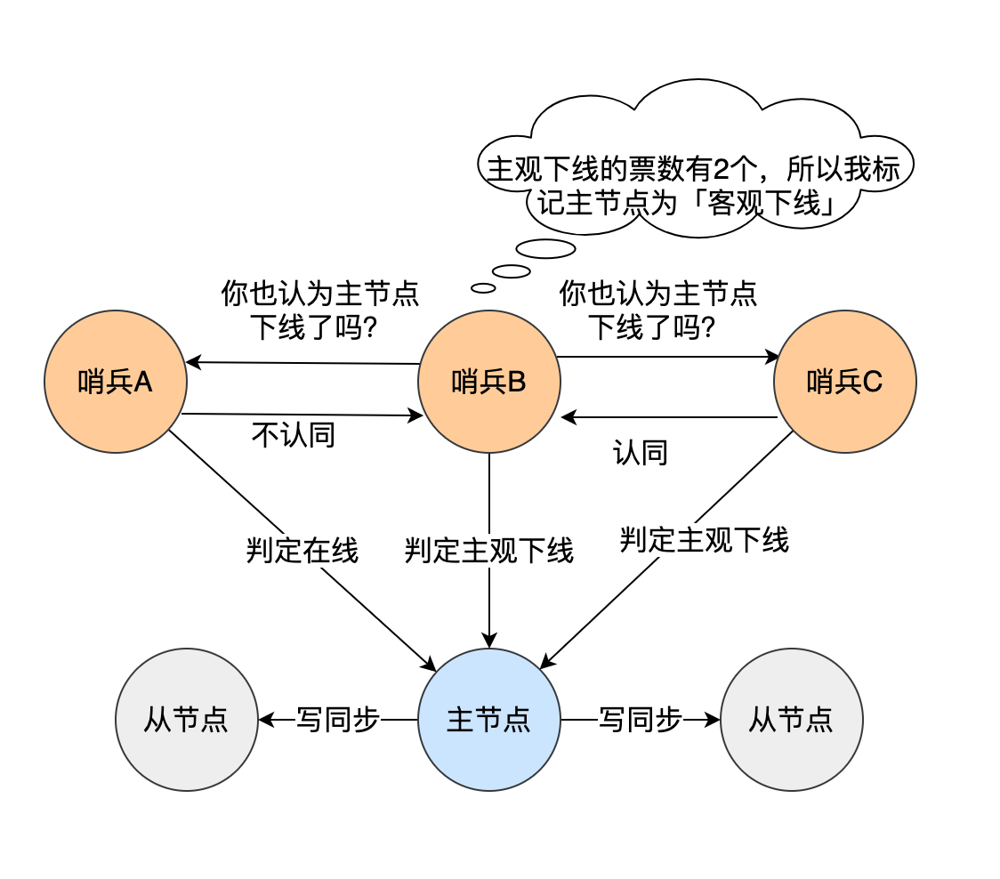

# 高可用


## 主从复制


### Redis主从节点是长连接还是短连接？

**长连接。**主从服务器在完成第一次同步后，双方之间就会维护一个 TCP 连接。后续主服务器可以通过这个连接继续将写操作命令传播给从服务器，然后从服务器执行该命令，使得与主服务器的数据库状态相同。

而且这个连接是长连接的，目的是避免频繁的 TCP 连接和断开带来的性能开销。

上面的这个过程被称为**基于长连接的命令传播**，通过这种方式来保证第一次同步后的主从服务器的数据一致性。


### 怎么判断 Redis 某个节点是否正常工作？

Redis 判断节点是否正常工作，基本都是通过互相的 ping-pong 心跳检测机制，如果有一半以上的节点去 ping 一个节点的时候没有 pong 回应，集群就会认为这个节点挂掉了，会断开与这个节点的连接。

Redis 主从节点发送的心跳间隔是不一样的，而且作用也有一点区别：

- Redis 主节点默认每隔 10 秒对从节点发送 ping 命令，判断从节点的存活性和连接状态，可通过参数repl-ping-slave-period控制发送频率。
- Redis 从节点每隔 1 秒发送 replconf ack{offset} 命令，给主节点上报自身当前的复制偏移量，目的是为了：
  - 实时监测主从节点网络状态；
  - **上报自身复制偏移量， 检查复制数据是否丢失**， 如果从节点数据丢失， 再从主节点的复制缓冲区中拉取丢失数据。


### 主从复制架构中，过期key如何处理？

主节点处理了一个key或者通过淘汰算法淘汰了一个key，这个时间主节点模拟一条del命令发送给从节点，从节点收到该命令后，就进行删除key的操作。


### Redis 是同步复制还是异步复制？

Redis 主从复制是异步复制，异步分为两个方面，一个是 master 服务器在将数据同步到 slave 时是异步的，因此 master 服务器在这里仍然可以接收其他请求，一个是 slave 在接收同步数据也是异步的。**即Redis 主节点每次收到写命令之后，先写到内部的缓冲区，然后异步发送给从节点。**


### 主从复制中两个 Buffer(replication buffer 、repl backlog buffer)有什么区别？

Redis 主从复制中的 replication buffer 和 repl_backlog_buffer 都是用于主从复制的缓冲区，但是它们的作用不同。replication buffer 对于一主多从来说是相互独立，即 Redis 会为每一个 Redis client 创建一个独立的 replication buffer，通过该 buffer 传输数据（R**edis replication buffer 的使用过程是这样的：Redis 先把数据写到这个 buffer 中，然后再把 buffer 中的数据发到 client 的 socket 中，通过网络发送出去，完成数据交互。**）。而 repl_backlog_buffer 则是一个环形缓冲区，会记录 Master 接收新的写请求数据的偏移量和新写命令，这样 Slave 再重新连接之后，就可以从这里接着发送命令给 Slave（用来记录从服务的同步进度，因为replication buffer 不能记录读取进度）。

replication buffer 、repl backlog buffer 区别如下：

- 出现的阶段不一样：

  - repl backlog buffer 是在增量复制阶段出现，**一个主节点只分配一个 repl backlog buffer**；
  - replication buffer 是在全量复制阶段和增量复制阶段都会出现，**主节点会给每个新连接的从节点，分配一个 replication buffer**；

- 这两个 Buffer 都有大小限制的，当缓冲区满了之后，发生的事情不一样：

  - 当 repl backlog buffer 满了，因为是环形结构，会直接**覆盖起始位置数据**;
  - 当 replication buffer 满了，会导致连接断开，删除缓存，从节点重新连接，**重新开始全量复制**。

  

### 如何应对主从数据不一致？

> 为什么会出现主从数据不一致？

主从数据不一致，就是指客户端从从节点中读取到的值和主节点中的最新值并不一致。

之所以会出现主从数据不一致的现象，是**因为主从节点间的命令复制是异步进行的**，所以无法实现强一致性保证（主从数据时时刻刻保持一致）。

具体来说，在主从节点命令传播阶段，主节点收到新的写命令后，会发送给从节点。但是，主节点并不会等到从节点实际执行完命令后，再把结果返回给客户端，而是主节点自己在本地执行完命令后，就会向客户端返回结果了。如果从节点还没有执行主节点同步过来的命令，主从节点间的数据就不一致了。

> 如何如何应对主从数据不一致？

第一种方法，尽量保证主从节点间的网络连接状况良好，避免主从节点在不同的机房。

第二种方法，可以开发一个外部程序来监控主从节点间的复制进度。具体做法：

- Redis 的 INFO replication 命令可以查看主节点接收写命令的进度信息（master_repl_offset）和从节点复制写命令的进度信息（slave_repl_offset），所以，我们就可以开发一个监控程序，先用 INFO replication 命令查到主、从节点的进度，然后，我们用 master_repl_offset 减去 slave_repl_offset，这样就能得到从节点和主节点间的复制进度差值了。
- **如果某个从节点的进度差值大于我们预设的阈值，我们可以让客户端不再和这个从节点连接进行数据读取**，这样就可以减少读到不一致数据的情况。不过，为了避免出现客户端和所有从节点都不能连接的情况，我们需要把复制进度差值的阈值设置得大一些。


### 主从切换如何减少数据丢失？

主从切换过程中，产生数据丢失的情况有两种：

- 异步复制同步丢失
- 集群产生脑裂数据丢失

我们不可能保证数据完全不丢失，只能做到使得尽量少的数据丢失。


#### 异步复制同步丢失

对于 Redis 主节点与从节点之间的数据复制，是异步复制的，当客户端发送写请求给主节点的时候，客户端会返回 ok，接着主节点将写请求异步同步给各个从节点，但是如果此时主节点还没来得及同步给从节点时发生了断电，那么主节点内存中的数据会丢失。

> 减少异步复制的数据丢失的方案

Redis 配置里有一个参数 min-slaves-max-lag，表示一旦所有的从节点数据复制和同步的延迟都超过了 min-slaves-max-lag 定义的值，那么主节点就会拒绝接收任何请求。

**假设将 min-slaves-max-lag 配置为 10s 后，根据目前 master->slave 的复制速度，如果数据同步完成所需要时间超过10s，就会认为 master 未来宕机后损失的数据会很多，master 就拒绝写入新请求。这样就能将 master 和 slave 数据差控制在10s内，即使 master 宕机也只是这未复制的 10s 数据。**

那么对于客户端，当客户端发现 master 不可写后，我们可以采取降级措施，将数据暂时写入本地缓存和磁盘中，在一段时间（等 master 恢复正常）后重新写入 master 来保证数据不丢失，也可以将数据写入 kafka 消息队列，等 master 恢复正常，再隔一段时间去消费 kafka 中的数据，让将数据重新写入 master 。


#### 集群产生脑裂数据丢失

先来理解集群的脑裂现象，这就好比一个人有两个大脑，那么到底受谁控制呢？

那么在 Redis 中，集群脑裂产生数据丢失的现象是怎样的呢？

在 Redis 主从架构中，部署方式一般是「一主多从」，主节点提供写操作，从节点提供读操作。

如果主节点的网络突然发生了问题，它与所有的从节点都失联了，但是此时的主节点和客户端的网络是正常的，这个客户端并不知道 Redis 内部已经出现了问题，还在照样的向这个失联的主节点写数据（过程A），此时这些数据被主节点缓存到了缓冲区里，因为主从节点之间的网络问题，这些数据都是无法同步给从节点的。

这时，哨兵也发现主节点失联了，它就认为主节点挂了（但实际上主节点正常运行，只是网络出问题了），于是哨兵就会在从节点中选举出一个 leeder 作为主节点，这时集群就有两个主节点了 —— **脑裂出现了**。

这时候网络突然好了，哨兵因为之前已经选举出一个新主节点了，它就会把旧主节点降级为从节点（A），然后从节点（A）会向新主节点请求数据同步，**因为第一次同步是全量同步的方式，此时的从节点（A）会清空掉自己本地的数据，然后再做全量同步。所以，之前客户端在过程 A 写入的数据就会丢失了，也就是集群产生脑裂数据丢失的问题**。

总结一句话就是：由于网络问题，集群节点之间失去联系。主从数据不同步；重新平衡选举，产生两个主服务。等网络恢复，旧主节点会降级为从节点，再与新主节点进行同步复制的时候，由于会从节点会清空自己的缓冲区，所以导致之前客户端写入的数据丢失了。

> 减少脑裂的数据丢的方案

当主节点发现「从节点下线的数量太多」，或者「网络延迟太大」的时候，那么主节点会禁止写操作，直接把错误返回给客户端。

在 Redis 的配置文件中有两个参数我们可以设置：

- min-slaves-to-write x，主节点必须要有**至少 x 个从节点连接**，如果小于这个数，主节点会禁止写数据。
- min-slaves-max-lag x，主从数据复制和同步的延迟**不能超过 x 秒**，如果主从同步的延迟超过 x 秒，主节点会禁止写数据。

我们可以把 min-slaves-to-write 和 min-slaves-max-lag 这两个配置项搭配起来使用，分别给它们设置一定的阈值，假设为 N 和 T。

这两个配置项组合后的要求是，**主节点连接的从节点中至少有 N 个从节点，「并且」主节点进行数据复制时的 ACK 消息延迟不能超过 T 秒**，否则，主节点就不会再接收客户端的写请求了。

即使原主节点是假故障，它在假故障期间也无法响应哨兵心跳，也不能和从节点进行同步，自然也就无法和从节点进行 ACK 确认了。这样一来，min-slaves-to-write 和 min-slaves-max-lag 的组合要求就无法得到满足，**原主节点就会被限制接收客户端写请求，客户端也就不能在原主节点中写入新数据了**。

**等到新主节点上线时，就只有新主节点能接收和处理客户端请求，此时，新写的数据会被直接写到新主节点中。而原主节点会被哨兵降为从节点，即使它的数据被清空了，也不会有新数据丢失。我再来给你举个例子。**

假设我们将 min-slaves-to-write 设置为 1，把 min-slaves-max-lag 设置为 12s，把哨兵的 down-after-milliseconds 设置为 10s，主节点因为某些原因卡住了 15s，导致哨兵判断主节点客观下线，开始进行主从切换。同时，因为原主节点卡住了 15s，没有一个从节点能和原主节点在 12s 内进行数据复制，原主节点也无法接收客户端请求了。这样一来，主从切换完成后，也只有新主节点能接收请求，不会发生脑裂，也就不会发生数据丢失的问题了。


### 主从如何做到故障自动切换？

主节点挂了 ，从节点是无法自动升级为主节点的，这个过程需要人工处理，在此期间 Redis 无法对外提供写操作。

此时，Redis 哨兵机制就登场了，哨兵在发现主节点出现故障时，由哨兵自动完成故障发现和故障转移，并通知给应用方，从而实现高可用性。

Redis的主从节点要实现故障自动切换，需要使用哨兵（sentinel）和keepalived两个工具。哨兵负责监控主节点的状态，当主节点失效时，通过投票和选举机制，将一个从节点升级为新的主节点。keepalived负责维护一个虚拟IP，当主节点切换时，将虚拟IP指向新的主节点，这样客户端不需要修改配置，只需要访问虚拟IP即可。


## 哨兵


### 为什么要有哨兵机制？

在 Redis 的主从架构中，由于主从模式是读写分离的，如果主节点（master）挂了，那么将没有主节点来服务客户端的写操作请求，也没有主节点给从节点（slave）进行数据同步了。


这时如果要恢复服务的话，需要人工介入，选择一个「从节点」切换为「主节点」，然后让其他从节点指向新的主节点，同时还需要通知上游那些连接 Redis 主节点的客户端，将其配置中的主节点 IP 地址更新为「新主节点」的 IP 地址。

这样也不太“智能”了，要是有一个节点能监控「主节点」的状态，当发现主节点挂了 ，它自动将一个「从节点」切换为「主节点」的话，那么可以节省我们很多事情啊！

Redis 在 2.8 版本以后提供的**哨兵（\*Sentinel\*）机制**，它的作用是实现**主从节点故障转移**。它会监测主节点是否存活，如果发现主节点挂了，它就会选举一个从节点切换为主节点，并且把新主节点的相关信息通知给从节点和客户端。


### 哨兵机制是如何工作的？

哨兵其实是一个运行在特殊模式下的 Redis 进程，所以它也是一个节点。从“哨兵”这个名字也可以看得出来，它相当于是“观察者节点”，观察的对象是主从节点。

当然，它不仅仅是观察那么简单，在它观察到有异常的状况下，会做出一些“动作”，来修复异常状态。

哨兵节点主要负责三件事情：**监控、选主、通知**。


所以，我们重点要学习这三件事情：

- 哨兵节点是如何监控节点的？又是如何判断主节点是否真的故障了？
- 根据什么规则选择一个从节点切换为主节点？
- 怎么把新主节点的相关信息通知给从节点和客户端呢？


### 如何判断主节点真的故障了？

哨兵会每隔 1 秒给所有主从节点发送 PING 命令，当主从节点收到 PING 命令后，会发送一个响应命令给哨兵，这样就可以判断它们是否在正常运行。


如果主节点或者从节点没有在规定的时间内响应哨兵的 PING 命令，哨兵就会将它们标记为「**主观下线**」。这个「规定的时间」是配置项 `down-after-milliseconds` 参数设定的，单位是毫秒。

> 主观下线？难道还有客观下线？

是的没错，**客观下线只适用于主节点。**

之所以针对「主节点」设计「主观下线」和「客观下线」两个状态，是因为有可能「主节点」其实并没有故障，可能只是因为主节点的系统压力比较大或者网络发送了拥塞，导致主节点没有在规定时间内响应哨兵的 PING 命令。

所以，为了减少误判的情况，哨兵在部署的时候不会只部署一个节点，而是用多个节点部署成**哨兵集群**（*最少需要三台机器来部署哨兵集群*），**通过多个哨兵节点一起判断，就可以就可以避免单个哨兵因为自身网络状况不好，而误判主节点下线的情况**。同时，多个哨兵的网络同时不稳定的概率较小，由它们一起做决策，误判率也能降低。

具体是怎么判定主节点为「客观下线」的呢？

当一个哨兵判断主节点为「主观下线」后，就会向其他哨兵发起命令，其他哨兵收到这个命令后，就会根据自身和主节点的网络状况，做出赞成投票或者拒绝投票的响应。


当这个哨兵的赞同票数达到哨兵配置文件中的 quorum 配置项设定的值后，这时主节点就会被该哨兵标记为「客观下线」。

例如，现在有 3 个哨兵，quorum 配置的是 2，那么一个哨兵需要 2 张赞成票，就可以标记主节点为“客观下线”了。这 2 张赞成票包括哨兵自己的一张赞成票和另外两个哨兵的赞成票。

PS：quorum 的值一般设置为哨兵个数的二分之一加1，例如 3 个哨兵就设置 2。

哨兵判断完主节点客观下线后，哨兵就要开始在多个「从节点」中，选出一个从节点来做新主节点。


### 由哪个哨兵进行主从故障转移？

前面说过，为了更加“客观”的判断主节点故障了，一般不会只由单个哨兵的检测结果来判断，而是多个哨兵一起判断，这样可以减少误判概率，所以**哨兵是以哨兵集群的方式存在的**。

问题来了，由哨兵集群中的哪个节点进行主从故障转移呢？

**所以这时候，还需要在哨兵集群中选出一个 leader，让 leader 来执行主从切换。**

选举 leader 的过程其实是一个投票的过程，在投票开始前，肯定得有个「候选者」。

> 那谁来作为候选者呢？

**哪个哨兵节点判断主节点为「客观下线」，这个哨兵节点就是候选者，所谓的候选者就是想当 Leader 的哨兵。**

举个例子，假设有三个哨兵。当哨兵 B 先判断到主节点「主观下线后」，就会给其他实例发送 is-master-down-by-addr 命令。接着，其他哨兵会根据自己和主节点的网络连接情况，做出赞成投票或者拒绝投票的响应。



当哨兵 B 收到赞成票数达到哨兵配置文件中的 quorum 配置项设定的值后，就会将主节点标记为「客观下线」，此时的哨兵 B 就是一个Leader 候选者。

> 候选者如何选举成为 Leader？

候选者会向其他哨兵发送命令，表明希望成为 Leader 来执行主从切换，并让所有其他哨兵对它进行投票。

**每个哨兵只有一次投票机会，如果用完后就不能参与投票了，可以投给自己或投给别人，但是只有候选者才能把票投给自己。**

那么在投票过程中，任何一个「候选者」，要满足两个条件：

- 第一，拿到半数以上的赞成票；
- 第二，拿到的票数同时还需要大于等于哨兵配置文件中的 quorum 值。

举个例子，假设哨兵节点有 3 个，quorum 设置为 2，那么任何一个想成为 Leader 的哨兵只要拿到 2 张赞成票，就可以选举成功了。如果没有满足条件，就需要重新进行选举。

这时候有的同学就会问了，如果某个时间点，刚好有两个哨兵节点判断到主节点为客观下线，那这时不就有两个候选者了？这时该如何决定谁是 Leader 呢？

每位候选者都会先给自己投一票，然后向其他哨兵发起投票请求。如果投票者先收到「候选者 A」的投票请求，就会先投票给它，如果投票者用完投票机会后，收到「候选者 B」的投票请求后，就会拒绝投票。这时，候选者 A 先满足了上面的那两个条件，所以「候选者 A」就会被选举为 Leader。

> 为什么哨兵节点至少要有 3 个？

**如果哨兵集群中只有 2 个哨兵节点，此时如果一个哨兵想要成功成为 Leader，必须获得 2 票，而不是 1 票。**

**所以，如果哨兵集群中有个哨兵挂掉了，那么就只剩一个哨兵了，如果这个哨兵想要成为 Leader，这时票数就没办法达到 2 票，就无法成功成为 Leader，这时是无法进行主从节点切换的。**

因此，通常我们至少会配置 3 个哨兵节点。这时，如果哨兵集群中有个哨兵挂掉了，那么还剩下两个个哨兵，如果这个哨兵想要成为 Leader，这时还是有机会达到 2 票的，所以还是可以选举成功的，不会导致无法进行主从节点切换。

当然，你要问，如果 3 个哨兵节点，挂了 2 个怎么办？这个时候得人为介入了，或者增加多一点哨兵节点。

再说一个问题，Redis 1 主 4 从，5 个哨兵 ，quorum 设置为 3，如果 2 个哨兵故障，当主节点宕机时，哨兵能否判断主节点“客观下线”？主从能否自动切换？

- **哨兵集群可以判定主节点“客观下线”**。哨兵集群还剩下 3 个哨兵，当一个哨兵判断主节点“主观下线”后，询问另外 2 个哨兵后，有可能能拿到 3 张赞同票，这时就达到了 quorum 的值，因此，哨兵集群可以判定主节点为“客观下线”。
- **哨兵集群可以完成主从切换**。当有个哨兵标记主节点为「客观下线」后，就会进行选举 Leader 的过程，因为此时哨兵集群还剩下 3 个哨兵，那么还是可以拿到半数以上（5/2+1=3）的票，而且也达到了 quorum 值，满足了选举 Leader 的两个条件， 所以就能选举成功，因此哨兵集群可以完成主从切换。

如果 quorum 设置为 2 ，并且如果有 3 个哨兵故障的话。此时哨兵集群还是可以判定主节点为“客观下线”，但是哨兵不能完成主从切换了，大家可以自己推演下。

如果 quorum 设置为 3，并且如果有 3 个哨兵故障的话，哨兵集群即不能判定主节点为“客观下线”，也不能完成主从切换了。

可以看到，quorum 为 2 的时候，并且如果有 3 个哨兵故障的话，虽然可以判定主节点为“客观下线”，但是不能完成主从切换，这样感觉「判定主节点为客观下线」这件事情白做了一样，既然这样，还不如不要做，quorum 为 3 的时候，就可以避免这种无用功。

所以，**quorum 的值建议设置为哨兵个数的二分之一加1**，例如 3 个哨兵就设置 2，5 个哨兵设置为 3，而且**哨兵节点的数量应该是奇数**。


### 主从故障转移的过程是怎样的？

在哨兵集群中通过投票的方式，选举出了哨兵 leader 后，就可以进行主从故障转移的过程了，如下图：


主从故障转移操作包含以下四个步骤：

- 第一步：在已下线主节点（旧主节点）属下的所有「从节点」里面，挑选出一个从节点，并将其转换为主节点。
- 第二步：让已下线主节点属下的所有「从节点」修改复制目标，修改为复制「新主节点」；
- 第三步：将新主节点的 IP 地址和信息，通过「发布者/订阅者机制」通知给客户端；
- 第四步：继续监视旧主节点，当这个旧主节点重新上线时，将它设置为新主节点的从节点；


#### 步骤一：选出新主节点

故障转移操作第一步要做的就是在已下线主节点属下的所有「从节点」中，挑选出一个状态良好、数据完整的从节点，然后向这个「从节点」发送 SLAVEOF no one 命令，将这个「从节点」转换为「主节点」。

那么多「从节点」，到底选择哪个从节点作为新主节点的？

随机的方式好吗？随机的方式，实现起来很简单，但是如果选到一个网络状态不好的从节点作为新主节点，那么可能在将来不久又要做一次主从故障迁移。

**所以，我们首先要把网络状态不好的从节点给过滤掉。首先把已经下线的从节点过滤掉，然后把以往网络连接状态不好的从节点也给过滤掉。**

怎么判断从节点之前的网络连接状态不好呢？

Redis 有个叫 down-after-milliseconds * 10 配置项，其down-after-milliseconds 是主从节点断连的最大连接超时时间。如果在 down-after-milliseconds 毫秒内，主从节点都没有通过网络联系上，我们就可以认为主从节点断连了。如果发生断连的次数超过了 10 次，就说明这个从节点的网络状况不好，不适合作为新主节点。

至此，我们就把网络状态不好的从节点过滤掉了，接下来要对所有从节点进行三轮考察：**优先级、复制进度、ID 号**。在进行每一轮考察的时候，哪个从节点优先胜出，就选择其作为新主节点。

- 第一轮考察：哨兵首先会根据从节点的优先级来进行排序，优先级越小排名越靠前，

- 第二轮考察：如果优先级相同，则查看复制的下标，哪个从「主节点」接收的复制数据多，哪个就靠前。

- 第三轮考察：如果优先级和下标都相同，就选择从节点 ID 较小的那个。

  

##### 第一轮考察：优先级最高的从节点胜出

Redis 有个叫 slave-priority 配置项，可以给从节点设置优先级。

每一台从节点的服务器配置不一定是相同的，**我们可以根据服务器性能配置来设置从节点的优先级。**

比如，如果 「 A 从节点」的物理内存是所有从节点中最大的， 那么我们可以把「 A 从节点」的优先级设置成最高。这样当哨兵进行第一轮考虑的时候，优先级最高的 A 从节点就会优先胜出，于是就会成为新主节点。


##### 第二轮考察：复制进度最靠前的从节点胜出

如果在第一轮考察中，发现优先级最高的从节点有两个，那么就会进行第二轮考察，比较两个从节点哪个复制进度。

什么是复制进度？主从架构中，主节点会将写操作同步给从节点，在这个过程中，主节点会用 master_repl_offset 记录当前的最新写操作在 repl_backlog_buffer 中的位置（如下图中的「主服务器已经写入的数据」的位置），而从节点会用 slave_repl_offset 这个值记录当前的复制进度（如下图中的「从服务器要读的位置」的位置）。


如果某个从节点的 slave_repl_offset 最接近 master_repl_offset，说明它的复制进度是最靠前的，于是就可以将它选为新主节点。


##### 第三轮考察：ID 号小的从节点胜出

如果在第二轮考察中，发现有两个从节点优先级和复制进度都是一样的，那么就会进行第三轮考察，比较两个从节点的 ID 号，ID 号小的从节点胜出。

什么是 ID 号？每个从节点都有一个编号，这个编号就是 ID 号，是用来唯一标识从节点的。

到这里，选主的事情终于结束了。简单给大家总结下：


在选举出从节点后，哨兵 leader 向被选中的从节点发送 `SLAVEOF no one` 命令，让这个从节点解除从节点的身份，将其变为新主节点。

如下图，哨兵 leader 向被选中的从节点 server2 发送 `SLAVEOF no one` 命令，将该从节点升级为新主节点。


在发送 `SLAVEOF no one` 命令之后，哨兵 leader 会以每秒一次的频率向被升级的从节点发送 `INFO` 命令（没进行故障转移之前，`INFO` 命令的频率是每十秒一次），并观察命令回复中的角色信息，当被升级节点的角色信息从原来的 slave 变为 master 时，哨兵 leader 就知道被选中的从节点已经顺利升级为主节点了。

如下图，选中的从节点 server2 升级成了新主节点：


#### 步骤二：将从节点指向新主节点

当新主节点出现之后，哨兵 leader 下一步要做的就是，让已下线主节点属下的所有「从节点」指向「新主节点」，这一动作可以通过向「从节点」发送 `SLAVEOF` 命令来实现。

如下图，哨兵 leader 向所有从节点（server3和server4）发送 `SLAVEOF` ，让它们成为新主节点的从节点。


所有从节点指向新主节点后的拓扑图如下：


#### 步骤三：通知客户的主节点已更换

经过前面一系列的操作后，哨兵集群终于完成主从切换的工作，那么新主节点的信息要如何通知给客户端呢？

这主要**通过 Redis 的发布者/订阅者机制来实现**的。每个哨兵节点提供发布者/订阅者机制，客户端可以从哨兵订阅消息。

哨兵提供的消息订阅频道有很多，不同频道包含了主从节点切换过程中的不同关键事件，几个常见的事件如下：


客户端和哨兵建立连接后，客户端会订阅哨兵提供的频道。**主从切换完成后，哨兵就会向 `+switch-master` 频道发布新主节点的 IP 地址和端口的消息，这个时候客户端就可以收到这条信息，然后用这里面的新主节点的 IP 地址和端口进行通信了**。

通过发布者/订阅者机制机制，有了这些事件通知，客户端不仅可以在主从切换后得到新主节点的连接信息，还可以监控到主从节点切换过程中发生的各个重要事件。这样，客户端就可以知道主从切换进行到哪一步了，有助于了解切换进度。


#### 步骤四：将旧主节点变为从节点

故障转移操作最后要做的是，继续监视旧主节点，当旧主节点重新上线时，哨兵集群就会向它发送 `SLAVEOF` 命令，让它成为新主节点的从节点，如下图：


至此，整个主从节点的故障转移的工作结束。


#### 总结：

- leader 按照一定条件从下线主节点的从节点中选出一个从节点作为主节点
- 发送命令给其他从节点，将其他从节点指向新主节点
- 使用 Publisher/Subscriber 机制，通知客户端主节点已更换
- 监听下线的旧主节点，当其上线以后，将其变为从节点


### 哨兵集群是如何组成的？

前面提到了 Redis 的发布者/订阅者机制，那就不得不提一下哨兵集群的组成方式，因为它也用到了这个技术。

在我第一次搭建哨兵集群的时候，当时觉得很诧异。因为在配置哨兵的信息时，竟然只需要填下面这几个参数，设置主节点名字、主节点的 IP 地址和端口号以及 quorum 值。

```c
sentinel monitor <master-name> <ip> <redis-port> <quorum> 
```

不需要填其他哨兵节点的信息，我就好奇它们是如何感知对方的，又是如何组成哨兵集群的？

后面才了解到，**哨兵节点之间是通过 Redis 的发布者/订阅者机制来相互发现的**。

在主从集群中，主节点上有一个名为`__sentinel__:hello`的频道，不同哨兵就是通过它来相互发现，实现互相通信的。

在下图中，哨兵 A 把自己的 IP 地址和端口的信息发布到`__sentinel__:hello` 频道上，哨兵 B 和 C 订阅了该频道。那么此时，哨兵 B 和 C 就可以从这个频道直接获取哨兵 A 的 IP 地址和端口号。然后，哨兵 B、C 可以和哨兵 A 建立网络连接。


通过这个方式，哨兵 B 和 C 也可以建立网络连接，这样一来，哨兵集群就形成了。

> 哨兵集群会对「从节点」的运行状态进行监控，那哨兵集群如何知道「从节点」的信息？

主节点知道所有「从节点」的信息，所以哨兵会每 10 秒一次的频率向主节点发送 INFO 命令来获取所有「从节点」的信息。

如下图所示，哨兵 B 给主节点发送 INFO 命令，主节点接受到这个命令后，就会把从节点列表返回给哨兵。接着，哨兵就可以根据从节点列表中的连接信息，和每个从节点建立连接，并在这个连接上持续地对从节点进行监控。哨兵 A 和 C 可以通过相同的方法和从节点建立连接。


正式通过 Redis 的发布者/订阅者机制，哨兵之间可以相互感知，然后组成集群，同时，哨兵又通过 INFO 命令，在主节点里获得了所有从节点连接信息，于是就能和从节点建立连接，并进行监控了。


### 总结

Redis 在 2.8 版本以后提供的**哨兵（\*Sentinel\*）机制**，它的作用是实现**主从节点故障转移**。它会监测主节点是否存活，如果发现主节点挂了，它就会选举一个从节点切换为主节点，并且把新主节点的相关信息通知给从节点和客户端。

哨兵一般是以集群的方式部署，至少需要 3 个哨兵节点，哨兵集群主要负责三件事情：**监控、选主、通知**。

哨兵节点通过 Redis 的发布者/订阅者机制，哨兵之间可以相互感知，相互连接，然后组成哨兵集群，同时哨兵又通过 INFO 命令，在主节点里获得了所有从节点连接信息，于是就能和从节点建立连接，并进行监控了。

*1、第一轮投票：判断主节点下线*

当哨兵集群中的某个哨兵判定主节点下线（主观下线）后，就会向其他哨兵发起命令，其他哨兵收到这个命令后，就会根据自身和主节点的网络状况，做出赞成投票或者拒绝投票的响应。

当这个哨兵的赞同票数达到哨兵配置文件中的 quorum 配置项设定的值后，这时主节点就会被该哨兵标记为「客观下线」。

*2、第二轮投票：选出哨兵leader*

某个哨兵判定主节点客观下线后，该哨兵就会发起投票，告诉其他哨兵，它想成为 leader，想成为 leader 的哨兵节点，要满足两个条件：

- 第一，拿到半数以上的赞成票；
- 第二，拿到的票数同时还需要大于等于哨兵配置文件中的 quorum 值。

*3、由哨兵 leader 进行主从故障转移*

选举出了哨兵 leader 后，就可以进行主从故障转移的过程了。该操作包含以下四个步骤：

- 第一步：在已下线主节点（旧主节点）属下的所有「从节点」里面，挑选出一个从节点，并将其转换为主节点，选择的规则：
  - 过滤掉已经离线的从节点；
  - 过滤掉历史网络连接状态不好的从节点；
  - 将剩下的从节点，进行三轮考察：优先级、复制进度、ID 号。在每一轮考察过程中，如果找到了一个胜出的从节点，就将其作为新主节点。
- 第二步：让已下线主节点属下的所有「从节点」修改复制目标，修改为复制「新主节点」；
- 第三步：将新主节点的 IP 地址和信息，通过「发布者/订阅者机制」通知给客户端；
- 第四步：继续监视旧主节点，当这个旧主节点重新上线时，将它设置为新主节点的从节点；


