> 本文由 [简悦 SimpRead](http://ksria.com/simpread/) 转码， 原文地址 [mp.weixin.qq.com](https://mp.weixin.qq.com/s/jIWe3nMP6yiuXeBQgmePDg)

1 概念梳理
======

1.1 线程
------

通常语义中的线程，指的是内核级线程，核心点如下：

（1）是操作系统最小调度单元；

（2）创建、销毁、调度交由内核完成，**cpu 需完成用户态与内核态间的切换**；

（3）可充分利用多核，实现并行.

1.2 协程
------

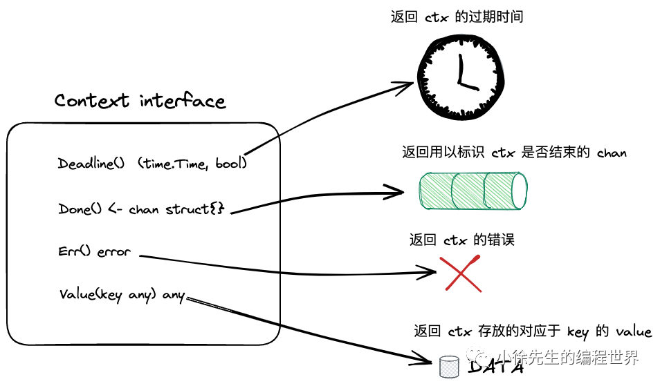

协程，又称为用户级线程，核心点如下：

（1）与线程存在映射关系，为 M：1；

（2）创建、销毁、调度在用户态完成，对内核透明，所以更轻；

（3）**从属同一个内核级线程，无法并行；一个协程阻塞会导致从属同一线程的所有协程无法执行.**

1.3 Goroutine
-------------

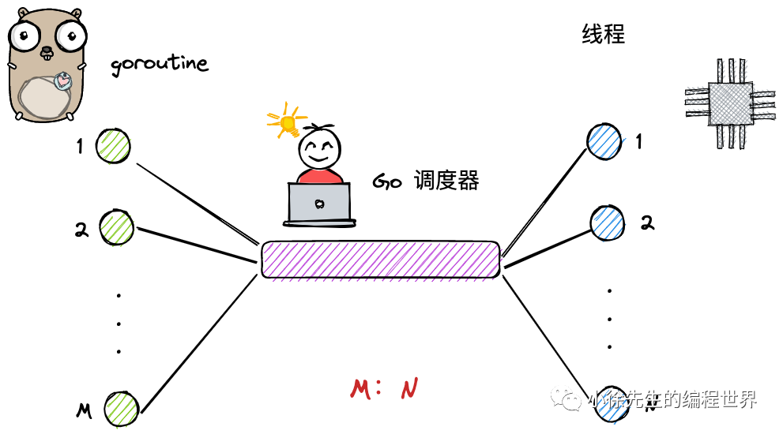 

Goroutine，经 Golang 优化后的特殊 “协程”（在线程和协程之间加了yi'g），核心点如下：

（1）与线程存在映射关系，为 M：N；

（2）创建、销毁、调度在用户态完成，对内核透明，足够轻便；

（3）可利用多个线程，实现并行；

（4）通过调度器的斡旋，实现和线程间的动态绑定和灵活调度；

（5）栈空间大小可动态扩缩，因地制宜.

1.4 对比
------

三个模型的各项能力对比如下:

<table><thead data-style="line-height: 1.75; background: rgba(0, 0, 0, 0.05); font-weight: bold; color: rgb(63, 63, 63);"><tr><td data-style="line-height: 1.75; border-color: rgb(223, 223, 223); padding: 0.25em 0.5em;"><strong data-style="line-height: 1.75; color: rgb(15, 76, 129);">模型</strong></td><td data-style="line-height: 1.75; border-color: rgb(223, 223, 223); padding: 0.25em 0.5em;"><strong data-style="line-height: 1.75; color: rgb(15, 76, 129);">弱依赖内核</strong></td><td data-style="line-height: 1.75; border-color: rgb(223, 223, 223); padding: 0.25em 0.5em;"><strong data-style="line-height: 1.75; color: rgb(15, 76, 129);">可并行</strong></td><td data-style="line-height: 1.75; border-color: rgb(223, 223, 223); padding: 0.25em 0.5em;"><strong data-style="line-height: 1.75; color: rgb(15, 76, 129);">可应对阻塞</strong></td><td data-style="line-height: 1.75; border-color: rgb(223, 223, 223); padding: 0.25em 0.5em;"><strong data-style="line-height: 1.75; color: rgb(15, 76, 129);">栈可动态扩缩</strong></td></tr></thead><tbody><tr><td data-style="line-height: 1.75; border-color: rgb(223, 223, 223); padding: 0.25em 0.5em; color: rgb(63, 63, 63);">线程</td><td data-style="line-height: 1.75; border-color: rgb(223, 223, 223); padding: 0.25em 0.5em; color: rgb(63, 63, 63);">❎</td><td data-style="line-height: 1.75; border-color: rgb(223, 223, 223); padding: 0.25em 0.5em; color: rgb(63, 63, 63);">✅</td><td data-style="line-height: 1.75; border-color: rgb(223, 223, 223); padding: 0.25em 0.5em; color: rgb(63, 63, 63);">✅</td><td data-style="line-height: 1.75; border-color: rgb(223, 223, 223); padding: 0.25em 0.5em; color: rgb(63, 63, 63);">❎</td></tr><tr><td data-style="line-height: 1.75; border-color: rgb(223, 223, 223); padding: 0.25em 0.5em; color: rgb(63, 63, 63);">协程</td><td data-style="line-height: 1.75; border-color: rgb(223, 223, 223); padding: 0.25em 0.5em; color: rgb(63, 63, 63);">✅</td><td data-style="line-height: 1.75; border-color: rgb(223, 223, 223); padding: 0.25em 0.5em; color: rgb(63, 63, 63);">❎</td><td data-style="line-height: 1.75; border-color: rgb(223, 223, 223); padding: 0.25em 0.5em; color: rgb(63, 63, 63);">❎</td><td data-style="line-height: 1.75; border-color: rgb(223, 223, 223); padding: 0.25em 0.5em; color: rgb(63, 63, 63);">❎</td></tr><tr><td data-style="line-height: 1.75; border-color: rgb(223, 223, 223); padding: 0.25em 0.5em; color: rgb(63, 63, 63);">goroutine</td><td data-style="line-height: 1.75; border-color: rgb(223, 223, 223); padding: 0.25em 0.5em; color: rgb(63, 63, 63);">✅</td><td data-style="line-height: 1.75; border-color: rgb(223, 223, 223); padding: 0.25em 0.5em; color: rgb(63, 63, 63);">✅</td><td data-style="line-height: 1.75; border-color: rgb(223, 223, 223); padding: 0.25em 0.5em; color: rgb(63, 63, 63);">✅</td><td data-style="line-height: 1.75; border-color: rgb(223, 223, 223); padding: 0.25em 0.5em; color: rgb(63, 63, 63);">✅</td></tr></tbody></table>

综上，goroutine 可说是博采众长之物.

实际上，“灵活调度” 一词概括得实在过于简要，Golang 在调度 goroutine 时，针对 “如何减少加锁行为”，“如何避免资源不均” 等问题都给出了精彩的解决方案，这一切都得益于经典的 “gmp” 模型，而这些，就留待第 2 节展开介绍.

2 gmp 模型
========

gmp = goroutine + machine + processor （+ 一套有机组合的机制），下面先单独拆出每个组件进行介绍，最后再总览全局，对 gmp 进行总述.

2.1 g
-----

（1）g 即 goroutine，是 golang 中对协程的抽象；

（2）g 有自己的运行栈、状态、以及执行的任务函数（用户通过 go func 指定）；

（3）g 需要绑定到 p 才能执行，**在 g 的视角中，p 就是它的 cpu.**

2.2 p
-----

（1）p 即 processor，是 golang 中的调度器；

（2）p 是 gmp 的中枢，借由 p 承上启下，实现 g 和 m 之间的动态有机结合；

（3）对 g 而言，p 是其 cpu，g 只有被 p 调度，才得以执行；

（4）**对 m 而言，p 是其执行代理，为其提供必要信息的同时（可执行的 g、内存分配情况等），并隐藏了繁杂的调度细节；**

（5）p 的数量决定了 g 最大并行数量，可由用户通过 GOMAXPROCS 进行设定（超过 CPU 核数时无意义）.

2.3 m
-----

（1）**m 即 machine，是 golang 中对线程的抽象；**

（2）m 不直接执行 g，而是先和 p 绑定，由其实现代理；

（3）借由 p 的存在，m 无需和 g 绑死，也无需记录 g 的状态信息，因此 g 在全生命周期中可以实现跨 m 执行.

2.4 gmp
-------


GMP 宏观模型如上图所示，下面对其要点和细节进行逐一介绍：

（1）M 是线程的抽象；G 是 goroutine；P 是承上启下的调度器；

（2）M 调度 G 前，需要和 P 绑定；

（3）全局有多个 M 和多个 P，但同时并行的 G 的最大数量等于 P 的数量；

（4）G 的存放队列有三类：P 的本地队列；全局队列；和 wait 队列（图中未展示，为 io 阻塞就绪态 goroutine 队列）；

（5）M 调度 G 时，优先取 P 本地队列，其次取全局队列，最后取 wait 队列；这样的好处是，取本地队列时，可以接近于无锁化，减少全局锁竞争；

（6）为防止不同 P 的闲忙差异过大，设立 work-stealing 机制，本地队列为空的 P 可以尝试从其他 P 本地队列偷取一半的 G 补充到自身队列.

文字性总结难免有些过于含糊和空洞，对一些细节的描述总是不够精确的. 下面照旧开启源码走读流程，从代码中寻求理论证明和细节补充.

3 核心数据结构
========

gmp 数据结构定义为 runtime/runtime2.go 文件中，由于各个类的成员属性较多，那么只摘取核心字段进行介绍.

3.1 g
-----

```
type g struct {
    // ...
    m         *m      
    // ...
    sched     gobuf
    // ...
}


type gobuf struct {
    sp   uintptr
    pc   uintptr
    ret  uintptr
    bp   uintptr // for framepointer-enabled architectures
}

```

（1）m：在 p 的代理，负责执行当前 g 的 m；

（2）sched.sp：保存 CPU 的 rsp 寄存器的值，指向函数调用栈栈顶；

（3）sched.pc：保存 CPU 的 rip 寄存器的值，指向程序下一条执行指令的地址；

（4）sched.ret：保存系统调用的返回值；

（5）sched.bp：保存 CPU 的 rbp 寄存器的值，存储函数栈帧的起始位置.

其中 g 的生命周期由以下几种状态组成：

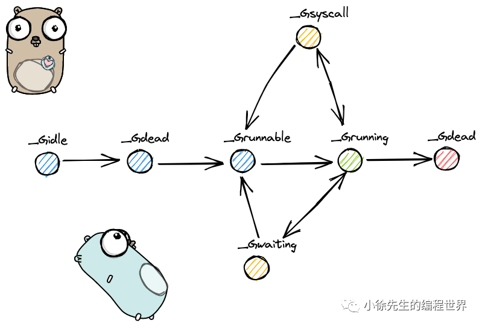

```
const(
  _Gidle = itoa // 0
  _Grunnable // 1
  _Grunning // 2
  _Gsyscall // 3
  _Gwaiting // 4
  _Gdead // 6
  _Gcopystack // 8
  _Gpreempted // 9
)

```

（1）_Gidle 值为 0，为协程开始创建时的状态，此时尚未初始化完成；

（2）_Grunnable 值 为 1，协程在待执行队列中，等待被执行；

（3）_Grunning 值为 2，协程正在执行，同一时刻一个 p 中只有一个 g 处于此状态；

（4）_Gsyscall 值为 3，协程正在执行系统调用；

（5）_Gwaiting 值为 4，协程处于挂起态，需要等待被唤醒. gc、channel 通信或者锁操作时经常会进入这种状态；

（6）_Gdead 值为 6，协程刚初始化完成或者已经被销毁，会处于此状态；

（7）_Gcopystack 值为 8，协程正在栈扩容流程中；

（8）_Greempted 值为 9，协程被抢占后的状态.

3.2 m
-----

```
type m struct {
    g0      *g     // goroutine with scheduling stack
    // ...
    tls           [tlsSlots]uintptr // thread-local storage (for x86 extern register)
    // ...
}

```

（1）g0：**一类特殊的调度协程，不用于执行用户函数，负责执行 g 之间的切换调度. 与 m 的关系为 1:1**；

（2）tls：thread-local storage，线程本地存储，存储内容只对当前线程可见. 线程本地存储的是 m.tls 的地址，m.tls[0] 存储的是当前运行的 g，因此线程可以通过 g 找到当前的 m、p、g0 等信息.

3.3 p
-----

```
type p struct {
    // ...
    runqhead uint32
    runqtail uint32
    runq     [256]guintptr
    
    runnext guintptr
    // ...
}

```

（1）runq：本地 goroutine 队列，最大长度为 256.

（2）runqhead：队列头部；

（3）runqtail：队列尾部；

（4）runnext：下一个可执行的 goroutine.

3.4 schedt
----------

```
type schedt struct {
    // ...
    lock mutex
    // ...
    runq     gQueue
    runqsize int32
    // ...
}

```

sched 是全局 goroutine 队列的封装：

（1）lock：一把操作全局队列时使用的锁；

（2）runq：全局 goroutine 队列；

（3）runqsize：全局 goroutine 队列的容量.

4 调度流程
======

4.1 两种 g 的转换
------------

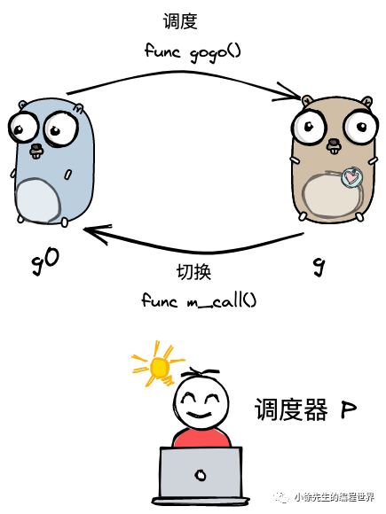

如 3.2 小节中所谈及的，**goroutine 的类型可分为两类：**

**I 负责调度普通 g 的 g0，执行固定的调度流程，与 m 的关系为一对一；**

**II 负责执行用户函数的普通 g.**

<u>m 通过 p 调度执行的 goroutine 永远在普通 g 和 g0 之间进行切换，当 g0 找到可执行的 g 时，会调用 gogo 方法，调度 g 执行用户定义的任务；当 g 需要主动让渡或被动调度时，会触发 mcall 方法，将执行权重新交还给 g0.</u>

gogo 和 mcall 可以理解为对偶关系，其定义位于 runtime/stubs.go 文件中.

```
func gogo(buf *gobuf)
// ...
func mcall(fn func(*g))

```

4.2 调度类型
--------

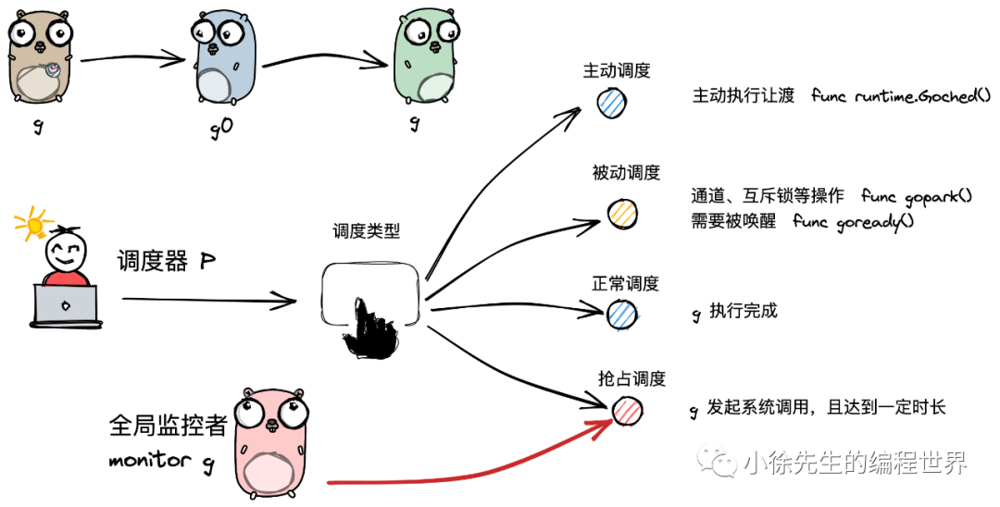

**通常，调度指的是由 g0 按照特定策略找到下一个可执行 g 的过程.** 而本小节谈及的调度类型是广义上的 “调度”，指的是调度器 p 实现从执行一个 g 切换到另一个 g 的过程.

这种广义 “调度” 可分为几种类型：

（1）主动调度

**一种用户主动执行让渡的方式**，主要方式是，用户在执行代码中调用了 runtime.Gosched 方法，此时当前 g 会当让出执行权，主动进行队列等待下次被调度执行.

代码位于 runtime/proc.go

```
func Gosched() {
    checkTimeouts()
    mcall(gosched_m)
}

```

（2）被动调度

**因当前不满足某种执行条件，g 可能会陷入阻塞态无法被调度，直到关注的条件达成后，g 才从阻塞中被唤醒，重新进入可执行队列等待被调度.**

常见的被动调度触发方式为因 channel 操作或互斥锁操作陷入阻塞等操作，底层会走进 gopark 方法.

代码位于 runtime/proc.go

```
func gopark(unlockf func(*g, unsafe.Pointer) bool, lock unsafe.Pointer, reason waitReason, traceEv byte, traceskip int) {
    // ...
    mcall(park_m)
}

```

goready 方法通常与 gopark 方法成对出现，能够将 g 从阻塞态中恢复，重新进入等待执行的状态.

代码位于 runtime/proc.go

```
func goready(gp *g, traceskip int) {
    systemstack(func() {
        ready(gp, traceskip, true)
    })
}

```

（3）正常调度：

g 中的执行任务已完成，g0 会将当前 g 置为死亡状态，发起新一轮调度.

（4）抢占调度：

**倘若 g 执行系统调用超过指定的时长，**且全局的 p 资源比较紧缺，此时将 p 和 g 解绑，抢占出来用于其他 g 的调度. 等 g 完成系统调用后，会重新进入可执行队列中等待被调度.

**值得一提的是，前 3 种调度方式都由 m 下的 g0 完成，唯独抢占调度不同.**

因为发起系统调用时需要打破用户态的边界进入内核态，此时 m 也会因系统调用而陷入僵直，无法主动完成抢占调度的行为.

因此，**在 Golang 进程会有一个全局监控协程 monitor g 的存在，这个 g 会越过 p 直接与一个 m 进行绑定，不断轮询对所有 p 的执行状况进行监控. 倘若发现满足抢占调度的条件，则会从第三方的角度出手干预，主动发起该动作.**

4.3 宏观调度流程
----------


 

集齐各部分理论碎片之后，我们可以尝试对 gmp 的宏观调度流程进行整体串联：

（1）以 g0 -> g -> g0 的一轮循环为例进行串联；

（2）g0 执行 schedule() 函数，寻找到用于执行的 g；

（3）g0 执行 execute() 方法，更新当前 g、p 的状态信息，并调用 gogo() 方法，将执行权交给 g；

（4）g 因主动让渡 (gosche_m() )、被动调度( park_m() )、正常结束( goexit0() ) 等原因，调用 m_call 函数，执行权重新回到 g0 手中；

（5）g0 执行 schedule() 函数，开启新一轮循环.

4.4 schedule
------------

调度流程的主干方法是位于 runtime/proc.go 中的 schedule 函数，此时的执行权位于 g0 手中：

```
func schedule() {
    // ...
    gp, inheritTime, tryWakeP := findRunnable() // blocks until work is available


    // ...
    execute(gp, inheritTime)
}

```

（1）寻找到下一个执行的 goroutine；

（2）执行该 goroutine.

4.5 findRunnable
----------------


调度流程中，一个非常核心的步骤，就是为 m 寻找到下一个执行的 g，这部分内容位于 runtime/proc.go 的 findRunnable 方法中：

```
func findRunnable() (gp *g, inheritTime, tryWakeP bool) {
    _g_ := getg()


top:
    _p_ := _g_.m.p.ptr()
    // ...
    if _p_.schedtick%61 == 0 && sched.runqsize > 0 {
        lock(&sched.lock)
        gp = globrunqget(_p_, 1)
        unlock(&sched.lock)
        if gp != nil {
            return gp, false, false
        }
    }
    
    // ...
    if gp, inheritTime := runqget(_p_); gp != nil {
        return gp, inheritTime, false
    }
    
    // ...
    if sched.runqsize != 0 {
        lock(&sched.lock)
        gp := globrunqget(_p_, 0)
        unlock(&sched.lock)
        if gp != nil {
            return gp, false, false
        }
    }


    if netpollinited() && atomic.Load(&netpollWaiters) > 0 && atomic.Load64(&sched.lastpoll) != 0 {
        if list := netpoll(0); !list.empty() { // non-blocking
            gp := list.pop()
            injectglist(&list)
            casgstatus(gp, _Gwaiting, _Grunnable)
            return gp, false, false
        }
    }


    // ...
    procs := uint32(gomaxprocs)
    if _g_.m.spinning || 2*atomic.Load(&sched.nmspinning) < procs-atomic.Load(&sched.npidle) {
        if !_g_.m.spinning {
            _g_.m.spinning = true
            atomic.Xadd(&sched.nmspinning, 1)
        }


        gp, inheritTime, tnow, w, newWork := stealWork(now)
        now = tnow
        if gp != nil {
            // Successfully stole.
            return gp, inheritTime, false
        }
        if newWork {
            // There may be new timer or GC work; restart to
            // discover.
            goto top
        }
        if w != 0 && (pollUntil == 0 || w < pollUntil) {
            // Earlier timer to wait for.
            pollUntil = w
        }
    }


    // 

```

（1）p 每执行 61 次调度，会从全局队列中获取一个 goroutine 进行执行，并将一个全局队列中的 goroutine 填充到当前 p 的本地队列中.

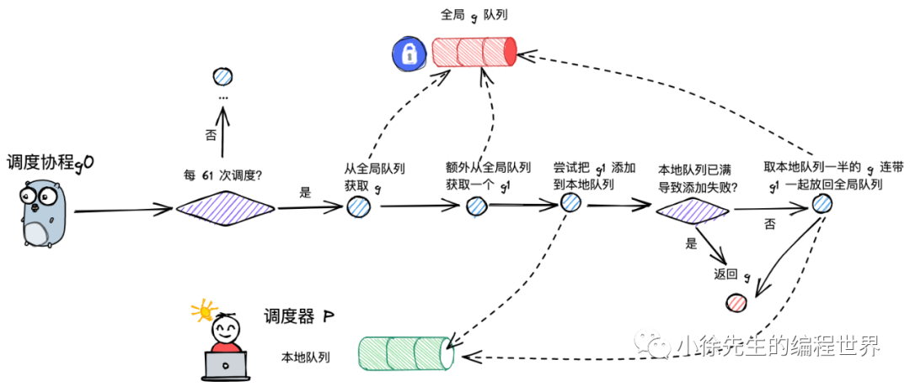

```
 if _p_.schedtick%61 == 0 && sched.runqsize > 0 {
        lock(&sched.lock)
        gp = globrunqget(_p_, 1)
        unlock(&sched.lock)
        if gp != nil {
            return gp, false, false
        }
 }

```

除了获取一个 g 用于执行外，还会额外将一个 g 从全局队列转移到 p 的本地队列，让全局队列中的 g 也得到更充分的执行机会.

```
func globrunqget(_p_ *p, max int32) *g {
    if sched.runqsize == 0 {
        return nil
    }


    n := sched.runqsize/gomaxprocs + 1
    if n > sched.runqsize {
        n = sched.runqsize
    }
    if max > 0 && n > max {
        n = max
    }
    if n > int32(len(_p_.runq))/2 {
        n = int32(len(_p_.runq)) / 2
    }


    sched.runqsize -= n


    gp := sched.runq.pop()
    n--
    for ; n > 0; n-- {
        gp1 := sched.runq.pop()
        runqput(_p_, gp1, false)
    }
    return gp

```

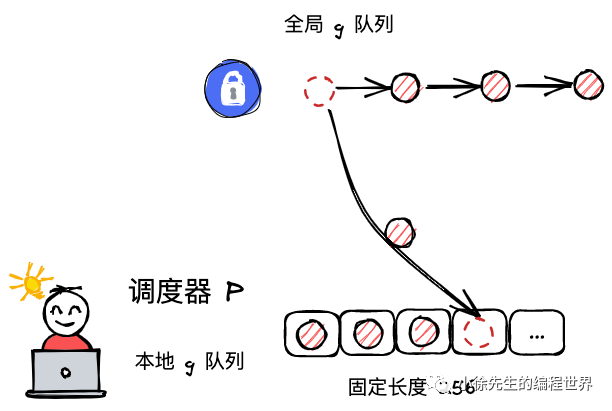

将一个 g 由全局队列转移到 p 本地队列的执行逻辑位于 runqput 方法中：

```
func runqput(_p_ *p, gp *g, next bool) {
    // ...


retry:
    h := atomic.LoadAcq(&_p_.runqhead) // load-acquire, synchronize with consumers
    t := _p_.runqtail
    if t-h < uint32(len(_p_.runq)) {
        _p_.runq[t%uint32(len(_p_.runq))].set(gp)
        atomic.StoreRel(&_p_.runqtail, t+1) // store-release, makes the item available for consumption
        return
    }
    if runqputslow(_p_, gp, h, t) {
        return
    }
    // the queue is not full, now the put above must succeed
    goto retry

```

I 取得 p 本地队列队首的索引，同时对本地队列加锁：

```
h := atomic.LoadAcq(&_p_.runqhead)

```

II 倘若 p 的局部队列未满，则成功转移 g，将 p 的对尾索引 runqtail 值加 1 并解锁队列.

```
  if t-h < uint32(len(_p_.runq)) {
        _p_.runq[t%uint32(len(_p_.runq))].set(gp)
        atomic.StoreRel(&_p_.runqtail, t+1) // store-release, makes the item available for consumption
        return
   }

```

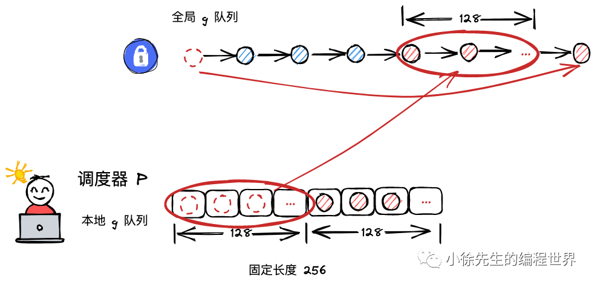

III 倘若发现本地队列 runq 已经满了，则会返回来将本地队列中一半的 g 放回全局队列中，帮助当前 p 缓解执行压力，这部分内容位于 runqputslow 方法中.

```
func runqputslow(_p_ *p, gp *g, h, t uint32) bool {
    var batch [len(_p_.runq)/2 + 1]*g
    // First, grab a batch from local queue.
    n := t - h
    n = n / 2
    
    // ...
    for i := uint32(0); i < n; i++ {
        batch[i] = _p_.runq[(h+i)%uint32(len(_p_.runq))].ptr()
    }
    if !atomic.CasRel(&_p_.runqhead, h, h+n) { // cas-release, commits consume
        return false
    }
    
    batch[n] = gp


    // Link the goroutines.
    for i := uint32(0); i < n; i++ {
        batch[i].schedlink.set(batch[i+1])
    }
    var q gQueue
    q.head.set(batch[0])
    q.tail.set(batch[n])


    // Now put the batch on global queue.
    lock(&sched.lock)
    globrunqputbatch(&q, int32(n+1))
    unlock(&sched.lock)
    return true

```

（2）尝试从 p 本地队列中获取一个可执行的 goroutine，核心逻辑位于 runqget 方法中：

```
    if gp, inheritTime := runqget(_p_); gp != nil {
        return gp, inheritTime, false
    }

```

```
func runqget(_p_ *p) (gp *g, inheritTime bool) {
    if next != 0 && _p_.runnext.cas(next, 0) {
        return next.ptr(), true
    }


    for {
        h := atomic.LoadAcq(&_p_.runqhead) // load-acquire, synchronize with other consumers
        t := _p_.runqtail
        if t == h {
            return nil, false
        }
        gp := _p_.runq[h%uint32(len(_p_.runq))].ptr()
        if atomic.CasRel(&_p_.runqhead, h, h+1) { // cas-release, commits consume
            return gp, false
        }
    }

```

I 倘若当前 p 的 runnext 非空，直接获取即可：

```
    if next != 0 && _p_.runnext.cas(next, 0) {
        return next.ptr(), true
    }

```

II 加锁从 p 的本地队列中获取 g.

需要注意，虽然本地队列是属于 p 独有的，但是由于 work-stealing 机制的存在，其他 p 可能会前来执行窃取动作，因此操作仍需加锁.

但是，由于窃取动作发生的频率不会太高，因此当前 p 取得锁的成功率是很高的，因此可以说 p 的本地队列是接近于无锁化，但没有达到真正意义的无锁.

```
    for {
        h := atomic.LoadAcq(&_p_.runqhead) // load-acquire, synchronize with other consumers
       // ...
   }

```

III 倘若本地队列为空，直接终止并返回；

```
        h := atomic.LoadAcq(&_p_.runqhead) // load-acquire, synchronize with other consumers
        t := _p_.runqtail
        if t == h {
            return nil, false
       }
       

```

IV 倘若本地队列存在 g，则取得队首的 g，解锁并返回.

```
        gp := _p_.runq[h%uint32(len(_p_.runq))].ptr()
        if atomic.CasRel(&_p_.runqhead, h, h+1) { // cas-release, commits consume
            return gp, false
       }
       

```

（3）倘若本地队列没有可执行的 g，会从全局队列中获取：

```
   if sched.runqsize != 0 {
        lock(&sched.lock)
        gp := globrunqget(_p_, 0)
        unlock(&sched.lock)
        if gp != nil {
            return gp, false, false
        }
    }

```

加锁，尝试并从全局队列中取队首的元素.

（4）倘若本地队列和全局队列都没有 g，则会获取准备就绪的网络协程：

```
    if netpollinited() && atomic.Load(&netpollWaiters) > 0 && atomic.Load64(&sched.lastpoll) != 0 {
        if list := netpoll(0); !list.empty() { // non-blocking
            gp := list.pop()
            injectglist(&list)
            casgstatus(gp, _Gwaiting, _Grunnable)
            return gp, false, false
        }
  }
  

```

需要注意的是，刚获取网络协程时，g 的状态是处于 waiting 的，因此需要先更新为 runnable 状态.

（5）work-stealing: 从其他 p 中偷取 g.

```
func stealWork(now int64) (gp *g, inheritTime bool, rnow, pollUntil int64, newWork bool) {
    pp := getg().m.p.ptr()


    ranTimer := false


    const stealTries = 4
    for i := 0; i < stealTries; i++ {
        stealTimersOrRunNextG := i == stealTries-1


        for enum := stealOrder.start(fastrand()); !enum.done(); enum.next() {
            // ...
        }
    }


    return nil, false, now, pollUntil, ranTime

```

偷取操作至多会遍历全局的 p 队列 4 次，过程中只要找到可窃取的 p 则会立即返回.

为保证窃取行为的公平性，遍历的起点是随机的. 窃取动作的核心逻辑位于 runqgrab 方法当中：

```
func runqgrab(_p_ *p, batch *[256]guintptr, batchHead uint32, stealRunNextG bool) uint32 {
    for {
        h := atomic.LoadAcq(&_p_.runqhead) // load-acquire, synchronize with other consumers
        t := atomic.LoadAcq(&_p_.runqtail) // load-acquire, synchronize with the producer
        n := t - h
        n = n - n/2
        if n == 0 {
            if stealRunNextG {
                // Try to steal from _p_.runnext.
                if next := _p_.runnext; next != 0 {
                    if _p_.status == _Prunning {
                        
                        if GOOS != "windows" && GOOS != "openbsd" && GOOS != "netbsd" {
                            usleep(3)
                        } else {
                            osyield()
                        }
                    }
                    if !_p_.runnext.cas(next, 0) {
                        continue
                    }
                    batch[batchHead%uint32(len(batch))] = next
                    return 1
                }
            }
            return 0
        }
        if n > uint32(len(_p_.runq)/2) { // read inconsistent h and t
            continue
        }
        for i := uint32(0); i < n; i++ {
            g := _p_.runq[(h+i)%uint32(len(_p_.runq))]
            batch[(batchHead+i)%uint32(len(batch))] = g
        }
        if atomic.CasRel(&_p_.runqhead, h, h+n) { // cas-release, commits consume
            return n
        }
    }
}

```

I 每次对一个 p 尝试窃取前，会对其局部队列加锁；

```
        h := atomic.LoadAcq(&_p_.runqhead) // load-acquire, synchronize with other consumers
        t := atomic.LoadAcq(&_p_.runqtail) // load-acquire, synchronize with the producer

```

II 尝试偷取其现有的一半 g，并且返回实际偷取的数量.

```
        n := t - h
        n = n - n/2
        
        // ...
        
        for i := uint32(0); i < n; i++ {
            g := _p_.runq[(h+i)%uint32(len(_p_.runq))]
            batch[(batchHead+i)%uint32(len(batch))] = g
        }
        if atomic.CasRel(&_p_.runqhead, h, h+n) { // cas-release, commits consume
            return n
        }
        

```

4.6 execute
-----------

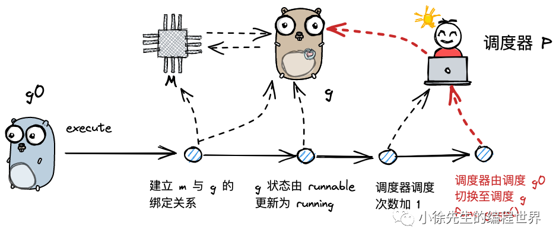

当 g0 为 m 寻找到可执行的 g 之后，接下来就开始执行 g. 这部分内容位于 runtime/proc.go 的 execute 方法中：

```
func execute(gp *g, inheritTime bool) {
    _g_ := getg()


    _g_.m.curg = gp
    gp.m = _g_.m
    casgstatus(gp, _Grunnable, _Grunning)
    gp.waitsince = 0
    gp.preempt = false
    gp.stackguard0 = gp.stack.lo + _StackGuard
    if !inheritTime {
        _g_.m.p.ptr().schedtick++
    }


    gogo(&gp.sched)

```

（1）更新 g 的状态信息，建立 g 与 m 之间的绑定关系；

（2）更新 p 的总调度次数；

（3）调用 gogo 方法，执行 goroutine 中的任务.

4.7 gosched_m
-------------

g 执行主动让渡时，会调用 mcall 方法将执行权归还给 g0，并由 g0 调用 gosched_m 方法，位于 runtime/proc.go 文件中：

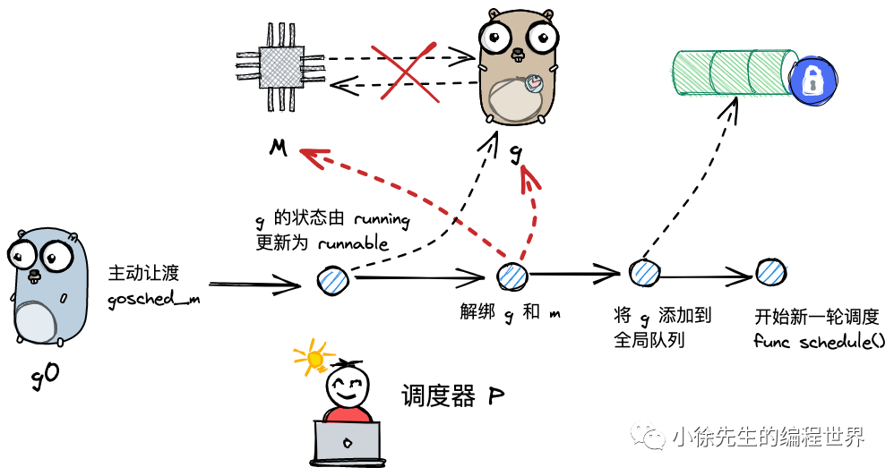

```
func Gosched() {
    // ...
    mcall(gosched_m)
}

```

```
func gosched_m(gp *g) {
    goschedImpl(gp)
}


func goschedImpl(gp *g) {
    status := readgstatus(gp)
    if status&^_Gscan != _Grunning {
        dumpgstatus(gp)
        throw("bad g status")
    }
    casgstatus(gp, _Grunning, _Grunnable)
    dropg()
    lock(&sched.lock)
    globrunqput(gp)
    unlock(&sched.lock)


    schedule()

```

（1）将当前 g 的状态由执行中切换为待执行 _Grunnable：

```
casgstatus(gp, _Grunning, _Grunnable)

```

（2）调用 dropg() 方法，将当前的 m 和 g 解绑；

```
func dropg() {
    _g_ := getg()


    setMNoWB(&_g_.m.curg.m, nil)
    setGNoWB(&_g_.m.curg, nil)
}

```

（3）将 g 添加到全局队列当中：

```
    lock(&sched.lock)
    globrunqput(gp)
    unlock(&sched.lock

```

（4）开启新一轮的调度：

```
    schedule()

```

4.8 park_m 与 ready
------------------

g 需要被动调度时，会调用 mcall 方法切换至 g0，并调用 park_m 方法将 g 置为阻塞态，执行流程位于 runtime/proc.go 的 gopark 方法当中：


```
func gopark(unlockf func(*g, unsafe.Pointer) bool, lock unsafe.Pointer, reason waitReason, traceEv byte, traceskip int) {
    // ...
    mcall(park_m)
}

```

```
func park_m(gp *g) {
    _g_ := getg()


    casgstatus(gp, _Grunning, _Gwaiting)
    dropg()


    // ...
    schedule()

```

（1）将当前 g 的状态由 running 改为 waiting；

（2）将 g 与 m 解绑；

（3）执行新一轮的调度 schedule.

当因被动调度陷入阻塞态的 g 需要被唤醒时，会由其他协程执行 goready 方法将 g 重新置为可执行的状态，方法位于 runtime/proc.go .

被动调度如果需要唤醒，则会其他 g 负责将 g 的状态由 waiting 改为 runnable，然后会将其添加到唤醒者的 p 的本地队列中：

```
func goready(gp *g, traceskip int) {
    systemstack(func() {
        ready(gp, traceskip, true)
    })
}

```

```
func ready(gp *g, traceskip int, next bool) {
    // ...
    _g_ := getg()
    // ...
    casgstatus(gp, _Gwaiting, _Grunnable)
    runqput(_g_.m.p.ptr(), gp, next)
    // ...
}

```

（1）先将 g 的状态从阻塞态改为可执行的状态；

（2）调用 runqput 将当前 g 添加到唤醒者 p 的本地队列中，如果队列满了，会连带 g 一起将一半的元素转移到全局队列.

4.9 goexit0
-----------

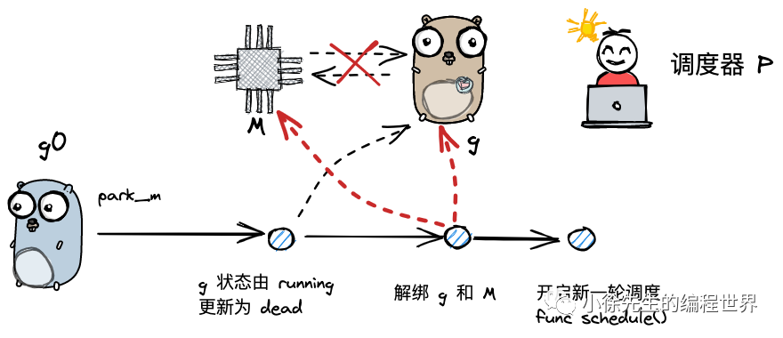

当 g 执行完成时，会先执行 mcall 方法切换至 g0，然后调用 goexit0 方法，内容为 runtime/proc.go：

```
// Finishes execution of the current goroutine.
func goexit1() {
    // ...
    mcall(goexit0)
}

```

```
func goexit0(gp *g) {
    _g_ := getg()
    _p_ := _g_.m.p.ptr()


    casgstatus(gp, _Grunning, _Gdead)
    // ...
    gp.m = nil
    // ...


    dropg()


    // ...
    schedule()

```

（1）将 g 状态置为 dead；

（2）解绑 g 和 m；

（3）开启新一轮的调度.

4.10 retake
-----------

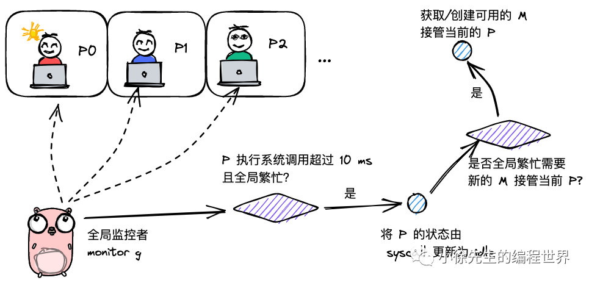

与 4.7-4.9 小节的区别在于，抢占调度的执行者不是 g0，而是一个全局的 monitor g，代码位于 runtime/proc.go 的 retake 方法中：

```
func retake(now int64) uint32 {
    n := 0
    
    lock(&allpLock)
    for i := 0; i < len(allp); i++ {
        _p_ := allp[i]
        if _p_ == nil {
            // This can happen if procresize has grown
            // allp but not yet created new Ps.
            continue
        }
        pd := &_p_.sysmontick
        // ...
        if s == _Psyscall {            
            // ...
            if runqempty(_p_) && atomic.Load(&sched.nmspinning)+atomic.Load(&sched.npidle) > 0 && pd.syscallwhen+10*1000*1000 > now {
                continue
            }
            unlock(&allpLock)
            if atomic.Cas(&_p_.status, s, _Pidle) {
                n++
                _p_.syscalltick++
                handoffp(_p_)
            }
            incidlelocked(1)
            lock(&allpLock)
        }
    }
    unlock(&allpLock)
    return uint32(n)
}

```

（1）加锁后，遍历全局的 p 队列，寻找需要被抢占的目标：

```
    lock(&allpLock)
    for i := 0; i < len(allp); i++ {
        _p_ := allp[i]
        // ...
    }
    unlock(&allpLock)

```

（2）倘若某个 p 同时满足下述条件，则会进行抢占调度：

I 执行系统调用超过 10 ms；

II p 本地队列有等待执行的 g；

III 或者当前没有空闲的 p 和 m.

```
        if s == _Psyscall {            
            // ...
            if runqempty(_p_) && atomic.Load(&sched.nmspinning)+atomic.Load(&sched.npidle) > 0 && pd.syscallwhen+10*1000*1000 > now {
                continue
            }
            // ... 抢占调度
            lock(&allpLock)
        }

```

（3）抢占调度的步骤是，先将当前 p 的状态更新为 idle，然后步入 handoffp 方法中，判断是否需要为 p 寻找接管的 m（因为其原本绑定的 m 正在执行系统调用）：

```
            if atomic.Cas(&_p_.status, s, _Pidle) {
                n++
                _p_.syscalltick++
                handoffp(_p_)
            }

```

（4）当以下四个条件满足其一时，则需要为 p 获取新的 m：

I 当前 p 本地队列还有待执行的 g；

II 全局繁忙（没有空闲的 p 和 m，全局 g 队列为空）

III 需要处理网络 socket 读写请求

```
func handoffp(_p_ *p) {
    if !runqempty(_p_) || sched.runqsize != 0 {
        startm(_p_, false)
        return
    }


    if atomic.Load(&sched.nmspinning)+atomic.Load(&sched.npidle) == 0 && atomic.Cas(&sched.nmspinning, 0, 1) {
        startm(_p_, true)
        return
    }
    
    lock(&sched.lock)
    // ...
    if sched.runqsize != 0 {
        unlock(&sched.lock)
        startm(_p_, false)
        return
    }
    // If this is the last running P and nobody is polling network,
    // need to wakeup another M to poll network.
    if sched.npidle == uint32(gomaxprocs-1) && atomic.Load64(&sched.lastpoll) != 0 {
        unlock(&sched.lock)
        startm(_p_, false)
        return
    }


    // ...

```

（5）获取 m 时，会先尝试获取已有的空闲的 m，若不存在，则会创建一个新的 m.

```
func startm(_p_ *p, spinning bool) {
    
    mp := acquirem()
    lock(&sched.lock)
    // ...
    
    nmp := mget()
    if nmp == nil {
        id := mReserveID()
        unlock(&sched.lock)


        var fn func()
        // ...
        newm(fn, _p_, id)
        // ...
        return
    }
    unlock(&sched.lock)
    // ...
}

```

4.11 reentersyscall 和 exitsyscall
---------------------------------

本小节同样与 g 的系统调用有关，但是视角切换回发生系统调用前，与 g 绑定的原 m 当中.

在 m 需要执行系统调用前，会先执行位于 runtime/proc.go 的 reentersyscall 的方法：

```
func reentersyscall(pc, sp uintptr) {
    _g_ := getg()


    // ...
    save(pc, sp)
    _g_.syscallsp = sp
    _g_.syscallpc = pc
    casgstatus(_g_, _Grunning, _Gsyscall)
    // ...


    pp := _g_.m.p.ptr()
    pp.m = 0
    _g_.m.oldp.set(pp)
    _g_.m.p = 0
    atomic.Store(&pp.status, _Psyscall)
    // ...

```

（1）此时执行权同样位于 m 的 g0 手中；

（2）保存当前 g 的执行环境；

```
    save(pc, sp)
    _g_.syscallsp = sp
    _g_.syscallpc = p

```

（3）将 g 和 p 的状态更新为 syscall；

```
    casgstatus(_g_, _Grunning, _Gsyscall)
    atomic.Store(&pp.status, _Psyscall)

```

（4）解除 p 和 当前 m 之间的绑定，因为 m 即将进入系统调用而导致短暂不可用；

```
    pp := _g_.m.p.ptr()
    pp.m = 0
    _g_.m.p = 0

```

（5）将 p 添加到 当前 m 的 oldP 容器当中，后续 m 恢复后，会优先寻找旧的 p 重新建立绑定关系.

```
_g_.m.oldp.set(pp)

```

当 m 完成了内核态的系统调用之后，此时会步入位于 runtime/proc.go 的 exitsyscall 函数中，尝试寻找 p 重新开始运作：

```
func exitsyscall() {
    _g_ := getg()
    
    // ...
    if exitsyscallfast(oldp) {
        // ...
        casgstatus(_g_, _Gsyscall, _Grunning)
        // ...
        return
    }


    // ...
    mcall(exitsyscall0)
    // ...
}

```

（1）方法执行之初，此时的执行权是普通 g. 倘若此前设置的 oldp 仍然可用，则重新和 oldP 绑定，将当前 g 重新置为 running 状态，然后开始执行后续的用户函数；

```
    _g_ := getg()
    
    // ...
    if exitsyscallfast(oldp) {
        // ...
        casgstatus(_g_, _Gsyscall, _Grunning)
        // ...
        return
    }

```

（2）old 绑定失败，则调用 mcall 方法切换到 m 的 g0，并执行 exitsyscall0 方法：

```
    mcall(exitsyscall0)

```

```
func exitsyscall0(gp *g) {
    casgstatus(gp, _Gsyscall, _Grunnable)
    dropg()
    lock(&sched.lock)
    var _p_ *p
    if schedEnabled(gp) {
        _p_, _ = pidleget(0)
    }
    
    var locked bool
    if _p_ == nil {
        globrunqput(gp)
    } 
    
    unlock(&sched.lock)
    if _p_ != nil {
        acquirep(_p_)
        execute(gp, false) // Never returns.
    }
    
    // ...
    
    stopm()
    schedule() // Never returns.
}

```

（3）将 g 由系统调用状态切换为可运行态，并解绑 g 和 m 的关系：

```
    casgstatus(gp, _Gsyscall, _Grunnable)
    dropg()

```

（4）从全局 p 队列获取可用的 p，如果获取到了，则执行 g：

```
    lock(&sched.lock)
    var _p_ *p
    if schedEnabled(gp) {
        _p_, _ = pidleget(0)
    }
    unlock(&sched.lock)
    if _p_ != nil {
        acquirep(_p_)
        execute(gp, false) // Never returns.
    }

```

（5）如若无 p 可用，则将 g 添加到全局队列，当前 m 陷入沉睡. 直到被唤醒后才会继续发起调度.

```
    if _p_ == nil {
        globrunqput(gp)
    } 
    stopm()
    schedule() // Never returns.

```