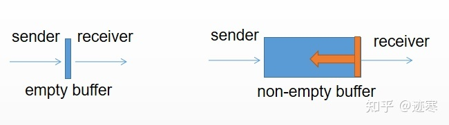

# 基础知识

- 空 struct{} 的用途：set，channel通信，仅有方法的结构体


### 1、new 和 make 的区别？

Go 语言中的 new 和 make 是两个用于分配内存的内置函数，它们的区别主要有以下几点：

- new 只用于分配内存，返回一个指向地址的**指针**。它会分配一片内存，初始化为 零值且返回类型 * T 的内存地址，它相当于 &T{}
- make 只能用于 slice、map、chan 这三种内置的数据结构，它返回一个初始化后的非零值，类型为 T。
- new 分配的内存不需要初始化，因为它已经被清零了。
- make 分配的内存需要初始化，因为它需要设置一些元数据和底层结构。

**简单来说，new 是用来创建值类型的指针，而 make 是用来创建引用类型的实例。**


### 2、2 个 interface 可以比较吗 ？

Go 语言中，interface 的内部实现包含了 2 个字段，类型 `T` 和 值 `V`，interface 可以使用 `==` 或 `!=` 比较。2 个 interface **相等**有以下 2 种情况

1.  **两个 interface 均等于 nil（此时 V 和 T 都处于 unset 状态）**
2.  **类型 T 相同，且对应的值 V 相等。**

看下面的例子：

```go
type Stu struct {
     Name string
}

type StuInt interface{}

func main() {
     var stu1, stu2 StuInt = &Stu{"Tom"}, &Stu{"Tom"}
     var stu3, stu4 StuInt = Stu{"Tom"}, Stu{"Tom"}
     fmt.Println(stu1 == stu2) // false
     fmt.Println(stu3 == stu4) // true
}
```

`stu1` 和 `stu2` 对应的类型是 `*Stu`，值是 Stu 结构体的地址，**两个地址不同，因此结果为 false。**  
`stu3` 和 `stu4` 对应的类型是 `Stu`，**值是 Stu 结构体**，且各字段相等，因此结果为 true。


### 2 个 nil 可能不相等吗？

可能不等。interface 在运行时绑定值，只有值为 nil 接口值才为 nil，但是与指针的 nil 不相等。举个例子：

```
var p *int = nil
var i interface{} = nil
if(p == i){
	fmt.Println("Equal")
}
```

两者并不相同。总结：**两个 nil 只有在类型相同时才相等**。


# Slice相关知识

### 1、Go里面Slice的实现，底层结构

**Go 语言中的切片是一种对数组的抽象**，它提供了一个灵活和高效的操作序列数据的方式。**切片本身是一个结构体，它包含了三个字段：指向底层数组的指针、切片的长度和切片的容量。**

切片的长度表示当前切片中元素的个数，它不能超过切片的容量。**切片的容量表示从切片开始位置到底层数组末尾位置之间元素的个数，它决定了切片能够扩展到多大。**

当需要向切片中添加元素时，可以使用 append 函数，它会根据当前切片的容量来决定是否需要扩容。如果当前容量不足以存放新元素，**那么 append 函数会创建一个新的底层数组，并将原有数据复制到新数组中，然后返回一个指向新数组的新切片**。


### 2、切片是如何进行扩容的？

Go 语言的切片是对数组的抽象，它可以动态地调整长度和容量。切片的扩容是通过内置函数 append 来实现的，当切片的长度超过了容量时，append 会自动分配一个新的底层数组，并将原来的元素复制过去。

- 如果当前容量小于 1024，则判断所需容量是否大于原来容量 2 倍，**如果大于，当前容量加上所需容量**；否则当前容量乘 2。

- 如果当前容量大于 1024，则每次按照 **1.25 倍速度递增容量**，也就是每次加上 cap/4。


### 3、为什么大于1024的时候需要循环增加1/4它的容量？

Go 语言的切片扩容规则是为了平衡内存使用和性能的考虑。**如果每次扩容都翻倍，那么对于大容量的切片，可能会造成内存浪费和复制开销过大。如果每次扩容都增加固定的大小，那么对于小容量的切片，可能会导致频繁的扩容和复制操作。**

因此，Go 语言采用了一个折中的方案：当原切片容量小于 1024 时，新切片容量为原容量的 2 倍；当原切片容量大于等于 1024 时，新切片容量为原容量的 1.25 倍。**这样可以在一定程度上减少内存浪费和复制开销，同时也保证了切片扩容的效率。**


### 4、如何判断 2 个字符串切片（slice) 是相等的？

`reflect.DeepEqual()` ， 但反射非常影响性能。


# Hash table 相关知识

## 1、设计原理


### 1、哈希函数

尽量选择分布均匀的哈希函数，哈希表的增删改查的时间复杂度为 O(1)，如果分布不均匀，则时间复杂度可能会达到 O(n)。


### 2、解决冲突

- 开放寻址法

使用数组来实现，使用线性探测法从索引的位置开始探测数组，找到目标值或者为空就意味着这一次查询操作结束；开放寻址法对性能影响最大的是**装载因子**（$装载因子 = 元素数量 / 数组大小$），装载越高，哈希表的性能就会急剧下降。

- 拉链法

使用哈希函数选择一个桶，将键值对存入该桶对应的链表中。$装载因子 = 元素数量 / 桶数量$，当装载因子较大的时候 ，就会触发哈希扩容，创建更多的桶来存储哈希表中的元素，来避免元素性能严重下降。


# 底层知识

## 1、GMP 模型

1、简单说一下GMP模型

[详细](./golang/Golang GMP 原理.md)


**执行一个系统调用，在GMP里面是怎么样一个流程？**

在GMP模型中，执行一个系统调用（syscall）的流程如下： 1. 当Goroutine遇到系统调用时，它会被阻塞并向操作系统发出系统调用请求。 2. 调度器(main goroutine)会把它从可运行队列中删除。 3. 系统调用会在内核态中执行，直到操作完成。 4. 内核会在操作完成时，将Goroutine重新添加到可运行队列中。 5. 调度器将恢复阻塞的Goroutine，并加载其上下文以便从调用的地方继续执行。 需要注意的是，系统调用处于阻塞状态，期间无法执行其他任务。因此，在一个Goroutine中执行长时间的系统调用可能会导致性能下降。为了避免这种情况，可以使用Goroutine池等技术来使系统调用运行在与应用程序并发的线程中，从而提高性能和效率。


**为什么要有GMP模型，为什么不用原有的线程进程模型**

- Goroutines比线程更轻量：Goroutines比线程更轻量，一个Goroutine的堆栈只需要几KB，而且它们可以在同一个线程中使用调度器来实现真正的并发。

- 垃圾回收： Go语言具有一套优秀的垃圾回收机制，可以自动清除不再使用的内存。 

- 更加高效：使用GMP模型可以避免线程和进程之间的切换开销，从而提高程序的效率。

- 方便的并发编程：Go语言提供了许多编程工具，如Channels和Select，它们使得编写高效的并发程序变得更加简单和容易。

- 可读性和可维护性：使用GMP模型编写的程序更加容易阅读和维护，因为Goroutines之间的交互更加直观和自然，同时也避免了一些常见的并发问题，如死锁等。 

  综上所述，GMP模型可以更好地解决大规模并发和高性能问题，也提供了更方便、高效、可维护的编程手段。


## 2、GC（垃圾回收）工作原理

垃圾回收机制是 Go 一大特 (nan) 色(dian)。Go1.3 采用**标记清除法**， Go1.5 采用**三色标记法**，Go1.8 采用**三色标记法 + 混合写屏障**。

**_标记清除法_**

分为两个阶段：标记和清除

标记阶段：从根对象出发寻找并**标记所有存活的对象。**（可达对象）

清除阶段：遍历堆中的对象，**回收未标记的对象，并加入空闲链表。**

**缺点是需要暂停程序 STW。**


**_三色标记法_**：

将对象标记为白色，灰色或黑色。

**白色：不确定对象（默认色）；黑色：存活对象。灰色：存活对象，子对象待处理。**

标记开始时，先将所有对象加入白色集合（需要 STW）。首先将根对象标记为灰色，然后将一个对象从灰色集合取出，遍历其子对象，放入灰色集合。同时将取出的对象放入黑色集合，直到灰色集合为空。最后的白色集合对象就是需要清理的对象。

这种方法有一个缺陷，如果对象的引用被用户修改了，那么之前的标记就无效了。因此 Go 采用了**写屏障技术**，当对象新增或者更新会将其着色为灰色。

一次完整的 GC 分为四个阶段：

1.  准备标记（需要 STW），开启写屏障。
2.  开始标记
3.  标记结束（STW），关闭写屏障
4.  清理（并发）

基于插入写屏障和删除写屏障在结束时需要 STW 来重新扫描栈，带来性能瓶颈。**混合写屏障**分为以下四步：

1.  GC 开始时，将栈上的全部对象标记为黑色（不需要二次扫描，无需 STW）；
2.  GC 期间，任何栈上创建的新对象均为黑色
3.  被删除引用的对象标记为灰色
4.  被添加引用的对象标记为灰色

总而言之就是**确保黑色对象不能引用白色对象**，这个改进直接使得 GC 时间从 2s 降低到 2us。


## 3、如何知道一个对象是分配在栈上还是堆上？

Go 语言的逃逸分析是编译器的一个阶段，它分析源代码，确定哪些变量应该分配在栈上，哪些变量应该逃逸到堆上。**逃逸分析**的基本规则是，**如果一个函数返回了一个变量的引用，那么这个变量就“逃逸”了——它在函数返回后仍然可以被引用，所以必须在堆上分配（在栈的话，变量会随着函数调用结束而销毁）。**

逃逸到堆上的变量不会随着函数调用结束而被销毁，而是由垃圾回收器管理。这样可以避免内存泄漏，因为垃圾回收器会定期检查并释放不再使用的内存。那么如何判断是否发生了逃逸呢？

`go build -gcflags '-m -m -l' xxx.go`.

关于逃逸的可能情况：变量大小不确定，变量类型不确定，变量分配的内存超过用户栈最大值，暴露给了外部指针。

#### 函数返回局部变量的指针是否安全？

这一点和 C++ 不同，在 Go 里面返回局部变量的指针是安全的。因为 Go 会进行**逃逸分析**，如果发现局部变量的作用域超过该函数则会**把指针分配到堆区**，避免内存泄漏。


# channel相关知识

### 1、无缓冲的 channel 和有缓冲的 channel 的区别？

Go 语言中的 channel 是一种用于在 goroutine 之间传递数据的同步机制。channel 可以分为无缓冲的 channel 和有缓冲的 channel，它们的区别主要在于发送和接收数据时是否会阻塞。

- 无缓冲的 channel 是指容量为0或者没有指定容量的channel，它只会在发送方和接收方都准备好的情况下才能成功通信。即发送的数据如果没有被接收方接收，那么**发送方阻塞；**如果一直接收不到发送方的数据，**接收方阻塞**；
- 有缓存的 channel 是指容量大于0的channel，它可以在没有接收方时暂存一定数量的数据。即发送方在缓冲区满的时候阻塞，接收方不阻塞；接收方在缓冲区为空的时候阻塞，发送方不阻塞。

可以类比生产者与消费者问题。




1、Go里面channel里面有几种类型？（有无缓冲）

有缓存和无缓存channel。

有缓存channel可以通过make进行指定管道的容量。


2、channel的作用，在Go里面有什么使用场景？

在并发场景下，可以通过channel通信从而实现数据共享。


3、往一个关闭的channel里面读数据和写数据会发生什么？

- 往一个关闭的channel里面写数据会导致panic；

- 往一个关闭的channel里面读数据会获得该channel对应的数据类型的零值


4、带缓冲是什么样的情况，不带缓冲是什么样的情况

不带缓冲即channel容量为1，一般用于互斥控制

带缓冲即channel容量大于1，其应用场景例如生产者消费者模型。


5、在一个带缓冲的channel里面读数据，一定为空吗？

不一定，如果cahnnel里面有数据，则会将其数据读出。而如果里面没有数据，那该goroutine就会一直阻塞。


# goroutine


## 什么是协程（Goroutine）

协程是**用户态轻量级线程**，协程的调度完全由用户控制。Goroutine是一种轻量级线程，是Go 语言层面上的协程实现，由Go运行时（runtime）管理。在函数前加上 go 关键字就能创建一个Goroutine 。Goroutine 的初始栈大小为 2KB，当遇到栈空间不足时，栈会**自动伸缩**， 因此可以轻易实现成千上万个 goroutine 同时启动。


**goroutine 和 线程的对比**

- 轻量级：**Go协程的开销比线程小得多。**每个协程只需要4-5KB的内存，而线程需要一部分堆栈和上下文信息。
- 快速：Go协程的切换速度比线程快很多。因为切换协程是在用户态完成的，而线程则需要从内核态切换到用户态，这个过程需要消耗大量的时间。 
- 并发：Go语言内置的并发机制可以轻松创建大量的协程，并且调度器可以多个协程之间高效地切换。  
- 安全：在Go语言中，每个协程都有自己的栈空间，这样可以确保不会发生栈溢出的问题。 
- 通信：Go协程可以通过通道（Channel）进行通信，这种通信机制非常简单、直接，而且可以避免数据竞争和死锁。


**goroutine和线程开销对比**

- **Goroutine的创建和销毁的开销很小**：Goroutine使用的协作式抢占式调度器，只有程序自身发出调度请求时才会进行切换，而线程需要调用系统API，对操作系统进行请求，开销明显更大。
- Goroutine的栈开销比线程小：Goroutine每个协程的初始栈大小仅为2KB，一旦栈大小不够，可以动态进行扩展。
- Goroutine的上下文切换开销比线程小：在Goroutine中，上下文切换只需要保存当前栈帧、程序计数器和寄存器等少量的信息；而在线程中，会涉及到更多的寄存器、内核栈、内存页等上下文信息的保存和恢复。
- **Goroutine的同步开销小**：Goroutine和线程都需要进行同步和互斥操作，例如锁和信号量等，但Go语言中的同步操作更加轻量级，例如使用通道（Channel）进行消息传递。


## 为什么有协程泄露 (Goroutine Leak)？

协程泄露是指 goroutine 创建后，长时间得不到释放，并且还在不断地创建新的 goroutine 协程，最终导致内存耗尽，程序崩溃。

协程泄露的原因通常有以下几种：

- 在 goroutine 内部进行 channel/mutex 等读写操作，但由于逻辑问题，在某些情况下一直阻塞。
- 在 goroutine 内部的业务逻辑进入**死循环**，资源永远不释放。
- 缺少接收器，**导致发送阻塞**。
- 缺少发送器，**导致接收阻塞**。
- 未关闭 channel，导致 range 循环无法退出。

为了避免协程泄露，我们需要注意以下几点：

- 使用 context 包来控制 goroutine 的生命周期。
- 使用 defer 关键字来确保 channel/mutex 等资源的释放。
- 使用 select 语句来处理多个 channel 的读写操作，并设置超时或取消机制。
- 使用第三方工具包如 uber-go/goleak 来检测和定位协程泄露的源头。


## mutex 有几种模式？

mutex 有两种模式：**normal** 和 **starvation**

- 正常模式

所有 goroutine 按照 FIFO 的顺序进行锁获取（在没有新goroutine到来的情况下，按照FIFO顺序），但是一个被唤醒的等待者有时候并不能获取mutex，它还需要和新到来的goroutine们竞争mutex的使用权。**新来的goroutine有先天的优势**，它们正在CPU中运行，可能它们的数量还不少，所以，在高并发情况下，被唤醒的waiter可能比较悲剧地获取不到锁。**公平性：否。**

- 饥饿模式

如果一个goroutine等待mutex释放的时间超过1ms，它就会将mutex切换到饥饿模式。所有尝试获取锁的 goroutine 进行等待排队，**新请求锁的 goroutine 不会进行锁获取** (禁用自旋)，而是加入队列尾部等待获取锁。mutex的所有权直接从解锁的goroutine递交到等待队列中排在最前方的goroutine。**公平性：是。**

**例子**

可以把mutex的正常模式和饥饿模式比作排队买票。在正常模式下，每个人都按照先来后到的顺序排队，但是有时候会有插队的人，这就导致了一些人可能需要等待很长时间才能买到票。

而在饥饿模式下，售票员会保证每个人都按照顺序买到票，不允许任何人插队。这样可以保证每个人都能公平地买到票。