# MySQL 存储


## MySQL 一行记录是怎么存储的？

> MySQL 的 NULL 值是怎么存放的？

MySQL 的 Compact 行格式中会用「**NULL值列表**」来标记值为 NULL 的列，NULL 值并不会存储在行格式中的真实数据部分。

NULL值列表会占用 1 字节空间，当表中所有字段都定义成 NOT NULL，行格式中就不会有 NULL值列表，这样可节省 1 字节的空间。

> MySQL 怎么知道 varchar(n) 实际占用数据的大小？

MySQL 的 Compact 行格式中会用「**变长字段长度列表**」存储变长字段实际占用的数据大小。

> varchar(n) 中 n 最大取值为多少？

一行记录最大能存储 65535 字节的数据，但是这个是包含「变长字段字节数列表所占用的字节数」和「NULL值列表所占用的字节数」。所以， 我们在算 varchar(n) 中 n 最大值时，需要减去这两个列表所占用的字节数。

如果一张表只有一个 varchar(n) 字段，且允许为 NULL，字符集为 ascii。varchar(n) 中 n 最大取值为 65532。

计算公式：65535 - 变长字段字节数列表所占用的字节数 - NULL值列表所占用的字节数 = 65535 - 2 - 1 = 65532。

如果有多个字段的话，要保证所有字段的长度 + 变长字段字节数列表所占用的字节数 + NULL值列表所占用的字节数 <= 65535。

> 行溢出后，MySQL 是怎么处理的？

如果一个数据页存不了一条记录，InnoDB 存储引擎会自动将溢出的数据存放到「溢出页」中。

Compact 行格式针对行溢出的处理是这样的：当发生行溢出时，在记录的真实数据处只会保存该列的一部分数据，而把剩余的数据放在「溢出页」中，然后真实数据处用 20 字节存储指向溢出页的地址，从而可以找到剩余数据所在的页。

Compressed 和 Dynamic 这两种格式采用完全的行溢出方式，记录的真实数据处不会存储该列的一部分数据，只存储 20 个字节的指针来指向溢出页。而实际的数据都存储在溢出页中。


# 事务


## 事务隔离级别是怎么实现的？

要么全部执行成功 ，要么全部失败，不允许出现中间状态的数据。数据库中的「**事务（Transaction）**」就能达到这样的效果。

我们在转账操作前先开启事务，等所有数据库操作执行完成后，才提交事务，对于已经提交的事务来说，该事务对数据库所做的修改将永久生效，如果中途发生发生中断或错误，那么该事务期间对数据库所做的修改将会被回滚到没执行该事务之前的状态。

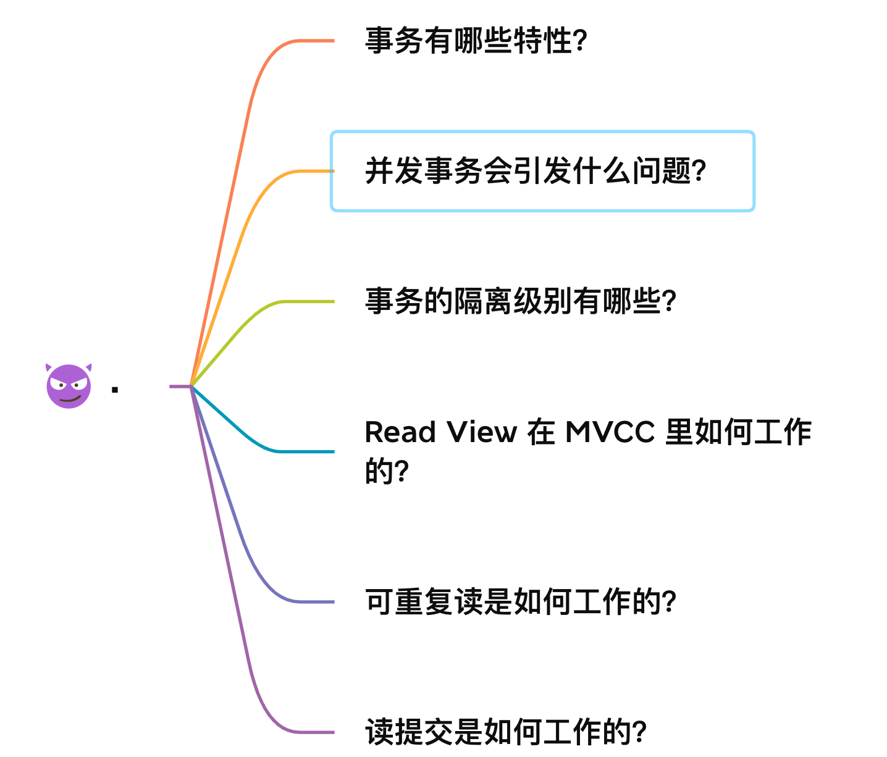


### 事务有哪些特性？

事务是由 MySQL 的引擎来实现的，我们常见的 InnoDB 引擎它是支持事务的。事务看起来感觉简单，但是要实现事务必须要遵守 4 个特性，分别如下：

- **原子性（Atomicity）**：**一个事务中的所有操作，要么全部完成，要么全部不完成，不会结束在中间某个环节，而且事务在执行过程中发生错误，会被回滚到事务开始前的状态**，就像这个事务从来没有执行过一样，就好比买一件商品，购买成功时，则给商家付了钱，商品到手；购买失败时，则商品在商家手中，消费者的钱也没花出去。
- **一致性（Consistency）**：**是指事务操作前和操作后，数据满足完整性约束，数据库保持一致性状态。**比如，用户 A 和用户 B 在银行分别有 800 元和 600 元，总共 1400 元，用户 A 给用户 B 转账 200 元，分为两个步骤，从 A 的账户扣除 200 元和对 B 的账户增加 200 元。一致性就是要求上述步骤操作后，最后的结果是用户 A 还有 600 元，用户 B 有 800 元，总共 1400 元，而不会出现用户 A 扣除了 200 元，但用户 B 未增加的情况（该情况，用户 A 和 B 均为 600 元，总共 1200 元）。
- **隔离性（Isolation）**：**数据库允许多个并发事务同时对其数据进行读写和修改的能力，隔离性可以防止多个事务并发执行时由于交叉执行而导致数据的不一致**，因为多个事务同时使用相同的数据时，不会相互干扰，每个事务都有一个完整的数据空间，对其他并发事务是隔离的。也就是说，消费者购买商品这个事务，是不影响其他消费者购买的。
- **持久性（Durability）**：事务处理结束后，对数据的修改就是永久的，即便系统故障也不会丢失。

InnoDB 引擎通过什么技术来保证事务的这四个特性的呢？

- 持久性是通过 redo log （重做日志）来保证的；
- 原子性是通过 undo log（回滚日志） 来保证的；
- 隔离性是通过 MVCC（多版本并发控制） 或锁机制来保证的；
- 一致性则是通过持久性+原子性+隔离性来保证；


### 并行事务会引发什么问题？

MySQL 服务端是允许多个客户端连接的，这意味着 MySQL 会出现同时处理多个事务的情况。

那么**在同时处理多个事务的时候，就可能出现脏读（dirty read）、不可重复读（non-repeatable read）、幻读（phantom read）的问题**。


#### 脏读（读到事务回滚前的脏数据）

**如果一个事务「读到」了另一个「未提交事务修改过的数据」，就意味着发生了「脏读」现象。**

举个栗子。

假设有 A 和 B 这两个事务同时在处理，事务 A 先开始从数据库中读取小林的余额数据，然后再执行更新操作，如果此时事务 A 还没有提交事务，而此时正好事务 B 也从数据库中读取小林的余额数据，那么事务 B 读取到的余额数据是刚才事务 A 更新后的数据，即使没有提交事务。

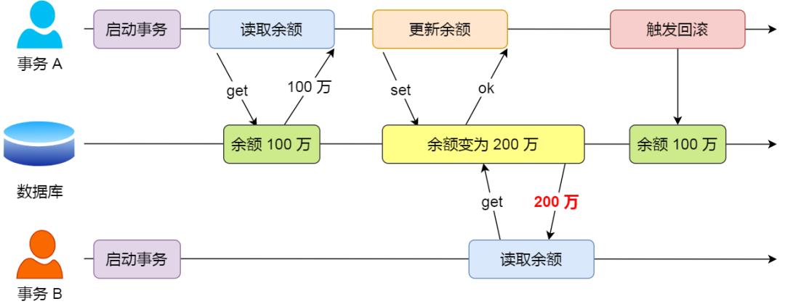

因为事务 A 是还没提交事务的，也就是它随时可能发生回滚操作，**如果在上面这种情况事务 A 发生了回滚，那么事务 B 刚才得到的数据就是过期的数据，这种现象就被称为脏读。**


#### 不可重复读（非幂等，前后读的数据不一样）

**在一个事务内多次读取同一个数据，如果出现前后两次读到的数据不一样的情况，就意味着发生了「不可重复读」现象。**

举个栗子。

假设有 A 和 B 这两个事务同时在处理，事务 A 先开始从数据库中读取小林的余额数据，然后继续执行代码逻辑处理，**在这过程中如果事务 B 更新了这条数据，并提交了事务，那么当事务 A 再次读取该数据时，就会发现前后两次读到的数据是不一致的，这种现象就被称为不可重复读。**

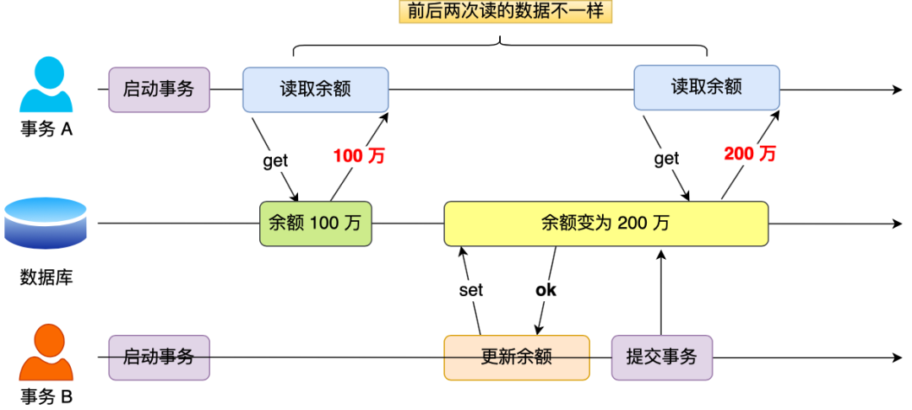


#### 幻读（非幂等，记录数量不同）

**在一个事务内多次查询某个符合查询条件的「记录数量」，如果出现前后两次查询到的记录数量不一样的情况，就意味着发生了「幻读」现象。**

举个栗子。

假设有 A 和 B 这两个事务同时在处理，事务 A 先开始从数据库查询账户余额大于 100 万的记录，发现共有 5 条，然后事务 B 也按相同的搜索条件也是查询出了 5 条记录。

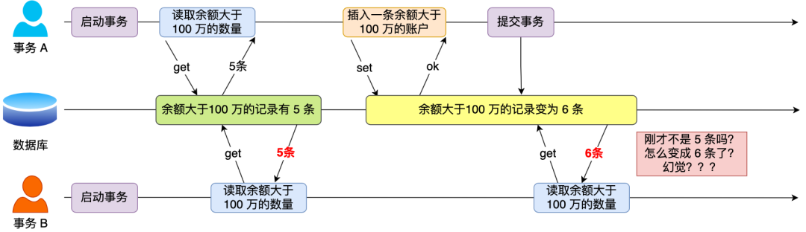

接下来，事务 A 插入了一条余额超过 100 万的账号，并提交了事务，此时数据库超过 100 万余额的账号个数就变为 6。

然后事务 B 再次查询账户余额大于 100 万的记录，此时查询到的记录数量有 6 条，**发现和前一次读到的记录数量不一样了，就感觉发生了幻觉一样，这种现象就被称为幻读。**


### 事务的隔离级别有哪些？

前面我们提到，当多个事务并发执行时可能会遇到「脏读、不可重复读、幻读」的现象，这些现象会对事务的一致性产生不同程序的影响。

- 脏读：读到其他事务未提交的数据；
- 不可重复读：前后读取的数据不一致；
- 幻读：前后读取的记录数量不一致。

这三个现象的严重性排序如下：


SQL 标准提出了四种隔离级别来规避这些现象，隔离级别越高，性能效率就越低，这四个隔离级别如下：

- **读未提交（\*read uncommitted\*）**，指一个事务还没提交时，它做的变更就能被其他事务看到；
- **读提交（\*read committed\*）**，指一个事务提交之后，它**做的变更**才能被其他事务看到；<u>（其他已提交的事务会影响本事务）</u>
- **可重复读（\*repeatable read\*）**，指一个事务执行过程中看到的数据，一直跟这个事务启动时看到的数据是一致的（记录量就不一定了），**MySQL InnoDB 引擎的默认隔离级别**；<u>（其他事务不会影响到本事务）</u>
- **串行化（\*serializable\* ）**；**会对记录加上读写锁**，在多个事务对这条记录进行读写操作时，如果发生了读写冲突的时候，后访问的事务必须等前一个事务执行完成，才能继续执行；

按隔离水平高低排序如下：


针对不同的隔离级别，并发事务时可能发生的现象也会不同。

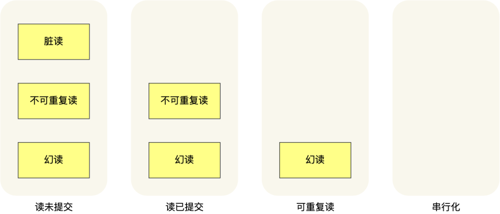

也就是说：

- 在「读未提交」隔离级别下，可能发生脏读、不可重复读和幻读现象；
- 在「读提交」隔离级别下，可能发生不可重复读和幻读现象，但是不可能发生脏读现象；
- 在「可重复读」隔离级别下，可能发生幻读现象，但是不可能脏读和不可重复读现象；
- 在「串行化」隔离级别下，脏读、不可重复读和幻读现象都不可能会发生。

所以，要解决脏读现象，就要升级到「读提交」以上的隔离级别；要解决不可重复读现象，就要升级到「可重复读」的隔离级别，要解决幻读现象不建议将隔离级别升级到「串行化」。


**为什么可重复读会出现幻读？**

在MySQL中，可重复读(repeatable read)是默认的事务隔离级别，它使用多版本并发控制(MVCC)技术来实现快照读(snapshot read)，即每次查询都是某个时间点的数据快照，而不是最新的数据。这样可以避免不可重复读的问题，因为每次查询都看到相同的数据版本。但是，可重复读并不能完全避免幻读的问题，**因为它只能保证快照读的一致性，而不能保证当前读(current read)的一致性。**当前读是指每次读取都是最新的数据，它会给数据加上排他锁或共享锁，以防止其他事务修改。当前读的操作包括select…lock in share mode，select…for update，update，delete，insert等。

因此，在可重复读隔离级别下，如果一个事务使用当前读操作来修改数据，而另一个事务同时使用快照读操作来查询数据，就可能出现幻读的情况。例如：

- 事务A使用快照读查询表t中id大于10的所有行，返回5行结果。
- 事务B使用当前读插入一行数据到表t中，id为11。
- 事务B提交。
- 事务A再次使用快照读查询表t中id大于10的所有行，返回6行结果。

这样，事务A就出现了幻读的问题，因为它两次查询返回了不同的结果集。要想完全避免幻读的问题，就需要使用串行化(serializable)隔离级别，它会给所有的查询操作加上锁，从而防止其他事务修改数据。但是这样会降低并发性能和扩展性。因此，在实际应用中，需要根据业务需求和系统特点来选择合适的隔离级别。


**MySQL InnoDB 引擎的默认隔离级别虽然是「可重复读」，但是它很大程度上避免幻读现象**，解决的方案有两种：

- 针对**快照读**（普通 select 语句），是**通过 MVCC 方式解决了幻读**，因为可重复读隔离级别下，事务执行过程中看到的数据，一直跟这个事务启动时看到的数据是一致的，即使中途有其他事务插入了一条数据，是查询不出来这条数据的，所以就很好了避免幻读问题。
- 针对**当前读**（select ... for update 等语句），是**通过 next-key lock（记录锁+间隙锁）方式解决了幻读**，因为当执行 select ... for update 语句的时候，会加上 next-key lock，如果有其他事务在 next-key lock 锁范围内插入了一条记录，那么这个插入语句就会被阻塞，无法成功插入，所以就很好了避免幻读问题。


**MySQL 中的快照读和当前读的区别**

- **当前读(current read)，也称为锁定读(locking read)，是指每次读取的都是最新的数据**，但是在读取的时候不允许写入，也不允许其他事务读取。当前读会给数据加上排他锁或共享锁，以保证数据的一致性和隔离性。当前读的操作包括select…lock in share mode，select…for update，update，delete，insert等。
- **快照读(snapshot read)，也称为非锁定读(nonlocking read)，是指每次读取的都是某个时间点的数据快照，而不是最新的数据。**快照读不会给数据加上任何锁，因此在读取的时候不会阻塞写入，也不会被其他事务阻塞。快照读使用多版本并发控制(MVCC)技术来实现，它会根据事务的隔离级别和开始时间来确定数据快照的内容。快照读的操作包括普通的select语句。

快照读和当前读的区别主要体现在以下几个方面：

- 快照读不会加锁，当前读会加锁。
- 快照读不会阻塞写入，当前读会阻塞写入。
- 快照读可能看到过期或不存在的数据，当前读总是看到最新的数据。
- 快照读依赖于事务隔离级别和开始时间，当前读不依赖于这些因素。


这四种隔离级别具体是如何实现的呢？

- 对于「读未提交」隔离级别的事务来说，因为可以读到未提交事务修改的数据，所以直接读取最新的数据就好了；

- 对于「串行化」隔离级别的事务来说，通过加读写锁的方式来避免并行访问；

- 对于「读提交」和「可重复读」隔离级别的事务来说，它们是通过 **Read View \**来实现的，它们的区别在于创建 Read View 的时机不同，大家可以把 Read View 理解成一个数据快照，就像相机拍照那样，定格某一时刻的风景。\**「读提交」隔离级别是在「每个语句执行前」都会重新生成一个 Read View，而「可重复读」隔离级别是「启动事务时」生成一个 Read View，然后整个事务期间都在用这个 Read View**。

  

这四种隔离级别具体是如何实现的呢？

- 对于「读未提交」隔离级别的事务来说，因为可以读到未提交事务修改的数据，所以直接读取最新的数据就好了；
- 对于「串行化」隔离级别的事务来说，通过加读写锁的方式来避免并行访问；
- 对于「读提交」和「可重复读」隔离级别的事务来说，它们是通过 **Read View \**来实现的，它们的区别在于创建 Read View 的时机不同，大家可以把 Read View 理解成一个数据快照，就像相机拍照那样，定格某一时刻的风景。\**「读提交」隔离级别是在「每个语句执行前」都会重新生成一个 Read View，而「可重复读」隔离级别是「启动事务时」生成一个 Read View，然后整个事务期间都在用这个 Read View**。


### Read View 在 MVCC 里如何工作的？

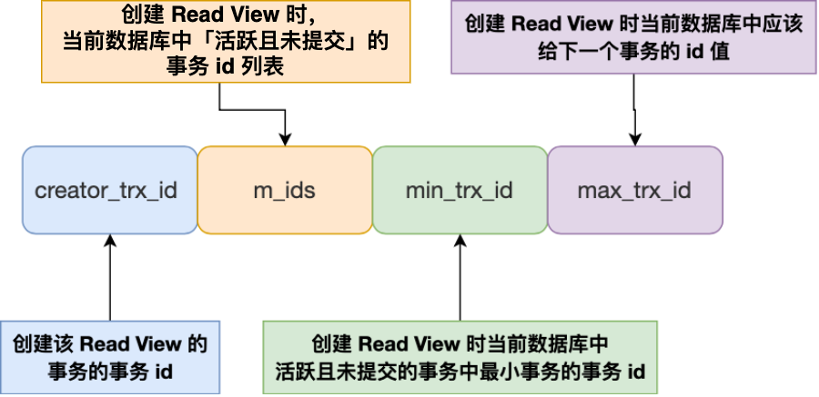

Read View 有四个重要的字段：

- m_ids ：指的是在创建 Read View 时，当前数据库中「活跃事务」的**事务 id 列表**，注意是一个列表，**“活跃事务”指的就是，启动了但还没提交的事务**。
- min_trx_id ：指的是在创建 Read View 时，当前数据库中「活跃事务」中事务 **id 最小的事务**，也就是 m_ids 的最小值。
- max_trx_id ：这个并不是 m_ids 的最大值，而是**创建 Read View 时当前数据库中应该给下一个事务的 id 值**，也就是全局事务中最大的事务 id 值 + 1；
- creator_trx_id ：指的是**创建该 Read View 的事务的事务 id**。


知道了 Read View 的字段，我们还需要了解聚簇索引记录中的两个隐藏列。

假设在账户余额表插入一条小林余额为 100 万的记录，然后我把这两个隐藏列也画出来，该记录的整个示意图如下：

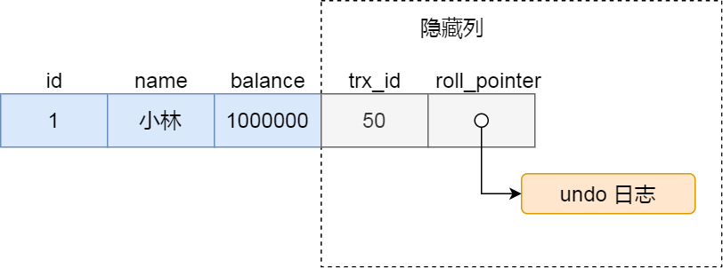

对于使用 InnoDB 存储引擎的数据库表，它的聚簇索引记录中都包含下面两个隐藏列：

- trx_id，当一个事务对某条聚簇索引记录进行改动时，就会**把该事务的事务 id 记录在 trx_id 隐藏列里**；
- roll_pointer，每次对某条聚簇索引记录进行改动时，都会把旧版本的记录写入到 undo 日志中，然后**这个隐藏列是个指针，指向每一个旧版本记录**，于是就可以通过它找到修改前的记录。

在创建 Read View 后，我们可以将记录中的 trx_id 划分这三种情况：

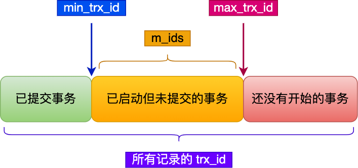

一个事务去访问记录的时候，除了自己的更新记录总是可见之外，还有这几种情况：

- 如果记录的 trx_id 值小于 Read View 中的 `min_trx_id` 值，表示这个版本的记录是在创建 Read View **前**（对创建当前Read View的事务）已经提交的事务生成的，所以该版本的记录对当前事务**可见**。
- 如果记录的 trx_id 值大于等于 Read View 中的 `max_trx_id` 值，表示这个版本的记录是在创建 Read View **后**才启动的事务生成的，所以该版本的记录对当前事务**不可见**。
- 如果记录的 trx_id 值在 Read View 的 min_trx_id 和 max_trx_id之间，需要判断 trx_id 是否在 m_ids 列表中：
  - 如果记录的 trx_id **在** `m_ids` 列表中，表示生成该版本记录的活跃事务依然活跃着（还没提交事务），所以该版本的记录对当前事务**不可见**。
  - 如果记录的 trx_id **不在** `m_ids`列表中，表示生成该版本记录的活跃事务已经被提交，所以该版本的记录对当前事务**可见**。

**这种通过「版本链」来控制并发事务访问同一个记录时的行为就叫 MVCC（多版本并发控制）。**


### 可重复读是如何工作的？

**可重复读隔离级别是启动事务时生成一个 Read View，然后整个事务期间都在用这个 Read View**。

假设事务 A （事务 id 为51）启动后，紧接着事务 B （事务 id 为52）也启动了，那这两个事务创建的 Read View 如下：

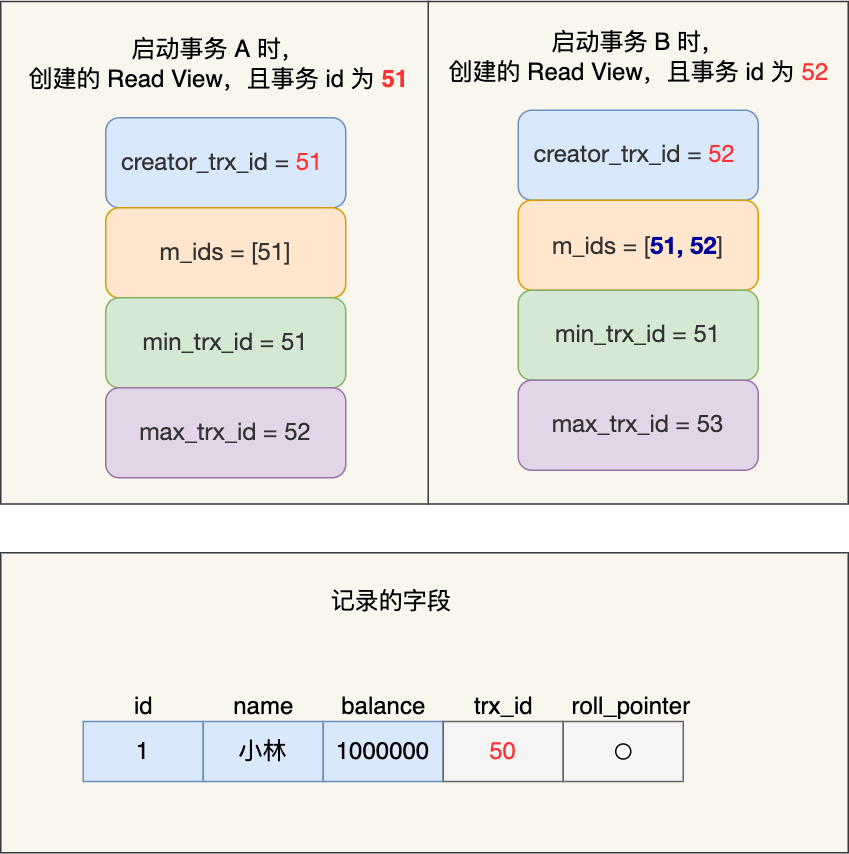

事务 A 和 事务 B 的 Read View 具体内容如下：

- 在事务 A 的 Read View 中，它的事务 id 是 51，由于它是第一个启动的事务，所以此时活跃事务的事务 id 列表就只有 51，活跃事务的事务 id 列表中最小的事务 id 是事务 A 本身，下一个事务 id 则是 52。
- 在事务 B 的 Read View 中，它的事务 id 是 52，由于事务 A 是活跃的，所以此时活跃事务的事务 id 列表是 51 和 52，**活跃的事务 id 中最小的事务 id 是事务 A**，下一个事务 id 应该是 53。

接着，在可重复读隔离级别下，事务 A 和事务 B 按顺序执行了以下操作：

- 事务 B 读取小林的账户余额记录，读到余额是 100 万；
- 事务 A 将小林的账户余额记录修改成 200 万，并没有提交事务；
- 事务 B 读取小林的账户余额记录，读到余额还是 100 万；
- 事务 A 提交事务；
- 事务 B 读取小林的账户余额记录，读到余额依然还是 100 万；

接下来，跟大家具体分析下。

事务 B 第一次读小林的账户余额记录，在找到记录后，它会先看这条记录的 trx_id，此时**发现 trx_id 为 50，比事务 B 的 Read View 中的 min_trx_id 值（51）还小，这意味着修改这条记录的事务早就在事务 B 启动前提交过了，所以该版本的记录对事务 B 可见的**，也就是事务 B 可以获取到这条记录。

接着，事务 A 通过 update 语句将这条记录修改了（还未提交事务），将小林的余额改成 200 万，这时 MySQL 会记录相应的 undo log，并以链表的方式串联起来，形成**版本链**，如下图：

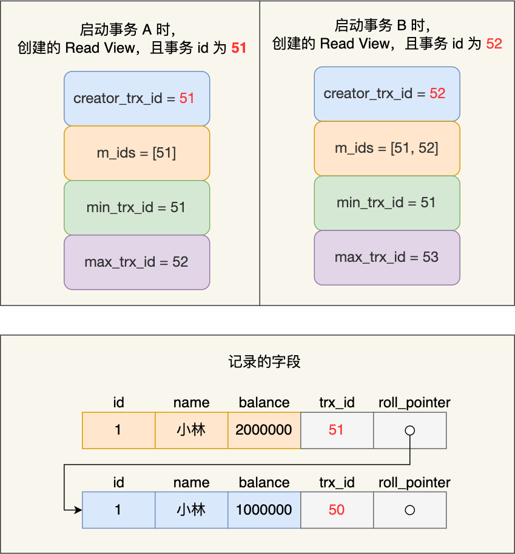

你可以在上图的「记录的字段」看到，由于事务 A 修改了该记录，以前的记录就变成旧版本记录了，于是最新记录和旧版本记录通过链表的方式串起来，**而且最新记录的 trx_id 是事务 A 的事务 id（trx_id = 51）。**

然后事务 B 第二次去读取该记录，**发现这条记录的 trx_id 值为 51，在事务 B 的 Read View 的 min_trx_id 和 max_trx_id 之间，则需要判断 trx_id 值是否在 m_ids 范围内，判断的结果是在的，那么说明这条记录是被还未提交的事务修改的，这时事务 B 并不会读取这个版本的记录。而是沿着 undo log 链条往下找旧版本的记录，直到找到 trx_id 「小于」事务 B 的 Read View 中的 min_trx_id 值的第一条记录**，所以事务 B 能读取到的是 trx_id 为 50 的记录，也就是小林余额是 100 万的这条记录。

最后，当事物 A 提交事务后，**由于隔离级别时「可重复读」，所以事务 B 再次读取记录时，还是基于启动事务时创建的 Read View 来判断当前版本的记录是否可见。所以，即使事物 A 将小林余额修改为 200 万并提交了事务， 事务 B 第三次读取记录时，读到的记录都是小林余额是 100 万的这条记录**。

就是通过这样的方式实现了，「可重复读」隔离级别下在事务期间读到的记录都是事务启动前的记录。


### 读提交是如何工作的？

**读提交隔离级别是在每次读取数据时，都会生成一个新的 Read View**。

也意味着，事务期间的多次读取同一条数据，前后两次读的数据可能会出现不一致，因为可能这期间另外一个事务修改了该记录，并提交了事务。

那读提交隔离级别是怎么工作呢？我们还是以前面的例子来聊聊。

假设事务 A （事务 id 为51）启动后，紧接着事务 B （事务 id 为52）也启动了，接着按顺序执行了以下操作：

- 事务 B 读取数据（创建 Read View），小林的账户余额为 100 万；
- 事务 A 修改数据（还没提交事务），将小林的账户余额从 100 万修改成了 200 万；
- 事务 B 读取数据（创建 Read View），小林的账户余额为 100 万；
- 事务 A 提交事务；
- 事务 B 读取数据（创建 Read View），小林的账户余额为 200 万；

那具体怎么做到的呢？我们重点看事务 B 每次读取数据时创建的 Read View。前两次 事务 B 读取数据时创建的 Read View 如下图：

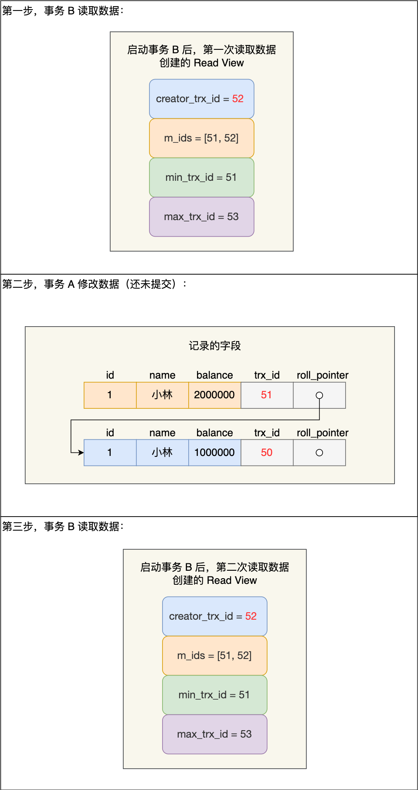

我们来分析下为什么事务 B 第二次读数据时，读不到事务 A （还未提交事务）修改的数据？

事务 B 在找到小林这条记录时，会看这条记录的 trx_id 是 51，在事务 B 的 Read View 的 min_trx_id 和 max_trx_id 之间，接下来需要判断 trx_id 值是否在 m_ids 范围内，判断的结果是在的，那么说明**这条记录是被还未提交的事务修改的，这时事务 B 并不会读取这个版本的记录**。而是，沿着 undo log 链条往下找旧版本的记录，直到找到 trx_id 「小于」事务 B 的 Read View 中的 min_trx_id 值的第一条记录，所以事务 B 能读取到的是 trx_id 为 50 的记录，也就是小林余额是 100 万的这条记录。

我们来分析下为什么事务 A 提交后，事务 B 就可以读到事务 A 修改的数据？

在事务 A 提交后，**由于隔离级别是「读提交」，所以事务 B 在每次读数据的时候，会重新创建 Read View**，此时事务 B 第三次读取数据时创建的 Read View 如下：

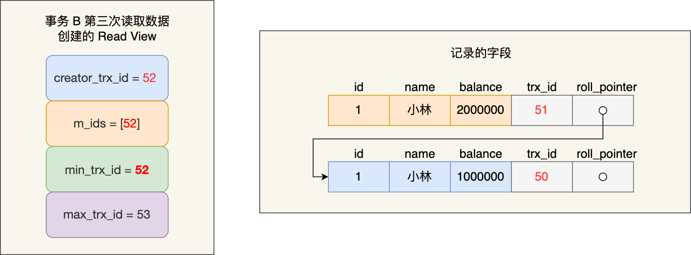

事务 B 在找到小林这条记录时，**会发现这条记录的 trx_id 是 51，比事务 B 的 Read View 中的 min_trx_id 值（52）还小，这意味着修改这条记录的事务早就在创建 Read View 前提交过了，所以该版本的记录对事务 B 是可见的**。

正是因为在读提交隔离级别下，事务每次读数据时都重新创建 Read View，那么在事务期间的多次读取同一条数据，前后两次读的数据可能会出现不一致，因为可能这期间另外一个事务修改了该记录，并提交了事务。


### 总结

事务是在 MySQL 引擎层实现的，我们常见的 InnoDB 引擎是支持事务的，事务的四大特性是原子性、一致性、隔离性、持久性，我们这次主要讲的是隔离性。

当多个事务并发执行的时候，会引发脏读、不可重复读、幻读这些问题，那为了避免这些问题，SQL 提出了四种隔离级别，分别是读未提交、读已提交、可重复读、串行化，从左往右隔离级别顺序递增，隔离级别越高，意味着性能越差，InnoDB 引擎的默认隔离级别是可重复读。

要解决脏读现象，就要将隔离级别升级到读已提交以上的隔离级别，要解决不可重复读现象，就要将隔离级别升级到可重复读以上的隔离级别。


## 可重复能完全避免幻读吗

**可重复读隔离级别下虽然很大程度上避免了幻读，但是还是没有能完全解决幻读**。

### 第一个发生幻读现象的场景

还是以这张表作为例子：

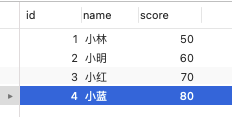

事务 A 执行查询 id = 5 的记录，此时表中是没有该记录的，所以查询不出来。

```sql
# 事务 A
mysql> begin;
Query OK, 0 rows affected (0.00 sec)

mysql> select * from t_stu where id = 5;
Empty set (0.01 sec)
```

然后事务 B 插入一条 id = 5 的记录，并且提交了事务。

```sql
# 事务 B
mysql> begin;
Query OK, 0 rows affected (0.00 sec)

mysql> insert into t_stu values(5, '小美', 18);
Query OK, 1 row affected (0.00 sec)

mysql> commit;
Query OK, 0 rows affected (0.00 sec)
```

此时，**事务 A 更新 id = 5 这条记录，对没错，事务 A 看不到 id = 5 这条记录，但是他去更新了这条记录，这场景确实很违和，然后再次查询 id = 5 的记录，事务 A 就能看到事务 B 插入的纪录了，幻读就是发生在这种违和的场景**。

```sql
# 事务 A
mysql> update t_stu set name = '小林coding' where id = 5;
Query OK, 1 row affected (0.01 sec)
Rows matched: 1  Changed: 1  Warnings: 0

mysql> select * from t_stu where id = 5;
+----+--------------+------+
| id | name         | age  |
+----+--------------+------+
|  5 | 小林coding   |   18 |
+----+--------------+------+
1 row in set (0.00 sec)
```

整个发生幻读的时序图如下：

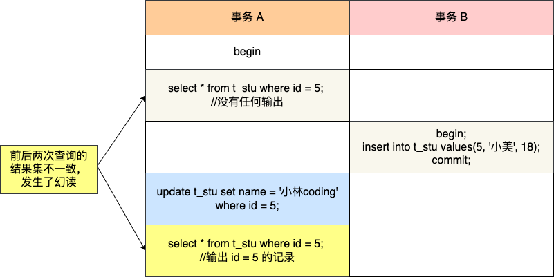

在可重复读隔离级别下，事务 A 第一次执行普通的 select 语句时生成了一个 ReadView，之后事务 B 向表中新插入了一条 id = 5 的记录并提交。接着，事务 A 对 id = 5 这条记录进行了更新操作，在这个时刻，这条新记录的 trx_id 隐藏列的值就变成了事务 A 的事务 id，之后事务 A 再使用普通 select 语句去查询这条记录时就可以看到这条记录了，于是就发生了幻读。

因为这种特殊现象的存在，所以我们认为 **MySQL Innodb 中的 MVCC 并不能完全避免幻读现象**。


### 第二个发生幻读现象的场景

除了上面这一种场景会发生幻读现象之外，还有下面这个场景也会发生幻读现象。

- T1 时刻：事务 A 先执行「快照读语句」：select * from t_test where id > 100 得到了 3 条记录。
- T2 时刻：事务 B 往插入一个 id= 200 的记录并提交；
- T3 时刻：事务 A 再执行「当前读语句」 select * from t_test where id > 100 for update 就会得到 4 条记录，此时也发生了幻读现象。

**要避免这类特殊场景下发生幻读的现象的话，就是尽量在开启事务之后，马上执行 select ... for update 这类当前读的语句**，因为它会对记录加 next-key lock，从而避免其他事务插入一条新记录。


## 总结

MySQL InnoDB 引擎的可重复读隔离级别（默认隔离级），根据不同的查询方式，分别提出了避免幻读的方案：

- 针对**快照读**（普通 select 语句），是通过 MVCC 方式解决了幻读。
- 针对**当前读**（select ... for update 等语句），是通过 next-key lock（记录锁+间隙锁）方式解决了幻读。

我举例了两个发生幻读场景的例子。

第一个例子：对于快照读， MVCC 并不能完全避免幻读现象。因为当事务 A 更新了一条事务 B 插入的记录，那么事务 A 前后两次查询的记录条目就不一样了，所以就发生幻读。

第二个例子：对于当前读，如果事务开启后，并没有执行当前读，而是先快照读，然后这期间如果其他事务插入了一条记录，那么事务后续使用当前读进行查询的时候，就会发现两次查询的记录条目就不一样了，所以就发生幻读。

所以，**MySQL 可重复读隔离级别并没有彻底解决幻读，只是很大程度上避免了幻读现象的发生。**

要避免这类特殊场景下发生幻读的现象的话，就是尽量在开启事务之后，马上执行 select ... for update 这类当前读的语句，因为它会对记录加 next-key lock，从而避免其他事务插入一条新记录。


# 锁


## MySQL 有哪些锁

在 MySQL 里，根据加锁的范围，可以分为**全局锁、表级锁和行锁**三类。


### 全局锁

要使用全局锁，则要执行这条命令：

```sql
flush tables with read lock
```

执行后，**整个数据库就处于只读状态了**，这时其他线程执行以下操作，都会被阻塞：

- 对数据的增删改操作，比如 insert、delete、update等语句；
- 对表结构的更改操作，比如 alter table、drop table 等语句。

如果要释放全局锁，则要执行这条命令：

```sql
unlock tables
```

当然，当会话断开了，全局锁会被自动释放。


#### 全局锁应用场景是什么？

全局锁主要应用于做**全库逻辑备份**，这样在备份数据库期间，不会因为数据或表结构的更新，而出现备份文件的数据与预期的不一样。

也就是在备份用户表和商品表之间，有用户购买了商品。

这种情况下，备份的结果是用户表中该用户的余额并没有扣除，反而商品表中该商品的库存被减少了，如果后面用这个备份文件恢复数据库数据的话，用户钱没少，而库存少了，等于用户白嫖了一件商品。

所以，在全库逻辑备份期间，加上全局锁，就不会出现上面这种情况了。


#### 加全局锁又会带来什么缺点呢？

加上全局锁，意味着整个数据库都是只读状态。

那么如果数据库里有很多数据，备份就会花费很多的时间，关键是备份期间，业务只能读数据，而不能更新数据，这样会造成业务停滞。

**既然备份数据库数据的时候，使用全局锁会影响业务，那有什么其他方式可以避免？**

有的，如果数据库的引擎支持的事务支持**可重复读的隔离级别**，那么在备份数据库之前先开启事务，会先创建 Read View，然后整个事务执行期间都在用这个 Read View，而且由于 MVCC 的支持，备份期间业务依然可以对数据进行更新操作。

因为在可重复读的隔离级别下，即使其他事务更新了表的数据，也不会影响备份数据库时的 Read View，这就是事务四大特性中的隔离性，这样备份期间备份的数据一直是在开启事务时的数据。

备份数据库的工具是 mysqldump，在使用 mysqldump 时加上 `–single-transaction` 参数的时候，就会在备份数据库之前先开启事务。这种方法只适用于支持「可重复读隔离级别的事务」的存储引擎。

**InnoDB 存储引擎默认的事务隔离级别正是可重复读，因此可以采用这种方式来备份数据库。**

但是，对于 MyISAM 这种不支持事务的引擎，在备份数据库时就要使用全局锁的方法。


### 表级锁

MySQL 里面表级别的锁有这几种：

- 表锁；
- 元数据锁（MDL）;
- 意向锁；
- AUTO-INC 锁；


#### 表锁

表锁除了会限制别的线程的读写外，也会限制本线程接下来的读写操作。

也就是说如果本线程对学生表加了「共享表锁」，那么本线程接下来如果要对学生表执行写操作的语句，是会被阻塞的，当然其他线程对学生表进行写操作时也会被阻塞，直到锁被释放。（表级全局锁，对所有线程都一视同仁）

不过尽量避免在使用 InnoDB 引擎的表使用表锁，因为表锁的颗粒度太大，会影响并发性能，**InnoDB 牛逼的地方在于实现了颗粒度更细的行级锁**。


#### 元数据锁（MDL）

我们不需要显示的使用 MDL，因为当我们对数据库表进行操作时，会自动给这个表加上 MDL：

- 对一张表进行 CRUD 操作时，加的是 **MDL 读锁**；
- 对一张表做结构变更操作的时候，加的是 **MDL 写锁**；

MDL 是为了保证当用户对表执行 CRUD 操作时，防止其他线程对这个表结构做了变更。

当有线程在执行 select 语句（ 加 MDL 读锁）的期间，如果有其他线程要更改该表的结构（ 申请 MDL 写锁），那么将会被阻塞，直到执行完 select 语句（ 释放 MDL 读锁）。

反之，当有线程对表结构进行变更（ 加 MDL 写锁）的期间，如果有其他线程执行了 CRUD 操作（ 申请 MDL 读锁），那么就会被阻塞，直到表结构变更完成（ 释放 MDL 写锁）。

**MDL 不需要显示调用，那它是在什么时候释放的?**

MDL 是在事务提交后才会释放，这意味着**事务执行期间，MDL 是一直持有的**。

那如果数据库有一个长事务（所谓的长事务，就是开启了事务，但是一直还没提交），那在对表结构做变更操作的时候，可能会发生意想不到的事情，比如下面这个顺序的场景：

1. 首先，线程 A 先启用了事务（但是一直不提交），然后执行一条 select 语句，此时就先对该表加上 MDL 读锁；
2. 然后，线程 B 也执行了同样的 select 语句，此时并不会阻塞，因为「读读」并不冲突；
3. 接着，线程 C 修改了表字段，此时由于线程 A 的事务并没有提交，也就是 MDL 读锁还在占用着，这时线程 C 就无法申请到 MDL 写锁，就会被阻塞，

那么在线程 C 阻塞后，后续有对该表的 select 语句，就都会被阻塞，如果此时有大量该表的 select 语句的请求到来，就会有大量的线程被阻塞住，这时数据库的线程很快就会爆满了。

这是因为申请 MDL 锁的操作会形成一个队列，队列中**写锁获取优先级高于读锁**，一旦出现 MDL 写锁等待，会阻塞后续该表的所有 CRUD 操作。

所以为了能安全的对表结构进行变更，在对表结构变更前，先要看看数据库中的长事务，是否有事务已经对表加上了 MDL 读锁，如果可以考虑 kill 掉这个长事务，然后再做表结构的变更。


#### 意向锁

- 在使用 InnoDB 引擎的表里对某些记录加上「共享锁」之前，需要先在表级别加上一个「意向共享锁」；
- 在使用 InnoDB 引擎的表里对某些纪录加上「独占锁」之前，需要先在表级别加上一个「意向独占锁」；

也就是，当执行插入、更新、删除操作，需要先对表加上「意向独占锁」，然后对该记录加独占锁。

而普通的 select 是不会加行级锁的，普通的 select 语句是利用 MVCC 实现一致性读，是无锁的。

**意向共享锁和意向独占锁是表级锁，不会和行级的共享锁和独占锁发生冲突，而且意向锁之间也不会发生冲突，只会和共享表锁（\*lock tables ... read\*）和独占表锁（\*lock tables ... write\*）发生冲突。**

表锁和行锁是满足读读共享、读写互斥、写写互斥的。

如果没有「意向锁」，那么加「独占表锁」时，就需要遍历表里所有记录，查看是否有记录存在独占锁，这样效率会很慢。

那么有了「意向锁」，由于在对记录加独占锁前，先会加上表级别的意向独占锁，那么在加「独占表锁」时，直接查该表是否有意向独占锁，如果有就意味着表里已经有记录被加了独占锁，这样就不用去遍历表里的记录。

所以，**意向锁的目的是为了快速判断表里是否有记录被加锁**。


#### AUTO-INC 锁

表里的主键通常都会设置成自增的，这是通过对主键字段声明 `AUTO_INCREMENT` 属性实现的。

之后可以在插入数据时，可以不指定主键的值，数据库会自动给主键赋值递增的值，这主要是通过 **AUTO-INC 锁**实现的。

AUTO-INC 锁是特殊的表锁机制，锁**不是再一个事务提交后才释放，而是再执行完插入语句后就会立即释放**。

**在插入数据时，会加一个表级别的 AUTO-INC 锁**，然后为被 `AUTO_INCREMENT` 修饰的字段赋值递增的值，等插入语句执行完成后，才会把 AUTO-INC 锁释放掉。

那么，一个事务在持有 AUTO-INC 锁的过程中，其他事务的如果要向该表插入语句都会被阻塞，从而保证插入数据时，被 `AUTO_INCREMENT` 修饰的字段的值是连续递增的。

但是， AUTO-INC 锁再对大量数据进行插入的时候，会影响插入性能，因为另一个事务中的插入会被阻塞。

因此， 在 MySQL 5.1.22 版本开始，InnoDB 存储引擎提供了一种**轻量级的锁**来实现自增。

一样也是在插入数据的时候，会为被 `AUTO_INCREMENT` 修饰的字段加上轻量级锁，**然后给该字段赋值一个自增的值，就把这个轻量级锁释放了，而不需要等待整个插入语句执行完后才释放锁**。

当「主库」发生了这种情况，binlog 面对 t2 表的更新只会记录这两个 session 的 insert 语句，如果 binlog_format=statement，记录的语句就是原始语句。记录的顺序要么先记 session A 的 insert 语句，要么先记 session B 的 insert 语句。

但不论是哪一种，这个 binlog 拿去「从库」执行，这时从库是按「顺序」执行语句的，只有当执行完一条 SQL 语句后，才会执行下一条 SQL。因此，在**从库上「不会」发生像主库那样两个 session 「同时」执行向表 t2 中插入数据的场景。所以，在备库上执行了 session B 的 insert 语句，生成的结果里面，id 都是连续的。这时，主从库就发生了数据不一致**。

要解决这问题，binlog 日志格式要设置为 row，这样在 binlog 里面记录的是主库分配的自增值，到备库执行的时候，主库的自增值是什么，从库的自增值就是什么。

所以，**当 innodb_autoinc_lock_mode = 2 时，并且 binlog_format = row，既能提升并发性，又不会出现数据一致性问题**。


### 行级锁

InnoDB 引擎是支持行级锁的，而 MyISAM 引擎并不支持行级锁。

前面也提到，普通的 select 语句是不会对记录加锁的，因为它属于快照读。如果要在查询时对记录加行锁，可以使用下面这两个方式，这种查询会加锁的语句称为**锁定读**。

共享锁（S锁）满足读读共享，读写互斥。独占锁（X锁）满足写写互斥、读写互斥。

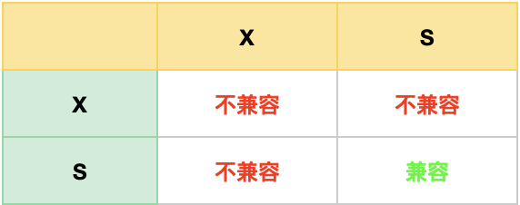

行级锁的类型主要有三类：

- Record Lock，记录锁，也就是仅仅把一条记录锁上；
- Gap Lock，间隙锁，锁定一个范围，但是不包含记录本身；
- Next-Key Lock：Record Lock + Gap Lock 的组合，锁定一个范围，并且锁定记录本身。


#### Record Lock

Record Lock 称为记录锁，锁住的是一条记录。而且记录锁是有 S 锁和 X 锁之分的：

- **当一个事务对**一条记录加了 S 型记录锁后，其他事务也可以继续对该记录加 S 型记录锁（S 型与 S 锁兼容），但是不可以对该记录加 X 型记录锁（S 型与 X 锁不兼容）;
- 当一个事务对一条记录加了 X 型记录锁后，其他事务既不可以对该记录加 S 型记录锁（S 型与 X 锁不兼容），也不可以对该记录加 X 型记录锁（X 型与 X 锁不兼容）。


#### Gap Lock

Gap Lock 称为间隙锁，只存在于可重复读隔离级别，目的是为了解决可重复读隔离级别下幻读的现象。

假设，表中有一个范围 id 为（3，5）间隙锁，那么其他事务就无法插入 id = 4 这条记录了，这样就有效的防止幻读现象的发生。

> 幻读：幻读是指当用户读取某一范围的数据行时，另一个事务又在该范围内插入了新行，当用户再读取该范围的数据行时，会发现有新的“幻影” 行，即幻读不是幂等的。

间隙锁虽然存在 X 型间隙锁和 S 型间隙锁，但是并没有什么区别，**间隙锁之间是兼容的，即两个事务可以同时持有包含共同间隙范围的间隙锁，并不存在互斥关系，因为间隙锁的目的是防止插入幻影记录而提出的**。


#### Next-Key Lock

Next-Key Lock 称为临键锁，是 Record Lock + Gap Lock 的组合，**锁定一个范围，并且锁定记录本身**。

假设，表中有一个范围 id 为（3，5] 的 next-key lock，那么其他事务即不能插入 id = 4 记录，也不能修改 id = 5 这条记录。

所以，next-key lock 即能保护该记录，又能阻止其他事务将新纪录插入到被保护记录前面的间隙中。

**next-key lock 是包含间隙锁+记录锁的，如果一个事务获取了 X 型的 next-key lock，那么另外一个事务在获取相同范围的 X 型的 next-key lock 时，是会被阻塞的**。

比如，一个事务持有了范围为 (1, 10] 的 X 型的 next-key lock，那么另外一个事务在获取相同范围的 X 型的 next-key lock 时，就会被阻塞。

虽然相同范围的间隙锁是多个事务相互兼容的，但对于记录锁，我们是要考虑 X 型与 S 型关系，X 型的记录锁与 X 型的记录锁是冲突的。


#### 插入意向锁

一个事务在插入一条记录的时候，需要判断插入位置是否已被其他事务加了间隙锁（next-key lock 也包含间隙锁）。

如果有的话，插入操作就会发生**阻塞**，直到拥有间隙锁的那个事务提交为止（释放间隙锁的时刻），在此期间会生成一个**插入意向锁**，表明有事务想在某个区间插入新记录，但是现在处于等待状态。

插入意向锁名字虽然有意向锁，但是它并**不是意向锁，它是一种特殊的间隙锁，属于行级别锁**。

如果说间隙锁锁住的是一个区间，那么「插入意向锁」锁住的就是一个点。因而从这个角度来说，插入意向锁确实是一种特殊的间隙锁。

插入意向锁与间隙锁的另一个非常重要的差别是：尽管「插入意向锁」也属于间隙锁，但两个事务却不能在同一时间内，一个拥有间隙锁，另一个拥有该间隙区间内的插入意向锁（当然，插入意向锁如果不在间隙锁区间内则是可以的）。


## MySQL 是怎么加锁的？

