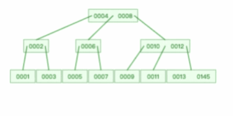
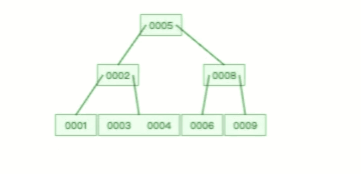

# MySQL 存储


## MySQL 一行记录是怎么存储的？

> MySQL 的 NULL 值是怎么存放的？

MySQL 的 Compact 行格式中会用「**NULL值列表**」来标记值为 NULL 的列，NULL 值并不会存储在行格式中的真实数据部分。

NULL值列表会占用 1 字节空间，当表中所有字段都定义成 NOT NULL，行格式中就不会有 NULL值列表，这样可节省 1 字节的空间。

> MySQL 怎么知道 varchar(n) 实际占用数据的大小？

MySQL 的 Compact 行格式中会用「**变长字段长度列表**」存储变长字段实际占用的数据大小。

> varchar(n) 中 n 最大取值为多少？

一行记录最大能存储 65535 字节的数据，但是这个是包含「变长字段字节数列表所占用的字节数」和「NULL值列表所占用的字节数」。所以， 我们在算 varchar(n) 中 n 最大值时，需要减去这两个列表所占用的字节数。

如果一张表只有一个 varchar(n) 字段，且允许为 NULL，字符集为 ascii。varchar(n) 中 n 最大取值为 65532。

计算公式：65535 - 变长字段字节数列表所占用的字节数 - NULL值列表所占用的字节数 = 65535 - 2 - 1 = 65532。

如果有多个字段的话，要保证所有字段的长度 + 变长字段字节数列表所占用的字节数 + NULL值列表所占用的字节数 <= 65535。

> 行溢出后，MySQL 是怎么处理的？

如果一个数据页存不了一条记录，InnoDB 存储引擎会自动将溢出的数据存放到「溢出页」中。

Compact 行格式针对行溢出的处理是这样的：当发生行溢出时，在记录的真实数据处只会保存该列的一部分数据，而把剩余的数据放在「溢出页」中，然后真实数据处用 20 字节存储指向溢出页的地址，从而可以找到剩余数据所在的页。

Compressed 和 Dynamic 这两种格式采用完全的行溢出方式，记录的真实数据处不会存储该列的一部分数据，只存储 20 个字节的指针来指向溢出页。而实际的数据都存储在溢出页中。


# 索引


## 索引常见面试题

### 什么是索引？

那换到数据库中，索引的定义就是帮助存储引擎快速获取数据的一种数据结构，形象的说就是**索引是数据的目录**。


### 索引的分类

- 按「数据结构」分类：**B+tree索引、Hash索引、Full-text索引**。
- 按「物理存储」分类：**聚簇索引（主键索引）、二级索引（辅助索引）**。
- 按「字段特性」分类：**主键索引、唯一索引、普通索引、前缀索引**。
- 按「字段个数」分类：**单列索引、联合索引**。


#### 按数据结构分类


在创建表时，InnoDB 存储引擎会根据不同的场景选择不同的列作为索引：

- 如果有主键，默认会使用主键作为聚簇索引的索引键（key）；
- 如果没有主键，就选择第一个不包含 NULL 值的唯一列作为聚簇索引的索引键（key）；
- 在上面两个都没有的情况下，InnoDB 将自动生成一个隐式自增 id 列作为聚簇索引的索引键（key）；

其它索引都属于辅助索引（Secondary Index），也被称为二级索引或非聚簇索引。**创建的主键索引和二级索引默认使用的是 B+Tree 索引**。


##### 通过主键查询商品数据的过程

B+Tree 是一种多叉树，叶子节点才存放数据（行数据），非叶子节点只存放索引，而且每个节点里的数据是**按主键顺序存放**的。每一层父节点的索引值都会出现在下层子节点的索引值中，因此在叶子节点中，包括了所有的索引值信息，并且每一个叶子节点都有两个指针，分别指向下一个叶子节点和上一个叶子节点，形成一个双向链表。


数据库的索引和数据都是存储在硬盘的，**我们可以把读取一个节点当作一次磁盘 I/O 操作。那么上面的整个查询过程一共经历了 3 个节点，也就是进行了 3 次 I/O 操作**（查询索引值为7的行数据）。

B+Tree 存储千万级的数据只需要 3-4 层高度就可以满足，这意味着从千万级的表查询目标数据最多需要 3-4 次磁盘 I/O，所以**B+Tree 相比于 B 树和二叉树来说，最大的优势在于查询效率很高，因为即使在数据量很大的情况，查询一个数据的磁盘 I/O 依然维持在 3-4次。**


##### 通过二级索引查询商品数据的过程

主键索引的 B+Tree 和二级索引的 B+Tree 区别如下：

- 主键索引的 B+Tree 的叶子节点存放的是实际数据，所有完整的用户记录都存放在主键索引的 B+Tree 的叶子节点里；
- 二级索引的 B+Tree 的叶子节点存放的是**主键值**，而不是实际数据。


其中非叶子的 key 值是 product_no（图中橙色部分），叶子节点存储的数据是主键值（图中绿色部分）。


####  按物理存储分类

- 主键索引的 B+Tree 的叶子节点存放的是实际数据，所有完整的用户记录都存放在主键索引的 B+Tree 的叶子节点里；
- 二级索引的 B+Tree 的叶子节点存放的是主键值，而不是实际数据。

所以，在查询时使用了二级索引，**如果查询的数据能在二级索引里查询的到，那么就不需要回表，这个过程就是覆盖索引。**如果查询的数据不在二级索引里，就会先检索二级索引，**找到对应的叶子节点，获取到主键值后，然后再检索主键索引，就能查询到数据了，这个过程就是回表。**


#### 按字段特性分类

##### 主键索引

主键索引就是建立在主键字段上的索引，通常在创建表的时候一起创建，一张表最多只有一个主键索引，索引列的值不允许有空值。


##### 唯一索引

**唯一索引建立在 UNIQUE 字段上的索引**，一张表可以有多个唯一索引，**索引列的值必须唯一，但是允许有空值。**


##### 普通索引

普通索引就是建立在普通字段上的索引，**既不要求字段为主键，也不要求字段为 UNIQUE。**


##### 前缀索引

前缀索引是指对字符类型字段的前几个字符建立的索引，而不是在整个字段上建立的索引，前缀索引可以建立在字段类型为 char、 varchar、binary、varbinary 的列上。

使用前缀索引的目的是为了减少索引占用的存储空间，提升查询效率。


#### 按字段个数分类

- 建立在单列上的索引称为单列索引，比如主键索引；
- 建立在多列上的索引称为联合索引；


##### 联合索引

通过将多个字段组合成一个索引，该索引就被称为联合索引。

比如，将商品表中的 product_no 和 name 字段组合成联合索引`(product_no, name)`，创建联合索引的方式如下：

```sql
CREATE INDEX index_product_no_name ON product(product_no, name);
```

联合索引`(product_no, name)` 的 B+Tree 示意图如下（图中叶子节点之间我画了单向链表，但是实际上是双向链表，原图我找不到了，修改不了，偷个懒我不重画了，大家脑补成双向链表就行）。


可以看到，联合索引的非叶子节点用两个字段的值作为 B+Tree 的 key 值。当在联合索引查询数据时，先按 product_no 字段比较，在 product_no 相同的情况下再按 name 字段比较。

也就是说，联合索引查询的 B+Tree 是先按 product_no 进行排序，然后再 product_no 相同的情况再按 name 字段排序。

因此，使用联合索引时，存在**最左匹配原则**，也就是按照最左优先的方式进行索引的匹配。在使用联合索引进行查询的时候，如果不遵循「最左匹配原则」，联合索引会失效，这样就无法利用到索引快速查询的特性了。

但是，如果查询条件是以下这几种，因为不符合最左匹配原则，所以就无法匹配上联合索引，联合索引就会失效:

- where b=2；
- where c=3；
- where b=2 and c=3；

上面这些查询条件之所以会失效，是因为`(a, b, c)` 联合索引，是先按 a 排序，在 a 相同的情况再按 b 排序，在 b 相同的情况再按 c 排序。所以，**b 和 c 是全局无序，局部相对有序的**，这样在没有遵循最左匹配原则的情况下，是无法利用到索引的，**利用索引的前提是索引里的 key 是有序的**。


##### 联合索引范围查询

联合索引有一些特殊情况，**并不是查询过程使用了联合索引查询，就代表联合索引中的所有字段都用到了联合索引进行索引查询**，也就是可能存在部分字段用到联合索引的 B+Tree，部分字段没有用到联合索引的 B+Tree 的情况。

这种特殊情况就发生在范围查询。联合索引的最左匹配原则会一直向右匹配直到遇到「范围查询」就会停止匹配。**也就是范围查询的字段可以用到联合索引，但是在范围查询字段的后面的字段无法用到联合索引**。


接下来，举例几个范围查例子。

> Q1: `select * from t_table where a > 1 and b = 2`，联合索引（a, b）哪一个字段用到了联合索引的 B+Tree？

由于联合索引（二级索引）是先按照 a 字段的值排序的，所以符合 a > 1 条件的二级索引记录肯定是相邻，于是在进行索引扫描的时候，可以定位到符合 a > 1 条件的第一条记录，然后沿着记录所在的链表向后扫描，直到某条记录不符合 a > 1 条件位置。所以 a 字段可以在联合索引的 B+Tree 中进行索引查询。

**但是在符合 a > 1 条件的二级索引记录的范围里，b 字段的值是无序的**。比如前面图的联合索引的 B+ Tree 里，下面这三条记录的 a 字段的值都符合 a > 1 查询条件，而 b 字段的值是无序的：

因此，我们不能根据查询条件 b = 2 来进一步减少需要扫描的记录数量（b 字段无法利用联合索引进行索引查询的意思）。

所以在执行 Q1 这条查询语句的时候，对应的扫描区间是 (2, + ∞)，形成该扫描区间的边界条件是 a > 1，与 b = 2 无关。

因此，**Q1 这条查询语句只有 a 字段用到了联合索引进行索引查询，而 b 字段并没有使用到联合索引**。


> Q2: `select * from t_table where a >= 1 and b = 2`，联合索引（a, b）哪一个字段用到了联合索引的 B+Tree？

Q2 和 Q1 的查询语句很像，唯一的区别就是 a 字段的查询条件「大于等于」。

由于联合索引（二级索引）是先按照 a 字段的值排序的，所以符合 >= 1 条件的二级索引记录肯定是相邻，于是在进行索引扫描的时候，可以定位到符合 >= 1 条件的第一条记录，然后沿着记录所在的链表向后扫描，直到某条记录不符合 a>= 1 条件位置。所以 a 字段可以在联合索引的 B+Tree 中进行索引查询。

虽然在符合 a>= 1 条件的二级索引记录的范围里，b 字段的值是「无序」的，**但是对于符合 a = 1 的二级索引记录的范围里，b 字段的值是「有序」的**（因为对于联合索引，是先按照 a 字段的值排序，然后在 a 字段的值相同的情况下，再按照 b 字段的值进行排序）。

**于是，在确定需要扫描的二级索引的范围时，当二级索引记录的 a 字段值为 1 时，可以通过 b = 2 条件减少需要扫描的二级索引记录范围（b 字段可以利用联合索引进行索引查询的意思）**。也就是说，从符合 a = 1 and b = 2 条件的第一条记录开始扫描，而不需要从第一个 a 字段值为 1 的记录开始扫描。

所以，**Q2 这条查询语句 a 和 b 字段都用到了联合索引进行索引查询**。


> Q3: `SELECT * FROM t_table WHERE a BETWEEN 2 AND 8 AND b = 2`，联合索引（a, b）哪一个字段用到了联合索引的 B+Tree？

Q3 查询条件中 `a BETWEEN 2 AND 8` 的意思是查询 a 字段的值在 2 和 8 之间的记录。不同的数据库对 BETWEEN ... AND 处理方式是有差异的。在 MySQL 中，BETWEEN 包含了 value1 和 value2 边界值，类似于 >= and =<。而有的数据库则不包含 value1 和 value2 边界值（类似于 > and <）。

这里我们只讨论 MySQL。由于 MySQL 的 BETWEEN 包含 value1 和 value2 边界值，所以类似于 Q2 查询语句，因此 **Q3 这条查询语句 a 和 b 字段都用到了联合索引进行索引查询**。


。

> Q4: `SELECT * FROM t_user WHERE name like 'j%' and age = 22`，联合索引（name, age）哪一个字段用到了联合索引的 B+Tree？

由于联合索引（二级索引）是先按照 name 字段的值排序的，所以前缀为 ‘j’ 的 name 字段的二级索引记录都是相邻的， 于是在进行索引扫描的时候，可以定位到符合前缀为 ‘j’ 的 name 字段的第一条记录，然后沿着记录所在的链表向后扫描，直到某条记录的 name 前缀不为 ‘j’ 为止。

所以 a 字段可以在联合索引的 B+Tree 中进行索引查询，形成的扫描区间是['j','k')。注意， j 是闭区间。如下图：


虽然在符合前缀为 ‘j’ 的 name 字段的二级索引记录的范围里，age 字段的值是「无序」的，**但是对于符合 name = j 的二级索引记录的范围里，age字段的值是「有序」的**（因为对于联合索引，是先按照 name 字段的值排序，然后在 name 字段的值相同的情况下，再按照 age 字段的值进行排序）。

于是，在确定需要扫描的二级索引的范围时，当二级索引记录的 name 字段值为 ‘j’ 时，可以通过 age = 22 条件减少需要扫描的二级索引记录范围（age 字段可以利用联合索引进行索引查询的意思）。也就是说，从符合 `name = 'j' and age = 22` 条件的第一条记录时开始扫描，而不需要从第一个 name 为 j 的记录开始扫描 。如下图的右边：


所以，**Q4 这条查询语句 a 和 b 字段都用到了联合索引进行索引查询**。


综上所示，**联合索引的最左匹配原则，在遇到范围查询（如 >、<）的时候，就会停止匹配，也就是范围查询的字段可以用到联合索引，但是在范围查询字段的后面的字段无法用到联合索引。注意，对于 >=、<=、BETWEEN、like 前缀匹配的范围查询，并不会停止匹配，前面我也用了四个例子说明了**。


##### 索引下推

现在我们知道，对于联合索引（a, b），在执行 `select * from table where a > 1 and b = 2` 语句的时候，只有 a 字段能用到索引，那在联合索引的 B+Tree 找到第一个满足条件的主键值（ID 为 2）后，还需要判断其他条件是否满足（看 b 是否等于 2），那是在联合索引里判断？还是回主键索引去判断呢？

- 在 MySQL 5.6 之前，只能从 ID2 （主键值）开始一个个回表，到「主键索引」上找出数据行，再对比 b 字段值。
- 而 MySQL 5.6 引入的**索引下推优化**（index condition pushdown)， **可以在联合索引遍历过程中，对联合索引中包含的字段先做判断，直接过滤掉不满足条件的记录，减少回表次数**。

当你的查询语句的执行计划里，出现了 Extra 为 `Using index condition`，那么说明使用了索引下推的优化。


##### 索引区分度

另外，建立联合索引时的字段顺序，对索引效率也有很大影响。越靠前的字段被用于索引过滤的概率越高，实际开发工作中**建立联合索引时，要把区分度大的字段排在前面，这样区分度大的字段越有可能被更多的 SQL 使用到**。

区分度就是某个字段 column 不同值的个数「除以」表的总行数，计算公式如下：


比如，性别的区分度就很小，不适合建立索引或不适合排在联合索引列的靠前的位置，而 UUID 这类字段就比较适合做索引或排在联合索引列的靠前的位置。

因为如果索引的区分度很小，假设字段的值分布均匀，那么无论搜索哪个值都可能得到一半的数据。在这些情况下，还不如不要索引，因为 MySQL 还有一个查询优化器，查询优化器发现某个值出现在表的数据行中的百分比（惯用的百分比界线是"30%"）很高的时候，它一般会忽略索引，进行全表扫描。


##### 联合索引进行排序

这里出一个题目，针对针对下面这条 SQL，你怎么通过索引来提高查询效率呢？

```sql
select * from order where status = 1 order by create_time asc
```

有的同学会认为，单独给 status 建立一个索引就可以了。

但是更好的方式给 status 和 create_time 列建立一个联合索引，因为这样可以避免 MySQL 数据库发生文件排序。

因为在查询时，如果只用到 status 的索引，但是这条语句还要对 create_time 排序，这时就要用文件排序 filesort，也就是在 SQL 执行计划中，Extra 列会出现 Using filesort。

所以，要利用索引的有序性，在 status 和 create_time 列建立联合索引，这样根据 status 筛选后的数据就是按照 create_time 排好序的，避免在文件排序，提高了查询效率。


### 什么时候需要 / 不需要创建索引？

索引最大的好处是提高查询速度，但是索引也是有缺点的，比如：

- 需要占用物理空间，数量越大，占用空间越大；
- 创建索引和维护索引要耗费时间，这种时间随着数据量的增加而增大；
- 会降低表的增删改的效率，因为每次增删改索引，B+ 树为了维护索引有序性，都需要进行动态维护。

所以，索引不是万能钥匙，它也是根据场景来使用的。


#### 什么时候适用索引？

- 字段有唯一性限制的，比如商品编码；
- 经常用于 `WHERE` 查询条件的字段，这样能够提高整个表的查询速度，如果查询条件不是一个字段，可以建立联合索引。
- 经常用于 `GROUP BY` 和 `ORDER BY` 的字段，这样在查询的时候就不需要再去做一次排序了，因为我们都已经知道了建立索引之后在 B+Tree 中的记录都是排序好的。


#### 什么时候不需要创建索引？

- `WHERE` 条件，`GROUP BY`，`ORDER BY` 里用不到的字段，索引的价值是快速定位，如果起不到定位的字段通常是不需要创建索引的，因为索引是会占用物理空间的。
- 字段中存在大量重复数据，不需要创建索引，比如性别字段，只有男女，如果数据库表中，男女的记录分布均匀，那么无论搜索哪个值都可能得到一半的数据。在这些情况下，还不如不要索引，因为 MySQL 还有一个查询优化器，查询优化器发现某个值出现在表的数据行中的百分比很高的时候，它一般会忽略索引，进行全表扫描。
- 表数据太少的时候，不需要创建索引；
- **经常更新的字段不用创建索引，比如不要对电商项目的用户余额建立索引，因为索引字段频繁修改，由于要维护 B+Tree的有序性，那么就需要频繁的重建索引，这个过程是会影响数据库性能的。**


### 有什么优化索引的方法？

这里说一下几种常见优化索引的方法：

- 前缀索引优化；
- 覆盖索引优化；
- 主键索引最好是自增的；
- 防止索引失效；


#### 前缀索引优化

前缀索引顾名思义就是使用某个字段中字符串的前几个字符建立索引，那我们为什么需要使用前缀来建立索引呢？

**使用前缀索引是为了减小索引字段大小，可以增加一个索引页中存储的索引值，有效提高索引的查询速度。在一些大字符串的字段作为索引时，使用前缀索引可以帮助我们减小索引项的大小。**

不过，前缀索引有一定的局限性，例如：

- order by 就无法使用前缀索引；
- 无法把前缀索引用作覆盖索引；


#### 覆盖索引优化

覆盖索引是指 SQL 中 query 的所有字段，在索引 B+Tree 的叶子节点上都能找得到的那些索引，从二级索引中查询得到记录，而不需要通过聚簇索引查询获得，可以避免回表的操作。

假设我们只需要查询商品的名称、价格，有什么方式可以避免回表呢？

我们可以建立一个联合索引，即「商品ID、名称、价格」作为一个联合索引。如果索引中存在这些数据，查询将不会再次检索主键索引，从而避免回表。

所以，使用覆盖索引的好处就是，不需要查询出包含整行记录的所有信息，也就减少了大量的 I/O 操作。


#### 主键索引最好是自增的

我们在建表的时候，都会默认将主键索引设置为自增的，具体为什么要这样做呢？又什么好处？

InnoDB 创建主键索引默认为聚簇索引，数据被存放在了 B+Tree 的叶子节点上。也就是说，同一个叶子节点内的各个数据是按主键顺序存放的，因此，每当有一条新的数据插入时，数据库会根据主键将其插入到对应的叶子节点中。

**如果我们使用自增主键**，那么每次插入的新数据就会按顺序添加到当前索引节点的位置，不需要移动已有的数据，当页面写满，就会自动开辟一个新页面。因为每次**插入一条新记录，都是追加操作，不需要重新移动数据**，因此这种插入数据的方法效率非常高。

**如果我们使用非自增主键**，由于每次插入主键的索引值都是随机的，因此每次插入新的数据时，就可能会插入到现有数据页中间的某个位置，这将不得不移动其它数据来满足新数据的插入，甚至需要从一个页面复制数据到另外一个页面，我们通常将这种情况称为**页分裂**。**页分裂还有可能会造成大量的内存碎片，导致索引结构不紧凑，从而影响查询效率**。

举个例子，假设某个数据页中的数据是1、3、5、9，且数据页满了，现在准备插入一个数据7，则需要把数据页分割为两个数据页：


出现页分裂时，需要将一个页的记录移动到另外一个页，性能会受到影响，同时页空间的利用率下降，造成存储空间的浪费。

而如果记录是顺序插入的，例如插入数据11，则只需开辟新的数据页，也就不会发生页分裂：


因此，在使用 InnoDB 存储引擎时，如果没有特别的业务需求，建议使用自增字段作为主键。

另外，主键字段的长度不要太大，因为**主键字段长度越小，意味着二级索引的叶子节点越小（二级索引的叶子节点存放的数据是主键值），这样二级索引占用的空间也就越小**。


#### 索引最好设置为 NOT NULL

为了更好的利用索引，索引列要设置为 NOT NULL 约束。有两个原因：

- 第一原因：索引列存在 NULL 就会导致优化器在做索引选择的时候更加复杂，更加难以优化，因为可为 NULL 的列会使索引、索引统计和值比较都更复杂，比如进行索引统计时，count 会省略值为NULL 的行。

- 第二个原因：NULL 值是一个没意义的值，但是它会占用物理空间，所以会带来的存储空间的问题，因为 InnoDB 存储记录的时候，如果表中存在允许为 NULL 的字段，那么[行格式 (opens new window)](https://xiaolincoding.com/mysql/base/row_format.html#innodb-行格式有哪些)中**至少会用 1 字节空间存储 NULL 值列表**，如下图的紫色部分：

  

#### 防止索引失效

用上了索引并不意味着查询的时候会使用到索引，所以我们心里要清楚有哪些情况会导致索引失效，从而避免写出索引失效的查询语句，否则这样的查询效率是很低的。

我之前写过索引失效的文章，想详细了解的可以去看这篇文章：[谁还没碰过索引失效呢?(opens new window)](https://mp.weixin.qq.com/s/lEx6iRRP3MbwJ82Xwp675w)

这里简单说一下，发生索引失效的情况：

- 当我们使用左或者左右模糊匹配的时候，也就是 `like %xx` 或者 `like %xx%`这两种方式都会造成索引失效；
- 当我们在查询条件中对索引列做了计算、函数、类型转换操作，这些情况下都会造成索引失效；
- 联合索引要能正确使用需要遵循最左匹配原则，也就是按照最左优先的方式进行索引的匹配，否则就会导致索引失效。
- 在 WHERE 子句中，如果在 OR 前的条件列是索引列，而在 OR 后的条件列不是索引列，那么索引会失效。


### 总结


完！


## 从数据页的角度看 B+ 树


### InnoDB 是如何存储数据的？

记录是按照行来存储的，但是数据库的读取并不以「行」为单位，否则一次读取（也就是一次 I/O 操作）只能处理一行数据，效率会非常低。

因此，**InnoDB 的数据是按「数据页」为单位来读写的**，也就是说，当需要读一条记录的时候，并不是将这个记录本身从磁盘读出来，而是以页为单位，将其整体读入内存。

数据库的 I/O 操作的最小单位是页，**InnoDB 数据页的默认大小是 16KB**，意味着数据库每次读写都是以 16KB 为单位的，一次最少从磁盘中读取 16K 的内容到内存中，一次最少把内存中的 16K 内容刷新到磁盘中。

数据页包括七个部分，结构如下图：


这 7 个部分的作用如下图：


在 File Header 中有两个指针，分别指向上一个数据页和下一个数据页，连接起来的页相当于一个双向的链表，如下图所示：


**采用链表的结构是让数据页之间不需要是物理上的连续的，而是逻辑上的连续。**

数据页的主要作用是存储记录，也就是数据库的数据，所以重点说一下数据页中的 User Records 是怎么组织数据的。

**数据页中的记录按照「主键」顺序组成单向链表**，单向链表的特点就是插入、删除非常方便，但是检索效率不高，最差的情况下需要遍历链表上的所有节点才能完成检索。

因此，数据页中有一个**页目录**，起到记录的索引作用，就像我们书那样，针对书中内容的每个章节设立了一个目录，想看某个章节的时候，可以查看目录，快速找到对应的章节的页数，而数据页中的页目录就是为了能快速找到记录。

那 InnoDB 是如何给记录创建页目录的呢？页目录与记录的关系如下图：


页目录创建的过程如下：

1. 将所有的记录划分成几个组，这些记录包括最小记录和最大记录，但不包括标记为“已删除”的记录；
2. 每个记录组的最后一条记录就是组内最大的那条记录，并且最后一条记录的头信息中会存储该组一共有多少条记录，作为 n_owned 字段（上图中粉红色字段）
3. 页目录用来存储每组最后一条记录的地址偏移量，这些地址偏移量会按照先后顺序存储起来，每组的地址偏移量也被称之为槽（slot），**每个槽相当于指针指向了不同组的最后一个记录**。

从图可以看到，**页目录就是由多个槽组成的，槽相当于分组记录的索引**。然后，因为记录是按照「主键值」从小到大排序的，所以**我们通过槽查找记录时，可以使用二分法快速定位要查询的记录在哪个槽（哪个记录分组），定位到槽后，再遍历槽内的所有记录，找到对应的记录**，无需从最小记录开始遍历整个页中的记录链表。

以上面那张图举个例子，5 个槽的编号分别为 0，1，2，3，4，我想查找主键为 11 的用户记录：

- 先二分得出槽中间位是 (0+4)/2=2 ，2号槽里最大的记录为 8。因为 11 > 8，所以需要从 2 号槽后继续搜索记录；
- 再使用二分搜索出 2 号和 4 槽的中间位是 (2+4)/2= 3，3 号槽里最大的记录为 12。因为 11 < 12，所以主键为 11 的记录在 3 号槽里；
- 这里有个问题，**「槽对应的值都是这个组的主键最大的记录，如何找到组里最小的记录」**？比如槽 3 对应最大主键是 12 的记录，那如何找到最小记录 9。解决办法是：通过槽 3 找到 槽 2 对应的记录，也就是主键为 8 的记录。主键为 8 的记录的下一条记录就是槽 3 当中主键最小的 9 记录，然后开始向下搜索 2 次，定位到主键为 11 的记录，取出该条记录的信息即为我们想要查找的内容。

看到第三步的时候，可能有的同学会疑问，如果某个槽内的记录很多，然后因为记录都是单向链表串起来的，那这样在槽内查找某个记录的时间复杂度不就是 O(n) 了吗？

这点不用担心，InnoDB 对每个分组中的记录条数都是有规定的，槽内的记录就只有几条：

- 第一个分组中的记录只能有 1 条记录；
- 最后一个分组中的记录条数范围只能在 1-8 条之间；
- 剩下的分组中记录条数范围只能在 4-8 条之间。


### B+ 树是如何进行查询的？

上面我们都是在说一个数据页中的记录检索，因为一个数据页中的记录是有限的，且主键值是有序的，所以通过对所有记录进行分组，然后将组号（槽号）存储到页目录，使其起到索引作用，通过二分查找的方法快速检索到记录在哪个分组，来降低检索的时间复杂度。

但是，当我们需要存储大量的记录时，就需要多个数据页，这时我们就需要考虑如何建立合适的索引，才能方便定位记录所在的页。

为了解决这个问题，**InnoDB 采用了 B+ 树作为索引**。磁盘的 I/O 操作次数对索引的使用效率至关重要，因此在构造索引的时候，我们更倾向于采用“矮胖”的 B+ 树数据结构，这样所需要进行的磁盘 I/O 次数更少，而且 B+ 树 更适合进行关键字的范围查询。

InnoDB 里的 B+ 树中的**每个节点都是一个数据页**，结构示意图如下：


通过上图，我们看出 B+ 树的特点：

- 只有叶子节点（最底层的节点）才存放了数据，非叶子节点（其他上层节）仅用来存放目录项作为索引。
- 非叶子节点分为不同层次，通过分层来降低每一层的搜索量；
- 所有节点按照索引键大小排序，构成一个双向链表，便于范围查询；

我们再看看 B+ 树如何实现快速查找主键为 6 的记录，以上图为例子：

- 从根节点开始，通过二分法快速定位到符合页内范围包含查询值的页，因为查询的主键值为 6，在[1, 7)范围之间，所以到页 30 中查找更详细的目录项；
- 在非叶子节点（页30）中，继续通过二分法快速定位到符合页内范围包含查询值的页，主键值大于 5，所以就到叶子节点（页16）查找记录；
- 接着，在叶子节点（页16）中，通过槽查找记录时，使用二分法快速定位要查询的记录在哪个槽（哪个记录分组），定位到槽后，再遍历槽内的所有记录，找到主键为 6 的记录。

可以看到，在定位记录所在哪一个页时，也是通过二分法快速定位到包含该记录的页。定位到该页后，又会在该页内进行二分法快速定位记录所在的分组（槽号），最后在分组内进行遍历查找。


### 聚簇索引和二级索引

另外，**索引又可以分成聚簇索引和非聚簇索引（二级索引），它们区别就在于叶子节点存放的是什么数据：**

- 聚簇索引的叶子节点存放的是**实际数据**，所有完整的用户记录都存放在聚簇索引的叶子节点；
- 二级索引的叶子节点存放的是**主键值**，而不是实际数据。

因为表的数据都是存放在聚簇索引的叶子节点里，所以 InnoDB 存储引擎一定会为表创建一个聚簇索引，且由于数据在物理上只会保存一份，所以聚簇索引只能有一个。

InnoDB 在创建聚簇索引时，会根据不同的场景选择不同的列作为索引：

- 如果有主键，默认会使用主键作为聚簇索引的索引键；
- 如果没有主键，就选择第一个不包含 NULL 值的唯一列作为聚簇索引的索引键；
- 在上面两个都没有的情况下，InnoDB 将自动生成一个隐式自增 id 列作为聚簇索引的索引键；

一张表只能有一个聚簇索引，那为了实现非主键字段的快速搜索，就引出了二级索引（非聚簇索引/辅助索引），它也是利用了 B+ 树的数据结构，但是二级索引的叶子节点存放的是主键值，不是实际数据。

二级索引的 B+ 树如下图，数据部分为主键值：


因此，**如果某个查询语句使用了二级索引，但是查询的数据不是主键值，这时在二级索引找到主键值后，需要去聚簇索引中获得数据行，这个过程就叫作「回表」，也就是说要查两个 B+ 树才能查到数据。不过，当查询的数据是主键值时，因为只在二级索引就能查询到，不用再去聚簇索引查，这个过程就叫作「索引覆盖」，也就是只需要查一个 B+ 树就能找到数据。**


### 总结

InnoDB 的数据是按「数据页」为单位来读写的，默认数据页大小为 16 KB。每个数据页之间通过双向链表的形式组织起来，物理上不连续，但是逻辑上连续。

数据页内包含用户记录，每个记录之间用单向链表的方式组织起来，为了加快在数据**页内**高效查询记录，设计了一个页目录，页目录存储各个槽（分组），且主键值是有序的，于是可以通过二分查找法的方式进行检索从而提高效率。

为了高效查询记录所在的数据页，InnoDB 采用 b+ 树作为索引，每个节点都是一个数据页。

如果叶子节点存储的是实际数据的就是聚簇索引，一个表只能有一个聚簇索引；如果叶子节点存储的不是实际数据，而是主键值则就是二级索引，一个表中可以有多个二级索引。

在使用二级索引进行查找数据时，如果查询的数据能在二级索引找到，那么就是「索引覆盖」操作，如果查询的数据不在二级索引里，就需要先在二级索引找到主键值，需要去聚簇索引中获得数据行，这个过程就叫作「回表」。


## 为什么 MySQL 采用 B+ 树作为索引？


### 怎样的索引的数据结构是好的？

MySQL 的数据是持久化的，意味着数据（索引+记录）是保存到磁盘上的，因为这样即使设备断电了，数据也不会丢失。

要设计一个适合 MySQL 索引的数据结构，至少满足以下要求：

- 能在尽可能少的磁盘的 I/O 操作中完成查询工作；
- 要能高效地查询某一个记录，也要能高效地执行范围查找；


### 什么是二分查找？

**索引数据最好能按顺序排列，这样可以使用「二分查找法」高效定位数据。**

假设我们现在用数组来存储索引，比如下面有一个排序的数组，如果要从中找出数字 3，最简单办法就是从头依次遍历查询，这种方法的时间复杂度是 O(n)，查询效率并不高。因为该数组是有序的，所以我们可以采用二分查找法，比如下面这张采用二分法的查询过程图：


可以看到，二分查找法每次都把查询的范围减半，这样时间复杂度就降到了 O(logn)，但是每次查找都需要不断计算中间位置。


### 什么是二分查找树？

用数组来实现线性排序的数据虽然简单好用，但是插入新元素的时候性能太低。

因为插入一个元素，需要将这个元素之后的所有元素后移一位，如果这个操作发生在磁盘中呢？这必然是灾难性的。因为磁盘的速度比内存慢几十万倍，所以我们不能用一种线性结构将磁盘排序。

其次，有序的数组在使用二分查找的时候，每次查找都要不断计算中间的位置。

那我们能不能设计一个非线形且天然适合二分查找的数据结构呢？

有的，请看下图这个神奇的操作，找到所有二分查找中用到的所有中间节点，把他们用指针连起来，并将最中间的节点作为根节点。


怎么样？是不是变成了二叉树，不过它不是普通的二叉树，它是一个**二叉查找树**。

**二叉查找树的特点是一个节点的左子树的所有节点都小于这个节点，右子树的所有节点都大于这个节点**，这样我们在查询数据时，不需要计算中间节点的位置了，只需将查找的数据与节点的数据进行比较。

假设，我们查找索引值为 key 的节点：

1. 如果 key 大于根节点，则在右子树中进行查找；
2. 如果 key 小于根节点，则在左子树中进行查找；
3. 如果 key 等于根节点，也就是找到了这个节点，返回根节点即可。

二叉查找树查找某个节点的动图演示如下，比如要查找节点 3 ：


另外，二叉查找树解决了插入新节点的问题，因为二叉查找树是一个跳跃结构，不必连续排列。这样在插入的时候，新节点可以放在任何位置，不会像线性结构那样插入一个元素，所有元素都需要向后排列。

下面是二叉查找树插入某个节点的动图演示：


因此，二叉查找树解决了连续结构插入新元素开销很大的问题，同时又保持着天然的二分结构。

那是不是二叉查找树就可以作为索引的数据结构了呢？

不行不行，二叉查找树存在一个极端情况，会导致它变成一个瘸子！

**当每次插入的元素都是二叉查找树中最大的元素，二叉查找树就会退化成了一条链表，查找数据的时间复杂度变成了 O(n)**，如下动图演示：


由于树是存储在磁盘中的，访问每个节点，都对应一次磁盘 I/O 操作（*假设一个节点的大小「小于」操作系统的最小读写单位块的大小*），也就是说**树的高度就等于每次查询数据时磁盘 IO 操作的次数**，所以树的高度越高，就会影响查询性能。

二叉查找树由于存在退化成链表的可能性，会使得查询操作的时间复杂度从 O(logn) 升为 O(n)。

而且会随着插入的元素越多，树的高度也变高，意味着需要磁盘 IO 操作的次数就越多，这样导致查询性能严重下降，再加上不能范围查询，所以不适合作为数据库的索引结构。


### 什么是自平衡二叉树？

为了解决二叉查找树会在极端情况下退化成链表的问题，后面就有人提出**平衡二叉查找树（AVL 树）**。

主要是在二叉查找树的基础上增加了一些条件约束：**每个节点的左子树和右子树的高度差不能超过 1**。也就是说节点的左子树和右子树仍然为平衡二叉树，这样查询操作的时间复杂度就会一直维持在 O(logn) 。

下图是每次插入的元素都是平衡二叉查找树中最大的元素，可以看到，它会维持自平衡：


除了平衡二叉查找树，还有很多自平衡的二叉树，比如红黑树，它也是通过一些约束条件来达到自平衡，不过红黑树的约束条件比较复杂，不是本篇的重点重点，大家可以看《数据结构》相关的书籍来了解红黑树的约束条件。

下面是红黑树插入节点的过程，这左旋右旋的操作，就是为了自平衡。


**不管平衡二叉查找树还是红黑树，都会随着插入的元素增多，而导致树的高度变高，这就意味着磁盘 I/O 操作次数多，会影响整体数据查询的效率**。

比如，下面这个平衡二叉查找树的高度为 5，那么在访问最底部的节点时，就需要磁盘 5 次 I/O 操作。


根本原因是因为它们都是二叉树，也就是每个节点只能保存 2 个子节点 ，如果我们把二叉树改成 M 叉树（M>2）呢？

比如，当 M=3 时，在同样的节点个数情况下，三叉树比二叉树的树高要矮。


因此，**当树的节点越多的时候，并且树的分叉数 M 越大的时候，M 叉树的高度会远小于二叉树的高度**。


### 什么是 B 树

自平衡二叉树虽然能保持查询操作的时间复杂度在O(logn)，但是因为它本质上是一个二叉树，每个节点只能有 2 个子节点，那么当节点个数越多的时候，树的高度也会相应变高，这样就会增加磁盘的 I/O 次数，从而影响数据查询的效率。

为了解决降低树的高度的问题，后面就出来了 B 树，它不再限制一个节点就只能有 2 个子节点，而是允许 M 个子节点 (M>2)，从而降低树的高度。

B 树的每一个节点最多可以包括 M 个子节点，M 称为 B 树的阶，所以 B 树就是一个多叉树。

假设 M = 3，那么就是一棵 3 阶的 B 树，特点就是每个节点最多有 2 个（M-1个）数据和最多有 3 个（M个）子节点，超过这些要求的话，就会分裂节点，比如下面的的动图：


我们来看看一棵 3 阶的 B 树的查询过程是怎样的？



假设我们在上图一棵 3 阶的 B 树中要查找的索引值是 9 的记录那么步骤可以分为以下几步：

1. 与根节点的索引(4，8）进行比较，9 大于 8，那么往右边的子节点走；
2. 然后该子节点的索引为（10，12），因为 9 小于 10，所以会往该节点的左边子节点走；
3. 走到索引为9的节点，然后我们找到了索引值 9 的节点。

可以看到，一棵 3 阶的 B 树在查询叶子节点中的数据时，由于树的高度是 3 ，所以在查询过程中会发生 3 次磁盘 I/O 操作。

而如果同样的节点数量在平衡二叉树的场景下，树的高度就会很高，意味着磁盘 I/O 操作会更多。所以，B 树在数据查询中比平衡二叉树效率要高。

但是 B 树的每个节点都包含数据（索引+记录），而用户的记录数据的大小很有可能远远超过了索引数据，这就需要花费更多的磁盘 I/O 操作次数来读到「有用的索引数据」。

而且，在我们查询位于底层的某个节点（比如 A 记录）过程中，「非 A 记录节点」里的记录数据会从磁盘加载到内存，但是这些记录数据是没用的，我们只是想读取这些节点的索引数据来做比较查询，而「非 A 记录节点」里的记录数据对我们是没用的，这样不仅增多磁盘 I/O 操作次数，也占用内存资源。

另外，如果使用 B 树来做范围查询的话，需要使用中序遍历，这会涉及多个节点的磁盘 I/O 问题，从而导致整体速度下降。


## 什么是 B+ 树？

B+ 树就是对 B 树做了一个升级，MySQL 中索引的数据结构就是采用了 B+ 树，B+ 树结构如下图：


B+ 树与 B 树差异的点，主要是以下这几点：

- 叶子节点（最底部的节点）才会存放实际数据（索引+记录），非叶子节点只会存放索引；
- 所有索引都会在叶子节点出现，叶子节点之间构成一个有序链表；
- 非叶子节点的索引也会同时存在在子节点中，并且是在子节点中所有索引的最大（或最小）。
- 非叶子节点中有多少个子节点，就有多少个索引；

下面通过三个方面，比较下 B+ 和 B 树的性能区别。


### 1、单点查询

B 树进行单个索引查询时，最快可以在 O(1) 的时间代价内就查到，而从平均时间代价来看，会比 B+ 树稍快一些。

但是 B 树的查询波动会比较大，因为每个节点即存索引又存记录，所以有时候访问到了非叶子节点就可以找到索引，而有时需要访问到叶子节点才能找到索引。

**B+ 树的非叶子节点不存放实际的记录数据，仅存放索引，因此数据量相同的情况下，相比存储即存索引又存记录的 B 树，B+树的非叶子节点可以存放更多的索引，因此 B+ 树可以比 B 树更「矮胖」，查询底层节点的磁盘 I/O次数会更少**。


### 2、插入和删除效率

B+ 树有大量的冗余节点，这样使得删除一个节点的时候，可以直接从叶子节点中删除，甚至可以不动非叶子节点，这样删除非常快，

比如下面这个动图是删除 B+ 树 0004 节点的过程，因为非叶子节点有 0004 的冗余节点，所以在删除的时候，树形结构变化很小：


> 注意，：B+ 树对于非叶子节点的子节点和索引的个数，定义方式可能会有不同，有的是说非叶子节点的子节点的个数为 M 阶，而索引的个数为 M-1（这个是维基百科里的定义），因此我本文关于 B+ 树的动图都是基于这个。但是我在前面介绍 B+ 树与 B+ 树的差异时，说的是「非叶子节点中有多少个子节点，就有多少个索引」，主要是 MySQL 用到的 B+ 树就是这个特性。

下面这个动图是删除 B 树 0008 节点的过程，可能会导致树的复杂变化：



甚至，B+ 树在删除根节点的时候，由于存在冗余的节点，所以不会发生复杂的树的变形，比如下面这个动图是删除 B+ 树根节点的过程：


B 树则不同，B 树没有冗余节点，删除节点的时候非常复杂，比如删除根节点中的数据，可能涉及复杂的树的变形，比如下面这个动图是删除 B 树根节点的过程：


B+ 树的插入也是一样，有冗余节点，插入可能存在节点的分裂（如果节点饱和），但是最多只涉及树的一条路径。而且 B+ 树会自动平衡，不需要像更多复杂的算法，类似红黑树的旋转操作等。

因此，**B+ 树的插入和删除效率更高**。


### 3、范围查询

B 树和 B+ 树等值查询原理基本一致，先从根节点查找，然后对比目标数据的范围，最后递归的进入子节点查找。

因为 **B+ 树所有叶子节点间还有一个链表进行连接，这种设计对范围查找非常有帮助**，比如说我们想知道 12 月 1 日和 12 月 12 日之间的订单，这个时候可以先查找到 12 月 1 日所在的叶子节点，然后利用链表向右遍历，直到找到 12 月12 日的节点，这样就不需要从根节点查询了，进一步节省查询需要的时间。

而 B 树没有将所有叶子节点用链表串联起来的结构，因此只能通过树的遍历来完成范围查询，这会涉及多个节点的磁盘 I/O 操作，范围查询效率不如 B+ 树。

因此，存在大量范围检索的场景，适合使用 B+树，比如数据库。而对于大量的单个索引查询的场景，可以考虑 B 树，比如 nosql 的MongoDB。


## MySQL 中的 B+ 树

MySQL 的存储方式根据存储引擎的不同而不同，我们最常用的就是 Innodb 存储引擎，它就是采用了 B+ 树作为了索引的数据结构。

下图就是 Innodb 里的 B+ 树：


但是 Innodb 使用的 B+ 树有一些特别的点，比如：

- B+ 树的叶子节点之间是用「双向链表」进行连接，这样的好处是既能向右遍历，也能向左遍历。
- B+ 树点节点内容是数据页，数据页里存放了用户的记录以及各种信息，每个数据页默认大小是 16 KB。

Innodb 根据索引类型不同，分为聚集和二级索引。他们区别在于，聚集索引的叶子节点存放的是实际数据，所有完整的用户记录都存放在聚集索引的叶子节点，而二级索引的叶子节点存放的是主键值，而不是实际数据。

因为表的数据都是存放在聚集索引的叶子节点里，所以 InnoDB 存储引擎一定会为表创建一个聚集索引，且由于数据在物理上只会保存一份，所以聚簇索引只能有一个，而二级索引可以创建多个。


## 总结

MySQL 是会将数据持久化在硬盘，而存储功能是由 MySQL 存储引擎实现的，所以讨论 MySQL 使用哪种数据结构作为索引，实际上是在讨论存储引使用哪种数据结构作为索引，InnoDB 是 MySQL 默认的存储引擎，它就是采用了 B+ 树作为索引的数据结构。

要设计一个 MySQL 的索引数据结构，不仅仅考虑数据结构增删改的时间复杂度，更重要的是要考虑磁盘 I/0 的操作次数。因为索引和记录都是存放在硬盘，硬盘是一个非常慢的存储设备，我们在查询数据的时候，最好能在尽可能少的磁盘 I/0 的操作次数内完成。

二分查找树虽然是一个天然的二分结构，能很好的利用二分查找快速定位数据，但是它存在一种极端的情况，每当插入的元素都是树内最大的元素，就会导致二分查找树退化成一个链表，此时查询复杂度就会从 O(logn)降低为 O(n)。

为了解决二分查找树退化成链表的问题，就出现了自平衡二叉树，保证了查询操作的时间复杂度就会一直维持在 O(logn) 。但是它本质上还是一个二叉树，每个节点只能有 2 个子节点，随着元素的增多，树的高度会越来越高。

而树的高度决定于磁盘 I/O 操作的次数，因为树是存储在磁盘中的，访问每个节点，都对应一次磁盘 I/O 操作，也就是说树的高度就等于每次查询数据时磁盘 IO 操作的次数，所以树的高度越高，就会影响查询性能。

B 树和 B+ 都是通过多叉树的方式，会将树的高度变矮，所以这两个数据结构非常适合检索存于磁盘中的数据。

但是 MySQL 默认的存储引擎 InnoDB 采用的是 B+ 作为索引的数据结构，原因有：

- B+ 树的非叶子节点不存放实际的记录数据，仅存放索引，因此数据量相同的情况下，相比存储即存索引又存记录的 B 树，B+树的非叶子节点可以存放更多的索引，因此 B+ 树可以比 B 树更「矮胖」，查询底层节点的磁盘 I/O次数会更少。
- B+ 树有大量的冗余节点（所有非叶子节点都是冗余索引），这些冗余索引让 B+ 树在插入、删除的效率都更高，比如删除根节点的时候，不会像 B 树那样会发生复杂的树的变化；
- B+ 树叶子节点之间用链表连接了起来，有利于范围查询，而 B 树要实现范围查询，因此只能通过树的遍历来完成范围查询，这会涉及多个节点的磁盘 I/O 操作，范围查询效率不如 B+ 树。


# 事务


## 事务隔离级别是怎么实现的？

要么全部执行成功 ，要么全部失败，不允许出现中间状态的数据。数据库中的「**事务（Transaction）**」就能达到这样的效果。

我们在转账操作前先开启事务，等所有数据库操作执行完成后，才提交事务，对于已经提交的事务来说，该事务对数据库所做的修改将永久生效，如果中途发生发生中断或错误，那么该事务期间对数据库所做的修改将会被回滚到没执行该事务之前的状态。


### 事务有哪些特性？

事务是由 MySQL 的引擎来实现的，我们常见的 InnoDB 引擎它是支持事务的。事务看起来感觉简单，但是要实现事务必须要遵守 4 个特性，分别如下：

- **原子性（Atomicity）**：**一个事务中的所有操作，要么全部完成，要么全部不完成，不会结束在中间某个环节，而且事务在执行过程中发生错误，会被回滚到事务开始前的状态**，就像这个事务从来没有执行过一样，就好比买一件商品，购买成功时，则给商家付了钱，商品到手；购买失败时，则商品在商家手中，消费者的钱也没花出去。
- **一致性（Consistency）**：**是指事务操作前和操作后，数据满足完整性约束，数据库保持一致性状态。**比如，用户 A 和用户 B 在银行分别有 800 元和 600 元，总共 1400 元，用户 A 给用户 B 转账 200 元，分为两个步骤，从 A 的账户扣除 200 元和对 B 的账户增加 200 元。一致性就是要求上述步骤操作后，最后的结果是用户 A 还有 600 元，用户 B 有 800 元，总共 1400 元，而不会出现用户 A 扣除了 200 元，但用户 B 未增加的情况（该情况，用户 A 和 B 均为 600 元，总共 1200 元）。
- **隔离性（Isolation）**：**数据库允许多个并发事务同时对其数据进行读写和修改的能力，隔离性可以防止多个事务并发执行时由于交叉执行而导致数据的不一致**，因为多个事务同时使用相同的数据时，不会相互干扰，每个事务都有一个完整的数据空间，对其他并发事务是隔离的。也就是说，消费者购买商品这个事务，是不影响其他消费者购买的。
- **持久性（Durability）**：事务处理结束后，对数据的修改就是永久的，即便系统故障也不会丢失。

InnoDB 引擎通过什么技术来保证事务的这四个特性的呢？

- 持久性是通过 redo log （重做日志）来保证的；
- 原子性是通过 undo log（回滚日志） 来保证的；
- 隔离性是通过 MVCC（多版本并发控制） 或锁机制来保证的；
- 一致性则是通过持久性+原子性+隔离性来保证；


### 并行事务会引发什么问题？

MySQL 服务端是允许多个客户端连接的，这意味着 MySQL 会出现同时处理多个事务的情况。

那么**在同时处理多个事务的时候，就可能出现脏读（dirty read）、不可重复读（non-repeatable read）、幻读（phantom read）的问题**。


#### 脏读（读到事务回滚前的脏数据）

**如果一个事务「读到」了另一个「未提交事务修改过的数据」，就意味着发生了「脏读」现象。**

举个栗子。

假设有 A 和 B 这两个事务同时在处理，事务 A 先开始从数据库中读取小林的余额数据，然后再执行更新操作，如果此时事务 A 还没有提交事务，而此时正好事务 B 也从数据库中读取小林的余额数据，那么事务 B 读取到的余额数据是刚才事务 A 更新后的数据，即使没有提交事务。


因为事务 A 是还没提交事务的，也就是它随时可能发生回滚操作，**如果在上面这种情况事务 A 发生了回滚，那么事务 B 刚才得到的数据就是过期的数据，这种现象就被称为脏读。**


#### 不可重复读（非幂等，前后读的数据不一样）

**在一个事务内多次读取同一个数据，如果出现前后两次读到的数据不一样的情况，就意味着发生了「不可重复读」现象。**

举个栗子。

假设有 A 和 B 这两个事务同时在处理，事务 A 先开始从数据库中读取小林的余额数据，然后继续执行代码逻辑处理，**在这过程中如果事务 B 更新了这条数据，并提交了事务，那么当事务 A 再次读取该数据时，就会发现前后两次读到的数据是不一致的，这种现象就被称为不可重复读。**


#### 幻读（非幂等，记录数量不同）

**在一个事务内多次查询某个符合查询条件的「记录数量」，如果出现前后两次查询到的记录数量不一样的情况，就意味着发生了「幻读」现象。**

举个栗子。

假设有 A 和 B 这两个事务同时在处理，事务 A 先开始从数据库查询账户余额大于 100 万的记录，发现共有 5 条，然后事务 B 也按相同的搜索条件也是查询出了 5 条记录。


接下来，事务 A 插入了一条余额超过 100 万的账号，并提交了事务，此时数据库超过 100 万余额的账号个数就变为 6。

然后事务 B 再次查询账户余额大于 100 万的记录，此时查询到的记录数量有 6 条，**发现和前一次读到的记录数量不一样了，就感觉发生了幻觉一样，这种现象就被称为幻读。**


### 事务的隔离级别有哪些？

前面我们提到，当多个事务并发执行时可能会遇到「脏读、不可重复读、幻读」的现象，这些现象会对事务的一致性产生不同程序的影响。

- 脏读：读到其他事务未提交的数据；
- 不可重复读：前后读取的数据不一致；
- 幻读：前后读取的记录数量不一致。

这三个现象的严重性排序如下：


SQL 标准提出了四种隔离级别来规避这些现象，隔离级别越高，性能效率就越低，这四个隔离级别如下：

- **读未提交（\*read uncommitted\*）**，指一个事务还没提交时，它做的变更就能被其他事务看到；
- **读提交（\*read committed\*）**，指一个事务提交之后，它**做的变更**才能被其他事务看到；<u>（其他已提交的事务会影响本事务）</u>
- **可重复读（\*repeatable read\*）**，指一个事务执行过程中看到的数据，一直跟这个事务启动时看到的数据是一致的（记录量就不一定了），**MySQL InnoDB 引擎的默认隔离级别**；<u>（其他事务不会影响到本事务）</u>
- **串行化（\*serializable\* ）**；**会对记录加上读写锁**，在多个事务对这条记录进行读写操作时，如果发生了读写冲突的时候，后访问的事务必须等前一个事务执行完成，才能继续执行；

按隔离水平高低排序如下：


针对不同的隔离级别，并发事务时可能发生的现象也会不同。


也就是说：

- 在「读未提交」隔离级别下，可能发生脏读、不可重复读和幻读现象；
- 在「读提交」隔离级别下，可能发生不可重复读和幻读现象，但是不可能发生脏读现象；
- 在「可重复读」隔离级别下，可能发生幻读现象，但是不可能脏读和不可重复读现象；
- 在「串行化」隔离级别下，脏读、不可重复读和幻读现象都不可能会发生。

所以，要解决脏读现象，就要升级到「读提交」以上的隔离级别；要解决不可重复读现象，就要升级到「可重复读」的隔离级别，要解决幻读现象不建议将隔离级别升级到「串行化」。


**为什么可重复读会出现幻读？**

在MySQL中，可重复读(repeatable read)是默认的事务隔离级别，它使用多版本并发控制(MVCC)技术来实现快照读(snapshot read)，即每次查询都是某个时间点的数据快照，而不是最新的数据。这样可以避免不可重复读的问题，因为每次查询都看到相同的数据版本。但是，可重复读并不能完全避免幻读的问题，**因为它只能保证快照读的一致性，而不能保证当前读(current read)的一致性。**当前读是指每次读取都是最新的数据，它会给数据加上排他锁或共享锁，以防止其他事务修改。当前读的操作包括select…lock in share mode，select…for update，update，delete，insert等。

因此，在可重复读隔离级别下，如果一个事务使用当前读操作来修改数据，而另一个事务同时使用快照读操作来查询数据，就可能出现幻读的情况。例如：

- 事务A使用快照读查询表t中id大于10的所有行，返回5行结果。
- 事务B使用当前读插入一行数据到表t中，id为11。
- 事务B提交。
- 事务A再次使用快照读查询表t中id大于10的所有行，返回6行结果。

这样，事务A就出现了幻读的问题，因为它两次查询返回了不同的结果集。要想完全避免幻读的问题，就需要使用串行化(serializable)隔离级别，它会给所有的查询操作加上锁，从而防止其他事务修改数据。但是这样会降低并发性能和扩展性。因此，在实际应用中，需要根据业务需求和系统特点来选择合适的隔离级别。


**MySQL InnoDB 引擎的默认隔离级别虽然是「可重复读」，但是它很大程度上避免幻读现象**，解决的方案有两种：

- 针对**快照读**（普通 select 语句），是**通过 MVCC 方式解决了幻读**，因为可重复读隔离级别下，事务执行过程中看到的数据，一直跟这个事务启动时看到的数据是一致的，即使中途有其他事务插入了一条数据，是查询不出来这条数据的，所以就很好了避免幻读问题。
- 针对**当前读**（select ... for update 等语句），是**通过 next-key lock（记录锁+间隙锁）方式解决了幻读**，因为当执行 select ... for update 语句的时候，会加上 next-key lock，如果有其他事务在 next-key lock 锁范围内插入了一条记录，那么这个插入语句就会被阻塞，无法成功插入，所以就很好了避免幻读问题。


**MySQL 中的快照读和当前读的区别**

- **当前读(current read)，也称为锁定读(locking read)，是指每次读取的都是最新的数据**，但是在读取的时候不允许写入，也不允许其他事务读取。当前读会给数据加上排他锁或共享锁，以保证数据的一致性和隔离性。当前读的操作包括select…lock in share mode，select…for update，update，delete，insert等。
- **快照读(snapshot read)，也称为非锁定读(nonlocking read)，是指每次读取的都是某个时间点的数据快照，而不是最新的数据。**快照读不会给数据加上任何锁，因此在读取的时候不会阻塞写入，也不会被其他事务阻塞。快照读使用多版本并发控制(MVCC)技术来实现，它会根据事务的隔离级别和开始时间来确定数据快照的内容。快照读的操作包括普通的select语句。

快照读和当前读的区别主要体现在以下几个方面：

- 快照读不会加锁，当前读会加锁。
- 快照读不会阻塞写入，当前读会阻塞写入。
- 快照读可能看到过期或不存在的数据，当前读总是看到最新的数据。
- 快照读依赖于事务隔离级别和开始时间，当前读不依赖于这些因素。


这四种隔离级别具体是如何实现的呢？

- 对于「读未提交」隔离级别的事务来说，因为可以读到未提交事务修改的数据，所以直接读取最新的数据就好了；

- 对于「串行化」隔离级别的事务来说，通过加读写锁的方式来避免并行访问；

- 对于「读提交」和「可重复读」隔离级别的事务来说，它们是通过 **Read View \**来实现的，它们的区别在于创建 Read View 的时机不同，大家可以把 Read View 理解成一个数据快照，就像相机拍照那样，定格某一时刻的风景。\**「读提交」隔离级别是在「每个语句执行前」都会重新生成一个 Read View，而「可重复读」隔离级别是「启动事务时」生成一个 Read View，然后整个事务期间都在用这个 Read View**。

  

这四种隔离级别具体是如何实现的呢？

- 对于「读未提交」隔离级别的事务来说，因为可以读到未提交事务修改的数据，所以直接读取最新的数据就好了；
- 对于「串行化」隔离级别的事务来说，通过加读写锁的方式来避免并行访问；
- 对于「读提交」和「可重复读」隔离级别的事务来说，它们是通过 **Read View \**来实现的，它们的区别在于创建 Read View 的时机不同，大家可以把 Read View 理解成一个数据快照，就像相机拍照那样，定格某一时刻的风景。\**「读提交」隔离级别是在「每个语句执行前」都会重新生成一个 Read View，而「可重复读」隔离级别是「启动事务时」生成一个 Read View，然后整个事务期间都在用这个 Read View**。


### Read View 在 MVCC 里如何工作的？


Read View 有四个重要的字段：

- m_ids ：指的是在创建 Read View 时，当前数据库中「活跃事务」的**事务 id 列表**，注意是一个列表，**“活跃事务”指的就是，启动了但还没提交的事务**。
- min_trx_id ：指的是在创建 Read View 时，当前数据库中「活跃事务」中事务 **id 最小的事务**，也就是 m_ids 的最小值。
- max_trx_id ：这个并不是 m_ids 的最大值，而是**创建 Read View 时当前数据库中应该给下一个事务的 id 值**，也就是全局事务中最大的事务 id 值 + 1；
- creator_trx_id ：指的是**创建该 Read View 的事务的事务 id**。


知道了 Read View 的字段，我们还需要了解聚簇索引记录中的两个隐藏列。

假设在账户余额表插入一条小林余额为 100 万的记录，然后我把这两个隐藏列也画出来，该记录的整个示意图如下：


对于使用 InnoDB 存储引擎的数据库表，它的聚簇索引记录中都包含下面两个隐藏列：

- trx_id，当一个事务对某条聚簇索引记录进行改动时，就会**把该事务的事务 id 记录在 trx_id 隐藏列里**；
- roll_pointer，每次对某条聚簇索引记录进行改动时，都会把旧版本的记录写入到 undo 日志中，然后**这个隐藏列是个指针，指向每一个旧版本记录**，于是就可以通过它找到修改前的记录。

在创建 Read View 后，我们可以将记录中的 trx_id 划分这三种情况：


一个事务去访问记录的时候，除了自己的更新记录总是可见之外，还有这几种情况：

- 如果记录的 trx_id 值小于 Read View 中的 `min_trx_id` 值，表示这个版本的记录是在创建 Read View **前**（对创建当前Read View的事务）已经提交的事务生成的，所以该版本的记录对当前事务**可见**。
- 如果记录的 trx_id 值大于等于 Read View 中的 `max_trx_id` 值，表示这个版本的记录是在创建 Read View **后**才启动的事务生成的，所以该版本的记录对当前事务**不可见**。
- 如果记录的 trx_id 值在 Read View 的 min_trx_id 和 max_trx_id之间，需要判断 trx_id 是否在 m_ids 列表中：
  - 如果记录的 trx_id **在** `m_ids` 列表中，表示生成该版本记录的活跃事务依然活跃着（还没提交事务），所以该版本的记录对当前事务**不可见**。
  - 如果记录的 trx_id **不在** `m_ids`列表中，表示生成该版本记录的活跃事务已经被提交，所以该版本的记录对当前事务**可见**。

**这种通过「版本链」来控制并发事务访问同一个记录时的行为就叫 MVCC（多版本并发控制）。**


### 可重复读是如何工作的？

**可重复读隔离级别是启动事务时生成一个 Read View，然后整个事务期间都在用这个 Read View**。

假设事务 A （事务 id 为51）启动后，紧接着事务 B （事务 id 为52）也启动了，那这两个事务创建的 Read View 如下：


事务 A 和 事务 B 的 Read View 具体内容如下：

- 在事务 A 的 Read View 中，它的事务 id 是 51，由于它是第一个启动的事务，所以此时活跃事务的事务 id 列表就只有 51，活跃事务的事务 id 列表中最小的事务 id 是事务 A 本身，下一个事务 id 则是 52。
- 在事务 B 的 Read View 中，它的事务 id 是 52，由于事务 A 是活跃的，所以此时活跃事务的事务 id 列表是 51 和 52，**活跃的事务 id 中最小的事务 id 是事务 A**，下一个事务 id 应该是 53。

接着，在可重复读隔离级别下，事务 A 和事务 B 按顺序执行了以下操作：

- 事务 B 读取小林的账户余额记录，读到余额是 100 万；
- 事务 A 将小林的账户余额记录修改成 200 万，并没有提交事务；
- 事务 B 读取小林的账户余额记录，读到余额还是 100 万；
- 事务 A 提交事务；
- 事务 B 读取小林的账户余额记录，读到余额依然还是 100 万；

接下来，跟大家具体分析下。

事务 B 第一次读小林的账户余额记录，在找到记录后，它会先看这条记录的 trx_id，此时**发现 trx_id 为 50，比事务 B 的 Read View 中的 min_trx_id 值（51）还小，这意味着修改这条记录的事务早就在事务 B 启动前提交过了，所以该版本的记录对事务 B 可见的**，也就是事务 B 可以获取到这条记录。

接着，事务 A 通过 update 语句将这条记录修改了（还未提交事务），将小林的余额改成 200 万，这时 MySQL 会记录相应的 undo log，并以链表的方式串联起来，形成**版本链**，如下图：


你可以在上图的「记录的字段」看到，由于事务 A 修改了该记录，以前的记录就变成旧版本记录了，于是最新记录和旧版本记录通过链表的方式串起来，**而且最新记录的 trx_id 是事务 A 的事务 id（trx_id = 51）。**

然后事务 B 第二次去读取该记录，**发现这条记录的 trx_id 值为 51，在事务 B 的 Read View 的 min_trx_id 和 max_trx_id 之间，则需要判断 trx_id 值是否在 m_ids 范围内，判断的结果是在的，那么说明这条记录是被还未提交的事务修改的，这时事务 B 并不会读取这个版本的记录。而是沿着 undo log 链条往下找旧版本的记录，直到找到 trx_id 「小于」事务 B 的 Read View 中的 min_trx_id 值的第一条记录**，所以事务 B 能读取到的是 trx_id 为 50 的记录，也就是小林余额是 100 万的这条记录。

最后，当事物 A 提交事务后，**由于隔离级别时「可重复读」，所以事务 B 再次读取记录时，还是基于启动事务时创建的 Read View 来判断当前版本的记录是否可见。所以，即使事物 A 将小林余额修改为 200 万并提交了事务， 事务 B 第三次读取记录时，读到的记录都是小林余额是 100 万的这条记录**。

就是通过这样的方式实现了，「可重复读」隔离级别下在事务期间读到的记录都是事务启动前的记录。


### 读提交是如何工作的？

**读提交隔离级别是在每次读取数据时，都会生成一个新的 Read View**。

也意味着，事务期间的多次读取同一条数据，前后两次读的数据可能会出现不一致，因为可能这期间另外一个事务修改了该记录，并提交了事务。

那读提交隔离级别是怎么工作呢？我们还是以前面的例子来聊聊。

假设事务 A （事务 id 为51）启动后，紧接着事务 B （事务 id 为52）也启动了，接着按顺序执行了以下操作：

- 事务 B 读取数据（创建 Read View），小林的账户余额为 100 万；
- 事务 A 修改数据（还没提交事务），将小林的账户余额从 100 万修改成了 200 万；
- 事务 B 读取数据（创建 Read View），小林的账户余额为 100 万；
- 事务 A 提交事务；
- 事务 B 读取数据（创建 Read View），小林的账户余额为 200 万；

那具体怎么做到的呢？我们重点看事务 B 每次读取数据时创建的 Read View。前两次 事务 B 读取数据时创建的 Read View 如下图：


我们来分析下为什么事务 B 第二次读数据时，读不到事务 A （还未提交事务）修改的数据？

事务 B 在找到小林这条记录时，会看这条记录的 trx_id 是 51，在事务 B 的 Read View 的 min_trx_id 和 max_trx_id 之间，接下来需要判断 trx_id 值是否在 m_ids 范围内，判断的结果是在的，那么说明**这条记录是被还未提交的事务修改的，这时事务 B 并不会读取这个版本的记录**。而是，沿着 undo log 链条往下找旧版本的记录，直到找到 trx_id 「小于」事务 B 的 Read View 中的 min_trx_id 值的第一条记录，所以事务 B 能读取到的是 trx_id 为 50 的记录，也就是小林余额是 100 万的这条记录。

我们来分析下为什么事务 A 提交后，事务 B 就可以读到事务 A 修改的数据？

在事务 A 提交后，**由于隔离级别是「读提交」，所以事务 B 在每次读数据的时候，会重新创建 Read View**，此时事务 B 第三次读取数据时创建的 Read View 如下：


事务 B 在找到小林这条记录时，**会发现这条记录的 trx_id 是 51，比事务 B 的 Read View 中的 min_trx_id 值（52）还小，这意味着修改这条记录的事务早就在创建 Read View 前提交过了，所以该版本的记录对事务 B 是可见的**。

正是因为在读提交隔离级别下，事务每次读数据时都重新创建 Read View，那么在事务期间的多次读取同一条数据，前后两次读的数据可能会出现不一致，因为可能这期间另外一个事务修改了该记录，并提交了事务。


### 总结

事务是在 MySQL 引擎层实现的，我们常见的 InnoDB 引擎是支持事务的，事务的四大特性是原子性、一致性、隔离性、持久性，我们这次主要讲的是隔离性。

当多个事务并发执行的时候，会引发脏读、不可重复读、幻读这些问题，那为了避免这些问题，SQL 提出了四种隔离级别，分别是读未提交、读已提交、可重复读、串行化，从左往右隔离级别顺序递增，隔离级别越高，意味着性能越差，InnoDB 引擎的默认隔离级别是可重复读。

要解决脏读现象，就要将隔离级别升级到读已提交以上的隔离级别，要解决不可重复读现象，就要将隔离级别升级到可重复读以上的隔离级别。


## 可重复能完全避免幻读吗

**可重复读隔离级别下虽然很大程度上避免了幻读，但是还是没有能完全解决幻读**。

### 第一个发生幻读现象的场景

还是以这张表作为例子：


事务 A 执行查询 id = 5 的记录，此时表中是没有该记录的，所以查询不出来。

```sql
# 事务 A
mysql> begin;
Query OK, 0 rows affected (0.00 sec)

mysql> select * from t_stu where id = 5;
Empty set (0.01 sec)
```

然后事务 B 插入一条 id = 5 的记录，并且提交了事务。

```sql
# 事务 B
mysql> begin;
Query OK, 0 rows affected (0.00 sec)

mysql> insert into t_stu values(5, '小美', 18);
Query OK, 1 row affected (0.00 sec)

mysql> commit;
Query OK, 0 rows affected (0.00 sec)
```

此时，**事务 A 更新 id = 5 这条记录，对没错，事务 A 看不到 id = 5 这条记录，但是他去更新了这条记录，这场景确实很违和，然后再次查询 id = 5 的记录，事务 A 就能看到事务 B 插入的纪录了，幻读就是发生在这种违和的场景**。

```sql
# 事务 A
mysql> update t_stu set name = '小林coding' where id = 5;
Query OK, 1 row affected (0.01 sec)
Rows matched: 1  Changed: 1  Warnings: 0

mysql> select * from t_stu where id = 5;
+----+--------------+------+
| id | name         | age  |
+----+--------------+------+
|  5 | 小林coding   |   18 |
+----+--------------+------+
1 row in set (0.00 sec)
```

整个发生幻读的时序图如下：


在可重复读隔离级别下，事务 A 第一次执行普通的 select 语句时生成了一个 ReadView，之后事务 B 向表中新插入了一条 id = 5 的记录并提交。接着，事务 A 对 id = 5 这条记录进行了更新操作，在这个时刻，这条新记录的 trx_id 隐藏列的值就变成了事务 A 的事务 id，之后事务 A 再使用普通 select 语句去查询这条记录时就可以看到这条记录了，于是就发生了幻读。

因为这种特殊现象的存在，所以我们认为 **MySQL Innodb 中的 MVCC 并不能完全避免幻读现象**。


### 第二个发生幻读现象的场景

除了上面这一种场景会发生幻读现象之外，还有下面这个场景也会发生幻读现象。

- T1 时刻：事务 A 先执行「快照读语句」：select * from t_test where id > 100 得到了 3 条记录。
- T2 时刻：事务 B 往插入一个 id= 200 的记录并提交；
- T3 时刻：事务 A 再执行「当前读语句」 select * from t_test where id > 100 for update 就会得到 4 条记录，此时也发生了幻读现象。

**要避免这类特殊场景下发生幻读的现象的话，就是尽量在开启事务之后，马上执行 select ... for update 这类当前读的语句**，因为它会对记录加 next-key lock，从而避免其他事务插入一条新记录。


## 总结

MySQL InnoDB 引擎的可重复读隔离级别（默认隔离级），根据不同的查询方式，分别提出了避免幻读的方案：

- 针对**快照读**（普通 select 语句），是通过 MVCC 方式解决了幻读。
- 针对**当前读**（select ... for update 等语句），是通过 next-key lock（记录锁+间隙锁）方式解决了幻读。

我举例了两个发生幻读场景的例子。

第一个例子：对于快照读， MVCC 并不能完全避免幻读现象。因为当事务 A 更新了一条事务 B 插入的记录，那么事务 A 前后两次查询的记录条目就不一样了，所以就发生幻读。

第二个例子：对于当前读，如果事务开启后，并没有执行当前读，而是先快照读，然后这期间如果其他事务插入了一条记录，那么事务后续使用当前读进行查询的时候，就会发现两次查询的记录条目就不一样了，所以就发生幻读。

所以，**MySQL 可重复读隔离级别并没有彻底解决幻读，只是很大程度上避免了幻读现象的发生。**

要避免这类特殊场景下发生幻读的现象的话，就是尽量在开启事务之后，马上执行 select ... for update 这类当前读的语句，因为它会对记录加 next-key lock，从而避免其他事务插入一条新记录。


# 锁


## MySQL 有哪些锁

在 MySQL 里，根据加锁的范围，可以分为**全局锁、表级锁和行锁**三类。


### 全局锁

要使用全局锁，则要执行这条命令：

```sql
flush tables with read lock
```

执行后，**整个数据库就处于只读状态了**，这时其他线程执行以下操作，都会被阻塞：

- 对数据的增删改操作，比如 insert、delete、update等语句；
- 对表结构的更改操作，比如 alter table、drop table 等语句。

如果要释放全局锁，则要执行这条命令：

```sql
unlock tables
```

当然，当会话断开了，全局锁会被自动释放。


#### 全局锁应用场景是什么？

全局锁主要应用于做**全库逻辑备份**，这样在备份数据库期间，不会因为数据或表结构的更新，而出现备份文件的数据与预期的不一样。

也就是在备份用户表和商品表之间，有用户购买了商品。

这种情况下，备份的结果是用户表中该用户的余额并没有扣除，反而商品表中该商品的库存被减少了，如果后面用这个备份文件恢复数据库数据的话，用户钱没少，而库存少了，等于用户白嫖了一件商品。

所以，在全库逻辑备份期间，加上全局锁，就不会出现上面这种情况了。


#### 加全局锁又会带来什么缺点呢？

加上全局锁，意味着整个数据库都是只读状态。

那么如果数据库里有很多数据，备份就会花费很多的时间，关键是备份期间，业务只能读数据，而不能更新数据，这样会造成业务停滞。

**既然备份数据库数据的时候，使用全局锁会影响业务，那有什么其他方式可以避免？**

有的，如果数据库的引擎支持的事务支持**可重复读的隔离级别**，那么在备份数据库之前先开启事务，会先创建 Read View，然后整个事务执行期间都在用这个 Read View，而且由于 MVCC 的支持，备份期间业务依然可以对数据进行更新操作。

因为在可重复读的隔离级别下，即使其他事务更新了表的数据，也不会影响备份数据库时的 Read View，这就是事务四大特性中的隔离性，这样备份期间备份的数据一直是在开启事务时的数据。

备份数据库的工具是 mysqldump，在使用 mysqldump 时加上 `–single-transaction` 参数的时候，就会在备份数据库之前先开启事务。这种方法只适用于支持「可重复读隔离级别的事务」的存储引擎。

**InnoDB 存储引擎默认的事务隔离级别正是可重复读，因此可以采用这种方式来备份数据库。**

但是，对于 MyISAM 这种不支持事务的引擎，在备份数据库时就要使用全局锁的方法。


### 表级锁

MySQL 里面表级别的锁有这几种：

- 表锁；
- 元数据锁（MDL）;
- 意向锁；
- AUTO-INC 锁；


#### 表锁

表锁除了会限制别的线程的读写外，也会限制本线程接下来的读写操作。

也就是说如果本线程对学生表加了「共享表锁」，那么本线程接下来如果要对学生表执行写操作的语句，是会被阻塞的，当然其他线程对学生表进行写操作时也会被阻塞，直到锁被释放。（表级全局锁，对所有线程都一视同仁）

不过尽量避免在使用 InnoDB 引擎的表使用表锁，因为表锁的颗粒度太大，会影响并发性能，**InnoDB 牛逼的地方在于实现了颗粒度更细的行级锁**。


#### 元数据锁（MDL）

我们不需要显示的使用 MDL，因为当我们对数据库表进行操作时，会自动给这个表加上 MDL：

- 对一张表进行 CRUD 操作时，加的是 **MDL 读锁**；
- 对一张表做结构变更操作的时候，加的是 **MDL 写锁**；

MDL 是为了保证当用户对表执行 CRUD 操作时，防止其他线程对这个表结构做了变更。

当有线程在执行 select 语句（ 加 MDL 读锁）的期间，如果有其他线程要更改该表的结构（ 申请 MDL 写锁），那么将会被阻塞，直到执行完 select 语句（ 释放 MDL 读锁）。

反之，当有线程对表结构进行变更（ 加 MDL 写锁）的期间，如果有其他线程执行了 CRUD 操作（ 申请 MDL 读锁），那么就会被阻塞，直到表结构变更完成（ 释放 MDL 写锁）。

**MDL 不需要显示调用，那它是在什么时候释放的?**

MDL 是在事务提交后才会释放，这意味着**事务执行期间，MDL 是一直持有的**。

那如果数据库有一个长事务（所谓的长事务，就是开启了事务，但是一直还没提交），那在对表结构做变更操作的时候，可能会发生意想不到的事情，比如下面这个顺序的场景：

1. 首先，线程 A 先启用了事务（但是一直不提交），然后执行一条 select 语句，此时就先对该表加上 MDL 读锁；
2. 然后，线程 B 也执行了同样的 select 语句，此时并不会阻塞，因为「读读」并不冲突；
3. 接着，线程 C 修改了表字段，此时由于线程 A 的事务并没有提交，也就是 MDL 读锁还在占用着，这时线程 C 就无法申请到 MDL 写锁，就会被阻塞，

那么在线程 C 阻塞后，后续有对该表的 select 语句，就都会被阻塞，如果此时有大量该表的 select 语句的请求到来，就会有大量的线程被阻塞住，这时数据库的线程很快就会爆满了。

这是因为申请 MDL 锁的操作会形成一个队列，队列中**写锁获取优先级高于读锁**，一旦出现 MDL 写锁等待，会阻塞后续该表的所有 CRUD 操作。

所以为了能安全的对表结构进行变更，在对表结构变更前，先要看看数据库中的长事务，是否有事务已经对表加上了 MDL 读锁，如果可以考虑 kill 掉这个长事务，然后再做表结构的变更。


#### 意向锁

- 在使用 InnoDB 引擎的表里对某些记录加上「共享锁」之前，需要先在表级别加上一个「意向共享锁」；
- 在使用 InnoDB 引擎的表里对某些纪录加上「独占锁」之前，需要先在表级别加上一个「意向独占锁」；

也就是，当执行插入、更新、删除操作，需要先对表加上「意向独占锁」，然后对该记录加独占锁。

而普通的 select 是不会加行级锁的，普通的 select 语句是利用 MVCC 实现一致性读，是无锁的。

**意向共享锁和意向独占锁是表级锁，不会和行级的共享锁和独占锁发生冲突，而且意向锁之间也不会发生冲突，只会和共享表锁（\*lock tables ... read\*）和独占表锁（\*lock tables ... write\*）发生冲突。**

表锁和行锁是满足读读共享、读写互斥、写写互斥的。

如果没有「意向锁」，那么加「独占表锁」时，就需要遍历表里所有记录，查看是否有记录存在独占锁，这样效率会很慢。

那么有了「意向锁」，由于在对记录加独占锁前，先会加上表级别的意向独占锁，那么在加「独占表锁」时，直接查该表是否有意向独占锁，如果有就意味着表里已经有记录被加了独占锁，这样就不用去遍历表里的记录。

所以，**意向锁的目的是为了快速判断表里是否有记录被加锁**。


#### AUTO-INC 锁

表里的主键通常都会设置成自增的，这是通过对主键字段声明 `AUTO_INCREMENT` 属性实现的。

之后可以在插入数据时，可以不指定主键的值，数据库会自动给主键赋值递增的值，这主要是通过 **AUTO-INC 锁**实现的。

AUTO-INC 锁是特殊的表锁机制，锁**不是再一个事务提交后才释放，而是再执行完插入语句后就会立即释放**。

**在插入数据时，会加一个表级别的 AUTO-INC 锁**，然后为被 `AUTO_INCREMENT` 修饰的字段赋值递增的值，等插入语句执行完成后，才会把 AUTO-INC 锁释放掉。

那么，一个事务在持有 AUTO-INC 锁的过程中，其他事务的如果要向该表插入语句都会被阻塞，从而保证插入数据时，被 `AUTO_INCREMENT` 修饰的字段的值是连续递增的。

但是， AUTO-INC 锁再对大量数据进行插入的时候，会影响插入性能，因为另一个事务中的插入会被阻塞。

因此， 在 MySQL 5.1.22 版本开始，InnoDB 存储引擎提供了一种**轻量级的锁**来实现自增。

一样也是在插入数据的时候，会为被 `AUTO_INCREMENT` 修饰的字段加上轻量级锁，**然后给该字段赋值一个自增的值，就把这个轻量级锁释放了，而不需要等待整个插入语句执行完后才释放锁**。

当「主库」发生了这种情况，binlog 面对 t2 表的更新只会记录这两个 session 的 insert 语句，如果 binlog_format=statement，记录的语句就是原始语句。记录的顺序要么先记 session A 的 insert 语句，要么先记 session B 的 insert 语句。

但不论是哪一种，这个 binlog 拿去「从库」执行，这时从库是按「顺序」执行语句的，只有当执行完一条 SQL 语句后，才会执行下一条 SQL。因此，在**从库上「不会」发生像主库那样两个 session 「同时」执行向表 t2 中插入数据的场景。所以，在备库上执行了 session B 的 insert 语句，生成的结果里面，id 都是连续的。这时，主从库就发生了数据不一致**。

要解决这问题，binlog 日志格式要设置为 row，这样在 binlog 里面记录的是主库分配的自增值，到备库执行的时候，主库的自增值是什么，从库的自增值就是什么。

所以，**当 innodb_autoinc_lock_mode = 2 时，并且 binlog_format = row，既能提升并发性，又不会出现数据一致性问题**。


### 行级锁

InnoDB 引擎是支持行级锁的，而 MyISAM 引擎并不支持行级锁。

前面也提到，普通的 select 语句是不会对记录加锁的，因为它属于快照读。如果要在查询时对记录加行锁，可以使用下面这两个方式，这种查询会加锁的语句称为**锁定读**。

共享锁（S锁）满足读读共享，读写互斥。独占锁（X锁）满足写写互斥、读写互斥。


行级锁的类型主要有三类：

- Record Lock，记录锁，也就是仅仅把一条记录锁上；
- Gap Lock，间隙锁，锁定一个范围，但是不包含记录本身；
- Next-Key Lock：Record Lock + Gap Lock 的组合，锁定一个范围，并且锁定记录本身。


#### Record Lock

Record Lock 称为记录锁，锁住的是一条记录。而且记录锁是有 S 锁和 X 锁之分的：

- **当一个事务对**一条记录加了 S 型记录锁后，其他事务也可以继续对该记录加 S 型记录锁（S 型与 S 锁兼容），但是不可以对该记录加 X 型记录锁（S 型与 X 锁不兼容）;
- 当一个事务对一条记录加了 X 型记录锁后，其他事务既不可以对该记录加 S 型记录锁（S 型与 X 锁不兼容），也不可以对该记录加 X 型记录锁（X 型与 X 锁不兼容）。


#### Gap Lock

Gap Lock 称为间隙锁，只存在于可重复读隔离级别，目的是为了解决可重复读隔离级别下幻读的现象。

假设，表中有一个范围 id 为（3，5）间隙锁，那么其他事务就无法插入 id = 4 这条记录了，这样就有效的防止幻读现象的发生。

> 幻读：幻读是指当用户读取某一范围的数据行时，另一个事务又在该范围内插入了新行，当用户再读取该范围的数据行时，会发现有新的“幻影” 行，即幻读不是幂等的。

间隙锁虽然存在 X 型间隙锁和 S 型间隙锁，但是并没有什么区别，**间隙锁之间是兼容的，即两个事务可以同时持有包含共同间隙范围的间隙锁，并不存在互斥关系，因为间隙锁的目的是防止插入幻影记录而提出的**。


#### Next-Key Lock

Next-Key Lock 称为临键锁，是 Record Lock + Gap Lock 的组合，**锁定一个范围，并且锁定记录本身**。

假设，表中有一个范围 id 为（3，5] 的 next-key lock，那么其他事务即不能插入 id = 4 记录，也不能修改 id = 5 这条记录。

所以，next-key lock 即能保护该记录，又能阻止其他事务将新纪录插入到被保护记录前面的间隙中。

**next-key lock 是包含间隙锁+记录锁的，如果一个事务获取了 X 型的 next-key lock，那么另外一个事务在获取相同范围的 X 型的 next-key lock 时，是会被阻塞的**。

比如，一个事务持有了范围为 (1, 10] 的 X 型的 next-key lock，那么另外一个事务在获取相同范围的 X 型的 next-key lock 时，就会被阻塞。

虽然相同范围的间隙锁是多个事务相互兼容的，但对于记录锁，我们是要考虑 X 型与 S 型关系，X 型的记录锁与 X 型的记录锁是冲突的。


#### 插入意向锁

一个事务在插入一条记录的时候，需要判断插入位置是否已被其他事务加了间隙锁（next-key lock 也包含间隙锁）。

如果有的话，插入操作就会发生**阻塞**，直到拥有间隙锁的那个事务提交为止（释放间隙锁的时刻），在此期间会生成一个**插入意向锁**，表明有事务想在某个区间插入新记录，但是现在处于等待状态。

插入意向锁名字虽然有意向锁，但是它并**不是意向锁，它是一种特殊的间隙锁，属于行级别锁**。

如果说间隙锁锁住的是一个区间，那么「插入意向锁」锁住的就是一个点。因而从这个角度来说，插入意向锁确实是一种特殊的间隙锁。

插入意向锁与间隙锁的另一个非常重要的差别是：尽管「插入意向锁」也属于间隙锁，但两个事务却不能在同一时间内，一个拥有间隙锁，另一个拥有该间隙区间内的插入意向锁（当然，插入意向锁如果不在间隙锁区间内则是可以的）。


## MySQL 是怎么加锁的？

