# 认识 Redis 

Redis 是一种基于内存的数据库，对数据的读写操作都是在内存中完成，因此**读写速度非常快**，常用于**缓存，消息队列、分布式锁等场景**。

Redis 提供了多种数据类型来支持不同的业务场景，比如 String(字符串)、Hash(哈希)、 List (列表)、Set(集合)、Zset(有序集合)、Bitmaps（位图）、HyperLogLog（基数统计）、GEO（地理信息）、Stream（流），并且对数据类型的操作都是**原子性**的，因为执行命令由单线程负责的，不存在并发竞争的问题。

除此之外，Redis 还支持**事务 、持久化、Lua 脚本、多种集群方案（主从复制模式、哨兵模式、切片机群模式）、发布/订阅模式，内存淘汰机制、过期删除机制**等等。


## 为什么用 Redis 作为 MySQL 的缓存？

主要是因为 **Redis 具备「高性能」和「高并发」两种特性**

- Redis 具备高性能

将该用户访问的数据缓存在 Redis 中，这样下一次再访问这些数据的时候就可以直接从缓存中获取了，操作 Redis 缓存就是直接操作内存，所以速度相当快。如果 MySQL 中的对应数据改变的之后，同步改变 Redis 缓存中相应的数据即可，**不过这里会有 Redis 和 MySQL 双写一致性的问题**。

- Redis 具备高并发

单台设备的 Redis 的 QPS（Query Per Second，每秒钟处理完请求的次数） 是 MySQL 的 10 倍，Redis 单机的 QPS 能轻松破 10w，而 MySQL 单机的 QPS 很难破 1w。

所以，直接访问 Redis 能够承受的请求是远远大于直接访问 MySQL 的，所以我们可以考虑把数据库中的部分数据转移到缓存中去，这样用户的一部分请求会直接到缓存这里而不用经过数据库。


## Redis 为什么这么快？？

- 基于内存：Redis是基于内存的数据存储，因此读写速度非常快，可以达到每秒上万次的操作量。 

- 非阻塞I/O：Redis使用非阻塞I/O来处理客户端请求，当一个客户端请求处理时，Redis不会停止其他客户端的请求处理，这使它能够在高并发和负载下运行。 

- 单线程架构：Redis的单线程架构使其能够避免了多线程操作需要进行上下文切换的开销，因此在低负载和高并发情况下都能保持高效的性能。 

- 数据结构简单：Redis支持多种数据结构，如字符串、哈希表、列表、集合等，这些数据结构的实现都非常简单，使用底层C语言编写，并保证了它们的高效性能。

  综上所述，**Redis利用基于内存的高速读写、非阻塞I/O、单线程架构以及简单数据结构等特点使其能够快速地处理大量的请求，从而拥有非常出色的性能和速度。**


# Redis 数据结构

### Redis 数据类型以及使用场景分别是什么？

Redis 提供了丰富的数据类型，常见的有五种数据类型：**String（字符串），Hash（哈希），List（列表），Set（集合）、Zset（有序集合）**。


随着 Redis 版本的更新，后面又支持了四种数据类型： **BitMap（2.2 版新增）、HyperLogLog（2.8 版新增）、GEO（3.2 版新增）、Stream（5.0 版新增）**。 Redis 五种数据类型的应用场景：

- String 类型的应用场景：缓存对象、常规计数、分布式锁、共享 session 信息等。
- List 类型的应用场景：消息队列（但是有两个问题：1. 生产者需要自行实现全局唯一 ID；2. 不能以消费组形式消费数据）等。
- Hash 类型：缓存对象、购物车等。
- Set 类型：聚合计算（并集、交集、差集）场景，比如点赞、共同关注、抽奖活动等。
- Zset 类型：排序场景，比如排行榜、电话和姓名排序等。

Redis 后续版本又支持四种数据类型，它们的应用场景如下：

- BitMap（2.2 版新增）：二值状态统计的场景，比如签到、判断用户登陆状态、连续签到用户总数等；
- HyperLogLog（2.8 版新增）：海量数据基数统计的场景，比如百万级网页 UV 计数等；
- GEO（3.2 版新增）：存储地理位置信息的场景，比如滴滴叫车；
- Stream（5.0 版新增）：消息队列，相比于基于 List 类型实现的消息队列，有这两个特有的特性：自动生成全局唯一消息ID，支持以消费组形式消费数据。


### 五种常见的 Redis 数据类型是怎么实现？

> String 类型内部实现

String 类型的底层的数据结构实现主要是 SDS（类似go的Slice，简单动态字符串）。 SDS 和我们认识的 C 字符串不太一样，之所以没有使用 C 语言的字符串表示，因为 SDS 相比于 C 的原生字符串：

- **SDS 不仅可以保存文本数据，还可以保存二进制数据**。因为 SDS 使用 len 属性的值而不是空字符来判断字符串是否结束，并且 SDS 的所有 API 都会以处理二进制的方式来处理 SDS 存放在 buf[] 数组里的数据。所以 SDS 不光能存放文本数据，而且能保存图片、音频、视频、压缩文件这样的二进制数据。
- **SDS 获取字符串长度的时间复杂度是 O(1)**。因为 C 语言的字符串并不记录自身长度，所以获取长度的复杂度为 O(n)；而 SDS 结构里用 len 属性记录了字符串长度，所以复杂度为 O(1)。
- **Redis 的 SDS API 是安全的，拼接字符串不会造成缓冲区溢出**。因为 SDS 在拼接字符串之前会检查 SDS 空间是否满足要求，如果空间不够会自动扩容，所以不会导致缓冲区溢出的问题。


# Redis 线程模型


## Redis 是单线程吗？

**Redis 单线程指的是「接收客户端请求->解析请求 ->进行数据读写等操作->发送数据给客户端」这个过程是由一个线程（主线程）来完成的**，这也是我们常说 Redis 是单线程的原因。

之所以 Redis 为「关闭文件、AOF 刷盘、释放内存」这些任务创建单独的线程来处理，是因为这些任务的操作都是很耗时的，如果把这些任务都放在主线程来处理，那么 Redis 主线程就很容易发生阻塞，这样就无法处理后续的请求了。

后台线程相当于一个消费者，生产者把耗时任务丢到任务队列中，消费者（BIO）不停轮询这个队列，拿出任务就去执行对应的方法即可。

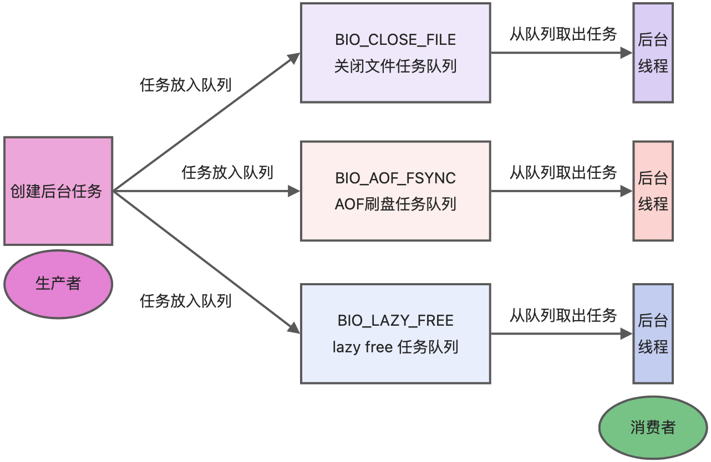

关闭文件、AOF 刷盘、释放内存这三个任务都有各自的任务队列：

- BIO_CLOSE_FILE，关闭文件任务队列：当队列有任务后，后台线程会调用 close(fd) ，将文件关闭；
- BIO_AOF_FSYNC，AOF刷盘任务队列：当 AOF 日志配置成 everysec 选项后，主线程会把 AOF 写日志操作封装成一个任务，也放到队列中。当发现队列有任务后，后台线程会调用 fsync(fd)，将 AOF 文件刷盘，
- BIO_LAZY_FREE，lazy free 任务队列：当队列有任务后，后台线程会 free(obj) 释放对象 / free(dict) 删除数据库所有对象 / free(skiplist) 释放跳表对象；

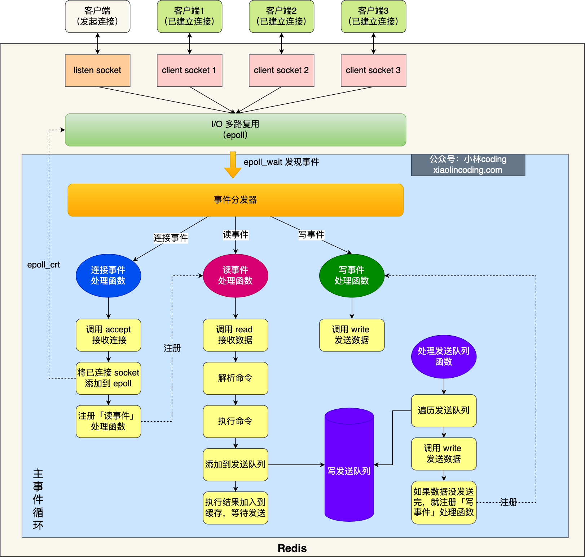

图中的蓝色部分是一个事件循环，是由主线程负责的，可以看到网络 I/O 和命令处理都是单线程。 Redis 初始化的时候，会做下面这几件事情：

- 首先，调用 epoll_create() 创建一个 epoll 对象和调用 socket() 创建一个服务端 socket
- 然后，调用 bind() 绑定端口和调用 listen() 监听该 socket；
- 然后，将调用 epoll_ctl() 将 listen socket 加入到 epoll，同时注册「连接事件」处理函数。

初始化完后，主线程就进入到一个**事件循环函数**，主要会做以下事情：

- 首先，先调用**处理发送队列函数**，看是发送队列里是否有任务，如果有发送任务，则通过 write 函数将客户端发送缓存区里的数据发送出去，如果这一轮数据没有发送完，就会注册写事件处理函数，等待 epoll_wait 发现可写后再处理 。
- 接着，调用 epoll_wait 函数等待事件的到来：
  - 如果是**连接事件**到来，则会调用**连接事件处理函数**，该函数会做这些事情：调用 accpet 获取已连接的 socket -> 调用 epoll_ctl 将已连接的 socket 加入到 epoll -> 注册「读事件」处理函数；
  - 如果是**读事件**到来，则会调用**读事件处理函数**，该函数会做这些事情：调用 read 获取客户端发送的数据 -> 解析命令 -> 处理命令 -> 将客户端对象添加到发送队列 -> 将执行结果写到发送缓存区等待发送；
  - 如果是**写事件**到来，则会调用**写事件处理函数**，该函数会做这些事情：通过 write 函数将客户端发送缓存区里的数据发送出去，如果这一轮数据没有发送完，就会继续注册写事件处理函数，等待 epoll_wait 发现可写后再处理 。


##  Redis 采用单线程为什么还这么快？

之所以 Redis 采用单线程（网络 I/O 和执行命令）那么快，有如下几个原因：

- Redis 的大部分操作**都在内存中完成**，并且采用了高效的数据结构，因此 Redis 瓶颈可能是机器的内存或者网络带宽，而并非 CPU，既然 CPU 不是瓶颈，那么自然就采用单线程的解决方案了；
- Redis 采用单线程模型可以**避免了多线程之间的竞争**，省去了多线程切换带来的时间和性能上的开销，而且也不会导致死锁问题。
- Redis 采用了 **I/O 多路复用机制**处理大量的客户端 Socket 请求，IO 多路复用机制是指一个线程处理多个 IO 流，就是我们经常听到的 select/epoll 机制。简单来说，在 Redis 只运行单线程的情况下，该机制允许内核中，同时存在多个监听 Socket 和已连接 Socket。内核会一直监听这些 Socket 上的连接请求或数据请求。一旦有请求到达，就会交给 Redis 线程处理，这就实现了一个 Redis 线程处理多个 IO 流的效果。


# Redis 持久化

## Redis 如何实现数据不丢失？

Redis 的读写操作都是在内存中，所以 Redis 性能才会高，但是当 Redis 重启后，内存中的数据就会丢失，那为了保证内存中的数据不会丢失，Redis 实现了数据持久化的机制，这个机制会把数据存储到磁盘，这样在 Redis 重启就能够从磁盘中恢复原有的数据。

Redis 共有三种数据持久化的方式：

- **AOF 日志**：每执行一条写操作命令，就把该命令以追加的方式写入到一个文件里；
- **RDB 快照**：将某一时刻的内存数据，以二进制的方式写入磁盘；
- **混合持久化方式**：Redis 4.0 新增的方式，集成了 AOF 和 RBD 的优点；


## AOF 日志是如何实现的？

Redis 在执行完一条写操作命令后，就会把该命令以追加的方式写入到一个文件里，然后 Redis 重启时，会读取该文件记录的命令，然后逐一执行命令的方式来进行数据恢复。

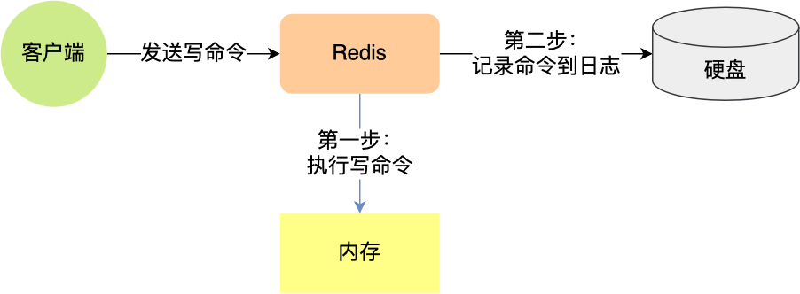


### 为什么先执行命令，再把数据写入日志呢？

Reids 是先执行写操作命令后，才将该命令记录到 AOF 日志里的，这么做其实有两个好处。

- **避免额外的检查开销**：因为如果先将写操作命令记录到 AOF 日志里，再执行该命令的话，如果当前的命令语法有问题，那么如果不进行命令语法检查，该错误的命令记录到 AOF 日志里后，Redis 在使用日志恢复数据时，就可能会出错。
- **不会阻塞当前写操作命令的执行**：因为当写操作命令执行成功后，才会将命令记录到 AOF 日志。

当然，这样做也会带来风险：

- **数据可能会丢失：** 执行写操作命令和记录日志是两个过程，那当 Redis 在还没来得及将命令写入到硬盘时，服务器发生宕机了，这个数据就会有丢失的风险。
- **可能阻塞其他操作：** 由于写操作命令执行成功后才记录到 AOF 日志，所以不会阻塞当前命令的执行，但因为 AOF 日志也是在主线程中执行，所以当 Redis 把日志文件写入磁盘的时候，还是会阻塞后续的操作无法执行。


### AOF 写回策略有几种？

先来看看，Redis 写入 AOF 日志的过程，如下图：

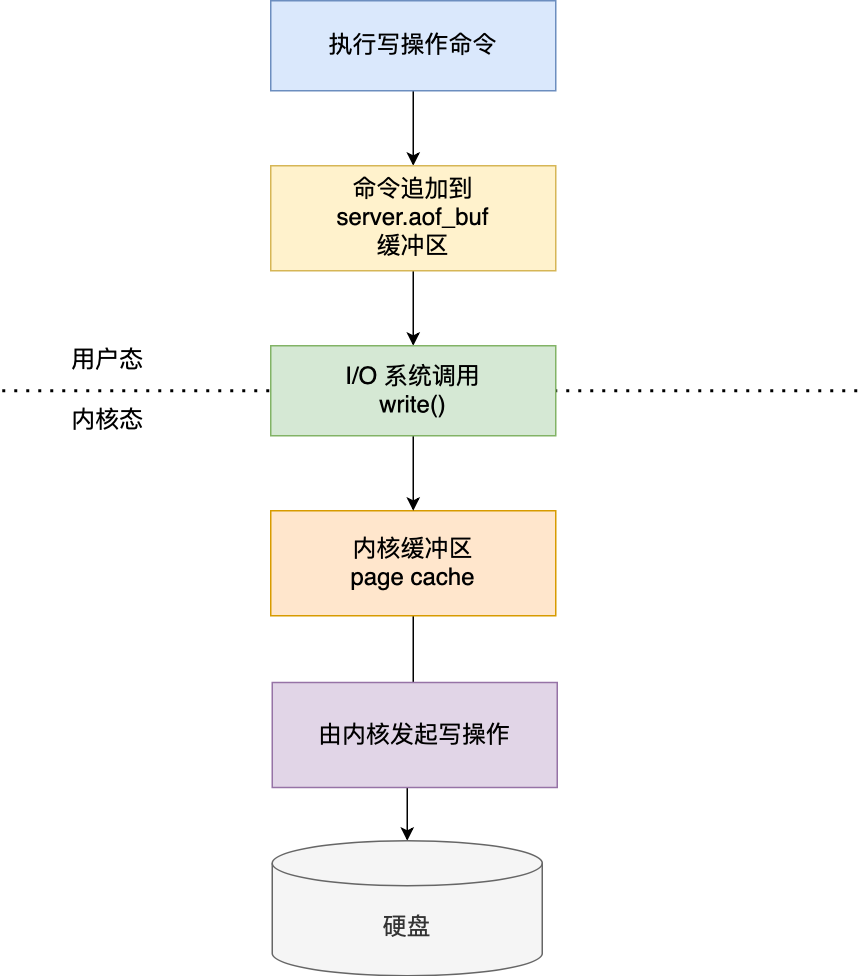

具体说说：

1. Redis 执行完写操作命令后，会将命令追加到 server.aof_buf 缓冲区；
2. 然后通过 write() 系统调用，将 aof_buf 缓冲区的数据写入到 AOF 文件，此时数据并没有写入到硬盘，而是拷贝到了内核缓冲区 page cache，等待内核将数据写入硬盘；
3. 具体内核缓冲区的数据什么时候写入到硬盘，由内核决定。

**Redis 提供了 3 种写回硬盘的策略，控制的就是上面说的第三步的过程。** 在 Redis.conf 配置文件中的 appendfsync 配置项可以有以下 3 种参数可填：

- **Always**，这个单词的意思是「总是」，所以它的意思是每次写操作命令执行完后，**同步**将 AOF 日志数据写回硬盘；
- **Everysec**，这个单词的意思是「每秒」，所以它的意思是每次写操作命令执行完后，先将命令写入到 AOF 文件的内核缓冲区，然后**每隔一秒**将缓冲区里的内容写回到硬盘；
- **No**，意味着不由 Redis 控制写回硬盘的时机，转交给操作系统控制写回的时机，也就是每次写操作命令执行完后，先将命令写入到 AOF 文件的内核缓冲区，再由操作系统决定何时将缓冲区内容写回硬盘。

我也把这 3 个写回策略的优缺点总结成了一张表格：

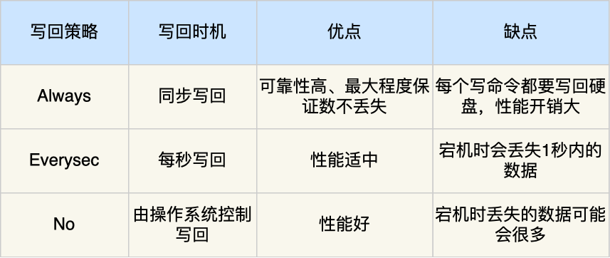


### AOF 日志过大，会触发什么机制？

#### AOF 重写

Redis 为了避免 AOF 文件越写越大，提供了 **AOF 重写机制**，当 AOF 文件的大小超过所设定的阈值后，Redis 就会启用 AOF 重写机制，来压缩 AOF 文件。

AOF 重写机制是在重写时，读取当前数据库中的所有键值对，然后将每一个键值对用一条命令记录到「新的 AOF 文件」，等到全部记录完后，就将新的 AOF 文件替换掉现有的 AOF 文件。

举个例子，在没有使用重写机制前，假设前后执行了「*set name xiaolin*」和「*set name xiaolincoding*」这两个命令的话，就会将这两个命令记录到 AOF 文件。

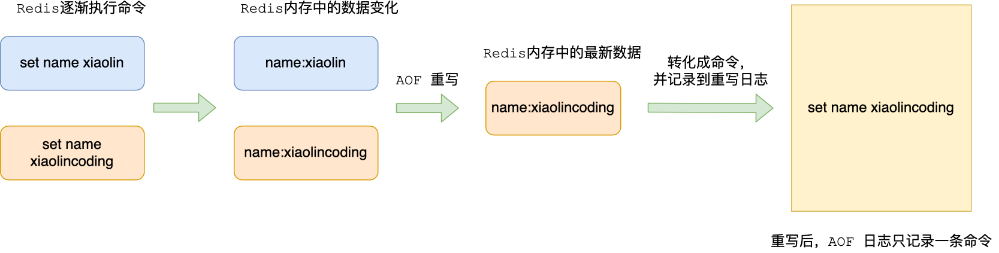

但是**在使用重写机制后，就会读取 name 最新的 value（键值对） ，然后用一条 「set name xiaolincoding」命令记录到新的 AOF 文件**，之前的第一个命令就没有必要记录了，因为它属于「历史」命令，没有作用了。这样一来，一个键值对在重写日志中只用一条命令就行了。

重写工作完成后，就会将新的 AOF 文件覆盖现有的 AOF 文件，这就相当于压缩了 AOF 文件，使得 AOF 文件体积变小了。


#### 重写 AOF 日志的过程是怎样的？

Redis 的**重写 AOF 过程是由后台子进程 \*bgrewriteaof\* 来完成的**，这么做可以达到两个好处：

- 子进程进行 AOF 重写期间，主进程可以继续处理命令请求，从而避免阻塞主进程；
- 子进程带有主进程的数据副本，这里使用子进程而不是线程，因为如果是使用线程，多线程之间会共享内存，那么在修改共享内存数据的时候，需要通过加锁来保证数据的安全，而这样就会降低性能。**而使用子进程，创建子进程时，父子进程是共享内存数据的，不过这个共享的内存只能以只读的方式，而当父子进程任意一方修改了该共享内存，就会发生「写时复制」，于是父子进程就有了独立的数据副本，就不用加锁来保证数据安全。**

触发重写机制后，主进程就会创建重写 AOF 的子进程，此时父子进程共享物理内存，重写子进程只会对这个内存进行只读，重写 AOF 子进程会读取数据库里的所有数据，并逐一把内存数据的键值对转换成一条命令，再将命令记录到重写日志（新的 AOF 文件）。

**但是重写过程中，主进程依然可以正常处理命令**，那问题来了，重写 AOF 日志过程中，如果主进程修改了已经存在 key-value，那么会发生写时复制，此时这个 key-value 数据在子进程的内存数据就跟主进程的内存数据不一致了，这时要怎么办呢？

为了解决这种数据不一致问题，Redis 设置了一个 **AOF 重写缓冲区**，这个缓冲区在创建 bgrewriteaof 子进程之后开始使用。

在重写 AOF 期间，当 Redis 执行完一个写命令之后，它会**同时将这个写命令写入到 「AOF 缓冲区」和 「AOF 重写缓冲区」**。

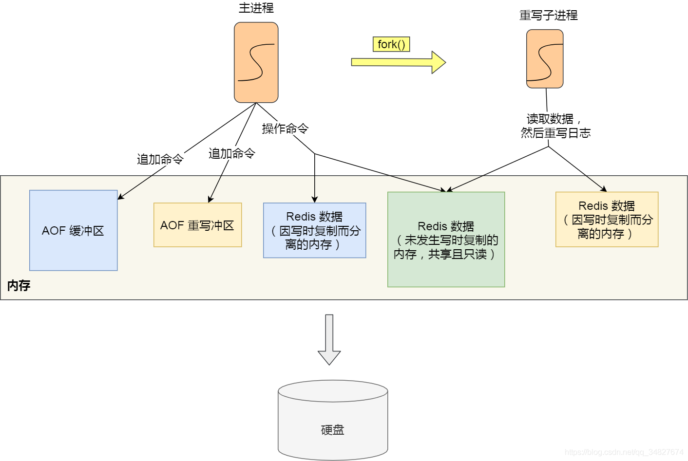

也就是说，在 bgrewriteaof 子进程执行 AOF 重写期间，主进程需要执行以下三个工作:

- 执行客户端发来的命令；
- 将执行后的写命令追加到 「AOF 缓冲区」；
- 将执行后的写命令追加到 「AOF 重写缓冲区」；

当子进程完成 AOF 重写工作（*扫描数据库中所有数据，逐一把内存数据的键值对转换成一条命令，再将命令记录到重写日志*）后，会向主进程发送一条信号，信号是进程间通讯的一种方式，且是异步的。

主进程收到该信号后，会调用一个信号处理函数，该函数主要做以下工作：

- 将 AOF 重写缓冲区中的所有内容追加到新的 AOF 的文件中，使得新旧两个 AOF 文件所保存的数据库状态一致；
- 新的 AOF 的文件进行改名，覆盖现有的 AOF 文件。

信号函数执行完后，主进程就可以继续像往常一样处理命令了。


## RDB 快照是如何实现的呢？

因为 AOF 日志记录的是操作命令，不是实际的数据，所以用 AOF 方法做故障恢复时，需要全量把日志都执行一遍，一旦 AOF 日志非常多，势必会造成 Redis 的恢复操作缓慢。

为了解决这个问题，Redis 增加了 RDB 快照。所谓的快照，就是记录某一个瞬间东西，比如当我们给风景拍照时，那一个瞬间的画面和信息就记录到了一张照片。

**所以，RDB 快照就是记录某一个瞬间的内存数据，记录的是实际数据，而 AOF 文件记录的是命令操作的日志，而不是实际的数据。**

因此在 Redis 恢复数据时， RDB 恢复数据的效率会比 AOF 高些，因为直接将 RDB 文件读入内存就可以，不需要像 AOF 那样还需要额外执行操作命令的步骤才能恢复数据。


### RDB 做快照时会阻塞线程吗？

Redis 提供了两个命令来生成 RDB 文件，分别是 save 和 bgsave，他们的区别就在于是否在「主线程」里执行：

- 执行了 save 命令，就会在**主线程生成 RDB 文件**，由于和执行操作命令在同一个线程，所以如果写入 RDB 文件的时间太长，**会阻塞主线程**；
- 执行了 bgsave 命令，会创建一个子进程来生成 RDB 文件，这样可以**避免主线程的阻塞**；

这里提一点，Redis 的快照是**全量快照**，也就是说每次执行快照，都是把内存中的「所有数据」都记录到磁盘中。所以执行快照是一个比较重的操作，如果频率太频繁，可能会对 Redis 性能产生影响。如果频率太低，服务器故障时，丢失的数据会更多。


### RDB 在执行快照的时候，数据能修改吗？

可以的，执行 bgsave 过程中，Redis 依然**可以继续处理操作命令**的，也就是数据是能被修改的，关键的技术就在于**写时复制技术（Copy-On-Write, COW）。**

执行 bgsave 命令的时候，会通过 fork() 创建子进程，此时子进程和父进程是共享同一片内存数据的，因为创建子进程的时候，会复制父进程的页表，但是页表指向的物理内存还是一个，此时如果主线程执行读操作，则主线程和 bgsave 子进程互相不影响。

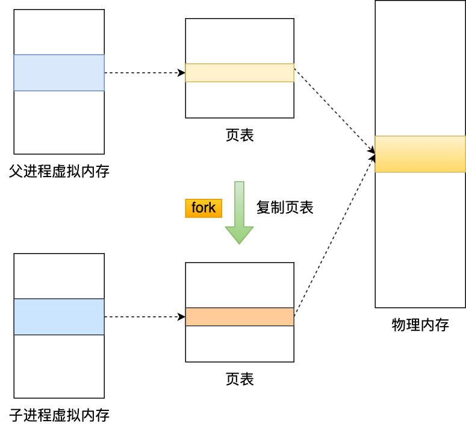

如果主线程执行写操作，则被修改的数据会复制一份副本，然后 bgsave 子进程会把该副本数据写入 RDB 文件，在这个过程中，主线程仍然可以直接修改原来的数据。

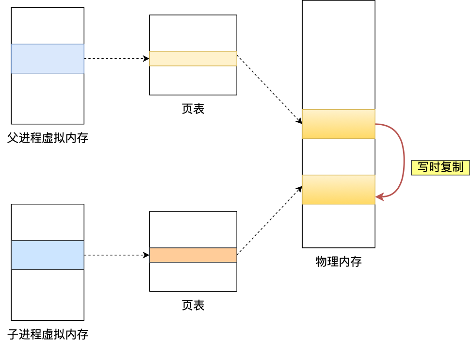


## 为什么会有混合持久化？

**原因**

- RDB 优点是数据恢复速度快，但是快照的频率不好把握。频率太低，丢失的数据就会比较多，频率太高，就会影响性能。

- AOF 优点是丢失数据少，但是数据恢复不快。

为了集成了两者的优点， Redis 4.0 提出了**混合使用 AOF 日志和内存快照**，也叫混合持久化，既保证了 Redis 重启速度，又降低数据丢失风险。

混合持久化工作在 **AOF 日志重写过程**，当开启了混合持久化时，在 AOF 重写日志时，fork 出来的重写子进程会先将与主线程共享的内存数据以 RDB 方式写入到 AOF 文件，然后主线程处理的操作命令会被记录在重写缓冲区里，重写缓冲区里的增量命令会以 AOF 方式写入到 AOF 文件，写入完成后通知主进程将新的含有 RDB 格式和 AOF 格式的 AOF 文件替换旧的的 AOF 文件。

也就是说，使用了混合持久化，AOF 文件的**前半部分是 RDB 格式的全量数据，后半部分是 AOF 格式的增量数据**。


这样的好处在于，重启 Redis 加载数据的时候，由于前半部分是 RDB 内容，这样**加载的时候速度会很快**。

加载完 RDB 的内容后，才会加载后半部分的 AOF 内容，这里的内容是 Redis 后台子进程重写 AOF 期间，主线程处理的操作命令，可以使得**数据更少的丢失**。

**混合持久化优点：**

- 混合持久化结合了 RDB 和 AOF 持久化的优点，开头为 RDB 的格式，使得 Redis 可以更快的启动，同时结合 AOF 的优点，有减低了大量数据丢失的风险。

**混合持久化缺点：**

- AOF 文件中添加了 RDB 格式的内容，使得 AOF 文件的可读性变得很差；
- 兼容性差，如果开启混合持久化，那么此混合持久化 AOF 文件，就不能用在 Redis 4.0 之前版本了。


# Redis 集群

## Redis 如何实现服务高可用？

要想设计一个高可用的 Redis 服务，一定要从 Redis 的多服务节点来考虑，比如 Redis 的**主从复制、哨兵模式、切片集群**。


### 主从复制

主从复制是 Redis 高可用服务的最基础的保证，实现方案就是将从前的一台 Redis 服务器，同步数据到多台从 Redis 服务器上，**即一主多从的模式，且主从服务器之间采用的是「读写分离」的方式。**

主服务器可以进行读写操作，当发生写操作时自动将写操作同步给从服务器，而从服务器一般是只读，并接受主服务器同步过来写操作命令，然后执行这条命令。

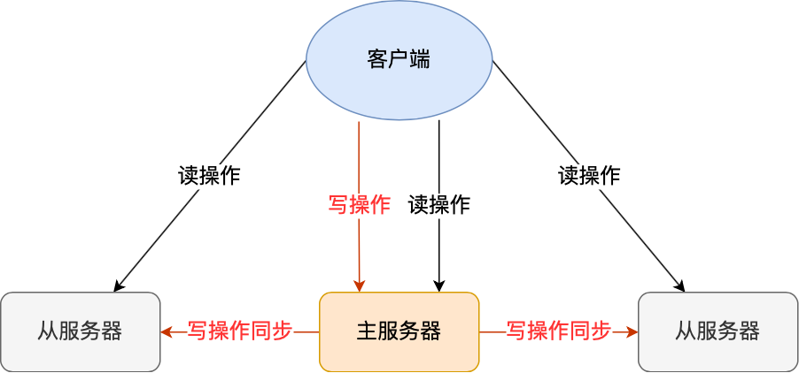

也就是说，所有的数据修改只在主服务器上进行，然后将最新的数据同步给从服务器，这样就使得主从服务器的数据是一致的。

注意，主从服务器之间的命令复制是**异步**进行的。

具体来说，在主从服务器命令传播阶段，主服务器收到新的写命令后，会发送给从服务器。但是，主服务器并不会等到从服务器实际执行完命令后，再把结果返回给客户端，而是主服务器自己在本地执行完命令后，就会向客户端返回结果了。**如果从服务器还没有执行主服务器同步过来的命令，主从服务器间的数据就不一致了。**

所以，无法实现强一致性保证（主从数据时时刻刻保持一致），数据不一致是难以避免的。


#### 第一次同步

多台服务器之间要通过什么方式来确定谁是主服务器，或者谁是从服务器呢？

我们可以使用 `replicaof`（Redis 5.0 之前使用 slaveof）命令形成主服务器和从服务器的关系。

比如，现在有服务器 A 和 服务器 B，我们在服务器 B 上执行下面这条命令：

```text
# 服务器 B 执行这条命令
replicaof <服务器 A 的 IP 地址> <服务器 A 的 Redis 端口号>
```

接着，服务器 B 就会变成服务器 A 的「从服务器」，然后与主服务器进行第一次同步。

主从服务器间的第一次同步的过程可分为三个阶段：

- 第一阶段是建立链接、协商同步；
- 第二阶段是主服务器同步数据给从服务器；
- 第三阶段是主服务器发送新写操作命令给从服务器。

为了让你更清楚了解这三个阶段，我画了一张图。

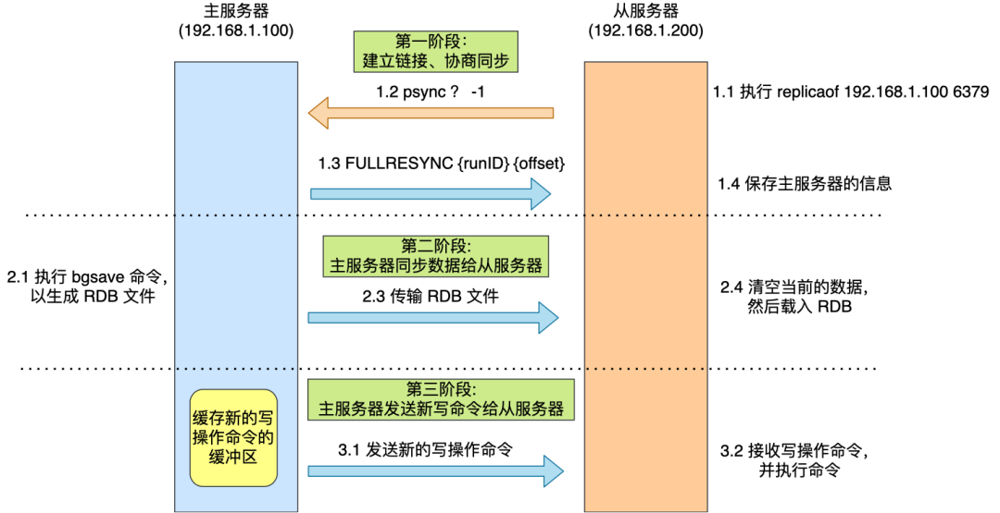

接下来，我在具体介绍每一个阶段都做了什么。

*第一阶段：建立链接、协商同步*

执行了 replicaof 命令后，从服务器就会给主服务器发送 `psync` 命令，表示要进行数据同步。

psync 命令包含两个参数，分别是**主服务器的 runID** 和**复制进度 offset**。

- runID，每个 Redis 服务器在启动时都会自动生产一个随机的 ID 来唯一标识自己。当从服务器和主服务器第一次同步时，因为不知道主服务器的 run ID，所以将其设置为 "?"。
- offset，表示复制的进度，第一次同步时，其值为 -1。

主服务器收到 psync 命令后，会用 `FULLRESYNC` 作为响应命令返回给对方。

并且这个响应命令会带上两个参数：主服务器的 runID 和主服务器目前的复制进度 offset。从服务器收到响应后，会记录这两个值。

FULLRESYNC 响应命令的意图是采用**全量复制**的方式，也就是主服务器会把所有的数据都同步给从服务器。

所以，第一阶段的工作时为了全量复制做准备。

那具体怎么全量同步呀呢？我们可以往下看第二阶段。


*第二阶段：主服务器同步数据给从服务器*

接着，主服务器会执行 bgsave 命令来生成 RDB 文件，然后把文件发送给从服务器。

从服务器收到 RDB 文件后，会先清空当前的数据，然后载入 RDB 文件。

这里有一点要注意，主服务器生成 RDB 这个过程是不会阻塞主线程的，因为 bgsave 命令是产生了一个子进程来做生成 RDB 文件的工作，是异步工作的，这样 Redis 依然可以正常处理命令。

但是，这期间的写操作命令并没有记录到刚刚生成的 RDB 文件中，这时主从服务器间的数据就不一致了。

那么为了保证主从服务器的数据一致性，**主服务器在下面这三个时间间隙中将收到的写操作命令，写入到 replication buffer 缓冲区里**：

- 主服务器生成 RDB 文件期间；
- 主服务器发送 RDB 文件给从服务器期间；
- 「从服务器」加载 RDB 文件期间；


*第三阶段：主服务器发送新写操作命令给从服务器*

在主服务器生成的 RDB 文件发送完，从服务器收到 RDB 文件后，丢弃所有旧数据，将 RDB 数据载入到内存。完成 RDB 的载入后，会回复一个确认消息给主服务器。

接着，主服务器将 replication buffer 缓冲区里所记录的写操作命令发送给从服务器，从服务器执行来自主服务器 replication buffer 缓冲区里发来的命令，这时主从服务器的数据就一致了。

至此，主从服务器的第一次同步的工作就完成了。


#### 命令传播

主从服务器在完成第一次同步后，双方之间就会维护一个 TCP 连接。

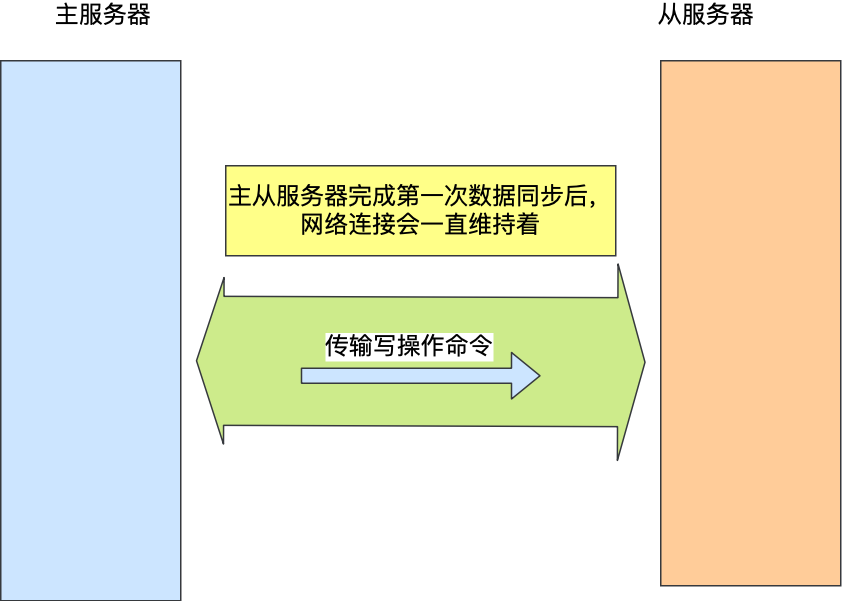

后续主服务器可以通过这个连接继续将写操作命令传播给从服务器，然后从服务器执行该命令，使得与主服务器的数据库状态相同。

而且这个连接是长连接的，目的是避免频繁的 TCP 连接和断开带来的性能开销。

上面的这个过程被称为**基于长连接的命令传播**，通过这种方式来保证第一次同步后的主从服务器的数据一致性。


#### 分摊主服务器的压力

在前面的分析中，我们可以知道主从服务器在第一次数据同步的过程中，主服务器会做两件耗时的操作：生成 RDB 文件和传输 RDB 文件。

主服务器是可以有多个从服务器的，如果从服务器数量非常多，而且都与主服务器进行全量同步的话，就会带来两个问题：

- 由于是通过 bgsave 命令来生成 RDB 文件的，那么主服务器就会忙于使用 fork() 创建子进程，如果主服务器的内存数据非大，在执行 fork() 函数时是会阻塞主线程的，从而使得 Redis 无法正常处理请求；
- 传输 RDB 文件会占用主服务器的网络带宽，会对主服务器响应命令请求产生影响。

这种情况就好像，刚创业的公司，由于人不多，所以员工都归老板一个人管，但是随着公司的发展，人员的扩充，老板慢慢就无法承担全部员工的管理工作了。

要解决这个问题，老板就需要设立经理职位，由经理管理多名普通员工，然后老板只需要管理经理就好。

Redis 也是一样的，从服务器可以有自己的从服务器，我们可以把拥有从服务器的从服务器当作经理角色，它不仅可以接收主服务器的同步数据，自己也可以同时作为主服务器的形式将数据同步给从服务器，组织形式如下图：

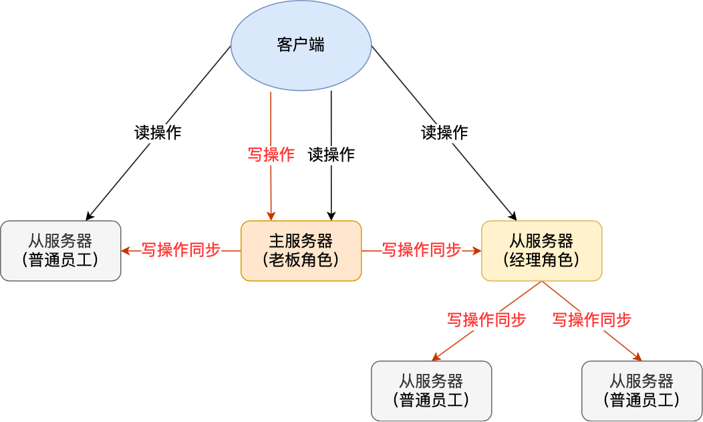

通过这种方式，**主服务器生成 RDB 和传输 RDB 的压力可以分摊到充当经理角色的从服务器**。

那具体怎么做到的呢？

其实很简单，我们在「从服务器」上执行下面这条命令，使其作为目标服务器的从服务器：

```text
replicaof <目标服务器的IP> 6379
```

此时如果目标服务器本身也是「从服务器」，那么该目标服务器就会成为「经理」的角色，不仅可以接受主服务器同步的数据，也会把数据同步给自己旗下的从服务器，从而减轻主服务器的负担。


#### 增量复制

主从服务器在完成第一次同步后，就会基于长连接进行命令传播。

可是，网络总是不按套路出牌的嘛，说延迟就延迟，说断开就断开。

如果主从服务器间的网络连接断开了，那么就无法进行命令传播了，这时从服务器的数据就没办法和主服务器保持一致了，客户端就可能从「从服务器」读到旧的数据。

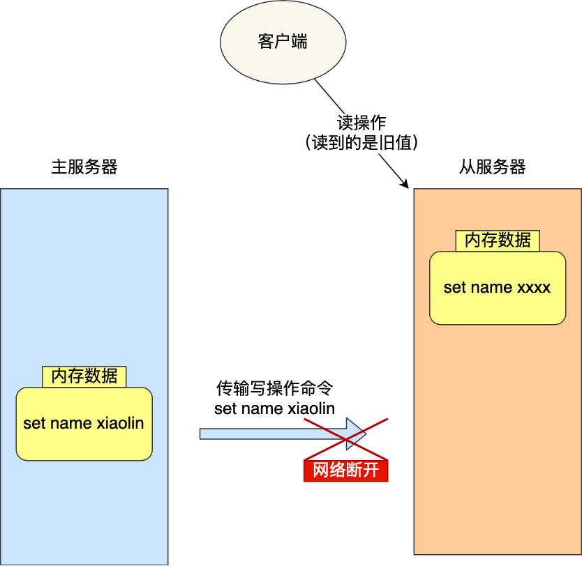

那么问题来了，如果此时断开的网络，又恢复正常了，要怎么继续保证主从服务器的数据一致性呢？

在 Redis 2.8 之前，如果主从服务器在命令同步时出现了网络断开又恢复的情况，从服务器就会和主服务器重新进行一次全量复制，很明显这样的开销太大了，必须要改进一波。

所以，从 Redis 2.8 开始，网络断开又恢复后，从主从服务器会采用**增量复制**的方式继续同步，也就是只会把网络断开期间主服务器接收到的写操作命令，同步给从服务器。

网络恢复后的增量复制过程如下图：

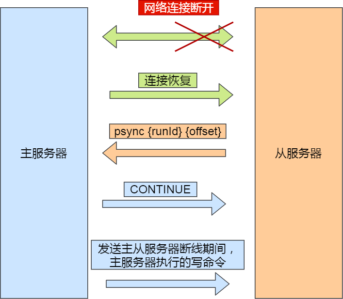

主要有三个步骤：

- 从服务器在恢复网络后，会发送 psync 命令给主服务器，此时的 psync 命令里的 offset 参数不是 -1；
- 主服务器收到该命令后，然后用 CONTINUE 响应命令告诉从服务器接下来采用增量复制的方式同步数据；
- 然后主服务将主从服务器断线期间，所执行的写命令发送给从服务器，然后从服务器执行这些命令。

那么关键的问题来了，**主服务器怎么知道要将哪些增量数据发送给从服务器呢？**

答案藏在这两个东西里：

- **repl_backlog_buffer**，是一个「**环形**」缓冲区，用于主从服务器断连后，从中找到差异的数据；
- **replication offset**，标记上面那个缓冲区的同步进度，主从服务器都有各自的偏移量，主服务器使用 master_repl_offset 来记录自己「*写*」到的位置，从服务器使用 slave_repl_offset 来记录自己「*读*」到的位置。

那 repl_backlog_buffer 缓冲区是什么时候写入的呢？

在主服务器进行命令传播时，不仅会将写命令发送给从服务器，还会将写命令写入到 repl_backlog_buffer 缓冲区里，因此 这个缓冲区里会保存着最近传播的写命令。

网络断开后，当从服务器重新连上主服务器时，从服务器会通过 psync 命令将自己的复制偏移量 slave_repl_offset 发送给主服务器，主服务器根据自己的 master_repl_offset 和 slave_repl_offset 之间的差距，然后来决定对从服务器执行哪种同步操作：

- 如果判断出从服务器要读取的数据还在 repl_backlog_buffer 缓冲区里，那么主服务器将采用**增量同步**的方式；
- 相反，如果判断出从服务器要读取的数据已经不存在 repl_backlog_buffer 缓冲区里，那么主服务器将采用**全量同步**的方式。

当主服务器在 repl_backlog_buffer 中找到主从服务器差异（增量）的数据后，就会将增量的数据写入到 replication buffer 缓冲区，这个缓冲区我们前面也提到过，它是缓存将要传播给从服务器的命令。

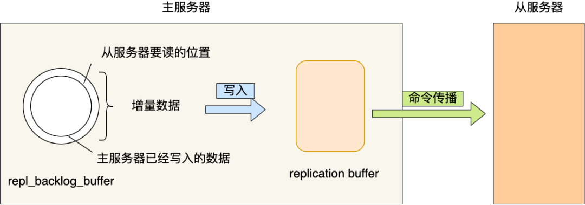

repl_backlog_buffer 缓行缓冲区的默认大小是 1M，并且由于它是一个环形缓冲区，所以当缓冲区写满后，主服务器继续写入的话，就会覆盖之前的数据。因此，当主服务器的写入速度远超于从服务器的读取速度，缓冲区的数据一下就会被覆盖。

那么在网络恢复时，如果从服务器想读的数据已经被覆盖了，主服务器就会采用全量同步，这个方式比增量同步的性能损耗要大很多。

因此，**为了避免在网络恢复时，主服务器频繁地使用全量同步的方式，我们应该调整下 repl_backlog_buffer 缓冲区大小，尽可能的大一些**，减少出现从服务器要读取的数据被覆盖的概率，从而使得主服务器采用增量同步的方式。


#### 总结

主从复制共有三种模式：**全量复制、基于长连接的命令传播、增量复制**。

主从服务器第一次同步的时候，就是采用全量复制，此时主服务器会两个耗时的地方，分别是生成 RDB 文件和传输 RDB 文件。为了避免过多的从服务器和主服务器进行全量复制，可以把一部分从服务器升级为「经理角色」，让它也有自己的从服务器，通过这样可以分摊主服务器的压力。

第一次同步完成后，主从服务器都会维护着一个长连接，主服务器在接收到写操作命令后，就会通过这个连接将写命令传播给从服务器，来保证主从服务器的数据一致性。

如果遇到网络断开，增量复制就可以上场了，不过这个还跟 repl_backlog_size 这个大小有关系。

如果它配置的过小，主从服务器网络恢复时，可能发生「从服务器」想读的数据已经被覆盖了，那么这时就会导致主服务器采用全量复制的方式。所以为了避免这种情况的频繁发生，要调大这个参数的值，以降低主从服务器断开后全量同步的概率。


### 哨兵模式

在使用 Redis 主从服务的时候，会有一个问题，就是当 Redis 的主从服务器出现故障宕机时，需要手动进行恢复。

为了解决这个问题，Redis 增加了哨兵模式（**Redis Sentinel**），因为哨兵模式做到了可以监控主从服务器，并且提供**主从节点故障转移的功能。**

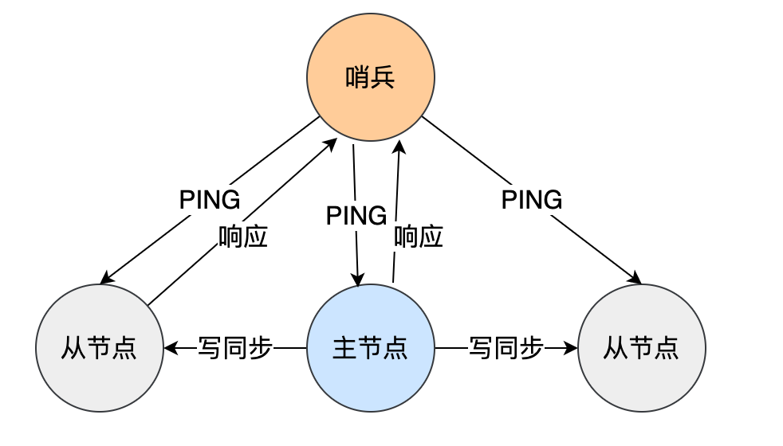


### 切片集群模式

当 Redis 缓存数据量大到一台服务器无法缓存时，就需要使用 **Redis 切片集群**（Redis Cluster ）方案，它将数据分布在不同的服务器上，以此来降低系统对单主节点的依赖，从而提高 Redis 服务的读写性能。

Redis Cluster 方案采用哈希槽（Hash Slot），来处理数据和节点之间的映射关系。在 Redis Cluster 方案中，**一个切片集群共有 16384 个哈希槽**，这些哈希槽类似于数据分区，每个键值对都会根据它的 key，被映射到一个哈希槽中，具体执行过程分为两大步：

- 根据键值对的 key，按照 **CRC16 算法**计算一个 16 bit 的值。
- 再用 16bit 值对 16384 取模，得到 0~16383 范围内的模数，每个模数代表一个相应编号的哈希槽。

接下来的问题就是，这些哈希槽怎么被映射到具体的 Redis 节点上的呢？有两种方案：

- **平均分配：** 在使用 cluster create 命令创建 Redis 集群时，Redis 会自动把所有哈希槽平均分布到集群节点上。比如集群中有 9 个节点，则每个节点上槽的个数为 16384/9 个。
- **手动分配：** 可以使用 cluster meet 命令手动建立节点间的连接，组成集群，再使用 cluster addslots 命令，指定每个节点上的哈希槽个数。

为了方便你的理解，我通过一张图来解释数据、哈希槽，以及节点三者的映射分布关系。

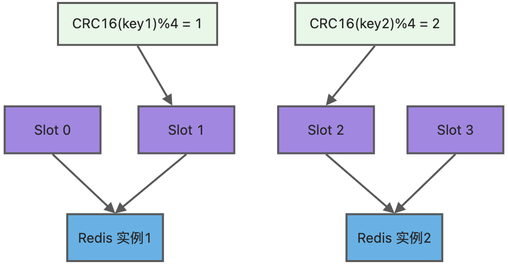

上图中的切片集群一共有 2 个节点，假设有 4 个哈希槽（Slot 0～Slot 3）时，我们就可以通过命令手动分配哈希槽，比如节点 1 保存哈希槽 0 和 1，节点 2 保存哈希槽 2 和 3。

```c
redis-cli -h 192.168.1.10 –p 6379 cluster addslots 0,1
redis-cli -h 192.168.1.11 –p 6379 cluster addslots 2,3
```

然后在集群运行的过程中，key1 和 key2 计算完 CRC16 值后，对哈希槽总个数 4 进行取模，再根据各自的模数结果，就可以被映射到哈希槽 1（对应节点1） 和 哈希槽 2（对应节点2）。

需要注意的是，在手动分配哈希槽时，需要把 16384 个槽都分配完，否则 Redis 集群无法正常工作。


## 集群脑裂导致数据丢失怎么办？

### 什么是脑裂？

先来理解集群的脑裂现象，这就好比一个人有两个大脑，那么到底受谁控制呢？

那么在 Redis 中，集群脑裂产生数据丢失的现象是怎样的呢？

在 Redis 主从架构中，部署方式一般是「一主多从」，主节点提供写操作，从节点提供读操作。 如果主节点的网络突然发生了问题，它与所有的从节点都失联了**，但是此时的主节点和客户端的网络是正常的，这个客户端并不知道 Redis 内部已经出现了问题，**还在照样的向这个失联的主节点写数据（过程A），此时这些数据被旧主节点缓存到了缓冲区里，因为主从节点之间的网络问题，这些数据都是无法同步给从节点的。

这时，哨兵也发现主节点失联了，它就认为主节点挂了（但实际上主节点正常运行，只是网络出问题了），于是哨兵就会在「从节点」中选举出一个 leader 作为主节点，这时集群就有两个主节点了 —— **脑裂出现了**。

然后，网络突然好了，哨兵因为之前已经选举出一个新主节点了，它就会把旧主节点降级为从节点（A），然后从节点（A）会向新主节点请求数据同步，**因为第一次同步是全量同步的方式，此时的从节点（A）会清空掉自己本地的数据，然后再做全量同步。所以，之前客户端在过程 A 写入的数据就会丢失了，也就是集群产生脑裂数据丢失的问题**。

总结一句话就是：由于网络问题，集群节点之间失去联系。主从数据不同步；重新平衡选举，产生两个主服务。等网络恢复，旧主节点会降级为从节点，再与新主节点进行同步复制的时候，由于会从节点会清空自己的缓冲区，所以导致之前客户端写入的数据丢失了。


### 解决方案

**当主节点发现从节点下线或者通信超时的总数量小于阈值时，那么禁止主节点进行写数据，直接把错误返回给客户端。**

在 Redis 的配置文件中有两个参数我们可以设置：

- min-slaves-to-write x，主节点必须要有至少 x 个从节点连接，如果小于这个数，主节点会禁止写数据。
- min-slaves-max-lag x，主从数据复制和同步的延迟不能超过 x 秒，如果超过，主节点会禁止写数据。

我们可以把 min-slaves-to-write 和 min-slaves-max-lag 这两个配置项搭配起来使用，分别给它们设置一定的阈值，假设为 N 和 T。

这两个配置项组合后的要求是，主库连接的从库中至少有 N 个从库，和主库进行数据复制时的 ACK 消息延迟不能超过 T 秒，否则，主库就不会再接收客户端的写请求了。

即使原主库是假故障，它在假故障期间也无法响应哨兵心跳，也不能和从库进行同步，自然也就无法和从库进行 ACK 确认了。这样一来，min-slaves-to-write 和 min-slaves-max-lag 的组合要求就无法得到满足，**原主库就会被限制接收客户端写请求，客户端也就不能在原主库中写入新数据了**。

**等到新主库上线时，就只有新主库能接收和处理客户端请求，此时，新写的数据会被直接写到新主库中。而原主库会被哨兵降为从库，即使它的数据被清空了，也不会有新数据丢失。**

再来举个例子。

假设我们将 min-slaves-to-write 设置为 1，把 min-slaves-max-lag 设置为 12s，把哨兵的 down-after-milliseconds 设置为 10s，主库因为某些原因卡住了 15s，导致哨兵判断主库客观下线，开始进行主从切换。

同时，因为原主库卡住了 15s，没有一个从库能和原主库在 12s 内进行数据复制，原主库也无法接收客户端请求了。

这样一来，主从切换完成后，也只有新主库能接收请求，不会发生脑裂，也就不会发生数据丢失的问题了。


# Redis 缓存


## redis缓存怎么使用的


## 什么是缓存雪崩、击穿、穿透？

用户的数据一般都是存储于数据库，数据库的数据是落在磁盘上的，磁盘的读写速度可以说是计算机里最慢的硬件了。

当用户的请求，都访问数据库的话，请求数量一上来，数据库很容易就奔溃的了，所以为了避免用户直接访问数据库，会用 Redis 作为缓存层。

因为 Redis 是内存数据库，我们可以将数据库的数据缓存在 Redis 里，相当于数据缓存在内存，内存的读写速度比硬盘快好几个数量级，这样大大提高了系统性能。

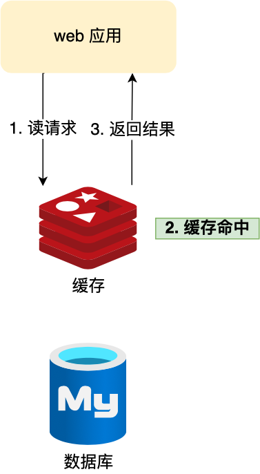

引入了缓存层，就会有缓存异常的三个问题，分别是**缓存雪崩、缓存击穿、缓存穿透**。

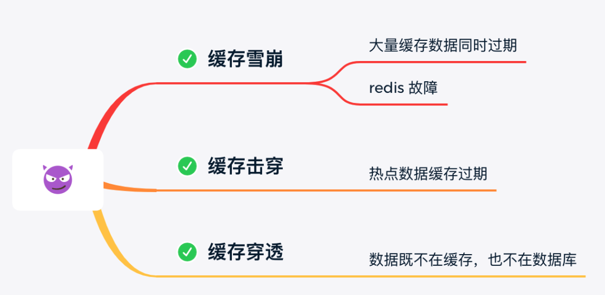

### 缓存雪崩

通常我们为了保证缓存中的数据与数据库中的数据一致性，会给 Redis 里的数据设置过期时间，当缓存数据过期后，用户访问的数据如果不在缓存里，业务系统需要重新生成缓存，因此就会访问数据库，并将数据更新到 Redis 里，这样后续请求都可以直接命中缓存。

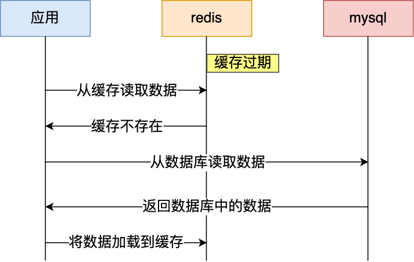

那么，当**大量缓存数据在同一时间过期（失效）或者 Redis 故障宕机**时，如果此时有大量的用户请求，都无法在 Redis 中处理，于是全部请求都直接访问数据库，从而导致数据库的压力骤增，严重的会造成数据库宕机，从而形成一系列连锁反应，造成整个系统崩溃，这就是**缓存雪崩**的问题。

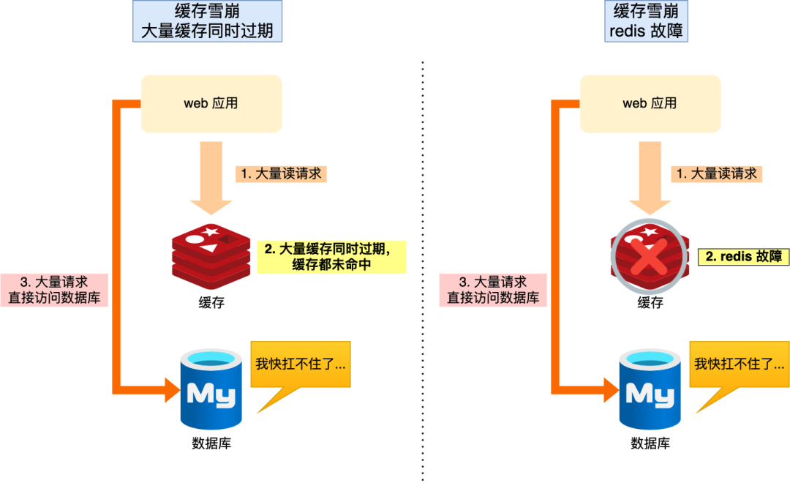

可以看到，发生缓存雪崩有两个原因：

- 大量数据同时过期；
- Redis 故障宕机；

不同的诱因，应对的策略也会不同。


#### 大量数据同时过期

针对大量数据同时过期而引发的缓存雪崩问题，常见的应对方法有下面这几种：

- 均匀设置过期时间；
- 互斥锁；
- 双 key 策略；
- 后台更新缓存；


##### 均匀设置过期时间

如果要给缓存数据设置过期时间，应该避免将大量的数据设置成同一个过期时间。我们可以在对缓存数据设置过期时间时，**给这些数据的过期时间加上一个随机数**，这样就保证数据不会在同一时间过期。


##### 互斥锁

当业务线程在处理用户请求时，**如果发现访问的数据不在 Redis 里，就加个互斥锁，保证同一时间内只有一个请求来构建缓存**（从数据库读取数据，再将数据更新到 Redis 里），当缓存构建完成后，再释放锁。**未能获取互斥锁的请求，要么等待锁释放后重新读取缓存，要么就返回空值或者默认值。**

实现互斥锁的时候，最好设置**超时时间**，不然第一个请求拿到了锁，然后这个请求发生了某种意外而一直阻塞，一直不释放锁，这时其他请求也一直拿不到锁，整个系统就会出现无响应的现象。


##### 双 key 策略

我们对缓存数据可以使用两个 key，一个是**主 key，会设置过期时间**，一个是**备 key，不会设置过期**，它们只是 key 不一样，但是 value 值是一样的，相当于给缓存数据做了个副本。

当业务线程访问不到「主 key 」的缓存数据时，就直接返回「备 key 」的缓存数据，然后在更新缓存的时候，**同时更新「主 key 」和「备 key 」的数据。**

双 key 策略的好处是，当主 key 过期了，有大量请求获取缓存数据的时候，直接返回备 key 的数据，这样可以快速响应请求。而不用因为 key 失效而导致大量请求被锁阻塞住（采用了互斥锁，仅一个请求来构建缓存），后续再通知后台线程，重新构建主 key 的数据。


##### 后台更新缓存

业务线程不再负责更新缓存，缓存也不设置有效期，而是**让缓存“永久有效”，并将更新缓存的工作交由后台线程定时更新**。

事实上，缓存数据不设置有效期，并不是意味着数据一直能在内存里，因为**当系统内存紧张的时候，有些缓存数据会被“淘汰”**，而在缓存被“淘汰”到下一次后台定时更新缓存的这段时间内，业务线程读取缓存失败就返回空值，业务的视角就以为是数据丢失了。

解决上面的问题的方式有两种。

- 第一种方式，后台线程不仅负责定时更新缓存，而且也负责**频繁地检测缓存是否有效**，检测到缓存失效了，原因可能是系统紧张而被淘汰的，于是就要马上从数据库读取数据，并更新到缓存。

这种方式的检测时间间隔不能太长，太长也导致用户获取的数据是一个空值而不是真正的数据，所以检测的间隔最好是毫秒级的，但是总归是有个间隔时间，用户体验一般。

- 第二种方式，在业务线程发现缓存数据失效后（缓存数据被淘汰），**通过消息队列发送一条消息通知后台线程更新缓存**，后台线程收到消息后，在更新缓存前可以判断缓存是否存在，存在就不执行更新缓存操作；不存在就读取数据库数据，并将数据加载到缓存。这种方式相比第一种方式缓存的更新会更及时，用户体验也比较好。

在业务刚上线的时候，我们最好提前把数据缓起来，而不是等待用户访问才来触发缓存构建，这就是所谓的**缓存预热**，后台更新缓存的机制刚好也适合干这个事情。


#### Redis 故障宕机

针对 Redis 故障宕机而引发的缓存雪崩问题，常见的应对方法有下面这几种：

- 服务熔断或请求限流机制；
- 构建 Redis 缓存高可靠集群；


##### 服务熔断或请求限流机制

因为 Redis 故障宕机而导致缓存雪崩问题时，我们可以启动**服务熔断**机制，**暂停业务应用对缓存服务的访问，直接返回错误**，不用再继续访问数据库，从而降低对数据库的访问压力，保证数据库系统的正常运行，然后等到 Redis 恢复正常后，再允许业务应用访问缓存服务。

服务熔断机制是保护数据库的正常允许，但是暂停了业务应用访问缓存服系统，全部业务都无法正常工作

为了减少对业务的影响，我们可以启用**请求限流**机制，**只将少部分请求发送到数据库进行处理，再多的请求就在入口直接拒绝服务**，等到 Redis 恢复正常并把缓存预热完后，再解除请求限流的机制。


##### 构建 Redis 缓存高可靠集群

服务熔断或请求限流机制是缓存雪崩发生后的应对方案，我们最好通过**主从节点的方式构建 Redis 缓存高可靠集群**。

如果 Redis 缓存的主节点故障宕机，从节点可以切换成为主节点，继续提供缓存服务，避免了由于 Redis 故障宕机而导致的缓存雪崩问题。


### 缓存击穿

我们的业务通常会有几个数据会被频繁地访问，比如秒杀活动，这类被频地访问的数据被称为热点数据。

如果缓存中的**某个热点数据过期**了，此时大量的请求访问了该热点数据，就无法从缓存中读取，导致直接访问数据库，数据库很容易就被高并发的请求冲垮，这就是**缓存击穿**的问题。

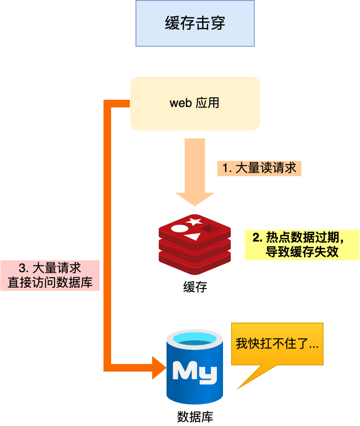

可以发现缓存击穿跟缓存雪崩很相似，你可以认为缓存击穿是缓存雪崩的一个子集。

应对缓存击穿可以采取前面说到两种方案：

- 互斥锁方案，保证同一时间只有一个业务线程更新缓存，未能获取互斥锁的请求，要么等待锁释放后重新读取缓存，要么就返回空值或者默认值。
- 不给热点数据设置过期时间，由后台异步更新缓存，或者在热点数据准备要过期前，提前通知后台线程更新缓存以及重新设置过期时间；


### 缓存穿透

当发生缓存雪崩或击穿时，数据库中还是保存了应用要访问的数据，一旦缓存恢复相对应的数据，就可以减轻数据库的压力，而缓存穿透就不一样了。

当用户访问的数据，**既不在缓存中，也不在数据库中**，导致请求在访问缓存时，发现缓存缺失，再去访问数据库时，发现数据库中也没有要访问的数据，没办法构建缓存数据，来服务后续的请求。那么当有大量这样的请求到来时，数据库的压力骤增，这就是**缓存穿透**的问题。

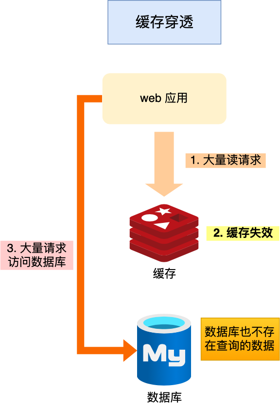

缓存穿透的发生一般有这两种情况：

- 业务误操作，缓存中的数据和数据库中的数据都被误删除了，所以导致缓存和数据库中都没有数据；
- 黑客恶意攻击，故意大量访问某些读取不存在数据的业务；

应对缓存穿透的方案，常见的方案有三种。

- 第一种方案，非法请求的限制；
- 第二种方案，缓存空值或者默认值；
- 第三种方案，使用布隆过滤器快速判断数据是否存在，避免通过查询数据库来判断数据是否存在；


#### 非法请求的限制

当有大量恶意请求访问不存在的数据的时候，也会发生缓存穿透，因此在 API 入口处我们要判断求请求参数是否合理，请求参数是否含有非法值、请求字段是否存在，如果判断出是恶意请求就直接返回错误，避免进一步访问缓存和数据库。


#### 缓存空值或者默认值

当我们线上业务发现缓存穿透的现象时，可以针对查询的数据，在缓存中设置一个空值或者默认值，这样后续请求就可以从缓存中读取到空值或者默认值，返回给应用，而不会继续查询数据库。


#### 使用布隆过滤器快速判断数据是否存在，避免通过查询数据库来判断数据是否存在。

我们可以在写入数据库数据时，使用布隆过滤器做个标记，然后在用户请求到来时，业务线程确认缓存失效后，可以通过查询布隆过滤器快速判断数据是否存在，如果不存在，就不用通过查询数据库来判断数据是否存在。

即使发生了缓存穿透，大量请求只会查询 Redis 和布隆过滤器，而不会查询数据库，保证了数据库能正常运行，Redis 自身也是支持布隆过滤器的。

那问题来了，布隆过滤器是如何工作的呢？接下来，我介绍下。

布隆过滤器由「初始值都为 0 的位图数组」和「 N 个哈希函数」两部分组成。当我们在写入数据库数据时，在布隆过滤器里做个标记，这样下次查询数据是否在数据库时，只需要查询布隆过滤器，如果查询到数据没有被标记，说明不在数据库中。

布隆过滤器会通过 3 个操作完成标记：

- 第一步，使用 N 个哈希函数分别对数据做哈希计算，得到 N 个哈希值；
- 第二步，将第一步得到的 N 个哈希值对位图数组的长度取模，得到每个哈希值在位图数组的对应位置。
- 第三步，将每个哈希值在位图数组的对应位置的值设置为 1；

举个例子，假设有一个位图数组长度为 8，哈希函数 3 个的布隆过滤器。

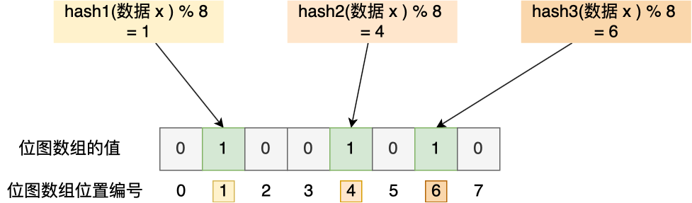

在数据库写入数据 x 后，把数据 x 标记在布隆过滤器时，数据 x 会被 3 个哈希函数分别计算出 3 个哈希值，然后在对这 3 个哈希值对 8 取模，假设取模的结果为 1、4、6，然后把位图数组的第 1、4、6 位置的值设置为 1。**当应用要查询数据 x 是否数据库时，通过布隆过滤器只要查到位图数组的第 1、4、6 位置的值是否全为 1，只要有一个为 0，就认为数据 x 不在数据库中**。

布隆过滤器由于是基于哈希函数实现查找的，高效查找的同时**存在哈希冲突的可能性**，比如数据 x 和数据 y 可能都落在第 1、4、6 位置，而事实上，可能数据库中并不存在数据 y，存在误判的情况。

所以，**查询布隆过滤器说数据存在，并不一定证明数据库中存在这个数据，但是查询到数据不存在，数据库中一定就不存在这个数据**。


### 总结

缓存异常会面临的三个问题：缓存雪崩、击穿和穿透。

其中，缓存雪崩和缓存击穿主要原因是数据不在缓存中，而导致大量请求访问了数据库，数据库压力骤增，容易引发一系列连锁反应，导致系统奔溃。不过，一旦数据被重新加载回缓存，应用又可以从缓存快速读取数据，不再继续访问数据库，数据库的压力也会瞬间降下来。因此，缓存雪崩和缓存击穿应对的方案比较类似。

而缓存穿透主要原因是数据既不在缓存也不在数据库中。因此，缓存穿透与缓存雪崩、击穿应对的方案不太一样。

我这里整理了表格，你可以从下面这张表格很好的知道缓存雪崩、击穿和穿透的区别以及应对方案。

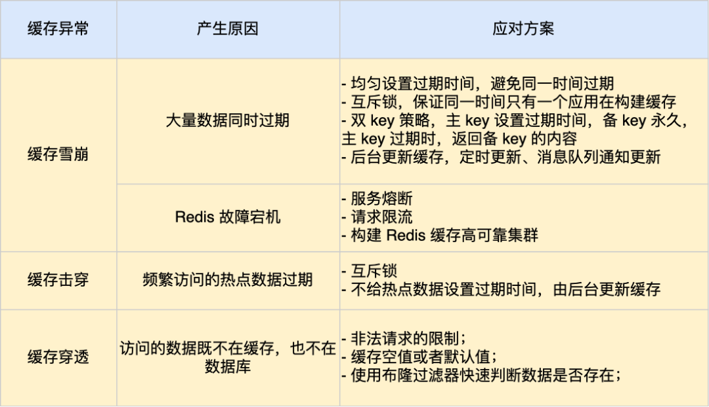


## 数据库和缓存如何保证一致性？


### 先更新数据库，还行先更新缓存？

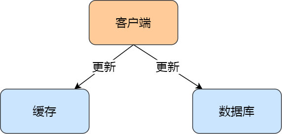

**由于引入了缓存，那么在数据更新时，不仅要更新数据库，而且要更新缓存，这两个更新操作存在前后的问题**：

- 先更新数据库，再更新缓存；
- 先更新缓存，再更新数据库；


#### 先更新数据库，再更新缓存

举个例子，比如「请求 A 」和「请求 B 」两个请求，同时更新「同一条」数据，则可能出现这样的顺序：

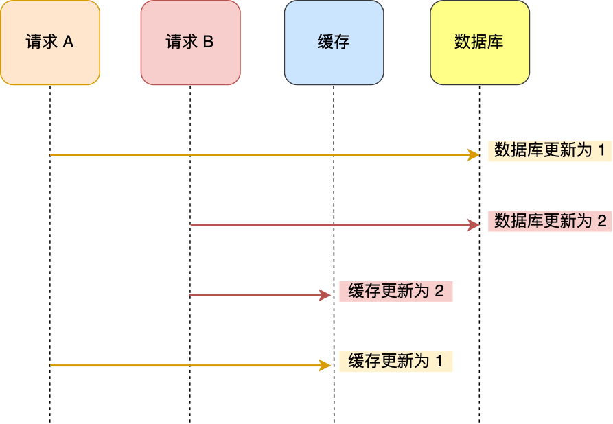

A 请求先将数据库的数据更新为 1，然后在更新缓存前，请求 B 将数据库的数据更新为 2，紧接着也把缓存更新为 2，然后 A 请求更新缓存为 1。

此时，数据库中的数据是 2，而缓存中的数据却是 1，**出现了缓存和数据库中的数据不一致的现象**。


#### 先更新缓存，再更新数据库

那换成「**先更新缓存，再更新数据库**」这个方案，还会有问题吗？

依然还是存在并发的问题，分析思路也是一样。

假设「请求 A 」和「请求 B 」两个请求，同时更新「同一条」数据，则可能出现这样的顺序：

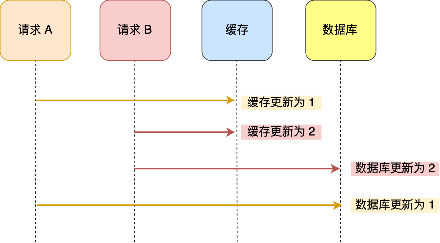

A 请求先将缓存的数据更新为 1，然后在更新数据库前，B 请求来了， 将缓存的数据更新为 2，紧接着把数据库更新为 2，然后 A 请求将数据库的数据更新为 1。

此时，数据库中的数据是 1，而缓存中的数据却是 2，**出现了缓存和数据库中的数据不一致的现象**。

所以，**无论是「先更新数据库，再更新缓存」，还是「先更新缓存，再更新数据库」，这两个方案都存在并发问题，当两个请求并发更新同一条数据的时候，可能会出现缓存和数据库中的数据不一致的现象**。


### 先更新数据库，还是先删除缓存？

阿旺定位出问题后，思考了一番后，决定在更新数据时，**不更新缓存，而是删除缓存中的数据。然后，到读取数据时，发现缓存中没了数据之后，再从数据库中读取数据，更新到缓存中。**

阿旺想的这个策略是有名字的，是叫 **Cache Aside 策略**，中文是叫旁路缓存策略。

该策略又可以细分为「读策略」和「写策略」。

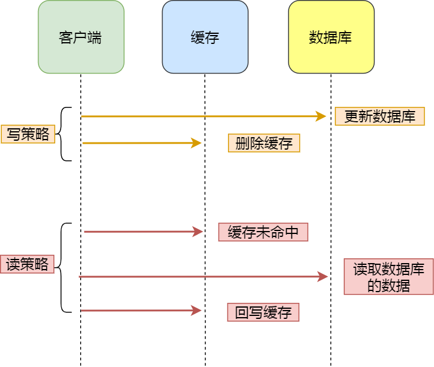

**写策略的步骤：**

- 更新数据库中的数据；
- 删除缓存中的数据。

**读策略的步骤：**

- 如果读取的数据命中了缓存，则直接返回数据；
- 如果读取的数据没有命中缓存，则从数据库中读取数据，然后将数据写入到缓存，并且返回给用户。

阿旺在想到「写策略」的时候，又陷入更深层次的思考，到底该选择哪种顺序呢？

- 先删除缓存，再更新数据库；
- 先更新数据库，再删除缓存。

阿旺这次经过上次教训，不再「想当然」的乱选方案，因为老板这次给的饼很大啊，必须把握住。

于是阿旺用并发的角度来分析，看看这两种方案哪个可以保证数据库与缓存的数据一致性。


#### 先删除缓存，再更新数据库

阿旺还是以用户表的场景来分析。

假设某个用户的年龄是 20，请求 A 要更新用户年龄为 21，所以它会删除缓存中的内容。这时，另一个请求 B 要读取这个用户的年龄，它查询缓存发现未命中后，会从数据库中读取到年龄为 20，并且写入到缓存中，然后请求 A 继续更改数据库，将用户的年龄更新为 21。

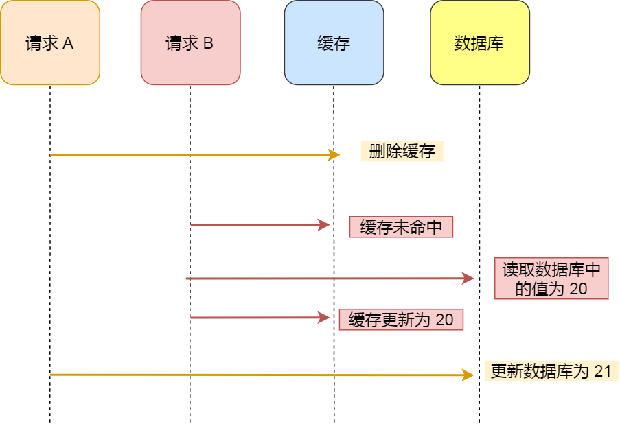

最终，该用户年龄在缓存中是 20（旧值），在数据库中是 21（新值），缓存和数据库的数据不一致。

可以看到，**先删除缓存，再更新数据库，在「读 + 写」并发的时候，还是会出现缓存和数据库的数据不一致的问题**。


#### 先更新数据库，再删除缓存

继续用「读 + 写」请求的并发的场景来分析。

假如某个用户数据在缓存中不存在，请求 A 读取数据时从数据库中查询到年龄为 20，在未写入缓存中时另一个请求 B 更新数据。它更新数据库中的年龄为 21，并且清空缓存。这时请求 A 把从数据库中读到的年龄为 20 的数据写入到缓存中。

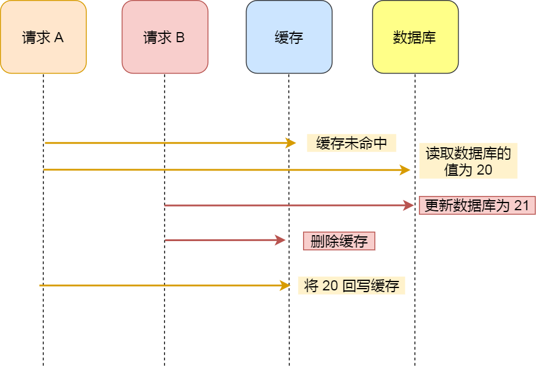

最终，该用户年龄在缓存中是 20（旧值），在数据库中是 21（新值），缓存和数据库数据不一致。

从上面的理论上分析，先更新数据库，再删除缓存也是会出现数据不一致性的问题，**但是在实际中，这个问题出现的概率并不高**。

**因为缓存的写入通常要远远快于数据库的写入**，所以在实际中很难出现请求 B 已经更新了数据库并且删除了缓存，请求 A 才更新完缓存的情况。

而一旦请求 A 早于请求 B 删除缓存之前更新了缓存，那么接下来的请求就会因为缓存不命中而从数据库中重新读取数据，所以不会出现这种不一致的情况。

所以，**「先更新数据库 + 再删除缓存」的方案，是可以保证数据一致性的**。

而且阿旺为了确保万无一失，还给缓存数据加上了「**过期时间**」，就算在这期间存在缓存数据不一致，有过期时间来兜底，这样也能达到最终一致。


## 小结

「先更新数据库，再删除缓存」的方案虽然保证了数据库与缓存的数据一致性，但是每次更新数据的时候，缓存的数据都会被删除，这样会对缓存的命中率带来影响。

所以，**如果我们的业务对缓存命中率有很高的要求，我们可以采用「更新数据库 + 更新缓存」的方案，因为更新缓存并不会出现缓存未命中的情况**。

但是这个方案前面我们也分析过，在两个更新请求并发执行的时候，会出现数据不一致的问题，因为更新数据库和更新缓存这两个操作是独立的，而我们又没有对操作做任何并发控制，那么当两个线程并发更新它们的话，就会因为写入顺序的不同造成数据的不一致。

所以我们得增加一些手段来解决这个问题，这里提供两种做法：

- 在更新缓存前先加个**分布式锁**，保证同一时间只运行一个请求更新缓存，就会不会产生并发问题了，当然引入了锁后，对于写入的性能就会带来影响。
- 在更新完缓存时，给缓存加上较短的**过期时间**，这样即时出现缓存不一致的情况，缓存的数据也会很快过期，对业务还是能接受的。

对了，针对「先删除缓存，再更新数据库」方案在「读 + 写」并发请求而造成缓存不一致的解决办法是「**延迟双删**」。

延迟双删实现的伪代码如下：

```text
#删除缓存
redis.delKey(X)
#更新数据库
db.update(X)
#睡眠
Thread.sleep(N)
#再删除缓存
redis.delKey(X)
```

加了个睡眠时间，主要是为了确保请求 A 在睡眠的时候，请求 B 能够在这这一段时间完成「从数据库读取数据，再把缺失的缓存写入缓存」的操作，然后请求 A 睡眠完，再删除缓存。

所以，请求 A 的睡眠时间就需要大于请求 B 「从数据库读取数据 + 写入缓存」的时间。

但是具体睡眠多久其实是个**玄学**，很难评估出来，所以这个方案也只是**尽可能**保证一致性而已，极端情况下，依然也会出现缓存不一致的现象。

因此，还是比较建议用「先更新数据库，再删除缓存」的方案。


## 更新数据库和删除缓存的原子性

「先更新数据库， 再删除缓存」其实是两个操作，这次客户投诉的问题就在于，**在删除缓存（第二个操作）的时候失败了，导致缓存中的数据是旧值，而数据库是最新值**。

好在之前给缓存加上了过期时间，所以才会出现客户说的过一段时间才更新生效的现象，假设如果没有这个过期时间的兜底，那后续的请求读到的就会一直是缓存中的旧数据，这样问题就更大了。

所以新的问题来了，**如何保证「先更新数据库 ，再删除缓存」这两个操作能执行成功？**


### 如何保证两个操作都能执行成功？

这次用户的投诉是因为在删除缓存（第二个操作）的时候失败了，导致缓存还是旧值，而数据库是最新值，造成数据库和缓存数据不一致的问题，会对敏感业务造成影响。

举个例子，来说明下。

应用要把数据 X 的值从 1 更新为 2，先成功更新了数据库，然后在 Redis 缓存中删除 X 的缓存，但是这个操作却失败了，这个时候数据库中 X 的新值为 2，Redis 中的 X 的缓存值为 1，出现了数据库和缓存数据不一致的问题。

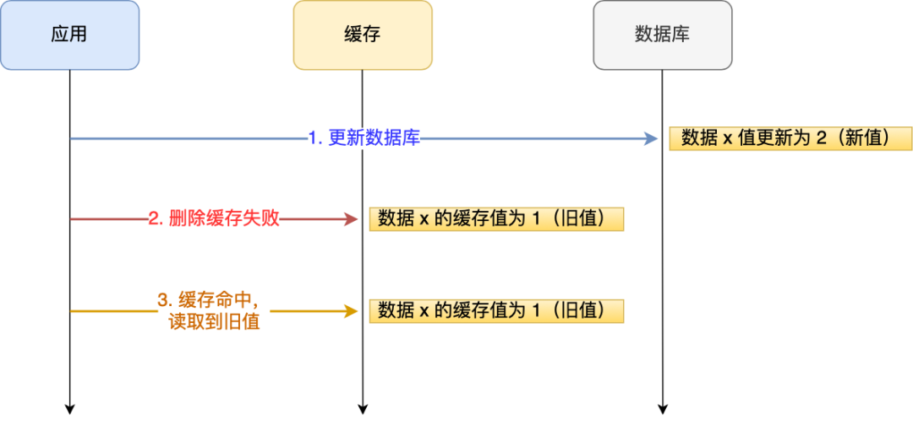

那么，后续有访问数据 X 的请求，会先在 Redis 中查询，因为缓存并没有 诶删除，所以会缓存命中，但是读到的却是旧值 1。

其实不管是先操作数据库，还是先操作缓存，只要第二个操作失败都会出现数据一致的问题。

问题原因知道了，该怎么解决呢？有两种方法：

- 重试机制。
- 订阅 MySQL binlog，再操作缓存。

先来说第一种。


#### 重试机制

我们可以引入**消息队列**，将第二个操作（删除缓存）要操作的数据加入到消息队列，由消费者来操作数据。

- 如果应用**删除缓存失败**，可以从消息队列中重新读取数据，然后再次删除缓存，这个就是**重试机制**。当然，如果重试超过的一定次数，还是没有成功，我们就需要向业务层发送报错信息了。
- 如果**删除缓存成功**，就要把数据从消息队列中移除，避免重复操作，否则就继续重试。

举个例子，来说明重试机制的过程。

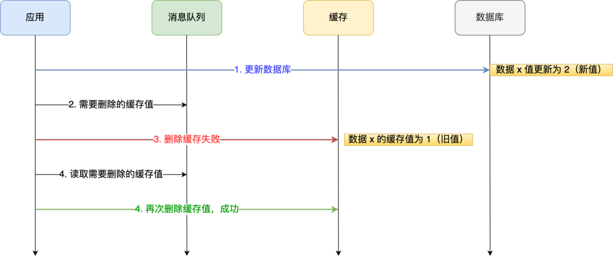


#### 订阅 MySQL binlog，再操作缓存

「**先更新数据库，再删缓存**」的策略的第一步是更新数据库，那么更新数据库成功，就会产生一条变更日志，记录在 binlog 里。

于是我们就可以通过订阅 binlog 日志，拿到具体要操作的数据，然后再执行缓存删除，阿里巴巴开源的 Canal 中间件就是基于这个实现的。

Canal 模拟 MySQL 主从复制的交互协议，把自己伪装成一个 MySQL 的从节点，向 MySQL 主节点发送 dump 请求，MySQL 收到请求后，就会开始推送 Binlog 给 Canal，Canal 解析 Binlog 字节流之后，转换为便于读取的结构化数据，供下游程序订阅使用。

下图是 Canal 的工作原理：

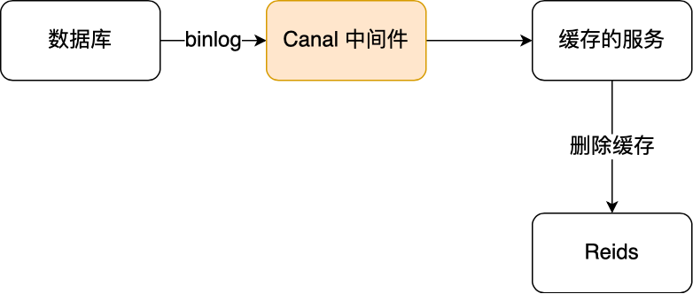

所以，**如果要想保证「先更新数据库，再删缓存」策略第二个操作能执行成功，我们可以使用「消息队列来重试缓存的删除」，或者「订阅 MySQL binlog 再操作缓存」，这两种方法有一个共同的特点，都是采用异步操作缓存。**


# Redis 过期策略

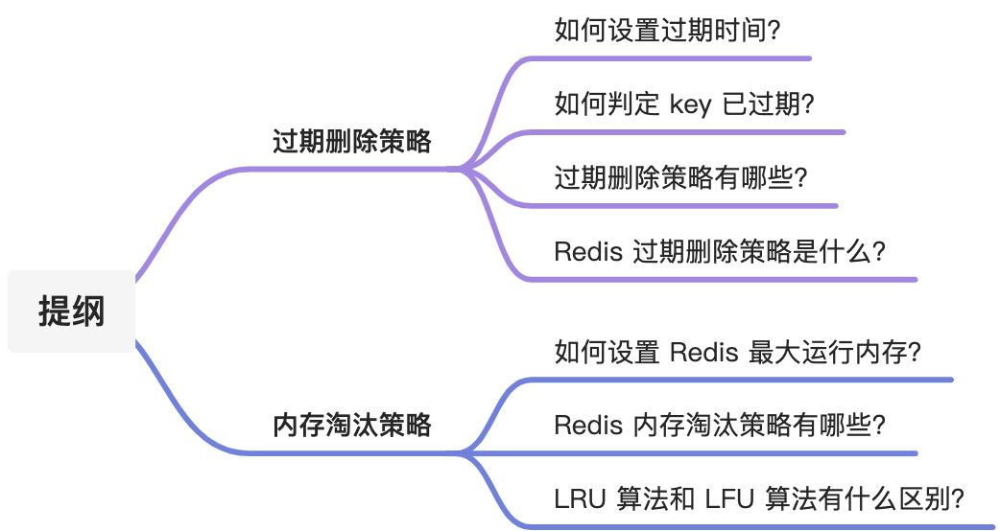


## 过期删除策略

Redis 是可以对 key 设置过期时间的，因此需要有相应的机制将已过期的键值对删除，而做这个工作的就是过期键值删除策略。


### 如何设置过期时间？

先说一下对 key 设置过期时间的命令。 设置 key 过期时间的命令一共有 4 个：

- `expire <key> <n>`：设置 key 在 n 秒后过期，比如 expire key 100 表示设置 key 在 100 秒后过期；
- `pexpire <key> <n>`：设置 key 在 n 毫秒后过期，比如 pexpire key2 100000 表示设置 key2 在 100000 毫秒（100 秒）后过期。
- `expireat <key> <n>`：设置 key 在某个时间戳（精确到秒）之后过期，比如 expireat key3 1655654400 表示 key3 在时间戳 1655654400 后过期（精确到秒）；
- `pexpireat <key> <n>`：设置 key 在某个时间戳（精确到毫秒）之后过期，比如 pexpireat key4 1655654400000 表示 key4 在时间戳 1655654400000 后过期（精确到毫秒）

当然，在设置字符串时，也可以同时对 key 设置过期时间，共有 3 种命令：

- `set <key> <value> ex <n>` ：设置键值对的时候，同时指定过期时间（精确到秒）；
- `set <key> <value> px <n>` ：设置键值对的时候，同时指定过期时间（精确到毫秒）；
- `setex <key> <n> <valule>` ：设置键值对的时候，同时指定过期时间（精确到秒）。

如果你想查看某个 key 剩余的存活时间，可以使用 `TTL <key>` 命令。

```bash
# 设置键值对的时候，同时指定过期时间位 60 秒
> setex key1 60 value1
OK

# 查看 key1 过期时间还剩多少
> ttl key1
(integer) 56
> ttl key1
(integer) 52
```

如果突然反悔，取消 key 的过期时间，则可以使用 `PERSIST <key>` 命令。

```bash
# 取消 key1 的过期时间
> persist key1
(integer) 1

# 使用完 persist 命令之后，
# 查下 key1 的存活时间结果是 -1，表明 key1 永不过期 
> ttl key1 
(integer) -1
```


### 如何判定 key 已过期了？

每当我们对一个 key 设置了过期时间时，Redis 会把该 key 带上过期时间存储到一个**过期字典**（expires dict）中，也就是说「过期字典」保存了数据库中所有 key 的过期时间。

过期字典存储在 redisDb 结构中，如下：

```c
typedef struct redisDb {
    dict *dict;    /* 数据库键空间，存放着所有的键值对 */
    dict *expires; /* 键的过期时间 */
    ....
} redisDb;
```

过期字典数据结构结构如下：

- 过期字典的 key 是一个指针，指向某个键对象；
- 过期字典的 value 是一个 long long 类型的整数，这个整数保存了 key 的过期时间；

过期字典的数据结构如下图所示：

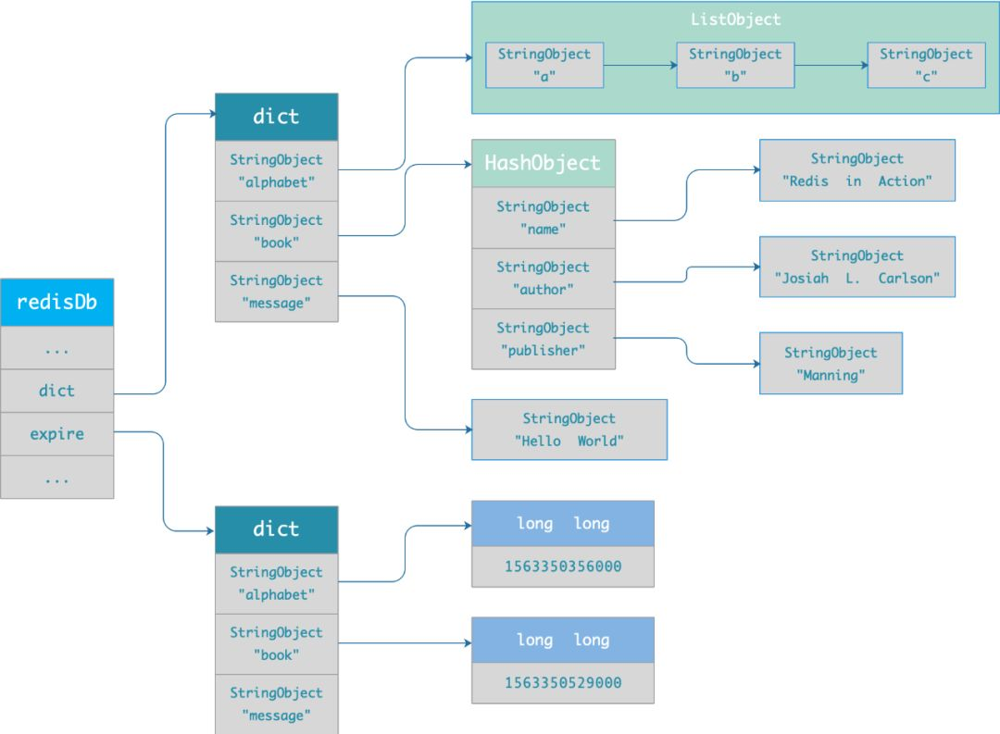

字典实际上是哈希表，哈希表的最大好处就是让我们可以用 O(1) 的时间复杂度来快速查找。当我们查询一个 key 时，Redis 首先检查该 key 是否存在于过期字典中：

- 如果不在，则正常读取键值；
- 如果存在，则会获取该 key 的过期时间，然后与当前系统时间进行比对，如果比系统时间大，那就没有过期，否则判定该 key 已过期。

过期键判断流程如下图所示：

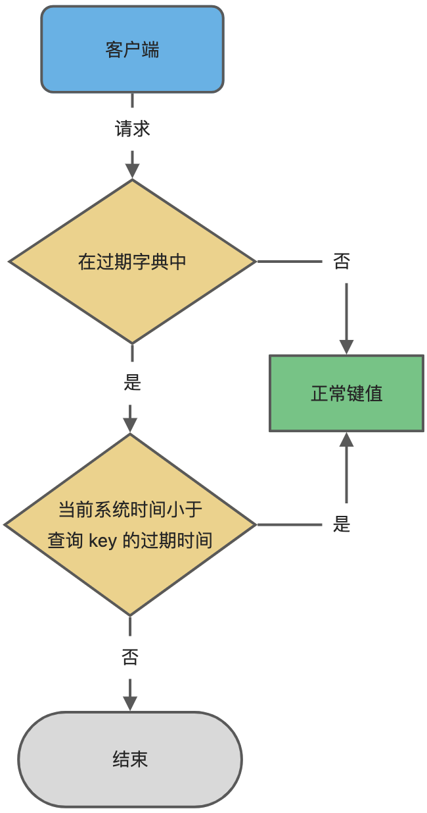

### 过期删除策略有哪些？

在说 Redis 过期删除策略之前，先跟大家介绍下，常见的三种过期删除策略：

- 定时删除；
- 惰性删除；
- 定期删除；


#### 定时删除策略

定时删除策略的做法是，**在设置 key 的过期时间时，同时创建一个定时事件，当时间到达时，由事件处理器自动执行 key 的删除操作。**

定时删除策略的**优点**：

- 可以保证过期 key 会被尽快删除，也就是内存可以被尽快地释放。因此，**定时删除对内存是最友好的。**

定时删除策略的**缺点**：

- 在过期 key 比较多的情况下，删除过期 key 可能会占用相当一部分 CPU 时间，在内存不紧张但 CPU 时间紧张的情况下，将 CPU 时间用于删除和当前任务无关的过期键上，无疑会对服务器的响应时间和吞吐量造成影响。所以，**定时删除策略对 CPU 不友好。**


#### 惰性删除策略

惰性删除策略的做法是，**不主动删除过期键，每次从数据库访问 key 时，都检测 key 是否过期，如果过期则删除该 key。**

惰性删除策略的**优点**：

- 因为每次访问时，才会检查 key 是否过期，所以此策略只会使用很少的系统资源，因此，**惰性删除策略对 CPU 时间最友好。**

惰性删除策略的**缺点**：

- 如果一个 key 已经过期，而这个 key 又仍然保留在数据库中，那么只要这个过期 key 一直没有被访问，它所占用的内存就不会释放，造成了一定的内存空间浪费。所以，**惰性删除策略对内存不友好。**


#### 定期删除策略是怎么样的？

定期删除策略的做法是，**每隔一段时间「随机」从数据库中取出一定数量的 key 进行检查，并删除其中的过期key。**

定期删除策略的**优点**：

- 通过限制删除操作执行的时长和频率，来减少删除操作对 CPU 的影响，同时也能删除一部分过期的数据减少了过期键对空间的无效占用。

定期删除策略的**缺点**：

- 内存清理方面没有定时删除效果好，同时没有惰性删除使用的系统资源少。
- 难以确定删除操作执行的时长和频率。如果执行的太频繁，定期删除策略变得和定时删除策略一样，对CPU不友好；如果执行的太少，那又和惰性删除一样了，过期 key 占用的内存不会及时得到释放。


### Redis 过期删除策略是什么？

前面介绍了三种过期删除策略，每一种都有优缺点，仅使用某一个策略都不能满足实际需求。

所以， **Redis 选择「惰性删除+定期删除」这两种策略配和使用**，以求在合理使用 CPU 时间和避免内存浪费之间取得平衡。


#### Redis 是怎么实现惰性删除的？

Redis 的惰性删除策略由 db.c 文件中的 `expireIfNeeded` 函数实现，代码如下：

```c
int expireIfNeeded(redisDb *db, robj *key) {
    // 判断 key 是否过期
    if (!keyIsExpired(db,key)) return 0;
    ....
    /* 删除过期键 */
    ....
    // 如果 server.lazyfree_lazy_expire 为 1 表示异步删除，反之同步删除；
    return server.lazyfree_lazy_expire ? dbAsyncDelete(db,key) :
                                         dbSyncDelete(db,key);
}
```

Redis 在访问或者修改 key 之前，都会调用 expireIfNeeded 函数对其进行检查，检查 key 是否过期：

- 如果过期，则删除该 key，至于选择异步删除，还是选择同步删除，根据 `lazyfree_lazy_expire` 参数配置决定（Redis 4.0版本开始提供参数），然后返回 null 客户端；
- 如果没有过期，不做任何处理，然后返回正常的键值对给客户端；

惰性删除的流程图如下：

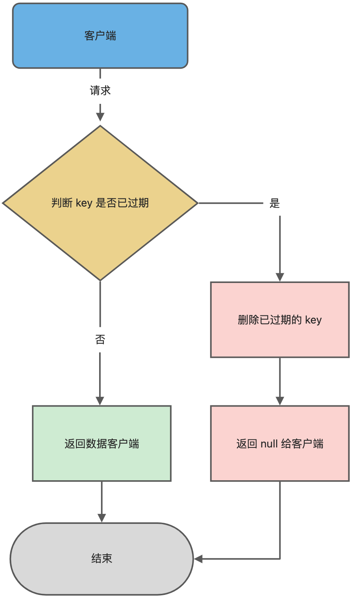


#### Redis 是怎么实现定期删除的？

再回忆一下，定期删除策略的做法：**每隔一段时间「随机」从数据库中取出一定数量的 key 进行检查，并删除其中的过期key。**

*1、这个间隔检查的时间是多长呢？*

在 Redis 中，默认每秒进行 10 次过期检查一次数据库，此配置可通过 Redis 的配置文件 redis.conf 进行配置，配置键为 hz 它的默认值是 hz 10。

特别强调下，每次检查数据库并不是遍历过期字典中的所有 key，而是从数据库中随机抽取一定数量的 key 进行过期检查。

*2、随机抽查的数量是多少呢？*

我查了下源码，定期删除的实现在 expire.c 文件下的 `activeExpireCycle` 函数中，其中随机抽查的数量由 `ACTIVE_EXPIRE_CYCLE_LOOKUPS_PER_LOOP` 定义的，它是写死在代码中的，数值是 20。

也就是说，数据库每轮抽查时，会随机选择 20 个 key 判断是否过期。

接下来，详细说说 Redis 的定期删除的流程：**（终止条件：过期key超过25% || 时间大于 25ms）**

1. 从过期字典中随机抽取 20 个 key；
2. 检查这 20 个 key 是否过期，并删除已过期的 key；
3. 如果本轮检查的已过期 key 的数量，超过 5 个（20/4），**也就是「已过期 key 的数量」占比「随机抽取 key 的数量」大于 25%，则继续重复步骤 1**；如果已过期的 key 比例小于 25%，则停止继续删除过期 key，然后等待下一轮再检查。

可以看到，定期删除是一个循环的流程。

那 Redis 为了保证定期删除不会出现循环过度，导致线程卡死现象，**为此增加了定期删除循环流程的时间上限，默认不会超过 25ms**。

针对定期删除的流程，我写了个伪代码：

```c
do {
    //已过期的数量
    expired = 0；
    //随机抽取的数量
    num = 20;
    while (num--) {
        //1. 从过期字典中随机抽取 1 个 key
        //2. 判断该 key 是否过期，如果已过期则进行删除，同时对 expired++
    }
    
    // 超过时间限制则退出
    if (timelimit_exit) return;

  /* 如果本轮检查的已过期 key 的数量，超过 25%，则继续随机抽查，否则退出本轮检查 */
} while (expired > 20/4); 
```

定期删除的流程如下：

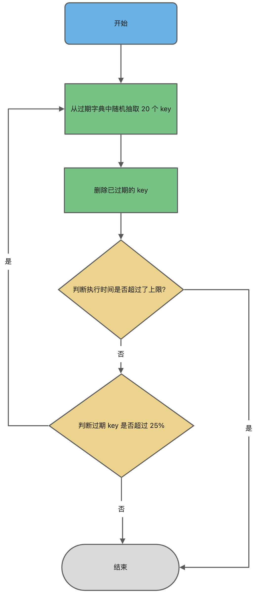


## 内存淘汰策略

前面说的过期删除策略，是删除已过期的 key，而当 Redis 的运行内存已经超过 Redis 设置的最大内存之后，则会使用内存淘汰策略删除符合条件的 key，以此来保障 Redis 高效的运行。


### 如何设置 Redis 最大运行内存？

在配置文件 redis.conf 中，可以通过参数 `maxmemory <bytes>` 来设定最大运行内存，只有在 Redis 的运行内存达到了我们设置的最大运行内存，才会触发内存淘汰策略。 不同位数的操作系统，maxmemory 的默认值是不同的：

- 在 64 位操作系统中，maxmemory 的默认值是 0，表示没有内存大小限制，那么不管用户存放多少数据到 Redis 中，Redis 也不会对可用内存进行检查，直到 Redis 实例因内存不足而崩溃也无作为。
- 在 32 位操作系统中，maxmemory 的默认值是 3G，因为 32 位的机器最大只支持 4GB 的内存，而系统本身就需要一定的内存资源来支持运行，所以 32 位操作系统限制最大 3 GB 的可用内存是非常合理的，这样可以避免因为内存不足而导致 Redis 实例崩溃。


### Redis 内存淘汰策略有哪些？

Redis 内存淘汰策略共有八种，这八种策略大体分为**「不进行数据淘汰」和「进行数据淘汰」两类策略。**


#### 不进行数据淘汰的策略

**noeviction**（Redis3.0之后，默认的内存淘汰策略） ：它表示当运行内存超过最大设置内存时，不淘汰任何数据，这时如果有新的数据写入，则会触发 OOM，但是如果没用数据写入的话，只是单纯的查询或者删除操作的话，还是可以正常工作。


#### 进行数据淘汰的策略

针对「进行数据淘汰」这一类策略，又可以细分为**「在设置了过期时间的数据中进行淘汰」和「在所有数据范围内进行淘汰」**这两类策略。

在设置了过期时间的数据中进行淘汰：

- **volatile-random**：随机淘汰设置了过期时间的任意键值；
- **volatile-ttl**：优先淘汰更早过期的键值。
- **volatile-lru**（Redis3.0 之前，默认的内存淘汰策略）：淘汰所有设置了过期时间的键值中，最久未使用的键值；
- **volatile-lfu**（Redis 4.0 后新增的内存淘汰策略）：淘汰所有设置了过期时间的键值中，最少使用的键值；

在所有数据范围内进行淘汰：

- **allkeys-random**：随机淘汰任意键值;
- **allkeys-lru**：淘汰整个键值中最久未使用的键值；
- **allkeys-lfu**（Redis 4.0 后新增的内存淘汰策略）：淘汰整个键值中最少使用的键值。


**如何查看当前 Redis 使用的内存淘汰策略？**

可以使用 `config get maxmemory-policy` 命令，来查看当前 Redis 的内存淘汰策略，命令如下：

```bash
127.0.0.1:6379> config get maxmemory-policy
1) "maxmemory-policy"
2) "noeviction"
```

可以看出，当前 Redis 使用的是 `noeviction` 类型的内存淘汰策略，它是 Redis 3.0 之后默认使用的内存淘汰策略，表示当运行内存超过最大设置内存时，不淘汰任何数据，但新增操作会报错。


**如何修改 Redis 内存淘汰策略？**

设置内存淘汰策略有两种方法：

- 方式一：通过“`config set maxmemory-policy <策略>`”命令设置。它的优点是设置之后立即生效，不需要重启 Redis 服务，缺点是重启 Redis 之后，设置就会失效。
- 方式二：通过修改 Redis 配置文件修改，设置“`maxmemory-policy <策略>`”，它的优点是重启 Redis 服务后配置不会丢失，缺点是必须重启 Redis 服务，设置才能生效。


### LRU 算法和 LFU 算法有什么区别？

接下来，就看看这两个算法有什么区别？Redis 又是如何实现这两个算法的？


#### 什么是 LRU 算法？

**LRU** 全称是 Least Recently Used 翻译为**最近最少使用**，会选择淘汰最近最少使用的数据。

**传统 LRU 算法的实现是基于「链表」结构，**链表中的元素按照操作顺序从前往后排列，**最新操作的键会被移动到表头**，当需要内存淘汰时，只需要删除链表尾部的元素即可，因为链表尾部的元素就代表最久未被使用的元素。

**Redis 并没有使用这样的方式实现 LRU 算法，因为传统的 LRU 算法存在两个问题：**

- 需要用链表管理所有的缓存数据，这会带来额外的空间开销；
- 当有数据被访问时，需要在链表上把该数据移动到头端，如果有大量数据被访问，就会带来很多链表移动操作，会很耗时，进而会降低 Redis 缓存性能。


#### Redis 是如何实现 LRU 算法的？

Redis 实现的是一种**近似 LRU 算法**，目的是为了更好的节约内存，它的**实现方式是在 Redis 的对象结构体中添加一个额外的字段，用于记录此数据的最后一次访问时间**。

当 Redis 进行内存淘汰时，会使用**随机采样的方式来淘汰数据**，它是随机取 5 个值（此值可配置），然后**淘汰最久没有使用的那个**。

Redis 实现的 LRU 算法的优点：

- 不用为所有的数据维护一个大链表，节省了空间占用；
- 不用在每次数据访问时都移动链表项，提升了缓存的性能；

**缺点**

但是 LRU 算法有一个问题，**无法解决缓存污染问题**，比如应用一次读取了大量的数据，而这些数据只会被读取这一次，那么这些数据会留存在 Redis 缓存中很长一段时间，造成缓存污染。


因此，在 Redis 4.0 之后引入了 LFU 算法来解决这个问题。

#### 什么是 LFU 算法？

LFU 全称是 Least Frequently Used 翻译为**最近最不常用**，LFU 算法是根据数据访问次数来淘汰数据的，它的核心思想是“如果数据过去被访问多次，那么将来被访问的频率也更高”。

所以， **LFU 算法会记录每个数据的访问次数。**当一个数据被再次访问时，就会增加该数据的访问次数。这样就解决了偶尔被访问一次之后，数据留存在缓存中很长一段时间的问题，相比于 LRU 算法也更合理一些。


#### Redis 是如何实现 LFU 算法的？

LFU 算法相比于 LRU 算法的实现，多记录了「数据的访问频次」的信息。Redis 对象的结构如下：

```c
typedef struct redisObject {
    ...
      
    // 24 bits，用于记录对象的访问信息
    unsigned lru:24;  
    ...
} robj;
```

Redis 对象头中的 lru 字段，在 LRU 算法下和 LFU 算法下使用方式并不相同。

**在 LRU 算法中**，**Redis 对象头的 24 bits 的 lru 字段是用来记录 key 的访问时间戳**，因此在 LRU 模式下，Redis可以根据对象头中的 lru 字段记录的值，来比较最后一次 key 的访问时间长，从而淘汰最久未被使用的 key。

**在 LFU 算法中**，Redis对象头的 24 bits 的 lru 字段被分成两段来存储，高 16bit 存储 ldt(Last Decrement Time)，低 8bit 存储 logc(Logistic Counter)。

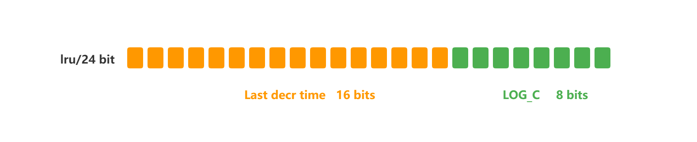

- ldt 是用来记录 key 的访问时间戳；
- logc 是用来记录 key 的访问频次，它的值越小表示使用频率越低，越容易淘汰，每个新加入的 key 的logc 初始值为 5。

注意，logc 并不是单纯的访问次数，而是访问频次（访问频率），因为 **logc 会随时间推移而衰减的**。

在每次 key 被访问时，会先对 logc 做一个衰减操作，衰减的值跟前后访问时间的差距有关系，如果上一次访问的时间与这一次访问的时间差距很大，那么衰减的值就越大，这样实现的 LFU 算法是根据**访问频率**来淘汰数据的，而不只是访问次数。访问频率需要考虑 key 的访问是多长时间段内发生的。key 的先前访问距离当前时间越长，那么这个 key 的访问频率相应地也就会降低，这样被淘汰的概率也会更大。

对 logc 做完衰减操作后，就开始对 logc 进行增加操作，增加操作并不是单纯的 + 1，而是根据概率增加，如果 logc 越大的 key，它的 logc 就越难再增加。

所以，Redis 在访问 key 时，对于 logc 是这样变化的：

1. 先按照上次访问距离当前的时长，来对 logc 进行衰减；
2. 然后，再按照一定概率增加 logc 的值

redis.conf 提供了两个配置项，用于调整 LFU 算法从而控制 logc 的增长和衰减：

- `lfu-decay-time` 用于调整 logc 的衰减速度，它是一个以分钟为单位的数值，默认值为1，lfu-decay-time 值越大，衰减越慢；
- `lfu-log-factor` 用于调整 logc 的增长速度，lfu-log-factor 值越大，logc 增长越慢。


### 总结

Redis 使用的过期删除策略是「惰性删除+定期删除」，删除的对象是已过期的 key。

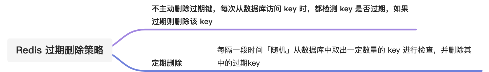

内存淘汰策略是解决内存过大的问题，当 Redis 的运行内存超过最大运行内存时，就会触发内存淘汰策略，Redis 4.0 之后共实现了 8 种内存淘汰策略，我也对这 8 种的策略进行分类，如下：

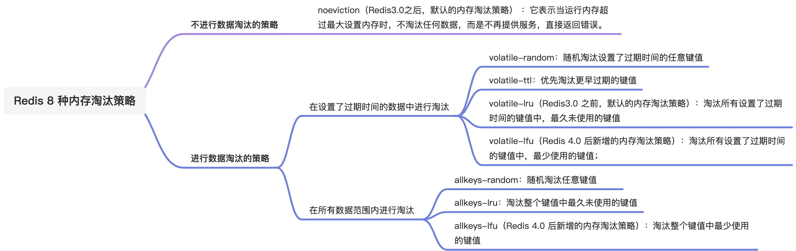


