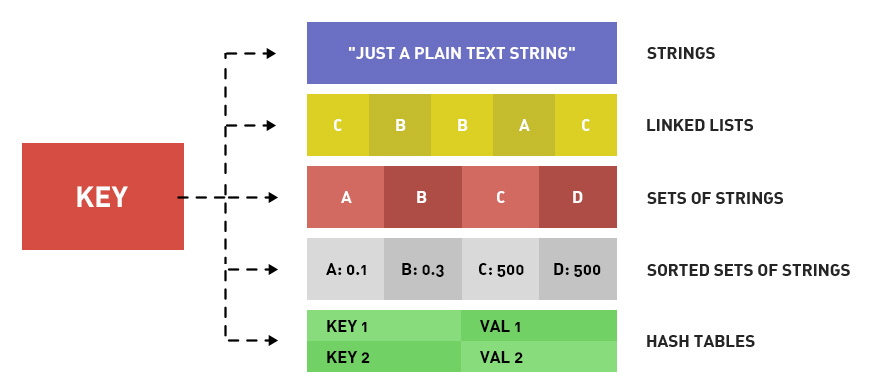
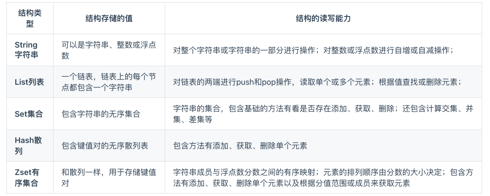

# 认识 Redis 

Redis 是一种基于内存的数据库，对数据的读写操作都是在内存中完成，因此**读写速度非常快**，常用于**缓存，消息队列、分布式锁等场景**。

Redis 提供了多种数据类型来支持不同的业务场景，比如 String(字符串)、Hash(哈希)、 List (列表)、Set(集合)、Zset(有序集合)、Bitmaps（位图）、HyperLogLog（基数统计）、GEO（地理信息）、Stream（流），并且对数据类型的操作都是**原子性**的，因为执行命令由单线程负责的，不存在并发竞争的问题。

除此之外，Redis 还支持**事务 、持久化、Lua 脚本、多种集群方案（主从复制模式、哨兵模式、切片机群模式）、发布/订阅模式，内存淘汰机制、过期删除机制**等等。

## 为什么用 Redis 作为 MySQL 的缓存？

主要是因为 **Redis 具备「高性能」和「高并发」两种特性**

- Redis 具备高性能

将该用户访问的数据缓存在 Redis 中，这样下一次再访问这些数据的时候就可以直接从缓存中获取了，操作 Redis 缓存就是直接操作内存，所以速度相当快。如果 MySQL 中的对应数据改变的之后，同步改变 Redis 缓存中相应的数据即可，**不过这里会有 Redis 和 MySQL 双写一致性的问题**。

- Redis 具备高并发

单台设备的 Redis 的 QPS（Query Per Second，每秒钟处理完请求的次数） 是 MySQL 的 10 倍，Redis 单机的 QPS 能轻松破 10w，而 MySQL 单机的 QPS 很难破 1w。

所以，直接访问 Redis 能够承受的请求是远远大于直接访问 MySQL 的，所以我们可以考虑把数据库中的部分数据转移到缓存中去，这样用户的一部分请求会直接到缓存这里而不用经过数据库。

# Redis 数据结构

### Redis 数据类型以及使用场景分别是什么？

Redis 提供了丰富的数据类型，常见的有五种数据类型：**String（字符串），Hash（哈希），List（列表），Set（集合）、Zset（有序集合）**。

随着 Redis 版本的更新，后面又支持了四种数据类型： **BitMap（2.2 版新增）、HyperLogLog（2.8 版新增）、GEO（3.2 版新增）、Stream（5.0 版新增）**。 Redis 五种数据类型的应用场景：

- String 类型的应用场景：缓存对象、常规计数、分布式锁、共享 session 信息等。
- List 类型的应用场景：消息队列（但是有两个问题：1. 生产者需要自行实现全局唯一 ID；2. 不能以消费组形式消费数据）等。
- Hash 类型：缓存对象、购物车等。
- Set 类型：聚合计算（并集、交集、差集）场景，比如点赞、共同关注、抽奖活动等。
- Zset 类型：排序场景，比如排行榜、电话和姓名排序等。

Redis 后续版本又支持四种数据类型，它们的应用场景如下：

- BitMap（2.2 版新增）：二值状态统计的场景，比如签到、判断用户登陆状态、连续签到用户总数等；
- HyperLogLog（2.8 版新增）：海量数据基数统计的场景，比如百万级网页 UV 计数等；
- GEO（3.2 版新增）：存储地理位置信息的场景，比如滴滴叫车；
- Stream（5.0 版新增）：消息队列，相比于基于 List 类型实现的消息队列，有这两个特有的特性：自动生成全局唯一消息ID，支持以消费组形式消费数据。

### 五种常见的 Redis 数据类型是怎么实现？

> String 类型内部实现

String 类型的底层的数据结构实现主要是 SDS（类似go的Slice，简单动态字符串）。 SDS 和我们认识的 C 字符串不太一样，之所以没有使用 C 语言的字符串表示，因为 SDS 相比于 C 的原生字符串：

- **SDS 不仅可以保存文本数据，还可以保存二进制数据**。因为 SDS 使用 len 属性的值而不是空字符来判断字符串是否结束，并且 SDS 的所有 API 都会以处理二进制的方式来处理 SDS 存放在 buf[] 数组里的数据。所以 SDS 不光能存放文本数据，而且能保存图片、音频、视频、压缩文件这样的二进制数据。
- **SDS 获取字符串长度的时间复杂度是 O(1)**。因为 C 语言的字符串并不记录自身长度，所以获取长度的复杂度为 O(n)；而 SDS 结构里用 len 属性记录了字符串长度，所以复杂度为 O(1)。
- **Redis 的 SDS API 是安全的，拼接字符串不会造成缓冲区溢出**。因为 SDS 在拼接字符串之前会检查 SDS 空间是否满足要求，如果空间不够会自动扩容，所以不会导致缓冲区溢出的问题。

# Redis 线程模型

## Redis 是单线程吗？

**Redis 单线程指的是「接收客户端请求->解析请求 ->进行数据读写等操作->发送数据给客户端」这个过程是由一个线程（主线程）来完成的**，这也是我们常说 Redis 是单线程的原因

