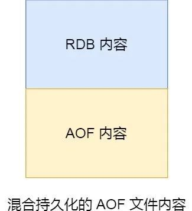

# 认识 Redis 

Redis 是一种基于内存的数据库，对数据的读写操作都是在内存中完成，因此**读写速度非常快**，常用于**缓存，消息队列、分布式锁等场景**。

Redis 提供了多种数据类型来支持不同的业务场景，比如 String(字符串)、Hash(哈希)、 List (列表)、Set(集合)、Zset(有序集合)、Bitmaps（位图）、HyperLogLog（基数统计）、GEO（地理信息）、Stream（流），并且对数据类型的操作都是**原子性**的，因为执行命令由单线程负责的，不存在并发竞争的问题。

除此之外，Redis 还支持**事务 、持久化、Lua 脚本、多种集群方案（主从复制模式、哨兵模式、切片机群模式）、发布/订阅模式，内存淘汰机制、过期删除机制**等等。


## 为什么用 Redis 作为 MySQL 的缓存？

主要是因为 **Redis 具备「高性能」和「高并发」两种特性**

- Redis 具备高性能

将该用户访问的数据缓存在 Redis 中，这样下一次再访问这些数据的时候就可以直接从缓存中获取了，操作 Redis 缓存就是直接操作内存，所以速度相当快。如果 MySQL 中的对应数据改变的之后，同步改变 Redis 缓存中相应的数据即可，**不过这里会有 Redis 和 MySQL 双写一致性的问题**。

- Redis 具备高并发

单台设备的 Redis 的 QPS（Query Per Second，每秒钟处理完请求的次数） 是 MySQL 的 10 倍，Redis 单机的 QPS 能轻松破 10w，而 MySQL 单机的 QPS 很难破 1w。

所以，直接访问 Redis 能够承受的请求是远远大于直接访问 MySQL 的，所以我们可以考虑把数据库中的部分数据转移到缓存中去，这样用户的一部分请求会直接到缓存这里而不用经过数据库。


# Redis 数据结构

### Redis 数据类型以及使用场景分别是什么？

Redis 提供了丰富的数据类型，常见的有五种数据类型：**String（字符串），Hash（哈希），List（列表），Set（集合）、Zset（有序集合）**。


随着 Redis 版本的更新，后面又支持了四种数据类型： **BitMap（2.2 版新增）、HyperLogLog（2.8 版新增）、GEO（3.2 版新增）、Stream（5.0 版新增）**。 Redis 五种数据类型的应用场景：

- String 类型的应用场景：缓存对象、常规计数、分布式锁、共享 session 信息等。
- List 类型的应用场景：消息队列（但是有两个问题：1. 生产者需要自行实现全局唯一 ID；2. 不能以消费组形式消费数据）等。
- Hash 类型：缓存对象、购物车等。
- Set 类型：聚合计算（并集、交集、差集）场景，比如点赞、共同关注、抽奖活动等。
- Zset 类型：排序场景，比如排行榜、电话和姓名排序等。

Redis 后续版本又支持四种数据类型，它们的应用场景如下：

- BitMap（2.2 版新增）：二值状态统计的场景，比如签到、判断用户登陆状态、连续签到用户总数等；
- HyperLogLog（2.8 版新增）：海量数据基数统计的场景，比如百万级网页 UV 计数等；
- GEO（3.2 版新增）：存储地理位置信息的场景，比如滴滴叫车；
- Stream（5.0 版新增）：消息队列，相比于基于 List 类型实现的消息队列，有这两个特有的特性：自动生成全局唯一消息ID，支持以消费组形式消费数据。


### 五种常见的 Redis 数据类型是怎么实现？

> String 类型内部实现

String 类型的底层的数据结构实现主要是 SDS（类似go的Slice，简单动态字符串）。 SDS 和我们认识的 C 字符串不太一样，之所以没有使用 C 语言的字符串表示，因为 SDS 相比于 C 的原生字符串：

- **SDS 不仅可以保存文本数据，还可以保存二进制数据**。因为 SDS 使用 len 属性的值而不是空字符来判断字符串是否结束，并且 SDS 的所有 API 都会以处理二进制的方式来处理 SDS 存放在 buf[] 数组里的数据。所以 SDS 不光能存放文本数据，而且能保存图片、音频、视频、压缩文件这样的二进制数据。
- **SDS 获取字符串长度的时间复杂度是 O(1)**。因为 C 语言的字符串并不记录自身长度，所以获取长度的复杂度为 O(n)；而 SDS 结构里用 len 属性记录了字符串长度，所以复杂度为 O(1)。
- **Redis 的 SDS API 是安全的，拼接字符串不会造成缓冲区溢出**。因为 SDS 在拼接字符串之前会检查 SDS 空间是否满足要求，如果空间不够会自动扩容，所以不会导致缓冲区溢出的问题。


# Redis 线程模型


## Redis 是单线程吗？

**Redis 单线程指的是「接收客户端请求->解析请求 ->进行数据读写等操作->发送数据给客户端」这个过程是由一个线程（主线程）来完成的**，这也是我们常说 Redis 是单线程的原因。

之所以 Redis 为「关闭文件、AOF 刷盘、释放内存」这些任务创建单独的线程来处理，是因为这些任务的操作都是很耗时的，如果把这些任务都放在主线程来处理，那么 Redis 主线程就很容易发生阻塞，这样就无法处理后续的请求了。

后台线程相当于一个消费者，生产者把耗时任务丢到任务队列中，消费者（BIO）不停轮询这个队列，拿出任务就去执行对应的方法即可。


关闭文件、AOF 刷盘、释放内存这三个任务都有各自的任务队列：

- BIO_CLOSE_FILE，关闭文件任务队列：当队列有任务后，后台线程会调用 close(fd) ，将文件关闭；
- BIO_AOF_FSYNC，AOF刷盘任务队列：当 AOF 日志配置成 everysec 选项后，主线程会把 AOF 写日志操作封装成一个任务，也放到队列中。当发现队列有任务后，后台线程会调用 fsync(fd)，将 AOF 文件刷盘，
- BIO_LAZY_FREE，lazy free 任务队列：当队列有任务后，后台线程会 free(obj) 释放对象 / free(dict) 删除数据库所有对象 / free(skiplist) 释放跳表对象；


图中的蓝色部分是一个事件循环，是由主线程负责的，可以看到网络 I/O 和命令处理都是单线程。 Redis 初始化的时候，会做下面这几件事情：

- 首先，调用 epoll_create() 创建一个 epoll 对象和调用 socket() 创建一个服务端 socket
- 然后，调用 bind() 绑定端口和调用 listen() 监听该 socket；
- 然后，将调用 epoll_ctl() 将 listen socket 加入到 epoll，同时注册「连接事件」处理函数。

初始化完后，主线程就进入到一个**事件循环函数**，主要会做以下事情：

- 首先，先调用**处理发送队列函数**，看是发送队列里是否有任务，如果有发送任务，则通过 write 函数将客户端发送缓存区里的数据发送出去，如果这一轮数据没有发送完，就会注册写事件处理函数，等待 epoll_wait 发现可写后再处理 。
- 接着，调用 epoll_wait 函数等待事件的到来：
  - 如果是**连接事件**到来，则会调用**连接事件处理函数**，该函数会做这些事情：调用 accpet 获取已连接的 socket -> 调用 epoll_ctl 将已连接的 socket 加入到 epoll -> 注册「读事件」处理函数；
  - 如果是**读事件**到来，则会调用**读事件处理函数**，该函数会做这些事情：调用 read 获取客户端发送的数据 -> 解析命令 -> 处理命令 -> 将客户端对象添加到发送队列 -> 将执行结果写到发送缓存区等待发送；
  - 如果是**写事件**到来，则会调用**写事件处理函数**，该函数会做这些事情：通过 write 函数将客户端发送缓存区里的数据发送出去，如果这一轮数据没有发送完，就会继续注册写事件处理函数，等待 epoll_wait 发现可写后再处理 。


##  Redis 采用单线程为什么还这么快？

之所以 Redis 采用单线程（网络 I/O 和执行命令）那么快，有如下几个原因：

- Redis 的大部分操作**都在内存中完成**，并且采用了高效的数据结构，因此 Redis 瓶颈可能是机器的内存或者网络带宽，而并非 CPU，既然 CPU 不是瓶颈，那么自然就采用单线程的解决方案了；
- Redis 采用单线程模型可以**避免了多线程之间的竞争**，省去了多线程切换带来的时间和性能上的开销，而且也不会导致死锁问题。
- Redis 采用了 **I/O 多路复用机制**处理大量的客户端 Socket 请求，IO 多路复用机制是指一个线程处理多个 IO 流，就是我们经常听到的 select/epoll 机制。简单来说，在 Redis 只运行单线程的情况下，该机制允许内核中，同时存在多个监听 Socket 和已连接 Socket。内核会一直监听这些 Socket 上的连接请求或数据请求。一旦有请求到达，就会交给 Redis 线程处理，这就实现了一个 Redis 线程处理多个 IO 流的效果。


# Redis 持久化

## Redis 如何实现数据不丢失？

Redis 的读写操作都是在内存中，所以 Redis 性能才会高，但是当 Redis 重启后，内存中的数据就会丢失，那为了保证内存中的数据不会丢失，Redis 实现了数据持久化的机制，这个机制会把数据存储到磁盘，这样在 Redis 重启就能够从磁盘中恢复原有的数据。

Redis 共有三种数据持久化的方式：

- **AOF 日志**：每执行一条写操作命令，就把该命令以追加的方式写入到一个文件里；
- **RDB 快照**：将某一时刻的内存数据，以二进制的方式写入磁盘；
- **混合持久化方式**：Redis 4.0 新增的方式，集成了 AOF 和 RBD 的优点；


## AOF 日志是如何实现的？

Redis 在执行完一条写操作命令后，就会把该命令以追加的方式写入到一个文件里，然后 Redis 重启时，会读取该文件记录的命令，然后逐一执行命令的方式来进行数据恢复。


### 为什么先执行命令，再把数据写入日志呢？

Reids 是先执行写操作命令后，才将该命令记录到 AOF 日志里的，这么做其实有两个好处。

- **避免额外的检查开销**：因为如果先将写操作命令记录到 AOF 日志里，再执行该命令的话，如果当前的命令语法有问题，那么如果不进行命令语法检查，该错误的命令记录到 AOF 日志里后，Redis 在使用日志恢复数据时，就可能会出错。
- **不会阻塞当前写操作命令的执行**：因为当写操作命令执行成功后，才会将命令记录到 AOF 日志。

当然，这样做也会带来风险：

- **数据可能会丢失：** 执行写操作命令和记录日志是两个过程，那当 Redis 在还没来得及将命令写入到硬盘时，服务器发生宕机了，这个数据就会有丢失的风险。
- **可能阻塞其他操作：** 由于写操作命令执行成功后才记录到 AOF 日志，所以不会阻塞当前命令的执行，但因为 AOF 日志也是在主线程中执行，所以当 Redis 把日志文件写入磁盘的时候，还是会阻塞后续的操作无法执行。


### AOF 写回策略有几种？

先来看看，Redis 写入 AOF 日志的过程，如下图：


具体说说：

1. Redis 执行完写操作命令后，会将命令追加到 server.aof_buf 缓冲区；
2. 然后通过 write() 系统调用，将 aof_buf 缓冲区的数据写入到 AOF 文件，此时数据并没有写入到硬盘，而是拷贝到了内核缓冲区 page cache，等待内核将数据写入硬盘；
3. 具体内核缓冲区的数据什么时候写入到硬盘，由内核决定。

**Redis 提供了 3 种写回硬盘的策略，控制的就是上面说的第三步的过程。** 在 Redis.conf 配置文件中的 appendfsync 配置项可以有以下 3 种参数可填：

- **Always**，这个单词的意思是「总是」，所以它的意思是每次写操作命令执行完后，**同步**将 AOF 日志数据写回硬盘；
- **Everysec**，这个单词的意思是「每秒」，所以它的意思是每次写操作命令执行完后，先将命令写入到 AOF 文件的内核缓冲区，然后**每隔一秒**将缓冲区里的内容写回到硬盘；
- **No**，意味着不由 Redis 控制写回硬盘的时机，转交给操作系统控制写回的时机，也就是每次写操作命令执行完后，先将命令写入到 AOF 文件的内核缓冲区，再由操作系统决定何时将缓冲区内容写回硬盘。

我也把这 3 个写回策略的优缺点总结成了一张表格：


### AOF 日志过大，会触发什么机制？

#### AOF 重写

Redis 为了避免 AOF 文件越写越大，提供了 **AOF 重写机制**，当 AOF 文件的大小超过所设定的阈值后，Redis 就会启用 AOF 重写机制，来压缩 AOF 文件。

AOF 重写机制是在重写时，读取当前数据库中的所有键值对，然后将每一个键值对用一条命令记录到「新的 AOF 文件」，等到全部记录完后，就将新的 AOF 文件替换掉现有的 AOF 文件。

举个例子，在没有使用重写机制前，假设前后执行了「*set name xiaolin*」和「*set name xiaolincoding*」这两个命令的话，就会将这两个命令记录到 AOF 文件。


但是**在使用重写机制后，就会读取 name 最新的 value（键值对） ，然后用一条 「set name xiaolincoding」命令记录到新的 AOF 文件**，之前的第一个命令就没有必要记录了，因为它属于「历史」命令，没有作用了。这样一来，一个键值对在重写日志中只用一条命令就行了。

重写工作完成后，就会将新的 AOF 文件覆盖现有的 AOF 文件，这就相当于压缩了 AOF 文件，使得 AOF 文件体积变小了。


#### 重写 AOF 日志的过程是怎样的？

Redis 的**重写 AOF 过程是由后台子进程 \*bgrewriteaof\* 来完成的**，这么做可以达到两个好处：

- 子进程进行 AOF 重写期间，主进程可以继续处理命令请求，从而避免阻塞主进程；
- 子进程带有主进程的数据副本，这里使用子进程而不是线程，因为如果是使用线程，多线程之间会共享内存，那么在修改共享内存数据的时候，需要通过加锁来保证数据的安全，而这样就会降低性能。**而使用子进程，创建子进程时，父子进程是共享内存数据的，不过这个共享的内存只能以只读的方式，而当父子进程任意一方修改了该共享内存，就会发生「写时复制」，于是父子进程就有了独立的数据副本，就不用加锁来保证数据安全。**

触发重写机制后，主进程就会创建重写 AOF 的子进程，此时父子进程共享物理内存，重写子进程只会对这个内存进行只读，重写 AOF 子进程会读取数据库里的所有数据，并逐一把内存数据的键值对转换成一条命令，再将命令记录到重写日志（新的 AOF 文件）。

**但是重写过程中，主进程依然可以正常处理命令**，那问题来了，重写 AOF 日志过程中，如果主进程修改了已经存在 key-value，那么会发生写时复制，此时这个 key-value 数据在子进程的内存数据就跟主进程的内存数据不一致了，这时要怎么办呢？

为了解决这种数据不一致问题，Redis 设置了一个 **AOF 重写缓冲区**，这个缓冲区在创建 bgrewriteaof 子进程之后开始使用。

在重写 AOF 期间，当 Redis 执行完一个写命令之后，它会**同时将这个写命令写入到 「AOF 缓冲区」和 「AOF 重写缓冲区」**。


也就是说，在 bgrewriteaof 子进程执行 AOF 重写期间，主进程需要执行以下三个工作:

- 执行客户端发来的命令；
- 将执行后的写命令追加到 「AOF 缓冲区」；
- 将执行后的写命令追加到 「AOF 重写缓冲区」；

当子进程完成 AOF 重写工作（*扫描数据库中所有数据，逐一把内存数据的键值对转换成一条命令，再将命令记录到重写日志*）后，会向主进程发送一条信号，信号是进程间通讯的一种方式，且是异步的。

主进程收到该信号后，会调用一个信号处理函数，该函数主要做以下工作：

- 将 AOF 重写缓冲区中的所有内容追加到新的 AOF 的文件中，使得新旧两个 AOF 文件所保存的数据库状态一致；
- 新的 AOF 的文件进行改名，覆盖现有的 AOF 文件。

信号函数执行完后，主进程就可以继续像往常一样处理命令了。


## RDB 快照是如何实现的呢？

因为 AOF 日志记录的是操作命令，不是实际的数据，所以用 AOF 方法做故障恢复时，需要全量把日志都执行一遍，一旦 AOF 日志非常多，势必会造成 Redis 的恢复操作缓慢。

为了解决这个问题，Redis 增加了 RDB 快照。所谓的快照，就是记录某一个瞬间东西，比如当我们给风景拍照时，那一个瞬间的画面和信息就记录到了一张照片。

**所以，RDB 快照就是记录某一个瞬间的内存数据，记录的是实际数据，而 AOF 文件记录的是命令操作的日志，而不是实际的数据。**

因此在 Redis 恢复数据时， RDB 恢复数据的效率会比 AOF 高些，因为直接将 RDB 文件读入内存就可以，不需要像 AOF 那样还需要额外执行操作命令的步骤才能恢复数据。


### RDB 做快照时会阻塞线程吗？

Redis 提供了两个命令来生成 RDB 文件，分别是 save 和 bgsave，他们的区别就在于是否在「主线程」里执行：

- 执行了 save 命令，就会在**主线程生成 RDB 文件**，由于和执行操作命令在同一个线程，所以如果写入 RDB 文件的时间太长，**会阻塞主线程**；
- 执行了 bgsave 命令，会创建一个子进程来生成 RDB 文件，这样可以**避免主线程的阻塞**；

这里提一点，Redis 的快照是**全量快照**，也就是说每次执行快照，都是把内存中的「所有数据」都记录到磁盘中。所以执行快照是一个比较重的操作，如果频率太频繁，可能会对 Redis 性能产生影响。如果频率太低，服务器故障时，丢失的数据会更多。


### RDB 在执行快照的时候，数据能修改吗？

可以的，执行 bgsave 过程中，Redis 依然**可以继续处理操作命令**的，也就是数据是能被修改的，关键的技术就在于**写时复制技术（Copy-On-Write, COW）。**

执行 bgsave 命令的时候，会通过 fork() 创建子进程，此时子进程和父进程是共享同一片内存数据的，因为创建子进程的时候，会复制父进程的页表，但是页表指向的物理内存还是一个，此时如果主线程执行读操作，则主线程和 bgsave 子进程互相不影响。


如果主线程执行写操作，则被修改的数据会复制一份副本，然后 bgsave 子进程会把该副本数据写入 RDB 文件，在这个过程中，主线程仍然可以直接修改原来的数据。


## 为什么会有混合持久化？

**原因**

- RDB 优点是数据恢复速度快，但是快照的频率不好把握。频率太低，丢失的数据就会比较多，频率太高，就会影响性能。

- AOF 优点是丢失数据少，但是数据恢复不快。

为了集成了两者的优点， Redis 4.0 提出了**混合使用 AOF 日志和内存快照**，也叫混合持久化，既保证了 Redis 重启速度，又降低数据丢失风险。

混合持久化工作在 **AOF 日志重写过程**，当开启了混合持久化时，在 AOF 重写日志时，fork 出来的重写子进程会先将与主线程共享的内存数据以 RDB 方式写入到 AOF 文件，然后主线程处理的操作命令会被记录在重写缓冲区里，重写缓冲区里的增量命令会以 AOF 方式写入到 AOF 文件，写入完成后通知主进程将新的含有 RDB 格式和 AOF 格式的 AOF 文件替换旧的的 AOF 文件。

也就是说，使用了混合持久化，AOF 文件的**前半部分是 RDB 格式的全量数据，后半部分是 AOF 格式的增量数据**。



这样的好处在于，重启 Redis 加载数据的时候，由于前半部分是 RDB 内容，这样**加载的时候速度会很快**。

加载完 RDB 的内容后，才会加载后半部分的 AOF 内容，这里的内容是 Redis 后台子进程重写 AOF 期间，主线程处理的操作命令，可以使得**数据更少的丢失**。

**混合持久化优点：**

- 混合持久化结合了 RDB 和 AOF 持久化的优点，开头为 RDB 的格式，使得 Redis 可以更快的启动，同时结合 AOF 的优点，有减低了大量数据丢失的风险。

**混合持久化缺点：**

- AOF 文件中添加了 RDB 格式的内容，使得 AOF 文件的可读性变得很差；
- 兼容性差，如果开启混合持久化，那么此混合持久化 AOF 文件，就不能用在 Redis 4.0 之前版本了。


# Redis 集群

## Redis 如何实现服务高可用？

要想设计一个高可用的 Redis 服务，一定要从 Redis 的多服务节点来考虑，比如 Redis 的**主从复制、哨兵模式、切片集群**。


### 主从复制

主从复制是 Redis 高可用服务的最基础的保证，实现方案就是将从前的一台 Redis 服务器，同步数据到多台从 Redis 服务器上，**即一主多从的模式，且主从服务器之间采用的是「读写分离」的方式。**

主服务器可以进行读写操作，当发生写操作时自动将写操作同步给从服务器，而从服务器一般是只读，并接受主服务器同步过来写操作命令，然后执行这条命令。


也就是说，所有的数据修改只在主服务器上进行，然后将最新的数据同步给从服务器，这样就使得主从服务器的数据是一致的。

注意，主从服务器之间的命令复制是**异步**进行的。

具体来说，在主从服务器命令传播阶段，主服务器收到新的写命令后，会发送给从服务器。但是，主服务器并不会等到从服务器实际执行完命令后，再把结果返回给客户端，而是主服务器自己在本地执行完命令后，就会向客户端返回结果了。**如果从服务器还没有执行主服务器同步过来的命令，主从服务器间的数据就不一致了。**

所以，无法实现强一致性保证（主从数据时时刻刻保持一致），数据不一致是难以避免的。


#### 第一次同步

多台服务器之间要通过什么方式来确定谁是主服务器，或者谁是从服务器呢？

我们可以使用 `replicaof`（Redis 5.0 之前使用 slaveof）命令形成主服务器和从服务器的关系。

比如，现在有服务器 A 和 服务器 B，我们在服务器 B 上执行下面这条命令：

```text
# 服务器 B 执行这条命令
replicaof <服务器 A 的 IP 地址> <服务器 A 的 Redis 端口号>
```

接着，服务器 B 就会变成服务器 A 的「从服务器」，然后与主服务器进行第一次同步。

主从服务器间的第一次同步的过程可分为三个阶段：

- 第一阶段是建立链接、协商同步；
- 第二阶段是主服务器同步数据给从服务器；
- 第三阶段是主服务器发送新写操作命令给从服务器。

为了让你更清楚了解这三个阶段，我画了一张图。


接下来，我在具体介绍每一个阶段都做了什么。

*第一阶段：建立链接、协商同步*

执行了 replicaof 命令后，从服务器就会给主服务器发送 `psync` 命令，表示要进行数据同步。

psync 命令包含两个参数，分别是**主服务器的 runID** 和**复制进度 offset**。

- runID，每个 Redis 服务器在启动时都会自动生产一个随机的 ID 来唯一标识自己。当从服务器和主服务器第一次同步时，因为不知道主服务器的 run ID，所以将其设置为 "?"。
- offset，表示复制的进度，第一次同步时，其值为 -1。

主服务器收到 psync 命令后，会用 `FULLRESYNC` 作为响应命令返回给对方。

并且这个响应命令会带上两个参数：主服务器的 runID 和主服务器目前的复制进度 offset。从服务器收到响应后，会记录这两个值。

FULLRESYNC 响应命令的意图是采用**全量复制**的方式，也就是主服务器会把所有的数据都同步给从服务器。

所以，第一阶段的工作时为了全量复制做准备。

那具体怎么全量同步呀呢？我们可以往下看第二阶段。


*第二阶段：主服务器同步数据给从服务器*

接着，主服务器会执行 bgsave 命令来生成 RDB 文件，然后把文件发送给从服务器。

从服务器收到 RDB 文件后，会先清空当前的数据，然后载入 RDB 文件。

这里有一点要注意，主服务器生成 RDB 这个过程是不会阻塞主线程的，因为 bgsave 命令是产生了一个子进程来做生成 RDB 文件的工作，是异步工作的，这样 Redis 依然可以正常处理命令。

但是，这期间的写操作命令并没有记录到刚刚生成的 RDB 文件中，这时主从服务器间的数据就不一致了。

那么为了保证主从服务器的数据一致性，**主服务器在下面这三个时间间隙中将收到的写操作命令，写入到 replication buffer 缓冲区里**：

- 主服务器生成 RDB 文件期间；
- 主服务器发送 RDB 文件给从服务器期间；
- 「从服务器」加载 RDB 文件期间；


*第三阶段：主服务器发送新写操作命令给从服务器*

在主服务器生成的 RDB 文件发送完，从服务器收到 RDB 文件后，丢弃所有旧数据，将 RDB 数据载入到内存。完成 RDB 的载入后，会回复一个确认消息给主服务器。

接着，主服务器将 replication buffer 缓冲区里所记录的写操作命令发送给从服务器，从服务器执行来自主服务器 replication buffer 缓冲区里发来的命令，这时主从服务器的数据就一致了。

至此，主从服务器的第一次同步的工作就完成了。


#### 命令传播

主从服务器在完成第一次同步后，双方之间就会维护一个 TCP 连接。


后续主服务器可以通过这个连接继续将写操作命令传播给从服务器，然后从服务器执行该命令，使得与主服务器的数据库状态相同。

而且这个连接是长连接的，目的是避免频繁的 TCP 连接和断开带来的性能开销。

上面的这个过程被称为**基于长连接的命令传播**，通过这种方式来保证第一次同步后的主从服务器的数据一致性。


#### 分摊主服务器的压力

在前面的分析中，我们可以知道主从服务器在第一次数据同步的过程中，主服务器会做两件耗时的操作：生成 RDB 文件和传输 RDB 文件。

主服务器是可以有多个从服务器的，如果从服务器数量非常多，而且都与主服务器进行全量同步的话，就会带来两个问题：

- 由于是通过 bgsave 命令来生成 RDB 文件的，那么主服务器就会忙于使用 fork() 创建子进程，如果主服务器的内存数据非大，在执行 fork() 函数时是会阻塞主线程的，从而使得 Redis 无法正常处理请求；
- 传输 RDB 文件会占用主服务器的网络带宽，会对主服务器响应命令请求产生影响。

这种情况就好像，刚创业的公司，由于人不多，所以员工都归老板一个人管，但是随着公司的发展，人员的扩充，老板慢慢就无法承担全部员工的管理工作了。

要解决这个问题，老板就需要设立经理职位，由经理管理多名普通员工，然后老板只需要管理经理就好。

Redis 也是一样的，从服务器可以有自己的从服务器，我们可以把拥有从服务器的从服务器当作经理角色，它不仅可以接收主服务器的同步数据，自己也可以同时作为主服务器的形式将数据同步给从服务器，组织形式如下图：


通过这种方式，**主服务器生成 RDB 和传输 RDB 的压力可以分摊到充当经理角色的从服务器**。

那具体怎么做到的呢？

其实很简单，我们在「从服务器」上执行下面这条命令，使其作为目标服务器的从服务器：

```text
replicaof <目标服务器的IP> 6379
```

此时如果目标服务器本身也是「从服务器」，那么该目标服务器就会成为「经理」的角色，不仅可以接受主服务器同步的数据，也会把数据同步给自己旗下的从服务器，从而减轻主服务器的负担。


#### 增量复制

主从服务器在完成第一次同步后，就会基于长连接进行命令传播。

可是，网络总是不按套路出牌的嘛，说延迟就延迟，说断开就断开。

如果主从服务器间的网络连接断开了，那么就无法进行命令传播了，这时从服务器的数据就没办法和主服务器保持一致了，客户端就可能从「从服务器」读到旧的数据。


那么问题来了，如果此时断开的网络，又恢复正常了，要怎么继续保证主从服务器的数据一致性呢？

在 Redis 2.8 之前，如果主从服务器在命令同步时出现了网络断开又恢复的情况，从服务器就会和主服务器重新进行一次全量复制，很明显这样的开销太大了，必须要改进一波。

所以，从 Redis 2.8 开始，网络断开又恢复后，从主从服务器会采用**增量复制**的方式继续同步，也就是只会把网络断开期间主服务器接收到的写操作命令，同步给从服务器。

网络恢复后的增量复制过程如下图：


主要有三个步骤：

- 从服务器在恢复网络后，会发送 psync 命令给主服务器，此时的 psync 命令里的 offset 参数不是 -1；
- 主服务器收到该命令后，然后用 CONTINUE 响应命令告诉从服务器接下来采用增量复制的方式同步数据；
- 然后主服务将主从服务器断线期间，所执行的写命令发送给从服务器，然后从服务器执行这些命令。

那么关键的问题来了，**主服务器怎么知道要将哪些增量数据发送给从服务器呢？**

答案藏在这两个东西里：

- **repl_backlog_buffer**，是一个「**环形**」缓冲区，用于主从服务器断连后，从中找到差异的数据；
- **replication offset**，标记上面那个缓冲区的同步进度，主从服务器都有各自的偏移量，主服务器使用 master_repl_offset 来记录自己「*写*」到的位置，从服务器使用 slave_repl_offset 来记录自己「*读*」到的位置。

那 repl_backlog_buffer 缓冲区是什么时候写入的呢？

在主服务器进行命令传播时，不仅会将写命令发送给从服务器，还会将写命令写入到 repl_backlog_buffer 缓冲区里，因此 这个缓冲区里会保存着最近传播的写命令。

网络断开后，当从服务器重新连上主服务器时，从服务器会通过 psync 命令将自己的复制偏移量 slave_repl_offset 发送给主服务器，主服务器根据自己的 master_repl_offset 和 slave_repl_offset 之间的差距，然后来决定对从服务器执行哪种同步操作：

- 如果判断出从服务器要读取的数据还在 repl_backlog_buffer 缓冲区里，那么主服务器将采用**增量同步**的方式；
- 相反，如果判断出从服务器要读取的数据已经不存在 repl_backlog_buffer 缓冲区里，那么主服务器将采用**全量同步**的方式。

当主服务器在 repl_backlog_buffer 中找到主从服务器差异（增量）的数据后，就会将增量的数据写入到 replication buffer 缓冲区，这个缓冲区我们前面也提到过，它是缓存将要传播给从服务器的命令。


repl_backlog_buffer 缓行缓冲区的默认大小是 1M，并且由于它是一个环形缓冲区，所以当缓冲区写满后，主服务器继续写入的话，就会覆盖之前的数据。因此，当主服务器的写入速度远超于从服务器的读取速度，缓冲区的数据一下就会被覆盖。

那么在网络恢复时，如果从服务器想读的数据已经被覆盖了，主服务器就会采用全量同步，这个方式比增量同步的性能损耗要大很多。

因此，**为了避免在网络恢复时，主服务器频繁地使用全量同步的方式，我们应该调整下 repl_backlog_buffer 缓冲区大小，尽可能的大一些**，减少出现从服务器要读取的数据被覆盖的概率，从而使得主服务器采用增量同步的方式。


#### 总结

主从复制共有三种模式：**全量复制、基于长连接的命令传播、增量复制**。

主从服务器第一次同步的时候，就是采用全量复制，此时主服务器会两个耗时的地方，分别是生成 RDB 文件和传输 RDB 文件。为了避免过多的从服务器和主服务器进行全量复制，可以把一部分从服务器升级为「经理角色」，让它也有自己的从服务器，通过这样可以分摊主服务器的压力。

第一次同步完成后，主从服务器都会维护着一个长连接，主服务器在接收到写操作命令后，就会通过这个连接将写命令传播给从服务器，来保证主从服务器的数据一致性。

如果遇到网络断开，增量复制就可以上场了，不过这个还跟 repl_backlog_size 这个大小有关系。

如果它配置的过小，主从服务器网络恢复时，可能发生「从服务器」想读的数据已经被覆盖了，那么这时就会导致主服务器采用全量复制的方式。所以为了避免这种情况的频繁发生，要调大这个参数的值，以降低主从服务器断开后全量同步的概率。


### 哨兵模式

在使用 Redis 主从服务的时候，会有一个问题，就是当 Redis 的主从服务器出现故障宕机时，需要手动进行恢复。

为了解决这个问题，Redis 增加了哨兵模式（**Redis Sentinel**），因为哨兵模式做到了可以监控主从服务器，并且提供**主从节点故障转移的功能。**


### 切片集群模式

当 Redis 缓存数据量大到一台服务器无法缓存时，就需要使用 **Redis 切片集群**（Redis Cluster ）方案，它将数据分布在不同的服务器上，以此来降低系统对单主节点的依赖，从而提高 Redis 服务的读写性能。

Redis Cluster 方案采用哈希槽（Hash Slot），来处理数据和节点之间的映射关系。在 Redis Cluster 方案中，**一个切片集群共有 16384 个哈希槽**，这些哈希槽类似于数据分区，每个键值对都会根据它的 key，被映射到一个哈希槽中，具体执行过程分为两大步：

- 根据键值对的 key，按照 **CRC16 算法**计算一个 16 bit 的值。
- 再用 16bit 值对 16384 取模，得到 0~16383 范围内的模数，每个模数代表一个相应编号的哈希槽。

接下来的问题就是，这些哈希槽怎么被映射到具体的 Redis 节点上的呢？有两种方案：

- **平均分配：** 在使用 cluster create 命令创建 Redis 集群时，Redis 会自动把所有哈希槽平均分布到集群节点上。比如集群中有 9 个节点，则每个节点上槽的个数为 16384/9 个。
- **手动分配：** 可以使用 cluster meet 命令手动建立节点间的连接，组成集群，再使用 cluster addslots 命令，指定每个节点上的哈希槽个数。

为了方便你的理解，我通过一张图来解释数据、哈希槽，以及节点三者的映射分布关系。


上图中的切片集群一共有 2 个节点，假设有 4 个哈希槽（Slot 0～Slot 3）时，我们就可以通过命令手动分配哈希槽，比如节点 1 保存哈希槽 0 和 1，节点 2 保存哈希槽 2 和 3。

```c
redis-cli -h 192.168.1.10 –p 6379 cluster addslots 0,1
redis-cli -h 192.168.1.11 –p 6379 cluster addslots 2,3
```

然后在集群运行的过程中，key1 和 key2 计算完 CRC16 值后，对哈希槽总个数 4 进行取模，再根据各自的模数结果，就可以被映射到哈希槽 1（对应节点1） 和 哈希槽 2（对应节点2）。

需要注意的是，在手动分配哈希槽时，需要把 16384 个槽都分配完，否则 Redis 集群无法正常工作。


## 集群脑裂导致数据丢失怎么办？

### 什么是脑裂？

先来理解集群的脑裂现象，这就好比一个人有两个大脑，那么到底受谁控制呢？

那么在 Redis 中，集群脑裂产生数据丢失的现象是怎样的呢？

在 Redis 主从架构中，部署方式一般是「一主多从」，主节点提供写操作，从节点提供读操作。 如果主节点的网络突然发生了问题，它与所有的从节点都失联了**，但是此时的主节点和客户端的网络是正常的，这个客户端并不知道 Redis 内部已经出现了问题，**还在照样的向这个失联的主节点写数据（过程A），此时这些数据被旧主节点缓存到了缓冲区里，因为主从节点之间的网络问题，这些数据都是无法同步给从节点的。

这时，哨兵也发现主节点失联了，它就认为主节点挂了（但实际上主节点正常运行，只是网络出问题了），于是哨兵就会在「从节点」中选举出一个 leader 作为主节点，这时集群就有两个主节点了 —— **脑裂出现了**。

然后，网络突然好了，哨兵因为之前已经选举出一个新主节点了，它就会把旧主节点降级为从节点（A），然后从节点（A）会向新主节点请求数据同步，**因为第一次同步是全量同步的方式，此时的从节点（A）会清空掉自己本地的数据，然后再做全量同步。所以，之前客户端在过程 A 写入的数据就会丢失了，也就是集群产生脑裂数据丢失的问题**。

总结一句话就是：由于网络问题，集群节点之间失去联系。主从数据不同步；重新平衡选举，产生两个主服务。等网络恢复，旧主节点会降级为从节点，再与新主节点进行同步复制的时候，由于会从节点会清空自己的缓冲区，所以导致之前客户端写入的数据丢失了。


### 解决方案

**当主节点发现从节点下线或者通信超时的总数量小于阈值时，那么禁止主节点进行写数据，直接把错误返回给客户端。**

在 Redis 的配置文件中有两个参数我们可以设置：

- min-slaves-to-write x，主节点必须要有至少 x 个从节点连接，如果小于这个数，主节点会禁止写数据。
- min-slaves-max-lag x，主从数据复制和同步的延迟不能超过 x 秒，如果超过，主节点会禁止写数据。

我们可以把 min-slaves-to-write 和 min-slaves-max-lag 这两个配置项搭配起来使用，分别给它们设置一定的阈值，假设为 N 和 T。

这两个配置项组合后的要求是，主库连接的从库中至少有 N 个从库，和主库进行数据复制时的 ACK 消息延迟不能超过 T 秒，否则，主库就不会再接收客户端的写请求了。

即使原主库是假故障，它在假故障期间也无法响应哨兵心跳，也不能和从库进行同步，自然也就无法和从库进行 ACK 确认了。这样一来，min-slaves-to-write 和 min-slaves-max-lag 的组合要求就无法得到满足，**原主库就会被限制接收客户端写请求，客户端也就不能在原主库中写入新数据了**。

**等到新主库上线时，就只有新主库能接收和处理客户端请求，此时，新写的数据会被直接写到新主库中。而原主库会被哨兵降为从库，即使它的数据被清空了，也不会有新数据丢失。**

再来举个例子。

假设我们将 min-slaves-to-write 设置为 1，把 min-slaves-max-lag 设置为 12s，把哨兵的 down-after-milliseconds 设置为 10s，主库因为某些原因卡住了 15s，导致哨兵判断主库客观下线，开始进行主从切换。

同时，因为原主库卡住了 15s，没有一个从库能和原主库在 12s 内进行数据复制，原主库也无法接收客户端请求了。

这样一来，主从切换完成后，也只有新主库能接收请求，不会发生脑裂，也就不会发生数据丢失的问题了。
