# 进程管理

## 进程、线程基础知识

### 进程

我们编写的代码只是一个存储在硬盘的静态文件，通过编译后就会生成二进制可执行文件，当我们运行这个可执行文件后，它会被装载到内存中，接着 CPU 会执行程序中的每一条指令，那么这个**运行中的程序，就被称为「进程」（Process）**。

**这体现了，CPU 可以从一个进程（做菜）切换到另外一个进程（买可乐），在切换前必须要记录当前进程中运行的状态信息，以备下次切换回来的时候可以恢复执行。**

所以，可以发现进程有着「**运行 - 暂停 - 运行**」的活动规律。

#### 进程的状态

一个完整的进程状态的变迁如下图：

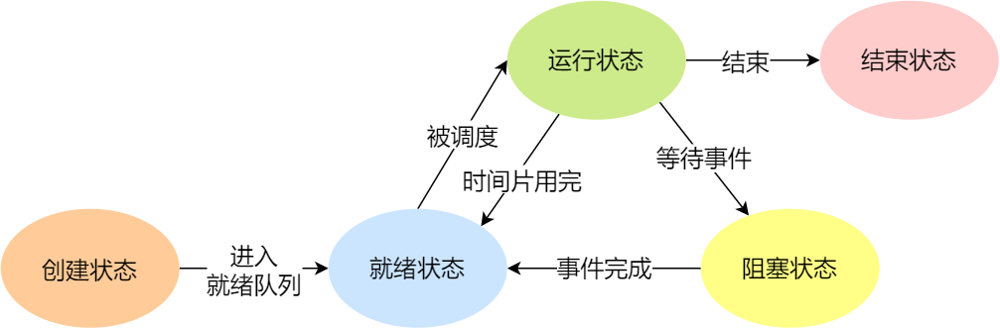

再来详细说明一下进程的状态变迁：

- *NULL -> 创建状态*：一个新进程被创建时的第一个状态；
- *创建状态 -> 就绪状态*：当进程被创建完成并初始化后，一切就绪准备运行时，变为就绪状态，这个过程是很快的；
- *就绪态 -> 运行状态*：处于就绪状态的进程被操作系统的进程调度器选中后，就分配给 CPU 正式运行该进程；
- *运行状态 -> 结束状态*：当进程已经运行完成或出错时，会被操作系统作结束状态处理；
- *运行状态 -> 就绪状态*：处于运行状态的进程在运行过程中，由于分配给它的运行时间片用完，操作系统会把该进程变为就绪态，接着从就绪态选中另外一个进程运行；
- *运行状态 -> 阻塞状态*：当进程请求某个事件且必须等待时，例如请求 I/O 事件；
- *阻塞状态 -> 就绪状态*：当进程要等待的事件完成时，它从阻塞状态变到就绪状态；

如果有大量处于阻塞状态的进程，进程可能会占用着物理内存空间，显然不是我们所希望的，毕竟物理内存空间是有限的，被阻塞状态的进程占用着物理内存就一种浪费物理内存的行为。

所以，在虚拟内存管理的操作系统中，通常会把阻塞状态的进程的物理内存空间换出到硬盘，等需要再次运行的时候，再从硬盘换入到物理内存。

那么，就需要一个新的状态，来**描述进程没有占用实际的物理内存空间的情况，这个状态就是挂起状态**。这跟阻塞状态是不一样，阻塞状态是等待某个事件的返回。

另外，挂起状态可以分为两种：

- 阻塞挂起状态：进程在外存（硬盘）并等待某个事件的出现；
- 就绪挂起状态：进程在外存（硬盘），但只要进入内存，即刻立刻运行；

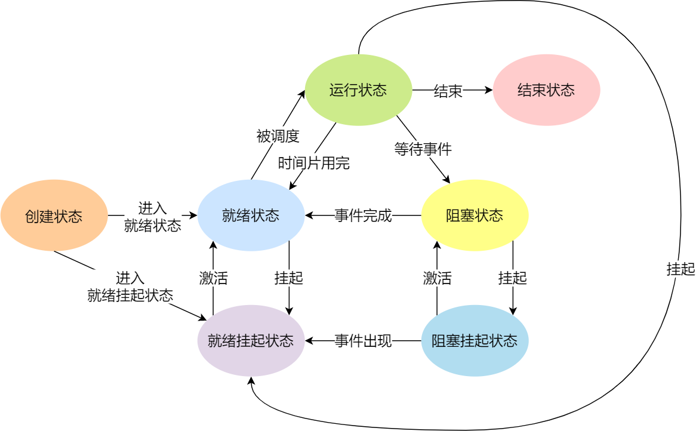

导致进程挂起的原因不只是因为进程所使用的内存空间不在物理内存，还包括如下情况：

- 通过 sleep 让进程间歇性挂起，其工作原理是设置一个定时器，到期后唤醒进程。
- 用户希望挂起一个程序的执行，比如在 Linux 中用 `Ctrl+Z` 挂起进程；

#### 进程的控制结构

在操作系统中，是用**进程控制块**（*process control block，PCB*）数据结构来描述进程的。

**PCB 是进程存在的唯一标识**，这意味着一个进程的存在，必然会有一个 PCB，如果进程消失了，那么 PCB 也会随之消失。

> PCB 具体包含什么信息呢？

**进程描述信息：**

- 进程标识符：标识各个进程，每个进程都有一个并且唯一的标识符；
- 用户标识符：进程归属的用户，用户标识符主要为共享和保护服务；

**进程控制和管理信息：**

- 进程当前状态，如 new、ready、running、waiting 或 blocked 等；
- 进程优先级：进程抢占 CPU 时的优先级；

**资源分配清单：**

- 有关内存地址空间或虚拟地址空间的信息，所打开文件的列表和所使用的 I/O 设备信息。

**CPU 相关信息：**

- CPU 中各个寄存器的值，当进程被切换时，CPU 的状态信息都会被保存在相应的 PCB 中，以便进程重新执行时，能从断点处继续执行。

> 每个 PCB 是如何组织的呢？

通常是通过**链表**的方式进行组织，把具有**相同状态的进程链在一起，组成各种队列**。比如：

- 将所有处于就绪状态的进程链在一起，称为**就绪队列**；
- 把所有因等待某事件而处于等待状态的进程链在一起就组成各种**阻塞队列**；
- 另外，对于运行队列在单核 CPU 系统中则只有一个运行指针了，因为单核 CPU 在某个时间，只能运行一个程序。

#### 进程的上下文切换

各个进程之间是共享 CPU 资源的，在不同的时候进程之间需要切换，让不同的进程可以在 CPU 执行，那么这个**一个进程切换到另一个进程运行，称为进程的上下文切换**。

进程是由内核管理和调度的，所以进程的切换只能发生在内核态。

所以，**进程的上下文切换不仅包含了虚拟内存、栈、全局变量等用户空间的资源，还包括了内核堆栈、寄存器等内核空间的资源。**

通常，会把交换的信息保存在进程的 PCB，当要运行另外一个进程的时候，我们需要从这个进程的 PCB 取出上下文，然后恢复到 CPU 中，这使得这个进程可以继续执行，如下图所示：

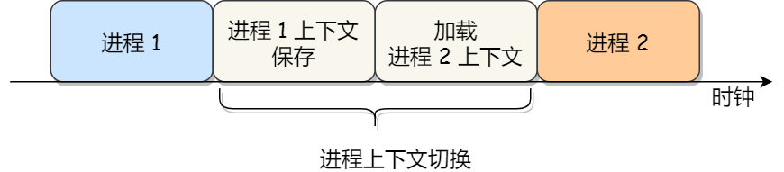

> 发生进程上下文切换有哪些场景？

- 为了保证所有进程可以得到公平调度，CPU 时间被划分为一段段的时间片，这些时间片再被轮流分配给各个进程。这样，当某个进程的时间片耗尽了，进程就从运行状态变为就绪状态，系统从就绪队列选择另外一个进程运行；
- 进程在系统资源不足（比如内存不足）时，要等到资源满足后才可以运行，这个时候进程也会被挂起，并由系统调度其他进程运行；
- 当进程通过睡眠函数 sleep 这样的方法将自己主动挂起时，自然也会重新调度；
- 当有优先级更高的进程运行时，为了保证高优先级进程的运行，当前进程会被挂起，由高优先级进程来运行；
- 发生硬件中断时，CPU 上的进程会被中断挂起，转而执行内核中的中断服务程序；

### 线程

#### 为什么使用线程？

对于多进程的这种方式，依然会存在问题：

- 进程之间如何通信，共享数据？
- 维护进程的系统开销较大，如创建进程时，分配资源、建立 PCB；终止进程时，回收资源、撤销 PCB；进程切换时，保存当前进程的状态信息；

那到底如何解决呢？需要有一种新的实体，满足以下特性：

- 实体之间可以并发运行；
- 实体之间共享相同的地址空间；

这个新的实体，就是**线程( Thread )**，线程之间可以并发运行且共享相同的地址空间。

#### 什么是线程？

**线程是进程当中的一条执行流程。**

同一个进程内多个线程之间可以共享代码段、数据段、打开的文件等资源，但每个线程各自都有一套独立的寄存器和栈，这样可以确保线程的控制流是相对独立的。

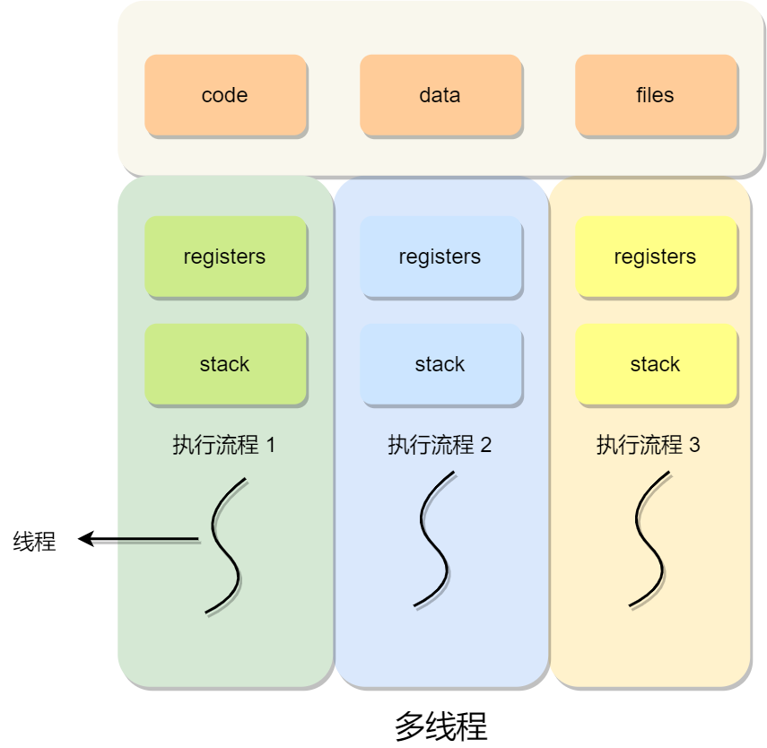

> 线程的优缺点？

线程的优点：

- 一个进程中可以同时存在多个线程；
- 各个线程之间可以并发执行；
- 各个线程之间可以共享地址空间和文件等资源；

线程的缺点：

- 当进程中的一个线程崩溃时，会导致其所属进程的所有线程崩溃。

#### 线程与进程的比较

线程与进程的比较如下：

- 进程是**资源（包括内存、打开的文件等）分配的单位**，**线程是 CPU 调度的单位；**
- 进程拥有一个完整的资源平台，**而线程只独享必不可少的资源，如寄存器和栈**；
- 线程同样具有就绪、阻塞、执行三种基本状态，同样具有状态之间的转换关系；
- 线程能减少并发执行的时间和空间开销；

对于，线程相比进程能减少开销，体现在：

- 线程的创建时间比进程快，因为进程在创建的过程中，还需要资源管理信息，比如内存管理信息、文件管理信息，而线程在创建的过程中，不会涉及这些资源管理信息，而是共享它们；
- 线程的终止时间比进程快，因为线程释放的资源相比进程少很多；
- 同一个进程内的线程切换比进程切换快，因为线程具有相同的地址空间（虚拟内存共享），这意味着同一个进程的线程都具有同一个页表，那么在切换的时候不需要切换页表。而对于进程之间的切换，切换的时候要把页表给切换掉，而页表的切换过程开销是比较大的；
- 由于同一进程的各线程间共享内存和文件资源，那么在线程之间数据传递的时候，就不需要经过内核了，这就使得线程之间的数据交互效率更高了；

所以，不管是时间效率，还是空间效率线程比进程都要高。

#### 线程的上下文切换

在前面我们知道了，线程与进程最大的区别在于：**线程是调度的基本单位，而进程则是资源拥有的基本单位**。

所以，所谓操作系统的任务调度，实际上的调度对象是线程，而进程只是给线程提供了虚拟内存、全局变量等资源。

对于线程和进程，我们可以这么理解：

- 当进程只有一个线程时，可以认为进程就等于线程；
- 当进程拥有多个线程时，这些线程会共享相同的虚拟内存和全局变量等资源，这些资源在上下文切换时是不需要修改的；

另外，线程也有自己的私有数据，比如栈和寄存器等，这些在上下文切换时也是需要保存的。

> 线程上下文切换的是什么？

这还得看线程是不是属于同一个进程：

- 当两个线程不是属于同一个进程，则切换的过程就跟进程上下文切换一样；
- **当两个线程是属于同一个进程，因为虚拟内存是共享的，所以在切换时，虚拟内存这些资源就保持不动，只需要切换线程的私有数据、寄存器等不共享的数据**；

所以，线程的上下文切换相比进程，开销要小很多。

#### 线程的实现

主要有三种线程的实现方式：

- **用户线程（User Thread）**：在用户空间实现的线程，不是由内核管理的线程，是由用户态的线程库来完成线程的管理；
- **内核线程（Kernel Thread）**：在内核中实现的线程，是由内核管理的线程；
- **轻量级进程（LightWeight Process）**：在内核中来支持用户线程；

那么，这还需要考虑一个问题，用户线程和内核线程的对应关系。

首先，第一种关系是**多对一**的关系，也就是多个用户线程对应同一个内核线程：

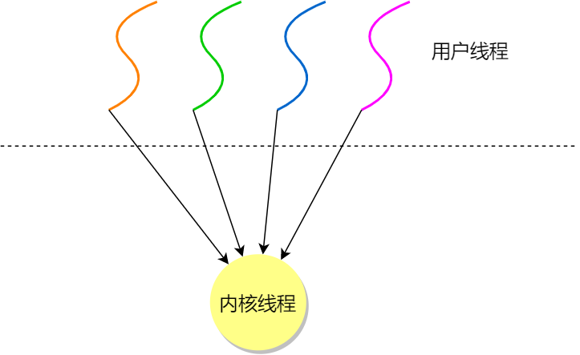

第二种是**一对一**的关系，也就是一个用户线程对应一个内核线程：

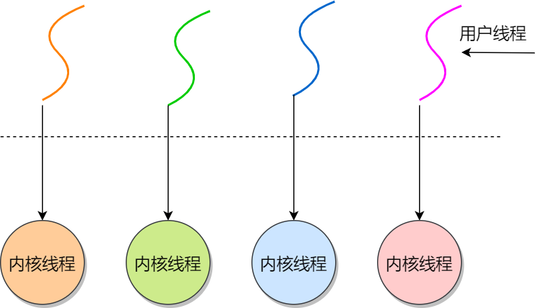

第三种是**多对多**的关系，也就是多个用户线程对应到多个内核线程：

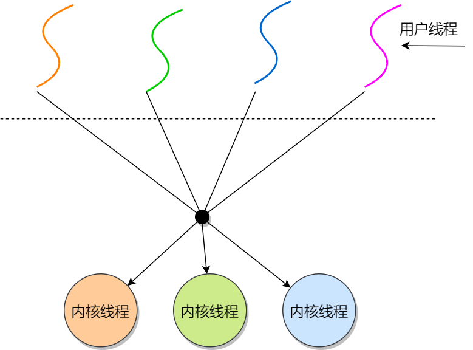

> 用户线程如何理解？存在什么优势和缺陷？

用户线程是基于用户态的线程管理库来实现的，那么**线程控制块（Thread Control Block, TCB）** 也是在库里面来实现的，对于操作系统而言是看不到这个 TCB 的，它只能看到整个进程的 PCB。

所以，**用户线程的整个线程管理和调度，操作系统是不直接参与的，而是由用户级线程库函数来完成线程的管理，包括线程的创建、终止、同步和调度等。**

用户级线程的模型，也就类似前面提到的**多对一**的关系，即多个用户线程对应同一个内核线程，如下图所示：

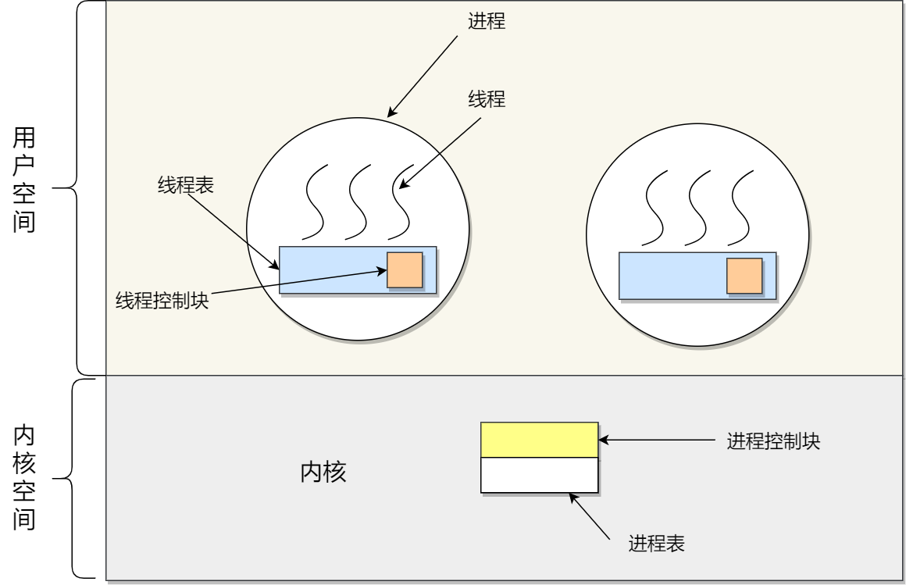

用户线程的**优点**：

- 每个进程都需要有它私有的线程控制块（TCB）列表，用来跟踪记录它各个线程状态信息（PC、栈指针、寄存器），TCB 由用户级线程库函数来维护，可用于不支持线程技术的操作系统；
- 用户线程的切换也是由线程库函数来完成的，无需用户态与内核态的切换，所以速度特别快；

用户线程的**缺点**：

- 由于操作系统不参与线程的调度，如果一个线程发起了系统调用而阻塞，那进程所包含的用户线程都不能执行了。
- 当一个线程开始运行后，除非它主动地交出 CPU 的使用权，否则它所在的进程当中的其他线程无法运行，因为用户态的线程没法打断当前运行中的线程，它没有这个特权，只有操作系统才有，但是用户线程不是由操作系统管理的。
- 由于时间片分配给进程，故与其他进程比，在多线程执行时，每个线程得到的时间片较少，执行会比较慢；

以上，就是用户线程的优缺点了。

> 那内核线程如何理解？存在什么优势和缺陷？

**内核线程是由操作系统管理的，线程对应的 TCB 自然是放在操作系统里的，这样线程的创建、终止和管理都是由操作系统负责。**

内核线程的模型，也就类似前面提到的**一对一**的关系，即一个用户线程对应一个内核线程，如下图所示：

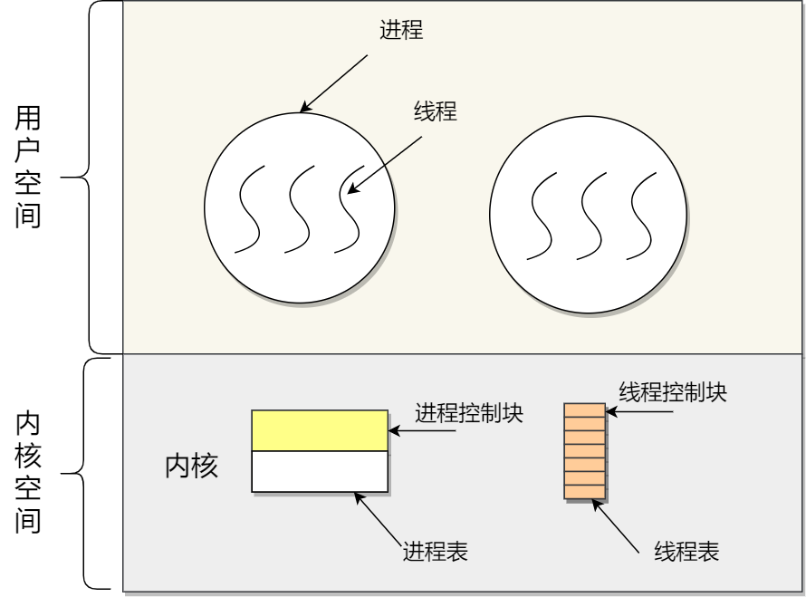

内核线程的**优点**：

- 在一个进程当中，如果某个内核线程发起系统调用而被阻塞，并不会影响其他内核线程的运行；
- 分配给线程，多线程的进程获得更多的 CPU 运行时间；

内核线程的**缺点**：

- 在支持内核线程的操作系统中，由内核来维护进程和线程的上下文信息，如 PCB 和 TCB；
- 线程的创建、终止和切换都是通过系统调用的方式来进行，因此对于系统来说，系统开销比较大；

以上，就是内核线程的优缺点了。

> 最后的轻量级进程如何理解？

**轻量级进程（Light-weight process，LWP）是内核支持的用户线程，一个进程可有一个或多个 LWP，每个 LWP 是跟内核线程一对一映射的，也就是 LWP 都是由一个内核线程支持，而且 LWP 是由内核管理并像普通进程一样被调度**。

在大多数系统中，**LWP与普通进程的区别也在于它只有一个最小的执行上下文和调度程序所需的统计信息**。一般来说，一个进程代表程序的一个实例，而 LWP 代表程序的执行线程，因为一个执行线程不像进程那样需要那么多状态信息，所以 LWP 也不带有这样的信息。

在 LWP 之上也是可以使用用户线程的，那么 LWP 与用户线程的对应关系就有三种：

- `1 : 1`，即一个 LWP 对应 一个用户线程；
- `N : 1`，即一个 LWP 对应多个用户线程；
- `M : N`，即多个 LWP 对应多个用户线程；

接下来针对上面这三种对应关系说明它们优缺点。先看下图的 LWP 模型：

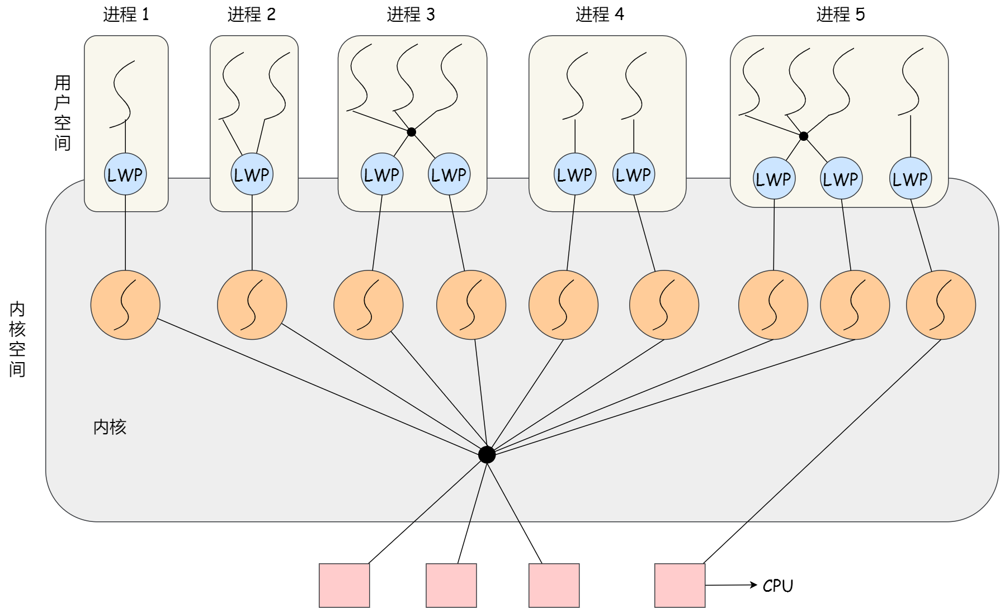

**1 : 1 模式**

一个线程对应到一个 LWP 再对应到一个内核线程，如上图的进程 4，属于此模型。

- 优点：实现并行，当一个 LWP 阻塞，不会影响其他 LWP；
- 缺点：每一个用户线程，就产生一个内核线程，创建线程的开销较大。

**N : 1 模式**

多个用户线程对应一个 LWP 再对应一个内核线程，如上图的进程 2，线程管理是在用户空间完成的，此模式中用户的线程对操作系统不可见。

- 优点：用户线程要开几个都没问题，且上下文切换发生用户空间，切换的效率较高；
- 缺点：一个用户线程如果阻塞了，则整个进程都将会阻塞，另外在多核 CPU 中，是没办法充分利用 CPU 的。

**M : N 模式**

根据前面的两个模型混搭一起，就形成 `M:N` 模型，该模型提供了两级控制，首先多个用户线程对应到多个 LWP，LWP 再一一对应到内核线程，如上图的进程 3。

- 优点：综合了前两种优点，大部分的线程上下文发生在用户空间，且多个线程又可以充分利用多核 CPU 的资源。

**组合模式**

如上图的进程 5，此进程结合 `1:1` 模型和 `M:N` 模型。开发人员可以针对不同的应用特点调节内核线程的数目来达到物理并行性和逻辑并行性的最佳方案。

# 调度算法

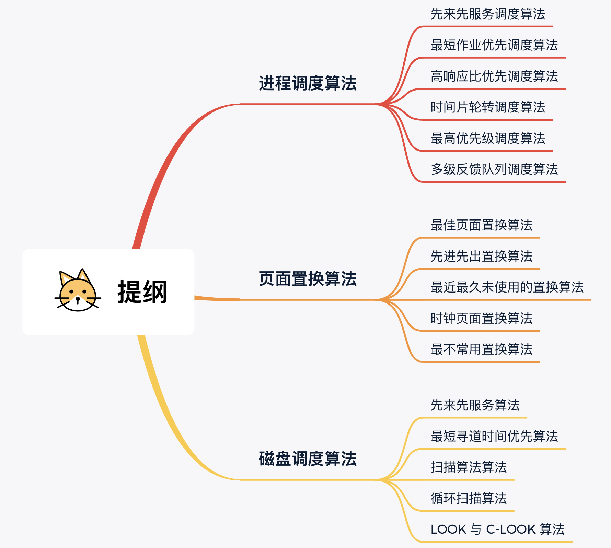

**非抢占式的意思就是，当进程正在运行时，它就会一直运行，直到该进程完成或发生某个事件而被阻塞时，才会把 CPU 让给其他进程。**

**而抢占式调度，顾名思义就是进程正在运行时，可以被打断，使其把 CPU 让给其他进程。那抢占的原则一般有三种，分别是时间片原则、优先权原则、短作业优先原则。**

## 进程调度算法

进程调度算法也称 CPU 调度算法，毕竟进程是由 CPU 调度的。

常见的调度算法：

- 先来先服务调度算法
- 最短作业优先调度算法
- 高响应比优先调度算法
- 时间片轮转调度算法
- 最高优先级调度算法
- 多级反馈队列调度算法

## 内存页面置换算法

在了解内存页面置换算法前，我们得先谈一下**缺页异常（缺页中断）**。

当 CPU 访问的页面不在物理内存时，便会产生一个缺页中断，请求操作系统将所缺页调入到物理内存。那它与一般中断的主要区别在于：

- 缺页中断在指令**执行「期间」**产生和处理中断信号，而一般中断在一条指令执行**「完成」后**检查和处理中断信号。
- 缺页中断返回到该指令的**开始**重新执行**「该指令」**，而一般中断返回回到该指令的**「下一个指令」执行。**

我们来看一下缺页中断的处理流程，如下图：

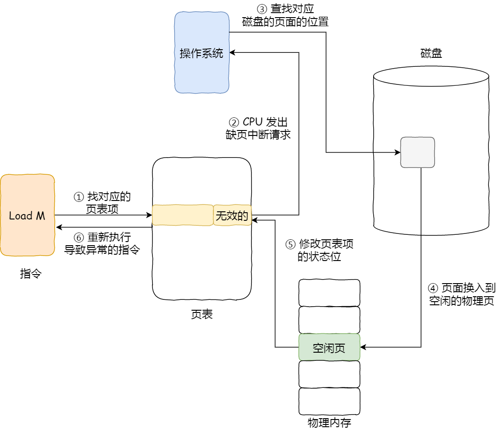

所以，页面置换算法的功能是，**当出现缺页异常，需调入新页面而内存已满时，选择被置换的物理页面**，也就是说选择一个物理页面换出到磁盘，然后把需要访问的页面换入到物理页。

那其算法目标则是，尽可能减少页面的换入换出的次数，常见的页面置换算法有如下几种：

- 最佳页面置换算法（*OPT*）

  **置换在「未来」最长时间不访问的页面**。这很理想，但是实际系统中无法实现，因为程序访问页面时是动态的，我们是无法预知每个页面在「下一次」访问前的等待时间。所以，最佳页面置换算法作用是为了衡量你的算法的效率，你的算法效率越接近该算法的效率，那么说明你的算法是高效的。

  

- 先进先出置换算法（*FIFO*）

**选择在内存驻留时间很长的页面进行中置换**。

- 最近最久未使用的置换算法（*LRU*）

**选择最长时间没有被访问的页面进行置换**。虽然 LRU 在理论上是可以实现的，但代价很高。为了完全实现 LRU，需要在内存中维护一个所有页面的链表，最近最多使用的页面在表头，最近最少使用的页面在表尾。

困难的是，在每次访问内存时都必须要更新「整个链表」。在链表中找到一个页面，删除它，然后把它移动到表头是一个非常费时的操作。

- 时钟页面置换算法（*Lock*）

时钟页面置换算法（比 LRU 多了一个访问位）就可以两者兼得，它跟 LRU 近似，又是对 FIFO 的一种改进。

该算法的思路是，把所有的页面都保存在一个类似钟面的「环形链表」中，**一个表针指向最老的页面（如果所有页面最近都访问过，那这可以确保淘汰的是最老的页面）**。

当发生缺页中断时，算法首先检查表针指向的页面：

- 如果它的访问位位是 0 就淘汰该页面，并把新的页面插入这个位置，然后把表针前移一个位置；
- 如果访问位是 1 就清除访问位，并把表针前移一个位置，重复这个过程直到找到了一个访问位为 0 的页面为止；

我画了一副时钟页面置换算法的工作流程图，你可以在下方看到：

- 最不常用置换算法（*LFU*）

最不常用（*LFU*）算法，这名字听起来很调皮，但是它的意思不是指这个算法不常用，而是**当发生缺页中断时，选择「访问次数」最少的那个页面，并将其淘汰**。

**它的实现方式是，对每个页面设置一个「访问计数器」，每当一个页面被访问时，该页面的访问计数器就累加 1。在发生缺页中断时，淘汰计数器值最小的那个页面。**

看起来很简单，每个页面加一个计数器就可以实现了，但是在操作系统中实现的时候，我们需要考虑效率和硬件成本的。

要增加一个计数器来实现，这个硬件成本是比较高的，另外如果要对这个计数器查找哪个页面访问次数最小，查找链表本身，如果链表长度很大，是非常耗时的，效率不高。

但还有个问题，LFU 算法只考虑了频率问题，没考虑时间的问题，比如有些页面在过去时间里访问的频率很高，但是现在已经没有访问了，而当前频繁访问的页面由于没有这些页面访问的次数高，在发生缺页中断时，就会可能会误伤当前刚开始频繁访问，但访问次数还不高的页面。

那这个问题的解决的办法还是有的，可以定期减少访问的次数，比如当发生时间中断时，把过去时间访问的页面的访问次数除以 2，也就说，随着时间的流失，以前的高访问次数的页面会慢慢减少，相当于加大了被置换的概率。

## 磁盘调度算法

磁盘调度算法的目的很简单，就是为了提高磁盘的访问性能，一般是通过优化磁盘的访问请求顺序来做到的。

常见的磁盘调度算法有：

- 先来先服务算法

但是如果大量进程竞争使用磁盘，请求访问的磁道可能会很分散，那先来先服务算法在性能上就会显得很差，因为寻道时间过长。

- 最短寻道时间优先算法

但这个算法可能存在某些请求的**饥饿**，因为本次例子我们是静态的序列，看不出问题，假设是一个动态的请求，如果后续来的请求都是小于 183 磁道的，那么 183 磁道可能永远不会被响应，于是就产生了饥饿现象，这里**产生饥饿的原因是磁头在一小块区域来回移动**。

- 扫描算法

**磁头在一个方向上移动，访问所有未完成的请求，直到磁头到达该方向上的最后的磁道，才调换方向，这就是扫描（\*Scan\*）算法**。

这种算法也叫做电梯算法，比如电梯保持按一个方向移动，直到在那个方向上没有请求为止，然后改变方向。

- 循环扫描算法

**只有磁头朝某个特定方向移动时，才处理磁道访问请求**，而返回时直接快速移动至最靠边缘的磁道，也就是复位磁头，这个过程是很快的，并且**返回中途不处理任何请求**，该算法的特点，就是**磁道只响应一个方向上的请求**。

- LOOK 与 C-LOOK 算法

那针对 SCAN 算法的优化则叫 LOOK 算法，它的工作方式，磁头在每个方向上仅仅移动到最远的请求位置，然后立即反向移动，而不需要移动到磁盘的最始端或最末端，**反向移动的途中会响应请求**。

而针对 C-SCAN 算法的优化则叫 C-LOOK，它的工作方式，磁头在每个方向上仅仅移动到最远的请求位置，然后立即反向移动，而不需要移动到磁盘的最始端或最末端，**反向移动的途中不会响应请求**。

# 网络系统

## 

**什么是 I / O 多路复用**

**进程可以通过一个系统调用函数从内核中获取多个事件**，即多个请求复用了一个进程，这就是多路复用，这种思想很类似一个 CPU 并发多个进程，所以也叫做时分多路复用。

select / poll 

select 实现多路复用的方式是，将已连接的 Socket 都放到一个**文件描述符集合**，然后调用 select 函数将文件描述符集合**拷贝**到内核里，让内核来检查是否有网络事件产生，检查的方式很粗暴，就是通过**遍历**文件描述符集合的方式，当检查到有事件产生后，将此 Socket 标记为可读或可写， 接着再把整个文件描述符集合**拷贝**回用户态里，然后用户态还需要再通过**遍历**的方法找到可读或可写的 Socket，然后再对其处理。

select 使用固定长度的 BitsMap，表示文件描述符集合，而且所支持的文件描述符的个数是有限制的，在 Linux 系统中，由内核中的 FD_SETSIZE 限制， 默认最大值为 `1024`，只能监听 0~1023 的文件描述符。

poll 不再用 BitsMap 来存储所关注的文件描述符，取而代之用动态数组，以链表形式来组织，突破了 select 的文件描述符个数限制，当然还会受到系统文件描述符限制。

但是 poll 和 select 并没有太大的本质区别，**都是使用「线性结构」存储进程关注的 Socket 集合，因此都需要遍历文件描述符集合来找到可读或可写的 Socket，时间复杂度为 O(n)，而且也需要在用户态与内核态之间拷贝文件描述符集合**，这种方式随着并发数上来，性能的损耗会呈指数级增长。

epoll

epoll 通过两个方面，很好解决了 select/poll 的问题。

*第一点*，epoll 在内核里使用**红黑树来跟踪进程所有待检测的文件描述字**，把需要监控的 socket 通过 `epoll_ctl()` 函数加入内核中的红黑树里，红黑树是个高效的数据结构，增删改一般时间复杂度是 `O(logn)`。而 select/poll 内核里没有类似 epoll 红黑树这种保存所有待检测的 socket 的数据结构，所以 select/poll 每次操作时都传入整个 socket 集合给内核，而 epoll 因为在内核维护了红黑树，可以保存所有待检测的 socket ，所以只需要传入一个待检测的 socket，减少了内核和用户空间大量的数据拷贝和内存分配。

*第二点*， epoll 使用**事件驱动**的机制，内核里**维护了一个链表来记录就绪事件**，当某个 socket 有事件发生时，通过**回调函数**内核会将其加入到这个就绪事件列表中，当用户调用 `epoll_wait()` 函数时，只会返回有事件发生的文件描述符的个数，不需要像 select/poll 那样轮询扫描整个 socket 集合，大大提高了检测的效率。