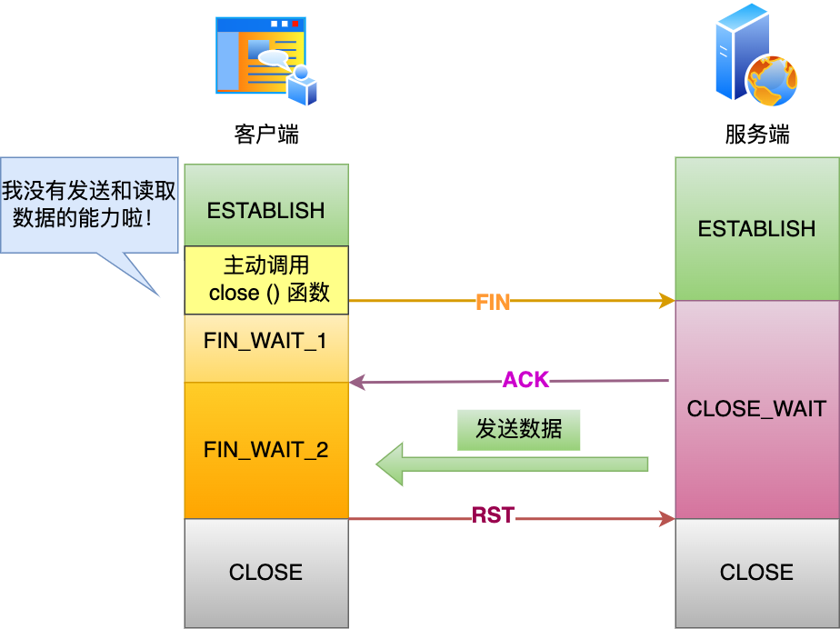
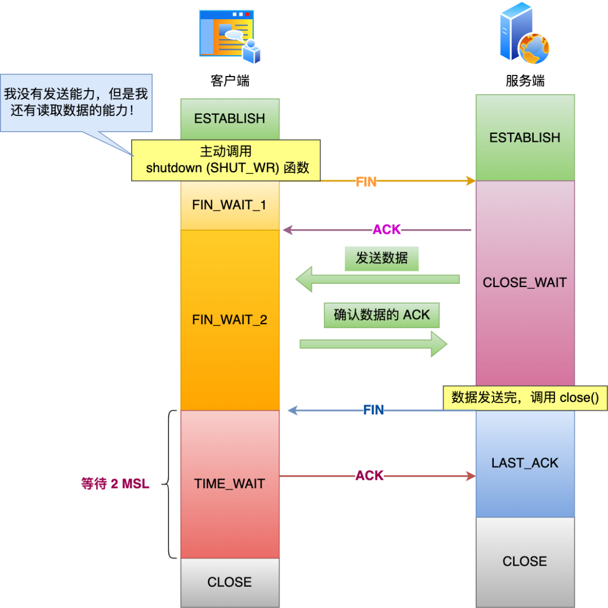
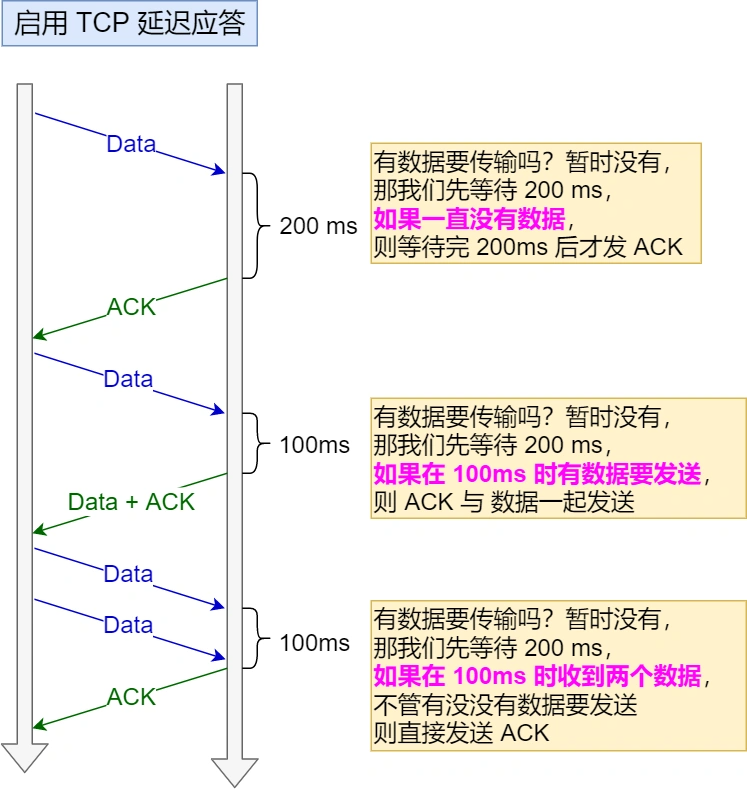

# 传输层

## TCP 基础问题

### 1、什么是 TCP 协议

TCP协议是**面向连接的、可靠的、基于字节流**的传输层通信协议

- **面向连接**：一定是「一对一」才能连接，不能像 UDP 协议可以一个主机同时向多个主机发送消息，也就是一对多是无法做到的；
- **可靠的**：无论的网络链路中出现了怎样的链路变化，TCP 都可以保证一个报文一定能够到达接收端；
- **字节流**：用户消息通过 TCP 协议传输时，消息可能会被操作系统「分组」成多个的 TCP 报文，如果接收方的程序如果不知道「消息的边界」，是无法读出一个有效的用户消息的。并且 TCP 报文是「有序的」，当「前一个」TCP 报文没有收到的时候，即使它先收到了后面的 TCP 报文，那么也不能扔给应用层去处理，同时对「重复」的 TCP 报文会自动丢弃。

### 2、什么是 TCP 连接？

**用于保证可靠性和流量控制维护的某些状态信息，这些信息的组合，包括 Socket、序列号和窗口大小称为连接。**

所以我们可以知道，建立一个 TCP 连接是需要客户端与服务端达成上述三个信息的共识。

- **Socket**：由 IP 地址和端口号组成（可靠性）
- **序列号**：用来解决乱序问题等（有序）
- **窗口大小**：用来做流量控制

### 3、如何唯一确定一个 TCP 连接

源地址和目的地址的字段（32 位）是在 IP 头部中，作用是通过 IP 协议发送报文给对方主机。

源端口和目的端口的字段（16 位）是在 TCP 头部中，作用是告诉 TCP 协议应该把报文发给哪个进程。

### 4、有一个 IP 的服务端监听了一个端口，它的 TCP 的最大连接数是多少？

服务端通常固定在某个本地端口上监听，等待客户端的连接请求。

因此，客户端 IP 和端口是可变的，其理论值计算公式如下:

对 IPv4，客户端的 IP 数最多为 `2` 的 `32` 次方，客户端的端口数最多为 `2` 的 `16` 次方，也就是服务端单机最大 TCP 连接数，约为 `2` 的 `48` 次方。

### 5、TCP 头格式有哪

**序列号**（seq）：在建立连接时由计算机生成的随机数作为其初始值，通过 SYN 包传给接收端主机，每发送一次数据，就「累加」一次该「数据字节数」的大小。**用来解决网络包乱序问题。**

**确认应答号(ack)**：指下一次「期望」收到的数据的序列号，发送端收到这个确认应答以后可以认为在这个序号以前的数据都已经被正常接收。**用来解决丢包的问题。**

**控制位(值为1时，表示对应的字段生效)：**

- *ACK*：该位为 `1` 时，「确认应答」的字段变为有效，**TCP 规定除了最初建立连接时的 `SYN` 包之外该位必须设置为 `1`** 。
- *RST*：该位为 `1` 时，表示 TCP 连接中**出现异常必须强制断开连接**。
- *SYN*：该位为 `1` 时，**表示希望建立连接**，并在其「序列号」的字段进行序列号初始值的设定。
- *FIN*：该位为 `1` 时，**表示今后不会再有数据发送，希望断开连接**。当通信结束希望断开连接时，通信双方的主机之间就可以相互交换 `FIN` 位为 1 的 TCP 段。

### 6、什么需要 TCP 协议？ TCP 工作在哪一层？

`IP` 层是「不可靠」的，**它不保证网络包的交付、不保证网络包的按序交付、也不保证网络包中的数据的完整性。**

如果需要保障网络数据包的可靠性，那么就需要由上层（传输层）的 `TCP` 协议来负责。

因为 TCP 是一个工作在**传输层**的**可靠**数据传输的服务，它能确保接收端接收的网络包是**无损坏、无间隔、非冗余和按序的。**

### 7、UDP 和 TCP 有什么区别呢？分别的应用场景是？

UDP 不提供复杂的控制机制，而是直接利用 IP 提供面向「无连接」的通信服务。其头部只有 `8` 个字节（64 位），UDP 的头部格式如下：

- 目标和源端口：主要是告诉 UDP 协议应该把报文发给哪个进程。
- 包长度：该字段保存了 UDP 首部的长度跟数据的长度之和。
- 校验和：校验和是为了提供可靠的 UDP 首部和数据而设计，防止收到在网络传输中受损的 UDP 包。

**TCP 和 UDP 区别：**

*1. 连接*

- TCP 是面向连接的传输层协议，传输数据前先要建立连接。
- UDP 是不需要连接，即刻传输数据。

*2. 服务对象*

- TCP 是一对一的两点服务，即一条连接只有两个端点。
- UDP 支持一对一、一对多、多对多的交互通信

*3. 可靠性*

- TCP 是可靠交付数据的，数据可以无差错、不丢失、不重复、按序到达。
- UDP 是尽最大努力交付，不保证可靠交付数据。但是我们可以基于 UDP 传输协议实现一个可靠的传输协议，比如 QUIC 协议，具体可以参见这篇文章：[如何基于 UDP 协议实现可靠传输？(opens new window)](https://xiaolincoding.com/network/3_tcp/quic.html)

*4. 拥塞控制、流量控制*

- TCP 有拥塞控制和流量控制机制，保证数据传输的安全性。
- UDP 则没有，即使网络非常拥堵了，也不会影响 UDP 的发送速率。

*5. 首部开销*

- TCP 首部长度较长，会有一定的开销，首部在没有使用「选项」字段时是 `20` 个字节，如果使用了「选项」字段则会变长的。
- UDP 首部只有 8 个字节，并且是固定不变的，开销较小。

*6. 传输方式*

- TCP 是流式传输，没有边界，但保证顺序和可靠。
- UDP 是一个包一个包的发送，是有边界的，但可能会丢包和乱序。

*7. 分片不同*

- TCP 的数据大小如果大于 MSS 大小，则会在传输层进行分片，目标主机收到后，也同样在传输层组装 TCP 数据包，如果中途丢失了一个分片，只需要传输丢失的这个分片。
- UDP 的数据大小如果大于 MTU 大小，则会在 IP 层进行分片，目标主机收到后，在 IP 层组装完数据，接着再传给传输层。

**TCP 和 UDP 应用场景：**

由于 TCP 是面向连接，能保证数据的可靠性交付，因此经常用于：

- `FTP` 文件传输；
- HTTP / HTTPS；

由于 UDP 面向无连接，它可以随时发送数据，再加上 UDP 本身的处理既简单又高效，因此经常用于：

- 包总量较少的通信，如 `DNS` 、`SNMP` 等；
- 视频、音频等多媒体通信；
- 广播通信；

### 8、TCP 和 UDP 可以使用同一个端口吗？

答案：**可以的**。

在数据链路层中，通过 MAC 地址来寻找局域网中的主机。在网际层中，通过 IP 地址来寻找网络中互连的主机或路由器。在传输层中，需要通过端口进行寻址，来识别同一计算机中同时通信的不同应用程序。

所以，传输层的「端口号」的作用，是为了区分同一个主机上不同应用程序的数据包。

传输层有两个传输协议分别是 TCP 和 UDP，在内核中是两个完全独立的软件模块。

当主机收到数据包后，可以在 IP 包头的「协议号」字段知道该数据包是 TCP/UDP，所以可以根据这个信息确定送给哪个模块（TCP/UDP）处理，送给 TCP/UDP 模块的报文根据「端口号」确定送给哪个应用程序处理。

## TCP 连接建立和断开

### 三次握手

#### 1、TCP 三次握手过程是怎样的？（客户端和服务器都发送一个seq和一个ack）

TCP 是面向连接的协议，所以使用 TCP 前必须先建立连接，而**建立连接是通过三次握手来进行的**。三次握手的过程如下图：

- 一开始，客户端和服务端都处于 `CLOSE` 状态。先是服务端主动监听某个端口，处于 `LISTEN` 状态

- 客户端会随机初始化序号（`client_isn`），将此序号置于 TCP 首部的「序号」字段中，同时把 `SYN` 标志位置为 `1`，表示 `SYN` 报文。接着把第一个 SYN 报文发送给服务端，表示向服务端发起连接，**该报文不包含应用层数据**，之后客户端处于 `SYN-SENT` 状态。

- 服务端收到客户端的 `SYN` 报文后，首先服务端也随机初始化自己的序号（`server_isn`），将此序号填入 TCP 首部的「序号」字段中，其次把 TCP 首部的「确认应答号」字段填入 `client_isn + 1`, 接着把 `SYN` 和 `ACK` 标志位置为 `1`。最后把该报文发给客户端，**该报文也不包含应用层数据**，之后服务端处于 `SYN-RCVD` 状态。

- 客户端收到服务端报文后，还要向服务端回应最后一个应答报文，首先该应答报文 TCP 首部 `ACK` 标志位置为 `1` ，其次「确认应答号」字段填入 `server_isn + 1` ，最后把报文发送给服务端，这次报文可以携带客户到服务端的数据，之后客户端处于 `ESTABLISHED` 状态。
- 服务端收到客户端的应答报文后，也进入 `ESTABLISHED` 状态。

从上面的过程可以发现**第三次握手是可以携带数据的，前两次握手是不可以携带数据的**，这也是面试常问的题。

一旦完成三次握手，双方都处于 `ESTABLISHED` 状态，此时连接就已建立完成，客户端和服务端就可以相互发送数据了

#### 2、为什么连接建立要这么复杂？

TCP 三次握手的目的是为了建立可靠的连接，确保数据能够准确无误地传输。在建立连接时，需要双方都确认对方的身份，以及双方的通信能力是否正常。如果只有两次握手，那么可能会出现这样一种情况：客户端发送了一个连接请求报文，但因为网络原因导致该报文丢失，此时服务器并不知道客户端想要建立连接。如果此时服务器向客户端发送一个确认报文，那么客户端会认为这是之前的连接请求报文的应答，从而建立连接。但实际上，这个连接请求报文已经丢失了，所以服务器和客户端之间并没有真正建立起连接。

#### 3、为什么是三次握手？不是两次、四次？

接下来，以三个方面分析三次握手的原因：

- 三次握手才可以阻止重复历史连接的初始化（主要原因）
- 三次握手才可以同步双方的初始序列号
- 三次握手才可以避免资源浪费

*原因一：避免历史连接*

简单来说，三次握手的**首要原因是为了防止旧的重复连接初始化造成混乱。**

我们考虑一个场景，客户端先发送了 SYN（seq = 90）报文，然后客户端宕机了，而且这个 SYN 报文还被网络阻塞了，服务端并没有收到，接着客户端重启后，又重新向服务端建立连接，发送了 SYN（seq = 100）报文（*注意！不是重传 SYN，重传的 SYN 的序列号是一样的*）。

看看三次握手是如何阻止历史连接的：

上述中的「旧 SYN 报文」称为历史连接，TCP 使用三次握手建立连接的**最主要原因就是防止「历史连接」初始化了连接**。

TIP

有很多人问，如果服务端在收到 RST 报文之前，先收到了「新 SYN 报文」，也就是服务端收到客户端报文的顺序是：「旧 SYN 报文」->「新 SYN 报文」，此时会发生什么?

当服务端第一次收到 SYN 报文，也就是收到 「旧 SYN 报文」时，就会回复 `SYN + ACK` 报文给客户端，此报文中的确认号是 91（90+1）。

然后这时再收到「新 SYN 报文」时，就会回 [Challenge Ack (opens new window)](https://xiaolincoding.com/network/3_tcp/challenge_ack.html)报文给客户端，**这个 ack 报文并不是确认收到「新 SYN 报文」的，而是上一次的 ack 确认号**，也就是91（90+1）。所以客户端收到此 ACK 报文时，发现自己期望收到的确认号应该是 101，而不是 91，于是就会回 RST 报文。

**如果是两次握手连接，就无法阻止历史连接**，那为什么 TCP 两次握手为什么无法阻止历史连接呢？

我先直接说结论，主要是因为**在两次握手的情况下，服务端没有中间状态给客户端来阻止历史连接，导致服务端可能建立一个历史连接，造成资源浪费**。

你想想，在两次握手的情况下，服务端在收到 SYN 报文后，就进入 ESTABLISHED 状态，意味着这时可以给对方发送数据，但是客户端此时还没有进入 ESTABLISHED 状态，假设这次是历史连接，客户端判断到此次连接为历史连接，那么就会回 RST 报文来断开连接，而服务端在第一次握手的时候就进入 ESTABLISHED 状态，所以它可以发送数据的，但是它并不知道这个是历史连接，它只有在收到 RST 报文后，才会断开连接。

可以看到，如果采用两次握手建立 TCP 连接的场景下，服务端在向客户端发送数据前，并没有阻止掉历史连接，导致服务端建立了一个历史连接，又白白发送了数据，妥妥地浪费了服务端的资源。

因此，**要解决这种现象，最好就是在服务端发送数据前，也就是建立连接之前，要阻止掉历史连接，这样就不会造成资源浪费，而要实现这个功能，就需要三次握手**。

所以，**TCP 使用三次握手建立连接的最主要原因是防止「历史连接」初始化了连接。**

>  TIP

有人问：客户端发送三次握手（ack 报文）后就可以发送数据了，而被动方此时还是 syn_received 状态，如果 ack 丢了，那客户端发的数据是不是也白白浪费了？

不是的，即使服务端还是在 syn_received 状态，收到了客户端发送的数据，还是可以建立连接的，并且还可以正常收到这个数据包。这是因为数据报文中是有 ack 标识位，也有确认号，这个确认号就是确认收到了第二次握手。如下图：

所以，服务端收到这个数据报文，是可以正常建立连接的，然后就可以正常接收这个数据包了。

*原因二：同步双方初始序列号*

TCP 协议的通信双方， 都必须维护一个「序列号」， 序列号是可靠传输的一个关键因素，它的作用：

- 接收方可以去除重复的数据；
- 接收方可以根据数据包的序列号按序接收；
- 可以标识发送出去的数据包中， 哪些是已经被对方收到的（通过 ACK 报文中的序列号知道）；

可见，序列号在 TCP 连接中占据着非常重要的作用，所以当客户端发送携带「初始序列号」的 `SYN` 报文的时候，需要服务端回一个 `ACK` 应答报文，表示客户端的 SYN 报文已被服务端成功接收，那当服务端发送「初始序列号」给客户端的时候，依然也要得到客户端的应答回应，**这样一来一回，才能确保双方的初始序列号能被可靠的同步。**

四次握手其实也能够可靠的同步双方的初始化序号，但由于**第二步和第三步可以优化成一步**，所以就成了「三次握手」。

**而两次握手只保证了一方的初始序列号能被对方成功接收，没办法保证双方的初始序列号都能被确认接收。**

*原因三：避免资源浪费*

如果只有「两次握手」，当客户端发生的 `SYN` 报文在网络中阻塞，客户端没有接收到 `ACK` 报文，就会重新发送 `SYN` ，**由于没有第三次握手，服务端不清楚客户端是否收到了自己回复的 `ACK` 报文，所以服务端每收到一个 `SYN` 就只能先主动建立一个连接**，这会造成什么情况呢？

如果客户端发送的 `SYN` 报文在网络中阻塞了，重复发送多次 `SYN` 报文，那么服务端在收到请求后就会**建立多个冗余的无效链接，造成不必要的资源浪费。**

即两次握手会造成消息滞留情况下，服务端重复接受无用的连接请求 `SYN` 报文，而造成重复分配资源。

#### 小结

TCP 建立连接时，通过三次握手**能防止历史连接的建立，能减少双方不必要的资源开销，能帮助双方同步初始化序列号**。序列号能够保证数据包不重复、不丢弃和按序传输。

不使用「两次握手」和「四次握手」的原因：

- 「两次握手」：无法防止历史连接的建立，会造成双方资源的浪费，也无法可靠的同步双方序列号；
- 「四次握手」：三次握手就已经理论上最少可靠连接建立，所以不需要使用更多的通信次数。

#### 4、为什么每次建立 TCP 连接时，初始化的序列号都要求不一样呢？

- 为了防止历史报文被下一个相同四元组的连接接收（主要方面）；
- 为了安全性，防止黑客伪造的相同序列号的 TCP 报文被对方接收；

#### 5、初始序列号 ISN 是如何随机产生的？

随机数是会基于时钟计时器递增的，基本不可能会随机成一样的初始化序列号。

#### 6、既然 IP 层会分片，为什么 TCP 层还需要 MSS 呢？

- `MTU`：一个网络包的最大长度，以太网中一般为 `1500` 字节；
- `MSS`：除去 IP 和 TCP 头部之后，一个网络包所能容纳的 TCP 数据的最大长度；

如果在 TCP 的整个报文（头部 + 数据）交给 IP 层进行分片，会有什么异常呢？

当 IP 层有一个超过 `MTU` 大小的数据（TCP 头部 + TCP 数据）要发送，那么 IP 层就要进行分片，把数据分片成若干片，保证每一个分片都小于 MTU。把一份 IP 数据报进行分片以后，由目标主机的 IP 层来进行重新组装后，再交给上一层 TCP 传输层。

这看起来井然有序，但这存在隐患的，**那么当如果一个 IP 分片丢失，整个 IP 报文的所有分片都得重传**。

因为 IP 层本身没有超时重传机制，它由传输层的 TCP 来负责超时和重传。

当某一个 IP 分片丢失后，接收方的 IP 层就无法组装成一个完整的 TCP 报文（头部 + 数据），也就无法将数据报文送到 TCP 层，所以接收方不会响应 ACK 给发送方，因为发送方迟迟收不到 ACK 确认报文，所以会触发超时重传，就会重发「整个 TCP 报文（头部 + 数据）」。

因此，可以得知由 IP 层进行分片传输，是非常没有效率的。

所以，为了达到最佳的传输效能 TCP 协议在**建立连接的时候通常要协商双方的 MSS 值**，当 TCP 层发现数据超过 MSS 时，则就先会进行分片，当然由它形成的 IP 包的长度也就不会大于 MTU ，自然也就不用 IP 分片了。

经过 TCP 层分片后，如果一个 TCP 分片丢失后，**进行重发时也是以 MSS 为单位**，而不用重传所有的分片，大大增加了重传的效率。

#### 7、第一次握手丢失了，会发生什么？

当客户端想和服务端建立 TCP 连接的时候，首先第一个发的就是 SYN 报文，然后进入到 `SYN_SENT` 状态。

在这之后，如果客户端迟迟收不到服务端的 SYN-ACK 报文（第二次握手），就会触发「超时重传」机制，重传 SYN 报文，而且**重传的 SYN 报文的序列号都是一样的**。

通常，第一次超时重传是在 1 秒后，第二次超时重传是在 2 秒，第三次超时重传是在 4 秒后，第四次超时重传是在 8 秒后，第五次是在超时重传 16 秒后。没错，**每次超时的时间是上一次的 2 倍**。

当第五次超时重传后，会继续等待 32 秒，如果服务端仍然没有回应 ACK，客户端就不再发送 SYN 包，然后断开 TCP 连接。

#### 8、第二次握手丢失了，会发生什么？

当服务端收到客户端的第一次握手后，就会回 SYN-ACK 报文给客户端，这个就是第二次握手，此时服务端会进入 `SYN_RCVD` 状态。

第二次握手的 `SYN-ACK` 报文其实有两个目的 ：

- 第二次握手里的 ACK， 是对第一次握手的确认报文；
- 第二次握手里的 SYN，是服务端发起建立 TCP 连接的报文；

所以，如果第二次握手丢了，就会发生比较有意思的事情，具体会怎么样呢？

因为第二次握手报文里是包含对客户端的第一次握手的 ACK 确认报文，所以，如果客户端迟迟没有收到第二次握手，那么客户端就觉得可能自己的 SYN 报文（第一次握手）丢失了，于是**客户端就会触发超时重传机制，重传 SYN 报文**。

然后，因为第二次握手中包含服务端的 SYN 报文，所以当客户端收到后，需要给服务端发送 ACK 确认报文（第三次握手），服务端才会认为该 SYN 报文被客户端收到了。

那么，如果第二次握手丢失了，服务端就收不到第三次握手，于是**服务端这边会触发超时重传机制，重传 SYN-ACK 报文**。

因此，当第二次握手丢失了，客户端和服务端都会重传：

- 客户端会重传 SYN 报文，也就是第一次握手，最大重传次数由 `tcp_syn_retries`内核参数决定；
- 服务端会重传 SYN-ACK 报文，也就是第二次握手，最大重传次数由 `tcp_synack_retries` 内核参数决定。

#### 9、第三次握手丢失了，会发生什么？

客户端收到服务端的 SYN-ACK 报文后，就会给服务端回一个 ACK 报文，也就是第三次握手，此时客户端状态进入到 `ESTABLISH` 状态。

因为这个第三次握手的 ACK 是对第二次握手的 SYN 的确认报文，所以当第三次握手丢失了，如果服务端那一方迟迟收不到这个确认报文，就会触发超时重传机制，重传 SYN-ACK 报文，直到收到第三次握手，或者达到最大重传次数。

注意，**ACK 报文是不会有重传的，当 ACK 丢失了，就由对方重传对应的报文**。

#### 10、什么是 SYN 攻击？如何避免 SYN 攻击？

我们都知道 TCP 连接建立是需要三次握手，假设攻击者短时间伪造不同 IP 地址的 `SYN` 报文，服务端每接收到一个 `SYN` 报文，就进入`SYN_RCVD` 状态，但服务端发送出去的 `ACK + SYN` 报文，无法得到未知 IP 主机的 `ACK` 应答，久而久之就会**占满服务端的半连接队列**，使得服务端不能为正常用户服务。

SYN 攻击方式最直接的表现就会把 TCP 半连接队列打满，这样**当 TCP 半连接队列满了，后续再在收到 SYN 报文就会丢弃**，导致客户端无法和服务端建立连接。

避免 SYN 攻击方式，可以有以下四种方法：

- 调大 netdev_max_backlog；
- 增大 TCP 半连接队列；
- 开启 tcp_syncookies；
- 减少 SYN+ACK 重传次数

### 四次挥手

#### 1、TCP 四次挥手过程是怎样的？

双方都可以主动断开连接，断开连接后主机中的「资源」将被释放，四次挥手的过程如下图：

- 客户端打算关闭连接，此时会发送一个 TCP 首部 `FIN` 标志位被置为 `1` 的报文，也即 `FIN` 报文，之后客户端进入 `FIN_WAIT_1` 状态。
- 服务端收到该报文后，就向客户端发送 `ACK` 应答报文，接着服务端进入 `CLOSE_WAIT` 状态。
- 客户端收到服务端的 `ACK` 应答报文后，之后进入 `FIN_WAIT_2` 状态。
- 等待服务端处理完数据后，也向客户端发送 `FIN` 报文，之后服务端进入 `LAST_ACK` 状态。
- 客户端收到服务端的 `FIN` 报文后，回一个 `ACK` 应答报文，之后进入 `TIME_WAIT` 状态
- 服务端收到了 `ACK` 应答报文后，就进入了 `CLOSE` 状态，至此服务端已经完成连接的关闭。
- 客户端在经过 `2MSL` 一段时间后，自动进入 `CLOSE` 状态，至此客户端也完成连接的关闭。

你可以看到，每个方向都需要**一个 FIN 和一个 ACK**，因此通常被称为**四次挥手**。

这里一点需要注意是：**主动关闭连接的，才有 TIME_WAIT 状态。**

#### 2、为什么挥手需要四次？

再来回顾下四次挥手双方发 `FIN` 包的过程，就能理解为什么需要四次了。

- 关闭连接时，客户端向服务端发送 `FIN` 时，仅仅表示客户端不再发送数据了但是还能接收数据。
- 服务端收到客户端的 `FIN` 报文时，先回一个 `ACK` 应答报文，而服务端可能还有数据需要处理和发送，等服务端不再发送数据时，才发送 `FIN` 报文给客户端来表示同意现在关闭连接。

从上面过程可知，服务端通常需要等待完成数据的发送和处理，所以服务端的 `ACK` 和 `FIN` 一般都会分开发送，因此是需要四次挥手。

但是**在特定情况下，四次挥手是可以变成三次挥手的**

#### 3、TCP 关闭连接函数

##### 粗暴关闭 vs 优雅关闭

前面介绍 TCP 四次挥手的时候，并没有详细介绍关闭连接的函数，其实关闭的连接的函数有两种函数：

- **close 函数，同时 socket 关闭发送方向和读取方向，也就是 socket 不再有发送和接收数据的能力。**如果有多进程/多线程共享同一个 socket，如果有一个进程调用了 close 关闭只是让 socket 引用计数 -1，并不会导致 socket 不可用，同时也不会发出 FIN 报文，其他进程还是可以正常读写该 socket，直到引用计数变为 0，才会发出 FIN 报文。
- **shutdown 函数，可以指定 socket 只关闭发送方向而不关闭读取方向，也就是 socket 不再有发送数据的能力，但是还是具有接收数据的能力。**如果有多进程/多线程共享同一个 socket，shutdown 则不管引用计数，直接使得该 socket 不可用，然后发出 FIN 报文，如果有别的进程企图使用该 socket，将会受到影响。

如果客户端是用 close 函数来关闭连接，那么在 TCP 四次挥手过程中，**如果收到了服务端发送的数据，由于客户端已经不再具有发送和接收数据的能力，所以客户端的内核会回 RST 报文给服务端，**然后内核会释放连接，这时就不会经历完成的 TCP 四次挥手，所以我们常说，调用 close 是粗暴的关闭。

当服务端收到 RST 后，内核就会释放连接，当服务端应用程序再次发起读操作或者写操作时，就能感知到连接已经被释放了：

- 如果是读操作，则会返回 RST 的报错，也就是我们常见的Connection reset by peer。
- 如果是写操作，那么程序会产生 SIGPIPE 信号，应用层代码可以捕获并处理信号，如果不处理，则默认情况下进程会终止，异常退出。

相对的，**shutdown 函数因为可以指定只关闭发送方向而不关闭读取方向**，所以即使在 TCP 四次挥手过程中，如果收到了服务端发送的数据，客户端也是可以正常读取到该数据的，然后就会经历完整的 TCP 四次挥手，所以我们常说，调用 shutdown 是优雅的关闭。

但是注意，shutdown 函数也可以指定「只关闭读取方向，而不关闭发送方向」，但是这时候内核是不会发送 FIN 报文的，因为发送 FIN 报文是意味着我方将不再发送任何数据，而 shutdown 如果指定「不关闭发送方向」，就意味着 socket 还有发送数据的能力，所以内核就不会发送 FIN。

对于 close 函数关闭的连接，由于无法再发送和接收数据，所以`FIN_WAIT2` 状态不可以持续太久，而 `tcp_fin_timeout` 控制了这个状态下连接的持续时长，默认值是 60 秒。

这意味着对于调用 close 关闭的连接，如果在 60 秒后还没有收到 FIN 报文，客户端（主动关闭方）的连接就会直接关闭，如下图：

但是注意，如果主动关闭方使用 shutdown 函数关闭连接，指定了只关闭发送方向，而接收方向并没有关闭，那么意味着主动关闭方还是可以接收数据的。

此时，如果主动关闭方一直没收到第三次挥手，那么主动关闭方的连接将会一直处于 `FIN_WAIT2` 状态（`tcp_fin_timeout` 无法控制 shutdown 关闭的连接）。如下图：

#### 4、TCP 四次挥手，可以变成三次吗？

当被动关闭方（上图的服务端）在 TCP 挥手过程中，「**没有数据要发送」并且「开启了 TCP 延迟确认机制」，那么第二和第三次挥手就会合并传输，这样就出现了三次挥手。**

虽然我们在学习 TCP 挥手时，学到的是需要四次来完成 TCP 挥手，但是**在一些情况下， TCP 四次挥手是可以变成 TCP 三次挥手的**。

> FIN 报文一定得调用关闭连接的函数，才会发送吗？

不一定。

如果进程退出了，不管是不是正常退出，还是异常退出（如进程崩溃），内核都会发送 FIN 报文，与对方完成四次挥手。

然后因为 TCP 延迟确认机制是默认开启的，所以导致我们抓包时，看见三次挥手的次数比四次挥手还多。

> 什么是 TCP 延迟确认机制？

当发送没有携带数据的 ACK，它的网络效率也是很低的，因为它也有 40 个字节的 IP 头 和 TCP 头，但却没有携带数据报文。 为了解决 ACK 传输效率低问题，所以就衍生出了 **TCP 延迟确认**。 TCP 延迟确认的策略：

- **当有响应数据要发送时，ACK 会随着响应数据一起立刻发送给对方**
- **当没有响应数据要发送时，ACK 将会延迟一段时间，以等待是否有响应数据可以一起发送**
- ==**如果在延迟等待发送 ACK 期间，对方的第二个数据报文又到达了，这时就会立刻发送 ACK**==

#### 5、挥手丢失会发生什么事

##### 1、第一次挥手丢失了，会发生什么？

当客户端（主动关闭方）调用 close 函数后，就会向服务端发送 FIN 报文，试图与服务端断开连接，此时客户端的连接进入到 `FIN_WAIT_1` 状态。

正常情况下，如果能及时收到服务端（被动关闭方）的 ACK，则会很快变为 `FIN_WAIT2`状态。

如果第一次挥手丢失了，那么客户端迟迟收不到被动方的 ACK 的话，也就会触发超时重传机制，重传 FIN 报文，重发次数由 `tcp_orphan_retries` 参数控制。

当客户端重传 FIN 报文的次数超过 `tcp_orphan_retries` 后，就不再发送 FIN 报文，则会在等待一段时间（时间为上一次超时时间的 2 倍），如果还是没能收到第二次挥手，那么直接进入到 `close` 状态。

举个例子，假设 tcp_orphan_retries 参数值为 3，当第一次挥手一直丢失时，发生的过程如下图：

##### 2、第二次挥手丢失了，会发生什么？

当服务端收到客户端的第一次挥手后，就会先回一个 ACK 确认报文，此时服务端的连接进入到 `CLOSE_WAIT` 状态。

在前面我们也提了，ACK 报文是不会重传的，所以如果服务端的第二次挥手丢失了，客户端就会触发超时重传机制，重传 FIN 报文，直到收到服务端的第二次挥手，或者达到最大的重传次数。

举个例子，假设 tcp_orphan_retries 参数值为 2，当第二次挥手一直丢失时，发生的过程如下图：

##### 3、第三次挥手丢失了，会发生什么？

当服务端（被动关闭方）收到客户端（主动关闭方）的 FIN 报文后，内核会自动回复 ACK，同时连接处于 `CLOSE_WAIT` 状态，顾名思义，它表示等待应用进程调用 close 函数关闭连接。

此时，内核是没有权利替代进程关闭连接，必须由进程主动调用 close 函数来触发服务端发送 FIN 报文。

服务端处于 CLOSE_WAIT 状态时，调用了 close 函数，内核就会发出 FIN 报文，同时连接进入 LAST_ACK 状态，等待客户端返回 ACK 来确认连接关闭。

如果迟迟收不到这个 ACK，服务端就会重发 FIN 报文，重发次数仍然由 `tcp_orphan_retrie`s 参数控制，这与客户端重发 FIN 报文的重传次数控制方式是一样的。

举个例子，假设 `tcp_orphan_retrie`s = 3，当第三次挥手一直丢失时，发生的过程如下图：

**客户端因为是通过 close 函数关闭连接的，处于 FIN_WAIT_2 状态是有时长限制的，如果 tcp_fin_timeout 时间内还是没能收到服务端的第三次挥手（FIN 报文），那么客户端就会断开连接。**

##### 4、第四次挥手丢失了，会发生什么？

当客户端收到服务端的第三次挥手的 FIN 报文后，就会回 ACK 报文，也就是第四次挥手，此时客户端连接进入 `TIME_WAIT` 状态。

在 Linux 系统，TIME_WAIT 状态会持续 2MSL 后才会进入关闭状态。

然后，服务端（被动关闭方）没有收到 ACK 报文前，还是处于 LAST_ACK 状态。

如果第四次挥手的 ACK 报文没有到达服务端，服务端就会重发 FIN 报文，重发次数仍然由前面介绍过的 `tcp_orphan_retries` 参数控制。

举个例子，假设 tcp_orphan_retries 为 2，当第四次挥手一直丢失时，发生的过程如下：

#### 6、TIME_WAIT 状态

##### 1、为什么 TIME_WAIT 等待的时间是 2MSL？

`MSL` 是 Maximum Segment Lifetime，**报文最大生存时间**，它是任何报文在网络上存在的最长时间，超过这个时间报文将被丢弃。因为 TCP 报文基于是 IP 协议的，而 IP 头中有一个 `TTL` 字段，是 IP 数据报可以经过的最大路由数，每经过一个处理他的路由器此值就减 1，当此值为 0 则数据报将被丢弃，同时发送 ICMP 报文通知源主机。

MSL 与 TTL 的区别： MSL 的单位是时间，而 TTL 是经过路由跳数。所以 **MSL 应该要大于等于 TTL 消耗为 0 的时间**，以确保报文已被自然消亡。

**TTL 的值一般是 64，Linux 将 MSL 设置为 30 秒，意味着 Linux 认为数据报文经过 64 个路由器的时间不会超过 30 秒，如果超过了，就认为报文已经消失在网络中了**。

TIME_WAIT 等待 2 倍的 MSL，比较合理的解释是： 网络中可能存在来自发送方的数据包，当这些发送方的数据包被接收方处理后又会向对方发送响应，所以**一来一回需要等待 2 倍的时间**。

可以看到 **2MSL时长** 这其实是相当于**至少允许报文丢失一次**。比如，若 ACK 在一个 MSL 内丢失，这样被动方重发的 FIN 会在第 2 个 MSL 内到达，TIME_WAIT 状态的连接可以应对。

为什么不是 4 或者 8 MSL 的时长呢？你可以想象一个丢包率达到百分之一的糟糕网络，连续两次丢包的概率只有万分之一，这个概率实在是太小了，忽略它比解决它更具性价比。

`2MSL` 的时间是从**客户端接收到 FIN 后发送 ACK 开始计时的**。如果在 TIME-WAIT 时间内，因为客户端的 ACK 没有传输到服务端，客户端又接收到了服务端重发的 FIN 报文，那么 **2MSL 时间将重新计时**。

##### 2、为什么需要 TIME_WAIT 状态？

主动发起关闭连接的一方，才会有 `TIME-WAIT` 状态。

需要 TIME-WAIT 状态，主要是两个原因：

- 防止历史连接中的数据，被后面相同四元组的连接错误的接收；
- 保证「被动关闭连接」的一方，能被正确的关闭；

##### 3、TIME_WAIT 过多有什么危害？

过多的 TIME-WAIT 状态主要的危害有两种：

- 第一是占用系统资源，比如文件描述符、内存资源、CPU 资源、线程资源等；
- 第二是占用端口资源，端口资源也是有限的，一般可以开启的端口为 `32768～61000`，也可以通过 `net.ipv4.ip_local_port_range`参数指定范围。

##### 4、如何优化 TIME_WAIT？

- **复用处于 TIME_WAIT 的 socket 为新的连接所用**。
- **当系统中处于 TIME_WAIT 的连接一旦超过这个值时，系统就会将后面的 TIME_WAIT 连接状态重置**
- 如果`l_onoff`为非 0， 且`l_linger`值为 0，那么调用`close`后，会立该发送一个`RST`标志给对端，该 TCP 连接将跳过四次挥手，也就跳过了`TIME_WAIT`状态，直接关闭。

##### 5、服务器出现大量 TIME_WAIT 状态的原因有哪些？

首先要知道 TIME_WAIT 状态是主动关闭连接方才会出现的状态，所以如果服务器出现大量的 TIME_WAIT 状态的 TCP 连接，就是说明服务器主动断开了很多 TCP 连接。

- 第一个场景：HTTP 没有使用长连接

  **当服务端出现大量的 TIME_WAIT 状态连接的时候，可以排查下是否客户端和服务端都开启了 HTTP Keep-Alive**，因为任意一方没有开启 HTTP Keep-Alive，都会导致服务端在处理完一个 HTTP 请求后，就主动关闭连接，此时服务端上就会出现大量的 TIME_WAIT 状态的连接。

- 第二个场景：HTTP 长连接超时

  当服务端出现大量 TIME_WAIT 状态的连接时，如果现象是有大量的客户端建立完 TCP 连接后，很长一段时间没有发送数据，那么大概率就是因为 HTTP 长连接超时，导致服务端主动关闭连接，产生大量处于 TIME_WAIT 状态的连接。

- 第三个场景：HTTP 长连接的请求数量达到上限

#### 7、如果已经建立了连接，但是客户端突然出现故障了怎么办？

客户端出现故障指的是客户端的主机发生了宕机，或者断电的场景。发生这种情况的时候，如果服务端一直不会发送数据给客户端，那么服务端是永远无法感知到客户端宕机这个事件的，也就是服务端的 TCP 连接将一直处于 `ESTABLISH` 状态，占用着系统资源。

为了避免这种情况，TCP 搞了个**保活机制**。这个机制的原理是这样的：

定义一个时间段，在这个时间段内，如果没有任何连接相关的活动，TCP 保活机制会开始作用，每隔一个时间间隔，发送一个探测报文，该探测报文包含的数据非常少，如果连续几个探测报文都没有得到响应，则认为当前的 TCP 连接已经死亡，系统内核将错误信息通知给上层应用程序。

如果开启了 TCP 保活，需要考虑以下几种情况：

- 第一种，对端程序是正常工作的。当 TCP 保活的探测报文发送给对端, 对端会正常响应，这样 **TCP 保活时间会被重置**，等待下一个 TCP 保活时间的到来。
- 第二种，对端主机宕机并重启。当 TCP 保活的探测报文发送给对端后，对端是可以响应的，但由于没有该连接的有效信息，**会产生一个 RST 报文**，这样很快就会发现 TCP 连接已经被重置。
- 第三种，是对端主机宕机（*注意不是进程崩溃，进程崩溃后操作系统在回收进程资源的时候，会发送 FIN 报文，而主机宕机则是无法感知的，所以需要 TCP 保活机制来探测对方是不是发生了主机宕机*），或对端由于其他原因导致报文不可达。当 TCP 保活的探测报文发送给对端后，石沉大海，没有响应，连续几次，达到保活探测次数后，**TCP 会报告该 TCP 连接已经死亡**。

TCP 保活的这个机制检测的时间是有点长，我们可以自己在应用层实现一个心跳机制。

比如，web 服务软件一般都会提供 `keepalive_timeout` 参数，用来指定 HTTP 长连接的超时时间。如果设置了 HTTP 长连接的超时时间是 60 秒，web 服务软件就会**启动一个定时器**，如果客户端在完成一个 HTTP 请求后，在 60 秒内都没有再发起新的请求，**定时器的时间一到，就会触发回调函数来释放该连接。**

#### 8、如果已经建立了连接，但是服务端的进程崩溃会发生什么？

TCP 的连接信息是由内核维护的，所以当服务端的进程崩溃后，内核需要回收该进程的所有 TCP 连接资源，于是内核会发送第一次挥手 FIN 报文，后续的挥手过程也都是在内核完成，并不需要进程的参与，所以即使服务端的进程退出了，还是能与客户端完成 TCP 四次挥手的过程。

#### 9、没有 accept，能建立 TCP 连接吗？

答案：**可以的**。

accpet 系统调用并不参与 TCP 三次握手过程，它只是负责从 TCP 全连接队列取出一个已经建立连接的 socket，用户层通过 accpet 系统调用拿到了已经建立连接的 socket，就可以对该 socket 进行读写操作了。

##### 为什么半连接队列要设计成哈希表

先对比下**全连接里队列**，他本质是个链表，因为也是线性结构，说它是个队列也没毛病。它里面放的都是已经建立完成的连接，这些连接正等待被取走。而服务端取走连接的过程中，并不关心具体是哪个连接，只要是个连接就行，所以直接从队列头取就行了。这个过程算法复杂度为`O(1)`。

而**半连接队列**却不太一样，因为队列里的都是不完整的连接，嗷嗷等待着第三次握手的到来。那么现在有一个第三次握手来了，则需要从队列里把相应IP端口的连接取出，**如果半连接队列还是个链表，那我们就需要依次遍历，才能拿到我们想要的那个连接，算法复杂度就是O(n)。**

而如果将半连接队列设计成哈希表，那么查找半连接的算法复杂度就回到`O(1)`了。

因此出于效率考虑，全连接队列被设计成链表，而半连接队列被设计为哈希表。

## TCP 重传、滑动窗口、流量控制、拥塞控制

### 重传机制

#### 超时重传

重传机制的其中一个方式，就是在发送数据时，设定一个定时器，当超过指定的时间后，没有收到对方的 `ACK` 确认应答报文，就会重发该数据，也就是我们常说的**超时重传**。

TCP 会在以下两种情况发生超时重传：

- 数据包丢失
- 确认应答丢失

#### 快速重传

TCP 还有另外一种**快速重传（Fast Retransmit）机制**，它**不以时间为驱动，而是以数据驱动重传**。

快速重传机制，是如何工作的呢？其实很简单，一图胜千言。TCP 还有另外一种**快速重传（Fast Retransmit）机制**，它**不以时间为驱动，而是以数据驱动重传**。

快速重传机制，是如何工作的呢？其实很简单，一图胜千言。

#### SACK

还有一种实现重传机制的方式叫：`SACK`（ Selective Acknowledgment）， **选择性确认**。

这种方式需要在 TCP 头部「选项」字段里加一个 `SACK` 的东西，它**可以将已收到的数据的信息发送给「发送方」**，这样发送方就可以知道哪些数据收到了，哪些数据没收到，知道了这些信息，就可以**只重传丢失的数据**。

如下图，发送方收到了三次同样的 ACK 确认报文，于是就会触发快速重发机制，通过 `SACK` 信息发现只有 `200~299` 这段数据丢失，则重发时，就只选择了这个 TCP 段进行重复。

#### D-SACK

Duplicate SACK 又称 `D-SACK`，其主要**使用了 SACK 来告诉「发送方」有哪些数据被重复接收了。**

下面举例两个栗子，来说明 `D-SACK` （ACK 大于 SACK）的作用。

*栗子一号：ACK 丢包*

**于是「接收方」发现数据是重复收到的，于是回了一个 SACK = 3000~3500**，告诉「发送方」 3000~3500 的数据早已被接收了（此时因为ACK大于SACK，因此发送方知道这是一个D-SACK），因为 ACK 都到了 4000 了，已经意味着 4000 之前的所有数据都已收到，所以这个 SACK 就代表着 `D-SACK`。

可见，`D-SACK` 有这么几个好处：

1. 可以让「发送方」知道，是发出去的包丢了，还是接收方回应的 ACK 包丢了;
2. 可以知道是不是「发送方」的数据包被网络延迟了;
3. 可以知道网络中是不是把「发送方」的数据包给复制了;

### 滑动窗口

那么有了窗口，就可以指定窗口大小，窗口大小就是指**无需等待确认应答，而可以继续发送数据的最大值**。

窗口的实现实际上是操作系统开辟的一个缓存空间，发送方主机在等到确认应答返回之前，必须在缓冲区中保留已发送的数据。如果按期收到确认应答，此时数据就可以从缓存区清除。

假设窗口大小为 `3` 个 TCP 段，那么发送方就可以「连续发送」 `3` 个 TCP 段，并且中途若有 ACK 丢失，可以通过「下一个确认应答进行确认」。如下图：

图中的 ACK 600 确认应答报文丢失，也没关系，因为可以通过下一个确认应答进行确认，只要发送方收到了 ACK 700 确认应答，就意味着 700 之前的所有数据「接收方」都收到了。这个模式就叫**累计确认**或者**累计应答**。

### 流量控制

为了解决这种现象发生，**TCP 提供一种机制可以让「发送方」根据「接收方」的实际接收能力控制发送的数据量，这就是所谓的流量控制。**

#### 操作系统缓冲区与滑动窗口的关系

- 当应用程序没有及时读取缓存时，发送窗口和接收窗口的变化。

可见最后窗口都收缩为 0 了，也就是发生了窗口关闭。**当发送方可用窗口变为 0 时，发送方实际上会定时发送窗口探测报文，以便知道接收方的窗口是否发生了改变**，这个内容后面会说，这里先简单提一下。

- 当服务端系统资源非常紧张的时候，操作系统可能会直接减少了接收缓冲区大小，这时应用程序又无法及时读取缓存数据，那么这时候就有严重的事情发生了，会出现数据包丢失的现象。

所以，如果发生了先减少缓存，再收缩窗口，就会出现丢包的现象。

**为了防止这种情况发生，TCP 规定是不允许同时减少缓存又收缩窗口的，而是采用先收缩窗口，过段时间再减少缓存，这样就可以避免了丢包情况（即先告知发送方接收窗口缩小，等待一段时间，确保发送方知道接收窗口已缩小之前发送的数据都已处理，此时接收方的缓存大小）。**

#### 窗口关闭

如果窗口大小为 0 时，就会阻止发送方给接收方传递数据，直到窗口变为非 0 为止，这就是窗口关闭。

接收方向发送方通告窗口大小时，是通过 `ACK` 报文来通告的。

那么，当发生窗口关闭时，接收方处理完数据后，会向发送方通告一个窗口非 0 的 ACK 报文，如果这个通告窗口的 ACK 报文在网络中丢失了，那麻烦就大了。

这会导致发送方一直等待接收方的非 0 窗口通知，接收方也一直等待发送方的数据，如不采取措施，这种相互等待的过程，会造成了死锁的现象。

> TCP 是如何解决窗口关闭时，潜在的死锁现象呢？

为了解决这个问题，TCP 为每个连接设有一个持续定时器，**只要 TCP 连接一方收到对方的零窗口通知，就启动持续计时器。**

如果持续计时器超时，就会发送**窗口探测 ( Window probe ) 报文**，而对方在确认这个探测报文时，给出自己现在的接收窗口大小。

- 如果接收窗口仍然为 0，那么收到这个报文的一方就会重新启动持续计时器；
- 如果接收窗口不是 0，那么死锁的局面就可以被打破了。

**窗口探测的次数一般为 3 次，每次大约 30-60 秒（不同的实现可能会不一样）。如果 3 次过后接收窗口还是 0 的话，有的 TCP 实现就会发 `RST` 报文来中断连接。**

#### 糊涂窗口综合症

到最后，**如果接收方腾出几个字节并告诉发送方现在有几个字节的窗口，而发送方会义无反顾地发送这几个字节，这就是糊涂窗口综合症**。

要知道，我们的 `TCP + IP` 头有 `40` 个字节，为了传输那几个字节的数据，要搭上这么大的开销，这太不经济了。

每个过程的窗口大小的变化，在图中都描述的很清楚了，可以发现窗口不断减少了，并且发送的数据都是比较小的了。

所以，糊涂窗口综合症的现象是可以发生在发送方和接收方：

- 接收方可以通告一个小的窗口
- 而发送方可以发送小数据

于是，要解决糊涂窗口综合症，就要同时解决上面两个问题就可以了：

- 让接收方不通告小窗口给发送方
- 让发送方避免发送小数据

接收方通常的策略如下:

当「窗口大小」小于 min( MSS，缓存空间/2 ) ，也就是小于 MSS 与 1/2 缓存大小（已接收，但未被操作系统取走）中的最小值时，就会向发送方通告窗口为 `0`，也就阻止了发送方再发数据过来。

等到接收方处理了一些数据后，窗口大小 >= MSS，或者接收方缓存空间有一半可以使用，就可以把窗口打开让发送方发送数据过来。

> 怎么让发送方避免发送小数据呢？

发送方通常的策略如下:

使用 Nagle 算法，该算法的思路是延时处理，只有满足下面两个条件中的任意一个条件，才可以发送数据：

- 条件一：要等到窗口大小 >= `MSS` 并且 数据大小 >= `MSS`；
- 条件二：收到之前发送数据的 `ack` 回包；

只要上面两个条件都不满足，发送方一直在囤积数据，直到满足上面的发送条件。

注意，如果接收方不能满足「不通告小窗口给发送方」，那么即使开了 Nagle 算法，也无法避免糊涂窗口综合症，因为如果对端 ACK 回复很快的话（达到 Nagle 算法的条件二），Nagle 算法就不会拼接太多的数据包，这种情况下依然会有小数据包的传输，网络总体的利用率依然很低。

所以，**接收方得满足「不通告小窗口给发送方」+ 发送方开启 Nagle 算法，才能避免糊涂窗口综合症**。

另外，Nagle 算法默认是打开的，如果对于一些需要小数据包交互的场景的程序，比如，telnet 或 ssh 这样的交互性比较强的程序，则需要关闭 Nagle 算法。

### 拥塞控制

所以，TCP 不能忽略网络上发生的事，它被设计成一个无私的协议，当网络发送拥塞时，TCP 会自我牺牲，降低发送的数据量。

于是，就有了**拥塞控制**，控制的目的就是**避免「发送方」的数据填满整个网络。**

为了在「发送方」调节所要发送数据的量，定义了一个叫做「**拥塞窗口**」的概念。

> 什么是拥塞窗口？和发送窗口有什么关系呢？

**拥塞窗口 cwnd** 是发送方维护的一个状态变量，它会根据**网络的拥塞程度动态变化的**。

我们在前面提到过发送窗口 `swnd` 和接收窗口 `rwnd` 是约等于的关系，那么由于加入了拥塞窗口的概念后，此时发送窗口的值是swnd = min(cwnd, rwnd)，也就是拥塞窗口和接收窗口中的最小值。

拥塞窗口 `cwnd` 变化的规则：

- 只要网络中没有出现拥塞，`cwnd` 就会增大；
- 但网络中出现了拥塞，`cwnd` 就减少；

> 那么怎么知道当前网络是否出现了拥塞呢？

其实只要「发送方」没有在规定时间内接收到 ACK 应答报文，也就是**发生了超时重传，就会认为网络出现了拥塞。**

> 拥塞控制有哪些控制算法？

拥塞控制主要是四个算法：

- 慢启动
- 拥塞避免
- 拥塞发生
- 快速恢复

#### 慢启动

TCP 在刚建立连接完成后，首先是有个慢启动的过程，这个慢启动的意思就是一点一点的提高发送数据包的数量，如果一上来就发大量的数据，这不是给网络添堵吗？

慢启动的算法记住一个规则就行：**当发送方每收到一个 ACK，拥塞窗口 cwnd 的大小就会加 1。**

可以看出慢启动算法，发包的个数是**指数性的增长**。

> 那慢启动涨到什么时候是个头呢？

有一个叫慢启动门限 `ssthresh` （slow start threshold）状态变量。

- 当 `cwnd` < `ssthresh` 时，使用慢启动算法。
- 当 `cwnd` >= `ssthresh` 时，就会使用「拥塞避免算法」。

#### 拥塞避免

前面说道，当拥塞窗口 `cwnd` 「超过」慢启动门限 `ssthresh` 就会进入拥塞避免算法。

一般来说 `ssthresh` 的大小是 `65535` 字节。

那么进入拥塞避免算法后，它的规则是：**每当收到一个 ACK 时，cwnd 增加 1/cwnd。**

接上前面的慢启动的栗子，现假定 `ssthresh` 为 `8`：

- 当 8 个 ACK 应答确认到来时，每个确认增加 1/8，8 个 ACK 确认 cwnd 一共增加 1，于是这一次能够发送 9 个 `MSS` 大小的数据，变成了**线性增长。**

所以，我们可以发现，拥塞避免算法就是将原本慢启动算法的指数增长变成了线性增长，还是增长阶段，但是增长速度缓慢了一些。

就这么一直增长着后，网络就会慢慢进入了拥塞的状况了，于是就会出现丢包现象，这时就需要对丢失的数据包进行重传。

当触发了重传机制，也就进入了「拥塞发生算法」。

#### 拥塞发生

当网络出现拥塞，也就是会发生数据包重传，重传机制主要有两种：

- 超时重传
- 快速重传

这两种使用的拥塞发送算法是不同的，接下来分别来说说。

> 发生超时重传的拥塞发生算法

当发生了「超时重传」，则就会使用拥塞发生算法。

这个时候，ssthresh 和 cwnd 的值会发生变化：

- `ssthresh` 设为 `cwnd/2`，
- `cwnd` 重置为 `1` （是恢复为 cwnd 初始化值，我这里假定 cwnd 初始化值 1）

拥塞发生算法的变化如下图：

接着，就重新开始慢启动，慢启动是会突然减少数据流的。这真是一旦「超时重传」，马上回到解放前。但是这种方式太激进了，反应也很强烈，会造成网络卡顿。

#### 快速恢复

快速重传和快速恢复算法一般同时使用，快速恢复算法是认为，你还能收到 3 个重复 ACK 说明网络也不那么糟糕，所以没有必要像 `RTO` 超时那么强烈。

正如前面所说，进入快速恢复之前，`cwnd` 和 `ssthresh` 已被更新了：

- `cwnd = cwnd/2` ，也就是设置为原来的一半;
- `ssthresh = cwnd`;

然后，进入快速恢复算法如下：

- 拥塞窗口 `cwnd = ssthresh + 3` （ 3 的意思是确认有 3 个数据包被收到了）；
- 重传丢失的数据包；
- 如果再收到重复的 ACK，那么 cwnd 增加 1；
- 如果收到新数据的 ACK 后，把 cwnd 设置为第一步中的 ssthresh 的值，原因是该 ACK 确认了新的数据，说明从 duplicated ACK 时的数据都已收到，该恢复过程已经结束，可以回到恢复之前的状态了，也即再次进入拥塞避免状态；

快速恢复算法的变化过程如下图：

也就是没有像「超时重传」一夜回到解放前，而是还在比较高的值，后续呈线性增长。

> TIP 很多人问题，快速恢复算法过程中，为什么收到新的数据后，cwnd 设置回了 ssthresh ？

我的理解是：

1. 在快速恢复的过程中，首先 ssthresh = cwnd/2，然后 cwnd = ssthresh + 3，表示网络可能出现了阻塞，所以需要减小 cwnd 以避免，加 3 代表快速重传时已经确认接收到了 3 个重复的数据包；
2. 随后继续重传丢失的数据包，如果再收到重复的 ACK，那么 cwnd 增加 1。加 1 代表每个收到的重复的 ACK 包，都已经离开了网络。这个过程的目的是尽快将丢失的数据包发给目标。
3. 如果收到新数据的 ACK 后，把 cwnd 设置为第一步中的 ssthresh 的值，恢复过程结束。

**首先，快速恢复是拥塞发生后慢启动的优化，其首要目的仍然是降低 cwnd 来减缓拥塞，所以必然会出现 cwnd 从大到小的改变。**

**其次，过程2（cwnd逐渐加1）的存在是为了尽快将丢失的数据包发给目标，从而解决拥塞的根本问题（三次相同的 ACK 导致的快速重传），所以这一过程中 cwnd 反而是逐渐增大的。**

