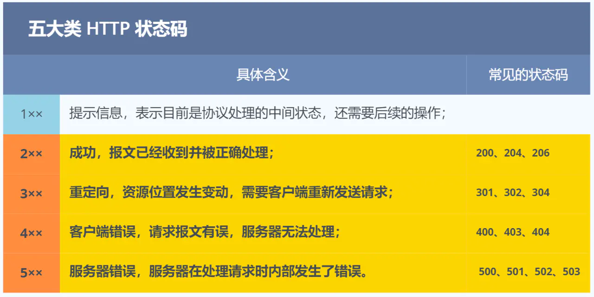
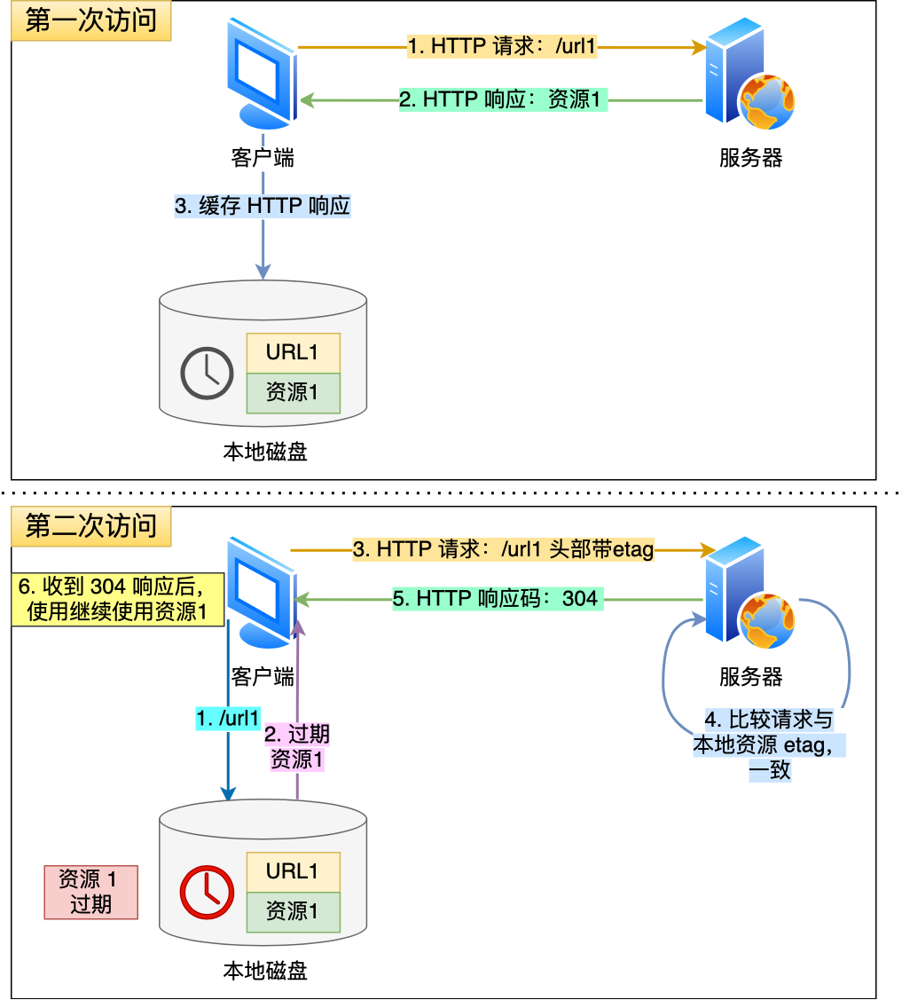
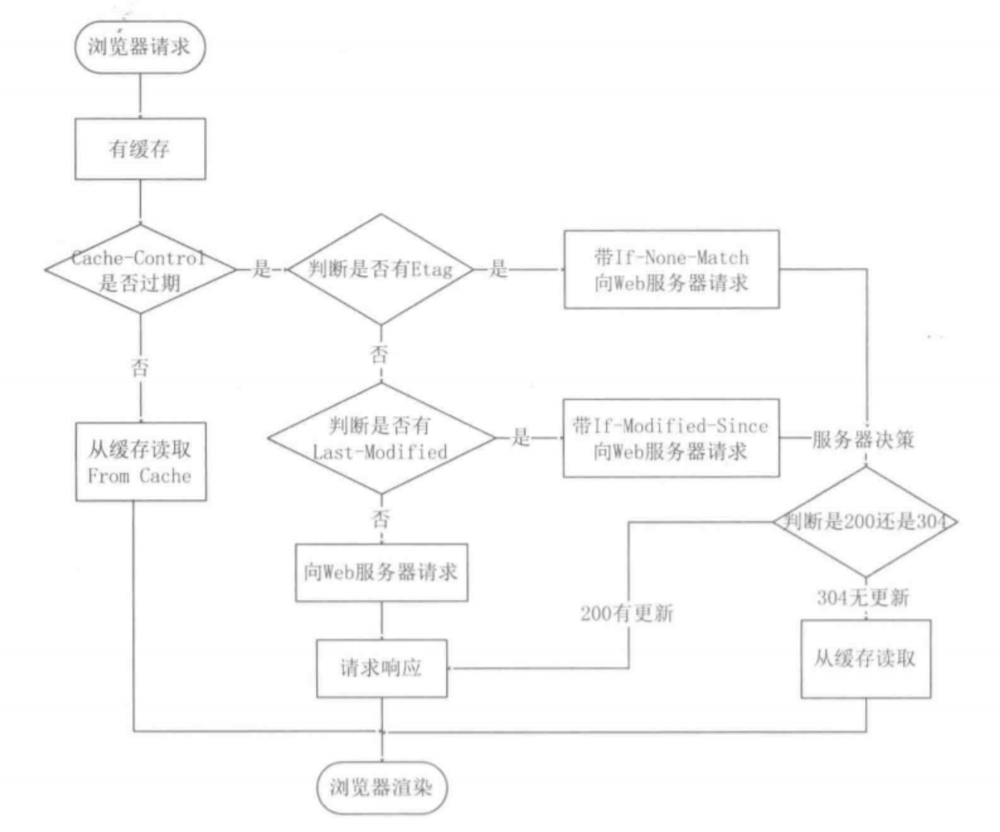
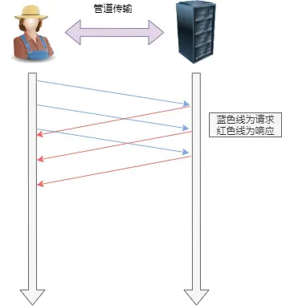
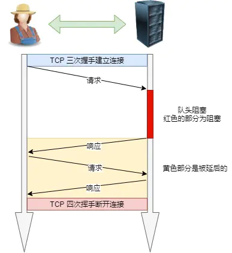

# HTTP 基本概念

## HTTP 是什么？

HTTP 是超文本传输协议，也就是**H**yperText **T**ransfer **P**rotocol。

**HTTP 是一个在计算机世界里专门在「两点」之间「传输」文字、图片、音频、视频等「超文本」数据的「约定和规范」。**

## HTTP 常见的状态码有哪些？

`1xx` 类状态码属于**提示信息**，是协议处理中的一种中间状态，实际用到的比较少。

`2xx` 类状态码表示服务器**成功**处理了客户端的请求，也是我们最愿意看到的状态。

- 「**200 OK**」是最常见的成功状态码，表示一切正常。如果是非 `HEAD` 请求，服务器返回的响应头都会有 body 数据。
- 「**204 No Content**」也是常见的成功状态码，与 200 OK 基本相同，但响应头没有 body 数据。
- 「**206 Partial Content**」是应用于 HTTP 分块下载或断点续传，表示响应返回的 body 数据并不是资源的全部，而是其中的一部分，也是服务器处理成功的状态。

`3xx` 类状态码表示客户端请求的资源发生了变动，需要客户端用新的 URL 重新发送请求获取资源，也就是**重定向**。

- 「**301 Moved Permanently**」表示永久重定向，说明请求的资源已经不存在了，需改用新的 URL 再次访问。
- 「**302 Found**」表示临时重定向，说明请求的资源还在，但暂时需要用另一个 URL 来访问。

301 和 302 都会在响应头里使用字段 `Location`，指明后续要跳转的 URL，浏览器会自动重定向新的 URL。

- 「**304 Not Modified**」不具有跳转的含义，表示资源未修改，重定向已存在的缓冲文件，也称缓存重定向，也就是告诉客户端可以继续使用缓存资源，用于缓存控制。

`4xx` 类状态码表示客户端发送的**报文有误**，服务器无法处理，也就是错误码的含义。

- 「**400 Bad Request**」表示客户端请求的报文有错误，但只是个笼统的错误。
- 「**403 Forbidden**」表示服务器禁止访问资源，并不是客户端的请求出错。
- 「**404 Not Found**」表示请求的资源在服务器上不存在或未找到，所以无法提供给客户端。

`5xx` 类状态码表示客户端请求报文正确，但是**服务器处理时内部发生了错误**，属于服务器端的错误码。

- 「**500 Internal Server Error**」与 400 类型，是个笼统通用的错误码，服务器发生了什么错误，我们并不知道。
- 「**501 Not Implemented**」表示客户端请求的功能还不支持，类似“即将开业，敬请期待”的意思。
- 「**502 Bad Gateway**」通常是服务器作为网关或代理时返回的错误码，表示服务器自身工作正常，访问后端服务器发生了错误。
- 「**503 Service Unavailable**」表示服务器当前很忙，暂时无法响应客户端，类似“网络服务正忙，请稍后重试”的意思。

## GET 与 POST

GET 的语义是请求获取指定的资源。GET 方法是安全、幂等、可被缓存的。

POST 的语义是根据请求负荷（报文主体）对指定的资源做出处理，具体的处理方式视资源类型而不同。POST 不安全，不幂等，（大部分实现）不可缓存。

## HTTP 缓存技术

对于一些具有重复性的 HTTP 请求，比如每次请求得到的数据都一样的，我们可以把这对「请求-响应」的数据都**缓存在本地**，那么下次就直接读取本地的数据，不必在通过网络获取服务器的响应了。

HTTP 缓存有两种实现方式，分别是**强制缓存和协商缓存**。

### 什么是强制缓存？

强缓存指的是只要浏览器判断缓存没有过期，则直接使用浏览器的本地缓存，决定是否使用缓存的主动性在于浏览器这边。

强缓存是利用下面这两个 HTTP 响应头部（Response Header）字段实现的，它们都用来表示资源在客户端缓存的有效期：

- `Cache-Control`， 是一个相对时间；
- `Expires`，是一个绝对时间；

如果 HTTP 响应头部同时有 Cache-Control 和 Expires 字段的话，**Cache-Control 的优先级高于 Expires** 。

Cache-control 选项更多一些，设置更加精细，所以建议使用 Cache-Control 来实现强缓存。具体的实现流程如下：

- 当浏览器第一次请求访问服务器资源时，服务器会在返回这个资源的同时，在 Response 头部加上 Cache-Control，Cache-Control 中设置了过期时间大小；
- 浏览器再次请求访问服务器中的该资源时，会先**通过请求资源的时间与 Cache-Control 中设置的过期时间大小，来计算出该资源是否过期**，如果没有，则使用该缓存，否则重新请求服务器；
- 服务器再次收到请求后，会再次更新 Response 头部的 Cache-Control。

### 什么是协商缓存？

当我们在浏览器使用开发者工具的时候，你可能会看到过某些请求的响应码是 `304`，这个是告诉浏览器可以使用本地缓存的资源，**通常这种通过服务端告知客户端是否可以使用缓存的方式被称为协商缓存。**

上图就是一个协商缓存的过程，所以**协商缓存就是与服务端协商之后，通过协商结果来判断是否使用本地缓存**。

**协商缓存这两个字段都需要配合强制缓存中 Cache-Control 字段来使用，只有在未能命中强制缓存的时候，才能发起带有协商缓存字段的请求**。

##  HTTP 特性

### HTTP/1.1 的优点有哪些？

HTTP 最突出的优点是「简单、灵活和易于扩展、应用广泛和跨平台」。

### HTTP/1.1 的缺点有哪些？

HTTP 协议里有优缺点一体的**双刃剑**，分别是「无状态、明文传输」，同时还有一大缺点「不安全」。

无状态的**好处**，因为服务器不会去记忆 HTTP 的状态，所以不需要额外的资源来记录状态信息，这能减轻服务器的负担，能够把更多的 CPU 和内存用来对外提供服务。

无状态的**坏处**，既然服务器没有记忆能力，它在完成有关联性的操作时会非常麻烦。

对于无状态的问题，解法方案有很多种，其中比较简单的方式用 **Cookie** 技术。

`Cookie` 通过在请求和响应报文中写入 Cookie 信息来控制客户端的状态。

相当于，**在客户端第一次请求后，服务器会下发一个装有客户信息的「小贴纸」，后续客户端请求服务器的时候，带上「小贴纸」，服务器就能认得了了**，

HTTP 的安全问题，可以用 HTTPS 的方式解决，也就是通过引入 SSL/TLS 层，使得在安全上达到了极致。

### HTTP/1.1 的性能如何？

HTTP 协议是基于 **TCP/IP**，并且使用了「**请求 - 应答**」的通信模式，所以性能的关键就在这**两点**里。

#### 长连接

早期 HTTP/1.0 性能上的一个很大的问题，那就是每发起一个请求，都要新建一次 TCP 连接（三次握手），而且是串行请求，做了无谓的 TCP 连接建立和断开，增加了通信开销。

为了解决上述 TCP 连接问题，HTTP/1.1 提出了**长连接**的通信方式，也叫持久连接。这种方式的好处在于减少了 TCP 连接的重复建立和断开所造成的额外开销，减轻了服务器端的负载。

持久连接的特点是，只要任意一端没有明确提出断开连接，则保持 TCP 连接状态。

**当然，如果某个 HTTP 长连接超过一定时间没有任何数据交互，服务端就会主动断开这个连接。**

#### 管道网络传输

HTTP/1.1 采用了长连接的方式，这使得管道（pipeline）网络传输成为了可能。

即可在同一个 TCP 连接里面，客户端可以发起多个请求，只要第一个请求发出去了，不必等其回来，就可以发第二个请求出去，可以**减少整体的响应时间。**

举例来说，客户端需要请求两个资源。以前的做法是，在同一个 TCP 连接里面，先发送 A 请求，然后等待服务器做出回应，收到后再发出 B 请求。那么，管道机制则是允许浏览器同时发出 A 请求和 B 请求，如下图：

但是**服务器必须按照接收请求的顺序发送对这些管道化请求的响应**。

如果服务端在处理 A 请求时耗时比较长，那么后续的请求的处理都会被阻塞住，这称为「队头堵塞」。

所以，**HTTP/1.1 管道解决了请求的队头阻塞，但是没有解决响应的队头阻塞**。

#### 队头阻塞

因为当顺序发送的请求序列中的一个请求因为某种原因被阻塞时，在后面排队的所有请求也一同被阻塞了，会招致客户端一直请求不到数据，这也就是「**队头阻塞**」，好比上班的路上塞车。

