# Redis 持久化

## Redis 怎么实现持久化

- AOF 文件的内容是操作命令；
- RDB 文件的内容是二进制数据。

### 使用 AOF日志实现持久化

Redis 中每执行一条写命令，就将该命令以追加的方式写入到一个文件里，然后重启的时候，先去读取这个文件里的命令，并且执行它，这种保存写操作命令到日志文件的持久化方式，就是 AOF 持久化。

### RDB快照

RDB 是 Redis 中一种以内存快照形式将数据持久化到磁盘的策略。所谓快照，就是把某一时刻的状态以文件的形式进行全量备份到磁盘，这个快照文件就称为RDB文件，其中RDB是Redis DataBase的缩写。

### 混合持久化

尽管 RDB 比 AOF 的数据恢复速度快，但是快照的频率不好把握：

- 如果频率太低，两次快照间一旦服务器发生宕机，就可能会比较多的数据丢失；
- 如果频率太高，频繁写入磁盘和创建子进程会带来额外的性能开销。

因此，redis 4.0 以后提出了 混合使用 AOF 日志和 RDB 快照的方法，即混合持久化。混合持久化工作在 AOF 重写过程。当开启混合持久化的情况下，在进行 AOF 重写时，fork 出来的子进程会先将与主线程共享的内存数据以 RDB 方式写入到 AOF 文件中，而对于重写过程中主线程处理的操作命令则会被记录在重写缓存区里，重写缓存区里的增量命令会以 AOF 方法写入到 AOF 文件中，写入完成后通知主进程将新的含有 RDB 格式和 AOF 格式的 AOF 文件替换旧的 AOF 文件。

这样的好处在于，重启 Redis 加载数据的时候，由于前半部分是 RDB 内容，这样**加载的时候速度会很快**。

加载完 RDB 的内容后，才会加载后半部分的 AOF 内容，这里的内容是 Redis 后台子进程重写 AOF 期间，主线程处理的操作命令，可以使得**数据更少的丢失**。

## AOF 相关问题

### 为什么 redis 要先执行写操作命令，在记录日志？

这样做的好处有两个：

##### 1、避免额外的检查开销

如果先记录 AOF 日志，再执行写操作命令的话，假设当前命令语法有问题，而且没有进行语法检查，那该错误的命令记录到 AOF 日志以后，Redis 使用 AOF 日志恢复数据的时候，就可能会出错。而如果先执行写操作命令，再记录 AOF 日志的话，只有在命令执行成功的情况下，才将写操作命令记录到 AOF 日志里，这样就避免了额外的检查开销，又可以保证 AOF 日志里的命令都是可执行且正确的。

##### 2、不会阻塞当前写操作命令的执行

因为当写操作命令执行成功后，才会将命令记录到 AOF 日志。

### AOF 持久化有没有风险？

有两个风险：

##### 1、数据丢失风险

​	执行写操作命令和记录日志是两个过程，那当 Redis 在还没来得及将命令写入到硬盘时，服务器发生宕机了，这个数据就会有**丢失的风险**。

##### 2、造成后续命令阻塞

​	前面说道，由于写操作命令执行成功后才记录到 AOF 日志，所以不会阻塞当前写操作命令的执行，但是**可能会给「下一个」命令带来阻塞风险**。

### AOF 把记录写回硬盘的过程，有什么写回策略？

1. Redis 执行完写操作命令后，会将命令追加到 `server.aof_buf` 缓冲区；
2. 然后通过 write() 系统调用，将 aof_buf 缓冲区的数据写入到 AOF 文件，此时数据并没有写入到硬盘，而是拷贝到了内核缓冲区 page cache，等待内核将数据写入硬盘；
3. 具体内核缓冲区的数据什么时候写入到硬盘，由内核决定。

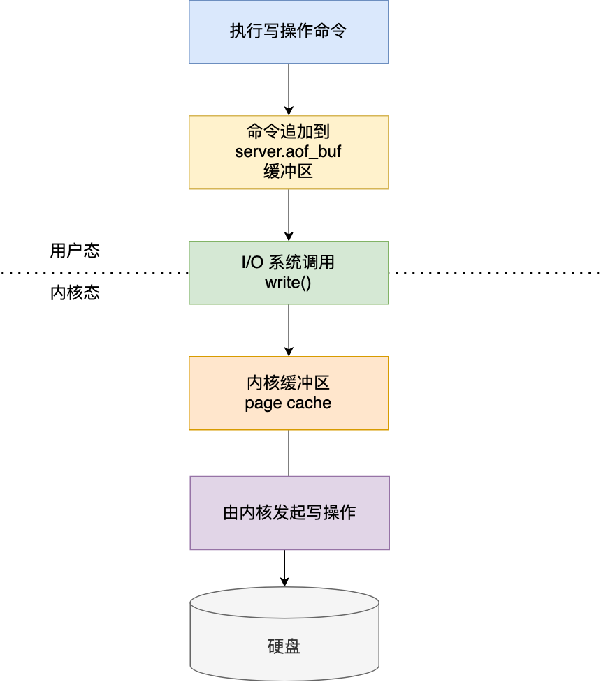

Redis 提供了 3 种写回硬盘的策略，Redis 提供了 3 种写回硬盘的策略：

- `Always`：每次执行写操作命令后，同步将 AOF 日志数据持久化到磁盘
- `Everysec`：每次执行写操作命令后，先将命令写入到 AOF 文件的内核缓存区，然后每隔 1秒将缓冲区中的内容写回磁盘
- `no`：每次写操作命令执行完后，先将命令写入到 AOF 文件的内核缓冲区，再由操作系统决定何时将缓冲区内容写回硬盘。

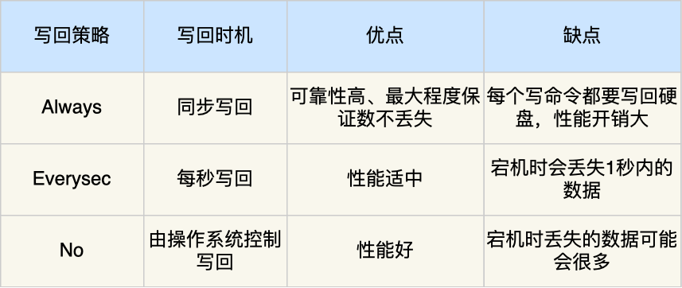

### 当 AOF 文件过大的时候，Redis 会怎么处理？

当 AOF 文件过大的时候会带来性能问题，就会触发 AOF 重写机制。

### AOF 的重写机制是怎么样的？为什么不复用现有文件，而是采取覆盖的模式？

AOF 重写机制是在重写时，读取当前数据库中的所有键值对，然后将每一个键值对用一条命令记录到「新的 AOF 文件」，等到全部记录完后，就将新的 AOF 文件替换掉现有的 AOF 文件。

因为**如果 AOF 重写过程中失败了，现有的 AOF 文件就会造成污染**，可能无法用于恢复使用。所以 AOF 重写过程，先重写到新的 AOF 文件，重写失败的话，就直接删除这个文件就好，不会对现有的 AOF 文件造成影响。

### 详细说下 AOF 重写（重写内存缓冲区中的文件）过程？

但是在触发 AOF 重写时，比如当 AOF 文件大于 64M 时，就会对 AOF 文件进行重写，这时是需要读取所有缓存的键值对数据，并为每个键值对生成一条命令，然后将其写入到新的 AOF 文件，重写完后，就把现在的 AOF 文件替换掉。

这个过程其实是很耗时的，所以重写的操作不能放在主进程里。

所以，Redis 的**重写 AOF 过程是由后台子进程 bgrewriteaof 来完成的**，这么做可以达到两个好处：

##### 1、不会阻塞主进程

​	子进程进行 AOF 重写期间，主进程可以继续处理命令请求，从而避免阻塞主进程；

##### 2、避免加锁操作

​	子进程带有主进程的数据副本（*数据副本怎么产生的后面会说*），这里使用子进程而不是线程，因为如果是使用线程，多线程之间会共享内存，那么在修改共享内存数据的时候，需要通过加锁来保证数据的安全，而这样就会降低性能。因为创建子进程时，父子进程是以只读的方式共享内存数据的，而当父子进程任意一方修改了该共享内存，就会发生**写时复制**，于是父子进程就有了独立的数据副本，就不用加锁来保证数据安全。

### 子进程是怎么拥有主进程一样的数据副本的呢？

主进程在通过 `fork` 系统调用生成 bgrewriteaof 子进程时，操作系统会把主进程的「**页表**」复制一份给子进程，这个页表记录着虚拟地址和物理地址映射关系，而不会复制物理内存，也就是说，两者的虚拟空间不同，但其对应的物理空间是同一个。

这样一来，子进程就共享了父进程的物理内存数据了，这样能够**节约物理内存资源**，页表对应的页表项的属性会标记该物理内存的权限为**只读**。

不过，当父进程或者子进程在向这个内存发起写操作时，CPU 就会触发**写保护中断**，这个写保护中断是由于违反权限导致的，然后操作系统会在「写保护中断处理函数」里进行**物理内存的复制**，并重新设置其内存映射关系，将父子进程的内存读写权限设置为**可读写**，最后才会对内存进行写操作，这个过程被称为「**写时复制(\*Copy On Write\*)**」。

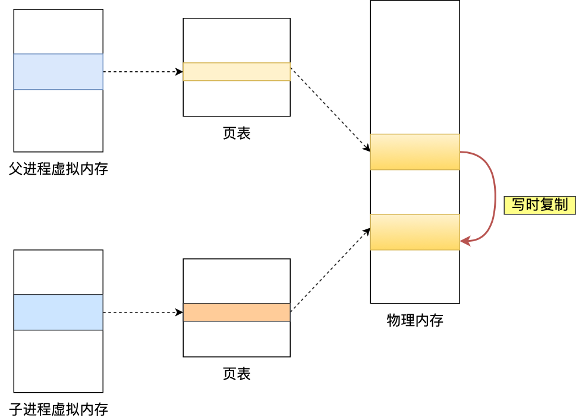

所以，有两个阶段会导致阻塞父进程：

- 创建子进程的途中，由于要复制父进程的页表等数据结构，阻塞的时间跟页表的大小有关，页表越大，阻塞的时间也越长；
- 创建完子进程后，如果子进程或者父进程修改了共享数据，就会发生写时复制，这期间会拷贝物理内存，如果内存越大，自然阻塞的时间也越长；

### 重写 AOF 日志问题

重写 AOF 日志过程中，如果主进程修改了已经存在 key-value，此时这个 key-value 数据在子进程的内存数据就跟主进程的内存数据不一致了，这时要怎么办呢？

为了解决这种数据不一致问题，Redis 设置了一个 **AOF 重写缓冲区**，这个缓冲区在创建 bgrewriteaof 子进程之后开始使用。

在重写 AOF 期间，当 Redis 执行完一个写命令之后，它会**同时将这个写命令写入到 「AOF 缓冲区」和 「AOF 重写缓冲区」**。

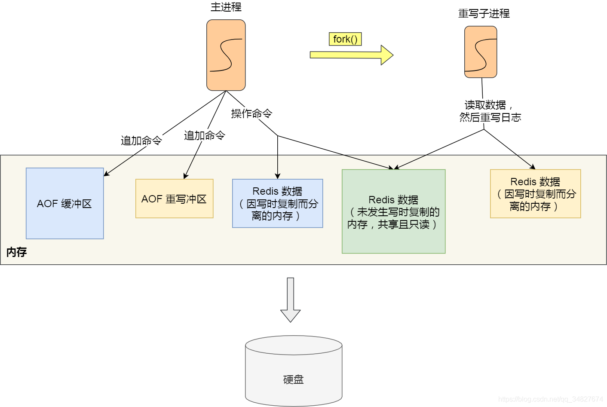

也就是说，在 bgrewriteaof 子进程执行 AOF 重写期间，主进程需要执行以下三个工作:

- 执行客户端发来的命令；
- 将执行后的写命令追加到 「AOF 缓冲区」；
- 将执行后的写命令追加到 「AOF 重写缓冲区」；

当子进程完成 AOF 重写工作（*扫描数据库中所有数据，逐一把内存数据的键值对转换成一条命令，再将命令记录到重写日志*）后，会向主进程发送一条信号，信号是进程间通讯的一种方式，且是异步的。

主进程收到该信号后，会调用一个信号处理函数，该函数主要做以下工作：

- 将 AOF 重写缓冲区中的所有内容追加到新的 AOF 的文件中，使得新旧两个 AOF 文件所保存的数据库状态一致；
- 新的 AOF 的文件进行改名，覆盖现有的 AOF 文件。

信号函数执行完后，主进程就可以继续像往常一样处理命令了。

在整个 AOF 后台重写过程中，除了发生写时复制会对主进程造成阻塞，还有信号处理函数执行时也会对主进程造成阻塞，在其他时候，AOF 后台重写都不会阻塞主进程。

### 总结

AOF 重写时，对于未发生**写时复制**的内存，父子进程之间共享内存，而对于发生**写时复制**的那部分内存，则是各自拥有一个数据副本。

AOF 缓存区存储未持久化到磁盘中的文件（假设为[1,100]），AOF 重写缓冲区则是触发重写机制时的文件（假设为[70,100]），维护这两个缓冲区，在 AOF 重写失败时，可以继续使用 AOF 缓冲区中的数据，而重写成功时，AOF 重写完的文件可以使用 AOF 重写缓冲区的文件进行追写操作。

## RDB 相关问题

### RDB 文件怎么生成？会不会阻塞主线程？

redis 中提供了两个命令来生成 RDB 文件，分别是 save 和 bgsave，它们的区别就是：

- 执行 save 命令，就会在主线程中生成 RDB 文件，由于和执行操作命令在同一个线程所以，如果写入 RDB 文件的时间太长的话，就会阻塞主线程。
- 执行 bgsave 命令，就会 fork 出一个子线程来生成 RDB 文件，这样就可以避免主线程的阻塞。

RDB 文件的加载工作是在服务器启动时自动执行的，Redis 并没有提供专门用于加载 RDB 文件的命令。

### RDB 文件生成过程中，可以进行执行写操作命令吗？

执行 bgsave 过程中，Redis 依然**可以继续处理操作命令**的，也就是数据是能被修改的。

那具体如何做到到呢？关键的技术就在于**写时复制技术（Copy-On-Write, COW）。**

执行 bgsave 命令的时候，会通过 `fork()` 创建子进程，此时子进程和父进程是共享同一片内存数据的，因为创建子进程的时候，会复制父进程的页表，但是页表指向的物理内存还是一个。只有在发生修改内存数据的情况时，才会发生写时复制，物理内存才会被复制一份，主线程在这个数据副本进行修改操作，与此同时，bgsave 子进程可以继续把原来的数据写入到 RDB 文件。

### 执行 bgsave 完成后，发生系统崩溃，RDB 发生写时复制后的写操作还存在吗？

bgsave 快照过程中，如果主线程修改了共享数据，**发生了写时复制后，RDB 快照保存的是原本的内存数据**，而主线程刚修改的数据，是没办法在这一时间写入 RDB 文件的，只能交由下一次的 bgsave 快照。

如果系统恰好在 RDB 快照文件创建完毕后崩溃了，那么 Redis 将会丢失主线程在快照期间修改的数据。

### 为什么 RDB 文件生成中，内存很快就占满了？

在 Redis 执行 RDB 持久化期间，刚 fork 时，主进程和子进程共享同一物理内存，但是途中主进程处理了写操作，修改了共享内存，于是当前被修改的数据的物理内存就会被复制一份。

那么极端情况下，**如果所有的共享内存都被修改，则此时的内存占用是原先的 2 倍。**

所以，针对写操作多的场景，我们要留意下快照过程中内存的变化，防止内存被占满了。

## Redis 大 Key 对持久化有什么影响？

### 大 Key 对 AOF 日志的影响

在使用 Always 策略的时候，主线程在执行完命令后，会把数据写入到 AOF 日志文件，然后会调用 fsync() 函数，将内核缓冲区的数据直接写入到硬盘，等到硬盘写操作完成后，该函数才会返回。

**当使用 Always 策略的时候，如果写入是一个大 Key，主线程在执行 fsync() 函数的时候，阻塞的时间会比较久，因为当写入的数据量很大的时候，数据同步到硬盘这个过程是很耗时的**。

当使用 Everysec 策略的时候，由于是异步执行 fsync() 函数，所以大 Key 持久化的过程（数据同步磁盘）不会影响主线程。

当使用 No 策略的时候，由于永不执行 fsync() 函数，所以大 Key 持久化的过程不会影响主线程。

### 大 Key 对 AOF 重写和 RDB 的影响

当 AOF 日志写入了很多的大 Key，AOF 日志文件的大小会很大，那么很快就会触发 **AOF 重写机制**。

AOF 重写机制和 RDB 快照（bgsave 命令）的过程，都会分别通过 `fork()` 函数创建一个子进程来处理任务。

在通过 `fork()` 函数创建子进程的时候，虽然不会复制父进程的物理内存，但是**内核会把父进程的页表复制一份给子进程，如果页表很大，那么这个复制过程是会很耗时的，那么在执行 fork 函数的时候就会发生阻塞现象**。

而且，fork 函数是由 Redis 主线程调用的，如果 fork 函数发生阻塞，那么意味着就会阻塞 Redis 主线程。由于 Redis 执行命令是在主线程处理的，所以当 Redis 主线程发生阻塞，就无法处理后续客户端发来的命令。

如果创建完子进程后，**父进程对共享内存中的大 Key 进行了修改，那么内核就会发生写时复制，会把物理内存复制一份，由于大 Key 占用的物理内存是比较大的，那么在复制物理内存这一过程中，也是比较耗时的，于是父进程（主线程）就会发生阻塞**。

所以，有两个阶段会导致阻塞父进程：

- 创建子进程的途中，由于要复制父进程的页表等数据结构，阻塞的时间跟页表的大小有关，页表越大，阻塞的时间也越长；
- 创建完子进程后，如果子进程或者父进程修改了共享数据，就会发生写时复制，这期间会拷贝物理内存，如果内存越大，自然阻塞的时间也越长；

### 如果 fork 耗时很大，比如超过1秒，则需要做出优化调整：

- 单个实例的内存占用控制在 10 GB 以下，这样 fork 函数就能很快返回。
- 如果 Redis 只是当作纯缓存使用，不关心 Redis 数据安全性问题，可以考虑关闭 AOF 和 AOF 重写，这样就不会调用 fork 函数了。
- 在主从架构中，要适当调大 repl-backlog-size，避免因为 repl_backlog_buffer 不够大，导致主节点频繁地使用全量同步的方式，全量同步的时候，是会创建 RDB 文件的，也就是会调用 fork 函数。

### 大 key 除了会影响持久化之外，还会有以下的影响。

- 客户端超时阻塞。由于 Redis 执行命令是单线程处理，然后在操作大 key 时会比较耗时，那么就会阻塞 Redis，从客户端这一视角看，就是很久很久都没有响应。
- 引发网络阻塞。每次获取大 key 产生的网络流量较大，如果一个 key 的大小是 1 MB，每秒访问量为 1000，那么每秒会产生 1000MB 的流量，这对于普通千兆网卡的服务器来说是灾难性的。
- 阻塞工作线程。如果使用 del 删除大 key 时，会阻塞工作线程，这样就没办法处理后续的命令。
- 内存分布不均。集群模型在 slot 分片均匀情况下，会出现数据和查询倾斜情况，部分有大 key 的 Redis 节点占用内存多，QPS 也会比较大。

### 如何避免大 Key 呢？

最好在设计阶段，就把大 key 拆分成一个一个小 key。或者，定时检查 Redis 是否存在大 key ，如果该大 key 是可以删除的，不要使用 DEL 命令删除，因为该命令删除过程会阻塞主线程，而是用 unlink 命令（Redis 4.0+）删除大 key，因为该命令的删除过程是异步的，不会阻塞主线程。

# Redis 缓存

## 客户端输入和输出缓冲

我们先来看看服务器端和客户端之间的缓冲区。为了避免客户端和服务器端的请求发送和处理速度不匹配，**服务器端给每个连接的客户端都设置了一个输入缓冲区和输出缓冲区，我们称之为客户端输入缓冲区和输出缓冲区。**输入缓冲区会先把客户端发送过来的命令暂存起来，Redis 主线程再从输入缓冲区中读取命令，进行处理。当 Redis 主线程处理完数据后，会把结果写入到输出缓冲区，再通过输出缓冲区返回给客户端，如下图所示：

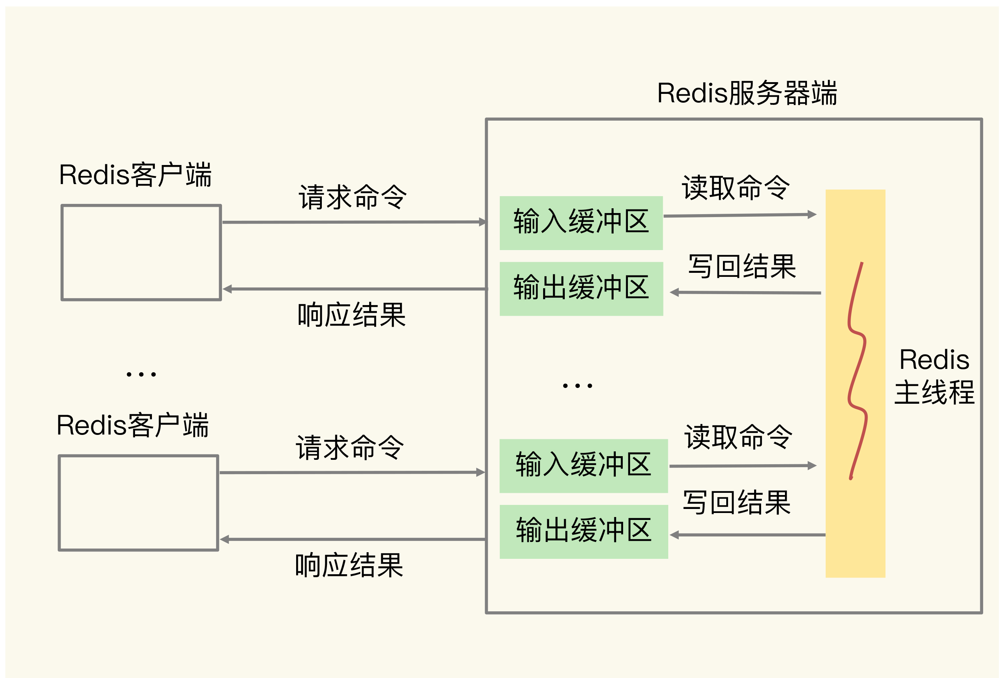

## **主从集群中的缓冲区**

**主从集群间的数据复制包括全量复制和增量复制两种。全量复制是同步所有数据，而增量复制只会把主从库网络断连期间主库收到的命令，同步给从库。**无论在哪种形式的复制中，为了保证主从节点的数据一致，都会用到缓冲区。

## Redis 缓存具体是怎么工作的？

### **Redis** 缓存处理请求的两种情况

**缓存命中**：Redis 中有相应数据，就直接读取 Redis，性能非常快。

**缓存缺失**：Redis 中没有保存相应数据，就从后端数据库中读取数据，性能就会变慢。而且，一旦发生缓存缺失，为了让后续请求能从缓存中读取到数据，**我们需要把缺失的数据写入 Redis，这个过程叫作缓存更新**。

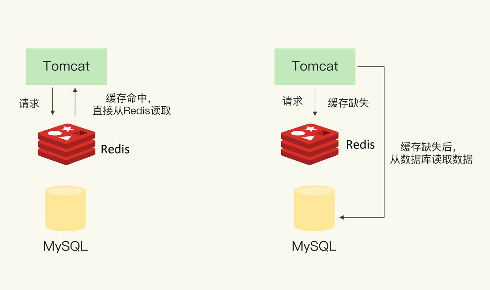

### **Redis** 作为旁路缓存的使用操作

Redis 是一个独立的系统软件，和业务应用程序是两个软件，当我们部署了 Redis 实例后，它只会被动地等待客户端发送请求，然后再进行处理。所以，如**果应用程序想要使用 Redis 缓存，我们就要在程序中增加相应的缓存操作代码。所以，我们也把 Redis 称为旁路缓存，也就是说，读取缓存、读取数据库和更新缓存的操作都需要在应用程序中来完成。**

**那么，使用 Redis 缓存时，具体来说，我们需要在应用程序中增加三方面的代码：**

- **当应用程序需要读取数据时，我们需要在代码中显式调用 Redis 的 GET 操作接口，进行查询；**

- **如果缓存缺失了，应用程序需要再和数据库连接，从数据库中读取数据；**

- **当缓存中的数据需要更新时，我们也需要在应用程序中显式地调用 SET 操作接口，把更新的数据写入缓存。**

### 缓存的类型

#### **只读缓存**(只在缓存中进行读操作)

当 Redis 用作只读缓存时，应用要读取数据的话，会先调用 Redis GET 接口，查询数据是否存在。**而所有的数据写请求，会直接发往后端的数据库，在数据库中增删改。对于删改的数据来说，如果 Redis 已经缓存了相应的数据，应用需要把这些缓存的数据删除，Redis 中就没有这些数据了。**

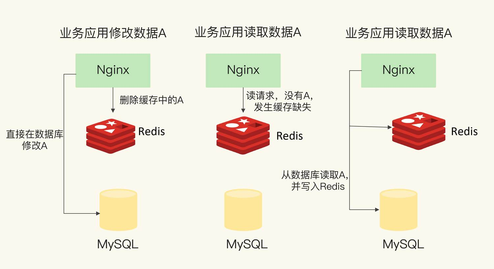

只读缓存直接在数据库中更新数据的好处是，所有最新的数据都在数据库中，而数据库是提供数据可靠性保障的，这些数据不会有丢失的风险。**当我们需要缓存图片、短视频这些用户只读的数据时，就可以使用只读缓存这个类型了。**

#### **读写缓存**（读写都在缓存中操作）

**对于读写缓存来说，除了读请求会发送到缓存进行处理（直接在缓存中查询数据是否存在)，所有的写请求也会发送到缓存，在缓存中直接对数据进行增删改操作。**此时，得益于 Redis 的高性能访问特性，数据的增删改操作可以在缓存中快速完成，处理结果也会快速返回给业务应用，这就可以提升业务应用的响应速度。

但是，和只读缓存不一样的是**，在使用读写缓存时，最新的数据是在 Redis 中，而 Redis 是内存数据库，一旦出现掉电或宕机，内存中的数据就会丢失。这也就是说，应用的最新数据可能会丢失，给应用业务带来风险。**

所以，**根据业务应用对数据可靠性和缓存性能的不同要求，我们会有同步直写和异步写回两种策略**。其中，**同步直写策略优先保证数据可靠性，而异步写回策略优先提供快速响应。**学习了解这两种策略，可以帮助我们根据业务需求，做出正确的设计选择。

接下来，我们来具体看下这两种策略。

- **同步直写是指（把对redis和数据库的操作作为一个事务进行操作），写请求发给缓存的同时，也会发给后端数据库进行处理，等到缓存和数据库都写完数据，才给客户端返回。**这样，即使缓存宕机或发生故障，最新的数据仍然保存在数据库中，这就提供了数据可靠性保证。

不过，同步直写会降低缓存的访问性能。这是因为缓存中处理写请求的速度是很快的，而数据库处理写请求的速度较慢。即使缓存很快地处理了写请求，也需要等待数据库处理完所有的写请求，才能给应用返回结果，这就增加了缓存的响应延迟。

- **而异步写回策略，则是优先考虑了响应延迟。**此时，所有写请求都先在缓存中处理。等到这些增改的数据要被从缓存中淘汰出来时，缓存将它们写回后端数据库。这样一来，处理这些数据的操作是在缓存中进行的，很快就能完成。只不过，如果发生了掉电，而它们还没有被写回数据库，就会有丢失的风险了。

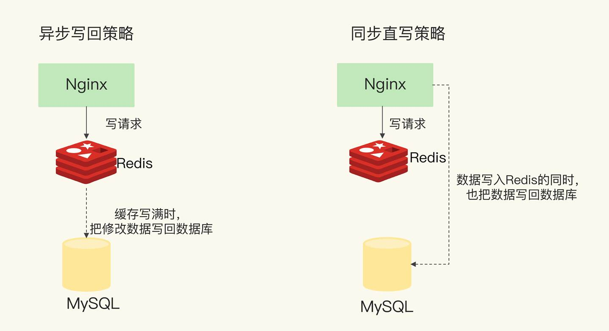

## 替换策略：缓存满了怎么办？

系统的设计选择是一个权衡的过程：大容量缓存是能带来性能加速的收益，但是成本也会更高，而小容量缓存不一定就起不到加速访问的效果。一般来说，**我会建议把缓存容量设置为总数据量的** **15%** **到** **30%，兼顾访问性能和内存空间开销**。

### **Redis** 缓存有哪些淘汰策略？

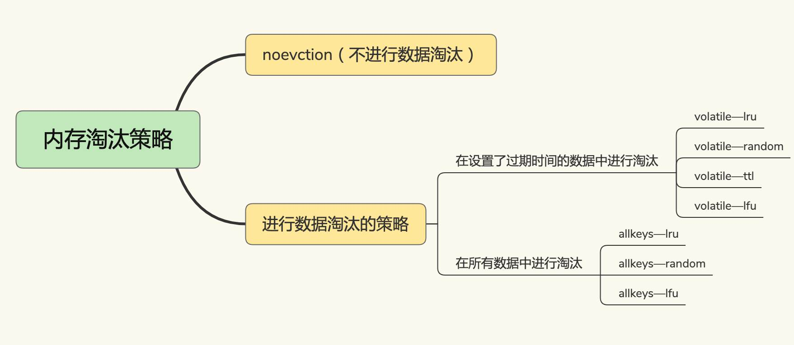

#### Redis 的 LRU 实现

在 Redis 中，LRU 算法被做了简化，以减轻数据淘汰对缓存性能的影响。具体来说，Redis 默认会记录每个数据的最近一次访问的时间戳（由键值对数据结构 RedisObject 中的 lru 字段记录）。然后，Redis 在决定淘汰的数据时，第一次会随机选出 N 个数据，把它们作为一个候选集合。接下来，Redis 会比较这 N 个数据的 lru 字段，把 lru 字段值最小的数据从缓存中淘汰出去。

- **优先使用** **allkeys-lru** **策略**。这样，可以充分利用 LRU 这一经典缓存算法的优势，把最近最常访问的数据留在缓存中，提升应用的访问性能。如果你的业务数据中有明显的冷热数据区分，我建议你使用 allkeys-lru 策略。

- 如果业务应用中的数据访问频率相差不大，没有明显的冷热数据区分，建议使用 allkeys-random 策略，随机选择淘汰的数据就行。

- **如果你的业务中有置顶的需求**，**比如置顶新闻、置顶视频，那么，可以使用 volatile-lru 策略，同时不给这些置顶数据设置过期时间。这样一来，这些需要置顶的数据一直不会被删除，**而其他数据会在过期时根据 LRU 规则进行筛选。

不过，对于 Redis 来说，它决定了被淘汰的数据后，会把它们删除。即使淘汰的数据是脏数据，Redis 也不会把它们写回数据库。所以，我们在使用 Redis 缓存时，如果数据被修改了，需要在数据修改时就将它写回数据库。否则，这个脏数据被淘汰时，会被 Redis 删除，而数据库里也没有最新的数据了

## 缓存异常

### 缓存和数据库的数据不一致问题

#### 如何发生

首先，我们得清楚“数据的一致性”具体是啥意思。其实，这里的“一致性”包含了两种情况：

- **缓存中有数据，那么，缓存的数据值需要和数据库中的值相同；**

- **缓存中本身没有数据，那么，数据库中的值必须是最新值。**

**对于读写缓存来说，要想保证缓存和数据库中的数据一致，就要采用同步直写策略。**不过，需要注意的是，如果采用这种策略，就需要同时更新缓存和数据库。**所以，我们要在业务应用中使用事务机制，来保证缓存和数据库的更新具有原子性**，也就是说，两者要不一起更新，要不都不更新，返回错误信息，进行重试。否则，我们就无法实现同步直写。

对于只读缓存来说，如果有数据新增，会直接写入数据库；而有数据删改时，就需要把只读缓存中的数据标记为无效（因为只读不涉及数据修改）。这样一来，应用后续再访问这些增删改的数据时，因为缓存中没有相应的数据，就会发生缓存缺失。此时，应用再从数据库中把数据读入缓存，这样后续再访问数据时，就能够直接从缓存中读取了。

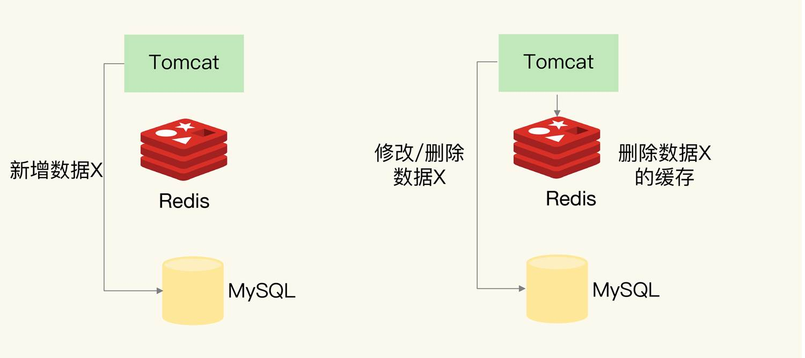

那么，这个过程中会不会出现数据不一致的情况呢？考虑到新增数据和删改数据的情况不一样，所以我们分开来看。

- 新增数据

如果是新增数据，数据会直接写到数据库中，不用对缓存做任何操作，此时，**缓存中本身就没有新增数据（缓存中无该数据）**，而数据库中是最新值，这种情况符合我们刚刚所说的一致性的第 2 种情况，所以，此时，缓存和数据库的数据是一致的。

- 删改数据

如果发生删改操作，应用既要更新数据库，也要在缓存中删除数据。**这两个操作如果无法保证原子性，也就是说，要不都完成，要不都没完成，此时，就会出现数据不一致问题了。**这个问题比较复杂，我们来分析一下。

#### **先删除缓存，再更新数据库**，

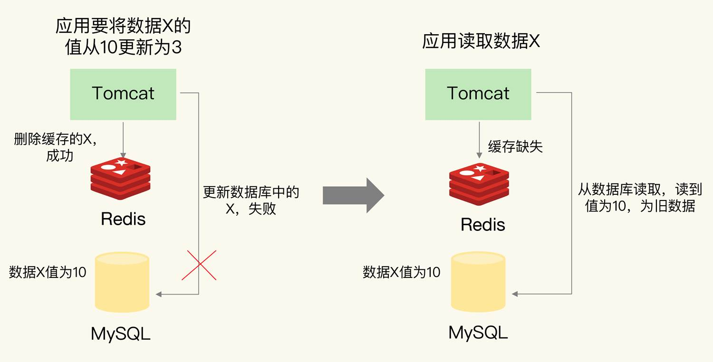

#### 先更新数据库，再删除缓存中的值

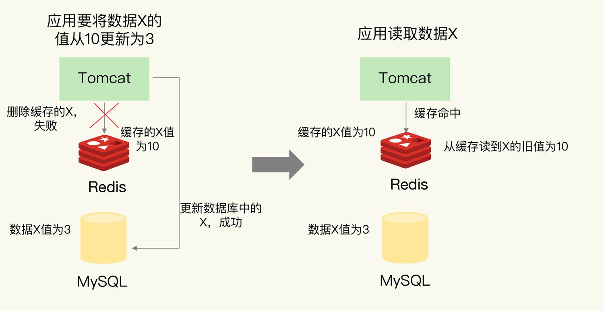

在更新数据库和删除缓存值的过程中，无论这两个操作的执行顺序谁先谁后，只要有一个操作失败了，就会导致客户端读取到旧值。

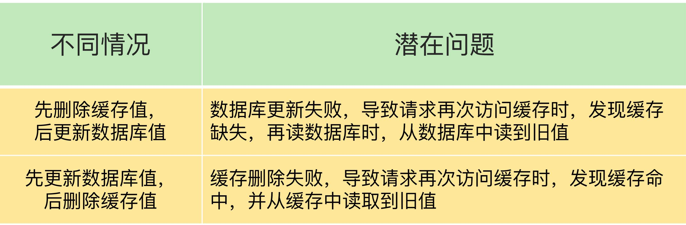

### 如何解决数据不一致问题？

#### 重试机制

具体来说，可以把要删除的缓存值或者是要更新的数据库值暂存到消息队列中（例如使用 Kafka 消息队列）。当应用没有能够成功地删除缓存值或者是更新数据库值时，可以从消息队列中重新读取这些值，然后再次进行删除或更新。

如果能够成功地删除或更新，我们就要把这些值从消息队列中去除，以免重复操作，此时，我们也可以保证数据库和缓存的数据一致了。否则的话，我们还需要再次进行重试。如果重试超过的一定次数，还是没有成功，我们就需要向业务层发送报错信息了。

下图显示了**先更新数据库，再删除缓存值时**，如果缓存删除失败，再次重试后删除成功的情况，你可以看下。

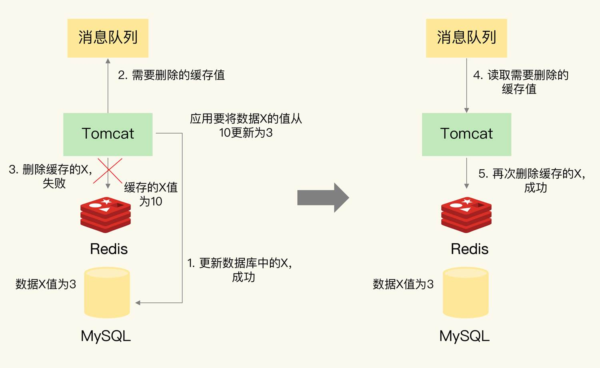

#### 先删除缓存，再更新数据库

使用延迟双删机制

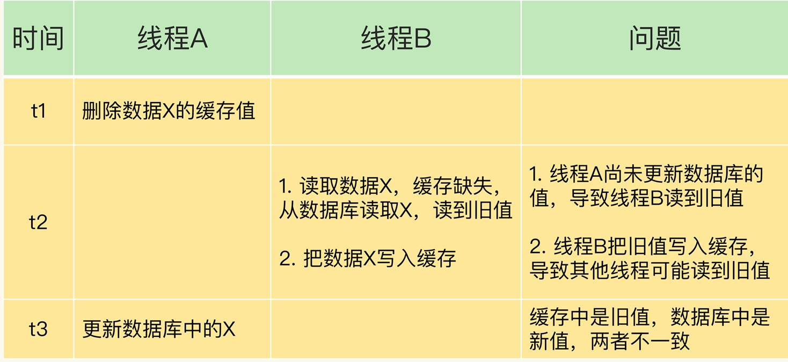

#### 先更新数据库值，再删除缓存值

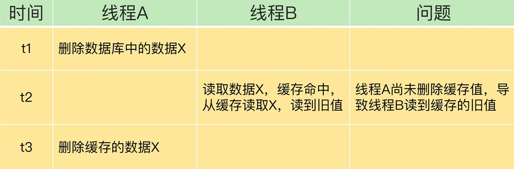

#### 小结

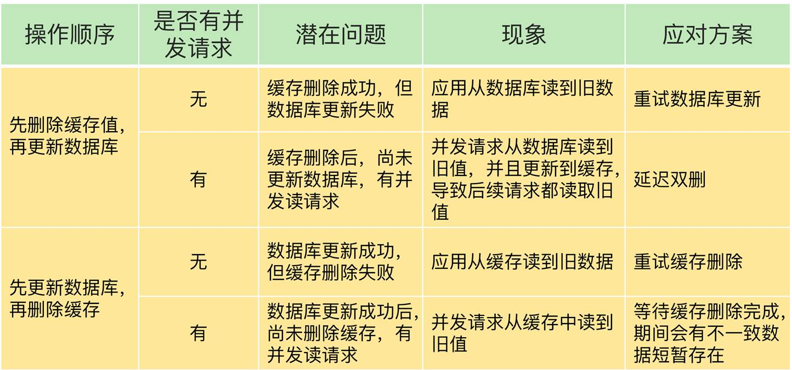

### 如何解决缓存雪崩、击穿、穿透？

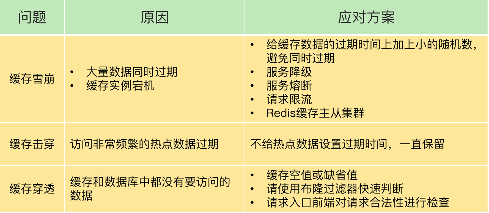

所以，我给你的建议是，尽量使用预防式方案：

- 针对缓存雪崩，合理地设置数据过期时间，以及搭建高可靠缓存集群；

- 针对缓存击穿，在缓存访问非常频繁的热点数据时，不要设置过期时间；

- 针对缓存穿透，提前在入口前端实现恶意请求检测，或者规范数据库的数据删除操作，避免误删除。

### 缓存被污染了，该怎么办？

**那什么是缓存污染呢？在一些场景下，有些数据被访问的次数非常少，甚至只会被访问一次。当这些数据服务完访问请求后，如果还继续留存在缓存中的话，就只会白白占用缓存空间。这种情况，就是缓存污染。**

除了在明确知道数据被再次访问的情况下，volatile-ttl 可以有效避免缓存污染。在其他情况下，volatile-random、allkeys-random、volatile-ttl 这三种策略并不能应对缓存污染问题。

#### LRU 缓存策略

因为只看数据的访问时间，使用 LRU 策略在处理扫描式单次查询操作时，无法解决缓存污染。**所谓的扫描式单次查询操作，就是指应用对大量的数据进行一次全体读取，每个数据都会被读取，而且只会被读取一次。此时，因为这些被查询的数据刚刚被访问过，所以 lru 字段值都很大。**

所以，对于采用了 LRU 策略的 Redis 缓存来说，扫描式单次查询会造成缓存污染。为了应对这类缓存污染问题，Redis 从 4.0 版本开始增加了 LFU 淘汰策略。

与 LRU 策略相比，L**FU 策略中会从两个维度来筛选并淘汰数据：一是，数据访问的时效性（访问时间离当前时间的远近）；二是，数据的被访问次数。**

#### LFU (Least Frequently Used) 缓存策略的优化

LFU 缓存策略是在 LRU 策略基础上，为每个数据增加了一个计数器，来统计这个数据的访问次数。当使用 LFU 策略筛选淘汰数据时，首先会根据数据的访问次数进行筛选，把访问次数最低的数据淘汰出缓存。如果两个数据的访问次数相同，LFU 策略再比较这两个数据的访问时效性，把距离上一次访问时间更久的数据淘汰出缓存。

**当 LFU 策略筛选数据时，Redis 会在候选集合中，根据数据 lru 字段的后 8bit 选择访问次数最少的数据进行淘汰。当访问次数相同时，再根据 lru 字段的前 16bit 值大小，选择访问时间最久远的数据进行淘汰。**

LFU 策略实现的计数规则是：每当数据被访问一次时，首先，用计数器当前的值乘以配置项 lfu_log_factor 再加 1，再取其倒数，得到一个 p 值；然后，把这个 p 值和一个取值范围在（0，1）间的随机数 r 值比大小，只有 p 值大于 r 值时，计数器才加 1。