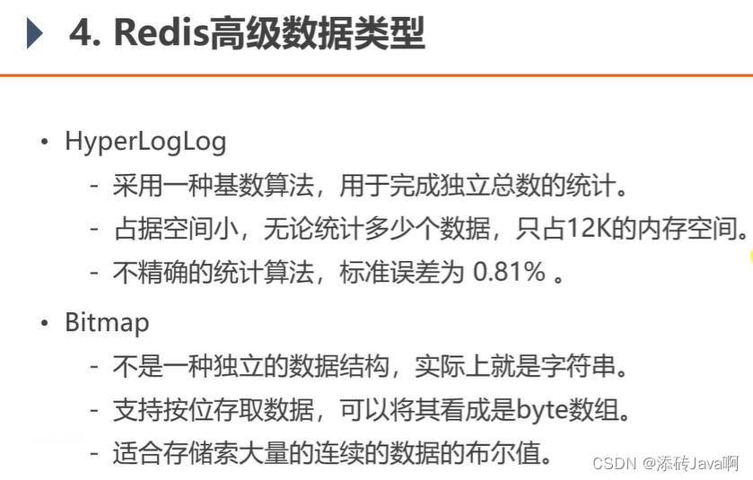
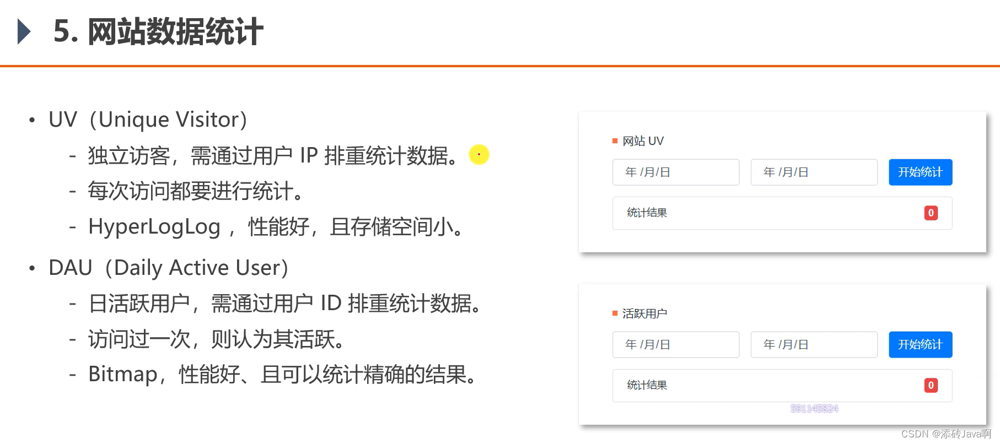

# 权限模块

## 1、注册

用户输入**用户名、密码、确认密码**，点击注册按钮，首先创建一个 models.ParamSignUp 结构体来保存用户输入，然后根据 /signup (post) 调用 controller.SignUpHandler 方法来处理注册操作。

controller.SignUpHandler 方法处理流程如下：

- 通过 c.ShouldBindJSON(p) 方法，从用户输入的 json 文件中获取信息，保存在变量 p；
- 调用 logic.SignUp 方法进行业务处理
- 返回响应

 logic.SignUp 方法处理流程如下：

- 根据用户名执行 mysql **查询语句**，判断用户是否存在，如果存在返回错误；
- 调用**雪花算法**生成用户 uid
- 使用 md5 加密算法对用户密码进行加密操，然后执行 mysql **插入语句**，保存用户信息
  

## 2、登录

用户输入**用户名、密码**，点击登录按钮，访问 /login (post) 调用 controller.LoginHandler 方法来处理登录操作。

controller.LoginHandler 方法处理流程如下：

- 通过 c.ShouldBindJSON(p) 方法，从用户输入的 json 文件中获取信息，保存在变量 p (models.ParamLogin)；
- 调用 logic.Login 方法进行业务处理，得到 token，将其放入 user 的token 字段
- 返回响应给浏览器，重定向转入登录界面

 logic.Login 方法处理流程如下：

- 根据用户名执行 mysql **查询语句**，判断用户是否存在，如果不存在，返回错误；
- 将用户输入的密码使用 md5 进行加密，根据 mysql 查询对应用户保存在数据库的密码，将该密码与用户输入的密码进行匹配；
- 用户登录成功，使用 JWT 生成 token，返回给 controller.LoginHandler 层。

# 帖子模块

## 1、显示帖子

通过 /posts (get) 调用 controller.GetPostListHandler 方法来处理帖子显示操作。

controller.GetPostListHandler 方法处理流程如下：

- 创建 models.ParamPostList 结构体保存帖子显示方式，如按社区、按点赞数、按时间、每页显示帖子数，页数；
- 通过 c.ShouldBindQuery(p) 方法，获取 url 的参数，保存在变量 p 中；
- 调用 logic.GetPostListNew 方法进行业务处理，获得帖子详情列表；
- 将帖子列表返回给浏览器

logic.GetPostList 方法处理流程如下：

- 根据用户传入的参数选择全部显示，还是选择对应社区的帖子
- 显示所有帖子，可以选择按照时间或者点赞数进行排序
  - 使用 redis 的 ZRevRange 方法查询 key ("bluebell:post:time"/"bluebell:post:score") ，返回指定数量的帖子 id 列表（从大到小的顺序）
  - 根据获取的帖子 id 列表，去 mysql 中查询对应的帖子详情（帖子id，标题，内容，作者id，所属社区，创建时间）
  - 使用 redis.GetPostVoteData(ids) 方法，获取对应帖子的点赞数（"post:voted:id"，使用管道批量查询 ZCount，减少传输RTT）
  - 根据作者 id 查询用户详情，社区 id 查询社区详情，然后帖子详情，点赞数，作者详情，社区详情进行合并，返回响应

- 显示对应社区帖子，可以选择按照时间或者点赞数进行排序
  - 查询  redis 的 zset ( "post:time:id") 是否存在，如果不存在，则进行第二步
  - 使用 Zinterstore 把社区的帖子 set ("community:id") 与帖子分数的 zset ("post:time") 生成一个新的 zset ( "post:time:id")
  - 使用 ZRevRange 查询 redis 的 zset ( "post:time:id")，获取对应的帖子列表

## 2、查看帖子

用户点击某个帖子，前端将该帖子 postid 传给后端，通过 /post/:id (get) 调用 controller.GetPostDetailHandler 方法来处理帖子显示操作。

controller.GetPostDetailHandler 方法处理流程如下：

- 使用 c.Param("id") 获取要查询的帖子 postid 
- 调用 logic.GetPostByID(pid) 方法，进行业务处理
- 返回帖子响应

logic.GetPostByID(pid) 方法处理流程如下：

- 根据帖子 postid 调用 mysql.GetPostByPid(pid)，查询 mysql，获取对应的帖子数据（帖子内容）
- 根据帖子作者 id 查询数据库，获取作者信息
- 根据社区 id 查询数据库，获取社区信息
- 根据帖子 postid，到 comment 表查询该帖子下的所有评论，评论之间的层级关系使用 parent_id 来标记

## 2、发布帖子

前提用户是否登录，如果未登录则不显示发帖模块。用户点击发帖，跳转到发帖界面，填写标题、帖子内容，选择对应社区，然后点击发帖按钮传递给后端。后端调用 /post (post) 方法，使用 middlewares.JWTAuthMiddleware(), middlewares.RateLimitMiddleware(2*time.Second, 1) 两个中间件检验用户是否已登录，访问流量控制，然后调用 controller.CreatePostHandler 方法来处理帖子发布功能。

controller.CreatePostHandler 方法处理流程如下：

- 使用 models.Post 结构体来存储帖子内容，c.ShouldBindJSON(p) 函数来获取帖子内容
- 通过 Context 获取发帖用户的 id，将该用户 id 设为 帖子的作者 id
- 调用 logic.CreatePost(p) 函数进行创建帖子操作
  - 使用雪花算法生成帖子 id
  - 调用 mysql.CreatePost(p) ，将 models.Post 中的数据插入数据库
  - 调用 redis.CreatePost(p.ID, p.CommunityID) ，使用事务操作将新创建的帖子加入到社区中("community:id")
    - 添加帖子创建时间
    - 添加帖子分数
    - 将帖子 id 加入到社区中
- 返回响应给前端

## 3、发表评论、回复

前提是用户必须登录，然后才显示发布评论的按钮，用户在评论框内输入评论内容，然后点击“回复评论”按钮，发表评论。

后端调用 /comment (post) 方法，然后调用 controller.commentHandler 方法来处理回复帖子功能。

controller.commentHandler 方法处理流程如下：

- 通过 c.Param("id")  获取帖子的 postid
- 通过 Context 获取发帖用户的 id，将该用户 id 设为评论者的 id，将 parent_id 设为帖子 postid （如果是回复评论的话，parent_id设为评论的 id）
- 调用 logic.Createcomment(p) 函数进行创建帖子回复操作
  - 使用雪花算法生成评论 id
  - 插入数据库
- 返回前端

## 4、帖子搜索

用户在搜索框内输入搜索内容，将其传给后端，匹配 /search (get) 调用 controller.Search 方法进行帖子搜索。

controller.Search 处理流程如下：

- 使用 c.ShouldBindJSON(p) 函数来获取搜索内容
- 去 mysql 中进行正则匹配

# 功能模块

## 1、用户点赞

前提是用户已经登录，用户点击在对应帖子界面，点击点赞按钮，为帖子投票，取消投票功能。相应的后端根据 /vote (post) 调用 controller.PostVoteHandler 方法进行点赞功能处理。

controller.PostVoteHandler 方法处理流程如下：

- 使用 models.ParamVoteData 存储帖子 id 和用户投票选择，使用 c.ShouldBindJSON(u) 获取参数
- 使用 Context 获取投票用户 id
- 投票功能由 logic.VoteForPost(userID, u) 进行业务处理
  - 使用 redis 进行投票功能的实现
  - 使用 set 的 ZScore 查询当前用户是否给该帖子是否投过票
  - 如果此次投票的值和返回值一样，则显示用户已投票
  - 如果不一样，则根据投票值和返回值大小，设置点赞或者踩操作
  - 使用 redis 的事务进行用户投票功能的具体实现
    - 将 redis 的 post:score 中对应的 postid 加上对应分数
    - 如果是删除操作，则从 post:voted:postid 中删除该用户
    - 如果是其他操作，则从 post:voted:postid 添加用户
- 返回响应

## 2、关注用户

在他人个人主页点击“关注”按钮，调用 /subscribe (post)  的 controller.Subscribe 方法进行关注用户方法。

controller.Subscribe 方法处理如下：

- 通过 c.Param("id")  获取当前页面的用户 id
- 使用 Context 上下文获取当前登录用户 id
- 使用 redis 的 Zset (key: "user:id"，按时间排序) 查询当前登录用户是否已关注用户，如果已关注，则删除 key 中对应用户 id，进行取消关注；否则增加一行用户 id 的数据，表示关注
- 将当前登录用户的关注列表的 redis 增加或者删除一行

## 3、网站数据统计

使用的Redis数据结构：

UV统计单日用户数量（包括不登录用户），DAU统计登录用户数量。

1、对于当天的访客数量，可以使用 HyoerLogLog ，key 为 "uv:20230214"，每当有一个 ip 访问时，则在 key 下添加 (pfadd) 该 ip 的对于记录；使用 pfcount 统计不同的 ip 数。

2、对于每个登录用户，在当天的 Bitmap 中将其对应的位设置为 1，表示该用户在当天活跃过。统计日活跃用户时，使用 Bitmap 的 `BITCOUNT` 命令获取当天 Bitmap 中值为 1 的位数即可。

# 项目介绍

我的项目是博客论坛，使用go语言进行开发，涉及到的技术栈有MySQL和Redis，具有分为三大模块：分别是权限模块、帖子模块、功能模块，其中权限模块主要实现注册、登录功能，帖子模块主要实现帖子的发表、查看、评论等功能，即成功登录的用户可以发表帖子和删除帖子以及对帖子进行评论，功能模块主要实现用户对其他用户进行点赞、关注、以及网站数据统计等功能。

